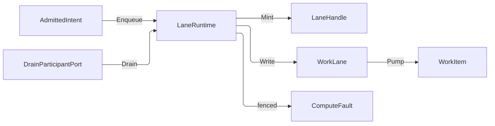
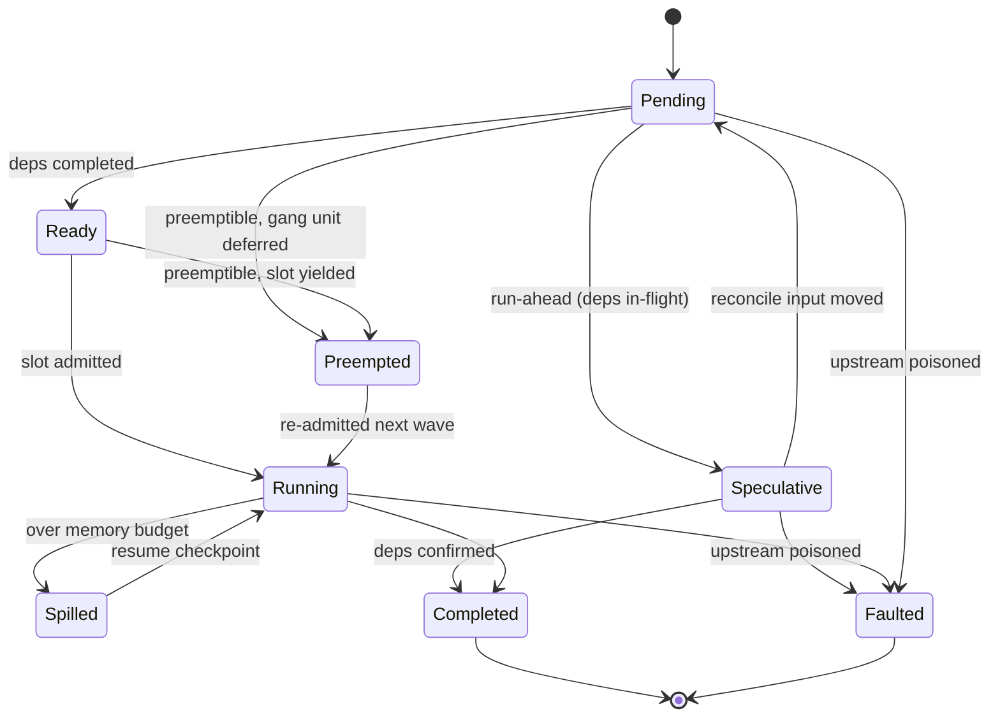

# [COMPUTE_RUNTIME]

Rasm.Compute schedules every admitted intent through bounded `WorkLane` channel rows behind one `LaneRuntime` enqueue capsule: lane choice is an intent field, full-mode and backpressure are row data, drops emit a correlated `Backpressure` receipt, queue depth reads `ChannelReader.Count`, and solve-path dispatch structurally returns a `LaneHandle` instead of executing work. One `JobGraph` dependency-DAG scheduler layers speculative, preemptible, fair-share, accelerator-affinity, and spill-to-store orchestration bounded by the shared `CpuBudget`, keys every node on its admitted-intent and input-content digest so a re-run reconciles semantic changes and recomputes only the moved subgraph, and rolls subscribed node cells into one live parent `ProgressCell`.

Clusters own the `WorkLane` axis, the work-item and handle shapes, the GH2 async-result ceiling, the `CpuBudget` record shared by lane, model, and tensor concurrency, and band-200 drain participation, composed over bounded System.Threading.Channels pipes, Thinktecture vocabulary, LanguageExt rails, NodaTime instants, and the AppHost drain, cancellation, clock, and schedule spine.

## [01]-[INDEX]

- [02]-[LANE_AXIS]: channel rows over one closed `LaneBound` family; parked, shedding, and ranked bounds as row data.
- [03]-[SOLVE_GUARD]: one enqueue capsule; solve threads receive handles, never execute work.
- [04]-[CPU_BUDGET]: one processor-budget record shared by lane, model, tensor, and optimizer concurrency; utilization-governed re-resolution at collection cadence.
- [05]-[JOB_GRAPH]: batch-wave dependency scheduler; speculative run-ahead, QoS-weighted fair-share and gang admission, per-wave accelerator claims, cooperative spill, content-key reactive reconcile, rolled-up live DAG progress aggregate, and the shard-partition fold placing a block-decomposed solve across the remote farm.
- [06]-[DRAIN_CANCEL]: band-200 drain participation; one linked cancellation chain with provenance.

## [02]-[LANE_AXIS]

- Owner: `LaneBound` the closed parked/shedding/ranked channel-bound family; `LaneProfile` the per-lane row carrying that bound beside the reader fan-out a `CpuBudget` affords; `LaneProfiles` the frozen `HashMap<WorkLane, LaneProfile>` keyed on the spine's lane roster with `Closed` its composition-time totality proof; `LaneHandle` readback handle; `WorkItem` channel element. `WorkLane` itself — identity, `Rank`, and the generated `Validate`/`TryGet` key seam — declares at `Rasm.AppHost` `Runtime/laneguard#LANE_GUARD` and reaches this owner through the package's legal upward reference to that spine, so the roster and its cross-lane precedence are app-platform dispatch vocabulary while only the columns this domain measures live here.
- Cases: one `LaneProfile` per spine lane row — interactive, ranked, background, bulk, benchmark, capture-ingest.
- Entry: `public static Fin<HashMap<WorkLane, LaneProfile>> LaneProfiles.Closed()` — the keyed fold over `WorkLane.Items` proving every declared lane carries a profile, and the value `LaneRuntime` takes; `public Channel<WorkItem> LaneProfile.Open(CpuBudget budget, Action<WorkItem> dropped)` — the ONE construction, a total `Switch` over the row's `LaneBound` building a parked, a shedding, or a rank-ordered channel; `Bounded`/`Prioritized` are its private per-arm projections. Capacity, drop policy, admission ceiling, comparer, reader fan-out, and continuation isolation are row data, never call-site arguments.
- Auto: cadence-driven work (compute-model-warmup, scheduled equivalence sweeps) enters as `ScheduleEntry` rows whose `Work` delegate enqueues onto its declared lane — the schedule port owns when, lanes own throughput; the shedding arm alone receives the drop sink so every drop lands as a `Backpressure` receipt carrying the dropped item's correlation, never a silent loss; the queue-depth slot reads `ChannelReader<WorkItem>.Count` on the lane's reader at stamp time, never a hand-tracked counter; a parked write times through `WaitToWriteAsync`, which returns when capacity frees, so the park is measured exactly and a lane deadline cancels the WAIT rather than aborting a write already in flight.
- Receipt: Backpressure — lane row, queue depth from `ChannelReader.Count`, wait elapsed measured across `WaitToWriteAsync` alone (timing `WriteAsync` conflates the park with the write and leaves cancellation no seam), or dropped-item correlation on a shedding lane — materialized at the sink edge on the package receipt union; a ranked row's ceiling refusal never reaches this receipt because it precedes execution, riding the typed `ComputeFault.LaneSaturated` onto `Refusal.Of` instead.
- Packages: BCL inbox, Thinktecture.Runtime.Extensions, LanguageExt.Core, NodaTime, Rasm.AppHost (project)
- Growth: a new lane is one row at the spine roster and one `LaneProfile` row here — the keyed fold refuses the composition until both land, which is exactly the loud break a silently-unsized lane would not give; a genuinely new bound mechanism is one `LaneBound` case with its `Open` arm, and every consumer breaks loudly at that `Switch`; zero new surface.
- Boundary: the `WorkLane` NAME is the spine's and `DrainQueue` stays its process-level altitude — one altitude per name, and this owner re-declaring the roster would close the S1-to-S3 cycle the branch acyclicity law forbids; the split is by what decides the column — the platform decides which lanes exist and how they rank against one another because it schedules the whole runtime spine across them, and this owner decides each lane's channel bound and reader budget because both are measured against the shared `CpuBudget` nothing above this stratum holds; lane choice is an intent field and the bound is row data, so a drop flag on another row is the deleted form; capture-ingest drops oldest because the latest geometry state wins, and its consumer is the DocumentService CaptureEvents client-stream; rank is the cross-lane precedence datum ordering drain steps and the intent's own `DeadlineAt` is the INTRA-lane one, read by the ranked arm's earliest-deadline-first comparer — per-item priority mutation after admission, a second lane minted to carry urgency, per-lane worker class hierarchies, and Dataflow lanes are the deleted patterns; the ranked arm is unbounded by construction so its `Ceiling` is where the writer refuses on the typed rail, and a shedding policy on that arm is unrepresentable because the case carries no slot for one; an external lane selector arriving as wire text admits through the spine roster's generated `WorkLane.Validate`/`TryGet` key seam, never a raw-string comparison against row keys.

```csharp signature
// `Bound` is ONE closed payload family, never three loose columns. A capacity, a full-mode, and an admission
// ceiling riding side by side let a row spell states the channel primitives refuse — a prioritized row still
// carrying a capacity (`BoundedChannelOptions` throws below one), a shedding full-mode on an unbounded row the
// primitive silently ignores, a ceiling on a bounded row nothing reads. Each case carries exactly the evidence
// its own construction arm consumes, so those states are unrepresentable rather than guarded.
[Union(ConversionFromValue = ConversionOperatorsGeneration.None)]
public abstract partial record LaneBound {
    private LaneBound() { }

    // Bounded and back-pressuring: a full lane PARKS the writer, the park is measured, and nothing is lost.
    public sealed record Parked(int Capacity) : LaneBound;

    // Bounded and receipted-loss: `Mode` is the drop policy and every drop lands a correlated `Backpressure`.
    // The drop callback runs SYNCHRONOUSLY on the writing thread and OUTSIDE the channel lock, and the channel
    // machinery itself allocates nothing per drop — so the receipt-envelope-only cost is reachable, and the whole
    // drop cost is whatever the callback body allocates. Two obligations follow and both bind the sink the
    // composition closes over: it stays allocation-lean because nothing else on the path allocates, and it stays
    // NON-BLOCKING because it stalls the PRODUCER — a sink that awaited a sink port, took a lock, or wrote a file
    // would hold the sensor thread mid-write, which is the one stall a shedding lane exists to prevent.
    public sealed record Shedding(int Capacity, BoundedChannelFullMode Mode) : LaneBound;

    // Unbounded prioritized: the primitive admits no capacity, so the CEILING is where the writer refuses on the
    // typed rail — which is why a shedding policy has no slot to occupy on this case.
    public sealed record Ranked(int Ceiling) : LaneBound;
}

// Compute's HALF of the lane axis. The spine roster decides WHICH lanes exist and how they rank against one
// another; this row decides what a lane's channel IS — the bound family the primitive admits and the reader
// fan-out the shared budget affords — because neither is a runtime-spine concern and both are measured here.
public sealed record LaneProfile(LaneBound Bound, Func<CpuBudget, int> Fanout) {
    // `Ranked` owns the ceiling as its own datum, so a bounded row answers absence rather than a zero a writer
    // reads as "no ceiling" — the one arm that refuses is the one arm that carries the number.
    public Option<int> Ceiling => Bound.Switch(
        state: unit,
        parked: static (_, _) => Option<int>.None,
        shedding: static (_, _) => Option<int>.None,
        ranked: static (_, row) => Some(row.Ceiling));

    public int Readers(CpuBudget budget) => Math.Min(Fanout(budget), budget.ReaderCeiling);

    // ONE construction over the bound family, taking the drop sink the shedding arm alone consumes. Cross-lane
    // precedence is the roster's `Rank` column at the spine; INTRA-lane order is this arm's: arrival order alone
    // drains a request due in a second behind a queue of requests due in a minute, so the prioritized arm
    // re-orders by the intent's OWN `DeadlineAt` — earliest-deadline-first, the evidence admission already
    // carries — and one lane serves both urgencies with no new column, no second lane, and no post-admission
    // mutation.
    public Channel<WorkItem> Open(CpuBudget budget, Action<WorkItem> dropped) =>
        Bound.Switch(
            state: (Profile: this, Budget: budget, Dropped: dropped),
            parked: static (s, row) => Channel.CreateBounded<WorkItem>(s.Profile.Bounded(row.Capacity, BoundedChannelFullMode.Wait, s.Budget)),
            shedding: static (s, row) => Channel.CreateBounded(s.Profile.Bounded(row.Capacity, row.Mode, s.Budget), s.Dropped),
            ranked: static (s, _) => Channel.CreateUnboundedPrioritized(s.Profile.Prioritized(s.Budget)));

    private BoundedChannelOptions Bounded(int capacity, BoundedChannelFullMode mode, CpuBudget budget) => new(capacity) {
        FullMode = mode,
        SingleReader = Readers(budget) is 1,
        SingleWriter = false,
        AllowSynchronousContinuations = false,
    };

    private UnboundedPrioritizedChannelOptions<WorkItem> Prioritized(CpuBudget budget) => new() {
        Comparer = Comparer<WorkItem>.Create(static (left, right) => left.Intent.DeadlineAt.CompareTo(right.Intent.DeadlineAt)),
        SingleReader = Readers(budget) is 1,
        SingleWriter = false,
        AllowSynchronousContinuations = false,
    };
}

// The keyed fold IS the seam proof. Rows key on the spine's `WorkLane` and `Closed` reads that roster's own
// generated `Items`, so a lane landing upstream with no profile here refuses BY NAME at composition — where a
// `HashMap` indexer would instead throw at the first enqueue onto a lane nobody sized, in whatever process
// first routed work to it. `LaneRuntime` takes the proven map rather than the roster, so no composition
// reaches a channel set this fold never admitted.
public static class LaneProfiles {
    private static readonly HashMap<WorkLane, LaneProfile> Rows = toHashMap(Seq(
        (WorkLane.Interactive, new LaneProfile(new LaneBound.Parked(16), static _ => 1)),
        (WorkLane.Ranked, new LaneProfile(new LaneBound.Ranked(256), static _ => 1)),
        (WorkLane.Background, new LaneProfile(new LaneBound.Parked(256), static budget => budget.ReaderCeiling)),
        (WorkLane.Bulk, new LaneProfile(new LaneBound.Shedding(1024, BoundedChannelFullMode.DropWrite), static _ => 1)),
        (WorkLane.Benchmark, new LaneProfile(new LaneBound.Parked(4), static _ => 1)),
        (WorkLane.CaptureIngest, new LaneProfile(new LaneBound.Shedding(256, BoundedChannelFullMode.DropOldest), static _ => 1))));

    public static Fin<HashMap<WorkLane, LaneProfile>> Closed() =>
        toSeq(WorkLane.Items).Filter(row => Rows.Find(row).IsNone) is { IsEmpty: false } absent
            ? Fin.Fail<HashMap<WorkLane, LaneProfile>>(new ComputeFault.LaneUnprofiled($"<lane-unprofiled:{absent.Count}>{string.Join(',', absent.Map(static row => row.Key))}"))
            : Fin.Succ(Rows);
}

public readonly record struct LaneHandle(CorrelationId Correlation, WorkLane Lane, CancelScope Cancel, Instant Enqueued);

public readonly record struct WorkItem(AdmittedIntent Intent, LaneHandle Handle);
```

## [03]-[SOLVE_GUARD]

- Owner: `LaneRuntime` — the one enqueue capsule over the bounded lane channels, the `LaneGate` admission-lifecycle family, and the pump readers; `LaneGate` is the closed open-versus-fenced `[Union]` whose `Fenced` case carries provenance and the fence instant, so a refused enqueue names which drain fenced it and a boolean lifecycle flag never arises.
- Entry: `public IO<LaneHandle> Enqueue(AdmittedIntent intent)` — `IO` carries the enqueue effect, awaits fullness on Wait rows, and aborts fenced admission with `ComputeFault.ShutdownDrained` carrying the gate's `Fenced` provenance; the gate read runs inside the effect, so an enqueue composed before the fence and run after it still refuses.
- Auto: composition proves the profile map through `LaneProfiles.Closed` before it constructs the runtime, then forks `LaneProfile.Readers`-many `Pump` effects per lane beneath the spine scope; dispatch from GH2 and UI threads structurally enqueues and returns the handle — synchronous model or remote execution on a solve path is unrepresentable by this seam, not by discipline.
- Receipt: wait evidence rides the pressure delegate only when the write parks; a synchronously completed write emits nothing, keeping the uncontended path allocation-free.
- Packages: BCL inbox, LanguageExt.Core, NodaTime, Rasm.AppHost (project)
- Growth: one lane row reuses the same enqueue, write, and pump members; zero new surface.
- Boundary: `LaneRuntime` is the named boundary capsule for the statement carve-out — channel construction, the parked-write window, and the pump loop carry language-owned statement forms; no blocking wait exists on the public surface and completion is observed only through progress states and receipts — handle to correlation to receipt join is the readback, and the GH2 async-result ceiling is the `Interactive` lane capacity of sixteen in-flight handles a GH2 `SolveInstance` readback never exceeds because the seventeenth `Enqueue` parks on the `Wait` full-mode rather than dropping a solve result; the dispatch delegate is total on the fault rail, so the pump never interprets failures.

```csharp signature
[Union(ConversionFromValue = ConversionOperatorsGeneration.None)]
public abstract partial record LaneGate {
    private LaneGate() { }
    public sealed record Open : LaneGate;
    public sealed record Fenced(string Provenance, Instant At) : LaneGate;
}

public sealed class LaneRuntime(
    IClock clock,
    TimeProvider time,
    CpuBudget budget,
    HashMap<WorkLane, LaneProfile> profiles,
    Func<WorkItem, IO<Unit>> dispatch,
    Action<WorkLane, WorkItem, Option<Duration>> pressure)
{
    private readonly Atom<LaneGate> gate = Atom<LaneGate>(new LaneGate.Open());

    // Every lane constructs through its OWN profile, so the bound family decides bounded-versus-prioritized
    // once and the drop sink reaches only the arm that can drop; a capsule re-deciding the construction here
    // strands whichever arm it forgets — a ranked row built as bounded throws on its zero capacity. The map
    // arrives already proven by `LaneProfiles.Closed`, so this fold cannot meet a lane it holds no row for and
    // no arm here re-reads the spine roster.
    private readonly HashMap<WorkLane, Channel<WorkItem>> channels = toHashMap(toSeq(profiles.AsIterable())
        .Map(row => (row.Key, row.Value.Open(budget, item => pressure(row.Key, item, None)))));

    // Execution-time gate reads reject an Enqueue effect composed before a later fence.
    public IO<LaneHandle> Enqueue(AdmittedIntent intent) =>
        from item in IO.lift(() => gate.Value.Switch(
                state: (Runtime: this, Work: intent),
                open: static (s, _) => Fin.Succ(s.Runtime.Mint(s.Work)),
                fenced: static (s, f) => Fin.Fail<WorkItem>(new ComputeFault.ShutdownDrained($"<drain-shed:{s.Work.Spec.Lane.Key}:{f.Provenance}>"))))
            .Bind(static admitted => admitted.Match(Succ: IO.pure, Fail: IO.fail<WorkItem>))
        from landed in Write(item)
        select item.Handle;

    public IO<Unit> Pump(WorkLane lane) =>
        IO.liftAsync(async env => {
            await foreach (WorkItem item in channels[lane].Reader.ReadAllAsync(env.Token).ConfigureAwait(false)) {
                await dispatch(item).RunAsync(env).ConfigureAwait(false);
            }
            return unit;
        });

    public int Depth(WorkLane lane) => channels[lane].Reader.Count;

    public Unit Fence(string provenance) =>
        ignore(gate.Swap(held => held is LaneGate.Open ? new LaneGate.Fenced(provenance, clock.GetCurrentInstant()) : held));

    public IO<Unit> Drain(WorkLane lane, CancellationToken token) =>
        from fenced in IO.lift(() => Fence($"{nameof(Drain)}/{lane.Key}"))
        from closed in IO.lift(() => channels[lane].Writer.TryComplete())
        from settled in IO.liftAsync(async _ => {
            await channels[lane].Reader.Completion.WaitAsync(token).ConfigureAwait(false);
            return unit;
        })
        select unit;

    private WorkItem Mint(AdmittedIntent intent) =>
        new(intent, new LaneHandle(
            intent.Correlation,
            intent.Spec.Lane,
            intent.Scope.Derive($"{intent.Spec.Lane.Key}/{intent.Correlation}", time),
            clock.GetCurrentInstant()));

    // Admission and park measurement are ONE seam. `TryWrite` takes the uncontended path with no allocation and
    // no receipt; a refusal parks on `WaitToWriteAsync`, which returns the instant capacity frees, so the elapsed
    // park is exactly the wait and the lane deadline cancels the WAIT rather than aborting a write already in
    // flight — the seam `WriteAsync` has no way to expose. A ranked row is unbounded, so nothing frees and nothing
    // parks; its `Ceiling` is the writer's refusal depth, read at this same seam so one member carries both bound
    // forms and no lane admits past its declared depth. A completed writer proves the drain fenced this lane
    // after the gate read, which is the one enqueue race the execution-time gate cannot close alone.
    private IO<Unit> Write(WorkItem item) =>
        IO.liftVAsync(async _ => {
            (WorkLane lane, Channel<WorkItem> channel) = (item.Handle.Lane, channels[item.Handle.Lane]);
            if (profiles[lane].Ceiling.Case is int ceiling && channel.Reader.Count >= ceiling) {
                return Fin.Fail<Unit>(new ComputeFault.LaneSaturated($"<lane-saturated:{lane.Key}:{ceiling}:{channel.Reader.Count}>"));
            }

            long mark = time.GetTimestamp();
            bool parked = false;
            while (!channel.Writer.TryWrite(item)) {
                parked = true;
                if (!await channel.Writer.WaitToWriteAsync(item.Handle.Cancel.Token).ConfigureAwait(false)) {
                    return Fin.Fail<Unit>(new ComputeFault.ShutdownDrained($"<drain-shed:{lane.Key}:writer-completed>"));
                }
            }

            if (parked) {
                pressure(lane, item, Some(time.GetElapsedTime(mark).ToDuration()));
            }

            return Fin.Succ(unit);
        }).Bind(static landed => landed.Match(Succ: IO.pure, Fail: IO.fail<Unit>));
}
```


```mermaid
---
config:
  layout: elk
  flowchart:
    curve: linear
    padding: 25
---
flowchart LR
    accTitle: Lane runtime enqueue, pump, and drain
    accDescr: Admitted intents enqueue onto the lane runtime, which mints a handle, pumps work items, and drains through the participant port.
    AdmittedIntent -->|Enqueue| LaneRuntime
    LaneRuntime -->|Mint| LaneHandle
    LaneRuntime -->|Write| WorkLane
    WorkLane -->|Pump| WorkItem
    LaneRuntime -->|fenced| ComputeFault
    DrainParticipantPort -->|Drain| LaneRuntime
```

## [04]-[CPU_BUDGET]

- Owner: `CpuBudget` — the one live resource-budget record lane, model, tensor, optimizer, and job runners read, including the pressure-derived memory scale; `UtilizationSample` — the typed process/container utilization snapshot the governor folds, and `UtilizationSeries` the literal instrument-name roster the composing listener subscribes on; `GovernorPolicy` — the shed/restore/spill threshold-and-hysteresis policy; `ResourceGovernor` — the utilization fold re-resolving the live budget at collection cadence, with only a landed transition carrying a `Governor` fact.
- Entry: `public static CpuBudget Resolve(int processors, int hostReserve, double memoryScale = 1d)` — pure clamp; every derived field is arithmetic over those inputs. `public Fin<(CpuBudget Budget, Option<ComputeReceipt.Governor> Fact)> ResourceGovernor.Steer(UtilizationSample sample, CorrelationId correlation)` — one sample advances the effective reserve and memory scale under policy hysteresis, re-resolves the record, and swaps the live cell; `Fact` is absent when neither posture changes. `JobGraph` reads `Current` at invocation, and the optimizer binds it at entry.
- Auto: the composition root resolves the posture record once from `Environment.ProcessorCount` and the posture row, then mints one `ResourceGovernor` over it; utilization samples arrive as typed `UtilizationSample` values the AppHost composition sources from the `Microsoft.Extensions.Diagnostics.ResourceMonitoring` observable instruments (one `MeterListener` on `UtilizationSeries.Meter` at collection cadence, subscribing the roster's literal names because the package's own `ResourceUtilizationInstruments` consts are `internal` — the `IResourceMonitor`/`ResourceUtilization` snapshot API is obsolete `EXTOBS0001` and never composed); lane readers clamp through `Readers`, the model lane sizes its one global ORT thread pool from `OrtIntraOp` and `OrtInterOp` with per-session threads disabled and binds `OrtThreadingOptions.GlobalSpinControl` from `SpinControl`, the tensor-lane `Partition` execution column reads `PartitionCap` for its `ParallelHelper.For` partition count behind a winning benchmark claim — this record owns the cap, Tensor/dispatch#KERNEL_DISPATCH owns the fan-out — and `Optimizer.Optimize` projects `Workers` into its executor policy at entry; spill scale admits only the strict reduction interval `(0, 1)`, memory spill enters at `SpillMemoryPercent`, holds through the hysteresis band, and restores only at `RestoreMemoryPercent`.
- Receipt: Governor — cpu and memory percentages, the re-resolved `Workers`/`ReaderCeiling`/`PartitionCap`, the effective memory scale, and the spill-pressure flag, process-scoped and emitted only when an adjustment or spill transition lands, so a steady host stays silent.
- Packages: BCL inbox, LanguageExt.Core, NodaTime, Rasm.AppHost (project)
- Growth: one posture row per new host-profile row, one policy value per new concurrency axis, and one `GovernorPolicy` column per new pressure axis; zero new surface — a second scheduler, a `LoadShedder` sibling, or a governor mutating lane rows directly is the rejected form because every consumer already reads the one budget record.
- Boundary: every concurrency axis derives from this record, but binding cadence stays honest: `JobGraph.Run` and `Optimizer.Optimize` read the governed value per invocation; `LaneRuntime`, the ORT global pool, and tensor partitions read it when their owning capsule constructs. AppHost rebuilds those capsules after a transition when live rebinding is required. Any `ParallelHelper.For` degree, a second `Partitioner`/`ParallelRunner` owner, or a `Parallel.For` partition sized off the host total rejects because `PartitionCap` owns tensor fan-out. Plugin rows reserve host cores for Rhino UI and solver threads; service rows own the machine. `ReaderCeiling` halves the worker pool because readers park on kernel and remote completions while the global pool carries arithmetic. `SpinControl` derives from `HostReserve`: co-tenanted hosts surrender ORT spin, while machine-owning service rows retain it. `processors` comes from the AppHost `PressurePolicy` container-limit grade when present, so one constraint re-caps every axis. Governance moves the effective reserve and memory scale — `Steer` widens reserve one `ReserveStep` at or above `ShedCpuPercent`, decays it toward the posture reserve at or below `RestoreCpuPercent`, and holds inside the CPU hysteresis band; memory enters spill posture at `SpillMemoryPercent`, holds that posture through the memory hysteresis band, and restores at or below `RestoreMemoryPercent`. `JobGraph` seals the scaled `MemoryBudgetBytes` onto each `JobRun`, so its runner receives the effective limit that triggers an earlier `JobSignal.Spilled`. Mid-wave budget stays stable; a running wave completes under its planned value, and the next invocation rebinds. `Total` is COMPOSITION-FROZEN — the governor moves the effective reserve and the memory scale and nothing else — because `Runtime/receipts#BENCHMARK_CLAIMS` `HostFingerprint.Effective` substitutes `Processors` with exactly this `Total`: a `Total` that moved mid-process would silently re-fingerprint the running host, and every claim measured under the prior figure would read stale against a machine that never changed.

```csharp signature
public sealed record CpuBudget {
    private CpuBudget(int total, int hostReserve, double memoryScale) {
        Total = total;
        HostReserve = hostReserve;
        MemoryScale = memoryScale;
    }

    public int Total { get; }

    public int HostReserve { get; }

    public double MemoryScale { get; }

    public int Workers => Math.Max(1, Total - HostReserve);

    public int OrtIntraOp => Workers;

    public int OrtInterOp => 1;

    public int ReaderCeiling => Math.Max(1, Workers / 2);

    public int PartitionCap => Workers;

    public bool SpinControl => HostReserve is 0;

    public long MemoryLimit(long admittedBytes) {
        if (admittedBytes <= 0L) { return 0L; }
        double scaled = Math.Floor(admittedBytes * MemoryScale);
        return scaled >= long.MaxValue ? long.MaxValue : Math.Max(1L, (long)scaled);
    }

    public static CpuBudget Resolve(int processors, int hostReserve, double memoryScale = 1d) {
        int total = Math.Max(1, processors);
        double scale = double.IsFinite(memoryScale) ? Math.Clamp(memoryScale, double.Epsilon, 1d) : 1d;
        return new(total, Math.Clamp(hostReserve, 0, total - 1), scale);
    }
}

// Source names the AppHost listener subscribes on. `ResourceUtilizationInstruments` is `internal static` in the
// package, so its consts are unreachable from a consuming assembly and every name is spelled as a literal here.
// This roster IS the seam contract, so an upstream rename lands as a listener miss reporting a healthy zero
// rather than a compile break. `ProcessMemory` carries the DOTTED wire name, not the const's own `ProcessMemoryUtilization`
// identifier: reading the identifier as the series name subscribes to a stream nothing publishes. Instruments
// are `ObservableGauge<double>` over `[0, 1]`, so the listener scales into the record's percent scale.
public static class UtilizationSeries {
    public const string Meter = "Microsoft.Extensions.Diagnostics.ResourceMonitoring";
    public const string ProcessCpu = "process.cpu.utilization";
    public const string ProcessMemory = "dotnet.process.memory.virtual.utilization";
    public const string ContainerCpuLimit = "container.cpu.limit.utilization";
    public const string ContainerCpuRequest = "container.cpu.request.utilization";
    public const string ContainerMemoryLimit = "container.memory.limit.utilization";
    public const string ContainerMemoryRequest = "container.memory.request.utilization";
    // `ObservableUpDownCounter<long>` in bytes — the one absolute magnitude beside the four ratios, so the
    // sample carries the byte figure a spill decision needs without re-deriving it from a limit ratio.
    public const string ContainerMemoryBytes = "container.memory.usage";
}

public readonly record struct UtilizationSample(double CpuPercent, double MemoryPercent, ulong MemoryBytes, Instant At) {
    public bool Invalid =>
        !double.IsFinite(CpuPercent) || CpuPercent is < 0d or > 100d
        || !double.IsFinite(MemoryPercent) || MemoryPercent is < 0d or > 100d;
}

public sealed record GovernorPolicy(double ShedCpuPercent, double RestoreCpuPercent, double SpillMemoryPercent, double RestoreMemoryPercent, double SpillMemoryScale, int ReserveStep) {
    public static readonly GovernorPolicy Canonical = new(ShedCpuPercent: 85d, RestoreCpuPercent: 55d, SpillMemoryPercent: 80d, RestoreMemoryPercent: 65d, SpillMemoryScale: 0.5d, ReserveStep: 1);

    public bool Invalid =>
        !double.IsFinite(ShedCpuPercent) || !double.IsFinite(RestoreCpuPercent)
        || !double.IsFinite(SpillMemoryPercent) || !double.IsFinite(RestoreMemoryPercent)
        || RestoreCpuPercent >= ShedCpuPercent || ShedCpuPercent > 100d || RestoreCpuPercent < 0d
        || RestoreMemoryPercent < 0d || RestoreMemoryPercent >= SpillMemoryPercent || SpillMemoryPercent > 100d
        || !double.IsFinite(SpillMemoryScale) || SpillMemoryScale is <= 0d or >= 1d
        || ReserveStep < 1;
}

// Utilization fold: adjustment moves the effective reserve and memory scale, so every governed limit re-derives
// through Resolve; the posture reserve is the decay floor and Total - 1 the widening ceiling.
public sealed class ResourceGovernor(CpuBudget posture, GovernorPolicy policy) {
    private readonly record struct GovernorState(CpuBudget Budget, bool Changed);

    private readonly Atom<GovernorState> live = Atom(new GovernorState(posture, Changed: false));

    public CpuBudget Current => live.Value.Budget;

    public bool SpillPressure => live.Value.Budget.MemoryScale < 1d;

    public Fin<(CpuBudget Budget, Option<ComputeReceipt.Governor> Fact)> Steer(UtilizationSample sample, CorrelationId correlation) {
        if (sample.Invalid || policy.Invalid) { return Fin.Fail<(CpuBudget, Option<ComputeReceipt.Governor>)>(ComputeFault.Create("<governor-invalid-input>")); }
        GovernorState next = live.Swap(held => {
            int reserve = sample.CpuPercent >= policy.ShedCpuPercent
                ? Math.Min(held.Budget.HostReserve + policy.ReserveStep, held.Budget.Total - 1)
                : sample.CpuPercent <= policy.RestoreCpuPercent
                    ? Math.Max(held.Budget.HostReserve - policy.ReserveStep, posture.HostReserve)
                    : held.Budget.HostReserve;
            double memoryScale = held.Budget.MemoryScale < 1d
                ? sample.MemoryPercent <= policy.RestoreMemoryPercent ? 1d : policy.SpillMemoryScale
                : sample.MemoryPercent >= policy.SpillMemoryPercent ? policy.SpillMemoryScale : 1d;
            CpuBudget budget = CpuBudget.Resolve(held.Budget.Total, reserve, memoryScale);
            return new GovernorState(
                budget,
                budget.HostReserve != held.Budget.HostReserve || budget.MemoryScale != held.Budget.MemoryScale);
        });
        return Fin.Succ((next.Budget, next.Changed
            ? Some(new ComputeReceipt.Governor(
                sample.CpuPercent, sample.MemoryPercent, next.Budget.Workers, next.Budget.ReaderCeiling, next.Budget.PartitionCap,
                next.Budget.MemoryScale, next.Budget.MemoryScale < 1d) {
                    Scope = new ReceiptScope.Process(correlation, AllocationClass.SpanStack),
                })
            : None));
    }
}
```

Each posture row supplies `hostReserve` per host-profile row at composition:

| [INDEX] | [PROFILE_ROW]      | [HOST_RESERVE] |
| :-----: | :----------------- | :------------: |
|  [01]   | rhino-plugin       |       2        |
|  [02]   | gh2-plugin         |       2        |
|  [03]   | standalone-desktop |       1        |
|  [04]   | companion          |       1        |
|  [05]   | sidecar            |       1        |
|  [06]   | headless-service   |       0        |
|  [07]   | web-service        |       0        |
|  [08]   | test-host          |       0        |

## [05]-[JOB_GRAPH]

- Owner: `JobNode` the dependency-graph node keyed on its input content seed; `JobState` `[SmartEnum<string>]` the node-lifecycle rows with `Terminal`, `Resumable`, and `Phase` (the `Runtime/progress#PROGRESS_CELL` `ProgressPhase` projection) columns; `JobSignal` `[Union]` the per-node execution outcome the runner returns; `CheckpointPort` the spill-to-store persist/resume pair over the Persistence blob lane; `JobLedger` the orchestration result; `JobGraph` the batch-wave dependency scheduler driving speculative run-ahead, QoS-weighted fair-share and gang admission, accelerator-affinity ordering, and cooperative memory-spill bounded by the shared `CpuBudget`, executing each node through the injected `runner`, keying every node on the suite `XxHash128` input digest so a re-run recomputes only the moved subgraph, and folding one coarse per-node `ProgressCell` through `ProgressCell.Aggregate` into one rolled parent cell so the whole DAG surfaces a single live monotonic `ProgressMark`; `ShardFanout`/`ShardJob` the composition's shard-policy row and its placed-node pairing, and `ShardPartition` the fold turning a block-decomposed solve into per-shard nodes plus the one merge node they feed.
- Cases: `JobState` rows pending · ready · running · speculative · preempted · spilled · completed · faulted; `JobSignal` cases completed · faulted · spilled.
- Entry: `public (Option<ProgressCell> Progress, IO<Fin<JobLedger>> Ledger) Run(Seq<JobNode> nodes, CpuBudget budget, CorrelationId correlation, CancelScope scope, IClock clock, TimeProvider time)` — `Progress` is absent when no admitted node requested observation, while `Ledger` carries graph admission and execution; `GraphRejected`, `GraphCyclic`, and `GraphStalled` abort on the typed rail, and `Reconcile` mirrors the pair shape. `public static Fin<(Seq<ShardJob> Shards, JobNode Merge)> ShardPartition.Partition(AdmittedIntent intent, ShardPlan.Blocked plan, int rows, Seq<ComputeEndpoint> farm, FrozenDictionary<Uri, double> loads, NodeSelection placement, ShardFanout fanout, Func<int, int, ReadOnlyMemory<byte>> block)` derives the shard node set and its merge node from the plan's own block structure, ranking each shard's hop through `NodeSelection.Select`.
- Auto: `Run` admits graph invariants before execution, then `Fill` repeatedly chooses the highest-ranked eligible gang unit against the evolving wave state, so launching an upstream node makes its speculative descendants eligible in the same wave; each unit admits all-or-none under the global and tenant shares, and an empty launch frontier with nonterminal nodes faults `GraphStalled` instead of recurring. Admission CONTRACTS each strong component into one gang over the acyclic quotient, so a mutually-dependent region schedules as a unit and only a mixed-tenant cycle — which cannot gang — survives as `GraphCyclic`; the acyclicity read and the source-degree order run over the one directed view rather than a hand-carried in-degree map. Wave admission holds a per-wave accelerator CLAIM set: admitting a unit claims every `AcceleratorAffinity` token its nodes name, and a later unit naming a held token defers WHOLE to the next wave while free slots remain, so co-launching two nodes onto one device is unrepresentable rather than merely unranked — a rank ordering alone only seats contenders adjacent and lets the slot budget launch them together; a token-free node claims nothing and is unrestricted, and `affinityRank` orders the units, resolving each key against the composition-owned device roster instead of treating every present key alike. Each launch carries its computed `NodeKey`; resume accepts only a checkpoint with the same node id and content key, and a runner-emitted mismatched checkpoint becomes `CheckpointRejected` before persistence. Each wave projects `JobState.Phase` onto subscribed cells, forks admitted runners, advances reports, and poisons fault cones. `ShardPartition.Partition` reads the `Tensor/factor#KERNEL_LOWERING` `ShardPlan.Blocked` `Tile` height as the block structure, mints one node per row block carrying that block's bytes, ranks each onto a farm hop through `NodeSelection.Select` with the shard ORDINAL as the rotation so the round-robin, load, and warm tiers all answer one call, and seats the resolved hop as the node's own affinity token; the merge node depends on every shard id, so the fault cone, the reconcile re-key, and the parent intent's `DeadlineAt` reach it with no rule of its own.
- Receipt: shard evidence is the sibling's — `Runtime/receipts#RECEIPT_UNION` `Solve`/`Factorization` already carry `Shards`, `ShardNode`, and `Merged`, so a partitioned solve is auditable through the receipt each sub-solve already emits and this fold declares no evidence column. The graph itself emits no `ComputeReceipt` case of its own — each node's execution rides its lane's existing receipts (`Backpressure` and the substrate-lane facts the runner emits), and the `JobLedger` carries the graph-level fact: node count, the completed/faulted split, and the speculated/preempted/spilled tally with its measured checkpoint mass and elapsed; a `Sweep`/`JobReceipt` case on the per-execution receipt union — whose required `(Lane, Substrate)` spine no whole graph carries — is the rejected form, and the live DAG progress rides the rolled-up parent `ProgressCell` (a monotonic `ProgressMark`, not a receipt fact) orthogonal to the post-hoc `JobLedger` count.
- Packages: QuikGraph (`AdjacencyGraph` over `SEdge<string>`, `IsDirectedAcyclicGraph`/`SourceFirstTopologicalSort` ordering, `StronglyConnectedComponents` labelling), BCL inbox, System.IO.Hashing, LanguageExt.Core, NodaTime, Rasm.AppHost (project), Rasm.Persistence (project)
- Growth: a new node lifecycle is one `JobState` row carrying its `Phase` column; a new scheduling policy is one column on `JobNode` the planning fold reads; the reactive recompute is the one `Reconcile` content-key diff over the existing edges; the transitive downstream closure is one `Closure` fixpoint shared by `MarkDirty` and `Poison`; a new device-contention axis is one more token an `AcceleratorAffinity` value spells, absorbed by the same wave claim set, never a second scheduler pass; a new shard-placement tier is one `Runtime/transport#TRANSPORT_AXIS` `NodeSelection` row the partition fold already calls, never a second ranking fold here; zero new surface — a `JobScheduler`/`WorkflowEngine`/`DagRunner`/`IncrementalEngine` sibling surface is the rejected form collapsed onto the one `JobGraph` over the shared `CpuBudget` and the injected runner.
- Boundary: the job graph forks each node's injected `runner` and owns only dependency order; a node never also enters `LaneRuntime`. Graph admission rejects empty graphs, duplicate ids, missing or self dependencies, and mixed-tenant gangs before a runner executes, and contracts every remaining cycle rather than refusing it — a hand-carried Kahn queue or a hand-rolled strong-component walk beside the admitted graph algebra is the named reimplementation defect, and the pattern-graph decomposition of a sparse operator stays on the CSparse `SymbolicColumnStorage` rail, never round-tripped through a vertex-and-edge container. Fair-share reads the per-tenant `QosWeight` slice of `CpuBudget.Workers`; a gang admits as one unit, and a unit larger than every available slice faults through `GraphStalled`. Accelerator exclusivity is per WAVE and never per graph: the claim set is the wave's own accumulator and dies with it, so two nodes contending for one device cost two waves rather than a standing serialization, and a graph naming no token plans exactly as it did before the claim existed. `Preempted` means a preemptible node yielded before launch, while `Spilled` means its runner returned a content-keyed checkpoint; resume never accepts a checkpoint from another semantic node revision, and a deferred wave never demotes a resumable state — a spilled node's checkpoint survives deferral because `Spilled`/`Preempted` hold until launch. `NodeKey` hashes `AdmittedIntent.Digest`, input bytes, and ordered upstream keys, so changing the operation with identical bytes dirties the cone. `MarkDirty` intersects change ids with the live graph before closure, preventing a removed id from reappearing in state. `IClock` supplies semantic instants and `TimeProvider` supplies elapsed measurement; App-owned `ClockPolicy` stays at composition. A shard partition owns NO block arithmetic — `Tensor/factor#KERNEL_LOWERING` `ShardPlan.Blocked` owns the row-block structure and this fold reads its `Tile`, because a second block arithmetic here forks the row bounds a sub-solve dials against the ones the merge joins; a farm hop is an exclusive execution resource exactly as a device is, so placement seats the resolved endpoint on the node's own `AcceleratorAffinity` token and the wave claim set already forecloses two shards co-launching onto one node, a second placement-exclusion rule beside it the deleted form; `JobGraph` takes ONE runner, so the endpoint travels beside its node on `ShardJob` and the composition closes that runner over the pairing rather than this owner growing a per-node dispatch column.

```csharp signature
[SmartEnum<string>]
[KeyMemberEqualityComparer<ComparerAccessors.StringOrdinal, string>]
[KeyMemberComparer<ComparerAccessors.StringOrdinal, string>]
public sealed partial class JobState {
    public static readonly JobState Pending = new("pending", terminal: false, resumable: false, phase: ProgressPhase.Queued);
    public static readonly JobState Ready = new("ready", terminal: false, resumable: false, phase: ProgressPhase.Selected);
    public static readonly JobState Running = new("running", terminal: false, resumable: false, phase: ProgressPhase.Running);
    public static readonly JobState Speculative = new("speculative", terminal: false, resumable: false, phase: ProgressPhase.Running);
    public static readonly JobState Preempted = new("preempted", terminal: false, resumable: true, phase: ProgressPhase.Selected);
    public static readonly JobState Spilled = new("spilled", terminal: false, resumable: true, phase: ProgressPhase.Running);
    public static readonly JobState Completed = new("completed", terminal: true, resumable: false, phase: ProgressPhase.Completed);
    public static readonly JobState Faulted = new("faulted", terminal: true, resumable: false, phase: ProgressPhase.Faulted);

    public bool Terminal { get; }

    public bool Resumable { get; }

    // Each lifecycle row projects onto the shared progress algebra.
    public ProgressPhase Phase { get; }
}

[Union]
public abstract partial record JobSignal {
    public sealed record Completed(ReadOnlyMemory<byte> Result) : JobSignal;
    public sealed record Faulted(Error Reason) : JobSignal;
    public sealed record Spilled(JobCheckpoint Checkpoint) : JobSignal;
}

// Checkpoint SIZE is measured evidence, never a policy constant: no budget row declares how many bytes a spill
// costs, the runner decides at its own yield point, and `Bytes` reads the state it actually produced — a stored
// column beside `State` is the one form that can contradict the payload a resume reloads.
public sealed record JobCheckpoint(string NodeId, UInt128 ContentKey, ReadOnlyMemory<byte> State, Instant At) {
    public long Bytes => State.Length;
}

public sealed record CheckpointPort(
    Func<JobCheckpoint, IO<Unit>> Persist,
    Func<string, UInt128, IO<Option<JobCheckpoint>>> Resume);

public readonly record struct JobReport(string NodeId, JobSignal Signal);

public readonly record struct JobRun(JobNode Node, Option<JobCheckpoint> Resume, long MemoryBudgetBytes);

// `SpilledBytes` is the wave-summed measured checkpoint mass — what a full resume of this graph would reload,
// accumulated from the checkpoints the runners actually produced rather than projected from a budget column.
public readonly record struct JobTally(int Speculated, int Preempted, int Spilled, long SpilledBytes);

public readonly record struct JobLedger(HashMap<string, JobState> States, int Nodes, int Completed, int Faulted, JobTally Tally, Duration Elapsed);

public sealed record JobNode(
    string Id,
    AdmittedIntent Intent,
    Seq<string> DependsOn,
    TenantId Tenant,
    bool Speculative,
    bool Preemptible,
    int FairShareWeight,
    Option<string> AcceleratorAffinity,
    long MemoryBudgetBytes,
    ReadOnlyMemory<byte> InputBytes,
    int QosWeight = 1,
    Option<string> Gang = default) {
    public bool Ready(HashMap<string, JobState> states) =>
        DependsOn.ForAll(dep => states.Find(dep).Map(static state => state == JobState.Completed).IfNone(false));

    public bool Speculable(HashMap<string, JobState> states) =>
        Speculative && !Ready(states)
        && DependsOn.ForAll(dep => states.Find(dep).Map(static state =>
            state == JobState.Completed || state == JobState.Running || state == JobState.Speculative).IfNone(false));

    // Semantic intent, local input, and ordered ancestry share one canonical incremental hash state.
    public UInt128 NodeKey(HashMap<string, UInt128> upstreamKeys) {
        XxHash128 identity = new();
        byte[] word = GC.AllocateUninitializedArray<byte>(16);
        BinaryPrimitives.WriteUInt128LittleEndian(word, Intent.Digest);
        identity.Append(word);
        identity.Append(InputBytes.Span);
        (XxHash128 Hash, byte[] Word, HashMap<string, UInt128> Keys) seeded = (identity, word, upstreamKeys);
        return toSeq(DependsOn.OrderBy(static id => id, StringComparer.Ordinal))
            .Fold(seeded, static (state, dependency) => {
                BinaryPrimitives.WriteUInt128LittleEndian(state.Word, state.Keys.Find(dependency).IfNone(UInt128.Zero));
                state.Hash.Append(state.Word);
                return state;
            }).Hash.GetCurrentHashAsUInt128();
    }
}

public sealed class JobGraph(
    Func<JobRun, IO<JobSignal>> runner,
    CheckpointPort checkpoints,
    Func<Option<string>, int> affinityRank) {
    private readonly record struct JobLaunch(JobNode Node, UInt128 Key, bool Resume);

    // ONE wave value: the fill fold's own accumulator IS the planned wave, so the launch set, the remaining global
    // and per-tenant slots, and the accelerator tokens already claimed all read off one shape. `Claims` lives here
    // rather than beside the graph because exclusivity is the WAVE's property — it dies when the wave settles.
    private readonly record struct JobWave(
        HashMap<string, JobState> States,
        Seq<JobLaunch> Launches,
        int Global,
        HashMap<TenantId, int> Tenant,
        LanguageExt.HashSet<string> Claims,
        int Speculated,
        int Preempted);

    public (Option<ProgressCell> Progress, IO<Fin<JobLedger>> Ledger) Run(Seq<JobNode> nodes, CpuBudget budget, CorrelationId correlation, CancelScope scope, IClock clock, TimeProvider time) {
        HashMap<string, ProgressCell> cells = Cells(nodes, clock);
        Option<(ProgressCell Cell, PhaseSubscription Wiring)> aggregate = ProgressCell.Aggregate(correlation, scope, clock, toSeq(cells.Values), SubscriptionPolicy.Wire);
        IO<Fin<JobLedger>> ledger = AdmitGraph(nodes).Match(
                Succ: graph => Drive(graph, budget, time, cells, time.GetTimestamp(), Seed(graph), Keys(graph), default),
                Fail: fault => IO.pure(Fin.Fail<JobLedger>(fault)));
        return (aggregate.Map(static rolled => rolled.Cell), Wired(aggregate.Map(static rolled => rolled.Wiring), ledger));
    }

    public (Option<ProgressCell> Progress, IO<Fin<JobLedger>> Ledger) Reconcile(Seq<JobNode> nodes, HashMap<string, UInt128> prior, HashMap<string, JobState> priorStates, CpuBudget budget, CorrelationId correlation, CancelScope scope, IClock clock, TimeProvider time) {
        HashMap<string, ProgressCell> cells = Cells(nodes, clock);
        Option<(ProgressCell Cell, PhaseSubscription Wiring)> aggregate = ProgressCell.Aggregate(correlation, scope, clock, toSeq(cells.Values), SubscriptionPolicy.Wire);
        IO<Fin<JobLedger>> ledger = AdmitGraph(nodes).Match(
                Succ: graph => Reconciled(graph, prior, priorStates, budget, time, cells),
                Fail: fault => IO.pure(Fin.Fail<JobLedger>(fault)));
        return (aggregate.Map(static rolled => rolled.Cell), Wired(aggregate.Map(static rolled => rolled.Wiring), ledger));
    }

    private static IO<A> Wired<A>(Option<PhaseSubscription> wiring, IO<A> effect) =>
        wiring.Match(
            Some: subscription => IO.pure(subscription).Bracket(Use: _ => effect, Fin: static held => IO.lift(fun(held.Dispose))),
            None: () => effect);

    private static HashMap<string, JobState> Seed(Seq<JobNode> nodes) =>
        nodes.Fold(HashMap<string, JobState>(), static (acc, node) => acc.Add(node.Id, JobState.Pending));

    // Intent admission decides whether a node owns an observable cell.
    private static HashMap<string, ProgressCell> Cells(Seq<JobNode> nodes, IClock clock) =>
        nodes.Fold(HashMap<string, ProgressCell>(), (acc, node) =>
            ProgressCell.Mint(node.Intent, clock).Match(Some: cell => acc.SetItem(node.Id, cell), None: () => acc));

    private IO<Fin<JobLedger>> Reconciled(
        Seq<JobNode> nodes,
        HashMap<string, UInt128> prior,
        HashMap<string, JobState> priorStates,
        CpuBudget budget,
        TimeProvider time,
        HashMap<string, ProgressCell> cells) {
        HashMap<string, UInt128> current = Keys(nodes);
        Seq<string> moved = toSeq(current.Filter((id, key) => prior.Find(id).Map(was => was != key).IfNone(true)).Keys);
        return Drive(nodes, budget, time, cells, time.GetTimestamp(), MarkDirty(nodes, priorStates, moved), current, default);
    }

    // Cell rank guards make every wave projection monotonic.
    private static Unit Mark(Seq<JobNode> nodes, HashMap<string, ProgressCell> cells, HashMap<string, JobState> states) {
        nodes.Iter(node => cells.Find(node.Id).Iter(cell => states.Find(node.Id).Iter(state => ignore(cell.Advance(state.Phase)))));
        return unit;
    }

    private IO<Fin<JobLedger>> Drive(Seq<JobNode> nodes, CpuBudget budget, TimeProvider time, HashMap<string, ProgressCell> cells, long started, HashMap<string, JobState> states, HashMap<string, UInt128> keys, JobTally tally) =>
        from marked in IO.lift(() => Mark(nodes, cells, states))
        from settled in states.Values.ForAll(static state => state.Terminal)
            ? IO.pure(Fin.Succ(Settle(nodes, states, tally, time.GetElapsedTime(started).ToDuration())))
            : Continue(nodes, budget, time, cells, started, states, keys, tally)
        select settled;

    private IO<Fin<JobLedger>> Continue(Seq<JobNode> nodes, CpuBudget budget, TimeProvider time, HashMap<string, ProgressCell> cells, long started, HashMap<string, JobState> states, HashMap<string, UInt128> keys, JobTally tally) {
        JobWave wave = Plan(nodes, states, budget, keys);
        return wave.Launches.IsEmpty
            ? IO.pure(Fin.Fail<JobLedger>(Stalled(states)))
            : from reports in Execute(wave.Launches, budget)
              from done in Drive(
                  nodes,
                  budget,
                  time,
                  cells,
                  started,
                  Poison(nodes, Advance(wave.States, reports)),
                  keys,
                  new JobTally(
                      tally.Speculated + wave.Speculated,
                      tally.Preempted + wave.Preempted,
                      tally.Spilled + reports.Filter(static report => report.Signal is JobSignal.Spilled).Count,
                      reports.Fold(tally.SpilledBytes, static (bytes, report) =>
                          report.Signal is JobSignal.Spilled spilled ? bytes + spilled.Checkpoint.Bytes : bytes)))
              select done;
    }

    // Tenant shares derive from QoS weight; Fill observes each preceding launch AND its device claim while choosing
    // the next unit. `affinityRank` orders the units against the composition's device roster, and the claim set —
    // not the ordering — is what makes co-launch onto one device unrepresentable.
    private JobWave Plan(Seq<JobNode> nodes, HashMap<string, JobState> states, CpuBudget budget, HashMap<string, UInt128> keys) {
        Seq<JobNode> active = nodes.Filter(node => states.Find(node.Id).Map(static state => !state.Terminal).IfNone(false));
        HashMap<TenantId, int> weights = active.Fold(HashMap<TenantId, int>(), static (acc, node) =>
            acc.AddOrUpdate(node.Tenant, held => Math.Max(held, Math.Max(1, node.QosWeight)), Math.Max(1, node.QosWeight)));
        int mass = Math.Max(1, toSeq(weights.Values).Fold(0, static (total, weight) => total + weight));
        HashMap<TenantId, int> shares = weights.Map(weight => Math.Max(1, (budget.Workers * weight) / mass));
        Seq<Seq<JobNode>> units = Units(toSeq(active
            .OrderBy(node => affinityRank(node.AcceleratorAffinity))
            .ThenByDescending(static node => node.FairShareWeight)));
        return Fill(
            units,
            new JobWave(states, Seq<JobLaunch>(), budget.Workers, HashMap<TenantId, int>(), LanguageExt.HashSet<string>.Empty, 0, 0),
            states,
            shares,
            keys);
    }

    private static Seq<Seq<JobNode>> Units(Seq<JobNode> active) =>
        toSeq(active.GroupBy(static node => (Grouped: node.Gang.IsSome, Key: node.Gang.IfNone(node.Id)))).Map(static unit => toSeq(unit));

    private static JobWave Fill(
        Seq<Seq<JobNode>> remaining,
        JobWave acc,
        HashMap<string, JobState> initial,
        HashMap<TenantId, int> shares,
        HashMap<string, UInt128> keys) =>
        remaining.Filter(unit => unit.ForAll(node => Eligible(node, acc.States))).Head.Match(
            Some: unit => Fill(
                remaining.Filter(candidate => UnitKey(candidate) != UnitKey(unit)),
                Admit(acc, unit, initial, shares, keys),
                initial,
                shares,
                keys),
            None: () => acc);

    private static (bool Grouped, string Key) UnitKey(Seq<JobNode> unit) =>
        (unit[0].Gang.IsSome, unit[0].Gang.IfNone(unit[0].Id));

    // Three gates decide one unit, all-or-none: a global slot per member, the tenant's own share, and the device
    // claim. Admitting the unit CLAIMS every token it names for the rest of the wave, so the next unit naming a held
    // token defers with slots still free — which is exactly the launch a sort key could never prevent.
    private static JobWave Admit(JobWave acc, Seq<JobNode> unit, HashMap<string, JobState> initial, HashMap<TenantId, int> shares, HashMap<string, UInt128> keys) {
        JobNode lead = unit[0];
        int share = shares.Find(lead.Tenant).IfNone(1);
        return acc.Global >= unit.Count && (acc.Tenant.Find(lead.Tenant).IfNone(0) + unit.Count) <= share && Free(unit, acc.Claims)
            ? unit.Fold(acc with { Claims = acc.Claims.AddRange(Tokens(unit)) }, (run, node) => Launch(run, node, initial, keys[node.Id]))
            : unit.Fold(acc, static (run, node) => run.States.Find(node.Id).Map(static held => held.Resumable).IfNone(false)
                ? run
                : node.Preemptible
                    ? run with { States = run.States.SetItem(node.Id, JobState.Preempted), Preempted = run.Preempted + 1 }
                    : run with { States = run.States.SetItem(node.Id, JobState.Ready) });
    }

    // A gang is ONE launch decision, so its whole token set clears or the unit defers whole — a gang admitted
    // half onto a free device and deferred for the rest deadlocks on its own contracted cycle. Members naming the
    // SAME token co-reside by construction: they are one mutually-dependent region, not two contenders.
    private static bool Free(Seq<JobNode> unit, LanguageExt.HashSet<string> claims) =>
        Tokens(unit).ForAll(token => !claims.Contains(token));

    // A token-free node claims nothing, so `Choose` is the whole restriction: an unaffined node never competes.
    private static Seq<string> Tokens(Seq<JobNode> unit) =>
        unit.Choose(static node => node.AcceleratorAffinity);

    private static JobWave Launch(JobWave acc, JobNode node, HashMap<string, JobState> initial, UInt128 key) {
        bool speculative = initial.Find(node.Id).Map(static state => state == JobState.Pending).IfNone(false) && node.Speculable(acc.States);
        bool resume = initial.Find(node.Id).Map(static state => state == JobState.Spilled).IfNone(false);
        return acc with {
            States = acc.States.SetItem(node.Id, speculative ? JobState.Speculative : JobState.Running),
            Launches = acc.Launches.Add(new JobLaunch(node, key, resume)),
            Global = acc.Global - 1,
            Tenant = acc.Tenant.AddOrUpdate(node.Tenant, static c => c + 1, 1),
            Speculated = acc.Speculated + (speculative ? 1 : 0),
        };
    }

    private static bool Eligible(JobNode node, HashMap<string, JobState> states) =>
        states.Find(node.Id).Map(state =>
            ((state == JobState.Pending || state == JobState.Ready) && node.Ready(states))
            || (state == JobState.Pending && node.Speculable(states))
            || state.Resumable).IfNone(false);

    // `Fork` spins a DEDICATED long-running thread per forked effect rather than queueing onto the ambient
    // scheduler, so the forked WIDTH is the process's job-thread count and not a work-queue depth: an unbounded
    // fan-out is unbounded THREADS, and no ambient degree-of-parallelism clamps it back. The ceiling therefore
    // binds where the resource is spent — this fold forks at most `CpuBudget.Workers` launches, awaits that slice
    // whole, and continues, so a wave admitted under a widened share can never multiply threads behind the
    // budget's back. Overlap inside a slice is real and is the whole point: every fork runs before the first
    // await returns, which is exactly what a serial await chain over the same launches loses.
    private IO<Seq<JobReport>> Execute(Seq<JobLaunch> launches, CpuBudget budget) =>
        toSeq(launches.Chunk(Math.Max(1, budget.Workers)))
            .Map(toSeq)
            .TraverseM(slice => Slice(slice, budget)).As()
            .Map(static slices => slices.Bind(static reports => reports));

    private IO<Seq<JobReport>> Slice(Seq<JobLaunch> launches, CpuBudget budget) =>
        from forks in launches.TraverseM(launch =>
            from resume in launch.Resume
                ? checkpoints.Resume(launch.Node.Id, launch.Key).Map(checkpoint => checkpoint.Filter(row => row.NodeId == launch.Node.Id && row.ContentKey == launch.Key))
                : IO.pure(Option<JobCheckpoint>.None)
            from fork in (launch.Resume && resume.IsNone
                ? IO.pure(new JobReport(launch.Node.Id, new JobSignal.Faulted(new ComputeFault.CheckpointRejected($"<checkpoint-rejected:{launch.Node.Id}:{launch.Key:x32}>"))))
                : runner(new JobRun(launch.Node, resume, budget.MemoryLimit(launch.Node.MemoryBudgetBytes)))
                    .Map(signal => new JobReport(launch.Node.Id, Verified(launch, signal))))
                .Fork()
            select fork).As()
        from reports in forks.TraverseM(static fork => fork.Await).As()
        from settled in reports.TraverseM(report =>
            report.Signal is JobSignal.Spilled spilled ? checkpoints.Persist(spilled.Checkpoint) : IO.pure(unit)).As()
        select reports;

    private static JobSignal Verified(JobLaunch launch, JobSignal signal) =>
        signal is JobSignal.Spilled spilled
            && (spilled.Checkpoint.NodeId != launch.Node.Id || spilled.Checkpoint.ContentKey != launch.Key)
                ? new JobSignal.Faulted(new ComputeFault.CheckpointRejected($"<checkpoint-rejected:{launch.Node.Id}:{launch.Key:x32}>"))
                : signal;

    private static HashMap<string, JobState> Advance(HashMap<string, JobState> states, Seq<JobReport> reports) =>
        reports.Fold(states, static (acc, report) => report.Signal.Switch(
            completed: _ => acc.SetItem(report.NodeId, JobState.Completed),
            faulted: _ => acc.SetItem(report.NodeId, JobState.Faulted),
            spilled: _ => acc.SetItem(report.NodeId, JobState.Spilled)));

    // Fault closure invalidates speculative completions reached from a failed ancestor.
    private static HashMap<string, JobState> Poison(Seq<JobNode> nodes, HashMap<string, JobState> states) =>
        Closure(nodes, toHashSet(states.Filter(static (_, state) => state == JobState.Faulted).Keys))
            .Fold(states, static (acc, id) => acc.SetItem(id, JobState.Faulted));

    // Reconcile seeds live additions and removes stale state before dirty closure.
    public static HashMap<string, JobState> MarkDirty(Seq<JobNode> nodes, HashMap<string, JobState> states, Seq<string> changed) {
        LanguageExt.HashSet<string> live = toHashSet(nodes.Map(static node => node.Id));
        HashMap<string, JobState> aligned = nodes.Fold(
            states.Filter((id, _) => live.Contains(id)),
            static (acc, node) => acc.ContainsKey(node.Id) ? acc : acc.Add(node.Id, JobState.Pending));
        return Closure(nodes, toHashSet(changed.Filter(live.Contains)))
            .Fold(aligned, static (acc, id) => acc.SetItem(id, JobState.Pending));
    }

    private static LanguageExt.HashSet<string> Closure(Seq<JobNode> nodes, LanguageExt.HashSet<string> seed) {
        Seq<JobNode> grown = nodes.Filter(node => node.DependsOn.Exists(seed.Contains) && !seed.Contains(node.Id));
        return grown.IsEmpty ? seed : Closure(nodes, seed.AddRange(grown.Map(static node => node.Id)));
    }

    public static HashMap<string, UInt128> Keys(Seq<JobNode> nodes) =>
        Topological(nodes).Fold(HashMap<string, UInt128>(), static (acc, node) => acc.Add(node.Id, node.NodeKey(acc)));

    // Every refusal detail leads a BOUNDED slug and carries its unbounded roster after it, so a fault reader keys
    // on the fixed-width head while the ids stay readable — a bare join makes the whole detail the discriminant.
    private static ComputeFault.GraphStalled Stalled(HashMap<string, JobState> states) {
        Seq<string> blocked = toSeq(states.Filter(static (_, state) => !state.Terminal).Keys);
        return new ComputeFault.GraphStalled($"<graph-stalled:{blocked.Count}>{string.Join(',', blocked)}");
    }

    private static JobLedger Settle(Seq<JobNode> nodes, HashMap<string, JobState> states, JobTally tally, Duration elapsed) =>
        new(states, nodes.Count,
            toSeq(states.Values).Filter(static state => state == JobState.Completed).Count,
            toSeq(states.Values).Filter(static state => state == JobState.Faulted).Count,
            tally, elapsed);

    // One directed view over the node ids serves every structural read — Kahn order, SCC labelling, condensation —
    // so the graph algebra has one materialization per admission.
    private static AdjacencyGraph<string, SEdge<string>> Directed(Seq<JobNode> nodes) {
        AdjacencyGraph<string, SEdge<string>> graph = new(allowParallelEdges: false);
        graph.AddVertexRange(nodes.Map(static node => node.Id));
        graph.AddEdgeRange(nodes.Bind(node => node.DependsOn.Map(dependency => new SEdge<string>(dependency, node.Id))));
        return graph;
    }

    // `SourceFirstTopologicalSort` is the same Kahn source-degree order, throwing `NonAcyclicGraphException` on a
    // cycle, so the acyclicity read runs FIRST through the predicate and the order is taken only past it.
    private static Seq<JobNode> Topological(Seq<JobNode> nodes) {
        HashMap<string, JobNode> byId = nodes.Fold(HashMap<string, JobNode>(), static (acc, node) => acc.Add(node.Id, node));
        AdjacencyGraph<string, SEdge<string>> graph = Directed(nodes);
        return graph.IsDirectedAcyclicGraph()
            ? toSeq(graph.SourceFirstTopologicalSort()).Map(id => byId[id])
            : Seq<JobNode>();
    }

    // Condensation makes a cyclic region a SCHEDULING unit rather than a refusal, contracting each component into one
    // node over an acyclic quotient, so a mutually-dependent cluster gang-schedules as one unit and the graph runs.
    // Only a component the caller forbade gang admission for (a mixed-tenant cycle) survives as `GraphCyclic`.
    private static Fin<Seq<JobNode>> Condensed(Seq<JobNode> nodes) {
        Dictionary<string, int> components = new(StringComparer.Ordinal);
        AdjacencyGraph<string, SEdge<string>> graph = Directed(nodes);
        graph.StronglyConnectedComponents(components);
        Seq<Seq<JobNode>> cycles = toSeq(nodes.GroupBy(node => components[node.Id])).Filter(static group => group.Count() > 1).Map(static group => toSeq(group));
        Seq<Seq<JobNode>> split = cycles.Filter(static cycle => cycle.Map(static node => node.Tenant).Distinct().Count() > 1);
        return !split.IsEmpty
            ? Fin.Fail<Seq<JobNode>>(new ComputeFault.GraphCyclic($"<graph-cyclic:{split.Count}>{string.Join(',', split.Map(static cycle => string.Join(">", cycle.Map(static node => node.Id))))}"))
            : Fin.Succ(cycles.Fold(nodes, static (acc, cycle) => Gang(acc, cycle)));
    }

    // Contraction seats one gang per component whose members drop their intra-component edges: the quotient node
    // is what the wave admits, and a member keeping an edge to a peer inside its own gang never becomes eligible.
    private static Seq<JobNode> Gang(Seq<JobNode> nodes, Seq<JobNode> cycle) {
        LanguageExt.HashSet<string> members = toHashSet(cycle.Map(static node => node.Id));
        string key = $"scc:{cycle.Map(static node => node.Id).OrderBy(static id => id, StringComparer.Ordinal).First()}";
        return nodes.Map(node => members.Contains(node.Id)
            ? node with { Gang = Some(key), DependsOn = node.DependsOn.Filter(dependency => !members.Contains(dependency)) }
            : node);
    }

    private static Fin<Seq<JobNode>> AdmitGraph(Seq<JobNode> nodes) {
        Seq<string> ids = nodes.Map(static node => node.Id);
        LanguageExt.HashSet<string> known = toHashSet(ids);
        Seq<string> structural =
            (nodes.IsEmpty ? Seq("empty") : Seq<string>())
            + toSeq(ids.GroupBy(static id => id)).Filter(static group => group.Count() > 1).Map(static group => $"duplicate:{group.Key}")
            + nodes.Bind(node => node.DependsOn
                .Filter(dependency => dependency == node.Id || !known.Contains(dependency))
                .Map(dependency => dependency == node.Id ? $"self:{node.Id}" : $"missing:{node.Id}:{dependency}"))
            + nodes.Bind(node => toSeq(node.DependsOn.GroupBy(static dependency => dependency))
                .Filter(static group => group.Count() > 1)
                .Map(group => $"duplicate-edge:{node.Id}:{group.Key}"))
            + nodes.Filter(static node => string.IsNullOrWhiteSpace(node.Id)
                || node.FairShareWeight <= 0
                || node.QosWeight <= 0
                || node.MemoryBudgetBytes <= 0L
                || node.Gang.Exists(string.IsNullOrWhiteSpace)
                || node.AcceleratorAffinity.Exists(string.IsNullOrWhiteSpace))
                .Map(static node => $"policy:{node.Id}")
            + toSeq(nodes.Filter(static node => node.Gang.IsSome)
                .GroupBy(static node => node.Gang.IfNone(string.Empty)))
                .Filter(static gang => gang.Select(static node => node.Tenant).Distinct().Count() > 1)
                .Map(static gang => $"mixed-tenant-gang:{gang.Key}");
        return !structural.IsEmpty
            ? Fin.Fail<Seq<JobNode>>(new ComputeFault.GraphRejected($"<graph-rejected:{structural.Count}>{string.Join(',', structural)}"))
            : Condensed(nodes).Bind(static contracted => Topological(contracted).Count == contracted.Count
                ? Fin.Succ(contracted)
                : Fin.Fail<Seq<JobNode>>(new ComputeFault.GraphCyclic($"<graph-cyclic:{contracted.Count}>{string.Join(">", contracted.Map(static node => node.Id))}")));
    }
}

public abstract partial record ComputeFault {
    public sealed record GraphCyclic : ComputeFault { public GraphCyclic(string detail) : base(detail, 2220) { } }
    public sealed record GraphRejected : ComputeFault { public GraphRejected(string detail) : base(detail, 2221) { } }
    public sealed record GraphStalled : ComputeFault { public GraphStalled(string detail) : base(detail, 2222) { } }
    public sealed record CheckpointRejected : ComputeFault { public CheckpointRejected(string detail) : base(detail, 2223) { } }

    // Ceiling refusal is this lane's arm because this lane's `Admit` is its only raiser — the fold that raises a
    // code owns its declaration, so the wire packs it under `scheduling` and a `HasCode` recovery separates it
    // from every other lane's block.
    public sealed record LaneSaturated : ComputeFault { public LaneSaturated(string detail) : base(detail, 2224) { } }

    // The keyed-fold refusal names every spine lane this owner sized no channel for, so a composition reads
    // which rows are missing rather than which enqueue happened to reach one first.
    public sealed record LaneUnprofiled : ComputeFault { public LaneUnprofiled(string detail) : base(detail, 2225) { } }
}
```

```csharp signature
// The composition's shard policy as ONE row, never a parameter tail at the fold: tenancy and QoS are the graph's
// own admission columns the parent solve already carries, and the two byte limits are the per-node budgets the
// governor's memory scale then folds through `CpuBudget.MemoryLimit` exactly as it does for every other node.
// A non-positive budget refuses at `AdmitGraph` by name rather than at a gate re-spelled here.
public sealed record ShardFanout(TenantId Tenant, long ShardMemoryBytes, long MergeMemoryBytes, int QosWeight = 1);

// Placement travels BESIDE the node because `JobGraph` takes one runner: the composition closes that runner over
// this pairing and dials each shard's own endpoint, so no per-node dispatch column enters `JobNode`.
public readonly record struct ShardJob(JobNode Node, ComputeEndpoint Placement);

// A solve too large for one host becomes job-graph NODES rather than a private fan-out, so every shard rides the
// wave scheduler whole — content-key reconcile, fair share, spill, the fault cone — and the merge is a node like
// any other. The block structure is READ, never re-derived: `Tensor/factor#KERNEL_LOWERING` `ShardPlan.Blocked`
// owns the `Tile` row-block height that the sub-solve rpc already dials against.
public static class ShardPartition {
    // Ordinal IS the rotation `NodeSelection.Select` ranks on, so the round-robin, least-loaded, and warm-affinity
    // tiers all answer ONE call and a new tier is a row at that owner rather than an arm here.
    public static Fin<(Seq<ShardJob> Shards, JobNode Merge)> Partition(
        AdmittedIntent intent,
        ShardPlan.Blocked plan,
        int rows,
        Seq<ComputeEndpoint> farm,
        FrozenDictionary<Uri, double> loads,
        NodeSelection placement,
        ShardFanout fanout,
        Func<int, int, ReadOnlyMemory<byte>> block) =>
        plan.Tile > 0 && rows > 0
            ? toSeq(Enumerable.Range(0, (rows + plan.Tile - 1) / plan.Tile))
                .Traverse(ordinal => Placed(intent, plan, rows, farm, loads, placement, fanout, block, ordinal)).As()
                .Map(shards => (shards, Merge(intent, fanout, shards.Map(static shard => shard.Node.Id))))
            : Fin.Fail<(Seq<ShardJob>, JobNode)>(new ComputeFault.GraphRejected($"<shard-partition:{rows}:{plan.Tile}>"));

    // The resolved hop seats as the node's OWN affinity token, so shard exclusivity is the wave claim set already
    // built — a farm hop is an exclusive execution resource exactly as a device is. `InputBytes` is this block's
    // own bytes, so `NodeKey` dirties one shard when one block moves and leaves its peers keyed as they were.
    static Fin<ShardJob> Placed(
        AdmittedIntent intent, ShardPlan.Blocked plan, int rows, Seq<ComputeEndpoint> farm,
        FrozenDictionary<Uri, double> loads, NodeSelection placement, ShardFanout fanout,
        Func<int, int, ReadOnlyMemory<byte>> block, int ordinal) {
        int start = ordinal * plan.Tile;
        int height = Math.Min(plan.Tile, rows - start);
        return placement.Select(farm, loads, ordinal).Map(endpoint => new ShardJob(
            new JobNode(
                Id: $"shard:{intent.Correlation}:{ordinal}",
                Intent: intent,
                DependsOn: Seq<string>(),
                Tenant: fanout.Tenant,
                Speculative: false,
                Preemptible: true,
                FairShareWeight: height,
                AcceleratorAffinity: Some(endpoint.Address.AbsoluteUri),
                MemoryBudgetBytes: fanout.ShardMemoryBytes,
                InputBytes: block(start, height),
                QosWeight: fanout.QosWeight),
            endpoint));
    }

    // The merge is a REAL node depending on every shard, never a post-fold: a faulted shard poisons it through the
    // standing fault cone, a moved shard re-keys it through the ordered-upstream fold `NodeKey` already runs, and
    // it seals under the parent intent's own `DeadlineAt` rather than minting a second budget. It carries no
    // affinity token because the join runs local, and no input bytes because its whole identity is upstream.
    static JobNode Merge(AdmittedIntent intent, ShardFanout fanout, Seq<string> shards) =>
        new(Id: $"merge:{intent.Correlation}",
            Intent: intent,
            DependsOn: shards,
            Tenant: fanout.Tenant,
            Speculative: false,
            Preemptible: false,
            FairShareWeight: shards.Count,
            AcceleratorAffinity: None,
            MemoryBudgetBytes: fanout.MergeMemoryBytes,
            InputBytes: ReadOnlyMemory<byte>.Empty,
            QosWeight: fanout.QosWeight);
}
```


```mermaid
stateDiagram-v2
    accTitle: Job node lifecycle across admission, preemption, and spill
    accDescr: Nodes move from pending through ready, running, speculative, preempted, and spilled states into completed or faulted terminals.
    [*] --> Pending
    Pending --> Ready : deps completed
    Pending --> Speculative : run-ahead (deps in-flight)
    Pending --> Preempted : preemptible, gang unit deferred
    Ready --> Running : slot admitted
    Ready --> Preempted : preemptible, slot yielded
    Preempted --> Running : re-admitted next wave
    Running --> Spilled : over memory budget
    Spilled --> Running : resume checkpoint
    Speculative --> Completed : deps confirmed
    Speculative --> Faulted : upstream poisoned
    Speculative --> Pending : reconcile input moved
    Running --> Completed
    Running --> Faulted
    Pending --> Faulted : upstream poisoned
    Completed --> [*]
    Faulted --> [*]
```

## [06]-[DRAIN_CANCEL]

- Owner: `LaneDrain` — the participant fold projecting lane rows onto the drain conductor.
- Cases: user cancel (handle scope), deadline expiry (scope deadline at the execution edge), shutdown drain (spine under the conductor) — provenance-preserved end to end through `CancelScope` path segments.
- Entry: `public Seq<DrainParticipantPort> Participants()` — one band-200 registration row per lane, rank-ordered inside the band.
- Auto: the draining phase receipt fences admission through one subscription row at composition, and every per-lane `Drain` re-fences idempotently so band order never races the gate; cooperative and forced budgets arrive from the drain deadline rows through the conductor — no duration literal lives here.
- Receipt: Drain — per-lane flushed and dropped counts at the sink edge; step timing and straggler evidence ride the AppHost conductor receipt.
- Packages: Rasm.AppHost (project), LanguageExt.Core, BCL inbox
- Growth: one participant row per new lane row; zero new surface.
- Boundary: one linked token chain runs intent to lane to the execution edges — the model lane maps the token onto the Terminate latch and the remote lane onto call deadlines — and a free-floating CancellationTokenSource below the spine is the named defect; late arrivals abort `ComputeFault.ShutdownDrained`, and the residual fence race between a gated write and writer completion lands on the IO error channel as evidence, never as silent loss.

```csharp signature
public static class LaneDrain {
    extension(LaneRuntime lanes) {
        public Seq<DrainParticipantPort> Participants() =>
            toSeq(WorkLane.Items).Map(row => new DrainParticipantPort(
                Name: $"compute-{row.Key}",
                Band: DrainBand.Compute,
                Rank: row.Rank,
                Drain: token => lanes.Drain(row, token)));
    }
}
```

## [07]-[RESEARCH]

<!-- source-only: research row template:
[TOKEN]-[OPEN|BLOCKED]: <exact question>; <verification route>.
-->

(none)
