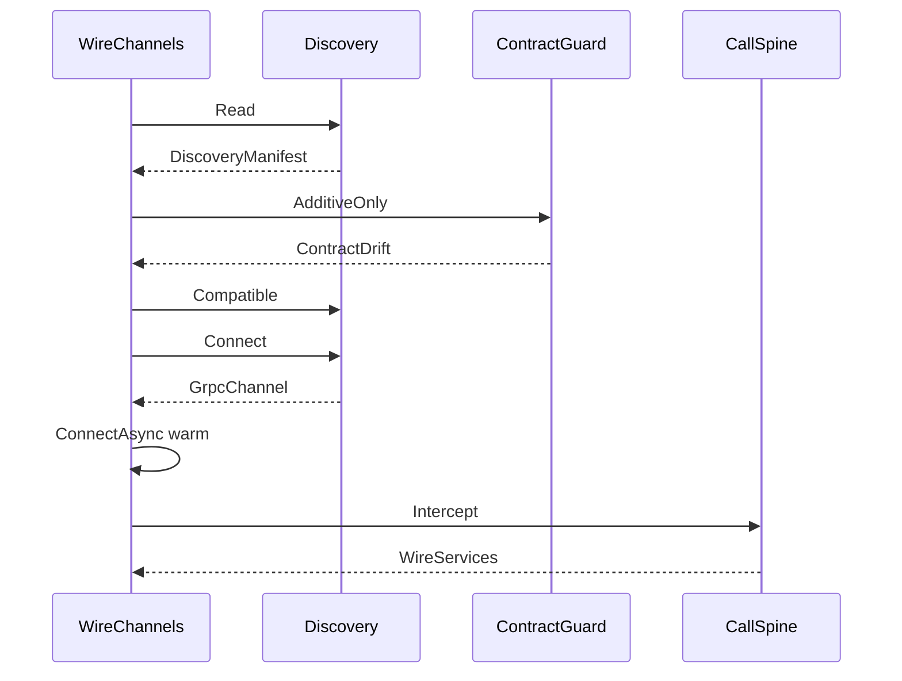

# [COMPUTE_TRANSPORT]

Rasm.Compute owns the channel MECHANICS the suite wire moves over: five `RemoteTransport` rows with streaming-capability columns and a typed connectivity-transition fold warmed through `ConnectAsync`, the canonical `GrpcChannelPolicy` tuning owner whose `HttpVersionPosture` resolves the HTTP/2-versus-HTTP/3-forward channel-option pair from the host QUIC verdict, a five-row `CredentialPolicy` axis behind one stamping interceptor minting per-call identity through `AsyncAuthInterceptor`, a claim-gated `CompressionProviders` encoding axis over the inbox `ICompressionProvider` rows, and the ArtifactSync frame law — the 64 KiB `FrameEdge` fold with per-frame Crc32, whole-artifact XxHash128 identity, the `IBufferMessage` zero-alloc buffer fast path over a `RecyclableMemoryStream` writer face, and a `FieldMask` partial-update apply leg over `Merge`/`Union`.

`Runtime/wire` owns the wire CONTRACT — proto vocabulary, contract evolution, fault projection, the TS posture — so this page owns how bytes MOVE and that page owns what they SAY, joined by prose anchor rather than a cross-split fence import (the `CallSpine.Awaited` fold converts a thrown `RpcException` through the `Runtime/wire#FAULT_PROJECTION` `WireFault.Classify` arm by reference). Channel policy values arrive settled on `GrpcChannelPolicy.Canonical`; discovery, retry ownership, deadlines, correlation, degradation, and receipt sinks compose from the AppHost spine. Package spine: Google.Protobuf, Grpc.Net.Client, Grpc.Net.Client.Web, Grpc.Net.Common, Microsoft.AspNetCore.TestHost (test-only InProcess handler — the one sanctioned production-seam-shaped-for-test overlay), Microsoft.IO.RecyclableMemoryStream, CommunityToolkit.HighPerformance, System.IO.Hashing, Thinktecture.Runtime.Extensions, LanguageExt.Core, and NodaTime.

## [01]-[INDEX]

- [01]-[TRANSPORT_AXIS]: five transport rows under the canonical `GrpcChannelPolicy` tuning owner — RID-gated HTTP/3-forward posture, channel warm-up, typed connectivity fold, grpc-web binary framing, and the injected bSDD REST transport.
- [02]-[CALL_POLICY]: five credential rows and three compression rows behind one stamping interceptor threading the `HopTotal` deadline budget.
- [03]-[ARTIFACT_FRAMES]: the 64 KiB `FrameEdge` frame law — `Crc32`, whole-artifact `XxHash128`, zero-alloc buffer fast path, reassembly, mask-driven partial update, transaction choreography.

## [02]-[TRANSPORT_AXIS]

- Owner: `RemoteTransport` `[SmartEnum<string>]` rows with streaming, credential, affinity, and dial columns; `GrpcChannelPolicy` the canonical channel-tuning record centralizing send/receive caps, reconnect backoff, pooled-idle, keepalive, multiplexing, and the HTTP-version posture so a single literal-free policy value seeds every `GrpcChannelOptions` site; `HttpVersionPosture` `[Union]` the two-case HTTP-version family resolving the BCL `HttpVersion`/`HttpVersionPolicy` channel-option pair from the host QUIC verdict; `ComparerAccessors.StringOrdinal` accessor; `StreamShape` and `NodeSelection` row vocabularies; `WireTransition` `[Union]` the typed prior→next connectivity-transition family the receipt carries; `ComputeEndpoint` endpoint identity record; `WireChannels` — attach, open, warm-via-`ConnectAsync`, observe-via-connectivity-fold, redial; the in-process row consumes the `TestServer.CreateHandler` handler seam.
- Cases: Http2; Http3 (the QUIC byte path admitting unary/server/client/duplex over TLS only, dial-gated on `HttpVersionPosture.QuicCapable` so the row exists on every host but faults Excluded where the RID exposes no QUIC TLS); GrpcWeb (unary and server-stream only, `GrpcWebMode.GrpcWeb` binary — the text mode is the rejected google-client-only spelling); UnixDomainSocket (discovery manifest consumption, peer-credential and 0700-directory law); InProcess (injected handler from the test composition root — the handler source is the `Microsoft.AspNetCore.TestHost` `TestServer.CreateHandler` seam, admitted test-only, dialing `GrpcChannel.ForAddress` against the in-memory pipeline with no socket).
- Entry: `Open(ComputeEndpoint endpoint, CallSpine spine)` — `IO<Fin<WireServices>>`; admission proves credential row membership before the dial column runs and warms the channel through `ConnectAsync` before returning so the first deadline-bearing call does not pay connection latency inside its budget. `NodeSelection.Select` ranks the admitted endpoint roster by rotation, validated load, or warm-fingerprint tier through one total row dispatch.
- Receipt: channel-state transitions and redial evidence emit through `ReceiptSinkPort.Send` keyed by the endpoint correlation; the `ConnectivityState` fold projects `Idle`/`Connecting`/`Ready`/`TransientFailure`/`Shutdown` into the typed `WireTransition` prior→next rows the receipt carries; storeEpoch drift after redial is its own evidence row.
- Packages: Grpc.Net.Client, Grpc.Net.Client.Web, Microsoft.AspNetCore.TestHost (test-only), Thinktecture.Runtime.Extensions, LanguageExt.Core, Rasm.AppHost (project), BCL inbox (`System.Net.Http.HttpClient`/`HttpVersion`/`HttpVersionPolicy`, `System.Net.Security.SslClientAuthenticationOptions`, `System.Security.Cryptography.X509Certificates.X509Certificate2`/`X509CertificateCollection`, `System.Net.Quic.QuicConnection`, `System.Text.Json.JsonSerializer`)
- Growth: one row absorbs a new byte path — the Windows-only `NamedPipe` (`PipeSecurity` ACL) and the bearer-plus-DACL `TcpLoopback` rows are dropped from the live macOS axis and their security-law member spelling stays the design record on `[PIPE_SECURITY]`, re-entering as one row each only on a host whose RID admits the byte path, the `PipeSecurity` ACL for the pipe and the DACL plus bearer for the loopback never blurred into one credential shape; the `Http3` row is the forward QUIC byte path, present on the axis but dial-gated on `HttpVersionPosture.QuicCapable` so it activates only on a RID whose `QuicConnection.IsSupported` resolves the msquic asset — the live macOS axis carries it forward-only because no QUIC TLS provider ships on macOS, so the row dials Excluded there while the same `HttpVersionPosture.ForHost` verdict keeps the Http2 row's `HttpVersion` at `Version20`; one `HttpVersionPosture` case absorbs a new version negotiation posture; one `NodeSelection` row absorbs a new farm strategy; one `WireTransition` case absorbs a new connectivity-state pairing; zero new surface.
- Boundary: `GrpcChannelPolicy` is the canonical channel-tuning owner and `WireChannels` the named boundary capsule consuming it — keepalive, pooled-idle, multiplexing, reconnect-backoff, the HTTP-version posture, and the send/receive caps read from `GrpcChannelPolicy.Canonical` and are never re-declared. `KeepAlivePingDelay`/`KeepAlivePingTimeout`/`EnableMultipleHttp2Connections` and `KeepAlivePingPolicy = HttpKeepAlivePingPolicy.WithActiveRequests` are BCL `SocketsHttpHandler` members (not `Grpc.Net.Client`), so idle-pool connections never burn pings without an in-flight request, and the reconnect-backoff bounds hold a flapping endpoint on a backoff envelope rather than a hot loop — a redeclared gRPC-package keepalive member is the deleted form (no such member exists on the `Grpc.Net.Client`/`Grpc.Core.Api` surface). HTTP-version selection is the `HttpVersion`/`HttpVersionPolicy` `GrpcChannelOptions` pair (BCL `System.Net.Http`, not a gRPC member) projected from `GrpcChannelPolicy.Canonical.Version.Wire`, self-resolved through `HttpVersionPosture.ForHost` reading `QuicConnection.IsSupported` ANDed against `!OperatingSystem.IsMacOS()` so the live macOS axis stays HTTP/2 exact and never advertises an HTTP/3 ALPN it cannot terminate while a QUIC-TLS RID lands `Http3` and the `Version30` posture from one verdict — a per-call version knob, a handler-level `GrpcWebHandler.HttpVersion` override (obsolete, superseded by the pair), and a forced `Version30` on a QUIC-absent host are the deleted forms. Client-side HTTP/2 flow-control windows are the app-root Kestrel `Http2Limits` SERVER leg, so the only client stream knob here is `EnableMultipleHttp2Connections` and a client flow-control-window member is the deleted form. Connectivity is a held state machine: `Open` warms the channel to Ready through `ConnectAsync` before the first deadline-bearing call so connection latency never lands inside a budget — a cold channel dialed without the warm leg is the deleted form, and warm-up and observation are both unavailable when the channel wraps a caller-supplied `HttpClient`, so the InProcess test row skips the warm leg by construction. Channel pooling rides one `GrpcChannel` per `ComputeEndpoint` (`PooledConnectionIdleTimeout` Infinite, multiplexed) reused across redials until the storeEpoch re-handshake replaces it — a per-call channel is the deleted form; `DisableResolverServiceConfig` stays true and `GrpcChannelOptions.ServiceConfig` is never set so a resolver-supplied service config can never override the root-declared no-retry posture, and the whole retry/hedging/load-balancing config surface stays unadmitted. ArtifactSync bidi and CaptureEvents client-stream are structurally excluded on the GrpcWeb row — its `GrpcWebMode.GrpcWeb` binary framing carries unary and server-stream only, `GrpcWebMode.GrpcWebText` base64 being the rejected google-client-only spelling; reconnect on UnixDomainSocket is redial-only with the storeEpoch re-handshake; a failed attach folds to the LocalOnly consequence, substrate predicates reading the retained Capability set rather than a second health probe. `NodeSelection.ModelWarmupAffinity` populates the endpoint affinity column from the warm-start session fingerprint so a cold companion routes to the node holding the matching EP-context blob — this endpoint affinity is the single warm-start column `SubstrateSelection.Plan` reads (`WarmAffinity` projecting `RemoteGrpc.Key` into `SelectionContext.WarmAffinity` so the `AffinityRank` tie-breaker reads one substrate-keyed set within the rank-equal tier), never a second affinity notion parallel to endpoint identity, never a rank override, never a `ServiceConfig` load-balancing policy. `Observe` reads `GrpcChannel.State` and parks on `WaitForStateChangedAsync`, folding each prior→observed `ConnectivityState` pairing into a typed `WireTransition` the receipt carries rather than polling or projecting to a bare string. A bSDD dictionary fetch is a REST transport distinct from the gRPC axis — `BsddTransport.Fetch<TResponse>` issues the class GET under the same `DeadlineClass.HopTotal` budget the gRPC call edge reads and deserializes onto a caller-supplied response shape, staying response-DTO-agnostic (the generic `Fetch<TResponse>` names no AEC-domain type) while the Bim `Semantics/classification#BSDD_RESOLUTION` `BsddPort`/`BsddClass.Of` owns the wire DTO, the `LocalShape` degrade, and the projection; a transport miss returns the typed `EndpointUnreachable` fault the app-root `BsddPort` adapter degrades on, and the app composition root that references both packages closes `Fetch<BsddClassResponse>` and adapts it into the Bim `BsddPort` so neither package depends on the other — a Bim-minted bSDD transport, a Compute-side bSDD response record or local fallback, and a direct cross-package reference in either direction are the rejected forms.

```csharp signature

[Union(ConversionFromValue = ConversionOperatorsGeneration.None)]
public abstract partial record HttpVersionPosture {
    private HttpVersionPosture() { }

    public sealed record Http2Default : HttpVersionPosture;
    public sealed record Http3Forward : HttpVersionPosture;

    public static readonly bool QuicCapable = QuicConnection.IsSupported && !OperatingSystem.IsBrowser();
    public static readonly bool Http3Negotiable = QuicCapable && !OperatingSystem.IsMacOS();

    public static HttpVersionPosture ForHost() => Http3Negotiable ? new Http3Forward() : new Http2Default();

    public (Version Version, HttpVersionPolicy Policy) Wire => Switch(
        http2Default: static _ => (HttpVersion.Version20, HttpVersionPolicy.RequestVersionExact),
        http3Forward: static _ => (HttpVersion.Version30, HttpVersionPolicy.RequestVersionOrHigher));
}

public sealed record GrpcChannelPolicy(
    TimeSpan PooledConnectionIdle,
    TimeSpan KeepAlivePingDelay,
    TimeSpan KeepAlivePingTimeout,
    bool EnableMultipleHttp2Connections,
    int MaxSendBytes,
    int MaxReceiveBytes,
    TimeSpan InitialReconnectBackoff,
    TimeSpan MaxReconnectBackoff,
    HttpVersionPosture Version) {
    public static readonly GrpcChannelPolicy Canonical = new(
        PooledConnectionIdle: Timeout.InfiniteTimeSpan,
        KeepAlivePingDelay: TimeSpan.FromSeconds(60),
        KeepAlivePingTimeout: TimeSpan.FromSeconds(30),
        EnableMultipleHttp2Connections: true,
        MaxSendBytes: 4 * 1024 * 1024,
        MaxReceiveBytes: 4 * 1024 * 1024,
        InitialReconnectBackoff: TimeSpan.FromSeconds(1),
        MaxReconnectBackoff: TimeSpan.FromSeconds(120),
        Version: HttpVersionPosture.ForHost());
}

[SmartEnum]
public sealed partial class StreamShape {
    public static readonly StreamShape Unary = new();
    public static readonly StreamShape ServerStream = new();
    public static readonly StreamShape ClientStream = new();
    public static readonly StreamShape Bidi = new();
}

[SmartEnum]
public sealed partial class NodeSelection {
    public static readonly NodeSelection RoundRobin = new();
    public static readonly NodeSelection LeastLoaded = new();
    public static readonly NodeSelection ModelWarmupAffinity = new();

    public Fin<ComputeEndpoint> Select(
        Seq<ComputeEndpoint> endpoints,
        FrozenDictionary<Uri, double> loads,
        int rotation) {
        if (endpoints.IsEmpty)
            return Fin.Fail<ComputeEndpoint>(new ComputeFault.EndpointUnreachable("empty-endpoint-roster"));

        Seq<(ComputeEndpoint Endpoint, (int Tier, double Load) Score)> ranked = endpoints
            .Zip(Enumerable.Range(0, endpoints.Count))
            .Map(candidate => (candidate.First, Score(candidate.First, candidate.Second, endpoints.Count, rotation, loads)));
        return Fin.Succ(ranked.OrderBy(static candidate => candidate.Score.Tier)
            .ThenBy(static candidate => candidate.Score.Load)
            .First().Endpoint);
    }

    private (int Tier, double Load) Score(
        ComputeEndpoint endpoint,
        int ordinal,
        int count,
        int rotation,
        FrozenDictionary<Uri, double> loads) {
        double load = loads.TryGetValue(endpoint.Address, out double measured) && double.IsFinite(measured) && measured >= 0d
            ? measured
            : double.PositiveInfinity;
        return Switch(
            state: (Endpoint: endpoint, Ordinal: ordinal, Count: count, Rotation: rotation, Load: load),
            roundRobin: static state => ((int)((((long)state.Ordinal - state.Rotation) % state.Count + state.Count) % state.Count), 0d),
            leastLoaded: static state => (0, state.Load),
            modelWarmupAffinity: static state => (state.Endpoint.WarmFingerprint.IsSome ? 0 : 1, state.Load));
    }
}

public sealed record ComputeEndpoint(
    Uri Address, RemoteTransport Transport, CredentialPolicy Credential, CorrelationId Correlation,
    Option<DiscoveryManifest> Peer = default, Option<string> WarmFingerprint = default, Option<Func<HttpMessageHandler>> Handler = default,
    Seq<AsyncAuthInterceptor> Mints = default, Option<X509Certificate2> ClientCertificate = default);

[Union(ConversionFromValue = ConversionOperatorsGeneration.None)]
public abstract partial record WireTransition {
    private WireTransition() { }

    public sealed record Connecting(ConnectivityState Prior) : WireTransition;
    public sealed record Ready(ConnectivityState Prior) : WireTransition;
    public sealed record Degraded(ConnectivityState Prior) : WireTransition;
    public sealed record Closed(ConnectivityState Prior) : WireTransition;
    public sealed record Idle(ConnectivityState Prior) : WireTransition;

    public static WireTransition Of(ConnectivityState prior, ConnectivityState next) => next switch {
        ConnectivityState.Idle => new Idle(prior),
        ConnectivityState.Connecting => new Connecting(prior),
        ConnectivityState.Ready => new Ready(prior),
        ConnectivityState.TransientFailure => new Degraded(prior),
        ConnectivityState.Shutdown => new Closed(prior),
        _ => new Idle(prior),
    };

    public string Label => Switch(
        connecting: static c => $"<connecting:{c.Prior}>",
        ready: static r => $"<ready:{r.Prior}>",
        degraded: static d => $"<transient-failure:{d.Prior}>",
        closed: static s => $"<shutdown:{s.Prior}>",
        idle: static i => $"<idle:{i.Prior}>");
}

[SmartEnum<string>]
[KeyMemberEqualityComparer<ComparerAccessors.StringOrdinal, string>]
[KeyMemberComparer<ComparerAccessors.StringOrdinal, string>]
public sealed partial class RemoteTransport {
    public static readonly RemoteTransport Http2 = new("http2", streams: [StreamShape.Unary, StreamShape.ServerStream, StreamShape.ClientStream, StreamShape.Bidi], credentials: Seq(CredentialPolicy.Tls, CredentialPolicy.Mtls, CredentialPolicy.Bearer, CredentialPolicy.Composed), affinity: true, warms: true, dial: static endpoint => Fin.Succ(GrpcChannel.ForAddress(endpoint.Address, WireChannels.Canonical(endpoint))));
    public static readonly RemoteTransport Http3 = new("http3", streams: [StreamShape.Unary, StreamShape.ServerStream, StreamShape.ClientStream, StreamShape.Bidi], credentials: Seq(CredentialPolicy.Tls, CredentialPolicy.Mtls, CredentialPolicy.Composed), affinity: true, warms: true, dial: static endpoint => HttpVersionPosture.Http3Negotiable ? Fin.Succ(GrpcChannel.ForAddress(endpoint.Address, WireChannels.Canonical(endpoint))) : Fin.Fail<GrpcChannel>(new HopFault.Excluded(nameof(Http3))));
    public static readonly RemoteTransport GrpcWeb = new("grpc-web", streams: [StreamShape.Unary, StreamShape.ServerStream], credentials: Seq(CredentialPolicy.Bearer, CredentialPolicy.Tls), affinity: false, warms: true, dial: static endpoint => Fin.Succ(GrpcChannel.ForAddress(endpoint.Address, WireChannels.Web(endpoint))));
    public static readonly RemoteTransport UnixDomainSocket = new("uds", streams: [StreamShape.Unary, StreamShape.ServerStream, StreamShape.ClientStream, StreamShape.Bidi], credentials: Seq(CredentialPolicy.InsecureLoopback), affinity: false, warms: true, dial: static endpoint => endpoint.Peer.ToFin(new HopFault.StaleManifest(endpoint.Address.AbsoluteUri)).Map(static peer => Discovery.Connect(peer, GrpcChannelPolicy.Canonical)));
    public static readonly RemoteTransport InProcess = new("in-process", streams: [StreamShape.Unary, StreamShape.ServerStream, StreamShape.ClientStream, StreamShape.Bidi], credentials: Seq(CredentialPolicy.InsecureLoopback), affinity: false, warms: false, dial: static endpoint => endpoint.Handler.ToFin(new HopFault.Excluded(nameof(InProcess))).Map(static handler => GrpcChannel.ForAddress(endpoint.Address, new GrpcChannelOptions { HttpHandler = handler() })));
    public Seq<StreamShape> Streams { get; }
    public Seq<CredentialPolicy> Credentials { get; }
    public bool Affinity { get; }
    public bool Warms { get; }
    public Func<ComputeEndpoint, Fin<GrpcChannel>> Dial { get; }

    public bool Carries(StreamShape shape) => Streams.Contains(shape);
}

public static class WireChannels {
    public static GrpcChannelOptions Canonical(ComputeEndpoint endpoint) => new() {
        Credentials = endpoint.Credential.Channel(endpoint.Mints),
        CompressionProviders = CompressionProviders.Register,
        MaxSendMessageSize = GrpcChannelPolicy.Canonical.MaxSendBytes, MaxReceiveMessageSize = GrpcChannelPolicy.Canonical.MaxReceiveBytes,
        DisableResolverServiceConfig = true,
        InitialReconnectBackoff = GrpcChannelPolicy.Canonical.InitialReconnectBackoff,
        MaxReconnectBackoff = GrpcChannelPolicy.Canonical.MaxReconnectBackoff,
        HttpVersion = GrpcChannelPolicy.Canonical.Version.Wire.Version, HttpVersionPolicy = GrpcChannelPolicy.Canonical.Version.Wire.Policy,
        HttpHandler = new SocketsHttpHandler {
            PooledConnectionIdleTimeout = GrpcChannelPolicy.Canonical.PooledConnectionIdle,
            KeepAlivePingDelay = GrpcChannelPolicy.Canonical.KeepAlivePingDelay,
            KeepAlivePingTimeout = GrpcChannelPolicy.Canonical.KeepAlivePingTimeout,
            KeepAlivePingPolicy = HttpKeepAlivePingPolicy.WithActiveRequests,
            EnableMultipleHttp2Connections = GrpcChannelPolicy.Canonical.EnableMultipleHttp2Connections,
            SslOptions = { ClientCertificates = endpoint.Credential.MutualAuth ? Certs(endpoint.ClientCertificate) : null },
        },
    };

    private static X509CertificateCollection Certs(Option<X509Certificate2> certificate) =>
        certificate.Match(Some: static cert => new X509CertificateCollection { cert }, None: static () => new X509CertificateCollection());

    public static GrpcChannelOptions Web(ComputeEndpoint endpoint) => new() {
        Credentials = endpoint.Credential.Channel(endpoint.Mints),
        HttpVersion = HttpVersion.Version11, HttpVersionPolicy = HttpVersionPolicy.RequestVersionExact,
        MaxSendMessageSize = GrpcChannelPolicy.Canonical.MaxSendBytes, MaxReceiveMessageSize = GrpcChannelPolicy.Canonical.MaxReceiveBytes,
        HttpHandler = new GrpcWebHandler(GrpcWebMode.GrpcWeb, endpoint.Handler.IfNone(static () => new HttpClientHandler())()),
    };

    public static Fin<ComputeEndpoint> Attach(ProfileRoots roots, int pid, JsonTypeInfo<DiscoveryManifest> contract, CorrelationId correlation, string localChecksum, Func<string, string, Fin<bool>> additiveOnly) =>
        Discovery.Read(roots, pid, contract)
            .Bind(peer => Discovery.Compatible(peer, localChecksum, additiveOnly))
            .Map(peer => new ComputeEndpoint(new UriBuilder(Uri.UriSchemeHttp, "localhost").Uri, RemoteTransport.UnixDomainSocket, CredentialPolicy.InsecureLoopback, correlation, Peer: peer));

    public static ComputeEndpoint InMemory(Func<HttpMessageHandler> testHandler, CorrelationId correlation) =>
        new(new UriBuilder(Uri.UriSchemeHttp, "localhost").Uri, RemoteTransport.InProcess, CredentialPolicy.InsecureLoopback, correlation, Handler: Some(testHandler));

    public static ComputeEndpoint WarmAffinity(ComputeEndpoint endpoint, FrozenSet<string> nodeWarmBlobs, string warmStartFingerprint) =>
        endpoint.Transport.Affinity && nodeWarmBlobs.Contains(warmStartFingerprint)
            ? endpoint with { WarmFingerprint = Some(warmStartFingerprint) }
            : endpoint;

    public static IO<Fin<WireServices>> Open(ComputeEndpoint endpoint, CallSpine spine) =>
        (from _credential in guard(endpoint.Transport.Credentials.Contains(endpoint.Credential), new HopFault.Excluded(endpoint.Credential.ToString()))
         from channel in endpoint.Transport.Dial(endpoint)
         select channel).Match(
            Succ: channel => Warm(channel, endpoint.Transport.Warms).Map(warm => Fin.Succ(Clients(warm.CreateCallInvoker().Intercept(spine), warm))),
            Fail: error => IO.pure(Fin.Fail<WireServices>(error)));

    public static IO<Unit> Observe(GrpcChannel channel, Func<WireTransition, IO<Unit>> record) =>
        Pump(channel, channel.State, record);

    public static IO<Fin<WireServices>> Redial(ComputeEndpoint endpoint, WireServices stale, CallSpine spine, Func<DiscoveryManifest, Fin<DiscoveryManifest>> rehandshake) =>
        IO.lift(fun(stale.Dispose))
            .Bind(_ => endpoint.Peer.ToFin(new HopFault.StaleManifest(endpoint.Address.AbsoluteUri))
                .Bind(rehandshake)
                .Match(
                    Succ: peer => Open(endpoint with { Peer = peer }, spine),
                    Fail: error => IO.pure(Fin.Fail<WireServices>(error))));

    private static IO<GrpcChannel> Warm(GrpcChannel channel, bool warms) =>
        warms
            ? IO.liftAsync(async () => { await channel.ConnectAsync().ConfigureAwait(false); return channel; })
            : IO.pure(channel);

    private static IO<Unit> Pump(GrpcChannel channel, ConnectivityState prior, Func<WireTransition, IO<Unit>> record) =>
        IO.liftAsync(async () => { await channel.WaitForStateChangedAsync(prior).ConfigureAwait(false); return channel.State; })
            .Bind(next => record(WireTransition.Of(prior, next)).Map(_ => next))
            .Bind(next => Pump(channel, next, record));

    private static WireServices Clients(CallInvoker invoker, GrpcChannel channel) =>
        new(channel,
            new ComputeService.ComputeServiceClient(invoker),
            new DocumentService.DocumentServiceClient(invoker),
            new ControlService.ControlServiceClient(invoker),
            new ArtifactSync.ArtifactSyncClient(invoker),
            new Health.HealthClient(invoker));
}

public sealed class BsddTransport(HttpClient client, CallSpine spine) {
    public static readonly Uri BsddBase = new("https://api.bsdd.buildingsmart.org/api/Class/v1");

    private static readonly JsonSerializerOptions Wire = new(JsonSerializerDefaults.Web) { PropertyNameCaseInsensitive = true };

    public IO<Fin<TResponse>> Fetch<TResponse>(string classUri, CancellationToken token) =>
        spine.AwaitedHttp(classUri, token, async (uri, scope) => {
            using HttpRequestMessage request = new(HttpMethod.Get, new UriBuilder(BsddBase) { Query = $"Uri={Uri.EscapeDataString(uri)}&IncludeClassProperties=true" }.Uri);
            using HttpResponseMessage response = await client.SendAsync(request, HttpCompletionOption.ResponseHeadersRead, scope).ConfigureAwait(false);
            return response.IsSuccessStatusCode
                ? Fin.Succ(await JsonSerializer.DeserializeAsync<TResponse>(await response.Content.ReadAsStreamAsync(scope).ConfigureAwait(false), Wire, scope).ConfigureAwait(false)
                    ?? throw new InvalidOperationException("<bsdd-empty-body>"))
                : Fin.Fail<TResponse>(new ComputeFault.EndpointUnreachable($"<bsdd:{(int)response.StatusCode}:{uri}>"));
        });
}
```



## [03]-[CALL_POLICY]

- Owner: `CredentialPolicy` `[SmartEnum<string>]` rows projecting `ChannelCredentials` and minting per-call identity through `AsyncAuthInterceptor`; `CompressionProviders` `[SmartEnum<string>]` the claim-gated encoding axis projecting inbox `ICompressionProvider` rows; `CallSpine` — the one client interceptor stamping correlation, traceparent, the `DeadlineClass.HopTotal` budget, and the per-call compression and credential edges across all five client call shapes, plus the deadline, payload, and awaited-fault edges.
- Cases: InsecureLoopback (UnixDomainSocket-scoped), Tls, Mtls (the `MutualAuth` row whose `ComputeEndpoint.ClientCertificate` threads onto the handler `SslOptions.ClientCertificates` so the channel presents a client certificate at the TLS layer while `Channel` stays `ChannelCredentials.SecureSsl`), Bearer (browser; per-call token minted through `CallCredentials.FromInterceptor(AsyncAuthInterceptor)` reading the `AuthInterceptorContext.ServiceUrl`/`MethodName` and composed onto the channel through `ChannelCredentials.Create`), Composed (farm node dialing a hub; ≥2 per-call identity mints stacked through `CallCredentials.Compose(params CallCredentials[])` and bound to the TLS channel through `ChannelCredentials.Create`, a single-mint sequence collapsing to the bare `FromInterceptor` bind and an empty sequence to the plain `SecureSsl` channel). `CompressionProviders` rows: Identity (the default no-op `"identity"` accept-encoding), Gzip (`GzipCompressionProvider`), Deflate (`DeflateCompressionProvider` wrapping `ZLibStream` for zlib framing). `CallSpine` interceptor overrides: `BlockingUnaryCall`, `AsyncUnaryCall`, `AsyncServerStreamingCall`, `AsyncClientStreamingCall`, `AsyncDuplexStreamingCall` — the full `Grpc.Core.Interceptors.Interceptor` client family, one `Stamped` projection feeding every shape.
- Entry: `Options(AdmittedIntent intent, CancellationToken token)` projects the admitted deadline or the `DeadlineClass.HopTotal` policy onto `CallOptions`; `Bounded` checks `CalculateSize` before serialization; `Awaited(Task<TResponse>)` converts `RpcException` through `WireFault.Classify`; `WithIdentity` binds a fresh per-call credential.
- Auto: every generated stub call crosses the interceptor — correlation metadata, W3C traceparent, the budgeted deadline, and per-call receipt capture stamp without hand-threaded Metadata; the same `Stamped` projection runs for blocking unary, async unary, server-stream, client-stream, and duplex because the four request-and-context arities all route through one context rewrite.
- Receipt: per-call route, byte sizes, deadline outcome, and negotiated encoding evidence emit through `ReceiptSinkPort.Send` at the interceptor seam.
- Packages: Grpc.Net.Client, Grpc.Net.Common (inbox `Grpc.Net.Compression.ICompressionProvider`/`GzipCompressionProvider`/`DeflateCompressionProvider`), Google.Protobuf, Thinktecture.Runtime.Extensions, LanguageExt.Core, NodaTime, BCL inbox (`System.IO.Compression.CompressionLevel`), Rasm.AppHost (project)
- Growth: one credential row per new trust shape (Composed stacks N identity mints, never a new surface); one `CompressionProviders` row per new wire encoding; a custom zstd/brotli codec is one `CompressionProviders` row whose `Provider` returns a host-implemented `ICompressionProvider` projecting the new `EncodingName`, never a package admission — the inbox `Gzip`/`Deflate` providers and a single hand-implemented codec row span the encoding axis; the compression flip resolves through `CompressionProviders.Winning(payloadBytes, substrate, host, claims)` which folds the `BenchmarkClaim` rows of the `wire-compression` family, matches the running `HostFingerprint` and the payload `Band`, reads the winning `Route`-keyed `CompressionProviders` row, and drops the `Identity` no-op, then `CallSpine.Compressed` stamps the per-call `grpc-internal-encoding-request` metadata key (the `RequestEncodingKey` const) with the winning `CompressionProviders.Key` onto the call options, against the channel-side `GrpcChannelOptions.CompressionProviders` registration that `CompressionProviders.Register` materializes from the axis rows — the winning encoding is a claim-gated `Option<CompressionProviders>`, so an absent or stale claim leaves the call uncompressed and a per-call default-on knob is the deleted form; zero new surface.
- Boundary: `Options` reads the admitted `DeadlineAt`; raw deadline parameters never cross `WireDocument`. `Budgeted` applies the `DeadlineClass.HopTotal` fallback only to interceptor calls that lack admitted intent evidence. `AwaitedHttp` owns the identical policy and linked cancellation for REST calls. `Awaited` converts `RpcException` once, while `CredentialPolicy.Mint` creates each bearer token per call. `DisableResolverServiceConfig` excludes resolver retry, hedging, and load balancing, and AppHost remains the one hop retry owner. `grpc-internal-encoding-request` selects only a provider registered on `GrpcChannelOptions.CompressionProviders`.

```csharp signature
[SmartEnum<string>]
[KeyMemberEqualityComparer<ComparerAccessors.StringOrdinal, string>]
[KeyMemberComparer<ComparerAccessors.StringOrdinal, string>]
public sealed partial class CredentialPolicy {
    public static readonly CredentialPolicy InsecureLoopback = new("insecure-loopback", channel: static _ => ChannelCredentials.Insecure, mutualAuth: false);
    public static readonly CredentialPolicy Tls = new("tls", channel: static _ => ChannelCredentials.SecureSsl, mutualAuth: false);
    public static readonly CredentialPolicy Mtls = new("mtls", channel: static _ => ChannelCredentials.SecureSsl, mutualAuth: true);
    public static readonly CredentialPolicy Bearer = new("bearer", mutualAuth: false, channel: static mints => mints.Head.Match(
        Some: static mint => ChannelCredentials.Create(ChannelCredentials.SecureSsl, CallCredentials.FromInterceptor(mint)),
        None: static () => ChannelCredentials.SecureSsl));
    public static readonly CredentialPolicy Composed = new("composed", mutualAuth: false, channel: static mints => mints.Match(
        Empty: static () => ChannelCredentials.SecureSsl,
        Head: static mint => ChannelCredentials.Create(ChannelCredentials.SecureSsl, CallCredentials.FromInterceptor(mint)),
        Tail: static (head, tail) => ChannelCredentials.Create(
            ChannelCredentials.SecureSsl,
            CallCredentials.Compose(head.Cons(tail).Map(CallCredentials.FromInterceptor).ToArray()))));

    public Func<Seq<AsyncAuthInterceptor>, ChannelCredentials> Channel { get; }
    public bool MutualAuth { get; }

    public static AsyncAuthInterceptor Mint(Func<AuthInterceptorContext, CancellationToken, ValueTask<string>> token, string header = "authorization") =>
        async (context, metadata) => metadata.Add(header, $"Bearer {await token(context, context.CancellationToken).ConfigureAwait(false)}");
}

[SmartEnum<string>]
[KeyMemberEqualityComparer<ComparerAccessors.StringOrdinal, string>]
[KeyMemberComparer<ComparerAccessors.StringOrdinal, string>]
public sealed partial class CompressionProviders {
    public static readonly CompressionProviders Identity = new("identity", provider: static () => Option<ICompressionProvider>.None);
    public static readonly CompressionProviders Gzip = new("gzip", provider: static () => Some<ICompressionProvider>(new GzipCompressionProvider(CompressionLevel.Fastest)));
    public static readonly CompressionProviders Deflate = new("deflate", provider: static () => Some<ICompressionProvider>(new DeflateCompressionProvider(CompressionLevel.Fastest)));

    public Func<Option<ICompressionProvider>> Provider { get; }

    public string EncodingName => Provider().Match(Some: static p => p.EncodingName, None: static () => Key);

    public static IList<ICompressionProvider> Register =>
        Items.ToSeq().Choose(static row => row.Provider()).ToList();

    public const string ClaimFamily = "wire-compression";

    public static Option<CompressionProviders> Winning(long payloadBytes, Substrate substrate, HostFingerprint host, Seq<BenchmarkClaim> claims) =>
        claims.Find(claim =>
                claim.Family == ClaimFamily && claim.Substrate == substrate && !claim.Stale(host) &&
                claim.Input.Band == BenchmarkClaim.BandOf(payloadBytes))
            .Bind(static claim => TryGet(claim.Route, out CompressionProviders? row) && row is not null ? Some(row) : None)
            .Filter(static row => row != Identity);
}

public sealed class CallSpine(CorrelationId correlation, Func<string> traceparent, Func<DeadlineClass, TimeSpan> allotted, IClock clock) : Interceptor {
    public const string CorrelationKey = "rasm-correlation";
    public const string TraceparentKey = "traceparent";
    public const string RequestEncodingKey = "grpc-internal-encoding-request";

    public CallOptions Options(AdmittedIntent intent, CancellationToken token) =>
        new CallOptions()
            .WithDeadline(intent.DeadlineAt.ToDateTimeUtc())
            .WithCancellationToken(token);

    public static CallOptions WithIdentity(CallOptions options, AsyncAuthInterceptor mint) =>
        options.WithCredentials(CallCredentials.FromInterceptor(mint));

    public static CallOptions Compressed(CallOptions options, Option<CompressionProviders> winningEncoding) =>
        winningEncoding.Match(
            Some: encoding => options.WithHeaders(Merge(options.Headers, new Metadata { { RequestEncodingKey, encoding.Key } })),
            None: () => options);

    public static Fin<T> Bounded<T>(T message) where T : IMessage<T> {
        int bytes = message.CalculateSize();
        return bytes <= GrpcChannelPolicy.Canonical.MaxSendBytes
            ? Fin.Succ(message)
            : Fin.Fail<T>(new ComputeFault.PayloadOverBounds($"{bytes} over {GrpcChannelPolicy.Canonical.MaxSendBytes}"));
    }

    public static async Task<Fin<T>> Awaited<T>(Task<T> response) {
        try { return Fin.Succ(await response.ConfigureAwait(false)); }
        catch (RpcException error) { return Fin.Fail<T>(WireFault.Classify(error)); }
    }

    public IO<Fin<T>> AwaitedHttp<T>(string subject, CancellationToken token, Func<string, CancellationToken, Task<Fin<T>>> exchange) =>
        IO.liftAsync(async envIO => {
            using CancellationTokenSource linked = CancellationTokenSource.CreateLinkedTokenSource(token, envIO.Token);
            linked.CancelAfter(allotted(DeadlineClass.HopTotal));
            try { return await exchange(subject, linked.Token).ConfigureAwait(false); }
            catch (OperationCanceledException) { return Fin.Fail<T>(new ComputeFault.DeadlineExpired($"<rest-deadline:{subject}>")); }
            catch (Exception error) when (error is HttpRequestException or JsonException or InvalidOperationException) { return Fin.Fail<T>(new ComputeFault.EndpointUnreachable($"<rest:{subject}:{error.Message}>")); }
        });

    public override TResponse BlockingUnaryCall<TRequest, TResponse>(TRequest request, ClientInterceptorContext<TRequest, TResponse> context, BlockingUnaryCallContinuation<TRequest, TResponse> continuation) => continuation(request, Stamped(context));
    public override AsyncUnaryCall<TResponse> AsyncUnaryCall<TRequest, TResponse>(TRequest request, ClientInterceptorContext<TRequest, TResponse> context, AsyncUnaryCallContinuation<TRequest, TResponse> continuation) => continuation(request, Stamped(context));
    public override AsyncServerStreamingCall<TResponse> AsyncServerStreamingCall<TRequest, TResponse>(TRequest request, ClientInterceptorContext<TRequest, TResponse> context, AsyncServerStreamingCallContinuation<TRequest, TResponse> continuation) => continuation(request, Stamped(context));
    public override AsyncClientStreamingCall<TRequest, TResponse> AsyncClientStreamingCall<TRequest, TResponse>(ClientInterceptorContext<TRequest, TResponse> context, AsyncClientStreamingCallContinuation<TRequest, TResponse> continuation) => continuation(Stamped(context));
    public override AsyncDuplexStreamingCall<TRequest, TResponse> AsyncDuplexStreamingCall<TRequest, TResponse>(ClientInterceptorContext<TRequest, TResponse> context, AsyncDuplexStreamingCallContinuation<TRequest, TResponse> continuation) => continuation(Stamped(context));

    ClientInterceptorContext<TRequest, TResponse> Stamped<TRequest, TResponse>(ClientInterceptorContext<TRequest, TResponse> context) where TRequest : class where TResponse : class =>
        new(context.Method, context.Host,
            Budgeted(context.Options)
                .WithHeaders(Merge(context.Options.Headers, new Metadata { { CorrelationKey, correlation.ToString() }, { TraceparentKey, traceparent() } })));

    private CallOptions Budgeted(CallOptions options) =>
        options.Deadline is { } pinned
            ? options
            : options.WithDeadline(clock.GetCurrentInstant().ToDateTimeUtc() + allotted(DeadlineClass.HopTotal));

    private static Metadata Merge(Metadata? existing, Metadata stamped) =>
        (existing ?? Metadata.Empty).ToSeq().Fold(stamped, static (acc, entry) => { acc.Add(entry); return acc; });
}
```

## [04]-[ARTIFACT_FRAMES]

- Owner: `FrameEdge` owns frame size, per-frame `Crc32`, whole-artifact `XxHash128`, buffer parsing, contiguous reassembly admission, partial updates, and transaction choreography over the settled `Tensor/memory#STREAM_POOL` singleton. `FrameLease` couples an unsafe-wrapped frame to its `MemoryOwner<byte>` lifetime until the send completes.
- Entry: `Frames` derives the artifact id and partitions a staged stream; `Owned` returns a lifetime-bound `FrameLease`; `Reassemble` validates artifact id, length, offsets, CRCs, and identity before parsing; `Staged` delegates length-prefixed writes to `StreamPool.Write`; `Patch` unions and validates field masks.
- Receipt: StreamSegment evidence — segment counts and byte sizes — emits through `ReceiptSinkPort.Send`; every `UnsafeWrap` records ownership transfer in the same evidence row. `StreamPool` alone owns recyclable-manager events, typed `AllocationEvidence`, and subscription detachers.
- Packages: Google.Protobuf, Microsoft.IO.RecyclableMemoryStream, CommunityToolkit.HighPerformance, System.IO.Hashing, LanguageExt.Core, BCL inbox
- Boundary: `Staged` and `Reassemble` drive protobuf buffer APIs through the one `StreamPool`; direct `RecyclableMemoryStreamManager` construction and duplicate event wiring never enter this owner. `Admit` rejects empty, mixed-id, mixed-length, corrupt, overlapping, gapped, truncated, and overlong frame sets before parsing, then `Drain` verifies whole-artifact `XxHash128`. `FrameLease` retains the owner behind `UnsafeByteOperations.UnsafeWrap`; disposing the lease ends the frame lifetime. `Patch` validates the normalized `FieldMask` before `Merge`. `Transaction` preserves both HLC components.

```csharp signature
public static class FrameEdge {
    public const int FrameBytes = 64 * 1024;

    public static readonly FieldMask.MergeOptions MergeReplace = new() { ReplaceMessageFields = true, ReplaceRepeatedFields = true };

    public static Fin<RecyclableMemoryStream> Staged(StreamPool pool, CorrelationId correlation, IMessage payload) =>
        pool.Write(correlation, payload);

    public static Fin<T> Patch<T>(T live, T update, params ReadOnlySpan<FieldMask> tiles) where T : class, IMessage<T> {
        if (tiles.IsEmpty) { return Fin.Fail<T>(new ComputeFault.PayloadOverBounds("empty viewport mask")); }
        FieldMask mask = tiles[0].Union(tiles[1..].ToArray()).Normalize();
        if (!FieldMask.IsValid(live.Descriptor, mask)) { return Fin.Fail<T>(new ComputeFault.PayloadOverBounds($"unknown patch path in [{string.Join(',', mask.Paths)}]")); }
        mask.Merge(update, live, MergeReplace);
        return Fin.Succ(live);
    }

    public static Fin<FrameLease> Owned(ByteString artifactId, long artifactBytes, MemoryOwner<byte> payload, long offset) {
        int payloadLength = payload.Length;
        bool valid = artifactId.Length == 16 && artifactBytes > 0 && offset >= 0 && offset <= artifactBytes
            && payloadLength <= artifactBytes - offset;
        if (valid) { return Fin.Succ(new FrameLease(Frame(artifactId, artifactBytes, payload.DangerousGetArray(), offset), payload)); }
        payload.Dispose();
        return Fin.Fail<FrameLease>(new ComputeFault.PayloadOverBounds($"<owned-frame:{artifactBytes}:{offset}:{payloadLength}>"));
    }

    public static Fin<T> Reassemble<T>(StreamPool pool, CorrelationId correlation, MessageParser<T> parser, Seq<ArtifactFrame> frames) where T : class, IMessage<T> =>
        Admit(frames.OrderBy(static frame => frame.Offset).ToSeq())
            .Bind(ordered => Drain(pool, correlation, parser, ordered.Head.ArtifactId, ordered));

    public static bool Valid(ArtifactFrame frame) =>
        frame.FrameCrc == Crc32.HashToUInt32(frame.Payload.Span);

    public static Fin<Seq<ArtifactFrame>> Frames(RecyclableMemoryStream staged) {
        if (staged.Length <= 0L)
            return Fin.Fail<Seq<ArtifactFrame>>(new ComputeFault.PayloadOverBounds("<frame-count:0>"));

        long segments = 1L + ((staged.Length - 1L) / FrameBytes);
        if (segments > int.MaxValue)
            return Fin.Fail<Seq<ArtifactFrame>>(new ComputeFault.PayloadOverBounds($"<frame-count:{staged.Length}:{segments}>"));

        staged.Position = 0;
        XxHash128 hasher = new();
        hasher.Append(staged);
        staged.Position = 0;
        Span<byte> digest = stackalloc byte[16];
        BinaryPrimitives.WriteUInt128LittleEndian(digest, hasher.GetCurrentHashAsUInt128());
        ByteString artifactId = ByteString.CopyFrom(digest);
        ReadOnlySequence<byte> sequence = staged.GetReadOnlySequence();
        return Fin.Succ(toSeq(Enumerable.Range(0, (int)segments))
            .Map(static index => (long)index * FrameBytes)
            .Map(offset => Frame(artifactId, sequence.Length, sequence.Slice(offset, Math.Min(FrameBytes, sequence.Length - offset)).ToArray(), offset)));
    }

    public static TransactionRequest Transaction(ByteString idempotencyKey, ulong expectedEpoch, (Instant Physical, ulong Logical) stamp, CorrelationId correlation, params ReadOnlySpan<IMessage> ops) {
        TransactionRequest request = new() {
            IdempotencyKey = idempotencyKey, ExpectedEpoch = expectedEpoch,
            HlcPhysical = stamp.Physical.ToTimestamp(), HlcLogical = stamp.Logical, Correlation = correlation.ToString(),
        };
        toSeq(ops.ToArray()).Iter(op => request.Ops.Add(Any.Pack(op)));
        return request;
    }

    private static Fin<Seq<ArtifactFrame>> Admit(Seq<ArtifactFrame> frames) =>
        frames.Head.ToFin(new ComputeFault.PayloadOverBounds("<reassemble-empty>"))
            .Bind(head => frames.Fold(
                Fin.Succ((ExpectedOffset: 0L, Frames: Seq<ArtifactFrame>())),
                (state, frame) => state.Bind(accepted =>
                    Valid(frame) && frame.ArtifactId == head.ArtifactId && frame.ArtifactBytes == head.ArtifactBytes
                        && frame.Offset == accepted.ExpectedOffset && accepted.ExpectedOffset <= head.ArtifactBytes
                        && frame.Payload.Length <= head.ArtifactBytes - accepted.ExpectedOffset
                        ? Fin.Succ((accepted.ExpectedOffset + frame.Payload.Length, accepted.Frames.Add(frame)))
                        : Fin.Fail<(long ExpectedOffset, Seq<ArtifactFrame> Frames)>(new ComputeFault.PayloadOverBounds($"<frame-shape:{frame.Offset}>"))))
                .Bind(accepted => accepted.ExpectedOffset == head.ArtifactBytes
                    ? Fin.Succ(accepted.Frames)
                    : Fin.Fail<Seq<ArtifactFrame>>(new ComputeFault.PayloadOverBounds($"<frame-length:{accepted.ExpectedOffset}:{head.ArtifactBytes}>"))));

    private static ArtifactFrame Frame(ByteString artifactId, long artifactBytes, ReadOnlyMemory<byte> body, long offset) => new() {
        ArtifactId = artifactId, ArtifactBytes = artifactBytes, Offset = offset,
        FrameCrc = Crc32.HashToUInt32(body.Span), Payload = UnsafeByteOperations.UnsafeWrap(body),
    };

    private static Fin<T> Drain<T>(StreamPool pool, CorrelationId correlation, MessageParser<T> parser, ByteString artifactId, Seq<ArtifactFrame> ordered) where T : class, IMessage<T> =>
        pool.Get(correlation, new StreamGrant.Sized(ordered.Head.ArtifactBytes)).Bind(staged => {
            using (staged) {
                ordered.Iter(frame => staged.Write(frame.Payload.Span));
                staged.Position = 0;
                XxHash128 hasher = new();
                hasher.Append(staged);
                staged.Position = 0;
                return artifactId.Length == 16 && BinaryPrimitives.ReadUInt128LittleEndian(artifactId.Span) == hasher.GetCurrentHashAsUInt128()
                    ? pool.Read(staged, parser).MapFail(static error => new ComputeFault.PayloadOverBounds(error.Message))
                    : Fin.Fail<T>(new ComputeFault.PayloadOverBounds("<artifact-identity>"));
            }
        });
}

public sealed class FrameLease : IDisposable {
    private readonly MemoryOwner<byte> _owner;

    internal FrameLease(ArtifactFrame frame, MemoryOwner<byte> owner) =>
        (Frame, _owner) = (frame, owner);

    public ArtifactFrame Frame { get; }

    public void Dispose() => _owner.Dispose();
}
```

[ArtifactFrame]:
- Fields: artifact_id=1 bytes; artifact_bytes=2 int64; offset=3 int64; frame_crc=4 fixed32; payload=5 bytes

## [05]-[RESEARCH]

<!-- source-only: research row template:
[TOKEN]-[OPEN|BLOCKED]: <exact question>; <verification route>.
-->

- [TRANSPORTS_LIVE]-[BLOCKED]: does the Kestrel `ListenUnixSocket` server leg and the in-host `Grpc.Core.Api` channel dial resolve against the running integrated host, and does the in-process `TestServer.CreateHandler` seam plus the `ConnectAsync`/`State`/`WaitForStateChangedAsync` warm-and-observe path prove cold start; live Rhino-plugin app root.
- [PIPE_SECURITY]-[BLOCKED]: which `System.IO.Pipes` `PipeSecurity` ACL (Windows-only NamedPipe) and loopback DACL-plus-bearer shape (TcpLoopback) does each byte path bind on re-entry; a host whose RID admits the byte path, the live macOS axis carrying UDS in their place.
- [COMPOSED_CREDENTIAL]-[BLOCKED]: does the live-ALC dial of the composed `CredentialPolicy` identity resolve through a running plugin channel; running plugin process.
- [HTTP3_QUIC]-[BLOCKED]: does `System.Net.Quic.QuicConnection.IsSupported` gate `HttpVersionPosture.QuicCapable` and the `RemoteTransport.Http3` dial on a msquic-asset RID — the BCL `QuicConnection` member is absent from the folder gRPC `.api/` catalogues, so the live macOS axis carries `Http3` forward-only (posture `Http2Default`, dial Excluded) until a QUIC-TLS RID admits it; a QUIC-capable host RID.
