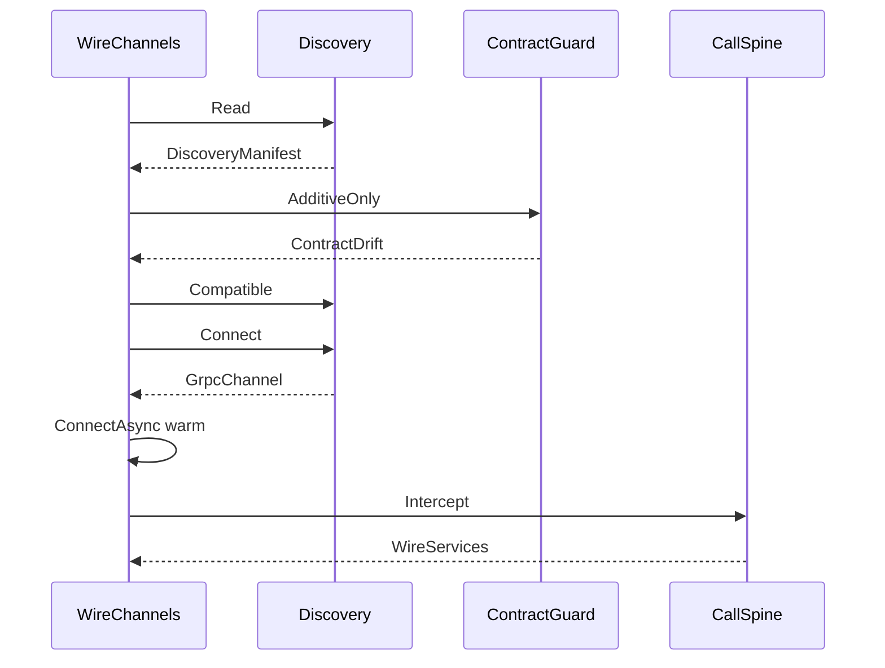

# [COMPUTE_TRANSPORT]

Rasm.Compute owns the channel MECHANICS the suite wire moves over: five `RemoteTransport` rows with streaming-capability columns and a typed connectivity-transition fold warmed through `ConnectAsync`, the canonical `GrpcChannelPolicy` channel-tuning owner whose `HttpVersionPosture` resolves the HTTP/2-versus-HTTP/3-forward channel-option pair from the host QUIC verdict, a five-row `CredentialPolicy` axis behind one stamping interceptor minting per-call identity through `AsyncAuthInterceptor`, a claim-gated `CompressionProviders` encoding axis projecting the inbox `ICompressionProvider` rows, and the ArtifactSync frame law — the 64 KiB `FrameEdge` fold with per-frame Crc32, whole-artifact XxHash128 identity, the `IBufferMessage` zero-alloc buffer fast path (`WriteLengthPrefixedTo` staging the produce edge, `ParseFrom(ReadOnlySequence)` draining the `Reassemble` consume edge under a recomputed whole-artifact identity gate) over a `RecyclableMemoryStream` writer face whose pool events fold to the staging-evidence sink, and a `FieldMask` partial-update APPLY leg over `Merge`/`Union`. The wire CONTRACT — proto vocabulary, contract evolution, fault projection, the TS posture — lives on `Runtime/wire`; this page owns how bytes MOVE, that page owns what they SAY, and the two join by prose anchor, never a cross-split fence import (the `CallSpine.Awaited` fold converts a thrown `RpcException` through the `Runtime/wire#FAULT_PROJECTION` `WireFault.Classify` arm by reference). Channel policy values arrive settled on `GrpcChannelPolicy.Canonical`; discovery, retry ownership, deadlines, correlation, degradation, and receipt sinks compose from the AppHost spine. The package spine is Google.Protobuf, Grpc.Net.Client, Grpc.Net.Client.Web, Grpc.Net.Common, Microsoft.AspNetCore.TestHost (test-only InProcess handler — the single sanctioned production-seam-shaped-for-test overlay), Microsoft.IO.RecyclableMemoryStream, CommunityToolkit.HighPerformance, System.IO.Hashing, Thinktecture.Runtime.Extensions, LanguageExt.Core, and NodaTime.

## [01]-[INDEX]

- [02]-[TRANSPORT_AXIS]: five transport rows, streaming capability, keepalive/pooling/affinity/reconnect columns, the canonical `GrpcChannelPolicy` tuning owner, the RID-gated HTTP/3-forward version posture, channel warm-up, typed connectivity-transition fold, grpc-web binary framing, in-process test handler, dial dispatch, redial law; the injected `BsddPort` bSDD REST transport the Bim classification leg binds.
- [03]-[CALL_POLICY]: five credential rows minting per-call identity, three compression rows, one five-arity stamping interceptor threading the `HopTotal` deadline budget, per-call compression/credential edge, payload edge.
- [04]-[ARTIFACT_FRAMES]: suite frame law — 64 KiB frames, `Crc32`, whole-artifact `XxHash128`, zero-copy wrap, pooled-stream buffer fast path, frame reassembly over `ParseFrom(ReadOnlySequence)` with whole-artifact identity gate, manager-event evidence subscription, mask-driven partial-update apply, transaction wire choreography.

## [02]-[TRANSPORT_AXIS]

- Owner: `RemoteTransport` `[SmartEnum<string>]` rows with streaming, credential, affinity, and dial columns; `GrpcChannelPolicy` the canonical channel-tuning record centralizing send/receive caps, reconnect backoff, pooled-idle, keepalive, multiplexing, and the HTTP-version posture so a single literal-free policy value seeds every `GrpcChannelOptions` site; `HttpVersionPosture` `[Union]` the two-case HTTP-version family resolving the BCL `HttpVersion`/`HttpVersionPolicy` channel-option pair from the host QUIC verdict; `ComparerAccessors.StringOrdinal` accessor; `StreamShape` and `NodeSelection` row vocabularies; `WireTransition` `[Union]` the typed prior→next connectivity-transition family the receipt carries; `ComputeEndpoint` endpoint identity record; `WireChannels` — attach, open, warm-via-`ConnectAsync`, observe-via-connectivity-fold, redial; the in-process row consumes the `TestServer.CreateHandler` handler seam.
- Cases: Http2; Http3 (the QUIC byte path admitting unary/server/client/duplex over TLS only, dial-gated on `HttpVersionPosture.QuicCapable` so the row exists on every host but faults Excluded where the RID exposes no QUIC TLS); GrpcWeb (unary and server-stream only, `GrpcWebMode.GrpcWeb` binary — the text mode is the rejected google-client-only spelling); UnixDomainSocket (discovery manifest consumption, peer-credential and 0700-directory law); InProcess (injected handler from the test composition root — the handler source is the `Microsoft.AspNetCore.TestHost` `TestServer.CreateHandler` seam, admitted test-only, dialing `GrpcChannel.ForAddress` against the in-memory pipeline with no socket).
- Entry: `Open(ComputeEndpoint endpoint, CallSpine spine)` — `IO<Fin<WireServices>>`; admission proves credential row membership before the dial column runs and warms the channel through `ConnectAsync` before returning so the first deadline-bearing call does not pay connection latency inside its budget.
- Receipt: channel-state transitions and redial evidence emit through `ReceiptSinkPort.Send` keyed by the endpoint correlation; the `ConnectivityState` fold projects `Idle`/`Connecting`/`Ready`/`TransientFailure`/`Shutdown` into the typed `WireTransition` prior→next rows the receipt carries; storeEpoch drift after redial is its own evidence row.
- Packages: Grpc.Net.Client, Grpc.Net.Client.Web, Microsoft.AspNetCore.TestHost (test-only), Thinktecture.Runtime.Extensions, LanguageExt.Core, Rasm.AppHost (project), BCL inbox (`System.Net.Http.HttpClient`/`HttpVersion`/`HttpVersionPolicy`, `System.Net.Security.SslClientAuthenticationOptions`, `System.Security.Cryptography.X509Certificates.X509Certificate2`/`X509CertificateCollection`, `System.Net.Quic.QuicConnection`, `System.Text.Json.JsonSerializer`)
- Growth: one row absorbs a new byte path — the Windows-only `NamedPipe` (`PipeSecurity` ACL) and the bearer-plus-DACL `TcpLoopback` rows are dropped from the live macOS axis and their security-law member spelling stays the design record on `[PIPE_SECURITY]`, re-entering as one row each only on a host whose RID admits the byte path, the `PipeSecurity` ACL for the pipe and the DACL plus bearer for the loopback never blurred into one credential shape; the `Http3` row is the forward QUIC byte path, present on the axis but dial-gated on `HttpVersionPosture.QuicCapable` so it activates only on a RID whose `QuicConnection.IsSupported` resolves the msquic asset — the live macOS axis carries it forward-only because no QUIC TLS provider ships on macOS, so the row dials Excluded there while the same `HttpVersionPosture.ForHost` verdict keeps the Http2 row's `HttpVersion` at `Version20`; one `HttpVersionPosture` case absorbs a new version negotiation posture; one `NodeSelection` case absorbs a new farm strategy; one `WireTransition` case absorbs a new connectivity-state pairing; zero new surface.
- Boundary: `GrpcChannelPolicy` is the canonical channel-tuning owner on this fence and `WireChannels` is the named boundary capsule consuming it; keepalive, pooled-idle, multiplexing, reconnect-backoff, the HTTP-version posture, and the 4 MiB caps read from `GrpcChannelPolicy.Canonical` and are never re-declared — the `KeepAlivePingDelay`/`KeepAlivePingTimeout`/`EnableMultipleHttp2Connections` values are BCL `SocketsHttpHandler` members threaded from the channel-policy owner and the `KeepAlivePingPolicy = HttpKeepAlivePingPolicy.WithActiveRequests` is the BCL keepalive enum (not a `Grpc.Net.Client` member) so idle-pool connections never burn pings without an in-flight request, the `InitialReconnectBackoff`/`MaxReconnectBackoff` channel-option values (1 s / 120 s defaults) bound the exponential redial curve so a flapping endpoint reconnects on a backoff envelope rather than a hot loop, and a redeclared gRPC-package keepalive member is the deleted form (no such member exists on the `Grpc.Net.Client` or `Grpc.Core.Api` surface); the HTTP-version leg is the `HttpVersion`/`HttpVersionPolicy` `GrpcChannelOptions` pair (BCL `System.Net.Http` `Version`/`HttpVersionPolicy`, not a gRPC-package member) projected from `GrpcChannelPolicy.Canonical.Version.Wire` so the `Http2Default` posture pins `HttpVersion.Version20` exact and the `Http3Forward` posture pins `HttpVersion.Version30` with `HttpVersionPolicy.RequestVersionOrHigher` to negotiate down when the peer lacks QUIC, the posture self-resolves through `HttpVersionPosture.ForHost` reading `QuicConnection.IsSupported` (the msquic-asset RID gate) ANDed against `!OperatingSystem.IsMacOS()` so the live macOS axis stays HTTP/2 exact and never advertises an HTTP/3 ALPN it cannot terminate, while a host whose RID exposes QUIC TLS lands the `Http3` row and the `Version30` posture from one verdict — a per-call HTTP-version knob, a handler-level `GrpcWebHandler.HttpVersion` override (the obsolete spelling superseded by the channel-options pair), and a forced `Version30` on a QUIC-absent host are the deleted forms; client-side HTTP/2 flow-control windows are the app-root Kestrel `Http2Limits` SERVER leg, never a `GrpcChannelOptions` client column, so the only client-side stream knob here is `EnableMultipleHttp2Connections` and a client flow-control window member is the deleted form; connectivity is a held state machine — `Open` calls `GrpcChannel.ConnectAsync` to warm the channel to Ready before the first deadline-bearing call so connection latency never lands inside a call budget, and a cold channel dialed without the warm leg is the deleted form (connectivity warm-up and observation are both unavailable when the channel wraps a caller-supplied `HttpClient`, so the InProcess test row skips the warm leg by construction); channel pooling rides one `GrpcChannel` per `ComputeEndpoint` with `PooledConnectionIdleTimeout` set `Infinite` and `EnableMultipleHttp2Connections` true so a single warm channel multiplexes every stub call and a per-call channel is the deleted form, and the warm channel is reused across redials until the storeEpoch re-handshake replaces it; `DisableResolverServiceConfig` stays true so a resolver-supplied service config can never override the root-declared no-retry posture, complementing the never-set `GrpcChannelOptions.ServiceConfig`; ArtifactSync bidi and CaptureEvents client-stream are structurally excluded on the GrpcWeb row — intent admission faults a stream shape the row cannot carry — because `GrpcWebMode.GrpcWeb` binary framing carries unary (request-chunked up, response framed down) and server-stream (genuine binary server-streaming over Fetch with trailers restored after the message frames) only, while `GrpcWebMode.GrpcWebText` base64 framing is the rejected google-client-only spelling that the binary mode supersedes on this host; reconnect on UnixDomainSocket is redial-only with the storeEpoch re-handshake after redial; a failed attach folds to the LocalOnly consequence — substrate predicates read the retained Capability set, never a second health probe; `NodeSelection.ModelWarmupAffinity` populates the endpoint affinity column from the warm-start session fingerprint so a cold companion routes to the node holding the matching EP-context blob, and the experimental resolver and balancer config surface never enters — node affinity rides endpoint identity rows, never a `ServiceConfig` load-balancing policy; this endpoint affinity is the single warm-start column the `SubstrateSelection.Plan` fold reads — `WarmAffinity` marking an endpoint affine through `nodeWarmBlobs.Contains(warmStartFingerprint)` projects the `RemoteGrpc.Key` into `SelectionContext.WarmAffinity` so the selection fold's `AffinityRank` tie-breaker reads the same warm fact from one substrate-keyed set inside the rank-equal tier, never a second affinity notion parallel to endpoint identity and never a rank override; the `Observe` loop reads `GrpcChannel.State` and parks on `WaitForStateChangedAsync` as state-wait-reread, folding each prior→observed `ConnectivityState` pairing into a typed `WireTransition` the receipt carries rather than polling or projecting to a bare string label; the bSDD dictionary fetch is a REST transport distinct from the gRPC axis — `BsddTransport.Fetch<TResponse>` issues `GET /api/Class/v1?Uri={classUri}&IncludeClassProperties=true` (the mandatory `IncludeClassProperties` flag returns the class header and its `classProperties` in one round trip — omitting it strands the Bim property/IDS/measure projection on an empty property set) against the buildingSMART bSDD service through a typed `HttpClient` under the same `DeadlineClass.HopTotal` budget the gRPC call edge reads and deserializes the JSON body onto a caller-supplied response shape, so Compute owns the in-process request issue and response stream while staying response-DTO-agnostic (the generic `Fetch<TResponse>` names no AEC-domain type) and the Bim `Semantics/classification#BSDD_RESOLUTION` `BsddPort.Fetch`/`BsddClass.Of` owns the wire DTO and the projection, the Bim side owning ONLY the `BsddPort` interface, the `BsddClassResponse` wire shape, and the `LocalShape` degrade — a transport miss returns the typed `EndpointUnreachable` fault the app-root `BsddPort` adapter degrades to its `LocalShape` on, never a Compute-side local fallback, and Compute mints no Bim-side transport and no bSDD response record (Compute owns the channel, Bim owns the response projection); the app composition root that references both packages closes `Fetch<BsddClassResponse>` and adapts it into the Bim `BsddPort`, so the strata law holds with neither package depending on the other — the app-platform Compute never references the AEC-domain Bim to satisfy this seam and the AEC-domain Bim never references the app-platform Compute, and a Bim-minted bSDD transport, a Compute-side bSDD response record, or a direct cross-package reference in either direction is the rejected form.

```csharp signature

[Union(ConversionFromValue = ConversionOperatorsGeneration.None)]
public abstract partial record HttpVersionPosture {
    private HttpVersionPosture() { }

    public sealed record Http2Default : HttpVersionPosture;
    public sealed record Http3Forward : HttpVersionPosture;

    public static readonly bool QuicCapable = QuicConnection.IsSupported && !OperatingSystem.IsBrowser();
    public static readonly bool Http3Negotiable = QuicCapable && !OperatingSystem.IsMacOS();

    public static HttpVersionPosture ForHost() => Http3Negotiable ? new Http3Forward() : new Http2Default();

    public (Version Version, HttpVersionPolicy Policy) Wire => Switch(
        http2Default: static _ => (HttpVersion.Version20, HttpVersionPolicy.RequestVersionExact),
        http3Forward: static _ => (HttpVersion.Version30, HttpVersionPolicy.RequestVersionOrHigher));
}

public sealed record GrpcChannelPolicy(
    TimeSpan PooledConnectionIdle,
    TimeSpan KeepAlivePingDelay,
    TimeSpan KeepAlivePingTimeout,
    bool EnableMultipleHttp2Connections,
    int MaxSendBytes,
    int MaxReceiveBytes,
    TimeSpan InitialReconnectBackoff,
    TimeSpan MaxReconnectBackoff,
    HttpVersionPosture Version) {
    public static readonly GrpcChannelPolicy Canonical = new(
        PooledConnectionIdle: Timeout.InfiniteTimeSpan,
        KeepAlivePingDelay: TimeSpan.FromSeconds(60),
        KeepAlivePingTimeout: TimeSpan.FromSeconds(30),
        EnableMultipleHttp2Connections: true,
        MaxSendBytes: 4 * 1024 * 1024,
        MaxReceiveBytes: 4 * 1024 * 1024,
        InitialReconnectBackoff: TimeSpan.FromSeconds(1),
        MaxReconnectBackoff: TimeSpan.FromSeconds(120),
        Version: HttpVersionPosture.ForHost());
}

[Flags]
public enum StreamShape { Unary = 1, ServerStream = 2, ClientStream = 4, Bidi = 8 }

public enum NodeSelection { RoundRobin, LeastLoaded, ModelWarmupAffinity }

public sealed record ComputeEndpoint(
    Uri Address, RemoteTransport Transport, CredentialPolicy Credential, CorrelationId Correlation,
    Option<DiscoveryManifest> Peer = default, Option<NodeSelection> Affinity = default, Option<Func<HttpMessageHandler>> Handler = default,
    Seq<AsyncAuthInterceptor> Mints = default, Option<X509Certificate2> ClientCertificate = default);

[Union(ConversionFromValue = ConversionOperatorsGeneration.None)]
public abstract partial record WireTransition {
    private WireTransition() { }

    public sealed record Connecting(ConnectivityState Prior) : WireTransition;
    public sealed record Ready(ConnectivityState Prior) : WireTransition;
    public sealed record Degraded(ConnectivityState Prior) : WireTransition;
    public sealed record Closed(ConnectivityState Prior) : WireTransition;
    public sealed record Idle(ConnectivityState Prior) : WireTransition;

    public static WireTransition Of(ConnectivityState prior, ConnectivityState next) => next switch {
        ConnectivityState.Idle => new Idle(prior),
        ConnectivityState.Connecting => new Connecting(prior),
        ConnectivityState.Ready => new Ready(prior),
        ConnectivityState.TransientFailure => new Degraded(prior),
        ConnectivityState.Shutdown => new Closed(prior),
        _ => new Idle(prior),
    };

    public string Label => Switch(
        connecting: static c => $"<connecting:{c.Prior}>",
        ready: static r => $"<ready:{r.Prior}>",
        degraded: static d => $"<transient-failure:{d.Prior}>",
        closed: static s => $"<shutdown:{s.Prior}>",
        idle: static i => $"<idle:{i.Prior}>");
}

[SmartEnum<string>]
[KeyMemberEqualityComparer<ComparerAccessors.StringOrdinal, string>]
[KeyMemberComparer<ComparerAccessors.StringOrdinal, string>]
public sealed partial class RemoteTransport {
    public static readonly RemoteTransport Http2 = new("http2", streams: StreamShape.Unary | StreamShape.ServerStream | StreamShape.ClientStream | StreamShape.Bidi, credentials: Seq(CredentialPolicy.Tls, CredentialPolicy.Mtls, CredentialPolicy.Bearer, CredentialPolicy.Composed), affinity: true, warms: true, dial: static endpoint => Fin.Succ(GrpcChannel.ForAddress(endpoint.Address, WireChannels.Canonical(endpoint))));
    public static readonly RemoteTransport Http3 = new("http3", streams: StreamShape.Unary | StreamShape.ServerStream | StreamShape.ClientStream | StreamShape.Bidi, credentials: Seq(CredentialPolicy.Tls, CredentialPolicy.Mtls, CredentialPolicy.Composed), affinity: true, warms: true, dial: static endpoint => HttpVersionPosture.QuicCapable ? Fin.Succ(GrpcChannel.ForAddress(endpoint.Address, WireChannels.Canonical(endpoint))) : Fin.Fail<GrpcChannel>(new HopFault.Excluded(nameof(Http3))));
    public static readonly RemoteTransport GrpcWeb = new("grpc-web", streams: StreamShape.Unary | StreamShape.ServerStream, credentials: Seq(CredentialPolicy.Bearer, CredentialPolicy.Tls), affinity: false, warms: true, dial: static endpoint => Fin.Succ(GrpcChannel.ForAddress(endpoint.Address, WireChannels.Web(endpoint))));
    public static readonly RemoteTransport UnixDomainSocket = new("uds", streams: StreamShape.Unary | StreamShape.ServerStream | StreamShape.ClientStream | StreamShape.Bidi, credentials: Seq(CredentialPolicy.InsecureLoopback), affinity: false, warms: true, dial: static endpoint => endpoint.Peer.ToFin(new HopFault.StaleManifest(endpoint.Address.AbsoluteUri)).Map(static peer => Discovery.Connect(peer, GrpcChannelPolicy.Canonical)));
    public static readonly RemoteTransport InProcess = new("in-process", streams: StreamShape.Unary | StreamShape.ServerStream | StreamShape.ClientStream | StreamShape.Bidi, credentials: Seq(CredentialPolicy.InsecureLoopback), affinity: false, warms: false, dial: static endpoint => endpoint.Handler.ToFin(new HopFault.Excluded(nameof(InProcess))).Map(static handler => GrpcChannel.ForAddress(endpoint.Address, new GrpcChannelOptions { HttpHandler = handler() })));
    public StreamShape Streams { get; }
    public Seq<CredentialPolicy> Credentials { get; }
    public bool Affinity { get; }
    public bool Warms { get; }
    public Func<ComputeEndpoint, Fin<GrpcChannel>> Dial { get; }

    public bool Carries(StreamShape shape) => Streams.HasFlag(shape);
}

public static class WireChannels {
    public static GrpcChannelOptions Canonical(ComputeEndpoint endpoint) => new() {
        Credentials = endpoint.Credential.Channel(endpoint.Mints),
        CompressionProviders = CompressionProviders.Register,
        MaxSendMessageSize = GrpcChannelPolicy.Canonical.MaxSendBytes, MaxReceiveMessageSize = GrpcChannelPolicy.Canonical.MaxReceiveBytes,
        DisableResolverServiceConfig = true,
        InitialReconnectBackoff = GrpcChannelPolicy.Canonical.InitialReconnectBackoff,
        MaxReconnectBackoff = GrpcChannelPolicy.Canonical.MaxReconnectBackoff,
        HttpVersion = GrpcChannelPolicy.Canonical.Version.Wire.Version, HttpVersionPolicy = GrpcChannelPolicy.Canonical.Version.Wire.Policy,
        HttpHandler = new SocketsHttpHandler {
            PooledConnectionIdleTimeout = GrpcChannelPolicy.Canonical.PooledConnectionIdle,
            KeepAlivePingDelay = GrpcChannelPolicy.Canonical.KeepAlivePingDelay,
            KeepAlivePingTimeout = GrpcChannelPolicy.Canonical.KeepAlivePingTimeout,
            KeepAlivePingPolicy = HttpKeepAlivePingPolicy.WithActiveRequests,
            EnableMultipleHttp2Connections = GrpcChannelPolicy.Canonical.EnableMultipleHttp2Connections,
            SslOptions = { ClientCertificates = endpoint.Credential.MutualAuth ? Certs(endpoint.ClientCertificate) : null },
        },
    };

    static X509CertificateCollection Certs(Option<X509Certificate2> certificate) =>
        certificate.Match(Some: static cert => new X509CertificateCollection { cert }, None: static () => new X509CertificateCollection());

    public static GrpcChannelOptions Web(ComputeEndpoint endpoint) => new() {
        Credentials = endpoint.Credential.Channel(endpoint.Mints),
        HttpVersion = HttpVersion.Version11, HttpVersionPolicy = HttpVersionPolicy.RequestVersionExact,
        MaxSendMessageSize = GrpcChannelPolicy.Canonical.MaxSendBytes, MaxReceiveMessageSize = GrpcChannelPolicy.Canonical.MaxReceiveBytes,
        HttpHandler = new GrpcWebHandler(GrpcWebMode.GrpcWeb, endpoint.Handler.IfNone(static () => new HttpClientHandler())()),
    };

    public static Fin<ComputeEndpoint> Attach(ProfileRoots roots, int pid, JsonTypeInfo<DiscoveryManifest> contract, CorrelationId correlation, string localChecksum, Func<string, string, bool> additiveOnly) =>
        Discovery.Read(roots, pid, contract)
            .Bind(peer => Discovery.Compatible(peer, localChecksum, additiveOnly))
            .Map(peer => new ComputeEndpoint(new UriBuilder(Uri.UriSchemeHttp, "localhost").Uri, RemoteTransport.UnixDomainSocket, CredentialPolicy.InsecureLoopback, correlation, Peer: peer));

    public static ComputeEndpoint InMemory(Func<HttpMessageHandler> testHandler, CorrelationId correlation) =>
        new(new UriBuilder(Uri.UriSchemeHttp, "localhost").Uri, RemoteTransport.InProcess, CredentialPolicy.InsecureLoopback, correlation, Handler: Some(testHandler));

    public static ComputeEndpoint WarmAffinity(ComputeEndpoint endpoint, FrozenSet<string> nodeWarmBlobs, string warmStartFingerprint) =>
        endpoint.Transport.Affinity && nodeWarmBlobs.Contains(warmStartFingerprint)
            ? endpoint with { Affinity = Some(NodeSelection.ModelWarmupAffinity) }
            : endpoint;

    public static IO<Fin<WireServices>> Open(ComputeEndpoint endpoint, CallSpine spine) =>
        (from _credential in guard(endpoint.Transport.Credentials.Contains(endpoint.Credential), new HopFault.Excluded(endpoint.Credential.ToString()))
         from channel in endpoint.Transport.Dial(endpoint)
         select channel).Match(
            Succ: channel => Warm(channel, endpoint.Transport.Warms).Map(warm => Fin.Succ(Clients(warm.CreateCallInvoker().Intercept(spine), warm))),
            Fail: error => IO.pure(Fin.Fail<WireServices>(error)));

    public static IO<Unit> Observe(GrpcChannel channel, Func<WireTransition, IO<Unit>> record) =>
        Pump(channel, channel.State, record);

    public static IO<Fin<WireServices>> Redial(ComputeEndpoint endpoint, WireServices stale, CallSpine spine, Func<DiscoveryManifest, Fin<DiscoveryManifest>> rehandshake) =>
        IO.lift(fun(stale.Dispose))
            .Bind(_ => endpoint.Peer.ToFin(new HopFault.StaleManifest(endpoint.Address.AbsoluteUri))
                .Bind(rehandshake)
                .Match(
                    Succ: peer => Open(endpoint with { Peer = peer }, spine),
                    Fail: error => IO.pure(Fin.Fail<WireServices>(error))));

    static IO<GrpcChannel> Warm(GrpcChannel channel, bool warms) =>
        warms
            ? IO.liftAsync(async () => { await channel.ConnectAsync().ConfigureAwait(false); return channel; })
            : IO.pure(channel);

    static IO<Unit> Pump(GrpcChannel channel, ConnectivityState prior, Func<WireTransition, IO<Unit>> record) =>
        IO.liftAsync(async () => { await channel.WaitForStateChangedAsync(prior).ConfigureAwait(false); return channel.State; })
            .Bind(next => record(WireTransition.Of(prior, next)).Map(_ => next))
            .Bind(next => Pump(channel, next, record));

    static WireServices Clients(CallInvoker invoker, GrpcChannel channel) =>
        new(channel,
            new ComputeService.ComputeServiceClient(invoker),
            new DocumentService.DocumentServiceClient(invoker),
            new ControlService.ControlServiceClient(invoker),
            new ArtifactSync.ArtifactSyncClient(invoker),
            new Health.HealthClient(invoker));
}

// The bSDD REST capsule Compute owns over its channel: a typed HttpClient surface that issues GET
// /api/Class/v1?Uri={classUri}&IncludeClassProperties=true against the buildingSMART bSDD dictionary (the mandatory
// IncludeClassProperties flag returns the class header AND its classProperties in one round trip) and deserializes the JSON body onto a
// caller-supplied response shape. Compute owns the in-process request issue and response stream (the bSDD
// endpoint, the Uri= query construction, the hop budget) but stays response-DTO-agnostic: Fetch is generic in
// TResponse so this app-platform capsule names no AEC-domain type, and the bSDD wire shape — the Bim
// Semantics/classification#BSDD_RESOLUTION BsddClassResponse grounded against the buildingSMART ClassContract.v1
// (Uri/Code/Name/ClassType/Definition + the ClassProperty[] carrying
// Code/Name/PropertyCode/DataType/PropertySet/PredefinedValue/IsRequired) — is closed in at the app composition
// root that references both packages, where transport.Fetch<BsddClassResponse> is adapted into the Bim-owned
// BsddPort the BsddResolution live-wire leg binds and BsddClass.Of projects. Compute mints no second response
// record and no bSDD-side projection, and the strata law holds the right way: the AEC-domain Bim owns the
// BsddPort contract and the LocalShape degrade, the app-platform Compute owns the channel, and neither
// references the other (app-platform never depends on AEC-domain to satisfy this seam, AEC-domain never depends
// on app-platform — the app root binds the two). The bSDD service is REST, distinct from the gRPC
// RemoteTransport axis, so this is a typed HttpClient capsule reading the same DeadlineClass.HopTotal budget the
// gRPC call edge reads, the camelCase JSON contract pinned on a single static JsonSerializerOptions rather than
// re-derived per call; a Compute-minted bSDD response record, a Compute-side local fallback, and a per-call
// JsonSerializerOptions are the rejected forms.
// The BCF-API REST lane rides the SAME split one seam further: the transport issues the Bim-owned
// Review/issues#BCF_API BcfApiRequest verbatim (verb + resource + body bytes) and returns the raw response
// bytes, and the READ decode is Bim's BcfApi.Admit over its one snake_case register — Compute decodes no BCF
// body and a transport-side dialect adapter is the rejected second seam.
public sealed class BsddTransport(HttpClient client, Duration deadline) {
    public static readonly Uri BsddBase = new("https://api.bsdd.buildingsmart.org/api/Class/v1");

    static readonly JsonSerializerOptions Wire = new(JsonSerializerDefaults.Web) { PropertyNameCaseInsensitive = true };

    // Issues GET /api/Class/v1?Uri={classUri}&IncludeClassProperties=true (the flag is mandatory — omitting it returns the
    // bare class header with classProperties omitted and strands the Bim property/IDS/measure projection) under the hop deadline linked with the caller scope token (so a user
    // cancel or shutdown drain aborts the in-flight request — cancellation parity with the gRPC call edge) and
    // deserializes the bSDD JSON onto the caller-supplied TResponse; a transport miss or malformed body returns the
    // typed EndpointUnreachable fault the app-root BsddPort adapter degrades to LocalShape on, never a Compute-side
    // local fallback. Network I/O is deferred Task<Fin<TResponse>> work — the await threads through the typed-fault
    // HTTP bridge with no blocking sync-over-async hop, the app-root adapter closing TResponse to the Bim
    // BsddClassResponse.
    public Task<Fin<TResponse>> Fetch<TResponse>(string classUri, CancellationToken token) =>
        CallSpine.AwaitedHttp(classUri, token, async (uri, scope) => {
            using var request = new HttpRequestMessage(HttpMethod.Get, new UriBuilder(BsddBase) { Query = $"Uri={Uri.EscapeDataString(uri)}&IncludeClassProperties=true" }.Uri);
            using var linked = CancellationTokenSource.CreateLinkedTokenSource(scope);
            linked.CancelAfter(deadline.ToTimeSpan());
            using var response = await client.SendAsync(request, HttpCompletionOption.ResponseHeadersRead, linked.Token).ConfigureAwait(false);
            return response.IsSuccessStatusCode
                ? Fin.Succ(await JsonSerializer.DeserializeAsync<TResponse>(await response.Content.ReadAsStreamAsync(linked.Token).ConfigureAwait(false), Wire, linked.Token).ConfigureAwait(false)
                    ?? throw new InvalidOperationException("<bsdd-empty-body>"))
                : Fin.Fail<TResponse>(new ComputeFault.EndpointUnreachable($"<bsdd:{(int)response.StatusCode}:{uri}>"));
        });
}
```



## [03]-[CALL_POLICY]

- Owner: `CredentialPolicy` `[SmartEnum<string>]` rows projecting `ChannelCredentials` and minting per-call identity through `AsyncAuthInterceptor`; `CompressionProviders` `[SmartEnum<string>]` the claim-gated encoding axis projecting inbox `ICompressionProvider` rows; `CallSpine` — the one client interceptor stamping correlation, traceparent, the `DeadlineClass.HopTotal` budget, and the per-call compression and credential edges across all five client call shapes, plus the deadline, payload, and awaited-fault edges.
- Cases: InsecureLoopback (UnixDomainSocket-scoped), Tls, Mtls (the `MutualAuth` row whose `ComputeEndpoint.ClientCertificate` threads onto the handler `SslOptions.ClientCertificates` so the channel presents a client certificate at the TLS layer while `Channel` stays `ChannelCredentials.SecureSsl`), Bearer (browser; per-call token minted through `CallCredentials.FromInterceptor(AsyncAuthInterceptor)` reading the `AuthInterceptorContext.ServiceUrl`/`MethodName` and composed onto the channel through `ChannelCredentials.Create`), Composed (farm node dialing a hub; ≥2 per-call identity mints stacked through `CallCredentials.Compose(params CallCredentials[])` and bound to the TLS channel through `ChannelCredentials.Create`, a single-mint sequence collapsing to the bare `FromInterceptor` bind and an empty sequence to the plain `SecureSsl` channel). `CompressionProviders` rows: Identity (the default no-op `"identity"` accept-encoding), Gzip (`GzipCompressionProvider`), Deflate (`DeflateCompressionProvider` wrapping `ZLibStream` for zlib framing). `CallSpine` interceptor overrides: `BlockingUnaryCall`, `AsyncUnaryCall`, `AsyncServerStreamingCall`, `AsyncClientStreamingCall`, `AsyncDuplexStreamingCall` — the full `Grpc.Core.Interceptors.Interceptor` client family, one `Stamped` projection feeding every shape.
- Entry: `Options(Instant deadline, CancellationToken token)` — the intent deadline Instant projects to DateTime exactly at this edge; `Bounded` is the `CalculateSize` pre-check faulting PayloadOverBounds before serialization; `Awaited(Task<TResponse>)` captures the response onto `Fin<TResponse>` through `WireFault.Classify` so a thrown `RpcException` lands on the typed rail at the one fold; `WithIdentity` is the per-call `CallCredentials` bind through `CallOptions.WithCredentials` for a call that mints a fresh identity outside the channel-bound mint.
- Auto: every generated stub call crosses the interceptor — correlation metadata, W3C traceparent, the budgeted deadline, and per-call receipt capture stamp without hand-threaded Metadata; the same `Stamped` projection runs for blocking unary, async unary, server-stream, client-stream, and duplex because the four request-and-context arities all route through one context rewrite.
- Receipt: per-call route, byte sizes, deadline outcome, and negotiated encoding evidence emit through `ReceiptSinkPort.Send` at the interceptor seam.
- Packages: Grpc.Net.Client, Grpc.Net.Common (inbox `Grpc.Net.Compression.ICompressionProvider`/`GzipCompressionProvider`/`DeflateCompressionProvider`), Google.Protobuf, Thinktecture.Runtime.Extensions, LanguageExt.Core, NodaTime, BCL inbox (`System.IO.Compression.CompressionLevel`), Rasm.AppHost (project)
- Growth: one credential row per new trust shape (Composed stacks N identity mints, never a new surface); one `CompressionProviders` row per new wire encoding; a custom zstd/brotli codec is one `CompressionProviders` row whose `Provider` returns a host-implemented `ICompressionProvider` projecting the new `EncodingName`, never a package admission — the inbox `Gzip`/`Deflate` providers and a single hand-implemented codec row span the encoding axis; the compression flip resolves through `CompressionProviders.Winning(payloadBytes, substrate, host, claims)` which folds the `BenchmarkClaim` rows of the `wire-compression` family, matches the running `HostFingerprint` and the payload `Band`, reads the winning `Route`-keyed `CompressionProviders` row, and drops the `Identity` no-op, then `CallSpine.Compressed` stamps the per-call `grpc-internal-encoding-request` metadata key (the `RequestEncodingKey` const) with the winning `CompressionProviders.Key` onto the call options, against the channel-side `GrpcChannelOptions.CompressionProviders` registration that `CompressionProviders.Register` materializes from the axis rows — the winning encoding is a claim-gated `Option<CompressionProviders>`, so an absent or stale claim leaves the call uncompressed and a per-call default-on knob is the deleted form; zero new surface.
- Boundary: the deadline budget threads through `CallOptions.WithDeadline(DateTime)` and `WithCancellationToken(CancellationToken)` at the `Options` edge and the interceptor re-stamps `WithHeaders` once per call so the `DeadlineClass.HopTotal` allotment — the one retry owner's horizon — projects to the `CallOptions.Deadline` DateTime on every shape without a per-call-shape branch; the deadline is held as the `Deadline` `DateTime?`, never re-projected past the `Options` edge; the awaited response captures onto `Fin<TResponse>` through `Awaited` so the one `WireFault.Classify` arm converts a thrown `RpcException` and the typed rail never leaks an exception past the call edge — a per-call `try`/`catch` ladder is the deleted form; the Bearer token is minted per call through `CallCredentials.FromInterceptor` reading the `AsyncAuthInterceptor` token producer, never a pre-built credential cached past its expiry — a stale cached token is the deleted form, and `CredentialPolicy.Mint` is the canonical producer factory binding the `AuthInterceptorContext` to one token source so every credential row reaches the same mint shape; `GrpcChannelOptions.ServiceConfig` is never set and `DisableResolverServiceConfig` is true — the whole retry, hedging, and load-balancing config surface is experimental and a second retry owner; the AppHost keyed pipeline owns the hop retry and a detected second owner emits Conflict evidence instead of stacking; `UnsafeUseInsecureChannelCallCredentials` is never set; `ThrowOperationCanceledOnCancellation` stays unset — `RpcException` conversion lives in the one `WireFault.Classify` arm; the per-call `grpc-internal-encoding-request` key is stamped by value only and the channel-side `GrpcChannelOptions.CompressionProviders` list is the sole registration site so a second per-call provider registration is the deleted form.

```csharp signature
[SmartEnum<string>]
[KeyMemberEqualityComparer<ComparerAccessors.StringOrdinal, string>]
[KeyMemberComparer<ComparerAccessors.StringOrdinal, string>]
public sealed partial class CredentialPolicy {
    public static readonly CredentialPolicy InsecureLoopback = new("insecure-loopback", channel: static _ => ChannelCredentials.Insecure, mutualAuth: false);
    public static readonly CredentialPolicy Tls = new("tls", channel: static _ => ChannelCredentials.SecureSsl, mutualAuth: false);
    public static readonly CredentialPolicy Mtls = new("mtls", channel: static _ => ChannelCredentials.SecureSsl, mutualAuth: true);
    public static readonly CredentialPolicy Bearer = new("bearer", mutualAuth: false, channel: static mints => mints.Head.Match(
        Some: static mint => ChannelCredentials.Create(ChannelCredentials.SecureSsl, CallCredentials.FromInterceptor(mint)),
        None: static () => ChannelCredentials.SecureSsl));
    public static readonly CredentialPolicy Composed = new("composed", mutualAuth: false, channel: static mints => mints.Match(
        Empty: static () => ChannelCredentials.SecureSsl,
        Head: static mint => ChannelCredentials.Create(ChannelCredentials.SecureSsl, CallCredentials.FromInterceptor(mint)),
        Tail: static (head, tail) => ChannelCredentials.Create(
            ChannelCredentials.SecureSsl,
            CallCredentials.Compose(head.Cons(tail).Map(CallCredentials.FromInterceptor).ToArray()))));

    public Func<Seq<AsyncAuthInterceptor>, ChannelCredentials> Channel { get; }
    public bool MutualAuth { get; }

    public static AsyncAuthInterceptor Mint(Func<AuthInterceptorContext, CancellationToken, ValueTask<string>> token, string header = "authorization") =>
        async (context, metadata) => metadata.Add(header, $"Bearer {await token(context, context.CancellationToken).ConfigureAwait(false)}");
}

[SmartEnum<string>]
[KeyMemberEqualityComparer<ComparerAccessors.StringOrdinal, string>]
[KeyMemberComparer<ComparerAccessors.StringOrdinal, string>]
public sealed partial class CompressionProviders {
    public static readonly CompressionProviders Identity = new("identity", provider: static () => Option<ICompressionProvider>.None);
    public static readonly CompressionProviders Gzip = new("gzip", provider: static () => Some<ICompressionProvider>(new GzipCompressionProvider(CompressionLevel.Fastest)));
    public static readonly CompressionProviders Deflate = new("deflate", provider: static () => Some<ICompressionProvider>(new DeflateCompressionProvider(CompressionLevel.Fastest)));

    public Func<Option<ICompressionProvider>> Provider { get; }

    public string EncodingName => Provider().Match(Some: static p => p.EncodingName, None: static () => Key);

    public static IList<ICompressionProvider> Register =>
        Items.ToSeq().Choose(static row => row.Provider()).ToList();

    public const string ClaimFamily = "wire-compression";

    public static Option<CompressionProviders> Winning(long payloadBytes, Substrate substrate, HostFingerprint host, Seq<BenchmarkClaim> claims) =>
        claims.Find(claim =>
                claim.Family == ClaimFamily && claim.Substrate == substrate && !claim.Stale(host) &&
                claim.Band == BenchmarkClaim.BandOf(payloadBytes))
            .Bind(static claim => TryGet(claim.Route, out var row) ? Optional(row) : None)
            .Filter(static row => row != Identity);
}

public sealed class CallSpine(CorrelationId correlation, Func<string> traceparent, Func<DeadlineClass, TimeSpan> allotted) : Interceptor {
    public const string CorrelationKey = "rasm-correlation";
    public const string TraceparentKey = "traceparent";
    public const string RequestEncodingKey = "grpc-internal-encoding-request";

    public static CallOptions Options(Instant deadline, CancellationToken token) =>
        new CallOptions()
            .WithDeadline(deadline.ToDateTimeUtc())
            .WithCancellationToken(token);

    public static CallOptions WithIdentity(CallOptions options, AsyncAuthInterceptor mint) =>
        options.WithCredentials(CallCredentials.FromInterceptor(mint));

    public static CallOptions Compressed(CallOptions options, Option<CompressionProviders> winningEncoding) =>
        winningEncoding.Match(
            Some: encoding => options.WithHeaders(Merge(options.Headers, new Metadata { { RequestEncodingKey, encoding.Key } })),
            None: () => options);

    public static Fin<T> Bounded<T>(T message) where T : IMessage<T> =>
        message.CalculateSize() <= GrpcChannelPolicy.Canonical.MaxSendBytes
            ? Fin.Succ(message)
            : Fin.Fail<T>(new ComputeFault.PayloadOverBounds($"{message.CalculateSize()} over {GrpcChannelPolicy.Canonical.MaxSendBytes}"));

    public static async Task<Fin<T>> Awaited<T>(Task<T> response) {
        try { return Fin.Succ(await response.ConfigureAwait(false)); }
        catch (RpcException error) { return Fin.Fail<T>(WireFault.Classify(error)); }
    }

    public static async Task<Fin<T>> AwaitedHttp<T>(string subject, CancellationToken token, Func<string, CancellationToken, Task<Fin<T>>> exchange) {
        try { return await exchange(subject, token).ConfigureAwait(false); }
        catch (OperationCanceledException) { return Fin.Fail<T>(new ComputeFault.DeadlineExpired($"<rest-deadline:{subject}>")); }
        catch (Exception error) when (error is HttpRequestException or JsonException or InvalidOperationException) { return Fin.Fail<T>(new ComputeFault.EndpointUnreachable($"<rest:{subject}:{error.Message}>")); }
    }

    public override TResponse BlockingUnaryCall<TRequest, TResponse>(TRequest request, ClientInterceptorContext<TRequest, TResponse> context, BlockingUnaryCallContinuation<TRequest, TResponse> continuation) => continuation(request, Stamped(context));
    public override AsyncUnaryCall<TResponse> AsyncUnaryCall<TRequest, TResponse>(TRequest request, ClientInterceptorContext<TRequest, TResponse> context, AsyncUnaryCallContinuation<TRequest, TResponse> continuation) => continuation(request, Stamped(context));
    public override AsyncServerStreamingCall<TResponse> AsyncServerStreamingCall<TRequest, TResponse>(TRequest request, ClientInterceptorContext<TRequest, TResponse> context, AsyncServerStreamingCallContinuation<TRequest, TResponse> continuation) => continuation(request, Stamped(context));
    public override AsyncClientStreamingCall<TRequest, TResponse> AsyncClientStreamingCall<TRequest, TResponse>(ClientInterceptorContext<TRequest, TResponse> context, AsyncClientStreamingCallContinuation<TRequest, TResponse> continuation) => continuation(Stamped(context));
    public override AsyncDuplexStreamingCall<TRequest, TResponse> AsyncDuplexStreamingCall<TRequest, TResponse>(ClientInterceptorContext<TRequest, TResponse> context, AsyncDuplexStreamingCallContinuation<TRequest, TResponse> continuation) => continuation(Stamped(context));

    ClientInterceptorContext<TRequest, TResponse> Stamped<TRequest, TResponse>(ClientInterceptorContext<TRequest, TResponse> context) where TRequest : class where TResponse : class =>
        new(context.Method, context.Host,
            Budgeted(context.Options)
                .WithHeaders(Merge(context.Options.Headers, new Metadata { { CorrelationKey, correlation.ToString() }, { TraceparentKey, traceparent() } })));

    CallOptions Budgeted(CallOptions options) =>
        options.Deadline is { } pinned
            ? options
            : options.WithDeadline(DateTime.UtcNow + allotted(DeadlineClass.HopTotal));

    static Metadata Merge(Metadata? existing, Metadata stamped) =>
        (existing ?? Metadata.Empty).ToSeq().Fold(stamped, static (acc, entry) => { acc.Add(entry); return acc; });
}
```

## [04]-[ARTIFACT_FRAMES]

- Owner: `FrameEdge` — the suite frame law: frame size, per-frame Crc32, whole-artifact XxHash128 identity, zero-copy wrap, the `IBufferMessage` zero-alloc buffer fast path threading `WriteLengthPrefixedTo(IBufferWriter<byte>)` on the produce edge and `MessageParser<T>.ParseFrom(ReadOnlySequence<byte>)` on the fragmented consume edge, the pooled `RecyclableMemoryStream` writer staging the frame fold and the same pool draining the reassembly, the `RecyclableMemoryStreamManager` event subscription folding pool-conservation evidence to the receipt sink, and the `FieldMask`-driven partial-update apply leg; the generated `ArtifactFrame` accessor owns the `payload` field's `FieldCodec` by `ref` context internally, so Compute never hand-builds a redundant codec; the ArtifactFrame message row below; the blob seam consumes these constants as settled values; `FrameEdge.Transaction` is the flagship transaction wire choreography staging the `TransactionRequest` ops and reading the `TransactionReceipt` over the same buffer face.
- Entry: `Frames(ByteString artifactId, ReadOnlySequence<byte> staged)` — the 64 KiB frame fold over the staged sequence; `Owned(ByteString artifactId, long artifactBytes, MemoryOwner<byte> payload, long offset)` — the single zero-copy frame over a rented buffer; `Reassemble<T>(RecyclableMemoryStreamManager pool, MessageParser<T> parser, Seq<ArtifactFrame> frames)` — the inverse consume leg ordering frames, validating each `Crc32`, draining the pooled stream, parsing through `ParseFrom(ReadOnlySequence<byte>)`, and gating on the recomputed whole-artifact `XxHash128` identity; `Staged(RecyclableMemoryStreamManager pool, IMessage payload)` — the pooled-stream length-prefixed staging of an outbound frame; `Patch<T>(T live, T update, params ReadOnlySpan<FieldMask> tiles)` — the mask-driven partial-update apply leg unioning the viewport tiles into one diff-minimal mask and merging only its fields; `Evidence(RecyclableMemoryStreamManager pool, Func<string, IO<Unit>> sink)` — the manager-event subscription folding stream-disposal and over-capacity facts to the staging-evidence sink.
- Receipt: StreamSegment evidence — segment counts and byte sizes — emits through `ReceiptSinkPort.Send`; every `UnsafeWrap` records ownership transfer in the same evidence row; the `RecyclableMemoryStreamManager` `StreamDisposed`/`StreamOverCapacity`/`StreamConvertedToArray`/`BufferDiscarded`/`UsageReport` events subscribe through `FrameEdge.Evidence` and feed the same staging-evidence sink so pool conservation, oversize discards, and array-conversion audits ride one fact stream rather than a parallel telemetry surface.
- Packages: Google.Protobuf, Microsoft.IO.RecyclableMemoryStream, CommunityToolkit.HighPerformance, System.IO.Hashing, LanguageExt.Core, BCL inbox
- Boundary: artifact identity is XxHash128 over the whole artifact — the settled identity row — and frame integrity is Crc32 per frame; a frame whose message implements `IBufferMessage` parses through `MessageParser<T>.ParseFrom(ReadOnlySequence<byte>)` over the pooled `GetReadOnlySequence` (the `Reassemble` consume leg) and writes through `WriteTo`/`WriteLengthPrefixedTo(IBufferWriter<byte>)` into the recyclable stream cast to its `IBufferWriter<byte>` face (the `Staged` produce leg) — both drive the generated `ParseContext`/`WriteContext` buffer path with no intermediate managed array, bounded by the `MaxReceiveBytes`/`MaxSendBytes` caps the page already quotes — so the buffer fast path is the zero-alloc steady-state row and a per-frame managed-array copy is the deleted form; the outbound staging rents a `RecyclableMemoryStream` through `RecyclableMemoryStreamManager.GetStream(tag, requiredSize)` sized to the frame window so the pool serves a contiguous block, `WriteLengthPrefixedTo(IBufferWriter<byte>)` emits the varint-length-prefixed frame into it, and `GetReadOnlySequence` hands the staged bytes to the next stage without a `ToArray` copy — a fresh `MemoryStream` construction is the deleted form (the staging-and-streams pool is the sole stream owner); the generated `ArtifactFrame` accessor owns the `payload` bytes field's `FieldCodec` internally and drives it by `ref ParseContext`/`WriteContext` — surfaces the catalog confirms are package-internal, reachable only through the generated message — so Compute never constructs a `ref` context nor hand-builds a redundant payload codec, and a hand-rolled byte layout never enters; the partial-update write leg is mask-driven — `FrameEdge.Patch` normalizes the caller mask through `FieldMask.Normalize`, unions overlapping viewport tiles through `FieldMask.Union(params FieldMask[])` into one diff-minimal mask, and applies the recorded update through `FieldMask.Merge(IMessage source, IMessage destination, MergeOptions)` so only the masked fields land on the live message — a whole-message replace and an out-of-band state-diff endpoint are the deleted forms, and the apply re-enters domain admission as a whole value; `ToArray` materialization is bounded to one frame window at the send edge, and a `MemoryOwner<byte>` segment hands off to `UnsafeByteOperations.UnsafeWrap` through `DangerousGetArray` so the frame never copies into a fresh managed array; `UnsafeWrap` transfers buffer ownership to the message and the wrapped buffer is never mutated after wrap; the flagship transaction choreography stages each `TransactionRequest` op as an Any envelope through `FrameEdge.Transaction` and reads the `TransactionReceipt` back over the same parse face so the in-process and cross-process legs share one byte path.

```csharp signature
public static class FrameEdge {
    public const int FrameBytes = 64 * 1024;

    public static readonly FieldMask.MergeOptions MergeReplace = new() { ReplaceMessageFields = true, ReplaceRepeatedFields = true };

    public static RecyclableMemoryStream Staged(RecyclableMemoryStreamManager pool, IMessage payload) {
        var staged = pool.GetStream(nameof(FrameEdge), payload.CalculateSize() + 8);
        payload.WriteLengthPrefixedTo((IBufferWriter<byte>)staged);
        return staged;
    }

    public static Fin<T> Patch<T>(T live, T update, params ReadOnlySpan<FieldMask> tiles) where T : class, IMessage<T> {
        if (tiles.IsEmpty) { return Fin.Fail<T>(new ComputeFault.PayloadOverBounds("empty viewport mask")); }
        var mask = tiles[0].Union(tiles[1..].ToArray()).Normalize();
        if (!FieldMask.IsValid(live.Descriptor, mask)) { return Fin.Fail<T>(new ComputeFault.PayloadOverBounds($"unknown patch path in [{string.Join(',', mask.Paths)}]")); }
        mask.Merge(update, live, MergeReplace);
        return Fin.Succ(live);
    }

    public static IO<Unit> Evidence(RecyclableMemoryStreamManager pool, Func<string, IO<Unit>> sink) =>
        IO.lift(() => {
            pool.StreamDisposed += (_, fact) => sink($"<disposed:{fact.Tag}>").Run();
            pool.StreamOverCapacity += (_, fact) => sink($"<over-capacity:{fact.Tag}:{fact.RequestedCapacity}>").Run();
            pool.StreamConvertedToArray += (_, fact) => sink($"<to-array:{fact.Tag}>").Run();
            pool.BufferDiscarded += (_, fact) => sink($"<discard:{fact.Tag}:{fact.Reason}>").Run();
            pool.UsageReport += (_, fact) => sink($"<usage:{fact.SmallPoolInUseBytes}:{fact.LargePoolInUseBytes}>").Run();
            return unit;
        });

    public static ArtifactFrame Owned(ByteString artifactId, long artifactBytes, MemoryOwner<byte> payload, long offset) =>
        Frame(artifactId, artifactBytes, payload.DangerousGetArray(), offset);

    public static Fin<T> Reassemble<T>(RecyclableMemoryStreamManager pool, MessageParser<T> parser, Seq<ArtifactFrame> frames) where T : class, IMessage<T> =>
        frames.OrderBy(static frame => frame.Offset).ToSeq() is var ordered && ordered.Find(static frame => !Valid(frame)) is { IsSome: true, Case: ArtifactFrame bad }
            ? Fin.Fail<T>(new ComputeFault.PayloadOverBounds($"<frame-crc:{bad.Offset}>"))
            : ordered.Head.Match(
                None: static () => Fin.Fail<T>(new ComputeFault.PayloadOverBounds("<reassemble-empty>")),
                Some: head => Drain(pool, parser, head.ArtifactId, ordered));

    public static bool Valid(ArtifactFrame frame) =>
        frame.FrameCrc == Crc32.HashToUInt32(frame.Payload.Span);

    public static Seq<ArtifactFrame> Frames(ByteString artifactId, ReadOnlySequence<byte> staged) =>
        toSeq(Enumerable.Range(0, (int)((staged.Length + FrameBytes - 1) / FrameBytes)))
            .Map(index => (long)index * FrameBytes)
            .Map(offset => Frame(artifactId, staged.Length, staged.Slice(offset, Math.Min(FrameBytes, staged.Length - offset)).ToArray(), offset));

    public static TransactionRequest Transaction(ByteString idempotencyKey, ulong expectedEpoch, Instant hlc, CorrelationId correlation, params ReadOnlySpan<IMessage> ops) {
        var request = new TransactionRequest {
            IdempotencyKey = idempotencyKey, ExpectedEpoch = expectedEpoch,
            HlcPhysical = hlc.ToTimestamp(), HlcLogical = 0, Correlation = correlation.ToString(),
        };
        foreach (var op in ops) { request.Ops.Add(Any.Pack(op)); }
        return request;
    }

    static ArtifactFrame Frame(ByteString artifactId, long artifactBytes, ReadOnlyMemory<byte> body, long offset) => new() {
        ArtifactId = artifactId, ArtifactBytes = artifactBytes, Offset = offset,
        FrameCrc = Crc32.HashToUInt32(body.Span), Payload = UnsafeByteOperations.UnsafeWrap(body),
    };

    static Fin<T> Drain<T>(RecyclableMemoryStreamManager pool, MessageParser<T> parser, ByteString artifactId, Seq<ArtifactFrame> ordered) where T : class, IMessage<T> {
        using var staged = pool.GetStream(nameof(FrameEdge), ordered.Head.ArtifactBytes);
        foreach (var frame in ordered) { staged.Write(frame.Payload.Span); }
        var sequence = staged.GetReadOnlySequence();
        return artifactId.Length == 16 && BinaryPrimitives.ReadUInt128LittleEndian(artifactId.Span) == Identity(sequence)
            ? Try.lift(() => parser.ParseFrom(sequence)).Run().MapFail(static error => new ComputeFault.PayloadOverBounds(error.Message))
            : Fin.Fail<T>(new ComputeFault.PayloadOverBounds("<artifact-identity>"));
    }

    static UInt128 Identity(ReadOnlySequence<byte> sequence) {
        if (sequence.IsSingleSegment) { return XxHash128.HashToUInt128(sequence.FirstSpan); }
        var hasher = new XxHash128();
        foreach (var segment in sequence) { hasher.Append(segment.Span); }
        return hasher.GetCurrentHashAsUInt128();
    }
}
```

[ArtifactFrame]:
- Fields: artifact_id=1 bytes; artifact_bytes=2 int64; offset=3 int64; frame_crc=4 fixed32; payload=5 bytes

## [05]-[RESEARCH]

- [TRANSPORTS_LIVE]: the Kestrel `ListenUnixSocket` server leg inside the live Rhino-plugin app root and the in-host channel dial over the `Grpc.Core.Api` transitive route resolve against the running integrated host; the in-process `TestServer.CreateHandler` handler seam (`WireChannels.InMemory`) and the `GrpcChannel.ConnectAsync`/`State`/`WaitForStateChangedAsync` warm-and-observe path are the proved cold start.
- [PIPE_SECURITY]: the `System.IO.Pipes` `PipeSecurity` ACL for the Windows-only NamedPipe byte path and the loopback DACL plus bearer-token shape for the TcpLoopback byte path stay the design record, re-entering as one transport row each only on a host whose RID admits the byte path; the live macOS axis carries UDS in their place.
- [COMPOSED_CREDENTIAL]: the live-ALC dial of the composed `CredentialPolicy` identity through a running plugin channel resolves against the running plugin process; the `CallSpine` interceptor surface, the `ContractGuard` projection-checksum fold (`Runtime/wire#CONTRACT_EVOLUTION`), the `WireDocument`/`FrameEdge.Transaction` parity choreography, and the benchmark-gated compression flip — `CompressionProviders.Winning` over the `wire-compression` `BenchmarkClaim` family fingerprint-matched to the running host, stamped by `CallSpine.Compressed` — are authored in the cluster fences.
- [HTTP3_QUIC]: the `System.Net.Quic.QuicConnection.IsSupported` static gating `HttpVersionPosture.QuicCapable` and the `RemoteTransport.Http3` dial resolves against a host RID that ships the msquic asset; the BCL `QuicConnection` member is not in the folder gRPC `.api/` catalogues (the catalogued surface is `Grpc.Net.Client`/`Grpc.Net.Client.Web`/`Grpc.Net.Common` and the `GrpcChannelOptions.HttpVersion`/`HttpVersionPolicy` channel-option pair), so the QUIC-support probe stays the design record and the live HTTP/3 negotiation resolves only on a QUIC-capable RID. The live macOS axis carries the `Http3` row forward-only — the posture resolves `Http2Default` and the dial faults Excluded — until a QUIC-TLS-carrying RID admits the byte path.
