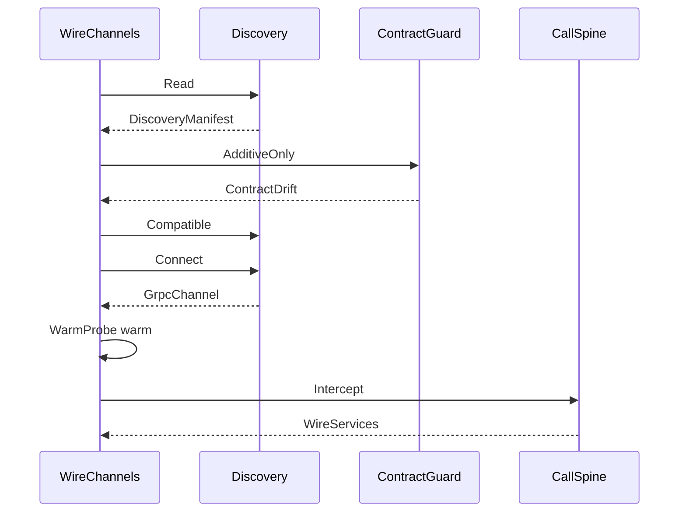

# [COMPUTE_TRANSPORT]

Rasm.Compute owns the channel MECHANICS the suite wire moves over: the `RemoteTransport` dial axis warmed through its row's own `WarmProbe` and observed as typed connectivity transitions where the channel reports them, the canonical `GrpcChannelPolicy` every `GrpcChannelOptions` site reads, the per-call credential and encoding policy one interceptor stamps, the 64 KiB `FrameEdge` artifact frame law, and the MQTT/NATS sensor ingest closing onto BOTH the ephemeral capture lane and the durable observation lane that turns one coerced sensor stream into `Rasm.Element` graph evidence.

`Runtime/wire` owns the wire CONTRACT — proto vocabulary, contract evolution, fault projection, the TS posture — so this page owns how bytes MOVE and that page owns what they SAY, joined by prose anchor rather than a cross-split fence import (the `CallSpine.Awaited` fold converts a thrown `RpcException` through the `Runtime/wire#FAULT_PROJECTION` `WireFault.Classify` arm by reference). Channel policy values arrive settled on `GrpcChannelPolicy.Canonical`; discovery, retry ownership, deadlines, correlation, degradation, and receipt sinks compose from the AppHost spine. The `Rasm.Element` measured-evidence seam arrives settled too — the `Open`/`Encode`/`From`/`Append` production chain, the `SamplingKind` temporal algebra, the chunk blob codec, and the `SeriesStatistics` adjacent merge are seam-owned, so `[05]`/`[06]` hold accumulation policy, binding custody, and the graph landing alone. Package spine: Google.Protobuf, Grpc.Core.Api, Grpc.Net.Client, Grpc.Net.Client.Web, Grpc.Net.Common, Microsoft.IO.RecyclableMemoryStream, CommunityToolkit.HighPerformance, System.IO.Hashing, MQTTnet, NATS.Net, CloudNative.CloudEvents.Mqtt (with the CloudNative.CloudEvents core envelope and the SystemTextJson `JsonEventFormatter` the Persistence overlay custodies), Thinktecture.Runtime.Extensions, LanguageExt.Core, and NodaTime.

## [01]-[INDEX]

- [02]-[TRANSPORT_AXIS]: five transport rows under the canonical `GrpcChannelPolicy` tuning owner — RID-gated HTTP/3-forward posture, channel warm-up, typed connectivity fold, grpc-web binary framing, and the injected bSDD REST transport.
- [03]-[CALL_POLICY]: five credential rows and three compression rows behind one stamping interceptor threading the `HopTotal` deadline budget.
- [04]-[ARTIFACT_FRAMES]: `FrameEdge` fixes the 64 KiB frame law — `Crc32`, whole-artifact `XxHash128`, zero-alloc buffer fast path, reassembly, mask-driven partial update, transaction choreography.
- [05]-[BROKER_INGEST]: `BrokerChannels` seats MQTT and NATS sensor subscriptions beside the gRPC axis — structured-mode decode, the kernel trace carrier, and the one `Absorb` fold fanning each delivery onto the capture lane and the durable lane.
- [06]-[OBSERVATION_LANE]: `ObservationLane` accumulates the decoded stream per binding and flushes it through the seam production chain into content-keyed chunks and one `GraphDelta` carrying the `Node.Observation` and its occurrence `Assign` edge.

## [02]-[TRANSPORT_AXIS]

- Owner: `RemoteTransport` `[SmartEnum<string>]` rows with streaming, credential, affinity, warm-probe, and dial columns; `GrpcChannelPolicy` the canonical channel-tuning record centralizing send/receive caps, reconnect backoff, pooled-idle, keepalive, multiplexing, and the HTTP-version posture so a single literal-free policy value seeds every `GrpcChannelOptions` site; `HttpVersionPosture` `[Union]` the two-case HTTP-version family resolving the BCL `HttpVersion`/`HttpVersionPolicy` channel-option pair from the host QUIC verdict; `ComparerAccessors.StringOrdinal` accessor; `StreamShape` and `NodeSelection` row vocabularies; `WireTransition` `[Union]` the typed prior→next connectivity-transition family the receipt carries; `WarmProbe` `[SmartEnum<string>]` the two-row warm-and-observe family every transport row seats — connectivity for a row dialing the channel's own `SocketsHttpHandler`, round-trip for a row supplying its own handler; `ComputeEndpoint` endpoint identity record; `WireChannels` — attach, open, warm-through-the-row's-probe, observe, redial; the in-process row dials the composition-supplied `ComputeEndpoint.Handler` seam.
- Cases: Http2; Http3 (the QUIC byte path admitting unary/server/client/duplex over TLS only, dial-gated on `HttpVersionPosture.QuicCapable` so the row exists on every host but faults Excluded where `QuicConnection.IsSupported` answers false); GrpcWeb (unary and server-stream only, `GrpcWebMode.GrpcWeb` binary — the text mode is the rejected google-client-only spelling); UnixDomainSocket (discovery manifest consumption, peer-credential law, and the 0700 bind directory that IS the grant surface); InProcess (the composition-supplied `HttpMessageHandler` factory on `ComputeEndpoint.Handler`, dialing `GrpcChannel.ForAddress` against an in-host pipeline with no socket — the row names no handler source, so the proof estate binds `Microsoft.AspNetCore.TestHost` `TestServer.CreateHandler` onto that seam and a production in-host root binds its own).
- Entry: `Open(ComputeEndpoint endpoint, CallSpine spine)` — `IO<Fin<WireServices>>`; admission proves credential row membership before the dial column runs and warms the channel through the row's own `WarmProbe` before returning so the first deadline-bearing call does not pay connection latency inside its budget. `NodeSelection.Select` ranks the admitted endpoint roster by rotation, validated load, or warm-fingerprint tier through one total row dispatch.
- Receipt: channel-state transitions and redial evidence emit through `ReceiptSinkPort.Send` keyed by the endpoint correlation; the `ConnectivityState` fold projects `Idle`/`Connecting`/`Ready`/`TransientFailure`/`Shutdown` into the typed `WireTransition` prior→next rows the receipt carries, and a round-trip row emits dial and redial evidence alone because its channel reports no state; storeEpoch drift after redial is its own evidence row.
- Packages: Grpc.Core.Api (`CallInvoker`, `ChannelCredentials`, `Metadata`), Grpc.Net.Client, Grpc.Net.Client.Web, Thinktecture.Runtime.Extensions, LanguageExt.Core, Rasm.AppHost (project), BCL inbox (`System.Net.Http.HttpClient`/`HttpVersion`/`HttpVersionPolicy`, `System.Net.Security.SslClientAuthenticationOptions`, `System.Security.Cryptography.X509Certificates.X509Certificate2`/`X509CertificateCollection`, `System.Net.Quic.QuicConnection`, `System.Text.Json.JsonSerializer`)
- Growth: one row absorbs a new byte path, and a byte path a host admits later enters carrying its own security law; the `Http3` row is the forward QUIC byte path, present on the axis but dial-gated on `HttpVersionPosture.QuicCapable` so it activates only where `QuicConnection.IsSupported` resolves the msquic asset while the same `HttpVersionPosture.ForHost` verdict keeps the Http2 row's `HttpVersion` at `Version20`; one `HttpVersionPosture` case absorbs a new version negotiation posture; one `NodeSelection` row absorbs a new farm strategy; one `WireTransition` case absorbs a new connectivity-state pairing; one `WarmProbe` row absorbs a new warm mechanism and every transport row seats it by name; zero new surface.
- Boundary: `GrpcChannelPolicy` is the canonical channel-tuning owner and `WireChannels` the named boundary capsule consuming it — keepalive, pooled-idle, multiplexing, reconnect-backoff, the HTTP-version posture, and the send/receive caps read from `GrpcChannelPolicy.Canonical` and are never re-declared. `KeepAlivePingDelay`/`KeepAlivePingTimeout`/`EnableMultipleHttp2Connections` and `KeepAlivePingPolicy = HttpKeepAlivePingPolicy.WithActiveRequests` are BCL `SocketsHttpHandler` members (not `Grpc.Net.Client`), so idle-pool connections never burn pings without an in-flight request, and the reconnect-backoff bounds hold a flapping endpoint on a backoff envelope rather than a hot loop — a redeclared gRPC-package keepalive member is the deleted form (no such member exists on the `Grpc.Net.Client`/`Grpc.Core.Api` surface). HTTP-version selection is the `HttpVersion`/`HttpVersionPolicy` `GrpcChannelOptions` pair (BCL `System.Net.Http`, not a gRPC member) projected from `GrpcChannelPolicy.Canonical.Version.Wire`, self-resolved through `HttpVersionPosture.ForHost` over the ONE `QuicCapable` predicate — `QuicConnection.IsSupported` is a runtime probe of the resolved msquic asset and already answers every platform truth, so a static OS carve beside it is the deleted form that restates the verdict in a second alphabet and drifts from it the moment a platform ships the asset; a host the probe answers false for stays HTTP/2 exact and never advertises an HTTP/3 ALPN it cannot terminate, while a QUIC-capable host lands `Http3` and the `Version30` posture from that same verdict — a per-call version knob, a handler-level `GrpcWebHandler.HttpVersion` override (obsolete, superseded by the pair), and a forced `Version30` on a QUIC-absent host are the deleted forms. Client-side HTTP/2 flow-control windows are the app-root Kestrel `Http2Limits` SERVER leg, so the only client stream knob here is `EnableMultipleHttp2Connections` and a client flow-control-window member is the deleted form. Warm is universal and its MECHANISM is row data: `Open` warms every row before the first deadline-bearing call so connection latency never lands inside a budget — a cold channel dialed without the warm leg is the deleted form. Connectivity tracking is the mechanism only where the channel dials its own `SocketsHttpHandler`, because `ConnectAsync`, `State`, and `WaitForStateChangedAsync` all throw `InvalidOperationException` on a channel whose handler carries a `ConnectCallback` or arrives from the composition — the UDS, InProcess, and GrpcWeb rows are all that class, so they seat `WarmProbe.RoundTrip` and warm through one throwaway `grpc.health.v1` `Check`, and `Observe` answers unit on them rather than throwing. A `warms: false` skip and a bare `Observe` reachable on a handler-supplied row are the two deleted forms of one defect: the first pays connection latency inside the first budget, the second throws where a receipt was expected. Channel pooling rides one `GrpcChannel` per `ComputeEndpoint` (`PooledConnectionIdleTimeout` Infinite, multiplexed) reused across redials until the storeEpoch re-handshake replaces it — a per-call channel is the deleted form; `DisableResolverServiceConfig` stays true and `GrpcChannelOptions.ServiceConfig` is never set so a resolver-supplied service config can never override the root-declared no-retry posture, and the whole retry/hedging/load-balancing config surface stays unadmitted. ArtifactSync bidi and CaptureEvents client-stream are structurally excluded on the GrpcWeb row — its `GrpcWebMode.GrpcWeb` binary framing carries unary and server-stream only, `GrpcWebMode.GrpcWebText` base64 being the rejected google-client-only spelling; reconnect on UnixDomainSocket is redial-only with the storeEpoch re-handshake; a failed attach folds to the LocalOnly consequence, substrate predicates reading the retained Capability set rather than a second health probe. The UDS grant surface is the BIND DIRECTORY, never the socket file: the runtime exposes no chmod on a bound `UnixDomainSocketEndPoint`, so the 0700 parent directory is the whole access control and a per-socket permission call is a member that does not exist. A bind onto an existing path fails, so boot UNLINKS a stale socket before binding — under an exclusive advisory guard alone, because unlink-then-bind is a real race two live hosts lose together: an `O_EXCL` sentinel or a lock file beside the socket serializes the pair, and an unguarded unlink is the deleted form that lets a second host delete a socket the first is already serving. `NodeSelection.ModelWarmupAffinity` populates the endpoint affinity column from the warm-start session fingerprint so a cold companion routes to the node holding the matching EP-context blob — this endpoint affinity is the single warm-start column `SubstrateSelection.Plan` reads (`WarmAffinity` projecting `RemoteGrpc.Key` into `SelectionContext.WarmAffinity` so the `AffinityRank` tie-breaker reads one substrate-keyed set within the rank-equal tier), never a second affinity notion parallel to endpoint identity, never a rank override, never a `ServiceConfig` load-balancing policy. `Observe` on an observable row reads `GrpcChannel.State` and parks on `WaitForStateChangedAsync`, folding each prior→observed `ConnectivityState` pairing into a typed `WireTransition` the receipt carries rather than polling or projecting to a bare string. bSDD dictionary fetch rides a REST transport distinct from the gRPC axis — `BsddTransport.Fetch<TResponse>` issues the class GET under the same `DeadlineClass.HopTotal` budget the gRPC call edge reads and deserializes onto a caller-supplied response shape, staying response-DTO-agnostic (the generic `Fetch<TResponse>` names no AEC-domain type) while the Bim `Semantics/classification#BSDD_RESOLUTION` `BsddPort`/`BsddClass.Of` owns the wire DTO, the `LocalShape` degrade, and the projection; a transport miss returns the typed `EndpointUnreachable` fault the app-root `BsddPort` adapter degrades on, and the app composition root that references both packages closes `Fetch<BsddClassResponse>` and adapts it into the Bim `BsddPort` so neither package depends on the other — a Bim-minted bSDD transport, a Compute-side bSDD response record or local fallback, and a direct cross-package reference in either direction are the rejected forms. [SPIKE]: dialing this axis from inside the live integrated-host ALC converges on running-plugin evidence alone; the deterministic floor is the landed row set, the `WarmProbe` mechanism law, and the redial fold, each standing without it.

```csharp signature
[Union(ConversionFromValue = ConversionOperatorsGeneration.None)]
public abstract partial record HttpVersionPosture {
    private HttpVersionPosture() { }

    public sealed record Http2Default : HttpVersionPosture;
    public sealed record Http3Forward : HttpVersionPosture;

    // ONE predicate gates the posture AND the `Http3` dial. `IsSupported` probes the resolved msquic asset at
    // runtime, so it already carries every platform answer a static OS test would restate — a second conjunct
    // beside it publishes one verdict under two spellings and keeps refusing the day the platform ships QUIC.
    // What the probe RESOLVES per RID: the runtime ships msquic in-box on win-x64 and win-arm64 alone; a linux
    // host answers true only where the distro's own libmsquic package is installed; a darwin host answers FALSE
    // on every arch — the runtime ships no asset and a hand-placed libmsquic is an unsupported configuration, so
    // macOS is HTTP/2 exact and the `Http3` row faults `Excluded` there. The probe also tests IPv6 FIRST, so an
    // IPv6-disabled host answers false with the asset present — the verdict is the host's whole QUIC posture,
    // stack and asset together, which is precisely what a static RID table would get wrong on that host.
    public static readonly bool QuicCapable = QuicConnection.IsSupported && !OperatingSystem.IsBrowser();

    public static HttpVersionPosture ForHost() => QuicCapable ? new Http3Forward() : new Http2Default();

    public (Version Version, HttpVersionPolicy Policy) Wire => Switch(
        http2Default: static _ => (HttpVersion.Version20, HttpVersionPolicy.RequestVersionExact),
        http3Forward: static _ => (HttpVersion.Version30, HttpVersionPolicy.RequestVersionOrHigher));
}

public sealed record GrpcChannelPolicy(
    TimeSpan PooledConnectionIdle,
    TimeSpan KeepAlivePingDelay,
    TimeSpan KeepAlivePingTimeout,
    bool EnableMultipleHttp2Connections,
    int MaxSendBytes,
    int MaxReceiveBytes,
    TimeSpan InitialReconnectBackoff,
    TimeSpan MaxReconnectBackoff,
    HttpVersionPosture Version) {
    public static readonly GrpcChannelPolicy Canonical = new(
        PooledConnectionIdle: Timeout.InfiniteTimeSpan,
        KeepAlivePingDelay: TimeSpan.FromSeconds(60),
        KeepAlivePingTimeout: TimeSpan.FromSeconds(30),
        EnableMultipleHttp2Connections: true,
        MaxSendBytes: 4 * 1024 * 1024,
        MaxReceiveBytes: 4 * 1024 * 1024,
        InitialReconnectBackoff: TimeSpan.FromSeconds(1),
        MaxReconnectBackoff: TimeSpan.FromSeconds(120),
        Version: HttpVersionPosture.ForHost());
}

[SmartEnum]
public sealed partial class StreamShape {
    public static readonly StreamShape Unary = new();
    public static readonly StreamShape ServerStream = new();
    public static readonly StreamShape ClientStream = new();
    public static readonly StreamShape Bidi = new();
}

[SmartEnum]
public sealed partial class NodeSelection {
    public static readonly NodeSelection RoundRobin = new();
    public static readonly NodeSelection LeastLoaded = new();
    public static readonly NodeSelection ModelWarmupAffinity = new();

    public Fin<ComputeEndpoint> Select(
        Seq<ComputeEndpoint> endpoints,
        FrozenDictionary<Uri, double> loads,
        int rotation) {
        if (endpoints.IsEmpty)
            return Fin.Fail<ComputeEndpoint>(new ComputeFault.EndpointUnreachable("empty-endpoint-roster"));

        Seq<(ComputeEndpoint Endpoint, (int Tier, double Load) Score)> ranked = toSeq(endpoints
            .Zip(Enumerable.Range(0, endpoints.Count)))
            .Map(candidate => (candidate.First, Score(candidate.First, candidate.Second, endpoints.Count, rotation, loads)));
        return Fin.Succ(ranked.OrderBy(static candidate => candidate.Score.Tier)
            .ThenBy(static candidate => candidate.Score.Load)
            .First().Endpoint);
    }

    private (int Tier, double Load) Score(
        ComputeEndpoint endpoint,
        int ordinal,
        int count,
        int rotation,
        FrozenDictionary<Uri, double> loads) {
        double load = loads.TryGetValue(endpoint.Address, out double measured) && double.IsFinite(measured) && measured >= 0d
            ? measured
            : double.PositiveInfinity;
        return Switch(
            state: (Endpoint: endpoint, Ordinal: ordinal, Count: count, Rotation: rotation, Load: load),
            roundRobin: static state => ((int)((((long)state.Ordinal - state.Rotation) % state.Count + state.Count) % state.Count), 0d),
            leastLoaded: static state => (0, state.Load),
            modelWarmupAffinity: static state => (state.Endpoint.WarmFingerprint.IsSome ? 0 : 1, state.Load));
    }
}

public sealed record ComputeEndpoint(
    Uri Address, RemoteTransport Transport, CredentialPolicy Credential, CorrelationId Correlation,
    Option<DiscoveryManifest> Peer = default, Option<string> WarmFingerprint = default, Option<Func<HttpMessageHandler>> Handler = default,
    Seq<AsyncAuthInterceptor> Mints = default, Option<X509Certificate2> ClientCertificate = default);

[Union(ConversionFromValue = ConversionOperatorsGeneration.None)]
public abstract partial record WireTransition {
    private WireTransition() { }

    public sealed record Connecting(ConnectivityState Prior) : WireTransition;
    public sealed record Ready(ConnectivityState Prior) : WireTransition;
    public sealed record Degraded(ConnectivityState Prior) : WireTransition;
    public sealed record Closed(ConnectivityState Prior) : WireTransition;
    public sealed record Idle(ConnectivityState Prior) : WireTransition;

    public static WireTransition Of(ConnectivityState prior, ConnectivityState next) => next switch {
        ConnectivityState.Idle => new Idle(prior),
        ConnectivityState.Connecting => new Connecting(prior),
        ConnectivityState.Ready => new Ready(prior),
        ConnectivityState.TransientFailure => new Degraded(prior),
        ConnectivityState.Shutdown => new Closed(prior),
        _ => new Idle(prior),
    };

    public string Label => Switch(
        connecting: static c => $"<connecting:{c.Prior}>",
        ready: static r => $"<ready:{r.Prior}>",
        degraded: static d => $"<transient-failure:{d.Prior}>",
        closed: static s => $"<shutdown:{s.Prior}>",
        idle: static i => $"<idle:{i.Prior}>");
}

// Warm and observe are ONE capability under ONE precondition, so they ride ONE row rather than a bool column and
// a second unguarded member. `ConnectAsync`, `State`, and `WaitForStateChangedAsync` read the channel's OWN
// `SocketsHttpHandler` dial: a handler carrying a `ConnectCallback` (the UDS row), a caller-supplied handler
// (the InProcess row), and a wrapping web handler (the GrpcWeb row) each put the channel outside that dial, and
// EVERY member of the connectivity family throws `InvalidOperationException` there — connectivity tracking and a
// composition-supplied handler are mutually exclusive at the pinned client, so a bool `warms` column that skipped
// only the warm leg left `Observe` throwing on the same rows. Those rows warm by ROUND TRIP instead: one
// throwaway `grpc.health.v1` `Check` on the intercepted invoker pays the connection latency before the first
// deadline-bearing call, which is the whole service the state machine rendered. Its STATUS is discarded because a
// returned `Unimplemented` proves the connection exactly as `Serving` does — only a transport failure leaves the
// channel cold, and that surfaces at the first real call under its own budget rather than failing the dial twice.
[SmartEnum<string>]
[KeyMemberEqualityComparer<ComparerAccessors.StringOrdinal, string>]
[KeyMemberComparer<ComparerAccessors.StringOrdinal, string>]
public sealed partial class WarmProbe {
    public static readonly WarmProbe Connectivity = new("connectivity", observable: true, warm: static services =>
        IO.liftAsync(async () => { await services.Channel.ConnectAsync().ConfigureAwait(false); return services; }));
    public static readonly WarmProbe RoundTrip = new("round-trip", observable: false, warm: static services =>
        IO.liftAsync(async () => {
            try { _ = await services.Health.CheckAsync(new HealthCheckRequest()).ResponseAsync.ConfigureAwait(false); }
            catch (RpcException) { }
            return services;
        }));

    public Func<WireServices, IO<WireServices>> Warm { get; }

    // A round-trip row reports no `ConnectivityState`, so `Observe` is a no-op there and the receipt carries dial
    // and redial evidence alone rather than a transition the channel structurally cannot answer.
    public bool Observable { get; }
}

[SmartEnum<string>]
[KeyMemberEqualityComparer<ComparerAccessors.StringOrdinal, string>]
[KeyMemberComparer<ComparerAccessors.StringOrdinal, string>]
public sealed partial class RemoteTransport {
    public static readonly RemoteTransport Http2 = new("http2", streams: [StreamShape.Unary, StreamShape.ServerStream, StreamShape.ClientStream, StreamShape.Bidi], credentials: Seq(CredentialPolicy.Tls, CredentialPolicy.Mtls, CredentialPolicy.Bearer, CredentialPolicy.Composed), affinity: true, probe: WarmProbe.Connectivity, dial: static endpoint => Fin.Succ(GrpcChannel.ForAddress(endpoint.Address, WireChannels.Canonical(endpoint))));
    public static readonly RemoteTransport Http3 = new("http3", streams: [StreamShape.Unary, StreamShape.ServerStream, StreamShape.ClientStream, StreamShape.Bidi], credentials: Seq(CredentialPolicy.Tls, CredentialPolicy.Mtls, CredentialPolicy.Composed), affinity: true, probe: WarmProbe.Connectivity, dial: static endpoint => HttpVersionPosture.QuicCapable ? Fin.Succ(GrpcChannel.ForAddress(endpoint.Address, WireChannels.Canonical(endpoint))) : Fin.Fail<GrpcChannel>(new HopFault.Excluded(nameof(Http3))));
    public static readonly RemoteTransport GrpcWeb = new("grpc-web", streams: [StreamShape.Unary, StreamShape.ServerStream], credentials: Seq(CredentialPolicy.Bearer, CredentialPolicy.Tls), affinity: false, probe: WarmProbe.RoundTrip, dial: static endpoint => Fin.Succ(GrpcChannel.ForAddress(endpoint.Address, WireChannels.Web(endpoint))));
    public static readonly RemoteTransport UnixDomainSocket = new("uds", streams: [StreamShape.Unary, StreamShape.ServerStream, StreamShape.ClientStream, StreamShape.Bidi], credentials: Seq(CredentialPolicy.InsecureLoopback), affinity: false, probe: WarmProbe.RoundTrip, dial: static endpoint => endpoint.Peer.ToFin(new HopFault.StaleManifest(endpoint.Address.AbsoluteUri)).Map(static peer => Discovery.Connect(peer, GrpcChannelPolicy.Canonical)));
    public static readonly RemoteTransport InProcess = new("in-process", streams: [StreamShape.Unary, StreamShape.ServerStream, StreamShape.ClientStream, StreamShape.Bidi], credentials: Seq(CredentialPolicy.InsecureLoopback), affinity: false, probe: WarmProbe.RoundTrip, dial: static endpoint => endpoint.Handler.ToFin(new HopFault.Excluded(nameof(InProcess))).Map(static handler => GrpcChannel.ForAddress(endpoint.Address, new GrpcChannelOptions { HttpHandler = handler() })));
    public Seq<StreamShape> Streams { get; }
    public Seq<CredentialPolicy> Credentials { get; }
    public bool Affinity { get; }
    public WarmProbe Probe { get; }
    public Func<ComputeEndpoint, Fin<GrpcChannel>> Dial { get; }

    public bool Carries(StreamShape shape) => Streams.Contains(shape);
}

public static class WireChannels {
    public static GrpcChannelOptions Canonical(ComputeEndpoint endpoint) => new() {
        Credentials = endpoint.Credential.Channel(endpoint.Mints),
        CompressionProviders = CompressionProviders.Register,
        MaxSendMessageSize = GrpcChannelPolicy.Canonical.MaxSendBytes, MaxReceiveMessageSize = GrpcChannelPolicy.Canonical.MaxReceiveBytes,
        DisableResolverServiceConfig = true,
        InitialReconnectBackoff = GrpcChannelPolicy.Canonical.InitialReconnectBackoff,
        MaxReconnectBackoff = GrpcChannelPolicy.Canonical.MaxReconnectBackoff,
        HttpVersion = GrpcChannelPolicy.Canonical.Version.Wire.Version, HttpVersionPolicy = GrpcChannelPolicy.Canonical.Version.Wire.Policy,
        HttpHandler = new SocketsHttpHandler {
            PooledConnectionIdleTimeout = GrpcChannelPolicy.Canonical.PooledConnectionIdle,
            KeepAlivePingDelay = GrpcChannelPolicy.Canonical.KeepAlivePingDelay,
            KeepAlivePingTimeout = GrpcChannelPolicy.Canonical.KeepAlivePingTimeout,
            KeepAlivePingPolicy = HttpKeepAlivePingPolicy.WithActiveRequests,
            EnableMultipleHttp2Connections = GrpcChannelPolicy.Canonical.EnableMultipleHttp2Connections,
            SslOptions = { ClientCertificates = endpoint.Credential.MutualAuth ? Certs(endpoint.ClientCertificate) : null },
        },
    };

    private static X509CertificateCollection Certs(Option<X509Certificate2> certificate) =>
        certificate.Match(Some: static cert => new X509CertificateCollection { cert }, None: static () => new X509CertificateCollection());

    public static GrpcChannelOptions Web(ComputeEndpoint endpoint) => new() {
        Credentials = endpoint.Credential.Channel(endpoint.Mints),
        HttpVersion = HttpVersion.Version11, HttpVersionPolicy = HttpVersionPolicy.RequestVersionExact,
        MaxSendMessageSize = GrpcChannelPolicy.Canonical.MaxSendBytes, MaxReceiveMessageSize = GrpcChannelPolicy.Canonical.MaxReceiveBytes,
        HttpHandler = new GrpcWebHandler(GrpcWebMode.GrpcWeb, endpoint.Handler.IfNone(static () => new HttpClientHandler())()),
    };

    public static Fin<ComputeEndpoint> Attach(ProfileRoots roots, int pid, JsonTypeInfo<DiscoveryManifest> contract, CorrelationId correlation, string localChecksum, Func<string, string, Fin<bool>> additiveOnly) =>
        Discovery.Read(roots, pid, contract)
            .Bind(peer => Discovery.Compatible(peer, localChecksum, additiveOnly))
            .Map(peer => new ComputeEndpoint(new UriBuilder(Uri.UriSchemeHttp, "localhost").Uri, RemoteTransport.UnixDomainSocket, CredentialPolicy.InsecureLoopback, correlation, Peer: peer));

    // The handler factory is a composition-supplied port value, so this package names no in-host server type: the
    // proof estate binds `TestServer.CreateHandler` onto it and a production in-host root binds its own.
    public static ComputeEndpoint InMemory(Func<HttpMessageHandler> handler, CorrelationId correlation) =>
        new(new UriBuilder(Uri.UriSchemeHttp, "localhost").Uri, RemoteTransport.InProcess, CredentialPolicy.InsecureLoopback, correlation, Handler: Some(handler));

    public static ComputeEndpoint WarmAffinity(ComputeEndpoint endpoint, FrozenSet<string> nodeWarmBlobs, string warmStartFingerprint) =>
        endpoint.Transport.Affinity && nodeWarmBlobs.Contains(warmStartFingerprint)
            ? endpoint with { WarmFingerprint = Some(warmStartFingerprint) }
            : endpoint;

    // The clients mint BEFORE the warm leg because the round-trip probe dials through the intercepted invoker it
    // needs; the connectivity probe reads the same capsule's `Channel`, so one order serves both rows.
    public static IO<Fin<WireServices>> Open(ComputeEndpoint endpoint, CallSpine spine) =>
        (from _credential in guard(endpoint.Transport.Credentials.Contains(endpoint.Credential), new HopFault.Excluded(endpoint.Credential.ToString()))
         from channel in endpoint.Transport.Dial(endpoint)
         select channel).Match(
            Succ: channel => endpoint.Transport.Probe.Warm(Clients(channel.CreateCallInvoker().Intercept(spine), channel)).Map(Fin.Succ),
            Fail: error => IO.pure(Fin.Fail<WireServices>(error)));

    public static IO<Unit> Observe(ComputeEndpoint endpoint, GrpcChannel channel, Func<WireTransition, IO<Unit>> record) =>
        endpoint.Transport.Probe.Observable ? Pump(channel, channel.State, record) : IO.pure(unit);

    public static IO<Fin<WireServices>> Redial(ComputeEndpoint endpoint, WireServices stale, CallSpine spine, Func<DiscoveryManifest, Fin<DiscoveryManifest>> rehandshake) =>
        IO.lift(fun(stale.Dispose))
            .Bind(_ => endpoint.Peer.ToFin(new HopFault.StaleManifest(endpoint.Address.AbsoluteUri))
                .Bind(rehandshake)
                .Match(
                    Succ: peer => Open(endpoint with { Peer = peer }, spine),
                    Fail: error => IO.pure(Fin.Fail<WireServices>(error))));

    // TERMINATING recursion: `Shutdown` is the channel's absorbing state and no further change ever arrives, so the
    // pump records the `Closed` transition and ENDS. A re-pump past it parks forever on a `WaitForStateChangedAsync`
    // the channel can no longer satisfy, holding the observer effect and its record delegate for the process.
    private static IO<Unit> Pump(GrpcChannel channel, ConnectivityState prior, Func<WireTransition, IO<Unit>> record) =>
        IO.liftAsync(async () => { await channel.WaitForStateChangedAsync(prior).ConfigureAwait(false); return channel.State; })
            .Bind(next => record(WireTransition.Of(prior, next)).Map(_ => next))
            .Bind(next => next is ConnectivityState.Shutdown ? IO.pure(unit) : Pump(channel, next, record));

    // Positional construction over the `Runtime/wire#PROTO_VOCABULARY` `WireServices` declaration order: every
    // service the contract declares mints from the ONE intercepted invoker, so a service landing on that record
    // breaks here loudly rather than reaching a channel that silently never carries it.
    private static WireServices Clients(CallInvoker invoker, GrpcChannel channel) =>
        new(channel,
            new ComputeService.ComputeServiceClient(invoker),
            new DocumentService.DocumentServiceClient(invoker),
            new ControlService.ControlServiceClient(invoker),
            new Diagnostic.DiagnosticClient(invoker),
            new ArtifactSync.ArtifactSyncClient(invoker),
            new Health.HealthClient(invoker));
}

public sealed class BsddTransport(HttpClient client, CallSpine spine) {
    public static readonly Uri BsddBase = new("https://api.bsdd.buildingsmart.org/api/Class/v1");

    private static readonly JsonSerializerOptions Wire = new(JsonSerializerDefaults.Web) { PropertyNameCaseInsensitive = true };

    public IO<Fin<TResponse>> Fetch<TResponse>(string classUri, CancellationToken token) =>
        spine.AwaitedHttp(classUri, token, async (uri, scope) => {
            using HttpRequestMessage request = new(HttpMethod.Get, new UriBuilder(BsddBase) { Query = $"Uri={Uri.EscapeDataString(uri)}&IncludeClassProperties=true" }.Uri);
            using HttpResponseMessage response = await client.SendAsync(request, HttpCompletionOption.ResponseHeadersRead, scope).ConfigureAwait(false);
            return response.IsSuccessStatusCode
                ? Fin.Succ(await JsonSerializer.DeserializeAsync<TResponse>(await response.Content.ReadAsStreamAsync(scope).ConfigureAwait(false), Wire, scope).ConfigureAwait(false)
                    ?? throw new InvalidOperationException("<bsdd-empty-body>"))
                : Fin.Fail<TResponse>(new ComputeFault.EndpointUnreachable($"<bsdd:{(int)response.StatusCode}:{uri}>"));
        });
}
```


```mermaid
sequenceDiagram
    accTitle: Wire channel discovery, contract guard, and call-spine interception
    accDescr: Wire channels read the discovery manifest, prove additive-only contract compatibility, connect a warmed channel, and intercept the call spine.
    participant WireChannels
    participant Discovery
    participant ContractGuard
    participant CallSpine
    WireChannels->>Discovery: Read
    Discovery-->>WireChannels: DiscoveryManifest
    WireChannels->>ContractGuard: AdditiveOnly
    ContractGuard-->>WireChannels: ContractDrift
    WireChannels->>Discovery: Compatible
    WireChannels->>Discovery: Connect
    Discovery-->>WireChannels: GrpcChannel
    WireChannels->>WireChannels: WarmProbe warm
    WireChannels->>CallSpine: Intercept
    CallSpine-->>WireChannels: WireServices
```

## [03]-[CALL_POLICY]

- Owner: `CredentialPolicy` `[SmartEnum<string>]` rows projecting `ChannelCredentials` and minting per-call identity through `AsyncAuthInterceptor`; `CompressionProviders` `[SmartEnum<string>]` the claim-gated encoding axis projecting inbox `ICompressionProvider` rows; `CallSpine` — the one client interceptor stamping correlation, the `DeadlineClass.HopTotal` budget, and the per-call compression and credential edges across all five client call shapes, and the deadline, payload, and awaited-fault edges; the distributed-trace carrier is stamped by the spine's own propagation owner through `TraceContext.Inject`, never by a key this interceptor spells.
- Cases: InsecureLoopback (UnixDomainSocket-scoped), Tls, Mtls (the `MutualAuth` row whose `ComputeEndpoint.ClientCertificate` threads onto the handler `SslOptions.ClientCertificates` so the channel presents a client certificate at the TLS layer while `Channel` stays `ChannelCredentials.SecureSsl`), Bearer (browser; per-call token minted through `CallCredentials.FromInterceptor(AsyncAuthInterceptor)` reading the `AuthInterceptorContext.ServiceUrl`/`MethodName` and composed onto the channel through `ChannelCredentials.Create`), Composed (farm node dialing a hub; ≥2 per-call identity mints stacked through `CallCredentials.Compose(params CallCredentials[])` and bound to the TLS channel through `ChannelCredentials.Create`, a single-mint sequence collapsing to the bare `FromInterceptor` bind and an empty sequence to the plain `SecureSsl` channel). `CompressionProviders` rows: Identity (the default no-op `"identity"` accept-encoding), Gzip (`GzipCompressionProvider`), Deflate (`DeflateCompressionProvider` wrapping `ZLibStream` for zlib framing). `CallSpine` interceptor overrides: `BlockingUnaryCall`, `AsyncUnaryCall`, `AsyncServerStreamingCall`, `AsyncClientStreamingCall`, `AsyncDuplexStreamingCall` — the full `Grpc.Core.Interceptors.Interceptor` client family, one `Stamped` projection feeding every shape.
- Entry: `Options(AdmittedIntent intent, CancellationToken token)` projects the admitted deadline or the `DeadlineClass.HopTotal` policy onto `CallOptions`; `Bounded` checks `CalculateSize` before serialization; `Awaited(Task<TResponse>)` converts `RpcException` through `WireFault.Classify`; `WithIdentity` binds a fresh per-call credential.
- Auto: every generated stub call crosses the interceptor — correlation metadata, the injected W3C carrier, the budgeted deadline, and per-call receipt capture stamp without hand-threaded Metadata; the same `Stamped` projection runs for blocking unary, async unary, server-stream, client-stream, and duplex because the four request-and-context arities all route through one context rewrite.
- Receipt: per-call route, byte sizes, deadline outcome, and negotiated encoding evidence emit through `ReceiptSinkPort.Send` at the interceptor seam.
- Packages: Grpc.Core.Api (`Interceptor`, `CallOptions`, `CallCredentials`, `AsyncAuthInterceptor`, `Metadata`, `RpcException`), Grpc.Net.Client, Grpc.Net.Common (inbox `Grpc.Net.Compression.ICompressionProvider`/`GzipCompressionProvider`/`DeflateCompressionProvider`), Google.Protobuf, Thinktecture.Runtime.Extensions, LanguageExt.Core, NodaTime, BCL inbox (`System.IO.Compression.CompressionLevel`), Rasm.AppHost (project)
- Growth: one credential row per new trust shape (Composed stacks N identity mints, never a new surface); one `CompressionProviders` row per new wire encoding; a custom zstd/brotli codec is one `CompressionProviders` row whose `Provider` returns a host-implemented `ICompressionProvider` projecting the new `EncodingName`, never a package admission — the inbox `Gzip`/`Deflate` providers and a single hand-implemented codec row span the encoding axis; the compression flip resolves through `CompressionProviders.Winning(payloadBytes, substrate, host, claims)` which folds the `BenchmarkClaim` rows of the `wire-compression` family, matches the running `HostFingerprint` and the payload `Band`, reads the winning `Route`-keyed `CompressionProviders` row, and drops the `Identity` no-op, then `CallSpine.Compressed` stamps the per-call `grpc-internal-encoding-request` metadata key (the `RequestEncodingKey` const) with the winning `CompressionProviders.Key` onto the call options, against the channel-side `GrpcChannelOptions.CompressionProviders` registration that `CompressionProviders.Register` materializes from the axis rows — the winning encoding is a claim-gated `Option<CompressionProviders>`, so an absent or stale claim leaves the call uncompressed and a per-call default-on knob is the deleted form; zero new surface.
- Boundary: `Options` reads the admitted `DeadlineAt`; raw deadline parameters never cross `WireDocument`. `Budgeted` applies the `DeadlineClass.HopTotal` fallback only to interceptor calls that lack admitted intent evidence. `AwaitedHttp` owns the identical policy and linked cancellation for REST calls. `Awaited` converts `RpcException` once, while `CredentialPolicy.Mint` creates each bearer token per call. `DisableResolverServiceConfig` excludes resolver retry, hedging, and load balancing, and AppHost remains the one hop retry owner. `grpc-internal-encoding-request` selects only a provider registered on `GrpcChannelOptions.CompressionProviders`. Propagation is the spine's seam whole: `TraceContext.Inject(Metadata)` writes every field the registered composite propagator declares, so a `traceparent` const, a `tracestate` twin, and a `Func<string>` handing this interceptor a pre-rendered header are all deleted forms — each stamps one propagator's shape at one moment and silently drops whatever the composite gains afterward. [SPIKE]: the `Composed` row's dial through a running plugin channel converges on live-ALC evidence alone; the deterministic floor is that row's stacked `CallCredentials.Compose` shape and its `ChannelCredentials.Create` composition seam, both settled here.

```csharp signature
[SmartEnum<string>]
[KeyMemberEqualityComparer<ComparerAccessors.StringOrdinal, string>]
[KeyMemberComparer<ComparerAccessors.StringOrdinal, string>]
public sealed partial class CredentialPolicy {
    public static readonly CredentialPolicy InsecureLoopback = new("insecure-loopback", channel: static _ => ChannelCredentials.Insecure, mutualAuth: false);
    public static readonly CredentialPolicy Tls = new("tls", channel: static _ => ChannelCredentials.SecureSsl, mutualAuth: false);
    public static readonly CredentialPolicy Mtls = new("mtls", channel: static _ => ChannelCredentials.SecureSsl, mutualAuth: true);
    public static readonly CredentialPolicy Bearer = new("bearer", mutualAuth: false, channel: static mints => mints.Head.Match(
        Some: static mint => ChannelCredentials.Create(ChannelCredentials.SecureSsl, CallCredentials.FromInterceptor(mint)),
        None: static () => ChannelCredentials.SecureSsl));
    public static readonly CredentialPolicy Composed = new("composed", mutualAuth: false, channel: static mints => mints.Match(
        Empty: static () => ChannelCredentials.SecureSsl,
        Head: static mint => ChannelCredentials.Create(ChannelCredentials.SecureSsl, CallCredentials.FromInterceptor(mint)),
        Tail: static (head, tail) => ChannelCredentials.Create(
            ChannelCredentials.SecureSsl,
            CallCredentials.Compose(head.Cons(tail).Map(CallCredentials.FromInterceptor).ToArray()))));

    public Func<Seq<AsyncAuthInterceptor>, ChannelCredentials> Channel { get; }
    public bool MutualAuth { get; }

    public static AsyncAuthInterceptor Mint(Func<AuthInterceptorContext, CancellationToken, ValueTask<string>> token, string header = "authorization") =>
        async (context, metadata) => metadata.Add(header, $"Bearer {await token(context, context.CancellationToken).ConfigureAwait(false)}");
}

[SmartEnum<string>]
[KeyMemberEqualityComparer<ComparerAccessors.StringOrdinal, string>]
[KeyMemberComparer<ComparerAccessors.StringOrdinal, string>]
public sealed partial class CompressionProviders {
    public static readonly CompressionProviders Identity = new("identity", provider: static () => Option<ICompressionProvider>.None);
    public static readonly CompressionProviders Gzip = new("gzip", provider: static () => Some<ICompressionProvider>(new GzipCompressionProvider(CompressionLevel.Fastest)));
    public static readonly CompressionProviders Deflate = new("deflate", provider: static () => Some<ICompressionProvider>(new DeflateCompressionProvider(CompressionLevel.Fastest)));

    public Func<Option<ICompressionProvider>> Provider { get; }

    public string EncodingName => Provider().Match(Some: static p => p.EncodingName, None: static () => Key);

    public static IList<ICompressionProvider> Register =>
        toSeq(Items).Choose(static row => row.Provider()).ToList();

    public const string ClaimFamily = "wire-compression";

    public static Option<CompressionProviders> Winning(long payloadBytes, Substrate substrate, HostFingerprint host, Seq<BenchmarkClaim> claims) =>
        claims.Find(claim =>
                claim.Family == ClaimFamily && claim.Substrate == substrate && !claim.Stale(host) &&
                claim.Input.Band == BenchmarkClaim.BandOf(payloadBytes))
            .Bind(static claim => TryGet(claim.Route, out CompressionProviders? row) && row is not null ? Some(row) : None)
            .Filter(static row => row != Identity);
}

public sealed class CallSpine(CorrelationId correlation, Func<DeadlineClass, TimeSpan> allotted, IClock clock) : Interceptor {
    public const string CorrelationKey = "rasm-correlation";
    public const string RequestEncodingKey = "grpc-internal-encoding-request";

    public CallOptions Options(AdmittedIntent intent, CancellationToken token) =>
        new CallOptions()
            .WithDeadline(intent.DeadlineAt.ToDateTimeUtc())
            .WithCancellationToken(token);

    public static CallOptions WithIdentity(CallOptions options, AsyncAuthInterceptor mint) =>
        options.WithCredentials(CallCredentials.FromInterceptor(mint));

    public static CallOptions Compressed(CallOptions options, Option<CompressionProviders> winningEncoding) =>
        winningEncoding.Match(
            Some: encoding => options.WithHeaders(Merge(options.Headers, new Metadata { { RequestEncodingKey, encoding.Key } })),
            None: () => options);

    public static Fin<T> Bounded<T>(T message) where T : IMessage<T> {
        int bytes = message.CalculateSize();
        return bytes <= GrpcChannelPolicy.Canonical.MaxSendBytes
            ? Fin.Succ(message)
            : Fin.Fail<T>(new ComputeFault.PayloadOverBounds($"<payload-over-bounds:{bytes}:{GrpcChannelPolicy.Canonical.MaxSendBytes}>"));
    }

    public static async Task<Fin<T>> Awaited<T>(Task<T> response) {
        try { return Fin.Succ(await response.ConfigureAwait(false)); }
        catch (RpcException error) { return Fin.Fail<T>(WireFault.Classify(error)); }
    }

    public IO<Fin<T>> AwaitedHttp<T>(string subject, CancellationToken token, Func<string, CancellationToken, Task<Fin<T>>> exchange) =>
        IO.liftAsync(async envIO => {
            using CancellationTokenSource linked = CancellationTokenSource.CreateLinkedTokenSource(token, envIO.Token);
            linked.CancelAfter(allotted(DeadlineClass.HopTotal));
            try { return await exchange(subject, linked.Token).ConfigureAwait(false); }
            catch (OperationCanceledException) { return Fin.Fail<T>(new ComputeFault.DeadlineExpired($"<rest-deadline:{subject}>")); }
            catch (Exception error) when (error is HttpRequestException or JsonException or InvalidOperationException) { return Fin.Fail<T>(new ComputeFault.EndpointUnreachable($"<rest:{subject}:{error.Message}>")); }
        });

    public override TResponse BlockingUnaryCall<TRequest, TResponse>(TRequest request, ClientInterceptorContext<TRequest, TResponse> context, BlockingUnaryCallContinuation<TRequest, TResponse> continuation) => continuation(request, Stamped(context));
    public override AsyncUnaryCall<TResponse> AsyncUnaryCall<TRequest, TResponse>(TRequest request, ClientInterceptorContext<TRequest, TResponse> context, AsyncUnaryCallContinuation<TRequest, TResponse> continuation) => continuation(request, Stamped(context));
    public override AsyncServerStreamingCall<TResponse> AsyncServerStreamingCall<TRequest, TResponse>(TRequest request, ClientInterceptorContext<TRequest, TResponse> context, AsyncServerStreamingCallContinuation<TRequest, TResponse> continuation) => continuation(request, Stamped(context));
    public override AsyncClientStreamingCall<TRequest, TResponse> AsyncClientStreamingCall<TRequest, TResponse>(ClientInterceptorContext<TRequest, TResponse> context, AsyncClientStreamingCallContinuation<TRequest, TResponse> continuation) => continuation(Stamped(context));
    public override AsyncDuplexStreamingCall<TRequest, TResponse> AsyncDuplexStreamingCall<TRequest, TResponse>(ClientInterceptorContext<TRequest, TResponse> context, AsyncDuplexStreamingCallContinuation<TRequest, TResponse> continuation) => continuation(Stamped(context));

    // The correlation key is this spine's own dimension and stamps here; the W3C pair is NOT — the propagation
    // owner writes every field its registered composite declares onto the gRPC `Metadata` carrier through one
    // `TraceContext.Inject` call, which is why no `traceparent` const, no `tracestate` twin, and no injected
    // `Func<string>` survive on this interceptor. A hand-built pair stamps whatever the propagator happened to
    // carry the day it was written: it drops `tracestate` silently, freezes the version byte, and skips every
    // carrier field a later propagator row adds — the deleted form that owner's own boundary names.
    ClientInterceptorContext<TRequest, TResponse> Stamped<TRequest, TResponse>(ClientInterceptorContext<TRequest, TResponse> context) where TRequest : class where TResponse : class =>
        new(context.Method, context.Host,
            Budgeted(context.Options)
                .WithHeaders(TraceContext.Inject(Merge(context.Options.Headers, new Metadata { { CorrelationKey, correlation.ToString() } }))));

    private CallOptions Budgeted(CallOptions options) =>
        options.Deadline is { } pinned
            ? options
            : options.WithDeadline(clock.GetCurrentInstant().ToDateTimeUtc() + allotted(DeadlineClass.HopTotal));

    private static Metadata Merge(Metadata? existing, Metadata stamped) =>
        toSeq(existing ?? Metadata.Empty).Fold(stamped, static (acc, entry) => { acc.Add(entry); return acc; });
}
```

## [04]-[ARTIFACT_FRAMES]

- Owner: `FrameEdge` owns frame size, per-frame `Crc32`, whole-artifact `XxHash128`, buffer parsing, contiguous reassembly admission, partial updates, and transaction choreography over the settled `Tensor/memory#STREAM_POOL` singleton. `FrameLease` couples an unsafe-wrapped frame to its `MemoryOwner<byte>` lifetime until the send completes.
- Law: the `ArtifactFrame` wire shape is `artifact_id=1 bytes; artifact_bytes=2 int64; offset=3 int64; frame_crc=4 fixed32; payload=5 bytes` — this owner numbers those fields and `Runtime/wire#TS_PROJECTION` mirrors them as `ArtifactFrameWire`.
- Entry: `Frames` derives the artifact id and partitions a staged stream; `Owned` returns a lifetime-bound `FrameLease`; `Reassemble` validates artifact id, length, offsets, CRCs, and identity before parsing; `Staged` delegates length-prefixed writes to `StreamPool.Write`; `Patch` unions and validates field masks.
- Receipt: StreamSegment evidence — segment counts and byte sizes — emits through `ReceiptSinkPort.Send`; every `UnsafeWrap` records ownership transfer in the same evidence row. `StreamPool` alone owns recyclable-manager events, typed `AllocationEvidence`, and subscription detachers.
- Packages: Google.Protobuf, Microsoft.IO.RecyclableMemoryStream, CommunityToolkit.HighPerformance, System.IO.Hashing, LanguageExt.Core, BCL inbox
- Boundary: `Staged` and `Reassemble` drive protobuf buffer APIs through the one `StreamPool`; direct `RecyclableMemoryStreamManager` construction and duplicate event wiring never enter this owner. `Admit` rejects empty, mixed-id, mixed-length, corrupt, overlapping, gapped, truncated, and overlong frame sets before parsing, then `Drain` verifies whole-artifact `XxHash128`. `FrameLease` retains the owner behind `UnsafeByteOperations.UnsafeWrap`; disposing the lease ends the frame lifetime. `Patch` validates the normalized `FieldMask` before `Merge`. `Transaction` preserves both HLC components.

```csharp signature
public static class FrameEdge {
    public const int FrameBytes = 64 * 1024;

    public static readonly FieldMask.MergeOptions MergeReplace = new() { ReplaceMessageFields = true, ReplaceRepeatedFields = true };

    public static Fin<RecyclableMemoryStream> Staged(StreamPool pool, CorrelationId correlation, IMessage payload) =>
        pool.Write(correlation, payload);

    public static Fin<T> Patch<T>(T live, T update, params ReadOnlySpan<FieldMask> tiles) where T : class, IMessage<T> {
        if (tiles.IsEmpty) { return Fin.Fail<T>(new ComputeFault.PayloadOverBounds("empty viewport mask")); }
        FieldMask mask = tiles[0].Union(tiles[1..].ToArray()).Normalize();
        if (!FieldMask.IsValid(live.Descriptor, mask)) { return Fin.Fail<T>(new ComputeFault.PayloadOverBounds($"unknown patch path in [{string.Join(',', mask.Paths)}]")); }
        mask.Merge(update, live, MergeReplace);
        return Fin.Succ(live);
    }

    public static Fin<FrameLease> Owned(ByteString artifactId, long artifactBytes, MemoryOwner<byte> payload, long offset) {
        int payloadLength = payload.Length;
        bool valid = artifactId.Length == 16 && artifactBytes > 0 && offset >= 0 && offset <= artifactBytes
            && payloadLength <= artifactBytes - offset;
        if (valid) { return Fin.Succ(new FrameLease(Frame(artifactId, artifactBytes, payload.DangerousGetArray(), offset), payload)); }
        payload.Dispose();
        return Fin.Fail<FrameLease>(new ComputeFault.PayloadOverBounds($"<owned-frame:{artifactBytes}:{offset}:{payloadLength}>"));
    }

    public static Fin<T> Reassemble<T>(StreamPool pool, CorrelationId correlation, MessageParser<T> parser, Seq<ArtifactFrame> frames) where T : class, IMessage<T> =>
        Admit(toSeq(frames.OrderBy(static frame => frame.Offset)))
            .Bind(ordered => Drain(pool, correlation, parser, ordered.Head.ArtifactId, ordered));

    public static bool Valid(ArtifactFrame frame) =>
        frame.FrameCrc == Crc32.HashToUInt32(frame.Payload.Span);

    public static Fin<Seq<ArtifactFrame>> Frames(RecyclableMemoryStream staged) {
        if (staged.Length <= 0L)
            return Fin.Fail<Seq<ArtifactFrame>>(new ComputeFault.PayloadOverBounds("<frame-count:0>"));

        long segments = 1L + ((staged.Length - 1L) / FrameBytes);
        if (segments > int.MaxValue)
            return Fin.Fail<Seq<ArtifactFrame>>(new ComputeFault.PayloadOverBounds($"<frame-count:{staged.Length}:{segments}>"));

        staged.Position = 0;
        XxHash128 hasher = new();
        hasher.Append(staged);
        staged.Position = 0;
        Span<byte> digest = stackalloc byte[16];
        BinaryPrimitives.WriteUInt128LittleEndian(digest, hasher.GetCurrentHashAsUInt128());
        ByteString artifactId = ByteString.CopyFrom(digest);
        ReadOnlySequence<byte> sequence = staged.GetReadOnlySequence();
        return Fin.Succ(toSeq(Enumerable.Range(0, (int)segments))
            .Map(static index => (long)index * FrameBytes)
            .Map(offset => Frame(artifactId, sequence.Length, sequence.Slice(offset, Math.Min(FrameBytes, sequence.Length - offset)).ToArray(), offset)));
    }

    public static TransactionRequest Transaction(ByteString idempotencyKey, ulong expectedEpoch, (Instant Physical, ulong Logical) stamp, CorrelationId correlation, params ReadOnlySpan<IMessage> ops) {
        TransactionRequest request = new() {
            IdempotencyKey = idempotencyKey, ExpectedEpoch = expectedEpoch,
            HlcPhysical = stamp.Physical.ToTimestamp(), HlcLogical = stamp.Logical, Correlation = correlation.ToString(),
        };
        toSeq(ops.ToArray()).Iter(op => request.Ops.Add(Any.Pack(op)));
        return request;
    }

    private static Fin<Seq<ArtifactFrame>> Admit(Seq<ArtifactFrame> frames) =>
        frames.Head.ToFin(new ComputeFault.PayloadOverBounds("<reassemble-empty>"))
            .Bind(head => frames.Fold(
                Fin.Succ((ExpectedOffset: 0L, Frames: Seq<ArtifactFrame>())),
                (state, frame) => state.Bind(accepted =>
                    Valid(frame) && frame.ArtifactId == head.ArtifactId && frame.ArtifactBytes == head.ArtifactBytes
                        && frame.Offset == accepted.ExpectedOffset && accepted.ExpectedOffset <= head.ArtifactBytes
                        && frame.Payload.Length <= head.ArtifactBytes - accepted.ExpectedOffset
                        ? Fin.Succ((accepted.ExpectedOffset + frame.Payload.Length, accepted.Frames.Add(frame)))
                        : Fin.Fail<(long ExpectedOffset, Seq<ArtifactFrame> Frames)>(new ComputeFault.PayloadOverBounds($"<frame-shape:{frame.Offset}>"))))
                .Bind(accepted => accepted.ExpectedOffset == head.ArtifactBytes
                    ? Fin.Succ(accepted.Frames)
                    : Fin.Fail<Seq<ArtifactFrame>>(new ComputeFault.PayloadOverBounds($"<frame-length:{accepted.ExpectedOffset}:{head.ArtifactBytes}>"))));

    private static ArtifactFrame Frame(ByteString artifactId, long artifactBytes, ReadOnlyMemory<byte> body, long offset) => new() {
        ArtifactId = artifactId, ArtifactBytes = artifactBytes, Offset = offset,
        FrameCrc = Crc32.HashToUInt32(body.Span), Payload = UnsafeByteOperations.UnsafeWrap(body),
    };

    private static Fin<T> Drain<T>(StreamPool pool, CorrelationId correlation, MessageParser<T> parser, ByteString artifactId, Seq<ArtifactFrame> ordered) where T : class, IMessage<T> =>
        pool.Get(correlation, new StreamGrant.Sized(ordered.Head.ArtifactBytes)).Bind(staged => {
            using (staged) {
                ordered.Iter(frame => staged.Write(frame.Payload.Span));
                staged.Position = 0;
                XxHash128 hasher = new();
                hasher.Append(staged);
                staged.Position = 0;
                return artifactId.Length == 16 && BinaryPrimitives.ReadUInt128LittleEndian(artifactId.Span) == hasher.GetCurrentHashAsUInt128()
                    ? pool.Read(staged, parser).MapFail(static error => new ComputeFault.PayloadOverBounds(error.Message))
                    : Fin.Fail<T>(new ComputeFault.PayloadOverBounds("<artifact-identity>"));
            }
        });
}

public sealed class FrameLease : IDisposable {
    private readonly MemoryOwner<byte> _owner;

    internal FrameLease(ArtifactFrame frame, MemoryOwner<byte> owner) =>
        (Frame, _owner) = (frame, owner);

    public ArtifactFrame Frame { get; }

    public void Dispose() => _owner.Dispose();
}
```

## [05]-[BROKER_INGEST]

- Owner: `SensorEnvelope<T>` — one typed structured-mode `CloudEvent` body paired with the kernel `TraceCarrier` and the receive instant; `CaptureAdmission` — the one admission policy row the capture sink reads, its `Absorb` fold fanning ONE delivery onto the ephemeral twin lane and the `[06]` durable observation lane; `BrokerIngress` — the one row carrying this subscription's span source, span name, and carrier trust class; `BrokerChannels` — a message-to-envelope adapter and a subscription pump per broker dialect beside the `Capture` admit sink closing the loop onto `WorkLane.CaptureIngest`. Neither dialect owns a propagation adapter: both continue through the spine's `TraceContext`, MQTT on that owner's landed `MqttApplicationMessage` overload and NATS on the generic overload with one `NatsHeaders` getter, so the W3C field names live at the propagator alone.
- Entry: `BrokerChannels.Mqtt<T>(BrokerIngress ingress, MqttApplicationMessage message, JsonEventFormatter<T> formatter, Seq<CloudEventAttribute> extensions, IClock clock)` continues the producing trace off `MqttApplicationMessage.UserProperties` and decodes `MqttApplicationMessage.Payload` through the shared formatter's `DecodeStructuredModeMessage`; `BrokerChannels.Nats<T>(BrokerIngress ingress, NatsMsg<byte[]> message, JsonEventFormatter<T> formatter, Seq<CloudEventAttribute> extensions, IClock clock)` continues off `NatsMsg.Headers` and decodes `NatsMsg.Data` through the shared formatter's `DecodeStructuredModeMessage`; `BrokerChannels.Mqtt<T>(BrokerIngress ingress, IMqttClient client, string topicFilter, …)` and `BrokerChannels.Nats<T>(BrokerIngress ingress, INatsClient client, string subject, …)` are the two subscription pumps yielding one identical `IAsyncEnumerable<Fin<SensorEnvelope<T>>>` — a non-cancellation subscribe failure, a severed session, or an enumeration failure yields one terminal typed `EndpointUnreachable` fault and ends the stream, and cancellation rethrows. Every adapter refuses a body the typed formatter did not project to `T`. `BrokerChannels.Capture(IAsyncEnumerable<Fin<SensorEnvelope<TwinSignal>>> deliveries, CaptureAdmission admission, CancellationToken ct)` is the sink closing the loop — each delivery folds through `CaptureAdmission.Absorb`, the typed `Admit` gate enqueueing on `LaneRuntime` beside the `[06]` durable accumulate, and a refusal on either leg parks on the injected arrow rather than ending the subscription.
- Auto: one shared `JsonEventFormatter<T>` and one pre-declared extension set decode every message across both transports through the one `DecodeStructuredModeMessage` member, and both pumps answer one enumerable shape so `Capture` consumes either with no arm. A wire carrying no context extracts empty, which the propagator already treats as a root, so neither dialect spells an absent-pair arm. NATS control frames (`NatsMsgFlags` via `IsEmpty`/`HasNoResponders`) skip before the formatter runs. Each adapter opens exactly ONE consumer-kind bracket around its own decode through `TraceContext.Continue` — the one seam that adopts the parent AND admits the delivery's tenancy under its trust row — and the envelope carries `TraceCarrier.Of` over that live span, so the lane's admit bracket descends through `SpanEdge.Under(envelope.Trace)` with the kernel `SpanBand` still the only span custody and no second parse anywhere on the path.
- Receipt: decoding emits no receipt case. `Capture` admits each typed envelope onto `WorkLane.CaptureIngest` through the one `AdmittedIntent` gate; the NATS pump `queueGroup` load-balances one subject across N capture subscribers; lane shedding lands `Backpressure`, and twin scoring lands `Twin`.
- Packages: MQTTnet (`IMqttClient.ApplicationMessageReceivedAsync`/`DisconnectedAsync`/`SubscribeAsync`, `MqttClientSubscribeOptionsBuilder.WithTopicFilter`/`Build`, `MqttApplicationMessage.Payload`/`UserProperties`, `MqttApplicationMessageReceivedEventArgs.AutoAcknowledge`/`AcknowledgeAsync`/`ProcessingFailed`, `MqttClientDisconnectedEventArgs.Reason`, `MqttUserProperty.Name`/`ValueBuffer` under `MqttUserPropertyExtensions.ReadValueAsString`), CloudNative.CloudEvents.Mqtt, NATS.Net, LanguageExt.Core, NodaTime, Microsoft.Extensions.Primitives (`StringValues` the `NatsHeaders` value), Rasm (project — the kernel `TraceCarrier`/`SpanEdge` causal band), Rasm.AppHost (project — `TraceContext`/`TenantAdoption`, the propagation and ingress-trust seam), BCL inbox (`System.Buffers.ReadOnlySequence<byte>`, `System.Diagnostics`, `System.Threading.Channels`)
- Growth: a new typed MQTT/NATS body reuses `Mqtt<T>`/`Nats<T>` with its formatter; a new envelope attribute is one composition-declared extension row; a new admission stance is one `CaptureAdmission` value and a new ingress trust class one `BrokerIngress` value, never a knob on `Capture` or a parameter tail on a pump; a second lane consumer earns one `ComputeIntent` case beside `SensorAdmit` and a second delivery CONSEQUENCE one leg on `Absorb`, never a second subscription over the same subject; a third broker dialect is one adapter beside one pump answering the same enumerable plus one getter over its own header shape, never a second envelope and never a second propagator; the request/reply remote-compute RPC leg (`INatsConnection.RequestAsync`/`NatsMsg.ReplyAsync`) rides the same connection beside the fire-and-forget subscription. Provider reconnect mechanics remain provider-owned.
- Boundary: `MqttUserProperty.Value` is `[Obsolete]` at the admitted pin, so the live read is `ValueBuffer` through the package's own `ReadValueAsString` extension and a fence spelling `Value` compiles against a member the distribution already retired. MQTTnet delivers on an EVENT rather than an enumerator, so one bounded channel bridges the client receive loop onto the pump shape and `AutoAcknowledge` is FALSE with the ack riding the successful enqueue alone — an auto-acked drop loses the QoS 1/2 delivery redelivery recovers — and the handler detaches on the finally arm so no completed channel keeps a live writer. Refusal evidence partitions cleanly across the two mechanisms and never double-counts one sample: a full bridge sets `ProcessingFailed` and the sample never entered a lane, so the BROKER's own redelivery is its whole evidence and no `Backpressure` receipt exists for it; a lane shed is the `DropOldest` drop on `WorkLane.CaptureIngest`, which the sample reached, so a correlated `Backpressure` receipt is ITS whole evidence and no broker redelivery follows an already-acked delivery. Parent adoption is the spine propagator's and parent PROJECTION the kernel's: `TraceContext.Continue` resolves the inbound context and the tenancy that rides with it, `TraceCarrier.Parent` stays the branch's ONE `ActivityContext.TryParse` for the carrier this leg hands outward, and `SpanEdge.Under` the consuming bracket — so a literal `traceparent`/`tracestate` pair read at this dialect, a hand-built carrier record, and an ingress that adopts a trace while dropping its tenant are three forms of one defect and none survives here. NATS holds one long-lived per-instance `INatsClient`/`NatsConnection` (`IAsyncDisposable`) shared across subjects, never one connection per subscription and never a process-global static; JetStream/KV/Object surfaces are the Persistence `api-nats` overlay's and never enter this ingest leg; `SensorEnvelope<T>` prevents the twin from recasting an untyped `CloudEvent.Data`, and `BrokerChannels.Nats` and `BrokerChannels.Mqtt` are two carriers of one envelope, never two envelope shapes.

```csharp signature
// KERNEL `TraceCarrier` owns the W3C pair, never a folder re-spelling: the causal-frame band holds capture
// and projection for every durable, broker, and wire crossing in the branch, so a folder-local pair record —
// or a second flattening into two loose envelope fields — forks one causal identity into three alphabets and
// strands the absent-pair arm on whichever spelling a consumer happened to read. The column fills through
// `TraceCarrier.Of` over the span the ingress adapter continued, so the value crossing this envelope is a
// CAPTURE of a live span rather than a re-materialized pair, and the lane's own bracket descends from that
// span through `SpanEdge.Under` with no second parse anywhere on the path.
public sealed record SensorEnvelope<T>(CloudEvent Event, T Data, TraceCarrier Trace, Instant At);

// The ingress row every dialect adapter takes, so causality and trust arrive as ONE value rather than a
// three-argument tail per pump. `Adoption` carries no default because trust is a property of the transport a
// composition owns — a broker on the estate's own bus adopts its wire tenancy, a public endpoint refuses it —
// and a defaulted arm hands every later dialect whichever answer read safer the day it was written.
public sealed record BrokerIngress(ActivitySource Source, TenantAdoption Adoption, string Span);

// Admission policy for the capture sink — one row, never a parameter ladder at the fold. The composition
// supplies the lane runtime, the intent policy, the correlation mint, the parent cancel scope, the clocks,
// the durable lane, and the refusal arrow; the sink seats `WorkLane.CaptureIngest` itself so no composition can
// route sensor pressure onto a lane that starves interactive work. `Observations` is `Option` because a
// composition running the twin alone is a real deployment — a scoring loop over a model carrying no instrumented
// occurrences has nothing to write back — while a defaulted lane would silently accumulate against an empty roster.
public sealed record CaptureAdmission(
    LaneRuntime Lanes,
    Spec Spec,
    Func<SensorEnvelope<TwinSignal>, CorrelationId> Correlate,
    CancelScope Scope,
    IClock Clock,
    TimeProvider Time,
    Option<ObservationLane> Observations,
    Func<Error, IO<Unit>> Refused) {
    public Fin<AdmittedIntent> Admit(SensorEnvelope<TwinSignal> envelope) =>
        AdmittedIntent.Admit(
            new ComputeIntent.SensorAdmit(envelope),
            Spec with { Lane = WorkLane.CaptureIngest },
            Correlate(envelope),
            Scope,
            Clock,
            Time);

    // ONE delivery, TWO consequences — the ephemeral twin admit and the durable observation accumulate — fanned
    // HERE rather than at a second subscription: a parallel subscribe pays the wire cost twice and, under a NATS
    // queue group, hands the two legs DIFFERENT samples, so the durable record and the scored window drift apart
    // for exactly the readings a rebalance moved. Each leg's refusal parks on the arrow independently, so a
    // malformed body costs the twin one sample without stalling the durable stream and an unbound signal costs the
    // durable leg one sample without stalling the twin.
    public IO<Unit> Absorb(SensorEnvelope<TwinSignal> envelope) =>
        Admit(envelope)
            .Match(Succ: intent => Lanes.Enqueue(intent).Map(static _ => unit), Fail: Refused)
            .Bind(_ => Observations.Match(
                Some: lane => lane.Admit(envelope).Bind(landed =>
                    landed.Match(Succ: static _ => IO.pure(unit), Fail: Refused)),
                None: static () => IO.pure(unit)));
}

public static class BrokerChannels {
    // MQTT structured-mode adapter — the dialect twin of Nats<T> over the one shared JsonEventFormatter<T>.
    // Causality enters through the ONE propagation owner: `TraceContext.Continue` drives the composite
    // propagator over that owner's own `MqttApplicationMessage` getter, so this leg spells no `traceparent`
    // literal, no `tracestate` twin, and no per-property reader of its own, and a carrier field landing at that
    // owner reaches this dialect with no edit here. `Continue` is also the one seam that ADMITS the delivery's
    // tenancy under its `TenantAdoption` row — a bare pair read adopted nothing, so every receipt, meter tag,
    // and RLS predicate downstream answered root for a delivery that named a tenant, which is the failure a
    // trust-classed continuation forecloses. The bracket spans the decode alone; the envelope carries the
    // kernel capture of that continued span and the lane's own admit bracket descends from it.
    // Exemption: the `using` bracket is the platform-forced boundary seam the subscription law names.
    public static Fin<SensorEnvelope<T>> Mqtt<T>(
        BrokerIngress ingress,
        MqttApplicationMessage message,
        JsonEventFormatter<T> formatter,
        Seq<CloudEventAttribute> extensions,
        IClock clock) {
        using IDisposable adopted = TraceContext.Continue(ingress.Source, message, ingress.Span, ingress.Adoption);
        // The binding's own `message.ToCloudEvent` never enters this leg: it is compiled against the MQTTnet v4
        // carrier and reads the retired `PayloadSegment` GETTER the restored v5 message dropped, so it COMPILES
        // and faults `MissingMethodException` on every delivery at the pinned pair — a runtime break no signature
        // read catches. The body reads off `Payload` into the SAME shared formatter the NATS leg drives, single
        // segment straight through and only a segmented envelope paying one copy, so both dialects decode through
        // one member and neither depends on the binding's ingress half; its EGRESS half is unaffected, v5 keeping
        // `PayloadSegment` as a set-only shim folding into `Payload`, and stays the Persistence owner's.
        ReadOnlySequence<byte> body = message.Payload;
        return Try.lift(() => formatter.DecodeStructuredModeMessage(
                body.IsSingleSegment ? body.First : body.ToArray(), null, [.. extensions])).Run()
            .MapFail(static error => (Error)new ComputeFault.PayloadOverBounds($"<broker-envelope:{error.Message}>"))
            .Bind(cloudEvent => cloudEvent.Data is T data
                ? Fin.Succ(new SensorEnvelope<T>(cloudEvent, data, TraceCarrier.Of(Activity.Current), clock.GetCurrentInstant()))
                : Fin.Fail<SensorEnvelope<T>>(new ComputeFault.PayloadOverBounds($"<broker-envelope-data:{cloudEvent.Id}>")));
    }

    // MQTT subscription pump: MQTTnet delivers on an EVENT rather than an enumerator, so one bounded channel
    // bridges the client's receive loop onto the SAME IAsyncEnumerable<Fin<SensorEnvelope<T>>> shape the NATS
    // pump yields and `Capture` consumes either with no arm. AutoAcknowledge is FALSE and the ack rides the
    // successful enqueue alone, so a bridge the lane cannot drain leaves QoS 1/2 deliveries unacked and the
    // broker redelivers them — an auto-acked drop loses the sample the shed defers. The finally arm detaches BOTH
    // handlers through `-=` against the same handles `+=` bound, since an event left subscribed past the pump holds
    // the closure and writes into a completed channel for the client's whole lifetime.
    public static async IAsyncEnumerable<Fin<SensorEnvelope<T>>> Mqtt<T>(
        BrokerIngress ingress,
        IMqttClient client,
        string topicFilter,
        JsonEventFormatter<T> formatter,
        Seq<CloudEventAttribute> extensions,
        IClock clock,
        MqttQualityOfServiceLevel quality = MqttQualityOfServiceLevel.AtLeastOnce,
        int capacity = 1024,
        [EnumeratorCancellation] CancellationToken ct = default) {
        Channel<MqttApplicationMessage> bridge = Channel.CreateBounded<MqttApplicationMessage>(
            new BoundedChannelOptions(capacity) { FullMode = BoundedChannelFullMode.Wait, SingleReader = true });
        Error? terminal = null;
        async Task Deliver(MqttApplicationMessageReceivedEventArgs delivery) {
            delivery.AutoAcknowledge = false;
            if (bridge.Writer.TryWrite(delivery.ApplicationMessage)) { await delivery.AcknowledgeAsync(ct).ConfigureAwait(false); }
            else { delivery.ProcessingFailed = true; }
        }
        // A severed session stops delivery WITHOUT completing the bridge, so the drain would wait on a client that
        // will never write again — the one failure a subscription reports as silence. The disconnect arm settles the
        // same terminal slot the subscribe failure settles and completes the writer, so the reader drains what
        // already arrived and then yields ONE typed fault: one terminal slot, two ways to reach it.
        Task Severed(MqttClientDisconnectedEventArgs ended) {
            terminal ??= new ComputeFault.EndpointUnreachable($"<mqtt-disconnected:{topicFilter}:{ended.Reason}>");
            _ = bridge.Writer.TryComplete();
            return Task.CompletedTask;
        }
        client.ApplicationMessageReceivedAsync += Deliver;
        client.DisconnectedAsync += Severed;
        try {
            try {
                _ = await client.SubscribeAsync(
                    new MqttClientSubscribeOptionsBuilder().WithTopicFilter(topicFilter, quality).Build(), ct).ConfigureAwait(false);
            }
            catch (OperationCanceledException) { throw; }
            catch (Exception error) { terminal = new ComputeFault.EndpointUnreachable($"<mqtt-subscribe:{topicFilter}:{error.Message}>"); }
            if (terminal is not null) { yield return Fin.Fail<SensorEnvelope<T>>(terminal); yield break; }
            await foreach (MqttApplicationMessage message in bridge.Reader.ReadAllAsync(ct).ConfigureAwait(false)) {
                yield return Mqtt(ingress, message, formatter, extensions, clock);
            }
            if (terminal is { } severed) { yield return Fin.Fail<SensorEnvelope<T>>(severed); }
        }
        finally {
            client.ApplicationMessageReceivedAsync -= Deliver;
            client.DisconnectedAsync -= Severed;
            _ = bridge.Writer.TryComplete();
        }
    }

    // Control-frame predicate: the NatsMsgFlags bits (IsEmpty/NoResponders) mark protocol frames, not payloads —
    // pumps skip them BEFORE the formatter runs, so a control frame is never a payload fault and never a yield.
    public static bool Control(NatsMsg<byte[]> message) => message.IsEmpty || message.HasNoResponders;

    // NATS Core structured-mode adapter — the broker counterpart to Mqtt<T> over the one shared JsonEventFormatter<T>,
    // continuing through the SAME propagation owner on the generic overload because NATS ships no OTel
    // instrumentation and manual extract IS its contract: this leg supplies one getter and that owner names
    // every field, so the dialect adapter is a delegate pair on the one spine rather than a second tracer, and
    // the tenancy of an inbound delivery is admitted under its trust row exactly as the MQTT leg's is.
    // The raw Data bytes decode through the core CloudEventFormatter's DecodeStructuredModeMessage (no NATS
    // binding member). Control frames never reach this decode — the pump's Control gate drops them upstream.
    // Exemption: the `using` bracket is the platform-forced boundary seam the subscription law names.
    public static Fin<SensorEnvelope<T>> Nats<T>(
        BrokerIngress ingress,
        NatsMsg<byte[]> message,
        JsonEventFormatter<T> formatter,
        Seq<CloudEventAttribute> extensions,
        IClock clock) {
        using IDisposable adopted = TraceContext.Continue(
            ingress.Source, message.Headers, Get, ingress.Span, ingress.Adoption, ActivityKind.Consumer);
        return Try.lift(() => formatter.DecodeStructuredModeMessage(message.Data, null, [.. extensions])).Run()
            .MapFail(static error => (Error)new ComputeFault.PayloadOverBounds($"<nats-envelope:{error.Message}>"))
            .Bind(cloudEvent => cloudEvent.Data is T data
                ? Fin.Succ(new SensorEnvelope<T>(cloudEvent, data, TraceCarrier.Of(Activity.Current), clock.GetCurrentInstant()))
                : Fin.Fail<SensorEnvelope<T>>(new ComputeFault.PayloadOverBounds($"<nats-envelope-data:{cloudEvent.Id}>")));
    }

    // NATS Core subscription pump the catalog admits in full: one long-lived per-instance INatsClient drains
    // SubscribeAsync<byte[]> until the token trips, each payload delivery decoded through Nats<T> and each control
    // frame skipped by Control before decode. queueGroup load-balances one subject across N capture subscribers;
    // callers admit each result onto WorkLane.CaptureIngest. Subscription failure stays on the typed rail:
    // a non-cancellation subscribe/enumeration throw yields one terminal EndpointUnreachable fault and ends the
    // stream, while cancellation rethrows so the caller's token semantics survive — the iterator try/catch seam
    // is the platform-forced statement exemption.
    public static async IAsyncEnumerable<Fin<SensorEnvelope<T>>> Nats<T>(
        BrokerIngress ingress,
        INatsClient client,
        string subject,
        JsonEventFormatter<T> formatter,
        Seq<CloudEventAttribute> extensions,
        IClock clock,
        string? queueGroup = null,
        [EnumeratorCancellation] CancellationToken ct = default) {
        await using IAsyncEnumerator<NatsMsg<byte[]>> pump =
            client.SubscribeAsync<byte[]>(subject, queueGroup, cancellationToken: ct).GetAsyncEnumerator(ct);
        while (true) {
            bool advanced;
            Error? terminal = null;
            try { advanced = await pump.MoveNextAsync().ConfigureAwait(false); }
            catch (OperationCanceledException) { throw; }
            catch (Exception error) {
                advanced = false;
                terminal = new ComputeFault.EndpointUnreachable($"<nats-subscribe:{subject}:{error.Message}>");
            }
            if (terminal is not null) { yield return Fin.Fail<SensorEnvelope<T>>(terminal); yield break; }
            if (!advanced) { yield break; }
            if (Control(pump.Current)) { continue; }
            yield return Nats(ingress, pump.Current, formatter, extensions, clock);
        }
    }

    // This getter is the WHOLE NATS propagation adapter — one delegate the composite propagator drives with
    // the field names IT owns, so no key literal survives on this leg and a carrier field landing at the
    // propagation owner reaches this dialect with no edit. `NatsMsg.Headers` is `IDictionary<string, StringValues>`
    // with a non-throwing `TryGetValue`; a null map (the publisher sent none) and an empty value both answer
    // the empty extraction the propagator already treats as a root, so the absent verdict has one spelling.
    static IEnumerable<string> Get(NatsHeaders? carrier, string key) =>
        carrier is not null && carrier.TryGetValue(key, out StringValues values) && !StringValues.IsNullOrEmpty(values)
            ? [values.ToString()]
            : [];

    // ADMIT SINK closing the sensor loop: every decoded delivery enters `CaptureAdmission.Absorb`, whose gate lands
    // it on the CaptureIngest channel as a ComputeIntent.SensorAdmit — so deadline, element cap, cancel scope, and
    // correlation bind before the lane holds it and a DropOldest shed reports as Backpressure evidence carrying the
    // dropped sample's correlation — and whose durable leg accumulates the same reading toward its content-keyed
    // chunk. A refused DECODE parks here and every refusal INSIDE the fan parks there, so one malformed publisher
    // costs one sample and never the subscription; `LaneRuntime` owns the dispatch delegate, so TwinLoop.Ingest
    // binds at composition and this fold names no scoring surface. The drain is single-consumer per stream, which
    // is also what makes the durable lane's window hand-off exclusive without a second cell. The await-foreach
    // drain is the same platform-forced statement seam the pump above carries.
    public static IO<Unit> Capture(
        IAsyncEnumerable<Fin<SensorEnvelope<TwinSignal>>> deliveries,
        CaptureAdmission admission,
        CancellationToken ct) =>
        IO.liftAsync(async env => {
            await foreach (Fin<SensorEnvelope<TwinSignal>> delivery in deliveries.WithCancellation(ct).ConfigureAwait(false)) {
                await delivery.Match(Succ: admission.Absorb, Fail: admission.Refused).RunAsync(env).ConfigureAwait(false);
            }
            return unit;
        });
}
```

## [06]-[OBSERVATION_LANE]

- Owner: `SensorQuality` `[SmartEnum<string>]` the wire-flag row map projecting each publisher quality token onto its `Rasm.Element` `ObservationGrade`; `SensorBinding` the per-stream custody row binding one deployed sensor to one observed aspect of one occupied OCCURRENCE beside the quantity triple, sampling algebra, nominal cadence, and instrument audit every `Open` needs; `ObservationPolicy` the flush-cadence, window-bound, and pending-ceiling policy row; `ObservationRun` the per-binding accumulation state carrying the open series, the pending window, the claimed hand-off slot, and the shed tally; `ObservationLane` the boundary owner holding the binding roster, the policy, the quality attribute, the model tolerance, the content-store and delta-landing legs, and the ONE validated cell every run lives in.
- Law: the effectful flush runs OUTSIDE the cell. `Atom.Swap` re-runs its function on every losing CAS attempt, so an encode, a store write, or a seam `Append` inside it repeats per attempt and a losing attempt's write outlives the value it was computed for; the transition therefore CLOSES the window by moving it into `Claimed` and installs that value, the caller reads the claim off the returned state, runs the effect, and commits through a second swap that touches only the series and the claim slot — a delivery that arrived mid-flight is already in `Pending` and survives, where installing the flushed run whole would drop it.
- Entry: `ObservationLane.Of(bindings, policy, quality, tolerance, store, land)` mints the lane and its cell together so the pending ceiling is declared once; `Admit(SensorEnvelope<TwinSignal> envelope)` is the ONE typed entry — resolve the binding off the wire signal id, grade the reading, accumulate, and flush whatever closed window the swap hands back — returning `IO<Fin<Unit>>` so a refusal is data the `[05]` fan parks rather than a throw the drain absorbs.
- Auto: `ObservationSeries.CanonicalBytes` folds the STREAM identity alone — sensor, aspect, quantity triple, sampling key, cadence, and `Window.Start` — excluding the chunk run, the advancing `Window.End`, the derived statistics, and the provenance, so every flush re-addresses the SAME `NodeId` and a later flush is a same-id revision the `PutNode` upsert lands rather than a fresh node per chunk; the `Assign` edge therefore lands exactly once, on the flush whose PRE-append run still carries no chunk, so no `linked` flag survives to drift from the run it describes. The whole-run summary the `Append` gate demands (`statistics.Observed == prior + chunk.SampleCount`) is reached by folding the carried `Series.Statistics` with the window's own `SeriesStatistics.From` through the seam's designated adjacent merge, so the lane never re-fetches a stored blob to re-derive a figure the node already carries and never keeps the whole run in memory to recompute it.
- Receipt: the flush emits no receipt case of its own — the landed `GraphDelta` IS the evidence, and a shed sample rides `ObservationRun.Shed` on the value the swap installs beside the `WorkLane.CaptureIngest` `Backpressure` row the twin leg already carries, so the two refusal mechanisms stay partitioned exactly as the broker-redelivery and lane-shed pair does.
- Packages: LanguageExt.Core (`Atom`/`Prelude.Atom` with its validator, `SwapIO`, `HashMap`, `Seq`, `Option`, `Fin`, `IO`), NodaTime (`Instant` the sample anchor, `Duration` the flush window and cadence), Thinktecture.Runtime.Extensions (`[SmartEnum<string>]` the quality row map), CloudNative.CloudEvents (`CloudEventAttribute` the quality flag the composition pre-declares beside every other extension), Rasm.Element (project — `ObservationSeries`/`ObservationChunk`/`SeriesStatistics`/`ObservationGrade`/`SamplingKind`/`SensorId`/`SensorProvenance`, `Node.Observation`/`NodeId`, `GraphDelta`/`Relationship.Assign`/`AssignKind`, `PropertyName`/`QuantityType`/`Dimension`), Rasm (kernel — the `Op` op-key the seam rail re-stamps refusals under)
- Growth: a new publisher quality token is one `SensorQuality` row; a new instrumented stream is one `SensorBinding` in the composition roster; a new flush edge is one `ObservationPolicy` column read by `Closed`; a new metering algebra, sample column, or summary column lands wholly at the seam and reaches this lane with no edit; never a lane-local grade enum, never a per-quantity binding type, never a second store.
- Boundary: `Rasm.AppHost` is the S1 spine and cannot reference the Element seam, so the sensor-series PRODUCER seats here — the AppHost livewire stays the transport coercing a BMS reading to canonical SI and this lane turns that coerced stream into durable graph evidence; a producer minted at the spine is unreachable by construction. The binding roster is a COMPOSITION value, never derived from an envelope body: a binding read off the wire lets a publisher name the occurrence it reports against and write into any element's evidence. The lane ADDRESSES bytes and never fetches them — `ObservationChunk.Encode` mints the block and its content key from ONE projection, so the store WRITES under the key the chunk already carries and a store returning its own key is the second hasher the seam's one seed forecloses. The occurrence is occurrence-scoped by the seam's own admission — `AssignKind.Observation` refuses a Type subject because a `Component` names no instrument — so a binding pointing at a Type fails at `AdmitOnto` rather than minting a series the named-type fold would skip. `Rasm.Element` owns the sampling algebra, the chunk codec, the statistics derivation, and every admission gate; this lane holds accumulation policy, binding custody, and the delta hand-off, so a lane-local downsample, a lane-local completeness screen, or a lane-computed representative figure is the deleted form. The reading's finite-magnitude gate is this lane's own and NOT the twin's `TwinSignal.Invalid` predicate, which additionally demands a non-empty `OperatingPoint` — a surrogate-scoring need, not a metering one — so a shared predicate would refuse honest readings the twin has no use for. `ObservationGrade.Missing` is not publisher-reachable: it marks a cadence slot nothing arrived for, which only a gap-filling pass mints, so no `SensorQuality` row projects onto it.

```csharp signature
// The publisher's quality flag is a VOCABULARY, so it lands as a declared row map: a per-call `flag switch` re-decides
// the consumable share at every site and drifts the day a vendor ships a token. Two arms carry the whole absent-and-
// unknown policy. An ABSENT attribute grades `Measured` — a raw BMS point IS a measurement, and grading it `Validated`
// claims a review that never ran. An UNMINTED token grades `Suspect`, so a quality this vocabulary cannot read leaves
// the sample readable and OUT of the consumable share rather than silently consumable.
[SmartEnum<string>]
[KeyMemberEqualityComparer<ComparerAccessors.StringOrdinal, string>]
public sealed partial class SensorQuality {
    public static readonly SensorQuality Good = new("good", grade: ObservationGrade.Measured);
    public static readonly SensorQuality Validated = new("validated", grade: ObservationGrade.Validated);
    public static readonly SensorQuality Estimated = new("estimated", grade: ObservationGrade.Substituted);
    public static readonly SensorQuality Uncertain = new("uncertain", grade: ObservationGrade.Suspect);
    public static readonly SensorQuality Bad = new("bad", grade: ObservationGrade.Suspect);
    public static readonly SensorQuality Stale = new("stale", grade: ObservationGrade.Suspect);

    public ObservationGrade Grade { get; }

    public static ObservationGrade Of(Option<string> token) =>
        token.Match(
            Some: static flag => TryGet(flag, out SensorQuality? row) && row is { } quality ? quality.Grade : ObservationGrade.Suspect,
            None: static () => ObservationGrade.Measured);
}

// ONE deployed sensor -> ONE observed aspect of ONE occupied occurrence, carrying every column `ObservationSeries.Open`
// takes. The aspect is first-class beside the quantity type because one element reports several aspects under one
// dimension (a wall's surface temperature and its heat flux), which the type alone under-discriminates.
public sealed record SensorBinding(
    NodeId Occurrence, SensorId Sensor, PropertyName Aspect,
    QuantityType Observed, Dimension Signature, string CanonicalUnit,
    SamplingKind Sampling, Option<Duration> Cadence, SensorProvenance Provenance);

// Flush cadence, window bound, and pending ceiling as POLICY VALUES: a chunk closes on whichever edge trips first, so
// a fast point closes on count and a slow one on elapsed window, and neither is a literal inside the fold. PendingCap
// is the lane's own backpressure floor — a binding whose flush cannot land keeps accumulating, so the ceiling sheds
// and RECORDS rather than growing the process out of memory.
public sealed record ObservationPolicy(int FlushSamples, Duration FlushWindow, int PendingCap) {
    public static readonly ObservationPolicy Canonical =
        new(FlushSamples: 512, FlushWindow: Duration.FromMinutes(15), PendingCap: 4096);
}

// Per-binding accumulation. `Claimed` is the HAND-OFF slot the CAS law forces (see the cluster's Law line): the
// transition records what it closed ON the value it installs, and the caller drains that claim once after the swap
// returns, so a losing attempt recomputes against the winner's state instead of re-running an effect. `Shed` rides
// the same installed value because a swap returning the post-transition state alone carries no other refusal channel.
// The whole-run summary is NOT a column here: `Series.Statistics` already carries it after every `Append`, so a
// second copy is the drift the derivation deletes.
public readonly record struct ObservationRun(
    ObservationSeries Series,
    Seq<(Instant At, double Si, ObservationGrade Grade)> Pending,
    Seq<(Instant At, double Si, ObservationGrade Grade)> Claimed,
    int Shed) {

    static readonly Seq<(Instant At, double Si, ObservationGrade Grade)> Drained = Seq<(Instant At, double Si, ObservationGrade Grade)>();

    public static ObservationRun Opened(ObservationSeries series, (Instant At, double Si, ObservationGrade Grade) sample) =>
        new(series, Seq(sample), Drained, 0);

    // The commit's absent arm: a grown series with nothing outstanding. Re-seeding from the flushed window instead
    // would re-admit samples the chunk already carries, which the next `Append` overlap gate then refuses.
    public static ObservationRun Landed(ObservationSeries series) => new(series, Drained, Drained, 0);

    // Absorb and close in ONE transition: a second swap to test the edge would let a concurrent absorb slip past the
    // edge the first just tripped, and the ceiling shed is the same arm rather than a guard the caller re-spells.
    public ObservationRun Absorb((Instant At, double Si, ObservationGrade Grade) sample, ObservationPolicy policy) =>
        Pending.Count >= policy.PendingCap
            ? this with { Shed = Shed + 1 }
            : (this with { Pending = Pending.Add(sample) }).Closed(policy);

    // The elapsed edge reads the run's OWN extent (last instant less first), never a wall clock: a stream that
    // stopped reporting must not close an empty window on a clock that keeps moving, and a replayed backlog must
    // close on the cadence it actually carries rather than flushing every sample into one block.
    ObservationRun Closed(ObservationPolicy policy) =>
        Claimed.IsEmpty && !Pending.IsEmpty
        && (Pending.Count >= policy.FlushSamples
            || Pending[Pending.Count - 1].At - Pending[0].At >= policy.FlushWindow)
            ? this with { Claimed = Pending, Pending = Drained }
            : this;

    // The commit re-reads the LIVE run and replaces only the series and the claim: a delivery that arrived while the
    // flush was in flight already sits in `Pending`, so installing the flushed value whole would drop it.
    public ObservationRun Committed(ObservationSeries grown) =>
        this with { Series = grown, Claimed = Drained };
}

public sealed record ObservationLane(
    HashMap<string, SensorBinding> Bindings,
    ObservationPolicy Policy,
    CloudEventAttribute Quality,
    double Tolerance,
    Func<UInt128, ReadOnlyMemory<byte>, Fin<Unit>> Store,
    Func<GraphDelta, Fin<Unit>> Land,
    Atom<HashMap<string, ObservationRun>> Runs) {

    static readonly Op Key = Op.Of(name: nameof(ObservationLane));

    // The cell validator is the STRUCTURAL backstop under `Absorb`'s typed shed arm, not that rule twice: the shed
    // arm is the evidence path an operator reads, this makes an over-cap state unrepresentable, so a transition arm
    // that forgets the ceiling fails at the cell rather than growing the process silently.
    public static ObservationLane Of(
        HashMap<string, SensorBinding> bindings, ObservationPolicy policy, CloudEventAttribute quality,
        double tolerance, Func<UInt128, ReadOnlyMemory<byte>, Fin<Unit>> store, Func<GraphDelta, Fin<Unit>> land) =>
        new(bindings, policy, quality, tolerance, store, land,
            Atom(HashMap<string, ObservationRun>(), runs => runs.ForAll(pair => pair.Value.Pending.Count <= policy.PendingCap)));

    // The seam `Open` runs OUTSIDE the swap because it rails, and only the ABSENT arm consumes it — a running binding
    // therefore pays one discarded admission per sample, which is the price of a swap whose function stays pure: the
    // alternative reads the cell before the swap and races whatever installs between the read and the exchange. The
    // absent arm seeds the run at the FIRST sample's instant, which is the deployment instant the stream identity
    // folds, so a lane restart over a live binding re-opens at a fresh instant and mints a fresh node rather than
    // splicing two mountings into one record. The post-swap read is also the FLUSH RETRY: a claim a prior landing
    // failed to hand off is still in place, so the next delivery on that binding re-drives the same window, and the
    // pending ceiling bounds how far the backlog grows while it keeps failing.
    public IO<Fin<Unit>> Admit(SensorEnvelope<TwinSignal> envelope) =>
        Bindings.Find(envelope.Data.SignalId).Match(
            None: () => IO.pure(Fin.Fail<Unit>(ComputeFault.Create($"<observation-unbound-signal:{envelope.Data.SignalId}>"))),
            Some: binding => Sample(envelope, binding).Bind(sample =>
                    Open(binding, sample.At).Map(opened => (Sample: sample, Opened: opened)))
                .Match(
                    Succ: seed => Runs
                        .SwapIO(runs => runs.AddOrUpdate(
                            envelope.Data.SignalId,
                            run => run.Absorb(seed.Sample, Policy),
                            ObservationRun.Opened(seed.Opened, seed.Sample)))
                        .Bind(runs => runs.Find(envelope.Data.SignalId).Match(
                            Some: run => run.Claimed.IsEmpty ? IO.pure(Fin.Succ(unit)) : Flush(binding, envelope.Data.SignalId, run),
                            None: static () => IO.pure(Fin.Succ(unit)))),
                    Fail: error => IO.pure(Fin.Fail<Unit>(error))));

    // The full seam production chain for one closed window: mint the block and its bytes off ONE projection, write
    // the bytes under the key the block already carries, summarize the window, FOLD that onto the carried whole-run
    // summary the `Append` census gate re-proves, grow the series, and land the delta. Land runs BEFORE the commit so
    // a failed hand-off leaves the claim standing — the next delivery re-drives the same window — rather than
    // advancing `Window.End` over evidence no consumer ever received.
    IO<Fin<Unit>> Flush(SensorBinding binding, string signal, ObservationRun run) =>
        IO.lift(() =>
            ObservationChunk.Encode(run.Claimed, Key).Bind(block =>
                Store(block.Chunk.SeriesKey, block.Bytes)
                    .Bind(_ => SeriesStatistics.From(
                        run.Claimed, run.Series.Sampling, run.Series.Observed, run.Series.Signature, run.Series.CanonicalUnit, Key))
                    .Bind(window => SeriesStatistics.Fold(run.Series.Statistics, window, Key))
                    .Bind(whole => run.Series.Append(block.Chunk, whole, Key))
                    .Bind(grown => Land(Delta(binding, run.Series, grown)).Map(_ => grown))))
        .Bind(grown => grown.Match(
            Succ: series => Runs
                .SwapIO(runs => runs.AddOrUpdate(signal, held => held.Committed(series), ObservationRun.Landed(series)))
                .Map(static _ => Fin.Succ(unit)),
            Fail: error => IO.pure(Fin.Fail<Unit>(error))));

    // The node id is the STREAM's own content self-hash, so every flush re-addresses the same node (the cluster's
    // Auto line owns why). The projection writes no `Double`, so the model tolerance is canon-inert here — it threads
    // anyway because a literal at this call site forks the day a column that DOES quantize lands on the seam.
    GraphDelta Delta(SensorBinding binding, ObservationSeries opened, ObservationSeries grown) {
        NodeId id = NodeId.Content(new Node.Observation(NodeId.Rooted(), grown).ToCanonicalBytes(Tolerance).Span);
        GraphDelta delta = GraphDelta.Empty.Put(new Node.Observation(id, grown));
        return opened.Chunks.IsEmpty
            ? delta.Link(new Relationship.Assign(binding.Occurrence, id, AssignKind.Observation))
            : delta;
    }

    Fin<ObservationSeries> Open(SensorBinding binding, Instant start) =>
        ObservationSeries.Open(
            binding.Sensor, binding.Aspect, binding.Observed, binding.Signature, binding.CanonicalUnit,
            binding.Sampling, binding.Cadence, start, binding.Provenance, Key);

    // The magnitude arrives SI-coerced — the AppHost livewire owns the BMS-to-canonical coercion — so this leg
    // re-mints no unit and the binding's own triple is what `ObservationSeries.Value` lifts every decoded scalar
    // through downstream. The finite gate is the whole admission a stored sample owes.
    Fin<(Instant At, double Si, ObservationGrade Grade)> Sample(SensorEnvelope<TwinSignal> envelope, SensorBinding binding) =>
        double.IsFinite(envelope.Data.Measured)
            ? Fin.Succ((envelope.Data.At, envelope.Data.Measured, SensorQuality.Of(Flag(envelope.Event))))
            : Fin.Fail<(Instant At, double Si, ObservationGrade Grade)>(
                ComputeFault.Create($"<observation-magnitude-non-finite:{binding.Sensor.Value}>"));

    // The quality attribute is a composition-declared `CloudEventAttribute` of the String value type, read through the
    // envelope's typed indexer — the same pre-declared extension set every pump already threads, so no attribute name
    // literal survives on this leg and a renamed extension lands at the composition alone.
    Option<string> Flag(CloudEvent envelope) => envelope[Quality] is string token ? Some(token) : None;
}
```

## [07]-[RESEARCH]

<!-- source-only: research row template:
[TOKEN]-[OPEN|BLOCKED]: <exact question>; <verification route>.
-->

(none)
