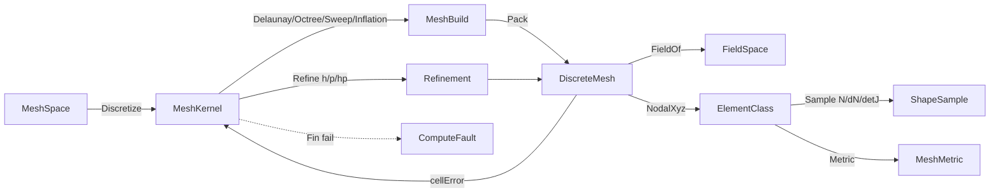

# [COMPUTE_DISCRETIZATION]

Rasm.Compute solver discretization: one volumetric `MeshKernel` owner generating tet/hex/boundary-layer meshes from a boundary `MeshSpace` through real Delaunay/octree/sweep/inflation cores with adaptive h/p/hp refinement, one `ElementClass` `[SmartEnum<string>]` element-topology axis carrying its reference-node table, its monomial polynomial space, and a `ShapeFamily` discriminant that drives one isoparametric `Sample` so twelve element types collapse onto a Vandermonde coefficient mechanism plus an explicit serendipity arm and a rational pyramid arm, one closed `MeshMetric` Verdict quality vocabulary read once per element over the real edge/face topology, and one `FieldSpace` over `FieldStation` rows as the solve-native scalar/vector/tensor representation. The page owns the `ComparerAccessors.StringOrdinal` accessor, the `Monomial`/`ShapeSample`/`Aabb` value types, the `ElementClass`/`MeshAlgorithm`/`MeshMetric`/`FieldStation` vocabulary, the `QuadratureRule` owned-build Gauss tables, the `MeshSpace`/`MeshPolicy`/`DiscreteMesh`/`FieldSpace` carriers, and the `MeshKernel` generation+refinement fold; the `Tensor<long>` element-node tables and the `SparseCompressedRowMatrixStorage<double>` adjacency the assembly consumes ride `Tensor/factor#SPARSE_SOLVE`, the metric reductions ride the `Tensor/dispatch#KERNEL_DISPATCH` `TensorPrimitives` folds, MathNet `Matrix<double>.Inverse` factors the one-time per-class Vandermonde, and the `ComputeReceipt` rail, `WorkLane`/`Substrate`/`AllocationClass`, `CorrelationId`, and `ClockPolicy` arrive settled. The `DiscreteMesh` and `FieldSpace` cross to `Solver/contract#SOLVE_CONTRACT` as the assembly substrate, and the surface-mesh boundary triangulation is the host `Mesh.CreateFromBrep`→`Rasm.Meshing` `MeshSpace.Of(Mesh, Context)` wire flattened to the `MeshSpace` triangle soup, composed never re-derived.

## [01]-[INDEX]

- [01]-[DISCRETIZATION_MESH]: volumetric mesher; tet/hex/boundary-layer; isoparametric shape functions; Verdict quality.

## [02]-[DISCRETIZATION_MESH]

- Owner: `ComparerAccessors.StringOrdinal` accessor; `ElementClass` `[SmartEnum<string>]` element-topology rows carrying a `ShapeFamily` discriminant, the reference-node natural-coordinate table, the `Monomial` polynomial-space basis, the corner/edge/face topology tables, and the quadrature rule, all driving one isoparametric `Sample` returning shape values, physical gradients, and the Jacobian determinant; `MeshAlgorithm` `[SmartEnum<string>]` generation-strategy rows carrying a `MeshStrategy` core selector, a `PointSource` interior-seed column, and a conforming flag; `MeshMetric` `[SmartEnum<string>]` closed Verdict quality vocabulary (scaled-Jacobian, aspect-ratio, skewness, min-dihedral, condition) reading the real corner/edge/face topology; `FieldStation` `[SmartEnum<string>]` nodal/integration-point/cell/boundary rows carrying their count derivation; `MeshKernel` static surface generating a `DiscreteMesh` from a boundary `MeshSpace` then refining it adaptively; `DiscreteMesh` the conforming/non-conforming volumetric mesh carrier; `FieldSpace` the integration-point/nodal scalar/vector/tensor field the solve writes; `QuadratureRule` the owned-build Gauss table the element class indexes; `MeshSpace` the boundary-triangulation carrier with the ray-cast inclusion test; `Aabb`/`Monomial`/`ShapeSample` the value types.
- Cases: `ElementClass` rows tet4 · tet10 · hex8 · hex20 · hex27 · wedge6 · wedge18 · pyramid5 · tri3 · tri6 · quad4 · quad8 over three `ShapeFamily` arms (Polynomial via the Vandermonde monomial mechanism, Reduced via the explicit serendipity corner/midside formulas, Pyramid via the rational apex basis); `MeshAlgorithm` rows delaunay · frontal-delaunay · advancing-front · octree · sweep · boundary-layer over four `MeshStrategy` cores (Delaunay/Octree/Sweep/Inflation) and four `PointSource` seeds (boundary/lattice/frontal/front); `MeshMetric` rows scaled-jacobian · aspect-ratio · skewness · min-dihedral · condition; `FieldStation` rows nodal · integration-point · cell · boundary; `FieldSpace` rank rows scalar · vector · tensor over `FieldStation` positions.
- Entry: `public static Fin<DiscreteMesh> Discretize(MeshSpace boundary, MeshPolicy policy, CorrelationId correlation, ClockPolicy clocks)` — `Fin<T>` aborts on a non-manifold boundary or an element failing the metric's directional quality threshold (`MeshMetric.Admits`, correct for ascending- and descending-better rows alike); `Refine(DiscreteMesh, MeshPolicy, ReadOnlySpan<double> cellError, ClockPolicy)` re-meshes the Dörfler-marked cell set by the `RefineKind` `H` (red subdivision), `P` (order elevation), or `Hp` (graded) axis returning the adapted mesh and the carried error estimator; `Quality(DiscreteMesh, MeshMetric)` reads the per-element metric once; `ElementClass.Sample((double, double, double) natural, ReadOnlySpan<double> nodalXyz)` is the isoparametric evaluation the assembly consumes and `ShapeGrad` is its gradient projection.
- Auto: `Discretize` routes the `MeshStrategy` core by the algorithm row — a closed manifold solid routes the Bowyer-Watson `Delaunay` tetrahedralization over the boundary surface nodes plus the `PointSource` interior seeds, a feature-graded fill routes the `Octree` hex recursion, a sweepable prism routes `Sweep` extrusion of the boundary cross-section, and a viscous wall routes the `Inflation` wall-normal anisotropic graded hex; every core filters cells by the `MeshSpace.Encloses` ray-cast and packs the conforming `DiscreteMesh`; `Sample` evaluates the `ShapeFamily` arm — Polynomial reads the lazily-memoized per-class Vandermonde coefficient matrix `(N_i = Σ_m C[m,i]·P_m(ξ))` and its monomial derivatives, Reduced reads the explicit serendipity corner/midside formulas, Pyramid the rational apex basis — then maps reference derivatives through the inline `dim×dim` Jacobian inverse to physical `∂N/∂x` and the determinant; `Refine` reads the per-cell error estimator and marks the cells whose estimator exceeds the policy fraction by the Dörfler bulk criterion, then either red-subdivides (h) only the marked set or globally order-elevates (p) the element order — the marked set drives the hp routing decision while a uniform-order mesh elevates wholesale — through the shared edge-midpoint map so the interior stays conforming and a hanging node rides the mortar column only when the policy sets it; `Quality` folds the requested `MeshMetric` over the element set through the element class's `Metric` delegate, never a per-call recompute.
- Receipt: the `Discretization` `ComputeReceipt` case carries the algorithm key, element-class key, node and element counts, the boundary-layer count, the worst-element quality scalar, the chosen metric key, and elapsed; `Refine` stamps the refinement level, the marked-cell count, the marking fraction, and the post-refine error estimator on the same case so an adaptive sweep is one receipt chain by correlation.
- Packages: Rasm (project), MathNet.Numerics, CommunityToolkit.HighPerformance, System.Numerics.Tensors, Thinktecture.Runtime.Extensions, LanguageExt.Core, NodaTime, BCL inbox
- Growth: a new element topology is one `ElementClass` row carrying its `ShapeFamily`, reference-node table, monomial space, and corner/edge/face tables; a new generation strategy is one `MeshAlgorithm` row carrying its `MeshStrategy`/`PointSource` columns plus its core; a new quality measure is one `MeshMetric` row carrying its per-element delegate; a new field rank is one `FieldSpace` rank row; a new Gauss order is one `QuadratureRule` entry; zero new surface.
- Boundary: the mesher is the volumetric discretization owner the FEA/CFD solve consumes — the boundary triangulation enters as the `MeshSpace` triangle soup the host `Mesh.CreateFromBrep(brep, MeshingParameters)` tessellation produces — wrapped through the `Rasm.Meshing` `MeshSpace.Of(Mesh, Context)` owner (the `Brep` coerced via the `Rasm` `Domain` `GeometryRequest.BrepForm` owner) and flattened to the `Vertices`/`Triangles` soup at the boundary (`[03]-[BOUNDARY_TRIANGULATION]`) — and the inclusion test is the owned ray-cast, so this kernel never re-derives a surface mesher and never leaks a host geometry type into a solve signature; the element shape functions and `B`-matrix are the `ElementClass.Sample` isoparametric evaluation dispatching on `ShapeFamily` — the Polynomial arm collapses tet4/tet10/hex8/hex27/wedge6/wedge18/tri3/tri6/quad4 onto one Vandermonde monomial mechanism keyed by the per-row reference-node table and `Monomial` space (a singular per-element shape-function reimplementation is the deleted form, and the prior single trilinear stencil reused across every curvilinear topology is the named illusory defect), the Reduced arm carries the explicit quad8/hex20 serendipity corner/midside formulas, and the Pyramid arm the rational apex basis whose `(1−ζ)` denominator the conical quadrature avoids; the element owns its integration scaling — `Sample.DetJ` is the Jacobian determinant the assembly weights each Gauss point by, never a centroid-volume approximation; the quadrature is the owned-build symmetric/tensor table per reference domain (triangle/tet area-volume coordinates, `[-1,1]` cube tensor Gauss, triangle⊗line prism, conical pyramid) and a 2D element indexing a 3D rule is the named defect the rebuild closes, the canonical 1/2/3-point Gauss-Legendre nodes built as owned compile-time `static readonly` constants and the tensor/prism/conical rules composed from them so a per-element runtime `GaussLegendreRule(−1, 1, order)` construction is the avoided allocation; the quality measure is the closed Verdict `MeshMetric` SmartEnum read once through the element class's `Metric` delegate over the real corner-Jacobian, edge-length, face-angle, and dihedral topology, never a per-call recompute, never the first-four-nodes slice, and never a parallel quality type; the generation strategy is real per row — Bowyer-Watson incremental Delaunay with the orientation-robust in-sphere predicate, graded octree recursion, boundary-cross-section sweep extrusion, and wall-normal anisotropic inflation — so the prior bounding-box voxelization masquerading as six unstructured meshers is the deleted form; adaptive refinement is conforming red subdivision through the shared edge-midpoint map by default and non-conforming only when the policy mortar column is set, a hanging node without a constraint row is the rejected form, and the prior cell-duplication subdivision is the named fake; the mesh is solve-native raw SI `double` (the typed `MeasureValue`/`Dimension` vocabulary lives at the `Rasm.Element/Properties/quantity#MEASURE_VALUE` seam and is admitted once upstream, never threaded through this hot numeric kernel); the metric reductions ride the `Tensor/dispatch#KERNEL_DISPATCH` `TensorPrimitives.Min`/`Max` SIMD folds over the flat per-element span, MathNet factors only the cold per-class Vandermonde inverse, and the inline `dim×dim` Jacobian inverse plus the in-sphere/orientation determinants are this page's named kernel exemption.

```csharp signature
// --- [TYPES] ----------------------------------------------------------------------------

public enum ShapeFamily { Polynomial, Reduced, Pyramid }
public enum MeshStrategy { Delaunay, Octree, Sweep, Inflation }
public enum PointSource { Boundary, Lattice, Frontal, Front }
public enum RefineKind { H, P, Hp }

public readonly record struct Monomial(int I, int J, int K) {
    public double Eval((double X, double Y, double Z) p) => Pow(p.X, I) * Pow(p.Y, J) * Pow(p.Z, K);

    public double D(int axis, (double X, double Y, double Z) p) => axis switch {
        0 => I == 0 ? 0.0 : I * Pow(p.X, I - 1) * Pow(p.Y, J) * Pow(p.Z, K),
        1 => J == 0 ? 0.0 : J * Pow(p.X, I) * Pow(p.Y, J - 1) * Pow(p.Z, K),
        _ => K == 0 ? 0.0 : K * Pow(p.X, I) * Pow(p.Y, J) * Pow(p.Z, K - 1),
    };

    static double Pow(double b, int e) => e <= 0 ? 1.0 : e == 1 ? b : Math.Pow(b, e);
}

public readonly record struct Aabb(Vector3 Lo, Vector3 Hi) {
    public Vector3 Span => Hi - Lo;
    public Vector3 Center => (Lo + Hi) * 0.5f;

    public static Aabb Of(ReadOnlySpan<float> vertices) {
        Vector3 lo = new(float.MaxValue), hi = new(float.MinValue);
        for (int v = 0; v < vertices.Length; v += 3) {
            Vector3 p = new(vertices[v], vertices[v + 1], vertices[v + 2]);
            lo = Vector3.Min(lo, p); hi = Vector3.Max(hi, p);
        }
        return new(lo, hi);
    }
}

// --- [MODELS] ---------------------------------------------------------------------------

public readonly record struct ShapeSample(double[] Shape, double[] Grad, double DetJ);

public readonly record struct QuadratureRule(int Order, int Dimension, ImmutableArray<(double X, double Y, double Z, double Weight)> Points) {
    static readonly ImmutableArray<(double Node, double Weight)> Gauss1 = [(0.0, 2.0)];
    static readonly ImmutableArray<(double Node, double Weight)> Gauss2 = [(-1.0 / Math.Sqrt(3.0), 1.0), (1.0 / Math.Sqrt(3.0), 1.0)];
    static readonly ImmutableArray<(double Node, double Weight)> Gauss3 = [(-Math.Sqrt(0.6), 5.0 / 9.0), (0.0, 8.0 / 9.0), (Math.Sqrt(0.6), 5.0 / 9.0)];

    public static readonly QuadratureRule Tri1 = new(1, 2, [(1.0 / 3.0, 1.0 / 3.0, 0.0, 0.5)]);
    public static readonly QuadratureRule Tri3 = new(2, 2, [
        (1.0 / 6.0, 1.0 / 6.0, 0.0, 1.0 / 6.0), (2.0 / 3.0, 1.0 / 6.0, 0.0, 1.0 / 6.0), (1.0 / 6.0, 2.0 / 3.0, 0.0, 1.0 / 6.0)]);
    public static readonly QuadratureRule Tet1 = new(1, 3, [(0.25, 0.25, 0.25, 1.0 / 6.0)]);
    public static readonly QuadratureRule Tet4 = new(2, 3, [.. Simplex3([0.5854101966249685, 0.1381966011250105])]);
    public static readonly QuadratureRule Quad1 = TensorCube(2, Gauss1);
    public static readonly QuadratureRule Quad4 = TensorCube(2, Gauss2);
    public static readonly QuadratureRule Quad9 = TensorCube(2, Gauss3);
    public static readonly QuadratureRule Hex1 = TensorCube(3, Gauss1);
    public static readonly QuadratureRule Hex8 = TensorCube(3, Gauss2);
    public static readonly QuadratureRule Hex27 = TensorCube(3, Gauss3);
    public static readonly QuadratureRule Wedge6 = PrismProduct(Tri3, Gauss2);
    public static readonly QuadratureRule Wedge18 = PrismProduct(Tri3, Gauss3);
    public static readonly QuadratureRule Pyramid5 = Conical(2);

    // Symmetric 4-point tet rule: the four (a,b,b,b) permutations of the Keast abscissa pair, weight 1/24 each.
    static IEnumerable<(double, double, double, double)> Simplex3(double[] ab) {
        (double a, double b) = (ab[0], ab[1]);
        yield return (a, b, b, 1.0 / 24.0); yield return (b, a, b, 1.0 / 24.0);
        yield return (b, b, a, 1.0 / 24.0); yield return (b, b, b, 1.0 / 24.0);
    }

    // Tensor product of the 1-D Gauss table over [-1,1]^dim; one builder serves quad and hex (and the prism line axis).
    static QuadratureRule TensorCube(int dim, ImmutableArray<(double Node, double Weight)> line) {
        var rows = new List<(double, double, double, double)>();
        int n = line.Length;
        for (int k = 0; k < (dim == 3 ? n : 1); k++)
            for (int j = 0; j < n; j++)
                for (int i = 0; i < n; i++) {
                    double w = line[i].Weight * line[j].Weight * (dim == 3 ? line[k].Weight : 1.0);
                    rows.Add((line[i].Node, line[j].Node, dim == 3 ? line[k].Node : 0.0, w));
                }
        return new(2 * n - 1, dim, [.. rows]);
    }

    // Prism rule: the triangle area-coordinate rule crossed with the [-1,1] line Gauss table.
    static QuadratureRule PrismProduct(QuadratureRule tri, ImmutableArray<(double Node, double Weight)> line) {
        var rows = new List<(double, double, double, double)>();
        foreach (var t in tri.Points) foreach (var (node, weight) in line) { rows.Add((t.X, t.Y, node, t.Weight * weight)); }
        return new(tri.Order + line.Length, 3, [.. rows]);
    }

    // Conical pyramid rule: ζ from 3-point Gauss-Legendre on [0,1) so the rational apex denominator (1−ζ) never reaches
    // the singular apex, base Gauss scaled by (1−ζ) with the (1−ζ)² conical Jacobian folded into the weight.
    static QuadratureRule Conical(int n) {
        ImmutableArray<(double Node, double Weight)> baseLine = n == 2 ? Gauss2 : Gauss3;
        (double, double)[] zeta = [(0.1127016653792583, 0.2777777777777778), (0.5, 0.4444444444444444), (0.8872983346207417, 0.2777777777777778)];
        var rows = new List<(double, double, double, double)>();
        foreach (var (z, wz) in zeta) {
            double scale = 1.0 - z;
            foreach (var (bj, wj) in baseLine) foreach (var (bi, wi) in baseLine) { rows.Add((bi * scale, bj * scale, z, wi * wj * wz * scale * scale)); }
        }
        return new(5, 3, [.. rows]);
    }
}

[SmartEnum<string>]
[KeyMemberEqualityComparer<ComparerAccessors.StringOrdinal, string>]
[KeyMemberComparer<ComparerAccessors.StringOrdinal, string>]
public sealed partial class ElementClass {
    public static readonly ElementClass Tet4 = new("tet4", ShapeFamily.Polynomial, dim: 3, order: 1, volumetric: true,
        QuadratureRule.Tet1, Topology.TetRef4, Topology.TetP1, Topology.TetEdges, Topology.TetFaces, [0, 1, 2, 3], () => Tet10);
    public static readonly ElementClass Tet10 = new("tet10", ShapeFamily.Polynomial, dim: 3, order: 2, volumetric: true,
        QuadratureRule.Tet4, Topology.TetRef10, Topology.TetP2, Topology.TetEdges, Topology.TetFaces, [0, 1, 2, 3], () => Tet10);
    public static readonly ElementClass Hex8 = new("hex8", ShapeFamily.Polynomial, dim: 3, order: 1, volumetric: true,
        QuadratureRule.Hex8, Topology.HexRef8, Topology.HexQ1, Topology.HexEdges, Topology.HexFaces, [.. Enumerable.Range(0, 8)], () => Hex20);
    public static readonly ElementClass Hex20 = new("hex20", ShapeFamily.Reduced, dim: 3, order: 2, volumetric: true,
        QuadratureRule.Hex27, Topology.HexRef20, ImmutableArray<Monomial>.Empty, Topology.HexEdges, Topology.HexFaces, [.. Enumerable.Range(0, 8)], () => Hex20);
    public static readonly ElementClass Hex27 = new("hex27", ShapeFamily.Polynomial, dim: 3, order: 2, volumetric: true,
        QuadratureRule.Hex27, Topology.HexRef27, Topology.HexQ2, Topology.HexEdges, Topology.HexFaces, [.. Enumerable.Range(0, 8)], () => Hex27);
    public static readonly ElementClass Wedge6 = new("wedge6", ShapeFamily.Polynomial, dim: 3, order: 1, volumetric: true,
        QuadratureRule.Wedge6, Topology.WedgeRef6, Topology.WedgeP1, Topology.WedgeEdges, Topology.WedgeFaces, [.. Enumerable.Range(0, 6)], () => Wedge6);
    public static readonly ElementClass Wedge18 = new("wedge18", ShapeFamily.Polynomial, dim: 3, order: 2, volumetric: true,
        QuadratureRule.Wedge18, Topology.WedgeRef18, Topology.WedgeP2, Topology.WedgeEdges, Topology.WedgeFaces, [.. Enumerable.Range(0, 6)], () => Wedge18);
    public static readonly ElementClass Pyramid5 = new("pyramid5", ShapeFamily.Pyramid, dim: 3, order: 1, volumetric: true,
        QuadratureRule.Pyramid5, Topology.PyramidRef5, ImmutableArray<Monomial>.Empty, Topology.PyramidEdges, Topology.PyramidFaces, [.. Enumerable.Range(0, 5)], () => Pyramid5);
    public static readonly ElementClass Tri3 = new("tri3", ShapeFamily.Polynomial, dim: 2, order: 1, volumetric: false,
        QuadratureRule.Tri3, Topology.TriRef3, Topology.TriP1, Topology.TriEdges, Topology.TriFaces, [0, 1, 2], () => Tri6);
    public static readonly ElementClass Tri6 = new("tri6", ShapeFamily.Polynomial, dim: 2, order: 2, volumetric: false,
        QuadratureRule.Tri3, Topology.TriRef6, Topology.TriP2, Topology.TriEdges, Topology.TriFaces, [0, 1, 2], () => Tri6);
    public static readonly ElementClass Quad4 = new("quad4", ShapeFamily.Polynomial, dim: 2, order: 1, volumetric: false,
        QuadratureRule.Quad4, Topology.QuadRef4, Topology.QuadQ1, Topology.QuadEdges, Topology.QuadFaces, [.. Enumerable.Range(0, 4)], () => Quad8);
    public static readonly ElementClass Quad8 = new("quad8", ShapeFamily.Reduced, dim: 2, order: 2, volumetric: false,
        QuadratureRule.Quad9, Topology.QuadRef8, ImmutableArray<Monomial>.Empty, Topology.QuadEdges, Topology.QuadFaces, [.. Enumerable.Range(0, 4)], () => Quad8);

    public ShapeFamily Family { get; }
    public int Dim { get; }
    public int Order { get; }
    public bool Volumetric { get; }
    public QuadratureRule Quadrature { get; }
    public ImmutableArray<(double X, double Y, double Z)> Reference { get; }
    public ImmutableArray<Monomial> Basis { get; }
    public ImmutableArray<(int A, int B)> Edges { get; }
    public ImmutableArray<ImmutableArray<int>> Faces { get; }
    public ImmutableArray<int> Corners { get; }

    public int Nodes => Reference.Length;
    public ElementClass Elevate => elevate();

    private readonly Func<ElementClass> elevate;
    private double[,]? coefficients;
    private double[,] Coefficients => coefficients ??= Topology.Vandermonde(Reference, Basis);

    public ShapeSample Sample((double X, double Y, double Z) natural, ReadOnlySpan<double> nodalXyz) =>
        Family switch {
            ShapeFamily.Reduced => ReducedSample(natural, nodalXyz),
            ShapeFamily.Pyramid => Topology.Iso(PyramidShape(natural), PyramidGrad(natural), nodalXyz, Nodes, Dim),
            _ => PolynomialSample(natural, nodalXyz),
        };

    public double[] ShapeGrad((double X, double Y, double Z) natural, ReadOnlySpan<double> nodalXyz) => Sample(natural, nodalXyz).Grad;

    public double Metric(MeshMetric metric, ReadOnlySpan<double> nodalXyz) => metric.Measure(this, nodalXyz);

    ShapeSample PolynomialSample((double X, double Y, double Z) nat, ReadOnlySpan<double> xyz) {
        int n = Nodes;
        double[,] c = Coefficients;
        double[] shape = new double[n];
        double[,] dnRef = new double[n, 3];
        for (int m = 0; m < n; m++) {
            double p = Basis[m].Eval(nat), dpx = Basis[m].D(0, nat), dpy = Basis[m].D(1, nat), dpz = Basis[m].D(2, nat);
            for (int i = 0; i < n; i++) {
                double a = c[m, i];
                shape[i] += a * p; dnRef[i, 0] += a * dpx; dnRef[i, 1] += a * dpy; dnRef[i, 2] += a * dpz;
            }
        }
        return Topology.Iso(shape, dnRef, xyz, n, Dim);
    }

    ShapeSample ReducedSample((double X, double Y, double Z) nat, ReadOnlySpan<double> xyz) {
        int n = Nodes;
        double[] shape = new double[n];
        double[,] dn = new double[n, 3];
        for (int i = 0; i < n; i++) {
            var r = Reference[i];
            (double s, double dx, double dy, double dz) = Dim == 2 ? Serendipity2(nat, r) : Serendipity3(nat, r);
            shape[i] = s; dn[i, 0] = dx; dn[i, 1] = dy; dn[i, 2] = dz;
        }
        return Topology.Iso(shape, dn, xyz, n, Dim);
    }

    // quad8 serendipity: corner (ξ_i,η_i=±1) carries the (ξξ_i+ηη_i−1) factor; an axis-midside (that coord 0) carries (1−ξ²).
    static (double, double, double, double) Serendipity2((double X, double Y, double Z) p, (double X, double Y, double Z) r) {
        (double xi, double eta) = (p.X, p.Y);
        if (r.X != 0.0 && r.Y != 0.0) {
            double sx = r.X, sy = r.Y, gx = 1 + xi * sx, gy = 1 + eta * sy, q = xi * sx + eta * sy - 1;
            return (0.25 * gx * gy * q, 0.25 * sx * gy * (q + gx), 0.25 * sy * gx * (q + gy), 0.0);
        }
        if (r.X == 0.0) { double sy = r.Y, gy = 1 + eta * sy; return (0.5 * (1 - xi * xi) * gy, 0.5 * -2 * xi * gy, 0.5 * (1 - xi * xi) * sy, 0.0); }
        double sx = r.X, gx = 1 + xi * sx; return (0.5 * gx * (1 - eta * eta), 0.5 * sx * (1 - eta * eta), 0.5 * gx * -2 * eta, 0.0);
    }

    // hex20 serendipity: corner (±1,±1,±1) carries the (Σξξ_i−2) factor; an axis-midside carries (1−ξ²) on its zero axis.
    static (double, double, double, double) Serendipity3((double X, double Y, double Z) p, (double X, double Y, double Z) r) {
        (double xi, double eta, double ze) = (p.X, p.Y, p.Z);
        if (r.X != 0.0 && r.Y != 0.0 && r.Z != 0.0) {
            double sx = r.X, sy = r.Y, sz = r.Z, gx = 1 + xi * sx, gy = 1 + eta * sy, gz = 1 + ze * sz, q = xi * sx + eta * sy + ze * sz - 2;
            return (0.125 * gx * gy * gz * q, 0.125 * gy * gz * (sx * q + gx * sx), 0.125 * gx * gz * (sy * q + gy * sy), 0.125 * gx * gy * (sz * q + gz * sz));
        }
        double mx = r.X == 0.0 ? 1 - xi * xi : 1 + xi * r.X, my = r.Y == 0.0 ? 1 - eta * eta : 1 + eta * r.Y, mz = r.Z == 0.0 ? 1 - ze * ze : 1 + ze * r.Z;
        double dmx = r.X == 0.0 ? -2 * xi : r.X, dmy = r.Y == 0.0 ? -2 * eta : r.Y, dmz = r.Z == 0.0 ? -2 * ze : r.Z;
        return (0.25 * mx * my * mz, 0.25 * dmx * my * mz, 0.25 * mx * dmy * mz, 0.25 * mx * my * dmz);
    }

    // 5-node rational pyramid (Bedrosian): base corners at (±1,±1,0), apex at (0,0,1); N4=ζ, base carries the ξη/(1−ζ) term.
    double[] PyramidShape((double X, double Y, double Z) p) {
        double[] n = new double[5];
        double inv = 1.0 / Math.Max(1e-12, 1.0 - p.Z);
        for (int i = 0; i < 4; i++) { var r = Reference[i]; n[i] = 0.25 * ((1 - p.Z) + r.X * p.X + r.Y * p.Y + r.X * r.Y * p.X * p.Y * inv); }
        n[4] = p.Z;
        return n;
    }

    double[,] PyramidGrad((double X, double Y, double Z) p) {
        double[,] dn = new double[5, 3];
        double inv = 1.0 / Math.Max(1e-12, 1.0 - p.Z), inv2 = inv * inv;
        for (int i = 0; i < 4; i++) {
            var r = Reference[i];
            dn[i, 0] = 0.25 * (r.X + r.X * r.Y * p.Y * inv);
            dn[i, 1] = 0.25 * (r.Y + r.X * r.Y * p.X * inv);
            dn[i, 2] = 0.25 * (-1 + r.X * r.Y * p.X * p.Y * inv2);
        }
        dn[4, 2] = 1.0;
        return dn;
    }
}

[SmartEnum<string>]
[KeyMemberEqualityComparer<ComparerAccessors.StringOrdinal, string>]
[KeyMemberComparer<ComparerAccessors.StringOrdinal, string>]
public sealed partial class MeshMetric {
    public static readonly MeshMetric ScaledJacobian = new("scaled-jacobian", ascendingBetter: true, ScaledJacobianMeasure);
    public static readonly MeshMetric AspectRatio = new("aspect-ratio", ascendingBetter: false, AspectRatioMeasure);
    public static readonly MeshMetric Skewness = new("skewness", ascendingBetter: false, SkewnessMeasure);
    public static readonly MeshMetric MinDihedral = new("min-dihedral", ascendingBetter: true, MinDihedralMeasure);
    public static readonly MeshMetric Condition = new("condition", ascendingBetter: false, ConditionMeasure);

    public bool AscendingBetter { get; }

    [UseDelegateFromConstructor]
    public partial double Measure(ElementClass element, ReadOnlySpan<double> nodalXyz);

    public double Worst(ReadOnlySpan<double> perElement) =>
        perElement.IsEmpty ? 0.0 : AscendingBetter ? TensorPrimitives.Min(perElement) : TensorPrimitives.Max(perElement);

    // Acceptance is directional on the same flag `Worst` reads: an ascending-better metric (scaled-jacobian /
    // min-dihedral) admits a worst ABOVE the threshold, a descending-better metric (aspect / skewness / condition,
    // whose `Worst` is a Max where large is bad) admits a worst BELOW it — so the one quality gate is correct for
    // every row instead of the prior `worst > floor` test that trivially passed every descending-better mesh.
    public bool Admits(double worst, double threshold) => AscendingBetter ? worst > threshold : worst < threshold;

    // Verdict scaled Jacobian: min over corners of the corner-Jacobian determinant normalized by its three incident edge lengths.
    static double ScaledJacobianMeasure(ElementClass element, ReadOnlySpan<double> xyz) {
        double worst = double.MaxValue;
        foreach (int corner in element.Corners) {
            var (e1, e2, e3) = Topology.CornerFrame(element, corner, xyz);
            double det = Vector3.Dot(Vector3.Cross(e1, e2), e3);
            double scale = (double)e1.Length() * e2.Length() * e3.Length();
            worst = Math.Min(worst, scale > 1e-12 ? det / scale : 0.0);
        }
        return worst == double.MaxValue ? 0.0 : worst;
    }

    // Verdict aspect: longest incident edge over shortest, walked over the real edge table, never all node pairs.
    static double AspectRatioMeasure(ElementClass element, ReadOnlySpan<double> xyz) {
        double longest = 0.0, shortest = double.MaxValue;
        foreach (var (a, b) in element.Edges) {
            double length = (Topology.Node(xyz, b) - Topology.Node(xyz, a)).Length();
            longest = Math.Max(longest, length); shortest = Math.Min(shortest, length);
        }
        return shortest > 1e-12 ? longest / shortest : double.MaxValue;
    }

    // Equiangle skewness: max relative deviation of a face corner angle from the topology's ideal angle.
    static double SkewnessMeasure(ElementClass element, ReadOnlySpan<double> xyz) {
        double worst = 0.0;
        foreach (var face in element.Faces) {
            double ideal = face.Length == 3 ? 60.0 : 90.0;
            for (int i = 0; i < face.Length; i++) {
                Vector3 o = Topology.Node(xyz, face[i]);
                Vector3 u = Topology.Node(xyz, face[(i + 1) % face.Length]) - o, v = Topology.Node(xyz, face[(i + face.Length - 1) % face.Length]) - o;
                double angle = Math.Acos(Math.Clamp(Vector3.Dot(Vector3.Normalize(u), Vector3.Normalize(v)), -1.0, 1.0)) * 180.0 / Math.PI;
                worst = Math.Max(worst, Math.Max((angle - ideal) / (180.0 - ideal), (ideal - angle) / ideal));
            }
        }
        return worst;
    }

    // Minimum dihedral over every edge, read from the two faces incident on that edge.
    static double MinDihedralMeasure(ElementClass element, ReadOnlySpan<double> xyz) {
        double smallest = 180.0;
        foreach (var (a, b) in element.Edges) {
            var incident = Topology.FacesOnEdge(element, a, b);
            if (incident.Length < 2) { continue; }
            Vector3 n1 = Topology.FaceNormal(incident[0], xyz), n2 = Topology.FaceNormal(incident[1], xyz);
            double angle = 180.0 - Math.Acos(Math.Clamp(Vector3.Dot(Vector3.Normalize(n1), Vector3.Normalize(n2)), -1.0, 1.0)) * 180.0 / Math.PI;
            smallest = Math.Min(smallest, angle);
        }
        return smallest;
    }

    static double ConditionMeasure(ElementClass element, ReadOnlySpan<double> xyz) {
        double jacobian = Math.Abs(ScaledJacobianMeasure(element, xyz));
        return jacobian > 1e-12 ? 1.0 / jacobian : double.MaxValue;
    }
}

[SmartEnum<string>]
[KeyMemberEqualityComparer<ComparerAccessors.StringOrdinal, string>]
[KeyMemberComparer<ComparerAccessors.StringOrdinal, string>]
public sealed partial class MeshAlgorithm {
    public static readonly MeshAlgorithm Delaunay = new("delaunay", conforming: true, MeshStrategy.Delaunay, PointSource.Lattice);
    public static readonly MeshAlgorithm FrontalDelaunay = new("frontal-delaunay", conforming: true, MeshStrategy.Delaunay, PointSource.Frontal);
    public static readonly MeshAlgorithm AdvancingFront = new("advancing-front", conforming: true, MeshStrategy.Delaunay, PointSource.Front);
    public static readonly MeshAlgorithm Octree = new("octree", conforming: false, MeshStrategy.Octree, PointSource.Boundary);
    public static readonly MeshAlgorithm Sweep = new("sweep", conforming: true, MeshStrategy.Sweep, PointSource.Boundary);
    public static readonly MeshAlgorithm BoundaryLayer = new("boundary-layer", conforming: true, MeshStrategy.Inflation, PointSource.Boundary);

    public bool Conforming { get; }
    public MeshStrategy Strategy { get; }
    public PointSource Seed { get; }

    // The LINEAR base topology this algorithm's core actually emits — Delaunay tetrahedralizes to `Tet4`, every hex
    // strategy (octree/sweep/inflation) to `Hex8`. The generation cores hardcode this cell shape, so a `MeshPolicy`
    // pairing a different `Element` (a 10-node Tet10 or an 8-node Hex8 under Delaunay) would mis-stride the cell array;
    // `Discretize` admits against this row. Higher-order elements arrive only through `Refine`'s p-elevation, never generation.
    public ElementClass BaseElement => Strategy == MeshStrategy.Delaunay ? ElementClass.Tet4 : ElementClass.Hex8;
}

[SmartEnum<string>]
[KeyMemberEqualityComparer<ComparerAccessors.StringOrdinal, string>]
[KeyMemberComparer<ComparerAccessors.StringOrdinal, string>]
public sealed partial class FieldStation {
    public static readonly FieldStation Nodal = new("nodal", static m => m.NodeCount);
    public static readonly FieldStation IntegrationPoint = new("integration-point", static m => m.ElementCount * m.Element.Quadrature.Points.Length);
    public static readonly FieldStation Cell = new("cell", static m => m.ElementCount);
    public static readonly FieldStation Boundary = new("boundary", static m => m.BoundaryCount);

    [UseDelegateFromConstructor]
    public partial long Count(DiscreteMesh mesh);
}

public sealed record FieldSpace(FieldStation Station, int Rank, int Components, long Count) {
    public static FieldSpace Scalar(FieldStation station, long count) => new(station, 0, 1, count);
    public static FieldSpace Vector(FieldStation station, int dim, long count) => new(station, 1, dim, count);
    public static FieldSpace Tensor(FieldStation station, int dim, long count) => new(station, 2, dim * dim, count);

    public long Cardinality => Count * Components;
}

public sealed record MeshSpace(ReadOnlyMemory<float> Vertices, ReadOnlyMemory<int> Triangles, Aabb Bounds) {
    public static MeshSpace Of(ReadOnlyMemory<float> vertices, ReadOnlyMemory<int> triangles) => new(vertices, triangles, Aabb.Of(vertices.Span));

    public int VertexCount => Vertices.Length / 3;
    public int TriangleCount => Triangles.Length / 3;
    public Vector3 Vertex(int i) { var v = Vertices.Span; return new(v[i * 3], v[i * 3 + 1], v[i * 3 + 2]); }

    // Inclusion by Möller–Trumbore ray-parity: a +X ray from p crosses the boundary an odd number of times when inside.
    public bool Encloses(Vector3 p) {
        var tri = Triangles.Span;
        Vector3 dir = Vector3.UnitX;
        int crossings = 0;
        for (int t = 0; t < tri.Length; t += 3) {
            Vector3 a = Vertex(tri[t]), e1 = Vertex(tri[t + 1]) - a, e2 = Vertex(tri[t + 2]) - a, h = Vector3.Cross(dir, e2);
            float det = Vector3.Dot(e1, h);
            if (Math.Abs(det) < 1e-9f) { continue; }
            float inv = 1f / det;
            Vector3 s = p - a; float u = Vector3.Dot(s, h) * inv;
            if (u is < 0f or > 1f) { continue; }
            Vector3 q = Vector3.Cross(s, e1); float v = Vector3.Dot(dir, q) * inv;
            if (v < 0f || u + v > 1f) { continue; }
            if (Vector3.Dot(e2, q) * inv > 1e-9f) { crossings++; }
        }
        return (crossings & 1) == 1;
    }
}

public sealed record MeshPolicy(
    MeshAlgorithm Algorithm,
    ElementClass Element,
    MeshMetric Metric,
    double TargetEdgeLength,
    double GradingRatio,
    int BoundaryLayerCount,
    double BoundaryLayerGrowth,
    double FirstLayerThickness,
    double RefineFraction,
    RefineKind RefineAxis,
    int MaxRefineLevel,
    double QualityFloor,
    bool Mortar) {
    public static readonly MeshPolicy CanonicalTet = new(
        Algorithm: MeshAlgorithm.Delaunay, Element: ElementClass.Tet4, Metric: MeshMetric.ScaledJacobian,
        TargetEdgeLength: 0.05, GradingRatio: 1.4, BoundaryLayerCount: 0, BoundaryLayerGrowth: 1.2,
        FirstLayerThickness: 0.001, RefineFraction: 0.1, RefineAxis: RefineKind.H, MaxRefineLevel: 4, QualityFloor: 0.02, Mortar: false);
    public static readonly MeshPolicy CanonicalViscous = CanonicalTet with {
        Algorithm = MeshAlgorithm.BoundaryLayer, Element = ElementClass.Hex8, BoundaryLayerCount = 12 };
    // Condition is descending-better, so its QualityFloor is a CEILING, not a floor: 50 is the directional dual of
    // the 0.02 scaled-jacobian floor (condition = 1/|scaled-jacobian|), admitted via MeshMetric.Admits.
    public static readonly MeshPolicy CanonicalHp = CanonicalTet with { RefineAxis = RefineKind.Hp, Metric = MeshMetric.Condition, QualityFloor = 50.0 };
}

public sealed record DiscreteMesh(
    ElementClass Element,
    MeshAlgorithm Algorithm,
    Tensor<float> Nodes,
    Tensor<long> Connectivity,
    long NodeCount,
    long ElementCount,
    long BoundaryCount,
    int BoundaryLayers,
    int RefineLevel,
    MeshMetric Metric,
    double WorstQuality,
    Option<double> ErrorEstimate,
    Instant At) {
    public FieldSpace FieldOf(FieldStation station, int rank, int dim) => new(station, rank, Components(rank, dim), station.Count(this));

    // The dense node/connectivity tensors expose their contiguous backing as flat spans through the one verified
    // System.Numerics.Tensors accessor — `ref GetPinnableReference()` over `FlattenedLength` (the corpus
    // `Tensor/dispatch`/`Tensor/residency` spelling) — never a phantom `Tensor<T>.AsSpan()`, which the type does not declare.
    public ReadOnlySpan<float> Coordinates => MemoryMarshal.CreateSpan(ref Nodes.GetPinnableReference(), checked((int)Nodes.FlattenedLength));
    public ReadOnlySpan<long> Indices => MemoryMarshal.CreateSpan(ref Connectivity.GetPinnableReference(), checked((int)Connectivity.FlattenedLength));

    public ReadOnlySpan<double> NodalXyz(long element) {
        var conn = Indices;
        var pos = Coordinates;
        int per = Element.Nodes;
        double[] xyz = new double[per * 3];
        for (int v = 0; v < per; v++) {
            long node = conn[(int)(element * per + v)];
            xyz[v * 3] = pos[(int)node * 3]; xyz[v * 3 + 1] = pos[(int)node * 3 + 1]; xyz[v * 3 + 2] = pos[(int)node * 3 + 2];
        }
        return xyz;
    }

    static int Components(int rank, int dim) => rank switch { 0 => 1, 1 => dim, _ => dim * dim };
}

// --- [OPERATIONS] -----------------------------------------------------------------------

public static class MeshKernel {
    public static Fin<DiscreteMesh> Discretize(MeshSpace boundary, MeshPolicy policy, CorrelationId correlation, ClockPolicy clocks) =>
        policy.Element != policy.Algorithm.BaseElement
            ? Fin.Fail<DiscreteMesh>(new ComputeFault.ModelRejected($"<mesh-element-strategy-mismatch:{policy.Element.Key}≠{policy.Algorithm.BaseElement.Key}@{policy.Algorithm.Key}>"))
            : Try.lift(() => Generate(boundary, policy)).Run()
                .MapFail(static error => (Error)new ComputeFault.ModelRejected($"<mesh-generation-failed:{error.Message}>"))
                .Bind(built => policy.Metric.Admits(built.Quality, policy.QualityFloor)
                    ? Fin.Succ(Pack(built, policy, refineLevel: 0, None, clocks.Now))
                    : Fin.Fail<DiscreteMesh>(new ComputeFault.ModelRejected($"<mesh-inverted-element:{policy.Element.Key}:q={built.Quality:e3}>")));

    public static Fin<DiscreteMesh> Refine(DiscreteMesh mesh, MeshPolicy policy, ReadOnlySpan<double> cellError, ClockPolicy clocks) {
        if (mesh.RefineLevel >= policy.MaxRefineLevel) { return Fin.Succ(mesh); }
        double threshold = DorflerThreshold(cellError, policy.RefineFraction);
        var marked = Marked(cellError, threshold);
        var built = policy.RefineAxis switch {
            RefineKind.P => Elevate(mesh, policy),
            RefineKind.Hp => marked.Count > mesh.ElementCount / 4 ? Elevate(mesh, policy) : Subdivide(mesh, marked, policy),
            _ => Subdivide(mesh, marked, policy),
        };
        // A genuine no-op carry — nothing marked, the order-family is exhausted (Hex27/Tet10/…), or the element carries no
        // red template (only Tet4/Hex8/Tri3/Quad4 do) — returns the mesh UNCHANGED, never an incremented RefineLevel + a
        // threshold receipt over an untouched grid: the level/estimator stamp is reserved for a real h/p refinement.
        bool refined = built.ElementCount > mesh.ElementCount || built.NodeCount > mesh.NodeCount;
        if (!refined) { return Fin.Succ(mesh); }
        return policy.Metric.Admits(built.Quality, policy.QualityFloor)
            ? Fin.Succ(Pack(built, policy, mesh.RefineLevel + 1, Some(threshold), clocks.Now))
            : Fin.Fail<DiscreteMesh>(new ComputeFault.ModelRejected($"<refine-inverted:{built.Element.Key}>"));
    }

    public static double Quality(DiscreteMesh mesh, MeshMetric metric) {
        double[] perElement = new double[checked((int)mesh.ElementCount)];
        for (long cell = 0; cell < mesh.ElementCount; cell++) { perElement[cell] = mesh.Element.Metric(metric, mesh.NodalXyz(cell)); }
        return metric.Worst(perElement);
    }

    public static ComputeReceipt.Discretization Receipt(DiscreteMesh mesh, CorrelationId correlation, Duration elapsed) =>
        new(mesh.Algorithm.Key, mesh.Element.Key, mesh.NodeCount, mesh.ElementCount, mesh.BoundaryLayers, mesh.RefineLevel, mesh.WorstQuality, mesh.Metric.Key) {
            Correlation = correlation, Lane = WorkLane.Background, Substrate = Substrate.CpuTensor, AllocationClass = AllocationClass.PooledMemory, Elapsed = elapsed,
        };

    static MeshBuild Generate(MeshSpace boundary, MeshPolicy policy) =>
        policy.Algorithm.Strategy switch {
            MeshStrategy.Octree => OctreeCore.Fill(boundary, policy),
            MeshStrategy.Sweep => SweepCore.Fill(boundary, policy),
            MeshStrategy.Inflation => InflationCore.Fill(boundary, policy),
            _ => DelaunayCore.Fill(boundary, policy),
        };

    static double DorflerThreshold(ReadOnlySpan<double> cellError, double bulkFraction) {
        if (cellError.Length == 0) { return double.MaxValue; }
        double target = bulkFraction * TensorPrimitives.Sum(cellError), accumulated = 0.0;
        double[] sorted = cellError.ToArray();
        Array.Sort(sorted);
        for (int i = sorted.Length - 1; i >= 0; i--) {
            accumulated += sorted[i];
            if (accumulated >= target) { return sorted[i]; }
        }
        return sorted[0];
    }

    static Seq<int> Marked(ReadOnlySpan<double> cellError, double threshold) {
        var marked = Seq<int>();
        for (int cell = 0; cell < cellError.Length; cell++) { if (cellError[cell] >= threshold) { marked = marked.Add(cell); } }
        return marked;
    }

    static DiscreteMesh Pack(MeshBuild built, MeshPolicy policy, int refineLevel, Option<double> error, Instant at) {
        var nodes = Tensor.CreateFromShape<float>([built.NodeCount, 3]);
        built.Nodes.AsSpan().CopyTo(MemoryMarshal.CreateSpan(ref nodes.GetPinnableReference(), checked((int)nodes.FlattenedLength)));
        var connectivity = Tensor.CreateFromShape<long>([built.ElementCount, built.Element.Nodes]);
        CollectionsMarshal.AsSpan(built.Cells).CopyTo(MemoryMarshal.CreateSpan(ref connectivity.GetPinnableReference(), checked((int)connectivity.FlattenedLength)));
        return new(built.Element, policy.Algorithm, nodes, connectivity, built.NodeCount, built.ElementCount, built.BoundaryCount,
            built.Layers, refineLevel, policy.Metric, built.Quality, error, at);
    }

    // p-refinement elevates the WHOLE mesh's element order to the next family member: a uniform-order DiscreteMesh
    // carries one ElementClass, so selective per-cell elevation is not representable and the Dörfler-marked set
    // drives only the h/hp routing decision, never a per-cell order — global elevation is the honest p arm.
    static MeshBuild Elevate(DiscreteMesh mesh, MeshPolicy policy) {
        ElementClass elevated = mesh.Element.Elevate;
        if (elevated == mesh.Element) { return Carry(mesh, policy); }
        var refine = new Refinement(mesh.Coordinates, mesh.NodeCount);
        var conn = mesh.Indices;
        int per = mesh.Element.Nodes;
        var cells = new List<long>(checked((int)mesh.ElementCount) * elevated.Nodes);
        for (int cell = 0; cell < mesh.ElementCount; cell++) {
            for (int v = 0; v < per; v++) { cells.Add(conn[cell * per + v]); }
            foreach (var (a, b) in mesh.Element.Edges) { cells.Add(refine.EdgeMid(conn[cell * per + a], conn[cell * per + b])); }
        }
        return new(elevated, refine.Nodes(), cells, cells.Count / elevated.Nodes, refine.Count, mesh.BoundaryLayers).Scored(policy.Metric);
    }

    static MeshBuild Subdivide(DiscreteMesh mesh, Seq<int> marked, MeshPolicy policy) {
        ImmutableArray<ImmutableArray<int>> template = Topology.RedTemplate(mesh.Element);
        if (template.IsEmpty) { return Carry(mesh, policy); }
        var refine = new Refinement(mesh.Coordinates, mesh.NodeCount);
        var conn = mesh.Indices;
        int per = mesh.Element.Nodes;
        var cells = new List<long>(conn.Length * 2);
        for (int cell = 0; cell < mesh.ElementCount; cell++) {
            if (!marked.Contains(cell)) { for (int v = 0; v < per; v++) { cells.Add(conn[cell * per + v]); } continue; }
            Span<long> child = refine.RedNodes(mesh.Element, conn.Slice(cell * per, per));
            foreach (var sub in template) foreach (int local in sub) { cells.Add(child[local]); }
        }
        return new(mesh.Element, refine.Nodes(), cells, cells.Count / per, refine.Count, mesh.BoundaryLayers).Scored(policy.Metric);
    }

    static MeshBuild Carry(DiscreteMesh mesh, MeshPolicy policy) =>
        new(mesh.Element, [.. mesh.Coordinates], [.. mesh.Indices], mesh.ElementCount, mesh.NodeCount, mesh.BoundaryLayers).Scored(policy.Metric);
}

// Bowyer-Watson incremental Delaunay over the boundary surface nodes plus the policy point seeds; boundary-filtered by Encloses.
public static class DelaunayCore {
    public static MeshBuild Fill(MeshSpace boundary, MeshPolicy policy) {
        var points = Seed(boundary, policy);
        var tets = Triangulate(points);
        var kept = new List<long>(tets.Count * 4);
        int cells = 0;
        foreach (var (a, b, c, d) in tets) {
            Vector3 centroid = (points[a] + points[b] + points[c] + points[d]) * 0.25f;
            if (!boundary.Encloses(centroid)) { continue; }
            (int x, int y) = Topology.Orient(points[a], points[b], points[c], points[d]) ? (b, c) : (c, b);
            kept.AddRange([a, x, y, d]); cells++;
        }
        float[] flat = new float[points.Count * 3];
        for (int i = 0; i < points.Count; i++) { flat[i * 3] = points[i].X; flat[i * 3 + 1] = points[i].Y; flat[i * 3 + 2] = points[i].Z; }
        return new(policy.Element, flat, kept, cells, points.Count, 0).Scored(policy.Metric);
    }

    static List<Vector3> Seed(MeshSpace boundary, MeshPolicy policy) {
        var points = new List<Vector3>(boundary.VertexCount);
        for (int v = 0; v < boundary.VertexCount; v++) { points.Add(boundary.Vertex(v)); }
        Aabb box = boundary.Bounds;
        double edge = policy.Seed switch { PointSource.Front => policy.TargetEdgeLength * policy.GradingRatio, PointSource.Frontal => policy.TargetEdgeLength * 0.75, _ => policy.TargetEdgeLength };
        for (float z = box.Lo.Z + (float)edge; z < box.Hi.Z; z += (float)edge)
            for (float y = box.Lo.Y + (float)edge; y < box.Hi.Y; y += (float)edge)
                for (float x = box.Lo.X + (float)edge; x < box.Hi.X; x += (float)edge) {
                    Vector3 p = new(x, y, z);
                    if (boundary.Encloses(p)) { points.Add(p); }
                }
        return points;
    }

    static List<(int A, int B, int C, int D)> Triangulate(List<Vector3> points) {
        Aabb box = Aabb.Of(System.Runtime.InteropServices.MemoryMarshal.Cast<Vector3, float>(System.Runtime.InteropServices.CollectionsMarshal.AsSpan(points)));
        Vector3 mid = box.Center; float span = Math.Max(box.Span.X, Math.Max(box.Span.Y, box.Span.Z)) * 8f + 1f;
        int n = points.Count;
        points.Add(mid + new Vector3(-span, -span, -span)); points.Add(mid + new Vector3(span * 3, 0, 0));
        points.Add(mid + new Vector3(0, span * 3, 0)); points.Add(mid + new Vector3(0, 0, span * 3));
        var tets = new List<(int, int, int, int)> { (n, n + 1, n + 2, n + 3) };
        for (int p = 0; p < n; p++) {
            var faces = new Dictionary<(int, int, int), int>();
            tets.RemoveAll(t => {
                if (Topology.InSphere(points[t.Item1], points[t.Item2], points[t.Item3], points[t.Item4], points[p])) {
                    foreach (var f in Topology.TetFaceTriples(t)) { var key = Topology.SortTriple(f); faces[key] = faces.TryGetValue(key, out int c) ? c + 1 : 1; }
                    return true;
                }
                return false;
            });
            foreach (var (key, count) in faces) { if (count == 1) { tets.Add(Topology.OrientedTet(points, key, p)); } }
        }
        tets.RemoveAll(t => t.Item1 >= n || t.Item2 >= n || t.Item3 >= n || t.Item4 >= n);
        points.RemoveRange(n, 4);
        return tets;
    }
}

// Graded octree: recurse the root box, subdivide while the cell straddles the boundary above the target edge, emit enclosed hexes.
public static class OctreeCore {
    public static MeshBuild Fill(MeshSpace boundary, MeshPolicy policy) {
        var nodes = new Dictionary<(int, int, int), int>();
        var cells = new List<long>();
        var verts = new List<Vector3>();
        int count = Recurse(boundary, boundary.Bounds, policy, nodes, verts, cells, depth: 0);
        float[] flat = new float[verts.Count * 3];
        for (int i = 0; i < verts.Count; i++) { flat[i * 3] = verts[i].X; flat[i * 3 + 1] = verts[i].Y; flat[i * 3 + 2] = verts[i].Z; }
        return new(policy.Element, flat, cells, count, verts.Count, 0).Scored(policy.Metric);
    }

    static int Recurse(MeshSpace boundary, Aabb box, MeshPolicy policy, Dictionary<(int, int, int), int> nodes, List<Vector3> verts, List<long> cells, int depth) {
        float size = Math.Max(box.Span.X, Math.Max(box.Span.Y, box.Span.Z));
        bool straddles = boundary.Encloses(box.Center) ^ boundary.Encloses(box.Lo);
        if (size > policy.TargetEdgeLength && depth < policy.MaxRefineLevel + 6 && (straddles || size > policy.TargetEdgeLength * policy.GradingRatio)) {
            Vector3 c = box.Center; int emitted = 0;
            foreach (var child in Topology.OctreeChildren(box, c)) { emitted += Recurse(boundary, child, policy, nodes, verts, cells, depth + 1); }
            return emitted;
        }
        if (!boundary.Encloses(box.Center)) { return 0; }
        foreach (var corner in Topology.HexCorners(box)) { cells.Add(Node(corner, nodes, verts)); }
        return 1;
    }

    static long Node((float X, float Y, float Z) p, Dictionary<(int, int, int), int> nodes, List<Vector3> verts) {
        var key = ((int)MathF.Round(p.X * 1e5f), (int)MathF.Round(p.Y * 1e5f), (int)MathF.Round(p.Z * 1e5f));
        if (nodes.TryGetValue(key, out int id)) { return id; }
        id = verts.Count; nodes[key] = id; verts.Add(new(p.X, p.Y, p.Z));
        return id;
    }
}

// Sweep: extrude the boundary base cross-section along Z into stacked hex layers graded by the target edge.
public static class SweepCore {
    public static MeshBuild Fill(MeshSpace boundary, MeshPolicy policy) {
        Aabb box = boundary.Bounds;
        int layers = Math.Max(1, (int)Math.Ceiling((box.Hi.Z - box.Lo.Z) / policy.TargetEdgeLength));
        var (nx, ny, plane) = BasePlane(boundary, policy, box);
        var verts = new List<Vector3>((layers + 1) * plane.Count);
        for (int l = 0; l <= layers; l++) { float z = box.Lo.Z + (box.Hi.Z - box.Lo.Z) * l / layers; foreach (var p in plane) { verts.Add(new(p.X, p.Y, z)); } }
        var cells = new List<long>(); int count = 0; int stride = plane.Count;
        for (int l = 0; l < layers; l++)
            for (int j = 0; j < ny - 1; j++)
                for (int i = 0; i < nx - 1; i++) {
                    int b0 = l * stride + j * nx + i, t0 = b0 + stride;
                    Vector3 mid = (verts[b0] + verts[t0 + nx + 1]) * 0.5f;
                    if (!boundary.Encloses(mid)) { continue; }
                    cells.AddRange([b0, b0 + 1, b0 + nx + 1, b0 + nx, t0, t0 + 1, t0 + nx + 1, t0 + nx]); count++;
                }
        float[] flat = new float[verts.Count * 3];
        for (int v = 0; v < verts.Count; v++) { flat[v * 3] = verts[v].X; flat[v * 3 + 1] = verts[v].Y; flat[v * 3 + 2] = verts[v].Z; }
        return new(policy.Element, flat, cells, count, plane.Count, layers).Scored(policy.Metric);
    }

    public static (int Nx, int Ny, List<(float X, float Y)> Plane) BasePlane(MeshSpace boundary, MeshPolicy policy, Aabb box) {
        int nx = Math.Max(2, (int)Math.Ceiling((box.Hi.X - box.Lo.X) / policy.TargetEdgeLength) + 1);
        int ny = Math.Max(2, (int)Math.Ceiling((box.Hi.Y - box.Lo.Y) / policy.TargetEdgeLength) + 1);
        var plane = new List<(float, float)>(nx * ny);
        for (int j = 0; j < ny; j++) for (int i = 0; i < nx; i++) { plane.Add((box.Lo.X + (box.Hi.X - box.Lo.X) * i / (nx - 1), box.Lo.Y + (box.Hi.Y - box.Lo.Y) * j / (ny - 1))); }
        return (nx, ny, plane);
    }
}

// Inflation: anisotropic wall-normal graded hex — thin geometric layers off the floor wall, isotropic core above.
public static class InflationCore {
    public static MeshBuild Fill(MeshSpace boundary, MeshPolicy policy) {
        Aabb box = boundary.Bounds;
        var levels = WallNormal(box, policy);
        var (nx, ny, plane) = SweepCore.BasePlane(boundary, policy, box);
        var verts = new List<Vector3>(levels.Count * plane.Count);
        foreach (float z in levels) { foreach (var p in plane) { verts.Add(new(p.X, p.Y, z)); } }
        var cells = new List<long>(); int count = 0; int stride = plane.Count;
        for (int l = 0; l < levels.Count - 1; l++)
            for (int j = 0; j < ny - 1; j++)
                for (int i = 0; i < nx - 1; i++) {
                    int b0 = l * stride + j * nx + i, t0 = b0 + stride;
                    if (!boundary.Encloses((verts[b0] + verts[t0 + nx + 1]) * 0.5f)) { continue; }
                    cells.AddRange([b0, b0 + 1, b0 + nx + 1, b0 + nx, t0, t0 + 1, t0 + nx + 1, t0 + nx]); count++;
                }
        float[] flat = new float[verts.Count * 3];
        for (int v = 0; v < verts.Count; v++) { flat[v * 3] = verts[v].X; flat[v * 3 + 1] = verts[v].Y; flat[v * 3 + 2] = verts[v].Z; }
        return new(policy.Element, flat, cells, count, plane.Count, policy.BoundaryLayerCount).Scored(policy.Metric);
    }

    static List<float> WallNormal(Aabb box, MeshPolicy policy) {
        var levels = new List<float> { box.Lo.Z };
        float z = box.Lo.Z, thickness = (float)policy.FirstLayerThickness;
        for (int layer = 0; layer < policy.BoundaryLayerCount && z < box.Hi.Z; layer++) {
            z += thickness; levels.Add(Math.Min(z, box.Hi.Z)); thickness *= (float)policy.BoundaryLayerGrowth;
        }
        for (z = levels[^1] + (float)policy.TargetEdgeLength; z < box.Hi.Z; z += (float)policy.TargetEdgeLength) { levels.Add(z); }
        levels.Add(box.Hi.Z);
        return levels;
    }
}

// Mutable build carrier: the raw node/cell arrays a strategy emits before Pack freezes them into a DiscreteMesh.
public sealed record MeshBuild(ElementClass Element, float[] Nodes, List<long> Cells, long ElementCount, long NodeCount, int Layers) {
    public long BoundaryCount { get; init; }
    public double Quality { get; init; } = 1.0;

    public MeshBuild Scored(MeshMetric metric) {
        if (ElementCount == 0) { return this with { Quality = 0.0, BoundaryCount = BoundaryFold() }; }
        double[] perElement = new double[ElementCount];
        int per = Element.Nodes;
        for (int cell = 0; cell < ElementCount; cell++) {
            double[] xyz = new double[per * 3];
            for (int v = 0; v < per; v++) { long node = Cells[cell * per + v]; xyz[v * 3] = Nodes[(int)node * 3]; xyz[v * 3 + 1] = Nodes[(int)node * 3 + 1]; xyz[v * 3 + 2] = Nodes[(int)node * 3 + 2]; }
            perElement[cell] = Element.Metric(metric, xyz);
        }
        return this with { Quality = metric.Worst(perElement), BoundaryCount = BoundaryFold() };
    }

    // Boundary nodes = those incident on a face appearing exactly once across all cells (the hull), keyed by the full sorted face.
    long BoundaryFold() {
        var faceCount = new Dictionary<string, (int Count, long[] Nodes)>();
        int per = Element.Nodes;
        for (int cell = 0; cell < ElementCount; cell++)
            foreach (var face in Element.Faces) {
                if (face.Length < 3) { continue; }
                long[] ids = new long[face.Length];
                for (int i = 0; i < face.Length; i++) { ids[i] = Cells[cell * per + face[i]]; }
                long[] sorted = (long[])ids.Clone(); Array.Sort(sorted);
                string key = string.Join(',', sorted);
                faceCount[key] = faceCount.TryGetValue(key, out var entry) ? (entry.Count + 1, entry.Nodes) : (1, ids);
            }
        var hull = new HashSet<long>();
        foreach (var (_, value) in faceCount) { if (value.Count == 1) { foreach (long node in value.Nodes) { hull.Add(node); } } }
        return hull.Count;
    }
}

// Refinement node pool: shared edge-midpoint map keeping h/p refinement conforming across cells.
public sealed class Refinement {
    readonly List<float> nodes;
    readonly Dictionary<(long, long), long> edgeMid = [];
    readonly Dictionary<string, long> faceMid = [];
    long count;

    public Refinement(ReadOnlySpan<float> seed, long seedCount) { nodes = [.. seed.ToArray()]; count = seedCount; }

    public long EdgeMid(long a, long b) {
        var key = a < b ? (a, b) : (b, a);
        if (edgeMid.TryGetValue(key, out long mid)) { return mid; }
        mid = count++;
        for (int d = 0; d < 3; d++) { nodes.Add(0.5f * (nodes[(int)a * 3 + d] + nodes[(int)b * 3 + d])); }
        edgeMid[key] = mid;
        return mid;
    }

    // Red split node set: corner nodes, then shared edge midpoints, then shared face centres (hex/quad) and the hex body centre.
    public Span<long> RedNodes(ElementClass element, ReadOnlySpan<long> corners) {
        int extra = element == ElementClass.Hex8 ? 7 : element == ElementClass.Quad4 ? 1 : 0;
        var pool = new long[corners.Length + element.Edges.Length + extra];
        corners.CopyTo(pool);
        int next = corners.Length;
        foreach (var (a, b) in element.Edges) { pool[next++] = EdgeMid(corners[a], corners[b]); }
        if (element == ElementClass.Hex8) { foreach (var face in element.Faces) { pool[next++] = FaceMid(corners, face); } pool[next] = Centre(corners); }
        else if (element == ElementClass.Quad4) { pool[next] = FaceMid(corners, element.Faces[0]); }
        return pool;
    }

    long FaceMid(ReadOnlySpan<long> corners, ImmutableArray<int> face) {
        long[] ids = new long[face.Length];
        for (int i = 0; i < face.Length; i++) { ids[i] = corners[face[i]]; }
        long[] sorted = (long[])ids.Clone(); Array.Sort(sorted);
        string key = string.Join(',', sorted);
        if (faceMid.TryGetValue(key, out long mid)) { return mid; }
        mid = count++;
        Span<float> acc = stackalloc float[3];
        foreach (int v in face) for (int d = 0; d < 3; d++) { acc[d] += nodes[(int)corners[v] * 3 + d]; }
        for (int d = 0; d < 3; d++) { nodes.Add(acc[d] / face.Length); }
        faceMid[key] = mid;
        return mid;
    }

    long Centre(ReadOnlySpan<long> corners) {
        long mid = count++;
        Span<float> acc = stackalloc float[3];
        foreach (long v in corners) for (int d = 0; d < 3; d++) { acc[d] += nodes[(int)v * 3 + d]; }
        for (int d = 0; d < 3; d++) { nodes.Add(acc[d] / corners.Length); }
        return mid;
    }

    public float[] Nodes() => [.. nodes];
    public long Count => count;
}

// Reference data + isoparametric/predicate kernels: the per-element node tables, polynomial spaces, topology, and the
// inline dim×dim Jacobian inverse, orientation, and in-sphere determinants (this page's named kernel exemption).
public static class Topology {
    public static readonly ImmutableArray<(double, double, double)> TetRef4 = [(0, 0, 0), (1, 0, 0), (0, 1, 0), (0, 0, 1)];
    public static readonly ImmutableArray<(double, double, double)> TetRef10 = [.. TetRef4, .. EdgeMidsRef(TetRef4, TetEdges)];
    public static readonly ImmutableArray<(double, double, double)> TriRef3 = [(0, 0, 0), (1, 0, 0), (0, 1, 0)];
    public static readonly ImmutableArray<(double, double, double)> TriRef6 = [.. TriRef3, .. EdgeMidsRef(TriRef3, TriEdges)];
    public static readonly ImmutableArray<(double, double, double)> QuadRef4 = [(-1, -1, 0), (1, -1, 0), (1, 1, 0), (-1, 1, 0)];
    public static readonly ImmutableArray<(double, double, double)> QuadRef8 = [.. QuadRef4, .. EdgeMidsRef(QuadRef4, QuadEdges)];
    public static readonly ImmutableArray<(double, double, double)> HexRef8 = [(-1, -1, -1), (1, -1, -1), (1, 1, -1), (-1, 1, -1), (-1, -1, 1), (1, -1, 1), (1, 1, 1), (-1, 1, 1)];
    public static readonly ImmutableArray<(double, double, double)> HexRef20 = [.. HexRef8, .. EdgeMidsRef(HexRef8, HexEdges)];
    public static readonly ImmutableArray<(double, double, double)> HexRef27 = [.. Grid([-1, 0, 1], 3)];
    public static readonly ImmutableArray<(double, double, double)> WedgeRef6 = [(0, 0, -1), (1, 0, -1), (0, 1, -1), (0, 0, 1), (1, 0, 1), (0, 1, 1)];
    public static readonly ImmutableArray<(double, double, double)> WedgeRef18 = [.. WedgePrismRef()];
    public static readonly ImmutableArray<(double, double, double)> PyramidRef5 = [(-1, -1, 0), (1, -1, 0), (1, 1, 0), (-1, 1, 0), (0, 0, 1)];

    public static readonly ImmutableArray<Monomial> TetP1 = [new(0, 0, 0), new(1, 0, 0), new(0, 1, 0), new(0, 0, 1)];
    public static readonly ImmutableArray<Monomial> TetP2 = [.. TetP1, new(2, 0, 0), new(0, 2, 0), new(0, 0, 2), new(1, 1, 0), new(0, 1, 1), new(1, 0, 1)];
    public static readonly ImmutableArray<Monomial> TriP1 = [new(0, 0, 0), new(1, 0, 0), new(0, 1, 0)];
    public static readonly ImmutableArray<Monomial> TriP2 = [.. TriP1, new(2, 0, 0), new(0, 2, 0), new(1, 1, 0)];
    public static readonly ImmutableArray<Monomial> QuadQ1 = [.. Tensor([0, 1], 2)];
    public static readonly ImmutableArray<Monomial> HexQ1 = [.. Tensor([0, 1], 3)];
    public static readonly ImmutableArray<Monomial> HexQ2 = [.. Tensor([0, 1, 2], 3)];
    public static readonly ImmutableArray<Monomial> WedgeP1 = [new(0, 0, 0), new(1, 0, 0), new(0, 1, 0), new(0, 0, 1), new(1, 0, 1), new(0, 1, 1)];
    public static readonly ImmutableArray<Monomial> WedgeP2 = [.. WedgePrismMonomials()];

    public static readonly ImmutableArray<(int, int)> TetEdges = [(0, 1), (1, 2), (2, 0), (0, 3), (1, 3), (2, 3)];
    public static readonly ImmutableArray<(int, int)> TriEdges = [(0, 1), (1, 2), (2, 0)];
    public static readonly ImmutableArray<(int, int)> QuadEdges = [(0, 1), (1, 2), (2, 3), (3, 0)];
    public static readonly ImmutableArray<(int, int)> HexEdges = [(0, 1), (1, 2), (2, 3), (3, 0), (4, 5), (5, 6), (6, 7), (7, 4), (0, 4), (1, 5), (2, 6), (3, 7)];
    public static readonly ImmutableArray<(int, int)> WedgeEdges = [(0, 1), (1, 2), (2, 0), (3, 4), (4, 5), (5, 3), (0, 3), (1, 4), (2, 5)];
    public static readonly ImmutableArray<(int, int)> PyramidEdges = [(0, 1), (1, 2), (2, 3), (3, 0), (0, 4), (1, 4), (2, 4), (3, 4)];

    public static readonly ImmutableArray<ImmutableArray<int>> TetFaces = [[0, 2, 1], [0, 1, 3], [1, 2, 3], [2, 0, 3]];
    public static readonly ImmutableArray<ImmutableArray<int>> TriFaces = [[0, 1, 2]];
    public static readonly ImmutableArray<ImmutableArray<int>> QuadFaces = [[0, 1, 2, 3]];
    public static readonly ImmutableArray<ImmutableArray<int>> HexFaces = [[0, 3, 2, 1], [4, 5, 6, 7], [0, 1, 5, 4], [1, 2, 6, 5], [2, 3, 7, 6], [3, 0, 4, 7]];
    public static readonly ImmutableArray<ImmutableArray<int>> WedgeFaces = [[0, 2, 1], [3, 4, 5], [0, 1, 4, 3], [1, 2, 5, 4], [2, 0, 3, 5]];
    public static readonly ImmutableArray<ImmutableArray<int>> PyramidFaces = [[0, 3, 2, 1], [0, 1, 4], [1, 2, 4], [2, 3, 4], [3, 0, 4]];

    static readonly ImmutableArray<ImmutableArray<int>> TetRed = [[0, 4, 6, 7], [1, 5, 4, 8], [2, 6, 5, 9], [3, 7, 9, 8], [4, 5, 6, 9], [4, 9, 7, 8], [4, 8, 9, 5], [4, 6, 9, 7]];
    static readonly ImmutableArray<ImmutableArray<int>> HexRed = [.. HexOctants()];
    static readonly ImmutableArray<ImmutableArray<int>> TriRed = [[0, 3, 5], [3, 1, 4], [5, 4, 2], [3, 4, 5]];
    static readonly ImmutableArray<ImmutableArray<int>> QuadRed = [[0, 4, 8, 7], [4, 1, 5, 8], [8, 5, 2, 6], [7, 8, 6, 3]];

    public static double[,] Vandermonde(ImmutableArray<(double X, double Y, double Z)> nodes, ImmutableArray<Monomial> basis) {
        int n = nodes.Length;
        var v = Matrix<double>.Build.Dense(n, n, (i, m) => basis[m].Eval(nodes[i]));
        var inv = v.Inverse();
        double[,] c = new double[n, n];
        for (int m = 0; m < n; m++) for (int i = 0; i < n; i++) { c[m, i] = inv[m, i]; }
        return c;
    }

    public static ShapeSample Iso(double[] shape, double[,] dnRef, ReadOnlySpan<double> xyz, int nodes, int dim) {
        double[,] j = new double[dim, dim];
        for (int i = 0; i < nodes; i++) for (int a = 0; a < dim; a++) for (int b = 0; b < dim; b++) { j[a, b] += dnRef[i, a] * xyz[i * 3 + b]; }
        (double det, double[,] inv) = dim == 3 ? Invert3(j) : Invert2(j);
        double[] grad = new double[nodes * 3];
        for (int i = 0; i < nodes; i++) for (int b = 0; b < dim; b++) { double s = 0.0; for (int a = 0; a < dim; a++) { s += dnRef[i, a] * inv[a, b]; } grad[i * 3 + b] = s; }
        return new(shape, grad, det);
    }

    static (double, double[,]) Invert2(double[,] j) {
        double det = j[0, 0] * j[1, 1] - j[0, 1] * j[1, 0], inv = 1.0 / (Math.Abs(det) < 1e-300 ? 1e-300 : det);
        return (det, new[,] { { j[1, 1] * inv, -j[0, 1] * inv }, { -j[1, 0] * inv, j[0, 0] * inv } });
    }

    static (double, double[,]) Invert3(double[,] j) {
        double c00 = j[1, 1] * j[2, 2] - j[1, 2] * j[2, 1], c01 = j[1, 2] * j[2, 0] - j[1, 0] * j[2, 2], c02 = j[1, 0] * j[2, 1] - j[1, 1] * j[2, 0];
        double det = j[0, 0] * c00 + j[0, 1] * c01 + j[0, 2] * c02, inv = 1.0 / (Math.Abs(det) < 1e-300 ? 1e-300 : det);
        double[,] m = {
            { c00 * inv, (j[0, 2] * j[2, 1] - j[0, 1] * j[2, 2]) * inv, (j[0, 1] * j[1, 2] - j[0, 2] * j[1, 1]) * inv },
            { c01 * inv, (j[0, 0] * j[2, 2] - j[0, 2] * j[2, 0]) * inv, (j[0, 2] * j[1, 0] - j[0, 0] * j[1, 2]) * inv },
            { c02 * inv, (j[0, 1] * j[2, 0] - j[0, 0] * j[2, 1]) * inv, (j[0, 0] * j[1, 1] - j[0, 1] * j[1, 0]) * inv } };
        return (det, m);
    }

    public static Vector3 Node(ReadOnlySpan<double> xyz, int index) => new((float)xyz[index * 3], (float)xyz[index * 3 + 1], (float)xyz[index * 3 + 2]);

    public static (Vector3 E1, Vector3 E2, Vector3 E3) CornerFrame(ElementClass element, int corner, ReadOnlySpan<double> xyz) {
        Vector3 o = Node(xyz, corner);
        var incident = new List<Vector3>(3);
        foreach (var (a, b) in element.Edges) { if (a == corner) { incident.Add(Node(xyz, b) - o); } else if (b == corner) { incident.Add(Node(xyz, a) - o); } }
        return (incident[0], incident.Count > 1 ? incident[1] : incident[0], incident.Count > 2 ? incident[2] : Vector3.Cross(incident[0], incident.Count > 1 ? incident[1] : Vector3.UnitZ));
    }

    public static ImmutableArray<ImmutableArray<int>> FacesOnEdge(ElementClass element, int a, int b) =>
        [.. element.Faces.Where(f => Contains(f, a) && Contains(f, b))];

    public static Vector3 FaceNormal(ImmutableArray<int> face, ReadOnlySpan<double> xyz) =>
        Vector3.Cross(Node(xyz, face[1]) - Node(xyz, face[0]), Node(xyz, face[2]) - Node(xyz, face[0]));

    public static bool Orient(Vector3 a, Vector3 b, Vector3 c, Vector3 d) => Vector3.Dot(Vector3.Cross(b - a, c - a), d - a) > 0f;

    // Insphere: p lies inside the circumsphere of the positively-oriented tet (a,b,c,d) iff the lifted 4×4 determinant is positive.
    public static bool InSphere(Vector3 a, Vector3 b, Vector3 c, Vector3 d, Vector3 p) {
        double[,] m = {
            { a.X - p.X, a.Y - p.Y, a.Z - p.Z, Sq(a - p) }, { b.X - p.X, b.Y - p.Y, b.Z - p.Z, Sq(b - p) },
            { c.X - p.X, c.Y - p.Y, c.Z - p.Z, Sq(c - p) }, { d.X - p.X, d.Y - p.Y, d.Z - p.Z, Sq(d - p) } };
        double sign = Orient(a, b, c, d) ? 1.0 : -1.0;
        return sign * Det4(m) > 0.0;
    }

    public static IEnumerable<(int, int, int)> TetFaceTriples((int A, int B, int C, int D) t) {
        yield return (t.A, t.B, t.C); yield return (t.A, t.B, t.D); yield return (t.A, t.C, t.D); yield return (t.B, t.C, t.D);
    }

    public static (long, long, long) SortTriple((long, long, long) f) {
        long a = f.Item1, b = f.Item2, c = f.Item3;
        if (a > b) { (a, b) = (b, a); }
        if (b > c) { (b, c) = (c, b); }
        if (a > b) { (a, b) = (b, a); }
        return (a, b, c);
    }

    public static (int, int, int) SortTriple((int, int, int) f) { var s = SortTriple(((long)f.Item1, f.Item2, f.Item3)); return ((int)s.Item1, (int)s.Item2, (int)s.Item3); }

    public static (int, int, int, int) OrientedTet(List<Vector3> points, (int, int, int) face, int apex) =>
        Orient(points[face.Item1], points[face.Item2], points[face.Item3], points[apex])
            ? (face.Item1, face.Item2, face.Item3, apex) : (face.Item1, face.Item3, face.Item2, apex);

    public static ImmutableArray<ImmutableArray<int>> RedTemplate(ElementClass element) =>
        element == ElementClass.Tet4 ? TetRed : element == ElementClass.Hex8 ? HexRed
            : element == ElementClass.Tri3 ? TriRed : element == ElementClass.Quad4 ? QuadRed : [];

    public static IEnumerable<Aabb> OctreeChildren(Aabb box, Vector3 c) {
        foreach (var corner in HexRef8) {
            Vector3 lo = new(corner.Item1 < 0 ? box.Lo.X : c.X, corner.Item2 < 0 ? box.Lo.Y : c.Y, corner.Item3 < 0 ? box.Lo.Z : c.Z);
            yield return new(lo, lo + (box.Span * 0.5f));
        }
    }

    public static IEnumerable<(float X, float Y, float Z)> HexCorners(Aabb box) {
        foreach (var corner in HexRef8) {
            yield return (corner.Item1 < 0 ? box.Lo.X : box.Hi.X, corner.Item2 < 0 ? box.Lo.Y : box.Hi.Y, corner.Item3 < 0 ? box.Lo.Z : box.Hi.Z);
        }
    }

    static bool Contains(ImmutableArray<int> face, int node) { foreach (int v in face) { if (v == node) { return true; } } return false; }
    static double Sq(Vector3 v) => v.LengthSquared();

    static double Det4(double[,] m) {
        double total = 0.0;
        for (int col = 0; col < 4; col++) {
            double[,] minor = new double[3, 3];
            for (int r = 1; r < 4; r++) for (int c = 0, cc = 0; c < 4; c++) { if (c == col) { continue; } minor[r - 1, cc++] = m[r, c]; }
            total += ((col & 1) == 0 ? 1 : -1) * m[0, col] * Det3(minor);
        }
        return total;
    }

    static double Det3(double[,] m) =>
        m[0, 0] * (m[1, 1] * m[2, 2] - m[1, 2] * m[2, 1]) - m[0, 1] * (m[1, 0] * m[2, 2] - m[1, 2] * m[2, 0]) + m[0, 2] * (m[1, 0] * m[2, 1] - m[1, 1] * m[2, 0]);

    static IEnumerable<(double, double, double)> EdgeMidsRef(ImmutableArray<(double X, double Y, double Z)> nodes, ImmutableArray<(int A, int B)> edges) {
        foreach (var (a, b) in edges) { yield return ((nodes[a].X + nodes[b].X) * 0.5, (nodes[a].Y + nodes[b].Y) * 0.5, (nodes[a].Z + nodes[b].Z) * 0.5); }
    }

    static IEnumerable<(double, double, double)> Grid(double[] axis, int dim) {
        foreach (double z in dim == 3 ? axis : [0.0]) foreach (double y in axis) foreach (double x in axis) { yield return (x, y, z); }
    }

    static IEnumerable<Monomial> Tensor(int[] exps, int dim) {
        foreach (int k in dim == 3 ? exps : [0]) foreach (int j in exps) foreach (int i in exps) { yield return new(i, j, k); }
    }

    static IEnumerable<(double, double, double)> WedgePrismRef() {
        foreach (double z in (double[])[-1, 0, 1]) foreach (var t in TriRef6) { yield return (t.X, t.Y, z); }
    }

    static IEnumerable<Monomial> WedgePrismMonomials() {
        foreach (int c in (int[])[0, 1, 2]) foreach (var t in TriP2) { yield return new(t.I, t.J, c); }
    }

    static IEnumerable<ImmutableArray<int>> HexOctants() {
        int[][] octant = [[0, 8, 20, 11, 16, 22, 26, 25], [8, 1, 9, 20, 22, 17, 23, 26], [20, 9, 2, 10, 26, 23, 18, 24], [11, 20, 10, 3, 25, 26, 24, 19],
            [16, 22, 26, 25, 4, 12, 21, 15], [22, 17, 23, 26, 12, 5, 13, 21], [26, 23, 18, 24, 21, 13, 6, 14], [25, 26, 24, 19, 15, 21, 14, 7]];
        foreach (int[] sub in octant) { yield return [.. sub]; }
    }
}
```



## [03]-[RESEARCH]

- [BOUNDARY_TRIANGULATION]: the producer that lowers a B-rep/NURBS boundary to the `MeshSpace` triangle soup (`Vertices`/`Triangles`) the inclusion ray-cast consumes is SETTLED — a host `Brep` (a NURBS surface / `Extrusion` / `SubD` first coerced to a `Brep` through the `Rasm` `Domain` `GeometryRequest.BrepForm` host-coercion owner, composed never re-derived) is tessellated to a render `Mesh` by the host `Mesh.CreateFromBrep(brep, MeshingParameters.QualityRenderMesh)` boundary adapter, wrapped as the `Rasm.Meshing` `MeshSpace.Of(Mesh native, Context)` discrete-mesh owner, and flattened at the boundary into the host-neutral soup this `MeshSpace.Of(ReadOnlyMemory<float> Vertices, ReadOnlyMemory<int> Triangles)` carries — `DuplicateNative().Vertices.ToFloatArray()` for `Vertices`, `DuplicateNative().Faces.ToIntArray(asTriangles: true)` for the triangulated `Triangles` index buffer the Möller–Trumbore `Encloses` ray-cast requires. The host owns parametric→discrete tessellation (the same parametric/discrete split the `Rasm` kernel already draws — host owns the NURBS/Brep surface, the kernel owns the discrete mesh), so this owner never re-derives a surface mesher and the host `Brep`/`Mesh` type never crosses a solve signature; the tessellation lives at the host/kernel wire (an app/HOST-BOUNDARY composition concern, never inside host-neutral Compute). The isoparametric `ElementClass.Sample`, the owned-build `QuadratureRule` tables, and the Bowyer-Watson/octree/sweep/inflation cores are authored in the cluster fence, and the element-assembly `Bᵀ·D·B` handoff weighting each Gauss point by `Sample.DetJ` is the consuming `Solver/contract#SOLVE_CONTRACT` owner.
