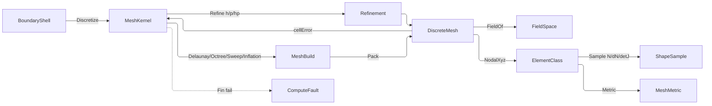

# [COMPUTE_DISCRETIZATION]

Rasm.Compute solver discretization: one volumetric `MeshKernel` owner generating tet/hex/boundary-layer meshes from a boundary `BoundaryShell` through real Delaunay/octree/sweep/inflation cores with adaptive h/p/hp refinement, one `ElementClass` `[SmartEnum<string>]` element-topology axis carrying its reference-node table, its monomial polynomial space, and a `ShapeFamily` discriminant that drives one isoparametric `Sample` so twelve continuum element types collapse onto a Vandermonde coefficient mechanism, an explicit serendipity arm, and a rational pyramid arm — and the owned Frame family (`beam2-euler`/`beam2-timoshenko`, the 2-node 12-DOF member rows whose `Member` closed form carries end releases by static condensation, rigid-end offsets by eccentricity transform, and semi-rigid end springs by exact in-series condensation — the owned replacement for the retired BFE/FEALiTE frame backends, exceeding their consumed set), one closed `MeshMetric` Verdict quality vocabulary read once per element over the real edge/face topology, and one `FieldSpace` over `FieldStation` rows as the solve-native scalar/vector/tensor representation. This page owns the `Monomial`/`ShapeSample`/`Aabb` value types, the `ElementClass`/`MeshAlgorithm`/`MeshMetric`/`FieldStation` vocabulary, the `BoundaryShell`/`MeshPolicy`/`DiscreteMesh`/`FieldSpace` carriers, and the `MeshKernel` generation+refinement fold. Integration rules arrive settled from the kernel `Rasm/Numerics/integrate#QUADRATURE` `ReferenceElement` row family and its owned `QuadratureRule` Gauss tables: each `ElementClass` declares its reference domain and its integration ORDER, the kernel row elects the smallest owned rule at or above that order, and a package-local Gauss table, tensor-cube builder, prism product, or conical pyramid fold is the deleted form. Thinktecture's `ComparerAccessors.StringOrdinal` accessor composes on every keyed row here and at the sibling solver pages, never a page-local accessor type. Raw element-node memory projects through `TensorMarshal.CreateReadOnlyTensorSpan` without an owner copy, and assembly emits `SparseCompressedRowMatrixStorage<double>` through `Tensor/factor`, metric reductions ride `Tensor/dispatch` `TensorPrimitives` folds, MathNet `Matrix<double>.Inverse` factors the one-time per-class Vandermonde, every Delaunay SIGN DECISION routes the kernel exact-predicate floor through the coordinate-level `Predicate.Orient3D`/`Predicate.InSphere` cores (`Rasm/Numerics/predicates` — raw double tuples, so no kernel value type enters a lane signature; the hand-rolled Bowyer-Watson TOPOLOGY stays owned, only the sign path is the kernel's), and the `ComputeReceipt` rail, `WorkLane`/`Substrate`/`AllocationClass`, `CorrelationId`, and NodaTime `IClock` arrive settled (the App-owned `ClockPolicy` stays at composition). `DiscreteMesh` and `FieldSpace` cross to `Solver/contract` as the assembly substrate, and surface-mesh boundary triangulation is the host `Mesh.CreateFromBrep`→`Rasm.Meshing` `MeshSpace.Of(Mesh, Context)` wire flattened to the `BoundaryShell` triangle soup, composed never re-derived.

## [01]-[INDEX]

- [02]-[DISCRETIZATION_MESH]: volumetric mesher; tet/hex/boundary-layer; isoparametric shape functions; Verdict quality.

## [02]-[DISCRETIZATION_MESH]

- Owner: `ShellIndex` the per-generation inclusion index every core probes; `ElementClass` `[SmartEnum<string>]` element-topology rows carrying a `ShapeFamily` discriminant, the reference-node natural-coordinate table, the `Monomial` polynomial-space basis, the corner/edge/face topology tables, and the kernel `ReferenceElement` reference domain beside the integration order that elects its rule, all driving one isoparametric `Sample` returning shape values, physical gradients, and the Jacobian determinant; `MeshAlgorithm` `[SmartEnum<string>]` generation-strategy rows carrying a `MeshStrategy` core selector, a `PointSource` interior-seed column, and a conforming flag; `MeshMetric` `[SmartEnum<string>]` closed Verdict quality vocabulary (scaled-Jacobian, aspect-ratio, skewness, min-dihedral, condition) reading the real corner/edge/face topology; `FieldStation` `[SmartEnum<string>]` nodal/integration-point/cell/boundary rows carrying their count derivation; `MeshKernel` static surface generating a `DiscreteMesh` from a boundary `BoundaryShell` then refining it adaptively; `DiscreteMesh` the conforming/non-conforming volumetric mesh carrier; `FieldSpace` the integration-point/nodal scalar/vector/tensor field the solve writes; `BoundaryShell` the boundary-triangulation carrier with the ray-cast inclusion test; `Aabb`/`Monomial`/`ShapeSample` the value types.
- Cases: `ElementClass` rows tet4 · tet10 · hex8 · hex20 · hex27 · wedge6 · wedge18 · pyramid5 · tri3 · tri6 · quad4 · quad8 · beam2-euler · beam2-timoshenko over four `ShapeFamily` arms (Polynomial via the Vandermonde monomial mechanism, Reduced via the explicit serendipity corner/midside formulas, Pyramid via the rational apex basis, Frame via the closed-form 12-DOF `Member` stiffness the solve contract scatters — releases/offsets/semi-rigid springs as row behavior, the `Shear` column selecting the Timoshenko Φ terms); `MeshAlgorithm` rows delaunay · frontal-delaunay · advancing-front · octree · sweep · boundary-layer over four `MeshStrategy` cores (Delaunay/Octree/Sweep/Inflation), each row carrying its own base element, and `PointSource` seeds uniform · frontal · front; `MeshMetric` rows scaled-jacobian · aspect-ratio · skewness · min-dihedral · condition; `FieldStation` rows nodal · integration-point · cell · boundary; `FieldSpace` rank rows scalar · vector · tensor over `FieldStation` positions.
- Entry: `public static Fin<DiscreteMesh> Discretize(BoundaryShell boundary, MeshPolicy policy, IClock clock)` — `BoundaryShell.Validate` rejects malformed buffers, invalid indices, degenerate triangles, open edges, and inconsistent winding before generation; `MeshPolicy.Validate` rejects incoherent strategy/element and numeric policy values; `ShellIndex.Of` then builds the one inclusion index every core probes, and `Fin<T>` aborts on generation failure, on a measured hanging-node set no mortar column carries, or on an element failing the metric's directional quality threshold through `MeshMetric.Admits`; `Refine(DiscreteMesh, MeshPolicy, ReadOnlySpan<double> cellError, IClock)` re-meshes the Dörfler-marked cell set by the keyless `RefineKind` `H` (red subdivision), `P` (order elevation), or `Hp` (graded) axis returning the adapted mesh and the carried error estimator; `Quality(DiscreteMesh, MeshMetric)` reads the per-element metric once; `ElementClass.Sample((double, double, double) natural, ReadOnlySpan<double> nodalXyz)` is the isoparametric evaluation the assembly consumes and `ShapeGrad` is its gradient projection.
- Auto: `Discretize` builds ONE `ShellIndex` and routes the `MeshStrategy` core by the algorithm row — a closed manifold solid routes the Bowyer-Watson `Delaunay` tetrahedralization over the boundary surface nodes with the `PointSource` interior seeds, a feature-graded fill routes the `Octree` hex recursion under origin-relative double-precision welding, a sweepable prism routes `Sweep` extrusion of the constrained 2-D Delaunay footprint section into one prism per section triangle per layer, and a floor-walled domain routes `Inflation` prism layers offset along PER-NODE averaged wall normals under first-layer thickness × growth ratio; every core filters cells by the indexed `Encloses` parity ray and packs the `DiscreteMesh` whose conformity the build MEASURED; `Sample` evaluates the `ShapeFamily` arm — Polynomial reads the lazily-memoized per-class Vandermonde coefficient matrix `(N_i = Σ_m C[m,i]·P_m(ξ))` and its monomial derivatives, Reduced reads the explicit serendipity corner/midside formulas, Pyramid the rational apex basis — then maps reference derivatives through the inline `dim×dim` Jacobian inverse to physical `∂N/∂x` and the determinant; `Refine` reads the per-cell error estimator and marks the cells whose estimator exceeds the policy fraction by the Dörfler bulk criterion, then either red-subdivides (h) the marked set expanded to its edge-conforming closure — any cell sharing a split edge joins the set to a fixpoint unless the mortar column carries the hanging node — or globally order-elevates (p) the element order — the marked set drives the hp routing decision while a uniform-order mesh elevates wholesale — through the shared edge-midpoint map so the interior stays conforming and a hanging node rides the mortar column only when the policy sets it; `Quality` folds the requested `MeshMetric` over the element set through the element class's `Metric` delegate, never a per-call recompute.
- Receipt: the `Discretization` `ComputeReceipt` case carries the algorithm key, element-class key, node and element counts, the boundary-layer count, the worst-element quality scalar, the chosen metric key, and elapsed; `Refine` stamps the refinement level, the marked-cell count, the marking fraction, and the post-refine error estimator on the same case so an adaptive sweep is one receipt chain by correlation.
- Packages: Rasm (project), MathNet.Numerics, CommunityToolkit.HighPerformance, System.Numerics.Tensors, Thinktecture.Runtime.Extensions, LanguageExt.Core, NodaTime, BCL inbox
- Growth: a new element topology is one `ElementClass` row carrying its `ShapeFamily`, reference-node table, monomial space, corner/edge/face tables, and its `(ReferenceElement, IntegrationOrder)` pair; a new generation strategy is one `MeshAlgorithm` row carrying its `MeshStrategy`/`PointSource`/base-element columns and its core; a new quality measure is one `MeshMetric` row carrying its per-element delegate; a new field rank is one `FieldSpace` rank row; a higher-order Gauss rule is one entry on the kernel `ReferenceElement` ladder and lifts every element declaring that order with zero edits here; zero new surface.
- Boundary: the mesher is the volumetric discretization owner the FEA/CFD solve consumes — the boundary triangulation enters as the `BoundaryShell` triangle soup the host `Mesh.CreateFromBrep(brep, MeshingParameters)` tessellation produces — wrapped through the `Rasm.Meshing` `MeshSpace.Of(Mesh, Context)` owner (the `Brep` coerced via the `Rasm` `Domain` `GeometryRequest.BrepForm` owner) and flattened to the `Vertices`/`Triangles` soup at the boundary through `DuplicateNative().Vertices.ToFloatArray()` and `DuplicateNative().Faces.ToIntArray(asTriangles: true)` — and the inclusion test is the owned ray-cast, so this kernel never re-derives a surface mesher and never leaks a host geometry type into a solve signature.
- Boundary: inclusion is ONE `ShellIndex` per `Discretize`, threaded to every core: the shell is immutable across a generation while seeding, octree recursion, and section rasterization each drive millions of probes, so a per-probe scan over the whole triangle soup makes generation quadratic in the boundary it meshes. `BoundaryShell.Validate` proves the soup closed, manifold, and consistently wound before the index builds, which is what makes an odd crossing count interiority rather than a heuristic. `ShellIndex` stays this page's owner by query shape, never package availability — the `Solver/clash#CLASH_AND_TWIN` `AccelerationStructure` answers boolean occlusion over admitted host-typed scenes while generation needs a parity-crossing COUNT over its own shell facets, and widening the clash surface to serve one sibling's interior couples two lanes the strata keep separate; the two-owner split mirrors the folder's standing two-funnel adjudications.
- Boundary: conformity is MEASURED on the built mesh, never inherited from an algorithm row's declared intent — the octree weld counts the nodes sitting mid-edge of a coarser neighbour and the entry refuses a mesh carrying them unless the mortar column does, because a hanging node without a constraint row is a solve whose interface equations are silently absent. Weld keys quantize in double precision relative to the shell's own origin, so a model in a site coordinate system welds by its extent instead of losing the deciding bits to coordinate magnitude.
- Boundary: the element shape functions and `B`-matrix are the `ElementClass.Sample` isoparametric evaluation dispatching on `ShapeFamily` — the Polynomial arm collapses tet4/tet10/hex8/hex27/wedge6/wedge18/tri3/tri6/quad4 onto one Vandermonde monomial mechanism keyed by the per-row reference-node table and `Monomial` space (a singular per-element shape-function reimplementation is the deleted form, and the prior single trilinear stencil reused across every curvilinear topology is the named illusory defect), the Reduced arm carries the explicit quad8/hex20 serendipity corner/midside formulas, and the Pyramid arm the rational apex basis whose `(1−ζ)` denominator the conical quadrature avoids.
- Boundary: the element owns its integration scaling — `Sample.DetJ` is the Jacobian determinant the assembly weights each Gauss point by, never a centroid-volume approximation; the quadrature is the kernel `ReferenceElement` row's own symmetric/tensor table (triangle/tet area-volume coordinates, `[-1,1]` cube tensor Gauss, triangle⊗line prism, conical pyramid), reached by declaring the reference domain and the integration ORDER rather than naming a rule constant, so a 2-D element can never index a 3-D rule (the row family is closed over its own dimension), a per-element runtime `GaussLegendreRule(−1, 1, order)` construction has no site, and a full-versus-reduced integration decision is one column edit on the element row instead of a second table; the rule memoizes per class beside the Vandermonde coefficients because `Quadrature.Points` is read once per cell per Gauss point in the assembly fold — both memos are row-keyed concurrent tables, since a row is one process-wide static the PARALLEL cell assembly reads from many threads and a null-coalescing field there publishes a half-built table to whichever thread lost the race.
- Boundary: the quality measure is the closed Verdict `MeshMetric` SmartEnum read once through the element class's `Metric` delegate over the real corner-Jacobian, edge-length, face-angle, and dihedral topology, never a per-call recompute, never the first-four-nodes slice, and never a parallel quality type. The quality gate runs over the WHOLE element set before any sample is taken, so the corner frame reads the incident edges its own topology table declares and neither Jacobian inverse substitutes a floor for a vanishing determinant — a substituted pivot under a named refusal can only launder a mesh that never admitted.
- Boundary: the generation strategy is real per row — Bowyer-Watson incremental Delaunay with the orientation-robust in-sphere predicate, graded octree recursion, boundary-cross-section sweep extrusion, and wall-normal anisotropic inflation — so the prior bounding-box voxelization masquerading as six unstructured meshers is the deleted form, and the sweep and inflation sections are the shell's own triangulated footprint and wall facets rather than a lattice that coincides with the boundary only for a box; adaptive refinement is conforming red subdivision through the shared edge-midpoint map by default and non-conforming only when the policy mortar column is set, a hanging node without a constraint row is the rejected form, and the prior cell-duplication subdivision is the named fake. The edge-conforming closure walks a dirty-cell worklist over an edge→cells incidence map so each cell enters once, and p-refinement elevates one declared order per row while a row already at its highest carries unchanged — a terminal row elevating to itself is how a fully-elevated mesh stays a mesh instead of failing.
- Boundary: the mesh is solve-native raw SI `double` (the typed `MeasureValue`/`Dimension` vocabulary lives at the `Rasm.Element/Properties/quantity#MEASURE_VALUE` seam and is admitted once upstream, never threaded through this hot numeric kernel); the metric reductions ride the `Tensor/dispatch#KERNEL_DISPATCH` `TensorPrimitives.Min`/`Max` SIMD folds over the flat per-element span, MathNet factors only the cold per-class Vandermonde inverse, the in-sphere/orientation SIGN DECISIONS route the kernel `Rasm/Numerics/predicates` coordinate-level exact cores (`Predicate.Orient3D`/`Predicate.InSphere` over raw double tuples with the `Sign.Times` orientation-normalization fold — near-coplanar/cocircular building geometry decides exactly, and the float `Orient`/`InSphere`/`Det4` sign path is the deleted re-owned-kernel-geometry defect), the local boundary carrier is `BoundaryShell` — named OFF the kernel Vectors `MeshSpace` it flattens from (a re-declared soup carrier under a frozen kernel type's name is the deleted form) — and the inline `dim×dim` Jacobian inverse is this page's named kernel exemption. The planar section decides through the SAME exact core: its orientation lifts the query point off the triangle's plane and its in-circle test is a 3-D orientation on the paraboloid, so no second sign path enters the page.
- Boundary: hot-path allocation is bounded where the fold is per cell — the nodal gather writes a per-thread scratch buffer live until that thread's next gather, and face identity is a packed sorted-node-id key rather than a formatted string, which the boundary fold and the refinement midpoint map both read. A string key allocates twice per face per cell and compares character by character where the packed key compares in registers.

```csharp signature
// --- [TYPES] ----------------------------------------------------------------------------

[SmartEnum]
public sealed partial class ShapeFamily {
    public static readonly ShapeFamily Polynomial = new(static (element, natural, nodalXyz) => element.PolynomialSample(natural, nodalXyz));
    public static readonly ShapeFamily Reduced = new(static (element, natural, nodalXyz) => element.ReducedSample(natural, nodalXyz));
    public static readonly ShapeFamily Pyramid = new(static (element, natural, nodalXyz) =>
        Topology.Iso(element.PyramidShape(natural), element.PyramidGrad(natural), nodalXyz, element.Nodes, element.Dim));
    public static readonly ShapeFamily Frame = new(static (_, natural, nodalXyz) => ElementClass.LineSample(natural, nodalXyz));

    [UseDelegateFromConstructor]
    public partial ShapeSample Sample(ElementClass element, (double X, double Y, double Z) natural, ReadOnlySpan<double> nodalXyz);
}

// Every core reads the ONE inclusion index the entry built, so no fill re-derives the shell's interior test.
[SmartEnum]
public sealed partial class MeshStrategy {
    public static readonly MeshStrategy Delaunay = new(static (boundary, index, policy) => DelaunayCore.Fill(boundary, index, policy));
    public static readonly MeshStrategy Octree = new(static (boundary, index, policy) => OctreeCore.Fill(boundary, index, policy));
    public static readonly MeshStrategy Sweep = new(static (boundary, index, policy) => SweepCore.Fill(boundary, index, policy));
    public static readonly MeshStrategy Inflation = new(static (boundary, index, policy) => InflationCore.Fill(boundary, index, policy));

    [UseDelegateFromConstructor]
    public partial MeshBuild Fill(BoundaryShell boundary, ShellIndex index, MeshPolicy policy);
}

// PointSource rows are SEEDING-DENSITY gradations of the ONE Bowyer-Watson fill — `Frontal` densifies to
// 0.75× spacing and `Front` grades by ratio; neither row evolves a front, queues local features, or recovers
// boundary facets, and the MeshAlgorithm rows binding them state exactly that. `Uniform` is the single row for
// every seed that takes the target spacing unchanged — two rows carrying one identity delegate are one row.
[SmartEnum]
public sealed partial class PointSource {
    public static readonly PointSource Uniform = new(static (target, _) => target);
    public static readonly PointSource Frontal = new(static (target, _) => target * 0.75);
    public static readonly PointSource Front = new(static (target, grading) => target * grading);

    [UseDelegateFromConstructor]
    public partial double Spacing(double target, double grading);
}

[SmartEnum]
public sealed partial class RefineKind {
    public static readonly RefineKind H = new();
    public static readonly RefineKind P = new();
    public static readonly RefineKind Hp = new();
}

public readonly record struct Monomial(int I, int J, int K) {
    public double Eval((double X, double Y, double Z) p) => Pow(p.X, I) * Pow(p.Y, J) * Pow(p.Z, K);

    public double D(int axis, (double X, double Y, double Z) p) => axis switch {
        0 => I == 0 ? 0.0 : I * Pow(p.X, I - 1) * Pow(p.Y, J) * Pow(p.Z, K),
        1 => J == 0 ? 0.0 : J * Pow(p.X, I) * Pow(p.Y, J - 1) * Pow(p.Z, K),
        _ => K == 0 ? 0.0 : K * Pow(p.X, I) * Pow(p.Y, J) * Pow(p.Z, K - 1),
    };

    static double Pow(double b, int e) => e <= 0 ? 1.0 : e == 1 ? b : Math.Pow(b, e);
}

public readonly record struct Aabb(Vector3 Lo, Vector3 Hi) {
    public Vector3 Span => Hi - Lo;
    public Vector3 Center => (Lo + Hi) * 0.5f;

    public static Aabb Of(ReadOnlySpan<float> vertices) {
        Vector3 lo = new(float.MaxValue), hi = new(float.MinValue);
        for (int v = 0; v + 2 < vertices.Length; v += 3) {
            Vector3 p = new(vertices[v], vertices[v + 1], vertices[v + 2]);
            lo = Vector3.Min(lo, p); hi = Vector3.Max(hi, p);
        }
        return new(lo, hi);
    }
}

// --- [MODELS] ---------------------------------------------------------------------------

public readonly record struct ShapeSample(double[] Shape, double[] Grad, double DetJ);

[SmartEnum<string>]
[KeyMemberEqualityComparer<ComparerAccessors.StringOrdinal, string>]
[KeyMemberComparer<ComparerAccessors.StringOrdinal, string>]
public sealed partial class ElementClass {
    public static readonly ElementClass Tet4 = new("tet4", ShapeFamily.Polynomial, dim: 3, order: 1, volumetric: true,
        ReferenceElement.Tet, integrationOrder: 1, Topology.TetRef4, Topology.TetP1, Topology.TetEdges, Topology.TetFaces, [0, 1, 2, 3], () => Tet10);
    public static readonly ElementClass Tet10 = new("tet10", ShapeFamily.Polynomial, dim: 3, order: 2, volumetric: true,
        ReferenceElement.Tet, integrationOrder: 2, Topology.TetRef10, Topology.TetP2, Topology.TetEdges, Topology.TetFaces, [0, 1, 2, 3], () => Tet10);
    public static readonly ElementClass Hex8 = new("hex8", ShapeFamily.Polynomial, dim: 3, order: 1, volumetric: true,
        ReferenceElement.Hex, integrationOrder: 3, Topology.HexRef8, Topology.HexQ1, Topology.HexEdges, Topology.HexFaces, [.. Enumerable.Range(0, 8)], () => Hex20);
    public static readonly ElementClass Hex20 = new("hex20", ShapeFamily.Reduced, dim: 3, order: 2, volumetric: true,
        ReferenceElement.Hex, integrationOrder: 5, Topology.HexRef20, ImmutableArray<Monomial>.Empty, Topology.HexEdges, Topology.HexFaces, [.. Enumerable.Range(0, 8)], () => Hex20);
    public static readonly ElementClass Hex27 = new("hex27", ShapeFamily.Polynomial, dim: 3, order: 2, volumetric: true,
        ReferenceElement.Hex, integrationOrder: 5, Topology.HexRef27, Topology.HexQ2, Topology.HexEdges, Topology.HexFaces, [.. Enumerable.Range(0, 8)], () => Hex27);
    public static readonly ElementClass Wedge6 = new("wedge6", ShapeFamily.Polynomial, dim: 3, order: 1, volumetric: true,
        ReferenceElement.Wedge, integrationOrder: 4, Topology.WedgeRef6, Topology.WedgeP1, Topology.WedgeEdges, Topology.WedgeFaces, [.. Enumerable.Range(0, 6)], () => Wedge6);
    public static readonly ElementClass Wedge18 = new("wedge18", ShapeFamily.Polynomial, dim: 3, order: 2, volumetric: true,
        ReferenceElement.Wedge, integrationOrder: 5, Topology.WedgeRef18, Topology.WedgeP2, Topology.WedgeEdges, Topology.WedgeFaces, [.. Enumerable.Range(0, 6)], () => Wedge18);
    public static readonly ElementClass Pyramid5 = new("pyramid5", ShapeFamily.Pyramid, dim: 3, order: 1, volumetric: true,
        ReferenceElement.Pyramid, integrationOrder: 5, Topology.PyramidRef5, ImmutableArray<Monomial>.Empty, Topology.PyramidEdges, Topology.PyramidFaces, [.. Enumerable.Range(0, 5)], () => Pyramid5);
    public static readonly ElementClass Tri3 = new("tri3", ShapeFamily.Polynomial, dim: 2, order: 1, volumetric: false,
        ReferenceElement.Tri, integrationOrder: 2, Topology.TriRef3, Topology.TriP1, Topology.TriEdges, Topology.TriFaces, [0, 1, 2], () => Tri6);
    public static readonly ElementClass Tri6 = new("tri6", ShapeFamily.Polynomial, dim: 2, order: 2, volumetric: false,
        ReferenceElement.Tri, integrationOrder: 2, Topology.TriRef6, Topology.TriP2, Topology.TriEdges, Topology.TriFaces, [0, 1, 2], () => Tri6);
    public static readonly ElementClass Quad4 = new("quad4", ShapeFamily.Polynomial, dim: 2, order: 1, volumetric: false,
        ReferenceElement.Quad, integrationOrder: 3, Topology.QuadRef4, Topology.QuadQ1, Topology.QuadEdges, Topology.QuadFaces, [.. Enumerable.Range(0, 4)], () => Quad8);
    public static readonly ElementClass Quad8 = new("quad8", ShapeFamily.Reduced, dim: 2, order: 2, volumetric: false,
        ReferenceElement.Quad, integrationOrder: 5, Topology.QuadRef8, ImmutableArray<Monomial>.Empty, Topology.QuadEdges, Topology.QuadFaces, [.. Enumerable.Range(0, 4)], () => Quad8);
    public static readonly ElementClass Beam2Euler = new("beam2-euler", ShapeFamily.Frame, dim: 1, order: 1, volumetric: false,
        ReferenceElement.Line, integrationOrder: 2, Topology.LineRef2, Topology.LineP1, Topology.LineEdges, ImmutableArray<ImmutableArray<int>>.Empty, [0, 1], () => Beam2Euler, shear: false);
    public static readonly ElementClass Beam2Timoshenko = new("beam2-timoshenko", ShapeFamily.Frame, dim: 1, order: 1, volumetric: false,
        ReferenceElement.Line, integrationOrder: 2, Topology.LineRef2, Topology.LineP1, Topology.LineEdges, ImmutableArray<ImmutableArray<int>>.Empty, [0, 1], () => Beam2Timoshenko, shear: true);

    public ShapeFamily Family { get; }
    public bool Shear { get; }
    public int Dim { get; }
    public int Order { get; }
    public bool Volumetric { get; }
    // ReferenceDomain and IntegrationOrder are the WHOLE quadrature declaration: kernel rows elect the smallest
    // owned rule at or above that order and clamp to their highest, so a rule constant never appears here and a
    // full-versus-reduced posture is one integer.
    public ReferenceElement ReferenceDomain { get; }
    public int IntegrationOrder { get; }
    public ImmutableArray<(double X, double Y, double Z)> Reference { get; }
    public ImmutableArray<Monomial> Basis { get; }
    public ImmutableArray<(int A, int B)> Edges { get; }
    public ImmutableArray<ImmutableArray<int>> Faces { get; }
    public ImmutableArray<int> Corners { get; }

    public int Nodes => Reference.Length;
    public ElementClass Elevate => elevate();
    // Row-keyed memo tables, co-located with the rows they serve: the assembly fold reads the rule and the
    // coefficient matrix once per cell per Gauss point, so each derivation runs once per class rather than once per
    // read. A row is one process-wide static the PARALLEL cell assembly reads from many threads at once, and a
    // null-coalescing mutable field there publishes a half-built table to whichever thread lost the race — both
    // derivations are pure functions of the row, so a concurrent double-build costs one wasted table and publishes
    // exactly one.
    static readonly ConcurrentDictionary<ElementClass, QuadratureRule> Rules = new();
    static readonly ConcurrentDictionary<ElementClass, double[,]> Vandermondes = new();

    public QuadratureRule Quadrature => Rules.GetOrAdd(this, static row => row.ReferenceDomain.Rule(order: row.IntegrationOrder));

    private readonly Func<ElementClass> elevate;
    private double[,] Coefficients => Vandermondes.GetOrAdd(this, static row => Topology.Vandermonde(row.Reference, row.Basis));

    public ShapeSample Sample((double X, double Y, double Z) natural, ReadOnlySpan<double> nodalXyz) => Family.Sample(this, natural, nodalXyz);

    internal static ShapeSample LineSample((double X, double Y, double Z) nat, ReadOnlySpan<double> xyz) {
        double dx = xyz[3] - xyz[0], dy = xyz[4] - xyz[1], dz = xyz[5] - xyz[2];
        double l = Math.Sqrt(dx * dx + dy * dy + dz * dz);
        double[] grad = [-dx / (l * l), -dy / (l * l), -dz / (l * l), dx / (l * l), dy / (l * l), dz / (l * l)];
        return new([0.5 * (1.0 - nat.X), 0.5 * (1.0 + nat.X)], grad, l * 0.5);
    }

    public double[] ShapeGrad((double X, double Y, double Z) natural, ReadOnlySpan<double> nodalXyz) => Sample(natural, nodalXyz).Grad;

    public double Metric(MeshMetric metric, ReadOnlySpan<double> nodalXyz) => metric.Measure(this, nodalXyz);

    public Fin<Unit> Member(ReadOnlySpan<double> xyz, in FrameMember member, double e, double nu, Span<double> local) {
        double dx = xyz[3] - xyz[0], dy = xyz[4] - xyz[1], dz = xyz[5] - xyz[2];
        double length = Math.Sqrt(dx * dx + dy * dy + dz * dz) - member.OffsetI - member.OffsetJ;
        if (!(length > 0.0)) {
            return Fin.Fail<Unit>(new ComputeFault.ModelRejected($"<frame-degenerate-length:{Key}:L={length:e3}:offI={member.OffsetI:e3}:offJ={member.OffsetJ:e3}>"));
        }
        double g = e / (2.0 * (1.0 + nu));
        double phiY = Shear && member.ShearAreaZ > 0.0 ? 12.0 * e * member.Iy / (g * member.ShearAreaZ * length * length) : 0.0;
        double phiZ = Shear && member.ShearAreaY > 0.0 ? 12.0 * e * member.Iz / (g * member.ShearAreaY * length * length) : 0.0;
        Span<double> k = stackalloc double[144];
        Topology.LocalFrame(k, e, g, member, length, phiY, phiZ);
        Topology.SemiRigid(k, member, e, length);
        Topology.CondenseReleases(k, member.ReleaseMask);
        Topology.Eccentric(k, member.OffsetI, member.OffsetJ);
        Topology.RotateFrame(k, dx, dy, dz, member.UpX, member.UpY, member.UpZ, local);
        return Fin.Succ(unit);
    }

    internal ShapeSample PolynomialSample((double X, double Y, double Z) nat, ReadOnlySpan<double> xyz) {
        int n = Nodes;
        double[,] c = Coefficients;
        double[] shape = new double[n];
        double[,] dnRef = new double[n, 3];
        for (int m = 0; m < n; m++) {
            double p = Basis[m].Eval(nat), dpx = Basis[m].D(0, nat), dpy = Basis[m].D(1, nat), dpz = Basis[m].D(2, nat);
            for (int i = 0; i < n; i++) {
                double a = c[m, i];
                shape[i] += a * p; dnRef[i, 0] += a * dpx; dnRef[i, 1] += a * dpy; dnRef[i, 2] += a * dpz;
            }
        }
        return Topology.Iso(shape, dnRef, xyz, n, Dim);
    }

    internal ShapeSample ReducedSample((double X, double Y, double Z) nat, ReadOnlySpan<double> xyz) {
        int n = Nodes;
        double[] shape = new double[n];
        double[,] dn = new double[n, 3];
        for (int i = 0; i < n; i++) {
            (double X, double Y, double Z) reference = Reference[i];
            (double s, double dx, double dy, double dz) = Dim == 2 ? Serendipity2(nat, reference) : Serendipity3(nat, reference);
            shape[i] = s; dn[i, 0] = dx; dn[i, 1] = dy; dn[i, 2] = dz;
        }
        return Topology.Iso(shape, dn, xyz, n, Dim);
    }

    static (double, double, double, double) Serendipity2((double X, double Y, double Z) p, (double X, double Y, double Z) r) {
        (double xi, double eta) = (p.X, p.Y);
        if (r.X != 0.0 && r.Y != 0.0) {
            double sx = r.X, sy = r.Y, gx = 1 + xi * sx, gy = 1 + eta * sy, q = xi * sx + eta * sy - 1;
            return (0.25 * gx * gy * q, 0.25 * sx * gy * (q + gx), 0.25 * sy * gx * (q + gy), 0.0);
        }
        if (r.X == 0.0) { double sy = r.Y, gy = 1 + eta * sy; return (0.5 * (1 - xi * xi) * gy, 0.5 * -2 * xi * gy, 0.5 * (1 - xi * xi) * sy, 0.0); }
        double sx = r.X, gx = 1 + xi * sx; return (0.5 * gx * (1 - eta * eta), 0.5 * sx * (1 - eta * eta), 0.5 * gx * -2 * eta, 0.0);
    }

    static (double, double, double, double) Serendipity3((double X, double Y, double Z) p, (double X, double Y, double Z) r) {
        (double xi, double eta, double ze) = (p.X, p.Y, p.Z);
        if (r.X != 0.0 && r.Y != 0.0 && r.Z != 0.0) {
            double sx = r.X, sy = r.Y, sz = r.Z, gx = 1 + xi * sx, gy = 1 + eta * sy, gz = 1 + ze * sz, q = xi * sx + eta * sy + ze * sz - 2;
            return (0.125 * gx * gy * gz * q, 0.125 * gy * gz * (sx * q + gx * sx), 0.125 * gx * gz * (sy * q + gy * sy), 0.125 * gx * gy * (sz * q + gz * sz));
        }
        double mx = r.X == 0.0 ? 1 - xi * xi : 1 + xi * r.X, my = r.Y == 0.0 ? 1 - eta * eta : 1 + eta * r.Y, mz = r.Z == 0.0 ? 1 - ze * ze : 1 + ze * r.Z;
        double dmx = r.X == 0.0 ? -2 * xi : r.X, dmy = r.Y == 0.0 ? -2 * eta : r.Y, dmz = r.Z == 0.0 ? -2 * ze : r.Z;
        return (0.25 * mx * my * mz, 0.25 * dmx * my * mz, 0.25 * mx * dmy * mz, 0.25 * mx * my * dmz);
    }

    internal double[] PyramidShape((double X, double Y, double Z) p) {
        double[] n = new double[5];
        double inv = 1.0 / Math.Max(1e-12, 1.0 - p.Z);
        for (int i = 0; i < 4; i++) {
            (double X, double Y, double Z) reference = Reference[i];
            n[i] = 0.25 * ((1 - p.Z) + reference.X * p.X + reference.Y * p.Y + reference.X * reference.Y * p.X * p.Y * inv);
        }
        n[4] = p.Z;
        return n;
    }

    internal double[,] PyramidGrad((double X, double Y, double Z) p) {
        double[,] dn = new double[5, 3];
        double inv = 1.0 / Math.Max(1e-12, 1.0 - p.Z), inv2 = inv * inv;
        for (int i = 0; i < 4; i++) {
            (double X, double Y, double Z) reference = Reference[i];
            dn[i, 0] = 0.25 * (reference.X + reference.X * reference.Y * p.Y * inv);
            dn[i, 1] = 0.25 * (reference.Y + reference.X * reference.Y * p.X * inv);
            dn[i, 2] = 0.25 * (-1 + reference.X * reference.Y * p.X * p.Y * inv2);
        }
        dn[4, 2] = 1.0;
        return dn;
    }
}

[SmartEnum<string>]
[KeyMemberEqualityComparer<ComparerAccessors.StringOrdinal, string>]
[KeyMemberComparer<ComparerAccessors.StringOrdinal, string>]
public sealed partial class MeshMetric {
    public static readonly MeshMetric ScaledJacobian = new("scaled-jacobian", ascendingBetter: true, ScaledJacobianMeasure);
    public static readonly MeshMetric AspectRatio = new("aspect-ratio", ascendingBetter: false, AspectRatioMeasure);
    public static readonly MeshMetric Skewness = new("skewness", ascendingBetter: false, SkewnessMeasure);
    public static readonly MeshMetric MinDihedral = new("min-dihedral", ascendingBetter: true, MinDihedralMeasure);
    public static readonly MeshMetric Condition = new("condition", ascendingBetter: false, ConditionMeasure);

    public bool AscendingBetter { get; }

    [UseDelegateFromConstructor]
    public partial double Measure(ElementClass element, ReadOnlySpan<double> nodalXyz);

    public double Worst(ReadOnlySpan<double> perElement) =>
        perElement.IsEmpty ? 0.0 : AscendingBetter ? TensorPrimitives.Min(perElement) : TensorPrimitives.Max(perElement);

    public bool Admits(double worst, double threshold) => AscendingBetter ? worst > threshold : worst < threshold;

    static double ScaledJacobianMeasure(ElementClass element, ReadOnlySpan<double> xyz) {
        double worst = double.MaxValue;
        foreach (int corner in element.Corners) {
            (Vector3 e1, Vector3 e2, Vector3 e3) = Topology.CornerFrame(element, corner, xyz);
            double det = Vector3.Dot(Vector3.Cross(e1, e2), e3);
            double scale = (double)e1.Length() * e2.Length() * e3.Length();
            worst = Math.Min(worst, scale > 1e-12 ? det / scale : 0.0);
        }
        return worst == double.MaxValue ? 0.0 : worst;
    }

    static double AspectRatioMeasure(ElementClass element, ReadOnlySpan<double> xyz) {
        double longest = 0.0, shortest = double.MaxValue;
        foreach ((int a, int b) in element.Edges) {
            double length = (Topology.Node(xyz, b) - Topology.Node(xyz, a)).Length();
            longest = Math.Max(longest, length); shortest = Math.Min(shortest, length);
        }
        return shortest > 1e-12 ? longest / shortest : double.MaxValue;
    }

    static double SkewnessMeasure(ElementClass element, ReadOnlySpan<double> xyz) {
        double worst = 0.0;
        foreach (ImmutableArray<int> face in element.Faces) {
            double ideal = face.Length == 3 ? 60.0 : 90.0;
            for (int i = 0; i < face.Length; i++) {
                Vector3 o = Topology.Node(xyz, face[i]);
                Vector3 u = Topology.Node(xyz, face[(i + 1) % face.Length]) - o, v = Topology.Node(xyz, face[(i + face.Length - 1) % face.Length]) - o;
                double angle = Math.Acos(Math.Clamp(Vector3.Dot(Vector3.Normalize(u), Vector3.Normalize(v)), -1.0, 1.0)) * 180.0 / Math.PI;
                worst = Math.Max(worst, Math.Max((angle - ideal) / (180.0 - ideal), (ideal - angle) / ideal));
            }
        }
        return worst;
    }

    static double MinDihedralMeasure(ElementClass element, ReadOnlySpan<double> xyz) {
        double smallest = 180.0;
        foreach ((int a, int b) in element.Edges) {
            ImmutableArray<ImmutableArray<int>> incident = Topology.FacesOnEdge(element, a, b);
            if (incident.Length < 2) { continue; }
            Vector3 n1 = Topology.FaceNormal(incident[0], xyz), n2 = Topology.FaceNormal(incident[1], xyz);
            double angle = 180.0 - Math.Acos(Math.Clamp(Vector3.Dot(Vector3.Normalize(n1), Vector3.Normalize(n2)), -1.0, 1.0)) * 180.0 / Math.PI;
            smallest = Math.Min(smallest, angle);
        }
        return smallest;
    }

    static double ConditionMeasure(ElementClass element, ReadOnlySpan<double> xyz) {
        double jacobian = Math.Abs(ScaledJacobianMeasure(element, xyz));
        return jacobian > 1e-12 ? 1.0 / jacobian : double.MaxValue;
    }
}

[SmartEnum<string>]
[KeyMemberEqualityComparer<ComparerAccessors.StringOrdinal, string>]
[KeyMemberComparer<ComparerAccessors.StringOrdinal, string>]
public sealed partial class MeshAlgorithm {
    // `frontal-delaunay` and `advancing-front` are density presets over the one Delaunay core — front-quality
    // seeding, honest about carrying no front-evolution machinery; a true cavity-scheduled front is a new
    // MeshStrategy core, never a rename of these rows.
    public static readonly MeshAlgorithm Delaunay = new("delaunay", conforming: true, MeshStrategy.Delaunay, PointSource.Uniform, ElementClass.Tet4);
    public static readonly MeshAlgorithm FrontalDelaunay = new("frontal-delaunay", conforming: true, MeshStrategy.Delaunay, PointSource.Frontal, ElementClass.Tet4);
    public static readonly MeshAlgorithm AdvancingFront = new("advancing-front", conforming: true, MeshStrategy.Delaunay, PointSource.Front, ElementClass.Tet4);
    public static readonly MeshAlgorithm Octree = new("octree", conforming: false, MeshStrategy.Octree, PointSource.Uniform, ElementClass.Hex8);
    // Sweep and inflation both extrude the ONE triangulated section, so both emit prisms; a hex row over those
    // cores would demand a quadrangulated section neither core builds.
    public static readonly MeshAlgorithm Sweep = new("sweep", conforming: true, MeshStrategy.Sweep, PointSource.Uniform, ElementClass.Wedge6);
    public static readonly MeshAlgorithm BoundaryLayer = new("boundary-layer", conforming: true, MeshStrategy.Inflation, PointSource.Uniform, ElementClass.Wedge6);

    public bool Conforming { get; }
    public MeshStrategy Strategy { get; }
    public PointSource Seed { get; }
    // The base element is the ROW's own column: two rows sharing a core can still emit different topologies, and
    // deriving the element from the core forces every such row to lie about one of them.
    public ElementClass BaseElement { get; }
}

[SmartEnum<string>]
[KeyMemberEqualityComparer<ComparerAccessors.StringOrdinal, string>]
[KeyMemberComparer<ComparerAccessors.StringOrdinal, string>]
public sealed partial class FieldStation {
    public static readonly FieldStation Nodal = new("nodal", static m => m.NodeCount);
    public static readonly FieldStation IntegrationPoint = new("integration-point", static m => m.ElementCount * m.Element.Quadrature.Points.Length);
    public static readonly FieldStation Cell = new("cell", static m => m.ElementCount);
    public static readonly FieldStation Boundary = new("boundary", static m => m.BoundaryCount);

    [UseDelegateFromConstructor]
    public partial long Count(DiscreteMesh mesh);
}

public sealed record FieldSpace(FieldStation Station, int Rank, int Components, long Count) {
    public static FieldSpace Scalar(FieldStation station, long count) => new(station, 0, 1, count);
    public static FieldSpace Vector(FieldStation station, int dim, long count) => new(station, 1, dim, count);
    public static FieldSpace Tensor(FieldStation station, int dim, long count) => new(station, 2, dim * dim, count);
    public static Fin<FieldSpace> OfKey(DiscreteMesh mesh, string station, int rank, int dim) =>
        FieldStation.TryGet(station, out FieldStation resolved)
            ? Fin.Succ(mesh.FieldOf(resolved, rank, dim))
            : Fin.Fail<FieldSpace>(new ComputeFault.ModelRejected($"<field-station-key:{station}>"));

    public long Cardinality => Count * Components;
}

public sealed record BoundaryShell(ReadOnlyMemory<float> Vertices, ReadOnlyMemory<int> Triangles, Aabb Bounds) {
    public static BoundaryShell Of(ReadOnlyMemory<float> vertices, ReadOnlyMemory<int> triangles) => new(vertices, triangles, Aabb.Of(vertices.Span));

    public int VertexCount => Vertices.Length / 3;
    public int TriangleCount => Triangles.Length / 3;
    public Vector3 Vertex(int i) {
        ReadOnlySpan<float> vertices = Vertices.Span;
        return new(vertices[i * 3], vertices[i * 3 + 1], vertices[i * 3 + 2]);
    }

    public Fin<Unit> Validate() {
        if (Vertices.Length < 12 || Vertices.Length % 3 != 0) {
            return Fin.Fail<Unit>(new ComputeFault.ModelRejected($"<mesh-boundary-vertex-buffer:{Vertices.Length}>"));
        }
        if (Triangles.Length < 12 || Triangles.Length % 3 != 0) {
            return Fin.Fail<Unit>(new ComputeFault.ModelRejected($"<mesh-boundary-index-buffer:{Triangles.Length}>"));
        }
        ReadOnlySpan<float> coordinates = Vertices.Span;
        for (int coordinate = 0; coordinate < coordinates.Length; coordinate++) {
            if (!float.IsFinite(coordinates[coordinate])) {
                return Fin.Fail<Unit>(new ComputeFault.ModelRejected($"<mesh-boundary-nonfinite-coordinate:{coordinate}>"));
            }
        }
        Dictionary<(int Lo, int Hi), (int Count, int Balance)> edges = [];
        ReadOnlySpan<int> triangles = Triangles.Span;
        for (int offset = 0; offset < triangles.Length; offset += 3) {
            int a = triangles[offset], b = triangles[offset + 1], c = triangles[offset + 2];
            if ((uint)a >= VertexCount || (uint)b >= VertexCount || (uint)c >= VertexCount) {
                return Fin.Fail<Unit>(new ComputeFault.ModelRejected($"<mesh-boundary-index-range:{offset / 3}>"));
            }
            if (a == b || b == c || c == a || Vector3.Cross(Vertex(b) - Vertex(a), Vertex(c) - Vertex(a)).LengthSquared() <= 1e-20f) {
                return Fin.Fail<Unit>(new ComputeFault.ModelRejected($"<mesh-boundary-degenerate-face:{offset / 3}>"));
            }
            AddEdge(edges, a, b); AddEdge(edges, b, c); AddEdge(edges, c, a);
        }
        foreach (KeyValuePair<(int Lo, int Hi), (int Count, int Balance)> edge in edges) {
            if (edge.Value.Count != 2 || edge.Value.Balance != 0) {
                return Fin.Fail<Unit>(new ComputeFault.ModelRejected($"<mesh-boundary-nonmanifold-edge:{edge.Key.Lo}:{edge.Key.Hi}:count={edge.Value.Count}:winding={edge.Value.Balance}>"));
            }
        }
        return Fin.Succ(unit);

        static void AddEdge(Dictionary<(int Lo, int Hi), (int Count, int Balance)> edges, int from, int to) {
            (int Lo, int Hi) key = from < to ? (from, to) : (to, from);
            int direction = from < to ? 1 : -1;
            (int Count, int Balance) current = edges.GetValueOrDefault(key);
            edges[key] = (current.Count + 1, current.Balance + direction);
        }
    }

}

// ONE inclusion index per Discretize call, threaded to every core. The parity ray runs along +X, so a triangle can
// only be crossed by probes whose (Y, Z) lies inside that triangle's own (Y, Z) extent: the index bins each triangle
// into the YZ cells it spans and a probe tests one cell's candidates. Seeding, octree recursion, and section
// rasterization each drive millions of probes against one shell, so a per-probe scan over every triangle makes
// generation quadratic in the boundary it is meshing — the cost the index exists to remove, not a micro-optimization.
public sealed class ShellIndex {
    readonly BoundaryShell shell;
    readonly int[] cellStart;
    readonly int[] cellTriangles;
    readonly int rows, columns;
    readonly float originY, originZ, cellY, cellZ;

    ShellIndex(BoundaryShell shell, int rows, int columns, float originY, float originZ, float cellY, float cellZ, int[] cellStart, int[] cellTriangles) {
        this.shell = shell; this.rows = rows; this.columns = columns;
        this.originY = originY; this.originZ = originZ; this.cellY = cellY; this.cellZ = cellZ;
        this.cellStart = cellStart; this.cellTriangles = cellTriangles;
    }

    // Counting-sort bin fill: one pass counts each triangle's cell span, the prefix sum lays the ranges out, and the
    // second pass writes ids — so the index is two passes and one flat pair of arrays rather than a list per cell.
    public static ShellIndex Of(BoundaryShell shell) {
        Aabb box = shell.Bounds;
        int side = Math.Max(1, (int)Math.Ceiling(Math.Sqrt(shell.TriangleCount)));
        float cellY = Math.Max(box.Span.Y, 1e-6f) / side, cellZ = Math.Max(box.Span.Z, 1e-6f) / side;
        int[] start = new int[side * side + 1];
        for (int triangle = 0; triangle < shell.TriangleCount; triangle++) {
            (int loRow, int hiRow, int loColumn, int hiColumn) = Cells(shell, triangle, box, cellY, cellZ, side);
            for (int row = loRow; row <= hiRow; row++)
                for (int column = loColumn; column <= hiColumn; column++) { start[row * side + column + 1]++; }
        }
        for (int cell = 0; cell < side * side; cell++) { start[cell + 1] += start[cell]; }
        int[] cursor = (int[])start.Clone();
        int[] ids = new int[start[^1]];
        for (int triangle = 0; triangle < shell.TriangleCount; triangle++) {
            (int loRow, int hiRow, int loColumn, int hiColumn) = Cells(shell, triangle, box, cellY, cellZ, side);
            for (int row = loRow; row <= hiRow; row++)
                for (int column = loColumn; column <= hiColumn; column++) { ids[cursor[row * side + column]++] = triangle; }
        }
        return new(shell, side, side, box.Lo.Y, box.Lo.Z, cellY, cellZ, start, ids);
    }

    static (int LoRow, int HiRow, int LoColumn, int HiColumn) Cells(BoundaryShell shell, int triangle, Aabb box, float cellY, float cellZ, int side) {
        ReadOnlySpan<int> triangles = shell.Triangles.Span;
        Vector3 a = shell.Vertex(triangles[triangle * 3]), b = shell.Vertex(triangles[triangle * 3 + 1]), c = shell.Vertex(triangles[triangle * 3 + 2]);
        (int loRow, int hiRow) = Range(Math.Min(a.Z, Math.Min(b.Z, c.Z)), Math.Max(a.Z, Math.Max(b.Z, c.Z)), box.Lo.Z, cellZ, side);
        (int loColumn, int hiColumn) = Range(Math.Min(a.Y, Math.Min(b.Y, c.Y)), Math.Max(a.Y, Math.Max(b.Y, c.Y)), box.Lo.Y, cellY, side);
        return (loRow, hiRow, loColumn, hiColumn);
    }

    // Ray parity along +X over one bin's candidates. `BoundaryShell.Validate` proved the soup closed, manifold, and
    // consistently wound before any index built, so an odd crossing count IS interiority.
    public bool Encloses(Vector3 p) {
        int row = Cell(p.Z, originZ, cellZ, rows), column = Cell(p.Y, originY, cellY, columns);
        if (row < 0 || column < 0) { return false; }
        ReadOnlySpan<int> triangles = shell.Triangles.Span;
        Vector3 dir = Vector3.UnitX;
        int crossings = 0, cell = row * columns + column;
        for (int slot = cellStart[cell]; slot < cellStart[cell + 1]; slot++) {
            int t = cellTriangles[slot] * 3;
            Vector3 a = shell.Vertex(triangles[t]), e1 = shell.Vertex(triangles[t + 1]) - a, e2 = shell.Vertex(triangles[t + 2]) - a, h = Vector3.Cross(dir, e2);
            float det = Vector3.Dot(e1, h);
            if (Math.Abs(det) < 1e-9f) { continue; }
            float inv = 1f / det;
            Vector3 s = p - a; float u = Vector3.Dot(s, h) * inv;
            if (u is < 0f or > 1f) { continue; }
            Vector3 q = Vector3.Cross(s, e1); float v = Vector3.Dot(dir, q) * inv;
            if (v < 0f || u + v > 1f) { continue; }
            if (Vector3.Dot(e2, q) * inv > 1e-9f) { crossings++; }
        }
        return (crossings & 1) == 1;
    }

    static (int Lo, int Hi) Range(float lo, float hi, float origin, float size, int side) =>
        (Math.Clamp((int)((lo - origin) / size), 0, side - 1), Math.Clamp((int)((hi - origin) / size), 0, side - 1));

    static int Cell(float value, float origin, float size, int side) {
        int index = (int)((value - origin) / size);
        return index >= 0 && index < side ? index : index < 0 ? -1 : side - 1;
    }
}

// Up carries the member roll — the AxisCurve's own orientation vector — so the local triad is (x̂ along axis,
// ẑ the up projected orthogonal to x̂, ŷ = ẑ×x̂); a roll derived from the global direction alone cannot represent
// an arbitrarily rotated section and is the deleted form.
public sealed record FrameMember(
    double Area, double Iy, double Iz, double J,
    double UpX = 0.0, double UpY = 0.0, double UpZ = 1.0,
    int ReleaseMask = 0,
    double OffsetI = 0.0, double OffsetJ = 0.0,
    double SpringYi = double.PositiveInfinity, double SpringZi = double.PositiveInfinity,
    double SpringYj = double.PositiveInfinity, double SpringZj = double.PositiveInfinity,
    double ShearAreaY = 0.0, double ShearAreaZ = 0.0) {
    public void WriteCanonical(ArrayBufferWriter<byte> sink) {
        Span<byte> scratch = stackalloc byte[8];
        void Write(double v) { BinaryPrimitives.WriteDoubleLittleEndian(scratch, v); sink.Write(scratch); }
        BinaryPrimitives.WriteInt32LittleEndian(scratch, ReleaseMask); sink.Write(scratch[..4]);
        Write(Area); Write(Iy); Write(Iz); Write(J); Write(UpX); Write(UpY); Write(UpZ); Write(OffsetI); Write(OffsetJ);
        Write(SpringYi); Write(SpringZi); Write(SpringYj); Write(SpringZj); Write(ShearAreaY); Write(ShearAreaZ);
    }
}

public sealed record MeshPolicy(
    MeshAlgorithm Algorithm,
    ElementClass Element,
    MeshMetric Metric,
    double TargetEdgeLength,
    double GradingRatio,
    int BoundaryLayerCount,
    double BoundaryLayerGrowth,
    double FirstLayerThickness,
    double RefineFraction,
    RefineKind RefineAxis,
    int MaxRefineLevel,
    double QualityFloor,
    bool Mortar) {
    public static readonly MeshPolicy CanonicalTet = new(
        Algorithm: MeshAlgorithm.Delaunay, Element: ElementClass.Tet4, Metric: MeshMetric.ScaledJacobian,
        TargetEdgeLength: 0.05, GradingRatio: 1.4, BoundaryLayerCount: 0, BoundaryLayerGrowth: 1.2,
        FirstLayerThickness: 0.001, RefineFraction: 0.1, RefineAxis: RefineKind.H, MaxRefineLevel: 4, QualityFloor: 0.02, Mortar: false);
    public static readonly MeshPolicy CanonicalViscous = CanonicalTet with {
        Algorithm = MeshAlgorithm.BoundaryLayer, Element = ElementClass.Wedge6, BoundaryLayerCount = 12 };
    public static readonly MeshPolicy CanonicalHp = CanonicalTet with { RefineAxis = RefineKind.Hp, Metric = MeshMetric.Condition, QualityFloor = 50.0 };

    // The refusal names the AXIS that failed and the key it was handed, never the roster sizes: a count tells the
    // caller nothing it can act on and turns every admitted row into an edit to this message.
    public static Fin<MeshPolicy> OfKeys(MeshPolicy template, string algorithm, string element, string metric) {
        if (!MeshAlgorithm.TryGet(algorithm, out MeshAlgorithm resolvedAlgorithm)) {
            return Fin.Fail<MeshPolicy>(new ComputeFault.ModelRejected($"<mesh-vocabulary-key:algorithm:{algorithm}>"));
        }
        if (!ElementClass.TryGet(element, out ElementClass resolvedElement)) {
            return Fin.Fail<MeshPolicy>(new ComputeFault.ModelRejected($"<mesh-vocabulary-key:element:{element}>"));
        }
        if (!MeshMetric.TryGet(metric, out MeshMetric resolvedMetric)) {
            return Fin.Fail<MeshPolicy>(new ComputeFault.ModelRejected($"<mesh-vocabulary-key:metric:{metric}>"));
        }
        MeshPolicy resolved = template with { Algorithm = resolvedAlgorithm, Element = resolvedElement, Metric = resolvedMetric };
        return resolved.Validate().Map(_ => resolved);
    }

    public Fin<Unit> Validate() =>
        Element != Algorithm.BaseElement
            ? Fin.Fail<Unit>(new ComputeFault.ModelRejected($"<mesh-element-strategy-mismatch:{Element.Key}≠{Algorithm.BaseElement.Key}@{Algorithm.Key}>"))
            : !double.IsFinite(TargetEdgeLength) || TargetEdgeLength <= 0.0
                ? Fin.Fail<Unit>(new ComputeFault.ModelRejected($"<mesh-target-edge:{TargetEdgeLength}>"))
                : !double.IsFinite(GradingRatio) || GradingRatio < 1.0
                    ? Fin.Fail<Unit>(new ComputeFault.ModelRejected($"<mesh-grading-ratio:{GradingRatio}>"))
                    : BoundaryLayerCount < 0 || !double.IsFinite(BoundaryLayerGrowth) || BoundaryLayerGrowth < 1.0 || !double.IsFinite(FirstLayerThickness) || FirstLayerThickness <= 0.0
                        ? Fin.Fail<Unit>(new ComputeFault.ModelRejected("<mesh-boundary-layer-policy>"))
                        : !double.IsFinite(RefineFraction) || RefineFraction is <= 0.0 or > 1.0 || MaxRefineLevel < 0 || !double.IsFinite(QualityFloor)
                            ? Fin.Fail<Unit>(new ComputeFault.ModelRejected("<mesh-refinement-policy>"))
                            : Fin.Succ(unit);
}

public sealed record DiscreteMesh(
    ElementClass Element,
    MeshAlgorithm Algorithm,
    ReadOnlyMemory<float> Nodes,
    ReadOnlyMemory<long> Connectivity,
    long NodeCount,
    long ElementCount,
    long BoundaryCount,
    int BoundaryLayers,
    int RefineLevel,
    MeshMetric Metric,
    double WorstQuality,
    Option<double> ErrorEstimate,
    Instant At) {
    public FieldSpace FieldOf(FieldStation station, int rank, int dim) => new(station, rank, Components(rank, dim), station.Count(this));

    public ReadOnlyTensorSpan<float> NodeTensor =>
        TensorMarshal.CreateReadOnlyTensorSpan(ref MemoryMarshal.GetReference(Nodes.Span), Nodes.Length, [(nint)NodeCount, 3], [], pinned: false);
    public ReadOnlyTensorSpan<long> ElementTensor =>
        TensorMarshal.CreateReadOnlyTensorSpan(ref MemoryMarshal.GetReference(Connectivity.Span), Connectivity.Length, [(nint)ElementCount, Element.Nodes], [], pinned: false);
    public ReadOnlySpan<float> Coordinates => Nodes.Span;
    public ReadOnlySpan<long> Indices => Connectivity.Span;

    // The gather writes into a PER-THREAD scratch buffer: the assembly, the metric fold, and the inertia scatter each
    // call this once per cell over a parallel range, so a fresh array per call is one allocation per cell per pass.
    // The returned span is live only until this thread's next gather — every consumer reads it inside the same cell
    // iteration, which is exactly the contract that makes the buffer reusable.
    [ThreadStatic]
    static double[]? scratch;

    public ReadOnlySpan<double> NodalXyz(long element) {
        ReadOnlySpan<long> conn = Indices;
        ReadOnlySpan<float> pos = Coordinates;
        int per = Element.Nodes;
        double[] xyz = scratch is { } held && held.Length >= per * 3 ? held : scratch = new double[per * 3];
        for (int v = 0; v < per; v++) {
            long node = conn[(int)(element * per + v)];
            xyz[v * 3] = pos[(int)node * 3]; xyz[v * 3 + 1] = pos[(int)node * 3 + 1]; xyz[v * 3 + 2] = pos[(int)node * 3 + 2];
        }
        return xyz.AsSpan(0, per * 3);
    }

    static int Components(int rank, int dim) => rank switch { 0 => 1, 1 => dim, _ => dim * dim };
}

// --- [OPERATIONS] -----------------------------------------------------------------------

public static class MeshKernel {
    public static Fin<DiscreteMesh> Discretize(BoundaryShell boundary, MeshPolicy policy, IClock clock) =>
        from boundaryValid in boundary.Validate()
        from policyValid in policy.Validate()
        // The index builds ONCE and every core probes it — the shell is immutable across the whole generation, so a
        // core building its own would pay the same fill per strategy leg.
        from built in Try.lift(() => Generate(boundary, ShellIndex.Of(boundary), policy)).Run()
            .MapFail(static error => (Error)new ComputeFault.ModelRejected($"<mesh-generation-failed:{error.Message}>"))
        // Conformity is MEASURED on the built mesh, never inherited from the algorithm row's intent: a graded fill
        // leaves hanging nodes wherever depth changes, and a mesh carrying them without a mortar constraint row is
        // a solve whose interface equations are silently absent.
        from conforming in built.Conforming || policy.Mortar
            ? Fin.Succ(built)
            : Fin.Fail<MeshBuild>(new ComputeFault.ModelRejected($"<mesh-hanging-nodes:{policy.Algorithm.Key}:{built.HangingNodes}>"))
        from admitted in policy.Metric.Admits(built.Quality, policy.QualityFloor)
            ? Fin.Succ(Pack(built, policy, refineLevel: 0, None, clock.GetCurrentInstant()))
            : Fin.Fail<DiscreteMesh>(new ComputeFault.ModelRejected($"<mesh-quality-rejected:{policy.Element.Key}:q={built.Quality:e3}>"))
        select admitted;

    public static Fin<DiscreteMesh> Refine(DiscreteMesh mesh, MeshPolicy policy, ReadOnlySpan<double> cellError, IClock clock) {
        if (mesh.RefineLevel >= policy.MaxRefineLevel) { return Fin.Succ(mesh); }
        if (cellError.Length != mesh.ElementCount) {
            return Fin.Fail<DiscreteMesh>(new ComputeFault.ModelRejected($"<refine-estimator-cardinality:{cellError.Length}!={mesh.ElementCount}>"));
        }
        for (int cell = 0; cell < cellError.Length; cell++) {
            if (!double.IsFinite(cellError[cell]) || cellError[cell] < 0.0) {
                return Fin.Fail<DiscreteMesh>(new ComputeFault.ModelRejected($"<refine-estimator-value:{cell}:{cellError[cell]}>"));
            }
        }
        double threshold = DorflerThreshold(cellError, policy.RefineFraction);
        Seq<int> marked = Marked(cellError, threshold);
        MeshBuild built = policy.RefineAxis.Switch(
            state: (Mesh: mesh, Policy: policy, Marked: marked),
            h: static state => Subdivide(state.Mesh, state.Marked, state.Policy),
            p: static state => Elevate(state.Mesh, state.Policy),
            hp: static state => state.Marked.Count > state.Mesh.ElementCount / 4
                ? Elevate(state.Mesh, state.Policy)
                : Subdivide(state.Mesh, state.Marked, state.Policy));
        bool refined = built.ElementCount > mesh.ElementCount || built.NodeCount > mesh.NodeCount;
        if (!refined) { return Fin.Succ(mesh); }
        return policy.Metric.Admits(built.Quality, policy.QualityFloor)
            ? Fin.Succ(Pack(built, policy, mesh.RefineLevel + 1, Some(threshold), clock.GetCurrentInstant()))
            : Fin.Fail<DiscreteMesh>(new ComputeFault.ModelRejected($"<refine-inverted:{built.Element.Key}>"));
    }

    public static double Quality(DiscreteMesh mesh, MeshMetric metric) {
        double[] perElement = new double[checked((int)mesh.ElementCount)];
        for (long cell = 0; cell < mesh.ElementCount; cell++) { perElement[cell] = mesh.Element.Metric(metric, mesh.NodalXyz(cell)); }
        return metric.Worst(perElement);
    }

    public static ComputeReceipt.Discretization Receipt(DiscreteMesh mesh, CorrelationId correlation, Duration elapsed) =>
        new(mesh.Algorithm.Key, mesh.Element.Key, mesh.NodeCount, mesh.ElementCount, mesh.BoundaryLayers, mesh.RefineLevel, mesh.WorstQuality, mesh.Metric.Key) {
            Scope = new ReceiptScope.Execution(correlation, WorkLane.Background, Substrate.CpuTensor, AllocationClass.PooledMemory, elapsed),
        };

    static MeshBuild Generate(BoundaryShell boundary, ShellIndex index, MeshPolicy policy) => policy.Algorithm.Strategy.Fill(boundary, index, policy);

    static double DorflerThreshold(ReadOnlySpan<double> cellError, double bulkFraction) {
        if (cellError.Length == 0) { return double.MaxValue; }
        double total = TensorPrimitives.Sum(cellError);
        if (total <= 0.0) { return double.MaxValue; }
        double target = bulkFraction * total, accumulated = 0.0;
        double[] sorted = cellError.ToArray();
        Array.Sort(sorted);
        for (int i = sorted.Length - 1; i >= 0; i--) {
            accumulated += sorted[i];
            if (accumulated >= target) { return sorted[i]; }
        }
        return sorted[0];
    }

    static Seq<int> Marked(ReadOnlySpan<double> cellError, double threshold) {
        Seq<int> marked = Seq<int>();
        for (int cell = 0; cell < cellError.Length; cell++) { if (cellError[cell] >= threshold) { marked = marked.Add(cell); } }
        return marked;
    }

    static DiscreteMesh Pack(MeshBuild built, MeshPolicy policy, int refineLevel, Option<double> error, Instant at) {
        ReadOnlyMemory<float> nodes = built.Nodes.AsMemory();
        ReadOnlyMemory<long> connectivity = CollectionsMarshal.AsSpan(built.Cells).ToArray().AsMemory();
        return new(built.Element, policy.Algorithm, nodes, connectivity, built.NodeCount, built.ElementCount, built.BoundaryCount,
            built.Layers, refineLevel, policy.Metric, built.Quality, error, at);
    }

    static MeshBuild Elevate(DiscreteMesh mesh, MeshPolicy policy) {
        ElementClass elevated = mesh.Element.Elevate;
        if (elevated == mesh.Element) { return Carry(mesh, policy); }
        Refinement refine = new(mesh.Coordinates, mesh.NodeCount);
        ReadOnlySpan<long> conn = mesh.Indices;
        int per = mesh.Element.Nodes;
        List<long> cells = new(checked((int)mesh.ElementCount) * elevated.Nodes);
        for (int cell = 0; cell < mesh.ElementCount; cell++) {
            for (int v = 0; v < per; v++) { cells.Add(conn[cell * per + v]); }
            foreach ((int a, int b) in mesh.Element.Edges) { cells.Add(refine.EdgeMid(conn[cell * per + a], conn[cell * per + b])); }
        }
        return new(elevated, refine.Nodes(), cells, cells.Count / elevated.Nodes, refine.Count, mesh.BoundaryLayers).Scored(policy.Metric);
    }

    static MeshBuild Subdivide(DiscreteMesh mesh, Seq<int> marked, MeshPolicy policy) {
        ImmutableArray<ImmutableArray<int>> template = Topology.RedTemplate(mesh.Element);
        if (template.IsEmpty) { return Carry(mesh, policy); }
        Seq<int> closed = policy.Mortar ? marked : Closed(mesh, marked);
        Refinement refine = new(mesh.Coordinates, mesh.NodeCount);
        ReadOnlySpan<long> conn = mesh.Indices;
        int per = mesh.Element.Nodes;
        List<long> cells = new(conn.Length * 2);
        for (int cell = 0; cell < mesh.ElementCount; cell++) {
            if (!closed.Contains(cell)) { for (int v = 0; v < per; v++) { cells.Add(conn[cell * per + v]); } continue; }
            Span<long> child = refine.RedNodes(mesh.Element, conn.Slice(cell * per, per));
            foreach (ImmutableArray<int> sub in template) foreach (int local in sub) { cells.Add(child[local]); }
        }
        return new(mesh.Element, refine.Nodes(), cells, cells.Count / per, refine.Count, mesh.BoundaryLayers).Scored(policy.Metric);
    }

    // Edge-conforming closure as a DIRTY-CELL worklist over an edge→cells incidence map: splitting a cell's edges
    // enqueues exactly the cells sharing them, and each cell enters the queue once. The rescan form re-walked every
    // cell in the mesh per fixpoint round, so one deep propagation chain cost rounds × cells edge tests on a mesh
    // where the marked set is a fraction of a percent.
    static Seq<int> Closed(DiscreteMesh mesh, Seq<int> marked) {
        ReadOnlySpan<long> conn = mesh.Indices;
        int per = mesh.Element.Nodes, cells = checked((int)mesh.ElementCount);
        Dictionary<(long Lo, long Hi), List<int>> incident = new(cells * mesh.Element.Edges.Length);
        for (int cell = 0; cell < cells; cell++) {
            foreach ((int a, int b) in mesh.Element.Edges) {
                (long Lo, long Hi) edge = Edge(conn[cell * per + a], conn[cell * per + b]);
                if (!incident.TryGetValue(edge, out List<int>? sharing)) { incident[edge] = sharing = new(2); }
                sharing.Add(cell);
            }
        }
        HashSet<int> active = [.. marked];
        HashSet<(long Lo, long Hi)> split = [];
        Queue<int> dirty = new(active);
        while (dirty.Count > 0) {
            int cell = dirty.Dequeue();
            foreach ((int a, int b) in mesh.Element.Edges) {
                (long Lo, long Hi) edge = Edge(conn[cell * per + a], conn[cell * per + b]);
                if (!split.Add(edge)) { continue; }
                foreach (int neighbour in incident[edge]) {
                    if (active.Add(neighbour)) { dirty.Enqueue(neighbour); }
                }
            }
        }
        return toSeq(active.OrderBy(static cell => cell));
    }

    static (long Lo, long Hi) Edge(long a, long b) => a < b ? (a, b) : (b, a);

    static MeshBuild Carry(DiscreteMesh mesh, MeshPolicy policy) =>
        new(mesh.Element, [.. mesh.Coordinates], [.. mesh.Indices], mesh.ElementCount, mesh.NodeCount, mesh.BoundaryLayers).Scored(policy.Metric);
}

public static class DelaunayCore {
    public static MeshBuild Fill(BoundaryShell boundary, ShellIndex index, MeshPolicy policy) {
        List<Vector3> points = Seed(boundary, index, policy);
        List<(int A, int B, int C, int D)> tets = Triangulate(points);
        List<long> kept = new(tets.Count * 4);
        int cells = 0;
        foreach ((int a, int b, int c, int d) in tets) {
            Vector3 centroid = (points[a] + points[b] + points[c] + points[d]) * 0.25f;
            if (!index.Encloses(centroid)) { continue; }
            (int x, int y) = Topology.Orient(points[a], points[b], points[c], points[d]) ? (b, c) : (c, b);
            kept.AddRange([a, x, y, d]); cells++;
        }
        float[] flat = new float[points.Count * 3];
        for (int i = 0; i < points.Count; i++) { flat[i * 3] = points[i].X; flat[i * 3 + 1] = points[i].Y; flat[i * 3 + 2] = points[i].Z; }
        return new(policy.Element, flat, kept, cells, points.Count, 0).Scored(policy.Metric);
    }

    static List<Vector3> Seed(BoundaryShell boundary, ShellIndex index, MeshPolicy policy) {
        List<Vector3> points = new(boundary.VertexCount);
        for (int v = 0; v < boundary.VertexCount; v++) { points.Add(boundary.Vertex(v)); }
        Aabb box = boundary.Bounds;
        double edge = policy.Seed.Spacing(policy.TargetEdgeLength, policy.GradingRatio);
        for (float z = box.Lo.Z + (float)edge; z < box.Hi.Z; z += (float)edge)
            for (float y = box.Lo.Y + (float)edge; y < box.Hi.Y; y += (float)edge)
                for (float x = box.Lo.X + (float)edge; x < box.Hi.X; x += (float)edge) {
                    Vector3 p = new(x, y, z);
                    if (index.Encloses(p)) { points.Add(p); }
                }
        return points;
    }

    // The 2-D specialization of the SAME Bowyer-Watson core the volumetric fill runs: one super-triangle, one
    // in-circle test per insertion, the cavity's single-count boundary edges re-fanned to the inserted point. The
    // section is CONSTRAINED by centroid inclusion — a triangle whose centre lies outside the footprint is dropped,
    // so a re-entrant footprint loses the triangles spanning its concavity rather than recovering the edge; genuine
    // edge recovery is a new core, never a rename of this one.
    public static (List<Vector2> Points, List<(int A, int B, int C)> Triangles) Section(BoundaryShell boundary, ShellIndex index, MeshPolicy policy, float z) {
        Aabb box = boundary.Bounds;
        float edge = (float)policy.Seed.Spacing(policy.TargetEdgeLength, policy.GradingRatio);
        List<Vector2> points = [];
        for (int v = 0; v < boundary.VertexCount; v++) {
            Vector3 vertex = boundary.Vertex(v);
            if (index.Encloses(new(vertex.X, vertex.Y, z)) || Math.Abs(vertex.Z - z) <= edge) { points.Add(new(vertex.X, vertex.Y)); }
        }
        for (float y = box.Lo.Y + edge * 0.5f; y < box.Hi.Y; y += edge)
            for (float x = box.Lo.X + edge * 0.5f; x < box.Hi.X; x += edge) {
                if (index.Encloses(new(x, y, z))) { points.Add(new(x, y)); }
            }
        List<(int A, int B, int C)> triangles = Triangulate(points);
        triangles.RemoveAll(t => !index.Encloses(Centroid(points, t, z)));
        return (points, triangles);
    }

    static Vector3 Centroid(List<Vector2> points, (int A, int B, int C) t, float z) {
        Vector2 centre = (points[t.A] + points[t.B] + points[t.C]) / 3f;
        return new(centre.X, centre.Y, z);
    }

    static List<(int A, int B, int C)> Triangulate(List<Vector2> points) {
        int n = points.Count;
        Vector2 lo = new(float.MaxValue), hi = new(float.MinValue);
        foreach (Vector2 p in points) { lo = Vector2.Min(lo, p); hi = Vector2.Max(hi, p); }
        Vector2 mid = (lo + hi) * 0.5f;
        float span = Math.Max(hi.X - lo.X, hi.Y - lo.Y) * 8f + 1f;
        points.Add(mid + new Vector2(-span, -span)); points.Add(mid + new Vector2(span * 3, 0)); points.Add(mid + new Vector2(0, span * 3));
        List<(int A, int B, int C)> triangles = [(n, n + 1, n + 2)];
        for (int p = 0; p < n; p++) {
            Dictionary<(int Lo, int Hi), int> edges = [];
            triangles.RemoveAll(t => {
                if (!Topology.InCircle(points[t.A], points[t.B], points[t.C], points[p])) { return false; }
                foreach ((int Lo, int Hi) edge in Topology.TriangleEdgePairs(t)) {
                    edges[edge] = edges.TryGetValue(edge, out int count) ? count + 1 : 1;
                }
                return true;
            });
            foreach (KeyValuePair<(int Lo, int Hi), int> edge in edges) {
                if (edge.Value == 1) { triangles.Add(Topology.OrientedTriangle(points, edge.Key, p)); }
            }
        }
        triangles.RemoveAll(t => t.A >= n || t.B >= n || t.C >= n);
        points.RemoveRange(n, 3);
        return triangles;
    }

    static List<(int A, int B, int C, int D)> Triangulate(List<Vector3> points) {
        Aabb box = Aabb.Of(MemoryMarshal.Cast<Vector3, float>(CollectionsMarshal.AsSpan(points)));
        Vector3 mid = box.Center; float span = Math.Max(box.Span.X, Math.Max(box.Span.Y, box.Span.Z)) * 8f + 1f;
        int n = points.Count;
        points.Add(mid + new Vector3(-span, -span, -span)); points.Add(mid + new Vector3(span * 3, 0, 0));
        points.Add(mid + new Vector3(0, span * 3, 0)); points.Add(mid + new Vector3(0, 0, span * 3));
        List<(int, int, int, int)> tets = [(n, n + 1, n + 2, n + 3)];
        for (int p = 0; p < n; p++) {
            Dictionary<(int, int, int), int> faces = [];
            tets.RemoveAll(t => {
                if (Topology.InSphere(points[t.Item1], points[t.Item2], points[t.Item3], points[t.Item4], points[p])) {
                    foreach ((int, int, int) face in Topology.TetFaceTriples(t)) {
                        (int, int, int) key = Topology.SortTriple(face);
                        faces[key] = faces.TryGetValue(key, out int count) ? count + 1 : 1;
                    }
                    return true;
                }
                return false;
            });
            foreach (KeyValuePair<(int, int, int), int> face in faces) {
                if (face.Value == 1) { tets.Add(Topology.OrientedTet(points, face.Key, p)); }
            }
        }
        tets.RemoveAll(t => t.Item1 >= n || t.Item2 >= n || t.Item3 >= n || t.Item4 >= n);
        points.RemoveRange(n, 4);
        return tets;
    }
}

public static class OctreeCore {
    public static MeshBuild Fill(BoundaryShell boundary, ShellIndex index, MeshPolicy policy) {
        Weld weld = new(boundary.Bounds.Lo, (float)policy.TargetEdgeLength);
        List<long> cells = [];
        int count = Recurse(boundary, index, boundary.Bounds, policy, weld, cells, depth: 0);
        int hanging = weld.Hanging(cells, policy.Element);
        return new MeshBuild(policy.Element, weld.Flat(), cells, count, weld.Count, 0) {
            Conforming = hanging == 0,
            HangingNodes = hanging,
        }.Scored(policy.Metric);
    }

    static int Recurse(BoundaryShell boundary, ShellIndex index, Aabb box, MeshPolicy policy, Weld weld, List<long> cells, int depth) {
        float size = Math.Max(box.Span.X, Math.Max(box.Span.Y, box.Span.Z));
        bool straddles = index.Encloses(box.Center) ^ index.Encloses(box.Lo);
        if (size > policy.TargetEdgeLength && depth < policy.MaxRefineLevel + 6 && (straddles || size > policy.TargetEdgeLength * policy.GradingRatio)) {
            Vector3 c = box.Center; int emitted = 0;
            foreach (Aabb child in Topology.OctreeChildren(box, c)) { emitted += Recurse(boundary, index, child, policy, weld, cells, depth + 1); }
            return emitted;
        }
        if (!index.Encloses(box.Center)) { return 0; }
        foreach ((float X, float Y, float Z) corner in Topology.HexCorners(box)) { cells.Add(weld.Node(corner)); }
        return 1;
    }

    // Weld keys quantize in DOUBLE precision relative to the shell's own origin, so a model far from the world
    // origin welds by its own extent rather than by absolute coordinate magnitude — a float multiply against a fixed
    // scale loses the low bits exactly where a building sits in a site coordinate system, and two corners that must
    // weld then land in different buckets and tear the mesh. The quantum is a fraction of the target edge, so
    // corners meeting at any recursion depth share a key while distinct corners never collide.
    sealed class Weld(Vector3 origin, float targetEdge) {
        readonly Dictionary<(long X, long Y, long Z), long> ids = [];
        readonly List<float> nodes = [];
        readonly double quantum = Math.Max(targetEdge, 1e-6f) / 1024.0;

        public long Count => ids.Count;

        public long Node((float X, float Y, float Z) p) {
            (long X, long Y, long Z) key = (Key(p.X, origin.X), Key(p.Y, origin.Y), Key(p.Z, origin.Z));
            if (ids.TryGetValue(key, out long held)) { return held; }
            long id = ids.Count;
            ids[key] = id;
            nodes.Add(p.X); nodes.Add(p.Y); nodes.Add(p.Z);
            return id;
        }

        // A hanging node is a welded node sitting at the midpoint of another cell's edge: the finer neighbour minted
        // it and the coarser cell carries no equation for it, so the count IS the conformity measure the entry gates
        // on rather than the algorithm row's declared intent.
        public int Hanging(List<long> cells, ElementClass element) {
            HashSet<(long X, long Y, long Z)> minted = [.. ids.Keys];
            HashSet<long> hanging = [];
            int per = element.Nodes;
            for (int cell = 0; cell * per < cells.Count; cell++) {
                foreach ((int a, int b) in element.Edges) {
                    long lo = cells[cell * per + a], hi = cells[cell * per + b];
                    (long X, long Y, long Z) mid = (
                        (Coordinate(lo, 0) + Coordinate(hi, 0)) / 2,
                        (Coordinate(lo, 1) + Coordinate(hi, 1)) / 2,
                        (Coordinate(lo, 2) + Coordinate(hi, 2)) / 2);
                    if (minted.Contains(mid) && ids[mid] != lo && ids[mid] != hi) { hanging.Add(ids[mid]); }
                }
            }
            return hanging.Count;
        }

        public float[] Flat() => [.. nodes];

        long Key(double value, double from) => (long)Math.Round((value - from) / quantum);
        long Coordinate(long node, int axis) => Key(nodes[(int)node * 3 + axis], axis == 0 ? origin.X : axis == 1 ? origin.Y : origin.Z);
    }
}

public static class SweepCore {
    // A sweep extrudes the shell's OWN triangulated footprint section, so a non-rectangular plan meshes as its plan
    // rather than as its bounding box with the outside cells dropped. The section is one constrained 2-D Delaunay at
    // mid-height — the height where a prismatic solid's section is unambiguous — and each triangle extrudes to one
    // prism per layer.
    public static MeshBuild Fill(BoundaryShell boundary, ShellIndex index, MeshPolicy policy) {
        Aabb box = boundary.Bounds;
        int layers = Math.Max(1, (int)Math.Ceiling((box.Hi.Z - box.Lo.Z) / policy.TargetEdgeLength));
        (List<Vector2> plane, List<(int A, int B, int C)> section) = DelaunayCore.Section(boundary, index, policy, (box.Lo.Z + box.Hi.Z) * 0.5f);
        List<Vector3> verts = new((layers + 1) * plane.Count);
        for (int l = 0; l <= layers; l++) {
            float z = box.Lo.Z + (box.Hi.Z - box.Lo.Z) * l / layers;
            foreach (Vector2 point in plane) { verts.Add(new(point.X, point.Y, z)); }
        }
        List<long> cells = [];
        int count = 0, stride = plane.Count;
        for (int l = 0; l < layers; l++)
            foreach ((int a, int b, int c) in section) {
                int bottom = l * stride, top = bottom + stride;
                Vector3 centre = (verts[bottom + a] + verts[bottom + b] + verts[bottom + c] + verts[top + a] + verts[top + b] + verts[top + c]) / 6f;
                if (!index.Encloses(centre)) { continue; }
                cells.AddRange([bottom + a, bottom + b, bottom + c, top + a, top + b, top + c]); count++;
            }
        return new MeshBuild(policy.Element, Flatten(verts), cells, count, verts.Count, layers).Scored(policy.Metric);
    }

    public static float[] Flatten(List<Vector3> verts) {
        float[] flat = new float[verts.Count * 3];
        for (int v = 0; v < verts.Count; v++) { flat[v * 3] = verts[v].X; flat[v * 3 + 1] = verts[v].Y; flat[v * 3 + 2] = verts[v].Z; }
        return flat;
    }
}

public static class InflationCore {
    // The boundary layer is built ON the shell's own wall facets, and every wall NODE grows along the area-weighted
    // average of its incident wall-facet normals. A global-Z grading lays the same first-layer thickness on a sloped
    // wall as on a flat one — the layer then resolves nothing exactly where the wall turns, which is the region a
    // boundary layer exists for — and it cannot follow a wall at all once the wall stops being a floor.
    public static MeshBuild Fill(BoundaryShell boundary, ShellIndex index, MeshPolicy policy) {
        (List<int> facets, List<Vector3> anchors, List<Vector3> normals) = Wall(boundary);
        float[] offsets = Offsets(boundary.Bounds, policy);
        List<Vector3> verts = new(offsets.Length * anchors.Count);
        foreach (float offset in offsets) {
            for (int node = 0; node < anchors.Count; node++) { verts.Add(anchors[node] + normals[node] * offset); }
        }
        List<long> cells = [];
        int count = 0, stride = anchors.Count;
        for (int layer = 0; layer + 1 < offsets.Length; layer++)
            for (int facet = 0; facet < facets.Count; facet += 3) {
                int bottom = layer * stride, top = bottom + stride;
                int a = facets[facet], b = facets[facet + 1], c = facets[facet + 2];
                Vector3 centre = (verts[bottom + a] + verts[bottom + b] + verts[bottom + c] + verts[top + a] + verts[top + b] + verts[top + c]) / 6f;
                if (!index.Encloses(centre)) { continue; }
                cells.AddRange([bottom + a, bottom + b, bottom + c, top + a, top + b, top + c]); count++;
            }
        return new MeshBuild(policy.Element, SweepCore.Flatten(verts), cells, count, verts.Count, policy.BoundaryLayerCount).Scored(policy.Metric);
    }

    // The wall is the shell's downward-facing facet set — outward normals point out of a closed solid, so a facet
    // whose normal points down is a floor. Node normals accumulate UNNORMALIZED facet normals, which weights each
    // contribution by twice its facet area, then normalize once: an unweighted average lets a sliver facet steer the
    // growth direction as strongly as the facet carrying the wall.
    static (List<int> Facets, List<Vector3> Anchors, List<Vector3> Normals) Wall(BoundaryShell boundary) {
        Dictionary<int, int> local = [];
        List<int> facets = [];
        List<Vector3> anchors = [], normals = [];
        ReadOnlySpan<int> triangles = boundary.Triangles.Span;
        for (int t = 0; t < triangles.Length; t += 3) {
            Vector3 a = boundary.Vertex(triangles[t]), b = boundary.Vertex(triangles[t + 1]), c = boundary.Vertex(triangles[t + 2]);
            Vector3 normal = Vector3.Cross(b - a, c - a);
            if (normal.LengthSquared() <= 0f || Vector3.Normalize(normal).Z > -0.5f) { continue; }
            for (int corner = 0; corner < 3; corner++) {
                int vertex = triangles[t + corner];
                if (!local.TryGetValue(vertex, out int id)) {
                    id = anchors.Count;
                    local[vertex] = id;
                    anchors.Add(boundary.Vertex(vertex));
                    normals.Add(Vector3.Zero);
                }
                normals[id] -= normal;
                facets.Add(id);
            }
        }
        for (int node = 0; node < normals.Count; node++) {
            normals[node] = normals[node].LengthSquared() > 0f ? Vector3.Normalize(normals[node]) : Vector3.UnitZ;
        }
        return (facets, anchors, normals);
    }

    // Graded layers first at their declared thickness and growth, then uniform target-edge steps until the stack
    // spans the shell; cells whose centre leaves the shell drop, so the stack bounds itself on the geometry.
    static float[] Offsets(Aabb box, MeshPolicy policy) {
        List<float> offsets = [0f];
        float thickness = (float)policy.FirstLayerThickness, reach = box.Span.Length();
        for (int layer = 0; layer < policy.BoundaryLayerCount; layer++) {
            offsets.Add(offsets[^1] + thickness);
            thickness *= (float)policy.BoundaryLayerGrowth;
        }
        for (float offset = offsets[^1] + (float)policy.TargetEdgeLength; offset < reach; offset += (float)policy.TargetEdgeLength) { offsets.Add(offset); }
        return [.. offsets];
    }
}

// A face is keyed by its SORTED node ids packed into a value struct: a face of a supported element carries at most
// four nodes, so the key is four longs compared by value. Formatting the ids into a string allocates one string and
// one char buffer per face per cell — the fold visits every face of every cell twice — and the parse-free packed key
// compares in registers where the string compares character by character.
public readonly record struct FaceKey(long A, long B, long C, long D) {
    public static FaceKey Of(ReadOnlySpan<long> nodes) {
        Span<long> sorted = stackalloc long[4];
        sorted.Fill(long.MinValue);
        nodes.CopyTo(sorted);
        sorted[..nodes.Length].Sort();
        return new(sorted[0], sorted[1], sorted[2], sorted[3]);
    }
}

public sealed record MeshBuild(ElementClass Element, float[] Nodes, List<long> Cells, long ElementCount, long NodeCount, int Layers) {
    public long BoundaryCount { get; init; }
    public double Quality { get; init; } = 1.0;
    // Conformity is a MEASURED column, not the algorithm row's declared intent: only a core that can leave hanging
    // nodes reports otherwise, and it reports how many.
    public bool Conforming { get; init; } = true;
    public int HangingNodes { get; init; }

    public MeshBuild Scored(MeshMetric metric) {
        if (ElementCount == 0) { return this with { Quality = 0.0, BoundaryCount = BoundaryFold() }; }
        double[] perElement = new double[checked((int)ElementCount)];
        int per = Element.Nodes;
        for (int cell = 0; cell < ElementCount; cell++) {
            double[] xyz = new double[per * 3];
            for (int v = 0; v < per; v++) { long node = Cells[cell * per + v]; xyz[v * 3] = Nodes[(int)node * 3]; xyz[v * 3 + 1] = Nodes[(int)node * 3 + 1]; xyz[v * 3 + 2] = Nodes[(int)node * 3 + 2]; }
            perElement[cell] = Element.Metric(metric, xyz);
        }
        return this with { Quality = metric.Worst(perElement), BoundaryCount = BoundaryFold() };
    }

    long BoundaryFold() {
        Dictionary<FaceKey, (int Count, long[] Nodes)> faceCount = [];
        int per = Element.Nodes;
        for (int cell = 0; cell < ElementCount; cell++)
            foreach (ImmutableArray<int> face in Element.Faces) {
                if (face.Length < 3) { continue; }
                long[] ids = new long[face.Length];
                for (int i = 0; i < face.Length; i++) { ids[i] = Cells[cell * per + face[i]]; }
                FaceKey key = FaceKey.Of(ids);
                faceCount[key] = faceCount.TryGetValue(key, out (int Count, long[] Nodes) entry) ? (entry.Count + 1, entry.Nodes) : (1, ids);
            }
        HashSet<long> hull = [];
        foreach (KeyValuePair<FaceKey, (int Count, long[] Nodes)> face in faceCount) {
            if (face.Value.Count == 1) foreach (long node in face.Value.Nodes) { hull.Add(node); }
        }
        return hull.Count;
    }
}

public sealed class Refinement {
    readonly List<float> nodes;
    readonly Dictionary<(long, long), long> edgeMid = [];
    readonly Dictionary<FaceKey, long> faceMid = [];
    long count;

    public Refinement(ReadOnlySpan<float> seed, long seedCount) { nodes = [.. seed.ToArray()]; count = seedCount; }

    public long EdgeMid(long a, long b) {
        (long, long) key = a < b ? (a, b) : (b, a);
        if (edgeMid.TryGetValue(key, out long mid)) { return mid; }
        mid = count++;
        for (int d = 0; d < 3; d++) { nodes.Add(0.5f * (nodes[(int)a * 3 + d] + nodes[(int)b * 3 + d])); }
        edgeMid[key] = mid;
        return mid;
    }

    public Span<long> RedNodes(ElementClass element, ReadOnlySpan<long> corners) {
        int extra = element == ElementClass.Hex8 ? 7 : element == ElementClass.Quad4 ? 1 : 0;
        long[] pool = new long[corners.Length + element.Edges.Length + extra];
        corners.CopyTo(pool);
        int next = corners.Length;
        foreach ((int a, int b) in element.Edges) { pool[next++] = EdgeMid(corners[a], corners[b]); }
        if (element == ElementClass.Hex8) {
            foreach (ImmutableArray<int> face in element.Faces) { pool[next++] = FaceMid(corners, face); }
            pool[next] = Centre(corners);
        }
        else if (element == ElementClass.Quad4) { pool[next] = FaceMid(corners, element.Faces[0]); }
        return pool;
    }

    long FaceMid(ReadOnlySpan<long> corners, ImmutableArray<int> face) {
        Span<long> ids = stackalloc long[face.Length];
        for (int i = 0; i < face.Length; i++) { ids[i] = corners[face[i]]; }
        FaceKey key = FaceKey.Of(ids);
        if (faceMid.TryGetValue(key, out long mid)) { return mid; }
        mid = count++;
        Span<float> acc = stackalloc float[3];
        foreach (int v in face) for (int d = 0; d < 3; d++) { acc[d] += nodes[(int)corners[v] * 3 + d]; }
        for (int d = 0; d < 3; d++) { nodes.Add(acc[d] / face.Length); }
        faceMid[key] = mid;
        return mid;
    }

    long Centre(ReadOnlySpan<long> corners) {
        long mid = count++;
        Span<float> acc = stackalloc float[3];
        foreach (long v in corners) for (int d = 0; d < 3; d++) { acc[d] += nodes[(int)v * 3 + d]; }
        for (int d = 0; d < 3; d++) { nodes.Add(acc[d] / corners.Length); }
        return mid;
    }

    public float[] Nodes() => [.. nodes];
    public long Count => count;
}

public static class Topology {
    public static readonly ImmutableArray<(double, double, double)> LineRef2 = [(-1, 0, 0), (1, 0, 0)];
    public static readonly ImmutableArray<Monomial> LineP1 = [new(0, 0, 0), new(1, 0, 0)];
    public static readonly ImmutableArray<(int A, int B)> LineEdges = [(0, 1)];
    public static readonly ImmutableArray<(double, double, double)> TetRef4 = [(0, 0, 0), (1, 0, 0), (0, 1, 0), (0, 0, 1)];
    public static readonly ImmutableArray<(double, double, double)> TetRef10 = [.. TetRef4, .. EdgeMidsRef(TetRef4, TetEdges)];
    public static readonly ImmutableArray<(double, double, double)> TriRef3 = [(0, 0, 0), (1, 0, 0), (0, 1, 0)];
    public static readonly ImmutableArray<(double, double, double)> TriRef6 = [.. TriRef3, .. EdgeMidsRef(TriRef3, TriEdges)];
    public static readonly ImmutableArray<(double, double, double)> QuadRef4 = [(-1, -1, 0), (1, -1, 0), (1, 1, 0), (-1, 1, 0)];
    public static readonly ImmutableArray<(double, double, double)> QuadRef8 = [.. QuadRef4, .. EdgeMidsRef(QuadRef4, QuadEdges)];
    public static readonly ImmutableArray<(double, double, double)> HexRef8 = [(-1, -1, -1), (1, -1, -1), (1, 1, -1), (-1, 1, -1), (-1, -1, 1), (1, -1, 1), (1, 1, 1), (-1, 1, 1)];
    public static readonly ImmutableArray<(double, double, double)> HexRef20 = [.. HexRef8, .. EdgeMidsRef(HexRef8, HexEdges)];
    public static readonly ImmutableArray<(double, double, double)> HexRef27 = [.. Grid([-1, 0, 1], 3)];
    public static readonly ImmutableArray<(double, double, double)> WedgeRef6 = [(0, 0, -1), (1, 0, -1), (0, 1, -1), (0, 0, 1), (1, 0, 1), (0, 1, 1)];
    public static readonly ImmutableArray<(double, double, double)> WedgeRef18 = [.. WedgePrismRef()];
    public static readonly ImmutableArray<(double, double, double)> PyramidRef5 = [(-1, -1, 0), (1, -1, 0), (1, 1, 0), (-1, 1, 0), (0, 0, 1)];

    public static readonly ImmutableArray<Monomial> TetP1 = [new(0, 0, 0), new(1, 0, 0), new(0, 1, 0), new(0, 0, 1)];
    public static readonly ImmutableArray<Monomial> TetP2 = [.. TetP1, new(2, 0, 0), new(0, 2, 0), new(0, 0, 2), new(1, 1, 0), new(0, 1, 1), new(1, 0, 1)];
    public static readonly ImmutableArray<Monomial> TriP1 = [new(0, 0, 0), new(1, 0, 0), new(0, 1, 0)];
    public static readonly ImmutableArray<Monomial> TriP2 = [.. TriP1, new(2, 0, 0), new(0, 2, 0), new(1, 1, 0)];
    public static readonly ImmutableArray<Monomial> QuadQ1 = [.. Tensor([0, 1], 2)];
    public static readonly ImmutableArray<Monomial> HexQ1 = [.. Tensor([0, 1], 3)];
    public static readonly ImmutableArray<Monomial> HexQ2 = [.. Tensor([0, 1, 2], 3)];
    public static readonly ImmutableArray<Monomial> WedgeP1 = [new(0, 0, 0), new(1, 0, 0), new(0, 1, 0), new(0, 0, 1), new(1, 0, 1), new(0, 1, 1)];
    public static readonly ImmutableArray<Monomial> WedgeP2 = [.. WedgePrismMonomials()];

    public static readonly ImmutableArray<(int, int)> TetEdges = [(0, 1), (1, 2), (2, 0), (0, 3), (1, 3), (2, 3)];
    public static readonly ImmutableArray<(int, int)> TriEdges = [(0, 1), (1, 2), (2, 0)];
    public static readonly ImmutableArray<(int, int)> QuadEdges = [(0, 1), (1, 2), (2, 3), (3, 0)];
    public static readonly ImmutableArray<(int, int)> HexEdges = [(0, 1), (1, 2), (2, 3), (3, 0), (4, 5), (5, 6), (6, 7), (7, 4), (0, 4), (1, 5), (2, 6), (3, 7)];
    public static readonly ImmutableArray<(int, int)> WedgeEdges = [(0, 1), (1, 2), (2, 0), (3, 4), (4, 5), (5, 3), (0, 3), (1, 4), (2, 5)];
    public static readonly ImmutableArray<(int, int)> PyramidEdges = [(0, 1), (1, 2), (2, 3), (3, 0), (0, 4), (1, 4), (2, 4), (3, 4)];

    public static readonly ImmutableArray<ImmutableArray<int>> TetFaces = [[0, 2, 1], [0, 1, 3], [1, 2, 3], [2, 0, 3]];
    public static readonly ImmutableArray<ImmutableArray<int>> TriFaces = [[0, 1, 2]];
    public static readonly ImmutableArray<ImmutableArray<int>> QuadFaces = [[0, 1, 2, 3]];
    public static readonly ImmutableArray<ImmutableArray<int>> HexFaces = [[0, 3, 2, 1], [4, 5, 6, 7], [0, 1, 5, 4], [1, 2, 6, 5], [2, 3, 7, 6], [3, 0, 4, 7]];
    public static readonly ImmutableArray<ImmutableArray<int>> WedgeFaces = [[0, 2, 1], [3, 4, 5], [0, 1, 4, 3], [1, 2, 5, 4], [2, 0, 3, 5]];
    public static readonly ImmutableArray<ImmutableArray<int>> PyramidFaces = [[0, 3, 2, 1], [0, 1, 4], [1, 2, 4], [2, 3, 4], [3, 0, 4]];

    static readonly ImmutableArray<ImmutableArray<int>> TetRed = [[0, 4, 6, 7], [1, 5, 4, 8], [2, 6, 5, 9], [3, 7, 9, 8], [4, 5, 6, 9], [4, 9, 7, 8], [4, 8, 9, 5], [4, 6, 9, 7]];
    static readonly ImmutableArray<ImmutableArray<int>> HexRed = [.. HexOctants()];
    static readonly ImmutableArray<ImmutableArray<int>> TriRed = [[0, 3, 5], [3, 1, 4], [5, 4, 2], [3, 4, 5]];
    static readonly ImmutableArray<ImmutableArray<int>> QuadRed = [[0, 4, 8, 7], [4, 1, 5, 8], [8, 5, 2, 6], [7, 8, 6, 3]];

    public static double[,] Vandermonde(ImmutableArray<(double X, double Y, double Z)> nodes, ImmutableArray<Monomial> basis) {
        int n = nodes.Length;
        Matrix<double> vandermonde = Matrix<double>.Build.Dense(n, n, (i, m) => basis[m].Eval(nodes[i]));
        Matrix<double> inverse = vandermonde.Inverse();
        double[,] c = new double[n, n];
        for (int m = 0; m < n; m++) for (int i = 0; i < n; i++) { c[m, i] = inverse[m, i]; }
        return c;
    }

    public static ShapeSample Iso(double[] shape, double[,] dnRef, ReadOnlySpan<double> xyz, int nodes, int dim) {
        double[,] j = new double[dim, dim];
        for (int i = 0; i < nodes; i++) for (int a = 0; a < dim; a++) for (int b = 0; b < dim; b++) { j[a, b] += dnRef[i, a] * xyz[i * 3 + b]; }
        (double det, double[,] inv) = dim == 3 ? Invert3(j) : Invert2(j);
        double[] grad = new double[nodes * 3];
        for (int i = 0; i < nodes; i++) for (int b = 0; b < dim; b++) { double s = 0.0; for (int a = 0; a < dim; a++) { s += dnRef[i, a] * inv[a, b]; } grad[i * 3 + b] = s; }
        return new(shape, grad, det);
    }

    // Neither inverse substitutes a floor for a vanishing determinant: an element whose Jacobian degenerates was
    // already refused BY NAME at the quality gate, which runs over the whole element set before any sample is taken,
    // so a substituted pivot here can only launder a mesh that never admitted.
    static (double, double[,]) Invert2(double[,] j) {
        double det = j[0, 0] * j[1, 1] - j[0, 1] * j[1, 0], inv = 1.0 / det;
        return (det, new[,] { { j[1, 1] * inv, -j[0, 1] * inv }, { -j[1, 0] * inv, j[0, 0] * inv } });
    }

    static (double, double[,]) Invert3(double[,] j) {
        double c00 = j[1, 1] * j[2, 2] - j[1, 2] * j[2, 1], c01 = j[1, 2] * j[2, 0] - j[1, 0] * j[2, 2], c02 = j[1, 0] * j[2, 1] - j[1, 1] * j[2, 0];
        double det = j[0, 0] * c00 + j[0, 1] * c01 + j[0, 2] * c02, inv = 1.0 / det;
        double[,] m = {
            { c00 * inv, (j[0, 2] * j[2, 1] - j[0, 1] * j[2, 2]) * inv, (j[0, 1] * j[1, 2] - j[0, 2] * j[1, 1]) * inv },
            { c01 * inv, (j[0, 0] * j[2, 2] - j[0, 2] * j[2, 0]) * inv, (j[0, 2] * j[1, 0] - j[0, 0] * j[1, 2]) * inv },
            { c02 * inv, (j[0, 1] * j[2, 0] - j[0, 0] * j[2, 1]) * inv, (j[0, 0] * j[1, 1] - j[0, 1] * j[1, 0]) * inv } };
        return (det, m);
    }

    public static Vector3 Node(ReadOnlySpan<double> xyz, int index) => new((float)xyz[index * 3], (float)xyz[index * 3 + 1], (float)xyz[index * 3 + 2]);

    // Every declared corner carries at least `Dim` incident edges in its OWN topology table — two in the plane,
    // three in a volume — so the frame reads them directly and a planar corner's third axis is the edge cross
    // product. Repeating an edge as the missing axis makes the corner determinant identically zero, which reads as a
    // degenerate element for a perfectly good triangle; a line row has no corner frame at all, so its unfilled axes
    // stay zero and the quality floor refuses the model by name rather than a fallback inventing a frame.
    public static (Vector3 E1, Vector3 E2, Vector3 E3) CornerFrame(ElementClass element, int corner, ReadOnlySpan<double> xyz) {
        Vector3 o = Node(xyz, corner);
        Span<Vector3> incident = stackalloc Vector3[3];
        int found = 0;
        foreach ((int a, int b) in element.Edges) {
            if (found == 3) { break; }
            if (a == corner) { incident[found++] = Node(xyz, b) - o; }
            else if (b == corner) { incident[found++] = Node(xyz, a) - o; }
        }
        return element.Dim == 3 ? (incident[0], incident[1], incident[2]) : (incident[0], incident[1], Vector3.Cross(incident[0], incident[1]));
    }

    public static ImmutableArray<ImmutableArray<int>> FacesOnEdge(ElementClass element, int a, int b) =>
        [.. element.Faces.Where(f => Contains(f, a) && Contains(f, b))];

    public static Vector3 FaceNormal(ImmutableArray<int> face, ReadOnlySpan<double> xyz) =>
        Vector3.Cross(Node(xyz, face[1]) - Node(xyz, face[0]), Node(xyz, face[2]) - Node(xyz, face[0]));

    public static bool Orient(Vector3 a, Vector3 b, Vector3 c, Vector3 d) =>
        Predicate.Orient3D(a.X, a.Y, a.Z, b.X, b.Y, b.Z, c.X, c.Y, c.Z, d.X, d.Y, d.Z) == Sign.Positive;

    public static bool InSphere(Vector3 a, Vector3 b, Vector3 c, Vector3 d, Vector3 p) =>
        Predicate.Orient3D(a.X, a.Y, a.Z, b.X, b.Y, b.Z, c.X, c.Y, c.Z, d.X, d.Y, d.Z)
            .Times(Predicate.InSphere(a.X, a.Y, a.Z, b.X, b.Y, b.Z, c.X, c.Y, c.Z, d.X, d.Y, d.Z, p.X, p.Y, p.Z)) == Sign.Positive;

    // 2-D orientation and in-circle both route the SAME exact `Orient3D` core the volumetric cavity uses: the planar
    // orientation lifts the query point one unit off the triangle's plane, and the in-circle test IS a 3-D
    // orientation on the paraboloid `(x, y, x²+y²)`. A float determinant in the section decides near-cocircular
    // footprint points by round-off, which is precisely where a plan's own grid lines put them.
    public static Sign Orient2D(Vector2 a, Vector2 b, Vector2 c) =>
        Predicate.Orient3D(a.X, a.Y, 0.0, b.X, b.Y, 0.0, c.X, c.Y, 0.0, c.X, c.Y, 1.0);

    public static bool InCircle(Vector2 a, Vector2 b, Vector2 c, Vector2 p) =>
        Orient2D(a, b, c).Times(Predicate.Orient3D(a.X, a.Y, Lift(a), b.X, b.Y, Lift(b), c.X, c.Y, Lift(c), p.X, p.Y, Lift(p))) == Sign.Positive;

    static double Lift(Vector2 v) => ((double)v.X * v.X) + ((double)v.Y * v.Y);

    public static IEnumerable<(int Lo, int Hi)> TriangleEdgePairs((int A, int B, int C) t) {
        yield return Pair(t.A, t.B); yield return Pair(t.B, t.C); yield return Pair(t.C, t.A);
    }

    public static (int Lo, int Hi) Pair(int a, int b) => a < b ? (a, b) : (b, a);

    public static (int A, int B, int C) OrientedTriangle(List<Vector2> points, (int Lo, int Hi) edge, int apex) =>
        Orient2D(points[edge.Lo], points[edge.Hi], points[apex]) == Sign.Positive
            ? (edge.Lo, edge.Hi, apex) : (edge.Hi, edge.Lo, apex);

    public static IEnumerable<(int, int, int)> TetFaceTriples((int A, int B, int C, int D) t) {
        yield return (t.A, t.B, t.C); yield return (t.A, t.B, t.D); yield return (t.A, t.C, t.D); yield return (t.B, t.C, t.D);
    }

    public static (long, long, long) SortTriple((long, long, long) f) {
        long a = f.Item1, b = f.Item2, c = f.Item3;
        if (a > b) { (a, b) = (b, a); }
        if (b > c) { (b, c) = (c, b); }
        if (a > b) { (a, b) = (b, a); }
        return (a, b, c);
    }

    public static (int, int, int) SortTriple((int, int, int) f) {
        (long, long, long) sorted = SortTriple(((long)f.Item1, f.Item2, f.Item3));
        return ((int)sorted.Item1, (int)sorted.Item2, (int)sorted.Item3);
    }

    public static (int, int, int, int) OrientedTet(List<Vector3> points, (int, int, int) face, int apex) =>
        Orient(points[face.Item1], points[face.Item2], points[face.Item3], points[apex])
            ? (face.Item1, face.Item2, face.Item3, apex) : (face.Item1, face.Item3, face.Item2, apex);


    // --- [FRAME_STIFFNESS]
    public static void LocalFrame(Span<double> k, double e, double g, in FrameMember m, double l, double phiY, double phiZ) {
        k.Clear();
        double ax = e * m.Area / l, tor = g * m.J / l;
        double bz = 12.0 * e * m.Iz / ((1.0 + phiZ) * l * l * l), by = 12.0 * e * m.Iy / ((1.0 + phiY) * l * l * l);
        double cz = 6.0 * e * m.Iz / ((1.0 + phiZ) * l * l), cy = 6.0 * e * m.Iy / ((1.0 + phiY) * l * l);
        double dzz = (4.0 + phiZ) * e * m.Iz / ((1.0 + phiZ) * l), ezz = (2.0 - phiZ) * e * m.Iz / ((1.0 + phiZ) * l);
        double dyy = (4.0 + phiY) * e * m.Iy / ((1.0 + phiY) * l), eyy = (2.0 - phiY) * e * m.Iy / ((1.0 + phiY) * l);
        void Set(int r, int c, double v) { k[r * 12 + c] = v; k[c * 12 + r] = v; }
        Set(0, 0, ax); Set(0, 6, -ax); Set(6, 6, ax);
        Set(3, 3, tor); Set(3, 9, -tor); Set(9, 9, tor);
        Set(1, 1, bz); Set(1, 5, cz); Set(1, 7, -bz); Set(1, 11, cz);
        Set(5, 5, dzz); Set(5, 7, -cz); Set(5, 11, ezz);
        Set(7, 7, bz); Set(7, 11, -cz); Set(11, 11, dzz);
        Set(2, 2, by); Set(2, 4, -cy); Set(2, 8, -by); Set(2, 10, -cy);
        Set(4, 4, dyy); Set(4, 8, cy); Set(4, 10, eyy);
        Set(8, 8, by); Set(8, 10, cy); Set(10, 10, dyy);
    }

    public static void SemiRigid(Span<double> k, in FrameMember m, double e, double l) {
        Fold(k, 4, m.SpringYi); Fold(k, 5, m.SpringZi); Fold(k, 10, m.SpringYj); Fold(k, 11, m.SpringZj);
        static void Fold(Span<double> k, int d, double spring) {
            if (double.IsPositiveInfinity(spring) || k[d * 12 + d] <= 0.0) { return; }
            double alpha = spring / (spring + k[d * 12 + d]);
            for (int i = 0; i < 12; i++) { if (i != d) { k[d * 12 + i] *= alpha; k[i * 12 + d] *= alpha; } }
            k[d * 12 + d] *= alpha;
        }
    }

    public static void CondenseReleases(Span<double> k, int releaseMask) {
        for (int d = 0; d < 12; d++) {
            if ((releaseMask & (1 << d)) == 0 || Math.Abs(k[d * 12 + d]) < 1e-30) { continue; }
            double pivot = k[d * 12 + d];
            for (int i = 0; i < 12; i++)
                for (int j = 0; j < 12; j++) { if (i != d && j != d) { k[i * 12 + j] -= k[i * 12 + d] * k[d * 12 + j] / pivot; } }
            for (int i = 0; i < 12; i++) { k[d * 12 + i] = 0.0; k[i * 12 + d] = 0.0; }
        }
    }

    public static void Eccentric(Span<double> k, double offsetI, double offsetJ) {
        if (offsetI == 0.0 && offsetJ == 0.0) { return; }
        Span<double> e = stackalloc double[144];
        for (int i = 0; i < 12; i++) { e[i * 12 + i] = 1.0; }
        e[1 * 12 + 5] = offsetI; e[2 * 12 + 4] = -offsetI;
        e[7 * 12 + 11] = -offsetJ; e[8 * 12 + 10] = offsetJ;
        Congruence(k, e);
    }

    // Local triad from axis + member Up: x̂ along the axis, ẑ = normalize(up − (up·x̂)x̂) carrying the section
    // roll, ŷ = ẑ×x̂ — a near-parallel up degenerates to the global-Z (or global-Y for verticals) fallback so the
    // triad stays orthonormal; the same triad is EXPOSED through Triad so load resolution and station recovery
    // read the member-local frame the stiffness was rotated with, never global components.
    public static void Triad(double dx, double dy, double dz, double upX, double upY, double upZ, Span<double> r) {
        double l = Math.Sqrt(dx * dx + dy * dy + dz * dz);
        double cx = dx / l, cy = dy / l, cz = dz / l;
        double dot = upX * cx + upY * cy + upZ * cz;
        double zx = upX - dot * cx, zy = upY - dot * cy, zz = upZ - dot * cz;
        double zn = Math.Sqrt(zx * zx + zy * zy + zz * zz);
        if (zn < 1e-9) {
            (zx, zy, zz) = Math.Abs(cz) < 0.9 ? (0.0, 0.0, 1.0) : (0.0, 1.0, 0.0);
            dot = zx * cx + zy * cy + zz * cz;
            (zx, zy, zz) = (zx - dot * cx, zy - dot * cy, zz - dot * cz);
            zn = Math.Sqrt(zx * zx + zy * zy + zz * zz);
        }
        (zx, zy, zz) = (zx / zn, zy / zn, zz / zn);
        double yx = zy * cz - zz * cy, yy = zz * cx - zx * cz, yz = zx * cy - zy * cx;
        r[0] = cx; r[1] = cy; r[2] = cz;
        r[3] = yx; r[4] = yy; r[5] = yz;
        r[6] = zx; r[7] = zy; r[8] = zz;
    }

    public static void RotateFrame(Span<double> k, double dx, double dy, double dz, double upX, double upY, double upZ, Span<double> global) {
        Span<double> r = stackalloc double[9];
        Triad(dx, dy, dz, upX, upY, upZ, r);
        Span<double> t = stackalloc double[144];
        for (int b = 0; b < 4; b++)
            for (int i = 0; i < 3; i++)
                for (int j = 0; j < 3; j++) { t[(b * 3 + i) * 12 + (b * 3 + j)] = r[i * 3 + j]; }
        Congruence(k, t);
        k.CopyTo(global);
    }

    static void Congruence(Span<double> k, ReadOnlySpan<double> t) {
        Span<double> scratch = stackalloc double[144];
        for (int i = 0; i < 12; i++)
            for (int j = 0; j < 12; j++) {
                double sum = 0.0;
                for (int m = 0; m < 12; m++) { sum += k[i * 12 + m] * t[m * 12 + j]; }
                scratch[i * 12 + j] = sum;
            }
        for (int i = 0; i < 12; i++)
            for (int j = 0; j < 12; j++) {
                double sum = 0.0;
                for (int m = 0; m < 12; m++) { sum += t[m * 12 + i] * scratch[m * 12 + j]; }
                k[i * 12 + j] = sum;
            }
    }

    public static ImmutableArray<ImmutableArray<int>> RedTemplate(ElementClass element) =>
        element == ElementClass.Tet4 ? TetRed : element == ElementClass.Hex8 ? HexRed
            : element == ElementClass.Tri3 ? TriRed : element == ElementClass.Quad4 ? QuadRed : [];

    public static IEnumerable<Aabb> OctreeChildren(Aabb box, Vector3 c) {
        foreach ((double X, double Y, double Z) corner in HexRef8) {
            Vector3 lo = new(corner.Item1 < 0 ? box.Lo.X : c.X, corner.Item2 < 0 ? box.Lo.Y : c.Y, corner.Item3 < 0 ? box.Lo.Z : c.Z);
            yield return new(lo, lo + (box.Span * 0.5f));
        }
    }

    public static IEnumerable<(float X, float Y, float Z)> HexCorners(Aabb box) {
        foreach ((double X, double Y, double Z) corner in HexRef8) {
            yield return (corner.Item1 < 0 ? box.Lo.X : box.Hi.X, corner.Item2 < 0 ? box.Lo.Y : box.Hi.Y, corner.Item3 < 0 ? box.Lo.Z : box.Hi.Z);
        }
    }

    static bool Contains(ImmutableArray<int> face, int node) { foreach (int v in face) { if (v == node) { return true; } } return false; }

    static IEnumerable<(double, double, double)> EdgeMidsRef(ImmutableArray<(double X, double Y, double Z)> nodes, ImmutableArray<(int A, int B)> edges) {
        foreach ((int a, int b) in edges) { yield return ((nodes[a].X + nodes[b].X) * 0.5, (nodes[a].Y + nodes[b].Y) * 0.5, (nodes[a].Z + nodes[b].Z) * 0.5); }
    }

    static IEnumerable<(double, double, double)> Grid(double[] axis, int dim) {
        foreach (double z in dim == 3 ? axis : [0.0]) foreach (double y in axis) foreach (double x in axis) { yield return (x, y, z); }
    }

    static IEnumerable<Monomial> Tensor(int[] exps, int dim) {
        foreach (int k in dim == 3 ? exps : [0]) foreach (int j in exps) foreach (int i in exps) { yield return new(i, j, k); }
    }

    static IEnumerable<(double, double, double)> WedgePrismRef() {
        foreach (double z in (double[])[-1, 0, 1]) foreach ((double X, double Y, double Z) point in TriRef6) { yield return (point.X, point.Y, z); }
    }

    static IEnumerable<Monomial> WedgePrismMonomials() {
        foreach (int c in (int[])[0, 1, 2]) foreach (Monomial term in TriP2) { yield return new(term.I, term.J, c); }
    }

    static IEnumerable<ImmutableArray<int>> HexOctants() {
        int[][] octant = [[0, 8, 20, 11, 16, 22, 26, 25], [8, 1, 9, 20, 22, 17, 23, 26], [20, 9, 2, 10, 26, 23, 18, 24], [11, 20, 10, 3, 25, 26, 24, 19],
            [16, 22, 26, 25, 4, 12, 21, 15], [22, 17, 23, 26, 12, 5, 13, 21], [26, 23, 18, 24, 21, 13, 6, 14], [25, 26, 24, 19, 15, 21, 14, 7]];
        foreach (int[] sub in octant) { yield return [.. sub]; }
    }
}
```


```mermaid
---
config:
  layout: elk
  flowchart:
    curve: linear
    padding: 25
---
flowchart LR
    accTitle: Solver discretization flow
    accDescr: Boundary shells become discrete meshes, fields, element samples, quality verdicts, and adaptive refinements.
    BoundaryShell -->|Discretize| MeshKernel
    MeshKernel -->|Delaunay/Octree/Sweep/Inflation| MeshBuild
    MeshBuild -->|Pack| DiscreteMesh
    DiscreteMesh -->|FieldOf| FieldSpace
    DiscreteMesh -->|NodalXyz| ElementClass
    ElementClass -->|Sample N/dN/detJ| ShapeSample
    ElementClass -->|Metric| MeshMetric
    DiscreteMesh -->|cellError| MeshKernel
    MeshKernel -->|Refine h/p/hp| Refinement
    Refinement --> DiscreteMesh
    MeshKernel -.->|Fin fail| ComputeFault
```

## [03]-[RESEARCH]

(none)
