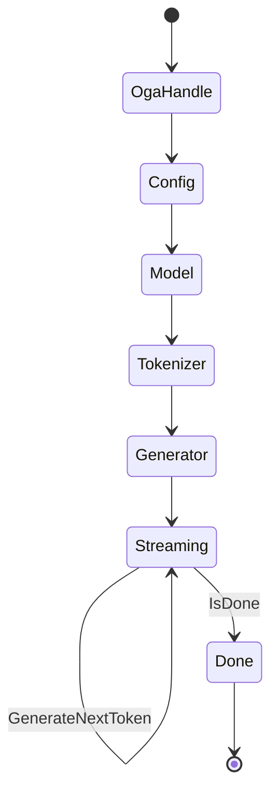

# [COMPUTE_MODEL_LANE]

Rasm.Compute model lane: ONNX model identity and provenance, the one shared session capsule with its EP-context warm-start route, the EP-parameterized execution-provider axis across CPU, CoreML, and the GPU-RID-gated rows, custom-operator admission, the OrtValue-only run-mode fold with its `BoundLoop` zero-allocation hot path, the ORT-GenAI token-streaming generative run owner, and the version-stamped deterministic result cache. The page owns the `ModelSource`/`ModelIdentity` vocabulary, the `SessionPolicy` lifecycle rows, the `ExecutionProvider` axis, the extension-op admission fold, the `RunConfig`/`RunOps` inference fold, the `GenerationPolicy`/`GenerativeRun` token-streaming owner over Microsoft.ML.OnnxRuntimeGenAI, and the `CachePolicy`/`CacheOps` read-through over Microsoft.ML.OnnxRuntime. The lane composes AppHost clocks, deadlines, drain, schedule, and cache ports plus Persistence index, blob, and `ModelResultKey` rows as settled vocabulary.

## [1]-[INDEX]

| [INDEX] | [CLUSTER]       | [OWNS]                                                               |
| :-----: | :-------------- | :------------------------------------------------------------------- |
|   [1]   | MODEL_IDENTITY  | Checksum identity; acquisition union; schema snapshot; admission law |
|   [2]   | SESSION_CAPSULE | One shared session per model; lifecycle, warmup, drain rows          |
|   [3]   | EP_AXIS         | Execution-provider rows with probe, OS gate, option table            |
|   [4]   | EXTENSION_OPS   | Extension and custom-op registration with asset evidence             |
|   [5]   | INFERENCE_MODES | OrtValue-only run modes; cancellation edge; profiling artifacts      |
|   [6]   | GENERATIVE_RUN  | ORT-GenAI token-streaming owner; search-option table; guidance       |
|   [7]   | RESULT_CACHE    | Version-stamped deterministic keys; cache-policy rows                |

## [2]-[MODEL_IDENTITY]

- Owner: `ModelIdentity` identity record with nested `Slot` schema rows; `ModelSource` `[Union]` four acquisition cases collapsing to one byte admission.
- Cases: `LocalFile`, `EmbeddedResource`, `PersistenceBlob`, `RemoteFetch`.
- Entry: `public static ModelIdentity Snapshot(ModelSource source, ReadOnlySpan<byte> bytes, InferenceSession session, Instant at)` — pure value; identity derives from the bytes, never from the caller.
- Auto: `Snapshot` stamps the XxHash128 identity checksum, graph version, and input/output slot rows in one call; `Accepts` runs once at load and faults `ModelRejected` with mismatch evidence.
- Receipt: the ModelLoad receipt case carries checksum, source case, slot counts, and elapsed; emission rides the sink port at the composition edge.
- Packages: Microsoft.ML.OnnxRuntime, System.IO.Hashing, NodaTime, Thinktecture.Runtime.Extensions, LanguageExt.Core, Rasm.Persistence (project)
- Growth: a new acquisition route is one case on `ModelSource`; zero new surface.
- Boundary: every downstream cache key, receipt, and claim derives from `Checksum` — path-keyed or filename-keyed model identity is the deleted form; `Slot.FreeDims` rows drive the free-dimension overrides at session build, with symbolic-dim values arriving from the geometry-encoding rows as settled vocabulary; schema admission happens exactly once at load.

```csharp signature
[Union(ConversionFromValue = ConversionOperatorsGeneration.None)]
public abstract partial record ModelSource {
    private ModelSource() { }

    public sealed record LocalFile(string Path) : ModelSource;

    public sealed record EmbeddedResource(Assembly Assembly, string Name) : ModelSource;

    public sealed record PersistenceBlob(ArtifactIndexRow Row) : ModelSource;

    public sealed record RemoteFetch(string ArtifactId) : ModelSource;
}

public sealed record ModelIdentity(
    UInt128 Checksum,
    long GraphVersion,
    Seq<ModelIdentity.Slot> Inputs,
    Seq<ModelIdentity.Slot> Outputs,
    ModelSource Source,
    Instant AcquiredAt) {
    public sealed record Slot(string Name, TensorElementType Dtype, Seq<int> Dims, Seq<string> FreeDims);

    public string Key => $"{Checksum:x32}";

    public static ModelIdentity Snapshot(ModelSource source, ReadOnlySpan<byte> bytes, InferenceSession session, Instant at) =>
        new(
            XxHash128.HashToUInt128(bytes),
            session.ModelMetadata.Version,
            Slots(session.InputMetadata),
            Slots(session.OutputMetadata),
            source,
            at);

    public Fin<Unit> Accepts(Seq<(string Name, TensorElementType Dtype, int Rank)> binding) =>
        binding.Filter(slot => !Inputs.Exists(own =>
            StringComparer.Ordinal.Equals(own.Name, slot.Name)
            && own.Dtype == slot.Dtype
            && own.Dims.Count == slot.Rank)).IsEmpty
            ? Fin.Succ(unit)
            : Fin.Fail<Unit>(new ComputeFault.ModelRejected(Key));

    static Seq<Slot> Slots(IReadOnlyDictionary<string, NodeMetadata> nodes) =>
        toSeq(nodes).Map(static pair => new Slot(
            pair.Key,
            pair.Value.ElementDataType,
            toSeq(pair.Value.Dimensions),
            toSeq(pair.Value.SymbolicDimensions)));
}
```

## [3]-[SESSION_CAPSULE]

- Owner: `SessionPolicy` lifecycle policy record; `ModelSessions` boundary capsule owning the OrtEnv boot gate, the resident-session map, and the drain and warmup rows.
- Entry: `public static Fin<(InferenceSession Session, Option<ArtifactIndexRow> WarmStart)> Lease(ModelIdentity model, ReadOnlyMemory<byte> bytes, ExecutionProvider ep, SessionPolicy policy, string artifactDir, ClockPolicy clocks)` — `Fin` aborts on rejected admission; a hit shares the resident session with `None` warm-start evidence and a first open carries the compiled EP-context row.
- Auto: the admission fold runs options, EP-context keys, free-dim overrides, device policy, EP registration, custom ops, and resident admission as one rail; every lease touches `LastUsed`; eviction past `ResidentSessions` captures the least-recently-used residents inside the swap and disposes them only after the map commits; on first open the compiled EP-context blob is read back from the artifact directory through `WarmStart` inside the success arm and the resulting `ArtifactIndexRow` — content-addressed by the model checksum under the `WarmStartClassification`/`WarmStartRetention` policy columns — rides out of `Open` for the composition edge to route to the Persistence blob lane, so a cold companion warms from the same blob the host wrote.
- Receipt: the Warmup receipt rides the representative-shape first run on the sweep row and carries the warm-start `ArtifactIndexRow` checksum and byte size from the `Lease` evidence when the compiled context lands; the Drain receipt counts unloaded sessions on the band-200 row.
- Packages: Microsoft.ML.OnnxRuntime, LanguageExt.Core, NodaTime, Rasm.AppHost (project), Rasm.Persistence (project)
- Growth: a lifecycle change is one policy value on `SessionPolicy`; the EP-context warm-start route is one artifact column on the open fold, never a second cache or artifact owner; zero new surface.
- Boundary: `ModelSessions` is the page's boundary capsule and its fence carries language-owned statement forms; ORT sessions are thread-safe for concurrent `Run`, so all lanes share ONE `InferenceSession` per checksum — a session pool is the rejected form; `DisablePerSessionThreads` puts every session on the global pool `Boot` constructs from the `CpuBudget` row — `OrtThreadingOptions.GlobalIntraOpNumThreads` and `GlobalInterOpNumThreads` take the budget's `OrtIntraOp` and `OrtInterOp` and `GlobalSpinControl` takes its `SpinControl` latency-versus-CPU posture, so a thread count or spin flag set outside this one boot fence is the named defect; `DisableTelemetryEvents` runs at boot because the telemetry spine owns signals; the sweep entry folds idle eviction before re-warm on the registered `compute-model-warmup` row; the compiled `ep.context_*` artifact and profile outputs land under the blob-lane artifact directory through `ArtifactIndexRow.Admit`, never as stray temp files, and the warm-start blob is content-addressed by the session fingerprint the capsule already computes — a managed copy of the context bytes is the rejected form.

```csharp signature
public sealed record SessionPolicy(
    int ResidentSessions, Duration IdleUnload, Duration WarmupSweep,
    GraphOptimizationLevel Optimization, bool MemoryPattern, bool Profiling,
    bool OrtExtensions, Seq<string> CustomOpLibraries, Seq<(string Dim, long Value)> FreeDims,
    DataClassification WarmStartClassification, string WarmStartRetention) {
    public static readonly SessionPolicy Canonical = new(
        ResidentSessions: 4, IdleUnload: Duration.FromMinutes(10), WarmupSweep: Duration.FromMinutes(5),
        Optimization: GraphOptimizationLevel.ORT_ENABLE_ALL, MemoryPattern: true, Profiling: false,
        OrtExtensions: false, CustomOpLibraries: Seq<string>(), FreeDims: Seq<(string Dim, long Value)>(),
        WarmStartClassification: DataClassification.Operational, WarmStartRetention: "blob-index");
}

public static class ModelSessions {
    sealed record Resident(InferenceSession Session, Instant LastUsed);

    static readonly Atom<HashMap<UInt128, Resident>> Residents = Atom(HashMap<UInt128, Resident>());
    static readonly PrePackedWeightsContainer PrePacked = new();

    public static Fin<Unit> Boot(string logId, OrtLoggingLevel severity, CpuBudget budget) {
        if (OrtEnv.IsCreated) { return Fin.Succ(unit); }
        var pool = new OrtThreadingOptions { GlobalIntraOpNumThreads = budget.OrtIntraOp, GlobalInterOpNumThreads = budget.OrtInterOp, GlobalSpinControl = budget.SpinControl };
        var creation = new EnvironmentCreationOptions { logId = logId, logLevel = severity, threadOptions = pool };
        OrtEnv.CreateInstanceWithOptions(ref creation);
        OrtEnv.Instance().DisableTelemetryEvents();
        return Fin.Succ(unit);
    }

    public static Fin<(InferenceSession Session, Option<ArtifactIndexRow> WarmStart)> Lease(ModelIdentity model, ReadOnlyMemory<byte> bytes, ExecutionProvider ep, SessionPolicy policy, string artifactDir, ClockPolicy clocks) {
        var now = clocks.Now;
        if (Residents.Value.Find(model.Checksum).Case is Resident resident) {
            Residents.Swap(map => map.SetItem(model.Checksum, resident with { LastUsed = now }));
            return Fin.Succ((resident.Session, Option<ArtifactIndexRow>.None));
        }
        return Open(model, bytes, ep, policy, artifactDir, now);
    }

    public static Seq<UInt128> Unload(Instant idleBefore) {
        Seq<(UInt128, Resident)> evicted = default;
        Residents.Swap(map => (evicted = toSeq(map.ToSeq().Filter(pair => pair.Item2.LastUsed < idleBefore))).Fold(map, static (acc, pair) => acc.Remove(pair.Item1)));
        evicted.Iter(static pair => pair.Item2.Session.Dispose());
        return evicted.Map(static pair => pair.Item1);
    }

    public static DrainParticipantPort DrainRow =>
        new("compute-model-sessions", DrainBand.Compute, Rank: 10, static _ => IO.lift(() => Unload(Instant.MaxValue)).Map(static _ => unit));

    public static ScheduleEntry SweepRow(Func<IO<Unit>> warm) =>
        new("compute-model-warmup", new OccurrenceSpec.Every(SessionPolicy.Canonical.WarmupSweep), DeadlineClass.Startup, Option<LeasePolicy>.None, warm);

    static Fin<(InferenceSession Session, Option<ArtifactIndexRow> WarmStart)> Open(ModelIdentity model, ReadOnlyMemory<byte> bytes, ExecutionProvider ep, SessionPolicy policy, string artifactDir, Instant now) {
        var options = new SessionOptions();
        try {
            options.GraphOptimizationLevel = policy.Optimization;
            options.EnableMemoryPattern = policy.MemoryPattern;
            options.EnableProfiling = policy.Profiling;
            options.ProfileOutputPathPrefix = Path.Combine(artifactDir, "onnx-profile");
            options.DisablePerSessionThreads();
            options.AddSessionConfigEntry("ep.context_enable", "1");
            options.AddSessionConfigEntry("ep.context_file_path", Path.Combine(artifactDir, $"{model.Checksum:x32}.ctx.onnx"));
            options.AddSessionConfigEntry("ep.share_ep_contexts", "1");
            policy.FreeDims.Iter(dim => options.AddFreeDimensionOverrideByName(dim.Dim, dim.Value));
            ep.DevicePolicy.Iter(options.SetEpSelectionPolicy);
            ep.Register(options, artifactDir);
            return CustomOps.Register(options, policy)
                .MapFail(fault => { options.Dispose(); return fault; })
                .Map(ready => {
                    var session = new InferenceSession(bytes.ToArray(), ready, PrePacked);
                    Seq<(UInt128, Resident)> evicted = default;
                    Residents.Swap(map => (evicted = toSeq(map.ToSeq().OrderBy(static pair => pair.Item2.LastUsed).Take(Math.Max(map.Count - policy.ResidentSessions + 1, 0)))).Fold(map, static (acc, pair) => acc.Remove(pair.Item1)).Add(model.Checksum, new Resident(session, now)));
                    evicted.Iter(static pair => pair.Item2.Session.Dispose());
                    return (session, WarmStart(model, artifactDir, policy.WarmStartClassification, policy.WarmStartRetention, now));
                });
        }
        catch (Exception error) {
            options.Dispose();
            return Fin.Fail<(InferenceSession, Option<ArtifactIndexRow>)>(new ComputeFault.ModelRejected(error.Message));
        }
    }

    static Option<ArtifactIndexRow> WarmStart(ModelIdentity model, string artifactDir, DataClassification classification, string retentionClass, Instant at) {
        var contextPath = Path.Combine(artifactDir, $"{model.Checksum:x32}.ctx.onnx");
        return File.Exists(contextPath)
            ? Some(ArtifactIndexRow.Admit(ArtifactIndexRow.EpContext, contextPath, File.ReadAllBytes(contextPath), classification, retentionClass, at))
            : None;
    }
}
```

## [4]-[EP_AXIS]

- Owner: `ModelKeyPolicy` ordinal accessor; `ExecutionProvider` `[SmartEnum<string>]` rows with probe name, OS gate, frozen option table, device policy, and register delegate columns.
- Cases: `Cpu`, `CoreMl`, `Cuda`, `DirectMl`.
- Auto: `Available` reads the `GetAvailableProviders` probe plus the macOS 12 gate riding the `ModelFormat` row value and the `RequiresWindows` gate on the GPU rows; `ResultKey` stamps EP key, ORT version, and option-table hash for the deterministic cache key with zero call-site hashing.
- Packages: Microsoft.ML.OnnxRuntime, System.IO.Hashing, Thinktecture.Runtime.Extensions, LanguageExt.Core, BCL inbox
- Growth: a new accelerator is one `ExecutionProvider` row with its probe name, OS gate, and device policy columns — `Cuda` and `DirectMl` are the GPU-RID-gated rows carrying the `PREFER_GPU` and `MAX_PERFORMANCE` device policies with their grounded `_CUDA(0)`/`_DML(0)` register members; the generative token-streaming successor lands as the `GENERATIVE_RUN` run-mode cluster composing this EP axis, never a chat-client surface; zero new surface.
- Boundary: `AppendExecutionProvider_CoreML(CoreMLFlags coremlFlags)` is the canonical typed registration carrying the `CoreMlFlag` flag column, and `AppendExecutionProvider("CoreMLExecutionProvider", options)` is the proved option-rich fallback for the string-keyed `ModelCacheDirectory`/`MLComputeUnits` keys — a bare `"CoreML"` provider name faults `InvalidArgument` and is the deleted spelling; the `Cuda` and `DirectMl` rows carry their `PREFER_GPU` and `MAX_PERFORMANCE` device policies and the grounded `AppendExecutionProvider_CUDA(0)`/`AppendExecutionProvider_DML(0)` register members behind the `RequiresWindows`/GPU-RID gate — the registration member shape is FINALIZED and the GPU-hardware execution is the residual tier-3 probe; the macOS 12 gate is per `ModelFormat` value because the legacy NeuralNetwork format alone reaches back to macOS 10.15; the CoreML option keys and their value domains are catalogued and the seven frozen rows are the canonical spelling; the default CoreML flag is `COREML_FLAG_USE_NONE` (proved working) and `COREML_FLAG_CREATE_MLPROGRAM` is the MLProgram-backend column matching the `ModelFormat=MLProgram` option; `ModelCacheDirectory` binds at registration to the blob-lane artifact directory so compiled CoreML caches are catalogued inventory; a vetoed row degrades to the next with its reason in the receipt and `Cpu` is the implicit terminal; dylib-presence heuristics are the deleted probe form.

```csharp signature
public sealed class ModelKeyPolicy : IEqualityComparerAccessor<string>, IComparerAccessor<string> {
    private static readonly StringComparer Policy = StringComparer.Ordinal;

    public static IEqualityComparer<string> EqualityComparer => Policy;
    public static IComparer<string> Comparer => Policy;
}

[SmartEnum<string>]
[KeyMemberEqualityComparer<ModelKeyPolicy, string>]
[KeyMemberComparer<ModelKeyPolicy, string>]
public sealed partial class ExecutionProvider {
    static readonly FrozenDictionary<string, string> CoreMlRows = new Dictionary<string, string>(StringComparer.Ordinal) {
        ["ModelFormat"] = "MLProgram",
        ["MLComputeUnits"] = "ALL",
        ["RequireStaticInputShapes"] = "0",
        ["EnableOnSubgraphs"] = "0",
        ["SpecializationStrategy"] = "Default",
        ["ProfileComputePlan"] = "0",
        ["AllowLowPrecisionAccumulationOnGPU"] = "0",
    }.ToFrozenDictionary(StringComparer.Ordinal);

    public static readonly ExecutionProvider Cpu = new("cpu", providerName: "CPUExecutionProvider", minMacOsMajor: 0, requiresWindows: false, optionsHash: 0UL, options: FrozenDictionary<string, string>.Empty, coreMlFlag: CoreMLFlags.COREML_FLAG_USE_NONE, devicePolicy: Option<ExecutionProviderDevicePolicy>.None, register: static (_, _) => { });

    public static readonly ExecutionProvider CoreMl = new(
        "coreml", providerName: "CoreMLExecutionProvider", minMacOsMajor: 12, requiresWindows: false, optionsHash: Hash(CoreMlRows),
        options: CoreMlRows, coreMlFlag: CoreMLFlags.COREML_FLAG_USE_NONE, devicePolicy: Some(ExecutionProviderDevicePolicy.PREFER_NPU),
        register: static (sessionOptions, cacheDir) => {
            sessionOptions.AppendExecutionProvider_CoreML(CoreMLFlags.COREML_FLAG_USE_NONE);
            sessionOptions.AppendExecutionProvider("CoreMLExecutionProvider", new Dictionary<string, string>(CoreMlRows, StringComparer.Ordinal) { ["ModelCacheDirectory"] = cacheDir });
        });

    public static readonly ExecutionProvider Cuda = new("cuda", providerName: "CUDAExecutionProvider", minMacOsMajor: 0, requiresWindows: true, optionsHash: 0UL, options: FrozenDictionary<string, string>.Empty, coreMlFlag: CoreMLFlags.COREML_FLAG_USE_NONE, devicePolicy: Some(ExecutionProviderDevicePolicy.PREFER_GPU), register: static (opts, _) => opts.AppendExecutionProvider_CUDA(0));

    public static readonly ExecutionProvider DirectMl = new("directml", providerName: "DmlExecutionProvider", minMacOsMajor: 0, requiresWindows: true, optionsHash: 0UL, options: FrozenDictionary<string, string>.Empty, coreMlFlag: CoreMLFlags.COREML_FLAG_USE_NONE, devicePolicy: Some(ExecutionProviderDevicePolicy.MAX_PERFORMANCE), register: static (opts, _) => opts.AppendExecutionProvider_DML(0));

    public string ProviderName { get; }
    public int MinMacOsMajor { get; }
    public bool RequiresWindows { get; }
    public ulong OptionsHash { get; }
    public FrozenDictionary<string, string> Options { get; }
    public CoreMLFlags CoreMlFlag { get; }
    public Option<ExecutionProviderDevicePolicy> DevicePolicy { get; }
    public Action<SessionOptions, string> Register { get; }

    public bool Available =>
        OrtEnv.Instance().GetAvailableProviders().Contains(ProviderName, StringComparer.Ordinal)
        && (MinMacOsMajor is 0 || OperatingSystem.IsMacOSVersionAtLeast(MinMacOsMajor))
        && (!RequiresWindows || OperatingSystem.IsWindows());

    public string ResultKey(string ortVersion) => $"{Key}:{ortVersion}:{OptionsHash:x16}";

    static ulong Hash(FrozenDictionary<string, string> rows) =>
        XxHash3.HashToUInt64(Encoding.UTF8.GetBytes(string.Join(';',
            rows.OrderBy(static row => row.Key, StringComparer.Ordinal).Select(static row => $"{row.Key}={row.Value}"))));
}
```

The `CoreMlFlag` column binds the package `Microsoft.ML.OnnxRuntime.CoreMLFlags` `[Flags]` enum (`UInt32`) values:

| [INDEX] | [FLAG]                                       | [VALUE] |
| :-----: | :------------------------------------------- | :-----: |
|   [1]   | `COREML_FLAG_USE_NONE`                       |    0    |
|   [2]   | `COREML_FLAG_USE_CPU_ONLY`                   |    1    |
|   [3]   | `COREML_FLAG_ENABLE_ON_SUBGRAPH`             |    2    |
|   [4]   | `COREML_FLAG_ONLY_ENABLE_DEVICE_WITH_ANE`    |    4    |
|   [5]   | `COREML_FLAG_ONLY_ALLOW_STATIC_INPUT_SHAPES` |    8    |
|   [6]   | `COREML_FLAG_CREATE_MLPROGRAM`               |   16    |
|   [7]   | `COREML_FLAG_USE_CPU_AND_GPU`                |   32    |

## [5]-[EXTENSION_OPS]

- Owner: `CustomOps` — one registration fold over the extensions bundle and the custom-op library rows, plus the string-tensor boundary constructors.
- Cases: `RegisterOrtExtensions` bundle row; `RegisterCustomOpLibraryV2` per-path rows; `CreateFromStringTensor` and `CreateTensorWithEmptyStrings` string-tensor rows.
- Entry: `public static Fin<SessionOptions> Register(SessionOptions options, SessionPolicy policy)` — `Fin` aborts with `ExtensionAssetMissing` naming every absent native asset before any registration runs.
- Receipt: native-asset evidence rides the ModelLoad receipt; the missing-path set is the fault payload.
- Packages: Microsoft.ML.OnnxRuntime.Extensions, Microsoft.ML.OnnxRuntime, LanguageExt.Core, BCL inbox
- Growth: a new custom-op library is one path row on `SessionPolicy.CustomOpLibraries`; zero new surface.
- Boundary: registration extends the `ModelSessions` boundary capsule and this fence carries language-owned statement forms — guard admission before registration and the out-parameter custom-op handle; tokenizer and pre/post operators stay session assets — a preprocessing or tokenizer service family is the rejected form; the `String` dtype is a model-boundary-only row entering through `DenseTensor<string>` and never the interior tensor vocabulary.

```csharp signature
public static class CustomOps {
    public static Fin<SessionOptions> Register(SessionOptions options, SessionPolicy policy) {
        var missing = policy.CustomOpLibraries.Filter(static path => !File.Exists(path));
        if (!missing.IsEmpty) {
            return Fin.Fail<SessionOptions>(new ComputeFault.ExtensionAssetMissing(string.Join(';', missing)));
        }
        if (policy.OrtExtensions) {
            options.RegisterOrtExtensions();
        }
        policy.CustomOpLibraries.Iter(path => options.RegisterCustomOpLibraryV2(path, out _));
        return Fin.Succ(options);
    }

    public static (string Name, OrtValue Value) StringInput(string name, DenseTensor<string> tokens) =>
        (name, OrtValue.CreateFromStringTensor(tokens));
    public static OrtValue StringSlots(OrtAllocator allocator, long[] shape) =>
        OrtValue.CreateTensorWithEmptyStrings(allocator, shape);
}
```

## [6]-[INFERENCE_MODES]

- Owner: `RunOps` — the run-mode fold over the shared session: single, lane-enqueued, bound-batch, and windowed runs discriminated by intent payload shape.
- Cases: single `Run`; lane-enqueued async (the lane seam owns the thread hop — the native `RunAsync` requires pre-allocated output `OrtValue`s and completes on a native callback outside the lane scope, so it is the rejected spelling); `RunWithBinding` bound batch over a populated `OrtIoBinding`; the `BoundLoop` steady-state hot path; `Chunked` streaming windows over chunked inputs through `RecyclableMemoryStream.GetReadOnlySequence`; `Embed` text-to-vector projection over an embedding model.
- Entry: `public Fin<T> Infer<T>(RunOptions options, CancelScope scope, Seq<(string Name, OrtValue Value)> inputs, Seq<string> outputs, Func<IDisposableReadOnlyCollection<OrtValue>, Fin<T>> project)` — the projection runs inside the native-result bracket.
- Auto: `Plan` wires deadline expiry into the `Terminate` one-way latch from the linked `CancelScope`, attaches LoRA adapters, and folds the `RunConfig` row table into `AddRunConfigEntry` calls so a posture change selects a row rather than editing the fence; one conversion arm classifies failures into `DeadlineExpired`/`Cancelled` by scope provenance.
- Receipt: the ModelRun receipt carries route, elapsed, allocation class, and `OrtMemoryInfo` allocator evidence slots; profiling chrome-trace artifacts land as `ArtifactIndexRow.OnnxProfile` rows with the artifact path in the receipt.
- Packages: Microsoft.ML.OnnxRuntime, LanguageExt.Core, NodaTime, Rasm.AppHost (project), Rasm.Persistence (project)
- Growth: a new run shape is one payload-shape case on the intent family; a new run-config posture is one `RunConfig` row carrying its `AddRunConfigEntry` key-value pairs and its `OrtAllocatorType` arena column; an embedding model is one more `Embed` run over the same session capsule, never a new model lane; zero new surface.
- Boundary: `RunOps` extends the `ModelSessions` boundary capsule and this fence carries bracketed statement forms with deterministic native disposal; OrtValue-only law — `NamedOnnxValue`, `DisposableNamedOnnxValue`, and `FixedBufferOnnxValue` are superseded spellings that never appear; `CreateTensorValueFromMemory` binds rented staging arrays without copies; the `Terminate` latch is the single cancellation propagation path and the deadline-poll cadence binds from the CANCELLATION research row; `InferBound` runs `RunWithBinding` over a populated `OrtIoBinding`, bracketing the run between `SynchronizeBoundInputs` and `SynchronizeBoundOutputs` and projecting `GetOutputValues`; the `BoundLoop` capsule is the zero-allocation steady-state posture for repeated same-shape inference — `CreateIoBinding`, `BindInput`/`BindOutput` once, a `MemoryOwner<float>` input plane refreshed by span copy, a `CreateAllocatedTensorValue` output sink, and `RunWithBinding` per `Pulse` with no per-call marshal — and a shape-class transition rebinds through `ClearBoundInputs`/`ClearBoundOutputs` with `BindOutputToDevice` routing device outputs; `Chunked` reads the chunked input through `RecyclableMemoryStream.GetReadOnlySequence` (zero-copy) and drives one `BoundLoop.Pulse` per window emitting the `streaming` `ProgressPhase` and a `StreamSegment` receipt per chunk, never a hand-rolled contiguous frame; `Embed` runs one inference over an embedding model and projects the last-hidden-state mean-pool or CLS-token slice to a `float[]`/`Half[]` vector feeding the Persistence vector lane by reference, keying on the content-hash and model-id reuse identity the Persistence owner holds; the `RunConfig.Arena` column classifies the run allocator through `OrtAllocatorType` (`ArenaAllocator` steady, `DeviceAllocator` device-resident); output projection scopes native memory inside `project` and sentinel or NaN values project to `Option` at the boundary, never inward.

```csharp signature
public sealed record RunConfig(FrozenDictionary<string, string> Entries, OrtAllocatorType Arena) {
    public static readonly RunConfig Steady = new(FrozenDictionary<string, string>.Empty, OrtAllocatorType.ArenaAllocator);
    public static RunConfig Bulk(string arenaShrinkDevice) => new(new Dictionary<string, string>(StringComparer.Ordinal) {
        ["memory.enable_memory_arena_shrinkage"] = arenaShrinkDevice,
    }.ToFrozenDictionary(StringComparer.Ordinal), OrtAllocatorType.ArenaAllocator);
    public static readonly RunConfig Device = new(FrozenDictionary<string, string>.Empty, OrtAllocatorType.DeviceAllocator);
}

public static class RunOps {
    public static RunOptions Plan(CancelScope scope, RunConfig config, Option<OrtLoraAdapter> lora = default) {
        var options = new RunOptions();
        lora.Iter(options.AddActiveLoraAdapter);
        config.Entries.Iter(entry => options.AddRunConfigEntry(entry.Key, entry.Value));
        scope.Source.Token.Register(() => options.Terminate = true);
        return options;
    }

    public static (string Name, OrtValue Value) Input<T>(string name, T[] data, long[] shape) where T : unmanaged =>
        (name, OrtValue.CreateTensorValueFromMemory(data, shape));

    extension(InferenceSession session) {
        public Fin<T> Infer<T>(RunOptions options, CancelScope scope, Seq<(string Name, OrtValue Value)> inputs, Seq<string> outputs, Func<IDisposableReadOnlyCollection<OrtValue>, Fin<T>> project) =>
            Bracket(scope, project, () => session.Run(options, inputs.Map(static row => row.Name), inputs.Map(static row => row.Value), outputs));

        public Fin<T> InferBound<T>(RunOptions options, CancelScope scope, OrtIoBinding binding, Func<IDisposableReadOnlyCollection<OrtValue>, Fin<T>> project) =>
            Bracket(scope, project, () => { binding.SynchronizeBoundInputs(); session.RunWithBinding(options, binding); binding.SynchronizeBoundOutputs(); return binding.GetOutputValues(); });

        public ArtifactIndexRow Profile(DataClassification classification, string retentionClass, Instant at) {
            var path = session.EndProfiling();
            return ArtifactIndexRow.Admit(ArtifactIndexRow.OnnxProfile, path, File.ReadAllBytes(path), classification, retentionClass, at);
        }

        public Fin<Seq<T>> Chunked<T>(RunOptions options, CancelScope scope, BoundLoop loop, ReadOnlySequence<byte> windows, int windowFloats, Func<IDisposableReadOnlyCollection<OrtValue>, Fin<T>> project) =>
            toSeq(Frames(windows, windowFloats)).TraverseM(window => loop.Pulse(options, scope, window.Span, project)).As();

        public Fin<float[]> Embed(RunOptions options, CancelScope scope, Seq<(string Name, OrtValue Value)> inputs, string output) =>
            session.Infer(options, scope, inputs, Seq(output), static results => Fin.Succ(results.First().GetTensorDataAsSpan<float>().ToArray()));
    }

    static IEnumerable<ReadOnlyMemory<float>> Frames(ReadOnlySequence<byte> windows, int windowFloats) =>
        toSeq(Enumerable.Range(0, checked((int)(windows.Length / (windowFloats * sizeof(float))))))
            .Map(index => {
                var slice = windows.Slice((long)index * windowFloats * sizeof(float), windowFloats * sizeof(float)).ToArray();
                return new ReadOnlyMemory<float>(MemoryMarshal.Cast<byte, float>(slice).ToArray());
            });

    static Fin<T> Bracket<T>(CancelScope scope, Func<IDisposableReadOnlyCollection<OrtValue>, Fin<T>> project, Func<IDisposableReadOnlyCollection<OrtValue>> run) {
        IDisposableReadOnlyCollection<OrtValue>? results = null;
        try {
            results = run();
            return project(results);
        }
        catch (Exception error) {
            return Fin.Fail<T>(Faulted(scope, error));
        }
        finally {
            results?.Dispose();
        }
    }

    static Error Faulted(CancelScope scope, Exception error) =>
        scope.Source.Token.IsCancellationRequested
            ? scope.Deadline is { IsSome: true, Case: CancellationTokenSource expired } && expired.IsCancellationRequested
                ? new ComputeFault.DeadlineExpired(scope.Provenance)
                : new ComputeFault.Cancelled(scope.Provenance)
            : Error.New(error);

    public sealed class BoundLoop : IDisposable {
        readonly InferenceSession session;
        readonly OrtIoBinding binding;
        readonly MemoryOwner<float> plane;
        readonly OrtValue bound, sink;

        public BoundLoop(InferenceSession session, string input, string output, long[] shape) {
            this.session = session;
            plane = MemoryOwner<float>.Allocate(checked((int)shape.Aggregate(1L, static (acc, extent) => acc * extent)));
            bound = OrtValue.CreateTensorValueFromMemory(OrtMemoryInfo.DefaultInstance, plane.Memory, shape);
            sink = OrtValue.CreateAllocatedTensorValue(OrtAllocator.DefaultInstance, TensorElementType.Float, shape);
            binding = session.CreateIoBinding();
            binding.BindInput(input, bound);
            binding.BindOutput(output, sink);
        }

        public Fin<T> Pulse<T>(RunOptions options, CancelScope scope, ReadOnlySpan<float> payload, Func<IDisposableReadOnlyCollection<OrtValue>, Fin<T>> project) {
            payload.CopyTo(plane.Span);
            return Bracket(scope, project, () => { binding.SynchronizeBoundInputs(); session.RunWithBinding(options, binding); binding.SynchronizeBoundOutputs(); return binding.GetOutputValues(); });
        }

        public void Rebind(string input, string output, long[] shape) {
            binding.ClearBoundInputs();
            binding.ClearBoundOutputs();
            binding.BindInput(input, OrtValue.CreateTensorValueFromMemory(OrtMemoryInfo.DefaultInstance, plane.Memory, shape));
            binding.BindOutputToDevice(output, OrtMemoryInfo.DefaultInstance);
        }

        public void Dispose() { binding.Dispose(); bound.Dispose(); sink.Dispose(); plane.Dispose(); }
    }
}
```

## [7]-[GENERATIVE_RUN]

- Owner: `GenerationPolicy` search-option and prompt-assembly record; `GuidanceKind` `[SmartEnum<string>]` structured-output constraint rows; `GenerativeRun` boundary capsule owning the ORT-GenAI handle chain, the token-stream loop, and the tool-call arm over Microsoft.ML.OnnxRuntimeGenAI.
- Cases: `GuidanceKind` rows none · json-schema · regex · lark-grammar · choice.
- Entry: `public static async IAsyncEnumerable<string> Stream(ModelIdentity model, string modelDir, GenerationPolicy policy, ExecutionProvider ep, [EnumeratorCancellation] CancellationToken token)` — the stream yields incremental decoded pieces; a `OnnxRuntimeGenAIException` lifts into `ComputeFault.ModelRejected` at the boundary so domain code never sees the native exception.
- Auto: the search-option fold writes every `GenerationPolicy` numeric column through `GeneratorParams.SetSearchOption(string, double)` and every flag through `SetSearchOption(string, bool)` — no string-valued overload exists; `Guidance` writes through `GeneratorParams.SetGuidance(string type, string data, bool enableFFTokens)` before `Generator` construction so a constrained run can only emit syntactically valid tokens; the prompt assembles through `Tokenizer.ApplyChatTemplate(template, messages, tools, add_generation_prompt)` then `Encode`, so system prompt, history, retrieved context, and tool schemas serialize through the native template primitive, never a hand-rolled string concat; the loop decodes the newest token per step through `TokenizerStream.Decode(int)` over `GetSequence(0UL)[^1]`.
- Receipt: the `Generate` `ComputeReceipt` case carries model checksum, EP, model-type from `Model.GetModelType()`, token count, tokens-per-second, the `GuidanceKind` dimension, the constrained-token count, and the tool-call count; the `streaming` `ProgressPhase` and a `StreamSegment` receipt emit per chunk; instrument `rasm.compute.generate.tokens` counts emitted tokens.
- Packages: Microsoft.ML.OnnxRuntimeGenAI, Microsoft.Extensions.AI.Abstractions, Microsoft.ML.OnnxRuntime, NodaTime, Thinktecture.Runtime.Extensions, LanguageExt.Core, Rasm.AppHost (project), BCL inbox
- Growth: a new search option is one column on `GenerationPolicy` folded into a `SetSearchOption` call; a new output constraint is one `GuidanceKind` row; the built-in `OnnxRuntimeGenAIChatClient : IChatClient` composes the same handle chain when the M.E.AI streaming abstraction is the consumer; zero new surface.
- Boundary: token-streaming is a run mode on this owned model lane composing the session and EP spine and is HOST-LOCAL — the cluster carries no TS_PROJECTION; a remote generative run crosses solely through the EXISTING `remote-lane#PROTO_VOCABULARY` `Generate` rpc (`GenerateRequest` → `TokenChunk` server-stream) projected once as the `ComputeServiceShape.generate` `MethodShape` at `remote-lane`, never re-projected here, and the decoded token pieces and `IAsyncEnumerable<string>` stream are interior types that never sit between wire and rail; a `GenerativeService`, `ChatClient`, `Conversation`, or `PromptService` is the rejected form, and the `Tokenizer`/`TokenizerStream` are session assets, never a tokenizer service family; every ORT-GenAI type is `IDisposable` wrapping a native handle and the `using` order is LIFO with `OgaHandle` outermost (process-global init/teardown); spans returned by `GetSequence`/`GetNextTokens` are views over native memory owned by the live `Generator` — the newest token copies out before the next iteration and never retains past the loop; `TokenizerStream` is obtained ONLY through `Tokenizer.CreateStream()` (no public constructor) and `GetSequence` takes `ulong` (`0UL`); the sole error rail is `OnnxRuntimeGenAIException` lifted to `ComputeFault.ModelRejected` at the boundary, never a per-call catch; numeric search options pass as `double` and flags as `bool`; provider selection rides `Config.AppendProvider`/`SetProviderOption` before `new Model(config)` as a policy column, never per-generation; the tool-call arm surfaces a decoded tool request to the AppHost control dispatch and re-feeds the typed result through `Generator.AppendTokens`/`AppendTokenSequences` or rewinds a partial turn through `RewindTo(ulong)`, with the conversation and turn state owned by the caller, never here; grammar-constrained structured output is enforced at generation through `SetGuidance` and a managed JSON-schema validator over the output is the rejected form.

```csharp signature
[SmartEnum<string>]
[KeyMemberEqualityComparer<ModelKeyPolicy, string>]
[KeyMemberComparer<ModelKeyPolicy, string>]
public sealed partial class GuidanceKind {
    public static readonly GuidanceKind None = new("none", type: "");
    public static readonly GuidanceKind JsonSchema = new("json-schema", type: "json_schema");
    public static readonly GuidanceKind Regex = new("regex", type: "regex");
    public static readonly GuidanceKind LarkGrammar = new("lark-grammar", type: "lark_grammar");
    public static readonly GuidanceKind Choice = new("choice", type: "choice");

    public string Type { get; }
}

public sealed record GenerationPolicy(
    double MaxLength,
    double Temperature,
    double TopP,
    double TopK,
    double RepetitionPenalty,
    bool DoSample,
    GuidanceKind Guidance,
    string GuidanceData,
    bool FastForwardTokens,
    string SystemPrompt,
    string ChatTemplate,
    Seq<(string Role, string Content)> History,
    Seq<string> RetrievedContext,
    string Tools) {
    public static readonly GenerationPolicy Canonical = new(
        MaxLength: 512.0, Temperature: 0.7, TopP: 0.9, TopK: 50.0, RepetitionPenalty: 1.0, DoSample: true,
        Guidance: GuidanceKind.None, GuidanceData: "", FastForwardTokens: false,
        SystemPrompt: "", ChatTemplate: "", History: Seq<(string, string)>(), RetrievedContext: Seq<string>(), Tools: "");

    public void Apply(GeneratorParams generatorParams) {
        generatorParams.SetSearchOption("max_length", MaxLength);
        generatorParams.SetSearchOption("temperature", Temperature);
        generatorParams.SetSearchOption("top_p", TopP);
        generatorParams.SetSearchOption("top_k", TopK);
        generatorParams.SetSearchOption("repetition_penalty", RepetitionPenalty);
        generatorParams.SetSearchOption("do_sample", DoSample);
        if (Guidance != GuidanceKind.None) {
            generatorParams.SetGuidance(Guidance.Type, GuidanceData, FastForwardTokens);
        }
    }

    public string Messages(string prompt) =>
        JsonSerializer.Serialize(
            (Seq(("system", SystemPrompt)) + History + Seq(("user", $"{string.Join('\n', RetrievedContext)}\n{prompt}")))
                .Map(static turn => new { role = turn.Item1, content = turn.Item2 }));
}

public static class GenerativeRun {
    public static async IAsyncEnumerable<string> Stream(ModelIdentity model, string modelDir, GenerationPolicy policy, string prompt, ExecutionProvider ep, [EnumeratorCancellation] CancellationToken token) {
        using var oga = new OgaHandle();
        using var config = new Config(modelDir);
        if (ep != ExecutionProvider.Cpu) {
            config.AppendProvider(ep.Key);
            ep.Options.Iter(option => config.SetProviderOption(ep.Key, option.Key, option.Value));
        }
        using var session = new Model(config);
        using var tokenizer = new Tokenizer(session);
        using var stream = tokenizer.CreateStream();
        using var encoded = tokenizer.Encode(tokenizer.ApplyChatTemplate(policy.ChatTemplate, policy.Messages(prompt), policy.Tools, true));
        using var generatorParams = new GeneratorParams(session);
        policy.Apply(generatorParams);
        using var generator = new Generator(session, generatorParams);
        generator.AppendTokenSequences(encoded);
        while (!generator.IsDone()) {
            token.ThrowIfCancellationRequested();
            generator.GenerateNextToken();
            var sequence = generator.GetSequence(0UL);
            yield return stream.Decode(sequence[sequence.Length - 1]);
        }
    }

    public static ComputeReceipt.Generate Receipt(ModelIdentity model, ExecutionProvider ep, string modelType, GenerationPolicy policy, CorrelationId correlation, ulong tokenCount, Duration elapsed) =>
        new(model.Key, ep, modelType, checked((int)tokenCount),
            elapsed.TotalSeconds > 0.0 ? tokenCount / elapsed.TotalSeconds : 0.0,
            policy.Guidance.Key, 0, 0) {
            Correlation = correlation, Lane = WorkLane.Background, Substrate = Substrate.Onnx, AllocationClass = AllocationClass.NativeOrt, Elapsed = elapsed,
        };

    public static async Task<Fin<Seq<string>>> Collect(ModelIdentity model, string modelDir, GenerationPolicy policy, string prompt, ExecutionProvider ep, CancellationToken token) {
        var pieces = Seq<string>();
        try {
            await foreach (var piece in Stream(model, modelDir, policy, prompt, ep, token)) {
                pieces = pieces.Add(piece);
            }
            return Fin.Succ(pieces);
        }
        catch (OnnxRuntimeGenAIException error) {
            return Fin.Fail<Seq<string>>(new ComputeFault.ModelRejected(error.Message));
        }
    }
}
```



## [8]-[RESULT_CACHE]

- Owner: `CachePolicy` `[SmartEnum<string>]` serve/store/cut rows; `CacheOps` key derivation, checksum-echo validation, and the policy-dispatched read-through.
- Cases: `Bypass`, `ReadThrough`, `WriteThrough`, `Refresh`.
- Entry: `public ValueTask<T> Through<T, TState>(CachePolicy policy, ModelResultKey key, TState state, Func<TState, CancellationToken, ValueTask<T>> produce, CancellationToken token = default)` — the cache-policy row is an intent field, never a boolean flag.
- Auto: `Key` stamps model checksum, intent input digest, EP key, ORT version, and option-table hash in one call so cross-version numerical drift never serves as a deterministic hit; stampede single-flight, lane tags, and hit/miss facts ride the composed index surface with zero call-site ceremony.
- Receipt: `CacheIndexFact` hit/miss/evict facts with byte sizes; `Validated` faults `CacheCorrupt` on checksum-echo mismatch at read.
- Packages: Microsoft.Extensions.Caching.Hybrid, Microsoft.ML.OnnxRuntime, Thinktecture.Runtime.Extensions, LanguageExt.Core, Rasm.AppHost (project), Rasm.Persistence (project)
- Growth: a new cache posture is one `CachePolicy` row; zero new surface.
- Boundary: `CacheOps` extends the cache boundary capsule and this fence carries the async statement forms of the fresh path; Compute owns keys and policy rows, never a cache instance — `CacheSurface` over `CacheLane.ModelResult` is the single cache owner and hand-rolled memoization beside it is the named defect; cached payloads carry the checksum echo that `Validated` checks before projection; the cross-process result-reuse recency horizon is read by reference from the Persistence `ModelResultKey` index owner — the single horizon owner — never minted here, so a second `Duration horizon` parameter beside the policy rows is the named defect.

```csharp signature
[SmartEnum<string>]
[KeyMemberEqualityComparer<ModelKeyPolicy, string>]
[KeyMemberComparer<ModelKeyPolicy, string>]
public sealed partial class CachePolicy {
    public static readonly CachePolicy Bypass = new("bypass", serveHits: false, stores: false, cutsFirst: false);
    public static readonly CachePolicy ReadThrough = new("read-through", serveHits: true, stores: true, cutsFirst: false);
    public static readonly CachePolicy WriteThrough = new("write-through", serveHits: false, stores: true, cutsFirst: false);
    public static readonly CachePolicy Refresh = new("refresh", serveHits: false, stores: true, cutsFirst: true);

    public bool ServeHits { get; }
    public bool Stores { get; }
    public bool CutsFirst { get; }
}

public static class CacheOps {
    public static ModelResultKey Key(ModelIdentity model, UInt128 inputDigest, ExecutionProvider ep) =>
        new(model.Key, inputDigest, ep.ResultKey(OrtEnv.Instance().GetVersionString()));

    public static Fin<T> Validated<T>(ModelResultKey key, string echo, T value) =>
        StringComparer.Ordinal.Equals(echo, key.ModelChecksum)
            ? Fin.Succ(value)
            : Fin.Fail<T>(new ComputeFault.CacheCorrupt(key.ToString()));

    extension(HybridCache cache) {
        public ValueTask<T> Through<T, TState>(CachePolicy policy, ModelResultKey key, TState state, Func<TState, CancellationToken, ValueTask<T>> produce, CancellationToken token = default) =>
            policy.ServeHits
                ? cache.Result(key, state, produce, token)
                : Fresh(cache, policy, key, state, produce, token);
    }

    static async ValueTask<T> Fresh<T, TState>(HybridCache cache, CachePolicy policy, ModelResultKey key, TState state, Func<TState, CancellationToken, ValueTask<T>> produce, CancellationToken token) {
        if (policy.CutsFirst) {
            await cache.Remove(CacheLane.ModelResult, key.ToString(), token);
        }
        var value = await produce(state, token);
        if (policy.Stores) {
            await cache.SetAsync(CacheLane.ModelResult.Scoped(key.ToString()), value, CacheLane.ModelResult.Entry, [CacheLane.ModelResult.Key, key.ModelChecksum], token);
        }
        return value;
    }
}
```

## [9]-[RESEARCH]

- [EP_EXECUTION]: the `Cuda` and `DirectMl` GPU registration members `AppendExecutionProvider_CUDA(int)` and `AppendExecutionProvider_DML(int)` are member-shape FINALIZED and compile, with device id `0`; the residual is the GPU-hardware execution probe — no NVIDIA-Linux/Windows RID or driver on this host — so the rows stay behind the `RequiresWindows`/GPU-RID gate until live-hardware execution confirms.
- [CANCELLATION]: `RunOptions.Terminate` is a one-way `get;set;` latch — a latched `RunOptions` aborts both `Run` and `RunWithBinding` with the native `OnnxRuntimeException` `[ErrorCode:Fail] Exiting due to terminate flag being set to true`, which the `Bracket` arm classifies by scope provenance; the residual probe is the latch propagation latency and the deadline poll cadence on the CoreML and CPU rows inside the live plugin ALC.
