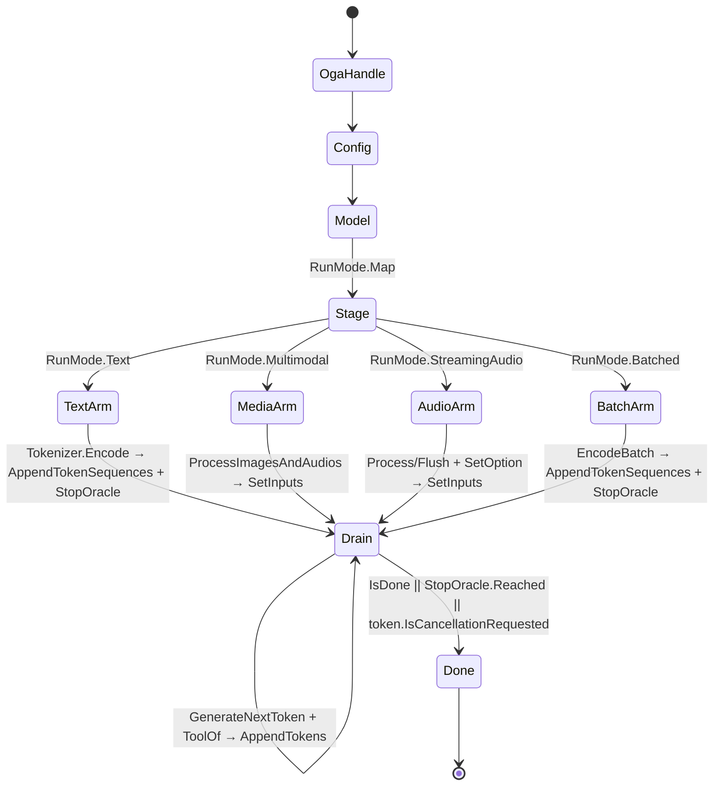

# [COMPUTE_MODEL_LANE]

Rasm.Compute model lane: ONNX model identity and provenance, the one shared session capsule with its EP-context warm-start route, the EP-parameterized execution-provider axis across CPU and the Apple-silicon CoreML row plus the autoEP `OrtEpDevice` hardware-device discovery and policy-delegate selection, custom-operator admission with bidirectional string-tensor boundary, the OrtValue-only run-mode fold with its `BoundLoop` shared-arena zero-allocation hot path and device-resident chaining, the vectorized `TensorPrimitives` reduction kernels (argmax, mean-pool, L2-normalize), the `System.Numerics.Tensors` carrier bridge, the ORT-GenAI token-streaming generative run owner over text/multimodal/streaming-audio/batched shapes with EOS oracle, decoder-hardware pins, in-memory model admission, and the tool-call arm, and the version-stamped deterministic result cache. The page owns the `ModelSource`/`ModelIdentity` vocabulary, the `SessionPolicy` lifecycle rows, the `ExecutionProvider` axis with its `OrtEpDevice` discovery fold, the extension-op admission fold, the `RunConfig`/`RunOps` inference fold, the `GenerationPolicy`/`GenerativeRun` token-streaming owner over Microsoft.ML.OnnxRuntimeGenAI, and the `CachePolicy`/`CacheOps` read-through over Microsoft.ML.OnnxRuntime. The lane composes AppHost clocks, deadlines, drain, schedule, and cache ports plus Persistence index, blob, and `ModelResultKey` rows as settled vocabulary.

## [1]-[INDEX]

| [INDEX] | [CLUSTER]       | [OWNS]                                                                                                                                                                                                                  |
| :-----: | :-------------- | :---------------------------------------------------------------------------------------------------------------------------------------------------------------------------------------------------------------------- |
|   [1]   | MODEL_IDENTITY  | Checksum identity; acquisition union; schema snapshot; admission law; custom-metadata + initializer admission; shared ordinal-keyvalue fingerprint                                                                      |
|   [2]   | SESSION_CAPSULE | One shared session per model; lifecycle, warmup, drain rows; shared-device-allocator lease; compatibility-gated warm-start                                                                                              |
|   [3]   | EP_AXIS         | Execution-provider rows with probe, OS gate, option table; autoEP `OrtEpDevice` discovery + policy-delegate selection + model-compatibility probe; one polymorphic register                                             |
|   [4]   | EXTENSION_OPS   | Extension and custom-op registration with asset evidence; bidirectional string-tensor boundary (ingress + egress)                                                                                                       |
|   [5]   | INFERENCE_MODES | OrtValue-only run modes; one polymorphic input admission; vectorized reductions; cancellation rail; profiling artifacts; ModelRun receipt; device-resident shared-arena chaining; S.N.Tensors bridge                    |
|   [6]   | GENERATIVE_RUN  | ORT-GenAI token-streaming owner; one staged-input drain fold; EOS oracle; decoder-hardware pins; in-memory model admission; search-option table; guidance; multimodal + streaming-audio + batched shapes; tool-call arm |
|   [7]   | RESULT_CACHE    | Version-stamped deterministic keys; cache-policy rows; negative-result + content-addressed dedup + TTL-by-precision + stampede facts                                                                                    |

## [2]-[MODEL_IDENTITY]

- Owner: `ModelIdentity` identity record with nested `Slot` schema rows and the `CustomMetadata`/`Initializers` self-description channels; `ModelSource` `[Union]` four acquisition cases collapsing to one byte admission; `ModelFingerprint` the one shared ordinal-keyvalue projection both this owner and `ExecutionProvider` ride.
- Cases: `LocalFile`, `EmbeddedResource`, `PersistenceBlob`, `RemoteFetch`.
- Entry: `public static ModelIdentity Snapshot(ModelSource source, ReadOnlySpan<byte> bytes, InferenceSession session, Instant at)` — pure value; identity derives from the bytes, never from the caller.
- Auto: `Snapshot` stamps the XxHash128 identity checksum, graph version, the input/output slot rows, the `ModelMetadata.CustomMetadataMap` self-description channel, and the `OverridableInitializerMetadata` deployment-constant slots in one call; `Accepts` runs once at load over the input slot rows and `Initializer` admits the deployment-constant `OrtValue` against the overridable-initializer slot it targets, faulting `ModelRejected` with mismatch evidence; per-call re-validation is the deleted form because admission settles the contract once; the custom-metadata fingerprint rides `ModelFingerprint.Of` — the single ordinal-keyvalue `XxHash3` projection the EP option-hash also rides, so the checksum body is declared once.
- Receipt: the ModelLoad receipt case carries checksum, source case, slot counts, the custom-metadata fingerprint, and elapsed; emission rides the sink port at the composition edge.
- Packages: Microsoft.ML.OnnxRuntime, System.IO.Hashing, NodaTime, Thinktecture.Runtime.Extensions, LanguageExt.Core, Rasm.Persistence (project)
- Growth: a new acquisition route is one case on `ModelSource`; a new deployment-constant binding is one `Initializer` admission against the overridable-initializer slot; zero new surface.
- Boundary: every downstream cache key, receipt, and claim derives from `Checksum` — path-keyed or filename-keyed model identity is the deleted form; `Slot.FreeDims` rows drive the free-dimension overrides at session build, with symbolic-dim values arriving from the geometry-encoding rows as settled vocabulary; the `CustomMetadata` channel is the artifact's self-description read once at snapshot (and its fingerprint joins the session fingerprint so a re-trained model with identical bytes-prefix but different metadata keys distinctly), the `Initializers` slot table carries the `OverridableInitializerMetadata` deployment constants admitted through `AddInitializer(string, OrtValue)` at session build — never per-run inputs — and schema admission happens exactly once at load; the ordinal-keyvalue fingerprint is `ModelFingerprint.Of`, the one projection `ExecutionProvider.Hash` and `MetadataFingerprint` both compose — a re-derived `XxHash3.HashToUInt64(UTF8(string.Join(';', ...)))` body in either owner is the named defect.

```csharp signature
[Union(ConversionFromValue = ConversionOperatorsGeneration.None)]
public abstract partial record ModelSource {
    private ModelSource() { }

    public sealed record LocalFile(string Path) : ModelSource;

    public sealed record EmbeddedResource(Assembly Assembly, string Name) : ModelSource;

    public sealed record PersistenceBlob(ArtifactIndexRow Row) : ModelSource;

    public sealed record RemoteFetch(string ArtifactId) : ModelSource;
}

public static class ModelFingerprint {
    public static ulong Of(IEnumerable<KeyValuePair<string, string>> rows) =>
        XxHash3.HashToUInt64(Encoding.UTF8.GetBytes(string.Join(';',
            rows.OrderBy(static row => row.Key, StringComparer.Ordinal).Select(static row => $"{row.Key}={row.Value}"))));
}

public sealed record ModelIdentity(
    UInt128 Checksum,
    long GraphVersion,
    Seq<ModelIdentity.Slot> Inputs,
    Seq<ModelIdentity.Slot> Outputs,
    Seq<ModelIdentity.Slot> Initializers,
    FrozenDictionary<string, string> CustomMetadata,
    ModelSource Source,
    Instant AcquiredAt) {
    public sealed record Slot(string Name, TensorElementType Dtype, Seq<int> Dims, Seq<string> FreeDims);

    public string Key => $"{Checksum:x32}";

    public ulong MetadataFingerprint => ModelFingerprint.Of(CustomMetadata);

    public static ModelIdentity Snapshot(ModelSource source, ReadOnlySpan<byte> bytes, InferenceSession session, Instant at) =>
        new(
            XxHash128.HashToUInt128(bytes),
            session.ModelMetadata.Version,
            Slots(session.InputMetadata),
            Slots(session.OutputMetadata),
            Slots(session.OverridableInitializerMetadata),
            session.ModelMetadata.CustomMetadataMap.ToFrozenDictionary(StringComparer.Ordinal),
            source,
            at);

    public Fin<Unit> Accepts(Seq<(string Name, TensorElementType Dtype, int Rank)> binding) =>
        binding.Filter(slot => !Inputs.Exists(own =>
            StringComparer.Ordinal.Equals(own.Name, slot.Name)
            && own.Dtype == slot.Dtype
            && own.Dims.Count == slot.Rank)).IsEmpty
            ? Fin.Succ(unit)
            : Fin.Fail<Unit>(new ComputeFault.ModelRejected(Key));

    public Fin<(string Name, OrtValue Value)> Initializer(string name, OrtValue value) =>
        Initializers.Find(slot => StringComparer.Ordinal.Equals(slot.Name, name)).Case is Slot slot
        && slot.Dtype == value.GetTensorTypeAndShape().ElementDataType
            ? Fin.Succ((name, value))
            : Fin.Fail<(string, OrtValue)>(new ComputeFault.ModelRejected($"{Key}:initializer:{name}"));

    static Seq<Slot> Slots(IReadOnlyDictionary<string, NodeMetadata> nodes) =>
        toSeq(nodes).Map(static pair => new Slot(
            pair.Key,
            pair.Value.ElementDataType,
            toSeq(pair.Value.Dimensions),
            toSeq(pair.Value.SymbolicDimensions)));
}
```

## [3]-[SESSION_CAPSULE]

- Owner: `SessionPolicy` lifecycle policy record; `ModelSessions` boundary capsule owning the OrtEnv boot gate, the resident-session map, the shared-device-allocator lease map, and the drain and warmup rows.
- Entry: `public static Fin<(InferenceSession Session, Option<ArtifactIndexRow> WarmStart)> Lease(ModelIdentity model, ReadOnlyMemory<byte> bytes, ExecutionProvider ep, SessionPolicy policy, string modelPath, string artifactDir, ClockPolicy clocks)` — `Fin` aborts on rejected admission; a hit shares the resident session with `None` warm-start evidence and a first open carries the compiled EP-context row; `modelPath` feeds the autoEP compatibility probe so an incompatible warm-start blob degrades to a fresh compile.
- Auto: the admission fold runs options, EP-context keys, free-dim overrides, deployment-constant initializers, execution mode, device policy, the compatibility-gated warm-start decision, EP registration, custom ops, and resident admission as one rail; every lease touches `LastUsed`; eviction past `ResidentSessions` captures the least-recently-used residents inside the swap and disposes them only after the map commits; `Open` calls `ep.Compatible(modelPath)` over the enumerated `OrtEpDevice` rows and branches on the verdict — `Incompatible` clears the `ep.context_*` keys so the device recompiles fresh rather than faulting a load against a stale context, `Compatible`/`Unknown` keep the warm-start read — then the compiled EP-context blob is read back from the artifact directory through `WarmStart` inside the success arm and the resulting `ArtifactIndexRow` — content-addressed by the model checksum under the `WarmStartClassification`/`WarmStartRetention` policy columns — rides out of `Open` for the composition edge to route to the Persistence blob lane, so a cold companion warms from the same blob the host wrote; `SharedAllocator` leases one process-shared `OrtAllocator` per `(OrtEpDevice, OrtDeviceMemoryType)` through `OrtEnv.CreateSharedAllocator` so device-resident bound loops on the same hardware share one arena rather than minting a per-session allocation, and the lease is the arena `RunOps.BoundLoop` threads into `CreateAllocatedTensorValue`/`RebindDevice`.
- Receipt: the Warmup receipt rides the representative-shape first run on the sweep row and carries the warm-start `ArtifactIndexRow` checksum and byte size from the `Lease` evidence when the compiled context lands; the Drain receipt counts unloaded sessions on the band-200 row.
- Packages: Microsoft.ML.OnnxRuntime, LanguageExt.Core, NodaTime, Rasm.AppHost (project), Rasm.Persistence (project)
- Growth: a lifecycle change is one policy value on `SessionPolicy`; the EP-context warm-start route is one artifact column on the open fold, never a second cache or artifact owner; a quantized session is the `SessionPolicy.Precision` column set to `ModelPrecision.Int8`/`Int4` so the precision flows through the existing `ep.Register(options, artifactDir, policy.Precision)` rail and the resident map keys on the model checksum unchanged — a quantization-specific session owner is the rejected form; a sequential-versus-parallel execution posture is the `SessionPolicy.Execution` column folded into `options.ExecutionMode`, never a second session owner; zero new surface.
- Boundary: `ModelSessions` is the page's boundary capsule and its fence carries language-owned statement forms (the named boundary-capsule statement exemption per `boundaries.md` CAPSULE_OWNER); ORT sessions are thread-safe for concurrent `Run`, so all lanes share ONE `InferenceSession` per checksum — a session pool is the rejected form; `DisablePerSessionThreads` puts every session on the global pool `Boot` constructs from the `CpuBudget` row — `OrtThreadingOptions.GlobalIntraOpNumThreads` and `GlobalInterOpNumThreads` take the budget's `OrtIntraOp` and `OrtInterOp` and `GlobalSpinControl` takes its `SpinControl` latency-versus-CPU posture, so a thread count or spin flag set outside this one boot fence is the named defect; `DisableTelemetryEvents` runs at boot because the telemetry spine owns signals; the sweep entry folds idle eviction before re-warm on the registered `compute-model-warmup` row; the compiled `ep.context_*` artifact and profile outputs land under the blob-lane artifact directory through `ArtifactIndexRow.Admit`, never as stray temp files, and the warm-start blob is content-addressed by the session fingerprint the capsule already computes — a managed copy of the context bytes is the rejected form; the compatibility verdict from `OrtEnv.GetModelCompatibilityForEpDevices` is read once at open and CONSUMED to choose fresh-compile-versus-warm-start — a computed-but-unread verdict is the named defect; the shared-device allocator is leased once per `(device, memory-type)` and released in the drain sweep through `OrtEnv.ReleaseSharedAllocator`, and the lease is threaded into `BoundLoop` so a device-resident loop allocates its sink from the shared arena — a per-session device allocation beside the shared arena is the rejected form, and `OrtDeviceMemoryType.HOST_ACCESSIBLE` is the zero-copy host-pinned class versus `DEFAULT` device-local.

```csharp signature
public sealed record SessionPolicy(
    int ResidentSessions, Duration IdleUnload, Duration WarmupSweep,
    GraphOptimizationLevel Optimization, ExecutionMode Execution, bool MemoryPattern, bool Profiling,
    bool OrtExtensions, Seq<string> CustomOpLibraries, Seq<(string Dim, long Value)> FreeDims,
    Seq<(string Name, OrtValue Value)> Initializers,
    ModelPrecision Precision,
    DataClassification WarmStartClassification, string WarmStartRetention) {
    public static readonly SessionPolicy Canonical = new(
        ResidentSessions: 4, IdleUnload: Duration.FromMinutes(10), WarmupSweep: Duration.FromMinutes(5),
        Optimization: GraphOptimizationLevel.ORT_ENABLE_ALL, Execution: ExecutionMode.ORT_SEQUENTIAL,
        MemoryPattern: true, Profiling: false,
        OrtExtensions: false, CustomOpLibraries: Seq<string>(), FreeDims: Seq<(string Dim, long Value)>(),
        Initializers: Seq<(string Name, OrtValue Value)>(),
        Precision: ModelPrecision.Full,
        WarmStartClassification: DataClassification.Operational, WarmStartRetention: "blob-index");
}

public static class ModelSessions {
    sealed record Resident(InferenceSession Session, Instant LastUsed);

    sealed record DeviceArena(OrtEpDevice Device, OrtDeviceMemoryType Memory, OrtAllocator Allocator);

    static readonly Atom<HashMap<UInt128, Resident>> Residents = Atom(HashMap<UInt128, Resident>());
    static readonly Atom<HashMap<string, DeviceArena>> SharedAllocators = Atom(HashMap<string, DeviceArena>());
    static readonly PrePackedWeightsContainer PrePacked = new();

    public static Fin<Unit> Boot(string logId, OrtLoggingLevel severity, CpuBudget budget) {
        if (OrtEnv.IsCreated) { return Fin.Succ(unit); }
        var pool = new OrtThreadingOptions { GlobalIntraOpNumThreads = budget.OrtIntraOp, GlobalInterOpNumThreads = budget.OrtInterOp, GlobalSpinControl = budget.SpinControl };
        var creation = new EnvironmentCreationOptions { logId = logId, logLevel = severity, threadOptions = pool };
        OrtEnv.CreateInstanceWithOptions(ref creation);
        OrtEnv.Instance().DisableTelemetryEvents();
        return Fin.Succ(unit);
    }

    public static Fin<(InferenceSession Session, Option<ArtifactIndexRow> WarmStart)> Lease(ModelIdentity model, ReadOnlyMemory<byte> bytes, ExecutionProvider ep, SessionPolicy policy, string modelPath, string artifactDir, ClockPolicy clocks) {
        var now = clocks.Now;
        if (Residents.Value.Find(model.Checksum).Case is Resident resident) {
            Residents.Swap(map => map.SetItem(model.Checksum, resident with { LastUsed = now }));
            return Fin.Succ((resident.Session, Option<ArtifactIndexRow>.None));
        }
        return Open(model, bytes, ep, policy, modelPath, artifactDir, now);
    }

    public static OrtAllocator SharedAllocator(OrtEpDevice device, OrtDeviceMemoryType memory) {
        var key = $"{device.EpName}:{device.HardwareDevice.DeviceId}:{(int)memory}";
        return SharedAllocators.Value.Find(key).Case is DeviceArena held
            ? held.Allocator
            : SharedAllocators.Swap(map => map.ContainsKey(key)
                ? map
                : map.Add(key, new DeviceArena(device, memory, OrtEnv.Instance().CreateSharedAllocator(device, memory, OrtAllocatorType.ArenaAllocator, new OrtKeyValuePairs(new Dictionary<string, string>())))))
                .Find(key).Map(static arena => arena.Allocator).IfNone(OrtAllocator.DefaultInstance);
    }

    public static Seq<UInt128> Unload(Instant idleBefore) {
        Seq<(UInt128, Resident)> evicted = default;
        Residents.Swap(map => (evicted = toSeq(map.ToSeq().Filter(pair => pair.Item2.LastUsed < idleBefore))).Fold(map, static (acc, pair) => acc.Remove(pair.Item1)));
        evicted.Iter(static pair => pair.Item2.Session.Dispose());
        if (idleBefore == Instant.MaxValue) {
            SharedAllocators.Swap(static map => map.Fold(map, static (acc, pair) => { OrtEnv.Instance().ReleaseSharedAllocator(pair.Value.Device, pair.Value.Memory); return acc.Remove(pair.Key); }));
        }
        return evicted.Map(static pair => pair.Item1);
    }

    public static DrainParticipantPort DrainRow =>
        new("compute-model-sessions", DrainBand.Compute, Rank: 10, static _ => IO.lift(() => Unload(Instant.MaxValue)).Map(static _ => unit));

    public static ScheduleEntry SweepRow(Func<IO<Unit>> warm) =>
        new("compute-model-warmup", new OccurrenceSpec.Every(SessionPolicy.Canonical.WarmupSweep), DeadlineClass.Startup, Option<LeasePolicy>.None, warm);

    static Fin<(InferenceSession Session, Option<ArtifactIndexRow> WarmStart)> Open(ModelIdentity model, ReadOnlyMemory<byte> bytes, ExecutionProvider ep, SessionPolicy policy, string modelPath, string artifactDir, Instant now) {
        var options = new SessionOptions();
        try {
            var contextPath = Path.Combine(artifactDir, $"{model.Checksum:x32}.ctx.onnx");
            var warmCompatible = ep.WarmStartAdmissible(modelPath, contextPath);
            options.GraphOptimizationLevel = policy.Optimization;
            options.ExecutionMode = policy.Execution;
            options.EnableMemoryPattern = policy.MemoryPattern;
            options.EnableProfiling = policy.Profiling;
            options.ProfileOutputPathPrefix = Path.Combine(artifactDir, "onnx-profile");
            options.DisablePerSessionThreads();
            options.AddSessionConfigEntry("ep.context_enable", warmCompatible ? "1" : "0");
            options.AddSessionConfigEntry("ep.context_file_path", contextPath);
            options.AddSessionConfigEntry("ep.share_ep_contexts", "1");
            policy.FreeDims.Iter(dim => options.AddFreeDimensionOverrideByName(dim.Dim, dim.Value));
            policy.Initializers.Iter(slot => options.AddInitializer(slot.Name, slot.Value));
            ep.DevicePolicy.Iter(options.SetEpSelectionPolicy);
            ep.Register(options, artifactDir, policy.Precision);
            return CustomOps.Register(options, policy)
                .MapFail(fault => { options.Dispose(); return fault; })
                .Map(ready => {
                    var session = new InferenceSession(bytes.ToArray(), ready, PrePacked);
                    Seq<(UInt128, Resident)> evicted = default;
                    Residents.Swap(map => (evicted = toSeq(map.ToSeq().OrderBy(static pair => pair.Item2.LastUsed).Take(Math.Max(map.Count - policy.ResidentSessions + 1, 0)))).Fold(map, static (acc, pair) => acc.Remove(pair.Item1)).Add(model.Checksum, new Resident(session, now)));
                    evicted.Iter(static pair => pair.Item2.Session.Dispose());
                    return (session, warmCompatible ? WarmStart(contextPath, policy.WarmStartClassification, policy.WarmStartRetention, now) : Option<ArtifactIndexRow>.None);
                });
        }
        catch (Exception error) {
            options.Dispose();
            return Fin.Fail<(InferenceSession, Option<ArtifactIndexRow>)>(new ComputeFault.ModelRejected(error.Message));
        }
    }

    static Option<ArtifactIndexRow> WarmStart(string contextPath, DataClassification classification, string retentionClass, Instant at) =>
        File.Exists(contextPath)
            ? Some(ArtifactIndexRow.Admit(ArtifactIndexRow.EpContext, contextPath, File.ReadAllBytes(contextPath), classification, retentionClass, at))
            : None;
}
```

## [4]-[EP_AXIS]

- Owner: `ModelKeyPolicy` ordinal accessor; `ExecutionProvider` `[SmartEnum<string>]` rows with probe name, OS gate, `ModelPrecision` quantization posture, frozen option table, device policy, hardware-device-type affinity, and register delegate columns; `ModelPrecision` `[SmartEnum<string>]` int8/int4 quantization rows; the `Devices`/`AutoSelect`/`Compatible`/`WarmStartAdmissible`/`Register` autoEP discovery + one-polymorphic-register fold over `OrtEpDevice`.
- Cases: `ExecutionProvider` rows `Cpu`, `CoreMl`; `ModelPrecision` rows full · int8 · int4.
- Auto: `Available` reads the `GetAvailableProviders` probe plus the macOS 12 gate riding the `ModelFormat` row value; `Devices` folds `OrtEnv.GetEpDevices()` into the `OrtEpDevice` rows the host enumerates, `AutoSelect` ranks them by the row's `HardwareAffinity` (`OrtHardwareDeviceType` NPU≻GPU≻CPU), and `Register(options, cacheDir, precision)` is ONE polymorphic registration discriminating on `AutoSelect.IsEmpty` — a non-empty device list registers through the device-list `AppendExecutionProvider(env, devices, options)` overload, an empty list falls to the string-keyed/typed row delegate — never two parallel register surfaces; `Compatible(modelPath)` reads the `OrtEnv.GetModelCompatibilityForEpDevices` verdict and `WarmStartAdmissible(modelPath, contextPath)` folds it into the session-capsule decision so a warm-start EP-context blob compiled for an incompatible device degrades to a fresh compile rather than a faulted load; `ResultKey(ortVersion, precision)` stamps EP key, ORT version, the `ModelPrecision` key, and the precision-folded option-table hash for the deterministic cache key with zero call-site hashing; the `Register` rail folds the int8/int4 quantization posture into the CoreML option table through `CoreMlRowsFor(precision)` — the row writes `AllowLowPrecisionAccumulationOnGPU` from the `ModelPrecision.LowPrecisionAccumulation` flag and the precision XORs into the cache-key option hash so a quantized session keys distinctly from a full-precision one with zero call-site ceremony.
- Packages: Microsoft.ML.OnnxRuntime, System.IO.Hashing, Thinktecture.Runtime.Extensions, LanguageExt.Core, BCL inbox
- Growth: a new accelerator is one `ExecutionProvider` row with its probe name, OS gate, `HardwareAffinity` column, and device policy columns — the GPU `Cuda`/`DirectMl` registration member spelling stays the design record on the `[EP_EXECUTION]` RESEARCH row (member shape `AppendExecutionProvider_CUDA(0)`/`_DML(0)` FINALIZED for win/linux-x64) and re-enters as one row only on a host whose RID carries the GPU asset; a new model-quantization posture is one `ModelPrecision` row plus its option-table contribution folded into the same registration rail, never a second session-options owner; a custom device-rank strategy is one `SetEpSelectionPolicyDelegate` arm on the `AutoSelect` fold, never a second selection owner; the generative token-streaming successor lands as the `GENERATIVE_RUN` run-mode cluster composing this EP axis, never a chat-client surface; zero new surface.
- Boundary: `AppendExecutionProvider_CoreML(CoreMLFlags coremlFlags)` is the canonical typed registration carrying the `CoreMlFlag` flag column, and `AppendExecutionProvider("CoreMLExecutionProvider", options)` is the proved option-rich fallback for the string-keyed `ModelCacheDirectory`/`MLComputeUnits`/`SpecializationStrategy` keys — a bare `"CoreML"` provider name faults `InvalidArgument` and is the deleted spelling; the autoEP device-list overload `AppendExecutionProvider(OrtEnv, IReadOnlyList<OrtEpDevice>, IReadOnlyDictionary<string,string>)` is the policy-free direct-device registration the `Register` fold drives once `AutoSelect` is non-empty after the host enumerates the device through `GetEpDevices()`, and `SetEpSelectionPolicyDelegate(EpSelectionDelegate)` is the managed device-rank callback overriding the enum `SetEpSelectionPolicy(ExecutionProviderDevicePolicy)` when the row needs a custom ranking — the delegate receives `(IReadOnlyList<OrtEpDevice>, OrtKeyValuePairs, OrtKeyValuePairs, uint)` and returns the ranked `List<OrtEpDevice>`; the axis is the two live osx-arm64 rows `Cpu` and `CoreMl` because no GPU asset ships on this single-RID host — the `Cuda`/`DirectMl` GPU rows are dropped from the live axis and their grounded `AppendExecutionProvider_CUDA(0)`/`AppendExecutionProvider_DML(0)` member spelling is the FINALIZED design record on `[EP_EXECUTION]`, re-entering as a row only behind a GPU-carrying RID; the macOS 12 gate is per `ModelFormat` value because the legacy NeuralNetwork format alone reaches back to macOS 10.15; the CoreML option keys and their value domains are catalogued and the `MLComputeUnits` value domain (`ALL`/`CPUAndGPU`/`CPUAndNeuralEngine`/`CPUOnly`) and the `SpecializationStrategy` value domain (`Default`/`FastPrediction`) ride the option-table rows; the default CoreML flag is `COREML_FLAG_USE_NONE` (proved working) and `COREML_FLAG_CREATE_MLPROGRAM` is the MLProgram-backend column matching the `ModelFormat=MLProgram` option while `COREML_FLAG_USE_CPU_AND_GPU` is the `UInt32` 32 flag opening the CPU-and-GPU compute path; `ModelCacheDirectory` binds at registration to the blob-lane artifact directory so compiled CoreML caches are catalogued inventory; the `ModelPrecision` column carries the int8/int4 model-quantization posture — `Full` leaves accumulation full-precision, `Int8`/`Int4` flip `AllowLowPrecisionAccumulationOnGPU=1` on the CoreML option table (the only catalogued ORT low-precision session knob) so a quantized weight layout accumulates in low precision on the GPU compute path while the int4/int8 weight quantization itself is the packaged ONNX model's own graph property (ORT executes the quantized operators the exported graph carries, never a runtime re-quantization pass), and the precision row folds into `OptionsHash` so a quantized run keys distinctly in the result cache — a managed re-quantization kernel or a second session-options owner is the rejected form; the option-table hash rides the one `ModelFingerprint.Of` ordinal-keyvalue projection `ModelIdentity` already owns — a re-derived `XxHash3` keyvalue body here is the named defect; a vetoed row degrades to the next with its reason in the receipt and `Cpu` is the implicit terminal; dylib-presence heuristics are the deleted probe form.

```csharp signature
public sealed class ModelKeyPolicy : IEqualityComparerAccessor<string>, IComparerAccessor<string> {
    private static readonly StringComparer Policy = StringComparer.Ordinal;

    public static IEqualityComparer<string> EqualityComparer => Policy;
    public static IComparer<string> Comparer => Policy;
}

[SmartEnum<string>]
[KeyMemberEqualityComparer<ModelKeyPolicy, string>]
[KeyMemberComparer<ModelKeyPolicy, string>]
public sealed partial class ModelPrecision {
    public static readonly ModelPrecision Full = new("full", lowPrecisionAccumulation: false, negativeTtl: Duration.FromMinutes(15));
    public static readonly ModelPrecision Int8 = new("int8", lowPrecisionAccumulation: true, negativeTtl: Duration.FromMinutes(5));
    public static readonly ModelPrecision Int4 = new("int4", lowPrecisionAccumulation: true, negativeTtl: Duration.FromMinutes(2));

    public bool LowPrecisionAccumulation { get; }
    public Duration NegativeTtl { get; }
}

[SmartEnum<string>]
[KeyMemberEqualityComparer<ModelKeyPolicy, string>]
[KeyMemberComparer<ModelKeyPolicy, string>]
public sealed partial class ExecutionProvider {
    static readonly FrozenDictionary<string, string> CoreMlRows = new Dictionary<string, string>(StringComparer.Ordinal) {
        ["ModelFormat"] = "MLProgram",
        ["MLComputeUnits"] = "ALL",
        ["RequireStaticInputShapes"] = "0",
        ["EnableOnSubgraphs"] = "0",
        ["SpecializationStrategy"] = "Default",
        ["ProfileComputePlan"] = "0",
        ["AllowLowPrecisionAccumulationOnGPU"] = "0",
    }.ToFrozenDictionary(StringComparer.Ordinal);

    static FrozenDictionary<string, string> CoreMlRowsFor(ModelPrecision precision) =>
        new Dictionary<string, string>(CoreMlRows, StringComparer.Ordinal) {
            ["AllowLowPrecisionAccumulationOnGPU"] = precision.LowPrecisionAccumulation ? "1" : "0",
        }.ToFrozenDictionary(StringComparer.Ordinal);

    public static readonly ExecutionProvider Cpu = new(
        "cpu", providerName: "CPUExecutionProvider", minMacOsMajor: 0, optionsHash: 0UL, options: FrozenDictionary<string, string>.Empty,
        coreMlFlag: CoreMLFlags.COREML_FLAG_USE_NONE, devicePolicy: Option<ExecutionProviderDevicePolicy>.None, hardwareAffinity: OrtHardwareDeviceType.CPU,
        registerRow: static (sessionOptions, cacheDir, precision) => sessionOptions.AppendExecutionProvider_CPU(1));

    public static readonly ExecutionProvider CoreMl = new(
        "coreml", providerName: "CoreMLExecutionProvider", minMacOsMajor: 12, optionsHash: ModelFingerprint.Of(CoreMlRows),
        options: CoreMlRows, coreMlFlag: CoreMLFlags.COREML_FLAG_USE_NONE, devicePolicy: Some(ExecutionProviderDevicePolicy.PREFER_NPU), hardwareAffinity: OrtHardwareDeviceType.NPU,
        registerRow: static (sessionOptions, cacheDir, precision) => {
            sessionOptions.AppendExecutionProvider_CoreML(CoreMLFlags.COREML_FLAG_USE_NONE);
            sessionOptions.AppendExecutionProvider("CoreMLExecutionProvider", new Dictionary<string, string>(CoreMlRowsFor(precision), StringComparer.Ordinal) { ["ModelCacheDirectory"] = cacheDir });
        });

    public string ProviderName { get; }
    public int MinMacOsMajor { get; }
    public ulong OptionsHash { get; }
    public FrozenDictionary<string, string> Options { get; }
    public CoreMLFlags CoreMlFlag { get; }
    public Option<ExecutionProviderDevicePolicy> DevicePolicy { get; }
    public OrtHardwareDeviceType HardwareAffinity { get; }
    public Action<SessionOptions, string, ModelPrecision> RegisterRow { get; }

    public bool Available =>
        OrtEnv.Instance().GetAvailableProviders().Contains(ProviderName, StringComparer.Ordinal)
        && (MinMacOsMajor is 0 || OperatingSystem.IsMacOSVersionAtLeast(MinMacOsMajor));

    public Seq<OrtEpDevice> Devices =>
        toSeq(OrtEnv.Instance().GetEpDevices()).Filter(device => StringComparer.Ordinal.Equals(device.EpName, ProviderName));

    public Seq<OrtEpDevice> AutoSelect =>
        Devices.OrderByDescending(device => device.HardwareDevice.Type switch {
            OrtHardwareDeviceType.NPU => 2,
            OrtHardwareDeviceType.GPU => 1,
            _ => 0,
        }).ToSeq();

    public void Register(SessionOptions sessionOptions, string cacheDir, ModelPrecision precision) {
        if (AutoSelect.IsEmpty) { RegisterRow(sessionOptions, cacheDir, precision); }
        else {
            sessionOptions.AppendExecutionProvider(
                OrtEnv.Instance(), AutoSelect.ToList(),
                new Dictionary<string, string>(CoreMlRowsFor(precision), StringComparer.Ordinal) { ["ModelCacheDirectory"] = cacheDir });
        }
    }

    public Option<string> Compatible(string modelPath) =>
        AutoSelect.IsEmpty ? None : Some(OrtEnv.Instance().GetModelCompatibilityForEpDevices(AutoSelect.ToList(), modelPath).ToString());

    public bool WarmStartAdmissible(string modelPath, string contextPath) =>
        !File.Exists(contextPath)
        || Compatible(modelPath).Case is not string verdict
        || !verdict.Contains("Incompatible", StringComparison.OrdinalIgnoreCase);

    public string ResultKey(string ortVersion, ModelPrecision precision) =>
        $"{Key}:{ortVersion}:{precision.Key}:{ModelFingerprint.Of(CoreMlRowsFor(precision)) ^ OptionsHash:x16}";
}
```

The `CoreMlFlag` column binds the package `Microsoft.ML.OnnxRuntime.CoreMLFlags` `[Flags]` enum (`UInt32`) values:

| [INDEX] | [FLAG]                                       | [VALUE] |
| :-----: | :------------------------------------------- | :-----: |
|   [1]   | `COREML_FLAG_USE_NONE`                       |    0    |
|   [2]   | `COREML_FLAG_USE_CPU_ONLY`                   |    1    |
|   [3]   | `COREML_FLAG_ENABLE_ON_SUBGRAPH`             |    2    |
|   [4]   | `COREML_FLAG_ONLY_ENABLE_DEVICE_WITH_ANE`    |    4    |
|   [5]   | `COREML_FLAG_ONLY_ALLOW_STATIC_INPUT_SHAPES` |    8    |
|   [6]   | `COREML_FLAG_CREATE_MLPROGRAM`               |   16    |
|   [7]   | `COREML_FLAG_USE_CPU_AND_GPU`                |   32    |

The `OrtEpDevice` autoEP descriptor (enumerated through `OrtEnv.GetEpDevices()`) carries the columns the `Devices`/`AutoSelect` fold reads:

| [INDEX] | [MEMBER]                       | [CARRIES]                                                                                      |
| :-----: | :----------------------------- | :--------------------------------------------------------------------------------------------- |
|   [1]   | `OrtEpDevice.EpName`           | provider name keyed against the `ExecutionProvider` row                                        |
|   [2]   | `OrtEpDevice.EpVendor`         | EP vendor string                                                                               |
|   [3]   | `OrtEpDevice.HardwareDevice`   | `OrtHardwareDevice` — `Type` (`CPU`/`GPU`/`NPU`), `VendorId`, `DeviceId`, `Vendor`, `Metadata` |
|   [4]   | `OrtEpDevice.EpMetadata`       | `OrtKeyValuePairs` EP self-description                                                         |
|   [5]   | `OrtEpDevice.EpOptions`        | `OrtKeyValuePairs` default EP option set                                                       |
|   [6]   | `OrtEpDevice.GetMemoryInfo`    | `OrtMemoryInfo` for the device's default allocation                                            |
|   [7]   | `OrtEpDevice.CreateSyncStream` | `OrtSyncStream` tying a device-stream lifetime to the device                                   |

## [5]-[EXTENSION_OPS]

- Owner: `CustomOps` — one registration fold over the extensions bundle and the custom-op library rows, plus the string-tensor output boundary (empty-slot allocator AND egress reader); string INGRESS rides `RunInput.Strings` on the inference owner, never a second string-input factory here.
- Cases: `RegisterOrtExtensions` bundle row; `RegisterCustomOpLibraryV2` per-path rows; `StringSlots` empty-output allocator, `StringEgress` element reader.
- Entry: `public static Fin<SessionOptions> Register(SessionOptions options, SessionPolicy policy)` — `Fin` aborts with `ExtensionAssetMissing` naming every absent native asset before any registration runs.
- Receipt: native-asset evidence rides the ModelLoad receipt; the missing-path set is the fault payload.
- Packages: Microsoft.ML.OnnxRuntime.Extensions, Microsoft.ML.OnnxRuntime, LanguageExt.Core, BCL inbox
- Growth: a new custom-op library is one path row on `SessionPolicy.CustomOpLibraries`; zero new surface.
- Boundary: registration extends the `ModelSessions` boundary capsule and this fence carries language-owned statement forms — guard admission before registration and the out-parameter custom-op handle; `RegisterOrtExtensions()` faults `OnnxRuntimeException(ErrorCode.NoSuchFile)` if the `libortextensions` native asset is absent, so the asset-presence guard precedes registration; tokenizer and pre/post operators stay session assets — a preprocessing or tokenizer service family is the rejected form; the `String` dtype is a model-boundary-only row entering through `DenseTensor<string>` via the `RunInput.Strings` admission case (`OrtValue.CreateFromStringTensor`) on the inference owner, the empty-string output slots allocated here through `CreateTensorWithEmptyStrings`, and leaving here through the element-wise `GetStringElement(index)` reader projected over the flat element count on egress — a string-tensor model (tokenizer, postproc, detokenizer) needs the full round-trip so the string egress is the catalogued completion of the `RunInput` ingress, never a duplicate string-input factory and never the interior tensor vocabulary; `RegisterCustomOpLibrary(path)` (no handle) is the deleted spelling because `RegisterCustomOpLibraryV2(path, out nint)` carries the unload handle.

```csharp signature
public static class CustomOps {
    public static Fin<SessionOptions> Register(SessionOptions options, SessionPolicy policy) {
        var missing = policy.CustomOpLibraries.Filter(static path => !File.Exists(path));
        if (!missing.IsEmpty) {
            return Fin.Fail<SessionOptions>(new ComputeFault.ExtensionAssetMissing(string.Join(';', missing)));
        }
        if (policy.OrtExtensions) {
            options.RegisterOrtExtensions();
        }
        policy.CustomOpLibraries.Iter(path => options.RegisterCustomOpLibraryV2(path, out _));
        return Fin.Succ(options);
    }

    public static OrtValue StringSlots(OrtAllocator allocator, long[] shape) =>
        OrtValue.CreateTensorWithEmptyStrings(allocator, shape);

    public static Seq<string> StringEgress(OrtValue value) {
        var count = checked((int)value.GetTensorTypeAndShape().ElementCount);
        return toSeq(Enumerable.Range(0, count)).Map(value.GetStringElement);
    }
}
```

## [6]-[INFERENCE_MODES]

- Owner: `RunOps` — the run-mode fold over the shared session: single, bound-batch, named bound, windowed, embedding, classification, clash-scoring, and S.N.Tensors-bridge runs discriminated by intent payload shape; `RunInput` one polymorphic input admission keyed on carrier shape; `BoundLoop` the shared-arena device-resident hot path.
- Cases: single `Run`; lane-enqueued async (the lane seam owns the thread hop — the native `RunAsync` requires pre-allocated output `OrtValue`s and completes on a native callback outside the lane scope, so it is the rejected spelling); `InferBound` bound batch over a populated `OrtIoBinding` with an optional name-zip projection arm; the `BoundLoop` steady-state hot path with its shared-arena `CreateAllocatedTensorValue` sink and device-resident `ClearBound*`/`BindOutputToDevice`/`CreateTensorValueWithData` rebind; `Chunked` streaming windows over chunked inputs through `RecyclableMemoryStream.GetReadOnlySequence`; `Embed` mean-pool/CLS-slice + L2-normalized text-to-vector projection over an embedding model; `Classify` `TensorPrimitives.IndexOfMax`-over-logits run for BIM point-cloud→element classification and symbol recognition over the interchange `PointScan` encoding; `ClashScore` scalar-output run for clash false-positive scoring over a candidate `ClashPair` feature vector; `InferTensor` the `System.Numerics.Tensors` carrier bridge over `CreateTensorValueFromSystemNumericsTensorObject` and `GetTensorDataAsTensorSpan<T>` materializing to a detached `TResult` inside the native bracket.
- Entry: `public Fin<T> Infer<T>(RunOptions options, CancelScope scope, Seq<(string Name, OrtValue Value)> inputs, Seq<string> outputs, Func<IDisposableReadOnlyCollection<OrtValue>, Fin<T>> project)` — the projection runs inside the native-result bracket.
- Auto: `Plan` wires deadline expiry into the `Terminate` one-way latch from the linked `CancelScope`, attaches LoRA adapters, and folds the `RunConfig` row table into `AddRunConfigEntry` calls so a posture change selects a row rather than editing the fence; one conversion arm (`Faulted`) classifies failures into `DeadlineExpired`/`Cancelled` by scope provenance — the single cancellation oracle every run shape rides; output buffers size from `GetTensorTypeAndShape().ElementCount`, never re-multiplied dimensions; `RunInput` admits the carrier polymorphically — a managed `T[]+shape` binds through `CreateTensorValueFromMemory`, a `System.Numerics.Tensors.Tensor<T>` binds through `CreateTensorValueFromSystemNumericsTensorObject`, a `DenseTensor<string>` binds through `CreateFromStringTensor` — one `[Union]` admission, never the three sibling `StringInput`/`Input<T>`/`TensorInput<T>` factories; `Classify` drives `TensorPrimitives.IndexOfMax` per logit slice (no hand-rolled argmax loop) and `Embed` mean-pools or CLS-slices then L2-normalizes via `TensorPrimitives.Norm` + `Divide`; the `ModelRun` receipt factory stamps route, batch, the `GetTensorSizeInBytes` peak footprint, the `GetTensorMemoryInfo` arena name, and the optional profile-artifact path; a sentinel/NaN egress projects to `Option` at the boundary.
- Receipt: the `ModelRun` receipt carries model checksum, EP, run mode, batch size, the `OrtValue.GetTensorSizeInBytes` output footprint as `PeakBytes`, the `OrtMemoryInfo` allocator name from `GetTensorMemoryInfo` as `ArenaAllocator`, and the optional `EndProfiling` chrome-trace artifact path; profiling chrome-trace artifacts land as `ArtifactIndexRow.OnnxProfile` rows with the artifact path in the receipt.
- Packages: Microsoft.ML.OnnxRuntime, System.Numerics.Tensors, CommunityToolkit.HighPerformance, LanguageExt.Core, NodaTime, Rasm.AppHost (project), Rasm.Persistence (project)
- Growth: a new run shape is one payload-shape case on the intent family; a new run-config posture is one `RunConfig` row carrying its `AddRunConfigEntry` key-value pairs and its `OrtAllocatorType` arena column; an embedding model is one more `Embed` run over the same session capsule and a BIM classifier, symbol recognizer, or clash false-positive scorer is one more `Classify`/`ClashScore` run over the shared session reusing the inference engine for the non-AI in-scope BIM pipelines (point-cloud→element classification consumes the interchange `PointScan` encoding, clash scoring consumes the `solver-and-optimization#CLASH_AND_TWIN` `ClashPair` feature vector), never a new model lane or a BIM-specific service; a tensor-lane handoff that already holds a `System.Numerics.Tensors.Tensor<T>` is one `InferTensor` run binding the carrier directly with zero managed copy and projecting to a detached value; zero new surface.
- Boundary: `RunOps` extends the `ModelSessions` boundary capsule and this fence carries bracketed statement forms with deterministic native disposal; OrtValue-only law — `NamedOnnxValue`, `DisposableNamedOnnxValue`, and `FixedBufferOnnxValue` are superseded spellings that never appear; `CreateTensorValueFromMemory` binds rented staging arrays without copies and the backing must outlive the value and every run binding it — the value's dispose IS the owner's release point; `CreateTensorValueFromSystemNumericsTensorObject<T>` admits the tensor-lane `Tensor<T>` owner directly so a tensor already in the compute interior never round-trips through a managed array, and `GetTensorDataAsTensorSpan<T>` reads egress as a `ReadOnlyTensorSpan<T>` consumed and reduced to a DETACHED `TResult` inside the native bracket (per `boundaries.md` REF_SAFE_PROJECTION) — the `ReadOnlyTensorSpan<T>` ref struct never crosses the `Fin` boundary because `shapes.md` UNIONS rejects a ref-struct generic type argument; the `Terminate` latch is the single cancellation propagation path and the deadline-poll cadence binds from the CANCELLATION research row; `InferBound` runs `RunWithBinding` over a populated `OrtIoBinding`, bracketing the run between `SynchronizeBoundInputs` and `SynchronizeBoundOutputs` and projecting `GetOutputValues`, with the optional `names` zip arm delivering the `RunWithBindingAndNames(RunOptions, OrtIoBinding, string[])` named-output convenience by pairing `GetOutputNames()` against the result without materializing the forbidden `IDisposableReadOnlyCollection<DisposableNamedOnnxValue>` that member returns — one `InferBound`, not a separate named sibling; the `BoundLoop` capsule is the zero-allocation steady-state posture for repeated same-shape inference — `CreateIoBinding`, `BindInput`/`BindOutput` once over the bound input and output `OrtValue`s both allocated from the SHARED arena `ModelSessions.SharedAllocator` leases (not `OrtAllocator.DefaultInstance` and not a managed staging plane), the steady-state write is `payload.CopyTo(bound.GetTensorMutableDataAsSpan<float>())` directly into the bound value per `Pulse` (the catalogued IO-binding mutable-span write, no managed `MemoryOwner<float>` staging copy), and `RunWithBinding` per `Pulse` with no per-call marshal — and a shape-class transition rebinds through `ClearBoundInputs`/`ClearBoundOutputs` with `BindOutputToDevice` routing device outputs, the device-input `BindInput(string, TensorElementType, long[], OrtMemoryAllocation)` overload binding a shared-arena device buffer, and the raw-device-pointer input path `CreateTensorValueWithData(OrtMemoryInfo, TensorElementType, long[], nint, long)` admitting a device pointer directly; `Chunked` reads the chunked input through `RecyclableMemoryStream.GetReadOnlySequence` (zero-copy) and drives one `BoundLoop.Pulse` per window over a scoped span sliced from the sequence with no re-materialization, emitting the `streaming` `ProgressPhase` and a `StreamSegment` receipt per chunk, never a hand-rolled contiguous frame and never a double `.ToArray()`; `Embed` runs one inference over an embedding model and mean-pools the last-hidden-state (or CLS-slices) then L2-normalizes via `TensorPrimitives.Norm`+`Divide` to a `float[]` vector feeding the Persistence vector lane by reference, keying on the content-hash and model-id reuse identity the Persistence owner holds — a raw last-token passthrough is the rejected form; the `RunConfig.Arena` column classifies the run allocator through `OrtAllocatorType` (`ArenaAllocator` steady, `DeviceAllocator` device-resident); `Profile` is guarded on `policy.Profiling` and returns `Fin<ArtifactIndexRow>` so a no-profile session never reads a nonexistent trace path; output projection scopes native memory inside `project` and sentinel or NaN values project to `Option` at the boundary, never inward.

```csharp signature
public sealed record RunConfig(FrozenDictionary<string, string> Entries, OrtAllocatorType Arena) {
    public static readonly RunConfig Steady = new(FrozenDictionary<string, string>.Empty, OrtAllocatorType.ArenaAllocator);
    public static RunConfig Bulk(string arenaShrinkDevice) => new(new Dictionary<string, string>(StringComparer.Ordinal) {
        ["memory.enable_memory_arena_shrinkage"] = arenaShrinkDevice,
    }.ToFrozenDictionary(StringComparer.Ordinal), OrtAllocatorType.ArenaAllocator);
    public static readonly RunConfig Device = new(FrozenDictionary<string, string>.Empty, OrtAllocatorType.DeviceAllocator);
}

[Union(ConversionFromValue = ConversionOperatorsGeneration.None)]
public abstract partial record RunInput {
    private RunInput() { }
    public sealed record Managed<T>(string Name, T[] Data, long[] Shape) : RunInput where T : unmanaged;
    public sealed record Carrier<T>(string Name, Tensor<T> Tensor) : RunInput where T : unmanaged;
    public sealed record Strings(string Name, DenseTensor<string> Tokens) : RunInput;

    public (string Name, OrtValue Value) Admit() => this switch {
        Managed<float> m => (m.Name, OrtValue.CreateTensorValueFromMemory(m.Data, m.Shape)),
        Managed<long> m => (m.Name, OrtValue.CreateTensorValueFromMemory(m.Data, m.Shape)),
        Managed<int> m => (m.Name, OrtValue.CreateTensorValueFromMemory(m.Data, m.Shape)),
        Carrier<float> c => (c.Name, OrtValue.CreateTensorValueFromSystemNumericsTensorObject(c.Tensor)),
        Carrier<long> c => (c.Name, OrtValue.CreateTensorValueFromSystemNumericsTensorObject(c.Tensor)),
        Strings s => (s.Name, OrtValue.CreateFromStringTensor(s.Tokens)),
        _ => throw new ArgumentOutOfRangeException(nameof(RunInput)),
    };
}

public static class RunOps {
    public static RunOptions Plan(CancelScope scope, RunConfig config, Option<OrtLoraAdapter> lora = default) {
        var options = new RunOptions();
        lora.Iter(options.AddActiveLoraAdapter);
        config.Entries.Iter(entry => options.AddRunConfigEntry(entry.Key, entry.Value));
        scope.Source.Token.Register(() => options.Terminate = true);
        return options;
    }

    public static Seq<(string Name, OrtValue Value)> Bind(params ReadOnlySpan<RunInput> inputs) =>
        toSeq(inputs.ToArray()).Map(static input => input.Admit());

    extension(InferenceSession session) {
        public Fin<T> Infer<T>(RunOptions options, CancelScope scope, Seq<(string Name, OrtValue Value)> inputs, Seq<string> outputs, Func<IDisposableReadOnlyCollection<OrtValue>, Fin<T>> project) =>
            Bracket(scope, project, () => session.Run(options, inputs.Map(static row => row.Name), inputs.Map(static row => row.Value), outputs));

        public Fin<T> InferBound<T>(RunOptions options, CancelScope scope, OrtIoBinding binding, Func<IDisposableReadOnlyCollection<OrtValue>, Fin<T>> project, Option<Func<Seq<(string Name, OrtValue Value)>, Fin<T>>> named = default) =>
            Bracket(
                scope,
                results => named.Case is Func<Seq<(string Name, OrtValue Value)>, Fin<T>> zip
                    ? zip(toSeq(binding.GetOutputNames()).Zip(toSeq(results), static (name, value) => (Name: name, Value: value)))
                    : project(results),
                () => { binding.SynchronizeBoundInputs(); session.RunWithBinding(options, binding); binding.SynchronizeBoundOutputs(); return binding.GetOutputValues(); });

        public Fin<ArtifactIndexRow> Profile(SessionPolicy policy, DataClassification classification, string retentionClass, Instant at) =>
            policy.Profiling && session.EndProfiling() is string path
                ? Fin.Succ(ArtifactIndexRow.Admit(ArtifactIndexRow.OnnxProfile, path, File.ReadAllBytes(path), classification, retentionClass, at))
                : Fin.Fail<ArtifactIndexRow>(new ComputeFault.ModelRejected("profiling-disabled"));

        public Fin<Seq<T>> Chunked<T>(RunOptions options, CancelScope scope, BoundLoop loop, ReadOnlySequence<byte> windows, int windowFloats, Func<IDisposableReadOnlyCollection<OrtValue>, Fin<T>> project) =>
            toSeq(Frames(windows, windowFloats)).TraverseM(window => loop.Pulse(options, scope, window.Span, project)).As();

        public Fin<float[]> Embed(RunOptions options, CancelScope scope, Seq<(string Name, OrtValue Value)> inputs, string output, int hidden) =>
            session.Infer(options, scope, inputs, Seq(output), results => {
                var hiddenStates = results.First().GetTensorDataAsSpan<float>();
                var pooled = MeanPool(hiddenStates, hidden);
                var norm = TensorPrimitives.Norm<float>(pooled);
                if (norm <= 0f) { return Fin.Fail<float[]>(new ComputeFault.ModelRejected("embed-zero-norm")); }
                TensorPrimitives.Divide(pooled, norm, pooled);
                return Fin.Succ(pooled);
            });

        public Fin<TResult> InferTensor<T, TResult>(RunOptions options, CancelScope scope, Seq<(string Name, OrtValue Value)> inputs, string output, Func<ReadOnlyTensorSpan<T>, Fin<TResult>> project) where T : unmanaged =>
            session.Infer(options, scope, inputs, Seq(output), results => project(results.First().GetTensorDataAsTensorSpan<T>()));

        public Fin<Seq<(int Class, float Score)>> Classify(RunOptions options, CancelScope scope, Seq<(string Name, OrtValue Value)> inputs, string logits, int classes) =>
            session.Infer(options, scope, inputs, Seq(logits), results => {
                var scores = results.First().GetTensorDataAsSpan<float>();
                int rows = scores.Length / Math.Max(1, classes);
                return Fin.Succ(toSeq(Enumerable.Range(0, rows)).Map(row => {
                    var slice = scores.Slice(row * classes, classes);
                    int arg = TensorPrimitives.IndexOfMax(slice);
                    return (arg, slice[arg]);
                }));
            });

        public Fin<float> ClashScore(RunOptions options, CancelScope scope, Seq<(string Name, OrtValue Value)> features, string output) =>
            session.Infer(options, scope, features, Seq(output), static results => {
                var scores = results.First().GetTensorDataAsSpan<float>();
                return float.IsNaN(scores[0]) ? Fin.Fail<float>(new ComputeFault.ModelRejected("clash-nan")) : Fin.Succ(scores[0]);
            });

        public ComputeReceipt.ModelRun RunReceipt(ModelIdentity model, ExecutionProvider ep, string mode, int batch, OrtValue output, CorrelationId correlation, Substrate substrate, Option<string> profile, Duration elapsed) =>
            new(model.Key, ep, mode, batch, checked((long)output.GetTensorSizeInBytes()), output.GetTensorMemoryInfo().Name, profile.IfNone((string?)null)) {
                Correlation = correlation, Lane = WorkLane.Background, Substrate = substrate, AllocationClass = AllocationClass.NativeOrt, Elapsed = elapsed,
            };
    }

    static float[] MeanPool(ReadOnlySpan<float> hiddenStates, int hidden) {
        var pooled = new float[hidden];
        int tokens = hiddenStates.Length / Math.Max(1, hidden);
        for (int token = 0; token < tokens; token++) {
            TensorPrimitives.Add(pooled, hiddenStates.Slice(token * hidden, hidden), pooled);
        }
        if (tokens > 0) { TensorPrimitives.Divide(pooled, tokens, pooled); }
        return pooled;
    }

    static IEnumerable<ReadOnlyMemory<float>> Frames(ReadOnlySequence<byte> windows, int windowFloats) {
        int frameBytes = windowFloats * sizeof(float);
        long frames = windows.Length / frameBytes;
        for (long index = 0; index < frames; index++) {
            var segment = windows.Slice(index * frameBytes, frameBytes);
            var owner = MemoryOwner<float>.Allocate(windowFloats);
            segment.CopyTo(MemoryMarshal.AsBytes(owner.Span));
            yield return owner.Memory;
        }
    }

    static Fin<T> Bracket<T>(CancelScope scope, Func<IDisposableReadOnlyCollection<OrtValue>, Fin<T>> project, Func<IDisposableReadOnlyCollection<OrtValue>> run) {
        IDisposableReadOnlyCollection<OrtValue>? results = null;
        try {
            results = run();
            return project(results);
        }
        catch (Exception error) {
            return Fin.Fail<T>(Faulted(scope, error));
        }
        finally {
            results?.Dispose();
        }
    }

    static Error Faulted(CancelScope scope, Exception error) =>
        scope.Source.Token.IsCancellationRequested
            ? scope.Deadline is { IsSome: true, Case: CancellationTokenSource expired } && expired.IsCancellationRequested
                ? new ComputeFault.DeadlineExpired(scope.Provenance)
                : new ComputeFault.Cancelled(scope.Provenance)
            : Error.New(error);

    public sealed class BoundLoop : IDisposable {
        readonly InferenceSession session;
        readonly OrtIoBinding binding;
        readonly OrtAllocator arena;
        readonly OrtValue bound, sink;

        public BoundLoop(InferenceSession session, OrtAllocator arena, string input, string output, long[] shape) {
            this.session = session;
            this.arena = arena;
            bound = OrtValue.CreateAllocatedTensorValue(arena, TensorElementType.Float, shape);
            sink = OrtValue.CreateAllocatedTensorValue(arena, TensorElementType.Float, shape);
            binding = session.CreateIoBinding();
            binding.BindInput(input, bound);
            binding.BindOutput(output, sink);
        }

        public Fin<T> Pulse<T>(RunOptions options, CancelScope scope, ReadOnlySpan<float> payload, Func<IDisposableReadOnlyCollection<OrtValue>, Fin<T>> project) {
            payload.CopyTo(bound.GetTensorMutableDataAsSpan<float>());
            return Bracket(scope, project, () => { binding.SynchronizeBoundInputs(); session.RunWithBinding(options, binding); binding.SynchronizeBoundOutputs(); return binding.GetOutputValues(); });
        }

        public void RebindDevice(string input, string output, TensorElementType dtype, long[] shape, OrtMemoryAllocation device, OrtMemoryInfo deviceInfo) {
            binding.ClearBoundInputs();
            binding.ClearBoundOutputs();
            binding.BindInput(input, dtype, shape, device);
            binding.BindOutputToDevice(output, deviceInfo);
        }

        public void RebindDevicePointer(string input, string output, TensorElementType dtype, long[] shape, OrtMemoryInfo deviceInfo, nint pointer, long bytes) {
            binding.ClearBoundInputs();
            binding.ClearBoundOutputs();
            binding.BindInput(input, OrtValue.CreateTensorValueWithData(deviceInfo, dtype, shape, pointer, bytes));
            binding.BindOutputToDevice(output, deviceInfo);
        }

        public void Dispose() { binding.Dispose(); bound.Dispose(); sink.Dispose(); }
    }
}
```

## [7]-[GENERATIVE_RUN]

- Owner: `GenerationPolicy` search-option and prompt-assembly record carrying the `SearchKey` `[SmartEnum<string>]` recognized-key axis, the `GenerationPolicy.SearchRows` value table, the decoder-hardware-pin column, the in-memory model-data column, and the tool registry; `GuidanceKind` `[SmartEnum<string>]` structured-output constraint rows; `RunMode` `[SmartEnum<string>]` text/multimodal/streaming-audio/batched generative-shape rows; `Adapters`-backed `AdapterSet` LoRA hot-swap registry; `StopOracle` the EOS/BOS/PAD set read once at stream open; `GenerativeRun` boundary capsule owning the ORT-GenAI handle chain, one staged-input drain fold, the LoRA-activation arm, the streaming-audio arm, the batched arm, and the tool-call arm over Microsoft.ML.OnnxRuntimeGenAI.
- Cases: `GuidanceKind` rows none · json-schema · regex · lark-grammar · choice; `SearchKey` rows num_beams · length_penalty · repetition_penalty · top_k · top_p · temperature · do_sample · max_length · min_length · early_stopping; `RunMode` rows text · multimodal · streaming-audio · batched.
- Entry: `public static async IAsyncEnumerable<string> Stream(ModelIdentity model, string modelDir, GenerationPolicy policy, string prompt, ExecutionProvider ep, Option<AdapterSet> adapters, [EnumeratorCancellation] CancellationToken token)` — the stream yields incremental decoded pieces; a `OnnxRuntimeGenAIException` lifts into `ComputeFault.ModelRejected` at the boundary so domain code never sees the native exception, and a cancelled stream lifts into `ComputeFault.Cancelled`/`DeadlineExpired` through the `Collect` rail, never a raw `OperationCanceledException` past the boundary.
- Auto: the search-option fold folds the `GenerationPolicy.SearchRows` value table over the `SearchKey` axis through `GeneratorParams.SetSearchOption(string, double)` for every numeric row and `SetSearchOption(string, bool)` for every flag row — no string-valued overload exists, the recognized key strings (`num_beams`/`length_penalty`/`repetition_penalty`/`top_k`/`top_p`/`temperature`/`do_sample`/`max_length`/`min_length`/`early_stopping`) live as `SearchKey.Key` not as call-site literals, and `Echo` reads any row back through `GetSearchNumber(string)`/`GetSearchBool(string)` for the receipt; `Guidance` writes through `GeneratorParams.SetGuidance(string type, string data, bool enableFFTokens)` before `Generator` construction so a constrained run can only emit syntactically valid tokens; the config opens from a directory through `new Config(modelDir)` OR, when the policy carries in-memory model bytes, through `config.AddModelData(filename, bytes)` + optional `config.Overlay(json)` before `new Model(config)` (with `RemoveModelData(filename)` the retract arm), so an in-memory model is admitted without a model directory; the decoder-hardware pins write through `config.SetDecoderProviderOptionsHardwareDeviceType`/`HardwareDeviceId`/`HardwareVendorId` when the policy targets a specific decoder device (with the `Clear*` family the retract path); the LoRA arm loads each named adapter once through `Adapters.LoadAdapter(path, name)` and activates the policy's adapter mid-generation through `Generator.SetActiveAdapter(Adapters, string)` so a fine-tune swap is a name on the policy, never a second model load; the prompt assembles through `Tokenizer.ApplyChatTemplate(template, messages, tools, add_generation_prompt)` then `Encode`, so system prompt, history, retrieved context, and tool schemas serialize through the native template primitive, never a hand-rolled string concat; the `StopOracle` reads `Tokenizer.GetEosTokenIds()` (plus `GetBosTokenId()`/`GetPadTokenId()` for prompt assembly) once at stream open, and the ONE drain loop staged by the `RunMode` fold honors `StopOracle.Reached(sequence)` beside `IsDone()` over `GetSequence(0UL)[^1]`; the tool-call arm scans the decoded piece against the policy's tool registry, surfaces a decoded tool request to the AppHost control dispatch, and re-feeds the typed result through `Generator.AppendTokens(ReadOnlySpan<int>)`/`AppendTokenSequences(Sequences)` or rewinds a partial turn through `RewindTo(ulong)`, threading the real tool-call and constrained-token counts into the `Generate` receipt.
- Receipt: the `Generate` `ComputeReceipt` case carries model checksum, EP (whose `Precision.Key` rides the `ExecutionProvider` key so a quantized run is receipt-distinct), model-type from `Model.GetModelType()`, token count read back through `Generator.TokenCount()`, tokens-per-second, the `GuidanceKind` dimension, the constrained-token count, and the tool-call count — the catalogued 8-field `Generate` case at `receipts-and-benchmarks#RECEIPT_UNION`; the `RunMode` and active-adapter dimensions ride the `rasm.compute.generate.tokens` instrument tags (`run.mode`, `lora.adapter`) rather than minting receipt fields, so a `RunMode`/adapter receipt column is a `receipts-and-benchmarks` owner change, never invented here; the `streaming` `ProgressPhase` and a `StreamSegment` receipt emit per chunk.
- Packages: Microsoft.ML.OnnxRuntimeGenAI, Microsoft.Extensions.AI.Abstractions, Microsoft.ML.OnnxRuntime, NodaTime, Thinktecture.Runtime.Extensions, LanguageExt.Core, Rasm.AppHost (project), BCL inbox
- Growth: a new search option is one `SearchKey` row plus one `SearchRows` value entry folded into the `SetSearchOption` rail — never a new fence statement; a new output constraint is one `GuidanceKind` row; a new generative shape is one `RunMode` row whose staged-input arm rides the one drain fold (the streaming-audio row adds the `StreamingProcessor.Process`/`Flush` VAD-chunked arm with its `SetOption` VAD/chunk policy column, the batched row adds the `Tokenizer.EncodeBatch`/`Sequences.NumSequences` fan-out, both composing the same generator and the same drain); a new fine-tune is one named adapter on `AdapterSet`; an in-memory model injected without a model directory is one `GenerationPolicy.ModelData` column folded into `Config.AddModelData`; the built-in `OnnxRuntimeGenAIChatClient : IChatClient` composes the same handle chain when the M.E.AI streaming abstraction is the consumer; zero new surface.
- Boundary: token-streaming is a run mode on this owned model lane composing the session and EP spine and is HOST-LOCAL — the cluster carries no TS_PROJECTION; a remote generative run crosses solely through the EXISTING `remote-lane#PROTO_VOCABULARY` `Generate` rpc (`GenerateRequest` → `TokenChunk` server-stream) projected once as the `ComputeServiceShape.generate` `MethodShape` at `remote-lane`, never re-projected here, and the decoded token pieces and `IAsyncEnumerable<string>` stream are interior types that never sit between wire and rail; a `GenerativeService`, `ChatClient`, `Conversation`, or `PromptService` is the rejected form, and the `Tokenizer`/`TokenizerStream` are session assets, never a tokenizer service family; every ORT-GenAI type is `IDisposable` wrapping a native handle and the `using` order is LIFO with `OgaHandle` outermost (process-global init/teardown); `Adapters : SafeHandle` is created per `Model` and lives for the adapter set's lifetime, released through `ReleaseHandle`→`OgaDestroyAdapters` at the `SafeHandle` GC boundary, so `AdapterSet` holds it for the model's resident lifetime and never re-creates per generation; the recognized `SetSearchOption` key strings are not validated at the managed boundary and an unrecognized key faults `OnnxRuntimeGenAIException` from native — the `SearchKey` axis is the managed registry the binary itself does not carry, so a literal key string at a call site is the named defect; spans returned by `GetSequence`/`GetNextTokens` are views over native memory owned by the live `Generator` — the newest token copies out before the next iteration and never retains past the loop, and `GetNextTokens()` (most-recently-generated span) is distinct from `GetSequence(ulong)` (full-sequence view); the EOS oracle is the `StopOracle` built once from `Tokenizer.GetEosTokenIds()` and honored beside `IsDone()` in the drain — a loop that honors only `IsDone()` is the named defect because a model with multiple EOS ids stops at the first matched id; cancellation is classified through the `Collect` rail by scope provenance into `ComputeFault.Cancelled`/`DeadlineExpired` and surfaced through the `Fin` rail — `token.ThrowIfCancellationRequested()` escaping the rail unclassified is the rejected form, so the drain polls `token.IsCancellationRequested` and breaks, and `Collect` catches `OperationCanceledException` beside `OnnxRuntimeGenAIException`; provider selection rides `Config.AppendProvider`/`SetProviderOption` before `new Model(config)` as a policy column, with the decoder-hardware pin riding `Config.SetDecoderProviderOptionsHardwareDeviceType`/`HardwareDeviceId`/`HardwareVendorId` when a decoder must target a specific device, never per-generation, and int8/int4 model quantization is a packaged genai-format model property (the `genai_config.json` the `Config(modelDir)` opens already carries the quantized weight layout) never a managed quantization knob here — the EP-side quantization knobs live on `EP_AXIS`, never a second quantization owner on this cluster; `Config.Overlay(json)` is the JSON-overlay column for a runtime config patch and `Config.AddModelData`/`RemoveModelData` admit/retract in-memory model bytes when no model directory exists; the EOS/BOS/PAD oracle rides `Tokenizer.GetEosTokenIds()`/`GetBosTokenId()`/`GetPadTokenId()` read once at stream open, never re-read per token; the tool-call arm surfaces a decoded tool request to the AppHost control dispatch and re-feeds the typed result through `Generator.AppendTokens(ReadOnlySpan<int>)`/`AppendTokenSequences(Sequences)` or rewinds a partial turn through `RewindTo(ulong)`, with the conversation and turn state owned by the caller, never here, and the real tool-call/constrained-token counts thread into the `Generate` receipt — a receipt hardcoding `0, 0` for those slots is the named defect; grammar-constrained structured output is enforced at generation through `SetGuidance` and a managed JSON-schema validator over the output is the rejected form; the `RunMode.Multimodal` image/audio-token row is a live `Stream` dispatch arm on the same handle chain — `MultiModalProcessor(Model)`, `StreamingProcessor`, `Images`/`Audios`, `NamedTensors`, `Tensor`, and `ElementType` are all public in the 0.14.1 managed assembly, so the multimodal arm stages `Images.Load(paths)`/`Audios.Load(paths)` through `MultiModalProcessor.ProcessImagesAndAudios(prompt, images, audios)` into a `NamedTensors` batch fed to `Generator.SetInputs(NamedTensors)` (a single named tensor injects through `SetModelInput(string, Tensor)` over a `Tensor(IntPtr, long[], ElementType)`) and decodes through the processor's own `CreateStream()`/`Decode(ReadOnlySpan<int>)`, never the text-mode `Tokenizer` seam; the `RunMode.StreamingAudio` row drives `StreamingProcessor.Process(float[])` per audio chunk — `null` until a VAD boundary, then `Flush()` drains the final fragment — feeding the same `Generator.SetInputs` and processor decode, with VAD and chunk policy threaded through `StreamingProcessor.SetOption(key, value)`/`GetOption(key)` (never a hard-defaulted VAD), never a second audio owner; the `RunMode.Batched` row drives `Tokenizer.EncodeBatch(string[])` → `Sequences` fed via `AppendTokenSequences`, fanning out over `Sequences.NumSequences` and decoding each through `Tokenizer.DecodeBatch(sequences)`, the highest-throughput generative shape on one generator; a second multimodal owner beside this `Stream` arm or a hand-rolled image-preprocessing kernel is the rejected form, and the only remaining `[GENAI_MULTIMODAL]` residual is a live vision-language genai-format asset for runtime validation.

```csharp signature
[SmartEnum<string>]
[KeyMemberEqualityComparer<ModelKeyPolicy, string>]
[KeyMemberComparer<ModelKeyPolicy, string>]
public sealed partial class GuidanceKind {
    public static readonly GuidanceKind None = new("none", type: "");
    public static readonly GuidanceKind JsonSchema = new("json-schema", type: "json_schema");
    public static readonly GuidanceKind Regex = new("regex", type: "regex");
    public static readonly GuidanceKind LarkGrammar = new("lark-grammar", type: "lark_grammar");
    public static readonly GuidanceKind Choice = new("choice", type: "choice");

    public string Type { get; }
}

[SmartEnum<string>]
[KeyMemberEqualityComparer<ModelKeyPolicy, string>]
[KeyMemberComparer<ModelKeyPolicy, string>]
public sealed partial class SearchKey {
    public static readonly SearchKey NumBeams = new("num_beams", flag: false);
    public static readonly SearchKey LengthPenalty = new("length_penalty", flag: false);
    public static readonly SearchKey RepetitionPenalty = new("repetition_penalty", flag: false);
    public static readonly SearchKey TopK = new("top_k", flag: false);
    public static readonly SearchKey TopP = new("top_p", flag: false);
    public static readonly SearchKey Temperature = new("temperature", flag: false);
    public static readonly SearchKey DoSample = new("do_sample", flag: true);
    public static readonly SearchKey MaxLength = new("max_length", flag: false);
    public static readonly SearchKey MinLength = new("min_length", flag: false);
    public static readonly SearchKey EarlyStopping = new("early_stopping", flag: true);

    public bool Flag { get; }
}

[SmartEnum<string>]
[KeyMemberEqualityComparer<ModelKeyPolicy, string>]
[KeyMemberComparer<ModelKeyPolicy, string>]
public sealed partial class RunMode {
    public static readonly RunMode Text = new("text", multimodal: false, streamingAudio: false, batched: false);
    public static readonly RunMode Multimodal = new("multimodal", multimodal: true, streamingAudio: false, batched: false);
    public static readonly RunMode StreamingAudio = new("streaming-audio", multimodal: true, streamingAudio: true, batched: false);
    public static readonly RunMode Batched = new("batched", multimodal: false, streamingAudio: false, batched: true);

    public bool Multimodal { get; }
    public bool StreamingAudio { get; }
    public bool Batched { get; }
}

public sealed record MultiModalAssets(Seq<string> ImagePaths, Seq<string> AudioPaths, Seq<float[]> AudioChunks, Seq<string> BatchPrompts) {
    public static readonly MultiModalAssets None = new(Seq<string>(), Seq<string>(), Seq<float[]>(), Seq<string>());
}

public sealed record DecoderPin(string Provider, string HardwareDeviceType, uint HardwareDeviceId, uint HardwareVendorId) {
    public void Apply(Config config) {
        config.SetDecoderProviderOptionsHardwareDeviceType(Provider, HardwareDeviceType);
        config.SetDecoderProviderOptionsHardwareDeviceId(Provider, HardwareDeviceId);
        config.SetDecoderProviderOptionsHardwareVendorId(Provider, HardwareVendorId);
    }

    public void Clear(Config config) {
        config.ClearDecoderProviderOptionsHardwareDeviceType(Provider);
        config.ClearDecoderProviderOptionsHardwareDeviceId(Provider);
        config.ClearDecoderProviderOptionsHardwareVendorId(Provider);
    }
}

public sealed record ModelData(string Filename, byte[] Bytes, string OverlayJson);

public sealed record ToolRequest(string Name, ReadOnlyMemory<int> ResultTokens);

public readonly record struct StopOracle(Set<int> EosIds, int BosId, int PadId) {
    public static StopOracle Read(Tokenizer tokenizer) =>
        new(toSeq(tokenizer.GetEosTokenIds().ToArray()).ToSet(), tokenizer.GetBosTokenId(), tokenizer.GetPadTokenId());

    public bool Reached(ReadOnlySpan<int> sequence) => sequence.Length > 0 && EosIds.Contains(sequence[^1]);
}

public sealed record GenerationPolicy(
    FrozenDictionary<SearchKey, double> SearchRows,
    RunMode Mode,
    GuidanceKind Guidance,
    string GuidanceData,
    bool FastForwardTokens,
    Option<string> Adapter,
    string SystemPrompt,
    string ChatTemplate,
    Seq<(string Role, string Content)> History,
    Seq<string> RetrievedContext,
    string Tools,
    Set<string> ToolNames,
    Option<DecoderPin> Decoder,
    Option<ModelData> InMemory,
    MultiModalAssets Assets) {
    public static readonly GenerationPolicy Canonical = new(
        SearchRows: new Dictionary<SearchKey, double> {
            [SearchKey.MaxLength] = 512.0, [SearchKey.MinLength] = 0.0, [SearchKey.Temperature] = 0.7,
            [SearchKey.TopP] = 0.9, [SearchKey.TopK] = 50.0, [SearchKey.RepetitionPenalty] = 1.0,
            [SearchKey.DoSample] = 1.0, [SearchKey.NumBeams] = 1.0, [SearchKey.LengthPenalty] = 1.0,
            [SearchKey.EarlyStopping] = 0.0,
        }.ToFrozenDictionary(),
        Mode: RunMode.Text, Guidance: GuidanceKind.None, GuidanceData: "", FastForwardTokens: false, Adapter: None,
        SystemPrompt: "", ChatTemplate: "", History: Seq<(string, string)>(), RetrievedContext: Seq<string>(), Tools: "",
        ToolNames: Set<string>(), Decoder: None, InMemory: None, Assets: MultiModalAssets.None);

    public static GenerationPolicy Beam(int beams, double lengthPenalty = 1.0) =>
        Canonical with {
            SearchRows = new Dictionary<SearchKey, double>(Canonical.SearchRows) {
                [SearchKey.NumBeams] = beams, [SearchKey.DoSample] = 0.0,
                [SearchKey.LengthPenalty] = lengthPenalty, [SearchKey.EarlyStopping] = 1.0,
            }.ToFrozenDictionary(),
        };

    public Config OpenConfig(string modelDir) {
        var config = new Config(modelDir);
        InMemory.Iter(data => {
            config.AddModelData(data.Filename, data.Bytes);
            if (data.OverlayJson.Length > 0) { config.Overlay(data.OverlayJson); }
        });
        Decoder.Iter(pin => pin.Apply(config));
        return config;
    }

    public void Apply(GeneratorParams generatorParams) {
        SearchRows.Iter(row => {
            if (row.Key.Flag) { generatorParams.SetSearchOption(row.Key.Key, row.Value != 0.0); }
            else { generatorParams.SetSearchOption(row.Key.Key, row.Value); }
        });
        if (Guidance != GuidanceKind.None) {
            generatorParams.SetGuidance(Guidance.Type, GuidanceData, FastForwardTokens);
        }
    }

    public FrozenDictionary<SearchKey, double> Echo(GeneratorParams generatorParams) =>
        SearchRows.Keys.ToFrozenDictionary(
            static key => key,
            key => key.Flag ? (generatorParams.GetSearchBool(key.Key) ? 1.0 : 0.0) : generatorParams.GetSearchNumber(key.Key));

    public Option<ToolRequest> ToolOf(string piece) =>
        ToolNames.Find(name => piece.Contains(name, StringComparison.Ordinal)).Map(name => new ToolRequest(name, ReadOnlyMemory<int>.Empty));

    public string Messages(string prompt) =>
        JsonSerializer.Serialize(
            (Seq(("system", SystemPrompt)) + History + Seq(("user", $"{string.Join('\n', RetrievedContext)}\n{prompt}")))
                .Map(static turn => new { role = turn.Item1, content = turn.Item2 }));
}

public sealed class AdapterSet : IDisposable {
    readonly Adapters adapters;
    Set<string> loaded = Set<string>();

    public AdapterSet(Model model) => adapters = new Adapters(model);

    public Fin<AdapterSet> Load(string name, string adapterPath) {
        if (loaded.Contains(name)) { return Fin.Succ(this); }
        if (!File.Exists(adapterPath)) { return Fin.Fail<AdapterSet>(new ComputeFault.ExtensionAssetMissing(adapterPath)); }
        adapters.LoadAdapter(adapterPath, name);
        loaded = loaded.Add(name);
        return Fin.Succ(this);
    }

    public Fin<Unit> Unload(string name) {
        if (!loaded.Contains(name)) { return Fin.Succ(unit); }
        adapters.UnloadAdapter(name);
        loaded = loaded.Remove(name);
        return Fin.Succ(unit);
    }

    public void Activate(Generator generator, string name) => generator.SetActiveAdapter(adapters, name);

    public void Dispose() => adapters.Dispose();
}

public static class GenerativeRun {
    public static async IAsyncEnumerable<string> Stream(ModelIdentity model, string modelDir, GenerationPolicy policy, string prompt, ExecutionProvider ep, Option<AdapterSet> adapters, [EnumeratorCancellation] CancellationToken token) {
        using var oga = new OgaHandle();
        using var config = policy.OpenConfig(modelDir);
        if (ep != ExecutionProvider.Cpu) {
            config.AppendProvider(ep.Key);
            ep.Options.Iter(option => config.SetProviderOption(ep.Key, option.Key, option.Value));
        }
        using var session = new Model(config);
        using var generatorParams = new GeneratorParams(session);
        policy.Apply(generatorParams);
        using var generator = new Generator(session, generatorParams);
        adapters.Iter(set => policy.Adapter.Iter(name => set.Activate(generator, name)));

        var staged = Stage(session, generator, policy, prompt);
        var stop = staged.Stop;
        using (staged.Decoder) {
            while (!generator.IsDone()) {
                if (token.IsCancellationRequested) { throw new OperationCanceledException(token); }
                generator.GenerateNextToken();
                var sequence = generator.GetSequence(0UL);
                if (stop.Case is StopOracle oracle && oracle.Reached(sequence)) { break; }
                var piece = staged.Decode(sequence[^1]);
                if (policy.ToolOf(piece).Case is ToolRequest call && !call.ResultTokens.IsEmpty) {
                    generator.AppendTokens(call.ResultTokens.Span);
                }
                yield return piece;
            }
        }
    }

    sealed record StagedRun(TokenizerStream Decoder, Func<int, string> Decode, Option<StopOracle> Stop);

    static StagedRun Stage(Model session, Generator generator, GenerationPolicy policy, string prompt) =>
        policy.Mode.Switch(
            state: (Session: session, Generator: generator, Policy: policy, Prompt: prompt),
            text: static s => {
                var tokenizer = new Tokenizer(s.Session);
                var stop = StopOracle.Read(tokenizer);
                var stream = tokenizer.CreateStream();
                using var encoded = tokenizer.Encode(tokenizer.ApplyChatTemplate(s.Policy.ChatTemplate, s.Policy.Messages(s.Prompt), s.Policy.Tools, true));
                s.Generator.AppendTokenSequences(encoded);
                return new StagedRun(stream, stream.Decode, Some(stop));
            },
            multimodal: static s => {
                var processor = new MultiModalProcessor(s.Session);
                var stream = processor.CreateStream();
                using var images = Images.Load(s.Policy.Assets.ImagePaths.ToArray());
                using var audios = Audios.Load(s.Policy.Assets.AudioPaths.ToArray());
                using var batch = processor.ProcessImagesAndAudios(s.Policy.Messages(s.Prompt), images, audios);
                s.Generator.SetInputs(batch);
                return new StagedRun(stream, stream.Decode, None);
            },
            streamingAudio: static s => {
                var processor = new StreamingProcessor(s.Session);
                if (!s.Policy.Assets.AudioChunks.IsEmpty) { processor.SetOption("vad", "1"); }
                var stream = new MultiModalProcessor(s.Session).CreateStream();
                s.Policy.Assets.AudioChunks.Iter(chunk => { if (processor.Process(chunk) is NamedTensors chunkTensors) { using (chunkTensors) { s.Generator.SetInputs(chunkTensors); } } });
                if (processor.Flush() is NamedTensors final) { using (final) { s.Generator.SetInputs(final); } }
                return new StagedRun(stream, stream.Decode, None);
            },
            batched: static s => {
                var tokenizer = new Tokenizer(s.Session);
                var stop = StopOracle.Read(tokenizer);
                var stream = tokenizer.CreateStream();
                using var encoded = tokenizer.EncodeBatch(s.Policy.Assets.BatchPrompts.ToArray());
                s.Generator.AppendTokenSequences(encoded);
                return new StagedRun(stream, stream.Decode, Some(stop));
            });

    public static ComputeReceipt.Generate Receipt(ModelIdentity model, ExecutionProvider ep, string modelType, GenerationPolicy policy, CorrelationId correlation, ulong tokenCount, int constrainedTokens, int toolCalls, Duration elapsed) =>
        new(model.Key, ep, modelType, checked((int)tokenCount),
            elapsed.TotalSeconds > 0.0 ? tokenCount / elapsed.TotalSeconds : 0.0,
            policy.Guidance.Key, constrainedTokens, toolCalls) {
            Correlation = correlation, Lane = WorkLane.Background, Substrate = Substrate.Onnx, AllocationClass = AllocationClass.NativeOrt, Elapsed = elapsed,
        };

    public static async Task<Fin<Seq<string>>> Collect(ModelIdentity model, string modelDir, GenerationPolicy policy, string prompt, ExecutionProvider ep, Option<AdapterSet> adapters, CancelScope scope, CancellationToken token) {
        var pieces = Seq<string>();
        try {
            await foreach (var piece in Stream(model, modelDir, policy, prompt, ep, adapters, token)) {
                pieces = pieces.Add(piece);
            }
            return Fin.Succ(pieces);
        }
        catch (OperationCanceledException) {
            return Fin.Fail<Seq<string>>(scope.Deadline is { IsSome: true, Case: CancellationTokenSource expired } && expired.IsCancellationRequested
                ? new ComputeFault.DeadlineExpired(scope.Provenance)
                : new ComputeFault.Cancelled(scope.Provenance));
        }
        catch (OnnxRuntimeGenAIException error) {
            return Fin.Fail<Seq<string>>(new ComputeFault.ModelRejected(error.Message));
        }
    }
}
```



## [8]-[RESULT_CACHE]

- Owner: `CachePolicy` `[SmartEnum<string>]` serve/store/cut/negative rows; `CacheOps` key derivation, checksum-echo validation, content-addressed dedup, and the policy-dispatched read-through; `CacheIndexFact` the one fact stream carrying hit/miss/evict/negative/dedup/stampede slots.
- Cases: `Bypass`, `ReadThrough`, `WriteThrough`, `Refresh`, `Negative`.
- Entry: `public ValueTask<T> Through<T, TState>(CachePolicy policy, ModelResultKey key, TState state, Func<TState, CancellationToken, ValueTask<Fin<T>>> produce, CancellationToken token = default)` — the cache-policy row is an intent field, never a boolean flag; `produce` returns `Fin<T>` so a faulted run negative-caches under the `Negative` row rather than re-running every call.
- Auto: `Key` stamps model checksum, intent input digest, EP key, ORT version, and option-table hash in one call so cross-version numerical drift never serves as a deterministic hit; content-addressed dedup keys identical-input/identical-EP runs to one stored payload so two callers with byte-identical inputs share the produced value; stampede single-flight, negative-result caching under a `NegativeTtl` derived from `ModelPrecision` (a quantized run's failure expires faster than a full-precision one's), lane tags, and hit/miss/negative/dedup/stampede facts ride the composed index surface with zero call-site ceremony.
- Receipt: `CacheIndexFact` hit/miss/evict/negative/dedup/stampede facts with byte sizes; `Validated` faults `CacheCorrupt` on checksum-echo mismatch at read.
- Packages: Microsoft.Extensions.Caching.Hybrid, Microsoft.ML.OnnxRuntime, Thinktecture.Runtime.Extensions, LanguageExt.Core, Rasm.AppHost (project), Rasm.Persistence (project)
- Growth: a new cache posture is one `CachePolicy` row; a new fact slot is one `CacheIndexFact` kind, never a parallel fact owner; zero new surface.
- Boundary: `CacheOps` extends the cache boundary capsule and this fence carries the async statement forms of the fresh path; Compute owns keys and policy rows, never a cache instance — `CacheSurface` over `CacheLane.ModelResult` is the single cache owner and hand-rolled memoization beside it is the named defect; cached payloads carry the checksum echo that `Validated` checks before projection; negative results store under the `Negative` row keyed identically so a deterministic re-fault serves the cached failure rather than re-running, with TTL-by-precision derived from `ModelPrecision.NegativeTtl` and never a second negative-cache owner; content-addressed dedup folds the input digest into the stored key so identical-input runs across distinct callers coalesce — a second dedup owner is the named defect; the cross-process result-reuse recency horizon is read by reference from the Persistence `ModelResultKey` index owner — the single horizon owner — never minted here, so a second `Duration horizon` parameter beside the policy rows is the named defect.

```csharp signature
[SmartEnum<string>]
[KeyMemberEqualityComparer<ModelKeyPolicy, string>]
[KeyMemberComparer<ModelKeyPolicy, string>]
public sealed partial class CachePolicy {
    public static readonly CachePolicy Bypass = new("bypass", serveHits: false, stores: false, cutsFirst: false, cachesNegative: false);
    public static readonly CachePolicy ReadThrough = new("read-through", serveHits: true, stores: true, cutsFirst: false, cachesNegative: true);
    public static readonly CachePolicy WriteThrough = new("write-through", serveHits: false, stores: true, cutsFirst: false, cachesNegative: false);
    public static readonly CachePolicy Refresh = new("refresh", serveHits: false, stores: true, cutsFirst: true, cachesNegative: false);
    public static readonly CachePolicy Negative = new("negative", serveHits: true, stores: true, cutsFirst: false, cachesNegative: true);

    public bool ServeHits { get; }
    public bool Stores { get; }
    public bool CutsFirst { get; }
    public bool CachesNegative { get; }
}

public static class CacheOps {
    public static ModelResultKey Key(ModelIdentity model, UInt128 inputDigest, ExecutionProvider ep, ModelPrecision precision) =>
        new(model.Key, inputDigest, ep.ResultKey(OrtEnv.Instance().GetVersionString(), precision));

    public static Fin<T> Validated<T>(ModelResultKey key, string echo, T value) =>
        StringComparer.Ordinal.Equals(echo, key.ModelChecksum)
            ? Fin.Succ(value)
            : Fin.Fail<T>(new ComputeFault.CacheCorrupt(key.ToString()));

    extension(HybridCache cache) {
        public ValueTask<Fin<T>> Through<T, TState>(CachePolicy policy, ModelResultKey key, ModelPrecision precision, TState state, Func<TState, CancellationToken, ValueTask<Fin<T>>> produce, CancellationToken token = default) =>
            policy.ServeHits
                ? cache.Result(key, state, produce, token)
                : Fresh(cache, policy, key, precision, state, produce, token);
    }

    static async ValueTask<Fin<T>> Fresh<T, TState>(HybridCache cache, CachePolicy policy, ModelResultKey key, ModelPrecision precision, TState state, Func<TState, CancellationToken, ValueTask<Fin<T>>> produce, CancellationToken token) {
        if (policy.CutsFirst) {
            await cache.Remove(CacheLane.ModelResult, key.ToString(), token);
        }
        var value = await produce(state, token);
        if (value.IsSucc && policy.Stores) {
            await cache.SetAsync(CacheLane.ModelResult.Scoped(key.ToString()), value, CacheLane.ModelResult.Entry, [CacheLane.ModelResult.Key, key.ModelChecksum], token);
        }
        else if (value.IsFail && policy.CachesNegative) {
            await cache.SetAsync(CacheLane.ModelResult.Scoped($"neg:{key}"), value, CacheLane.ModelResult.Entry with { Expiration = precision.NegativeTtl.ToTimeSpan() }, [CacheLane.ModelResult.Key, key.ModelChecksum], token);
        }
        return value;
    }
}
```

## [9]-[RESEARCH]

- [EP_EXECUTION]: the `Cuda` and `DirectMl` GPU registration members `AppendExecutionProvider_CUDA(int)` and `AppendExecutionProvider_DML(int)` are member-shape FINALIZED and compile, with device id `0`, kept as the win/linux-x64 design record; the rows are dropped from the live osx-arm64 `ExecutionProvider` axis (no NVIDIA-Linux/Windows RID, no GPU asset on this single-RID host) and re-enter as one row each only on a host whose RID carries the GPU EP asset, with the registration spelling transcribing verbatim from this record. The autoEP device-list family (`OrtEnv.GetEpDevices()`, `AppendExecutionProvider(env, devices, options)`, `SetEpSelectionPolicyDelegate`, `GetModelCompatibilityForEpDevices`, `CreateSharedAllocator`/`ReleaseSharedAllocator`) is FINALIZED tier-1 against the 1.26.0 catalogue and live on osx-arm64 where CPU and CoreML enumerate as `OrtEpDevice` rows — the `Devices`/`AutoSelect`/`Compatible`/`WarmStartAdmissible`/`Register`/`SharedAllocator` fold carries the verified spelling, the one polymorphic `Register` discriminates on `AutoSelect.IsEmpty`, the compatibility verdict is consumed in `ModelSessions.Open` to gate fresh-compile-versus-warm-start, and the shared arena is threaded into `RunOps.BoundLoop` — all authored as fences, not prose.
- [GENAI_LIVE_STREAM]: `OgaHandle` native dylib load (`libonnxruntime-genai.dylib`) is confirmed on osx-arm64; `OnnxRuntimeGenAIException` is the sole fault rail at `Model`/`Config` construction (`Config(modelDir)` opens `{modelDir}/genai_config.json`); the streaming member SHAPES are tier-1 decompile FINALIZED against v0.14.1 and now AUTHORED AS FENCES (no fence-authoring debt outstanding): the `SearchKey` recognized-key fold over `SetSearchOption(string,double)`/`(string,bool)` with `GetSearchNumber`/`GetSearchBool` readback, the beam-search/stopping-criteria rows (`num_beams`/`length_penalty`/`early_stopping`/`min_length`), the EOS oracle (`StopOracle.Read` over `GetEosTokenIds`/`GetBosTokenId`/`GetPadTokenId`, honored in the one drain loop beside `IsDone()`), the in-memory model-data admission (`GenerationPolicy.OpenConfig` over `Config.AddModelData`/`Overlay`/`RemoveModelData`), the decoder-hardware pins (`DecoderPin.Apply`/`Clear` over `SetDecoderProviderOptionsHardwareDeviceType`/`HardwareDeviceId`/`HardwareVendorId`/`Clear*`), the tool-call arm (`GenerationPolicy.ToolOf` → `Generator.AppendTokens`/`RewindTo`, real counts threaded into `Receipt`), the batched arm (`Tokenizer.EncodeBatch`/`DecodeBatch`/`Sequences.NumSequences`), and the LoRA adapter-activation arm (`Adapters(Model)`/`LoadAdapter(path,name)`/`UnloadAdapter(name)` + `Generator.SetActiveAdapter(Adapters,string)`, `Adapters : SafeHandle`); cancellation classifies through the `Collect` rail (`OperationCanceledException` → `ComputeFault.Cancelled`/`DeadlineExpired`), never an unclassified throw past the boundary. The full multi-token loop and the LoRA hot-swap are gated on an operator-provisioned genai-format model asset (`genai_config.json` + ONNX weights + tokenizer + optional adapter `.onnx_adapter` files) — int8/int4 quantization is a packaged property of that asset's exported graph, not a managed pass; the single tier-3 residual is that live-asset multi-token run, NOT any member spelling.
- [GENAI_MULTIMODAL]: the `RunMode.Multimodal`, `RunMode.StreamingAudio`, and `RunMode.Batched` arms are FINALIZED against the 0.14.1 managed surface and AUTHORED AS FENCES in the one `Stage` fold — `MultiModalProcessor(Model)`, `StreamingProcessor(Model)` (`Process(float[])`/`Flush()`/`SetOption`/`GetOption`), `Images.Load`/`Audios.Load`, `NamedTensors`, `Tensor(IntPtr, long[], ElementType)`, and the `ElementType` enum (`float32`/`float16`/`int64`/… 14 cases) are all public, the multimodal dispatch stages `ProcessImagesAndAudios → NamedTensors → Generator.SetInputs` with decode through `MultiModalProcessor.CreateStream()`/`Decode(ReadOnlySpan<int>)`, the streaming-audio dispatch drives `Process`/`Flush` per chunk into the same generator with VAD/chunk policy threaded through `StreamingProcessor.SetOption`/`GetOption`, and the batched dispatch fans `EncodeBatch` over `Sequences.NumSequences`; the sole residual is a tier-3 live-asset probe — a vision-language genai-format asset (image/audio processor config + ONNX weights) to runtime-validate the staged-tensor shapes against the exported graph and to confirm whether image/audio token counts force a `receipts-and-benchmarks#RECEIPT_UNION` measured column beyond the current `rasm.compute.generate.tokens` `run.mode` tag.
- [CANCELLATION]: `RunOptions.Terminate` is a one-way `get;set;` latch — a latched `RunOptions` aborts both `Run` and `RunWithBinding` with the native `OnnxRuntimeException` `[ErrorCode:Fail] Exiting due to terminate flag being set to true`, which the `RunOps.Faulted` arm classifies by scope provenance into `ComputeFault.Cancelled`/`DeadlineExpired`; the generative `Stream` adopts the same doctrine by polling `token.IsCancellationRequested` and lifting through `Collect`'s `OperationCanceledException` arm, so cancellation never escapes the `Fin` rail unclassified on either inference path; the residual probe is the latch propagation latency and the deadline poll cadence on the CoreML and CPU rows inside the live plugin ALC.
