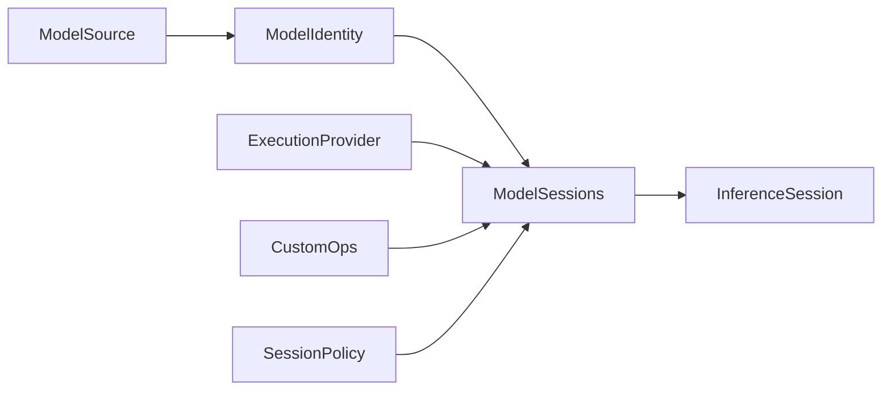

# [COMPUTE_MODEL_LANE]

Rasm.Compute model lane: ONNX model identity and provenance, the one shared session capsule, the EP-parameterized execution-provider axis, custom-operator admission, OrtValue-only inference modes, and the version-stamped deterministic result cache. The page owns the `ModelSource`/`ModelIdentity` vocabulary, the `SessionPolicy` lifecycle rows, the `ExecutionProvider` axis, the `CachePolicy` rows, and the run-mode fold over Microsoft.ML.OnnxRuntime — composing AppHost clocks, deadlines, drain, schedule, and cache ports plus Persistence index rows as settled vocabulary.

## [1]-[INDEX]

| [INDEX] | [CLUSTER]       | [OWNS]                                                          |
| :-----: | :-------------- | :-------------------------------------------------------------- |
|   [1]   | MODEL_IDENTITY  | Checksum identity; acquisition union; schema snapshot; admission law |
|   [2]   | SESSION_CAPSULE | One shared session per model; lifecycle, warmup, drain rows     |
|   [3]   | EP_AXIS         | Execution-provider rows with probe, OS gate, option table       |
|   [4]   | EXTENSION_OPS   | Extension and custom-op registration with asset evidence        |
|   [5]   | INFERENCE_MODES | OrtValue-only run modes; cancellation edge; profiling artifacts |
|   [6]   | RESULT_CACHE    | Version-stamped deterministic keys; cache-policy rows           |

## [2]-[MODEL_IDENTITY]

- Owner: `ModelIdentity` identity record with nested `Slot` schema rows; `ModelSource` `[Union]` four acquisition cases collapsing to one byte admission.
- Cases: `LocalFile`, `EmbeddedResource`, `PersistenceBlob`, `RemoteFetch`.
- Entry: `public static ModelIdentity Snapshot(ModelSource source, ReadOnlySpan<byte> bytes, InferenceSession session, Instant at)` — pure value; identity derives from the bytes, never from the caller.
- Auto: `Snapshot` stamps the XxHash128 identity checksum, graph version, and input/output slot rows in one call; `Accepts` runs once at load and faults `ModelRejected` with mismatch evidence.
- Receipt: the ModelLoad receipt case carries checksum, source case, slot counts, and elapsed; emission rides the sink port at the composition edge.
- Packages: Microsoft.ML.OnnxRuntime; System.IO.Hashing; NodaTime; Thinktecture.Runtime.Extensions; LanguageExt.Core; Rasm.Persistence (project).
- Growth: a new acquisition route is one case on `ModelSource`; zero new surface.
- Boundary: every downstream cache key, receipt, and claim derives from `Checksum` — path-keyed or filename-keyed model identity is the deleted form; `Slot.FreeDims` rows drive the free-dimension overrides at session build, with symbolic-dim values arriving from the geometry-encoding rows as settled vocabulary; schema admission happens exactly once at load.

```csharp signature
[Union(ConversionFromValue = ConversionOperatorsGeneration.None)]
public abstract partial record ModelSource {
    private ModelSource() { }

    public sealed record LocalFile(string Path) : ModelSource;

    public sealed record EmbeddedResource(Assembly Assembly, string Name) : ModelSource;

    public sealed record PersistenceBlob(ArtifactIndexRow Row) : ModelSource;

    public sealed record RemoteFetch(string ArtifactId) : ModelSource;
}

public sealed record ModelIdentity(
    UInt128 Checksum,
    long GraphVersion,
    Seq<ModelIdentity.Slot> Inputs,
    Seq<ModelIdentity.Slot> Outputs,
    ModelSource Source,
    Instant AcquiredAt) {
    public sealed record Slot(string Name, TensorElementType Dtype, Seq<int> Dims, Seq<string> FreeDims);

    public string Key => $"{Checksum:x32}";

    public static ModelIdentity Snapshot(ModelSource source, ReadOnlySpan<byte> bytes, InferenceSession session, Instant at) =>
        new(
            XxHash128.HashToUInt128(bytes),
            session.ModelMetadata.Version,
            Slots(session.InputMetadata),
            Slots(session.OutputMetadata),
            source,
            at);

    public Fin<Unit> Accepts(Seq<(string Name, TensorElementType Dtype, int Rank)> binding) =>
        binding.Filter(slot => !Inputs.Exists(own =>
            StringComparer.Ordinal.Equals(own.Name, slot.Name)
            && own.Dtype == slot.Dtype
            && own.Dims.Count == slot.Rank)).IsEmpty
            ? Fin.Succ(unit)
            : Fin.Fail<Unit>(new ComputeFault.ModelRejected(Key));

    static Seq<Slot> Slots(IReadOnlyDictionary<string, NodeMetadata> nodes) =>
        toSeq(nodes).Map(static pair => new Slot(
            pair.Key,
            pair.Value.ElementDataType,
            toSeq(pair.Value.Dimensions),
            toSeq(pair.Value.SymbolicDimensions)));
}
```

## [3]-[SESSION_CAPSULE]

- Owner: `SessionPolicy` lifecycle policy record; `ModelSessions` boundary capsule owning the OrtEnv boot gate, the resident-session map, and the drain and warmup rows.
- Entry: `public static Fin<InferenceSession> Lease(ModelIdentity model, ReadOnlyMemory<byte> bytes, ExecutionProvider ep, SessionPolicy policy, string artifactDir, ClockPolicy clocks)` — `Fin` aborts on rejected admission; a hit shares the resident session.
- Auto: the admission fold runs options, EP-context keys, free-dim overrides, device policy, EP registration, custom ops, and resident admission as one rail; every lease touches `LastUsed`; eviction past `ResidentSessions` captures the least-recently-used residents inside the swap and disposes them only after the map commits.
- Receipt: the Warmup receipt rides the representative-shape first run on the sweep row; the Drain receipt counts unloaded sessions on the band-200 row.
- Packages: Microsoft.ML.OnnxRuntime; LanguageExt.Core; NodaTime; Rasm.AppHost (project).
- Growth: a lifecycle change is one policy value on `SessionPolicy`; zero new surface.
- Boundary: `ModelSessions` is the page's boundary capsule and its fence carries language-owned statement forms; ORT sessions are thread-safe for concurrent `Run`, so all lanes share ONE `InferenceSession` per checksum — a session pool is the rejected form; `DisablePerSessionThreads` puts every session on the global pool whose counts arrive as settled processor-budget values through `Boot`; `DisableTelemetryEvents` runs at boot because the telemetry spine owns signals; the sweep entry folds idle eviction before re-warm on the registered `compute-model-warmup` row; EP-context and profile outputs land under the blob-lane artifact directory, never as stray temp files.

```csharp signature
public sealed record SessionPolicy(
    int ResidentSessions, Duration IdleUnload, Duration WarmupSweep,
    GraphOptimizationLevel Optimization, bool MemoryPattern, bool Profiling,
    bool OrtExtensions, Seq<string> CustomOpLibraries, Seq<(string Dim, long Value)> FreeDims) {
    public static readonly SessionPolicy Canonical = new(
        ResidentSessions: 4, IdleUnload: Duration.FromMinutes(10), WarmupSweep: Duration.FromMinutes(5),
        Optimization: GraphOptimizationLevel.ORT_ENABLE_ALL, MemoryPattern: true, Profiling: false,
        OrtExtensions: false, CustomOpLibraries: Seq<string>(), FreeDims: Seq<(string Dim, long Value)>());
}

public static class ModelSessions {
    sealed record Resident(InferenceSession Session, Instant LastUsed);

    static readonly Atom<HashMap<UInt128, Resident>> Residents = Atom(HashMap<UInt128, Resident>());
    static readonly PrePackedWeightsContainer PrePacked = new();

    public static Fin<Unit> Boot(string logId, OrtLoggingLevel severity, OrtThreadingOptions pool) {
        if (OrtEnv.IsCreated) { return Fin.Succ(unit); }
        var creation = new EnvironmentCreationOptions { logId = logId, logLevel = severity, threadOptions = pool };
        OrtEnv.CreateInstanceWithOptions(ref creation);
        OrtEnv.Instance().DisableTelemetryEvents();
        return Fin.Succ(unit);
    }

    public static Fin<InferenceSession> Lease(ModelIdentity model, ReadOnlyMemory<byte> bytes, ExecutionProvider ep, SessionPolicy policy, string artifactDir, ClockPolicy clocks) {
        var now = clocks.Now;
        if (Residents.Value.Find(model.Checksum).Case is Resident resident) {
            Residents.Swap(map => map.SetItem(model.Checksum, resident with { LastUsed = now }));
            return Fin.Succ(resident.Session);
        }
        return Open(model, bytes, ep, policy, artifactDir, now);
    }

    public static Seq<UInt128> Unload(Instant idleBefore) {
        Seq<(UInt128, Resident)> evicted = default;
        Residents.Swap(map => (evicted = toSeq(map.ToSeq().Filter(pair => pair.Item2.LastUsed < idleBefore))).Fold(map, static (acc, pair) => acc.Remove(pair.Item1)));
        evicted.Iter(static pair => pair.Item2.Session.Dispose());
        return evicted.Map(static pair => pair.Item1);
    }

    public static DrainParticipantPort DrainRow =>
        new("compute-model-sessions", DrainBand.Compute, Rank: 10, static _ => IO.lift(() => Unload(Instant.MaxValue)).Map(static _ => unit));

    public static ScheduleEntry SweepRow(Func<IO<Unit>> warm) =>
        new("compute-model-warmup", new OccurrenceSpec.Every(SessionPolicy.Canonical.WarmupSweep), DeadlineClass.Startup, Option<LeasePolicy>.None, warm);

    static Fin<InferenceSession> Open(ModelIdentity model, ReadOnlyMemory<byte> bytes, ExecutionProvider ep, SessionPolicy policy, string artifactDir, Instant now) {
        var options = new SessionOptions();
        try {
            options.GraphOptimizationLevel = policy.Optimization;
            options.EnableMemoryPattern = policy.MemoryPattern;
            options.EnableProfiling = policy.Profiling;
            options.ProfileOutputPathPrefix = Path.Combine(artifactDir, "onnx-profile");
            options.DisablePerSessionThreads();
            options.AddSessionConfigEntry("ep.context_enable", "1");
            options.AddSessionConfigEntry("ep.context_file_path", Path.Combine(artifactDir, $"{model.Checksum:x32}.ctx.onnx"));
            options.AddSessionConfigEntry("ep.share_ep_contexts", "1");
            policy.FreeDims.Iter(dim => options.AddFreeDimensionOverrideByName(dim.Dim, dim.Value));
            ep.DevicePolicy.Iter(options.SetEpSelectionPolicy);
            ep.Register(options, artifactDir);
            return CustomOps.Register(options, policy)
                .MapFail(fault => { options.Dispose(); return fault; })
                .Map(ready => {
                    var session = new InferenceSession(bytes.ToArray(), ready, PrePacked);
                    Seq<(UInt128, Resident)> evicted = default;
                    Residents.Swap(map => (evicted = toSeq(map.ToSeq().OrderBy(static pair => pair.Item2.LastUsed).Take(Math.Max(map.Count - policy.ResidentSessions + 1, 0)))).Fold(map, static (acc, pair) => acc.Remove(pair.Item1)).Add(model.Checksum, new Resident(session, now)));
                    evicted.Iter(static pair => pair.Item2.Session.Dispose());
                    return session;
                });
        }
        catch (Exception error) {
            options.Dispose();
            return Fin.Fail<InferenceSession>(new ComputeFault.ModelRejected(error.Message));
        }
    }
}
```



## [4]-[EP_AXIS]

- Owner: `ModelKeyPolicy` ordinal accessor; `ExecutionProvider` `[SmartEnum<string>]` rows with probe name, OS gate, frozen option table, device policy, and register delegate columns.
- Cases: `Cpu`, `CoreMl`.
- Auto: `Available` reads the `GetAvailableProviders` probe plus the macOS 12 gate riding the `ModelFormat` row value; `ResultKey` stamps EP key, ORT version, and option-table hash for the deterministic cache key with zero call-site hashing.
- Packages: Microsoft.ML.OnnxRuntime; System.IO.Hashing; Thinktecture.Runtime.Extensions; LanguageExt.Core; BCL inbox.
- Growth: Cuda and DirectML are one EP row each on Windows profiles; the generative token-streaming successor lands as one designed substrate row, never a chat-client surface; zero new surface.
- Boundary: `AppendExecutionProvider("CoreML", options)` with the eight verified option keys is the canonical spelling — `AppendExecutionProvider_CoreML(CoreMLFlags)` is the rejected legacy flags route; the macOS 12 gate is per `ModelFormat` value because the legacy NeuralNetwork format alone reaches back to macOS 10.15; `ModelCacheDirectory` binds at registration to the blob-lane artifact directory so compiled CoreML caches are catalogued inventory; dylib-presence heuristics are the deleted probe form.

```csharp signature
public sealed class ModelKeyPolicy : IEqualityComparerAccessor<string>, IComparerAccessor<string> {
    private static readonly StringComparer Policy = StringComparer.Ordinal;

    public static IEqualityComparer<string> EqualityComparer => Policy;
    public static IComparer<string> Comparer => Policy;
}

[SmartEnum<string>]
[KeyMemberEqualityComparer<ModelKeyPolicy, string>]
[KeyMemberComparer<ModelKeyPolicy, string>]
public sealed partial class ExecutionProvider {
    static readonly FrozenDictionary<string, string> CoreMlRows = new Dictionary<string, string>(StringComparer.Ordinal) {
        ["ModelFormat"] = "MLProgram",
        ["MLComputeUnits"] = "ALL",
        ["RequireStaticInputShapes"] = "0",
        ["EnableOnSubgraphs"] = "0",
        ["SpecializationStrategy"] = "Default",
        ["ProfileComputePlan"] = "0",
        ["AllowLowPrecisionAccumulationOnGPU"] = "0",
    }.ToFrozenDictionary(StringComparer.Ordinal);

    public static readonly ExecutionProvider Cpu = new(
        "cpu", providerName: "CPUExecutionProvider", minMacOsMajor: 0, optionsHash: 0UL,
        options: FrozenDictionary<string, string>.Empty, devicePolicy: Option<ExecutionProviderDevicePolicy>.None,
        register: static (_, _) => { });

    public static readonly ExecutionProvider CoreMl = new(
        "coreml", providerName: "CoreMLExecutionProvider", minMacOsMajor: 12, optionsHash: Hash(CoreMlRows),
        options: CoreMlRows, devicePolicy: Some(ExecutionProviderDevicePolicy.PREFER_NPU),
        register: static (sessionOptions, cacheDir) => sessionOptions.AppendExecutionProvider(
            "CoreML", new Dictionary<string, string>(CoreMlRows, StringComparer.Ordinal) { ["ModelCacheDirectory"] = cacheDir }));

    public string ProviderName { get; }
    public int MinMacOsMajor { get; }
    public ulong OptionsHash { get; }
    public FrozenDictionary<string, string> Options { get; }
    public Option<ExecutionProviderDevicePolicy> DevicePolicy { get; }
    public Action<SessionOptions, string> Register { get; }

    public bool Available =>
        OrtEnv.Instance().GetAvailableProviders().Contains(ProviderName, StringComparer.Ordinal)
        && (MinMacOsMajor is 0 || OperatingSystem.IsMacOSVersionAtLeast(MinMacOsMajor));

    public string ResultKey(string ortVersion) => $"{Key}:{ortVersion}:{OptionsHash:x16}";

    static ulong Hash(FrozenDictionary<string, string> rows) =>
        XxHash3.HashToUInt64(Encoding.UTF8.GetBytes(string.Join(';',
            rows.OrderBy(static row => row.Key, StringComparer.Ordinal).Select(static row => $"{row.Key}={row.Value}"))));
}
```

## [5]-[EXTENSION_OPS]

- Owner: `CustomOps` — one registration fold over the extensions bundle and the custom-op library rows, plus the string-tensor boundary constructors.
- Cases: `RegisterOrtExtensions` bundle row; `RegisterCustomOpLibraryV2` per-path rows; `CreateFromStringTensor` and `CreateTensorWithEmptyStrings` string-tensor rows.
- Entry: `public static Fin<SessionOptions> Register(SessionOptions options, SessionPolicy policy)` — `Fin` aborts with `ExtensionAssetMissing` naming every absent native asset before any registration runs.
- Receipt: native-asset evidence rides the ModelLoad receipt; the missing-path set is the fault payload.
- Packages: Microsoft.ML.OnnxRuntime.Extensions; Microsoft.ML.OnnxRuntime; LanguageExt.Core; BCL inbox.
- Growth: a new custom-op library is one path row on `SessionPolicy.CustomOpLibraries`; zero new surface.
- Boundary: registration extends the `ModelSessions` boundary capsule and this fence carries language-owned statement forms — guard admission before registration and the out-parameter custom-op handle; tokenizer and pre/post operators stay session assets — a preprocessing or tokenizer service family is the rejected form; the `String` dtype is a model-boundary-only row entering through `DenseTensor<string>` and never the interior tensor vocabulary.

```csharp signature
public static class CustomOps {
    public static Fin<SessionOptions> Register(SessionOptions options, SessionPolicy policy) {
        var missing = policy.CustomOpLibraries.Filter(static path => !File.Exists(path));
        if (!missing.IsEmpty) {
            return Fin.Fail<SessionOptions>(new ComputeFault.ExtensionAssetMissing(string.Join(';', missing)));
        }
        if (policy.OrtExtensions) {
            options.RegisterOrtExtensions();
        }
        policy.CustomOpLibraries.Iter(path => options.RegisterCustomOpLibraryV2(path, out _));
        return Fin.Succ(options);
    }

    public static (string Name, OrtValue Value) StringInput(string name, DenseTensor<string> tokens) =>
        (name, OrtValue.CreateFromStringTensor(tokens));
    public static OrtValue StringSlots(OrtAllocator allocator, long[] shape) =>
        OrtValue.CreateTensorWithEmptyStrings(allocator, shape);
}
```

## [6]-[INFERENCE_MODES]

- Owner: `RunOps` — the run-mode fold over the shared session: single, lane-enqueued, bound-batch, and windowed runs discriminated by intent payload shape.
- Cases: single `Run`; lane-enqueued async (the lane seam owns the thread hop — no native `RunAsync` exists on the session); `RunWithBoundResults` batch over `OrtIoBinding`; streaming windows over chunked inputs.
- Entry: `public Fin<T> Infer<T>(RunOptions options, CancelScope scope, Seq<(string Name, OrtValue Value)> inputs, Seq<string> outputs, Func<IDisposableReadOnlyCollection<OrtValue>, Fin<T>> project)` — the projection runs inside the native-result bracket.
- Auto: `Plan` wires deadline expiry into the `Terminate` one-way latch from the linked `CancelScope`, attaches LoRA adapters, and sets the arena-shrinkage row on bulk runs; one conversion arm classifies failures into `DeadlineExpired`/`Cancelled` by scope provenance.
- Receipt: the ModelRun receipt carries route, elapsed, allocation class, and `OrtMemoryInfo` allocator evidence slots; profiling chrome-trace artifacts land as `ArtifactIndexRow.OnnxProfile` rows with the artifact path in the receipt.
- Packages: Microsoft.ML.OnnxRuntime; LanguageExt.Core; NodaTime; Rasm.AppHost (project); Rasm.Persistence (project).
- Growth: a new run shape is one payload-shape case on the intent family; zero new surface.
- Boundary: `RunOps` extends the `ModelSessions` boundary capsule and this fence carries bracketed statement forms with deterministic native disposal; OrtValue-only law — `NamedOnnxValue`, `DisposableNamedOnnxValue`, and `FixedBufferOnnxValue` are superseded spellings that never appear; `CreateTensorValueFromMemory` binds rented staging arrays without copies; output projection scopes native memory inside `project` and sentinel or NaN values project to `Option` at the boundary, never inward.

```csharp signature
public static class RunOps {
    public static RunOptions Plan(CancelScope scope, Option<OrtLoraAdapter> lora = default, Option<string> arenaShrink = default) {
        var options = new RunOptions();
        lora.Iter(options.AddActiveLoraAdapter);
        arenaShrink.Iter(value => options.AddRunConfigEntry("memory.enable_memory_arena_shrinkage", value));
        scope.Source.Token.Register(() => options.Terminate = true);
        return options;
    }

    public static (string Name, OrtValue Value) Input<T>(string name, T[] data, long[] shape) where T : unmanaged =>
        (name, OrtValue.CreateTensorValueFromMemory(data, shape));

    extension(InferenceSession session) {
        public Fin<T> Infer<T>(RunOptions options, CancelScope scope, Seq<(string Name, OrtValue Value)> inputs, Seq<string> outputs, Func<IDisposableReadOnlyCollection<OrtValue>, Fin<T>> project) =>
            Bracket(scope, project, () => session.Run(options, inputs.Map(static row => row.Name), inputs.Map(static row => row.Value), outputs));

        public Fin<T> InferBound<T>(RunOptions options, CancelScope scope, OrtIoBinding binding, Func<IDisposableReadOnlyCollection<OrtValue>, Fin<T>> project) =>
            Bracket(scope, project, () => session.RunWithBoundResults(options, binding));

        public ArtifactIndexRow Profile(DataClassification classification, string retentionClass, Instant at) {
            var path = session.EndProfiling();
            return ArtifactIndexRow.Admit(ArtifactIndexRow.OnnxProfile, path, File.ReadAllBytes(path), classification, retentionClass, at);
        }
    }

    static Fin<T> Bracket<T>(CancelScope scope, Func<IDisposableReadOnlyCollection<OrtValue>, Fin<T>> project, Func<IDisposableReadOnlyCollection<OrtValue>> run) {
        IDisposableReadOnlyCollection<OrtValue>? results = null;
        try {
            results = run();
            return project(results);
        }
        catch (Exception error) {
            return Fin.Fail<T>(Faulted(scope, error));
        }
        finally {
            results?.Dispose();
        }
    }

    static Error Faulted(CancelScope scope, Exception error) =>
        scope.Source.Token.IsCancellationRequested
            ? scope.Deadline is { IsSome: true, Case: CancellationTokenSource expired } && expired.IsCancellationRequested
                ? new ComputeFault.DeadlineExpired(scope.Provenance)
                : new ComputeFault.Cancelled(scope.Provenance)
            : Error.New(error);
}
```

## [7]-[RESULT_CACHE]

- Owner: `CachePolicy` `[SmartEnum<string>]` serve/store/cut rows; `CacheOps` key derivation, checksum-echo validation, and the policy-dispatched read-through.
- Cases: `Bypass`, `ReadThrough`, `WriteThrough`, `Refresh`.
- Entry: `public ValueTask<T> Through<T, TState>(CachePolicy policy, ModelResultKey key, TState state, Func<TState, CancellationToken, ValueTask<T>> produce, CancellationToken token = default)` — the cache-policy row is an intent field, never a boolean flag.
- Auto: `Key` stamps model checksum, intent input digest, EP key, ORT version, and option-table hash in one call so cross-version numerical drift never serves as a deterministic hit; stampede single-flight, lane tags, and hit/miss facts ride the composed index surface with zero call-site ceremony.
- Receipt: `CacheIndexFact` hit/miss/evict facts with byte sizes; `Validated` faults `CacheCorrupt` on checksum-echo mismatch at read.
- Packages: Microsoft.Extensions.Caching.Hybrid; Microsoft.ML.OnnxRuntime; Thinktecture.Runtime.Extensions; LanguageExt.Core; Rasm.AppHost (project); Rasm.Persistence (project).
- Growth: a new cache posture is one `CachePolicy` row; zero new surface.
- Boundary: `CacheOps` extends the cache boundary capsule and this fence carries the async statement forms of the fresh path; Compute owns keys and policy rows, never a cache instance — `CacheSurface` over `CacheLane.ModelResult` is the single cache owner and hand-rolled memoization beside it is the named defect; cached payloads carry the checksum echo that `Validated` checks before projection.

```csharp signature
[SmartEnum<string>]
[KeyMemberEqualityComparer<ModelKeyPolicy, string>]
[KeyMemberComparer<ModelKeyPolicy, string>]
public sealed partial class CachePolicy {
    public static readonly CachePolicy Bypass = new("bypass", serveHits: false, stores: false, cutsFirst: false);
    public static readonly CachePolicy ReadThrough = new("read-through", serveHits: true, stores: true, cutsFirst: false);
    public static readonly CachePolicy WriteThrough = new("write-through", serveHits: false, stores: true, cutsFirst: false);
    public static readonly CachePolicy Refresh = new("refresh", serveHits: false, stores: true, cutsFirst: true);

    public bool ServeHits { get; }
    public bool Stores { get; }
    public bool CutsFirst { get; }
}

public static class CacheOps {
    public static ModelResultKey Key(ModelIdentity model, UInt128 inputDigest, ExecutionProvider ep) =>
        new(model.Key, inputDigest, ep.ResultKey(OrtEnv.Instance().GetVersionString()));

    public static Fin<T> Validated<T>(ModelResultKey key, string echo, T value) =>
        StringComparer.Ordinal.Equals(echo, key.ModelChecksum)
            ? Fin.Succ(value)
            : Fin.Fail<T>(new ComputeFault.CacheCorrupt(key.ToString()));

    extension(HybridCache cache) {
        public ValueTask<T> Through<T, TState>(CachePolicy policy, ModelResultKey key, TState state, Func<TState, CancellationToken, ValueTask<T>> produce, CancellationToken token = default) =>
            policy.ServeHits
                ? cache.Result(key, state, produce, token)
                : Fresh(cache, policy, key, state, produce, token);
    }

    static async ValueTask<T> Fresh<T, TState>(HybridCache cache, CachePolicy policy, ModelResultKey key, TState state, Func<TState, CancellationToken, ValueTask<T>> produce, CancellationToken token) {
        if (policy.CutsFirst) {
            await cache.Remove(CacheLane.ModelResult, key.ToString(), token);
        }
        var value = await produce(state, token);
        if (policy.Stores) {
            await cache.SetAsync(CacheLane.ModelResult.Scoped(key.ToString()), value, CacheLane.ModelResult.Entry, [CacheLane.ModelResult.Key, key.ModelChecksum], token);
        }
        return value;
    }
}
```

## [8]-[RESEARCH]

| [INDEX] | [ITEM]                                                                                                                                  | [PROOF]                                                                                            | [GATE]          |
| :-----: | :--------------------------------------------------------------------------------------------------------------------------------------- | :---------------------------------------------------------------------------------------------------- | :-------------- |
|   [1]   | `RunOptions.Terminate` latch propagation latency and the deadline poll cadence on CoreML and CPU rows                                   | `uv run python -m tools.assay test run --target Rasm.Compute` terminate-latch spec                 | INFERENCE_MODES |
|   [2]   | `libortextensions.dylib` resolution from `runtimes/osx.10.14-arm64` under the portable RID graph inside a no-publish-RID plugin         | `dotnet build libs/csharp/Rasm.Compute/Rasm.Compute.csproj -p:UseRidGraph=true` with bin-output native-asset listing | EXTENSION_OPS   |
|   [3]   | `OrtThreadingOptions` global intra-op and inter-op knob spellings for the boot pool                                                     | `uv run python -m tools.assay api query microsoft.ml.onnxruntime OrtThreadingOptions`              | SESSION_CAPSULE |
|   [4]   | `InferenceSession.InputMetadata`/`OutputMetadata` map shapes, `ModelMetadata.Version`, `NodeMetadata` element and dimension members, `EndProfiling` return path | `uv run python -m tools.assay api query microsoft.ml.onnxruntime InferenceSession`                 | MODEL_IDENTITY  |
|   [5]   | CoreML option value domains beyond `ModelFormat` (`MLComputeUnits` and `SpecializationStrategy` value spellings)                        | `curl -sL onnxruntime.ai/docs/execution-providers/CoreML-ExecutionProvider.html`                   | EP_AXIS         |
|   [6]   | `OrtEnv` boot and probe member spellings (`IsCreated`, `CreateInstanceWithOptions` with `EnvironmentCreationOptions` field names, `DisableTelemetryEvents`, `GetVersionString`, `GetAvailableProviders`) | `uv run python -m tools.assay api query microsoft.ml.onnxruntime OrtEnv`                           | SESSION_CAPSULE |
|   [7]   | `SessionOptions` config-entry, free-dimension, per-session-thread, profiling, and EP-selection member spellings with `ExecutionProviderDevicePolicy` values | `uv run python -m tools.assay api query microsoft.ml.onnxruntime SessionOptions`                   | SESSION_CAPSULE |
|   [8]   | `OrtValue` string-tensor constructor and `OrtAllocator` member spellings behind the tokenizer boundary                                  | `uv run python -m tools.assay api query microsoft.ml.onnxruntime OrtValue`                         | EXTENSION_OPS   |
|   [9]   | `RunOptions.AddActiveLoraAdapter` and `IDisposableReadOnlyCollection` member spellings on the run edge                                  | `uv run python -m tools.assay api query microsoft.ml.onnxruntime RunOptions`                       | INFERENCE_MODES |
