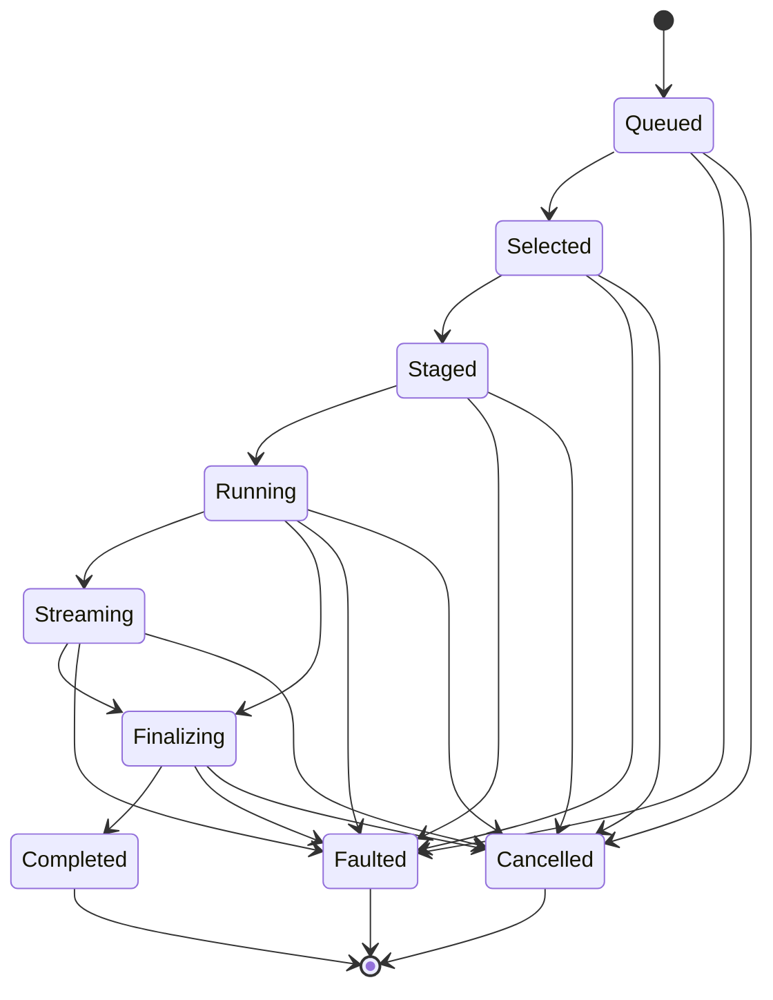

# [COMPUTE_PROGRESS_AND_OBSERVATION]

Rasm.Compute observation is one monotonic `ProgressPhase` family, one Atom-backed `ProgressCell` capsule committing zero-alloc `ProgressMark` structs under a CAS rank guard, one `SubscriptionPolicy` cadence axis gating observer delivery, and one seam fold projecting the identical family onto AppUi presentation and the wire.
The page owns the phase vocabulary with its rank and terminal columns, the subscription gate with observer-declared coalescing, the observation seams, and the progress wire shape.
Correlation identity, cancellation provenance, the clock pair, the scheduler marshal delegate, and the LIFO detacher composite arrive settled from the AppHost spine and compose as given.

## [1]-[INDEX]

| [INDEX] | [CLUSTER]         | [OWNS]                                                       |
| :-----: | :---------------- | :----------------------------------------------------------- |
|   [1]   | PHASE_FAMILY      | Nine monotonic phase rows with rank and terminal columns     |
|   [2]   | PROGRESS_CELL     | Atom-backed capsule; CAS rank guard; cadence-gated delivery  |
|   [3]   | OBSERVATION_SEAMS | AppUi marshal seam; wire mirror seam; sink-edge receipt law  |
|   [4]   | TS_PROJECTION     | Progress wire shape consumed as connect-es server-stream     |

## [2]-[PHASE_FAMILY]

- Owner: `ProgressKeyPolicy` ordinal accessor; `ProgressPhase` `[SmartEnum<string>]` nine rows carrying the monotonic rank column and the terminal column.
- Cases: queued, selected, staged, running, streaming, finalizing, completed, faulted, cancelled.
- Packages: Thinktecture.Runtime.Extensions, BCL inbox
- Growth: one phase row with its rank and terminal column values; zero new surface.
- Boundary: rank order is the page law — the guard compares rank, never adjacency, so forward jumps are admitted and the diagram shows the canonical route; running carries the fraction field, streaming carries the segment count, and the three terminal rows refuse every successor; fraction and throughput estimation are lane policy values that write fraction and segments through `Advance` and never mutate rank; cancelled and faulted stay single terminal rows — fault and cancellation evidence rides the fault rail and joins observers through the correlation, never through extra phase rows.

```csharp signature
public sealed class ProgressKeyPolicy : IEqualityComparerAccessor<string>, IComparerAccessor<string> {
    private static readonly StringComparer Policy = StringComparer.Ordinal;

    public static IEqualityComparer<string> EqualityComparer => Policy;

    public static IComparer<string> Comparer => Policy;
}

[SmartEnum<string>]
[KeyMemberEqualityComparer<ProgressKeyPolicy, string>]
[KeyMemberComparer<ProgressKeyPolicy, string>]
public sealed partial class ProgressPhase {
    public static readonly ProgressPhase Queued = new("queued", rank: 0, terminal: false);
    public static readonly ProgressPhase Selected = new("selected", rank: 1, terminal: false);
    public static readonly ProgressPhase Staged = new("staged", rank: 2, terminal: false);
    public static readonly ProgressPhase Running = new("running", rank: 3, terminal: false);
    public static readonly ProgressPhase Streaming = new("streaming", rank: 4, terminal: false);
    public static readonly ProgressPhase Finalizing = new("finalizing", rank: 5, terminal: false);
    public static readonly ProgressPhase Completed = new("completed", rank: 6, terminal: true);
    public static readonly ProgressPhase Faulted = new("faulted", rank: 7, terminal: true);
    public static readonly ProgressPhase Cancelled = new("cancelled", rank: 8, terminal: true);

    public int Rank { get; }

    public bool Terminal { get; }
}
```



## [3]-[PROGRESS_CELL]

- Owner: `ProgressMark` readonly record struct hot-path capsule; `SubscriptionPolicy` cadence record with the `Due` delivery predicate; `ProgressCell` Atom-backed boundary capsule.
- Cases: `SubscriptionPolicy.Immediate` | `SubscriptionPolicy.Interactive` | `SubscriptionPolicy.Wire` cadence rows.
- Entry: `public ProgressMark Advance(ProgressPhase phase, double fraction = 0d, long segments = 0L)` — value-returning commit; the unchanged snapshot is the rejection contract and the hot path carries no fault rail.
- Auto: every successful swap fires the change event into per-subscription coalesce gates; a rejected regression retains the prior mark and re-fires it, and the gate's equality pre-check drops the re-fired duplicate, so observers structurally never observe rank regress; terminal commits always deliver and terminal re-fires are suppressed.
- Receipt: none minted here — every mark carries the intent correlation that keys receipt evidence at the sink edge, so terminal marks join observers to evidence in one hop.
- Packages: LanguageExt.Core, NodaTime, Thinktecture.Runtime.Extensions, BCL inbox
- Growth: one cadence row on `SubscriptionPolicy` or one field on `ProgressMark` mirrored by one wire member; zero new surface.
- Boundary: `ProgressCell` is the named boundary capsule for the statement carve-out — subscription wiring and event registration carry language-owned statement forms while every other member stays expression-shaped; the cell mints only when the admitted intent's `Option<SubscriptionPolicy>` progress option is populated, and an unsubscribed intent carries no cell so lanes skip every write — `IProgress<T>` plumbing and null-progress checks are the deleted patterns; the swap function is pure and runs once per CAS attempt, so marks are built before the swap, never inside it; cadence literals trace to the three `SubscriptionPolicy` rows and subscribers override them with observer-declared values; observer-initiated cancel rides the cell handle through `Cancel` into the linked scope chain and the executing lane commits the cancelled terminal mark; per-observer queues, dispatchers, and event aggregators are the rejected forms — coalescing is gate policy.

```csharp signature
public readonly record struct ProgressMark(ProgressPhase Phase, double Fraction, long Segments, Instant At, CorrelationId Correlation) {
    public int Rank => Phase.Rank;
}

public sealed record SubscriptionPolicy(Duration MinInterval, double MinFraction, Option<Func<Action, IO<Unit>>> Marshal = default) {
    public static readonly SubscriptionPolicy Immediate = new(Duration.Zero, 0d);
    public static readonly SubscriptionPolicy Interactive = new(Duration.FromMilliseconds(100), 0.01d);
    public static readonly SubscriptionPolicy Wire = new(Duration.FromMilliseconds(250), 0.05d);

    public bool Due(ProgressMark prior, ProgressMark next) =>
        next.Rank >= prior.Rank
            && (next.Phase.Terminal
                || next.Rank > prior.Rank
                || next.At - prior.At >= MinInterval
                || Math.Abs(next.Fraction - prior.Fraction) >= MinFraction);
}

public sealed class ProgressCell(CorrelationId correlation, CancelScope scope, ClockPolicy clocks) {
    readonly Atom<ProgressMark> cell = Atom(new ProgressMark(ProgressPhase.Queued, 0d, 0L, clocks.Now, correlation));

    public CorrelationId Correlation { get; } = correlation;
    public CancelScope Scope { get; } = scope;
    public ProgressMark Latest => cell.Value;

    public ProgressMark Advance(ProgressPhase phase, double fraction = 0d, long segments = 0L) =>
        Advance(new ProgressMark(phase, fraction, segments, clocks.Now, Correlation));

    public ProgressMark Advance(ProgressMark next) =>
        cell.Swap(prior => prior.Phase.Terminal || next.Rank < prior.Rank ? prior : next);

    public PhaseSubscription Subscribe(SubscriptionPolicy policy, Action<ProgressMark> observer) {
        var gate = Atom(cell.Value);
        AtomChangedEvent<ProgressMark> handler = new(mark => Forward(gate, policy, observer, mark));
        cell.Change += handler;
        return new PhaseSubscription([() => cell.Change -= handler]);
    }

    public void Cancel() => Scope.Source.Cancel();

    static Unit Forward(Atom<ProgressMark> gate, SubscriptionPolicy policy, Action<ProgressMark> observer, ProgressMark mark) =>
        gate.Value != mark && gate.Swap(prior => policy.Due(prior, mark) ? mark : prior) == mark
            ? policy.Marshal is { IsSome: true, Case: Func<Action, IO<Unit>> marshal }
                ? ignore(marshal(() => observer(mark)).Run())
                : fun(() => observer(mark))()
            : unit;
}
```

## [4]-[OBSERVATION_SEAMS]

- Owner: `ProgressSeams` extension fold over `ProgressCell` — one member per observation seam, each binding one cadence row to one observer shape.
- Entry: `public PhaseSubscription Observe(UiSchedulerPort scheduler, Action<ProgressMark> render)` — the returned detacher composite disposes LIFO.
- Packages: LanguageExt.Core, BCL inbox
- Growth: one seam member binding one cadence row to one observer shape; zero new surface.
- Boundary: AppUi presentation marshals through the port delegate so no Compute type touches a UI thread — UI-thread marshaling inside observers is the deleted pattern; `Stream` feeds the ComputeService progress server-stream at app roots, and the proto phase enum mirrors the nine SmartEnum keys 1:1 — one family, two encodings, a second wire phase vocabulary is the named defect; dashboard and companion observers consume the identical family the desktop renders; receipts materialize at the receipt-sink edge only — capsules never allocate union cases on the observation path.

```csharp signature
public static class ProgressSeams {
    extension(ProgressCell cell) {
        public PhaseSubscription Observe(UiSchedulerPort scheduler, Action<ProgressMark> render) =>
            cell.Subscribe(SubscriptionPolicy.Interactive with { Marshal = Some(scheduler.Marshal) }, render);

        public PhaseSubscription Stream(Func<ProgressMark, IO<Unit>> write) =>
            cell.Subscribe(SubscriptionPolicy.Wire, mark => ignore(write(mark).Run()));
    }
}
```

## [5]-[TS_PROJECTION]

- Owner: `ProgressPhaseKey`, `ProgressMarkWire` — the progress stream shape the dashboard and companion consume.
- Packages: BCL inbox
- Growth: one key-literal row per new phase and one wire member per new capsule field; zero new surface.
- Boundary: the stream rides connect-es server-stream for-await over the binary transport; phase crosses as its declared key, rank crosses as the phase-row rank number, the instant crosses as a round-trip pattern string, and correlation crosses as a guid string; reduced or coalesced cadence is observer-side policy on the consuming edge, never a wire knob.

```ts contract
type ProgressPhaseKey = "queued" | "selected" | "staged" | "running" | "streaming" | "finalizing" | "completed" | "faulted" | "cancelled";

interface ProgressMarkWire {
  readonly phase: ProgressPhaseKey;
  readonly rank: number;
  readonly fraction: number;
  readonly segments: number;
  readonly at: string;
  readonly correlation: string;
}
```

## [6]-[RESEARCH]

| [INDEX] | [ITEM]                                                                                   | [PROOF]                                                                                                                                          | [GATE]        |
| :-----: | :---------------------------------------------------------------------------------------- | :------------------------------------------------------------------------------------------------------------------------------------------------ | :------------ |
|   [1]   | AtomChangedEvent invocation order across concurrent Advance commits at the coalesce gate | `uv run python -m tools.assay test run --target Rasm.Compute` — CsCheck SampleParallel spec races commits and asserts zero rank regressions delivered | PROGRESS_CELL |
