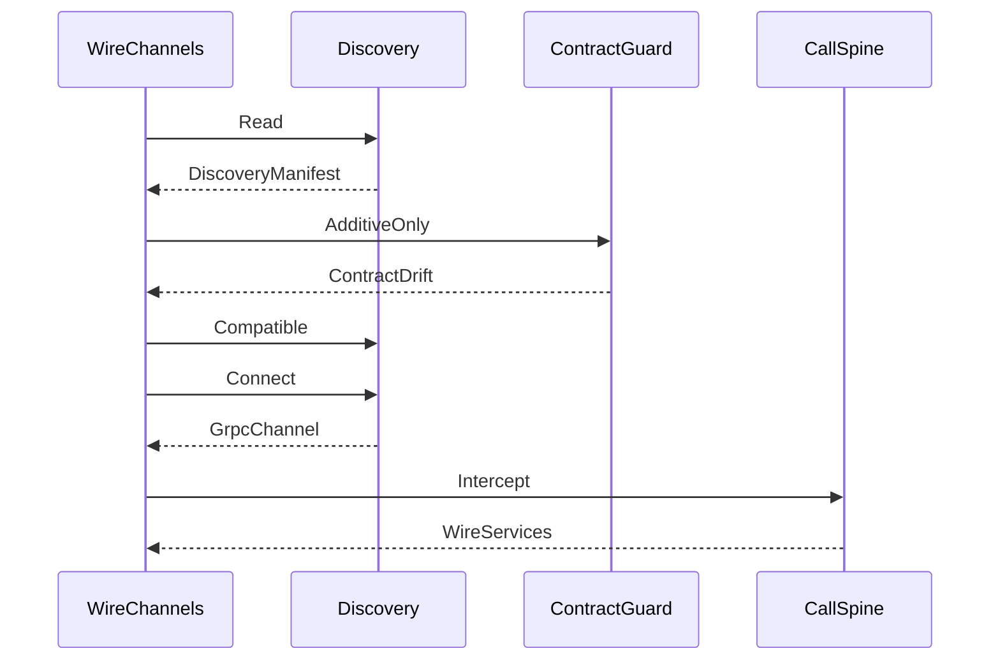

# [COMPUTE_REMOTE_LANE]

Rasm.Compute owns the suite wire vocabulary: five proto services compiled GrpcServices=Client in this package and GrpcServices=Server at app roots, one descriptor-diff contract-evolution law, one FaultDetail family carrying every typed fault across the wire, four `RemoteTransport` rows with streaming-capability columns, a five-row `CredentialPolicy` axis behind one stamping interceptor, and a claim-gated `CompressionProviders` encoding axis projecting the inbox `ICompressionProvider` rows. The ArtifactSync frame law owns the 64 KiB `FrameEdge` fold with per-frame Crc32, whole-artifact XxHash128 identity, and the `IBufferMessage` zero-alloc parse-merge-write fast path, and the browser TS posture projects the whole suite wire as type-only contracts. Channel policy values arrive settled on `GrpcChannelPolicy.Canonical`; discovery, retry ownership, deadlines, correlation, degradation, and receipt sinks compose from the AppHost spine. The package spine is Google.Protobuf, Grpc.Tools, Grpc.Net.Client, Grpc.Net.Client.Web, NodaTime.Serialization.Protobuf, Microsoft.IO.RecyclableMemoryStream, CommunityToolkit.HighPerformance, System.IO.Hashing, Thinktecture.Runtime.Extensions, LanguageExt.Core, and NodaTime.

## [1]-[INDEX]

| [INDEX] | [CLUSTER]          | [OWNS]                                                                    |
| :-----: | ------------------ | ------------------------------------------------------------------------- |
|   [1]   | PROTO_VOCABULARY   | Five wire services, canonical geometry messages, generated-client capsule |
|   [2]   | CONTRACT_EVOLUTION | Descriptor-diff drift law, parse hardening, reserved-number policy        |
|   [3]   | FAULT_PROJECTION   | One FaultDetail family carrying typed faults through status details       |
|   [4]   | TRANSPORT_AXIS     | Four transport rows, streaming capability, dial dispatch, redial law      |
|   [5]   | CALL_POLICY        | Credential axis, one stamping interceptor, deadline and payload edges     |
|   [6]   | ARTIFACT_FRAMES    | Suite frame law: 64 KiB frames, Crc32, zero-copy wrap                     |
|   [7]   | TS_PROJECTION      | Browser wire posture, fault and frame contracts, method shapes            |

## [2]-[PROTO_VOCABULARY]

- Owner: the five service contracts and the canonical geometry message family declared in the remote-lane owner folder; `WireServices` — the channel-scoped generated-client capsule.
- Cases: ComputeService, DocumentService, ControlService, ArtifactSync, grpc.health.v1.Health — google/rpc/status.proto and grpc.health.v1 compile verbatim beside the owned files.
- Auto: Grpc.Tools compiles GrpcServices=Client at build with PrivateAssets=all; app roots compile the same files GrpcServices=Server and emit the descriptor set that feeds connect-es codegen and the manifest checksum.
- Packages: Google.Protobuf, Grpc.Tools, Grpc.Net.Client, NodaTime.Serialization.Protobuf
- Growth: one rpc row on an existing service or one numbered message field absorbs a new wire fact; the browser collaboration decomposition (server-stream down, unary chunked up) is designed-only growth of one rpc row per direction; zero new surface.
- Boundary: temporal values cross as Timestamp and protobuf Duration through `ToTimestamp`/`ToProtobufDuration` outward and `ToInstant`/`ToNodaDuration` inward — BCL DateTime never sits between wire and rail; calendar-bearing capture and schedule facts cross as `Google.Type` commons through `ToDate`/`ToTimeOfDay`/`ToProtobufDayOfWeek` outward and `ToLocalDate`/`ToLocalTime`/`ToIsoDayOfWeek` inward, so a serialized date string never sits between wire and rail; FieldMask carries partial updates and `WireServices.QueryMask` projects a field-path set through `FieldMask.FromString` onto the DocumentService Query read so a web or peer dashboard tile reads only the columns its viewport renders — the same partial-read mask the web-fed Query feed consumes, never a per-tile request DTO; Any with TypeRegistry carries polymorphic artifact envelopes, Empty carries signals; JsonFormatter and JsonParser with the same TypeRegistry are the dashboard edge over the identical generated messages — a parallel web DTO family is the deleted form; `ExecuteTransaction` defends its idempotency edge by `Clone` on the dedup-window receipt rather than mutating the cached message in place — a shared-mutable cached message is the deleted form; `OriginalNameAttribute` reconciles a proto field name to its diverged C# name at the descriptor surface so the contract-evolution key reads the proto name, never the generated identifier; the proto geometry family is the single binary wire geometry, with NetTopologySuite as the store boundary projection, GeoJSON as the JSON projection, and RhinoCommon as the host projection; ArtifactSync carries the wire leg only — sync state, diffing, and transfer manifests are store mechanics; the `Solve`/`Generate` rpcs carry the numeric-lane decomposition and generative-run legs field-for-field with no second request shape, and the `GraphDiff`/`SubtreeFetch` rpcs carry the content-key delta wire shape only — the diff computation is Persistence sync-collaboration#TRANSPORT_AXIS, so Compute owns the wire frame and Persistence owns the diff algebra.

```csharp signature
public sealed record WireServices(
    GrpcChannel Channel,
    ComputeService.ComputeServiceClient Compute,
    DocumentService.DocumentServiceClient Document,
    ControlService.ControlServiceClient Control,
    ArtifactSync.ArtifactSyncClient Artifacts,
    Health.HealthClient Health) : IDisposable {
    public static FieldMask QueryMask(params ReadOnlySpan<string> paths) =>
        FieldMask.FromString(string.Join(',', paths.ToArray()));

    public void Dispose() => Channel.Dispose();
}
```

| [INDEX] | [SERVICE]       | [RPC]              | [SHAPE]       | [MESSAGES]                               | [LAW]                                                                                                                                                                                    |
| :-----: | --------------- | ------------------ | ------------- | ---------------------------------------- | ---------------------------------------------------------------------------------------------------------------------------------------------------------------------------------------- |
|   [1]   | ComputeService  | Infer              | unary         | InferRequest → InferResponse             | payload caps pre-checked at the call edge; faults ride FaultDetail                                                                                                                       |
|   [2]   | ComputeService  | Progress           | server-stream | ProgressRequest → ProgressUpdate         | phase enum mirrors the nine phase keys 1:1, keyed by correlation                                                                                                                         |
|   [3]   | ComputeService  | Capabilities       | unary         | Empty → ComputeCapabilities              | substrate rows, EP rows, model inventory, payload caps, contract metadata — Compute capability rows only                                                                                 |
|   [4]   | DocumentService | Capabilities       | unary         | Empty → DocumentCapabilities             | verb inventory and document scope                                                                                                                                                        |
|   [5]   | DocumentService | DocumentEvents     | server-stream | WatchRequest → DocumentEvent             | watch-fact stream feeding the live-data spine                                                                                                                                            |
|   [6]   | DocumentService | ExecuteTransaction | unary         | TransactionRequest → TransactionReceipt  | idempotency key; server dedup window equals the DeadlineClass.HopTotal allotment — the one retry owner's horizon; response mirrors the DocumentTransaction typed receipt field-for-field |
|   [7]   | DocumentService | Query              | unary         | QueryRequest → QueryResponse             | read verb with FieldMask projection                                                                                                                                                      |
|   [8]   | DocumentService | CaptureEvents      | client-stream | CaptureFrame → CaptureSummary            | per-frame HLC idempotency keys; Http2 and UnixDomainSocket rows only                                                                                                                     |
|   [9]   | ControlService  | CaptureSupport     | unary         | Empty → CaptureSupportReply              | projects the SupportManifest receipt                                                                                                                                                     |
|  [10]   | ControlService  | SetDegradation     | unary         | SetDegradationRequest → DegradationReply | level key lands on the one override rail — the OperatorOverride consequence                                                                                                              |
|  [11]   | ControlService  | ReloadOptions      | unary         | Empty → ReloadReply                      | projects the ReloadReceipt                                                                                                                                                               |
|  [12]   | ArtifactSync    | Sync               | bidi          | ArtifactFrame → ArtifactFrame            | frame law below; FieldMask partials; Any artifact envelopes                                                                                                                              |
|  [13]   | Health          | Check              | unary         | HealthCheckRequest → HealthCheckResponse | maps from the HealthChecks registry via the WireHealthRow tag predicate; substrate predicate and node selection read it                                                                  |
|  [14]   | Health          | Watch              | server-stream | HealthCheckRequest → HealthCheckResponse | compiled verbatim from the well-known proto                                                                                                                                              |
|  [15]   | ComputeService  | Solve              | unary         | SolveRequest → SolveResponse             | carries the numeric-lane dense or sparse decomposition field-for-field; faults ride FaultDetail; the row-block shard sub-solve dials this rpc                                            |
|  [16]   | ComputeService  | Generate           | server-stream | GenerateRequest → TokenChunk             | the remote token-streaming leg riding the Progress-class server-stream pattern, keyed by correlation; faults ride FaultDetail                                                            |
|  [17]   | ComputeService  | GraphDiff          | unary         | GraphDiffRequest → GraphDiffResponse     | content-key delta over two Closure hashes; the diff algebra is Persistence sync-collaboration#TRANSPORT_AXIS, this carries the wire shape only                                           |
|  [18]   | ComputeService  | SubtreeFetch       | server-stream | SubtreeFetchRequest → GraphChunk         | partial-graph checkout streaming the content-addressed subtree the GraphDiff added-set names                                                                                             |

| [INDEX] | [MESSAGE]           | [FIELDS]                                                                                                                      | [ALIGNS]                                                   |
| :-----: | ------------------- | ----------------------------------------------------------------------------------------------------------------------------- | ---------------------------------------------------------- |
|   [1]   | GeometryPayload     | oneof kind: point_cloud=1, mesh=2, voxel=3; symbolic_dims=4 repeated                                                          | envelope for Infer payloads and artifacts                  |
|   [2]   | PointCloudTensor    | count=1 int64; channels=2 int32; dtype=3 string; data=4 bytes                                                                 | point-cloud N×C encoding row                               |
|   [3]   | MeshTensor          | vertex_count=1 int64; vertices=2 bytes; face_count=3 int64; faces=4 bytes                                                     | mesh vertex N×3 and face F×3 rows                          |
|   [4]   | VoxelTensor         | dims=1 repeated int64; dtype=2 string; data=3 bytes                                                                           | voxel NCHW row                                             |
|   [5]   | SymbolicDim         | name=1 string; bound=2 int64                                                                                                  | symbolic-dim binding row                                   |
|   [6]   | SolveRequest        | matrix=1 GeometryPayload; rhs=2 bytes; factorization_kind=3 string; sparse_format=4 string; shard_tile=5 int32                | numeric-lane decomposition request field-for-field         |
|   [7]   | SolveResponse       | solution=1 bytes; provider=2 string; decomposition=3 string; rows=4 int64; cols=5 int64; nnz=6 int64                          | numeric-lane solve result + Factorization-receipt evidence |
|   [8]   | GenerateRequest     | model_checksum=1 string; prompt=2 string; max_length=3 double; guidance_kind=4 string; guidance_data=5 string; tools=6 string | generative-run request mirroring GenerationPolicy          |
|   [9]   | TokenChunk          | piece=1 string; token_index=2 int64; done=3 bool                                                                              | one decoded token piece per server-stream frame            |
|  [10]   | GraphDiffRequest    | base_hash=1 string; target_hash=2 string                                                                                      | content-key delta over two Closure hashes                  |
|  [11]   | GraphDiffResponse   | added=1 repeated string; removed=2 repeated string                                                                            | added/removed content-key set                              |
|  [12]   | SubtreeFetchRequest | content_keys=1 repeated string                                                                                                | partial-graph checkout request                             |
|  [13]   | GraphChunk          | content_key=1 string; payload=2 bytes; ordinal=3 int64                                                                        | one content-addressed subtree node per frame               |

## [3]-[CONTRACT_EVOLUTION]

- Owner: `ContractDrift` `[Union]` three-way drift classification; `ContractGuard` — descriptor surface fold, classifier delegate, descriptor publication path, proto-name reconciliation; `ParseGuard` — inbound parse-hardening policy record carrying the bounded-reader factory, the proto2 `ExtensionRegistry`, and the dynamic open-envelope admission.
- Cases: Identical, Additive (tolerated), Breaking (typed rejection carrying the missing surface rows).
- Entry: `AdditiveOnly(Seq<ByteString> local, Func<string, Fin<Seq<ByteString>>> peerSetOf)` — the delegate `Discovery.Compatible` consumes; checksum equality or additive drift admits, breaking drift rejects on the hop fault rail.
- Packages: Google.Protobuf, Thinktecture.Runtime.Extensions, LanguageExt.Core, Rasm.AppHost (project), BCL inbox
- Growth: a removed field becomes one reserved row carrying its number and name — numbers never return to use; one surface-projection row absorbs a new descriptor dimension; the host↔companion capability negotiation and per-node EP-option bag ride the `Struct`/`Value`/`ListValue` open-envelope column under the same additive-only contract — open within an additive-only contract, never a drift escape hatch; zero new surface.
- Boundary: contract identity is the serialized descriptor set built through `FileDescriptor.BuildFromByteStrings` at startup and published beside the discovery manifest at `DescriptorPath`; the descriptor key reads the proto field name reconciled through `OriginalNameAttribute` so a diverged C# identifier never enters the surface set; the manifest checksum derives from the published bytes through the settled XxHash128 identity row; `UnknownFieldSet` retention stays at the generated-parser default so forward-decoded payloads re-serialize with unknown fields intact — a discard-configured parser is the rejected form; `ParseGuard.Canonical` builds the inbound reader through `CodedInputStream.CreateWithLimits` so the size and recursion bounds are applied at construction, never held as inert numbers, symmetric with the send-side PayloadOverBounds pre-check; the proto2 `ExtensionRegistry` resolves declared extensions at the same parse boundary, and the `Struct` open envelope admits a forward-compatible option bag without a proto regen per option — a held-but-unapplied limit and a bare `CodedInputStream` construction are the deleted forms.

```csharp signature
[Union(ConversionFromValue = ConversionOperatorsGeneration.None)]
public abstract partial record ContractDrift {
    private ContractDrift() { }

    public sealed record Identical : ContractDrift;
    public sealed record Additive(Seq<string> Added) : ContractDrift;
    public sealed record Breaking(Seq<string> Missing) : ContractDrift;
}

public sealed record ParseGuard(int SizeLimitBytes, int RecursionLimit, ExtensionRegistry Extensions) {
    public static readonly ParseGuard Canonical = new(
        SizeLimitBytes: GrpcChannelPolicy.Canonical.MaxReceiveBytes,
        RecursionLimit: 100,
        Extensions: new ExtensionRegistry());

    public Fin<T> Read<T>(MessageParser<T> parser, ReadOnlySequence<byte> payload) where T : IBufferMessage, IMessage<T> =>
        Try.lift(() => parser.ParseFrom(CodedInputStream.CreateWithLimits(payload.ToArray(), SizeLimitBytes, RecursionLimit))).Run()
            .MapFail(static error => new ComputeFault.PayloadOverBounds(error.Message));

    public static Struct Envelope(HashMap<string, Value> options) =>
        options.Fold(new Struct(), static (envelope, entry) => { envelope.Fields[entry.Key] = entry.Value; return envelope; });
}

public static class ContractGuard {
    public static string DescriptorPath(ProfileRoots roots, int pid) =>
        Path.Join(roots.AppRoot, "discovery", $"rasm-{pid}.pb");

    public static Fin<Seq<FileDescriptor>> Build(Seq<ByteString> serialized) =>
        Try.lift(() => FileDescriptor.BuildFromByteStrings(serialized).ToSeq())
            .Run()
            .MapFail(static error => new HopFault.ChecksumBreaking(error.Message));

    public static ContractDrift Classify(Seq<FileDescriptor> local, Seq<FileDescriptor> peer) =>
        (Required: Surface(local), Offered: Surface(peer)) switch {
            var sets when sets.Required.Except(sets.Offered).ToSeq() is { IsEmpty: false } missing => new ContractDrift.Breaking(missing),
            var sets when sets.Offered.Except(sets.Required).ToSeq() is { IsEmpty: false } added => new ContractDrift.Additive(added),
            _ => new ContractDrift.Identical(),
        };

    public static Func<string, string, bool> AdditiveOnly(Seq<ByteString> local, Func<string, Fin<Seq<ByteString>>> peerSetOf) =>
        (_, peerChecksum) =>
            (from peerBytes in peerSetOf(peerChecksum) from peerFiles in Build(peerBytes) from localFiles in Build(local) select Classify(localFiles, peerFiles))
                .Map(static drift => drift is not ContractDrift.Breaking)
                .IfFail(false);

    static FrozenSet<string> Surface(Seq<FileDescriptor> files) =>
        files.Bind(static file => file.MessageTypes.ToSeq()
                .Bind(static message => message.Fields.InDeclarationOrder().ToSeq().Map(field => $"{message.FullName}.{field.Name}={field.FieldNumber}:{field.FieldType}"))
                .Concat(file.Services.ToSeq().Bind(static service => service.Methods.ToSeq().Map(method => $"{service.FullName}/{method.Name}"))))
            .ToFrozenSet(StringComparer.Ordinal);
}
```

## [4]-[FAULT_PROJECTION]

- Owner: `WireFault` — the client-edge decode of the one FaultDetail message family; the server edge packs at app roots.
- Cases: every typed fault union crossing the wire — ComputeFault (band 2200), HopFault (band 4500), store faults at their app roots — projects through the same FaultDetail rows.
- Entry: `Decode(RpcException error)` — `Option<FaultDetail>` from the status-details trailer; `Classify` converts the residual StatusCode taxonomy into the typed rail in one arm.
- Packages: Google.Protobuf, Grpc.Net.Client, LanguageExt.Core
- Growth: one evidence map row per new fault family; zero new surface.
- Boundary: a gRPC status code plus string is never the terminal error shape — the server edge packs FaultDetail into `google.rpc.Status` details, the client edge unpacks back onto the typed rail, and TS reconstructs the identical literal-discriminated union; the Conflict receipt is the retry-owner complement of this law.

```csharp signature
public static class WireFault {
    public const string DetailsTrailer = "grpc-status-details-bin";

    public static Option<FaultDetail> Decode(RpcException error) =>
        Optional(error.Trailers.GetValueBytes(DetailsTrailer))
            .Map(static bytes => Google.Rpc.Status.Parser.ParseFrom(bytes))
            .Bind(static rich => rich.Details.ToSeq()
                .Filter(static any => any.Is(FaultDetail.Descriptor)).HeadOrNone()
                .Map(static any => any.Unpack<FaultDetail>()));

    public static ComputeFault Classify(RpcException error) =>
        error.StatusCode switch {
            StatusCode.Cancelled => new ComputeFault.Cancelled(error.Status.Detail),
            StatusCode.DeadlineExceeded => new ComputeFault.DeadlineExpired(error.Status.Detail),
            _ => new ComputeFault.EndpointUnreachable($"{error.StatusCode}: {error.Status.Detail}"),
        };
}
```

| [INDEX] | [MESSAGE]   | [FIELDS]                                                                                                                                                                             |
| :-----: | ----------- | ------------------------------------------------------------------------------------------------------------------------------------------------------------------------------------ |
|   [1]   | FaultDetail | package=1 string; code=2 int32; case=3 string; message=4 string; evidence=5 map<string,string>; correlation=6 string; hlc_physical=7 google.protobuf.Timestamp; hlc_logical=8 uint64 |

## [5]-[TRANSPORT_AXIS]

- Owner: `RemoteTransport` `[SmartEnum<string>]` four rows with streaming, credential, affinity, and dial columns; `WireKeyPolicy` ordinal comparer accessor; `StreamShape` and `NodeSelection` row vocabularies; `ComputeEndpoint` endpoint identity record; `WireChannels` — attach, open, observe, redial.
- Cases: Http2; GrpcWeb (unary and server-stream only, `GrpcWebMode.GrpcWeb` binary — the text mode is the rejected google-client-only spelling); UnixDomainSocket (discovery manifest consumption, peer-credential and 0700-directory law); InProcess (injected handler from the test composition root — the handler source is the test-host `TestServer.CreateHandler` seam carried on the RESEARCH item).
- Entry: `Open(ComputeEndpoint endpoint, CallSpine spine)` — `Fin<WireServices>`; admission proves credential row membership before the dial column runs.
- Receipt: channel-state transitions and redial evidence emit through `ReceiptSinkPort.Send` keyed by the endpoint correlation; storeEpoch drift after redial is its own evidence row.
- Packages: Grpc.Net.Client, Grpc.Net.Client.Web, Thinktecture.Runtime.Extensions, LanguageExt.Core, Rasm.AppHost (project), BCL inbox
- Growth: one row absorbs a new byte path — the Windows-only `NamedPipe` (`PipeSecurity` ACL) and the bearer-plus-DACL `TcpLoopback` rows are dropped from the live macOS axis and their security-law member spelling stays the design record on `[PIPE_SECURITY]`, re-entering as one row each only on a host whose RID admits the byte path, the `PipeSecurity` ACL for the pipe and the DACL plus bearer for the loopback never blurred into one credential shape; one `NodeSelection` case absorbs a new farm strategy; zero new surface.
- Boundary: `WireChannels` is the named boundary capsule on this fence; keepalive, pooled-idle, multiplexing, and the 4 MiB caps read from `GrpcChannelPolicy.Canonical` and are never re-declared; ArtifactSync bidi and CaptureEvents client-stream are structurally excluded on the GrpcWeb row — intent admission faults a stream shape the row cannot carry; reconnect on UnixDomainSocket is redial-only with the storeEpoch re-handshake after redial; a failed attach folds to the LocalOnly consequence — substrate predicates read the retained Capability set, never a second health probe; `NodeSelection.ModelWarmupAffinity` populates the endpoint affinity column from the warm-start session fingerprint so a cold companion routes to the node holding the matching EP-context blob, and the experimental resolver and balancer config surface never enters — node affinity rides endpoint identity rows, never a `ServiceConfig` load-balancing policy; this endpoint affinity is the single warm-start column the `SubstrateSelection.Plan` fold reads — `WarmAffinity` marking an endpoint affine through `nodeWarmBlobs.Contains(warmStartFingerprint)` projects the `RemoteGrpc.Key` into `SelectionContext.WarmAffinity` so the selection fold's `AffinityRank` tie-breaker reads the same warm fact from one substrate-keyed set, never a second affinity notion parallel to endpoint identity.

```csharp signature
public sealed class WireKeyPolicy : IEqualityComparerAccessor<string>, IComparerAccessor<string> {
    public static IEqualityComparer<string> EqualityComparer => StringComparer.Ordinal;
    public static IComparer<string> Comparer => StringComparer.Ordinal;
}

[Flags]
public enum StreamShape { Unary = 1, ServerStream = 2, ClientStream = 4, Bidi = 8 }

public enum NodeSelection { RoundRobin, LeastLoaded, ModelWarmupAffinity }

public sealed record ComputeEndpoint(
    Uri Address, RemoteTransport Transport, CredentialPolicy Credential, CorrelationId Correlation,
    Option<DiscoveryManifest> Peer = default, Option<NodeSelection> Affinity = default, Option<Func<HttpMessageHandler>> Handler = default,
    Seq<AsyncAuthInterceptor> Mints = default);

[SmartEnum<string>]
[KeyMemberEqualityComparer<WireKeyPolicy, string>]
[KeyMemberComparer<WireKeyPolicy, string>]
public sealed partial class RemoteTransport {
    public static readonly RemoteTransport Http2 = new("http2", streams: StreamShape.Unary | StreamShape.ServerStream | StreamShape.ClientStream | StreamShape.Bidi, credentials: Seq(CredentialPolicy.Tls, CredentialPolicy.Mtls, CredentialPolicy.Bearer, CredentialPolicy.Composed), affinity: true, dial: static endpoint => Fin.Succ(GrpcChannel.ForAddress(endpoint.Address, WireChannels.Canonical(endpoint))));
    public static readonly RemoteTransport GrpcWeb = new("grpc-web", streams: StreamShape.Unary | StreamShape.ServerStream, credentials: Seq(CredentialPolicy.Bearer, CredentialPolicy.Tls), affinity: false, dial: static endpoint => Fin.Succ(GrpcChannel.ForAddress(endpoint.Address, WireChannels.Web(endpoint))));
    public static readonly RemoteTransport UnixDomainSocket = new("uds", streams: StreamShape.Unary | StreamShape.ServerStream | StreamShape.ClientStream | StreamShape.Bidi, credentials: Seq(CredentialPolicy.InsecureLoopback), affinity: false, dial: static endpoint => endpoint.Peer.ToFin(new HopFault.StaleManifest(endpoint.Address.AbsoluteUri)).Map(static peer => Discovery.Connect(peer, GrpcChannelPolicy.Canonical)));
    public static readonly RemoteTransport InProcess = new("in-process", streams: StreamShape.Unary | StreamShape.ServerStream | StreamShape.ClientStream | StreamShape.Bidi, credentials: Seq(CredentialPolicy.InsecureLoopback), affinity: false, dial: static endpoint => endpoint.Handler.ToFin(new HopFault.Excluded(nameof(InProcess))).Map(static handler => GrpcChannel.ForAddress(endpoint.Address, new GrpcChannelOptions { HttpHandler = handler() })));
    public StreamShape Streams { get; }
    public Seq<CredentialPolicy> Credentials { get; }
    public bool Affinity { get; }
    public Func<ComputeEndpoint, Fin<GrpcChannel>> Dial { get; }

    public bool Carries(StreamShape shape) => Streams.HasFlag(shape);
}

public static class WireChannels {
    public static GrpcChannelOptions Canonical(ComputeEndpoint endpoint) => new() {
        Credentials = endpoint.Credential.Channel(endpoint.Mints),
        CompressionProviders = CompressionProviders.Register,
        MaxSendMessageSize = GrpcChannelPolicy.Canonical.MaxSendBytes, MaxReceiveMessageSize = GrpcChannelPolicy.Canonical.MaxReceiveBytes,
        HttpHandler = new SocketsHttpHandler {
            PooledConnectionIdleTimeout = GrpcChannelPolicy.Canonical.PooledConnectionIdle, KeepAlivePingDelay = GrpcChannelPolicy.Canonical.KeepAlivePingDelay,
            KeepAlivePingTimeout = GrpcChannelPolicy.Canonical.KeepAlivePingTimeout, EnableMultipleHttp2Connections = GrpcChannelPolicy.Canonical.EnableMultipleHttp2Connections,
        },
    };

    public static GrpcChannelOptions Web(ComputeEndpoint endpoint) => new() {
        Credentials = endpoint.Credential.Channel(endpoint.Mints), HttpVersion = HttpVersion.Version11,
        MaxSendMessageSize = GrpcChannelPolicy.Canonical.MaxSendBytes, MaxReceiveMessageSize = GrpcChannelPolicy.Canonical.MaxReceiveBytes,
        HttpHandler = new GrpcWebHandler(GrpcWebMode.GrpcWeb, endpoint.Handler.IfNone(static () => new HttpClientHandler())()),
    };

    public static Fin<ComputeEndpoint> Attach(ProfileRoots roots, int pid, JsonTypeInfo<DiscoveryManifest> contract, CorrelationId correlation, string localChecksum, Func<string, string, bool> additiveOnly) =>
        Discovery.Read(roots, pid, contract)
            .Bind(peer => Discovery.Compatible(peer, localChecksum, additiveOnly))
            .Map(peer => new ComputeEndpoint(new UriBuilder(Uri.UriSchemeHttp, "localhost").Uri, RemoteTransport.UnixDomainSocket, CredentialPolicy.InsecureLoopback, correlation, Peer: peer));

    public static ComputeEndpoint WarmAffinity(ComputeEndpoint endpoint, FrozenSet<string> nodeWarmBlobs, string warmStartFingerprint) =>
        endpoint.Transport.Affinity && nodeWarmBlobs.Contains(warmStartFingerprint)
            ? endpoint with { Affinity = Some(NodeSelection.ModelWarmupAffinity) }
            : endpoint;

    public static Fin<WireServices> Open(ComputeEndpoint endpoint, CallSpine spine) =>
        from _credential in guard(endpoint.Transport.Credentials.Contains(endpoint.Credential), new HopFault.Excluded(endpoint.Credential.ToString()))
        from channel in endpoint.Transport.Dial(endpoint)
        select Clients(channel.CreateCallInvoker().Intercept(spine), channel);

    public static IO<Unit> Observe(GrpcChannel channel, Func<ConnectivityState, IO<Unit>> record) =>
        record(channel.State)
            .Bind(_ => IO.liftAsync(async () => { await channel.WaitForStateChangedAsync(channel.State); return unit; }))
            .Bind(_ => Observe(channel, record));

    public static IO<Fin<WireServices>> Redial(ComputeEndpoint endpoint, WireServices stale, CallSpine spine, Func<DiscoveryManifest, Fin<DiscoveryManifest>> rehandshake) =>
        IO.lift(fun(stale.Dispose))
            .Map(_ => endpoint.Peer.ToFin(new HopFault.StaleManifest(endpoint.Address.AbsoluteUri))
                .Bind(rehandshake)
                .Bind(peer => Open(endpoint with { Peer = peer }, spine)));

    static WireServices Clients(CallInvoker invoker, GrpcChannel channel) =>
        new(channel,
            new ComputeService.ComputeServiceClient(invoker),
            new DocumentService.DocumentServiceClient(invoker),
            new ControlService.ControlServiceClient(invoker),
            new ArtifactSync.ArtifactSyncClient(invoker),
            new Health.HealthClient(invoker));
}
```



## [6]-[CALL_POLICY]

- Owner: `CredentialPolicy` `[SmartEnum<string>]` five rows projecting `ChannelCredentials`; `CompressionProviders` `[SmartEnum<string>]` the claim-gated encoding axis projecting inbox `ICompressionProvider` rows; `CallSpine` — the one client interceptor stamping correlation and traceparent, plus the deadline and payload edges.
- Cases: InsecureLoopback (UnixDomainSocket-scoped), Tls, Mtls (client certificate rides the handler TLS options row), Bearer (browser; per-call token minted through `CallCredentials.FromInterceptor(AsyncAuthInterceptor)` and composed onto the channel through `ChannelCredentials.Create`), Composed (farm node dialing a hub; ≥2 per-call identity mints stacked through `CallCredentials.Compose(params CallCredentials[])` and bound to the TLS channel through `ChannelCredentials.Create`, a single-mint sequence collapsing to the bare `FromInterceptor` bind and an empty sequence to the plain `SecureSsl` channel). `CompressionProviders` rows: Identity (the default no-op `"identity"` accept-encoding), Gzip (`GzipCompressionProvider`), Deflate (`DeflateCompressionProvider`).
- Entry: `Options(Instant deadline, CancellationToken token)` — the intent deadline Instant projects to DateTime exactly at this edge; `Bounded` is the `CalculateSize` pre-check faulting PayloadOverBounds before serialization.
- Auto: every generated stub call crosses the interceptor — correlation metadata, W3C traceparent, and per-call receipt capture stamp without hand-threaded Metadata.
- Receipt: per-call route, byte sizes, and deadline outcome evidence emit through `ReceiptSinkPort.Send` at the interceptor seam.
- Packages: Grpc.Net.Client, Grpc.Net.Compression (inbox `ICompressionProvider`/`GzipCompressionProvider`/`DeflateCompressionProvider`), Google.Protobuf, Thinktecture.Runtime.Extensions, LanguageExt.Core, NodaTime, BCL inbox (`System.IO.Compression.CompressionLevel`), Rasm.AppHost (project)
- Growth: one credential row per new trust shape (Composed stacks N identity mints, never a new surface); one `CompressionProviders` row per new wire encoding; the compression flip rides one winning benchmark claim row through `CallSpine.Compressed` stamping the per-call `grpc-internal-encoding-request` metadata key (the `RequestEncodingKey` const) with the winning `CompressionProviders.Key` onto the call options, against the channel-side `GrpcChannelOptions.CompressionProviders` registration that `CompressionProviders.Register` materializes from the axis rows — the winning encoding is a claim-gated `Option<CompressionProviders>`, so an absent claim leaves the call uncompressed and a per-call default-on knob is the deleted form; zero new surface.
- Boundary: the Bearer token is minted per call through `CallCredentials.FromInterceptor` reading the `AsyncAuthInterceptor` token producer, never a pre-built credential cached past its expiry — a stale cached token is the deleted form; `GrpcChannelOptions.ServiceConfig` is never set — the whole retry, hedging, and load-balancing config surface is experimental and a second retry owner; the AppHost keyed pipeline owns the hop retry and a detected second owner emits Conflict evidence instead of stacking; `UnsafeUseInsecureChannelCallCredentials` is never set; `ThrowOperationCanceledOnCancellation` stays unset — `RpcException` conversion lives in the one `WireFault.Classify` arm.

```csharp signature
[SmartEnum<string>]
[KeyMemberEqualityComparer<WireKeyPolicy, string>]
[KeyMemberComparer<WireKeyPolicy, string>]
public sealed partial class CredentialPolicy {
    public static readonly CredentialPolicy InsecureLoopback = new("insecure-loopback", channel: static _ => ChannelCredentials.Insecure);
    public static readonly CredentialPolicy Tls = new("tls", channel: static _ => ChannelCredentials.SecureSsl);
    public static readonly CredentialPolicy Mtls = new("mtls", channel: static _ => ChannelCredentials.SecureSsl);
    public static readonly CredentialPolicy Bearer = new("bearer", channel: static mints => mints.HeadOrNone().Match(
        Some: static mint => ChannelCredentials.Create(ChannelCredentials.SecureSsl, CallCredentials.FromInterceptor(mint)),
        None: static () => ChannelCredentials.SecureSsl));
    public static readonly CredentialPolicy Composed = new("composed", channel: static mints => mints.Match(
        Empty: static () => ChannelCredentials.SecureSsl,
        Head: static mint => ChannelCredentials.Create(ChannelCredentials.SecureSsl, CallCredentials.FromInterceptor(mint)),
        Tail: static (head, tail) => ChannelCredentials.Create(
            ChannelCredentials.SecureSsl,
            CallCredentials.Compose(head.Cons(tail).Map(CallCredentials.FromInterceptor).ToArray()))));

    public Func<Seq<AsyncAuthInterceptor>, ChannelCredentials> Channel { get; }
}

[SmartEnum<string>]
[KeyMemberEqualityComparer<WireKeyPolicy, string>]
[KeyMemberComparer<WireKeyPolicy, string>]
public sealed partial class CompressionProviders {
    public static readonly CompressionProviders Identity = new("identity", provider: static () => Option<ICompressionProvider>.None);
    public static readonly CompressionProviders Gzip = new("gzip", provider: static () => Some<ICompressionProvider>(new GzipCompressionProvider(CompressionLevel.Fastest)));
    public static readonly CompressionProviders Deflate = new("deflate", provider: static () => Some<ICompressionProvider>(new DeflateCompressionProvider(CompressionLevel.Fastest)));

    public Func<Option<ICompressionProvider>> Provider { get; }

    public static IList<ICompressionProvider> Register =>
        Items.ToSeq().Choose(static row => row.Provider()).ToList();
}

public sealed class CallSpine(CorrelationId correlation, Func<string> traceparent) : Interceptor {
    public const string CorrelationKey = "rasm-correlation";
    public const string TraceparentKey = "traceparent";
    public const string RequestEncodingKey = "grpc-internal-encoding-request";

    public static CallOptions Options(Instant deadline, CancellationToken token) =>
        new(deadline: deadline.ToDateTimeUtc(), cancellationToken: token);

    public static CallOptions Compressed(CallOptions options, Option<CompressionProviders> winningEncoding) =>
        winningEncoding.Match(
            Some: encoding => options.WithHeaders(Merge(options.Headers, new Metadata { { RequestEncodingKey, encoding.Key } })),
            None: () => options);

    public static Fin<T> Bounded<T>(T message) where T : IMessage<T> =>
        message.CalculateSize() <= GrpcChannelPolicy.Canonical.MaxSendBytes
            ? Fin.Succ(message)
            : Fin.Fail<T>(new ComputeFault.PayloadOverBounds($"{message.CalculateSize()} over {GrpcChannelPolicy.Canonical.MaxSendBytes}"));

    public override AsyncUnaryCall<TResponse> AsyncUnaryCall<TRequest, TResponse>(TRequest request, ClientInterceptorContext<TRequest, TResponse> context, AsyncUnaryCallContinuation<TRequest, TResponse> continuation) => continuation(request, Stamped(context));
    public override AsyncServerStreamingCall<TResponse> AsyncServerStreamingCall<TRequest, TResponse>(TRequest request, ClientInterceptorContext<TRequest, TResponse> context, AsyncServerStreamingCallContinuation<TRequest, TResponse> continuation) => continuation(request, Stamped(context));
    public override AsyncClientStreamingCall<TRequest, TResponse> AsyncClientStreamingCall<TRequest, TResponse>(ClientInterceptorContext<TRequest, TResponse> context, AsyncClientStreamingCallContinuation<TRequest, TResponse> continuation) => continuation(Stamped(context));
    public override AsyncDuplexStreamingCall<TRequest, TResponse> AsyncDuplexStreamingCall<TRequest, TResponse>(ClientInterceptorContext<TRequest, TResponse> context, AsyncDuplexStreamingCallContinuation<TRequest, TResponse> continuation) => continuation(Stamped(context));

    ClientInterceptorContext<TRequest, TResponse> Stamped<TRequest, TResponse>(ClientInterceptorContext<TRequest, TResponse> context) where TRequest : class where TResponse : class =>
        new(context.Method, context.Host, context.Options.WithHeaders(Merge(context.Options.Headers, new Metadata { { CorrelationKey, correlation.ToString() }, { TraceparentKey, traceparent() } })));

    static Metadata Merge(Metadata? existing, Metadata stamped) =>
        (existing ?? Metadata.Empty).ToSeq().Fold(stamped, static (acc, entry) => { acc.Add(entry); return acc; });
}
```

## [7]-[ARTIFACT_FRAMES]

- Owner: `FrameEdge` — the suite frame law: frame size, per-frame Crc32, whole-artifact XxHash128 identity, zero-copy wrap, fragmented parse, the `IBufferMessage` zero-alloc parse-merge-write fast path (`ParseFrom`, `MergeFrom`, `WriteTo`, `WriteLengthPrefixedTo` over the buffer face), and the `PayloadCodec` `FieldCodec<ByteString>` payload codec; the ArtifactFrame message row below; the blob seam consumes these constants as settled values.
- Entry: `Frames(ByteString artifactId, ReadOnlySequence<byte> staged)` — the 64 KiB frame fold over the staged sequence.
- Receipt: StreamSegment evidence — segment counts and byte sizes — emits through `ReceiptSinkPort.Send`; every `UnsafeWrap` records ownership transfer in the same evidence row.
- Packages: Google.Protobuf, Microsoft.IO.RecyclableMemoryStream, CommunityToolkit.HighPerformance, System.IO.Hashing, LanguageExt.Core, BCL inbox
- Growth: one numbered frame field row; one `FieldCodec<T>` row per new payload encoding so a custom field type rides the generated codec rather than a hand-rolled byte layout; zero new surface.
- Boundary: artifact identity is XxHash128 over the whole artifact — the settled identity row — and frame integrity is Crc32 per frame; a frame whose message implements `IBufferMessage` parses through `MessageParser<T>.ParseFrom` over `GetReadOnlySequence`, extends a live message through `MergeFrom(ReadOnlySpan<byte>)` over a contiguous pooled buffer, and writes through `WriteTo(IBufferWriter<byte>)` into the recyclable stream cast to its `IBufferWriter<byte>` face — all three drive the `ParseContext`/`WriteContext` buffer path with no intermediate managed array, bounded by the `MaxReceiveBytes`/`MaxSendBytes` caps the page already quotes — so the buffer fast path is the zero-alloc steady-state row and a per-frame managed-array copy is the deleted form; `WriteLengthPrefixedTo(IBufferWriter<byte>)` emits the varint-length-prefixed frame so a concatenated-stream reader length-delimits without a side-channel header; the `PayloadCodec` `FieldCodec<ByteString>` row owns the payload field's wire encoding — built from the generated `ArtifactFrame.PayloadFieldNumber` and read through `FieldCodec<T>.Read(ref ParseContext)`, written through `WriteTagAndValue(ref WriteContext, T)`, and sized through `CalculateSizeWithTag(T)` — so a hand-rolled byte layout never enters; `ToArray` materialization is bounded to one frame window at the send edge, and a `MemoryOwner<byte>` segment hands off to `UnsafeByteOperations.UnsafeWrap` through `DangerousGetArray` so the frame never copies into a fresh managed array; `UnsafeWrap` transfers buffer ownership to the message and the wrapped buffer is never mutated after wrap.

```csharp signature
public static class FrameEdge {
    public const int FrameBytes = 64 * 1024;

    public static readonly FieldCodec<ByteString> PayloadCodec =
        FieldCodec.ForBytes(WireFormat.MakeTag(ArtifactFrame.PayloadFieldNumber, WireFormat.WireType.LengthDelimited));

    public static T Parse<T>(MessageParser<T> parser, RecyclableMemoryStream staged) where T : IBufferMessage, IMessage<T> =>
        parser.ParseFrom(staged.GetReadOnlySequence());

    public static Unit Merge<T>(T message, ReadOnlySpan<byte> frame) where T : IBufferMessage, IMessage<T> =>
        fun(() => message.MergeFrom(frame))();

    public static Unit Write<T>(T message, RecyclableMemoryStream staged) where T : IBufferMessage, IMessage<T> =>
        fun(() => message.WriteTo((IBufferWriter<byte>)staged))();

    public static Unit Prefixed<T>(T message, RecyclableMemoryStream staged) where T : IBufferMessage, IMessage<T> =>
        fun(() => message.WriteLengthPrefixedTo((IBufferWriter<byte>)staged))();

    public static ArtifactFrame Owned(ByteString artifactId, long artifactBytes, MemoryOwner<byte> payload, long offset) {
        var segment = payload.DangerousGetArray();
        return new ArtifactFrame {
            ArtifactId = artifactId, ArtifactBytes = artifactBytes, Offset = offset,
            FrameCrc = Crc32.HashToUInt32(segment), Payload = UnsafeByteOperations.UnsafeWrap(segment),
        };
    }

    public static bool Valid(ArtifactFrame frame) =>
        frame.FrameCrc == Crc32.HashToUInt32(frame.Payload.Span);

    public static Seq<ArtifactFrame> Frames(ByteString artifactId, ReadOnlySequence<byte> staged) =>
        toSeq(Enumerable.Range(0, (int)((staged.Length + FrameBytes - 1) / FrameBytes)))
            .Map(index => (long)index * FrameBytes)
            .Map(offset => Frame(artifactId, staged.Length, staged.Slice(offset, Math.Min(FrameBytes, staged.Length - offset)).ToArray(), offset));

    static ArtifactFrame Frame(ByteString artifactId, long artifactBytes, byte[] payload, long offset) => new() {
        ArtifactId = artifactId, ArtifactBytes = artifactBytes, Offset = offset,
        FrameCrc = Crc32.HashToUInt32(payload), Payload = UnsafeByteOperations.UnsafeWrap(payload),
    };
}
```

| [INDEX] | [MESSAGE]     | [FIELDS]                                                                                          |
| :-----: | ------------- | ------------------------------------------------------------------------------------------------- |
|   [1]   | ArtifactFrame | artifact_id=1 bytes; artifact_bytes=2 int64; offset=3 int64; frame_crc=4 fixed32; payload=5 bytes |

## [8]-[TS_PROJECTION]

- Owner: `StreamKind`, `MethodShape`, `TransportCapabilityWire`, `FaultDetailWire`, `ArtifactFrameWire`, and the five service method-shape aliases — the TS posture for the whole suite wire.
- Packages: BCL inbox
- Growth: one method-shape row per new rpc and one field row per new evidence slot; zero new surface.
- Boundary: connect-es v2 `createClient` over `createGrpcWebTransport` consumes the app-root-emitted descriptor set through protoc-gen-es v2 single-plugin codegen — binary format with genuine binary server-streaming over Fetch, so the text mode never enters; unary resolves as await and server-stream consumes as for-await; client-stream and bidi are structurally absent in the browser; coalesced progress cadence is observer-side policy, never a wire knob; `FaultDetailWire` reconstructs the typed rail as a literal-discriminated union keyed by `case`.

```ts contract
type StreamKind = "unary" | "serverStream" | "clientStream" | "bidi";

interface MethodShape<K extends StreamKind, I extends string, O extends string> { kind: K; request: I; response: O; }

interface TransportCapabilityWire { http2: ["unary", "serverStream", "clientStream", "bidi"]; grpcWeb: ["unary", "serverStream"]; }

type ComputeServiceShape = { infer: MethodShape<"unary", "InferRequest", "InferResponse">; progress: MethodShape<"serverStream", "ProgressRequest", "ProgressUpdate">; capabilities: MethodShape<"unary", "Empty", "ComputeCapabilities">; solve: MethodShape<"unary", "SolveRequest", "SolveResponse">; generate: MethodShape<"serverStream", "GenerateRequest", "TokenChunk">; graphDiff: MethodShape<"unary", "GraphDiffRequest", "GraphDiffResponse">; subtreeFetch: MethodShape<"serverStream", "SubtreeFetchRequest", "GraphChunk">; };

type DocumentServiceShape = { capabilities: MethodShape<"unary", "Empty", "DocumentCapabilities">; documentEvents: MethodShape<"serverStream", "WatchRequest", "DocumentEvent">; executeTransaction: MethodShape<"unary", "TransactionRequest", "TransactionReceipt">; query: MethodShape<"unary", "QueryRequest", "QueryResponse">; captureEvents: MethodShape<"clientStream", "CaptureFrame", "CaptureSummary">; };

type ControlServiceShape = { captureSupport: MethodShape<"unary", "Empty", "CaptureSupportReply">; setDegradation: MethodShape<"unary", "SetDegradationRequest", "DegradationReply">; reloadOptions: MethodShape<"unary", "Empty", "ReloadReply">; };

type ArtifactSyncShape = { sync: MethodShape<"bidi", "ArtifactFrame", "ArtifactFrame">; };

type HealthShape = { check: MethodShape<"unary", "HealthCheckRequest", "HealthCheckResponse">; watch: MethodShape<"serverStream", "HealthCheckRequest", "HealthCheckResponse">; };

interface FaultDetailWire { package: RasmPackage; code: number; case: string; message: string; evidence: Record<string, string>; correlation: string; hlcPhysical: string; hlcLogical: number; }

interface ArtifactFrameWire { artifactId: string; artifactBytes: number; offset: number; frameCrc: number; payload: Uint8Array; }
```

## [9]-[RESEARCH]

- [TRANSPORTS]: `TestServer.CreateHandler` handler seam for the in-process row through the test-host pin surface; `Microsoft.AspNetCore.TestHost` admission lands the test-only package reference at the matched ASP.NET Core servicing line.
- [PIPE_SECURITY]: `System.IO.Pipes` `PipeSecurity` ACL for the Windows-only NamedPipe byte path and the loopback DACL plus bearer-token shape for the TcpLoopback byte path — both rows dropped from the live macOS axis (no Windows ACL surface, the loopback path superseded by UDS on this host); the member spelling is the design record re-entering as one row each only on a host whose RID admits the byte path.
- [COMPOSED_CREDENTIAL]: the `CredentialPolicy.Composed` arm and the `CompressionProviders` axis are authored against the catalogued `CallCredentials.Compose(params CallCredentials[])` and inbox `GzipCompressionProvider`/`DeflateCompressionProvider` spellings; the live-ALC dial of the composed identity through a running plugin channel — and the fingerprint-matched `BenchmarkClaim` that gates the compression flip on the live host — are the only residual probes.
