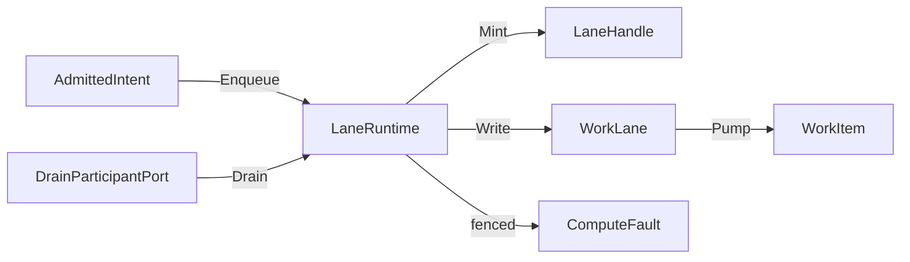
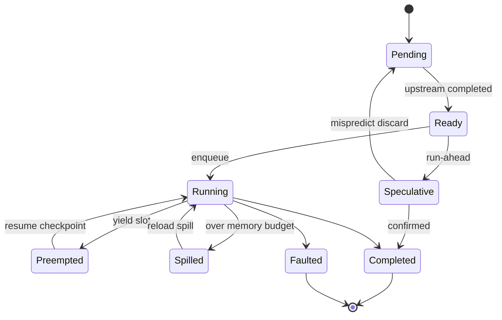

# [COMPUTE_RUNTIME]

Rasm.Compute schedules every admitted intent through five bounded `WorkLane` channel rows behind one `LaneRuntime` enqueue capsule: lane choice is an intent field, full-mode and backpressure are row data, drops emit a correlated `Backpressure` receipt, queue depth reads `ChannelReader.Count`, and solve-path dispatch structurally returns a `LaneHandle` instead of executing work. The page owns the `WorkLane` axis, the work-item and handle shapes, the GH2 async-result ceiling, the `CpuBudget` record the three concurrency axes share, the `JobGraph` dependency-DAG scheduler layering speculative, preemptible, fair-share, accelerator-affinity, and spill-to-store orchestration over the bounded lanes and keying every node on the content digest of its inputs so a re-run reconciles digests and recomputes only the moved subgraph while clean nodes replay cached receipts, and band-200 drain participation — over bounded System.Threading.Channels pipes, Thinktecture vocabulary, LanguageExt rails, NodaTime instants, and the AppHost drain, cancellation, clock, and schedule spine.

## [1]-[INDEX]

| [INDEX] | [CLUSTER]    | [OWNS]                                                                      |
| :-----: | :----------- | :-------------------------------------------------------------------------- |
|   [1]   | LANE_AXIS    | Five bounded channel rows; capacity, full-mode, readers, rank as row data   |
|   [2]   | SOLVE_GUARD  | One enqueue capsule; solve threads receive handles, never execute work      |
|   [3]   | CPU_BUDGET   | One processor-budget record shared by all three concurrency axes            |
|   [4]   | JOB_GRAPH    | Dependency job-graph scheduler; speculative/preemptible; checkpoint; spill  |
|   [5]   | DRAIN_CANCEL | Band-200 drain participation; one linked cancellation chain with provenance |

## [2]-[LANE_AXIS]

- Owner: `WorkLane` `[SmartEnum<string>]` five rows under the `ComputeKeyPolicy` ordinal accessor; `LaneHandle` readback handle; `WorkItem` channel element.
- Cases: interactive, background, bulk, benchmark, capture-ingest.
- Entry: `public BoundedChannelOptions Options(CpuBudget budget)` — pure row projection; capacity, full-mode, and reader fan-out are row data, never call-site arguments.
- Auto: cadence-driven work (compute-model-warmup, scheduled equivalence sweeps) enters as `ScheduleEntry` rows whose `Work` delegate enqueues onto its declared lane — the schedule port owns when, lanes own throughput; receipted-loss rows construct their channel with the drop delegate so every drop lands as a `Backpressure` receipt carrying the dropped item's correlation, never a silent loss; the queue-depth slot reads `ChannelReader<WorkItem>.Count` on the lane's reader at stamp time, never a hand-tracked counter.
- Receipt: Backpressure — lane row, queue depth from `ChannelReader.Count`, wait elapsed on a parked write, or dropped-item correlation on a `DropWrite`/`DropOldest` lane — materialized at the sink edge on the package receipt union.
- Packages: BCL inbox, Thinktecture.Runtime.Extensions, LanguageExt.Core, NodaTime, Rasm.AppHost (project)
- Growth: one lane row with its capacity, full-mode, reader, and rank columns; zero new surface.
- Boundary: the `WorkLane` name is owned here and `DrainQueue` stays the AppHost process-level altitude — one altitude per name; lane choice is an intent field and full-mode is row data, so a drop flag on another row is the deleted form; capture-ingest drops oldest because the latest geometry state wins, and its consumer is the DocumentService CaptureEvents client-stream; rank is the cross-lane precedence datum ordering drain steps — per-item priority mutation, unbounded channels, per-lane worker class hierarchies, and Dataflow lanes are the deleted patterns.

```csharp signature
[SmartEnum<string>]
[KeyMemberEqualityComparer<ComputeKeyPolicy, string>]
[KeyMemberComparer<ComputeKeyPolicy, string>]
public sealed partial class WorkLane {
    public static readonly WorkLane Interactive = new("interactive", capacity: 16, fullMode: BoundedChannelFullMode.Wait, rank: 1, readers: static _ => 1);
    public static readonly WorkLane Background = new("background", capacity: 256, fullMode: BoundedChannelFullMode.Wait, rank: 2, readers: static budget => budget.ReaderCeiling);
    public static readonly WorkLane Bulk = new("bulk", capacity: 1024, fullMode: BoundedChannelFullMode.DropWrite, rank: 3, readers: static _ => 1);
    public static readonly WorkLane Benchmark = new("benchmark", capacity: 4, fullMode: BoundedChannelFullMode.Wait, rank: 4, readers: static _ => 1);
    public static readonly WorkLane CaptureIngest = new("capture-ingest", capacity: 256, fullMode: BoundedChannelFullMode.DropOldest, rank: 5, readers: static _ => 1);

    private readonly Func<CpuBudget, int> readers;

    public int Capacity { get; }

    public BoundedChannelFullMode FullMode { get; }

    public int Rank { get; }

    public int Readers(CpuBudget budget) => Math.Min(readers(budget), budget.ReaderCeiling);

    public BoundedChannelOptions Options(CpuBudget budget) => new(Capacity) {
        FullMode = FullMode,
        SingleReader = Readers(budget) is 1,
        SingleWriter = false,
    };
}

public readonly record struct LaneHandle(CorrelationId Correlation, WorkLane Lane, CancelScope Cancel, Instant Enqueued);

public readonly record struct WorkItem(AdmittedIntent Intent, LaneHandle Handle);
```

## [3]-[SOLVE_GUARD]

- Owner: `LaneRuntime` — the one enqueue capsule over five bounded channels, the admission gate, and the pump readers.
- Entry: `public IO<LaneHandle> Enqueue(AdmittedIntent intent)` — `IO` carries the enqueue effect, awaits fullness on Wait rows, and aborts fenced admission with `ComputeFault.ShutdownDrained`.
- Auto: composition forks `Readers`-many `Pump` effects per row beneath the spine scope; dispatch from GH2 and UI threads structurally enqueues and returns the handle — synchronous model or remote execution on a solve path is unrepresentable by this seam, not by discipline.
- Receipt: wait evidence rides the pressure delegate only when the write parks; a synchronously completed write emits nothing, keeping the uncontended path allocation-free.
- Packages: BCL inbox, LanguageExt.Core, NodaTime, Rasm.AppHost (project)
- Growth: one lane row reuses the same enqueue, write, and pump members; zero new surface.
- Boundary: `LaneRuntime` is the named boundary capsule for the statement carve-out — channel construction, the parked-write window, and the pump loop carry language-owned statement forms; no blocking wait exists on the public surface and completion is observed only through progress states and receipts — handle to correlation to receipt join is the readback, and the GH2 async-result ceiling is the `Interactive` lane capacity of sixteen in-flight handles a GH2 `SolveInstance` readback never exceeds because the seventeenth `Enqueue` parks on the `Wait` full-mode rather than dropping a solve result; the dispatch delegate is total on the fault rail, so the pump never interprets failures.

```csharp signature
public sealed class LaneRuntime(
    ClockPolicy clocks,
    CpuBudget budget,
    Func<WorkItem, IO<Unit>> dispatch,
    Action<WorkLane, WorkItem, Option<Duration>> pressure)
{
    readonly Atom<bool> gate = Atom(true);
    readonly HashMap<WorkLane, Channel<WorkItem>> channels = toHashMap(toSeq(WorkLane.Items).Map(row =>
        (row, row.FullMode is BoundedChannelFullMode.Wait
            ? Channel.CreateBounded<WorkItem>(row.Options(budget))
            : Channel.CreateBounded<WorkItem>(row.Options(budget), item => pressure(row, item, None)))));

    public IO<LaneHandle> Enqueue(AdmittedIntent intent) =>
        from item in gate.Value
            ? IO.pure(Mint(intent))
            : IO.fail<WorkItem>(new ComputeFault.ShutdownDrained(intent.Spec.Lane.Key))
        from landed in Write(item)
        select item.Handle;

    public IO<Unit> Pump(WorkLane lane) =>
        IO.liftAsync(async env => {
            await foreach (var item in channels[lane].Reader.ReadAllAsync(env.Token)) {
                await dispatch(item).RunAsync(env);
            }
            return unit;
        });

    public int Depth(WorkLane lane) => channels[lane].Reader.Count;

    public Unit Fence() => ignore(gate.Swap(static _ => false));

    public IO<Unit> Drain(WorkLane lane, CancellationToken token) =>
        from fenced in IO.lift(Fence)
        from closed in IO.lift(() => channels[lane].Writer.TryComplete())
        from settled in IO.liftAsync(async _ => {
            await channels[lane].Reader.Completion.WaitAsync(token);
            return unit;
        })
        select unit;

    WorkItem Mint(AdmittedIntent intent) =>
        new(intent, new LaneHandle(
            intent.Correlation,
            intent.Spec.Lane,
            intent.Scope.Derive($"{intent.Spec.Lane.Key}/{intent.Correlation}", clocks.Time),
            clocks.Now));

    IO<Unit> Write(WorkItem item) =>
        IO.liftVAsync(async _ => {
            var parked = channels[item.Handle.Lane].Writer.WriteAsync(item, item.Handle.Cancel.Token);
            if (parked.IsCompletedSuccessfully) {
                await parked;
                return unit;
            }
            var mark = clocks.Mark();
            await parked;
            pressure(item.Handle.Lane, item, Some(clocks.Elapsed(mark)));
            return unit;
        });
}
```



## [4]-[CPU_BUDGET]

- Owner: `CpuBudget` — the one processor-budget record the three concurrency axes read.
- Entry: `public static CpuBudget Resolve(int processors, int hostReserve)` — pure clamp; the record freezes at composition and every derived field is arithmetic over the two inputs.
- Auto: the composition root resolves the record once from `Environment.ProcessorCount` and the posture row; lane readers clamp through `Readers`, the model lane sizes its one global ORT thread pool from `OrtIntraOp` and `OrtInterOp` with per-session threads disabled and binds `OrtThreadingOptions.GlobalSpinControl` from `SpinControl`, and the tensor-lane `Partition` execution column reads `PartitionCap` for its `ParallelHelper.For` partition count behind a winning benchmark claim — this record owns the cap, tensors#KERNEL_DISPATCH owns the fan-out.
- Packages: BCL inbox
- Growth: one posture row per new host-profile row and one policy value per new concurrency axis; zero new surface.
- Boundary: oversubscription is structurally impossible because all three axes read this record — a reader count, thread-pool size, or partition count not traced to a field here is the named defect, and a `ParallelHelper.For` degree, a second `Partitioner`/`ParallelRunner` owner, or a `Parallel.For` partition sized off the host total is the rejected form because `PartitionCap` is the one cap the tensor-lane fan-out reads; plugin rows reserve host cores for the Rhino UI and solver threads, service rows own the machine; `ReaderCeiling` halves the worker pool because readers park on kernel and remote completions while the global pool carries the arithmetic; `SpinControl` is the latency-versus-CPU posture the model lane reads at `Boot`, derived from the same `HostReserve` input — a co-tenanted host (`HostReserve > 0`: the plugin and desktop rows sharing cores with the Rhino UI) surrenders ORT spin so reserved cores stay idle between runs, and a machine-owning service row (`HostReserve == 0`) spins to hold model-call latency low, with an ORT thread count or spin flag set anywhere but from this record being the named defect; the `processors` input is sourced from the AppHost `PressurePolicy` container-limit grade when a cgroup/quota limit is present — never the host-total processor count — so one container-limit signal re-caps lane readers, the ORT thread pool, and the partition cap together, and a concurrency axis sized off the host total under a container limit is the named defect.

```csharp signature
public sealed record CpuBudget(int Total, int HostReserve) {
    public int Workers => Math.Max(1, Total - HostReserve);

    public int OrtIntraOp => Workers;

    public int OrtInterOp => 1;

    public int ReaderCeiling => Math.Max(1, Workers / 2);

    public int PartitionCap => Workers;

    public bool SpinControl => HostReserve is 0;

    public static CpuBudget Resolve(int processors, int hostReserve) =>
        new(Math.Max(1, processors), Math.Max(0, hostReserve));
}
```

The posture row supplies `hostReserve` per host-profile row at composition:

| [INDEX] | [PROFILE_ROW]      | [HOST_RESERVE] |
| :-----: | :----------------- | :------------: |
|   [1]   | rhino-plugin       |       2        |
|   [2]   | gh2-plugin         |       2        |
|   [3]   | standalone-desktop |       1        |
|   [4]   | companion          |       1        |
|   [5]   | sidecar            |       1        |
|   [6]   | headless-service   |       0        |
|   [7]   | web-service        |       0        |
|   [8]   | test-host          |       0        |

## [5]-[JOB_GRAPH]

- Owner: `JobNode` the dependency-graph node record carrying its `AdmittedIntent`, upstream dependency set, input-bytes content seed, and scheduling columns; `JobState` `[SmartEnum<string>]` node-lifecycle rows; `JobGraph` the topological dependency-graph scheduler that admits a DAG of compute jobs, runs ready nodes onto the `LaneRuntime`, reconciles speculative, preemptible, fair-share, accelerator-affinity, and spill-to-store columns, and keys every node on the `interchange#CONTENT_ADDRESSING` digest of its inputs so a re-run diffs digests and recomputes only the moved subgraph; `JobCheckpoint` the resume-state carrier the spill writes.
- Cases: `JobState` rows pending · ready · running · speculative · preempted · completed · spilled · faulted.
- Entry: `public IO<Fin<HashMap<string, JobState>>> Run(Seq<JobNode> nodes, LaneRuntime lanes, ClockPolicy clocks)` — `IO<Fin<...>>` carries the schedule effect; a cyclic dependency aborts `ComputeFault` before any node runs, and the topological frontier enqueues every ready node onto its declared `WorkLane` returning the final state map.
- Auto: `Run` computes the ready frontier (nodes whose upstream set is all `completed`), enqueues each onto the `LaneRuntime` by its node-declared lane, and advances the state map as handles complete — a node marked speculative runs ahead of its confirmation and its result is discarded on a mispredict, a preemptible node yields its lane slot to a higher-fair-share tenant and resumes from its `JobCheckpoint`, and a node past its memory budget spills its intermediate state to the Persistence blob lane keyed by the node content-hash; accelerator affinity reorders the ready frontier so a node whose EP-context blob is warm on a node routes there through the same `Substrate` warm-affinity column the selection fold reads, never a second router; fair-share reads the per-tenant in-flight count off the `TenantContext` so no tenant starves the frontier.
- Receipt: the `Sweep` `ComputeReceipt` case carries the graph node count, the completed/spilled/faulted split, and elapsed; each node's own execution rides its lane's existing receipts, so the graph adds the orchestration fact and never a per-node receipt union.
- Packages: BCL inbox, System.IO.Hashing, LanguageExt.Core, Microsoft.Extensions.Caching.Hybrid, NodaTime, Rasm.AppHost (project), Rasm.Persistence (project)
- Growth: a new node lifecycle is one `JobState` row; a new scheduling policy (speculation, preemption, fair-share, affinity, spill) is one column on `JobNode`; the reactive recompute is the one `Reconcile` digest-diff over the existing edges, never a second memoization or dependency tracker; zero new surface — a `JobScheduler`/`WorkflowEngine`/`DagRunner`/`IncrementalEngine` sibling surface is the rejected form collapsed onto the one `JobGraph` over the existing lanes.
- Boundary: the job graph is the dependency-DAG layer over the existing bounded lanes — it enqueues `AdmittedIntent`s onto the `LaneRuntime` and never executes work itself, so the solve-path guard and backpressure the lanes own hold for graph nodes exactly as for direct enqueues, and a graph node that runs work outside a lane is the rejected form; speculative execution discards mispredicted results before they emit a receipt so a speculative node's side effects are receipt-gated, preemption resumes from the `JobCheckpoint` the spill wrote so a preempted long solve never restarts from zero, and spill-to-store rides the Persistence blob lane content-addressed by the node hash so a re-run reuses the spilled intermediate — a second checkpoint store is the rejected form; accelerator affinity and fair-share are `JobNode` columns the ready-frontier ordering reads, so distributed solve orchestration (the dependency scheduler the farm lacked) lands without a `FarmRouter`, reusing the `Substrate` warm-affinity and the AppHost `PeerRoster` load the selection fold already consumes; the cycle check runs once at admission and a cyclic graph faults before any node runs, never mid-schedule; `MarkDirty` is the real-time incremental parametric re-solve primitive — a changed input node transitively marks its downstream cone `Pending` and `Run` recomputes only the dirty subgraph against the still-`Completed` clean nodes, so a server-side headless merge-preview solve re-runs the touched parametric subgraph rather than the whole model, the dirty-set propagation reuses the same dependency edges the scheduler already walks, and a full recompute on a single-input change is the named defect this layer deletes; `Reconcile` is the content-keyed reactive engine over that primitive — `Keys` walks the topological order and folds each node's `InputBytes` content seed under its upstream-key ancestry through the one `interchange#CONTENT_ADDRESSING` `XxHash128` law (never a hand-tracked mutation flag and never a per-node version stamp beside the content key), the moved set is the content-key inequality against the prior key map, `MarkDirty` propagates the transitive dirty closure, and every clean node whose key did not move stays `Completed` and replays from the `models#RESULT_CACHE` deterministic cache hit without re-execution — the clean-node short-circuit is the existing cache hit so no second memoization owner appears, the dirty closure rides the `solver#SWEEP_AND_BUDGET` `FrameBudget` per frame, the AppUi twin and Persistence federation receive only the moved nodes' receipts, and the whole package becomes one incremental compute engine over the existing identity and receipt rails rather than a parallel dependency tracker.

```csharp signature
[SmartEnum<string>]
[KeyMemberEqualityComparer<ComputeKeyPolicy, string>]
[KeyMemberComparer<ComputeKeyPolicy, string>]
public sealed partial class JobState {
    public static readonly JobState Pending = new("pending", terminal: false);
    public static readonly JobState Ready = new("ready", terminal: false);
    public static readonly JobState Running = new("running", terminal: false);
    public static readonly JobState Speculative = new("speculative", terminal: false);
    public static readonly JobState Preempted = new("preempted", terminal: false);
    public static readonly JobState Completed = new("completed", terminal: true);
    public static readonly JobState Spilled = new("spilled", terminal: false);
    public static readonly JobState Faulted = new("faulted", terminal: true);

    public bool Terminal { get; }
}

public sealed record JobCheckpoint(string NodeId, UInt128 ContentKey, ReadOnlyMemory<byte> State, Instant At);

public sealed record JobNode(
    string Id,
    AdmittedIntent Intent,
    Seq<string> DependsOn,
    WorkLane Lane,
    bool Speculative,
    bool Preemptible,
    int FairShareWeight,
    Option<string> AcceleratorAffinity,
    long MemoryBudgetBytes,
    ReadOnlyMemory<byte> InputBytes) {
    public bool Ready(HashMap<string, JobState> states) =>
        DependsOn.ForAll(dep => states.Find(dep).Map(static state => state == JobState.Completed).IfNone(false));

    public UInt128 NodeKey(HashMap<string, UInt128> upstreamKeys) {
        Span<byte> seed = stackalloc byte[16];
        UInt128 ancestry = DependsOn.Fold(UInt128.Zero, (acc, dep) => acc ^ upstreamKeys.Find(dep).IfNone(UInt128.Zero));
        MemoryMarshal.Write(seed, in ancestry);
        return XxHash128.HashToUInt128(InputBytes.Span, unchecked((long)XxHash3.HashToUInt64(seed)));
    }
}

public sealed class JobGraph(Func<string, IO<Option<JobCheckpoint>>> spill) {
    public IO<Fin<HashMap<string, JobState>>> Run(Seq<JobNode> nodes, LaneRuntime lanes, ClockPolicy clocks) =>
        Cyclic(nodes)
            ? IO.pure(Fin.Fail<HashMap<string, JobState>>(ComputeFault.Create("<job-graph-cycle>")))
            : Schedule(nodes, lanes, clocks, nodes.Fold(HashMap<string, JobState>(), static (acc, node) => acc.Add(node.Id, JobState.Pending)));

    IO<Fin<HashMap<string, JobState>>> Schedule(Seq<JobNode> nodes, LaneRuntime lanes, ClockPolicy clocks, HashMap<string, JobState> states) =>
        states.Values.ForAll(static state => state.Terminal)
            ? IO.pure(Fin.Succ(states))
            : Frontier(nodes, states)
                .OrderBy(node => node.AcceleratorAffinity.IsSome ? 0 : 1)
                .ThenByDescending(static node => node.FairShareWeight)
                .ToSeq()
                .TraverseM(node => lanes.Enqueue(node.Intent).Map(handle => (node.Id, handle)))
                .Bind(launched => Schedule(nodes, lanes, clocks, launched.Fold(states, static (acc, pair) => acc.SetItem(pair.Id, JobState.Running))));

    public static HashMap<string, JobState> MarkDirty(Seq<JobNode> nodes, HashMap<string, JobState> states, Seq<string> changed) {
        var dirty = changed.ToHashSet();
        bool grew = true;
        while (grew) {
            grew = false;
            foreach (var node in nodes.Filter(n => n.DependsOn.Exists(dirty.Contains) && !dirty.Contains(n.Id))) {
                dirty = dirty.Add(node.Id);
                grew = true;
            }
        }
        return dirty.Fold(states, static (acc, id) => acc.SetItem(id, JobState.Pending));
    }

    public static HashMap<string, UInt128> Keys(Seq<JobNode> nodes) =>
        Topological(nodes).Fold(HashMap<string, UInt128>(), static (acc, node) => acc.Add(node.Id, node.NodeKey(acc)));

    public IO<Fin<HashMap<string, JobState>>> Reconcile(Seq<JobNode> nodes, HashMap<string, UInt128> prior, HashMap<string, JobState> priorStates, LaneRuntime lanes, ClockPolicy clocks) {
        var current = Keys(nodes);
        var moved = toSeq(current.Filter((id, key) => prior.Find(id).Map(was => was != key).IfNone(true)).Keys);
        var states = MarkDirty(nodes, priorStates, moved);
        return Cyclic(nodes)
            ? IO.pure(Fin.Fail<HashMap<string, JobState>>(ComputeFault.Create("<job-graph-cycle>")))
            : Schedule(nodes.Filter(node => states.Find(node.Id).Map(static s => !s.Terminal).IfNone(true)), lanes, clocks, states);
    }

    static Seq<JobNode> Topological(Seq<JobNode> nodes) {
        var indegree = nodes.Fold(HashMap<string, int>(), static (acc, node) => acc.Add(node.Id, node.DependsOn.Count));
        var byId = nodes.Fold(HashMap<string, JobNode>(), static (acc, node) => acc.Add(node.Id, node));
        var queue = toSeq(indegree.Filter(static degree => degree == 0).Keys);
        var ordered = Seq<JobNode>();
        while (queue.HeadOrNone().Case is string head) {
            queue = queue.Tail;
            ordered = ordered.Add(byId[head]);
            foreach (var node in nodes.Filter(n => n.DependsOn.Contains(head))) {
                indegree = indegree.SetItem(node.Id, indegree[node.Id] - 1);
                if (indegree[node.Id] == 0) { queue = queue.Add(node.Id); }
            }
        }
        return ordered;
    }

    static Seq<JobNode> Frontier(Seq<JobNode> nodes, HashMap<string, JobState> states) =>
        nodes.Filter(node => states.Find(node.Id).Map(static state => state == JobState.Pending).IfNone(false) && node.Ready(states));

    static bool Cyclic(Seq<JobNode> nodes) {
        var ids = nodes.Map(static node => node.Id).ToHashSet();
        var indegree = nodes.Fold(HashMap<string, int>(), static (acc, node) => acc.Add(node.Id, node.DependsOn.Count));
        var queue = toSeq(indegree.Filter(static degree => degree == 0).Keys);
        int visited = 0;
        while (queue.HeadOrNone().Case is string head) {
            queue = queue.Tail;
            visited++;
            foreach (var node in nodes.Filter(n => n.DependsOn.Contains(head))) {
                indegree = indegree.SetItem(node.Id, indegree[node.Id] - 1);
                if (indegree[node.Id] == 0) { queue = queue.Add(node.Id); }
            }
        }
        return visited != ids.Count;
    }
}
```



## [6]-[DRAIN_CANCEL]

- Owner: `LaneDrain` — the participant fold projecting lane rows onto the drain conductor.
- Cases: user cancel (handle scope), deadline expiry (scope deadline at the execution edge), shutdown drain (spine under the conductor) — provenance-preserved end to end through `CancelScope` path segments.
- Entry: `public Seq<DrainParticipantPort> Participants()` — one band-200 registration row per lane, rank-ordered inside the band.
- Auto: the draining phase receipt fences admission through one subscription row at composition, and every per-lane `Drain` re-fences idempotently so band order never races the gate; cooperative and forced budgets arrive from the drain deadline rows through the conductor — no duration literal lives here.
- Receipt: Drain — per-lane flushed and dropped counts at the sink edge; step timing and straggler evidence ride the AppHost conductor receipt.
- Packages: Rasm.AppHost (project), LanguageExt.Core, BCL inbox
- Growth: one participant row per new lane row; zero new surface.
- Boundary: one linked token chain runs intent to lane to the execution edges — the model lane maps the token onto the Terminate latch and the remote lane onto call deadlines — and a free-floating CancellationTokenSource below the spine is the named defect; late arrivals abort `ComputeFault.ShutdownDrained`, and the residual fence race between a gated write and writer completion lands on the IO error channel as evidence, never as silent loss.

```csharp signature
public static class LaneDrain {
    extension(LaneRuntime lanes) {
        public Seq<DrainParticipantPort> Participants() =>
            toSeq(WorkLane.Items).Map(row => new DrainParticipantPort(
                Name: $"compute-{row.Key}",
                Band: DrainBand.Compute,
                Rank: row.Rank,
                Drain: token => lanes.Drain(row, token)));
    }
}
```

## [7]-[RESEARCH]

- [LANE_EVIDENCE]: the bounded-channel `itemDropped` callback runs on the writer thread synchronously, so the drop-path `Backpressure` projection allocates only the receipt envelope at the sink edge; the per-drop allocation profile under sustained `DropOldest` capture-ingest load is the implementation-time measurement that confirms the steady-state path stays envelope-only.
