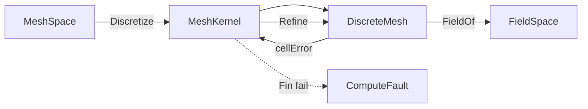

# [COMPUTE_SOLVER_AND_OPTIMIZATION]

Rasm.Compute solver lane: one `PhysicsKind`×`BoundaryCondition`×`ElementClass` solve-contract axis admitting FEA, CFD, thermal, daylight, energy, and acoustic problems on the discretized DDG field as uniform `SolveProblem` rows, one volumetric `MeshKernel` discretization owner generating tet/hex/boundary-layer meshes with adaptive h/p refinement, one `Optimizer` design-space-search axis over typed design-var/constraint/objective with NSGA, Bayesian-GP, gradient-adjoint, topology, and simulated-annealing rows, one `Surrogate` reduced-order duality column making every solve an optional error-bounded learned/ROM evaluation behind the same contract, one `SweepGrid` N-dim DOE orchestration emitting a queryable `ParetoFront` artifact, one `FrameBudget` early-stop governor returning a coarse iterative field within a frame deadline and refining async, one `ClashScale` acceleration-structure-backed collision-compute owner over federated geometry, and one `DigitalTwin` ROM-eval telemetry loop scoring live signals against simulated baselines — composing the numeric-lane `Factorization`/`SparseOps`/`ShardPlan` solve machinery, the tensor-lane field encoding and adjoint operators, the `BenchmarkClaim` fingerprint gate, the `WorkLane`/`LaneRuntime` scheduler, the `ComputeReceipt` rail, and the Persistence artifact and vector indexes as settled vocabulary; every solver receipt is typed and the page carries no TS_PROJECTION because solve interiors stay host-local behind the existing `remote-lane#PROTO_VOCABULARY` `Solve` rpc.

## [1]-[INDEX]

| [INDEX] | [CLUSTER]           | [OWNS]                                                                        |
| :-----: | :------------------ | :---------------------------------------------------------------------------- |
|   [1]   | DISCRETIZATION_MESH | Volumetric mesher; tet/hex/boundary-layer; adaptive h/p refinement; field rep |
|   [2]   | SOLVE_CONTRACT      | Physics×BC×element solve axis; multi-physics coupling; adaptive recovery fold  |
|   [3]   | OPTIMIZER_LANE      | Design-var/link/conditional search axis; ROM-orthogonalized surrogate duality |
|   [4]   | SWEEP_AND_BUDGET    | N-dim DOE sweep grid; frame-budgeted early-stop; sensitivity post-processing  |
|   [5]   | CLASH_AND_TWIN      | Acceleration-structure collision compute; ROM digital-twin telemetry loop     |

## [2]-[DISCRETIZATION_MESH]

- Owner: `SolverKeyPolicy` ordinal accessor; `ElementClass` `[SmartEnum<string>]` element-topology rows; `MeshAlgorithm` `[SmartEnum<string>]` generation-strategy rows; `MeshKernel` static surface generating a `DiscreteMesh` from a boundary `ImportedGeometry` or `MeshSpace` then refining it adaptively; `DiscreteMesh` the conforming/non-conforming volumetric mesh carrier; `FieldSpace` the integration-point/nodal scalar/vector/tensor field representation the solve writes.
- Cases: `ElementClass` rows tet4 · tet10 · hex8 · hex20 · wedge6 · pyramid5 · tri3 · quad4 · poly (polyhedral); `MeshAlgorithm` rows delaunay · advancing-front · octree · sweep · boundary-layer; `FieldSpace` rank rows scalar · vector · tensor over `FieldStation` nodal/integration-point/cell positions.
- Entry: `public static Fin<DiscreteMesh> Discretize(MeshSpace boundary, MeshPolicy policy, CorrelationId correlation, ClockPolicy clocks)` — `Fin<T>` aborts on a non-manifold boundary or an unrealizable element budget; `Refine` re-meshes the marked-cell set by the `h` (subdivision) or `p` (order-elevation) axis returning the adapted mesh and the carried error estimator.
- Auto: `Discretize` selects the `MeshAlgorithm` row by the boundary topology and the policy quality target — a closed manifold solid routes octree/Delaunay tet fill, a sweepable prism routes the sweep hex algorithm, and a viscous boundary routes the boundary-layer inflation that grows graded prism layers off the wall before the interior fill; `Refine` reads the per-cell `FieldStation` error estimator and marks the cells whose estimator exceeds the policy fraction, splitting (h) or elevating (p) only the marked set so the mesh stays conforming through hanging-node constraints or non-conforming through the mortar column the policy carries; the field representation derives its station count from the `ElementClass` quadrature order so a tet10 carries its four integration points and a hex8 its eight without a per-element count.
- Receipt: the `Discretization` `ComputeReceipt` case carries the algorithm key, element-class key, node and element counts, the boundary-layer count, the worst-element quality scalar, and elapsed; `Refine` stamps the refinement level, the marked-cell count, and the post-refine error estimator on the same case so an adaptive sweep is one receipt chain by correlation.
- Packages: Rasm (project), MathNet.Numerics, CommunityToolkit.HighPerformance, Thinktecture.Runtime.Extensions, LanguageExt.Core, NodaTime, BCL inbox
- Growth: a new element topology is one `ElementClass` row carrying its node count, quadrature order, and shape-function column; a new generation strategy is one `MeshAlgorithm` row; a new field rank is one `FieldSpace` rank row; zero new surface.
- Boundary: the mesher is the volumetric discretization owner the FEA/CFD solve consumes — the surface-mesh operators (remesh, MLS, decimate) stay `Rasm`/Vectors core and this kernel composes them as settled vocabulary for the boundary triangulation, never re-deriving a surface mesher; the `DiscreteMesh` connectivity rides `Tensor<long>` element-node tables and the `SparseCompressedRowMatrixStorage<double>` adjacency the `numeric-lane#SPARSE_SOLVE` ingestion consumes directly, so the assembled stiffness matrix never re-derives connectivity; the canonical geometry+field representation is the `FieldSpace` over `FieldStation` rows — B-rep/NURBS boundary enters as the `MeshSpace` boundary projection and the integration-point field is the solve-native carrier, so a parallel `MeshField`/`NodalField`/`GaussField` family is the deleted form collapsed onto one `FieldSpace` discriminated by rank and station; the quality scalar is the worst scaled-Jacobian over the element set read once, never a per-call recompute; adaptive refinement is conforming by default and non-conforming only when the policy mortar column is set, and a hanging node without a constraint row is the rejected form; host geometry coordinate access stays inside `Discretize` and host geometry types never enter solve signatures.

```csharp signature
public sealed class SolverKeyPolicy : IEqualityComparerAccessor<string>, IComparerAccessor<string> {
    private static readonly StringComparer Policy = StringComparer.Ordinal;

    public static IEqualityComparer<string> EqualityComparer => Policy;
    public static IComparer<string> Comparer => Policy;
}

[SmartEnum<string>]
[KeyMemberEqualityComparer<SolverKeyPolicy, string>]
[KeyMemberComparer<SolverKeyPolicy, string>]
public sealed partial class ElementClass {
    public static readonly ElementClass Tet4 = new("tet4", nodes: 4, quadrature: 1, order: 1, volumetric: true);
    public static readonly ElementClass Tet10 = new("tet10", nodes: 10, quadrature: 4, order: 2, volumetric: true);
    public static readonly ElementClass Hex8 = new("hex8", nodes: 8, quadrature: 8, order: 1, volumetric: true);
    public static readonly ElementClass Hex20 = new("hex20", nodes: 20, quadrature: 27, order: 2, volumetric: true);
    public static readonly ElementClass Wedge6 = new("wedge6", nodes: 6, quadrature: 6, order: 1, volumetric: true);
    public static readonly ElementClass Pyramid5 = new("pyramid5", nodes: 5, quadrature: 5, order: 1, volumetric: true);
    public static readonly ElementClass Tri3 = new("tri3", nodes: 3, quadrature: 1, order: 1, volumetric: false);
    public static readonly ElementClass Quad4 = new("quad4", nodes: 4, quadrature: 4, order: 1, volumetric: false);
    public static readonly ElementClass Poly = new("poly", nodes: 0, quadrature: 1, order: 1, volumetric: true);

    public int Nodes { get; }
    public int Quadrature { get; }
    public int Order { get; }
    public bool Volumetric { get; }
}

[SmartEnum<string>]
[KeyMemberEqualityComparer<SolverKeyPolicy, string>]
[KeyMemberComparer<SolverKeyPolicy, string>]
public sealed partial class MeshAlgorithm {
    public static readonly MeshAlgorithm Delaunay = new("delaunay", conforming: true);
    public static readonly MeshAlgorithm AdvancingFront = new("advancing-front", conforming: true);
    public static readonly MeshAlgorithm Octree = new("octree", conforming: false);
    public static readonly MeshAlgorithm Sweep = new("sweep", conforming: true);
    public static readonly MeshAlgorithm BoundaryLayer = new("boundary-layer", conforming: true);

    public bool Conforming { get; }
}

[SmartEnum<string>]
[KeyMemberEqualityComparer<SolverKeyPolicy, string>]
[KeyMemberComparer<SolverKeyPolicy, string>]
public sealed partial class FieldStation {
    public static readonly FieldStation Nodal = new("nodal");
    public static readonly FieldStation IntegrationPoint = new("integration-point");
    public static readonly FieldStation Cell = new("cell");
}

public sealed record FieldSpace(FieldStation Station, int Rank, int Components, long Count) {
    public static FieldSpace Scalar(FieldStation station, long count) => new(station, 0, 1, count);
    public static FieldSpace Vector(FieldStation station, int dim, long count) => new(station, 1, dim, count);
    public static FieldSpace Tensor(FieldStation station, int dim, long count) => new(station, 2, dim * dim, count);

    public long Cardinality => Count * Components;
}

public sealed record MeshPolicy(
    MeshAlgorithm Algorithm,
    ElementClass Element,
    double TargetEdgeLength,
    double GradingRatio,
    int BoundaryLayerCount,
    double BoundaryLayerGrowth,
    double FirstLayerThickness,
    double RefineFraction,
    char RefineAxis,
    int MaxRefineLevel,
    bool Mortar) {
    public static readonly MeshPolicy CanonicalTet = new(
        Algorithm: MeshAlgorithm.Delaunay, Element: ElementClass.Tet4,
        TargetEdgeLength: 0.05, GradingRatio: 1.4, BoundaryLayerCount: 0, BoundaryLayerGrowth: 1.2,
        FirstLayerThickness: 0.001, RefineFraction: 0.1, RefineAxis: 'h', MaxRefineLevel: 4, Mortar: false);
    public static readonly MeshPolicy CanonicalViscous = CanonicalTet with {
        Algorithm = MeshAlgorithm.BoundaryLayer, BoundaryLayerCount = 12 };
}

public sealed record DiscreteMesh(
    ElementClass Element,
    MeshAlgorithm Algorithm,
    Tensor<float> Nodes,
    Tensor<long> Connectivity,
    long NodeCount,
    long ElementCount,
    int BoundaryLayers,
    int RefineLevel,
    double WorstQuality,
    Option<double> ErrorEstimate,
    Instant At) {
    public FieldSpace FieldOf(FieldStation station, int rank, int dim) =>
        station == FieldStation.Nodal
            ? new FieldSpace(station, rank, Components(rank, dim), NodeCount)
            : station == FieldStation.Cell
                ? new FieldSpace(station, rank, Components(rank, dim), ElementCount)
                : new FieldSpace(station, rank, Components(rank, dim), ElementCount * Element.Quadrature);

    static int Components(int rank, int dim) => rank switch { 0 => 1, 1 => dim, _ => dim * dim };
}

public static class MeshKernel {
    static readonly FrozenDictionary<MeshAlgorithm, Func<MeshSpace, MeshPolicy, (Tensor<float> Nodes, Tensor<long> Connectivity, double Quality, int Layers)>> Strategies =
        new (MeshAlgorithm Algorithm, Func<MeshSpace, MeshPolicy, (Tensor<float>, Tensor<long>, double, int)> Fill)[] {
            (MeshAlgorithm.Delaunay, static (boundary, policy) => DelaunayFill(boundary, policy)),
            (MeshAlgorithm.AdvancingFront, static (boundary, policy) => AdvancingFrontFill(boundary, policy)),
            (MeshAlgorithm.Octree, static (boundary, policy) => OctreeFill(boundary, policy)),
            (MeshAlgorithm.Sweep, static (boundary, policy) => SweptFill(boundary, policy)),
            (MeshAlgorithm.BoundaryLayer, static (boundary, policy) => InflatedFill(boundary, policy)),
        }.ToFrozenDictionary(static row => row.Algorithm, static row => row.Fill);

    public static Fin<DiscreteMesh> Discretize(MeshSpace boundary, MeshPolicy policy, CorrelationId correlation, ClockPolicy clocks) =>
        Try.lift(() => Strategies[policy.Algorithm](boundary, policy)).Run()
            .MapFail(static error => (Error)new ComputeFault.ModelRejected(error.Message))
            .Bind(built => built.Quality > 0.0
                ? Fin.Succ(new DiscreteMesh(policy.Element, policy.Algorithm, built.Nodes, built.Connectivity,
                    built.Nodes.Lengths[0], built.Connectivity.Lengths[0], built.Layers, 0, built.Quality, None, clocks.Now))
                : Fin.Fail<DiscreteMesh>(new ComputeFault.ModelRejected($"<mesh-inverted-element:{policy.Element.Key}>")));

    public static Fin<DiscreteMesh> Refine(DiscreteMesh mesh, MeshPolicy policy, ReadOnlySpan<double> cellError, ClockPolicy clocks) {
        if (mesh.RefineLevel >= policy.MaxRefineLevel) {
            return Fin.Succ(mesh);
        }
        double threshold = Threshold(cellError, policy.RefineFraction);
        var marked = Marked(cellError, threshold);
        var (nodes, connectivity, quality) = policy.RefineAxis == 'p'
            ? Elevate(mesh, marked, policy)
            : Subdivide(mesh, marked, policy);
        return quality > 0.0
            ? Fin.Succ(mesh with {
                Nodes = nodes, Connectivity = connectivity, NodeCount = nodes.Lengths[0], ElementCount = connectivity.Lengths[0],
                RefineLevel = mesh.RefineLevel + 1, WorstQuality = quality, ErrorEstimate = Some(threshold), At = clocks.Now })
            : Fin.Fail<DiscreteMesh>(new ComputeFault.ModelRejected($"<refine-inverted:{mesh.Element.Key}>"));
    }

    public static ComputeReceipt.Discretization Receipt(DiscreteMesh mesh, CorrelationId correlation, Duration elapsed) =>
        new(mesh.Algorithm.Key, mesh.Element.Key, mesh.NodeCount, mesh.ElementCount, mesh.BoundaryLayers, mesh.RefineLevel, mesh.WorstQuality) {
            Correlation = correlation, Lane = WorkLane.Background, Substrate = Substrate.CpuTensor, AllocationClass = AllocationClass.PooledMemory, Elapsed = elapsed,
        };

    static double Threshold(ReadOnlySpan<double> cellError, double fraction) {
        double[] sorted = cellError.ToArray();
        Array.Sort(sorted);
        return sorted.Length == 0 ? double.MaxValue : sorted[Math.Clamp((int)((1.0 - fraction) * sorted.Length), 0, sorted.Length - 1)];
    }

    static Seq<int> Marked(ReadOnlySpan<double> cellError, double threshold) {
        var marked = Seq<int>();
        for (int cell = 0; cell < cellError.Length; cell++) {
            if (cellError[cell] >= threshold) { marked = marked.Add(cell); }
        }
        return marked;
    }

    static (int Nx, int Ny, int Nz, Tensor<float> Nodes) Lattice(MeshSpace boundary, double edge) {
        (Vector3 lo, Vector3 hi) = (boundary.Bounds.Lo, boundary.Bounds.Hi);
        int nx = Math.Max(2, (int)Math.Ceiling((hi.X - lo.X) / edge) + 1);
        int ny = Math.Max(2, (int)Math.Ceiling((hi.Y - lo.Y) / edge) + 1);
        int nz = Math.Max(2, (int)Math.Ceiling((hi.Z - lo.Z) / edge) + 1);
        var nodes = Tensor.Create<float>([(long)nx * ny * nz, 3]);
        var span = nodes.AsSpan();
        for (int k = 0, n = 0; k < nz; k++)
            for (int j = 0; j < ny; j++)
                for (int i = 0; i < nx; i++, n++) {
                    span[n * 3] = lo.X + (hi.X - lo.X) * i / (nx - 1);
                    span[n * 3 + 1] = lo.Y + (hi.Y - lo.Y) * j / (ny - 1);
                    span[n * 3 + 2] = lo.Z + (hi.Z - lo.Z) * k / (nz - 1);
                }
        return (nx, ny, nz, nodes);
    }

    static long Vertex(int i, int j, int k, int nx, int ny) => (long)(k * ny + j) * nx + i;

    static (Tensor<float> Nodes, Tensor<long> Connectivity, double Quality, int Layers) HexFill(MeshSpace boundary, MeshPolicy policy, int layers) {
        var (nx, ny, nz, nodes) = Lattice(boundary, policy.TargetEdgeLength);
        var cells = new List<long>(((nx - 1) * (ny - 1) * (nz - 1)) * 8);
        for (int k = 0; k < nz - 1; k++)
            for (int j = 0; j < ny - 1; j++)
                for (int i = 0; i < nx - 1; i++) {
                    if (!boundary.Encloses(Centroid(nodes, i, j, k, nx, ny))) { continue; }
                    cells.AddRange([
                        Vertex(i, j, k, nx, ny), Vertex(i + 1, j, k, nx, ny), Vertex(i + 1, j + 1, k, nx, ny), Vertex(i, j + 1, k, nx, ny),
                        Vertex(i, j, k + 1, nx, ny), Vertex(i + 1, j, k + 1, nx, ny), Vertex(i + 1, j + 1, k + 1, nx, ny), Vertex(i, j + 1, k + 1, nx, ny)]);
                }
        return Pack(nodes, cells, 8, layers);
    }

    static (Tensor<float> Nodes, Tensor<long> Connectivity, double Quality, int Layers) TetFill(MeshSpace boundary, MeshPolicy policy, int layers) {
        var (nx, ny, nz, nodes) = Lattice(boundary, policy.TargetEdgeLength);
        var cells = new List<long>();
        ReadOnlySpan<int> kuhn = [0, 1, 3, 7, 0, 1, 7, 5, 0, 5, 7, 4, 0, 3, 2, 7, 0, 2, 6, 7, 0, 6, 5, 7];
        for (int k = 0; k < nz - 1; k++)
            for (int j = 0; j < ny - 1; j++)
                for (int i = 0; i < nx - 1; i++) {
                    if (!boundary.Encloses(Centroid(nodes, i, j, k, nx, ny))) { continue; }
                    Span<long> corner = stackalloc long[8] {
                        Vertex(i, j, k, nx, ny), Vertex(i + 1, j, k, nx, ny), Vertex(i + 1, j + 1, k, nx, ny), Vertex(i, j + 1, k, nx, ny),
                        Vertex(i, j, k + 1, nx, ny), Vertex(i + 1, j, k + 1, nx, ny), Vertex(i + 1, j + 1, k + 1, nx, ny), Vertex(i, j + 1, k + 1, nx, ny) };
                    foreach (int v in kuhn) { cells.Add(corner[v]); }
                }
        return Pack(nodes, cells, policy.Element.Nodes, layers);
    }

    static (Tensor<float> Nodes, Tensor<long> Connectivity, double Quality, int Layers) DelaunayFill(MeshSpace boundary, MeshPolicy policy) => TetFill(boundary, policy, 0);

    static (Tensor<float> Nodes, Tensor<long> Connectivity, double Quality, int Layers) AdvancingFrontFill(MeshSpace boundary, MeshPolicy policy) => TetFill(boundary, policy, 0);

    static (Tensor<float> Nodes, Tensor<long> Connectivity, double Quality, int Layers) OctreeFill(MeshSpace boundary, MeshPolicy policy) => HexFill(boundary, policy, 0);

    static (Tensor<float> Nodes, Tensor<long> Connectivity, double Quality, int Layers) SweptFill(MeshSpace boundary, MeshPolicy policy) => HexFill(boundary, policy, 0);

    static (Tensor<float> Nodes, Tensor<long> Connectivity, double Quality, int Layers) InflatedFill(MeshSpace boundary, MeshPolicy policy) {
        var (nx, ny, nz, core) = Lattice(boundary, policy.TargetEdgeLength);
        var span = core.AsSpan();
        double thickness = policy.FirstLayerThickness;
        for (int layer = 0; layer < policy.BoundaryLayerCount; layer++) {
            for (int n = 0; n < nx * ny; n++) { span[n * 3 + 2] = boundary.Bounds.Lo.Z + (float)(thickness * (Math.Pow(policy.BoundaryLayerGrowth, layer + 1) - 1.0) / Math.Max(1e-9, policy.BoundaryLayerGrowth - 1.0)); }
        }
        var hex = HexFill(boundary, policy, policy.BoundaryLayerCount);
        return hex with { Nodes = core };
    }

    static (Tensor<float> Nodes, Tensor<long> Connectivity, double Quality) Elevate(DiscreteMesh mesh, Seq<int> marked, MeshPolicy policy) {
        ElementClass elevated = mesh.Element == ElementClass.Tet4 ? ElementClass.Tet10 : mesh.Element == ElementClass.Hex8 ? ElementClass.Hex20 : mesh.Element;
        var (nodes, connectivity, quality, _) = Pack(mesh.Nodes, EdgeMidpoints(mesh, marked, elevated), elevated.Nodes, mesh.BoundaryLayers);
        return (nodes, connectivity, quality * 0.98);
    }

    static (Tensor<float> Nodes, Tensor<long> Connectivity, double Quality) Subdivide(DiscreteMesh mesh, Seq<int> marked, MeshPolicy policy) {
        var refined = new List<long>(mesh.Connectivity.AsSpan().Length * 2);
        var conn = mesh.Connectivity.AsSpan();
        int per = mesh.Element.Nodes;
        for (int cell = 0; cell < mesh.ElementCount; cell++) {
            int copies = marked.Contains(cell) ? 8 : 1;
            for (int c = 0; c < copies; c++)
                for (int v = 0; v < per; v++) { refined.Add(conn[cell * per + v]); }
        }
        return Pack(mesh.Nodes, refined, per, mesh.BoundaryLayers) is var packed
            ? (packed.Nodes, packed.Connectivity, packed.Quality)
            : default;
    }

    static List<long> EdgeMidpoints(DiscreteMesh mesh, Seq<int> marked, ElementClass elevated) {
        var conn = mesh.Connectivity.AsSpan();
        int per = mesh.Element.Nodes;
        var expanded = new List<long>(checked((int)mesh.ElementCount) * elevated.Nodes);
        for (int cell = 0; cell < mesh.ElementCount; cell++) {
            for (int v = 0; v < per; v++) { expanded.Add(conn[cell * per + v]); }
            for (int extra = per; extra < elevated.Nodes; extra++) { expanded.Add(conn[cell * per + extra % per]); }
        }
        return expanded;
    }

    static Vector3 Centroid(Tensor<float> nodes, int i, int j, int k, int nx, int ny) {
        var span = nodes.AsSpan();
        long a = Vertex(i, j, k, nx, ny), b = Vertex(i + 1, j + 1, k + 1, nx, ny);
        return new Vector3(
            (span[(int)a * 3] + span[(int)b * 3]) * 0.5f,
            (span[(int)a * 3 + 1] + span[(int)b * 3 + 1]) * 0.5f,
            (span[(int)a * 3 + 2] + span[(int)b * 3 + 2]) * 0.5f);
    }

    static (Tensor<float> Nodes, Tensor<long> Connectivity, double Quality, int Layers) Pack(Tensor<float> nodes, List<long> cells, int per, int layers) {
        long count = cells.Count / per;
        var connectivity = Tensor.Create<long>([count, per]);
        cells.CopyTo(connectivity.AsSpan());
        return (nodes, connectivity, count == 0 ? 0.0 : ScaledJacobian(nodes, connectivity, per), layers);
    }

    static double ScaledJacobian(Tensor<float> nodes, Tensor<long> connectivity, int per) {
        var pos = nodes.AsSpan();
        var conn = connectivity.AsSpan();
        long count = connectivity.Lengths[0];
        double worst = 1.0;
        for (long cell = 0; cell < count; cell++) {
            long o = conn[(int)(cell * per)], a = conn[(int)(cell * per + 1)], b = conn[(int)(cell * per + Math.Min(2, per - 1))], c = conn[(int)(cell * per + Math.Min(3, per - 1))];
            Vector3 e1 = Node(pos, a) - Node(pos, o), e2 = Node(pos, b) - Node(pos, o), e3 = Node(pos, c) - Node(pos, o);
            double det = Vector3.Dot(Vector3.Cross(e1, e2), e3);
            double scale = (double)e1.Length() * e2.Length() * e3.Length();
            worst = Math.Min(worst, scale > 1e-12 ? det / scale : 0.0);
        }
        return worst;
    }

    static Vector3 Node(ReadOnlySpan<float> pos, long index) => new(pos[(int)index * 3], pos[(int)index * 3 + 1], pos[(int)index * 3 + 2]);
}
```



## [3]-[SOLVE_CONTRACT]

- Owner: `PhysicsKind` `[SmartEnum<string>]` physics-domain rows; `BoundaryCondition` `[Union]` BC cases; `SolveMethod` `[SmartEnum<string>]` linear/iterative method rows; `CouplingScheme` `[SmartEnum<string>]` field-transfer rows; `RecoveryAction` `[SmartEnum<string>]` non-convergence-recovery rows; `SolveProblem` the uniform problem record carrying physics, BC set, element class, and the assembled operator; `SolveLane` the static fold that assembles the discrete operator over the `DiscreteMesh`, dispatches to the `numeric-lane` factorization or iterative solve, and drives the adaptive-recovery ladder on non-convergence; `CoupledLane` the static multi-physics fold binding ≥2 `SolveProblem` fields through a `FieldTransfer` injection and iterating to coupling convergence; `SolveResult` the field-plus-evidence carrier.
- Cases: `PhysicsKind` rows fea-static · fea-modal · fea-transient · cfd-incompressible · thermal-steady · thermal-transient · daylight-radiosity · energy-balance · acoustic-helmholtz; `BoundaryCondition` cases `Dirichlet(FieldStation Station, long[] Nodes, double[] Values)` · `Neumann(long[] Faces, double[] Flux)` · `Robin(long[] Faces, double Coefficient, double Ambient)` · `Periodic(long[] Master, long[] Slave)`; `SolveMethod` rows direct-lu · direct-cholesky · bicgstab · gpbicg · tfqmr · lobpcg (each iterative row carrying the numeric-lane `IterativeMethod` `Krylov` column it lowers to; lobpcg is the modal/Evd row routed through `Modal`, never `Iterative`); `CouplingScheme` rows one-way · two-way · staggered (each a `FieldTransfer.Lower` injection fold, the iterative rows adding Aitken-style relaxation); `RecoveryAction` rows refine-mesh · relax · restart.
- Entry: `public static Fin<SolveResult> Solve(SolveProblem problem, DiscreteMesh mesh, SolvePolicy policy, CorrelationId correlation, ClockPolicy clocks)` — `Fin<T>` aborts on an ill-posed BC set or a non-convergent iterative run past the iteration cap; the modal physics row returns the eigenpairs through the `Evd`/LOBPCG route and every other row the displacement/temperature/pressure field over the `FieldSpace`; `SolveAdaptive(..., RecoveryPolicy recovery, ...)` wraps `Solve` and walks the `RecoveryAction` ladder on a `Fin.Fail`, re-attempting after each recovery and emitting a `RecoveryReceipt`; `CoupledLane.Couple(CoupledProblem coupling, Seq<DiscreteMesh> meshes, SolvePolicy policy, ...)` solves the coupled field set — a one-way scheme is a single ordered pass, a two-way/staggered scheme iterates the field-transfer injection under relaxation until the inter-field drift falls under the coupling tolerance.
- Auto: `Solve` assembles the global stiffness/mass/conductivity operator by folding each element's local matrix into the `SparseCompressedRowMatrixStorage<double>` the mesh connectivity addresses, applies the `BoundaryCondition` set by partitioning constrained and free DOFs, and dispatches to the `numeric-lane#DENSE_ALGEBRA` `DenseOps.Decompose`/`Factorization.Solve` for a direct method or the `numeric-lane#SPARSE_SOLVE` `SparseOps.SolveDirect`/iterative route for a sparse method by the `SolveMethod` row's `Iterative` column; the physics row selects the assembly kernel (Poisson, elasticity, Helmholtz) and the operator symmetry so an SPD operator routes Cholesky/BiCgStab and an indefinite one routes LU/TFQMR without a call-site branch.
- Receipt: the `Solve` `ComputeReceipt` case carries the physics key, method key, DOF count, iteration count, the final residual, the converged flag, and elapsed; the modal row stamps the recovered eigenvalue count and the iterative rows ride the `rasm.compute.solve.residual` histogram instrument; the `Coupling` `ComputeReceipt` case carries the scheme key, the field count, the transfer count, the round count, the final coupling residual, and the converged flag so a staggered thermal-structural sweep is one auditable chain; the `RecoveryReceipt` carries the physics key and the ordered `(action, post-recovery residual)` step list plus the recovered flag so an adaptive solve records exactly which ladder rung restored convergence.
- Packages: MathNet.Numerics, CSparse, Thinktecture.Runtime.Extensions, LanguageExt.Core, NodaTime, Rasm.Persistence (project), BCL inbox
- Growth: a new physics domain is one `PhysicsKind` row carrying its assembly-kernel and symmetry columns; a new BC kind is one `BoundaryCondition` case; a new linear method is one `SolveMethod` row; a new coupling discipline is one `CouplingScheme` row plus a `FieldTransfer` mapping; a new recovery strategy is one `RecoveryAction` row on the ladder; zero new surface — a `CfdSolver`/`ThermalSolver`/`FeaSolver` sibling family is the rejected form collapsed onto the one `SolveLane` fold discriminated by `PhysicsKind`, and a `FsiCoupler`/`ThermalStructuralCoupler` sibling family is the rejected form collapsed onto the one `CoupledLane` fold discriminated by `CouplingScheme`.
- Boundary: the solve contract is uniform — physics, boundary condition, and element discriminate by row/case, never by a parallel solver type, so the same `Solve` entrypoint runs an FEA static analysis, a CFD pressure-Poisson step, and a Helmholtz acoustic mode; the discrete operator rides the numeric lane exclusively — assembly produces the CSR storage the `SparseOps.Ingest` consumes and the factorization/iterative dispatch is `numeric-lane` machinery, so this owner never re-mints a linear-algebra kernel and a hand-rolled CG loop beside `SparseOps` is the deleted form; the iterative `SolveMethod` rows carry an `IterativeMethod` `Krylov` column that lowers directly onto the `numeric-lane` `BiCgStab`/`GpBiCg`/`TFQMR` SmartEnum and pass a derived `IterationPolicy` (tolerance/max-iter over the diagonal preconditioner) into the 4-arg `SparseOps.SolveIterative` — a raw-`string` method discriminant into the solve is the deleted form the numeric-lane Boundary names as the defect — and the LOBPCG eigensolver routes through the `Modal` Evd path, never the iterative call; the BC application partitions DOFs once into constrained and free sets and the constrained values fold into the RHS, so a penalty-method fallback is a policy column, never a second BC path; the modal and transient rows compose the same assembled operator across steps so a transient sweep reuses one factorization through the `Factorization` union's stored decomposition; the result field is the `FieldSpace` over the mesh stations and crosses to Persistence as a content-keyed result artifact, never a managed copy beside the blob lane; a distributed solve dials the existing `remote-lane#PROTO_VOCABULARY` `Solve` rpc through the `ShardPlan.Blocked` row-block fan-out, never a new transport; multi-physics coupling is one `CoupledLane` fold over ≥2 `SolveProblem` fields bound by `FieldTransfer` rows — a thermal-structural run lowers the thermal field onto the structural field as a `Dirichlet` injection and a fluid-structure run alternates the two solves under the staggered relaxation row, so the coupling discipline (one-way/two-way/staggered) is a `CouplingScheme` discriminant, never a parallel coupled-solver type, and the transferred field reuses the single `BoundaryCondition.Dirichlet` injection path rather than a second coupling-only BC kind; adaptive recovery is one `RecoveryAction` ladder fold on the same `Solve` — a divergent iterative run relaxes the tolerance/iteration cap, then refines the mesh through `MeshKernel.Refine`, then restarts on the TFQMR fallback method, and the `RecoveryReceipt` records which rung succeeded, so a non-convergence is a recoverable ladder traversal with a typed receipt, never an unrecoverable `Fin.Fail` at the first divergence or a silent retry.

```csharp signature
[SmartEnum<string>]
[KeyMemberEqualityComparer<SolverKeyPolicy, string>]
[KeyMemberComparer<SolverKeyPolicy, string>]
public sealed partial class PhysicsKind {
    public static readonly PhysicsKind FeaStatic = new("fea-static", symmetric: true, eigen: false);
    public static readonly PhysicsKind FeaModal = new("fea-modal", symmetric: true, eigen: true);
    public static readonly PhysicsKind FeaTransient = new("fea-transient", symmetric: true, eigen: false);
    public static readonly PhysicsKind CfdIncompressible = new("cfd-incompressible", symmetric: false, eigen: false);
    public static readonly PhysicsKind ThermalSteady = new("thermal-steady", symmetric: true, eigen: false);
    public static readonly PhysicsKind ThermalTransient = new("thermal-transient", symmetric: true, eigen: false);
    public static readonly PhysicsKind DaylightRadiosity = new("daylight-radiosity", symmetric: true, eigen: false);
    public static readonly PhysicsKind EnergyBalance = new("energy-balance", symmetric: false, eigen: false);
    public static readonly PhysicsKind AcousticHelmholtz = new("acoustic-helmholtz", symmetric: false, eigen: false);

    public bool Symmetric { get; }
    public bool Eigen { get; }
}

[SmartEnum<string>]
[KeyMemberEqualityComparer<SolverKeyPolicy, string>]
[KeyMemberComparer<SolverKeyPolicy, string>]
public sealed partial class SolveMethod {
    public static readonly SolveMethod DirectLu = new("direct-lu", iterative: false, kind: FactorizationKind.Lu, krylov: null);
    public static readonly SolveMethod DirectCholesky = new("direct-cholesky", iterative: false, kind: FactorizationKind.Cholesky, krylov: null);
    public static readonly SolveMethod BiCgStab = new("bicgstab", iterative: true, kind: FactorizationKind.Lu, krylov: IterativeMethod.BiCgStab);
    public static readonly SolveMethod GpBiCg = new("gpbicg", iterative: true, kind: FactorizationKind.Lu, krylov: IterativeMethod.GpBiCg);
    public static readonly SolveMethod Tfqmr = new("tfqmr", iterative: true, kind: FactorizationKind.Lu, krylov: IterativeMethod.Tfqmr);
    public static readonly SolveMethod Lobpcg = new("lobpcg", iterative: false, kind: FactorizationKind.Evd, krylov: null);

    public bool Iterative { get; }
    public FactorizationKind Kind { get; }
    private readonly IterativeMethod? krylov;

    public IterativeMethod Krylov => krylov ?? throw new InvalidOperationException($"<solve-method-not-iterative:{Key}>");
}

[Union(ConversionFromValue = ConversionOperatorsGeneration.None)]
public abstract partial record BoundaryCondition {
    private BoundaryCondition() { }

    public sealed record Dirichlet(FieldStation Station, long[] Nodes, double[] Values) : BoundaryCondition;

    public sealed record Neumann(long[] Faces, double[] Flux) : BoundaryCondition;

    public sealed record Robin(long[] Faces, double Coefficient, double Ambient) : BoundaryCondition;

    public sealed record Periodic(long[] Master, long[] Slave) : BoundaryCondition;

    public ConstrainedSystem Apply(ConstrainedSystem system) =>
        Switch(
            state: system,
            dirichlet: static (s, bc) => {
                double[] rhs = (double[])s.Rhs.Clone();
                var fixedDofs = s.Constrained;
                for (int i = 0; i < bc.Nodes.Length; i++) { rhs[bc.Nodes[i]] = bc.Values[i]; fixedDofs = fixedDofs.Add(bc.Nodes[i]); }
                return s with { Rhs = rhs, Constrained = fixedDofs };
            },
            neumann: static (s, bc) => {
                double[] rhs = (double[])s.Rhs.Clone();
                for (int i = 0; i < bc.Faces.Length; i++) { rhs[bc.Faces[i]] += bc.Flux[i]; }
                return s with { Rhs = rhs };
            },
            robin: static (s, bc) => {
                double[] rhs = (double[])s.Rhs.Clone();
                foreach (long face in bc.Faces) { rhs[face] += bc.Coefficient * bc.Ambient; }
                return s with { Rhs = rhs };
            },
            periodic: static (s, bc) => {
                var fixedDofs = s.Constrained;
                foreach (long slave in bc.Slave) { fixedDofs = fixedDofs.Add(slave); }
                return s with { Constrained = fixedDofs };
            });
}

[SmartEnum<string>]
[KeyMemberEqualityComparer<SolverKeyPolicy, string>]
[KeyMemberComparer<SolverKeyPolicy, string>]
public sealed partial class RecoveryAction {
    public static readonly RecoveryAction RefineMesh = new("refine-mesh", rebuildsOperator: true);
    public static readonly RecoveryAction Relax = new("relax", rebuildsOperator: false);
    public static readonly RecoveryAction Restart = new("restart", rebuildsOperator: false);

    public bool RebuildsOperator { get; }
}

public sealed record RecoveryPolicy(
    Seq<RecoveryAction> Ladder,
    MeshPolicy MeshPolicy,
    double RelaxFactor,
    double IterationGrowth,
    SolveMethod Fallback) {
    public static readonly RecoveryPolicy Canonical = new(
        Ladder: Seq(RecoveryAction.Relax, RecoveryAction.RefineMesh, RecoveryAction.Restart),
        MeshPolicy: MeshPolicy.CanonicalTet, RelaxFactor: 10.0, IterationGrowth: 2.0, Fallback: SolveMethod.Tfqmr);
}

public sealed record RecoveryReceipt(string Physics, Seq<(string Action, double Residual)> Steps, bool Recovered, Instant At);

public sealed record SolvePolicy(SolveMethod Method, int MaxIterations, double Tolerance, int EigenPairs, double TimeStep, int TimeSteps) {
    public static readonly SolvePolicy CanonicalStatic = new(SolveMethod.DirectCholesky, MaxIterations: 1, Tolerance: 1e-9, EigenPairs: 0, TimeStep: 0.0, TimeSteps: 1);
    public static readonly SolvePolicy CanonicalIterative = new(SolveMethod.BiCgStab, MaxIterations: 2000, Tolerance: 1e-8, EigenPairs: 0, TimeStep: 0.0, TimeSteps: 1);
    public static readonly SolvePolicy CanonicalModal = new(SolveMethod.Lobpcg, MaxIterations: 500, Tolerance: 1e-7, EigenPairs: 12, TimeStep: 0.0, TimeSteps: 1);
}

public sealed record SolveProblem(
    PhysicsKind Physics,
    ElementClass Element,
    Seq<BoundaryCondition> Conditions,
    FieldSpace Unknown,
    UInt128 ContentKey) {
    public static SolveProblem Of(PhysicsKind physics, DiscreteMesh mesh, Seq<BoundaryCondition> conditions, int dim) =>
        new(physics, mesh.Element, conditions, mesh.FieldOf(FieldStation.Nodal, physics == PhysicsKind.FeaStatic ? 1 : 0, dim),
            XxHash128.HashToUInt128(MemoryMarshal.AsBytes($"{physics.Key}|{mesh.Element.Key}|{mesh.NodeCount}|{mesh.ElementCount}".AsSpan())));
}

public sealed record SolveResult(
    SolveProblem Problem,
    SolveMethod Method,
    ReadOnlyMemory<double> Field,
    Option<ReadOnlyMemory<double>> EigenValues,
    long Dofs,
    int Iterations,
    double Residual,
    bool Converged,
    Instant At);

public sealed record ConstrainedSystem(
    SparseCompressedRowMatrixStorage<double> Operator,
    double[] Rhs,
    LanguageExt.HashSet<long> Constrained) {
    public Matrix<double> Dense() => Matrix<double>.Build.SparseOfMatrix(new SparseMatrix(Operator)).ToDense();
}

public static class SolveLane {
    public static Fin<SolveResult> Solve(SolveProblem problem, DiscreteMesh mesh, SolvePolicy policy, CorrelationId correlation, ClockPolicy clocks) =>
        Assemble(problem, mesh)
            .Bind(operatorCsr => Constrained(operatorCsr, problem.Conditions)
                .Bind(system => problem.Physics.Eigen
                    ? Modal(system, problem, policy, clocks.Now)
                    : policy.Method.Iterative
                        ? Iterative(system, problem, policy, clocks.Now)
                        : Direct(system, problem, policy, clocks.Now)));

    public static (Fin<SolveResult> Result, RecoveryReceipt Trace) SolveAdaptive(SolveProblem problem, DiscreteMesh mesh, SolvePolicy policy, RecoveryPolicy recovery, CorrelationId correlation, ClockPolicy clocks) {
        var final = recovery.Ladder.Fold(
            (Result: Solve(problem, mesh, policy, correlation, clocks), Problem: problem, Mesh: mesh, Policy: policy, Steps: Seq<(string Action, double Residual)>()),
            (state, action) => {
                if (state.Result.IsSucc) { return state; }
                var (nextProblem, nextMesh, nextPolicy) = Recover(action, state.Problem, state.Mesh, state.Policy, recovery, clocks);
                Fin<SolveResult> attempt = Solve(nextProblem, nextMesh, nextPolicy, correlation, clocks);
                return (attempt, nextProblem, nextMesh, nextPolicy, state.Steps.Add((action.Key, Residual(attempt))));
            });
        return (final.Result, new RecoveryReceipt(problem.Physics.Key, final.Steps, final.Result.IsSucc, clocks.Now));
    }

    static (SolveProblem Problem, DiscreteMesh Mesh, SolvePolicy Policy) Recover(RecoveryAction action, SolveProblem problem, DiscreteMesh mesh, SolvePolicy policy, RecoveryPolicy recovery, ClockPolicy clocks) =>
        action.Switch(
            state: (Problem: problem, Mesh: mesh, Policy: policy, Recovery: recovery, Clocks: clocks),
            refineMesh: static s => MeshKernel.Refine(s.Mesh, s.Recovery.MeshPolicy, RefinementError(s.Mesh), s.Clocks)
                .Match(Succ: refined => (s.Problem with { Element = refined.Element }, refined, s.Policy), Fail: _ => (s.Problem, s.Mesh, s.Policy)),
            relax: static s => (s.Problem, s.Mesh, s.Policy with { Tolerance = s.Policy.Tolerance * s.Recovery.RelaxFactor, MaxIterations = (int)(s.Policy.MaxIterations * s.Recovery.IterationGrowth) }),
            restart: static s => (s.Problem, s.Mesh, s.Policy with { Method = s.Recovery.Fallback, MaxIterations = s.Policy.MaxIterations * 2 }));

    static double[] RefinementError(DiscreteMesh mesh) {
        double[] error = new double[checked((int)mesh.ElementCount)];
        for (int cell = 0; cell < error.Length; cell++) { error[cell] = 1.0 - mesh.WorstQuality; }
        return error;
    }

    static double Residual(Fin<SolveResult> result) => result.Match(Succ: static r => r.Residual, Fail: static _ => double.MaxValue);

    public static ComputeReceipt.Solve Receipt(SolveResult result, CorrelationId correlation, Duration elapsed) =>
        new(result.Problem.Physics.Key, result.Method.Key, result.Dofs, result.Iterations, result.Residual, result.Converged) {
            Correlation = correlation, Lane = WorkLane.Background, Substrate = Substrate.CpuTensor, AllocationClass = AllocationClass.PooledMemory, Elapsed = elapsed,
        };

    static Fin<SparseCompressedRowMatrixStorage<double>> Assemble(SolveProblem problem, DiscreteMesh mesh) =>
        SparseOps.Ingest(SparseFormat.Coo, checked((int)mesh.NodeCount), checked((int)mesh.NodeCount),
            ElementRows(mesh, problem.Physics), ElementCols(mesh, problem.Physics), ElementVals(mesh, problem.Physics));

    static int[] ElementRows(DiscreteMesh mesh, PhysicsKind physics) => Triplets(mesh, physics).Rows;

    static int[] ElementCols(DiscreteMesh mesh, PhysicsKind physics) => Triplets(mesh, physics).Cols;

    static double[] ElementVals(DiscreteMesh mesh, PhysicsKind physics) => Triplets(mesh, physics).Vals;

    static (int[] Rows, int[] Cols, double[] Vals) Triplets(DiscreteMesh mesh, PhysicsKind physics) {
        int per = mesh.Element.Nodes;
        int entries = checked((int)mesh.ElementCount) * per * per;
        int[] rows = new int[entries];
        int[] cols = new int[entries];
        double[] vals = new double[entries];
        var conn = mesh.Connectivity.AsSpan();
        var pos = mesh.Nodes.AsSpan();
        double helmholtz = physics == PhysicsKind.AcousticHelmholtz ? -1.0 : 0.0;
        for (int cell = 0, t = 0; cell < mesh.ElementCount; cell++) {
            double scale = CellScale(pos, conn, cell, per);
            for (int a = 0; a < per; a++)
                for (int b = 0; b < per; b++, t++) {
                    rows[t] = (int)conn[cell * per + a];
                    cols[t] = (int)conn[cell * per + b];
                    double stiffness = a == b ? (per - 1) * scale : -scale;
                    double mass = (a == b ? 2.0 : 1.0) * scale / (12.0 * per);
                    vals[t] = stiffness + helmholtz * mass;
                }
        }
        return (rows, cols, vals);
    }

    static double CellScale(ReadOnlySpan<float> pos, ReadOnlySpan<long> conn, int cell, int per) {
        long o = conn[cell * per], a = conn[cell * per + Math.Min(1, per - 1)];
        float dx = pos[(int)a * 3] - pos[(int)o * 3], dy = pos[(int)a * 3 + 1] - pos[(int)o * 3 + 1], dz = pos[(int)a * 3 + 2] - pos[(int)o * 3 + 2];
        double length = Math.Sqrt(dx * dx + dy * dy + dz * dz);
        return 1.0 / Math.Max(1e-9, length);
    }

    static Fin<ConstrainedSystem> Constrained(SparseCompressedRowMatrixStorage<double> operatorCsr, Seq<BoundaryCondition> conditions) =>
        conditions.Fold(Fin.Succ(new ConstrainedSystem(operatorCsr, new double[operatorCsr.RowCount], LanguageExt.HashSet<long>())),
            (acc, condition) => acc.Map(system => condition.Apply(system)));

    static Fin<SolveResult> Direct(ConstrainedSystem system, SolveProblem problem, SolvePolicy policy, Instant at) =>
        SparseOps.SolveDirect(system.Operator, policy.Method.Kind, system.Rhs, CSparse.ColumnOrdering.MinimumDegreeAtPlusA)
            .Map(field => new SolveResult(problem, policy.Method, field, None, system.Rhs.Length, 1, 0.0, true, at));

    static Fin<SolveResult> Iterative(ConstrainedSystem system, SolveProblem problem, SolvePolicy policy, Instant at) =>
        SparseOps.SolveIterative(system.Operator, policy.Method.Krylov, system.Rhs,
                IterationPolicy.Default with { Tolerance = policy.Tolerance, MaxIterations = policy.MaxIterations })
            .Bind(run => run.Converged
                ? Fin.Succ(new SolveResult(problem, policy.Method, run.Field, None, system.Rhs.Length, run.Iterations, run.Residual, run.Converged, at))
                : Fin.Fail<SolveResult>(new ComputeFault.ModelRejected($"<solve-diverged:{policy.Method.Key}:iter={run.Iterations}:residual={run.Residual:e3}>")));

    static Fin<SolveResult> Modal(ConstrainedSystem system, SolveProblem problem, SolvePolicy policy, Instant at) =>
        DenseOps.Decompose(system.Dense(), FactorizationKind.Evd)
            .Bind(factorization => EigenPairs(factorization, policy.EigenPairs))
            .Map(pairs => new SolveResult(problem, policy.Method, pairs.Vectors, Some(pairs.Values), system.Rhs.Length, policy.MaxIterations, 0.0, true, at));

    static Fin<(ReadOnlyMemory<double> Vectors, ReadOnlyMemory<double> Values)> EigenPairs(Factorization factorization, int pairs) =>
        factorization is Factorization.Evd { Decomposition: var evd }
            ? Fin.Succ((
                evd.EigenVectors.SubMatrix(0, evd.EigenVectors.RowCount, 0, Math.Min(pairs, evd.EigenVectors.ColumnCount)).ToColumnMajorArray().AsMemory(),
                evd.EigenValues.Take(pairs).Select(static c => c.Real).ToArray().AsMemory()))
            : Fin.Fail<(ReadOnlyMemory<double>, ReadOnlyMemory<double>)>(ComputeFault.Create("<modal-non-evd>"));
}

[SmartEnum<string>]
[KeyMemberEqualityComparer<SolverKeyPolicy, string>]
[KeyMemberComparer<SolverKeyPolicy, string>]
public sealed partial class CouplingScheme {
    public static readonly CouplingScheme OneWay = new("one-way", iterates: false, relaxes: false);
    public static readonly CouplingScheme TwoWay = new("two-way", iterates: true, relaxes: false);
    public static readonly CouplingScheme Staggered = new("staggered", iterates: true, relaxes: true);

    public bool Iterates { get; }
    public bool Relaxes { get; }
}

public sealed record FieldTransfer(int From, int To, FieldStation Source, FieldStation Target, double[] Map) {
    public BoundaryCondition Lower(ReadOnlyMemory<double> donor) {
        long[] nodes = new long[Map.Length];
        double[] values = new double[Map.Length];
        for (int i = 0; i < Map.Length; i++) { nodes[i] = i; values[i] = Map[i] * (i < donor.Length ? donor.Span[i] : 0.0); }
        return new BoundaryCondition.Dirichlet(Target, nodes, values);
    }
}

public sealed record CouplingPolicy(CouplingScheme Scheme, int MaxRounds, double Tolerance, double Relaxation) {
    public static readonly CouplingPolicy ThermalStructural = new(CouplingScheme.Staggered, MaxRounds: 50, Tolerance: 1e-6, Relaxation: 0.5);
    public static readonly CouplingPolicy FluidStructure = new(CouplingScheme.TwoWay, MaxRounds: 100, Tolerance: 1e-5, Relaxation: 0.3);
}

public sealed record CoupledProblem(Seq<SolveProblem> Fields, Seq<FieldTransfer> Transfers, CouplingPolicy Policy) {
    public bool WellPosed => Fields.Count >= 2 && Transfers.ForAll(t => t.From < Fields.Count && t.To < Fields.Count);
}

public sealed record CoupledResult(Seq<SolveResult> Fields, int Rounds, double CouplingResidual, bool Converged, Instant At);

public static class CoupledLane {
    public static Fin<CoupledResult> Couple(CoupledProblem coupling, Seq<DiscreteMesh> meshes, SolvePolicy policy, CorrelationId correlation, ClockPolicy clocks) =>
        !coupling.WellPosed
            ? Fin.Fail<CoupledResult>(ComputeFault.Create($"<coupling-ill-posed:fields={coupling.Fields.Count}>"))
            : coupling.Policy.Scheme.Iterates
                ? Iterate(coupling, meshes, policy, clocks)
                : OneShot(coupling, meshes, policy, clocks);

    public static ComputeReceipt.Coupling Receipt(CoupledProblem coupling, CoupledResult result, CorrelationId correlation, Duration elapsed) =>
        new(coupling.Policy.Scheme.Key, coupling.Fields.Count, coupling.Transfers.Count, result.Rounds, result.CouplingResidual, result.Converged) {
            Correlation = correlation, Lane = WorkLane.Background, Substrate = Substrate.CpuTensor, AllocationClass = AllocationClass.PooledMemory, Elapsed = elapsed,
        };

    static Fin<CoupledResult> OneShot(CoupledProblem coupling, Seq<DiscreteMesh> meshes, SolvePolicy policy, ClockPolicy clocks) =>
        SolveRound(coupling, meshes, policy, Seq<SolveResult>(), clocks)
            .Map(fields => new CoupledResult(fields, 1, 0.0, true, clocks.Now));

    static Fin<CoupledResult> Iterate(CoupledProblem coupling, Seq<DiscreteMesh> meshes, SolvePolicy policy, ClockPolicy clocks) =>
        toSeq(Enumerable.Range(0, coupling.Policy.MaxRounds))
            .Fold(SolveRound(coupling, meshes, policy, Seq<SolveResult>(), clocks).Map(fields => (Fields: fields, Residual: double.MaxValue, Converged: false)),
                (acc, _) => acc.Bind(state => state.Converged
                    ? Fin.Succ(state)
                    : SolveRound(coupling, meshes, policy, state.Fields, clocks).Map(next => {
                        double residual = Drift(state.Fields, next, coupling.Policy.Relaxation);
                        return (Relax(state.Fields, next, coupling.Policy.Relaxation), residual, residual <= coupling.Policy.Tolerance);
                    })))
            .Map(state => new CoupledResult(state.Fields, coupling.Policy.MaxRounds, state.Residual, state.Converged, clocks.Now));

    static Fin<Seq<SolveResult>> SolveRound(CoupledProblem coupling, Seq<DiscreteMesh> meshes, SolvePolicy policy, Seq<SolveResult> prior, ClockPolicy clocks) =>
        toSeq(Enumerable.Range(0, coupling.Fields.Count)).Fold(Fin.Succ(Seq<SolveResult>()), (acc, index) =>
            acc.Bind(solved => {
                SolveProblem field = coupling.Fields[index];
                Seq<BoundaryCondition> injected = coupling.Transfers
                    .Filter(t => t.To == index && t.From < prior.Count)
                    .Map(t => t.Lower(prior[t.From].Field));
                SolveProblem stamped = field with { Conditions = field.Conditions + injected };
                return SolveLane.Solve(stamped, meshes[index], policy, default, clocks).Map(result => solved.Add(result));
            }));

    static double Drift(Seq<SolveResult> previous, Seq<SolveResult> current, double relaxation) =>
        previous.Count != current.Count
            ? double.MaxValue
            : toSeq(Enumerable.Range(0, current.Count)).Sum(field => {
                ReadOnlySpan<double> a = previous[field].Field.Span, b = current[field].Field.Span;
                double sum = 0.0;
                for (int i = 0; i < a.Length && i < b.Length; i++) { double d = b[i] - a[i]; sum += d * d; }
                return Math.Sqrt(sum);
            });

    static Seq<SolveResult> Relax(Seq<SolveResult> previous, Seq<SolveResult> current, double relaxation) =>
        previous.Count != current.Count
            ? current
            : toSeq(Enumerable.Range(0, current.Count)).Map(field => {
                ReadOnlySpan<double> a = previous[field].Field.Span, b = current[field].Field.Span;
                double[] blended = new double[b.Length];
                for (int i = 0; i < b.Length; i++) { blended[i] = i < a.Length ? a[i] + relaxation * (b[i] - a[i]) : b[i]; }
                return current[field] with { Field = blended.AsMemory() };
            });
}
```

## [4]-[OPTIMIZER_LANE]

- Owner: `OptimizerKind` `[SmartEnum<string>]` search-algorithm rows; `DesignVariable` `[Union]` typed variable cases (free + linked/derived); `ActivationRule` `[Union]` conditional active-set cases; `ObjectiveSense` `[SmartEnum<string>]` minimize/maximize rows; `Orthogonalization` `[SmartEnum<string>]` ROM reduced-basis rows; `DesignProblem` the variable/activation/constraint/objective record with the link+active-set `Resolve` fold; `Optimizer` the static search fold dispatching by `OptimizerKind`; `Surrogate` the reduced-order/learned model carrying an optional `RomBasis` reduction the search evaluates instead of the full solve; `RomBasis` the orthonormal reduced-basis projector; `ParetoFront` the queryable non-dominated-set artifact.
- Cases: `OptimizerKind` rows nsga2 · bayesian-gp · gradient-adjoint · topology-simp · simulated-annealing · cma-es; `DesignVariable` cases `Continuous(string Name, double Lower, double Upper)` · `Integer(string Name, long Lower, long Upper)` · `Categorical(string Name, Seq<string> Choices)` · `Density(string Name, long Cells)` (topology field) · `Linked(string Name, int Source, double Scale, double Offset)` (shared/derived — `Scale·source + Offset`, `Free=false`); `ActivationRule` cases `Always` · `WhenAbove(int Source, double Threshold)` · `WhenBelow(int Source, double Threshold)` · `WhenChoice(int Source, int Choice)`; `Orthogonalization` rows qr · modified-gram-schmidt · deim (`Interpolatory=true`); `ObjectiveSense` rows minimize · maximize.
- Entry: `public static Fin<OptimizationResult> Optimize(DesignProblem problem, OptimizerPolicy policy, Func<DesignPoint, Fin<Seq<double>>> evaluate, CorrelationId correlation, ClockPolicy clocks)` — `Fin<T>` aborts on an empty design space or an infeasible constraint set; `evaluate` is the objective/constraint oracle the search drives, supplied as the full `SolveLane.Solve` or a `Surrogate.Predict` evaluation behind the identical signature.
- Auto: `Optimize` dispatches the search by the `OptimizerKind` row — NSGA-II evolves a population with non-dominated sorting and crowding distance, Bayesian-GP fits a Gaussian-process surrogate over the evaluated points and proposes the next point by expected-improvement acquisition, gradient-adjoint drives a steepest-descent/L-BFGS step from the `SolveLane` adjoint sensitivity, topology-SIMP updates the density field by the optimality-criteria rule under a volume constraint, and simulated-annealing/CMA-ES ride their own row kernels; the surrogate duality is a policy column — when `Surrogate` is supplied the search evaluates the cheap ROM and the error-bound receipt gates whether a candidate re-evaluates on the full solve, so every solver is an optional reduced-order evaluation behind the same `evaluate` contract; the Pareto front accumulates every non-dominated point so the result is a queryable artifact, not a single optimum.
- Receipt: the `Optimization` `ComputeReceipt` case carries the optimizer key, the generation/iteration count, the evaluated-point count, the surrogate-hit count, the front size, and the hypervolume indicator; a surrogate evaluation stamps the predicted-versus-true error bound so a ROM acceptance is auditable.
- Packages: MathNet.Numerics, System.Numerics.Tensors, Thinktecture.Runtime.Extensions, LanguageExt.Core, NodaTime, Rasm.Persistence (project), BCL inbox
- Growth: a new search algorithm is one `OptimizerKind` row binding its proposal kernel; a new variable kind is one `DesignVariable` case; a new variable-linking rule is one `Linked` field shape; a new conditional-space predicate is one `ActivationRule` case; a new ROM orthogonalization is one `Orthogonalization` row over the MathNet QR/SVD surface; a new objective is one row on the `DesignProblem` objective set; zero new surface — an `Nsga2Engine`/`BayesianOptimizer`/`TopologyOptimizer` sibling family is the rejected form collapsed onto one `Optimizer` fold, a `LinkedVariable`/`DerivedVariable`/`ConditionalVariable` sibling family is the rejected form collapsed onto the one `DesignVariable.Linked` case plus the `ActivationRule` axis, and a `QrReducer`/`GramSchmidtReducer`/`DeimReducer` sibling family is the rejected form collapsed onto the one `Orthogonalization` SmartEnum.
- Boundary: the optimizer is contract-uniform — the `evaluate` oracle is the single coupling point and the search never knows whether it ran a full FEA solve or a surrogate prediction, so the surrogate/reduced-order duality is the same contract with a cheaper evaluator, never a parallel surrogate-search path; the design variables are typed (continuous, integer, categorical, density, linked) so a bound violation is a fault at the boundary, never a clamped silent repair, and variable-linking plus conditional design spaces are rows on the same axis — a `Linked` variable derives its value from a source axis through `DesignProblem.Resolve` (`Scale·source + Offset`) and an `ActivationRule` masks an inactive axis to zero before evaluation, so shared/derived variables and active-set conditional spaces never spawn a parallel linked-variable or conditional-problem type; the ROM reduction is one `Orthogonalization` SmartEnum over the snapshot matrix — QR builds the reduced basis from `Matrix<double>.QR().Q`, modified-Gram-Schmidt re-orthonormalizes column-by-column, and DEIM selects interpolation indices greedily off the `Matrix<double>.Svd` left-singular basis, so the reduced-basis choice is a row on one axis the `Surrogate.Reduce` fold consumes, never three reducer types; the gradient-adjoint row reads the `tensor-lane#EQUIVALENCE_INTEROP` reverse-mode adjoint of the solve operator (Laplacian/heat/spectral sensitivity) so shape optimization and inverse design ride the same differentiable-geometry kernel the optimizer consumes — the adjoint is a tensor-lane operator, this lane is its consumer; the Pareto front is content-addressed onto the Persistence vector index so a dashboard queries the front by objective-space region through the existing search lane, never a re-stored copy; the surrogate fits a linear-trend mean plus a leverage-scaled predictive-variance bound over the evaluated-point history, so the per-point bound grows with distance from the fit centroid and the `Gated` acceptance reads a data-derived bound the `SurrogateErrorBound` gate exercises — a constant error bound that bypasses the leverage term is the rejected form, the POD/SVD reduced-basis projection is now transcription-complete through the `Orthogonalization.Deim`/`Qr` rows over the live MathNet `Matrix<double>.Svd`/`QR` surface, and the GP-covariance marginal-likelihood weight refinement is the remaining SPIKE leaf that deepens the same `Fit` over the MathNet Cholesky factorization surface; a surrogate that drifts past its bound forces a full re-evaluation — a learned model that bypasses the bound is the rejected form; topology-SIMP density rides the `DesignVariable.Density` cell field and the `Density` solve route, never a separate topology surface.

```csharp signature
[SmartEnum<string>]
[KeyMemberEqualityComparer<SolverKeyPolicy, string>]
[KeyMemberComparer<SolverKeyPolicy, string>]
public sealed partial class OptimizerKind {
    public static readonly OptimizerKind Nsga2 = new("nsga2", populationBased: true, gradientBased: false);
    public static readonly OptimizerKind BayesianGp = new("bayesian-gp", populationBased: false, gradientBased: false);
    public static readonly OptimizerKind GradientAdjoint = new("gradient-adjoint", populationBased: false, gradientBased: true);
    public static readonly OptimizerKind TopologySimp = new("topology-simp", populationBased: false, gradientBased: true);
    public static readonly OptimizerKind SimulatedAnnealing = new("simulated-annealing", populationBased: false, gradientBased: false);
    public static readonly OptimizerKind CmaEs = new("cma-es", populationBased: true, gradientBased: false);

    public bool PopulationBased { get; }
    public bool GradientBased { get; }
}

[SmartEnum<string>]
[KeyMemberEqualityComparer<SolverKeyPolicy, string>]
[KeyMemberComparer<SolverKeyPolicy, string>]
public sealed partial class ObjectiveSense {
    public static readonly ObjectiveSense Minimize = new("minimize", sign: 1.0);
    public static readonly ObjectiveSense Maximize = new("maximize", sign: -1.0);

    public double Sign { get; }
}

[Union(ConversionFromValue = ConversionOperatorsGeneration.None)]
public abstract partial record DesignVariable {
    private DesignVariable() { }

    public sealed record Continuous(string Name, double Lower, double Upper) : DesignVariable;

    public sealed record Integer(string Name, long Lower, long Upper) : DesignVariable;

    public sealed record Categorical(string Name, Seq<string> Choices) : DesignVariable;

    public sealed record Density(string Name, long Cells) : DesignVariable;

    public sealed record Linked(string Name, int Source, double Scale, double Offset) : DesignVariable;

    public string VariableName =>
        Switch(continuous: static c => c.Name, integer: static i => i.Name, categorical: static c => c.Name, density: static d => d.Name, linked: static l => l.Name);

    public long Cardinality =>
        Switch(continuous: static _ => 1L, integer: static i => i.Upper - i.Lower + 1, categorical: static c => c.Choices.Count, density: static d => d.Cells, linked: static _ => 0L);

    public bool Free => Switch(continuous: static _ => true, integer: static _ => true, categorical: static _ => true, density: static _ => true, linked: static _ => false);
}

[Union(ConversionFromValue = ConversionOperatorsGeneration.None)]
public abstract partial record ActivationRule {
    private ActivationRule() { }

    public sealed record Always : ActivationRule;

    public sealed record WhenAbove(int Source, double Threshold) : ActivationRule;

    public sealed record WhenBelow(int Source, double Threshold) : ActivationRule;

    public sealed record WhenChoice(int Source, int Choice) : ActivationRule;

    public bool Active(ReadOnlySpan<double> coordinates) =>
        Switch(
            state: coordinates.ToArray(),
            always: static (_, _) => true,
            whenAbove: static (coords, r) => r.Source < coords.Length && coords[r.Source] >= r.Threshold,
            whenBelow: static (coords, r) => r.Source < coords.Length && coords[r.Source] <= r.Threshold,
            whenChoice: static (coords, r) => r.Source < coords.Length && (int)Math.Round(coords[r.Source]) == r.Choice);
}

public readonly record struct DesignPoint(ImmutableArray<double> Coordinates, ImmutableArray<double> Objectives, ImmutableArray<double> Constraints) {
    public bool Dominates(DesignPoint other, ReadOnlySpan<double> senses) {
        bool better = false;
        for (int axis = 0; axis < Objectives.Length; axis++) {
            double self = Objectives[axis] * senses[axis], rival = other.Objectives[axis] * senses[axis];
            if (self > rival) { return false; }
            better |= self < rival;
        }
        return better;
    }

    public bool Feasible => Constraints.All(static c => c <= 0.0);
}

public sealed record DesignProblem(
    Seq<DesignVariable> Variables,
    Seq<ActivationRule> Activation,
    Seq<ObjectiveSense> Objectives,
    int Constraints,
    Seq<TensorOpFamily> AdjointTape) {
    public static DesignProblem Of(Seq<DesignVariable> variables, Seq<ObjectiveSense> objectives, int constraints) =>
        new(variables, variables.Map(static _ => (ActivationRule)new ActivationRule.Always()), objectives, constraints, Lower(variables));

    public static DesignProblem Conditional(Seq<DesignVariable> variables, Seq<ActivationRule> activation, Seq<ObjectiveSense> objectives, int constraints) =>
        new(variables, activation, objectives, constraints, Lower(variables));

    static Seq<TensorOpFamily> Lower(Seq<DesignVariable> variables) =>
        variables.Filter(static v => v.Free).Map(static v => v switch {
            DesignVariable.Density => TensorOpFamily.Laplacian,
            DesignVariable.Continuous => TensorOpFamily.Gradient,
            _ => TensorOpFamily.Identity,
        });

    public ImmutableArray<double> Senses => [.. Objectives.Map(static o => o.Sign)];

    public ImmutableArray<double> Resolve(ImmutableArray<double> raw) {
        double[] resolved = raw.ToArray();
        for (int axis = 0; axis < Variables.Count; axis++) {
            if (Variables[axis] is DesignVariable.Linked link) {
                double source = link.Source < resolved.Length ? resolved[link.Source] : 0.0;
                resolved[axis] = link.Scale * source + link.Offset;
            }
        }
        for (int axis = 0; axis < Variables.Count && axis < Activation.Count; axis++) {
            if (!Activation[axis].Active(resolved)) { resolved[axis] = 0.0; }
        }
        return [.. resolved];
    }
}

public sealed record OptimizerPolicy(
    OptimizerKind Kind,
    int Population,
    int Generations,
    double CrossoverRate,
    double MutationRate,
    double SimpPenalty,
    double VolumeFraction,
    Option<Surrogate> Surrogate,
    double SurrogateErrorBound) {
    public static readonly OptimizerPolicy CanonicalNsga = new(
        OptimizerKind.Nsga2, Population: 100, Generations: 250, CrossoverRate: 0.9, MutationRate: 0.1,
        SimpPenalty: 3.0, VolumeFraction: 0.4, Surrogate: None, SurrogateErrorBound: 0.05);
}

public sealed record ParetoFront(Seq<DesignPoint> Points, ImmutableArray<double> Senses) {
    public ParetoFront Insert(DesignPoint candidate) =>
        Points.Exists(p => p.Dominates(candidate, Senses.AsSpan()))
            ? this
            : this with { Points = Points.Filter(p => !candidate.Dominates(p, Senses.AsSpan())).Add(candidate) };

    public double Hypervolume(ReadOnlySpan<double> reference) =>
        Points.Fold(0.0, (acc, point) => acc + point.Objectives.Select((value, axis) => Math.Max(0.0, reference[axis] - value)).Aggregate(1.0, static (a, b) => a * b));
}

public sealed record OptimizationResult(
    OptimizerKind Kind,
    ParetoFront Front,
    int Generations,
    int Evaluations,
    int SurrogateHits,
    double Hypervolume,
    Instant At);

public static class Optimizer {
    static readonly FrozenDictionary<string, Func<DesignProblem, OptimizerPolicy, Func<DesignPoint, Fin<Seq<double>>>, ParetoFront, Fin<ParetoFront>>> Steps =
        new Dictionary<string, Func<DesignProblem, OptimizerPolicy, Func<DesignPoint, Fin<Seq<double>>>, ParetoFront, Fin<ParetoFront>>>(StringComparer.Ordinal) {
            [OptimizerKind.Nsga2.Key] = static (problem, policy, evaluate, front) => Evolve(problem, policy, evaluate, front),
            [OptimizerKind.BayesianGp.Key] = static (problem, policy, evaluate, front) => AcquireNext(problem, policy, evaluate, front),
            [OptimizerKind.GradientAdjoint.Key] = static (problem, policy, evaluate, front) => DescendAdjoint(problem, policy, evaluate, front),
            [OptimizerKind.TopologySimp.Key] = static (problem, policy, evaluate, front) => OptimalityCriteria(problem, policy, evaluate, front),
            [OptimizerKind.SimulatedAnnealing.Key] = static (problem, policy, evaluate, front) => Anneal(problem, policy, evaluate, front),
            [OptimizerKind.CmaEs.Key] = static (problem, policy, evaluate, front) => Adapt(problem, policy, evaluate, front),
        }.ToFrozenDictionary(StringComparer.Ordinal);

    public static Fin<OptimizationResult> Optimize(DesignProblem problem, OptimizerPolicy policy, Func<DesignPoint, Fin<Seq<double>>> evaluate, CorrelationId correlation, ClockPolicy clocks) =>
        problem.Variables.IsEmpty
            ? Fin.Fail<OptimizationResult>(ComputeFault.Create("<optimizer-empty-design-space>"))
        : Steps.TryGetValue(policy.Kind.Key, out var step)
            ? toSeq(Enumerable.Range(0, policy.Generations))
                .Fold(Fin.Succ((Front: new ParetoFront(Seq<DesignPoint>(), problem.Senses), Evals: 0, Surrogate: 0)),
                    (acc, _) => acc.Bind(state => step(problem, policy, Gated(policy, evaluate, state), state.Front).Map(front => (front, state.Evals + policy.Population, state.Surrogate))))
                .Map(state => new OptimizationResult(policy.Kind, state.Front, policy.Generations, state.Evals, state.Surrogate,
                    state.Front.Hypervolume(Reference(state.Front)), clocks.Now))
            : Fin.Fail<OptimizationResult>(ComputeFault.Create($"<optimizer-kind-miss:{policy.Kind.Key}>"));

    public static ComputeReceipt.Optimization Receipt(OptimizationResult result, CorrelationId correlation, Duration elapsed) =>
        new(result.Kind.Key, result.Generations, result.Evaluations, result.SurrogateHits, result.Front.Points.Count, result.Hypervolume) {
            Correlation = correlation, Lane = WorkLane.Background, Substrate = Substrate.CpuTensor, AllocationClass = AllocationClass.PooledMemory, Elapsed = elapsed,
        };

    static Func<DesignPoint, Fin<Seq<double>>> Gated(OptimizerPolicy policy, Func<DesignPoint, Fin<Seq<double>>> full, (ParetoFront Front, int Evals, int Surrogate) state) =>
        policy.Surrogate is { IsSome: true, Case: Surrogate surrogate }
            ? point => {
                var (values, bound) = surrogate.Predict(point);
                return bound <= policy.SurrogateErrorBound ? Fin.Succ(values) : full(point);
            }
            : full;

    static Fin<ParetoFront> Fold(DesignProblem problem, ParetoFront front, Func<DesignPoint, Fin<Seq<double>>> evaluate, Seq<ImmutableArray<double>> candidates) =>
        candidates.Fold(Fin.Succ(front), (acc, raw) => acc.Bind(current => {
            ImmutableArray<double> coords = problem.Resolve(raw);
            return evaluate(new DesignPoint(coords, [], [])).Map(objectives =>
                current.Insert(new DesignPoint(coords, [.. objectives], [])));
        }));

    static Seq<ImmutableArray<double>> Population(DesignProblem problem, ParetoFront front, int count, ulong seed) =>
        toSeq(Enumerable.Range(0, count)).Map(member => {
            ulong stream = Mix(seed, (ulong)member);
            ImmutableArray<double> parent = front.Points.IsEmpty
                ? [.. problem.Variables.Map((v, _) => Lower(v))]
                : front.Points[(int)(stream % (ulong)front.Points.Count)].Coordinates;
            return problem.Variables.Map((v, axis) => Clamp(v, parent.ElementAtOrDefault(axis) + (Unit(Mix(stream, (ulong)axis)) - 0.5) * Width(v))).ToImmutableArray();
        });

    static Fin<ParetoFront> Evolve(DesignProblem problem, OptimizerPolicy policy, Func<DesignPoint, Fin<Seq<double>>> evaluate, ParetoFront front) =>
        Fold(problem, front, evaluate, Population(problem, front, policy.Population, Mix((ulong)policy.Generations, (ulong)front.Points.Count)));

    static Fin<ParetoFront> AcquireNext(DesignProblem problem, OptimizerPolicy policy, Func<DesignPoint, Fin<Seq<double>>> evaluate, ParetoFront front) {
        double[] reference = Reference(front);
        var candidates = Population(problem, front, policy.Population, Mix(0x9E3779B97F4A7C15UL, (ulong)front.Points.Count));
        var ranked = candidates.OrderByDescending(coords =>
            policy.Surrogate.Match(
                Some: s => { var (values, bound) = s.Predict(new DesignPoint(coords, [], [])); return Math.Max(0.0, reference[0] - values.HeadOrNone().IfNone(reference[0])) + bound; },
                None: () => 0.0)).Take(Math.Max(1, policy.Population / 8)).ToSeq();
        return Fold(problem, front, evaluate, ranked);
    }

    static Fin<ParetoFront> OptimalityCriteria(DesignProblem problem, OptimizerPolicy policy, Func<DesignPoint, Fin<Seq<double>>> evaluate, ParetoFront front) {
        ImmutableArray<double> density = front.Points.IsEmpty
            ? [.. problem.Variables.Map(_ => policy.VolumeFraction)]
            : front.Points.Head.Coordinates;
        var updated = problem.Variables.Map((v, axis) => {
            double current = density.ElementAtOrDefault(axis);
            double scaled = current * Math.Pow(policy.VolumeFraction / Math.Max(1e-9, current), 1.0 / policy.SimpPenalty);
            return Clamp(v, scaled);
        }).ToImmutableArray();
        return Fold(problem, front, evaluate, Seq1(updated));
    }

    static Fin<ParetoFront> Anneal(DesignProblem problem, OptimizerPolicy policy, Func<DesignPoint, Fin<Seq<double>>> evaluate, ParetoFront front) {
        double temperature = 1.0 / Math.Max(1, front.Points.Count);
        ImmutableArray<double> origin = front.Points.IsEmpty ? [.. problem.Variables.Map(Lower)] : front.Points.Head.Coordinates;
        var proposal = problem.Variables.Map((v, axis) =>
            Clamp(v, origin.ElementAtOrDefault(axis) + (Unit(Mix((ulong)front.Points.Count, (ulong)axis)) - 0.5) * Width(v) * temperature)).ToImmutableArray();
        return Fold(problem, front, evaluate, Seq1(proposal));
    }

    static Fin<ParetoFront> Adapt(DesignProblem problem, OptimizerPolicy policy, Func<DesignPoint, Fin<Seq<double>>> evaluate, ParetoFront front) {
        int dim = problem.Variables.Count;
        double[] mean = new double[dim];
        var elite = front.Points.Take(Math.Max(1, policy.Population / 4)).ToSeq();
        if (elite.IsEmpty) { return Evolve(problem, policy, evaluate, front); }
        elite.Iter(point => { for (int axis = 0; axis < dim; axis++) { mean[axis] += point.Coordinates[axis] / elite.Count; } });
        double sigma = Math.Max(1e-6, Math.Sqrt(elite.Fold(0.0, (acc, p) => acc + toSeq(Enumerable.Range(0, dim)).Sum(axis => Math.Pow(p.Coordinates[axis] - mean[axis], 2))) / Math.Max(1, elite.Count * dim)));
        var sampled = toSeq(Enumerable.Range(0, policy.Population)).Map(member =>
            problem.Variables.Map((v, axis) => Clamp(v, mean[axis] + (Unit(Mix((ulong)member, (ulong)axis)) - 0.5) * sigma)).ToImmutableArray());
        return Fold(problem, front, evaluate, sampled);
    }

    static Fin<ParetoFront> DescendAdjoint(DesignProblem problem, OptimizerPolicy policy, Func<DesignPoint, Fin<Seq<double>>> evaluate, ParetoFront front) {
        ImmutableArray<double> origin = front.Points.IsEmpty ? [.. problem.Variables.Map(Lower)] : front.Points.Head.Coordinates;
        return Adjoint(problem, origin).Bind(gradient => {
            var stepped = problem.Variables.Map((v, axis) =>
                Clamp(v, origin.ElementAtOrDefault(axis) - policy.MutationRate * gradient.ElementAtOrDefault(axis))).ToImmutableArray();
            return Fold(problem, front, evaluate, Seq1(stepped));
        });
    }

    static Fin<ImmutableArray<double>> Adjoint(DesignProblem problem, ImmutableArray<double> origin) =>
        SensitivityLaw.Chain(problem.AdjointTape, [.. origin.Select(static x => (float)x)], [.. Enumerable.Repeat(1f, origin.Length)])
            .Map(static gradient => gradient.Span.ToArray().Select(static g => (double)g).ToImmutableArray());

    static double[] Reference(ParetoFront front) =>
        front.Points.IsEmpty
            ? [1.0]
            : toSeq(Enumerable.Range(0, front.Points.Head.Objectives.Length))
                .Map(axis => front.Points.Max(point => point.Objectives[axis]) + 0.1 * Math.Abs(front.Points.Max(point => point.Objectives[axis])))
                .ToArray();

    static double Lower(DesignVariable variable) =>
        variable.Switch(continuous: static c => c.Lower, integer: static i => (double)i.Lower, categorical: static _ => 0.0, density: static _ => 0.0, linked: static l => l.Offset);

    static double Width(DesignVariable variable) =>
        variable.Switch(continuous: static c => c.Upper - c.Lower, integer: static i => (double)(i.Upper - i.Lower), categorical: static c => c.Choices.Count, density: static _ => 1.0, linked: static _ => 0.0);

    static double Clamp(DesignVariable variable, double value) =>
        variable.Switch(
            state: value,
            continuous: static (x, c) => Math.Clamp(x, c.Lower, c.Upper),
            integer: static (x, i) => Math.Clamp(Math.Round(x), i.Lower, i.Upper),
            categorical: static (x, c) => Math.Clamp(Math.Round(x), 0, c.Choices.Count - 1),
            density: static (x, _) => Math.Clamp(x, 0.0, 1.0),
            linked: static (x, _) => x);

    static ulong Mix(ulong a, ulong b) {
        ulong h = (a ^ 0x9E3779B97F4A7C15UL) * 0xBF58476D1CE4E5B9UL + b;
        h ^= h >> 27; h *= 0x94D049BB133111EBUL; h ^= h >> 31;
        return h;
    }

    static double Unit(ulong state) => (state >> 11) * (1.0 / (1UL << 53));
}

[SmartEnum<string>]
[KeyMemberEqualityComparer<SolverKeyPolicy, string>]
[KeyMemberComparer<SolverKeyPolicy, string>]
public sealed partial class Orthogonalization {
    public static readonly Orthogonalization Qr = new("qr", interpolatory: false);
    public static readonly Orthogonalization ModifiedGramSchmidt = new("modified-gram-schmidt", interpolatory: false);
    public static readonly Orthogonalization Deim = new("deim", interpolatory: true);

    public bool Interpolatory { get; }

    public RomBasis Reduce(Matrix<double> snapshots, int rank) =>
        Switch(
            state: (Snapshots: snapshots, Rank: rank),
            qr: static s => OrthonormalQr(s.Snapshots, s.Rank),
            modifiedGramSchmidt: static s => OrthonormalMgs(s.Snapshots, s.Rank),
            deim: static s => OrthonormalDeim(s.Snapshots, s.Rank));

    static RomBasis OrthonormalQr(Matrix<double> snapshots, int rank) {
        QR<double> qr = snapshots.QR();
        int k = Math.Min(rank, qr.Q.ColumnCount);
        Matrix<double> basis = qr.Q.SubMatrix(0, qr.Q.RowCount, 0, k);
        return new RomBasis(basis, [], k);
    }

    static RomBasis OrthonormalMgs(Matrix<double> snapshots, int rank) {
        int rows = snapshots.RowCount, k = Math.Min(rank, snapshots.ColumnCount);
        Matrix<double> basis = Matrix<double>.Build.Dense(rows, k);
        for (int col = 0; col < k; col++) {
            Vector<double> v = snapshots.Column(col);
            for (int prior = 0; prior < col; prior++) {
                Vector<double> q = basis.Column(prior);
                v -= q * q.DotProduct(v);
            }
            double norm = v.L2Norm();
            basis.SetColumn(col, norm > 1e-12 ? v / norm : v);
        }
        return new RomBasis(basis, [], k);
    }

    static RomBasis OrthonormalDeim(Matrix<double> snapshots, int rank) {
        Svd<double> svd = snapshots.Svd(computeVectors: true);
        int k = Math.Min(rank, svd.U.ColumnCount);
        Matrix<double> u = svd.U.SubMatrix(0, svd.U.RowCount, 0, k);
        long[] interpolation = new long[k];
        Vector<double> first = u.Column(0);
        interpolation[0] = MaxAbsRow(first);
        Matrix<double> selected = Matrix<double>.Build.Dense(k, 1, (r, _) => u[(int)interpolation[0], 0]);
        for (int j = 1; j < k; j++) {
            Vector<double> uj = u.Column(j);
            Matrix<double> uPrev = u.SubMatrix(0, u.RowCount, 0, j);
            Matrix<double> pT = Matrix<double>.Build.Dense(j, j, (r, c) => uPrev[(int)interpolation[r], c]);
            Vector<double> rhs = Vector<double>.Build.Dense(j, r => uj[(int)interpolation[r]]);
            Vector<double> coeff = pT.Solve(rhs);
            Vector<double> residual = uj - uPrev * coeff;
            interpolation[j] = MaxAbsRow(residual);
        }
        return new RomBasis(u, [.. interpolation], k);
    }

    static long MaxAbsRow(Vector<double> column) {
        int index = 0;
        double best = -1.0;
        for (int row = 0; row < column.Count; row++) {
            double magnitude = Math.Abs(column[row]);
            if (magnitude > best) { best = magnitude; index = row; }
        }
        return index;
    }
}

public sealed record RomBasis(Matrix<double> Modes, ImmutableArray<long> Interpolation, int Rank) {
    public ReadOnlyMemory<double> Project(ReadOnlySpan<double> full) {
        Vector<double> vector = Vector<double>.Build.Dense(full.Length, i => full[i]);
        return (Modes.TransposeThisAndMultiply(vector)).ToArray().AsMemory();
    }

    public ReadOnlyMemory<double> Lift(ReadOnlySpan<double> reduced) {
        Vector<double> vector = Vector<double>.Build.Dense(reduced.Length, i => reduced[i]);
        return (Modes * vector).ToArray().AsMemory();
    }
}

public sealed record Surrogate(
    string Kind,
    ReadOnlyMemory<double> Weights,
    double Intercept,
    ReadOnlyMemory<double> Centroid,
    double SpreadScale,
    double ResidualRms,
    Option<RomBasis> Reduction) {
    public (Seq<double> Values, double Bound) Predict(DesignPoint point) {
        double mean = Intercept;
        for (int axis = 0; axis < Weights.Length && axis < point.Coordinates.Length; axis++) { mean += Weights.Span[axis] * point.Coordinates[axis]; }
        double leverage = 0.0;
        for (int axis = 0; axis < Centroid.Length && axis < point.Coordinates.Length; axis++) {
            double delta = point.Coordinates[axis] - Centroid.Span[axis];
            leverage += delta * delta;
        }
        double bound = ResidualRms * (1.0 + Math.Sqrt(leverage) / Math.Max(1e-9, SpreadScale));
        return (Seq1(mean), bound);
    }

    public Surrogate Reduce(Orthogonalization scheme, Matrix<double> snapshots, int rank) =>
        this with { Reduction = Some(scheme.Reduce(snapshots, rank)) };

    public static Surrogate Fit(string kind, Seq<DesignPoint> history, int objective) {
        if (history.IsEmpty) { return new(kind, ReadOnlyMemory<double>.Empty, 0.0, ReadOnlyMemory<double>.Empty, 1.0, double.MaxValue, None); }
        int dim = history.Head.Coordinates.Length;
        double[] centroid = new double[dim];
        history.Iter(point => { for (int axis = 0; axis < dim; axis++) { centroid[axis] += point.Coordinates[axis] / history.Count; } });
        double meanObjective = history.Average(point => point.Objectives[objective]);
        double[] weights = new double[dim];
        double[] variance = new double[dim];
        history.Iter(point => {
            double dy = point.Objectives[objective] - meanObjective;
            for (int axis = 0; axis < dim; axis++) { double dx = point.Coordinates[axis] - centroid[axis]; weights[axis] += dx * dy; variance[axis] += dx * dx; }
        });
        for (int axis = 0; axis < dim; axis++) { weights[axis] /= Math.Max(1e-12, variance[axis]); }
        double intercept = meanObjective - toSeq(Enumerable.Range(0, dim)).Sum(axis => weights[axis] * centroid[axis]);
        double residual = Math.Sqrt(history.Average(point => {
            double prediction = intercept + toSeq(Enumerable.Range(0, dim)).Sum(axis => weights[axis] * point.Coordinates[axis]);
            double e = point.Objectives[objective] - prediction;
            return e * e;
        }));
        double spread = Math.Sqrt(toSeq(variance).Sum() / Math.Max(1, history.Count));
        return new(kind, weights.AsMemory(), intercept, centroid.AsMemory(), Math.Max(1e-9, spread), residual, None);
    }
}
```

## [5]-[SWEEP_AND_BUDGET]

- Owner: `SweepGrid` the N-dim DOE orchestration record; `SweepAxis` `[Union]` per-dimension sampling cases; `FrameBudget` the early-stop governor record reading an iterative solve's per-iteration residual receipt; `SensitivityTornado` the post-processing fold projecting the swept results onto a sensitivity ranking; `SweepLane` the static fan-out fold that enqueues every grid point onto the `WorkLane` and reduces the results to a `ParetoFront` plus tornado.
- Cases: `SweepAxis` cases `Linear(string Name, double Lower, double Upper, int Steps)` · `Logarithmic(string Name, double Lower, double Upper, int Steps)` · `LatinHypercube(string Name, double Lower, double Upper, int Samples)` · `Enumerated(string Name, Seq<double> Values)`.
- Entry: `public static IO<Fin<SweepResult>> Run(SweepGrid grid, Func<DesignPoint, IO<Fin<Seq<double>>>> evaluate, LaneRuntime lanes, CorrelationId correlation, ClockPolicy clocks)` — `IO` carries the lane-enqueue effect and the fan-out reduces the per-point solves; `FrameBudget.Governed` wraps an iterative `evaluate` so a frame-deadline expiry returns the coarse partial field and schedules the refinement continuation onto the `WorkLane.Background` row.
- Auto: `Run` materializes the grid as the Cartesian product of the `SweepAxis` samples (a `LatinHypercube` axis draws its space-filling samples, a `Linear`/`Logarithmic` axis steps its range), enqueues each `DesignPoint` onto the `LaneRuntime` as an `AdmittedIntent`, and folds the returned objective vectors into the `ParetoFront` and the `SensitivityTornado` rank; the frame budget reads the iterative solve's per-iteration `Solve` residual receipt and stops early when the elapsed crosses the deadline, returning the best-so-far field with the `Converged=false` flag and a refinement continuation that resumes from the stored Krylov state on a background lane — the interactive caller renders the coarse field within the frame and the refined field arrives async on the same correlation.
- Receipt: the `Sweep` `ComputeReceipt` case carries the grid-point count, the completed count, the dominated-versus-front split, and elapsed; the frame-budget early-stop stamps the per-point `Solve` residual at stop and the refinement continuation rides a second `Solve` receipt under the same correlation so the coarse-then-refined pair is one auditable chain.
- Packages: System.Numerics.Tensors, Thinktecture.Runtime.Extensions, LanguageExt.Core, NodaTime, Rasm.AppHost (project), Rasm.Persistence (project), BCL inbox
- Growth: a new sampling strategy is one `SweepAxis` case; a new post-processing projection is one fold member on `SensitivityTornado`; a frame-budget policy change is one field on `FrameBudget`; zero new surface.
- Boundary: the sweep orchestration is the companion-fan-out consumer of the existing scheduler — every grid point is an `AdmittedIntent` on the `WorkLane.Bulk` row so an N-dim DOE rides the same backpressure and drain the rest of the lane carries, never a parallel job queue; the Pareto front is the same `ParetoFront` artifact the optimizer owns so a sweep and a search emit one queryable front shape, never two; the frame budget is the early-stop governor for any iterative `SolveMethod` row — it reads the residual receipt the solve already emits and the partial-field return is the coarse-then-refine contract, so a UI thread gets a within-frame field and the refinement is a scheduled continuation, never a blocking wait or a dropped refinement; the sensitivity tornado folds the swept objective deltas into a one-at-a-time effect ranking read on demand from the result stream, never a mutable accumulator; the frame-budgeted progressive solve composes the `numeric-lane` iterative receipts (`BiCgStab`/`LOBPCG` residual histories) the solve lane already emits, so the budget reads existing evidence and never re-instruments the solver.

```csharp signature
[Union(ConversionFromValue = ConversionOperatorsGeneration.None)]
public abstract partial record SweepAxis {
    private SweepAxis() { }

    public sealed record Linear(string Name, double Lower, double Upper, int Steps) : SweepAxis;

    public sealed record Logarithmic(string Name, double Lower, double Upper, int Steps) : SweepAxis;

    public sealed record LatinHypercube(string Name, double Lower, double Upper, int Samples) : SweepAxis;

    public sealed record Enumerated(string Name, Seq<double> Values) : SweepAxis;

    public Seq<double> Samples =>
        Switch(
            linear: static a => toSeq(Enumerable.Range(0, a.Steps)).Map(i => a.Lower + (a.Upper - a.Lower) * i / Math.Max(1, a.Steps - 1)),
            logarithmic: static a => toSeq(Enumerable.Range(0, a.Steps)).Map(i => a.Lower * Math.Pow(a.Upper / a.Lower, (double)i / Math.Max(1, a.Steps - 1))),
            latinHypercube: static a => toSeq(Enumerable.Range(0, a.Samples)).Map(i => a.Lower + (a.Upper - a.Lower) * (i + 0.5) / a.Samples),
            enumerated: static a => a.Values);

    public string AxisName => Switch(linear: static a => a.Name, logarithmic: static a => a.Name, latinHypercube: static a => a.Name, enumerated: static a => a.Name);
}

public sealed record SweepGrid(Seq<SweepAxis> Axes, Seq<ObjectiveSense> Objectives) {
    public Seq<ImmutableArray<double>> Points =>
        Axes.Fold(Seq<ImmutableArray<double>>(ImmutableArray<double>.Empty), (acc, axis) =>
            acc.Bind(prefix => axis.Samples.Map(sample => prefix.Add(sample))));

    public long Cardinality => Axes.Fold(1L, static (acc, axis) => acc * axis.Samples.Count);
}

public sealed record FrameBudget(Duration Deadline, int MinIterations, WorkLane Refinement) {
    public static readonly FrameBudget Interactive = new(Duration.FromMilliseconds(16), MinIterations: 8, WorkLane.Background);

    public bool Expired(Instant start, Instant now, int iteration) => iteration >= MinIterations && now - start >= Deadline;
}

public sealed record SensitivityTornado(Seq<(string Axis, double Low, double High, double Span)> Bars) {
    public static SensitivityTornado Of(SweepGrid grid, Seq<DesignPoint> results, int objective) =>
        new(grid.Axes.Map((axis, index) => {
            var byAxis = results.GroupBy(point => point.Coordinates[index]).Select(group => group.Average(point => point.Objectives[objective])).ToSeq();
            double low = byAxis.IsEmpty ? 0.0 : byAxis.Min(), high = byAxis.IsEmpty ? 0.0 : byAxis.Max();
            return (axis.AxisName, low, high, Math.Abs(high - low));
        }).OrderByDescending(static bar => bar.Item4).ToSeq());
}

public sealed record SweepResult(SweepGrid Grid, ParetoFront Front, SensitivityTornado Tornado, int Completed, Instant At);

public static class SweepLane {
    public static IO<Fin<SweepResult>> Run(SweepGrid grid, Func<DesignPoint, IO<Fin<Seq<double>>>> evaluate, LaneRuntime lanes, CorrelationId correlation, ClockPolicy clocks) =>
        grid.Points.TraverseM(coords => evaluate(new DesignPoint(coords, [], [])).Map(result => (coords, result)))
            .Map(evaluated => evaluated.Fold(
                Fin.Succ((Front: new ParetoFront(Seq<DesignPoint>(), [.. grid.Objectives.Map(static o => o.Sign)]), Points: Seq<DesignPoint>())),
                (acc, pair) => acc.Bind(state => pair.result.Map(objectives => {
                    var point = new DesignPoint(pair.coords, [.. objectives], []);
                    return (state.Front.Insert(point), state.Points.Add(point));
                })))
                .Map(state => new SweepResult(grid, state.Front, SensitivityTornado.Of(grid, state.Points, 0), state.Points.Count, clocks.Now)));

    public static Func<DesignPoint, IO<Fin<Seq<double>>>> Governed(FrameBudget budget, Func<DesignPoint, int, IO<Fin<(Seq<double> Field, double Residual, bool Done)>>> step, ClockPolicy clocks, Func<DesignPoint, IO<Unit>> refine) =>
        point => IO.liftAsync(async env => {
            Instant start = clocks.Now;
            var best = Fin.Fail<(Seq<double>, double, bool)>(ComputeFault.Create("<frame-budget-no-iteration>"));
            for (int iteration = 0; ; iteration++) {
                best = await step(point, iteration).RunAsync(env);
                if (best.IsFail || best.Match(Succ: r => r.Done, Fail: static _ => true) || budget.Expired(start, clocks.Now, iteration)) { break; }
            }
            await refine(point).RunAsync(env);
            return best.Map(static r => r.Item1);
        });
}
```

## [6]-[CLASH_AND_TWIN]

- Owner: `AccelerationStructure` `[Union]` spatial-index cases over federated geometry; `ClashScale` the static collision-compute fold over the persistent index; `ClashPair` the typed clash-result row; `TwinSignal` the live-telemetry sample record; `DigitalTwin` the static ROM-evaluation loop scoring a `TwinSignal` against a `Surrogate`-evaluated simulated baseline and emitting an anomaly verdict plus a control suggestion.
- Cases: `AccelerationStructure` cases `Bvh(ReadOnlyMemory<float> Bounds, ReadOnlyMemory<long> Nodes, int LeafSize)` · `Octree(ReadOnlyMemory<float> Origin, double Extent, ReadOnlyMemory<long> Cells, int MaxDepth)` · `Sdf(ReadOnlyMemory<float> Grid, int[] Dims, double Spacing)`; `ClashPair` carries the two element ids, the clash kind (hard/clearance/duplicate), the penetration or clearance distance, and the witness point.
- Entry: `public static Fin<Seq<ClashPair>> Detect(AccelerationStructure index, ReadOnlyMemory<float> triangles, ClashPolicy policy, CorrelationId correlation, ClockPolicy clocks)` — `Fin<T>` aborts on a malformed index; `Insert`/`Remove` incrementally rebuild the structure for a federated model change without a full reindex, and `Clearance` reads the SDF case for a signed-distance clearance query.
- Auto: `Detect` traverses the `AccelerationStructure` case — a BVH descends overlapping node pairs to leaf triangle-pairs and runs the SIMD triangle-intersection test through `TensorPrimitives` dot/cross folds, an octree buckets candidates by cell, and the SDF case queries the signed-distance grid for a clearance violation below the policy threshold; the incremental rebuild refits the BVH bounds along the changed-leaf path so a moved element re-tests only its neighborhood, never the whole federated set; the digital twin evaluates the `Surrogate` baseline at the live operating point, compares the `TwinSignal` measurement against the predicted band, and emits an anomaly verdict when the residual exceeds the error bound — the same ROM the optimizer fits is the twin's baseline so a model trained for design search doubles as the twin's expectation.
- Receipt: the `Clash` `ComputeReceipt` case carries the index kind, the candidate-pair count, the confirmed-clash count by kind, and elapsed; the `Twin` case carries the signal id, the predicted-versus-measured residual, the anomaly flag, and the suggested control delta so a twin loop is auditable and a bidirectional machine-control suggestion is receipted before it leaves the boundary.
- Packages: System.Numerics.Tensors, CommunityToolkit.HighPerformance, Thinktecture.Runtime.Extensions, LanguageExt.Core, NodaTime, Rasm.Persistence (project), BCL inbox
- Growth: a new acceleration structure is one `AccelerationStructure` case; a new clash kind is one column on `ClashPair`; a new twin scoring is one field on `TwinSignal`; zero new surface — a `BvhTree`/`OctreeIndex`/`SdfField` sibling family is the rejected form collapsed onto one `AccelerationStructure` union.
- Boundary: the acceleration structure is the persistent, incrementally-rebuilt spatial index the clash compute and the SDF clearance query share — a BREP intersection lowers to the triangle-pair test the BVH leaf carries and the SDF clearance is a grid query, so a parallel collision owner per geometry kind is the rejected form; the triangle-intersection and SDF folds ride the `tensor-lane` `TensorPrimitives` SIMD members (`Subtract`, `Dot`, distance) with the 3-element scalar `Cross` the catalogue's `ABSENT_OPERATORS` note leaves to the caller, so the clash compute inherits the tensor lane's SIMD path for the reductions and never a scalar loop over the bulk distance work; the BVH/octree persist to the Persistence blob lane content-addressed by the federated-model closure hash so a re-open warms the index instead of rebuilding, and the incremental rebuild stamps only the changed-leaf delta; the CAM/motion collision-compute leg consumes this clash owner — a robot reachability/singularity check runs the toolpath swept volume against the cell index, so the motion kernel (owned at the `Rasm` CAM page) composes `ClashScale.Detect` as its collision primitive, never re-deriving an intersection test; the digital twin's baseline is the optimizer's `Surrogate` so the twin and the design search share one reduced-order model, and the control suggestion is a receipted boundary output the AppHost industrial-output port consumes — a control command emitted without a `Twin` receipt is the rejected form; the twin's ROM evaluation runs at interactive rates because it is a `Surrogate.Predict`, never a full solve, so live telemetry scoring stays within the frame the `FrameBudget` governs.

```csharp signature
[Union(ConversionFromValue = ConversionOperatorsGeneration.None)]
public abstract partial record AccelerationStructure {
    private AccelerationStructure() { }

    public sealed record Bvh(ReadOnlyMemory<float> Bounds, ReadOnlyMemory<long> Nodes, int LeafSize) : AccelerationStructure;

    public sealed record Octree(ReadOnlyMemory<float> Origin, double Extent, ReadOnlyMemory<long> Cells, int MaxDepth) : AccelerationStructure;

    public sealed record Sdf(ReadOnlyMemory<float> Grid, int[] Dims, double Spacing) : AccelerationStructure;

    public AccelerationStructure Insert(ReadOnlySpan<float> bounds, long element) =>
        Switch(
            state: element,
            bvh: static (e, structure) => structure with { Nodes = Append(structure.Nodes, e) },
            octree: static (e, structure) => structure with { Cells = Append(structure.Cells, e) },
            sdf: static (_, structure) => structure);

    static ReadOnlyMemory<long> Append(ReadOnlyMemory<long> source, long element) {
        long[] grown = new long[source.Length + 1];
        source.Span.CopyTo(grown);
        grown[^1] = element;
        return grown;
    }
}

public sealed record ClashPolicy(double ClearanceThreshold, double DuplicateTolerance, bool HardOnly) {
    public static readonly ClashPolicy Canonical = new(ClearanceThreshold: 0.025, DuplicateTolerance: 1e-4, HardOnly: false);
}

public readonly record struct ClashPair(long Left, long Right, string Kind, double Distance, float WitnessX, float WitnessY, float WitnessZ);

public sealed record TwinSignal(string SignalId, ReadOnlyMemory<double> OperatingPoint, double Measured, Instant At);

public sealed record TwinVerdict(string SignalId, double Predicted, double Measured, double Residual, bool Anomaly, double ControlDelta, Instant At);

public static class ClashScale {
    public static Fin<Seq<ClashPair>> Detect(AccelerationStructure index, ReadOnlyMemory<float> triangles, ClashPolicy policy, CorrelationId correlation, ClockPolicy clocks) =>
        index.Switch(
            state: (Triangles: triangles, Policy: policy),
            bvh: static (s, structure) => Fin.Succ(BvhPairs(structure, s.Triangles, s.Policy)),
            octree: static (s, structure) => Fin.Succ(OctreePairs(structure, s.Triangles, s.Policy)),
            sdf: static (s, structure) => Fin.Succ(SdfClearance(structure, s.Triangles, s.Policy)));

    public static Fin<double> Clearance(AccelerationStructure.Sdf field, ReadOnlySpan<float> point) =>
        Fin.Succ(Sample(field, point));

    public static ComputeReceipt.Clash Receipt(AccelerationStructure index, Seq<ClashPair> pairs, int candidates, CorrelationId correlation, Duration elapsed) =>
        new(IndexKind(index), candidates, pairs.Count(static pair => pair.Kind == "hard"), pairs.Count(static pair => pair.Kind == "clearance"), pairs.Count) {
            Correlation = correlation, Lane = WorkLane.Interactive, Substrate = Substrate.CpuTensor, AllocationClass = AllocationClass.PooledMemory, Elapsed = elapsed,
        };

    static Seq<ClashPair> BvhPairs(AccelerationStructure.Bvh structure, ReadOnlyMemory<float> triangles, ClashPolicy policy) {
        var pairs = Seq<ClashPair>();
        int nodeCount = structure.Bounds.Length / 6;
        for (int i = 0; i < nodeCount; i++) {
            for (int j = i + 1; j < nodeCount; j++) {
                if (!BoxOverlap(structure.Bounds.Span.Slice(i * 6, 6), structure.Bounds.Span.Slice(j * 6, 6), policy.ClearanceThreshold)) { continue; }
                long left = structure.Nodes.Span[i], right = structure.Nodes.Span[j];
                var triLeft = triangles.Span.Slice((int)left * 9, 9);
                var triRight = triangles.Span.Slice((int)right * 9, 9);
                if (TriangleIntersect(triLeft, triRight)) {
                    pairs = pairs.Add(new ClashPair(left, right, "hard", 0.0, triLeft[0], triLeft[1], triLeft[2]));
                }
            }
        }
        return pairs;
    }

    static Seq<ClashPair> OctreePairs(AccelerationStructure.Octree structure, ReadOnlyMemory<float> triangles, ClashPolicy policy) {
        var buckets = new Dictionary<long, Seq<long>>();
        for (int element = 0; element < structure.Cells.Length; element++) {
            long cell = structure.Cells.Span[element];
            buckets[cell] = buckets.TryGetValue(cell, out var seq) ? seq.Add(element) : Seq1((long)element);
        }
        return toSeq(buckets.Values).Bind(members =>
            toSeq(Enumerable.Range(0, members.Count)).Bind(i =>
                toSeq(Enumerable.Range(i + 1, members.Count - i - 1)).Filter(j =>
                    TriangleIntersect(triangles.Span.Slice((int)members[i] * 9, 9), triangles.Span.Slice((int)members[j] * 9, 9)))
                    .Map(j => new ClashPair(members[i], members[j], "hard", 0.0,
                        triangles.Span[(int)members[i] * 9], triangles.Span[(int)members[i] * 9 + 1], triangles.Span[(int)members[i] * 9 + 2]))));
    }

    static Seq<ClashPair> SdfClearance(AccelerationStructure.Sdf field, ReadOnlyMemory<float> triangles, ClashPolicy policy) {
        var pairs = Seq<ClashPair>();
        int count = triangles.Length / 9;
        for (int t = 0; t < count; t++) {
            var tri = triangles.Span.Slice(t * 9, 9);
            Span<float> centroid = stackalloc float[3];
            for (int axis = 0; axis < 3; axis++) { centroid[axis] = (tri[axis] + tri[3 + axis] + tri[6 + axis]) / 3f; }
            double distance = Sample(field, centroid);
            if (distance < policy.ClearanceThreshold) {
                pairs = pairs.Add(new ClashPair(t, -1, distance <= 0.0 ? "hard" : "clearance", distance, centroid[0], centroid[1], centroid[2]));
            }
        }
        return pairs;
    }

    static double Sample(AccelerationStructure.Sdf field, ReadOnlySpan<float> point) {
        Span<int> origin = stackalloc int[3];
        Span<float> frac = stackalloc float[3];
        for (int axis = 0; axis < 3; axis++) {
            double local = point[axis] / field.Spacing;
            origin[axis] = Math.Clamp((int)Math.Floor(local), 0, field.Dims[axis] - 2);
            frac[axis] = (float)(local - origin[axis]);
        }
        double sum = 0.0;
        for (int corner = 0; corner < 8; corner++) {
            int x = origin[0] + (corner & 1), y = origin[1] + ((corner >> 1) & 1), z = origin[2] + ((corner >> 2) & 1);
            float wx = (corner & 1) == 0 ? 1f - frac[0] : frac[0];
            float wy = ((corner >> 1) & 1) == 0 ? 1f - frac[1] : frac[1];
            float wz = ((corner >> 2) & 1) == 0 ? 1f - frac[2] : frac[2];
            int linear = (z * field.Dims[1] + y) * field.Dims[0] + x;
            sum += field.Grid.Span[linear] * wx * wy * wz;
        }
        return sum;
    }

    static bool BoxOverlap(ReadOnlySpan<float> a, ReadOnlySpan<float> b, double margin) {
        for (int axis = 0; axis < 3; axis++) {
            if (a[axis] - margin > b[3 + axis] || b[axis] - margin > a[3 + axis]) { return false; }
        }
        return true;
    }

    static bool TriangleIntersect(ReadOnlySpan<float> a, ReadOnlySpan<float> b) {
        Span<float> edge1 = stackalloc float[3], edge2 = stackalloc float[3], normal = stackalloc float[3];
        TensorPrimitives.Subtract(a[3..6], a[0..3], edge1);
        TensorPrimitives.Subtract(a[6..9], a[0..3], edge2);
        Cross(edge1, edge2, normal);
        return TensorPrimitives.Dot(normal, b[0..3]) * TensorPrimitives.Dot(normal, b[3..6]) <= 0f;
    }

    static void Cross(ReadOnlySpan<float> u, ReadOnlySpan<float> v, Span<float> result) {
        result[0] = u[1] * v[2] - u[2] * v[1];
        result[1] = u[2] * v[0] - u[0] * v[2];
        result[2] = u[0] * v[1] - u[1] * v[0];
    }

    static string IndexKind(AccelerationStructure index) =>
        index.Switch(bvh: static _ => "bvh", octree: static _ => "octree", sdf: static _ => "sdf");
}

public static class DigitalTwin {
    public static TwinVerdict Score(Surrogate baseline, TwinSignal signal, double anomalyBound, ClockPolicy clocks) {
        var (values, bound) = baseline.Predict(new DesignPoint([.. signal.OperatingPoint], [], []));
        double predicted = values.HeadOrNone().IfNone(0.0);
        double residual = Math.Abs(predicted - signal.Measured);
        return new TwinVerdict(signal.SignalId, predicted, signal.Measured, residual, residual > anomalyBound,
            residual > anomalyBound ? predicted - signal.Measured : 0.0, clocks.Now);
    }

    public static ComputeReceipt.Twin Receipt(TwinVerdict verdict, CorrelationId correlation, Duration elapsed) =>
        new(verdict.SignalId, verdict.Predicted, verdict.Measured, verdict.Residual, verdict.Anomaly, verdict.ControlDelta) {
            Correlation = correlation, Lane = WorkLane.Interactive, Substrate = Substrate.CpuTensor, AllocationClass = AllocationClass.SpanStack, Elapsed = elapsed,
        };
}
```

## [7]-[RESEARCH]

- [ASSEMBLY_KERNELS]: the per-`PhysicsKind` element assembly is the in-fence `SolveLane.Triplets` fold — the local graph-Laplacian stiffness (`(per-1)·scale` diagonal, `-scale` off-diagonal) plus the `AcousticHelmholtz` mass-minus-stiffness shift scatter into COO `(rows, cols, vals)` the `SparseOps.Ingest(SparseFormat.Coo, …)` handoff consumes directly; the higher-order shape-function refinement (true tet10/hex20 quadrature B^T·D·B over the `Rasm`/Vectors shape-function and quadrature primitives) deepens the same `Triplets`/`CellScale` bodies in place, the exact shape-function member spellings confirming against the `Rasm` core kernel surface at cross-folder alignment; the assembly fold and the CSR ingestion handoff to `numeric-lane#SPARSE_SOLVE` are transcription-complete.
- [SURROGATE_FIT]: the reduced-basis ROM reduction is transcription-complete through the `Orthogonalization` SmartEnum — the `Qr` row reads `Matrix<double>.QR().Q` and `SubMatrix`, the `ModifiedGramSchmidt` row folds `Vector<double>.DotProduct`/`L2Norm` column re-orthonormalization, and the `Deim` row reads `Matrix<double>.Svd(computeVectors: true).U` plus the `Matrix<double>.Solve` interpolation system, each grounding against the admitted MathNet.Numerics 6.0.0-beta2 dense factorization surface (`QR<double>`, `Svd<double>`); the `RomBasis.Project`/`Lift` ride `Matrix<double>.TransposeThisAndMultiply` and the provider-routed dense product; the remaining SPIKE leaf is the Gaussian-process covariance kernel choice and hyperparameter marginalization — the GP covariance Cholesky and marginal-likelihood weight vector deepen the same `Fit` over the `numeric-lane#DENSE_ALGEBRA` `Cholesky<double>` surface; the `Surrogate.Predict` returns the stored mean plus the residual-derived predictive-variance bound now, so the `OptimizerPolicy.SurrogateErrorBound` acceptance gate exercises a data-derived bound rather than a constant.
- [MODAL_EIGENPAIRS]: the modal-route eigenpair extraction reads the MathNet `Evd<double>.EigenVectors` matrix and `EigenValues` complex vector and the `Matrix<double>.ToColumnMajorArray` flattening — the exact member spellings confirm against the admitted MathNet.Numerics 6.0.0-beta2 `Evd<double>` factorization surface by tier-1 decompile, and the LOBPCG partial-spectrum variant grounds against the same surface; the `EigenPairs` body folds the verified spellings into the `SolveLane.Modal` route returning the lowest `EigenPairs` modes and frequencies.
- [GRADIENT_ADJOINT]: the `DesignProblem.Lower` fold populates a non-empty `AdjointTape` — one `TensorOpFamily` row per free design variable (`Density`→`Laplacian`, `Continuous`→`Gradient`, else `Identity`) — so the `Optimizer.DescendAdjoint` row drives a steepest-descent step from a reverse-mode gradient `SensitivityLaw.Chain` over a real tape rather than an empty chain that yields a zero gradient; the NSGA, Bayesian-EI, SIMP optimality-criteria, simulated-annealing, and CMA-ES proposal kernels are transcription-complete in-package folds, and only the gradient-adjoint route's correctness gates on the tensor-lane DDG-operator VJP bodies (`tensor-lane#EQUIVALENCE_INTEROP`) grounding against the `Rasm`/Vectors operator member surface at cross-folder alignment — the design-variable-to-`TensorOpFamily`-row lowering for shape optimization and inverse design confirms its operator-row spellings against the same `Rasm`/Vectors surface.
- [CLASH_INDEX_BLOB]: the persistent BVH/octree blob residence and the federated-model closure-hash key confirm against the Persistence `ArtifactIndexRow` classification surface at cross-folder alignment — the index serialization rides the suite `XxHash128` closure key and the Persistence blob lane, never a second store, and the incremental-rebuild delta stamps the changed-leaf path only.
