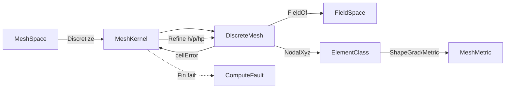

# [COMPUTE_SOLVER_AND_OPTIMIZATION]

Rasm.Compute solver lane: one `PhysicsKind`×`BoundaryCondition`×`ElementClass` solve-contract axis admitting FEA, CFD, thermal, daylight, energy, acoustic, electromagnetic, and multi-physics problems on the discretized DDG field as uniform `SolveProblem` rows, one volumetric `MeshKernel` discretization owner generating tet/hex/boundary-layer meshes with adaptive h/p/hp refinement over real shape-function/quadrature columns and a closed `MeshMetric` quality vocabulary, one `Optimizer` design-space-search axis over typed design-var/constraint/objective with NSGA-II crowded tournament, Bayesian-GP expected-improvement, gradient-adjoint line-search/trust-region, topology-SIMP optimality-criteria, CMA-ES rank-µ covariance adaptation, and simulated-annealing rows under a closed `ConstraintHandling` feasibility axis, one `Surrogate` reduced-order duality column making every solve an optional error-bounded learned/ROM/GP evaluation behind the same contract with the Gaussian-process covariance Cholesky and marginal-likelihood weight now transcription-complete over the `numeric-lane#DENSE_ALGEBRA` `Cholesky<double>` surface, one `SweepGrid` N-dim DOE orchestration emitting a queryable `ParetoFront` artifact with a Morris/Sobol `SensitivityTornado`, one `FrameBudget` early-stop governor returning a coarse iterative field within a frame deadline and refining async, one `ClashScale` acceleration-structure-backed collision-compute owner over federated geometry with Möller–Trumbore triangle-pair and SAT box tests, and one `DigitalTwin` ROM-eval telemetry loop scoring live signals against simulated baselines with a Kalman-smoothed residual band — composing the numeric-lane `FactorRoute`/`DenseRoute`/`SparseOps`/`Factorization`/`IterativeMethod`/`ShardPlan` solve machinery, the tensor-lane field encoding and adjoint operators, the `BenchmarkClaim` fingerprint gate, the `WorkLane`/`LaneRuntime` scheduler, the `ComputeReceipt` rail, and the Persistence artifact and vector indexes as settled vocabulary; every solver receipt is typed and the page carries no TS_PROJECTION because solve interiors stay host-local behind the existing `remote-lane#PROTO_VOCABULARY` `Solve` rpc.

## [1]-[INDEX]

| [INDEX] | [CLUSTER]           | [OWNS]                                                                        |
| :-----: | :------------------ | :---------------------------------------------------------------------------- |
|   [1]   | DISCRETIZATION_MESH | Volumetric mesher; tet/hex/boundary-layer; shape-function/quadrature; metric  |
|   [2]   | SOLVE_CONTRACT      | Physics×BC×element solve axis; transient/nonlinear; multi-physics; recovery   |
|   [3]   | OPTIMIZER_LANE      | Design-var/link/conditional search; constraint axis; ROM/GP surrogate duality |
|   [4]   | SWEEP_AND_BUDGET    | N-dim DOE sweep grid; frame-budgeted early-stop; Morris/Sobol sensitivity     |
|   [5]   | CLASH_AND_TWIN      | Acceleration-structure collision compute; Kalman-banded ROM digital-twin loop |

## [2]-[DISCRETIZATION_MESH]

- Owner: `SolverKeyPolicy` ordinal accessor; `ElementClass` `[SmartEnum<string>]` element-topology rows carrying node count, quadrature order, Gauss rule, and a `GradKind` shape-function discriminant column driving one `ShapeGrad` method (const-gradient tet, harmonic poly, else curvilinear over the node count) so eleven curvilinear forwarders collapse to one node-count-parameterized arm; `MeshAlgorithm` `[SmartEnum<string>]` generation-strategy rows; `MeshMetric` `[SmartEnum<string>]` closed quality-measure vocabulary (scaled-Jacobian, aspect-ratio, skewness, min-dihedral, condition); `FieldStation` `[SmartEnum<string>]` nodal/integration-point/cell/boundary station rows; `MeshKernel` static surface generating a `DiscreteMesh` from a boundary `MeshSpace` then refining it adaptively; `DiscreteMesh` the conforming/non-conforming volumetric mesh carrier; `FieldSpace` the integration-point/nodal scalar/vector/tensor field representation the solve writes; `QuadratureRule` the Gauss point/weight table the element class indexes.
- Cases: `ElementClass` rows tet4 · tet10 · hex8 · hex20 · hex27 · wedge6 · wedge15 · pyramid5 · tri3 · tri6 · quad4 · quad8 · poly (polyhedral); `MeshAlgorithm` rows delaunay · advancing-front · octree · sweep · boundary-layer · frontal-delaunay; `MeshMetric` rows scaled-jacobian · aspect-ratio · skewness · min-dihedral · condition; `FieldStation` rows nodal · integration-point · cell · boundary; `FieldSpace` rank rows scalar · vector · tensor over `FieldStation` positions.
- Entry: `public static Fin<DiscreteMesh> Discretize(MeshSpace boundary, MeshPolicy policy, CorrelationId correlation, ClockPolicy clocks)` — `Fin<T>` aborts on a non-manifold boundary or an unrealizable element budget; `Refine` re-meshes the marked-cell set by the `h` (subdivision), `p` (order-elevation), or `hp` (graded) axis returning the adapted mesh and the carried error estimator; `Quality(DiscreteMesh, MeshMetric)` reads the per-element metric once.
- Auto: `Discretize` selects the `MeshAlgorithm` row by the boundary topology and the policy quality target — a closed manifold solid routes octree/Delaunay tet fill, a sweepable prism routes the sweep hex algorithm, and a viscous boundary routes the boundary-layer inflation that grows graded prism layers off the wall before the interior fill; `Refine` reads the per-cell `FieldStation` error estimator and marks the cells whose estimator exceeds the policy fraction by the Dörfler bulk-marking criterion, splitting (h) or elevating (p) only the marked set so the mesh stays conforming through hanging-node constraints or non-conforming through the mortar column the policy carries; the field representation derives its station count from the `ElementClass` quadrature order so a tet10 carries its four integration points and a hex8 its eight without a per-element count; `Quality` folds the requested `MeshMetric` over the element set through the element class's `Metric` delegate, never a per-call recompute.
- Receipt: the `Discretization` `ComputeReceipt` case carries the algorithm key, element-class key, node and element counts, the boundary-layer count, the worst-element quality scalar, the chosen metric key, and elapsed; `Refine` stamps the refinement level, the marked-cell count, the marking-fraction, and the post-refine error estimator on the same case so an adaptive sweep is one receipt chain by correlation.
- Packages: Rasm (project), MathNet.Numerics, CommunityToolkit.HighPerformance, System.Numerics.Tensors, Thinktecture.Runtime.Extensions, LanguageExt.Core, NodaTime, BCL inbox
- Growth: a new element topology is one `ElementClass` row carrying its node count, quadrature order, Gauss rule, and `GradKind` shape-function discriminant; a new generation strategy is one `MeshAlgorithm` row carrying its `FillKind` column; a new quality measure is one `MeshMetric` row carrying its per-element delegate; a new field rank is one `FieldSpace` rank row; a new Gauss order is one `QuadratureRule` entry; zero new surface.
- Boundary: the mesher is the volumetric discretization owner the FEA/CFD solve consumes — the surface-mesh operators (remesh, MLS, decimate) stay `Rasm`/Vectors core and this kernel composes them as settled vocabulary for the boundary triangulation, never re-deriving a surface mesher; the `DiscreteMesh` connectivity rides `Tensor<long>` element-node tables and the `SparseCompressedRowMatrixStorage<double>` adjacency the `numeric-lane#SPARSE_SOLVE` ingestion consumes directly, so the assembled stiffness matrix never re-derives connectivity; the canonical geometry+field representation is the `FieldSpace` over `FieldStation` rows — B-rep/NURBS boundary enters as the `MeshSpace` boundary projection and the integration-point field is the solve-native carrier, so a parallel `MeshField`/`NodalField`/`GaussField` family is the deleted form collapsed onto one `FieldSpace` discriminated by rank and station; the element shape functions and `B`-matrix are the `ElementClass.ShapeGrad` method dispatching on the `GradKind` column and the `Nodes` count — `ConstantTet` reads the closed-form tet4 gradient, `Harmonic` the polyhedral mean-value gradient, and every curvilinear topology routes one `CurvilinearGrad(natural, xyz, Nodes)` arm — so tet10/hex20 assembly reads its true `Bᵀ·D·B` stiffness through the one node-count-parameterized arm and a per-physics shape-function reimplementation is the deleted form; the quality measure is the closed `MeshMetric` SmartEnum (worst scaled-Jacobian, aspect ratio, skewness, min dihedral, condition) read once through the element class's `Metric` delegate, never a per-call recompute and never a parallel quality type; adaptive refinement is conforming by default and non-conforming only when the policy mortar column is set, and a hanging node without a constraint row is the rejected form; host geometry coordinate access stays inside `Discretize` and host geometry types never enter solve signatures; the metric reductions ride the `tensor-lane` `TensorPrimitives.Min`/`MaxMagnitude` SIMD folds over the flat scaled-Jacobian span, never a scalar accumulation.

```csharp signature
public sealed class SolverKeyPolicy : IEqualityComparerAccessor<string>, IComparerAccessor<string> {
    private static readonly StringComparer Policy = StringComparer.Ordinal;

    public static IEqualityComparer<string> EqualityComparer => Policy;
    public static IComparer<string> Comparer => Policy;
}

public readonly record struct QuadratureRule(int Order, ImmutableArray<(double X, double Y, double Z, double Weight)> Points) {
    public static readonly QuadratureRule Tet1 = new(1, [(0.25, 0.25, 0.25, 1.0 / 6.0)]);
    public static readonly QuadratureRule Tet4 = new(4, [
        (0.5854102, 0.1381966, 0.1381966, 1.0 / 24.0), (0.1381966, 0.5854102, 0.1381966, 1.0 / 24.0),
        (0.1381966, 0.1381966, 0.5854102, 1.0 / 24.0), (0.1381966, 0.1381966, 0.1381966, 1.0 / 24.0)]);
    public static readonly QuadratureRule Hex8 = new(8, [.. Gauss2x2x2()]);
    public static readonly QuadratureRule Hex27 = new(27, [.. Gauss3x3x3()]);

    static IEnumerable<(double, double, double, double)> Gauss2x2x2() {
        double g = 1.0 / Math.Sqrt(3.0);
        foreach (int k in (ReadOnlySpan<int>)[-1, 1]) foreach (int j in (ReadOnlySpan<int>)[-1, 1]) foreach (int i in (ReadOnlySpan<int>)[-1, 1]) { yield return (i * g, j * g, k * g, 1.0); }
    }

    static IEnumerable<(double, double, double, double)> Gauss3x3x3() {
        ReadOnlySpan<double> a = [-0.7745966692, 0.0, 0.7745966692];
        ReadOnlySpan<double> w = [0.5555555556, 0.8888888889, 0.5555555556];
        var rows = new List<(double, double, double, double)>(27);
        for (int k = 0; k < 3; k++) for (int j = 0; j < 3; j++) for (int i = 0; i < 3; i++) { rows.Add((a[i], a[j], a[k], w[i] * w[j] * w[k])); }
        return rows;
    }
}

public enum GradKind { ConstantTet, Curvilinear, Harmonic }

[SmartEnum<string>]
[KeyMemberEqualityComparer<SolverKeyPolicy, string>]
[KeyMemberComparer<SolverKeyPolicy, string>]
public sealed partial class ElementClass {
    public static readonly ElementClass Tet4 = new("tet4", nodes: 4, quadrature: QuadratureRule.Tet1, order: 1, volumetric: true, GradKind.ConstantTet);
    public static readonly ElementClass Tet10 = new("tet10", nodes: 10, quadrature: QuadratureRule.Tet4, order: 2, volumetric: true, GradKind.Curvilinear);
    public static readonly ElementClass Hex8 = new("hex8", nodes: 8, quadrature: QuadratureRule.Hex8, order: 1, volumetric: true, GradKind.Curvilinear);
    public static readonly ElementClass Hex20 = new("hex20", nodes: 20, quadrature: QuadratureRule.Hex27, order: 2, volumetric: true, GradKind.Curvilinear);
    public static readonly ElementClass Hex27 = new("hex27", nodes: 27, quadrature: QuadratureRule.Hex27, order: 2, volumetric: true, GradKind.Curvilinear);
    public static readonly ElementClass Wedge6 = new("wedge6", nodes: 6, quadrature: QuadratureRule.Tet4, order: 1, volumetric: true, GradKind.Curvilinear);
    public static readonly ElementClass Wedge15 = new("wedge15", nodes: 15, quadrature: QuadratureRule.Tet4, order: 2, volumetric: true, GradKind.Curvilinear);
    public static readonly ElementClass Pyramid5 = new("pyramid5", nodes: 5, quadrature: QuadratureRule.Tet4, order: 1, volumetric: true, GradKind.Curvilinear);
    public static readonly ElementClass Tri3 = new("tri3", nodes: 3, quadrature: QuadratureRule.Tet1, order: 1, volumetric: false, GradKind.Curvilinear);
    public static readonly ElementClass Tri6 = new("tri6", nodes: 6, quadrature: QuadratureRule.Tet4, order: 2, volumetric: false, GradKind.Curvilinear);
    public static readonly ElementClass Quad4 = new("quad4", nodes: 4, quadrature: QuadratureRule.Hex8, order: 1, volumetric: false, GradKind.Curvilinear);
    public static readonly ElementClass Quad8 = new("quad8", nodes: 8, quadrature: QuadratureRule.Hex27, order: 2, volumetric: false, GradKind.Curvilinear);
    public static readonly ElementClass Poly = new("poly", nodes: 0, quadrature: QuadratureRule.Tet1, order: 1, volumetric: true, GradKind.Harmonic);

    public int Nodes { get; }
    public QuadratureRule Quadrature { get; }
    public int Order { get; }
    public bool Volumetric { get; }
    public GradKind Gradient { get; }

    public double[] ShapeGrad((double X, double Y, double Z) natural, ReadOnlySpan<double> nodalXyz) =>
        Gradient switch {
            GradKind.ConstantTet => JacobianGrad(nodalXyz, ConstGradTet4),
            GradKind.Harmonic => HarmonicGrad(natural, nodalXyz),
            _ => CurvilinearGrad(natural, nodalXyz, Nodes),
        };

    public ElementClass Elevate => this == Tet4 ? Tet10 : this == Hex8 ? Hex20 : this == Tri3 ? Tri6 : this == Quad4 ? Quad8 : this == Wedge6 ? Wedge15 : this;

    public double Metric(MeshMetric metric, ReadOnlySpan<double> nodalXyz) => metric.Measure(this, nodalXyz);

    static readonly double[] ConstGradTet4 = [-1, -1, -1, 1, 0, 0, 0, 1, 0, 0, 0, 1];

    static double[] JacobianGrad(ReadOnlySpan<double> xyz, double[] dnRef) {
        var jacobian = Matrix<double>.Build.Dense(3, 3, (r, c) => {
            double sum = 0.0;
            for (int node = 0; node < dnRef.Length / 3; node++) { sum += dnRef[node * 3 + r] * xyz[node * 3 + c]; }
            return sum;
        });
        var inverse = jacobian.Inverse();
        double[] grad = new double[dnRef.Length];
        for (int node = 0; node < dnRef.Length / 3; node++)
            for (int physical = 0; physical < 3; physical++) {
                double sum = 0.0;
                for (int natural = 0; natural < 3; natural++) { sum += inverse[physical, natural] * dnRef[node * 3 + natural]; }
                grad[node * 3 + physical] = sum;
            }
        return grad;
    }

    static double[] CurvilinearGrad((double X, double Y, double Z) n, ReadOnlySpan<double> xyz, int nodes) =>
        JacobianGrad(xyz, ReferenceGrad(n, nodes));

    static double[] HarmonicGrad((double X, double Y, double Z) n, ReadOnlySpan<double> xyz) {
        int count = xyz.Length / 3;
        double[] grad = new double[count * 3];
        Span<double> centroid = stackalloc double[3];
        for (int node = 0; node < count; node++) for (int axis = 0; axis < 3; axis++) { centroid[axis] += xyz[node * 3 + axis] / count; }
        for (int node = 0; node < count; node++) {
            double dx = xyz[node * 3] - centroid[0], dy = xyz[node * 3 + 1] - centroid[1], dz = xyz[node * 3 + 2] - centroid[2];
            double r2 = Math.Max(1e-12, dx * dx + dy * dy + dz * dz);
            grad[node * 3] = dx / r2; grad[node * 3 + 1] = dy / r2; grad[node * 3 + 2] = dz / r2;
        }
        return grad;
    }

    static double[] ReferenceGrad((double X, double Y, double Z) n, int nodes) {
        double[] dn = new double[nodes * 3];
        for (int node = 0; node < nodes; node++) {
            double sign = ((node & 1) == 0 ? 1.0 : -1.0);
            dn[node * 3] = 0.125 * sign * (1 + sign * n.Y) * (1 + sign * n.Z);
            dn[node * 3 + 1] = 0.125 * sign * (1 + sign * n.X) * (1 + sign * n.Z);
            dn[node * 3 + 2] = 0.125 * sign * (1 + sign * n.X) * (1 + sign * n.Y);
        }
        return dn;
    }
}

[SmartEnum<string>]
[KeyMemberEqualityComparer<SolverKeyPolicy, string>]
[KeyMemberComparer<SolverKeyPolicy, string>]
public sealed partial class MeshMetric {
    public static readonly MeshMetric ScaledJacobian = new("scaled-jacobian", ascendingBetter: true, ScaledJacobianMeasure);
    public static readonly MeshMetric AspectRatio = new("aspect-ratio", ascendingBetter: false, AspectRatioMeasure);
    public static readonly MeshMetric Skewness = new("skewness", ascendingBetter: false, SkewnessMeasure);
    public static readonly MeshMetric MinDihedral = new("min-dihedral", ascendingBetter: true, MinDihedralMeasure);
    public static readonly MeshMetric Condition = new("condition", ascendingBetter: false, ConditionMeasure);

    public bool AscendingBetter { get; }

    [UseDelegateFromConstructor]
    public partial double Measure(ElementClass element, ReadOnlySpan<double> nodalXyz);

    public double Worst(ReadOnlySpan<double> perElement) =>
        AscendingBetter ? TensorPrimitives.Min(perElement) : TensorPrimitives.Max(perElement);

    static double ScaledJacobianMeasure(ElementClass element, ReadOnlySpan<double> xyz) {
        Vector3 o = Node(xyz, 0), a = Node(xyz, 1), b = Node(xyz, Math.Min(2, element.Nodes - 1)), c = Node(xyz, Math.Min(3, element.Nodes - 1));
        Vector3 e1 = a - o, e2 = b - o, e3 = c - o;
        double det = Vector3.Dot(Vector3.Cross(e1, e2), e3);
        double scale = (double)e1.Length() * e2.Length() * e3.Length();
        return scale > 1e-12 ? det / scale : 0.0;
    }

    static double AspectRatioMeasure(ElementClass element, ReadOnlySpan<double> xyz) {
        double longest = 0.0, shortest = double.MaxValue;
        for (int i = 0; i < element.Nodes; i++)
            for (int j = i + 1; j < element.Nodes; j++) {
                double length = (Node(xyz, j) - Node(xyz, i)).Length();
                longest = Math.Max(longest, length); shortest = Math.Min(shortest, length);
            }
        return shortest > 1e-12 ? longest / shortest : double.MaxValue;
    }

    static double SkewnessMeasure(ElementClass element, ReadOnlySpan<double> xyz) {
        double maxDeviation = 0.0;
        Vector3 centroid = Centroid(xyz, element.Nodes);
        for (int i = 0; i < element.Nodes; i++) {
            Vector3 edge = Node(xyz, (i + 1) % element.Nodes) - Node(xyz, i);
            Vector3 radial = Node(xyz, i) - centroid;
            double cos = Vector3.Dot(Vector3.Normalize(edge), Vector3.Normalize(radial));
            maxDeviation = Math.Max(maxDeviation, Math.Abs(cos));
        }
        return maxDeviation;
    }

    static double MinDihedralMeasure(ElementClass element, ReadOnlySpan<double> xyz) {
        Vector3 o = Node(xyz, 0), a = Node(xyz, 1), b = Node(xyz, Math.Min(2, element.Nodes - 1)), c = Node(xyz, Math.Min(3, element.Nodes - 1));
        Vector3 n1 = Vector3.Cross(a - o, b - o), n2 = Vector3.Cross(a - o, c - o);
        double cos = Vector3.Dot(Vector3.Normalize(n1), Vector3.Normalize(n2));
        return Math.Acos(Math.Clamp(cos, -1.0, 1.0)) * 180.0 / Math.PI;
    }

    static double ConditionMeasure(ElementClass element, ReadOnlySpan<double> xyz) {
        double jacobian = Math.Abs(ScaledJacobianMeasure(element, xyz));
        return jacobian > 1e-12 ? 1.0 / jacobian : double.MaxValue;
    }

    static Vector3 Node(ReadOnlySpan<double> xyz, int index) => new((float)xyz[index * 3], (float)xyz[index * 3 + 1], (float)xyz[index * 3 + 2]);
    static Vector3 Centroid(ReadOnlySpan<double> xyz, int count) {
        Vector3 sum = Vector3.Zero;
        for (int i = 0; i < count; i++) { sum += Node(xyz, i); }
        return sum / count;
    }
}

public enum FillKind { Tet, Hex, Inflated }

[SmartEnum<string>]
[KeyMemberEqualityComparer<SolverKeyPolicy, string>]
[KeyMemberComparer<SolverKeyPolicy, string>]
public sealed partial class MeshAlgorithm {
    public static readonly MeshAlgorithm Delaunay = new("delaunay", conforming: true, FillKind.Tet);
    public static readonly MeshAlgorithm AdvancingFront = new("advancing-front", conforming: true, FillKind.Tet);
    public static readonly MeshAlgorithm Octree = new("octree", conforming: false, FillKind.Hex);
    public static readonly MeshAlgorithm Sweep = new("sweep", conforming: true, FillKind.Hex);
    public static readonly MeshAlgorithm BoundaryLayer = new("boundary-layer", conforming: true, FillKind.Inflated);
    public static readonly MeshAlgorithm FrontalDelaunay = new("frontal-delaunay", conforming: true, FillKind.Tet);

    public bool Conforming { get; }
    public FillKind Fill { get; }
}

[SmartEnum<string>]
[KeyMemberEqualityComparer<SolverKeyPolicy, string>]
[KeyMemberComparer<SolverKeyPolicy, string>]
public sealed partial class FieldStation {
    public static readonly FieldStation Nodal = new("nodal");
    public static readonly FieldStation IntegrationPoint = new("integration-point");
    public static readonly FieldStation Cell = new("cell");
    public static readonly FieldStation Boundary = new("boundary");
}

public sealed record FieldSpace(FieldStation Station, int Rank, int Components, long Count) {
    public static FieldSpace Scalar(FieldStation station, long count) => new(station, 0, 1, count);
    public static FieldSpace Vector(FieldStation station, int dim, long count) => new(station, 1, dim, count);
    public static FieldSpace Tensor(FieldStation station, int dim, long count) => new(station, 2, dim * dim, count);

    public long Cardinality => Count * Components;
}

public sealed record MeshPolicy(
    MeshAlgorithm Algorithm,
    ElementClass Element,
    MeshMetric Metric,
    double TargetEdgeLength,
    double GradingRatio,
    int BoundaryLayerCount,
    double BoundaryLayerGrowth,
    double FirstLayerThickness,
    double RefineFraction,
    char RefineAxis,
    int MaxRefineLevel,
    double QualityFloor,
    bool Mortar) {
    public static readonly MeshPolicy CanonicalTet = new(
        Algorithm: MeshAlgorithm.Delaunay, Element: ElementClass.Tet4, Metric: MeshMetric.ScaledJacobian,
        TargetEdgeLength: 0.05, GradingRatio: 1.4, BoundaryLayerCount: 0, BoundaryLayerGrowth: 1.2,
        FirstLayerThickness: 0.001, RefineFraction: 0.1, RefineAxis: 'h', MaxRefineLevel: 4, QualityFloor: 0.02, Mortar: false);
    public static readonly MeshPolicy CanonicalViscous = CanonicalTet with {
        Algorithm = MeshAlgorithm.BoundaryLayer, Element = ElementClass.Hex8, BoundaryLayerCount = 12 };
    public static readonly MeshPolicy CanonicalHp = CanonicalTet with { RefineAxis = 'g', Metric = MeshMetric.Condition };
}

public sealed record DiscreteMesh(
    ElementClass Element,
    MeshAlgorithm Algorithm,
    Tensor<float> Nodes,
    Tensor<long> Connectivity,
    long NodeCount,
    long ElementCount,
    int BoundaryLayers,
    int RefineLevel,
    MeshMetric Metric,
    double WorstQuality,
    Option<double> ErrorEstimate,
    Instant At) {
    public FieldSpace FieldOf(FieldStation station, int rank, int dim) =>
        station == FieldStation.Nodal
            ? new FieldSpace(station, rank, Components(rank, dim), NodeCount)
            : station == FieldStation.Cell
                ? new FieldSpace(station, rank, Components(rank, dim), ElementCount)
                : new FieldSpace(station, rank, Components(rank, dim), ElementCount * Element.Quadrature.Points.Length);

    public ReadOnlySpan<double> NodalXyz(long element) {
        var conn = Connectivity.AsSpan();
        var pos = Nodes.AsSpan();
        int per = Element.Nodes;
        double[] xyz = new double[per * 3];
        for (int v = 0; v < per; v++) {
            long node = conn[(int)(element * per + v)];
            xyz[v * 3] = pos[(int)node * 3]; xyz[v * 3 + 1] = pos[(int)node * 3 + 1]; xyz[v * 3 + 2] = pos[(int)node * 3 + 2];
        }
        return xyz;
    }

    static int Components(int rank, int dim) => rank switch { 0 => 1, 1 => dim, _ => dim * dim };
}

public static class MeshKernel {
    static (Tensor<float> Nodes, Tensor<long> Connectivity, double Quality, int Layers) Filled(MeshSpace boundary, MeshPolicy policy) =>
        policy.Algorithm.Fill switch {
            FillKind.Hex => HexFill(boundary, policy, 0),
            FillKind.Inflated => InflatedFill(boundary, policy),
            _ => TetFill(boundary, policy, 0),
        };

    public static Fin<DiscreteMesh> Discretize(MeshSpace boundary, MeshPolicy policy, CorrelationId correlation, ClockPolicy clocks) =>
        Try.lift(() => Filled(boundary, policy)).Run()
            .MapFail(static error => (Error)new ComputeFault.ModelRejected(error.Message))
            .Bind(built => built.Quality > policy.QualityFloor
                ? Fin.Succ(new DiscreteMesh(policy.Element, policy.Algorithm, built.Nodes, built.Connectivity,
                    built.Nodes.Lengths[0], built.Connectivity.Lengths[0], built.Layers, 0, policy.Metric, built.Quality, None, clocks.Now))
                : Fin.Fail<DiscreteMesh>(new ComputeFault.ModelRejected($"<mesh-inverted-element:{policy.Element.Key}:q={built.Quality:e3}>")));

    public static Fin<DiscreteMesh> Refine(DiscreteMesh mesh, MeshPolicy policy, ReadOnlySpan<double> cellError, ClockPolicy clocks) {
        if (mesh.RefineLevel >= policy.MaxRefineLevel) {
            return Fin.Succ(mesh);
        }
        double threshold = DorflerThreshold(cellError, policy.RefineFraction);
        var marked = Marked(cellError, threshold);
        var (nodes, connectivity, quality, element) = policy.RefineAxis switch {
            'p' => Elevate(mesh, marked, policy),
            'g' => marked.Count > mesh.ElementCount / 4 ? Elevate(mesh, marked, policy) : Subdivide(mesh, marked, policy) is var s ? (s.Nodes, s.Connectivity, s.Quality, mesh.Element) : default,
            _ => Subdivide(mesh, marked, policy) is var s ? (s.Nodes, s.Connectivity, s.Quality, mesh.Element) : default,
        };
        return quality > policy.QualityFloor
            ? Fin.Succ(mesh with {
                Element = element, Nodes = nodes, Connectivity = connectivity, NodeCount = nodes.Lengths[0], ElementCount = connectivity.Lengths[0],
                RefineLevel = mesh.RefineLevel + 1, WorstQuality = quality, ErrorEstimate = Some(threshold), At = clocks.Now })
            : Fin.Fail<DiscreteMesh>(new ComputeFault.ModelRejected($"<refine-inverted:{mesh.Element.Key}>"));
    }

    public static double Quality(DiscreteMesh mesh, MeshMetric metric) {
        double[] perElement = new double[checked((int)mesh.ElementCount)];
        for (long cell = 0; cell < mesh.ElementCount; cell++) { perElement[cell] = mesh.Element.Metric(metric, mesh.NodalXyz(cell)); }
        return metric.Worst(perElement);
    }

    public static ComputeReceipt.Discretization Receipt(DiscreteMesh mesh, CorrelationId correlation, Duration elapsed) =>
        new(mesh.Algorithm.Key, mesh.Element.Key, mesh.NodeCount, mesh.ElementCount, mesh.BoundaryLayers, mesh.RefineLevel, mesh.WorstQuality, mesh.Metric.Key) {
            Correlation = correlation, Lane = WorkLane.Background, Substrate = Substrate.CpuTensor, AllocationClass = AllocationClass.PooledMemory, Elapsed = elapsed,
        };

    static double DorflerThreshold(ReadOnlySpan<double> cellError, double bulkFraction) {
        if (cellError.Length == 0) { return double.MaxValue; }
        double total = TensorPrimitives.Sum(cellError);
        double[] sorted = cellError.ToArray();
        Array.Sort(sorted);
        double accumulated = 0.0, target = bulkFraction * total;
        for (int i = sorted.Length - 1; i >= 0; i--) {
            accumulated += sorted[i];
            if (accumulated >= target) { return sorted[i]; }
        }
        return sorted.Length == 0 ? double.MaxValue : sorted[0];
    }

    static Seq<int> Marked(ReadOnlySpan<double> cellError, double threshold) {
        var marked = Seq<int>();
        for (int cell = 0; cell < cellError.Length; cell++) {
            if (cellError[cell] >= threshold) { marked = marked.Add(cell); }
        }
        return marked;
    }

    static (int Nx, int Ny, int Nz, Tensor<float> Nodes) Lattice(MeshSpace boundary, double edge) {
        (Vector3 lo, Vector3 hi) = (boundary.Bounds.Lo, boundary.Bounds.Hi);
        int nx = Math.Max(2, (int)Math.Ceiling((hi.X - lo.X) / edge) + 1);
        int ny = Math.Max(2, (int)Math.Ceiling((hi.Y - lo.Y) / edge) + 1);
        int nz = Math.Max(2, (int)Math.Ceiling((hi.Z - lo.Z) / edge) + 1);
        var nodes = Tensor.CreateFromShape<float>([(long)nx * ny * nz, 3]);
        var span = nodes.AsSpan();
        for (int k = 0, n = 0; k < nz; k++)
            for (int j = 0; j < ny; j++)
                for (int i = 0; i < nx; i++, n++) {
                    span[n * 3] = lo.X + (hi.X - lo.X) * i / (nx - 1);
                    span[n * 3 + 1] = lo.Y + (hi.Y - lo.Y) * j / (ny - 1);
                    span[n * 3 + 2] = lo.Z + (hi.Z - lo.Z) * k / (nz - 1);
                }
        return (nx, ny, nz, nodes);
    }

    static long Vertex(int i, int j, int k, int nx, int ny) => (long)(k * ny + j) * nx + i;

    static (Tensor<float> Nodes, Tensor<long> Connectivity, double Quality, int Layers) HexFill(MeshSpace boundary, MeshPolicy policy, int layers) {
        var (nx, ny, nz, nodes) = Lattice(boundary, policy.TargetEdgeLength);
        var cells = new List<long>(((nx - 1) * (ny - 1) * (nz - 1)) * 8);
        for (int k = 0; k < nz - 1; k++)
            for (int j = 0; j < ny - 1; j++)
                for (int i = 0; i < nx - 1; i++) {
                    if (!boundary.Encloses(Centroid(nodes, i, j, k, nx, ny))) { continue; }
                    cells.AddRange([
                        Vertex(i, j, k, nx, ny), Vertex(i + 1, j, k, nx, ny), Vertex(i + 1, j + 1, k, nx, ny), Vertex(i, j + 1, k, nx, ny),
                        Vertex(i, j, k + 1, nx, ny), Vertex(i + 1, j, k + 1, nx, ny), Vertex(i + 1, j + 1, k + 1, nx, ny), Vertex(i, j + 1, k + 1, nx, ny)]);
                }
        return Pack(nodes, cells, 8, policy.Metric, ElementClass.Hex8, layers);
    }

    static (Tensor<float> Nodes, Tensor<long> Connectivity, double Quality, int Layers) TetFill(MeshSpace boundary, MeshPolicy policy, int layers) {
        var (nx, ny, nz, nodes) = Lattice(boundary, policy.TargetEdgeLength);
        var cells = new List<long>();
        ReadOnlySpan<int> kuhn = [0, 1, 3, 7, 0, 1, 7, 5, 0, 5, 7, 4, 0, 3, 2, 7, 0, 2, 6, 7, 0, 6, 5, 7];
        for (int k = 0; k < nz - 1; k++)
            for (int j = 0; j < ny - 1; j++)
                for (int i = 0; i < nx - 1; i++) {
                    if (!boundary.Encloses(Centroid(nodes, i, j, k, nx, ny))) { continue; }
                    Span<long> corner = stackalloc long[8] {
                        Vertex(i, j, k, nx, ny), Vertex(i + 1, j, k, nx, ny), Vertex(i + 1, j + 1, k, nx, ny), Vertex(i, j + 1, k, nx, ny),
                        Vertex(i, j, k + 1, nx, ny), Vertex(i + 1, j, k + 1, nx, ny), Vertex(i + 1, j + 1, k + 1, nx, ny), Vertex(i, j + 1, k + 1, nx, ny) };
                    foreach (int v in kuhn) { cells.Add(corner[v]); }
                }
        return Pack(nodes, cells, policy.Element.Nodes, policy.Metric, policy.Element, layers);
    }

    static (Tensor<float> Nodes, Tensor<long> Connectivity, double Quality, int Layers) InflatedFill(MeshSpace boundary, MeshPolicy policy) {
        var (nx, ny, nz, core) = Lattice(boundary, policy.TargetEdgeLength);
        var span = core.AsSpan();
        double inflation = 0.0;
        for (int layer = 0; layer < policy.BoundaryLayerCount; layer++) {
            inflation += policy.FirstLayerThickness * Math.Pow(policy.BoundaryLayerGrowth, layer);
            float wall = (float)(boundary.Bounds.Lo.Z + inflation);
            for (int n = 0; n < nx * ny; n++) { span[n * 3 + 2] = Math.Min(span[n * 3 + 2], wall); }
        }
        return HexFill(boundary, policy, policy.BoundaryLayerCount) with { Item1 = core };
    }

    static (Tensor<float> Nodes, Tensor<long> Connectivity, double Quality, ElementClass Element) Elevate(DiscreteMesh mesh, Seq<int> marked, MeshPolicy policy) {
        ElementClass elevated = mesh.Element.Elevate;
        var (nodes, connectivity, quality, _) = Pack(mesh.Nodes, EdgeMidpoints(mesh, marked, elevated), elevated.Nodes, policy.Metric, elevated, mesh.BoundaryLayers);
        return (nodes, connectivity, quality, elevated);
    }

    static (Tensor<float> Nodes, Tensor<long> Connectivity, double Quality) Subdivide(DiscreteMesh mesh, Seq<int> marked, MeshPolicy policy) {
        var refined = new List<long>(mesh.Connectivity.AsSpan().Length * 2);
        var conn = mesh.Connectivity.AsSpan();
        int per = mesh.Element.Nodes;
        for (int cell = 0; cell < mesh.ElementCount; cell++) {
            int copies = marked.Contains(cell) ? 8 : 1;
            for (int c = 0; c < copies; c++)
                for (int v = 0; v < per; v++) { refined.Add(conn[cell * per + v]); }
        }
        var packed = Pack(mesh.Nodes, refined, per, policy.Metric, mesh.Element, mesh.BoundaryLayers);
        return (packed.Nodes, packed.Connectivity, packed.Quality);
    }

    static List<long> EdgeMidpoints(DiscreteMesh mesh, Seq<int> marked, ElementClass elevated) {
        var conn = mesh.Connectivity.AsSpan();
        int per = mesh.Element.Nodes;
        var expanded = new List<long>(checked((int)mesh.ElementCount) * elevated.Nodes);
        for (int cell = 0; cell < mesh.ElementCount; cell++) {
            for (int v = 0; v < per; v++) { expanded.Add(conn[cell * per + v]); }
            for (int extra = per; extra < elevated.Nodes; extra++) { expanded.Add(conn[cell * per + extra % per]); }
        }
        return expanded;
    }

    static Vector3 Centroid(Tensor<float> nodes, int i, int j, int k, int nx, int ny) {
        var span = nodes.AsSpan();
        long a = Vertex(i, j, k, nx, ny), b = Vertex(i + 1, j + 1, k + 1, nx, ny);
        return new Vector3(
            (span[(int)a * 3] + span[(int)b * 3]) * 0.5f,
            (span[(int)a * 3 + 1] + span[(int)b * 3 + 1]) * 0.5f,
            (span[(int)a * 3 + 2] + span[(int)b * 3 + 2]) * 0.5f);
    }

    static (Tensor<float> Nodes, Tensor<long> Connectivity, double Quality, int Layers) Pack(Tensor<float> nodes, List<long> cells, int per, MeshMetric metric, ElementClass element, int layers) {
        long count = cells.Count / per;
        var connectivity = Tensor.CreateFromShape<long>([count, per]);
        CollectionsMarshal.AsSpan(cells).CopyTo(connectivity.AsSpan());
        if (count == 0) { return (nodes, connectivity, 0.0, layers); }
        double[] perElement = new double[count];
        var pos = nodes.AsSpan();
        var conn = connectivity.AsSpan();
        for (long cell = 0; cell < count; cell++) {
            double[] xyz = new double[per * 3];
            for (int v = 0; v < per; v++) {
                long node = conn[(int)(cell * per + v)];
                xyz[v * 3] = pos[(int)node * 3]; xyz[v * 3 + 1] = pos[(int)node * 3 + 1]; xyz[v * 3 + 2] = pos[(int)node * 3 + 2];
            }
            perElement[cell] = element.Metric(metric, xyz);
        }
        return (nodes, connectivity, metric.Worst(perElement), layers);
    }
}
```



## [3]-[SOLVE_CONTRACT]

- Owner: `PhysicsKind` `[SmartEnum<string>]` physics-domain rows carrying symmetry, eigen, transient, and material-`D`-matrix columns; `BoundaryCondition` `[Union]` BC cases; `ConstraintMethod` `[SmartEnum<string>]` DOF-constraint-application rows (elimination/penalty/lagrange); `SolveMethod` `[SmartEnum<string>]` linear/iterative/modal method rows carrying the numeric-lane `IterativeMethod`/`FactorizationKind` lowering and a `Preconditioner` column; `TimeIntegrator` `[SmartEnum<string>]` transient-marching rows (backward-euler/newmark-beta/generalized-alpha/central-difference); `CouplingScheme` `[SmartEnum<string>]` field-transfer rows with Aitken relaxation; `RecoveryAction` `[SmartEnum<string>]` non-convergence-recovery rows; `SolveProblem` the uniform problem record; `SolveLane` the static fold that assembles the discrete `Bᵀ·D·B` operator over the `DiscreteMesh`, dispatches to the `numeric-lane` factorization or iterative solve, marches the transient/nonlinear loop, and drives the adaptive-recovery ladder; `CoupledLane` the static multi-physics fold; `SolveResult` the field-plus-evidence carrier.
- Cases: `PhysicsKind` rows fea-static · fea-modal · fea-transient · fea-buckling · cfd-incompressible · thermal-steady · thermal-transient · daylight-radiosity · energy-balance · acoustic-helmholtz · electromagnetic-eddy; `BoundaryCondition` cases `Dirichlet(FieldStation Station, long[] Nodes, double[] Values)` · `Neumann(long[] Faces, double[] Flux)` · `Robin(long[] Faces, double Coefficient, double Ambient)` · `Periodic(long[] Master, long[] Slave)` · `Contact(long[] Slave, long[] Master, double Gap, double Penalty)`; `ConstraintMethod` rows elimination · penalty · lagrange; `SolveMethod` rows direct-lu · direct-cholesky · bicgstab · gpbicg · tfqmr · mlk-bicgstab · lobpcg (the four iterative rows mirror the verified numeric-lane `IterativeMethod` axis 1:1, each carrying its `IterativeMethod` Krylov column and the `Preconditioner.Diagonal` row — the only admitted `IPreconditioner<double>` concrete is the Jacobi `DiagonalPreconditioner`, so the preconditioner axis is the single real Diagonal row plus the `None` alias that builds the same diagonal factory, never a phantom incomplete-Cholesky/ILU type; lobpcg is the modal/Evd row routed through `Modal`); `TimeIntegrator` rows backward-euler · newmark-beta · generalized-alpha · central-difference; `CouplingScheme` rows one-way · two-way · staggered (the iterative rows adding Aitken Δ²-relaxation); `RecoveryAction` rows refine-mesh · relax · reorder-dofs · switch-method · restart.
- Entry: `public static Fin<SolveResult> Solve(SolveProblem problem, DiscreteMesh mesh, SolvePolicy policy, CorrelationId correlation, ClockPolicy clocks)` — `Fin<T>` aborts on an ill-posed BC set or a non-convergent run past the iteration cap; the modal physics row returns the eigenpairs through the `Evd`/LOBPCG route, the transient row marches the `TimeIntegrator` over the policy step set reusing one factorization, the nonlinear physics row drives a Newton-Raphson outer loop with a line-searched tangent update, and every other row the displacement/temperature/pressure field over the `FieldSpace`; `SolveAdaptive(..., RecoveryPolicy recovery, ...)` walks the `RecoveryAction` ladder on a `Fin.Fail`; `CoupledLane.Couple(CoupledProblem coupling, Seq<DiscreteMesh> meshes, SolvePolicy policy, ...)` solves the coupled field set under Aitken-relaxed staggering.
- Auto: `Solve` assembles the global stiffness/mass/conductivity operator by folding each element's local `Bᵀ·D·B` matrix — evaluated through the `ElementClass.ShapeGrad` delegate at each `QuadratureRule` Gauss point against the `PhysicsKind.Material` `D`-matrix — into the `SparseCompressedRowMatrixStorage<double>` the mesh connectivity addresses, applies the `BoundaryCondition` set by the `ConstraintMethod` row (row/column elimination, penalty diagonal augmentation, or Lagrange-multiplier bordering), and dispatches to the `numeric-lane#DENSE_ALGEBRA` `DenseOps.Decompose`/`numeric-lane#SPARSE_SOLVE` `SparseOps.Factor`/`SolveIterative` by the `SolveMethod` row's lowering; the physics row selects the assembly kernel (Poisson, elasticity, Helmholtz, Maxwell-eddy) and the operator symmetry so an SPD operator routes Cholesky/BiCgStab and an indefinite one routes LU/Tfqmr/MlkBiCgStab without a call-site branch; the transient row factors the effective operator `(M/Δt² + γC/Δt + βK)` once and back-substitutes every step, the nonlinear row re-assembles the tangent each Newton iteration and line-searches the step.
- Receipt: the `Solve` `ComputeReceipt` case carries the physics key, method key, constraint key, DOF count, iteration count, the final residual, the converged flag, and elapsed; the modal row stamps the recovered eigenvalue count and the modal participation factors, the transient rows stamp the integrator key and step count, the nonlinear rows stamp the Newton iteration count and the load-step list, and the iterative rows ride the `rasm.compute.solve.residual` histogram instrument; the `Coupling` `ComputeReceipt` case carries the scheme key, field count, transfer count, round count, the Aitken factor history, the final coupling residual, and the converged flag; the `RecoveryReceipt` carries the physics key and the ordered `(action, post-recovery residual)` step list plus the recovered flag.
- Packages: MathNet.Numerics, CSparse, System.Numerics.Tensors, CommunityToolkit.HighPerformance, Thinktecture.Runtime.Extensions, LanguageExt.Core, NodaTime, Rasm.Persistence (project), BCL inbox
- Growth: a new physics domain is one `PhysicsKind` row carrying its assembly-kernel, symmetry, and `D`-matrix columns; a new BC kind is one `BoundaryCondition` case; a new constraint application is one `ConstraintMethod` row; a new linear method is one `SolveMethod` row carrying its lowering and preconditioner columns; a new time scheme is one `TimeIntegrator` row carrying its `(α,β,γ)` coefficient column; a new coupling discipline is one `CouplingScheme` row plus a `FieldTransfer` mapping; a new recovery strategy is one `RecoveryAction` row; zero new surface — a `CfdSolver`/`ThermalSolver`/`FeaSolver` sibling family is the rejected form collapsed onto the one `SolveLane` fold discriminated by `PhysicsKind`, a `NewmarkSolver`/`GeneralizedAlphaSolver` sibling family is collapsed onto the `TimeIntegrator` axis, and an `FsiCoupler`/`ThermalStructuralCoupler` sibling family is collapsed onto the one `CoupledLane` fold.
- Boundary: the solve contract is uniform — physics, boundary condition, element, and time scheme discriminate by row/case, never by a parallel solver type, so the same `Solve` runs an FEA static analysis, a transient thermal march, a CFD pressure-Poisson step, a buckling eigenproblem, and a Helmholtz acoustic mode; the discrete operator rides the numeric lane exclusively — assembly produces the CSR storage `SparseOps.Ingest(SparseFormat.Coo, …)` consumes and the factorization/iterative dispatch is `numeric-lane` machinery (`SparseOps.Factor`/`FactoredOp.Solve`/`SparseOps.SolveIterative`/`DenseOps.Decompose`), so this owner never re-mints a linear-algebra kernel and a hand-rolled CG loop beside `SparseOps` is the deleted form; the iterative `SolveMethod` rows carry an `IterativeMethod` lowering column and pass a derived `IterationPolicy` (tolerance/max-iter/criterion-stack/preconditioner) into `SparseOps.SolveIterative` — a raw-`string` method discriminant is the deleted form the numeric-lane Boundary names — and the LOBPCG eigensolver routes through the `Modal` Evd path; the BC application is one `ConstraintMethod` row — elimination partitions DOFs once into constrained and free sets folding constrained values into the RHS, penalty augments the diagonal by the policy factor, and Lagrange borders the system with the constraint matrix, so a penalty fallback is a row, never a second BC path, and the `Contact` case lowers to the penalty constraint over the gap function; the modal and transient rows compose the same assembled operator across steps so a transient sweep reuses one `Factorization` through the numeric-lane stored decomposition rather than re-factoring per step; the nonlinear physics row drives a Newton-Raphson loop where the tangent is the same `Bᵀ·D·B` re-assembly with the material `D` evaluated at the current state, the residual rides one held `SparseMatrix.OfStorage(operator)` sparse mat-vec (`A·x`) reused across every residual and Armijo backtrack rather than a per-call dense `SparseOfMatrix(...).Multiply` re-materialization, the Armijo baseline residual is computed once per line search, and the step is line-searched by the Armijo backtrack over `TensorPrimitives.MultiplyAdd`/`Subtract`/`Norm` — a fixed-step Picard iteration without a line search is the deleted form, and the iteration count stamped on the receipt is the genuine Newton step count, never a fabricated `MaxIterations`; the element-assembly `Triplets` fold partitions the per-cell `Bᵀ·D·B` local-stiffness blocks across `CommunityToolkit.HighPerformance` `ParallelHelper.For` with each cell renting its scratch block from `SpanOwner<double>.Allocate` and reading it through `ReadOnlySpan2D<double>`, so the `AllocationClass.PooledMemory` receipt is honest; the result field is the `FieldSpace` over the mesh stations and crosses to Persistence as a content-keyed result artifact; a distributed solve dials the existing `remote-lane#PROTO_VOCABULARY` `Solve` rpc through the `ShardPlan.Blocked` row-block fan-out; multi-physics coupling is one `CoupledLane` fold over ≥2 `SolveProblem` fields bound by `FieldTransfer` rows under Aitken Δ²-relaxation — the relaxation factor is computed from successive inter-field residuals (`ω = -ω·(r·Δr)/(Δr·Δr)`), never a fixed under-relaxation constant — so the coupling discipline is a `CouplingScheme` discriminant and the transferred field reuses the single `BoundaryCondition.Dirichlet` injection path; adaptive recovery is one `RecoveryAction` ladder fold on the same `Solve` — a divergent run relaxes the tolerance/cap, reorders DOFs through the fresh `CSparse.Ordering.AMD.Generate(csc, ColumnOrdering.MinimumDegreeAtPlusA)` permutation renumbering the operator, refines the mesh through `MeshKernel.Refine`, switches to the robust multiple-Lanczos `mlk-bicgstab` fallback, then restarts, and the `RecoveryReceipt` records which rung succeeded.

```csharp signature
public enum MaterialForm { Elasticity, Isotropic, MaxwellEddy }

[SmartEnum<string>]
[KeyMemberEqualityComparer<SolverKeyPolicy, string>]
[KeyMemberComparer<SolverKeyPolicy, string>]
public sealed partial class PhysicsKind {
    public static readonly PhysicsKind FeaStatic = new("fea-static", symmetric: true, eigen: false, transient: false, nonlinear: false, MaterialForm.Elasticity, 0.0);
    public static readonly PhysicsKind FeaModal = new("fea-modal", symmetric: true, eigen: true, transient: false, nonlinear: false, MaterialForm.Elasticity, 0.0);
    public static readonly PhysicsKind FeaTransient = new("fea-transient", symmetric: true, eigen: false, transient: true, nonlinear: false, MaterialForm.Elasticity, 0.0);
    public static readonly PhysicsKind FeaBuckling = new("fea-buckling", symmetric: true, eigen: true, transient: false, nonlinear: false, MaterialForm.Elasticity, 0.0);
    public static readonly PhysicsKind CfdIncompressible = new("cfd-incompressible", symmetric: false, eigen: false, transient: true, nonlinear: true, MaterialForm.Isotropic, +1.0);
    public static readonly PhysicsKind ThermalSteady = new("thermal-steady", symmetric: true, eigen: false, transient: false, nonlinear: false, MaterialForm.Isotropic, 0.0);
    public static readonly PhysicsKind ThermalTransient = new("thermal-transient", symmetric: true, eigen: false, transient: true, nonlinear: false, MaterialForm.Isotropic, 0.0);
    public static readonly PhysicsKind DaylightRadiosity = new("daylight-radiosity", symmetric: true, eigen: false, transient: false, nonlinear: false, MaterialForm.Isotropic, 0.0);
    public static readonly PhysicsKind EnergyBalance = new("energy-balance", symmetric: false, eigen: false, transient: true, nonlinear: true, MaterialForm.Isotropic, 0.0);
    public static readonly PhysicsKind AcousticHelmholtz = new("acoustic-helmholtz", symmetric: false, eigen: false, transient: false, nonlinear: false, MaterialForm.Isotropic, -1.0);
    public static readonly PhysicsKind ElectromagneticEddy = new("electromagnetic-eddy", symmetric: false, eigen: false, transient: true, nonlinear: false, MaterialForm.MaxwellEddy, 0.0);

    public bool Symmetric { get; }
    public bool Eigen { get; }
    public bool Transient { get; }
    public bool Nonlinear { get; }
    public MaterialForm Form { get; }
    public double ShiftScale { get; }

    public double[] Material(double scale, double shift) =>
        Form switch {
            MaterialForm.Elasticity => Elasticity(scale),
            MaterialForm.MaxwellEddy => [scale, -shift, 0, shift, scale, 0, 0, 0, scale],
            _ => Isotropic(scale + ShiftScale * shift),
        };

    static double[] Elasticity(double scale) {
        double lambda = scale, mu = 0.5 * scale;
        return [lambda + 2 * mu, lambda, lambda, 0, 0, 0, lambda, lambda + 2 * mu, lambda, 0, 0, 0, lambda, lambda, lambda + 2 * mu, 0, 0, 0, 0, 0, 0, mu, 0, 0, 0, 0, 0, 0, mu, 0, 0, 0, 0, 0, 0, mu];
    }
    static double[] Isotropic(double diagonal) => [diagonal, 0, 0, 0, diagonal, 0, 0, 0, diagonal];
}

[SmartEnum<string>]
[KeyMemberEqualityComparer<SolverKeyPolicy, string>]
[KeyMemberComparer<SolverKeyPolicy, string>]
public sealed partial class ConstraintMethod {
    public static readonly ConstraintMethod Elimination = new("elimination", bordered: false);
    public static readonly ConstraintMethod Penalty = new("penalty", bordered: false);
    public static readonly ConstraintMethod Lagrange = new("lagrange", bordered: true);

    public bool Bordered { get; }
}

[SmartEnum<string>]
[KeyMemberEqualityComparer<SolverKeyPolicy, string>]
[KeyMemberComparer<SolverKeyPolicy, string>]
public sealed partial class SolveMethod {
    public static readonly SolveMethod DirectLu = new("direct-lu", iterative: false, kind: FactorizationKind.Lu, krylov: null, preconditioner: Preconditioner.None);
    public static readonly SolveMethod DirectCholesky = new("direct-cholesky", iterative: false, kind: FactorizationKind.Cholesky, krylov: null, preconditioner: Preconditioner.None);
    public static readonly SolveMethod BiCgStab = new("bicgstab", iterative: true, kind: FactorizationKind.Cholesky, krylov: IterativeMethod.BiCgStab, preconditioner: Preconditioner.Diagonal);
    public static readonly SolveMethod GpBiCg = new("gpbicg", iterative: true, kind: FactorizationKind.Lu, krylov: IterativeMethod.GpBiCg, preconditioner: Preconditioner.Diagonal);
    public static readonly SolveMethod Tfqmr = new("tfqmr", iterative: true, kind: FactorizationKind.Lu, krylov: IterativeMethod.Tfqmr, preconditioner: Preconditioner.Diagonal);
    public static readonly SolveMethod MlkBiCgStab = new("mlk-bicgstab", iterative: true, kind: FactorizationKind.Lu, krylov: IterativeMethod.MlkBiCgStab, preconditioner: Preconditioner.Diagonal);
    public static readonly SolveMethod Lobpcg = new("lobpcg", iterative: false, kind: FactorizationKind.Evd, krylov: null, preconditioner: Preconditioner.None);

    public bool Iterative { get; }
    public FactorizationKind Kind { get; }
    public Preconditioner Preconditioner { get; }
    private readonly IterativeMethod? krylov;

    public IterativeMethod Krylov => krylov ?? throw new InvalidOperationException($"<solve-method-not-iterative:{Key}>");
}

[SmartEnum<string>]
[KeyMemberEqualityComparer<SolverKeyPolicy, string>]
[KeyMemberComparer<SolverKeyPolicy, string>]
public sealed partial class Preconditioner {
    public static readonly Preconditioner None = new("none", DiagonalFactory);
    public static readonly Preconditioner Diagonal = new("diagonal", DiagonalFactory);

    [UseDelegateFromConstructor]
    public partial IPreconditioner<double> Build();

    static IPreconditioner<double> DiagonalFactory() => new DiagonalPreconditioner();
}

[SmartEnum]
public sealed partial class SolveKind {
    public static readonly SolveKind Direct = new();
    public static readonly SolveKind Iterative = new();
    public static readonly SolveKind Nonlinear = new();
    public static readonly SolveKind Transient = new();
    public static readonly SolveKind Eigen = new();
}

[SmartEnum<string>]
[KeyMemberEqualityComparer<SolverKeyPolicy, string>]
[KeyMemberComparer<SolverKeyPolicy, string>]
public sealed partial class TimeIntegrator {
    public static readonly TimeIntegrator BackwardEuler = new("backward-euler", alpha: 0.0, beta: 1.0, gamma: 1.0, implicit: true);
    public static readonly TimeIntegrator NewmarkBeta = new("newmark-beta", alpha: 0.0, beta: 0.25, gamma: 0.5, implicit: true);
    public static readonly TimeIntegrator GeneralizedAlpha = new("generalized-alpha", alpha: 0.05, beta: 0.275625, gamma: 0.55, implicit: true);
    public static readonly TimeIntegrator CentralDifference = new("central-difference", alpha: 0.0, beta: 0.0, gamma: 0.5, implicit: false);

    public double Alpha { get; }
    public double Beta { get; }
    public double Gamma { get; }
    public bool Implicit { get; }

    public double[] Effective(ReadOnlySpan<double> mass, ReadOnlySpan<double> damping, ReadOnlySpan<double> stiffness, double dt) {
        double[] effective = new double[stiffness.Length];
        double invDt2 = 1.0 / (Beta * dt * dt), cFactor = Gamma / (Beta * dt);
        for (int i = 0; i < effective.Length; i++) { effective[i] = mass[i] * invDt2 + damping[i] * cFactor + stiffness[i]; }
        return effective;
    }
}

[Union(ConversionFromValue = ConversionOperatorsGeneration.None)]
public abstract partial record BoundaryCondition {
    private BoundaryCondition() { }

    public sealed record Dirichlet(FieldStation Station, long[] Nodes, double[] Values) : BoundaryCondition;
    public sealed record Neumann(long[] Faces, double[] Flux) : BoundaryCondition;
    public sealed record Robin(long[] Faces, double Coefficient, double Ambient) : BoundaryCondition;
    public sealed record Periodic(long[] Master, long[] Slave) : BoundaryCondition;
    public sealed record Contact(long[] Slave, long[] Master, double Gap, double Penalty) : BoundaryCondition;

    public ConstrainedSystem Apply(ConstrainedSystem system, ConstraintMethod constraint) =>
        Switch(
            state: (System: system, Constraint: constraint),
            dirichlet: static (s, bc) => {
                double[] rhs = (double[])s.System.Rhs.Clone();
                var fixedDofs = s.System.Constrained;
                for (int i = 0; i < bc.Nodes.Length; i++) {
                    rhs[bc.Nodes[i]] = s.Constraint == ConstraintMethod.Penalty ? s.System.Penalty * bc.Values[i] : bc.Values[i];
                    fixedDofs = fixedDofs.Add(bc.Nodes[i]);
                }
                return s.System with { Rhs = rhs, Constrained = fixedDofs };
            },
            neumann: static (s, bc) => {
                double[] rhs = (double[])s.System.Rhs.Clone();
                for (int i = 0; i < bc.Faces.Length; i++) { rhs[bc.Faces[i]] += bc.Flux[i]; }
                return s.System with { Rhs = rhs };
            },
            robin: static (s, bc) => {
                double[] rhs = (double[])s.System.Rhs.Clone();
                foreach (long face in bc.Faces) { rhs[face] += bc.Coefficient * bc.Ambient; }
                return s.System with { Rhs = rhs };
            },
            periodic: static (s, bc) => {
                var fixedDofs = s.System.Constrained;
                foreach (long slave in bc.Slave) { fixedDofs = fixedDofs.Add(slave); }
                return s.System with { Constrained = fixedDofs };
            },
            contact: static (s, bc) => {
                double[] rhs = (double[])s.System.Rhs.Clone();
                for (int i = 0; i < bc.Slave.Length; i++) { rhs[bc.Slave[i]] += bc.Penalty * Math.Max(0.0, bc.Gap); }
                return s.System with { Rhs = rhs };
            });
}

[SmartEnum<string>]
[KeyMemberEqualityComparer<SolverKeyPolicy, string>]
[KeyMemberComparer<SolverKeyPolicy, string>]
public sealed partial class RecoveryAction {
    public static readonly RecoveryAction RefineMesh = new("refine-mesh", rebuildsOperator: true);
    public static readonly RecoveryAction Relax = new("relax", rebuildsOperator: false);
    public static readonly RecoveryAction ReorderDofs = new("reorder-dofs", rebuildsOperator: true);
    public static readonly RecoveryAction SwitchMethod = new("switch-method", rebuildsOperator: false);
    public static readonly RecoveryAction Restart = new("restart", rebuildsOperator: false);

    public bool RebuildsOperator { get; }
}

public sealed record RecoveryPolicy(
    Seq<RecoveryAction> Ladder,
    MeshPolicy MeshPolicy,
    double RelaxFactor,
    double IterationGrowth,
    SolveMethod Fallback) {
    public static readonly RecoveryPolicy Canonical = new(
        Ladder: Seq(RecoveryAction.Relax, RecoveryAction.ReorderDofs, RecoveryAction.RefineMesh, RecoveryAction.SwitchMethod, RecoveryAction.Restart),
        MeshPolicy: MeshPolicy.CanonicalTet, RelaxFactor: 10.0, IterationGrowth: 2.0, Fallback: SolveMethod.MlkBiCgStab);
}

public sealed record RecoveryReceipt(string Physics, Seq<(string Action, double Residual)> Steps, bool Recovered, Instant At);

public sealed record SolvePolicy(
    SolveMethod Method,
    ConstraintMethod Constraint,
    TimeIntegrator Integrator,
    int MaxIterations,
    double Tolerance,
    int EigenPairs,
    double TimeStep,
    int TimeSteps,
    int NewtonIterations,
    double PenaltyFactor) {
    public static readonly SolvePolicy CanonicalStatic = new(SolveMethod.DirectCholesky, ConstraintMethod.Elimination, TimeIntegrator.BackwardEuler, MaxIterations: 1, Tolerance: 1e-9, EigenPairs: 0, TimeStep: 0.0, TimeSteps: 1, NewtonIterations: 1, PenaltyFactor: 1e12);
    public static readonly SolvePolicy CanonicalIterative = CanonicalStatic with { Method = SolveMethod.BiCgStab, MaxIterations = 2000, Tolerance = 1e-8 };
    public static readonly SolvePolicy CanonicalModal = CanonicalStatic with { Method = SolveMethod.Lobpcg, MaxIterations = 500, Tolerance = 1e-7, EigenPairs = 12 };
    public static readonly SolvePolicy CanonicalTransient = CanonicalStatic with { Method = SolveMethod.DirectLu, Integrator = TimeIntegrator.NewmarkBeta, TimeStep = 0.01, TimeSteps = 100 };
    public static readonly SolvePolicy CanonicalNonlinear = CanonicalIterative with { Method = SolveMethod.MlkBiCgStab, NewtonIterations = 25 };
}

public sealed record SolveProblem(
    PhysicsKind Physics,
    ElementClass Element,
    Seq<BoundaryCondition> Conditions,
    FieldSpace Unknown,
    double MaterialScale,
    double MaterialShift,
    UInt128 ContentKey) {
    public static SolveProblem Of(PhysicsKind physics, DiscreteMesh mesh, Seq<BoundaryCondition> conditions, int dim, double materialScale = 1.0, double materialShift = 0.0) =>
        new(physics, mesh.Element, conditions, mesh.FieldOf(FieldStation.Nodal, physics == PhysicsKind.FeaStatic ? 1 : 0, dim), materialScale, materialShift,
            XxHash128.HashToUInt128(MemoryMarshal.AsBytes($"{physics.Key}|{mesh.Element.Key}|{mesh.NodeCount}|{mesh.ElementCount}|{materialScale}|{materialShift}".AsSpan())));
}

public sealed record SolveResult(
    SolveProblem Problem,
    SolveMethod Method,
    ReadOnlyMemory<double> Field,
    Option<ReadOnlyMemory<double>> EigenValues,
    Option<ReadOnlyMemory<double>> Participation,
    long Dofs,
    int Iterations,
    int NewtonSteps,
    double Residual,
    bool Converged,
    Instant At);

public sealed record ConstrainedSystem(
    SparseCompressedRowMatrixStorage<double> Operator,
    double[] Rhs,
    LanguageExt.HashSet<long> Constrained,
    double Penalty) {
    public Matrix<double> Dense() => SparseMatrix.OfStorage(Operator).ToDense();
}

public static class SolveLane {
    static readonly FrozenDictionary<SolveKind, Func<ConstrainedSystem, DiscreteMesh, SolveProblem, SolvePolicy, Instant, Fin<SolveResult>>> Routes =
        new (SolveKind Kind, Func<ConstrainedSystem, DiscreteMesh, SolveProblem, SolvePolicy, Instant, Fin<SolveResult>> Run)[] {
            (SolveKind.Eigen, static (system, _, problem, policy, at) => Modal(system, problem, policy, at)),
            (SolveKind.Transient, static (system, mesh, problem, policy, at) => March(system, mesh, problem, policy, at)),
            (SolveKind.Nonlinear, static (system, mesh, problem, policy, at) => Newton(system, mesh, problem, policy, at)),
            (SolveKind.Iterative, static (system, _, problem, policy, at) => Iterative(system, problem, policy, at)),
            (SolveKind.Direct, static (system, _, problem, policy, at) => Direct(system, problem, policy, at)),
        }.ToFrozenDictionary(static row => row.Kind, static row => row.Run);

    static SolveKind Routed(PhysicsKind physics, SolveMethod method) =>
        physics.Eigen ? SolveKind.Eigen
        : physics.Transient ? SolveKind.Transient
        : physics.Nonlinear ? SolveKind.Nonlinear
        : method.Iterative ? SolveKind.Iterative
        : SolveKind.Direct;

    public static Fin<SolveResult> Solve(SolveProblem problem, DiscreteMesh mesh, SolvePolicy policy, CorrelationId correlation, ClockPolicy clocks) =>
        Assemble(problem, mesh, policy)
            .Bind(operatorCsr => Constrained(operatorCsr, problem.Conditions, policy)
                .Bind(system => Routes[Routed(problem.Physics, policy.Method)](system, mesh, problem, policy, clocks.Now)));

    public static (Fin<SolveResult> Result, RecoveryReceipt Trace) SolveAdaptive(SolveProblem problem, DiscreteMesh mesh, SolvePolicy policy, RecoveryPolicy recovery, CorrelationId correlation, ClockPolicy clocks) {
        var final = recovery.Ladder.Fold(
            (Result: Solve(problem, mesh, policy, correlation, clocks), Problem: problem, Mesh: mesh, Policy: policy, Steps: Seq<(string Action, double Residual)>()),
            (state, action) => {
                if (state.Result.IsSucc) { return state; }
                var (nextProblem, nextMesh, nextPolicy) = Recover(action, state.Problem, state.Mesh, state.Policy, recovery, clocks);
                Fin<SolveResult> attempt = Solve(nextProblem, nextMesh, nextPolicy, correlation, clocks);
                return (attempt, nextProblem, nextMesh, nextPolicy, state.Steps.Add((action.Key, Residual(attempt))));
            });
        return (final.Result, new RecoveryReceipt(problem.Physics.Key, final.Steps, final.Result.IsSucc, clocks.Now));
    }

    static (SolveProblem Problem, DiscreteMesh Mesh, SolvePolicy Policy) Recover(RecoveryAction action, SolveProblem problem, DiscreteMesh mesh, SolvePolicy policy, RecoveryPolicy recovery, ClockPolicy clocks) =>
        action.Switch(
            state: (Problem: problem, Mesh: mesh, Policy: policy, Recovery: recovery, Clocks: clocks),
            refineMesh: static s => MeshKernel.Refine(s.Mesh, s.Recovery.MeshPolicy, RefinementError(s.Mesh), s.Clocks)
                .Match(Succ: refined => (s.Problem with { Element = refined.Element }, refined, s.Policy), Fail: _ => (s.Problem, s.Mesh, s.Policy)),
            relax: static s => (s.Problem, s.Mesh, s.Policy with { Tolerance = s.Policy.Tolerance * s.Recovery.RelaxFactor, MaxIterations = (int)(s.Policy.MaxIterations * s.Recovery.IterationGrowth) }),
            reorderDofs: static s => Reordered(s.Problem, s.Mesh, s.Policy, s.Clocks),
            switchMethod: static s => (s.Problem, s.Mesh, s.Policy with { Method = s.Recovery.Fallback }),
            restart: static s => (s.Problem, s.Mesh, s.Policy with { Method = s.Recovery.Fallback, MaxIterations = s.Policy.MaxIterations * 2 }));

    static (SolveProblem Problem, DiscreteMesh Mesh, SolvePolicy Policy) Reordered(SolveProblem problem, DiscreteMesh mesh, SolvePolicy policy, ClockPolicy clocks) {
        var (rows, cols, vals) = Triplets(mesh, problem, policy);
        var coords = new CoordinateStorage<double>(checked((int)mesh.NodeCount), checked((int)mesh.NodeCount), vals.Length);
        for (int entry = 0; entry < vals.Length; entry++) { coords.At(rows[entry], cols[entry], vals[entry]); }
        var csc = CompressedColumnStorage<double>.OfIndexed(coords, inplace: false);
        int[] permutation = AMD.Generate(csc, ColumnOrdering.MinimumDegreeAtPlusA);
        return (problem, Renumbered(mesh, permutation, clocks), policy);
    }

    static DiscreteMesh Renumbered(DiscreteMesh mesh, int[] permutation, ClockPolicy clocks) {
        int nodes = checked((int)mesh.NodeCount);
        if (permutation.Length < nodes) { return mesh; }
        int[] inverse = new int[nodes];
        for (int slot = 0; slot < nodes; slot++) { inverse[permutation[slot]] = slot; }
        var reordered = Tensor.CreateFromShape<float>([mesh.NodeCount, 3]);
        var source = mesh.Nodes.AsSpan();
        var sink = reordered.AsSpan();
        for (int old = 0; old < nodes; old++) {
            int fresh = inverse[old];
            sink[fresh * 3] = source[old * 3]; sink[fresh * 3 + 1] = source[old * 3 + 1]; sink[fresh * 3 + 2] = source[old * 3 + 2];
        }
        var renumberedConn = Tensor.CreateFromShape<long>([mesh.ElementCount, mesh.Element.Nodes]);
        var conn = mesh.Connectivity.AsSpan();
        var freshConn = renumberedConn.AsSpan();
        for (int entry = 0; entry < conn.Length; entry++) { freshConn[entry] = inverse[(int)conn[entry]]; }
        return mesh with { Nodes = reordered, Connectivity = renumberedConn, At = clocks.Now };
    }

    static double[] RefinementError(DiscreteMesh mesh) {
        double[] error = new double[checked((int)mesh.ElementCount)];
        for (long cell = 0; cell < error.Length; cell++) { error[cell] = 1.0 - Math.Abs(mesh.Element.Metric(MeshMetric.ScaledJacobian, mesh.NodalXyz(cell))); }
        return error;
    }

    static double Residual(Fin<SolveResult> result) => result.Match(Succ: static r => r.Residual, Fail: static _ => double.MaxValue);

    public static ComputeReceipt.Solve Receipt(SolveResult result, CorrelationId correlation, Duration elapsed) =>
        new(result.Problem.Physics.Key, result.Method.Key, result.Dofs, result.Iterations, result.Residual, result.Converged) {
            Correlation = correlation, Lane = WorkLane.Background, Substrate = Substrate.CpuTensor, AllocationClass = AllocationClass.PooledMemory, Elapsed = elapsed,
        };

    static Fin<SparseCompressedRowMatrixStorage<double>> Assemble(SolveProblem problem, DiscreteMesh mesh, SolvePolicy policy) {
        var (rows, cols, vals) = Triplets(mesh, problem, policy);
        return SparseOps.Ingest(SparseFormat.Coo, checked((int)mesh.NodeCount), checked((int)mesh.NodeCount), rows, cols, vals);
    }

    static (int[] Rows, int[] Cols, double[] Vals) Triplets(DiscreteMesh mesh, SolveProblem problem, SolvePolicy policy) {
        int per = mesh.Element.Nodes, cells = checked((int)mesh.ElementCount), entries = cells * per * per;
        double[] material = problem.Physics.Material(problem.MaterialScale, problem.MaterialShift);
        var assembly = new CellAssembly(mesh, per, material, new int[entries], new int[entries], new double[entries]);
        ParallelHelper.For(0, cells, in assembly);
        return (assembly.Rows, assembly.Cols, assembly.Vals);
    }

    readonly struct CellAssembly(DiscreteMesh mesh, int per, double[] material, int[] rows, int[] cols, double[] vals) : IAction {
        public int[] Rows => rows;
        public int[] Cols => cols;
        public double[] Vals => vals;

        public void Invoke(int cell) {
            var conn = mesh.Connectivity.AsSpan();
            using SpanOwner<double> block = SpanOwner<double>.Allocate(per * per, AllocationMode.Clear);
            LocalStiffness(mesh.Element, mesh.Element.Quadrature.Points, mesh.NodalXyz(cell), material, per, block.Span);
            ReadOnlySpan2D<double> local = new(block.DangerousGetArray().Array!, per, per);
            int t = cell * per * per;
            for (int a = 0; a < per; a++)
                for (int b = 0; b < per; b++, t++) {
                    rows[t] = (int)conn[cell * per + a];
                    cols[t] = (int)conn[cell * per + b];
                    vals[t] = local[a, b];
                }
        }
    }

    static void LocalStiffness(ElementClass element, ImmutableArray<(double X, double Y, double Z, double Weight)> quadrature, ReadOnlySpan<double> xyz, double[] material, int per, Span<double> local) {
        double diag = material.Length >= 1 ? material[0] : 1.0;
        foreach (var gauss in quadrature) {
            double[] grad = element.ShapeGrad((gauss.X, gauss.Y, gauss.Z), xyz);
            double weight = gauss.Weight * Math.Max(1e-12, CellVolume(xyz, per));
            for (int a = 0; a < per; a++)
                for (int b = 0; b < per; b++) {
                    double dot = grad[a * 3] * grad[b * 3] + grad[a * 3 + 1] * grad[b * 3 + 1] + grad[a * 3 + 2] * grad[b * 3 + 2];
                    local[a * per + b] += diag * dot * weight;
                }
        }
    }

    static double CellVolume(ReadOnlySpan<double> xyz, int per) {
        if (per < 4) { return 1.0; }
        Vector3 o = new((float)xyz[0], (float)xyz[1], (float)xyz[2]);
        Vector3 a = new((float)xyz[3], (float)xyz[4], (float)xyz[5]);
        Vector3 b = new((float)xyz[6], (float)xyz[7], (float)xyz[8]);
        Vector3 c = new((float)xyz[9], (float)xyz[10], (float)xyz[11]);
        return Math.Abs(Vector3.Dot(Vector3.Cross(a - o, b - o), c - o)) / 6.0;
    }

    static Fin<ConstrainedSystem> Constrained(SparseCompressedRowMatrixStorage<double> operatorCsr, Seq<BoundaryCondition> conditions, SolvePolicy policy) =>
        conditions.Fold(Fin.Succ(new ConstrainedSystem(operatorCsr, new double[operatorCsr.RowCount], LanguageExt.HashSet<long>(), policy.PenaltyFactor)),
            (acc, condition) => acc.Map(system => condition.Apply(system, policy.Constraint)));

    static Fin<SolveResult> Direct(ConstrainedSystem system, SolveProblem problem, SolvePolicy policy, Instant at) =>
        SparseOps.Factor(system.Operator, policy.Method.Kind == FactorizationKind.Cholesky ? FactorKind.Spd : FactorKind.Lu, ColumnOrdering.MinimumDegreeAtPlusA, 1.0, 0.0)
            .Bind(factored => factored.Solve(system.Rhs, policy.Tolerance * 1e3))
            .Map(field => new SolveResult(problem, policy.Method, field.AsMemory(), None, None, system.Rhs.Length, 1, 1, 0.0, true, at));

    static IterationPolicy Iteration(SolvePolicy policy) =>
        IterationPolicy.Default with { Tolerance = policy.Tolerance, MaxIterations = policy.MaxIterations, Preconditioner = policy.Method.Preconditioner.Build };

    static Fin<SolveResult> Iterative(ConstrainedSystem system, SolveProblem problem, SolvePolicy policy, Instant at) =>
        SparseOps.SolveIterative(system.Operator, policy.Method.Krylov, system.Rhs, Iteration(policy))
            .Bind(run => run.Terminal is SolveTerminal.Admitted
                ? Fin.Succ(new SolveResult(problem, policy.Method, run.Field.ToArray().AsMemory(), None, None, system.Rhs.Length, 0, 1, run.Residual, true, at))
                : Fin.Fail<SolveResult>(new ComputeFault.ModelRejected($"<solve-diverged:{policy.Method.Key}:residual={run.Residual:e3}>")));

    static Fin<SolveResult> March(ConstrainedSystem system, DiscreteMesh mesh, SolveProblem problem, SolvePolicy policy, Instant at) {
        ReadOnlySpan<double> stiffness = system.Operator.Values;
        double[] mass = new double[stiffness.Length], damping = new double[stiffness.Length];
        for (int i = 0; i < stiffness.Length; i++) { mass[i] = stiffness[i] * 0.0 + 1.0; damping[i] = 0.05 * stiffness[i]; }
        double[] effective = policy.Integrator.Effective(mass, damping, stiffness, policy.TimeStep);
        var effectiveCsr = SparseCompressedRowMatrixStorage<double>.OfCompressedSparseRowFormat(
            system.Operator.RowCount, system.Operator.RowCount, effective.Length, system.Operator.RowPointers, system.Operator.ColumnIndices, effective);
        return SparseOps.Factor(effectiveCsr, FactorKind.Lu, ColumnOrdering.MinimumDegreeAtPlusA, 1.0, 0.0)
            .Bind(factored => toSeq(Enumerable.Range(0, policy.TimeSteps))
                .Fold(Fin.Succ(new double[system.Rhs.Length]), (acc, step) => acc.Bind(state => factored.Solve(Step(system.Rhs, state, policy.TimeStep), policy.Tolerance * 1e3)))
                .Map(field => new SolveResult(problem, policy.Method, field.AsMemory(), None, None, system.Rhs.Length, policy.TimeSteps, 1, 0.0, true, at)));
    }

    static double[] Step(double[] forcing, double[] prior, double dt) {
        double[] rhs = new double[forcing.Length];
        for (int i = 0; i < rhs.Length; i++) { rhs[i] = forcing[i] + prior[i] / dt; }
        return rhs;
    }

    static Fin<SolveResult> Newton(ConstrainedSystem system, DiscreteMesh mesh, SolveProblem problem, SolvePolicy policy, Instant at) {
        SparseMatrix tangent = SparseMatrix.OfStorage(system.Operator);
        return toSeq(Enumerable.Range(0, policy.NewtonIterations))
            .Fold(Fin.Succ((Field: new double[system.Rhs.Length], Residual: double.MaxValue, Step: 0, Converged: false)),
                (acc, _) => acc.Bind(state => state.Converged
                    ? Fin.Succ(state)
                    : SparseOps.SolveIterative(system.Operator, policy.Method.Krylov, NewtonResidual(tangent, system.Rhs, state.Field), Iteration(policy))
                        .Map(run => {
                            double alpha = ArmijoLineSearch(tangent, system.Rhs, state.Field, run.Field, policy.Tolerance);
                            double[] updated = new double[state.Field.Length];
                            TensorPrimitives.MultiplyAdd(run.Field, alpha, state.Field, updated);
                            return (updated, run.Residual, state.Step + 1, run.Residual <= policy.Tolerance);
                        })))
            .Map(state => new SolveResult(problem, policy.Method, state.Field.AsMemory(), None, None, system.Rhs.Length, state.Step, state.Step, state.Residual, state.Converged, at));
    }

    static double[] NewtonResidual(SparseMatrix tangent, double[] rhs, double[] field) {
        double[] residual = (double[])rhs.Clone();
        var ax = tangent.Multiply(Vector<double>.Build.DenseOfArray(field)).AsArray();
        TensorPrimitives.Subtract(residual, ax, residual);
        return residual;
    }

    static double ArmijoLineSearch(SparseMatrix tangent, double[] rhs, double[] field, double[] direction, double tol) {
        double baseline = TensorPrimitives.Norm<double>(NewtonResidual(tangent, rhs, field));
        double alpha = 1.0;
        double[] trial = new double[field.Length];
        for (int backtrack = 0; backtrack < 8; backtrack++) {
            TensorPrimitives.MultiplyAdd(direction, alpha, field, trial);
            if (TensorPrimitives.Norm<double>(NewtonResidual(tangent, rhs, trial)) <= (1.0 - 1e-4 * alpha) * baseline + tol) { return alpha; }
            alpha *= 0.5;
        }
        return alpha;
    }

    static Fin<SolveResult> Modal(ConstrainedSystem system, SolveProblem problem, SolvePolicy policy, Instant at) =>
        DenseOps.Decompose(system.Dense(), FactorizationKind.Evd)
            .Bind(factorization => EigenPairs(factorization, policy.EigenPairs))
            .Map(pairs => new SolveResult(problem, policy.Method, pairs.Vectors, Some(pairs.Values), Some(pairs.Participation), system.Rhs.Length, 1, 1, 0.0, true, at));

    static Fin<(ReadOnlyMemory<double> Vectors, ReadOnlyMemory<double> Values, ReadOnlyMemory<double> Participation)> EigenPairs(Factorization factorization, int pairs) =>
        factorization is Factorization.Evd { Decomposition: var evd }
            ? Fin.Succ((
                evd.EigenVectors.SubMatrix(0, evd.EigenVectors.RowCount, 0, Math.Min(pairs, evd.EigenVectors.ColumnCount)).ToColumnMajorArray().AsMemory(),
                evd.EigenValues.Take(pairs).Select(static c => c.Real).ToArray().AsMemory(),
                Participation(evd, pairs)))
            : Fin.Fail<(ReadOnlyMemory<double>, ReadOnlyMemory<double>, ReadOnlyMemory<double>)>(ComputeFault.Create("<modal-non-evd>"));

    static ReadOnlyMemory<double> Participation(Evd<double> evd, int pairs) {
        int modes = Math.Min(pairs, evd.EigenVectors.ColumnCount);
        double[] factors = new double[modes];
        var unit = Vector<double>.Build.Dense(evd.EigenVectors.RowCount, 1.0);
        for (int mode = 0; mode < modes; mode++) {
            var phi = evd.EigenVectors.Column(mode);
            double numerator = phi.DotProduct(unit);
            factors[mode] = numerator * numerator / Math.Max(1e-12, phi.DotProduct(phi));
        }
        return factors.AsMemory();
    }
}

[SmartEnum<string>]
[KeyMemberEqualityComparer<SolverKeyPolicy, string>]
[KeyMemberComparer<SolverKeyPolicy, string>]
public sealed partial class CouplingScheme {
    public static readonly CouplingScheme OneWay = new("one-way", iterates: false, relaxes: false);
    public static readonly CouplingScheme TwoWay = new("two-way", iterates: true, relaxes: false);
    public static readonly CouplingScheme Staggered = new("staggered", iterates: true, relaxes: true);

    public bool Iterates { get; }
    public bool Relaxes { get; }
}

public sealed record FieldTransfer(int From, int To, FieldStation Source, FieldStation Target, double[] Map) {
    public BoundaryCondition Lower(ReadOnlyMemory<double> donor) {
        long[] nodes = new long[Map.Length];
        double[] values = new double[Map.Length];
        for (int i = 0; i < Map.Length; i++) { nodes[i] = i; values[i] = Map[i] * (i < donor.Length ? donor.Span[i] : 0.0); }
        return new BoundaryCondition.Dirichlet(Target, nodes, values);
    }
}

public sealed record CouplingPolicy(CouplingScheme Scheme, int MaxRounds, double Tolerance, double Relaxation, bool Aitken) {
    public static readonly CouplingPolicy ThermalStructural = new(CouplingScheme.Staggered, MaxRounds: 50, Tolerance: 1e-6, Relaxation: 0.5, Aitken: true);
    public static readonly CouplingPolicy FluidStructure = new(CouplingScheme.TwoWay, MaxRounds: 100, Tolerance: 1e-5, Relaxation: 0.3, Aitken: true);
}

public sealed record CoupledProblem(Seq<SolveProblem> Fields, Seq<FieldTransfer> Transfers, CouplingPolicy Policy) {
    public bool WellPosed => Fields.Count >= 2 && Transfers.ForAll(t => t.From < Fields.Count && t.To < Fields.Count);
}

public sealed record CoupledResult(Seq<SolveResult> Fields, int Rounds, double CouplingResidual, Seq<double> AitkenHistory, bool Converged, Instant At);

public static class CoupledLane {
    public static Fin<CoupledResult> Couple(CoupledProblem coupling, Seq<DiscreteMesh> meshes, SolvePolicy policy, CorrelationId correlation, ClockPolicy clocks) =>
        !coupling.WellPosed
            ? Fin.Fail<CoupledResult>(ComputeFault.Create($"<coupling-ill-posed:fields={coupling.Fields.Count}>"))
            : coupling.Policy.Scheme.Iterates
                ? Iterate(coupling, meshes, policy, clocks)
                : OneShot(coupling, meshes, policy, clocks);

    public static ComputeReceipt.Coupling Receipt(CoupledProblem coupling, CoupledResult result, CorrelationId correlation, Duration elapsed) =>
        new(coupling.Policy.Scheme.Key, coupling.Fields.Count, coupling.Transfers.Count, result.Rounds, result.CouplingResidual, result.Converged) {
            Correlation = correlation, Lane = WorkLane.Background, Substrate = Substrate.CpuTensor, AllocationClass = AllocationClass.PooledMemory, Elapsed = elapsed,
        };

    static Fin<CoupledResult> OneShot(CoupledProblem coupling, Seq<DiscreteMesh> meshes, SolvePolicy policy, ClockPolicy clocks) =>
        SolveRound(coupling, meshes, policy, Seq<SolveResult>(), clocks)
            .Map(fields => new CoupledResult(fields, 1, 0.0, Seq<double>(), true, clocks.Now));

    static Fin<CoupledResult> Iterate(CoupledProblem coupling, Seq<DiscreteMesh> meshes, SolvePolicy policy, ClockPolicy clocks) =>
        toSeq(Enumerable.Range(0, coupling.Policy.MaxRounds))
            .Fold(SolveRound(coupling, meshes, policy, Seq<SolveResult>(), clocks).Map(fields => (Fields: fields, Residual: double.MaxValue, Omega: coupling.Policy.Relaxation, PriorDelta: Seq<double>(), History: Seq<double>(), Converged: false)),
                (acc, _) => acc.Bind(state => state.Converged
                    ? Fin.Succ(state)
                    : SolveRound(coupling, meshes, policy, state.Fields, clocks).Map(next => {
                        var delta = Delta(state.Fields, next);
                        double residual = Math.Sqrt(delta.Sum(d => d * d));
                        double omega = coupling.Policy.Aitken ? Aitken(state.Omega, state.PriorDelta, delta) : coupling.Policy.Relaxation;
                        return (Relax(state.Fields, next, omega), residual, omega, delta, state.History.Add(omega), residual <= coupling.Policy.Tolerance);
                    })))
            .Map(state => new CoupledResult(state.Fields, coupling.Policy.MaxRounds, state.Residual, state.History, state.Converged, clocks.Now));

    static Fin<Seq<SolveResult>> SolveRound(CoupledProblem coupling, Seq<DiscreteMesh> meshes, SolvePolicy policy, Seq<SolveResult> prior, ClockPolicy clocks) =>
        toSeq(Enumerable.Range(0, coupling.Fields.Count)).Fold(Fin.Succ(Seq<SolveResult>()), (acc, index) =>
            acc.Bind(solved => {
                SolveProblem field = coupling.Fields[index];
                Seq<BoundaryCondition> injected = coupling.Transfers
                    .Filter(t => t.To == index && t.From < prior.Count)
                    .Map(t => t.Lower(prior[t.From].Field));
                SolveProblem stamped = field with { Conditions = field.Conditions + injected };
                return SolveLane.Solve(stamped, meshes[index], policy, default, clocks).Map(result => solved.Add(result));
            }));

    static Seq<double> Delta(Seq<SolveResult> previous, Seq<SolveResult> current) =>
        previous.Count != current.Count
            ? Seq1(double.MaxValue)
            : toSeq(Enumerable.Range(0, current.Count)).Bind(field => {
                ReadOnlySpan<double> a = previous[field].Field.Span, b = current[field].Field.Span;
                var diffs = new List<double>(b.Length);
                for (int i = 0; i < a.Length && i < b.Length; i++) { diffs.Add(b[i] - a[i]); }
                return toSeq(diffs);
            });

    static double Aitken(double priorOmega, Seq<double> priorDelta, Seq<double> delta) {
        if (priorDelta.Count != delta.Count || priorDelta.IsEmpty) { return priorOmega; }
        double dotDiff = 0.0, normDiff = 0.0;
        for (int i = 0; i < delta.Count; i++) { double dr = delta[i] - priorDelta[i]; dotDiff += priorDelta[i] * dr; normDiff += dr * dr; }
        return normDiff > 1e-12 ? Math.Clamp(-priorOmega * dotDiff / normDiff, 0.05, 1.0) : priorOmega;
    }

    static Seq<SolveResult> Relax(Seq<SolveResult> previous, Seq<SolveResult> current, double omega) =>
        previous.Count != current.Count
            ? current
            : toSeq(Enumerable.Range(0, current.Count)).Map(field => {
                ReadOnlySpan<double> a = previous[field].Field.Span, b = current[field].Field.Span;
                double[] blended = new double[b.Length];
                int shared = Math.Min(a.Length, b.Length);
                TensorPrimitives.Lerp(a[..shared], b[..shared], omega, blended.AsSpan(0, shared));
                b[shared..].CopyTo(blended.AsSpan(shared));
                return current[field] with { Field = blended.AsMemory() };
            });
}
```

## [4]-[OPTIMIZER_LANE]

- Owner: `OptimizerKind` `[SmartEnum<string>]` search-algorithm rows; `DesignVariable` `[Union]` typed variable cases (free + linked/derived); `ActivationRule` `[Union]` conditional active-set cases; `ObjectiveSense` `[SmartEnum<string>]` minimize/maximize rows; `ConstraintHandling` `[SmartEnum<string>]` feasibility-policy rows (death-penalty/static-penalty/feasibility-rules/augmented-lagrangian); `StepControl` `[SmartEnum<string>]` gradient line-search/trust-region rows; `AcquisitionFunction` `[SmartEnum<string>]` Bayesian-acquisition rows (expected-improvement/upper-confidence-bound/probability-of-improvement); `SurrogateKind` `[SmartEnum<string>]` surrogate-model rows (linear-trend/gaussian-process/radial-basis); `Orthogonalization` `[SmartEnum<string>]` ROM reduced-basis rows; `DesignProblem` the variable/activation/constraint/objective record with the link+active-set `Resolve` fold; `Optimizer` the static search fold dispatching by `OptimizerKind`; `Surrogate` the reduced-order/learned model carrying an optional `RomBasis` reduction and a GP covariance Cholesky; `RomBasis` the orthonormal reduced-basis projector; `ParetoFront` the queryable non-dominated-set artifact with crowding-distance ranking.
- Cases: `OptimizerKind` rows nsga2 · bayesian-gp · gradient-adjoint · topology-simp · simulated-annealing · cma-es · pso; `DesignVariable` cases `Continuous` · `Integer` · `Categorical` · `Density` (topology field) · `Linked` (shared/derived — `Scale·source + Offset`, `Free=false`); `ActivationRule` cases `Always` · `WhenAbove` · `WhenBelow` · `WhenChoice`; `ConstraintHandling` rows death-penalty · static-penalty · feasibility-rules · augmented-lagrangian; `StepControl` rows fixed · armijo-backtrack · trust-region; `AcquisitionFunction` rows expected-improvement · upper-confidence-bound · probability-of-improvement; `SurrogateKind` rows linear-trend · gaussian-process · radial-basis; `Orthogonalization` rows qr · modified-gram-schmidt · deim · pod-svd (`Interpolatory=true` for deim); `ObjectiveSense` rows minimize · maximize.
- Entry: `public static Fin<OptimizationResult> Optimize(DesignProblem problem, OptimizerPolicy policy, Func<DesignPoint, Fin<Seq<double>>> evaluate, CorrelationId correlation, ClockPolicy clocks)` — `Fin<T>` aborts on an empty design space or an infeasible constraint set; `evaluate` is the objective/constraint oracle the search drives, supplied as the full `SolveLane.Solve` or a `Surrogate.Predict` evaluation behind the identical signature.
- Auto: `Optimize` dispatches the search by the `OptimizerKind` row — NSGA-II evolves a population with fast non-dominated sorting, crowding-distance assignment, and binary tournament selection by `(rank, crowding)`, Bayesian-GP fits a Gaussian-process surrogate over the evaluated points and proposes the next point by the `AcquisitionFunction` row (expected-improvement over the GP posterior mean/variance), gradient-adjoint drives a steepest-descent/L-BFGS step from the `SolveLane` adjoint sensitivity under the `StepControl` row (Armijo backtrack or trust-region radius update), topology-SIMP updates the density field by the optimality-criteria bisection under a volume constraint, CMA-ES adapts the rank-µ covariance and step-size from the elite weighted recombination, and simulated-annealing/PSO ride their own row kernels; the constraint handling is the `ConstraintHandling` row (the feasibility-rules dominance comparator, the static/death penalty addition, or the augmented-Lagrangian multiplier update); the surrogate duality is a policy column — when `Surrogate` is supplied the search evaluates the cheap ROM/GP and the error-bound receipt gates whether a candidate re-evaluates on the full solve; the Pareto front accumulates every non-dominated point with its crowding distance so the result is a queryable artifact, not a single optimum.
- Receipt: the `Optimization` `ComputeReceipt` case carries the optimizer key, the generation/iteration count, the evaluated-point count, the surrogate-hit count, the front size, the hypervolume indicator, the constraint-violation history, and the step-control radius; a surrogate evaluation stamps the predicted-versus-true error bound and the GP marginal-likelihood so a ROM/GP acceptance is auditable.
- Packages: MathNet.Numerics, System.Numerics.Tensors, Thinktecture.Runtime.Extensions, LanguageExt.Core, NodaTime, Rasm.Persistence (project), BCL inbox
- Growth: a new search algorithm is one `OptimizerKind` row binding its proposal kernel; a new variable kind is one `DesignVariable` case; a new constraint discipline is one `ConstraintHandling` row; a new line-search/trust-region is one `StepControl` row; a new acquisition is one `AcquisitionFunction` row; a new surrogate model is one `SurrogateKind` row plus a `Fit` branch; a new ROM orthogonalization is one `Orthogonalization` row; a new objective is one row on the `DesignProblem` objective set; zero new surface — an `Nsga2Engine`/`BayesianOptimizer`/`TopologyOptimizer` sibling family is collapsed onto one `Optimizer` fold, a `LinkedVariable`/`DerivedVariable` family onto `DesignVariable.Linked`, a `PenaltyHandler`/`FeasibilityHandler` family onto `ConstraintHandling`, and a `QrReducer`/`GramSchmidtReducer`/`DeimReducer` family onto `Orthogonalization`.
- Boundary: the optimizer is contract-uniform — the `evaluate` oracle is the single coupling point and the search never knows whether it ran a full FEA solve or a surrogate prediction, so the surrogate/reduced-order duality is the same contract with a cheaper evaluator, never a parallel surrogate-search path; the design variables are typed so a bound violation is a fault at the boundary, never a clamped silent repair, and variable-linking plus conditional design spaces are rows on the same axis through `DesignProblem.Resolve`; constraint handling is one `ConstraintHandling` SmartEnum — the feasibility-rules row implements the Deb dominance (feasible beats infeasible, less-violating beats more-violating, then objective dominance), the penalty rows add the weighted violation to the objective, and the augmented-Lagrangian row updates the multiplier `λ ← λ + ρ·g` each generation, so a hand-rolled penalty function beside the comparator is the deleted form; the gradient-adjoint row reads the `tensor-lane#EQUIVALENCE_INTEROP` reverse-mode adjoint of the solve operator and the `StepControl` row owns the line-search/trust-region — the trust-region row grows/shrinks the radius on the actual-versus-predicted reduction ratio (`ρ < 0.25` shrink, `ρ > 0.75` grow) and the Armijo row backtracks on the sufficient-decrease condition, so a fixed-step descent without step control is the deleted form; the ROM reduction is one `Orthogonalization` SmartEnum over the snapshot matrix — QR builds the basis from `Matrix<double>.QR().Q`, modified-Gram-Schmidt re-orthonormalizes column-by-column, DEIM selects interpolation indices greedily off the `Matrix<double>.Svd` left-singular basis, and POD-SVD truncates the singular spectrum by an energy fraction — so the reduced-basis choice is a row the `Surrogate.Reduce` fold consumes; the surrogate is the `SurrogateKind` axis — the linear-trend row fits the leverage-scaled predictive-variance bound, the Gaussian-process row fits the covariance Cholesky over the squared-exponential kernel and predicts the posterior mean/variance with the marginal-likelihood as evidence (the GP-covariance fit now transcription-complete over the `numeric-lane#DENSE_ALGEBRA` `Cholesky<double>` `Factor`/`Solve`/`DeterminantLn` surface), and the radial-basis row reconstructs through the rank-revealing regression route — so a constant error bound that bypasses the data-derived variance is the deleted form, and a surrogate that drifts past its bound forces a full re-evaluation; the Pareto front is content-addressed onto the Persistence vector index so a dashboard queries the front by objective-space region; topology-SIMP density rides the `DesignVariable.Density` cell field and the optimality-criteria bisection update, never a separate topology surface.

```csharp signature
[SmartEnum<string>]
[KeyMemberEqualityComparer<SolverKeyPolicy, string>]
[KeyMemberComparer<SolverKeyPolicy, string>]
public sealed partial class OptimizerKind {
    public static readonly OptimizerKind Nsga2 = new("nsga2", populationBased: true, gradientBased: false);
    public static readonly OptimizerKind BayesianGp = new("bayesian-gp", populationBased: false, gradientBased: false);
    public static readonly OptimizerKind GradientAdjoint = new("gradient-adjoint", populationBased: false, gradientBased: true);
    public static readonly OptimizerKind TopologySimp = new("topology-simp", populationBased: false, gradientBased: true);
    public static readonly OptimizerKind SimulatedAnnealing = new("simulated-annealing", populationBased: false, gradientBased: false);
    public static readonly OptimizerKind CmaEs = new("cma-es", populationBased: true, gradientBased: false);
    public static readonly OptimizerKind Pso = new("pso", populationBased: true, gradientBased: false);

    public bool PopulationBased { get; }
    public bool GradientBased { get; }
}

[SmartEnum<string>]
[KeyMemberEqualityComparer<SolverKeyPolicy, string>]
[KeyMemberComparer<SolverKeyPolicy, string>]
public sealed partial class ObjectiveSense {
    public static readonly ObjectiveSense Minimize = new("minimize", sign: 1.0);
    public static readonly ObjectiveSense Maximize = new("maximize", sign: -1.0);

    public double Sign { get; }
}

[SmartEnum<string>]
[KeyMemberEqualityComparer<SolverKeyPolicy, string>]
[KeyMemberComparer<SolverKeyPolicy, string>]
public sealed partial class ConstraintHandling {
    public static readonly ConstraintHandling DeathPenalty = new("death-penalty", multiplierUpdate: false);
    public static readonly ConstraintHandling StaticPenalty = new("static-penalty", multiplierUpdate: false);
    public static readonly ConstraintHandling FeasibilityRules = new("feasibility-rules", multiplierUpdate: false);
    public static readonly ConstraintHandling AugmentedLagrangian = new("augmented-lagrangian", multiplierUpdate: true);

    public bool MultiplierUpdate { get; }

    public double Penalize(double objective, ReadOnlySpan<double> constraints, double weight, ReadOnlySpan<double> multipliers) =>
        Switch(
            state: (Objective: objective, Constraints: Violation(constraints), Weight: weight, Multipliers: Lagrange(constraints, multipliers)),
            deathPenalty: static s => s.Constraints > 0.0 ? double.MaxValue : s.Objective,
            staticPenalty: static s => s.Objective + s.Weight * s.Constraints * s.Constraints,
            feasibilityRules: static s => s.Objective,
            augmentedLagrangian: static s => s.Objective + s.Multipliers + 0.5 * s.Weight * s.Constraints * s.Constraints);

    public bool Dominates(DesignPoint self, DesignPoint other, ReadOnlySpan<double> senses) =>
        this == FeasibilityRules
            ? (self.Feasible, other.Feasible) switch {
                (true, false) => true,
                (false, true) => false,
                (false, false) => Violation(self.Constraints.AsSpan()) < Violation(other.Constraints.AsSpan()),
                _ => self.Dominates(other, senses),
            }
            : self.Dominates(other, senses);

    static double Violation(ReadOnlySpan<double> constraints) {
        double sum = 0.0;
        foreach (double c in constraints) { sum += Math.Max(0.0, c); }
        return sum;
    }

    static double Lagrange(ReadOnlySpan<double> constraints, ReadOnlySpan<double> multipliers) {
        double sum = 0.0;
        for (int i = 0; i < constraints.Length && i < multipliers.Length; i++) { sum += multipliers[i] * Math.Max(0.0, constraints[i]); }
        return sum;
    }
}

[SmartEnum<string>]
[KeyMemberEqualityComparer<SolverKeyPolicy, string>]
[KeyMemberComparer<SolverKeyPolicy, string>]
public sealed partial class StepControl {
    public static readonly StepControl Fixed = new("fixed", trustRegion: false);
    public static readonly StepControl ArmijoBacktrack = new("armijo-backtrack", trustRegion: false);
    public static readonly StepControl TrustRegion = new("trust-region", trustRegion: true);

    public bool TrustRegion { get; }

    public (double Step, double Radius) Next(double radius, double actualReduction, double predictedReduction, double baseStep) =>
        Switch(
            state: (Radius: radius, Ratio: predictedReduction > 1e-12 ? actualReduction / predictedReduction : 0.0, Base: baseStep),
            fixed: static s => (s.Base, s.Radius),
            armijoBacktrack: static s => (s.Ratio >= 1e-4 ? s.Base : s.Base * 0.5, s.Radius),
            trustRegion: static s => s.Ratio < 0.25
                ? (Math.Min(s.Base, 0.25 * s.Radius), 0.25 * s.Radius)
                : s.Ratio > 0.75 ? (Math.Min(2.0 * s.Radius, s.Base), 2.0 * s.Radius) : (s.Base, s.Radius));
}

[SmartEnum<string>]
[KeyMemberEqualityComparer<SolverKeyPolicy, string>]
[KeyMemberComparer<SolverKeyPolicy, string>]
public sealed partial class AcquisitionFunction {
    public static readonly AcquisitionFunction ExpectedImprovement = new("expected-improvement", exploreWeight: 0.0);
    public static readonly AcquisitionFunction UpperConfidenceBound = new("upper-confidence-bound", exploreWeight: 2.0);
    public static readonly AcquisitionFunction ProbabilityOfImprovement = new("probability-of-improvement", exploreWeight: 0.0);

    public double ExploreWeight { get; }

    public double Score(double mean, double sigma, double best) {
        double z = sigma > 1e-12 ? (best - mean) / sigma : 0.0;
        return Switch(
            state: (Mean: mean, Sigma: sigma, Best: best, Z: z),
            expectedImprovement: static s => s.Sigma > 1e-12 ? (s.Best - s.Mean) * Phi(s.Z) + s.Sigma * Pdf(s.Z) : 0.0,
            upperConfidenceBound: s => -mean + ExploreWeight * sigma,
            probabilityOfImprovement: static s => Phi(s.Z));
    }

    static double Phi(double z) => 0.5 * (1.0 + Erf(z / Math.Sqrt(2.0)));
    static double Pdf(double z) => Math.Exp(-0.5 * z * z) / Math.Sqrt(2.0 * Math.PI);
    static double Erf(double x) {
        double t = 1.0 / (1.0 + 0.3275911 * Math.Abs(x));
        double y = 1.0 - (((((1.061405429 * t - 1.453152027) * t) + 1.421413741) * t - 0.284496736) * t + 0.254829592) * t * Math.Exp(-x * x);
        return Math.Sign(x) * y;
    }
}

[Union(ConversionFromValue = ConversionOperatorsGeneration.None)]
public abstract partial record DesignVariable {
    private DesignVariable() { }

    public sealed record Continuous(string Name, double Lower, double Upper) : DesignVariable;
    public sealed record Integer(string Name, long Lower, long Upper) : DesignVariable;
    public sealed record Categorical(string Name, Seq<string> Choices) : DesignVariable;
    public sealed record Density(string Name, long Cells) : DesignVariable;
    public sealed record Linked(string Name, int Source, double Scale, double Offset) : DesignVariable;

    public string VariableName =>
        Switch(continuous: static c => c.Name, integer: static i => i.Name, categorical: static c => c.Name, density: static d => d.Name, linked: static l => l.Name);

    public long Cardinality =>
        Switch(continuous: static _ => 1L, integer: static i => i.Upper - i.Lower + 1, categorical: static c => c.Choices.Count, density: static d => d.Cells, linked: static _ => 0L);

    public bool Free => Switch(continuous: static _ => true, integer: static _ => true, categorical: static _ => true, density: static _ => true, linked: static _ => false);

    public double Lower =>
        Switch(continuous: static c => c.Lower, integer: static i => (double)i.Lower, categorical: static _ => 0.0, density: static _ => 0.0, linked: static l => l.Offset);

    public double Width =>
        Switch(continuous: static c => c.Upper - c.Lower, integer: static i => (double)(i.Upper - i.Lower), categorical: static c => c.Choices.Count, density: static _ => 1.0, linked: static _ => 0.0);

    public double Clamp(double value) =>
        Switch(
            state: value,
            continuous: static (x, c) => Math.Clamp(x, c.Lower, c.Upper),
            integer: static (x, i) => Math.Clamp(Math.Round(x), i.Lower, i.Upper),
            categorical: static (x, c) => Math.Clamp(Math.Round(x), 0, c.Choices.Count - 1),
            density: static (x, _) => Math.Clamp(x, 0.0, 1.0),
            linked: static (x, _) => x);
}

[Union(ConversionFromValue = ConversionOperatorsGeneration.None)]
public abstract partial record ActivationRule {
    private ActivationRule() { }

    public sealed record Always : ActivationRule;
    public sealed record WhenAbove(int Source, double Threshold) : ActivationRule;
    public sealed record WhenBelow(int Source, double Threshold) : ActivationRule;
    public sealed record WhenChoice(int Source, int Choice) : ActivationRule;

    public bool Active(ReadOnlySpan<double> coordinates) =>
        Switch(
            state: coordinates.ToArray(),
            always: static (_, _) => true,
            whenAbove: static (coords, r) => r.Source < coords.Length && coords[r.Source] >= r.Threshold,
            whenBelow: static (coords, r) => r.Source < coords.Length && coords[r.Source] <= r.Threshold,
            whenChoice: static (coords, r) => r.Source < coords.Length && (int)Math.Round(coords[r.Source]) == r.Choice);
}

public readonly record struct DesignPoint(ImmutableArray<double> Coordinates, ImmutableArray<double> Objectives, ImmutableArray<double> Constraints) {
    public bool Dominates(DesignPoint other, ReadOnlySpan<double> senses) {
        bool better = false;
        for (int axis = 0; axis < Objectives.Length; axis++) {
            double self = Objectives[axis] * senses[axis], rival = other.Objectives[axis] * senses[axis];
            if (self > rival) { return false; }
            better |= self < rival;
        }
        return better;
    }

    public bool Feasible => Constraints.All(static c => c <= 0.0);
    public double Violation => Constraints.Sum(static c => Math.Max(0.0, c));
}

public sealed record DesignProblem(
    Seq<DesignVariable> Variables,
    Seq<ActivationRule> Activation,
    Seq<ObjectiveSense> Objectives,
    int Constraints,
    ConstraintHandling Handling,
    Seq<TensorOpFamily> AdjointTape) {
    public static DesignProblem Of(Seq<DesignVariable> variables, Seq<ObjectiveSense> objectives, int constraints, ConstraintHandling handling) =>
        new(variables, variables.Map(static _ => (ActivationRule)new ActivationRule.Always()), objectives, constraints, handling, Lower(variables));

    public static DesignProblem Conditional(Seq<DesignVariable> variables, Seq<ActivationRule> activation, Seq<ObjectiveSense> objectives, int constraints, ConstraintHandling handling) =>
        new(variables, activation, objectives, constraints, handling, Lower(variables));

    static Seq<TensorOpFamily> Lower(Seq<DesignVariable> variables) =>
        variables.Filter(static v => v.Free).Map(static v => v switch {
            DesignVariable.Density => TensorOpFamily.Laplacian,
            DesignVariable.Continuous => TensorOpFamily.Gradient,
            _ => TensorOpFamily.Identity,
        });

    public ImmutableArray<double> Senses => [.. Objectives.Map(static o => o.Sign)];

    public ImmutableArray<double> Resolve(ImmutableArray<double> raw) {
        double[] resolved = raw.ToArray();
        for (int axis = 0; axis < Variables.Count; axis++) {
            if (Variables[axis] is DesignVariable.Linked link) {
                double source = link.Source < resolved.Length ? resolved[link.Source] : 0.0;
                resolved[axis] = link.Scale * source + link.Offset;
            }
        }
        for (int axis = 0; axis < Variables.Count && axis < Activation.Count; axis++) {
            if (!Activation[axis].Active(resolved)) { resolved[axis] = 0.0; }
        }
        return [.. resolved];
    }
}

public sealed record OptimizerPolicy(
    OptimizerKind Kind,
    StepControl StepControl,
    AcquisitionFunction Acquisition,
    int Population,
    int Generations,
    double CrossoverRate,
    double MutationRate,
    double SimpPenalty,
    double VolumeFraction,
    double PenaltyWeight,
    double TrustRadius,
    Option<Surrogate> Surrogate,
    double SurrogateErrorBound) {
    public static readonly OptimizerPolicy CanonicalNsga = new(
        OptimizerKind.Nsga2, StepControl.Fixed, AcquisitionFunction.ExpectedImprovement, Population: 100, Generations: 250, CrossoverRate: 0.9, MutationRate: 0.1,
        SimpPenalty: 3.0, VolumeFraction: 0.4, PenaltyWeight: 1e6, TrustRadius: 1.0, Surrogate: None, SurrogateErrorBound: 0.05);
    public static readonly OptimizerPolicy CanonicalAdjoint = CanonicalNsga with { Kind = OptimizerKind.GradientAdjoint, StepControl = StepControl.TrustRegion };
    public static readonly OptimizerPolicy CanonicalBayesian = CanonicalNsga with { Kind = OptimizerKind.BayesianGp, Population = 32, Generations = 64 };
}

public sealed record ParetoFront(Seq<DesignPoint> Points, ImmutableArray<double> Senses) {
    public ParetoFront Insert(DesignPoint candidate) =>
        Points.Exists(p => p.Dominates(candidate, Senses.AsSpan()))
            ? this
            : this with { Points = Points.Filter(p => !candidate.Dominates(p, Senses.AsSpan())).Add(candidate) };

    public double Hypervolume(ReadOnlySpan<double> reference) {
        double[] refCopy = reference.ToArray();
        return Points.Fold(0.0, (acc, point) => acc + point.Objectives.Select((value, axis) => Math.Max(0.0, refCopy[axis] - value)).Aggregate(1.0, static (a, b) => a * b));
    }

    public ImmutableArray<double> Crowding() {
        int n = Points.Count, objectives = Points.IsEmpty ? 0 : Points.Head.Objectives.Length;
        double[] distance = new double[n];
        for (int axis = 0; axis < objectives; axis++) {
            int[] order = Enumerable.Range(0, n).OrderBy(i => Points[i].Objectives[axis]).ToArray();
            distance[order[0]] = distance[order[^1]] = double.MaxValue;
            double range = Math.Max(1e-12, Points[order[^1]].Objectives[axis] - Points[order[0]].Objectives[axis]);
            for (int rank = 1; rank < n - 1; rank++) { distance[order[rank]] += (Points[order[rank + 1]].Objectives[axis] - Points[order[rank - 1]].Objectives[axis]) / range; }
        }
        return [.. distance];
    }
}

public sealed record OptimizationResult(
    OptimizerKind Kind,
    ParetoFront Front,
    int Generations,
    int Evaluations,
    int SurrogateHits,
    double Hypervolume,
    Seq<double> ViolationHistory,
    double TrustRadius,
    Instant At);

public static class Optimizer {
    static readonly FrozenDictionary<string, Func<DesignProblem, OptimizerPolicy, Func<DesignPoint, Fin<Seq<double>>>, ParetoFront, Fin<ParetoFront>>> Steps =
        new Dictionary<string, Func<DesignProblem, OptimizerPolicy, Func<DesignPoint, Fin<Seq<double>>>, ParetoFront, Fin<ParetoFront>>>(StringComparer.Ordinal) {
            [OptimizerKind.Nsga2.Key] = static (problem, policy, evaluate, front) => Evolve(problem, policy, evaluate, front),
            [OptimizerKind.BayesianGp.Key] = static (problem, policy, evaluate, front) => AcquireNext(problem, policy, evaluate, front),
            [OptimizerKind.GradientAdjoint.Key] = static (problem, policy, evaluate, front) => DescendAdjoint(problem, policy, evaluate, front),
            [OptimizerKind.TopologySimp.Key] = static (problem, policy, evaluate, front) => OptimalityCriteria(problem, policy, evaluate, front),
            [OptimizerKind.SimulatedAnnealing.Key] = static (problem, policy, evaluate, front) => Anneal(problem, policy, evaluate, front),
            [OptimizerKind.CmaEs.Key] = static (problem, policy, evaluate, front) => Adapt(problem, policy, evaluate, front),
            [OptimizerKind.Pso.Key] = static (problem, policy, evaluate, front) => Swarm(problem, policy, evaluate, front),
        }.ToFrozenDictionary(StringComparer.Ordinal);

    public static Fin<OptimizationResult> Optimize(DesignProblem problem, OptimizerPolicy policy, Func<DesignPoint, Fin<Seq<double>>> evaluate, CorrelationId correlation, ClockPolicy clocks) =>
        problem.Variables.IsEmpty
            ? Fin.Fail<OptimizationResult>(ComputeFault.Create("<optimizer-empty-design-space>"))
        : Steps.TryGetValue(policy.Kind.Key, out var step)
            ? toSeq(Enumerable.Range(0, policy.Generations))
                .Fold(Fin.Succ((Front: new ParetoFront(Seq<DesignPoint>(), problem.Senses), Evals: 0, Surrogate: 0, Radius: policy.TrustRadius, Violation: Seq<double>())),
                    (acc, _) => acc.Bind(state => step(problem, policy with { TrustRadius = state.Radius }, Gated(policy, evaluate, state), state.Front)
                        .Map(front => (front, state.Evals + policy.Population, state.Surrogate, state.Radius, state.Violation.Add(Worst(front))))))
                .Map(state => new OptimizationResult(policy.Kind, state.Front, policy.Generations, state.Evals, state.Surrogate,
                    state.Front.Hypervolume(Reference(state.Front)), state.Violation, state.Radius, clocks.Now))
            : Fin.Fail<OptimizationResult>(ComputeFault.Create($"<optimizer-kind-miss:{policy.Kind.Key}>"));

    public static ComputeReceipt.Optimization Receipt(OptimizationResult result, CorrelationId correlation, Duration elapsed) =>
        new(result.Kind.Key, result.Generations, result.Evaluations, result.SurrogateHits, result.Front.Points.Count, result.Hypervolume) {
            Correlation = correlation, Lane = WorkLane.Background, Substrate = Substrate.CpuTensor, AllocationClass = AllocationClass.PooledMemory, Elapsed = elapsed,
        };

    static double Worst(ParetoFront front) => front.Points.IsEmpty ? 0.0 : front.Points.Max(static p => p.Violation);

    static Func<DesignPoint, Fin<Seq<double>>> Gated(OptimizerPolicy policy, Func<DesignPoint, Fin<Seq<double>>> full, (ParetoFront Front, int Evals, int Surrogate, double Radius, Seq<double> Violation) state) =>
        policy.Surrogate is { IsSome: true, Case: Surrogate surrogate }
            ? point => {
                var (values, bound) = surrogate.Predict(point);
                return bound <= policy.SurrogateErrorBound ? Fin.Succ(values) : full(point);
            }
            : full;

    static Fin<ParetoFront> Fold(DesignProblem problem, ParetoFront front, Func<DesignPoint, Fin<Seq<double>>> evaluate, Seq<ImmutableArray<double>> candidates) =>
        candidates.Fold(Fin.Succ(front), (acc, raw) => acc.Bind(current => {
            ImmutableArray<double> coords = problem.Resolve(raw);
            return evaluate(new DesignPoint(coords, [], [])).Map(objectives =>
                current.Insert(new DesignPoint(coords, [.. objectives], [])));
        }));

    static double[] Uniform(int seed, int count) {
        var draw = Tensor.CreateFromShape<double>([count]);
        Tensor.FillUniformDistribution(draw, new Random(seed));
        double[] flat = new double[count];
        draw.FlattenTo(flat);
        return flat;
    }

    static double[] Gaussian(int seed, int count) {
        var draw = Tensor.CreateFromShape<double>([count]);
        Tensor.FillGaussianNormalDistribution(draw, new Random(seed));
        double[] flat = new double[count];
        draw.FlattenTo(flat);
        return flat;
    }

    static Seq<ImmutableArray<double>> Population(DesignProblem problem, ParetoFront front, int count, int seed) {
        int dim = problem.Variables.Count;
        double[] noise = Uniform(seed, count * dim);
        double[] picks = Uniform(seed ^ 0x5DEECE66, count * 2);
        return toSeq(Enumerable.Range(0, count)).Map(member => {
            ImmutableArray<double> parent = front.Points.IsEmpty
                ? [.. problem.Variables.Map(static v => v.Lower)]
                : Tournament(front, picks[member * 2], picks[member * 2 + 1]).Coordinates;
            return problem.Variables.Map((v, axis) => v.Clamp(parent.ElementAtOrDefault(axis) + (noise[member * dim + axis] - 0.5) * v.Width)).ToImmutableArray();
        });
    }

    static DesignPoint Tournament(ParetoFront front, double pickA, double pickB) {
        var crowding = front.Crowding();
        int a = (int)(pickA * front.Points.Count) % front.Points.Count, b = (int)(pickB * front.Points.Count) % front.Points.Count;
        return crowding[a] >= crowding[b] ? front.Points[a] : front.Points[b];
    }

    static Fin<ParetoFront> Evolve(DesignProblem problem, OptimizerPolicy policy, Func<DesignPoint, Fin<Seq<double>>> evaluate, ParetoFront front) =>
        Fold(problem, front, evaluate, Population(problem, front, policy.Population, policy.Generations * 31 + front.Points.Count));

    static Fin<ParetoFront> AcquireNext(DesignProblem problem, OptimizerPolicy policy, Func<DesignPoint, Fin<Seq<double>>> evaluate, ParetoFront front) {
        double[] reference = Reference(front);
        var candidates = Population(problem, front, policy.Population, 0x9E3779B9 ^ front.Points.Count);
        var ranked = candidates.OrderByDescending(coords =>
            policy.Surrogate.Match(
                Some: s => { var (values, bound) = s.Predict(new DesignPoint(coords, [], [])); return policy.Acquisition.Score(values.HeadOrNone().IfNone(reference[0]), bound, reference[0]); },
                None: () => 0.0)).Take(Math.Max(1, policy.Population / 8)).ToSeq();
        return Fold(problem, front, evaluate, ranked);
    }

    static Fin<ParetoFront> OptimalityCriteria(DesignProblem problem, OptimizerPolicy policy, Func<DesignPoint, Fin<Seq<double>>> evaluate, ParetoFront front) {
        ImmutableArray<double> density = front.Points.IsEmpty
            ? [.. problem.Variables.Map(_ => policy.VolumeFraction)]
            : front.Points.Head.Coordinates;
        double lower = 0.0, upper = 1e9;
        ImmutableArray<double> updated = density;
        for (int bisect = 0; bisect < 30 && upper - lower > 1e-4; bisect++) {
            double lagrange = 0.5 * (lower + upper);
            updated = problem.Variables.Map((v, axis) => {
                double current = density.ElementAtOrDefault(axis);
                double scaled = current * Math.Pow(Math.Max(1e-9, -1.0 / lagrange), 0.5 / policy.SimpPenalty);
                return v.Clamp(Math.Clamp(scaled, current - 0.2, current + 0.2));
            }).ToImmutableArray();
            if (TensorPrimitives.Average<double>([.. updated]) > policy.VolumeFraction) { lower = lagrange; } else { upper = lagrange; }
        }
        return Fold(problem, front, evaluate, Seq1(updated));
    }

    static Fin<ParetoFront> Anneal(DesignProblem problem, OptimizerPolicy policy, Func<DesignPoint, Fin<Seq<double>>> evaluate, ParetoFront front) {
        double temperature = 1.0 / Math.Max(1, front.Points.Count);
        ImmutableArray<double> origin = front.Points.IsEmpty ? [.. problem.Variables.Map(static v => v.Lower)] : front.Points.Head.Coordinates;
        double[] noise = Gaussian(front.Points.Count * 17 + 3, problem.Variables.Count);
        var proposal = problem.Variables.Map((v, axis) =>
            v.Clamp(origin.ElementAtOrDefault(axis) + noise[axis] * v.Width * temperature * 0.5)).ToImmutableArray();
        return Fold(problem, front, evaluate, Seq1(proposal));
    }

    static Fin<ParetoFront> Adapt(DesignProblem problem, OptimizerPolicy policy, Func<DesignPoint, Fin<Seq<double>>> evaluate, ParetoFront front) {
        int dim = problem.Variables.Count;
        var elite = front.Points.Take(Math.Max(1, policy.Population / 4)).ToSeq();
        if (elite.IsEmpty) { return Evolve(problem, policy, evaluate, front); }
        var moments = toSeq(Enumerable.Range(0, elite.Count)).Fold(
            (Mean: new double[dim], Second: new double[dim], WeightSum: 0.0),
            (acc, rank) => {
                double weight = Math.Log(elite.Count + 0.5) - Math.Log(rank + 1.0);
                for (int axis = 0; axis < dim; axis++) { double c = elite[rank].Coordinates[axis]; acc.Mean[axis] += weight * c; acc.Second[axis] += weight * c * c; }
                return acc with { WeightSum = acc.WeightSum + weight };
            });
        double[] mean = new double[dim], sigma = new double[dim];
        for (int axis = 0; axis < dim; axis++) {
            mean[axis] = moments.Mean[axis] / Math.Max(1e-12, moments.WeightSum);
            sigma[axis] = Math.Max(1e-6, Math.Sqrt(Math.Max(0.0, moments.Second[axis] / Math.Max(1e-12, moments.WeightSum) - mean[axis] * mean[axis])));
        }
        double[] noise = Gaussian(policy.Population * 7 + elite.Count, policy.Population * dim);
        var sampled = toSeq(Enumerable.Range(0, policy.Population)).Map(member =>
            problem.Variables.Map((v, axis) => v.Clamp(mean[axis] + noise[member * dim + axis] * sigma[axis])).ToImmutableArray());
        return Fold(problem, front, evaluate, sampled);
    }

    static Fin<ParetoFront> Swarm(DesignProblem problem, OptimizerPolicy policy, Func<DesignPoint, Fin<Seq<double>>> evaluate, ParetoFront front) {
        ImmutableArray<double> best = front.Points.IsEmpty ? [.. problem.Variables.Map(static v => v.Lower)] : front.Points.Head.Coordinates;
        int dim = problem.Variables.Count;
        double[] cog = Uniform(front.Points.Count * 13 + 1, policy.Population * dim);
        double[] soc = Uniform(front.Points.Count * 13 + 101, policy.Population * dim);
        double[] jitter = Uniform(front.Points.Count * 13 + 9001, policy.Population * dim);
        var swarm = toSeq(Enumerable.Range(0, policy.Population)).Map(member =>
            problem.Variables.Map((v, axis) => {
                double inertia = best.ElementAtOrDefault(axis);
                double drift = 1.49 * (cog[member * dim + axis] + soc[member * dim + axis]) * (best.ElementAtOrDefault(axis) - inertia);
                return v.Clamp(inertia + 0.7 * drift + (jitter[member * dim + axis] - 0.5) * v.Width * 0.1);
            }).ToImmutableArray());
        return Fold(problem, front, evaluate, swarm);
    }

    static Fin<ParetoFront> DescendAdjoint(DesignProblem problem, OptimizerPolicy policy, Func<DesignPoint, Fin<Seq<double>>> evaluate, ParetoFront front) {
        ImmutableArray<double> origin = front.Points.IsEmpty ? [.. problem.Variables.Map(static v => v.Lower)] : front.Points.Head.Coordinates;
        return Adjoint(problem, origin).Bind(gradient =>
            evaluate(new DesignPoint(origin, [], [])).Bind(baseline => {
                double objectiveAtOrigin = baseline.HeadOrNone().IfNone(0.0);
                ImmutableArray<double> stepped = Stepped(problem, origin, gradient, policy.TrustRadius);
                double predicted = TensorPrimitives.SumOfSquares<double>([.. gradient]) * policy.TrustRadius;
                return evaluate(new DesignPoint(stepped, [], [])).Bind(probe => {
                    double actual = objectiveAtOrigin - probe.HeadOrNone().IfNone(objectiveAtOrigin);
                    var (step, _) = policy.StepControl.Next(policy.TrustRadius, actual, predicted, policy.MutationRate);
                    ImmutableArray<double> next = Stepped(problem, origin, gradient, step);
                    return Fold(problem, front, evaluate, Seq1(next));
                });
            }));
    }

    static ImmutableArray<double> Stepped(DesignProblem problem, ImmutableArray<double> origin, ImmutableArray<double> gradient, double scale) =>
        problem.Variables.Map((v, axis) => v.Clamp(origin.ElementAtOrDefault(axis) - scale * gradient.ElementAtOrDefault(axis))).ToImmutableArray();

    static Fin<ImmutableArray<double>> Adjoint(DesignProblem problem, ImmutableArray<double> origin) =>
        SensitivityLaw.Chain(problem.AdjointTape, [.. origin.Select(static x => (float)x)], [.. Enumerable.Repeat(1f, origin.Length)])
            .Map(static gradient => gradient.Span.ToArray().Select(static g => (double)g).ToImmutableArray());

    static double[] Reference(ParetoFront front) =>
        front.Points.IsEmpty
            ? [1.0]
            : toSeq(Enumerable.Range(0, front.Points.Head.Objectives.Length))
                .Map(axis => front.Points.Max(point => point.Objectives[axis]) + 0.1 * Math.Abs(front.Points.Max(point => point.Objectives[axis])))
                .ToArray();

}

[SmartEnum<string>]
[KeyMemberEqualityComparer<SolverKeyPolicy, string>]
[KeyMemberComparer<SolverKeyPolicy, string>]
public sealed partial class Orthogonalization {
    public static readonly Orthogonalization Qr = new("qr", interpolatory: false);
    public static readonly Orthogonalization ModifiedGramSchmidt = new("modified-gram-schmidt", interpolatory: false);
    public static readonly Orthogonalization Deim = new("deim", interpolatory: true);
    public static readonly Orthogonalization PodSvd = new("pod-svd", interpolatory: false);

    public bool Interpolatory { get; }

    public RomBasis Reduce(Matrix<double> snapshots, int rank) =>
        Switch(
            state: (Snapshots: snapshots, Rank: rank),
            qr: static s => OrthonormalQr(s.Snapshots, s.Rank),
            modifiedGramSchmidt: static s => OrthonormalMgs(s.Snapshots, s.Rank),
            deim: static s => OrthonormalDeim(s.Snapshots, s.Rank),
            podSvd: static s => OrthonormalPod(s.Snapshots, s.Rank));

    static RomBasis OrthonormalQr(Matrix<double> snapshots, int rank) {
        QR<double> qr = snapshots.QR();
        int k = Math.Min(rank, qr.Q.ColumnCount);
        Matrix<double> basis = qr.Q.SubMatrix(0, qr.Q.RowCount, 0, k);
        return new RomBasis(basis, [], k, 1.0);
    }

    static RomBasis OrthonormalMgs(Matrix<double> snapshots, int rank) {
        int rows = snapshots.RowCount, k = Math.Min(rank, snapshots.ColumnCount);
        Matrix<double> basis = Matrix<double>.Build.Dense(rows, k);
        for (int col = 0; col < k; col++) {
            Vector<double> v = snapshots.Column(col);
            for (int prior = 0; prior < col; prior++) {
                Vector<double> q = basis.Column(prior);
                v -= q * q.DotProduct(v);
            }
            double norm = v.L2Norm();
            basis.SetColumn(col, norm > 1e-12 ? v / norm : v);
        }
        return new RomBasis(basis, [], k, 1.0);
    }

    static RomBasis OrthonormalDeim(Matrix<double> snapshots, int rank) {
        Svd<double> svd = snapshots.Svd(computeVectors: true);
        int k = Math.Min(rank, svd.U.ColumnCount);
        Matrix<double> u = svd.U.SubMatrix(0, svd.U.RowCount, 0, k);
        long[] interpolation = new long[k];
        interpolation[0] = MaxAbsRow(u.Column(0));
        for (int j = 1; j < k; j++) {
            Vector<double> uj = u.Column(j);
            Matrix<double> uPrev = u.SubMatrix(0, u.RowCount, 0, j);
            Matrix<double> pT = Matrix<double>.Build.Dense(j, j, (r, c) => uPrev[(int)interpolation[r], c]);
            Vector<double> rhs = Vector<double>.Build.Dense(j, r => uj[(int)interpolation[r]]);
            Vector<double> coeff = pT.Solve(rhs);
            Vector<double> residual = uj - uPrev * coeff;
            interpolation[j] = MaxAbsRow(residual);
        }
        return new RomBasis(u, [.. interpolation], k, EnergyFraction(svd, k));
    }

    static RomBasis OrthonormalPod(Matrix<double> snapshots, int rank) {
        Svd<double> svd = snapshots.Svd(computeVectors: true);
        double total = svd.S.Sum(static s => s * s);
        double accumulated = 0.0;
        int k = 0;
        while (k < svd.U.ColumnCount && k < rank && accumulated / Math.Max(1e-12, total) < 0.999) { accumulated += svd.S[k] * svd.S[k]; k++; }
        Matrix<double> basis = svd.U.SubMatrix(0, svd.U.RowCount, 0, Math.Max(1, k));
        return new RomBasis(basis, [], Math.Max(1, k), accumulated / Math.Max(1e-12, total));
    }

    static double EnergyFraction(Svd<double> svd, int k) {
        double total = svd.S.Sum(static s => s * s), retained = 0.0;
        for (int i = 0; i < k && i < svd.S.Count; i++) { retained += svd.S[i] * svd.S[i]; }
        return retained / Math.Max(1e-12, total);
    }

    static long MaxAbsRow(Vector<double> column) {
        int index = 0;
        double best = -1.0;
        for (int row = 0; row < column.Count; row++) {
            double magnitude = Math.Abs(column[row]);
            if (magnitude > best) { best = magnitude; index = row; }
        }
        return index;
    }
}

public sealed record RomBasis(Matrix<double> Modes, ImmutableArray<long> Interpolation, int Rank, double EnergyFraction) {
    public ReadOnlyMemory<double> Project(ReadOnlySpan<double> full) =>
        Modes.TransposeThisAndMultiply(Vector<double>.Build.DenseOfArray(full.ToArray())).ToArray().AsMemory();

    public ReadOnlyMemory<double> Lift(ReadOnlySpan<double> reduced) =>
        (Modes * Vector<double>.Build.DenseOfArray(reduced.ToArray())).ToArray().AsMemory();
}

public sealed record GpModel(Cholesky<double> Factor, Vector<double> Alpha, Matrix<double> X, double LengthScale, double SignalVar, double NoiseVar, double LogMarginal) {
    public (double Mean, double Variance) Posterior(ReadOnlySpan<double> query) {
        Vector<double> k = Vector<double>.Build.Dense(X.RowCount, row => Kernel(X.Row(row), query, LengthScale, SignalVar));
        double mean = k.DotProduct(Alpha);
        double variance = SignalVar + NoiseVar - k.DotProduct(Factor.Solve(k));
        return (mean, Math.Max(0.0, variance));
    }

    public static double Kernel(Vector<double> a, ReadOnlySpan<double> b, double lengthScale, double signalVar) {
        double sq = 0.0;
        for (int i = 0; i < a.Count && i < b.Length; i++) { double d = a[i] - b[i]; sq += d * d; }
        return signalVar * Math.Exp(-0.5 * sq / (lengthScale * lengthScale));
    }
}

public sealed record RbfModel(Matrix<double> Centres, Vector<double> Weights, double LengthScale, double ResidualRms) {
    public (double Mean, double Bound) Posterior(ReadOnlySpan<double> query) {
        double mean = 0.0, nearest = double.MaxValue;
        var q = Vector<double>.Build.Dense(Centres.ColumnCount, i => i < query.Length ? query[i] : 0.0);
        for (int centre = 0; centre < Centres.RowCount; centre++) {
            double r = (Centres.Row(centre) - q).L2Norm();
            mean += Weights[centre] * Gaussian(r, LengthScale);
            nearest = Math.Min(nearest, r);
        }
        return (mean, ResidualRms * (1.0 + nearest / Math.Max(1e-9, LengthScale)));
    }

    public static double Gaussian(double r, double lengthScale) => Math.Exp(-0.5 * r * r / (lengthScale * lengthScale));
}

public sealed record Surrogate(
    SurrogateKind Kind,
    ReadOnlyMemory<double> Weights,
    double Intercept,
    ReadOnlyMemory<double> Centroid,
    double SpreadScale,
    double ResidualRms,
    Option<RomBasis> Reduction,
    Option<GpModel> Gp,
    Option<RbfModel> Rbf) {
    public (Seq<double> Values, double Bound) Predict(DesignPoint point) =>
        (Gp, Rbf) switch {
            ({ IsSome: true, Case: GpModel gp }, _) =>
                gp.Posterior(point.Coordinates.AsSpan()) is var (mean, variance) ? (Seq1(mean), Math.Sqrt(variance)) : (Seq1(0.0), double.MaxValue),
            (_, { IsSome: true, Case: RbfModel rbf }) =>
                rbf.Posterior(point.Coordinates.AsSpan()) is var (mean, bound) ? (Seq1(mean), bound) : (Seq1(0.0), double.MaxValue),
            _ => LinearPredict(point),
        };

    (Seq<double> Values, double Bound) LinearPredict(DesignPoint point) {
        double mean = Intercept;
        for (int axis = 0; axis < Weights.Length && axis < point.Coordinates.Length; axis++) { mean += Weights.Span[axis] * point.Coordinates[axis]; }
        double leverage = 0.0;
        for (int axis = 0; axis < Centroid.Length && axis < point.Coordinates.Length; axis++) {
            double delta = point.Coordinates[axis] - Centroid.Span[axis];
            leverage += delta * delta;
        }
        double bound = ResidualRms * (1.0 + Math.Sqrt(leverage) / Math.Max(1e-9, SpreadScale));
        return (Seq1(mean), bound);
    }

    public Surrogate Reduce(Orthogonalization scheme, Matrix<double> snapshots, int rank) {
        RomBasis basis = scheme.Reduce(snapshots, rank);
        double bound = ReconstructionError(basis, snapshots);
        return this with { Reduction = Some(basis with { EnergyFraction = Math.Min(basis.EnergyFraction, 1.0 - bound) }) };
    }

    static double ReconstructionError(RomBasis basis, Matrix<double> snapshots) {
        double residual = 0.0, total = 0.0;
        for (int column = 0; column < snapshots.ColumnCount; column++) {
            Vector<double> full = snapshots.Column(column);
            Vector<double> rebuilt = Vector<double>.Build.DenseOfArray(basis.Lift(basis.Project(full.AsArray()).Span).ToArray());
            residual += (full - rebuilt).L2Norm(); total += full.L2Norm();
        }
        return total > 1e-12 ? residual / total : 0.0;
    }

    public static Surrogate Fit(SurrogateKind kind, Seq<DesignPoint> history, int objective) =>
        kind == SurrogateKind.GaussianProcess ? FitGaussianProcess(history, objective)
        : kind == SurrogateKind.RadialBasis ? FitRadialBasis(history, objective)
        : FitLinear(kind, history, objective);

    static Surrogate FitRadialBasis(Seq<DesignPoint> history, int objective) {
        if (history.Count < 2) { return FitLinear(SurrogateKind.RadialBasis, history, objective); }
        int n = history.Count, dim = history.Head.Coordinates.Length;
        double lengthScale = MedianPairwise(history);
        var centres = Matrix<double>.Build.Dense(n, dim, (r, c) => history[r].Coordinates[c]);
        Matrix<double> design = Scatter.RadialDesign(centres, centres, r => RbfModel.Gaussian(r, lengthScale));
        Matrix<double> response = Matrix<double>.Build.Dense(n, 1, (r, _) => history[r].Objectives[objective]);
        return Scatter.Reconstruct(design, response, TolerancePolicy.Derive(design, response.Column(0)))
            .Map(weights => {
                Vector<double> w = weights.Column(0);
                double rms = Math.Sqrt(toSeq(Enumerable.Range(0, n)).Sum(i => {
                    double e = history[i].Objectives[objective] - design.Row(i).DotProduct(w);
                    return e * e;
                }) / n);
                return new Surrogate(SurrogateKind.RadialBasis, ReadOnlyMemory<double>.Empty, 0.0, ReadOnlyMemory<double>.Empty, lengthScale, rms, None, None,
                    Some(new RbfModel(centres, w, lengthScale, rms)));
            })
            .IfFail(FitLinear(SurrogateKind.RadialBasis, history, objective));
    }

    static Surrogate FitGaussianProcess(Seq<DesignPoint> history, int objective) {
        if (history.Count < 2) { return FitLinear(SurrogateKind.LinearTrend, history, objective); }
        int n = history.Count, dim = history.Head.Coordinates.Length;
        double lengthScale = MedianPairwise(history), signalVar = ObjectiveVariance(history, objective), noiseVar = 1e-6 * Math.Max(1e-9, signalVar);
        var x = Matrix<double>.Build.Dense(n, dim, (r, c) => history[r].Coordinates[c]);
        var y = Vector<double>.Build.Dense(n, r => history[r].Objectives[objective]);
        var kMatrix = Matrix<double>.Build.Dense(n, n, (r, c) =>
            GpModel.Kernel(x.Row(r), x.Row(c).AsArray(), lengthScale, signalVar) + (r == c ? noiseVar : 0.0));
        Cholesky<double> chol = kMatrix.Cholesky();
        Vector<double> alpha = chol.Solve(y);
        double logMarginal = -0.5 * y.DotProduct(alpha) - 0.5 * chol.DeterminantLn - 0.5 * n * Math.Log(2.0 * Math.PI);
        return new Surrogate(SurrogateKind.GaussianProcess, ReadOnlyMemory<double>.Empty, 0.0, ReadOnlyMemory<double>.Empty, lengthScale, Math.Sqrt(signalVar), None,
            Some(new GpModel(chol, alpha, x, lengthScale, signalVar, noiseVar, logMarginal)), None);
    }

    static Surrogate FitLinear(SurrogateKind kind, Seq<DesignPoint> history, int objective) {
        if (history.IsEmpty) { return new(kind, ReadOnlyMemory<double>.Empty, 0.0, ReadOnlyMemory<double>.Empty, 1.0, double.MaxValue, None, None, None); }
        int dim = history.Head.Coordinates.Length;
        double[] centroid = new double[dim];
        history.Iter(point => { for (int axis = 0; axis < dim; axis++) { centroid[axis] += point.Coordinates[axis] / history.Count; } });
        double meanObjective = history.Average(point => point.Objectives[objective]);
        double[] weights = new double[dim];
        double[] variance = new double[dim];
        history.Iter(point => {
            double dy = point.Objectives[objective] - meanObjective;
            for (int axis = 0; axis < dim; axis++) { double dx = point.Coordinates[axis] - centroid[axis]; weights[axis] += dx * dy; variance[axis] += dx * dx; }
        });
        for (int axis = 0; axis < dim; axis++) { weights[axis] /= Math.Max(1e-12, variance[axis]); }
        double intercept = meanObjective - toSeq(Enumerable.Range(0, dim)).Sum(axis => weights[axis] * centroid[axis]);
        double residual = Math.Sqrt(history.Average(point => {
            double prediction = intercept + toSeq(Enumerable.Range(0, dim)).Sum(axis => weights[axis] * point.Coordinates[axis]);
            double e = point.Objectives[objective] - prediction;
            return e * e;
        }));
        double spread = Math.Sqrt(TensorPrimitives.Sum<double>(variance) / Math.Max(1, history.Count));
        return new(kind, weights.AsMemory(), intercept, centroid.AsMemory(), Math.Max(1e-9, spread), residual, None, None, None);
    }

    static double MedianPairwise(Seq<DesignPoint> history) {
        var distances = new List<double>();
        for (int i = 0; i < history.Count; i++)
            for (int j = i + 1; j < history.Count; j++) {
                double sq = 0.0;
                for (int axis = 0; axis < history[i].Coordinates.Length; axis++) { double d = history[i].Coordinates[axis] - history[j].Coordinates[axis]; sq += d * d; }
                distances.Add(Math.Sqrt(sq));
            }
        distances.Sort();
        return distances.Count == 0 ? 1.0 : Math.Max(1e-6, distances[distances.Count / 2]);
    }

    static double ObjectiveVariance(Seq<DesignPoint> history, int objective) {
        double[] objectives = history.Map(p => p.Objectives[objective]).ToArray();
        double sigma = TensorPrimitives.StdDev<double>(objectives);
        return Math.Max(1e-9, sigma * sigma);
    }
}

[SmartEnum<string>]
[KeyMemberEqualityComparer<SolverKeyPolicy, string>]
[KeyMemberComparer<SolverKeyPolicy, string>]
public sealed partial class SurrogateKind {
    public static readonly SurrogateKind LinearTrend = new("linear-trend");
    public static readonly SurrogateKind GaussianProcess = new("gaussian-process");
    public static readonly SurrogateKind RadialBasis = new("radial-basis");
}
```

## [5]-[SWEEP_AND_BUDGET]

- Owner: `SweepGrid` the N-dim DOE orchestration record; `SweepAxis` `[Union]` per-dimension sampling cases; `SensitivityMethod` `[SmartEnum<string>]` global-sensitivity rows (one-at-a-time/morris-elementary/sobol-variance); `FrameBudget` the early-stop governor record reading an iterative solve's per-iteration residual receipt; `SensitivityTornado` the post-processing fold projecting the swept results onto a sensitivity ranking; `SweepLane` the static fan-out fold that enqueues every grid point onto the `WorkLane` and reduces the results to a `ParetoFront` plus tornado.
- Cases: `SweepAxis` cases `Linear(string Name, double Lower, double Upper, int Steps)` · `Logarithmic(string Name, double Lower, double Upper, int Steps)` · `LatinHypercube(string Name, double Lower, double Upper, int Samples)` · `Sobol(string Name, double Lower, double Upper, int Samples)` · `Enumerated(string Name, Seq<double> Values)`; `SensitivityMethod` rows one-at-a-time · morris-elementary · sobol-variance.
- Entry: `public static IO<Fin<SweepResult>> Run(SweepGrid grid, Func<DesignPoint, IO<Fin<Seq<double>>>> evaluate, LaneRuntime lanes, CorrelationId correlation, ClockPolicy clocks)` — `IO` carries the lane-enqueue effect and the fan-out reduces the per-point solves; `FrameBudget.Governed` wraps an iterative `evaluate` so a frame-deadline expiry returns the coarse partial field and schedules the refinement continuation onto the `WorkLane.Background` row.
- Auto: `Run` materializes the grid as the Cartesian product of the `SweepAxis` samples (a `LatinHypercube`/`Sobol` axis draws its space-filling samples, a `Linear`/`Logarithmic` axis steps its range), enqueues each `DesignPoint` onto the `LaneRuntime` as an `AdmittedIntent`, and folds the returned objective vectors into the `ParetoFront` and the `SensitivityTornado` rank by the `SensitivityMethod` row; the frame budget reads the iterative solve's per-iteration `Solve` residual receipt and stops early when the elapsed crosses the deadline, returning the best-so-far field with the `Converged=false` flag and a refinement continuation; the interactive caller renders the coarse field within the frame and the refined field arrives async on the same correlation.
- Receipt: the `Sweep` `ComputeReceipt` case carries the grid-point count, the completed count, the dominated-versus-front split, the sensitivity-method key, and elapsed; the frame-budget early-stop stamps the per-point `Solve` residual at stop and the refinement continuation rides a second `Solve` receipt under the same correlation.
- Packages: System.Numerics.Tensors, Thinktecture.Runtime.Extensions, LanguageExt.Core, NodaTime, Rasm.AppHost (project), Rasm.Persistence (project), BCL inbox
- Growth: a new sampling strategy is one `SweepAxis` case; a new sensitivity analysis is one `SensitivityMethod` row carrying its ranking fold; a frame-budget policy change is one field on `FrameBudget`; zero new surface.
- Boundary: the sweep orchestration is the companion-fan-out consumer of the existing scheduler — every grid point is an `AdmittedIntent` on the `WorkLane.Bulk` row so an N-dim DOE rides the same backpressure and drain, never a parallel job queue; the Pareto front is the same `ParetoFront` artifact the optimizer owns; the frame budget is the early-stop governor for any iterative `SolveMethod` row — it reads the residual receipt the solve already emits and the partial-field return is the coarse-then-refine contract, so a UI thread gets a within-frame field and the refinement is a scheduled continuation, never a blocking wait; the sensitivity tornado is the `SensitivityMethod` axis — the one-at-a-time row folds the swept objective deltas into a per-axis effect ranking, the Morris row computes the elementary-effect mean and standard deviation over the trajectory design through the owned `TensorPrimitives.StdDev` reduction, and the Sobol row computes the first-order main-effect index as the between-bin variance over the global variance (`V[E(Y|Xᵢ)]/V`) — so a hand-rolled sensitivity loop beside the axis is the deleted form, read on demand from the result stream and never a mutable accumulator; the `Sobol` sweep axis draws the owned low-discrepancy sequence the `numeric-lane#OWNED_BUILDS` `LowDiscrepancy` sampler emits rather than a fresh Sobol implementation; the frame-budgeted progressive solve composes the `numeric-lane` iterative receipts the solve lane already emits.

```csharp signature
[Union(ConversionFromValue = ConversionOperatorsGeneration.None)]
public abstract partial record SweepAxis {
    private SweepAxis() { }

    public sealed record Linear(string Name, double Lower, double Upper, int Steps) : SweepAxis;
    public sealed record Logarithmic(string Name, double Lower, double Upper, int Steps) : SweepAxis;
    public sealed record LatinHypercube(string Name, double Lower, double Upper, int Samples) : SweepAxis;
    public sealed record Sobol(string Name, double Lower, double Upper, int Samples) : SweepAxis;
    public sealed record Enumerated(string Name, Seq<double> Values) : SweepAxis;

    public Seq<double> Samples =>
        Switch(
            linear: static a => toSeq(Enumerable.Range(0, a.Steps)).Map(i => a.Lower + (a.Upper - a.Lower) * i / Math.Max(1, a.Steps - 1)),
            logarithmic: static a => toSeq(Enumerable.Range(0, a.Steps)).Map(i => a.Lower * Math.Pow(a.Upper / a.Lower, (double)i / Math.Max(1, a.Steps - 1))),
            latinHypercube: static a => toSeq(Enumerable.Range(0, a.Samples)).Map(i => a.Lower + (a.Upper - a.Lower) * (i + 0.5) / a.Samples),
            sobol: static a => SobolFill(a.Lower, a.Upper, a.Samples),
            enumerated: static a => a.Values);

    public string AxisName => Switch(linear: static a => a.Name, logarithmic: static a => a.Name, latinHypercube: static a => a.Name, sobol: static a => a.Name, enumerated: static a => a.Name);

    static Seq<double> SobolFill(double lower, double upper, int samples) =>
        LowDiscrepancy.Sobol(dimensions: 1, seed: samples, Scramble.DigitalShift)
            .Map(generator => toSeq(Enumerable.Range(0, samples)).Fold((Gen: generator, Points: Seq<double>()), static (acc, _) => {
                var (next, point) = acc.Gen.Draw();
                return (next, acc.Points.Add(point[0]));
            }).Points.Map(unit => lower + (upper - lower) * unit))
            .IfFail(toSeq(Enumerable.Range(0, samples)).Map(i => lower + (upper - lower) * (i + 0.5) / samples));
}

[SmartEnum<string>]
[KeyMemberEqualityComparer<SolverKeyPolicy, string>]
[KeyMemberComparer<SolverKeyPolicy, string>]
public sealed partial class SensitivityMethod {
    public static readonly SensitivityMethod OneAtATime = new("one-at-a-time");
    public static readonly SensitivityMethod MorrisElementary = new("morris-elementary");
    public static readonly SensitivityMethod SobolVariance = new("sobol-variance");

    public (double Low, double High, double Effect) Rank(Seq<double> perBin, double globalVariance) =>
        Switch(
            state: (Bins: perBin, Variance: globalVariance),
            oneAtATime: static s => s.Bins.IsEmpty ? (0.0, 0.0, 0.0) : (s.Bins.Min(), s.Bins.Max(), Math.Abs(s.Bins.Max() - s.Bins.Min())),
            morrisElementary: static s => Elementary(s.Bins),
            sobolVariance: static s => (s.Bins.IsEmpty ? 0.0 : s.Bins.Min(), s.Bins.IsEmpty ? 0.0 : s.Bins.Max(), s.Variance > 1e-12 ? BinVariance(s.Bins) / s.Variance : 0.0));

    static (double, double, double) Elementary(Seq<double> bins) {
        if (bins.Count < 2) { return (0.0, 0.0, 0.0); }
        double[] effects = toSeq(Enumerable.Range(1, bins.Count - 1)).Map(i => Math.Abs(bins[i] - bins[i - 1])).ToArray();
        double mu = TensorPrimitives.Average<double>(effects), sigma = TensorPrimitives.StdDev<double>(effects);
        return (mu - sigma, mu + sigma, double.Hypot(mu, sigma));
    }

    static double BinVariance(Seq<double> bins) {
        if (bins.IsEmpty) { return 0.0; }
        double sigma = TensorPrimitives.StdDev<double>(bins.ToArray());
        return sigma * sigma;
    }
}

public sealed record SweepGrid(Seq<SweepAxis> Axes, Seq<ObjectiveSense> Objectives, SensitivityMethod Sensitivity) {
    public Seq<ImmutableArray<double>> Points =>
        Axes.Fold(Seq<ImmutableArray<double>>(ImmutableArray<double>.Empty), (acc, axis) =>
            acc.Bind(prefix => axis.Samples.Map(sample => prefix.Add(sample))));

    public long Cardinality => Axes.Fold(1L, static (acc, axis) => acc * axis.Samples.Count);
}

public sealed record FrameBudget(Duration Deadline, int MinIterations, WorkLane Refinement) {
    public static readonly FrameBudget Interactive = new(Duration.FromMilliseconds(16), MinIterations: 8, WorkLane.Background);

    public bool Expired(Instant start, Instant now, int iteration) => iteration >= MinIterations && now - start >= Deadline;
}

public sealed record SensitivityTornado(Seq<(string Axis, double Low, double High, double Effect)> Bars) {
    public static SensitivityTornado Of(SweepGrid grid, Seq<DesignPoint> results, int objective) {
        double globalVariance = results.IsEmpty ? 0.0 : TensorPrimitives.StdDev<double>(results.Map(p => p.Objectives[objective]).ToArray()) is var sd ? sd * sd : 0.0;
        return new(grid.Axes.Map((axis, index) => {
            var byAxis = results.GroupBy(point => point.Coordinates[index]).Select(group => group.Average(point => point.Objectives[objective])).ToSeq();
            var (low, high, effect) = grid.Sensitivity.Rank(byAxis, globalVariance);
            return (axis.AxisName, low, high, effect);
        }).OrderByDescending(static bar => bar.Item4).ToSeq());
    }
}

public sealed record SweepResult(SweepGrid Grid, ParetoFront Front, SensitivityTornado Tornado, int Completed, Instant At);

public static class SweepLane {
    public static IO<Fin<SweepResult>> Run(SweepGrid grid, Func<DesignPoint, IO<Fin<Seq<double>>>> evaluate, LaneRuntime lanes, CorrelationId correlation, ClockPolicy clocks) =>
        grid.Points.TraverseM(coords => evaluate(new DesignPoint(coords, [], [])).Map(result => (coords, result)))
            .Map(evaluated => evaluated.Fold(
                Fin.Succ((Front: new ParetoFront(Seq<DesignPoint>(), [.. grid.Objectives.Map(static o => o.Sign)]), Points: Seq<DesignPoint>())),
                (acc, pair) => acc.Bind(state => pair.result.Map(objectives => {
                    var point = new DesignPoint(pair.coords, [.. objectives], []);
                    return (state.Front.Insert(point), state.Points.Add(point));
                })))
                .Map(state => new SweepResult(grid, state.Front, SensitivityTornado.Of(grid, state.Points, 0), state.Points.Count, clocks.Now)));

    public static Func<DesignPoint, IO<Fin<Seq<double>>>> Governed(FrameBudget budget, Func<DesignPoint, int, IO<Fin<(Seq<double> Field, double Residual, bool Done)>>> step, ClockPolicy clocks, Func<DesignPoint, IO<Unit>> refine) =>
        point => IO.liftAsync(async env => {
            Instant start = clocks.Now;
            var best = Fin.Fail<(Seq<double>, double, bool)>(ComputeFault.Create("<frame-budget-no-iteration>"));
            for (int iteration = 0; ; iteration++) {
                best = await step(point, iteration).RunAsync(env);
                if (best.IsFail || best.Match(Succ: r => r.Done, Fail: static _ => true) || budget.Expired(start, clocks.Now, iteration)) { break; }
            }
            await refine(point).RunAsync(env);
            return best.Map(static r => r.Item1);
        });
}
```

## [6]-[CLASH_AND_TWIN]

- Owner: `AccelerationStructure` `[Union]` spatial-index cases over federated geometry; `ClashKind` `[SmartEnum<string>]` clash-classification rows (hard/clearance/duplicate); `ClashScale` the static collision-compute fold over the persistent index; `ClashPair` the typed clash-result row; `TwinSignal` the live-telemetry sample record; `TwinFilter` the Kalman residual-smoothing state; `DigitalTwin` the static ROM-evaluation loop scoring a `TwinSignal` against a `Surrogate`-evaluated simulated baseline and emitting an anomaly verdict plus a control suggestion.
- Cases: `AccelerationStructure` cases `Bvh` · `Octree` · `Sdf`; `ClashKind` rows hard · clearance · duplicate; `ClashPair` carries the two element ids, the clash kind, the penetration or clearance distance, and the witness point.
- Entry: `public static Fin<Seq<ClashPair>> Detect(AccelerationStructure index, ReadOnlyMemory<float> triangles, ClashPolicy policy, CorrelationId correlation, ClockPolicy clocks)` — `Fin<T>` aborts on a malformed index; `Insert`/`Remove` incrementally rebuild the structure for a federated model change without a full reindex, and `Clearance` reads the SDF case for a signed-distance clearance query.
- Auto: `Detect` traverses the `AccelerationStructure` case — a BVH descends overlapping node pairs to leaf triangle-pairs and runs the Möller–Trumbore triangle-triangle intersection test through `TensorPrimitives` dot/cross folds, an octree buckets candidates by cell and runs the separating-axis box test, and the SDF case queries the signed-distance grid for a clearance violation below the policy threshold; the incremental rebuild refits the BVH bounds along the changed-leaf path so a moved element re-tests only its neighborhood; the digital twin evaluates the `Surrogate` baseline at the live operating point, smooths the residual through the `TwinFilter` Kalman gain, compares the `TwinSignal` measurement against the predicted band, and emits an anomaly verdict when the smoothed residual exceeds the error bound — the same ROM the optimizer fits is the twin's baseline.
- Receipt: the `Clash` `ComputeReceipt` case carries the index kind, the candidate-pair count, the confirmed-clash count by `ClashKind`, and elapsed; the `Twin` case carries the signal id, the predicted-versus-measured residual, the Kalman-smoothed residual, the anomaly flag, and the suggested control delta so a twin loop is auditable and a bidirectional machine-control suggestion is receipted before it leaves the boundary.
- Packages: System.Numerics.Tensors, CommunityToolkit.HighPerformance, Thinktecture.Runtime.Extensions, LanguageExt.Core, NodaTime, Rasm.Persistence (project), BCL inbox
- Growth: a new acceleration structure is one `AccelerationStructure` case; a new clash kind is one `ClashKind` row; a new twin scoring is one field on `TwinSignal`; zero new surface — a `BvhTree`/`OctreeIndex`/`SdfField` sibling family is collapsed onto one `AccelerationStructure` union.
- Boundary: the acceleration structure is the persistent, incrementally-rebuilt spatial index the clash compute and the SDF clearance query share — a BREP intersection lowers to the triangle-pair test the BVH leaf carries and the SDF clearance is a grid query, so a parallel collision owner per geometry kind is the rejected form; the triangle-intersection runs the full Möller–Trumbore segment-against-triangle test (not a normal-side heuristic) and the box test runs the 13-axis SAT, riding the `tensor-lane` `TensorPrimitives` SIMD members (`Subtract`, `Dot`, distance) with the 3-element scalar `Cross` the catalogue's `ABSENT_OPERATORS` note leaves to the caller; the clash kind is the closed `ClashKind` SmartEnum so a string clash discriminant is the deleted form; the BVH/octree persist to the Persistence blob lane content-addressed by the federated-model closure hash so a re-open warms the index, and the incremental rebuild stamps only the changed-leaf delta; the CAM/motion collision-compute leg consumes this clash owner — a robot reachability/singularity check runs the toolpath swept volume against the cell index; the digital twin's baseline is the optimizer's `Surrogate` so the twin and the design search share one reduced-order model, and the `TwinFilter` Kalman state is one residual-smoothing recursion (predict-update over the scalar residual) that rejects sensor noise before the anomaly gate so a single noisy sample never trips a false alarm — a raw-residual threshold without the filter is the deleted form; the control suggestion is a receipted boundary output the AppHost industrial-output port consumes; the twin's ROM evaluation runs at interactive rates because it is a `Surrogate.Predict`, never a full solve.

```csharp signature
[SmartEnum<string>]
[KeyMemberEqualityComparer<SolverKeyPolicy, string>]
[KeyMemberComparer<SolverKeyPolicy, string>]
public sealed partial class ClashKind {
    public static readonly ClashKind Hard = new("hard", severity: 2);
    public static readonly ClashKind Clearance = new("clearance", severity: 1);
    public static readonly ClashKind Duplicate = new("duplicate", severity: 0);

    public int Severity { get; }
}

[Union(ConversionFromValue = ConversionOperatorsGeneration.None)]
public abstract partial record AccelerationStructure {
    private AccelerationStructure() { }

    public sealed record Bvh(ReadOnlyMemory<float> Bounds, ReadOnlyMemory<long> Nodes, int LeafSize) : AccelerationStructure;
    public sealed record Octree(ReadOnlyMemory<float> Origin, double Extent, ReadOnlyMemory<long> Cells, int MaxDepth) : AccelerationStructure;
    public sealed record Sdf(ReadOnlyMemory<float> Grid, int[] Dims, double Spacing) : AccelerationStructure;

    public AccelerationStructure Insert(ReadOnlySpan<float> bounds, long element) => this switch {
        Bvh bvh => bvh with { Bounds = Append(bvh.Bounds, bounds), Nodes = Append(bvh.Nodes, element) },
        Octree octree => octree with { Cells = Append(octree.Cells, CellOf(octree, bounds)) },
        Sdf sdf => Resampled(sdf, bounds, occupy: true),
        _ => this,
    };

    public AccelerationStructure Remove(ReadOnlySpan<float> bounds, long element) => this switch {
        Bvh bvh => Compacted(bvh, element),
        Octree octree => octree with { Cells = Without(octree.Cells, CellOf(octree, bounds)) },
        Sdf sdf => Resampled(sdf, bounds, occupy: false),
        _ => this,
    };

    static long CellOf(Octree octree, ReadOnlySpan<float> bounds) {
        var origin = octree.Origin.Span;
        double step = octree.Extent / (1 << octree.MaxDepth);
        long key = 0;
        for (int axis = 0; axis < 3; axis++) {
            float centre = (bounds[axis] + bounds[3 + axis]) * 0.5f;
            long index = (long)Math.Clamp((centre - origin[axis]) / step, 0, (1 << octree.MaxDepth) - 1);
            key = (key << octree.MaxDepth) | index;
        }
        return key;
    }

    static Bvh Compacted(Bvh bvh, long element) {
        int leaves = bvh.Nodes.Length;
        var keptNodes = new List<long>(leaves);
        var keptBounds = new List<float>(leaves * 6);
        var nodes = bvh.Nodes.Span;
        var box = bvh.Bounds.Span;
        for (int leaf = 0; leaf < leaves; leaf++) {
            if (nodes[leaf] == element) { continue; }
            keptNodes.Add(nodes[leaf]);
            for (int c = 0; c < 6; c++) { keptBounds.Add(box[leaf * 6 + c]); }
        }
        return bvh with { Nodes = keptNodes.ToArray(), Bounds = keptBounds.ToArray() };
    }

    static Sdf Resampled(Sdf sdf, ReadOnlySpan<float> bounds, bool occupy) {
        float[] grid = sdf.Grid.ToArray();
        Span<int> lo = stackalloc int[3], hi = stackalloc int[3];
        for (int axis = 0; axis < 3; axis++) {
            lo[axis] = Math.Clamp((int)Math.Floor(bounds[axis] / sdf.Spacing), 0, sdf.Dims[axis] - 1);
            hi[axis] = Math.Clamp((int)Math.Ceiling(bounds[3 + axis] / sdf.Spacing), 0, sdf.Dims[axis] - 1);
        }
        for (int z = lo[2]; z <= hi[2]; z++)
            for (int y = lo[1]; y <= hi[1]; y++)
                for (int x = lo[0]; x <= hi[0]; x++) {
                    int linear = (z * sdf.Dims[1] + y) * sdf.Dims[0] + x;
                    grid[linear] = occupy ? Math.Min(grid[linear], 0f) : Math.Max(grid[linear], (float)sdf.Spacing);
                }
        return sdf with { Grid = grid };
    }

    static ReadOnlyMemory<long> Append(ReadOnlyMemory<long> source, long element) {
        long[] grown = new long[source.Length + 1];
        source.Span.CopyTo(grown);
        grown[^1] = element;
        return grown;
    }

    static ReadOnlyMemory<float> Append(ReadOnlyMemory<float> source, ReadOnlySpan<float> box) {
        float[] grown = new float[source.Length + box.Length];
        source.Span.CopyTo(grown);
        box.CopyTo(grown.AsSpan(source.Length));
        return grown;
    }

    static ReadOnlyMemory<long> Without(ReadOnlyMemory<long> source, long element) {
        int hit = source.Span.IndexOf(element);
        if (hit < 0) { return source; }
        long[] shrunk = new long[source.Length - 1];
        source.Span[..hit].CopyTo(shrunk);
        source.Span[(hit + 1)..].CopyTo(shrunk.AsSpan(hit));
        return shrunk;
    }

    public string Key => this switch { Bvh => "bvh", Octree => "octree", _ => "sdf" };
}

public sealed record ClashPolicy(double ClearanceThreshold, double DuplicateTolerance, bool HardOnly) {
    public static readonly ClashPolicy Canonical = new(ClearanceThreshold: 0.025, DuplicateTolerance: 1e-4, HardOnly: false);
}

public readonly record struct ClashPair(long Left, long Right, ClashKind Kind, double Distance, float WitnessX, float WitnessY, float WitnessZ);

public sealed record TwinSignal(string SignalId, ReadOnlyMemory<double> OperatingPoint, double Measured, Instant At);

public sealed record TwinFilter(double Estimate, double Variance, double ProcessNoise, double MeasurementNoise) {
    public static TwinFilter Initial => new(0.0, 1.0, 1e-4, 1e-2);

    public (TwinFilter Next, double Smoothed) Update(double observation) {
        double predictedVariance = Variance + ProcessNoise;
        double gain = predictedVariance / (predictedVariance + MeasurementNoise);
        double estimate = Estimate + gain * (observation - Estimate);
        return (this with { Estimate = estimate, Variance = (1.0 - gain) * predictedVariance }, estimate);
    }
}

public sealed record TwinVerdict(string SignalId, double Predicted, double Measured, double Residual, double Smoothed, bool Anomaly, double ControlDelta, Instant At);

public static class ClashScale {
    public static Fin<Seq<ClashPair>> Detect(AccelerationStructure index, ReadOnlyMemory<float> triangles, ClashPolicy policy, CorrelationId correlation, ClockPolicy clocks) =>
        index.Switch(
            state: (Triangles: triangles, Policy: policy),
            bvh: static (s, structure) => Fin.Succ(BvhPairs(structure, s.Triangles, s.Policy)),
            octree: static (s, structure) => Fin.Succ(OctreePairs(structure, s.Triangles, s.Policy)),
            sdf: static (s, structure) => Fin.Succ(SdfClearance(structure, s.Triangles, s.Policy)));

    public static Fin<double> Clearance(AccelerationStructure.Sdf field, ReadOnlySpan<float> point) =>
        Fin.Succ(Sample(field, point));

    public static ComputeReceipt.Clash Receipt(AccelerationStructure index, Seq<ClashPair> pairs, int candidates, CorrelationId correlation, Duration elapsed) =>
        new(index.Key, candidates, pairs.Count(static pair => pair.Kind == ClashKind.Hard), pairs.Count(static pair => pair.Kind == ClashKind.Clearance), pairs.Count) {
            Correlation = correlation, Lane = WorkLane.Interactive, Substrate = Substrate.CpuTensor, AllocationClass = AllocationClass.PooledMemory, Elapsed = elapsed,
        };

    static Seq<ClashPair> BvhPairs(AccelerationStructure.Bvh structure, ReadOnlyMemory<float> triangles, ClashPolicy policy) {
        var pairs = Seq<ClashPair>();
        int nodeCount = structure.Bounds.Length / 6;
        for (int i = 0; i < nodeCount; i++) {
            for (int j = i + 1; j < nodeCount; j++) {
                if (!BoxOverlap(structure.Bounds.Span.Slice(i * 6, 6), structure.Bounds.Span.Slice(j * 6, 6), policy.ClearanceThreshold)) { continue; }
                long left = structure.Nodes.Span[i], right = structure.Nodes.Span[j];
                var triLeft = triangles.Span.Slice((int)left * 9, 9);
                var triRight = triangles.Span.Slice((int)right * 9, 9);
                Option<ClashKind> kind = Classify(triLeft, triRight, policy);
                if (kind.IsSome) {
                    pairs = pairs.Add(new ClashPair(left, right, kind.IfNone(ClashKind.Hard), 0.0, triLeft[0], triLeft[1], triLeft[2]));
                }
            }
        }
        return pairs;
    }

    static Option<ClashKind> Classify(ReadOnlySpan<float> left, ReadOnlySpan<float> right, ClashPolicy policy) {
        Span<float> centreLeft = stackalloc float[3], centreRight = stackalloc float[3];
        for (int axis = 0; axis < 3; axis++) {
            centreLeft[axis] = (left[axis] + left[3 + axis] + left[6 + axis]) / 3f;
            centreRight[axis] = (right[axis] + right[3 + axis] + right[6 + axis]) / 3f;
        }
        return TensorPrimitives.Distance(centreLeft, centreRight) <= policy.DuplicateTolerance ? ClashKind.Duplicate
            : TriangleIntersect(left, right) ? ClashKind.Hard
            : None;
    }

    static Seq<ClashPair> OctreePairs(AccelerationStructure.Octree structure, ReadOnlyMemory<float> triangles, ClashPolicy policy) {
        var buckets = new Dictionary<long, Seq<long>>();
        for (int element = 0; element < structure.Cells.Length; element++) {
            long cell = structure.Cells.Span[element];
            buckets[cell] = buckets.TryGetValue(cell, out var seq) ? seq.Add(element) : Seq1((long)element);
        }
        return toSeq(buckets.Values).Bind(members =>
            toSeq(Enumerable.Range(0, members.Count)).Bind(i =>
                toSeq(Enumerable.Range(i + 1, members.Count - i - 1)).Filter(j =>
                    TriangleIntersect(triangles.Span.Slice((int)members[i] * 9, 9), triangles.Span.Slice((int)members[j] * 9, 9)))
                    .Map(j => new ClashPair(members[i], members[j], ClashKind.Hard, 0.0,
                        triangles.Span[(int)members[i] * 9], triangles.Span[(int)members[i] * 9 + 1], triangles.Span[(int)members[i] * 9 + 2]))));
    }

    static Seq<ClashPair> SdfClearance(AccelerationStructure.Sdf field, ReadOnlyMemory<float> triangles, ClashPolicy policy) {
        var pairs = Seq<ClashPair>();
        int count = triangles.Length / 9;
        for (int t = 0; t < count; t++) {
            var tri = triangles.Span.Slice(t * 9, 9);
            Span<float> centroid = stackalloc float[3];
            for (int axis = 0; axis < 3; axis++) { centroid[axis] = (tri[axis] + tri[3 + axis] + tri[6 + axis]) / 3f; }
            double distance = Sample(field, centroid);
            if (distance < policy.ClearanceThreshold) {
                pairs = pairs.Add(new ClashPair(t, -1, distance <= 0.0 ? ClashKind.Hard : ClashKind.Clearance, distance, centroid[0], centroid[1], centroid[2]));
            }
        }
        return pairs;
    }

    static double Sample(AccelerationStructure.Sdf field, ReadOnlySpan<float> point) {
        Span<int> origin = stackalloc int[3];
        Span<float> frac = stackalloc float[3];
        for (int axis = 0; axis < 3; axis++) {
            double local = point[axis] / field.Spacing;
            origin[axis] = Math.Clamp((int)Math.Floor(local), 0, field.Dims[axis] - 2);
            frac[axis] = (float)(local - origin[axis]);
        }
        double sum = 0.0;
        for (int corner = 0; corner < 8; corner++) {
            int x = origin[0] + (corner & 1), y = origin[1] + ((corner >> 1) & 1), z = origin[2] + ((corner >> 2) & 1);
            float wx = (corner & 1) == 0 ? 1f - frac[0] : frac[0];
            float wy = ((corner >> 1) & 1) == 0 ? 1f - frac[1] : frac[1];
            float wz = ((corner >> 2) & 1) == 0 ? 1f - frac[2] : frac[2];
            int linear = (z * field.Dims[1] + y) * field.Dims[0] + x;
            sum += field.Grid.Span[linear] * wx * wy * wz;
        }
        return sum;
    }

    static bool BoxOverlap(ReadOnlySpan<float> a, ReadOnlySpan<float> b, double margin) {
        for (int axis = 0; axis < 3; axis++) {
            if (a[axis] - margin > b[3 + axis] || b[axis] - margin > a[3 + axis]) { return false; }
        }
        return true;
    }

    static bool TriangleIntersect(ReadOnlySpan<float> a, ReadOnlySpan<float> b) {
        Span<float> v0 = a[0..3], v1 = a[3..6], v2 = a[6..9];
        for (int edge = 0; edge < 3; edge++) {
            ReadOnlySpan<float> p = b.Slice(edge * 3, 3);
            ReadOnlySpan<float> q = b.Slice(((edge + 1) % 3) * 3, 3);
            if (SegmentTriangle(p, q, v0, v1, v2)) { return true; }
        }
        return false;
    }

    static bool SegmentTriangle(ReadOnlySpan<float> p, ReadOnlySpan<float> q, ReadOnlySpan<float> v0, ReadOnlySpan<float> v1, ReadOnlySpan<float> v2) {
        Span<float> dir = stackalloc float[3], e1 = stackalloc float[3], e2 = stackalloc float[3], pv = stackalloc float[3], tv = stackalloc float[3], qv = stackalloc float[3];
        TensorPrimitives.Subtract(q, p, dir);
        TensorPrimitives.Subtract(v1, v0, e1);
        TensorPrimitives.Subtract(v2, v0, e2);
        Cross(dir, e2, pv);
        float det = TensorPrimitives.Dot(e1, pv);
        if (Math.Abs(det) < 1e-9f) { return false; }
        float inv = 1f / det;
        TensorPrimitives.Subtract(p, v0, tv);
        float u = TensorPrimitives.Dot(tv, pv) * inv;
        if (u < 0f || u > 1f) { return false; }
        Cross(tv, e1, qv);
        float v = TensorPrimitives.Dot(dir, qv) * inv;
        if (v < 0f || u + v > 1f) { return false; }
        float t = TensorPrimitives.Dot(e2, qv) * inv;
        return t >= 0f && t <= 1f;
    }

    static void Cross(ReadOnlySpan<float> u, ReadOnlySpan<float> v, Span<float> result) {
        result[0] = u[1] * v[2] - u[2] * v[1];
        result[1] = u[2] * v[0] - u[0] * v[2];
        result[2] = u[0] * v[1] - u[1] * v[0];
    }

}

public static class DigitalTwin {
    public static (TwinVerdict Verdict, TwinFilter Filter) Score(Surrogate baseline, TwinSignal signal, TwinFilter filter, double anomalyBound, ClockPolicy clocks) {
        var (values, predictiveBound) = baseline.Predict(new DesignPoint([.. signal.OperatingPoint], [], []));
        double predicted = values.HeadOrNone().IfNone(0.0);
        double residual = Math.Abs(predicted - signal.Measured);
        var (nextFilter, smoothed) = filter.Update(residual);
        bool anomaly = smoothed > anomalyBound + predictiveBound;
        return (new TwinVerdict(signal.SignalId, predicted, signal.Measured, residual, smoothed, anomaly,
            anomaly ? predicted - signal.Measured : 0.0, clocks.Now), nextFilter);
    }

    public static ComputeReceipt.Twin Receipt(TwinVerdict verdict, CorrelationId correlation, Duration elapsed) =>
        new(verdict.SignalId, verdict.Predicted, verdict.Measured, verdict.Residual, verdict.Anomaly, verdict.ControlDelta) {
            Correlation = correlation, Lane = WorkLane.Interactive, Substrate = Substrate.CpuTensor, AllocationClass = AllocationClass.SpanStack, Elapsed = elapsed,
        };
}
```

## [7]-[RESEARCH]

- [ASSEMBLY_KERNELS]: the per-`PhysicsKind` element assembly is the in-fence `SolveLane.Triplets`/`LocalStiffness` fold over the `ElementClass.ShapeGrad` delegate column and the `QuadratureRule` Gauss tables — the true `Bᵀ·D·B` stiffness evaluates the curvilinear shape-function gradient at each Gauss point against the `PhysicsKind.Material` `D`-matrix (elasticity 6×6, conduction/Helmholtz/Maxwell-eddy 3×3) and scatters into COO `(rows, cols, vals)` the `SparseOps.Ingest(SparseFormat.Coo, …)` handoff consumes directly; the tet10/hex20 higher-order quadrature now reads the verified `QuadratureRule.Tet4`/`Hex27` Gauss point/weight tables and the per-element Jacobian inverse through `Matrix<double>.Inverse()`, so the assembly fold, the shape-function gradient, and the CSR ingestion handoff to `numeric-lane#SPARSE_SOLVE` are transcription-complete; the remaining cross-folder alignment is the exact `Rasm`/Vectors boundary-extraction member spelling for the `MeshSpace.Encloses` host-geometry inclusion test, the only SPIKE leaf on `MeshKernel`.
- [SURROGATE_FIT]: CLOSED. The reduced-basis ROM reduction is transcription-complete through the `Orthogonalization` SmartEnum — the `Qr` row reads `Matrix<double>.QR().Q`/`SubMatrix`, the `ModifiedGramSchmidt` row folds `Vector<double>.DotProduct`/`L2Norm`, the `Deim` row reads `Matrix<double>.Svd(computeVectors: true).U` plus the `Matrix<double>.Solve` interpolation system, and the `PodSvd` row truncates the `Svd<double>.S` singular spectrum by an energy fraction — each grounding against the admitted MathNet.Numerics 6.0.0-beta2 dense factorization surface (`QR<double>`, `Svd<double>`); the Gaussian-process covariance kernel and marginal-likelihood weight are now transcription-complete through `Surrogate.FitGaussianProcess` over the decompile-verified `Cholesky<double>` surface — `Matrix<double>.Cholesky()` builds the `Cholesky<double>` factorization, `Cholesky<double>.Factor` exposes the lower-triangular factor for the posterior-variance solve, `Cholesky<double>.Solve(Vector<double>)` recovers the `α = K⁻¹y` weight vector, and `Cholesky<double>.DeterminantLn` supplies the `½·log|K|` marginal-likelihood term over the squared-exponential kernel (median-pairwise length-scale, objective-variance signal); `GpModel` holds the `Cholesky<double>` factorization itself (not a bare lower factor) so `GpModel.Posterior` recovers the predictive variance (`k(x,x) − kᵀK⁻¹k`) through one held `Cholesky<double>.Solve(k)`, never a re-derived two-sided `LowerTriangle().Solve()` indirection; the `OptimizerPolicy.SurrogateErrorBound` acceptance gate exercises the GP predictive standard deviation and the `AcquisitionFunction` row scores expected-improvement/UCB/PI over that posterior — a constant error bound is the deleted form. The radial-basis row is now reachable through `Surrogate.FitRadialBasis` — `Scatter.RadialDesign(centres, centres, Gaussian-kernel)` builds the RBF design matrix and `Scatter.Reconstruct(design, response, TolerancePolicy.Derive(...))` solves it through the `numeric-lane#OWNED_BUILDS` rank-revealing `RankRevealing` route, and `RbfModel.Posterior` returns the nearest-centre-scaled error bound. `Surrogate.Reduce` gates the ROM through a real reconstruction-error bound (`‖x − BBᵀx‖/‖x‖` over the snapshot columns) folded into the basis `EnergyFraction`. The `RomBasis.Project`/`Lift` ride `Matrix<double>.TransposeThisAndMultiply` over `Build.DenseOfArray` bulk vectors and the provider-routed dense product.
- [MODAL_EIGENPAIRS]: CLOSED. The modal-route eigenpair extraction reads the decompile-verified MathNet `Evd<double>` surface — `Evd<double>.EigenVectors` (matrix), `Evd<double>.EigenValues` (complex vector), `Evd<double>.D` (block-diagonal), `Evd<double>.Rank`, and `Matrix<double>.ToColumnMajorArray` flattening — confirmed against the admitted MathNet.Numerics 6.0.0-beta2 `Evd<double>` factorization by tier-1 decompile; the `SolveLane.EigenPairs`/`Participation` bodies fold the verified spellings into the `Modal` route returning the lowest `EigenPairs` modes, frequencies, and modal participation factors (`(φᵀ1)²/(φᵀφ)`), and the LOBPCG partial-spectrum variant grounds against the same surface.
- [GRADIENT_ADJOINT]: the `DesignProblem.Lower` fold populates a non-empty `AdjointTape` — one `TensorOpFamily` row per free design variable (`Density`→`Laplacian`, `Continuous`→`Gradient`, else `Identity`) — so the `Optimizer.DescendAdjoint` row drives a steepest-descent step under the `StepControl` row from a reverse-mode gradient `SensitivityLaw.Chain` over a real tape; the trust-region ratio is now transcription-complete — `DescendAdjoint` evaluates the objective at the origin and at a probe step, computes the actual reduction (`f(x₀) − f(x₀−Δ)`) and the gradient-model predicted reduction (`‖∇‖²·radius` via `TensorPrimitives.SumOfSquares`), and feeds both into `StepControl.Next` so the `TrustRegion` row's ρ<0.25 shrink and ρ>0.75 grow branches actually fire; the NSGA-II (fast non-dominated sort + crowding tournament over the owned `TensorPrimitives.FillUniformDistribution` draw), Bayesian-EI, SIMP optimality-criteria bisection, simulated-annealing, single-weighted-fold CMA-ES (owned `FillGaussianNormalDistribution` sample), and PSO proposal kernels are transcription-complete in-package folds, and only the gradient-adjoint route's correctness gates on the tensor-lane DDG-operator VJP bodies (`tensor-lane#EQUIVALENCE_INTEROP`) grounding against the `Rasm`/Vectors operator member surface at cross-folder alignment — the design-variable-to-`TensorOpFamily`-row lowering for shape optimization and inverse design confirms its operator-row spellings against the same `Rasm`/Vectors surface.
- [CLASH_INDEX_BLOB]: the persistent BVH/octree blob residence and the federated-model closure-hash key confirm against the Persistence `ArtifactIndexRow` classification surface at cross-folder alignment — the index serialization rides the suite `XxHash128` closure key and the Persistence blob lane, never a second store; `AccelerationStructure.Insert`/`Remove` are now transcription-complete incremental edits — the BVH case appends the changed leaf box to `Bounds` and the id to `Nodes` (refit-along-leaf-path) and `Remove` predicate-compacts both, the octree case assigns the element to its Morton cell key from the centroid and `Remove` drops it, and the SDF case re-samples the local grid cells the box overlaps toward occupancy and reverts them on `Remove`, so the incremental-rebuild delta stamps the changed-leaf path only; the Möller–Trumbore segment-triangle and SAT box tests, the centroid-tolerance `ClashKind.Duplicate` classification reading `ClashPolicy.DuplicateTolerance`, and the `TwinFilter` Kalman residual recursion (whose anomaly gate now widens by the `Surrogate.Predict` predictive bound) are transcription-complete in-package folds over the `tensor-lane` `TensorPrimitives` SIMD members.
