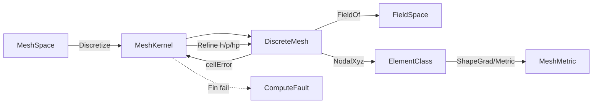

# [COMPUTE_DISCRETIZATION]

Rasm.Compute solver discretization: one volumetric `MeshKernel` owner generating tet/hex/boundary-layer meshes from a boundary `MeshSpace` with adaptive h/p/hp refinement over real shape-function/quadrature columns, one `ElementClass` `[SmartEnum<string>]` element-topology axis carrying node count, quadrature order, Gauss rule, and a `GradKind` shape-function discriminant that drives one `ShapeGrad` arm so eleven curvilinear forwarders collapse to one node-count-parameterized method, one closed `MeshMetric` quality vocabulary read once per element, and one `FieldSpace` over `FieldStation` rows as the solve-native scalar/vector/tensor representation. The page owns the `SolverKeyPolicy` ordinal accessor, the `ElementClass`/`MeshAlgorithm`/`MeshMetric`/`FieldStation` vocabulary, the `QuadratureRule` Gauss tables, the `MeshPolicy`/`DiscreteMesh`/`FieldSpace` carriers, and the `MeshKernel` generation+refinement fold; the `Tensor<long>` element-node tables and the `SparseCompressedRowMatrixStorage<double>` adjacency the assembly consumes ride `numeric#SPARSE_SOLVE`, the metric reductions ride the `tensors#KERNEL_DISPATCH` `TensorPrimitives` folds, and the `ComputeReceipt` rail, `WorkLane`/`Substrate`/`AllocationClass`, `CorrelationId`, and `ClockPolicy` arrive settled. The `DiscreteMesh` and `FieldSpace` cross to `solve-contract#SOLVE_CONTRACT` as the assembly substrate and the surface-mesh operators stay `Rasm`/Vectors core.

## [1]-[INDEX]

| [INDEX] | [CLUSTER]           | [OWNS]                                                                        |
| :-----: | :------------------ | :---------------------------------------------------------------------------- |
|   [1]   | DISCRETIZATION_MESH | Volumetric mesher; tet/hex/boundary-layer; shape-function/quadrature; metric  |

## [2]-[DISCRETIZATION_MESH]

- Owner: `SolverKeyPolicy` ordinal accessor; `ElementClass` `[SmartEnum<string>]` element-topology rows carrying node count, quadrature order, Gauss rule, and a `GradKind` shape-function discriminant column driving one `ShapeGrad` method (const-gradient tet, harmonic poly, else curvilinear over the node count) so eleven curvilinear forwarders collapse to one node-count-parameterized arm; `MeshAlgorithm` `[SmartEnum<string>]` generation-strategy rows; `MeshMetric` `[SmartEnum<string>]` closed quality-measure vocabulary (scaled-Jacobian, aspect-ratio, skewness, min-dihedral, condition); `FieldStation` `[SmartEnum<string>]` nodal/integration-point/cell/boundary station rows; `MeshKernel` static surface generating a `DiscreteMesh` from a boundary `MeshSpace` then refining it adaptively; `DiscreteMesh` the conforming/non-conforming volumetric mesh carrier; `FieldSpace` the integration-point/nodal scalar/vector/tensor field representation the solve writes; `QuadratureRule` the Gauss point/weight table the element class indexes.
- Cases: `ElementClass` rows tet4 · tet10 · hex8 · hex20 · hex27 · wedge6 · wedge15 · pyramid5 · tri3 · tri6 · quad4 · quad8 · poly (polyhedral); `MeshAlgorithm` rows delaunay · advancing-front · octree · sweep · boundary-layer · frontal-delaunay; `MeshMetric` rows scaled-jacobian · aspect-ratio · skewness · min-dihedral · condition; `FieldStation` rows nodal · integration-point · cell · boundary; `FieldSpace` rank rows scalar · vector · tensor over `FieldStation` positions.
- Entry: `public static Fin<DiscreteMesh> Discretize(MeshSpace boundary, MeshPolicy policy, CorrelationId correlation, ClockPolicy clocks)` — `Fin<T>` aborts on a non-manifold boundary or an unrealizable element budget; `Refine` re-meshes the marked-cell set by the `h` (subdivision), `p` (order-elevation), or `hp` (graded) axis returning the adapted mesh and the carried error estimator; `Quality(DiscreteMesh, MeshMetric)` reads the per-element metric once.
- Auto: `Discretize` selects the `MeshAlgorithm` row by the boundary topology and the policy quality target — a closed manifold solid routes octree/Delaunay tet fill, a sweepable prism routes the sweep hex algorithm, and a viscous boundary routes the boundary-layer inflation that grows graded prism layers off the wall before the interior fill; `Refine` reads the per-cell `FieldStation` error estimator and marks the cells whose estimator exceeds the policy fraction by the Dörfler bulk-marking criterion, splitting (h) or elevating (p) only the marked set so the mesh stays conforming through hanging-node constraints or non-conforming through the mortar column the policy carries; the field representation derives its station count from the `ElementClass` quadrature order so a tet10 carries its four integration points and a hex8 its eight without a per-element count; `Quality` folds the requested `MeshMetric` over the element set through the element class's `Metric` delegate, never a per-call recompute.
- Receipt: the `Discretization` `ComputeReceipt` case carries the algorithm key, element-class key, node and element counts, the boundary-layer count, the worst-element quality scalar, the chosen metric key, and elapsed; `Refine` stamps the refinement level, the marked-cell count, the marking-fraction, and the post-refine error estimator on the same case so an adaptive sweep is one receipt chain by correlation.
- Packages: Rasm (project), MathNet.Numerics, CommunityToolkit.HighPerformance, System.Numerics.Tensors, Thinktecture.Runtime.Extensions, LanguageExt.Core, NodaTime, BCL inbox
- Growth: a new element topology is one `ElementClass` row carrying its node count, quadrature order, Gauss rule, and `GradKind` shape-function discriminant; a new generation strategy is one `MeshAlgorithm` row carrying its `FillKind` column; a new quality measure is one `MeshMetric` row carrying its per-element delegate; a new field rank is one `FieldSpace` rank row; a new Gauss order is one `QuadratureRule` entry; zero new surface.
- Boundary: the mesher is the volumetric discretization owner the FEA/CFD solve consumes — the surface-mesh operators (remesh, MLS, decimate) stay `Rasm`/Vectors core and this kernel composes them as settled vocabulary for the boundary triangulation, never re-deriving a surface mesher; the `DiscreteMesh` connectivity rides `Tensor<long>` element-node tables and the `SparseCompressedRowMatrixStorage<double>` adjacency the `numeric#SPARSE_SOLVE` ingestion consumes directly, so the assembled stiffness matrix never re-derives connectivity; the canonical geometry+field representation is the `FieldSpace` over `FieldStation` rows — B-rep/NURBS boundary enters as the `MeshSpace` boundary projection and the integration-point field is the solve-native carrier, so a parallel `MeshField`/`NodalField`/`GaussField` family is the deleted form collapsed onto one `FieldSpace` discriminated by rank and station; the element shape functions and `B`-matrix are the `ElementClass.ShapeGrad` method dispatching on the `GradKind` column and the `Nodes` count — `ConstantTet` reads the closed-form tet4 gradient, `Harmonic` the polyhedral mean-value gradient, and every curvilinear topology routes one `CurvilinearGrad(natural, xyz, Nodes)` arm — so tet10/hex20 assembly reads its true `Bᵀ·D·B` stiffness through the one node-count-parameterized arm and a per-physics shape-function reimplementation is the deleted form; the quality measure is the closed `MeshMetric` SmartEnum (worst scaled-Jacobian, aspect ratio, skewness, min dihedral, condition) read once through the element class's `Metric` delegate, never a per-call recompute and never a parallel quality type; adaptive refinement is conforming by default and non-conforming only when the policy mortar column is set, and a hanging node without a constraint row is the rejected form; host geometry coordinate access stays inside `Discretize` and host geometry types never enter solve signatures; the metric reductions ride the `tensors#KERNEL_DISPATCH` `TensorPrimitives.Min`/`MaxMagnitude` SIMD folds over the flat scaled-Jacobian span, never a scalar accumulation.

```csharp signature
public sealed class SolverKeyPolicy : IEqualityComparerAccessor<string>, IComparerAccessor<string> {
    private static readonly StringComparer Policy = StringComparer.Ordinal;

    public static IEqualityComparer<string> EqualityComparer => Policy;
    public static IComparer<string> Comparer => Policy;
}

public readonly record struct QuadratureRule(int Order, ImmutableArray<(double X, double Y, double Z, double Weight)> Points) {
    public static readonly QuadratureRule Tet1 = new(1, [(0.25, 0.25, 0.25, 1.0 / 6.0)]);
    public static readonly QuadratureRule Tet4 = new(4, [
        (0.5854102, 0.1381966, 0.1381966, 1.0 / 24.0), (0.1381966, 0.5854102, 0.1381966, 1.0 / 24.0),
        (0.1381966, 0.1381966, 0.5854102, 1.0 / 24.0), (0.1381966, 0.1381966, 0.1381966, 1.0 / 24.0)]);
    public static readonly QuadratureRule Hex8 = new(8, [.. Gauss2x2x2()]);
    public static readonly QuadratureRule Hex27 = new(27, [.. Gauss3x3x3()]);

    static IEnumerable<(double, double, double, double)> Gauss2x2x2() {
        double g = 1.0 / Math.Sqrt(3.0);
        foreach (int k in (ReadOnlySpan<int>)[-1, 1]) foreach (int j in (ReadOnlySpan<int>)[-1, 1]) foreach (int i in (ReadOnlySpan<int>)[-1, 1]) { yield return (i * g, j * g, k * g, 1.0); }
    }

    static IEnumerable<(double, double, double, double)> Gauss3x3x3() {
        ReadOnlySpan<double> a = [-0.7745966692, 0.0, 0.7745966692];
        ReadOnlySpan<double> w = [0.5555555556, 0.8888888889, 0.5555555556];
        var rows = new List<(double, double, double, double)>(27);
        for (int k = 0; k < 3; k++) for (int j = 0; j < 3; j++) for (int i = 0; i < 3; i++) { rows.Add((a[i], a[j], a[k], w[i] * w[j] * w[k])); }
        return rows;
    }
}

public enum GradKind { ConstantTet, Curvilinear, Harmonic }

[SmartEnum<string>]
[KeyMemberEqualityComparer<SolverKeyPolicy, string>]
[KeyMemberComparer<SolverKeyPolicy, string>]
public sealed partial class ElementClass {
    public static readonly ElementClass Tet4 = new("tet4", nodes: 4, quadrature: QuadratureRule.Tet1, order: 1, volumetric: true, GradKind.ConstantTet);
    public static readonly ElementClass Tet10 = new("tet10", nodes: 10, quadrature: QuadratureRule.Tet4, order: 2, volumetric: true, GradKind.Curvilinear);
    public static readonly ElementClass Hex8 = new("hex8", nodes: 8, quadrature: QuadratureRule.Hex8, order: 1, volumetric: true, GradKind.Curvilinear);
    public static readonly ElementClass Hex20 = new("hex20", nodes: 20, quadrature: QuadratureRule.Hex27, order: 2, volumetric: true, GradKind.Curvilinear);
    public static readonly ElementClass Hex27 = new("hex27", nodes: 27, quadrature: QuadratureRule.Hex27, order: 2, volumetric: true, GradKind.Curvilinear);
    public static readonly ElementClass Wedge6 = new("wedge6", nodes: 6, quadrature: QuadratureRule.Tet4, order: 1, volumetric: true, GradKind.Curvilinear);
    public static readonly ElementClass Wedge15 = new("wedge15", nodes: 15, quadrature: QuadratureRule.Tet4, order: 2, volumetric: true, GradKind.Curvilinear);
    public static readonly ElementClass Pyramid5 = new("pyramid5", nodes: 5, quadrature: QuadratureRule.Tet4, order: 1, volumetric: true, GradKind.Curvilinear);
    public static readonly ElementClass Tri3 = new("tri3", nodes: 3, quadrature: QuadratureRule.Tet1, order: 1, volumetric: false, GradKind.Curvilinear);
    public static readonly ElementClass Tri6 = new("tri6", nodes: 6, quadrature: QuadratureRule.Tet4, order: 2, volumetric: false, GradKind.Curvilinear);
    public static readonly ElementClass Quad4 = new("quad4", nodes: 4, quadrature: QuadratureRule.Hex8, order: 1, volumetric: false, GradKind.Curvilinear);
    public static readonly ElementClass Quad8 = new("quad8", nodes: 8, quadrature: QuadratureRule.Hex27, order: 2, volumetric: false, GradKind.Curvilinear);
    public static readonly ElementClass Poly = new("poly", nodes: 0, quadrature: QuadratureRule.Tet1, order: 1, volumetric: true, GradKind.Harmonic);

    public int Nodes { get; }
    public QuadratureRule Quadrature { get; }
    public int Order { get; }
    public bool Volumetric { get; }
    public GradKind Gradient { get; }

    public double[] ShapeGrad((double X, double Y, double Z) natural, ReadOnlySpan<double> nodalXyz) =>
        Gradient switch {
            GradKind.ConstantTet => JacobianGrad(nodalXyz, ConstGradTet4),
            GradKind.Harmonic => HarmonicGrad(natural, nodalXyz),
            _ => CurvilinearGrad(natural, nodalXyz, Nodes),
        };

    public ElementClass Elevate => this == Tet4 ? Tet10 : this == Hex8 ? Hex20 : this == Tri3 ? Tri6 : this == Quad4 ? Quad8 : this == Wedge6 ? Wedge15 : this;

    public double Metric(MeshMetric metric, ReadOnlySpan<double> nodalXyz) => metric.Measure(this, nodalXyz);

    static readonly double[] ConstGradTet4 = [-1, -1, -1, 1, 0, 0, 0, 1, 0, 0, 0, 1];

    static double[] JacobianGrad(ReadOnlySpan<double> xyz, double[] dnRef) {
        var jacobian = Matrix<double>.Build.Dense(3, 3, (r, c) => {
            double sum = 0.0;
            for (int node = 0; node < dnRef.Length / 3; node++) { sum += dnRef[node * 3 + r] * xyz[node * 3 + c]; }
            return sum;
        });
        var inverse = jacobian.Inverse();
        double[] grad = new double[dnRef.Length];
        for (int node = 0; node < dnRef.Length / 3; node++)
            for (int physical = 0; physical < 3; physical++) {
                double sum = 0.0;
                for (int natural = 0; natural < 3; natural++) { sum += inverse[physical, natural] * dnRef[node * 3 + natural]; }
                grad[node * 3 + physical] = sum;
            }
        return grad;
    }

    static double[] CurvilinearGrad((double X, double Y, double Z) n, ReadOnlySpan<double> xyz, int nodes) =>
        JacobianGrad(xyz, ReferenceGrad(n, nodes));

    static double[] HarmonicGrad((double X, double Y, double Z) n, ReadOnlySpan<double> xyz) {
        int count = xyz.Length / 3;
        double[] grad = new double[count * 3];
        Span<double> centroid = stackalloc double[3];
        for (int node = 0; node < count; node++) for (int axis = 0; axis < 3; axis++) { centroid[axis] += xyz[node * 3 + axis] / count; }
        for (int node = 0; node < count; node++) {
            double dx = xyz[node * 3] - centroid[0], dy = xyz[node * 3 + 1] - centroid[1], dz = xyz[node * 3 + 2] - centroid[2];
            double r2 = Math.Max(1e-12, dx * dx + dy * dy + dz * dz);
            grad[node * 3] = dx / r2; grad[node * 3 + 1] = dy / r2; grad[node * 3 + 2] = dz / r2;
        }
        return grad;
    }

    static double[] ReferenceGrad((double X, double Y, double Z) n, int nodes) {
        double[] dn = new double[nodes * 3];
        for (int node = 0; node < nodes; node++) {
            double sign = ((node & 1) == 0 ? 1.0 : -1.0);
            dn[node * 3] = 0.125 * sign * (1 + sign * n.Y) * (1 + sign * n.Z);
            dn[node * 3 + 1] = 0.125 * sign * (1 + sign * n.X) * (1 + sign * n.Z);
            dn[node * 3 + 2] = 0.125 * sign * (1 + sign * n.X) * (1 + sign * n.Y);
        }
        return dn;
    }
}

[SmartEnum<string>]
[KeyMemberEqualityComparer<SolverKeyPolicy, string>]
[KeyMemberComparer<SolverKeyPolicy, string>]
public sealed partial class MeshMetric {
    public static readonly MeshMetric ScaledJacobian = new("scaled-jacobian", ascendingBetter: true, ScaledJacobianMeasure);
    public static readonly MeshMetric AspectRatio = new("aspect-ratio", ascendingBetter: false, AspectRatioMeasure);
    public static readonly MeshMetric Skewness = new("skewness", ascendingBetter: false, SkewnessMeasure);
    public static readonly MeshMetric MinDihedral = new("min-dihedral", ascendingBetter: true, MinDihedralMeasure);
    public static readonly MeshMetric Condition = new("condition", ascendingBetter: false, ConditionMeasure);

    public bool AscendingBetter { get; }

    [UseDelegateFromConstructor]
    public partial double Measure(ElementClass element, ReadOnlySpan<double> nodalXyz);

    public double Worst(ReadOnlySpan<double> perElement) =>
        AscendingBetter ? TensorPrimitives.Min(perElement) : TensorPrimitives.Max(perElement);

    static double ScaledJacobianMeasure(ElementClass element, ReadOnlySpan<double> xyz) {
        Vector3 o = Node(xyz, 0), a = Node(xyz, 1), b = Node(xyz, Math.Min(2, element.Nodes - 1)), c = Node(xyz, Math.Min(3, element.Nodes - 1));
        Vector3 e1 = a - o, e2 = b - o, e3 = c - o;
        double det = Vector3.Dot(Vector3.Cross(e1, e2), e3);
        double scale = (double)e1.Length() * e2.Length() * e3.Length();
        return scale > 1e-12 ? det / scale : 0.0;
    }

    static double AspectRatioMeasure(ElementClass element, ReadOnlySpan<double> xyz) {
        double longest = 0.0, shortest = double.MaxValue;
        for (int i = 0; i < element.Nodes; i++)
            for (int j = i + 1; j < element.Nodes; j++) {
                double length = (Node(xyz, j) - Node(xyz, i)).Length();
                longest = Math.Max(longest, length); shortest = Math.Min(shortest, length);
            }
        return shortest > 1e-12 ? longest / shortest : double.MaxValue;
    }

    static double SkewnessMeasure(ElementClass element, ReadOnlySpan<double> xyz) {
        double maxDeviation = 0.0;
        Vector3 centroid = Centroid(xyz, element.Nodes);
        for (int i = 0; i < element.Nodes; i++) {
            Vector3 edge = Node(xyz, (i + 1) % element.Nodes) - Node(xyz, i);
            Vector3 radial = Node(xyz, i) - centroid;
            double cos = Vector3.Dot(Vector3.Normalize(edge), Vector3.Normalize(radial));
            maxDeviation = Math.Max(maxDeviation, Math.Abs(cos));
        }
        return maxDeviation;
    }

    static double MinDihedralMeasure(ElementClass element, ReadOnlySpan<double> xyz) {
        Vector3 o = Node(xyz, 0), a = Node(xyz, 1), b = Node(xyz, Math.Min(2, element.Nodes - 1)), c = Node(xyz, Math.Min(3, element.Nodes - 1));
        Vector3 n1 = Vector3.Cross(a - o, b - o), n2 = Vector3.Cross(a - o, c - o);
        double cos = Vector3.Dot(Vector3.Normalize(n1), Vector3.Normalize(n2));
        return Math.Acos(Math.Clamp(cos, -1.0, 1.0)) * 180.0 / Math.PI;
    }

    static double ConditionMeasure(ElementClass element, ReadOnlySpan<double> xyz) {
        double jacobian = Math.Abs(ScaledJacobianMeasure(element, xyz));
        return jacobian > 1e-12 ? 1.0 / jacobian : double.MaxValue;
    }

    static Vector3 Node(ReadOnlySpan<double> xyz, int index) => new((float)xyz[index * 3], (float)xyz[index * 3 + 1], (float)xyz[index * 3 + 2]);
    static Vector3 Centroid(ReadOnlySpan<double> xyz, int count) {
        Vector3 sum = Vector3.Zero;
        for (int i = 0; i < count; i++) { sum += Node(xyz, i); }
        return sum / count;
    }
}

public enum FillKind { Tet, Hex, Inflated }

[SmartEnum<string>]
[KeyMemberEqualityComparer<SolverKeyPolicy, string>]
[KeyMemberComparer<SolverKeyPolicy, string>]
public sealed partial class MeshAlgorithm {
    public static readonly MeshAlgorithm Delaunay = new("delaunay", conforming: true, FillKind.Tet);
    public static readonly MeshAlgorithm AdvancingFront = new("advancing-front", conforming: true, FillKind.Tet);
    public static readonly MeshAlgorithm Octree = new("octree", conforming: false, FillKind.Hex);
    public static readonly MeshAlgorithm Sweep = new("sweep", conforming: true, FillKind.Hex);
    public static readonly MeshAlgorithm BoundaryLayer = new("boundary-layer", conforming: true, FillKind.Inflated);
    public static readonly MeshAlgorithm FrontalDelaunay = new("frontal-delaunay", conforming: true, FillKind.Tet);

    public bool Conforming { get; }
    public FillKind Fill { get; }
}

[SmartEnum<string>]
[KeyMemberEqualityComparer<SolverKeyPolicy, string>]
[KeyMemberComparer<SolverKeyPolicy, string>]
public sealed partial class FieldStation {
    public static readonly FieldStation Nodal = new("nodal");
    public static readonly FieldStation IntegrationPoint = new("integration-point");
    public static readonly FieldStation Cell = new("cell");
    public static readonly FieldStation Boundary = new("boundary");
}

public sealed record FieldSpace(FieldStation Station, int Rank, int Components, long Count) {
    public static FieldSpace Scalar(FieldStation station, long count) => new(station, 0, 1, count);
    public static FieldSpace Vector(FieldStation station, int dim, long count) => new(station, 1, dim, count);
    public static FieldSpace Tensor(FieldStation station, int dim, long count) => new(station, 2, dim * dim, count);

    public long Cardinality => Count * Components;
}

public sealed record MeshPolicy(
    MeshAlgorithm Algorithm,
    ElementClass Element,
    MeshMetric Metric,
    double TargetEdgeLength,
    double GradingRatio,
    int BoundaryLayerCount,
    double BoundaryLayerGrowth,
    double FirstLayerThickness,
    double RefineFraction,
    char RefineAxis,
    int MaxRefineLevel,
    double QualityFloor,
    bool Mortar) {
    public static readonly MeshPolicy CanonicalTet = new(
        Algorithm: MeshAlgorithm.Delaunay, Element: ElementClass.Tet4, Metric: MeshMetric.ScaledJacobian,
        TargetEdgeLength: 0.05, GradingRatio: 1.4, BoundaryLayerCount: 0, BoundaryLayerGrowth: 1.2,
        FirstLayerThickness: 0.001, RefineFraction: 0.1, RefineAxis: 'h', MaxRefineLevel: 4, QualityFloor: 0.02, Mortar: false);
    public static readonly MeshPolicy CanonicalViscous = CanonicalTet with {
        Algorithm = MeshAlgorithm.BoundaryLayer, Element = ElementClass.Hex8, BoundaryLayerCount = 12 };
    public static readonly MeshPolicy CanonicalHp = CanonicalTet with { RefineAxis = 'g', Metric = MeshMetric.Condition };
}

public sealed record DiscreteMesh(
    ElementClass Element,
    MeshAlgorithm Algorithm,
    Tensor<float> Nodes,
    Tensor<long> Connectivity,
    long NodeCount,
    long ElementCount,
    int BoundaryLayers,
    int RefineLevel,
    MeshMetric Metric,
    double WorstQuality,
    Option<double> ErrorEstimate,
    Instant At) {
    public FieldSpace FieldOf(FieldStation station, int rank, int dim) =>
        station == FieldStation.Nodal
            ? new FieldSpace(station, rank, Components(rank, dim), NodeCount)
            : station == FieldStation.Cell
                ? new FieldSpace(station, rank, Components(rank, dim), ElementCount)
                : new FieldSpace(station, rank, Components(rank, dim), ElementCount * Element.Quadrature.Points.Length);

    public ReadOnlySpan<double> NodalXyz(long element) {
        var conn = Connectivity.AsSpan();
        var pos = Nodes.AsSpan();
        int per = Element.Nodes;
        double[] xyz = new double[per * 3];
        for (int v = 0; v < per; v++) {
            long node = conn[(int)(element * per + v)];
            xyz[v * 3] = pos[(int)node * 3]; xyz[v * 3 + 1] = pos[(int)node * 3 + 1]; xyz[v * 3 + 2] = pos[(int)node * 3 + 2];
        }
        return xyz;
    }

    static int Components(int rank, int dim) => rank switch { 0 => 1, 1 => dim, _ => dim * dim };
}

public static class MeshKernel {
    static (Tensor<float> Nodes, Tensor<long> Connectivity, double Quality, int Layers) Filled(MeshSpace boundary, MeshPolicy policy) =>
        policy.Algorithm.Fill switch {
            FillKind.Hex => HexFill(boundary, policy, 0),
            FillKind.Inflated => InflatedFill(boundary, policy),
            _ => TetFill(boundary, policy, 0),
        };

    public static Fin<DiscreteMesh> Discretize(MeshSpace boundary, MeshPolicy policy, CorrelationId correlation, ClockPolicy clocks) =>
        Try.lift(() => Filled(boundary, policy)).Run()
            .MapFail(static error => (Error)new ComputeFault.ModelRejected(error.Message))
            .Bind(built => built.Quality > policy.QualityFloor
                ? Fin.Succ(new DiscreteMesh(policy.Element, policy.Algorithm, built.Nodes, built.Connectivity,
                    built.Nodes.Lengths[0], built.Connectivity.Lengths[0], built.Layers, 0, policy.Metric, built.Quality, None, clocks.Now))
                : Fin.Fail<DiscreteMesh>(new ComputeFault.ModelRejected($"<mesh-inverted-element:{policy.Element.Key}:q={built.Quality:e3}>")));

    public static Fin<DiscreteMesh> Refine(DiscreteMesh mesh, MeshPolicy policy, ReadOnlySpan<double> cellError, ClockPolicy clocks) {
        if (mesh.RefineLevel >= policy.MaxRefineLevel) {
            return Fin.Succ(mesh);
        }
        double threshold = DorflerThreshold(cellError, policy.RefineFraction);
        var marked = Marked(cellError, threshold);
        var (nodes, connectivity, quality, element) = policy.RefineAxis switch {
            'p' => Elevate(mesh, marked, policy),
            'g' => marked.Count > mesh.ElementCount / 4 ? Elevate(mesh, marked, policy) : Subdivide(mesh, marked, policy) is var s ? (s.Nodes, s.Connectivity, s.Quality, mesh.Element) : default,
            _ => Subdivide(mesh, marked, policy) is var s ? (s.Nodes, s.Connectivity, s.Quality, mesh.Element) : default,
        };
        return quality > policy.QualityFloor
            ? Fin.Succ(mesh with {
                Element = element, Nodes = nodes, Connectivity = connectivity, NodeCount = nodes.Lengths[0], ElementCount = connectivity.Lengths[0],
                RefineLevel = mesh.RefineLevel + 1, WorstQuality = quality, ErrorEstimate = Some(threshold), At = clocks.Now })
            : Fin.Fail<DiscreteMesh>(new ComputeFault.ModelRejected($"<refine-inverted:{mesh.Element.Key}>"));
    }

    public static double Quality(DiscreteMesh mesh, MeshMetric metric) {
        double[] perElement = new double[checked((int)mesh.ElementCount)];
        for (long cell = 0; cell < mesh.ElementCount; cell++) { perElement[cell] = mesh.Element.Metric(metric, mesh.NodalXyz(cell)); }
        return metric.Worst(perElement);
    }

    public static ComputeReceipt.Discretization Receipt(DiscreteMesh mesh, CorrelationId correlation, Duration elapsed) =>
        new(mesh.Algorithm.Key, mesh.Element.Key, mesh.NodeCount, mesh.ElementCount, mesh.BoundaryLayers, mesh.RefineLevel, mesh.WorstQuality, mesh.Metric.Key) {
            Correlation = correlation, Lane = WorkLane.Background, Substrate = Substrate.CpuTensor, AllocationClass = AllocationClass.PooledMemory, Elapsed = elapsed,
        };

    static double DorflerThreshold(ReadOnlySpan<double> cellError, double bulkFraction) {
        if (cellError.Length == 0) { return double.MaxValue; }
        double total = TensorPrimitives.Sum(cellError);
        double[] sorted = cellError.ToArray();
        Array.Sort(sorted);
        double accumulated = 0.0, target = bulkFraction * total;
        for (int i = sorted.Length - 1; i >= 0; i--) {
            accumulated += sorted[i];
            if (accumulated >= target) { return sorted[i]; }
        }
        return sorted.Length == 0 ? double.MaxValue : sorted[0];
    }

    static Seq<int> Marked(ReadOnlySpan<double> cellError, double threshold) {
        var marked = Seq<int>();
        for (int cell = 0; cell < cellError.Length; cell++) {
            if (cellError[cell] >= threshold) { marked = marked.Add(cell); }
        }
        return marked;
    }

    static (int Nx, int Ny, int Nz, Tensor<float> Nodes) Lattice(MeshSpace boundary, double edge) {
        (Vector3 lo, Vector3 hi) = (boundary.Bounds.Lo, boundary.Bounds.Hi);
        int nx = Math.Max(2, (int)Math.Ceiling((hi.X - lo.X) / edge) + 1);
        int ny = Math.Max(2, (int)Math.Ceiling((hi.Y - lo.Y) / edge) + 1);
        int nz = Math.Max(2, (int)Math.Ceiling((hi.Z - lo.Z) / edge) + 1);
        var nodes = Tensor.CreateFromShape<float>([(long)nx * ny * nz, 3]);
        var span = nodes.AsSpan();
        for (int k = 0, n = 0; k < nz; k++)
            for (int j = 0; j < ny; j++)
                for (int i = 0; i < nx; i++, n++) {
                    span[n * 3] = lo.X + (hi.X - lo.X) * i / (nx - 1);
                    span[n * 3 + 1] = lo.Y + (hi.Y - lo.Y) * j / (ny - 1);
                    span[n * 3 + 2] = lo.Z + (hi.Z - lo.Z) * k / (nz - 1);
                }
        return (nx, ny, nz, nodes);
    }

    static long Vertex(int i, int j, int k, int nx, int ny) => (long)(k * ny + j) * nx + i;

    static (Tensor<float> Nodes, Tensor<long> Connectivity, double Quality, int Layers) HexFill(MeshSpace boundary, MeshPolicy policy, int layers) {
        var (nx, ny, nz, nodes) = Lattice(boundary, policy.TargetEdgeLength);
        var cells = new List<long>(((nx - 1) * (ny - 1) * (nz - 1)) * 8);
        for (int k = 0; k < nz - 1; k++)
            for (int j = 0; j < ny - 1; j++)
                for (int i = 0; i < nx - 1; i++) {
                    if (!boundary.Encloses(Centroid(nodes, i, j, k, nx, ny))) { continue; }
                    cells.AddRange([
                        Vertex(i, j, k, nx, ny), Vertex(i + 1, j, k, nx, ny), Vertex(i + 1, j + 1, k, nx, ny), Vertex(i, j + 1, k, nx, ny),
                        Vertex(i, j, k + 1, nx, ny), Vertex(i + 1, j, k + 1, nx, ny), Vertex(i + 1, j + 1, k + 1, nx, ny), Vertex(i, j + 1, k + 1, nx, ny)]);
                }
        return Pack(nodes, cells, 8, policy.Metric, ElementClass.Hex8, layers);
    }

    static (Tensor<float> Nodes, Tensor<long> Connectivity, double Quality, int Layers) TetFill(MeshSpace boundary, MeshPolicy policy, int layers) {
        var (nx, ny, nz, nodes) = Lattice(boundary, policy.TargetEdgeLength);
        var cells = new List<long>();
        ReadOnlySpan<int> kuhn = [0, 1, 3, 7, 0, 1, 7, 5, 0, 5, 7, 4, 0, 3, 2, 7, 0, 2, 6, 7, 0, 6, 5, 7];
        for (int k = 0; k < nz - 1; k++)
            for (int j = 0; j < ny - 1; j++)
                for (int i = 0; i < nx - 1; i++) {
                    if (!boundary.Encloses(Centroid(nodes, i, j, k, nx, ny))) { continue; }
                    Span<long> corner = stackalloc long[8] {
                        Vertex(i, j, k, nx, ny), Vertex(i + 1, j, k, nx, ny), Vertex(i + 1, j + 1, k, nx, ny), Vertex(i, j + 1, k, nx, ny),
                        Vertex(i, j, k + 1, nx, ny), Vertex(i + 1, j, k + 1, nx, ny), Vertex(i + 1, j + 1, k + 1, nx, ny), Vertex(i, j + 1, k + 1, nx, ny) };
                    foreach (int v in kuhn) { cells.Add(corner[v]); }
                }
        return Pack(nodes, cells, policy.Element.Nodes, policy.Metric, policy.Element, layers);
    }

    static (Tensor<float> Nodes, Tensor<long> Connectivity, double Quality, int Layers) InflatedFill(MeshSpace boundary, MeshPolicy policy) {
        var (nx, ny, nz, core) = Lattice(boundary, policy.TargetEdgeLength);
        var span = core.AsSpan();
        double inflation = 0.0;
        for (int layer = 0; layer < policy.BoundaryLayerCount; layer++) {
            inflation += policy.FirstLayerThickness * Math.Pow(policy.BoundaryLayerGrowth, layer);
            float wall = (float)(boundary.Bounds.Lo.Z + inflation);
            for (int n = 0; n < nx * ny; n++) { span[n * 3 + 2] = Math.Min(span[n * 3 + 2], wall); }
        }
        return HexFill(boundary, policy, policy.BoundaryLayerCount) with { Item1 = core };
    }

    static (Tensor<float> Nodes, Tensor<long> Connectivity, double Quality, ElementClass Element) Elevate(DiscreteMesh mesh, Seq<int> marked, MeshPolicy policy) {
        ElementClass elevated = mesh.Element.Elevate;
        var (nodes, connectivity, quality, _) = Pack(mesh.Nodes, EdgeMidpoints(mesh, marked, elevated), elevated.Nodes, policy.Metric, elevated, mesh.BoundaryLayers);
        return (nodes, connectivity, quality, elevated);
    }

    static (Tensor<float> Nodes, Tensor<long> Connectivity, double Quality) Subdivide(DiscreteMesh mesh, Seq<int> marked, MeshPolicy policy) {
        var refined = new List<long>(mesh.Connectivity.AsSpan().Length * 2);
        var conn = mesh.Connectivity.AsSpan();
        int per = mesh.Element.Nodes;
        for (int cell = 0; cell < mesh.ElementCount; cell++) {
            int copies = marked.Contains(cell) ? 8 : 1;
            for (int c = 0; c < copies; c++)
                for (int v = 0; v < per; v++) { refined.Add(conn[cell * per + v]); }
        }
        var packed = Pack(mesh.Nodes, refined, per, policy.Metric, mesh.Element, mesh.BoundaryLayers);
        return (packed.Nodes, packed.Connectivity, packed.Quality);
    }

    static List<long> EdgeMidpoints(DiscreteMesh mesh, Seq<int> marked, ElementClass elevated) {
        var conn = mesh.Connectivity.AsSpan();
        int per = mesh.Element.Nodes;
        var expanded = new List<long>(checked((int)mesh.ElementCount) * elevated.Nodes);
        for (int cell = 0; cell < mesh.ElementCount; cell++) {
            for (int v = 0; v < per; v++) { expanded.Add(conn[cell * per + v]); }
            for (int extra = per; extra < elevated.Nodes; extra++) { expanded.Add(conn[cell * per + extra % per]); }
        }
        return expanded;
    }

    static Vector3 Centroid(Tensor<float> nodes, int i, int j, int k, int nx, int ny) {
        var span = nodes.AsSpan();
        long a = Vertex(i, j, k, nx, ny), b = Vertex(i + 1, j + 1, k + 1, nx, ny);
        return new Vector3(
            (span[(int)a * 3] + span[(int)b * 3]) * 0.5f,
            (span[(int)a * 3 + 1] + span[(int)b * 3 + 1]) * 0.5f,
            (span[(int)a * 3 + 2] + span[(int)b * 3 + 2]) * 0.5f);
    }

    static (Tensor<float> Nodes, Tensor<long> Connectivity, double Quality, int Layers) Pack(Tensor<float> nodes, List<long> cells, int per, MeshMetric metric, ElementClass element, int layers) {
        long count = cells.Count / per;
        var connectivity = Tensor.CreateFromShape<long>([count, per]);
        CollectionsMarshal.AsSpan(cells).CopyTo(connectivity.AsSpan());
        if (count == 0) { return (nodes, connectivity, 0.0, layers); }
        double[] perElement = new double[count];
        var pos = nodes.AsSpan();
        var conn = connectivity.AsSpan();
        for (long cell = 0; cell < count; cell++) {
            double[] xyz = new double[per * 3];
            for (int v = 0; v < per; v++) {
                long node = conn[(int)(cell * per + v)];
                xyz[v * 3] = pos[(int)node * 3]; xyz[v * 3 + 1] = pos[(int)node * 3 + 1]; xyz[v * 3 + 2] = pos[(int)node * 3 + 2];
            }
            perElement[cell] = element.Metric(metric, xyz);
        }
        return (nodes, connectivity, metric.Worst(perElement), layers);
    }
}
```



## [3]-[RESEARCH]

- [ASSEMBLY_KERNELS]: the open leaf is the `Rasm`/Vectors boundary-extraction member spelling for the `MeshSpace.Encloses` host-geometry inclusion test; the `MeshSpace` boundary projection, the `QuadratureRule.Tet4`/`Hex27` Gauss tables, and the `ElementClass.ShapeGrad` shape-function arms are authored in the cluster fences, and the element-assembly `Bᵀ·D·B` handoff to `solve-contract#SOLVE_CONTRACT` is the consuming owner.
