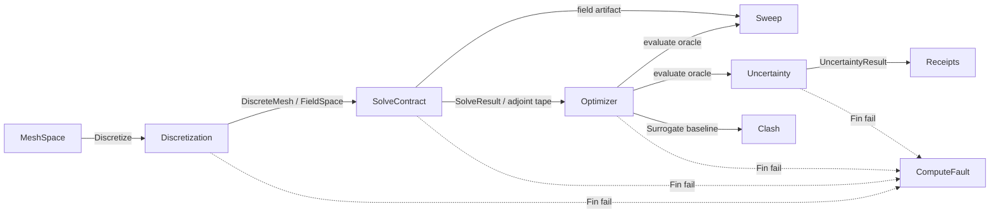

# [COMPUTE_SOLVER]

The solver lane sub-domain index: the physics-solve concern fans out across six owners, each a separate design page so a reader navigates the sub-domain without scanning one god page. Discretization owns the volumetric mesher and the element/quadrature vocabulary; the solve contract owns the physics×BC×element assembly fold and the multi-physics coupling; the optimizer owns the design-space search axis with its reduced-order surrogate duality; the sweep governor owns the N-dim DOE orchestration with the frame-budget early-stop; the clash compute owns the acceleration-structure collision fold with the ROM digital-twin loop; and the uncertainty owner turns a deterministic objective into a distribution-valued result with Monte-Carlo/LHS/polynomial-chaos propagation, Sobol variance decomposition, and FORM/subset-simulation failure-probability over the same evaluate oracle the sweep and optimizer share. The six pages compose the `numeric#DENSE_ALGEBRA`/`numeric#SPARSE_SOLVE` factorization machinery, the `tensors#EQUIVALENCE_INTEROP` gradient-adjoint tape, the `numeric#OWNED_BUILDS` `LowDiscrepancy` sampler, the `WorkLane`/`LaneRuntime` scheduler, the `ComputeReceipt` rail, and the Persistence artifact and vector indexes as settled vocabulary.

## [1]-[PAGES]

| [INDEX] | [PAGE]                                  | [OWNS]                                                                         |
| :-----: | :-------------------------------------- | :---------------------------------------------------------------------------- |
|   [1]   | [discretization](discretization.md)     | Volumetric mesher; tet/hex/boundary-layer; shape-function/quadrature; metric  |
|   [2]   | [solve-contract](solve-contract.md)     | Physics×BC×element solve axis; transient/nonlinear; multi-physics; recovery   |
|   [3]   | [optimizer](optimizer.md)               | Design-var/link/conditional search; constraint axis; ROM/GP surrogate duality |
|   [4]   | [sweep](sweep.md)                       | N-dim DOE sweep grid; frame-budgeted early-stop; Morris/Sobol sensitivity     |
|   [5]   | [clash](clash.md)                       | Acceleration-structure collision compute; Kalman-banded ROM digital-twin loop |
|   [6]   | [uncertainty](uncertainty.md)           | Forward-UQ propagation; PCE/MC/reliability; Sobol variance; failure-probability β |

## [2]-[SPINE]

Discretization emits the `DiscreteMesh` and `FieldSpace` the solve contract assembles over; the solve contract emits the `SolveResult` field and the `tensors#EQUIVALENCE_INTEROP` adjoint tape the optimizer gradient-adjoint row reads; the optimizer's `evaluate` oracle drives the sweep's DOE fan-out and the uncertainty owner's distribution propagation, and the optimizer's `Surrogate` is the clash digital-twin baseline; the uncertainty owner reduces its sampled responses to a content-keyed `UncertaintyResult` riding the `Uncertainty` `ComputeReceipt` case; every owner aborts on the `ComputeFault` rail.
