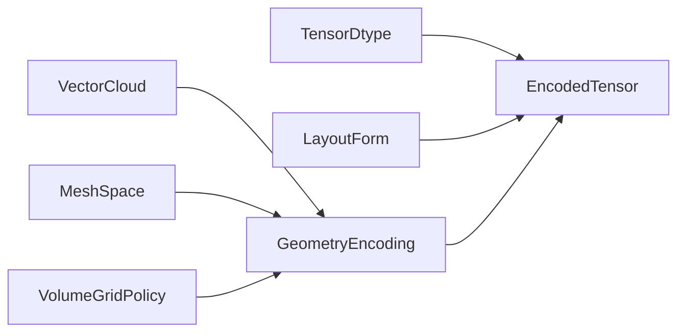

# [COMPUTE_TENSOR_LANE]

The cpu-tensor execution vocabulary: `Tensor<T>` spans and verified factories as the only tensor shapes, one dtype map between `TensorElementType` and CLR carriers, one `TensorOpFamily` table over the TensorPrimitives surface, one `LayoutForm` algebra over the verified layout members, geometry-to-tensor encoding rows as the canonical geometry-ML input vocabulary, and the equivalence law proving lane kernels against Rasm baselines. The page owns the `TensorDtype`, `TensorOpFamily`, `LayoutForm`, and `GeometryEncoding` axes; AppHost `ClockPolicy` and `CorrelationId` arrive settled, and the substrate row, fault union, and receipt cases ride their owning pages.

## [1]-[INDEX]

| [INDEX] | [CLUSTER]           | [OWNS]                                                                |
| :-----: | ------------------- | --------------------------------------------------------------------- |
|   [1]   | TENSOR_VOCABULARY   | Tensor shapes, verified factories, dtype map, quantization policy     |
|   [2]   | OPERATION_FAMILIES  | One op-family table; arity kernel tables; claim-gated hot routes      |
|   [3]   | LAYOUT_ALGEBRA      | LayoutForm rows; permute table; verified layout member surface        |
|   [4]   | GEOMETRY_ENCODING   | Geometry-to-tensor cases; free-dimension names; wire-shape rows       |
|   [5]   | EQUIVALENCE_INTEROP | Equivalence proofs against Rasm kernels; matmul route; copy-point law |

## [2]-[TENSOR_VOCABULARY]

- Owner: `TensorDtype`
- Cases: float32, float64, float16, bfloat16, int8, uint8, int32, int64, bool, string
- Entry: `public static Fin<TensorDtype> Admit(TensorElementType element)` — `Fin<T>` aborts on an unmapped element; the quantization overload rejects scale/zero-point values on unquantized rows.
- Packages: System.Numerics.Tensors, Microsoft.ML.OnnxRuntime, CommunityToolkit.HighPerformance, Thinktecture.Runtime.Extensions, LanguageExt.Core, BCL inbox
- Growth: a new element mapping is one `TensorDtype` row; zero new surface.
- Boundary: `Tensor<T>`, `TensorSpan<T>`, `ReadOnlyTensorSpan<T>`, `TensorShape`, and `TensorDimensionSpan<T>` are the only tensor shapes — package-local tensor wrappers and a TensorService are the deleted forms; `Tensor.CreateFromArray`, `CreateFromMemory`, `CreateFromSequence`, and `CreateFromDiagonal` are the deleted phantom spellings — `Tensor.Create`, `CreateFromShape`, and `CreateFromShapeUninitialized` are the factory surface, and zero-copy admission rides `TensorSpan<T>` constructors over spans plus `Tensor.Create` over rented `MemoryOwner<T>` arrays through the `DangerousGetArray` seam; `TensorMarshal.CreateTensorSpan` and `GetPinnableReference` are the native bridges; one generic kernel serves each operation family — per-dtype kernel copies are the deleted form; quantized rows project through `ConvertSaturating` with `QuantizationPolicy` values; the string row admits only at the model boundary for tokenizer extension ops.

```csharp signature
public sealed class TensorKeyPolicy : IEqualityComparerAccessor<string>, IComparerAccessor<string> {
    public static IEqualityComparer<string> EqualityComparer => StringComparer.Ordinal;

    public static IComparer<string> Comparer => StringComparer.Ordinal;
}

public readonly record struct QuantizationPolicy(double Scale, int ZeroPoint);

[SmartEnum<string>]
[KeyMemberEqualityComparer<TensorKeyPolicy, string>]
[KeyMemberComparer<TensorKeyPolicy, string>]
public sealed partial class TensorDtype {
    public static readonly TensorDtype Float32 = new("float32", TensorElementType.Float, typeof(float), width: Some(4), quantized: false, modelBoundaryOnly: false);
    public static readonly TensorDtype Float64 = new("float64", TensorElementType.Double, typeof(double), width: Some(8), quantized: false, modelBoundaryOnly: false);
    public static readonly TensorDtype Float16 = new("float16", TensorElementType.Float16, typeof(Half), width: Some(2), quantized: false, modelBoundaryOnly: false);
    public static readonly TensorDtype BFloat16 = new("bfloat16", TensorElementType.BFloat16, typeof(Microsoft.ML.OnnxRuntime.BFloat16), width: Some(2), quantized: false, modelBoundaryOnly: true);
    public static readonly TensorDtype Int8 = new("int8", TensorElementType.Int8, typeof(sbyte), width: Some(1), quantized: true, modelBoundaryOnly: false);
    public static readonly TensorDtype UInt8 = new("uint8", TensorElementType.UInt8, typeof(byte), width: Some(1), quantized: true, modelBoundaryOnly: false);
    public static readonly TensorDtype Int32 = new("int32", TensorElementType.Int32, typeof(int), width: Some(4), quantized: false, modelBoundaryOnly: false);
    public static readonly TensorDtype Int64 = new("int64", TensorElementType.Int64, typeof(long), width: Some(8), quantized: false, modelBoundaryOnly: false);
    public static readonly TensorDtype Bool = new("bool", TensorElementType.Bool, typeof(bool), width: Some(1), quantized: false, modelBoundaryOnly: false);
    public static readonly TensorDtype Utf8Text = new("string", TensorElementType.String, typeof(string), width: None, quantized: false, modelBoundaryOnly: true);

    public TensorElementType Element { get; }
    public Type Clr { get; }
    public Option<int> Width { get; }
    public bool Quantized { get; }
    public bool ModelBoundaryOnly { get; }
}

public static class TensorVocabulary {
    private static readonly FrozenDictionary<TensorElementType, TensorDtype> ByElement =
        TensorDtype.Items.ToFrozenDictionary(static row => row.Element, static row => row);

    public static Fin<TensorDtype> Admit(TensorElementType element) =>
        ByElement.TryGetValue(element, out TensorDtype? row) ? Fin.Succ(row!) : Fin.Fail<TensorDtype>(ComputeFault.Create($"<unmapped-element:{element}>"));

    public static Fin<TensorDtype> Admit(TensorElementType element, Option<QuantizationPolicy> quantization) =>
        Admit(element).Bind(row => quantization.IsSome && !row.Quantized ? Fin.Fail<TensorDtype>(ComputeFault.Create($"<quantization-on-unquantized-row:{row.Key}>")) : Fin.Succ(row));
}
```

## [3]-[OPERATION_FAMILIES]

- Owner: `TensorOpFamily`
- Cases: forty-five rows across nine `TensorOpKind` rows — elementwise, rounding, transcendental, reduction, statistics, bitwise, similarity, conversion, matrix
- Entry: `public static Fin<Unit> Map<T>(TensorOpFamily row, ReadOnlySpan<T> x, Span<T> destination)` — `Fin<Unit>` aborts on a kernel-row miss; the arity siblings `Zip`, `Fuse`, `Bits`, `Shift`, `Convert`, `Fold`, `FoldPair`, and `IndexOf` dispatch the same table law.
- Packages: System.Numerics.Tensors, Thinktecture.Runtime.Extensions, LanguageExt.Core, BCL inbox
- Growth: a new operation is one `TensorOpFamily` row plus one binding entry on its arity table; zero new surface.
- Boundary: every row binds the TensorPrimitives member matching its Pascal-cased key (shift-right binds the arithmetic-shift member; matmul binds the Rasm kernel route in EQUIVALENCE_INTEROP); the forty-five rows partition exactly across the arity tables, the `Hamming` entry, and the matmul route; a primitive becomes a default hot route only behind a winning benchmark-claim row, and the binding tables are `FrozenDictionary` indexes keyed through the ordinal `TensorKeyPolicy`; integer dtypes enter the real-constrained entries through the conversion rows first.

```csharp signature
[SmartEnum<string>]
[KeyMemberEqualityComparer<TensorKeyPolicy, string>]
[KeyMemberComparer<TensorKeyPolicy, string>]
public sealed partial class ToleranceClass {
    public static readonly ToleranceClass Exact = new("exact", relativeBound: 0.0);
    public static readonly ToleranceClass Tight = new("tight", relativeBound: 1e-12);
    public static readonly ToleranceClass Transcendental = new("transcendental", relativeBound: 1e-9);
    public static readonly ToleranceClass Statistical = new("statistical", relativeBound: 1e-6);

    public double RelativeBound { get; }
}

[SmartEnum<string>]
[KeyMemberEqualityComparer<TensorKeyPolicy, string>]
[KeyMemberComparer<TensorKeyPolicy, string>]
public sealed partial class TensorOpKind {
    public static readonly TensorOpKind Elementwise = new("elementwise");
    public static readonly TensorOpKind Rounding = new("rounding");
    public static readonly TensorOpKind Transcendental = new("transcendental");
    public static readonly TensorOpKind Reduction = new("reduction");
    public static readonly TensorOpKind Statistics = new("statistics");
    public static readonly TensorOpKind Bitwise = new("bitwise");
    public static readonly TensorOpKind Similarity = new("similarity");
    public static readonly TensorOpKind Conversion = new("conversion");
    public static readonly TensorOpKind Matrix = new("matrix");
}

[SmartEnum<string>]
[KeyMemberEqualityComparer<TensorKeyPolicy, string>]
[KeyMemberComparer<TensorKeyPolicy, string>]
public sealed partial class TensorOpFamily {
    public static readonly TensorOpFamily Add = new("add", TensorOpKind.Elementwise, ToleranceClass.Exact);
    public static readonly TensorOpFamily Subtract = new("subtract", TensorOpKind.Elementwise, ToleranceClass.Exact);
    public static readonly TensorOpFamily Multiply = new("multiply", TensorOpKind.Elementwise, ToleranceClass.Exact);
    public static readonly TensorOpFamily Divide = new("divide", TensorOpKind.Elementwise, ToleranceClass.Exact);
    public static readonly TensorOpFamily Negate = new("negate", TensorOpKind.Elementwise, ToleranceClass.Exact);
    public static readonly TensorOpFamily Abs = new("abs", TensorOpKind.Elementwise, ToleranceClass.Exact);
    public static readonly TensorOpFamily Clamp = new("clamp", TensorOpKind.Elementwise, ToleranceClass.Exact);
    public static readonly TensorOpFamily CopySign = new("copy-sign", TensorOpKind.Elementwise, ToleranceClass.Exact);
    public static readonly TensorOpFamily MultiplyAdd = new("multiply-add", TensorOpKind.Elementwise, ToleranceClass.Tight);
    public static readonly TensorOpFamily FusedMultiplyAdd = new("fused-multiply-add", TensorOpKind.Elementwise, ToleranceClass.Tight);
    public static readonly TensorOpFamily AddMultiply = new("add-multiply", TensorOpKind.Elementwise, ToleranceClass.Tight);
    public static readonly TensorOpFamily Round = new("round", TensorOpKind.Rounding, ToleranceClass.Exact);
    public static readonly TensorOpFamily Floor = new("floor", TensorOpKind.Rounding, ToleranceClass.Exact);
    public static readonly TensorOpFamily Ceiling = new("ceiling", TensorOpKind.Rounding, ToleranceClass.Exact);
    public static readonly TensorOpFamily Exp = new("exp", TensorOpKind.Transcendental, ToleranceClass.Transcendental);
    public static readonly TensorOpFamily Log = new("log", TensorOpKind.Transcendental, ToleranceClass.Transcendental);
    public static readonly TensorOpFamily Sin = new("sin", TensorOpKind.Transcendental, ToleranceClass.Transcendental);
    public static readonly TensorOpFamily Cos = new("cos", TensorOpKind.Transcendental, ToleranceClass.Transcendental);
    public static readonly TensorOpFamily Tanh = new("tanh", TensorOpKind.Transcendental, ToleranceClass.Transcendental);
    public static readonly TensorOpFamily Sigmoid = new("sigmoid", TensorOpKind.Transcendental, ToleranceClass.Transcendental);
    public static readonly TensorOpFamily SoftMax = new("softmax", TensorOpKind.Transcendental, ToleranceClass.Transcendental);
    public static readonly TensorOpFamily Pow = new("pow", TensorOpKind.Transcendental, ToleranceClass.Transcendental);
    public static readonly TensorOpFamily Sqrt = new("sqrt", TensorOpKind.Transcendental, ToleranceClass.Transcendental);
    public static readonly TensorOpFamily Cbrt = new("cbrt", TensorOpKind.Transcendental, ToleranceClass.Transcendental);
    public static readonly TensorOpFamily DegreesToRadians = new("degrees-to-radians", TensorOpKind.Transcendental, ToleranceClass.Transcendental);
    public static readonly TensorOpFamily Atan2 = new("atan2", TensorOpKind.Transcendental, ToleranceClass.Transcendental);
    public static readonly TensorOpFamily Sum = new("sum", TensorOpKind.Reduction, ToleranceClass.Tight);
    public static readonly TensorOpFamily Product = new("product", TensorOpKind.Reduction, ToleranceClass.Tight);
    public static readonly TensorOpFamily Dot = new("dot", TensorOpKind.Reduction, ToleranceClass.Tight);
    public static readonly TensorOpFamily Norm = new("norm", TensorOpKind.Reduction, ToleranceClass.Tight);
    public static readonly TensorOpFamily Min = new("min", TensorOpKind.Reduction, ToleranceClass.Exact);
    public static readonly TensorOpFamily Max = new("max", TensorOpKind.Reduction, ToleranceClass.Exact);
    public static readonly TensorOpFamily IndexOfMax = new("index-of-max", TensorOpKind.Reduction, ToleranceClass.Exact);
    public static readonly TensorOpFamily Average = new("average", TensorOpKind.Statistics, ToleranceClass.Statistical);
    public static readonly TensorOpFamily StdDev = new("std-dev", TensorOpKind.Statistics, ToleranceClass.Statistical);
    public static readonly TensorOpFamily BitwiseAnd = new("bitwise-and", TensorOpKind.Bitwise, ToleranceClass.Exact);
    public static readonly TensorOpFamily ShiftLeft = new("shift-left", TensorOpKind.Bitwise, ToleranceClass.Exact);
    public static readonly TensorOpFamily ShiftRight = new("shift-right", TensorOpKind.Bitwise, ToleranceClass.Exact);
    public static readonly TensorOpFamily CosineSimilarity = new("cosine-similarity", TensorOpKind.Similarity, ToleranceClass.Transcendental);
    public static readonly TensorOpFamily Distance = new("distance", TensorOpKind.Similarity, ToleranceClass.Transcendental);
    public static readonly TensorOpFamily HammingDistance = new("hamming-distance", TensorOpKind.Similarity, ToleranceClass.Exact);
    public static readonly TensorOpFamily ConvertChecked = new("convert-checked", TensorOpKind.Conversion, ToleranceClass.Exact);
    public static readonly TensorOpFamily ConvertSaturating = new("convert-saturating", TensorOpKind.Conversion, ToleranceClass.Exact);
    public static readonly TensorOpFamily ConvertTruncating = new("convert-truncating", TensorOpKind.Conversion, ToleranceClass.Exact);
    public static readonly TensorOpFamily MatMul = new("matmul", TensorOpKind.Matrix, ToleranceClass.Tight);

    public TensorOpKind Kind { get; }
    public ToleranceClass Tolerance { get; }
}

public delegate void UnaryKernel<T>(ReadOnlySpan<T> x, Span<T> destination);
public delegate void BinaryKernel<T>(ReadOnlySpan<T> x, ReadOnlySpan<T> y, Span<T> destination);
public delegate void TernaryKernel<T>(ReadOnlySpan<T> x, ReadOnlySpan<T> y, ReadOnlySpan<T> z, Span<T> destination);
public delegate void ShiftKernel<T>(ReadOnlySpan<T> x, int shiftCount, Span<T> destination);
public delegate void ConvertKernel<TFrom, TTo>(ReadOnlySpan<TFrom> source, Span<TTo> destination);
public delegate T FoldKernel<T>(ReadOnlySpan<T> x);
public delegate T PairFoldKernel<T>(ReadOnlySpan<T> x, ReadOnlySpan<T> y);
public delegate int IndexKernel<T>(ReadOnlySpan<T> x);

public static class TensorKernels<T> where T : IFloatingPointIeee754<T> {
    public static readonly FrozenDictionary<TensorOpFamily, UnaryKernel<T>> Unary = new Dictionary<TensorOpFamily, UnaryKernel<T>> {
        [TensorOpFamily.Negate] = TensorPrimitives.Negate, [TensorOpFamily.Abs] = TensorPrimitives.Abs, [TensorOpFamily.Round] = TensorPrimitives.Round,
        [TensorOpFamily.Floor] = TensorPrimitives.Floor, [TensorOpFamily.Ceiling] = TensorPrimitives.Ceiling, [TensorOpFamily.Exp] = TensorPrimitives.Exp,
        [TensorOpFamily.Log] = TensorPrimitives.Log, [TensorOpFamily.Sin] = TensorPrimitives.Sin, [TensorOpFamily.Cos] = TensorPrimitives.Cos,
        [TensorOpFamily.Tanh] = TensorPrimitives.Tanh, [TensorOpFamily.Sigmoid] = TensorPrimitives.Sigmoid, [TensorOpFamily.SoftMax] = TensorPrimitives.SoftMax,
        [TensorOpFamily.Sqrt] = TensorPrimitives.Sqrt, [TensorOpFamily.Cbrt] = TensorPrimitives.Cbrt, [TensorOpFamily.DegreesToRadians] = TensorPrimitives.DegreesToRadians,
    }.ToFrozenDictionary();
    public static readonly FrozenDictionary<TensorOpFamily, BinaryKernel<T>> Binary = new Dictionary<TensorOpFamily, BinaryKernel<T>> {
        [TensorOpFamily.Add] = TensorPrimitives.Add, [TensorOpFamily.Subtract] = TensorPrimitives.Subtract, [TensorOpFamily.Multiply] = TensorPrimitives.Multiply,
        [TensorOpFamily.Divide] = TensorPrimitives.Divide, [TensorOpFamily.Pow] = TensorPrimitives.Pow, [TensorOpFamily.Atan2] = TensorPrimitives.Atan2,
        [TensorOpFamily.CopySign] = TensorPrimitives.CopySign,
    }.ToFrozenDictionary();
    public static readonly FrozenDictionary<TensorOpFamily, TernaryKernel<T>> Ternary = new Dictionary<TensorOpFamily, TernaryKernel<T>> {
        [TensorOpFamily.MultiplyAdd] = TensorPrimitives.MultiplyAdd, [TensorOpFamily.FusedMultiplyAdd] = TensorPrimitives.FusedMultiplyAdd,
        [TensorOpFamily.AddMultiply] = TensorPrimitives.AddMultiply, [TensorOpFamily.Clamp] = TensorPrimitives.Clamp,
    }.ToFrozenDictionary();
    public static readonly FrozenDictionary<TensorOpFamily, FoldKernel<T>> Fold = new Dictionary<TensorOpFamily, FoldKernel<T>> {
        [TensorOpFamily.Sum] = TensorPrimitives.Sum, [TensorOpFamily.Product] = TensorPrimitives.Product, [TensorOpFamily.Min] = TensorPrimitives.Min,
        [TensorOpFamily.Max] = TensorPrimitives.Max, [TensorOpFamily.Norm] = TensorPrimitives.Norm, [TensorOpFamily.Average] = TensorPrimitives.Average,
        [TensorOpFamily.StdDev] = TensorPrimitives.StdDev,
    }.ToFrozenDictionary();
    public static readonly FrozenDictionary<TensorOpFamily, PairFoldKernel<T>> PairFold = new Dictionary<TensorOpFamily, PairFoldKernel<T>> {
        [TensorOpFamily.Dot] = TensorPrimitives.Dot, [TensorOpFamily.CosineSimilarity] = TensorPrimitives.CosineSimilarity, [TensorOpFamily.Distance] = TensorPrimitives.Distance,
    }.ToFrozenDictionary();
    public static readonly FrozenDictionary<TensorOpFamily, IndexKernel<T>> Index = new Dictionary<TensorOpFamily, IndexKernel<T>> {
        [TensorOpFamily.IndexOfMax] = TensorPrimitives.IndexOfMax,
    }.ToFrozenDictionary();
}

public static class IntegerKernels<T> where T : IBinaryInteger<T> {
    public static readonly FrozenDictionary<TensorOpFamily, BinaryKernel<T>> Binary = new Dictionary<TensorOpFamily, BinaryKernel<T>> {
        [TensorOpFamily.BitwiseAnd] = TensorPrimitives.BitwiseAnd,
    }.ToFrozenDictionary();
    public static readonly FrozenDictionary<TensorOpFamily, ShiftKernel<T>> Shift = new Dictionary<TensorOpFamily, ShiftKernel<T>> {
        [TensorOpFamily.ShiftLeft] = TensorPrimitives.ShiftLeft, [TensorOpFamily.ShiftRight] = TensorPrimitives.ShiftRightArithmetic,
    }.ToFrozenDictionary();
}

public static class ConvertKernels<TFrom, TTo> where TFrom : INumberBase<TFrom> where TTo : INumberBase<TTo> {
    public static readonly FrozenDictionary<TensorOpFamily, ConvertKernel<TFrom, TTo>> Rows = new Dictionary<TensorOpFamily, ConvertKernel<TFrom, TTo>> {
        [TensorOpFamily.ConvertChecked] = TensorPrimitives.ConvertChecked, [TensorOpFamily.ConvertSaturating] = TensorPrimitives.ConvertSaturating,
        [TensorOpFamily.ConvertTruncating] = TensorPrimitives.ConvertTruncating,
    }.ToFrozenDictionary();
}

public static class TensorOps {
    public static Fin<Unit> Map<T>(TensorOpFamily row, ReadOnlySpan<T> x, Span<T> destination) where T : IFloatingPointIeee754<T> {
        UnaryKernel<T>? kernel = TensorKernels<T>.Unary.GetValueOrDefault(row);
        kernel?.Invoke(x, destination);
        return kernel is null ? Miss<Unit>(row) : Fin.Succ(unit);
    }
    public static Fin<Unit> Zip<T>(TensorOpFamily row, ReadOnlySpan<T> x, ReadOnlySpan<T> y, Span<T> destination) where T : IFloatingPointIeee754<T> {
        BinaryKernel<T>? kernel = TensorKernels<T>.Binary.GetValueOrDefault(row);
        kernel?.Invoke(x, y, destination);
        return kernel is null ? Miss<Unit>(row) : Fin.Succ(unit);
    }
    public static Fin<Unit> Fuse<T>(TensorOpFamily row, ReadOnlySpan<T> x, ReadOnlySpan<T> y, ReadOnlySpan<T> z, Span<T> destination) where T : IFloatingPointIeee754<T> {
        TernaryKernel<T>? kernel = TensorKernels<T>.Ternary.GetValueOrDefault(row);
        kernel?.Invoke(x, y, z, destination);
        return kernel is null ? Miss<Unit>(row) : Fin.Succ(unit);
    }
    public static Fin<Unit> Bits<T>(TensorOpFamily row, ReadOnlySpan<T> x, ReadOnlySpan<T> y, Span<T> destination) where T : IBinaryInteger<T> {
        BinaryKernel<T>? kernel = IntegerKernels<T>.Binary.GetValueOrDefault(row);
        kernel?.Invoke(x, y, destination);
        return kernel is null ? Miss<Unit>(row) : Fin.Succ(unit);
    }
    public static Fin<Unit> Shift<T>(TensorOpFamily row, ReadOnlySpan<T> x, int shiftCount, Span<T> destination) where T : IBinaryInteger<T> {
        ShiftKernel<T>? kernel = IntegerKernels<T>.Shift.GetValueOrDefault(row);
        kernel?.Invoke(x, shiftCount, destination);
        return kernel is null ? Miss<Unit>(row) : Fin.Succ(unit);
    }
    public static Fin<Unit> Convert<TFrom, TTo>(TensorOpFamily row, ReadOnlySpan<TFrom> source, Span<TTo> destination) where TFrom : INumberBase<TFrom> where TTo : INumberBase<TTo> {
        ConvertKernel<TFrom, TTo>? kernel = ConvertKernels<TFrom, TTo>.Rows.GetValueOrDefault(row);
        kernel?.Invoke(source, destination);
        return kernel is null ? Miss<Unit>(row) : Fin.Succ(unit);
    }
    public static Fin<T> Fold<T>(TensorOpFamily row, ReadOnlySpan<T> x) where T : IFloatingPointIeee754<T> =>
        TensorKernels<T>.Fold.GetValueOrDefault(row) is { } kernel ? Fin.Succ(kernel(x)) : Miss<T>(row);
    public static Fin<T> FoldPair<T>(TensorOpFamily row, ReadOnlySpan<T> x, ReadOnlySpan<T> y) where T : IFloatingPointIeee754<T> =>
        TensorKernels<T>.PairFold.GetValueOrDefault(row) is { } kernel ? Fin.Succ(kernel(x, y)) : Miss<T>(row);
    public static Fin<int> IndexOf<T>(TensorOpFamily row, ReadOnlySpan<T> x) where T : IFloatingPointIeee754<T> =>
        TensorKernels<T>.Index.GetValueOrDefault(row) is { } kernel ? Fin.Succ(kernel(x)) : Miss<int>(row);
    public static int Hamming<T>(ReadOnlySpan<T> x, ReadOnlySpan<T> y) where T : IEquatable<T> => TensorPrimitives.HammingDistance(x, y);
    private static Fin<A> Miss<A>(TensorOpFamily row) => Fin.Fail<A>(ComputeFault.Create($"<kernel-row-miss:{row.Key}>"));
}
```

## [4]-[LAYOUT_ALGEBRA]

- Owner: `LayoutForm`
- Cases: dense, nxc, vertex-face, nchw, nhwc
- Entry: `public static Fin<Tensor<T>> Reform<T>(Tensor<T> source, LayoutForm origin, LayoutForm target)` — `Fin<T>` aborts on an undeclared permute row.
- Packages: System.Numerics.Tensors, Thinktecture.Runtime.Extensions, LanguageExt.Core, BCL inbox
- Growth: a new layout is one `LayoutForm` row plus one permute-table entry; zero new surface.
- Boundary: the verified layout family — `PermuteDimensions`, `Transpose`, `Squeeze`, `SqueezeDimension`, `Unsqueeze`, `SetSlice`, `Split`, `Stack`, `StackAlongDimension`, `Concatenate`, `ConcatenateOnDimension`, `Reverse`, `Resize`, `Broadcast`, `BroadcastTo`, `Reshape`, `FlattenTo`, `ToDenseTensor`, and `Slice` with `NIndex`/`NRange` — is the only layout surface, replacing the deleted phantom construction factories; the nchw↔nhwc permute rows are the mandatory CoreML image-model pre/post route; `Span2D` planes are views and never substitute for rank permutation; broadcast compatibility and rank/stride invariants ride `Broadcast`/`BroadcastTo` and the dimension spans, stated here once for the lane.

```csharp signature
[SmartEnum<string>]
[KeyMemberEqualityComparer<TensorKeyPolicy, string>]
[KeyMemberComparer<TensorKeyPolicy, string>]
public sealed partial class LayoutForm {
    public static readonly LayoutForm Dense = new("dense", rank: 1);
    public static readonly LayoutForm NxC = new("nxc", rank: 2);
    public static readonly LayoutForm VertexFace = new("vertex-face", rank: 2);
    public static readonly LayoutForm Nchw = new("nchw", rank: 4);
    public static readonly LayoutForm Nhwc = new("nhwc", rank: 4);

    public int Rank { get; }
}

public static class TensorLayout {
    private static readonly FrozenDictionary<(LayoutForm Origin, LayoutForm Target), int[]> PermuteRows =
        new Dictionary<(LayoutForm Origin, LayoutForm Target), int[]> {
            [(LayoutForm.Nchw, LayoutForm.Nhwc)] = [0, 2, 3, 1],
            [(LayoutForm.Nhwc, LayoutForm.Nchw)] = [0, 3, 1, 2],
        }.ToFrozenDictionary();

    public static Fin<Tensor<T>> Reform<T>(Tensor<T> source, LayoutForm origin, LayoutForm target) =>
        PermuteRows.TryGetValue((origin, target), out int[]? axes)
            ? Fin.Succ(Tensor.PermuteDimensions(source, axes!))
            : Fin.Fail<Tensor<T>>(ComputeFault.Create($"<no-permute-row:{origin.Key}->{target.Key}>"));
}
```

## [5]-[GEOMETRY_ENCODING]

- Owner: `GeometryEncoding`
- Cases: `PointCloud(VectorCloud, Option<CloudNeighborhoodPcaResult>, Option<ReadOnlyMemory<float>>)` | `MeshPatch(MeshSpace)` | `VoxelGrid(ReadOnlyMemory<float>, Dimension, Dimension, Dimension, VolumeGridPolicy)`
- Entry: `public static Fin<EncodedTensor> Of(GeometryEncoding source, Tensor<float> values, Option<Tensor<long>> indices = default, Seq<(string Name, long Extent)> freeDimensions = default)` — `Fin<T>` aborts when rank or free-dimension names miss the case row.
- Packages: Rasm (project), System.Numerics.Tensors, Thinktecture.Runtime.Extensions, LanguageExt.Core
- Growth: a new encoding is one `GeometryEncoding` case with its `Row` and `ChannelRows` arms; zero new surface.
- Boundary: packing kernels are the page's declared boundary capsules beside the union — host geometry coordinate access stays inside the capsule and host geometry types never enter lane signatures; the free-dimension rows feed the model-lane `AddFreeDimensionOverrideByName` admission; the wire-shape names mirror one-to-one onto the remote-lane proto geometry message family; mesh face indices ride the int64 row as `Tensor<long>`; voxel grids ride nchw with grid z-slices as channel planes; the point-cloud feature width folds over the `EncodingChannel` widths present on the payload.

```csharp signature
[SmartEnum<string>]
[KeyMemberEqualityComparer<TensorKeyPolicy, string>]
[KeyMemberComparer<TensorKeyPolicy, string>]
public sealed partial class EncodingChannel {
    public static readonly EncodingChannel Position = new("position", width: 3);
    public static readonly EncodingChannel Normal = new("normal", width: 3);
    public static readonly EncodingChannel ColorRgba = new("color-rgba", width: 4);

    public int Width { get; }
}

[Union(ConversionFromValue = ConversionOperatorsGeneration.None)]
public abstract partial record GeometryEncoding {
    private GeometryEncoding() { }

    public sealed record PointCloud(VectorCloud Source, Option<CloudNeighborhoodPcaResult> Normals, Option<ReadOnlyMemory<float>> Colors) : GeometryEncoding;

    public sealed record MeshPatch(MeshSpace Source) : GeometryEncoding;

    public sealed record VoxelGrid(ReadOnlyMemory<float> Cells, Dimension Channels, Dimension Height, Dimension Width, VolumeGridPolicy Grid) : GeometryEncoding;

    public (TensorDtype Dtype, LayoutForm Layout, string WireShape, Seq<string> FreeDimensionNames) Row =>
        Switch(
            pointCloud: static _ => (TensorDtype.Float32, LayoutForm.NxC, "PointCloudTensor", Seq("N", "C")),
            meshPatch: static _ => (TensorDtype.Float32, LayoutForm.VertexFace, "MeshTensor", Seq("V", "F")),
            voxelGrid: static _ => (TensorDtype.Float32, LayoutForm.Nchw, "VoxelGridTensor", Seq("C", "H", "W")));

    public Seq<EncodingChannel> ChannelRows =>
        Switch(
            pointCloud: static c => Seq1(EncodingChannel.Position) + c.Normals.Map(static _ => EncodingChannel.Normal).ToSeq() + c.Colors.Map(static _ => EncodingChannel.ColorRgba).ToSeq(),
            meshPatch: static _ => Seq1(EncodingChannel.Position),
            voxelGrid: static _ => Seq<EncodingChannel>());
}

public sealed record EncodedTensor(Tensor<float> Values, Option<Tensor<long>> Indices, TensorDtype Dtype, LayoutForm Layout, string WireShape, Seq<(string Name, long Extent)> FreeDimensions) {
    public static Fin<EncodedTensor> Of(GeometryEncoding source, Tensor<float> values, Option<Tensor<long>> indices = default, Seq<(string Name, long Extent)> freeDimensions = default) =>
        values.Rank == source.Row.Layout.Rank && freeDimensions.Map(static d => d.Name) == source.Row.FreeDimensionNames
            ? Fin.Succ(new EncodedTensor(values, indices, source.Row.Dtype, source.Row.Layout, source.Row.WireShape, freeDimensions))
            : Fin.Fail<EncodedTensor>(ComputeFault.Create($"<encoding-shape-miss:{source.Row.WireShape}>"));
}
```



## [6]-[EQUIVALENCE_INTEROP]

- Owner: `EquivalencePolicy`
- Entry: `public static EquivalenceProof Prove(ClockPolicy clocks, CorrelationId correlation, EquivalencePolicy policy, ReadOnlySpan<double> baseline, ReadOnlySpan<double> candidate)` — pure value; a non-holding proof aborts dispatch through the `EquivalenceMiss` fault case on the intent rail.
- Receipt: equivalence runs and explicit copy points materialize as TensorRun receipt evidence at the sink edge, stamped through `ClockPolicy` and keyed by `CorrelationId`.
- Packages: Rasm (project), System.Numerics.Tensors, CommunityToolkit.HighPerformance, NodaTime, LanguageExt.Core
- Growth: a new kernel route is one `TensorOpFamily` row with one `EquivalencePolicy` row; convolution lands as one matrix-kind row bound to its Rasm kernel; zero new surface.
- Boundary: TensorPrimitives carries no matrix kernels — `Matrix.Multiply` (Rasm) is the kernel route behind the matmul row; zero-copy projections cross at three receipted copy points — tensor span to `OrtValue` through `CreateTensorValueFromSystemNumericsTensorObject` (model lane), to `Span2D` planes (staging views), to `ByteString` through `UnsafeByteOperations` (remote edge); `ParallelHelper.For` partitioning enters only behind a winning benchmark-claim row inside the shared processor-budget record; equivalence sample tensors fill through `Tensor.FillUniformDistribution` and `FillGaussianNormalDistribution` — a hand-rolled sample-RNG loop is the deleted form; loosening a `ToleranceClass` bound to pass equivalence is the named production-slack defect — the kernel is fixed, never the bound.

```csharp signature
public sealed record EquivalencePolicy(TensorOpFamily Family, int SampleCount) {
    public static EquivalencePolicy For(TensorOpFamily family) => new(family, SampleCount: 256);
}

public readonly record struct EquivalenceProof(TensorOpFamily Family, double MaxDeviation, double Bound, int SampleCount, Duration Elapsed, Instant At, CorrelationId Correlation) {
    public bool Holds => MaxDeviation <= Bound;
}

public static class EquivalenceLaw {
    public static EquivalenceProof Prove(ClockPolicy clocks, CorrelationId correlation, EquivalencePolicy policy, ReadOnlySpan<double> baseline, ReadOnlySpan<double> candidate) {
        long mark = clocks.Mark();
        double[] gap = new double[baseline.Length];
        TensorPrimitives.Subtract(baseline, candidate, gap);
        TensorPrimitives.Abs(gap, gap);
        double deviation = TensorPrimitives.Max(gap) / Math.Max(1.0, TensorPrimitives.MaxMagnitude(baseline));
        return new(policy.Family, deviation, policy.Family.Tolerance.RelativeBound, policy.SampleCount, clocks.Elapsed(mark), clocks.Now, correlation);
    }
}
```
