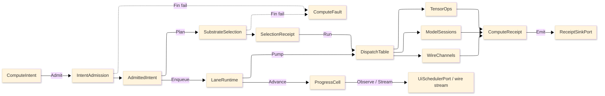

# [RASM_COMPUTE_ARCHITECTURE]

The domain map of `Rasm.Compute` — the APP-PLATFORM measured-execution package. One intent rail admits work once at the boundary, one substrate axis routes it over row data, bounded lanes carry it, and one `ComputeReceipt` union records every outcome across the Tensor, Symbolic, Model, Solver, Stats, and Runtime folders.

Each codemap node is the eventual source file its `.planning/` design page becomes, named in the language's own folder and file casing — PascalCase `.cs`, lowercase `.py`, lowercase `.ts`. Treat every node as realized code; the `.planning/` scaffold is the authoring substrate, never part of the map.

## [01]-[DOMAIN_MAP]

```text codemap
Rasm.Compute/
├── Tensor/                # CPU tensor vocabulary and BLAS-class numeric core
│   ├── Vocabulary.cs      # Tensor shapes/factories/dtype map and 107-row op-family table
│   ├── Layout.cs          # LayoutForm rows and ReshapeOp shape-edit request union
│   ├── Dispatch.cs        # Arity kernel-delegate tables with differentiable-adjoint law
│   ├── Residency.cs       # OrtValue C-data residency lattice and geometry-to-tensor encoding
│   ├── Memory.cs          # Bounded staging memory with a recyclable zero-copy stream pool
│   ├── Blas.cs            # RID-keyed LinearProvider dense BLAS/factorization/spectral core
│   ├── Factor.cs          # Sparse-format ingestion and criterion-stack iterative solve
│   ├── Quadrature.cs      # Accuracy-routed quadrature with adaptive control and spectral operator
│   └── Sampling.cs        # Owned Sobol/Halton sampler and radial-basis scatter reconstruction
├── Symbolic/              # Closed symbolic-expression CAS and unit boundary
│   ├── Expression.cs      # SymbolicExpr F# Expression algebra and differentiate/simplify/compile family
│   ├── Dimensional.cs     # DimensionMonomial SI base-dimension proof over a parsed expression
│   ├── Lowering.cs        # Content-keyed CompiledExpr cache and analytic-Jacobian arm
│   └── Units.cs           # UnitsNet boundary admitting unit-bearing input with dual unit evidence
├── Model/                 # ONNX model identity, sessions, inference, and generative runs
│   ├── Identity.cs        # Checksum identity, acquisition union, and schema snapshot
│   ├── Sessions.cs        # One shared session per checksum with compatibility-gated warm-start
│   ├── Providers.cs       # Execution-provider axis with autoEP discovery and quantization posture
│   ├── Inference.cs       # OrtValue-only run-mode fold with BoundLoop hot path and result cache
│   ├── Embedding.cs       # VectorEncoding/VectorScore embedding-and-retrieval owner
│   ├── Generative.cs      # ORT-GenAI token-streaming owner with EOS oracle and tool-call arm
│   └── Extension.cs       # Custom-op registration with bidirectional string-tensor boundary
├── Solver/                # Discretize→solve→optimize→sweep/clash solve spine
│   ├── Discretization.cs  # Volumetric MeshKernel with adaptive h/p/hp refinement
│   ├── Contract.cs        # Physics×BC×element solve fold with adaptive-recovery ladder
│   ├── Optimizer.cs       # Design-space search axis with ROM/GP/RBF surrogate duality
│   ├── Sweep.cs           # N-dim DOE sweep grid with Morris/Sobol sensitivity
│   ├── Clash.cs           # Acceleration-structure collision compute and ROM digital-twin loop
│   └── Uncertainty.cs     # Forward-UQ/reliability owner over same evaluate oracle
├── Stats/                 # Classical statistics, statistical learning, and DSP
│   ├── Estimator.cs       # One Estimator Fit/Predict axis: regression/GLM/PCA/clustering/classification/hypothesis/time-series
│   └── Signal.cs          # SpectralTransform FFT/STFT/PSD/wavelet axis and FIR/IIR FilterDesign over MathNet IntegralTransforms
└── Runtime/               # Admit-to-receipt boundary plane
    ├── Admission.cs       # Typed intent admission with substrate axis and total dispatch
    ├── Scheduling.cs      # Five bounded work-lanes with dependency job-graph scheduler
    ├── Progress.cs        # Monotonic phase family with an Atom-backed progress capsule
    ├── Receipts.cs        # One ComputeReceipt fact union and benchmark-claim table
    ├── Channels.cs        # Suite wire vocabulary of five proto services with contract-evolution law
    ├── Codecs.cs          # Field/result/geometry-delta codecs and tessellation bridge
    └── Payload.cs         # ResidencyKind meshlet/quantized/splat PAYLOAD codec
```

Implementation collapses to one owner per axis and one entrypoint family per rail: a new feature is a row or case on a budgeted owner, and a public type outside an owner region is the named defect. The rail is named in the return type — `Fin<T>` aborts at admission, `Validation<ComputeFault,T>` accumulates, `IO<T>` carries effects, `Option<T>` carries absence. The `ComputeFault` union projects through `FaultDetail` at the wire edge; receipts stamp NodaTime `Instant`/`Duration`, and AppHost `ClockPolicy` owns both clocks.

## [02]-[SEAMS]

```text seams
Runtime           ⇄  python:geometry/mesh                  # [CONTENT_KEY]: ContentIdentity XxHash128 + deflection/tolerance seed parity
Runtime/channels  →  typescript:interchange/codec          # [WIRE]: ReceiptEnvelopeWire / FaultDetailWire / proto vocabulary
Runtime/channels  →  typescript:interchange/contract       # [WIRE]: FileDescriptorSet ContractDrift verdict
Runtime/channels  →  typescript:platform/transport         # [WIRE]: ArtifactFrameWire reassembly
Runtime/channels  →  typescript:ui/render                  # [WIRE]: GeometryPayload proto descriptor / MeshTensor view
Runtime/channels  ⇄  python:runtime/transport              # [WIRE]: PROTO_VOCABULARY service contracts
Runtime/channels  ⇄  python:geometry/mesh                  # [WIRE]: ComputeService/ArtifactSync gRPC GLB tessellation
Runtime/progress  →  typescript:projection/evidence        # [WIRE]: ProgressMarkWire
Runtime           ←  python:geometry/mesh                  # [TRANSPORT]: ServerHost ComputeService/ArtifactSync GLB + semantic header
Runtime/codecs    ←  python:geometry/mesh                  # [PROJECTION]: IFC tessellation bridge via IfcOpenShell
Runtime/progress  →  typescript:interchange/codec          # [PROJECTION]: ProgressStore stream proto
Runtime           ←  python:geometry                       # [GRADUATION]: HandoffAxis geometry case: topology-graph / lifecycle / registration
Runtime           →  csharp:Rasm.AppUi/Render              # [PROJECTION]: ResidencyManifest.Mint web geometry residency
Solver            ←  csharp:Rasm.Bim/Model                 # [CONTENT_KEY]: AnalysisModel (GeometryKey, PropertyKey) content-key
Runtime           ←  csharp:Rasm.Bim/Semantics             # [PROJECTION]: IFC/glTF semantic metadata layer
Runtime/channels  →  csharp:Rasm.Bim/Semantics             # [TRANSPORT]: BsddPort injected bSDD GET /api/Class/v1 BsddClassResponse, LocalShape degrade
Runtime/codecs    ←  csharp:Rasm.Bim/Model                 # [CONTENT_KEY]: (GeometryKey, *Key) XxHash128.HashToUInt128 pair joining InterchangeIdentity
Runtime/codecs    ←  csharp:Rasm.Bim/Exchange              # [TESSELLATION]: TessellationOutcome two-hop GLB, CacheHit by ArtifactKey
Runtime/codecs    ←  csharp:Rasm.Bim/Review                # [TRANSPORT]: IdsAudit ifctester oracle two-hop rpc, GlobalId-plus-facet diff
Symbolic          ⇄  python:compute + typescript:interchange # [WIRE]: QuantityFamily SI canonicalization consumed by host-free peers over the wire (AEC-domain admits UnitsNet in-folder, never a downward reference)
Runtime           ⇄  csharp:Rasm.Persistence/Query/lanes   # [CONTENT_KEY]: EmbeddingIdentity content x model-id x arity
Runtime           ⇄  csharp:Rasm.Persistence/Version/commits # [GRADUATION]: HandoffAxis graduation evidence
Runtime           →  csharp:Rasm.Persistence               # [CONTENT_KEY]: content-keyed blob
Runtime/codecs    ⇄  csharp:Rasm.Persistence/Query/cache   # [CONTENT_KEY]: ContentIdentity XxHash128 seed-zero two-half
Runtime/codecs    →  python:runtime/evidence/identity + typescript:interchange/Codec/frame # [WIRE]: XxHash128 seed-zero two-half [gated: hash-wasm / xxhash cp315]
Runtime           ←  csharp:Rasm.Persistence/Sync          # [PROJECTION]: content-key delta via FastCDC
Tensor/device     ⇄  csharp:Rasm.AppUi/Render              # [SHAPE]: shared ONE_WGPU_DEVICE (Silk.NET.WebGPU)
Runtime/admission ←  csharp:Rasm.AppHost                   # [PORT]: WorkLane shed verdict (ONE_DEGRADATION_SHED_VERDICT)
Runtime/codecs    ⇄  csharp:Rasm.Persistence/Query/pipeline # [PORT]: parse-to-canonical-bytes (Extract)
Compute           →  csharp:Rasm.Persistence/Store/quality # [SHAPE]: geometry-derived anomaly rule source
Runtime/codecs    ⇄  csharp:Rasm.Bim                       # [SHAPE]: SharpGLTF/meshopt leg split — Compute composes residency/transport meshopt-encode, Bim authors per-tile EXT_structural_metadata/EXT_mesh_features glTF encode at interchange/codecs#TILE_PARTITION
Model             →  csharp:Rasm.AppHost                   # [PORT]: Compute IEmbeddingGenerator/IChatClient draw governed/priced by the AppHost Microsoft.Extensions.AI middleware (Microsoft.Extensions.AI.Abstractions contract)
Runtime/channels  →  csharp:Rasm.Persistence/Sync          # [WIRE]: Google.Protobuf wire format the Persistence Confluent.SchemaRegistry.Serdes.Protobuf leg composes for registry-governed Protobuf Kafka topics
Solver            ⇄  csharp:Rasm/Geometry                  # [SHAPE]: SpatialIndex.ToAcceleration BVH/octree node arrays into the GPU/parallel acceleration structure; Geometry/Processing/solver consumes the Compute LM/constraint Solver rail
Runtime           ⇄  python:compute/graduation             # [GRADUATION]: HandoffAxis graduation evidence
Runtime           →  python:compute/graduation             # [WIRE]: EvidenceBundle graduation-evidence wire
Runtime           ←  python:compute/solvers                # [PROJECTION]: SolverReceipt convergence verdict
Runtime           ←  python:data/tabular                   # [SHAPE]: DOE dataset / labelled-array study input
Runtime           ←  python:data/spatial/geospatial        # [SHAPE]: GeoArrow buffers share GLB tessellation wire layout
```

## [03]-[SPINE]



`ComputeIntent` admits through `IntentAdmission` into an `AdmittedIntent`; `SubstrateSelection` folds over substrate rows and lands a `SelectionReceipt`; `LaneRuntime` enqueues onto bounded lanes and pumps into `DispatchTable`, which routes to `TensorOps`, `ModelSessions`, or `WireChannels`; every lane emits `ComputeReceipt` cases through `ReceiptSinkPort`, admission and selection failures land on `ComputeFault`, and `ProgressCell` delivers cadence-gated marks to UI and wire observers.

## [04]-[SEAM_PROHIBITIONS]

The cross-folder seam invariants every Compute owner checks itself against before crossing a strata or runtime boundary. A seam that violates a row is the named defect the reviewer rejects by pointing at this block.

| [INDEX] | [SEAM] | [INVARIANT] | [REJECTED_FORM] |
| :-----: | ------ | ----------- | --------------- |
| [01] | device residency | The `Substrate.DeviceWgpu` row binds the AppUi-owned `ONE_WGPU_DEVICE` `Device`/`Queue`; Compute mints no second device and holds the compute-only resources only. | A second `Device`/`Queue` acquisition inside the Compute lane; a parallel device-residency lattice beside `OrtResidency.DeviceResident`. |
| [02] | host-neutral lane | A host geometry type never enters a lane signature; host geometry folds inside `Tensor/residency` `GeometryPacking` only. | A `RhinoCommon`/host type on an interior `Tensor`/`Solve`/`Estimator` signature. |
| [03] | bSDD / ifctester / tessellation | Compute owns the channel and the companion-rpc orchestration; Bim owns the response/IDS/semantic projection and the `LocalShape` degrade. | A Compute-side bSDD response projection, IDS parser, or IFC semantic read; a Bim-minted transport. |
| [04] | units ingress | `Symbolic/units` owns the `QuantityFamily` SI-canonicalization for Compute-internal admission and the host-free peers (Python/TypeScript) decode the canonicalized scalar over the wire. The AEC-domain folders (`Rasm.Materials`, `Rasm.Fabrication`) admit `UnitsNet` IN-FOLDER at their own boundary — `Rasm.Fabrication/Process` at `RemovalParameter.Admit`, `Rasm.Materials/Appearance` photometric at its own admission — because the strata graph is acyclic (app-platform consumes AEC-domain, never the reverse). | A `Rasm.Compute` PROJECT REFERENCE from an AEC-domain folder to read this units owner — the forbidden AEC→app-platform downward edge; a Compute page asserting an AEC consumer reads its units export over a reference. |
| [05] | least-squares / spectral | `Tensor/blas` owns `LevenbergMarquardt`/thin-QR and `Model/inference` owns the ONNX spectral run for Compute-internal solves and the host-free graduation/inference peers. The AEC-domain `Rasm.Materials` BRDF fit and spectral grounding stay IN-FOLDER (the `FitRoughness` heuristic, the in-folder `SpectralUpsample`); the algorithms-doc thin-QR fit is a doctrine reference the Materials probe cites, never a Compute project reference. | A `Rasm.Compute` PROJECT REFERENCE or a "MathNet transitive via Rasm.Compute" claim from `Rasm.Materials` — the forbidden AEC→app-platform downward edge; a Compute page asserting the Materials fit reads its solver over a reference. |
| [06] | graduation evidence | Offline-learned models (deep training, learned input distributions, PCE/neural-field surrogates, residual predictors) are the Python companion's, decoded by content key over `ONE_GRADUATION_EVIDENCE`; C# owns inference plus classical fit. | An in-proc deep-training or distribution-learning loop in C#. |

## [05]-[PROHIBITIONS]

The authoritative prohibition set on the package spine that every new owner row checks itself against, collapsing the scattered per-page deleted-form sentences into one enumerated invariant set with code-band custody. Every device/sparse/autodiff/stats/UQ/optimizer capability is a row or case on an existing owner, never a sibling owner or a second state machine.

| [INDEX] | [PROHIBITION] | [CANONICAL_OWNER] | [PAGE] |
| :-----: | ------------- | ----------------- | ------ |
| [01] | No package-local tensor wrapper / `TensorService` beside `System.Numerics.Tensors` `Tensor<T>`; no `DeviceTensor`/`GpuTensor` parallel type (device-ness is the `OrtResidency.DeviceResident` discriminant). | `Tensor<T>` + span views; `OrtResidency` | `Tensor/vocabulary`, `Tensor/residency` |
| [02] | No hand-rolled BLAS/factorization beside the MathNet `LinearProvider` stack and CSparse direct factors; no `RasmMatrix`/`DenseMatrix` wrapper; no hand-rolled FFT/SVD/normal-equations/LM loop. | `LinearProvider`/`DenseOps`/`LevenbergMarquardt`; `SparseOps`/`SparseTensorOps` | `Tensor/blas`, `Tensor/factor` |
| [03] | Symbolic/device/learning/constitutive faults extend the `ComputeFault` 2200 band at the next-free code (`CacheCorrupt` is 2212, so 2213+), never a parallel fault union or a status-code-plus-string terminal — every fault crosses the wire through the one `FaultDetail` family. | `ComputeFault` (`Runtime/admission`) | `Runtime/admission`, `Runtime/channels` |
| [04] | No string-eval in the solver/optimizer/UQ/constitutive `evaluate` oracle — the `Func<DesignPoint, Fin<Seq<double>>>` contract is the only coupling point; an OR-Tools `CpModel` builds through the typed model-builder API, never a string-parsed model. | `evaluate` oracle (`Solver/optimizer`, `Solver/uncertainty`) | `Solver/optimizer`, `Solver/uncertainty`, `Solver/contract` |
| [05] | One `HybridCache` per lane, no per-call cache instance; one shared session per model identity. | lane custody (`Runtime/scheduling`) | `Runtime/scheduling`, `Model/sessions` |
| [06] | Every new accelerator/sparse/AD/estimator/optimizer/UQ capability is a row or case on an existing owner (a `Substrate` row, a `SparseTensorOpFamily` row, a `DifferentiableOp`+`Forward` pair, an `EstimatorKind` row, an `OptimizerKind` row, an `UncertaintyMethod` row, a `ConstitutiveModel` case), never a sibling owner or a second admission spine. | the budgeted owner blocks | all `.planning/**` |

The `ComputeFault` 2200 band runs `Text` 2200 .. `CacheCorrupt` 2212, so the next-free code is 2213 — a symbolic/device/learning/constitutive fault row enters at 2213+ and never collides with an existing code; the `HybridCache`-per-lane clause aligns with the `Runtime/scheduling` lane custody and the no-parallel-fault clause aligns with the `Runtime/channels` `FaultDetail` projection so device/symbolic faults still cross the wire through the one family.
