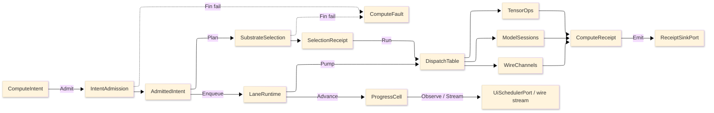

# [RASM_COMPUTE_ARCHITECTURE]

The professional domain map of `Rasm.Compute` — the APP-PLATFORM measured-execution package. One intent rail admits work once at the boundary, one substrate axis routes it over row data, bounded lanes carry it, and one `ComputeReceipt` union records every outcome across the five folders (Tensor, Symbolic, Model, Solver, Runtime).

Each codemap node is the eventual source file its `.planning/` design page becomes, named in the language's own folder and file casing — PascalCase `.cs`, lowercase `.py`, lowercase `.ts`. Treat every node as realized code; the `.planning/` scaffold is the authoring substrate, never part of the map.

## [1]-[DOMAIN_MAP]

```text codemap
Rasm.Compute/
├── Tensor/                # the CPU tensor vocabulary and BLAS-class numeric core
│   ├── Vocabulary.cs      # tensor shapes/factories/dtype map and the 107-row op-family table
│   ├── Layout.cs          # LayoutForm rows and the ReshapeOp shape-edit request union
│   ├── Dispatch.cs        # arity kernel-delegate tables with the differentiable-adjoint law
│   ├── Residency.cs       # OrtValue C-data residency lattice and geometry-to-tensor encoding
│   ├── Memory.cs          # bounded staging memory with a recyclable zero-copy stream pool
│   ├── Blas.cs            # the RID-keyed LinearProvider dense BLAS/factorization/spectral core
│   ├── Factor.cs          # sparse-format ingestion and the criterion-stack iterative solve
│   ├── Quadrature.cs      # accuracy-routed quadrature with adaptive control and spectral operator
│   └── Sampling.cs        # the owned Sobol/Halton sampler and radial-basis scatter reconstruction
├── Symbolic/              # the closed symbolic-expression CAS and the unit boundary
│   ├── Expression.cs      # the SymbolicExpr F# Expression algebra and differentiate/simplify/compile family
│   ├── Dimensional.cs     # the DimensionMonomial SI base-dimension proof over a parsed expression
│   ├── Lowering.cs        # the content-keyed CompiledExpr cache and analytic-Jacobian arm
│   └── Units.cs           # the UnitsNet boundary admitting unit-bearing input with dual unit evidence
├── Model/                 # ONNX model identity, sessions, inference, and generative runs
│   ├── Identity.cs        # checksum identity, the acquisition union, and the schema snapshot
│   ├── Sessions.cs        # one shared session per checksum with compatibility-gated warm-start
│   ├── Providers.cs       # the execution-provider axis with autoEP discovery and quantization posture
│   ├── Inference.cs       # the OrtValue-only run-mode fold with the BoundLoop hot path and result cache
│   ├── Embedding.cs       # the VectorEncoding/VectorScore embedding-and-retrieval owner
│   ├── Generative.cs      # the ORT-GenAI token-streaming owner with EOS oracle and tool-call arm
│   └── Extension.cs       # custom-op registration with the bidirectional string-tensor boundary
├── Solver/                # the discretize→solve→optimize→sweep/clash solve spine
│   ├── Discretization.cs  # the volumetric MeshKernel with adaptive h/p/hp refinement
│   ├── Contract.cs        # the physics×BC×element solve fold with adaptive-recovery ladder
│   ├── Optimizer.cs       # the design-space search axis with ROM/GP/RBF surrogate duality
│   ├── Sweep.cs           # the N-dim DOE sweep grid with Morris/Sobol sensitivity
│   ├── Clash.cs           # acceleration-structure collision compute and the ROM digital-twin loop
│   └── Uncertainty.cs     # the forward-UQ/reliability owner over the same evaluate oracle
└── Runtime/               # the admit-to-receipt boundary plane
    ├── Admission.cs       # typed intent admission with the substrate axis and total dispatch
    ├── Scheduling.cs      # five bounded work-lanes with the dependency job-graph scheduler
    ├── Progress.cs        # the monotonic phase family with an Atom-backed progress capsule
    ├── Receipts.cs        # the one ComputeReceipt fact union and benchmark-claim table
    ├── Channels.cs        # the suite wire vocabulary of five proto services with contract-evolution law
    ├── Codecs.cs          # the field/result/geometry-delta codecs and tessellation bridge
    └── Payload.cs         # the ResidencyKind meshlet/quantized/splat PAYLOAD codec
```

Implementation collapses to one owner per axis and one entrypoint family per rail: a new feature is a row or case on a budgeted owner, and a public type outside an owner region is the named defect. The rail is named in the return type — `Fin<T>` aborts at admission, `Validation<ComputeFault,T>` accumulates, `IO<T>` carries effects, `Option<T>` carries absence. The `ComputeFault` union projects through `FaultDetail` at the wire edge; receipts stamp NodaTime `Instant`/`Duration`, and AppHost `ClockPolicy` owns both clocks.

## [2]-[SEAMS]

```text seams
Runtime           ⇄  python:geometry/mesh             # ContentIdentity XxHash128 + deflection/tolerance seed parity (content-key)
Runtime           ←  python:geometry/graph            # HandoffAxis geometry case topology-graph (graduation)
Runtime           ←  python:geometry/ifc              # HandoffAxis geometry case lifecycle quantity/cost (graduation)
Runtime           ←  python:geometry/scan             # HandoffAxis geometry case registration-transform (graduation)
Runtime/channels  →  typescript:interchange/codec     # ReceiptEnvelopeWire / FaultDetailWire / proto vocabulary (wire)
Runtime/channels  →  typescript:interchange/contract  # FileDescriptorSet ContractDrift verdict (wire)
Runtime/channels  →  typescript:platform/transport    # ArtifactFrameWire reassembly (wire)
Runtime/channels  →  typescript:ui/render             # GeometryPayload proto descriptor / MeshTensor view (wire)
Runtime/channels  ⇄  python:runtime/transport         # PROTO_VOCABULARY service contracts (wire)
Runtime/channels  ⇄  python:geometry/mesh             # ComputeService/ArtifactSync gRPC GLB tessellation (wire)
Runtime/progress  →  typescript:projection/evidence   # ProgressMarkWire (wire)
Runtime           ←  python:geometry/mesh             # ServerHost ComputeService/ArtifactSync GLB + semantic header (transport)
Runtime/codecs    ⇄  python:runtime/transport         # IFC tessellation bridge via IfcOpenShell (projection)
Runtime/progress  →  typescript:interchange/codec     # ProgressStore stream proto (projection)
```

## [3]-[SPINE]



`ComputeIntent` admits through `IntentAdmission` into an `AdmittedIntent`; `SubstrateSelection` folds over substrate rows and lands a `SelectionReceipt`; `LaneRuntime` enqueues onto bounded lanes and pumps into `DispatchTable`, which routes to `TensorOps`, `ModelSessions`, or `WireChannels`; every lane emits `ComputeReceipt` cases through `ReceiptSinkPort`, admission and selection failures land on `ComputeFault`, and `ProgressCell` delivers cadence-gated marks to UI and wire observers.
