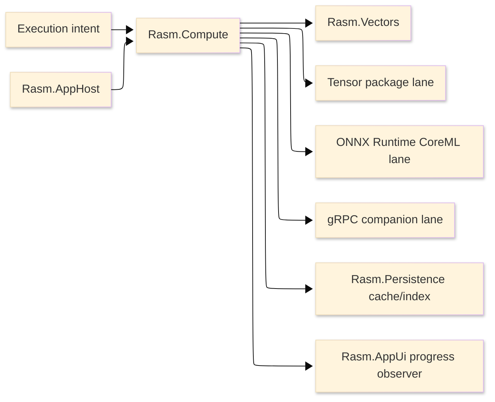

# [RASM_COMPUTE_ARCHITECTURE]

`Rasm.Compute` owns measured execution doctrine. It keeps algorithm ownership, model execution, remote dispatch, progress, and benchmark claims explicit and unified.

## [1]-[SYSTEM_SCOPE]

Text equivalent: Compute selects execution substrate and emits receipts; AppHost dispatches and drains; Persistence stores cache/index artifacts; AppUi observes progress.

## [2]-[REFERENCE_DIRECTION]

| [INDEX] | [PROJECT]          | [RELATION]                                 |
| :-----: | ------------------ | ------------------------------------------ |
|   [1]   | `Rasm`             | Kernel and vector algorithm source         |
|   [2]   | `Rasm.AppHost`     | Runtime policy and dispatch owner          |
|   [3]   | `Rasm.Persistence` | Cache/index owner through store dispatch   |
|   [4]   | `Rasm.AppUi`       | Observer only; no UI scheduling in Compute |
|   [5]   | Rhino/GH2          | No direct dependency in Compute            |

Compute references AppHost for runtime policy. AppHost does not reference Compute.

## [3]-[EXECUTION_LIFECYCLE]

Every operation follows one lifecycle:

| [INDEX] | [STATE]              | [MEANING]                                                               | [ALLOWED_NEXT]                |
| :-----: | -------------------- | ----------------------------------------------------------------------- | ----------------------------- |
|   [1]   | Accepted             | Intent is typed, bounded, and correlated                                | Selecting, Rejected           |
|   [2]   | Selecting            | Substrate predicates evaluate in deterministic order                    | Preparing, Rejected           |
|   [3]   | Preparing            | Inputs, cache keys, model handles, and remote payloads are materialized | Executing, Cancelled, Faulted |
|   [4]   | Executing            | Vector, tensor, model, or remote lane runs                              | Measuring, Cancelled, Faulted |
|   [5]   | Measuring            | Timing, allocation, equivalence, and cache evidence fold                | MaterializingReceipt, Faulted |
|   [6]   | MaterializingReceipt | Output and evidence become one typed receipt                            | Completed, Degraded, Faulted  |
|   [7]   | Completed            | Terminal success                                                        | None                          |
|   [8]   | Cancelled            | Terminal cooperative cancellation                                       | None                          |
|   [9]   | Rejected             | Terminal selection failure                                              | None                          |
|  [10]   | Degraded             | Terminal usable result with explicit degraded evidence                  | None                          |
|  [11]   | Faulted              | Terminal typed failure                                                  | None                          |

Lifecycle state is not a UI progress label. Progress observes lifecycle and reports bounded phase, fraction, elapsed time, allocation class, and correlation.

## [4]-[SUBSTRATE_MATRIX]

| [INDEX] | [SUBSTRATE] | [CONTRACT]                                               | [PROOF]                                     |
| :-----: | ----------- | -------------------------------------------------------- | ------------------------------------------- |
|   [1]   | Vectors     | Active core; calls `Rasm.Vectors` algorithms             | Managed laws and benchmark baselines        |
|   [2]   | Tensor      | `System.Numerics.Tensors` package with measured consumer | Tensor benchmarks and equivalence           |
|   [3]   | Model       | `Microsoft.ML.OnnxRuntime` with model registry source    | Native load, CoreML EP, CPU baseline        |
|   [4]   | Remote      | `Grpc.Net.Client`/`Google.Protobuf` with proto source    | Companion contract, payload and retry proof |

`UnitsNet` belongs to external physical-unit boundaries. It is not a parallel scalar model.

## [5]-[CONTRACT_SHAPES]

Compute public shapes use typed values for model identity, endpoint identity, artifact path, progress phase, payload bounds, allocation class, substrate, and execution failure. Nullable/string sketches are not public contract shapes.

Required receipt families:

| [INDEX] | [RECEIPT] | [EVIDENCE]                                                       |
| :-----: | --------- | ---------------------------------------------------------------- |
|   [1]   | Execution | Substrate, elapsed time, allocation, cancellation, failure       |
|   [2]   | Benchmark | Baseline, comparator, equivalence, allocation, artifact reference |
|   [3]   | Model     | Model identity, load timing, inference timing, cache state       |
|   [4]   | Remote    | Endpoint identity, deadline, payload size, attempts, retry owner |
|   [5]   | Progress  | Lifecycle phase, fraction, elapsed time, allocation state        |

The receipt rail is one polymorphic family. Parallel per-lane result systems are rejected.

## [6]-[PROGRESS_CONTRACT]

Progress is subscription-gated:

| [INDEX] | [RULE]        | [CONTRACT]                                                  |
| :-----: | ------------- | ----------------------------------------------------------- |
|   [1]   | Allocation    | No Rx object is allocated when progress is unobserved       |
|   [2]   | Scheduling    | Compute never calls `ObserveOn`                             |
|   [3]   | Completion    | Success and cancellation complete the stream                |
|   [4]   | Faults        | Faults return in execution receipts; no `OnError` rail      |
|   [5]   | Monotonicity  | Fraction never decreases; unknown fraction is explicit      |
|   [6]   | Subject usage | Any internal subject is hot, serialized, completed, private |

AppUi observes on its scheduler. GH2 solve code never blocks on model or remote execution.

## [7]-[MODEL_LANE]

ONNX Runtime/CoreML rules:

| [INDEX] | [RULE]       | [CONTRACT]                                                      |
| :-----: | ------------ | --------------------------------------------------------------- |
|   [1]   | Provider API | Managed CoreML execution-provider options are explicit          |
|   [2]   | Native probe | `libonnxruntime.dylib` resolves before session creation         |
|   [3]   | Thread cap   | ORT thread pools stay below host display/mesh contention levels |
|   [4]   | Cache key    | Model identity includes content hash and provider options       |
|   [5]   | CoreML cache | Stale compiled model cache is handled by model-key policy       |
|   [6]   | Equivalence  | CPU baseline validates CoreML/ANE tolerance and fp16 downcast   |

`Microsoft.ML.OnnxRuntime.Extensions` belongs to custom pre/post-processing operations. Compute does not use ML.NET.

## [8]-[REMOTE_LANE]

Remote compute uses gRPC as a companion contract:

| [INDEX] | [CONCERN]       | [OWNER]                                              |
| :-----: | --------------- | ---------------------------------------------------- |
|   [1]   | Client package  | `Grpc.Net.Client`                                    |
|   [2]   | Message package | `Google.Protobuf`                                    |
|   [3]   | Code generation | `Grpc.Tools` only in the proto-owning source project |
|   [4]   | Retry           | AppHost outbound-hop policy                          |
|   [5]   | Payload limits  | Compute intent and remote receipt                    |
|   [6]   | Endpoint trust  | Companion/AppHost config                             |

Compute emits retry-owner conflict evidence if a second retry owner appears on the same hop.

## [9]-[BENCHMARK_AND_ARTIFACTS]

BenchmarkDotNet evidence lives under `tests/csharp/_benchmarks`. Compute benchmark rows join the existing benchmark project; per-library benchmark projects are not created. Persistence indexes benchmark artifact metadata and retention state.

## [10]-[PACKAGE_LANES]

Package lanes are implementation contracts for one execution rail.

[CORE]:
- Package set: `LanguageExt.Core`, `Thinktecture.Runtime.Extensions`.
- Contract: global workspace references supply effects and generated shapes.

[PROGRESS]:
- Surface set: `System.IObservable<T>`.
- Contract: progress contracts use the in-box interface; Compute does not require a public Rx package surface for progress.

[TENSOR]:
- Package set: `System.Numerics.Tensors`.
- Contract: tensor execution is a measured substrate row with equivalence and allocation evidence.

[STAGING]:
- Package set: `CommunityToolkit.HighPerformance`.
- Contract: span, memory, and pooling helpers support measured staging paths without becoming public vocabulary.

[MODEL]:
- Package set: `Microsoft.ML.OnnxRuntime`.
- Contract: ONNX/CoreML execution uses model identity, provider options, native-load receipts, CPU baseline, and cache keys.

[REMOTE]:
- Package set: `Grpc.Net.Client`, `Google.Protobuf`.
- Contract: remote companion execution uses typed endpoint identity, payload bounds, deadline, retry-owner evidence, and receipts.

[PROTO]:
- Package set: `Grpc.Tools`.
- Contract: code generation is private to the proto-owning source project.

[UNITS]:
- Package set: `UnitsNet`.
- Contract: external physical-unit boundaries fold into typed intent and measurement receipts.

[STREAM_POOL]:
- Package set: `Microsoft.IO.RecyclableMemoryStream`.
- Contract: stream-shaped hot paths use pooled streams with allocation and lifetime evidence.

Rejected: TorchSharp, ML.NET/`MLContext`, PLINQ, ComputeSharp/Metal direct compute, DirectML/GPU packages, server-side gRPC packages, MessagePack/MemoryPack in Compute.

## [11]-[PROOF]

| [INDEX] | [RAIL]       | [REQUIRED_PROOF]                                                        |
| :-----: | ------------ | ----------------------------------------------------------------------- |
|   [1]   | Build        | Compute project restores as a package scaffold                          |
|   [2]   | Architecture | Compute does not reference AppUi/Rhino/GH2/Persistence implementation   |
|   [3]   | Managed laws | Selection, receipt, failure, and progress monotonicity                  |
|   [4]   | Benchmarks   | Input-class timing/allocation/equivalence                               |
|   [5]   | Runtime      | ONNX native/CoreML and gRPC companion scenarios                         |
