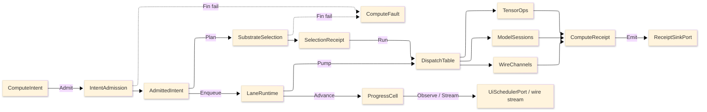

# [RASM_COMPUTE_ARCHITECTURE]

`Rasm.Compute` owns measured execution: one intent rail admits work exactly once at the boundary, one substrate axis routes it over row data, bounded lanes carry it, and one receipt union records every outcome at the sink edge. Mechanics live in the `.planning/` pages; this page renders the planned source tree, names the execution spine, and routes the rails, axes, and cross-package seams. Per-cluster package owners live on the planning-page cards; versions live in `Directory.Packages.props`.

## [1]-[SOURCE_TREE]

The planned non-flat implementation layout: namespaced sub-folders, one leaf per charter BUILD_ORDER file, each annotated with the owners it transcribes and the page#cluster that legislates them. Vocabulary owners land first, then shapes, rails, dispatch surfaces, boundaries, and composition.

```text codemap
Rasm.Compute/
├── Faults.cs                  # ComputeFault, *KeyPolicy — intent-and-selection#DISPATCH_SPINE
├── Tensors/
│   ├── Vocabulary.cs          # TensorDtype, EncodingChannel, GeometryEncoding — tensor-lane#TENSOR_VOCABULARY, tensor-lane#GEOMETRY_ENCODING
│   ├── Operations.cs          # TensorOpKind, TensorOpFamily, TensorOps — tensor-lane#OPERATION_TABLE, tensor-lane#KERNEL_DISPATCH
│   └── Layout.cs              # LayoutForm, ToleranceClass, TensorLayout, EquivalenceLaw — tensor-lane#LAYOUT_ALGEBRA, tensor-lane#EQUIVALENCE_INTEROP
├── Units.cs                   # QuantityFamily — units-boundary#QUANTITY_TABLE, units-boundary#PARSE_FORMAT
├── Staging.cs                 # AllocationClass, StreamPool — staging-and-streams#ALLOCATION_AXIS, staging-and-streams#STREAM_POOL
├── Progress.cs                # ProgressPhase, SubscriptionPolicy, ProgressCell — progress-and-observation#PHASE_FAMILY, progress-and-observation#OBSERVATION_SEAMS
├── Lanes.cs                   # WorkLane — scheduling-and-lanes#LANE_AXIS, scheduling-and-lanes#CPU_BUDGET
├── Protos/
│   └── Compute.proto          # WireServices, FaultDetail, ArtifactFrame — remote-lane#PROTO_VOCABULARY, remote-lane#ARTIFACT_FRAMES
├── Models/
│   ├── Providers.cs           # ExecutionProvider — model-lane#EP_AXIS
│   ├── Identity.cs            # ModelSource — model-lane#MODEL_IDENTITY
│   ├── Sessions.cs            # ModelSessions, RunOps, GenerationPolicy, GuidanceKind, GenerativeRun — model-lane#SESSION_CAPSULE, model-lane#INFERENCE_MODES, model-lane#GENERATIVE_RUN
│   └── Cache.cs               # CachePolicy, CacheOps — model-lane#RESULT_CACHE
├── Numeric/
│   └── Lane.cs                # LinearProvider, FactorizationKind, Factorization, DenseOps, SparseFormat, SparseOps, KernelLowering, ShardPlan, NumericKeyPolicy — numeric-lane#DENSE_ALGEBRA, numeric-lane#SPARSE_SOLVE, numeric-lane#KERNEL_LOWERING, numeric-lane#PROVIDER_CLAIMS
├── Interchange/
│   └── Interchange.cs         # InterchangeFormat, InterchangeCodec, InterchangeIo, FrameNormalization, UpAxis, Handedness, IfcSemanticModel, PointScan, FieldCodec, FieldArtifact, DeltaCodec, GeometryDeltaKind, GeometryDelta, TileSet, TessellationRequest, InterchangeIdentity, InterchangeKeyPolicy — interchange#FORMAT_AXIS, interchange#IMPORT_RAIL, interchange#EXPORT_RAIL, interchange#FIELD_RESULT_CODEC, interchange#GEOMETRY_DELTA, interchange#TWO_HOP_TESSELLATION, interchange#CONTENT_ADDRESSING
├── Solver/
│   └── Lane.cs                # ElementClass, MeshAlgorithm, FieldStation, FieldSpace, DiscreteMesh, MeshKernel, PhysicsKind, BoundaryCondition, SolveMethod, SolveProblem, SolveResult, SolveLane, OptimizerKind, DesignVariable, ObjectiveSense, DesignProblem, ParetoFront, Optimizer, Surrogate, SweepAxis, SweepGrid, FrameBudget, SensitivityTornado, SweepLane, AccelerationStructure, ClashScale, ClashPair, DigitalTwin, TwinSignal, SolverKeyPolicy — solver-and-optimization#DISCRETIZATION_MESH, solver-and-optimization#SOLVE_CONTRACT, solver-and-optimization#OPTIMIZER_LANE, solver-and-optimization#SWEEP_AND_BUDGET, solver-and-optimization#CLASH_AND_TWIN
├── Remote/
│   ├── Contract.cs            # ContractDrift, ContractGuard — remote-lane#CONTRACT_EVOLUTION, remote-lane#FAULT_PROJECTION
│   ├── Frames.cs              # FrameEdge — remote-lane#ARTIFACT_FRAMES
│   └── Transports.cs          # RemoteTransport, CredentialPolicy, WireChannels, CallSpine — remote-lane#TRANSPORT_AXIS, remote-lane#CALL_POLICY
├── Intent.cs                  # ComputeIntent, Substrate, DispatchTable, IntentAdmission, SubstrateSelection — intent-and-selection#INTENT_FAMILY, intent-and-selection#SUBSTRATE_AXIS
├── LaneRuntime.cs             # LaneRuntime — scheduling-and-lanes#SOLVE_GUARD, scheduling-and-lanes#DRAIN_CANCEL
├── Receipts.cs                # ComputeReceipt, ReceiptSurface, HostFingerprint — receipts-and-benchmarks#RECEIPT_UNION, receipts-and-benchmarks#WIRE_STAMPS
└── Benchmarks.cs              # BenchmarkClaim — receipts-and-benchmarks#BENCHMARK_CLAIMS
```

## [2]-[SPINE]



Text equivalent: `ComputeIntent` admits through `IntentAdmission` into an `AdmittedIntent`; `SubstrateSelection` folds over substrate rows and lands a `SelectionReceipt`; `LaneRuntime` enqueues onto bounded lanes and pumps into `DispatchTable`, which routes to `TensorOps`, `ModelSessions`, or `WireChannels`; every lane emits `ComputeReceipt` cases through `ReceiptSinkPort`, admission and selection failures land on `ComputeFault`, and `ProgressCell` delivers cadence-gated marks to UI and wire observers.

## [3]-[RAILS]

| [INDEX] | [RAIL]    | [CARRIER]                       | [LAW]                                                                           |
| :-----: | :-------- | :------------------------------ | :------------------------------------------------------------------------------ |
|   [1]   | Admission | `Fin<AdmittedIntent>`           | Validation runs exactly once at the boundary; interiors never re-validate       |
|   [2]   | Faults    | `ComputeFault` union, band 2200 | Dual-tier `Create`; projects through `FaultDetail` at the wire edge             |
|   [3]   | Effects   | `IO<T>`                         | Enqueue, dispatch, emission, channel observation; no exceptions in domain logic |
|   [4]   | Absence   | `Option<T>`                     | Substrate vetoes, forced overrides, fallback rows, sentinel projection          |
|   [5]   | Receipts  | `ComputeReceipt` union          | Fifteen cases materialize at the sink edge; hot paths stay struct-only          |
|   [6]   | Progress  | `ProgressCell` CAS rank guard   | Monotonic rank; observers structurally never observe regress                    |

## [4]-[AXES]

| [INDEX] | [AXIS]              | [OWNER]                 | [ROWS/CASES] | [PAGE#CLUSTER]                              |
| :-----: | :------------------ | :---------------------- | :----------: | :------------------------------------------ |
|   [1]   | Intent family       | `ComputeIntent`         |      6       | intent-and-selection#INTENT_FAMILY          |
|   [2]   | Substrate axis      | `Substrate`             |      4       | intent-and-selection#SUBSTRATE_AXIS         |
|   [3]   | Fault family        | `ComputeFault`          |      13      | intent-and-selection#DISPATCH_SPINE         |
|   [4]   | Tensor dtypes       | `TensorDtype`           |      10      | tensor-lane#TENSOR_VOCABULARY               |
|   [5]   | Tensor op families  | `TensorOpFamily`        |      84      | tensor-lane#OPERATION_TABLE                 |
|   [6]   | Layout algebra      | `LayoutForm`            |      5       | tensor-lane#LAYOUT_ALGEBRA                  |
|   [7]   | Geometry encodings  | `GeometryEncoding`      |      3       | tensor-lane#GEOMETRY_ENCODING               |
|   [8]   | Model acquisition   | `ModelSource`           |      4       | model-lane#MODEL_IDENTITY                   |
|   [9]   | Execution providers | `ExecutionProvider`     |      2       | model-lane#EP_AXIS                          |
|  [10]   | Cache postures      | `CachePolicy`           |      4       | model-lane#RESULT_CACHE                     |
|  [11]   | Wire services       | `WireServices`          |  5 / 18 rpc  | remote-lane#PROTO_VOCABULARY                |
|  [12]   | Contract drift      | `ContractDrift`         |      3       | remote-lane#CONTRACT_EVOLUTION              |
|  [13]   | Transports          | `RemoteTransport`       |      4       | remote-lane#TRANSPORT_AXIS                  |
|  [14]   | Credentials         | `CredentialPolicy`      |      4       | remote-lane#CALL_POLICY                     |
|  [15]   | Allocation classes  | `AllocationClass`       |      5       | staging-and-streams#ALLOCATION_AXIS         |
|  [16]   | Work lanes          | `WorkLane`              |      5       | scheduling-and-lanes#LANE_AXIS              |
|  [17]   | Progress phases     | `ProgressPhase`         |      9       | progress-and-observation#PHASE_FAMILY       |
|  [18]   | Quantity families   | `QuantityFamily`        |      15      | units-boundary#QUANTITY_TABLE               |
|  [19]   | Receipt union       | `ComputeReceipt`        |      21      | receipts-and-benchmarks#RECEIPT_UNION       |
|  [20]   | Claim bands         | `BenchmarkClaim`        |      4       | receipts-and-benchmarks#BENCHMARK_CLAIMS    |
|  [21]   | BLAS provider table | `LinearProvider`        |      3       | numeric-lane#DENSE_ALGEBRA                  |
|  [22]   | Factorization union | `Factorization`         |      5       | numeric-lane#DENSE_ALGEBRA                  |
|  [23]   | Sparse format axis  | `SparseFormat`          |      4       | numeric-lane#SPARSE_SOLVE                   |
|  [24]   | Shard plan          | `ShardPlan`             |      2       | numeric-lane#KERNEL_LOWERING                |
|  [25]   | Generation policy   | `GenerationPolicy`      |   14 cols    | model-lane#GENERATIVE_RUN                   |
|  [26]   | Guidance constraint | `GuidanceKind`          |      5       | model-lane#GENERATIVE_RUN                   |
|  [27]   | Interchange format  | `InterchangeFormat`     |      22      | interchange#FORMAT_AXIS                     |
|  [28]   | Interchange codec   | `InterchangeCodec`      |      7       | interchange#FORMAT_AXIS                     |
|  [29]   | Geometry delta kind | `GeometryDeltaKind`     |      5       | interchange#GEOMETRY_DELTA                  |
|  [30]   | Job state           | `JobState`              |      8       | scheduling-and-lanes#JOB_GRAPH              |
|  [31]   | Element topology    | `ElementClass`          |      9       | solver-and-optimization#DISCRETIZATION_MESH |
|  [32]   | Mesh algorithm      | `MeshAlgorithm`         |      5       | solver-and-optimization#DISCRETIZATION_MESH |
|  [33]   | Physics axis        | `PhysicsKind`           |      9       | solver-and-optimization#SOLVE_CONTRACT      |
|  [34]   | Boundary condition  | `BoundaryCondition`     |      4       | solver-and-optimization#SOLVE_CONTRACT      |
|  [35]   | Solve method        | `SolveMethod`           |      6       | solver-and-optimization#SOLVE_CONTRACT      |
|  [36]   | Optimizer axis      | `OptimizerKind`         |      6       | solver-and-optimization#OPTIMIZER_LANE      |
|  [37]   | Design variable     | `DesignVariable`        |      4       | solver-and-optimization#OPTIMIZER_LANE      |
|  [38]   | Sweep axis          | `SweepAxis`             |      4       | solver-and-optimization#SWEEP_AND_BUDGET    |
|  [39]   | Acceleration index  | `AccelerationStructure` |      3       | solver-and-optimization#CLASH_AND_TWIN      |

## [5]-[CONSUMED_SEAMS]

Each row cites the suite ledger SEAM_SPLITS: mechanics live at the named owner; the consequence lands here.

| [INDEX] | [SEAM]                         | [MECHANICS]                                         | [CONSEQUENCE_HERE]                                                                       |
| :-----: | :----------------------------- | :-------------------------------------------------- | :--------------------------------------------------------------------------------------- |
|   [1]   | Receipt sinks                  | AppHost/runtime-ports#PORT_RECORDS                  | `ReceiptSurface.Emit`; HLC envelope is the only cross-process causal primitive           |
|   [2]   | Telemetry contribution         | AppHost/runtime-ports#PORT_RECORDS                  | `ReceiptSurface.Telemetry` instrument rows; `TelemetrySource.Compute` activity spine     |
|   [3]   | Drain order                    | AppHost/lifecycle-and-drain#DRAIN_CONDUCTOR         | Band-200 `DrainParticipantPort` rows from `LaneDrain` and `ModelSessions`                |
|   [4]   | Clock seam                     | AppHost/time-and-deadlines#CLOCK_SPLIT              | Every elapsed measurement and `Instant` stamp rides `ClockPolicy`                        |
|   [5]   | Correlation                    | AppHost/diagnostics-and-telemetry#CORRELATION_SPINE | `CallSpine` stamps correlation and traceparent metadata across the hop                   |
|   [6]   | Outbound retry                 | AppHost/outbound-resilience#OWNERSHIP_LAW           | Conflict receipts emitted here; gRPC `ServiceConfig` retry never set                     |
|   [7]   | Degradation and health         | AppHost/health-and-degradation#DEGRADATION_RAIL     | Substrate vetoes read the retained `Capability` set; Rhino-absent folds to `LocalOnly`   |
|   [8]   | Deadlines and schedule         | AppHost/time-and-deadlines#DEADLINE_TAXONOMY        | `Spec` deadline rows; warmup and equivalence sweeps as `ScheduleEntry` rows              |
|   [9]   | Channel policy                 | AppHost/outbound-resilience#HTTP_PIPELINES          | Keepalive, pooled-idle, multiplexing, 4 MiB caps read from `GrpcChannelPolicy.Canonical` |
|  [10]   | Discovery                      | AppHost/outbound-resilience#DISCOVERY_ATTACH        | UDS transport row consumes the manifest; contractChecksum and storeEpoch handshake       |
|  [11]   | Model-result cache             | Persistence/cache-indexes#MODEL_RESULT_INDEX        | `CacheOps` read path over `CacheSurface` and `CacheLane.ModelResult`                     |
|  [12]   | Artifact and benchmark indexes | Persistence/cache-indexes#ARTIFACT_BLOB_INDEX       | EP-context caches, profile artifacts, and persisted claims as index rows                 |
|  [13]   | Idempotency dedup window       | Persistence/redaction-retention#RETENTION_SWEEPS    | `ExecuteTransaction` quotes the 24 h AgeBound horizon, never re-declares                 |

## [6]-[PROVIDED_SEAMS]

| [INDEX] | [SEAM]                           | [MECHANICS_HERE]                                        | [CONSEQUENCE]                                                                                                                                                                  |
| :-----: | :------------------------------- | :------------------------------------------------------ | :----------------------------------------------------------------------------------------------------------------------------------------------------------------------------- |
|   [1]   | Suite wire vocabulary            | remote-lane#PROTO_VOCABULARY                            | AppHost runtime-ports carries the suite wire law and TS tooling map                                                                                                            |
|   [2]   | ArtifactSync frame law           | remote-lane#ARTIFACT_FRAMES                             | Persistence BlobRemote and sync rows consume the 64 KiB, Crc32, XxHash128 constants                                                                                            |
|   [3]   | `WorkLane` name                  | scheduling-and-lanes#LANE_AXIS                          | AppHost owns `DrainQueue`; one altitude per name                                                                                                                               |
|   [4]   | Phase-key set                    | progress-and-observation#PHASE_FAMILY                   | AppUi motion mapping mirrors the nine keys; its conformance sweep fails on drift                                                                                               |
|   [5]   | Receipt and progress wire shapes | receipts-and-benchmarks#TS_PROJECTION                   | AppUi evidence joins and dashboard ingestion consume the projections                                                                                                           |
|   [6]   | Interchange content identity     | interchange#CONTENT_ADDRESSING                          | Persistence blob lane stores the addressed interchange bytes via `ArtifactIndexRow.Admit`; Compute owns the `XxHash128` key, Persistence owns blob residence                   |
|   [7]   | IFC semantic graph               | interchange#IMPORT_RAIL                                 | Persistence data-lanes ingests the `IfcSemanticModel` model graph as a managed in-proc semantic artifact, content-addressed, never a tessellated BRep                          |
|   [8]   | Tessellated GLB visual           | interchange#TWO_HOP_TESSELLATION                        | AppUi visual seam consumes the GLB the two-hop hop emits; the IFC semantic graph never crosses to the visual surface                                                           |
|   [9]   | Clash collision primitive        | solver-and-optimization#CLASH_AND_TWIN                  | The `Rasm` CAM/motion kernel composes `ClashScale.Detect` as its toolpath reachability/singularity collision primitive, never re-deriving an intersection test                 |
|  [10]   | Solver field + twin verdict      | solver-and-optimization#SOLVE_CONTRACT, #CLASH_AND_TWIN | AppHost industrial-output port consumes the `TwinVerdict` control suggestion (receipt-gated); the `SolveResult` field crosses to Persistence as a content-keyed field artifact |
|  [11]   | Pareto front artifact            | solver-and-optimization#OPTIMIZER_LANE                  | Persistence vector index stores the `ParetoFront`; AppUi charts query the front by objective-space region                                                                      |

## [7]-[REFERENCE_DIRECTION]

| [INDEX] | [PROJECT]          | [RELATION]                                                |
| :-----: | :----------------- | :-------------------------------------------------------- |
|   [1]   | `Rasm`             | Kernel and vector algorithm source; matmul kernel route   |
|   [2]   | `Rasm.AppHost`     | Runtime ports, clocks, drain, correlation, channel policy |
|   [3]   | `Rasm.Persistence` | Cache, artifact, and benchmark index contracts            |
|   [4]   | `Rasm.AppUi`       | Observer only; marshals through `UiSchedulerPort`         |
|   [5]   | Host packages      | No direct dependency                                      |

Compute references `Rasm`, `Rasm.AppHost`, and `Rasm.Persistence`; AppHost never references Compute. The package is not a tensor wrapper, ONNX wrapper, gRPC wrapper, training pipeline, job framework, process-queue owner, or UI scheduler — algorithms stay in `Rasm`, runtime policy in `Rasm.AppHost`, durable storage in `Rasm.Persistence`, presentation scheduling in `Rasm.AppUi`.
