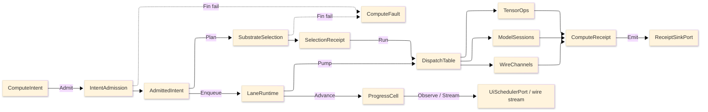

# [RASM_COMPUTE_ARCHITECTURE]

The domain map of `Rasm.Compute` — the APP-PLATFORM measured-execution package. One intent rail admits work once at the boundary, one substrate axis routes it over row data, bounded lanes carry it, and one `ComputeReceipt` union records every outcome across the Tensor, Symbolic, Model, Solver, Stats, Runtime, and Analysis folders.

Each codemap node is the eventual source file its `.planning/` design page becomes, named in the language's own folder and file casing — PascalCase `.cs`, lowercase `.py`, lowercase `.ts`. Treat every node as realized code; the `.planning/` scaffold is the authoring substrate, never part of the map.

## [01]-[DOMAIN_MAP]

```text codemap
Rasm.Compute/
├── Tensor/                # CPU tensor vocabulary and BLAS-class numeric core
│   ├── Vocabulary.cs      # Tensor shapes/factories/dtype map and 196-row op-family table
│   ├── Layout.cs          # LayoutForm rows and ReshapeOp<T> shape-edit request union
│   ├── Dispatch.cs        # Arity kernel-delegate tables with differentiable-adjoint law
│   ├── Residency.cs       # OrtValue C-data residency lattice and geometry-to-tensor encoding
│   ├── Memory.cs          # Bounded staging memory with a recyclable zero-copy stream pool
│   ├── Blas.cs            # RID-keyed LinearProvider dense BLAS/factorization/spectral core
│   ├── Factor.cs          # Sparse-format ingestion and criterion-stack iterative solve
│   ├── Quadrature.cs      # Accuracy-routed quadrature with adaptive control and spectral operator
│   └── Sampling.cs        # Owned Sobol/Halton sampler and radial-basis scatter reconstruction
├── Symbolic/              # Closed symbolic-expression CAS and unit boundary
│   ├── Expression.cs      # SymbolicExpr AngouriMath Entity algebra: differentiate/integrate/limit/solve/simplify/compile family
│   ├── Dimensional.cs     # DimensionMonomial ℚ⁷ SI base-dimension proof over the Entity node walk
│   ├── Lowering.cs        # Content-keyed CompiledExpr cache (typed Compile<> IL + FastExpression) and analytic-Jacobian arm
│   └── Units.cs           # UnitsNet boundary admitting unit-bearing input with dual unit evidence
├── Model/                 # ONNX model identity, sessions, inference, and generative runs
│   ├── Identity.cs        # Checksum identity, acquisition union, and schema snapshot
│   ├── Sessions.cs        # One shared session per checksum with compatibility-checked warm-start
│   ├── Providers.cs       # Execution-provider axis with autoEP discovery and quantization posture
│   ├── Inference.cs       # OrtValue-only run-mode fold composing the Tensor/residency BoundFlow capsule and result cache
│   ├── Embedding.cs       # VectorEncoding/VectorScore embedding-and-retrieval owner
│   ├── Generative.cs      # ORT-GenAI token-streaming owner with EOS oracle and tool-call arm
│   └── Extension.cs       # Custom-op registration with bidirectional string-tensor boundary
├── Solver/                # Discretize→solve→optimize→sweep/clash/satisfy solve spine
│   ├── Discretization.cs  # Volumetric MeshKernel with adaptive h/p/hp refinement; exact-predicate Delaunay gates; frame ElementClass rows
│   ├── Contract.cs        # Physics×BC×element solve fold with adaptive-recovery ladder; ARPACK sparse eigen; frame assembly arm
│   ├── Constitutive.cs    # Per-Gauss-point ConstitutiveModel stress-update axis and frictional-contact enforcement
│   ├── Optimizer.cs       # Design-space search axis with ROM/GP/RBF surrogate duality; slsqp constrained-NLP row
│   ├── Sweep.cs           # N-dim DOE sweep grid with Morris/Sobol sensitivity
│   ├── Clash.cs           # Acceleration-structure collision compute, occlusion ray entry, and ROM digital-twin loop
│   ├── Satisfy.cs         # Z3 SMT rule satisfaction: SymbolicExpr-lowered assertions, SAT witness / unsat-core explanation
│   └── Uncertainty.cs     # Forward-UQ/reliability owner over same evaluate oracle; exact-AD FORM/SORM limit-state row
├── Stats/                 # Classical statistics, statistical learning, and DSP
│   ├── Estimator.cs       # One Estimator Fit/Predict axis: regression/GLM/PCA/clustering/classification/hypothesis/time-series
│   └── Signal.cs          # SpectralTransform FFT/STFT/PSD/wavelet axis and FIR/IIR FilterDesign over MathNet IntegralTransforms
├── Runtime/               # Admit-to-receipt boundary plane
│   ├── Admission.cs       # Typed intent admission with substrate axis and total dispatch
│   ├── Scheduling.cs      # Five bounded work-lanes with dependency job-graph scheduler
│   ├── Progress.cs        # Monotonic phase family with an Atom-backed progress capsule
│   ├── Receipts.cs        # One ComputeReceipt fact union (incl. Assessment) and benchmark-claim table
│   ├── Wire.cs            # Suite wire CONTRACT: proto vocabulary, contract evolution, band-complete fault projection, TS posture
│   ├── Transport.cs       # Channel MECHANICS: transport rows, channel tuning, call policy, artifact frame law
│   ├── Codecs.cs          # Field/result/geometry-delta codecs and tessellation bridge
│   └── Payload.cs         # ResidencyKind meshlet/quantized/splat PAYLOAD codec with the cluster-LOD chain
└── Analysis/              # C#-first discipline-assessment rail over the Rasm.Element ElementGraph
    ├── Assessment.cs # Lifecycle-aware spine: route dispatch, Failed write-back, bounded Transient retry, Sweep-over-JobGraph reconciler
    ├── Aggregator.cs # Relocated multi-ply AssemblyAggregator ISO 6946 U / ISO 12354 STC / rule-of-mixtures / GWP / cost + NestYield waste ingress
    ├── Structural.cs      # Owned-spine frame solve + hand-rolled DesignCode×LimitState capacity table + seismic response-spectrum route
    ├── Physics.cs         # Closed-form ISO/EN thermal (6946/13788) + acoustic (12354) + fire (1993/1992-1-2) folds
    ├── Energy.cs # EnergyRoute axis over OpenStudio, EnergyPlus, PollinationSDK, and SqlFile
    ├── Lifecycle.cs       # EN 15978 embodied carbon + EC3/openEPD REST boundary + supply/install cost rollup
    ├── Circulation.cs     # Egress/life-safety runner: QuikGraph travel distance, OrTools max-flow exit capacity, NTS/Clipper2 planar side
    └── Daylight.cs        # Owned NREL-SPA solar kernel (AppUi-consumable), Perez sky rows over the EPW ingress, clash-BVH shadow rays
```

Implementation collapses to one owner per axis and one entrypoint family per rail: a new feature is a row or case on a budgeted owner, and a public type outside an owner region is the named defect. The rail is named in the return type — `Fin<T>` aborts at admission, `Validation<Error,T>` accumulates (the monoidal `Error` carrier; typed `ComputeFault` arms lift onto it through their `Expected` base, since `ComputeFault` is not itself a monoid), `IO<T>` carries effects, `Option<T>` carries absence. The `ComputeFault` union projects through `FaultDetail` at the wire edge; receipts stamp NodaTime `Instant`/`Duration`, and AppHost `ClockPolicy` owns both clocks.

## [02]-[SEAMS]

```text seams
Runtime               ⇄  python:geometry/mesh # [CONTENT_KEY]: ContentIdentity XxHash128 seed parity + geometry TessellationPolicy-folded cache key
Runtime/wire          →  typescript:core/interchange/codec       # [WIRE]: ReceiptEnvelopeWire / FaultDetailWire / proto vocabulary
Runtime/wire          →  typescript:core/interchange/contract    # [WIRE]: FileDescriptorSet ContractDrift verdict
Runtime/transport     →  typescript:core/interchange/frame       # [WIRE]: ArtifactFrameWire reassembly
Runtime/transport     →  typescript:core/interchange/frame       # [WIRE]: GeometryPayload proto descriptor / MeshTensor view
Runtime/wire          ⇄  python:runtime/transport                # [WIRE]: PROTO_VOCABULARY service contracts
Runtime/wire          ⇄  python:geometry/mesh                    # [WIRE]: ComputeService/ArtifactSync gRPC GLB tessellation
Runtime/progress      →  typescript:core/state/evidence          # [WIRE]: ProgressMarkWire
Runtime               ←  python:geometry/mesh                    # [TRANSPORT]: ServerHost ComputeService/ArtifactSync GLB + semantic header
Runtime/codecs        ←  python:geometry/mesh                    # [PROJECTION]: IFC tessellation bridge via IfcOpenShell
Runtime/payload       →  csharp:Rasm.AppUi/Render/pipeline # [PROJECTION]: ResidencyPayload blob+layout → AppUi ResidencyManifest.Mint meshopt
Analysis              ←  csharp:Rasm.Element/Graph               # [SHAPE]: ElementGraph above seam; geometry one-hop via GeometrySource by key
Analysis              →  csharp:Rasm.Element/Assessment          # [SHAPE]: Node.Assessment GraphDelta on neutral Assign edge, never IFC-named
Analysis/aggregator   ←  csharp:Rasm.Element/Composition # [SHAPE]: MaterialPropertySet + seam RatingContour.Stc.Fit
Analysis/aggregator   →  csharp:Rasm.Materials/Properties        # [SHAPE]: multi-ply AssemblyAggregator; single-material authoring stays in Materials
Analysis/structural   ←  csharp:Rasm.Bim/Model # [SHAPE]: StructuralReads Supports/Loads on Generic edges
Analysis/structural   ←  csharp:Rasm.Materials/Component         # [WIRE]: section capacity feeds the structural Assessment route
Analysis              ←  csharp:Rasm.Materials/Properties        # [WIRE]: the Discipline-keyed MaterialPropertySet read off the Material node
Analysis/lifecycle    ←  csharp:Rasm.Materials/Properties        # [WIRE]: lifecycle AggregateEnvironmental/AggregateCost folds + carbon/cost rollup
Analysis/lifecycle    ←  csharp:Rasm.Fabrication/Nesting         # [PROJECTION]: NestYield.WasteAreaMm2 feeds the AggregateCost/Environmental rollup
Runtime/codecs        ←  csharp:Rasm.Bim/Model # [CONTENT_KEY]: IfcRepresentation.Keys representation content-keys off kernel seed-zero
Analysis/energy       ⇄  csharp:Rasm.Bim/Energy/exchange         # [SHAPE]: OpenStudio SIMULATION distinct from Bim energy EXCHANGE
Analysis/energy       ⇄  csharp:Rasm.Bim/Energy/projector        # [SHAPE]: Raises the boundary/opening/FootPrint/Qto shape EnergyGraphReads consumes
Analysis/energy       →  csharp:Rasm.Persistence                 # [CONTENT_KEY]: EnergyPlus SqlFile results; 412-noop on the object store
Analysis/energy       →  csharp:Rasm.Persistence/Store/blobstore # [CONTENT_KEY]: Pollination assets content-keyed via presigned row
Analysis              →  csharp:Rasm.Persistence/Version/retention # [CONTENT_KEY]: content-keyed AssessmentPayload blob in RETENTION_CLASSES
Analysis/lifecycle    ⇄  csharp:Rasm.Bim/Planning # [SHAPE]: embodied material-cost takeoff vs construction schedule, aligned never coupled
Analysis/energy       ←  csharp:Rasm.Bim/Projection # [PROJECTION]: SemanticProjector bakes boundary edges, FootPrint, Qto for EnergyGraphReads
Analysis/lifecycle    ←  csharp:Rasm.Bim/Semantics # [PROJECTION]: QuantitySet bakes Qto base-quantity bags TakeoffOf reads for per-ply GWP/cost
Analysis/lifecycle    ←  csharp:Rasm.Element/Composition # [SHAPE]: Environmental case MeasurementBasis+per-stage StageGwp ingress enriches via delta
Runtime               ←  csharp:Rasm.Bim/Semantics               # [PROJECTION]: IFC/glTF semantic metadata layer
Runtime/transport     →  csharp:Rasm.Bim/Semantics # [TRANSPORT]: BsddPort bSDD GET IncludeClassProperties mandatory → BsddClassResponse degrade
Runtime/codecs        ⇄  csharp:Rasm.Element/Graph               # [CONTENT_KEY]: Shares the kernel seed-zero XxHash128; InterchangeIdentity DISTINCT
Runtime/codecs        ←  csharp:Rasm.Bim/Exchange                # [TESSELLATION]: TessellationOutcome two-hop GLB, CacheHit by ArtifactKey
Runtime/codecs        ←  csharp:Rasm.Bim/Review                  # [TRANSPORT]: IdsAuditRequest ifctester two-hop rpc; verdict Bim-owned
Symbolic              ⇄  python:compute + typescript:core/value/quantity # [WIRE]: QuantityFamily SI canonicalization over the wire to host-free peers
Symbolic/dimensional  ⇄  csharp:Rasm.Element/Properties          # [SHAPE]: DimensionMonomial ℚ⁷ proof ↔ seam Dimension ℤ⁷ measure
Symbolic/lowering     →  csharp:Rasm.Persistence/Query/cache     # [CONTENT_KEY]: compiled symbolic/cost/QTO formula reused by SymbolicExpr
Model/embedding       ⇄  csharp:Rasm.Persistence/Query/retrieval # [CONTENT_KEY]: EmbeddingVector.ContentKey ↔ VectorRow.ContentKey
Model/identity        ←  csharp:Rasm/Domain # [CONTENT_KEY]: Checksum composes kernel seed-zero ContentHash.Of
Model/sessions        →  csharp:Rasm.Persistence/Query/cache     # [CONTENT_KEY]: ArtifactIndexRow blob keyed by checksum/FleetContextKey
Model/inference       →  csharp:Rasm.Persistence/Query/cache # [CONTENT_KEY]: ModelResultKey reads ModelResultIndex by reference
Tensor/factor         →  csharp:Rasm.Persistence/Query/cache # [CONTENT_KEY]: ShardPlan.Blocked reuse
Runtime               ⇄  csharp:Rasm.Persistence/Version/commits # [GRADUATION]: HandoffAxis graduation evidence
Runtime               →  csharp:Rasm.Persistence                 # [CONTENT_KEY]: content-keyed blob
Runtime/scheduling    →  csharp:Rasm.Persistence # [SPILL]: JobGraph CheckpointPort persist/resume JobCheckpoint over blob
Runtime/wire          →  csharp:Rasm.Persistence/Version/ledger # [WIRE]: GraphDiff/SubtreeFetch content-key set-difference wire
Runtime/codecs        ⇄  csharp:Rasm.Persistence/Query/cache     # [CONTENT_KEY]: ContentIdentity XxHash128 seed-zero two-half
Runtime/receipts      →  csharp:Rasm.Persistence/Query/cache # [PROJECTION]: BenchmarkClaim.Persist → BenchmarkRow gate
Runtime/codecs        →  python:runtime/evidence/identity + typescript:core/value/contentKey # [WIRE]: XxHash128 seed-zero two-half
Runtime               ←  csharp:Rasm.Persistence/Version/timetravel # [PROJECTION]: content-key delta via snapshot-frame FastCDC + blobstore multipart
Tensor/dispatch       ⇄  csharp:Rasm.AppUi/Render                # [SHAPE]: shared ONE_WGPU_DEVICE (Silk.NET.WebGPU)
Runtime/admission     ←  csharp:Rasm.AppHost                     # [PORT]: WorkLane shed verdict (ONE_DEGRADATION_SHED_VERDICT)
Runtime/scheduling    →  csharp:Rasm.AppHost/Runtime/lifecycle   # [PORT]: LaneDrain DrainParticipantPort per lane (band-200) into the conductor
Runtime/codecs        ⇄  csharp:Rasm.Persistence/Query/columnar  # [PORT]: parse-to-canonical-bytes (Extract)
Runtime/codecs        ⇄  csharp:Rasm.Bim                         # [SHAPE]: SharpGLTF/meshopt leg split — Compute encodes residency/transport
Model                 ←  csharp:Rasm.AppHost                     # [PORT]: IEmbeddingGenerator/IChatClient governed/priced by the AppHost middleware
Runtime/wire          →  csharp:Rasm.Persistence/Version/egress # [WIRE]: the Protobuf frame CloudEvents/NATS pump composes broker serdes resolve
Solver/clash          ←  csharp:Rasm/Spatial/index               # [WIRE]: Decodes via ClashScale.NodeLinkPairs
Solver/discretization ←  csharp:Rasm/Numerics/predicates # [SHAPE]: coordinate-level Orient3D/InSphere exact cores over raw double tuples
Solver/clash          →  csharp:Rasm.AppHost/Wire/livewire       # [RECEIPT]: DigitalTwin suggestion committed as a receipted ExternalValue
Analysis              ←  csharp:Rasm/Meshing/slice               # [WIRE]: Kernel Slicing.Apply emits, Compute decodes (circulation floor plates)
Analysis/circulation  ←  csharp:Rasm.Element/Classification # [SHAPE]: the Circulation Discipline row sixteen-row roster this runner dispatches on
Analysis/daylight     →  csharp:Rasm.AppUi/Render # [SHAPE]: SolarPosition.At/SunPath package-boundary export
Analysis/daylight     ←  python:compute/graduation # [GRADUATION]: CBDM/glare annual simulation decoded by content key
Analysis/assessment   →  csharp:Rasm.Persistence/Query/cache # [CONTENT_KEY]: AssessmentSink → ArtifactIndexRow.Admit under ArtifactKind.Assessment
Solver/satisfy        →  csharp:Rasm.Element/Assessment # [SHAPE]: a persisting compliance verdict lands as its own content-keyed Node.Assessment
Solver/contract       ←  csharp:Rasm.Element/Composition # [SHAPE]: MaterialPropertySet elastic and inelastic reads at Gauss points
Tensor/dispatch       ⇄  csharp:Rasm/Numerics/spectral           # [SHAPE]: TensorOpKind.Geometry rows bind OperatorRow; routes Apply JVP/Adjoint VJP
Tensor/residency      ←  csharp:Rasm/Drawing/pack                # [CONTENT_KEY]: EncodedGeometry as EncodedTensor — residency never a re-pack
Tensor/residency      ⇄  csharp:Rasm.AppHost/Sandbox/solver # [SHAPE]: EncodingKind rows align onto PackKind axis
Runtime               ←  python:compute/graduation # [GRADUATION]: HandoffAxis graduation evidence crosses INWARD only
Runtime               →  python:compute/graduation               # [WIRE]: EvidenceBundle graduation-evidence wire
Runtime               ←  python:compute/solvers                  # [PROJECTION]: SolverReceipt convergence verdict
Runtime               ←  python:data/tabular                     # [SHAPE]: DOE dataset study input
Runtime               ←  python:data/spatial/geospatial          # [SHAPE]: GeoArrow buffers share GLB tessellation wire layout
```

## [03]-[SPINE]



`ComputeIntent` admits through `IntentAdmission` into an `AdmittedIntent`; `SubstrateSelection` folds over substrate rows and lands a `SelectionReceipt`; `LaneRuntime` enqueues onto bounded lanes and pumps into `DispatchTable`, which routes to `TensorOps`, `ModelSessions`, or `WireChannels`; every lane emits `ComputeReceipt` cases through `ReceiptSinkPort`, admission and selection failures land on `ComputeFault`, and `ProgressCell` delivers cadence-gated marks to UI and wire observers.

## [04]-[SEAM_PROHIBITIONS]

The cross-folder seam invariants every Compute owner checks itself against before crossing a strata or runtime boundary. A seam that violates a row is the named defect this block owns.

| [INDEX] | [SEAM] | [INVARIANT] | [REJECTED_FORM] |
| :-----: | ------ | ----------- | --------------- |
| [01] | device residency | The `Substrate.DeviceWgpu` row binds the AppUi-owned `ONE_WGPU_DEVICE` `Device`/`Queue`; Compute mints no second device and holds the compute-only resources only. | A second `Device`/`Queue` acquisition inside the Compute lane; a parallel device-residency lattice beside `OrtResidency.DeviceResident`. |
| [02] | host-neutral lane | A host geometry type never enters a lane signature; host geometry folds inside the kernel `Rasm.Drawing` (`Encode.Apply`) and the `Rasm.AppHost` `GeometryPacking` sandbox capsule, and `Tensor/residency` consumes only the host-neutral `EncodedGeometry` float payload (wrapped as `EncodedTensor`), naming no host geometry type. | A `RhinoCommon`/host type on an interior `Tensor`/`Solve`/`Estimator` signature; a residency-side `GeometryPacking`/`GeometryEncoding` re-packer over host geometry coordinates. |
| [03] | bSDD / ifctester / tessellation | Compute owns the channel and the companion-rpc orchestration; Bim owns the response/IDS/semantic projection and the `LocalShape` degrade. | A Compute-side bSDD response projection, IDS parser, or IFC semantic read; a Bim-minted transport. |
| [04] | units ingress | `Symbolic/units` owns the `QuantityFamily` SI-canonicalization for Compute-internal admission and the host-free peers (Python/TypeScript) decode the canonicalized scalar over the wire. The AEC-domain folders (`Rasm.Materials`, `Rasm.Fabrication`) admit `UnitsNet` IN-FOLDER at their own boundary — `Rasm.Fabrication/Process` at `RemovalParameter.Admit`, `Rasm.Materials/Appearance` photometric at its own admission — because the strata graph is acyclic (app-platform consumes AEC-domain, never the reverse). | A `Rasm.Compute` PROJECT REFERENCE from an AEC-domain folder to read this units owner — the forbidden AEC→app-platform downward edge; a Compute page asserting an AEC consumer reads its units export over a reference. |
| [05] | least-squares / spectral | `Tensor/blas` owns `LevenbergMarquardt`/thin-QR and `Model/inference` owns the ONNX spectral run for Compute-internal solves and the host-free graduation/inference peers. The AEC-domain `Rasm.Materials` BRDF fit and spectral grounding stay IN-FOLDER (the `FitRoughness` heuristic, the in-folder `SpectralUpsample`); the algorithms-doc thin-QR fit is a doctrine reference the Materials probe cites, never a Compute project reference. | A `Rasm.Compute` PROJECT REFERENCE or a "MathNet transitive via Rasm.Compute" claim from `Rasm.Materials` — the forbidden AEC→app-platform downward edge; a Compute page asserting the Materials fit reads its solver over a reference. |
| [06] | graduation evidence | Offline-learned models (deep training, learned input distributions, PCE/neural-field surrogates, residual predictors) are the Python companion's, decoded by content key over `ONE_GRADUATION_EVIDENCE`; C# owns inference plus classical fit. | An in-proc deep-training or distribution-learning loop in C#. |
| [07] | analysis graph read | The `Analysis` rail reads the CONCRETE `Rasm.Element` `ElementGraph` upward (the shared lower stratum, same shape as the kernel reference) and writes a content-keyed `Node.Assessment` `GraphDelta` the caller applies; it never goes through `IElementProjection` (the AEC-domain projector seam) and never references the AEC-domain peers — alignment travels through the seam graph, not a sibling project reference. | An `Analysis` `IElementProjection` implementation; a `Rasm.Compute`→`Rasm.Materials`/`Rasm.Bim` project reference; a Compute-side graph mutation in place instead of a `GraphDelta` the seam applies. |
| [08] | energy toolchain | `EnergyToolchain` resolves EnergyPlus by env var, configured path, or bundle; `EnergyRoute` converges local and cloud runs on `SqlFile`. | Hardcoded path; shipped Forge dependency; parallel runner; token column on `EnergyPolicy`. |
| [09] | closed-form + aggregator ownership | Closed-form ISO/EN physics (the thermal/acoustic/fire folds) and the multi-ply `AssemblyAggregator` (ISO 6946 series-U / ISO 12354 layered-STC / rule-of-mixtures / GWP / cost) live in `Analysis`, never the seam; the single-material PURE acoustic folds (`Nrc`/`Saa`/`StcWeighted`) and the `RatingContour` `Stc.Fit`/`Rw.Fit` contour kernel stay seam-owned, and `Analysis` composes them. | A closed-form ISO/EN fold in `Rasm.Element`; a second `AssemblyAggregator` retained in `Rasm.Materials`; a second contour-fit algorithm beside the seam `RatingContour.Fit` kernel; design-code rules as imperative arms instead of the `DesignCode`×`LimitState` capacity table. |

## [05]-[PROHIBITIONS]

The authoritative prohibition set on the package spine that every new owner row checks itself against: one enumerated invariant set with code-band custody. Every device/sparse/autodiff/stats/UQ/optimizer capability is a row or case on an existing owner, never a sibling owner or a second state machine.

| [INDEX] | [PROHIBITION] | [CANONICAL_OWNER] | [PAGE] |
| :-----: | ------------- | ----------------- | ------ |
| [01] | No package-local tensor wrapper / `TensorService` beside `System.Numerics.Tensors` `Tensor<T>`; no `DeviceTensor`/`GpuTensor` parallel type (device-ness is the `OrtResidency.DeviceResident` discriminant); no second `OrtIoBinding` steady-state capsule beside `Tensor/residency` `BoundFlow`, which `Model/inference` composes for its run-mode fold and which `TensorBridge` is the sole `OrtValue` C-data factory for. | `Tensor<T>` + span views; `OrtResidency`/`BoundFlow`/`TensorBridge` | `Tensor/vocabulary`, `Tensor/residency` |
| [02] | No hand-rolled BLAS/factorization beside the MathNet `LinearProvider` stack and CSparse direct factors; no `RasmMatrix`/`DenseMatrix` wrapper; no hand-rolled FFT/SVD/normal-equations/LM loop. | `LinearProvider`/`DenseOps`/`LevenbergMarquardt`; `SparseOps`/`SparseTensorOps` | `Tensor/blas`, `Tensor/factor` |
| [03] | Symbolic/device/learning/constitutive faults extend the `ComputeFault` 2200 band at the next-free code (the Symbolic lane owns 2213..2216, the analysis lane 2217..2219, and the scheduling lane 2220, so a new fault enters at 2221+), never a parallel fault union or a status-code-plus-string terminal — every fault crosses the wire through the one `FaultDetail` family. | `ComputeFault` (`Runtime/admission`) | `Runtime/admission`, `Runtime/wire` |
| [04] | No string-eval in the solver/optimizer/UQ/constitutive `evaluate` oracle — the `Func<DesignPoint, Fin<Seq<double>>>` contract is the only coupling point; an OR-Tools `CpModel` builds through the typed model-builder API, never a string-parsed model. | `evaluate` oracle (`Solver/optimizer`, `Solver/uncertainty`) | `Solver/optimizer`, `Solver/uncertainty`, `Solver/contract` |
| [05] | One `HybridCache` per lane, no per-call cache instance; one shared session per model identity. | lane custody (`Runtime/scheduling`) | `Runtime/scheduling`, `Model/sessions` |
| [06] | Every new accelerator/sparse/AD/estimator/optimizer/UQ capability is a row or case on an existing owner (a `Substrate` row, a `SparseTensorOpFamily` row, a `DifferentiableOp`+`Forward` pair, an `EstimatorKind` row, an `OptimizerKind` row, an `UncertaintyMethod` row, a `ConstitutiveModel` case), never a sibling owner or a second admission spine. | the budgeted owner blocks | all `.planning/**` |
| [07] | The assessment outcome is one `ComputeReceipt.Assessment` case (declared as a `partial` on the `Runtime/receipts` owner, registered there as the `[JsonDerivedType]` row + wire projection) and the discipline faults extend the one `ComputeFault` 2200 band at `2217+` (`AssessmentInputMissing` 2217 / `ToolchainUnresolved` 2218 / `AnalysisFailed` 2219, above the Symbolic lane's 2213..2216), never a parallel assessment receipt or fault union; every discipline runner reads the concrete `ElementGraph` and returns the ONE uniform `AssessmentResult` fact stream, never a parallel per-discipline result family; design codes are a `DesignCode`×`LimitState` capacity table, never imperative per-code arms. | `Analysis` rail (`Assessment`) | `Analysis/**` |

The `ComputeFault` 2200 band is custodied by the `Runtime/admission` owner and runs in four lanes declared as partials on that one owner: the core `Text` 2200 .. `CacheCorrupt` 2212 (`Runtime/admission`), the Symbolic lane 2213 .. 2216 (`Symbolic/expression`'s `SymbolicFault` — `ParseRejected` 2213 / `SymbolUndefined` 2214 / `NonDifferentiable` 2215 — plus `Symbolic/dimensional`'s `DimensionMismatch` 2216), and the analysis lane `AssessmentInputMissing` 2217 / `ToolchainUnresolved` 2218 / `AnalysisFailed` 2219 — the typed `(SolvePhase, FailureKind, Detail, Option<int> Code)` case (`Analysis/assessment`), and the scheduling lane `GraphCyclic` 2220 (`Runtime/scheduling`), so the next-free code is 2221 — a symbolic/device/learning/constitutive/assessment fault row enters at 2221+ and never collides with an existing code; the EC3 boundary reuses `EndpointUnreachable` 2208 rather than minting a new carbon-band code; the `HybridCache`-per-lane clause aligns with the `Runtime/scheduling` lane custody and the no-parallel-fault clause aligns with the `Runtime/wire` `FaultDetail` projection (the band-complete `FaultWire` rail whose `Bands` registry mirrors the custody map, plus Compute's SECOND custody — the Remote `WireFault` 4520..4532 sub-band pinned reciprocally in the AppHost/AppUi/Persistence registries) so device/symbolic/assessment faults still cross the wire through the one family, and the `Analysis` assessment outcome rides the one `ComputeReceipt.Assessment` case the `Runtime/receipts` union owns (registered there as the `[JsonDerivedType]` row + wire projection, declared there as a partial by `Analysis/assessment`).
