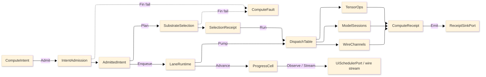

# [RASM_COMPUTE_ARCHITECTURE]

`Rasm.Compute` owns measured execution: one intent rail admits work exactly once at the boundary, one substrate axis routes it over row data, bounded lanes carry it, and one receipt union records every outcome at the sink edge. Mechanics live in the nine `.planning/` pages; this page names the rails, the axes, the cross-package seams, and the external package owners behind each axis.

## [1]-[EXECUTION_SPINE]

Text equivalent: `ComputeIntent` admits through `IntentAdmission` into an `AdmittedIntent`; `SubstrateSelection` folds over substrate rows and lands a `SelectionReceipt`; `LaneRuntime` enqueues onto bounded lanes and pumps into `DispatchTable`, which routes to `TensorOps`, `ModelSessions`, or `WireChannels`; every lane emits `ComputeReceipt` cases through `ReceiptSinkPort`, admission and selection failures land on `ComputeFault`, and `ProgressCell` delivers cadence-gated marks to UI and wire observers.

## [2]-[RAILS]

| [INDEX] | [RAIL]    | [CARRIER]                       | [LAW]                                                              |
| :-----: | :-------- | :------------------------------ | :----------------------------------------------------------------- |
|   [1]   | Admission | `Fin<AdmittedIntent>`           | Validation runs exactly once at the boundary; interiors never re-validate |
|   [2]   | Faults    | `ComputeFault` union, band 2200 | Dual-tier `Create`; projects through `FaultDetail` at the wire edge |
|   [3]   | Effects   | `IO<T>`                         | Enqueue, dispatch, emission, channel observation; no exceptions in domain logic |
|   [4]   | Absence   | `Option<T>`                     | Substrate vetoes, forced overrides, fallback rows, sentinel projection |
|   [5]   | Receipts  | `ComputeReceipt` union          | Thirteen cases materialize at the sink edge; hot paths stay struct-only |
|   [6]   | Progress  | `ProgressCell` CAS rank guard   | Monotonic rank; observers structurally never observe regress        |

## [3]-[AXES]

| [INDEX] | [AXIS]                | [OWNER]              | [ROWS/CASES] | [ANCHOR]                                |
| :-----: | :-------------------- | :------------------- | :----------: | :--------------------------------------- |
|   [1]   | Intent family         | `ComputeIntent`      |      5       | intent-and-selection#INTENT_FAMILY       |
|   [2]   | Substrate axis        | `Substrate`          |      3       | intent-and-selection#SUBSTRATE_AXIS      |
|   [3]   | Fault family          | `ComputeFault`       |      13      | intent-and-selection#DISPATCH_SPINE      |
|   [4]   | Tensor dtypes         | `TensorDtype`        |      10      | tensor-lane#TENSOR_VOCABULARY            |
|   [5]   | Tensor op families    | `TensorOpFamily`     |      45      | tensor-lane#OPERATION_FAMILIES           |
|   [6]   | Layout algebra        | `LayoutForm`         |      5       | tensor-lane#LAYOUT_ALGEBRA               |
|   [7]   | Geometry encodings    | `GeometryEncoding`   |      3       | tensor-lane#GEOMETRY_ENCODING            |
|   [8]   | Model acquisition     | `ModelSource`        |      4       | model-lane#MODEL_IDENTITY                |
|   [9]   | Execution providers   | `ExecutionProvider`  |      2       | model-lane#EP_AXIS                       |
|  [10]   | Cache postures        | `CachePolicy`        |      4       | model-lane#RESULT_CACHE                  |
|  [11]   | Wire services         | `WireServices`       |   5 / 14 rpc | remote-lane#PROTO_VOCABULARY             |
|  [12]   | Contract drift        | `ContractDrift`      |      3       | remote-lane#CONTRACT_EVOLUTION           |
|  [13]   | Transports            | `RemoteTransport`    |      4       | remote-lane#TRANSPORT_AXIS               |
|  [14]   | Credentials           | `CredentialPolicy`   |      4       | remote-lane#CALL_POLICY                  |
|  [15]   | Allocation classes    | `AllocationClass`    |      5       | staging-and-streams#ALLOCATION_AXIS      |
|  [16]   | Work lanes            | `WorkLane`           |      5       | scheduling-and-lanes#LANE_AXIS           |
|  [17]   | Progress phases       | `ProgressPhase`      |      9       | progress-and-observation#PHASE_FAMILY    |
|  [18]   | Quantity families     | `QuantityFamily`     |      15      | units-boundary#QUANTITY_TABLE            |
|  [19]   | Receipt union         | `ComputeReceipt`     |      13      | receipts-and-benchmarks#RECEIPT_UNION    |
|  [20]   | Claim bands           | `BenchmarkClaim`     |      4       | receipts-and-benchmarks#BENCHMARK_CLAIMS |

## [4]-[CONSUMED_SEAMS]

Each row cites the suite ledger SEAM_SPLITS: mechanics live at the named owner; the consequence lands here.

| [INDEX] | [SEAM]                  | [MECHANICS]                                       | [CONSEQUENCE_HERE]                                            |
| :-----: | :---------------------- | :------------------------------------------------ | :------------------------------------------------------------ |
|   [1]   | Receipt sinks           | AppHost/runtime-ports#PORT_RECORDS                | `ReceiptSurface.Emit`; HLC envelope is the only cross-process causal primitive |
|   [2]   | Telemetry contribution  | AppHost/runtime-ports#PORT_RECORDS                | `ReceiptSurface.Telemetry` instrument rows; `TelemetrySource.Compute` activity spine |
|   [3]   | Drain order             | AppHost/lifecycle-and-drain#DRAIN_CONDUCTOR       | Band-200 `DrainParticipantPort` rows from `LaneDrain` and `ModelSessions` |
|   [4]   | Clock seam              | AppHost/time-and-deadlines#CLOCK_SPLIT            | Every elapsed measurement and `Instant` stamp rides `ClockPolicy` |
|   [5]   | Correlation             | AppHost/diagnostics-and-telemetry#CORRELATION_SPINE | `CallSpine` stamps correlation and traceparent metadata across the hop |
|   [6]   | Outbound retry          | AppHost/outbound-resilience#OWNERSHIP_LAW         | Conflict receipts emitted here; gRPC `ServiceConfig` retry never set |
|   [7]   | Degradation and health  | AppHost/health-and-degradation#DEGRADATION_RAIL   | Substrate vetoes read the retained `Capability` set; Rhino-absent folds to `LocalOnly` |
|   [8]   | Deadlines and schedule  | AppHost/time-and-deadlines#DEADLINE_TAXONOMY      | `Spec` deadline rows; warmup and equivalence sweeps as `ScheduleEntry` rows |
|   [9]   | Channel policy          | AppHost/outbound-resilience#HTTP_PIPELINES        | Keepalive, pooled-idle, multiplexing, 4 MiB caps read from `GrpcChannelPolicy.Canonical` |
|  [10]   | Discovery               | AppHost/outbound-resilience#DISCOVERY_ATTACH      | UDS transport row consumes the manifest; contractChecksum and storeEpoch handshake |
|  [11]   | Model-result cache      | Persistence/cache-indexes#MODEL_RESULT_INDEX      | `CacheOps` read path over `CacheSurface` and `CacheLane.ModelResult` |
|  [12]   | Artifact and benchmark indexes | Persistence/cache-indexes#ARTIFACT_BLOB_INDEX | EP-context caches, profile artifacts, and persisted claims as index rows |
|  [13]   | Idempotency dedup window | Persistence/redaction-retention#RETENTION_SWEEPS | `ExecuteTransaction` quotes the 24 h AgeBound horizon, never re-declares |

## [5]-[PROVIDED_SEAMS]

| [INDEX] | [SEAM]                | [MECHANICS_HERE]                          | [CONSEQUENCE]                                                  |
| :-----: | :-------------------- | :----------------------------------------- | :------------------------------------------------------------- |
|   [1]   | Suite wire vocabulary | remote-lane#PROTO_VOCABULARY               | AppHost runtime-ports carries the suite wire law and TS tooling map |
|   [2]   | ArtifactSync frame law | remote-lane#ARTIFACT_FRAMES               | Persistence BlobRemote and sync rows consume the 64 KiB, Crc32, XxHash128 constants |
|   [3]   | `WorkLane` name       | scheduling-and-lanes#LANE_AXIS             | AppHost owns `DrainQueue`; one altitude per name                |
|   [4]   | Phase-key set         | progress-and-observation#PHASE_FAMILY      | AppUi motion mapping mirrors the nine keys; its conformance sweep fails on drift |
|   [5]   | Receipt and progress wire shapes | receipts-and-benchmarks#TS_PROJECTION | AppUi evidence joins and dashboard ingestion consume the projections |

## [6]-[PACKAGE_API_MAP]

Versions appear only in the charter ADMISSIONS_RECORD.

| [INDEX] | [AXIS/CONCERN]      | [OWNING_PACKAGES]                                                          |
| :-----: | :------------------ | :-------------------------------------------------------------------------- |
|   [1]   | Vocabulary and rails | Thinktecture.Runtime.Extensions, LanguageExt.Core, NodaTime (suite spine)  |
|   [2]   | Tensor lane         | System.Numerics.Tensors, Microsoft.ML.OnnxRuntime, CommunityToolkit.HighPerformance |
|   [3]   | Model lane          | Microsoft.ML.OnnxRuntime, Microsoft.ML.OnnxRuntime.Extensions               |
|   [4]   | Result cache        | Microsoft.Extensions.Caching.Hybrid (through the Rasm.AppHost cache port)   |
|   [5]   | Remote lane         | Google.Protobuf, Grpc.Net.Client, Grpc.Net.Client.Web, Grpc.Tools, NodaTime.Serialization.Protobuf |
|   [6]   | Staging and streams | CommunityToolkit.HighPerformance, Microsoft.IO.RecyclableMemoryStream       |
|   [7]   | Scheduling          | System.Threading.Channels (BCL inbox)                                       |
|   [8]   | Identity and digests | System.IO.Hashing (through the Rasm closure)                               |
|   [9]   | Units boundary      | UnitsNet                                                                     |
|  [10]   | Receipt wire        | System.Text.Json source generation (BCL), Thinktecture.Runtime.Extensions.Json |
|  [11]   | Benchmark evidence  | BenchmarkDotNet (test rail)                                                  |

## [7]-[REFERENCE_DIRECTION]

| [INDEX] | [PROJECT]          | [RELATION]                                              |
| :-----: | :----------------- | :------------------------------------------------------ |
|   [1]   | `Rasm`             | Kernel and vector algorithm source; matmul kernel route |
|   [2]   | `Rasm.AppHost`     | Runtime ports, clocks, drain, correlation, channel policy |
|   [3]   | `Rasm.Persistence` | Cache, artifact, and benchmark index contracts           |
|   [4]   | `Rasm.AppUi`       | Observer only; marshals through `UiSchedulerPort`        |
|   [5]   | Host packages      | No direct dependency                                     |

Compute references `Rasm`, `Rasm.AppHost`, and `Rasm.Persistence`. AppHost never references Compute.
