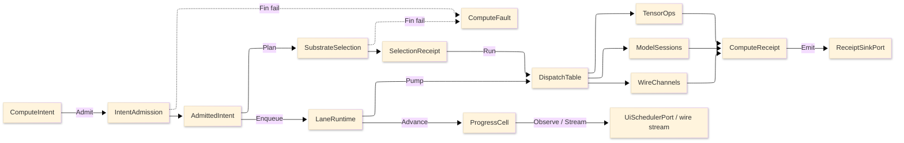

# [RASM_COMPUTE_ARCHITECTURE]

`Rasm.Compute` owns measured execution: one intent rail admits work exactly once at the boundary, one substrate axis routes it over row data, bounded lanes carry it, and one receipt union records every outcome at the sink edge. Mechanics live in the finalized `.planning/` pages; this page is the atlas — the implementation source tree (the build order), the owner registry (the one owner-state surface), dependency direction, cross-package seams, the admit-to-receipt spine, and the boundaries and prohibitions. Per-cluster package owners live on the planning-page cards; versions live in `Directory.Packages.props`.

## [1]-[SOURCE_TREE]

The planned namespaced implementation layout IS the build order: each leaf is one transcription unit, vocabulary owners before consumers, shapes before rails, rails before dispatch, boundaries before composition. Each leaf is annotated with the owners it transcribes and the owning page#cluster; sub-folders group the flat file set by concern axis.

```text codemap
Rasm.Compute/
├── Faults.cs                  # ComputeFault, *KeyPolicy — intent-and-selection#DISPATCH_SPINE
├── Tensors/
│   ├── Vocabulary.cs          # TensorDtype, EncodingChannel, GeometryEncoding — tensor-lane#TENSOR_VOCABULARY, #GEOMETRY_ENCODING
│   ├── Operations.cs          # TensorOpKind, TensorOpFamily, TensorOps — tensor-lane#OPERATION_TABLE, #KERNEL_DISPATCH
│   └── Layout.cs              # LayoutForm, ToleranceClass, TensorLayout, EquivalenceLaw — tensor-lane#LAYOUT_ALGEBRA, #EQUIVALENCE_INTEROP
├── Units.cs                   # QuantityFamily — units-boundary#QUANTITY_TABLE, #PARSE_FORMAT
├── Staging.cs                 # AllocationClass, StreamPool — staging-and-streams#ALLOCATION_AXIS, #STREAM_POOL
├── Progress.cs                # ProgressPhase, SubscriptionPolicy, ProgressCell — progress-and-observation#PHASE_FAMILY, #OBSERVATION_SEAMS
├── Lanes.cs                   # WorkLane, CpuBudget — scheduling-and-lanes#LANE_AXIS, #CPU_BUDGET
├── Protos/
│   └── Compute.proto          # WireServices, FaultDetail, ArtifactFrame — remote-lane#PROTO_VOCABULARY, #ARTIFACT_FRAMES
├── Models/
│   ├── Providers.cs           # ExecutionProvider — model-lane#EP_AXIS
│   ├── Identity.cs            # ModelSource — model-lane#MODEL_IDENTITY
│   ├── Sessions.cs            # ModelSessions, RunOps, GenerationPolicy, GuidanceKind, GenerativeRun — model-lane#SESSION_CAPSULE, #INFERENCE_MODES, #GENERATIVE_RUN
│   └── Cache.cs               # CachePolicy, CacheOps — model-lane#RESULT_CACHE
├── Numeric/
│   └── Lane.cs                # LinearProvider, FactorizationKind, Factorization, DenseOps, SparseFormat, SparseOps, KernelLowering, ShardPlan, NumericKeyPolicy — numeric-lane#DENSE_ALGEBRA, #SPARSE_SOLVE, #KERNEL_LOWERING, #PROVIDER_CLAIMS
├── Interchange/
│   └── Interchange.cs         # InterchangeKeyPolicy, ImportedGeometry, InterchangePolicy, TessellationRequest, FieldCodecPolicy, FieldArtifact, PointScan, InterchangeIo, FieldCodec, GeometryDeltaKind, DeltaPolicy, DeltaChunk, GeometryDelta, DeltaCodec, TileNode, TileSet, TilePartition, ExportArtifact, InterchangeIdentity — interchange#TWO_HOP_TESSELLATION, #FIELD_RESULT_CODEC, #GEOMETRY_DELTA, #TILE_PARTITION, #CONTENT_ADDRESSING
├── Solver/
│   └── Lane.cs                # ElementClass, MeshAlgorithm, FieldStation, FieldSpace, DiscreteMesh, MeshKernel, PhysicsKind, BoundaryCondition, SolveMethod, SolveProblem, SolveResult, SolveLane, OptimizerKind, DesignVariable, ObjectiveSense, DesignProblem, ParetoFront, Optimizer, Surrogate, SweepAxis, SweepGrid, FrameBudget, SensitivityTornado, SweepLane, AccelerationStructure, ClashScale, ClashPair, DigitalTwin, TwinSignal, SolverKeyPolicy — solver-and-optimization#DISCRETIZATION_MESH, #SOLVE_CONTRACT, #OPTIMIZER_LANE, #SWEEP_AND_BUDGET, #CLASH_AND_TWIN
├── Remote/
│   ├── Contract.cs            # ContractDrift, ContractGuard — remote-lane#CONTRACT_EVOLUTION, #FAULT_PROJECTION
│   ├── Frames.cs              # FrameEdge — remote-lane#ARTIFACT_FRAMES
│   └── Transports.cs          # RemoteTransport, CredentialPolicy, WireChannels, CallSpine — remote-lane#TRANSPORT_AXIS, #CALL_POLICY
├── Intent.cs                  # ComputeIntent, Substrate, DispatchTable, IntentAdmission, SubstrateSelection — intent-and-selection#INTENT_FAMILY, #SUBSTRATE_AXIS
├── LaneRuntime.cs             # LaneRuntime, JobState, JobCheckpoint, JobNode, JobGraph — scheduling-and-lanes#SOLVE_GUARD, #DRAIN_CANCEL, #JOB_GRAPH
├── Receipts.cs                # ComputeReceipt, ReceiptSurface, HostFingerprint — receipts-and-benchmarks#RECEIPT_UNION, #WIRE_STAMPS
└── Benchmarks.cs              # BenchmarkClaim — receipts-and-benchmarks#BENCHMARK_CLAIMS
```

The intent/dispatch spine composes its axis vocabularies under the package-cumulative resolution ruling, so the tensor, model, remote, staging, progress, and lane axis files land before `Intent.cs`. `SelectionContext` carries the host fingerprint as a bare string with the typed `HostFingerprint` owner landing in `Receipts.cs`, a fingerprint-slot ordering with no forward reference. `Numeric/Lane.cs`, `Interchange/Interchange.cs`, and `Solver/Lane.cs` land after the receipt and benchmark files because their solve interiors ride the receipt rail, the factorization/sparse machinery, and the tensor field encoding. `WorkLane` is the Compute solve-path lane name; `DrainQueue` stays at AppHost. TS_PROJECTION clusters carry no C# build row; they transcribe into the TS workspace at web app-root creation.

## [2]-[OWNER_REGISTRY]

The single owner-state surface for the package. Implementation collapses to one owner per axis and one entrypoint family per rail; density means no parallel rails, no near-duplicate shapes, no re-derived logic — a file is as large as its owner's concern requires, never trimmed to a line count. A new feature is a row or case, never a new surface; a public type outside these owner regions is the named defect. Dispatch runs over row data through generated total switches and frozen tables. Ten comparer accessors exist, one per axis owner and package-local. `[STATE]` is `FINALIZED` where the owner is a transcription-complete fence with no open gate, `SPIKE` where the owner is fence-complete but its proof carries a residual native, bridge, or live-server probe named in the page's RESEARCH cluster; a SPIKE owner is fully shaped now, never a deferred surface. This is the ONLY place owner state lives.

| [INDEX] | [AXIS/RAIL]              | [OWNER]                              | [KIND]                                | [CASES]                                             | [PAGE#CLUSTER]                              |  [STATE]  |
| :-----: | :---------------------- | :----------------------------------- | :------------------------------------ | :-------------------------------------------------- | :----------------------------------------- | :-------: |
|   [1]   | intent family           | `ComputeIntent`                      | `[Union]` + nested `Spec`             | 6 cases                                             | intent-and-selection#INTENT_FAMILY         | FINALIZED |
|   [2]   | substrate axis          | `Substrate`                          | `[SmartEnum<string>]`                 | 4 rows                                              | intent-and-selection#SUBSTRATE_AXIS        | FINALIZED |
|   [3]   | fault family            | `ComputeFault`                       | `[Union]` fault, band 2200            | 13 cases                                            | intent-and-selection#DISPATCH_SPINE        | FINALIZED |
|   [4]   | total dispatch          | `DispatchTable`                      | record                                | 4 delegates                                         | intent-and-selection#DISPATCH_SPINE        | FINALIZED |
|   [5]   | tensor dtypes           | `TensorDtype`                        | `[SmartEnum<string>]`                 | 10 rows                                             | tensor-lane#TENSOR_VOCABULARY              | FINALIZED |
|   [6]   | tensor op kinds         | `TensorOpKind`                       | `[SmartEnum<string>]`                 | 12 rows                                             | tensor-lane#OPERATION_TABLE                | FINALIZED |
|   [7]   | tensor op families      | `TensorOpFamily`                     | `[SmartEnum<string>]`                 | 84 rows                                             | tensor-lane#OPERATION_TABLE                | FINALIZED |
|   [8]   | tolerance classes       | `ToleranceClass`                     | `[SmartEnum<string>]`                 | 4 rows                                              | tensor-lane#EQUIVALENCE_INTEROP            | FINALIZED |
|   [9]   | layout forms            | `LayoutForm`                         | `[SmartEnum<string>]`                 | 5 rows                                              | tensor-lane#LAYOUT_ALGEBRA                 | FINALIZED |
|  [10]   | encoding channels       | `EncodingChannel`                    | `[SmartEnum<string>]`                 | 6 rows                                              | tensor-lane#GEOMETRY_ENCODING              | FINALIZED |
|  [11]   | geometry encodings      | `GeometryEncoding`                   | `[Union]`                             | 3 cases                                             | tensor-lane#GEOMETRY_ENCODING              | FINALIZED |
|  [12]   | model acquisition       | `ModelSource`                        | `[Union]`                             | 4 cases                                             | model-lane#MODEL_IDENTITY                  | FINALIZED |
|  [13]   | EP axis                 | `ExecutionProvider`                  | `[SmartEnum<string>]`                 | 2 rows                                              | model-lane#EP_AXIS                         | FINALIZED |
|  [14]   | cache postures          | `CachePolicy`                        | `[SmartEnum<string>]`                 | 4 rows                                              | model-lane#RESULT_CACHE                    | FINALIZED |
|  [15]   | generation policy       | `GenerationPolicy`                   | record + `Apply`/`Messages` fold      | 14 cols                                             | model-lane#GENERATIVE_RUN                  | FINALIZED |
|  [16]   | guidance constraint     | `GuidanceKind`                       | `[SmartEnum<string>]`                 | 5 rows                                              | model-lane#GENERATIVE_RUN                  | FINALIZED |
|  [17]   | generative run          | `GenerativeRun`                      | boundary capsule                      | `Stream`/`Collect`/`Receipt`                        | model-lane#GENERATIVE_RUN                  | FINALIZED |
|  [18]   | contract drift          | `ContractDrift`                      | `[Union]`                             | 3 cases                                             | remote-lane#CONTRACT_EVOLUTION             | FINALIZED |
|  [19]   | transport axis          | `RemoteTransport`                    | `[SmartEnum<string>]`                 | 4 rows                                              | remote-lane#TRANSPORT_AXIS                 | FINALIZED |
|  [20]   | stream shapes           | `StreamShape`                        | `[Flags]` enum                        | 4 rows                                              | remote-lane#TRANSPORT_AXIS                 | FINALIZED |
|  [21]   | node selection          | `NodeSelection`                      | enum                                  | 3 rows                                              | remote-lane#TRANSPORT_AXIS                 | FINALIZED |
|  [22]   | credential axis         | `CredentialPolicy`                   | `[SmartEnum<string>]`                 | 5 rows                                              | remote-lane#CALL_POLICY                    | SPIKE     |
|  [23]   | compression axis        | `CompressionProviders`               | `[SmartEnum<string>]`                 | 3 rows                                              | remote-lane#CALL_POLICY                    | SPIKE     |
|  [24]   | allocation axis         | `AllocationClass`                    | `[SmartEnum<string>]`                 | 5 rows                                              | staging-and-streams#ALLOCATION_AXIS        | FINALIZED |
|  [25]   | work lanes              | `WorkLane`                           | `[SmartEnum<string>]`                 | 5 rows                                              | scheduling-and-lanes#LANE_AXIS             | FINALIZED |
|  [26]   | progress phases         | `ProgressPhase`                      | `[SmartEnum<string>]`                 | 9 rows                                              | progress-and-observation#PHASE_FAMILY      | FINALIZED |
|  [27]   | cadence rows            | `SubscriptionPolicy`                 | record rows                           | 3 rows                                              | progress-and-observation#OBSERVATION_SEAMS | FINALIZED |
|  [28]   | quantity families       | `QuantityFamily`                     | `[SmartEnum<string>]`                 | 15 rows                                             | units-boundary#QUANTITY_TABLE              | FINALIZED |
|  [29]   | receipt union           | `ComputeReceipt`                     | `[Union]`                             | 21 cases                                            | receipts-and-benchmarks#RECEIPT_UNION      | FINALIZED |
|  [30]   | claim bands             | `BenchmarkClaim.Bands`               | frozen rows                           | 4 rows                                              | receipts-and-benchmarks#BENCHMARK_CLAIMS   | FINALIZED |
|  [31]   | key policies            | `*KeyPolicy`                         | comparer accessors                    | 10 accessors                                        | intent-and-selection#DISPATCH_SPINE        | FINALIZED |
|  [32]   | BLAS provider table     | `LinearProvider`                     | `[SmartEnum<string>]`                 | 2 rows                                              | numeric-lane#DENSE_ALGEBRA                 | FINALIZED |
|  [33]   | factorization kind      | `FactorizationKind`                  | `[SmartEnum<string>]`                 | 5 rows                                              | numeric-lane#DENSE_ALGEBRA                 | FINALIZED |
|  [34]   | decomposition union     | `Factorization`                      | `[Union]`                             | 5 cases                                             | numeric-lane#DENSE_ALGEBRA                 | FINALIZED |
|  [35]   | sparse format axis      | `SparseFormat`                       | `[SmartEnum<string>]`                 | 4 rows                                              | numeric-lane#SPARSE_SOLVE                  | FINALIZED |
|  [36]   | dense solve fold        | `DenseOps`                           | static surface                        | `Decompose`/`Gemm`/`Receipt`                        | numeric-lane#DENSE_ALGEBRA                 | FINALIZED |
|  [37]   | sparse solve fold       | `SparseOps`                          | static surface                        | `Ingest`/`SolveDirect`/`SolveIterative`/`Receipt`   | numeric-lane#SPARSE_SOLVE                  | SPIKE     |
|  [38]   | kernel lowering         | `KernelLowering`                     | binding table + `ConvWindow`          | `Lower`(matmul)/`Lower`(conv)/`Pool`/`Lowers`       | numeric-lane#KERNEL_LOWERING               | FINALIZED |
|  [39]   | shard plan              | `ShardPlan`                          | `[Union]`                             | 2 cases                                             | numeric-lane#KERNEL_LOWERING               | FINALIZED |
|  [40]   | two-hop tessellation    | `TessellationRequest`                | record + `ImportedGeometry` carrier   | `Plan` — `Fin`                                      | interchange#TWO_HOP_TESSELLATION           | SPIKE     |
|  [41]   | field/result codec      | `FieldCodec` / `InterchangeIo`       | static surface + `FieldArtifact`/`PointScan`/policy | `FieldDecode`/`FieldEncode`/`ChunkSequence`/`ImportField`/`ImportPoints` | interchange#FIELD_RESULT_CODEC | SPIKE |
|  [42]   | geometry delta codec     | `DeltaCodec`                         | static surface + delta rows           | `Diff`/`Apply` (FastCDC)                            | interchange#GEOMETRY_DELTA                 | FINALIZED |
|  [43]   | tile partition          | `TileSet` / `TilePartition`          | record + static fold + `InterchangePolicy` | `Build`/`ExportTiles`                          | interchange#TILE_PARTITION                 | SPIKE     |
|  [44]   | content addressing      | `InterchangeIdentity`                | static surface + `ExportArtifact`     | `Key`(formatKey)/`Admit`                            | interchange#CONTENT_ADDRESSING             | FINALIZED |
|  [45]   | element topology        | `ElementClass`                       | `[SmartEnum<string>]`                 | 9 rows                                              | solver-and-optimization#DISCRETIZATION_MESH | FINALIZED |
|  [46]   | mesh algorithm          | `MeshAlgorithm`                      | `[SmartEnum<string>]`                 | 5 rows                                              | solver-and-optimization#DISCRETIZATION_MESH | FINALIZED |
|  [47]   | field station           | `FieldStation`                       | `[SmartEnum<string>]`                 | 3 rows                                              | solver-and-optimization#DISCRETIZATION_MESH | FINALIZED |
|  [48]   | field representation    | `FieldSpace`                         | record                                | scalar/vector/tensor projections                    | solver-and-optimization#DISCRETIZATION_MESH | FINALIZED |
|  [49]   | volumetric mesher       | `MeshKernel`                         | static surface + `DiscreteMesh`/policy | `Discretize`/`Refine`/`Receipt`                     | solver-and-optimization#DISCRETIZATION_MESH | SPIKE     |
|  [50]   | physics axis            | `PhysicsKind`                        | `[SmartEnum<string>]`                 | 9 rows                                              | solver-and-optimization#SOLVE_CONTRACT     | FINALIZED |
|  [51]   | boundary condition      | `BoundaryCondition`                  | `[Union]`                             | 4 cases                                             | solver-and-optimization#SOLVE_CONTRACT     | FINALIZED |
|  [52]   | solve method            | `SolveMethod`                        | `[SmartEnum<string>]`                 | 6 rows                                              | solver-and-optimization#SOLVE_CONTRACT     | FINALIZED |
|  [53]   | solve contract fold     | `SolveLane`                          | static surface + problem/result/policy | `Solve`/`Receipt`                                   | solver-and-optimization#SOLVE_CONTRACT     | SPIKE     |
|  [54]   | optimizer axis          | `OptimizerKind`                      | `[SmartEnum<string>]`                 | 6 rows                                              | solver-and-optimization#OPTIMIZER_LANE     | FINALIZED |
|  [55]   | design variable         | `DesignVariable`                     | `[Union]`                             | 4 cases                                             | solver-and-optimization#OPTIMIZER_LANE     | FINALIZED |
|  [56]   | objective sense         | `ObjectiveSense`                     | `[SmartEnum<string>]`                 | 2 rows                                              | solver-and-optimization#OPTIMIZER_LANE     | FINALIZED |
|  [57]   | optimizer fold          | `Optimizer`                          | static surface + problem/front/result | `Optimize`/`Receipt`                                | solver-and-optimization#OPTIMIZER_LANE     | SPIKE     |
|  [58]   | surrogate duality       | `Surrogate`                          | record                                | `Predict`/`Fit`                                     | solver-and-optimization#OPTIMIZER_LANE     | SPIKE     |
|  [59]   | sweep axis              | `SweepAxis`                          | `[Union]`                             | 4 cases                                             | solver-and-optimization#SWEEP_AND_BUDGET   | FINALIZED |
|  [60]   | sweep + budget fold     | `SweepLane`                          | static surface + grid/budget/tornado  | `Run`/`Governed`                                    | solver-and-optimization#SWEEP_AND_BUDGET   | FINALIZED |
|  [61]   | acceleration index      | `AccelerationStructure`              | `[Union]`                             | 3 cases                                             | solver-and-optimization#CLASH_AND_TWIN     | FINALIZED |
|  [62]   | clash compute fold      | `ClashScale`                         | static surface + `ClashPair`/policy   | `Detect`/`Clearance`/`Receipt`                      | solver-and-optimization#CLASH_AND_TWIN     | FINALIZED |
|  [63]   | digital twin loop       | `DigitalTwin`                        | static surface + `TwinSignal`/`TwinVerdict` | `Score`/`Receipt`                             | solver-and-optimization#CLASH_AND_TWIN     | FINALIZED |
|  [64]   | admission rail          | `IntentAdmission`                    | static fold                           | `Admit` — `Fin<AdmittedIntent>`                     | intent-and-selection#INTENT_FAMILY         | FINALIZED |
|  [65]   | selection rail          | `SubstrateSelection`                 | static fold                           | `Plan`/`Select` — `Fin`                             | intent-and-selection#SUBSTRATE_AXIS        | FINALIZED |
|  [66]   | kernel rail             | `TensorOps`                          | static table dispatch                 | 9 arity entrypoints — `Fin`                         | tensor-lane#KERNEL_DISPATCH                | FINALIZED |
|  [67]   | layout and encoding     | `TensorLayout` / `EncodedTensor`     | static + record                       | `Reform` / `Of` — `Fin`                             | tensor-lane#LAYOUT_ALGEBRA                 | FINALIZED |
|  [68]   | equivalence rail        | `EquivalenceLaw`                     | static surface                        | `Prove` — pure proof                                | tensor-lane#EQUIVALENCE_INTEROP            | FINALIZED |
|  [69]   | session capsule         | `ModelSessions`                      | boundary capsule                      | `Boot`/`Lease`/`Unload` — `Fin`                     | model-lane#SESSION_CAPSULE                 | SPIKE     |
|  [70]   | inference rail          | `RunOps`                             | extension fold                        | `Infer`/`InferBound` — `Fin` in bracket             | model-lane#INFERENCE_MODES                 | SPIKE     |
|  [71]   | cache rail              | `CacheOps`                           | extension fold                        | `Through` — `ValueTask`                             | model-lane#RESULT_CACHE                    | FINALIZED |
|  [72]   | contract rail           | `ContractGuard`                      | static fold                           | `Classify`/`AdditiveOnly` — `Fin`                   | remote-lane#FAULT_PROJECTION               | FINALIZED |
|  [73]   | channel capsule         | `WireChannels`                       | boundary capsule                      | `Attach`/`Open`/`Observe`/`Redial` — `Fin`/`IO`     | remote-lane#TRANSPORT_AXIS                 | SPIKE     |
|  [74]   | call edge               | `CallSpine`                          | interceptor                           | `Options`/`Bounded` + 4 overrides                   | remote-lane#CALL_POLICY                    | SPIKE     |
|  [75]   | frame rail              | `FrameEdge`                          | static surface                        | `Frames`/`Parse`/`Write`/`Prefixed`/`Merge`/`Valid` | remote-lane#ARTIFACT_FRAMES                | FINALIZED |
|  [76]   | stream capsule          | `StreamPool`                         | boundary capsule                      | `Get` + 11-event fold                               | staging-and-streams#STREAM_POOL            | FINALIZED |
|  [77]   | lane capsule            | `LaneRuntime`                        | boundary capsule                      | `Enqueue`/`Pump`/`Drain` — `IO`                     | scheduling-and-lanes#DRAIN_CANCEL          | FINALIZED |
|  [78]   | job-graph scheduler     | `JobGraph`                           | class + state/node/checkpoint         | `Run`/`Schedule`/`MarkDirty`/`Frontier` — `IO`      | scheduling-and-lanes#JOB_GRAPH             | FINALIZED |
|  [79]   | progress capsule        | `ProgressCell`                       | capsule                               | `Advance`/`Subscribe`/`Cancel`                      | progress-and-observation#PHASE_FAMILY      | FINALIZED |
|  [80]   | units rail              | `QuantityFamily.Admit`               | row members                           | 4 arities — `Fin<UnitEvidence>`                     | units-boundary#QUANTITY_TABLE              | FINALIZED |
|  [81]   | receipt rail            | `ReceiptSurface` / `ReceiptFolds`    | static + fold                         | `Emit` — `IO`; 6 fold views                         | receipts-and-benchmarks#RECEIPT_UNION      | FINALIZED |
|  [82]   | claim rail              | `HostFingerprint` / `BenchmarkClaim` | records                               | `Claim` — `Option`; `BandOf`/`Persist`/`Stale`      | receipts-and-benchmarks#BENCHMARK_CLAIMS   | FINALIZED |
|  [83]   | solver key policy       | `SolverKeyPolicy`                    | comparer accessor                     | ordinal                                             | solver-and-optimization#SOLVE_CONTRACT     | FINALIZED |

One rail per entrypoint, named in the return type: `Fin<AdmittedIntent>` aborts at admission, `Validation<ComputeFault,T>` accumulates, `IO<T>` carries effects, `Option<T>` carries absence at substrate vetoes and sentinel projection. The `ComputeFault` union projects through `FaultDetail` at the wire edge with a dual-tier `Create`. Receipts stamp the route's instant and elapsed; `ClockPolicy` owns both clocks. The numeric lane carries `NumericKeyPolicy` over its string-keyed axes, the interchange lane carries `InterchangeKeyPolicy`, and the solver lane carries `SolverKeyPolicy`; the `WorkLane` accessor is `ComputeKeyPolicy`, never the AppHost `LaneKeyPolicy`.

## [3]-[DEPENDENCY_DIRECTION]

| [INDEX] | [PROJECT]          | [RELATION]                                                |
| :-----: | :----------------- | :-------------------------------------------------------- |
|   [1]   | `Rasm`             | kernel and vector algorithm source; matmul kernel route   |
|   [2]   | `Rasm.AppHost`     | runtime ports, clocks, drain, correlation, channel policy |
|   [3]   | `Rasm.Persistence` | cache, artifact, and benchmark index contracts            |
|   [4]   | `Rasm.AppUi`       | observer only; marshals through `UiSchedulerPort`         |
|   [5]   | host packages      | no direct dependency                                      |

Compute references `Rasm`, `Rasm.AppHost`, and `Rasm.Persistence`; AppHost never references Compute. Algorithms stay in `Rasm`, runtime policy in `Rasm.AppHost`, durable storage in `Rasm.Persistence`, presentation scheduling in `Rasm.AppUi`.

## [4]-[SEAMS]

Every two-package fact splits by altitude: mechanics live at the named cluster, consequences land at the consumer. Intra-language seams ride `pkg/page#CLUSTER`; the cross-language consequences ride the Tier-0 `region-map/seam-splits.md`.

| [INDEX] | [SEAM]                         | [MECHANICS_AT]                                       | [CONSEQUENCE_AT]                                                                          |
| :-----: | :----------------------------- | :-------------------------------------------------- | :--------------------------------------------------------------------------------------- |
|   [1]   | receipt sinks                  | AppHost/runtime-ports#PORT_RECORDS                  | `ReceiptSurface.Emit` here; HLC envelope is the only cross-process causal primitive       |
|   [2]   | telemetry contribution         | AppHost/runtime-ports#PORT_RECORDS                  | `ReceiptSurface.Telemetry` instrument rows; `TelemetrySource.Compute` activity spine     |
|   [3]   | drain order                    | AppHost/lifecycle-and-drain#DRAIN_CONDUCTOR         | band-200 `DrainParticipantPort` rows from `LaneDrain` and `ModelSessions`                |
|   [4]   | clock seam                     | AppHost/time-and-deadlines#CLOCK_SPLIT              | every elapsed measurement and `Instant` stamp rides `ClockPolicy`                        |
|   [5]   | correlation                    | AppHost/diagnostics-and-telemetry#CORRELATION_SPINE | `CallSpine` stamps correlation and traceparent metadata across the hop                   |
|   [6]   | outbound retry                 | AppHost/outbound-resilience#OWNERSHIP_LAW           | conflict receipts emitted here; gRPC `ServiceConfig` retry never set                     |
|   [7]   | degradation and health         | AppHost/health-and-degradation#DEGRADATION_RAIL     | substrate vetoes read the retained `Capability` set; Rhino-absent folds to `LocalOnly`   |
|   [8]   | deadlines and schedule         | AppHost/time-and-deadlines#DEADLINE_TAXONOMY        | `Spec` deadline rows; warmup and equivalence sweeps as `ScheduleEntry` rows              |
|   [9]   | channel policy                 | AppHost/outbound-resilience#HTTP_PIPELINES          | keepalive, pooled-idle, multiplexing, 4 MiB caps read from `GrpcChannelPolicy.Canonical` |
|  [10]   | discovery                      | AppHost/outbound-resilience#DISCOVERY_ATTACH        | UDS transport row consumes the manifest; contractChecksum and storeEpoch handshake       |
|  [11]   | model-result cache             | Persistence/cache-indexes#MODEL_RESULT_INDEX        | `CacheOps` read path over `CacheSurface` and `CacheLane.ModelResult`                     |
|  [12]   | artifact and benchmark indexes | Persistence/cache-indexes#ARTIFACT_BLOB_INDEX       | EP-context caches, profile artifacts, and persisted claims as index rows                 |
|  [13]   | idempotency dedup window       | Persistence/redaction-retention#RETENTION_SWEEPS    | `ExecuteTransaction` quotes the 24 h AgeBound horizon, never re-declares                  |
|  [14]   | suite wire vocabulary          | remote-lane#PROTO_VOCABULARY                        | AppHost/runtime-ports#WIRE_LAW carries the suite wire law and TS tooling map             |
|  [15]   | artifact frame law             | remote-lane#ARTIFACT_FRAMES                         | Persistence BlobRemote and sync rows consume the 64 KiB, Crc32, XxHash128 constants      |
|  [16]   | lane naming                    | scheduling-and-lanes#LANE_AXIS                      | `WorkLane` here; AppHost owns `DrainQueue`; one altitude per name                        |
|  [17]   | phase-key set                  | progress-and-observation#PHASE_FAMILY               | AppUi motion mapping mirrors the nine keys; its conformance sweep fails on drift         |
|  [18]   | receipt and progress wire      | receipts-and-benchmarks#TS_PROJECTION               | AppUi evidence joins and dashboard ingestion consume the projections                     |
|  [19]   | interchange content identity   | interchange#CONTENT_ADDRESSING                      | Persistence blob lane stores the addressed bytes via `ArtifactIndexRow.Admit`; Compute owns the `XxHash128` key, Persistence owns blob residence |
|  [20]   | IFC semantic graph input       | Bim/Exchange/interchange#IMPORT_RAIL                | `interchange#TWO_HOP_TESSELLATION` reads the `Rasm.Bim` IFC semantic graph as the tessellation input and folds its content-key; Bim owns the IFC/glTF/STEP object model, Compute owns the companion bridge |
|  [21]   | tessellated GLB visual         | interchange#TWO_HOP_TESSELLATION                    | AppUi visual seam consumes the GLB the two-hop hop emits; the Bim IFC semantic graph never crosses to the visual surface |
|  [22]   | clash collision primitive      | solver-and-optimization#CLASH_AND_TWIN              | the `Rasm` CAM/motion kernel composes `ClashScale.Detect` as its reachability/singularity collision primitive |
|  [23]   | solver field + twin verdict    | solver-and-optimization#SOLVE_CONTRACT              | AppHost industrial-output port consumes the `TwinVerdict` control suggestion (receipt-gated); `SolveResult` crosses to Persistence as a content-keyed field artifact |
|  [24]   | Pareto front artifact          | solver-and-optimization#OPTIMIZER_LANE              | Persistence vector index stores the `ParetoFront`; AppUi charts query the front by objective-space region |

## [5]-[SPINE]



Text equivalent: `ComputeIntent` admits through `IntentAdmission` into an `AdmittedIntent`; `SubstrateSelection` folds over substrate rows and lands a `SelectionReceipt`; `LaneRuntime` enqueues onto bounded lanes and pumps into `DispatchTable`, which routes to `TensorOps`, `ModelSessions`, or `WireChannels`; every lane emits `ComputeReceipt` cases through `ReceiptSinkPort`, admission and selection failures land on `ComputeFault`, and `ProgressCell` delivers cadence-gated marks to UI and wire observers.

## [6]-[BOUNDARIES]

- Compute is not a tensor wrapper, ONNX wrapper, gRPC wrapper, training pipeline, job framework, process-queue owner, or UI scheduler.
- Interior numerics stay raw doubles owned by the `Rasm` core; a quantity type never crosses an interior signature or a wire, and conversion runs exactly once at admission through `QuantityFamily.Admit`.
- Substrate vetoes read the retained `Capability` set; a Rhino-absent host folds to `LocalOnly`, and forced overrides and fallback rows project absence to `Option<T>` rather than a sentinel.
- Every measured hop self-proves on one receipt rail: a farm hop, a tensor run, and a unit projection all materialize `ComputeReceipt` cases at the sink edge, so cross-process provenance joins by correlation with no per-view store.
- Performance routes bind only behind a winning fingerprint-matched claim row; equivalence proof and speed claim are a closed conjunction, and an empty claims table is the correct cold start.
- One processor budget caps every concurrency axis: lane readers, the ORT global pool, the partition cap, and spin posture all derive from two inputs, so one budget edit re-caps coherently.

## [7]-[PROHIBITIONS]

The closed NEVER list — the deleted patterns the owner registry forecloses.

- NEVER a public surface beside the budgeted owners; a new capability is a row or case on an existing axis. No `TensorService`, no package-local tensor or plane wrappers, no preprocessing or tokenizer service family.
- NEVER wrappers, rename adapters, helper or utility files, or thin forwarding surfaces over admitted packages.
- NEVER a generic `IReceipt`, ledger, or reported-value abstraction; every `ComputeReceipt` case stays its typed record.
- NEVER propagate sentinels inward; NaN and sentinel outputs project to `Option<T>` at the boundary.
- NEVER `DateTime.UtcNow`; BCL `DateTime` never sits between wire and rail — NodaTime bridges own the temporal edge.
- NEVER a second cache owner: `CacheSurface` over `CacheLane.ModelResult` is the single cache; hand-rolled memoization beside it is the named defect.
- NEVER a second retry owner: `GrpcChannelOptions.ServiceConfig` is never set; the AppHost keyed Polly hop owns retry; a detected second owner raises `RetryOwnerConflict`.
- NEVER mint a second correlation, HLC stamp, health probe, or wire phase vocabulary.
- NEVER the superseded ONNX spellings `NamedOnnxValue`, `DisposableNamedOnnxValue`, `FixedBufferOnnxValue`; OrtValue-only law holds. `AppendExecutionProvider_CoreML(CoreMLFlags)` is the canonical typed CoreML registration and `AppendExecutionProvider("CoreMLExecutionProvider", options)` is the proved option-rich fallback; a bare `"CoreML"` provider name is the deleted spelling.
- NEVER pool sessions: one shared `InferenceSession` per checksum; per-dtype kernel copies and phantom `Tensor.CreateFrom*` factory spellings stay deleted.
- NEVER admit `System.IO.Pipelines`, naked `ArrayPool<T>.Shared` rents, raw `MemoryStream` construction, unbounded channels, Dataflow lanes, or `IProgress<T>` plumbing; the owning axes delete those forms.
- NEVER re-declare settled constants: channel policy values, frame constants, drain budgets, and the dedup window quote their owners.
- NEVER loosen a `ToleranceClass` bound to pass equivalence — fix the kernel; performance routes bind only behind a winning fingerprint-matched claim row.
- NEVER set `UnsafeUseInsecureChannelCallCredentials` or `ThrowOperationCanceledOnCancellation`; `RpcException` conversion lives in the one `WireFault.Classify` arm.
- CSP analyzer diagnostics are architecture pressure: fix the shape, refine the rule on a false positive, never suppress.
