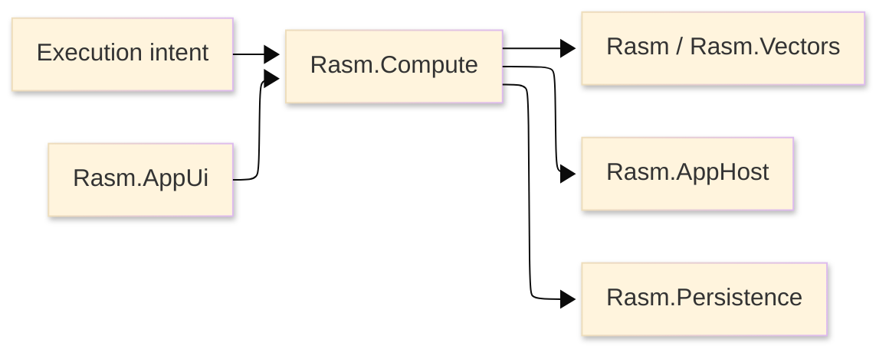

# [RASM_COMPUTE_ARCHITECTURE]

`Rasm.Compute` owns measured execution doctrine. The package is a manifest-backed project node with no production source; this page defines the architecture that source must enter.

## [1]-[SYSTEM_SCOPE]

Text equivalent: Compute accepts typed execution intent, selects substrate lanes, emits receipts, consumes AppHost runtime policy, uses Persistence cache/index contracts, and exposes progress for AppUi observation.

## [2]-[PROJECT_IDENTITY]

This table is a lookup by project fact.

| [INDEX] | [FACT]            | [VALUE]                               |
| :-----: | :---------------- | :------------------------------------ |
|   [1]   | Project file      | `Rasm.Compute.csproj`                 |
|   [2]   | Source state      | no production `.cs` files             |
|   [3]   | Direct packages   | tensor, model, remote, units, staging |
|   [4]   | Project contracts | Rasm, AppHost, Persistence            |
|   [5]   | Benchmark route   | shared benchmark project              |

## [3]-[REFERENCE_DIRECTION]

This table is a dependency law by project.

| [INDEX] | [PROJECT]          | [RELATION]                              |
| :-----: | :----------------- | :-------------------------------------- |
|   [1]   | `Rasm`             | kernel and vector algorithm source      |
|   [2]   | `Rasm.AppHost`     | runtime policy and drain contract       |
|   [3]   | `Rasm.Persistence` | cache and benchmark index contract      |
|   [4]   | `Rasm.AppUi`       | observer only; no scheduling ownership  |
|   [5]   | host packages      | no direct dependency                    |

Compute references AppHost and Persistence. AppHost does not reference Compute.

## [4]-[EXECUTION_RAIL]

This table is a lookup by execution capability.

| [INDEX] | [RAIL]     | [OWNS]                                  |
| :-----: | :--------- | :-------------------------------------- |
|   [1]   | Intent     | operation, payload, model, endpoint     |
|   [2]   | Selection  | ordered substrate predicates            |
|   [3]   | Tensor     | tensor primitives and equivalence       |
|   [4]   | Model      | ONNX/CoreML identity and inference      |
|   [5]   | Remote     | gRPC endpoint and payload contracts     |
|   [6]   | Units      | external physical-unit boundaries       |
|   [7]   | Staging    | memory, span, and pooling support       |
|   [8]   | Progress   | subscription-gated observation          |
|   [9]   | Receipts   | execution, benchmark, model, remote     |

The receipt rail is one polymorphic family. Parallel per-lane result systems, compute-local retry owners, and provider-branded public services are rejected.

## [5]-[CATALOGUE_TRUTH]

Package API facts live in [.reports/api](.reports/api/README.md). Architecture names execution rails and dependency direction; catalogue pages carry package assemblies, namespaces, usings, type families, operation families, and rejected execution stacks.

## [6]-[BOUNDARIES]

- Compute owns measured execution; Rasm and Rasm.Vectors own algorithms.
- Compute owns progress data; AppUi owns UI scheduling and presentation.
- Compute owns model and remote receipts; AppHost owns outbound retry policy.
- Compute owns cache keys; Persistence owns durable cache/index storage.
