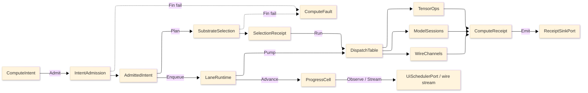

# [RASM_COMPUTE_ARCHITECTURE]

The professional-domain folder-map of `Rasm.Compute`, the APP-PLATFORM measured-execution package: one intent rail admits work exactly once at the boundary, one substrate axis routes it over row data, bounded lanes carry it, and one receipt union records every outcome at the sink edge. Each concern is one sub-domain owner with closed cases, every entrypoint is a typed rail, and a new feature lands as a row or case, never a new surface. The codemap names the full sub-domain structure — each one a real professional domain concept, never a rail/axis/lane file-naming scheme — so a planned-but-empty folder reads as a visible gap that fuels an idea or task. Mechanics, boundaries, and prohibitions live in the `.planning/` design pages; this map carries the sub-domain structure and the admit-to-receipt spine.

## [1]-[DOMAIN_MAP]

Each sub-domain mirrors one eventual source sub-tree. The charter is the concern the folder owns; the page list is the design pages that have landed under it.

```text codemap
Rasm.Compute/
├── intent/         Typed intent admission (six-case union, one shared Spec), the substrate axis with predicate/rank/cap/load/fallback columns, the ComputeFault family in the 2200 code band, and total dispatch with a selection receipt.
│   └── admission.md
├── tensors/        The CPU tensor execution vocabulary, the dtype map, the OrtValue C-data residency bridge, the layout/reshape algebra, geometry-to-tensor encoding, the op-family table, kernel dispatch, and the Rasm-baseline equivalence proofs.
│   ├── vocabulary.md   Tensor shapes/factories/dtype map and the 107-row op-family table over the tolerance band.
│   ├── residency.md    OrtValue C-data residency lattice, the IoBinding steady-state capsule, and geometry-to-tensor encoding.
│   ├── layout.md       LayoutForm rows and the ReshapeOp request union over the shape-edit family.
│   └── dispatch.md     Arity kernel-delegate tables, the partition column, and the equivalence/differentiable-adjoint law.
├── numeric/        BLAS-class dense and sparse linear algebra over the MathNet/CSparse stack: the RID-keyed provider table, shape-routed factorization, the criterion-stack iterative solve, kernel lowering, and the owned quadrature/integrator/sampling/spectral builds.
│   └── algebra.md
├── symbolic/       The closed symbolic-expression CAS sub-domain over the MathNet.Symbolics/FParsec stack: the SymbolicExpr value wrapping the F# Expression algebra, analytic differentiation and Taylor expansion, rational/algebraic/trigonometric/polynomial simplification, infix parse with LaTeX/Infix projection, the symbolic unit-dimension proof feeding the units boundary, and the content-keyed compiled-delegate cache feeding the optimizer Jacobian and the integrator seed.
│   ├── expression     The SymbolicExpr F# Expression algebra, the differentiate/simplify/compile/substitute/project family, and the SymbolicFault rail. (planned — T-SYMBOLIC-OWNER)
│   ├── dimensional    The DimensionMonomial SI base-dimension proof over a parsed expression feeding the units pre-numeric admission boundary. (planned — T-SYMBOLIC-DIMENSIONAL)
│   └── lowering       The content-keyed CompiledExpr cache and the GradientSource.Symbolic analytic-Jacobian arm into the optimizer adjoint. (planned — T-SYMBOLIC-LOWERING)
├── models/         ONNX model identity and provenance, the one shared session capsule with its EP-context warm-start, the execution-provider axis, custom-op admission, the OrtValue-only run-mode fold, the ORT-GenAI token-streaming generative run, and the deterministic result cache.
│   ├── identity.md     Checksum identity, the acquisition union, the schema snapshot, and the shared ordinal-keyvalue fingerprint.
│   ├── sessions.md     One shared session per model checksum, lifecycle/warmup/drain rows, the shared-device-allocator lease, and the compatibility-gated warm-start.
│   ├── providers.md    The execution-provider axis with autoEP OrtEpDevice discovery, the ModelPrecision quantization posture, and the one polymorphic register.
│   ├── extension-ops.md Extension and custom-op registration with asset evidence and the bidirectional string-tensor boundary.
│   ├── inference.md    The OrtValue-only run-mode fold, the BoundLoop shared-arena hot path, the vectorized reductions, and the deterministic result cache.
│   ├── generative.md   The ORT-GenAI token-streaming owner with EOS oracle, decoder pins, LoRA hot-swap, the tool-call arm, and multimodal/streaming-audio/batched shapes.
│   └── embedding      The VectorEncoding/VectorScore embedding-and-retrieval owner over the Embed run: float32/int8/binary/product-quantized vectors, cosine/dot/euclidean/hamming SIMD scoring, crossing to the Persistence vector lane by reference. (planned — T-EMBEDDING-LANE)
├── remote/         The suite wire vocabulary: five proto services, the descriptor-diff contract-evolution law, the FaultDetail family, the transport axis, the credential/compression call policy, and the 64 KiB artifact-frame fold with content identity.
│   └── channels.md
├── interchange/    The chunked error-bounded field/result codec, the FastCDC structural geometry-delta codec, the two-hop IFC-to-geometry tessellation bridge, the 3D-Tiles streamable-LOD octree partition, the content-keyed meshlet/quantized/splat residency-payload codec the AppUi manifest references, and the content-addressed artifact identity folding deflection and tolerance into one key.
│   ├── codecs.md
│   └── residency      The ResidencyKind meshlet-cluster/quantized-vertex/point-splat/gaussian-splat PAYLOAD codec over the meshoptimizer meshlet/cluster-bounds/spatial-sort/encode surface plus the SPZ/SOG splat decode, content-keyed bytes the AppUi ResidencyManifest references — the manifest mint stays the AppUi WEB_GEOMETRY_RESIDENCY_WIRE owner. (planned — T-STREAMING-RESIDENCY)
├── solver/         The physics×BC×element solve contract over the discretized DDG field, the volumetric mesher with adaptive refinement, the design-space optimizer with constraint handling, the N-dim DOE sweep with sensitivity, the frame-budget governor, the acceleration-structure clash compute, and the ROM digital-twin loop.
│   ├── index.md           The solver sub-domain page index and the discretize→solve→optimize→sweep/clash spine.
│   ├── discretization.md  The volumetric MeshKernel, the element/quadrature/metric vocabulary, and adaptive h/p/hp refinement.
│   ├── solve-contract.md  The physics×BC×element solve fold, the transient/nonlinear/modal march, the adaptive-recovery ladder, and multi-physics coupling.
│   ├── optimizer.md       The design-space search axis, the constraint-handling feasibility axis, and the ROM/GP/RBF surrogate duality.
│   ├── sweep.md           The N-dim DOE sweep grid, the frame-budget early-stop governor, and Morris/Sobol sensitivity.
│   ├── clash.md           The acceleration-structure collision compute and the Kalman-banded ROM digital-twin loop.
│   └── uncertainty        The UncertaintyMethod/RandomVariable forward-UQ and reliability owner: Monte-Carlo/LHS/polynomial-chaos propagation, Sobol variance decomposition, and FORM/subset-simulation failure-probability over the same evaluate oracle, the C# producer of the uncertainty-law graduation axis. (planned — T-UNCERTAINTY-LANE)
├── staging/        Bounded staging memory between admission and the IO edges: the allocation-class axis with admission predicate and evidence, the bare plane-projection law, and the one-per-process recyclable stream pool with zero-allocation event-fold evidence and zero-copy handoff.
│   └── memory.md
├── scheduling/     Five bounded work-lane channels behind one enqueue capsule, the solve-path handle guard, the one CPU budget the three concurrency axes share, the dependency job-graph scheduler with dirty-subgraph re-solve, and band-200 drain participation.
│   └── runtime.md
├── progress/       The monotonic phase family with a CAS rank guard, the Atom-backed zero-allocation progress capsule, the cadence-gated subscription axis, and the seam fold projecting the identical phase family onto AppUi presentation and the wire.
│   └── cell.md
├── units/          The UnitsNet boundary: frozen quantity-family rows admitting every unit-bearing input exactly once, compound dimensional consistency over the SI baseline, and the culture-scoped parse/format edges emitting dual unit evidence.
│   └── quantities.md
└── receipts/       One typed ComputeReceipt union as the package's only fact vocabulary, the fold-projection family deriving every operational view, the NodaTime-protobuf wire-stamp bridges, and the fingerprint-gated benchmark-claim table deciding every performance route.
    └── union.md
```

Implementation collapses to one owner per axis and one entrypoint family per rail: a new feature is a row or case on a budgeted owner, never a new surface, and a public type outside an owner region is the named defect. One rail per entrypoint, named in the return type — `Fin<T>` aborts at admission, `Validation<ComputeFault,T>` accumulates, `IO<T>` carries effects, `Option<T>` carries absence at substrate vetoes and sentinel projection. The `ComputeFault` union projects through `FaultDetail` at the wire edge; receipts stamp NodaTime `Instant`/`Duration`, and AppHost `ClockPolicy` owns both clocks.

## [2]-[SPINE]



`ComputeIntent` admits through `IntentAdmission` into an `AdmittedIntent`; `SubstrateSelection` folds over substrate rows and lands a `SelectionReceipt`; `LaneRuntime` enqueues onto bounded lanes and pumps into `DispatchTable`, which routes to `TensorOps`, `ModelSessions`, or `WireChannels`; every lane emits `ComputeReceipt` cases through `ReceiptSinkPort`, admission and selection failures land on `ComputeFault`, and `ProgressCell` delivers cadence-gated marks to UI and wire observers.

The codemap is the map that fuels the forward ideas and tasks: a charter with no design page yet is a visible gap, and every prohibition, boundary, and receipt law lives on the design page that owns the sub-domain rather than re-aggregated here. Cross-package dependency direction is the branch `ARCHITECTURE.md`'s, never restated per folder.
