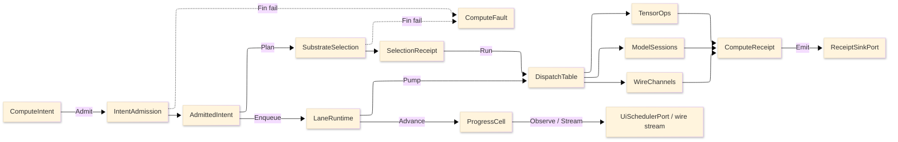

# [RASM_COMPUTE_ARCHITECTURE]

The professional-domain folder-map of `Rasm.Compute`, the APP-PLATFORM measured-execution package: one intent rail admits work exactly once at the boundary, one substrate axis routes it over row data, bounded lanes carry it, and one receipt union records every outcome at the sink edge. Each concern is one sub-domain owner with closed cases, every entrypoint is a typed rail, and a new feature lands as a row or case, never a new surface. The codemap names the full sub-domain structure — each one a real professional domain concept, never a rail/axis/lane file-naming scheme — so a planned-but-empty folder reads as a visible gap that fuels an idea or task. Mechanics, boundaries, and prohibitions live in the `.planning/` design pages; this map carries the sub-domain structure and the admit-to-receipt spine.

## [1]-[DOMAIN_MAP]

Each sub-domain mirrors one eventual source sub-tree. The charter is the concern the folder owns; the page list is the design pages that have landed under it.

```text codemap
Rasm.Compute/
├── intent/         Typed intent admission (six-case union, one shared Spec), the substrate axis with predicate/rank/cap/load/fallback columns, the ComputeFault family in the 2200 code band, and total dispatch with a selection receipt.
│   └── admission.md
├── tensors/        The CPU tensor execution vocabulary, the dtype map, the OrtValue C-data residency bridge, the layout/reshape algebra, geometry-to-tensor encoding, the op-family table, kernel dispatch, and the Rasm-baseline equivalence proofs.
│   └── operations.md
├── numeric/        BLAS-class dense and sparse linear algebra over the MathNet/CSparse stack: the RID-keyed provider table, shape-routed factorization, the criterion-stack iterative solve, kernel lowering, and the owned quadrature/integrator/sampling/spectral builds.
│   └── algebra.md
├── models/         ONNX model identity and provenance, the one shared session capsule with its EP-context warm-start, the execution-provider axis, custom-op admission, the OrtValue-only run-mode fold, the ORT-GenAI token-streaming generative run, and the deterministic result cache.
│   └── sessions.md
├── remote/         The suite wire vocabulary: five proto services, the descriptor-diff contract-evolution law, the FaultDetail family, the transport axis, the credential/compression call policy, and the 64 KiB artifact-frame fold with content identity.
│   └── channels.md
├── interchange/    The chunked error-bounded field/result codec, the FastCDC structural geometry-delta codec, the two-hop IFC-to-geometry tessellation bridge, the 3D-Tiles streamable-LOD octree partition, and the content-addressed artifact identity folding deflection and tolerance into one key.
│   └── codecs.md
├── solver/         The physics×BC×element solve contract over the discretized DDG field, the volumetric mesher with adaptive refinement, the design-space optimizer with constraint handling, the N-dim DOE sweep with sensitivity, the frame-budget governor, the acceleration-structure clash compute, and the ROM digital-twin loop.
│   └── lane.md
├── staging/        Bounded staging memory between admission and the IO edges: the allocation-class axis with admission predicate and evidence, the bare plane-projection law, and the one-per-process recyclable stream pool with zero-allocation event-fold evidence and zero-copy handoff.
│   └── memory.md
├── scheduling/     Five bounded work-lane channels behind one enqueue capsule, the solve-path handle guard, the one CPU budget the three concurrency axes share, the dependency job-graph scheduler with dirty-subgraph re-solve, and band-200 drain participation.
│   └── runtime.md
├── progress/       The monotonic phase family with a CAS rank guard, the Atom-backed zero-allocation progress capsule, the cadence-gated subscription axis, and the seam fold projecting the identical phase family onto AppUi presentation and the wire.
│   └── cell.md
├── units/          The UnitsNet boundary: frozen quantity-family rows admitting every unit-bearing input exactly once, compound dimensional consistency over the SI baseline, and the culture-scoped parse/format edges emitting dual unit evidence.
│   └── quantities.md
└── receipts/       One typed ComputeReceipt union as the package's only fact vocabulary, the fold-projection family deriving every operational view, the NodaTime-protobuf wire-stamp bridges, and the fingerprint-gated benchmark-claim table deciding every performance route.
    └── union.md
```

Implementation collapses to one owner per axis and one entrypoint family per rail: a new feature is a row or case on a budgeted owner, never a new surface, and a public type outside an owner region is the named defect. One rail per entrypoint, named in the return type — `Fin<T>` aborts at admission, `Validation<ComputeFault,T>` accumulates, `IO<T>` carries effects, `Option<T>` carries absence at substrate vetoes and sentinel projection. The `ComputeFault` union projects through `FaultDetail` at the wire edge; receipts stamp NodaTime `Instant`/`Duration`, and AppHost `ClockPolicy` owns both clocks.

## [2]-[SPINE]



`ComputeIntent` admits through `IntentAdmission` into an `AdmittedIntent`; `SubstrateSelection` folds over substrate rows and lands a `SelectionReceipt`; `LaneRuntime` enqueues onto bounded lanes and pumps into `DispatchTable`, which routes to `TensorOps`, `ModelSessions`, or `WireChannels`; every lane emits `ComputeReceipt` cases through `ReceiptSinkPort`, admission and selection failures land on `ComputeFault`, and `ProgressCell` delivers cadence-gated marks to UI and wire observers.

The codemap is the map that fuels the forward ideas and tasks: a charter with no design page yet is a visible gap, and every prohibition, boundary, and receipt law lives on the design page that owns the sub-domain rather than re-aggregated here. Cross-package dependency direction is the branch `ARCHITECTURE.md`'s, never restated per folder.
