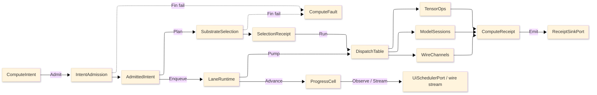

# [RASM_COMPUTE_ARCHITECTURE]

The domain map of `Rasm.Compute` — the APP-PLATFORM measured-execution package. One intent rail admits work once at the boundary, one substrate axis routes it over row data, bounded lanes carry it, and one `ComputeReceipt` union records every outcome across the Tensor, Symbolic, Model, Solver, and Runtime folders.

Each codemap node is the eventual source file its `.planning/` design page becomes, named in the language's own folder and file casing — PascalCase `.cs`, lowercase `.py`, lowercase `.ts`. Treat every node as realized code; the `.planning/` scaffold is the authoring substrate, never part of the map.

## [01]-[DOMAIN_MAP]

```text codemap
Rasm.Compute/
├── Tensor/                # CPU tensor vocabulary and BLAS-class numeric core
│   ├── Vocabulary.cs      # Tensor shapes/factories/dtype map and 107-row op-family table
│   ├── Layout.cs          # LayoutForm rows and ReshapeOp shape-edit request union
│   ├── Dispatch.cs        # Arity kernel-delegate tables with differentiable-adjoint law
│   ├── Residency.cs       # OrtValue C-data residency lattice and geometry-to-tensor encoding
│   ├── Memory.cs          # Bounded staging memory with a recyclable zero-copy stream pool
│   ├── Blas.cs            # RID-keyed LinearProvider dense BLAS/factorization/spectral core
│   ├── Factor.cs          # Sparse-format ingestion and criterion-stack iterative solve
│   ├── Quadrature.cs      # Accuracy-routed quadrature with adaptive control and spectral operator
│   └── Sampling.cs        # Owned Sobol/Halton sampler and radial-basis scatter reconstruction
├── Symbolic/              # Closed symbolic-expression CAS and unit boundary
│   ├── Expression.cs      # SymbolicExpr F# Expression algebra and differentiate/simplify/compile family
│   ├── Dimensional.cs     # DimensionMonomial SI base-dimension proof over a parsed expression
│   ├── Lowering.cs        # Content-keyed CompiledExpr cache and analytic-Jacobian arm
│   └── Units.cs           # UnitsNet boundary admitting unit-bearing input with dual unit evidence
├── Model/                 # ONNX model identity, sessions, inference, and generative runs
│   ├── Identity.cs        # Checksum identity, acquisition union, and schema snapshot
│   ├── Sessions.cs        # One shared session per checksum with compatibility-gated warm-start
│   ├── Providers.cs       # Execution-provider axis with autoEP discovery and quantization posture
│   ├── Inference.cs       # OrtValue-only run-mode fold with BoundLoop hot path and result cache
│   ├── Embedding.cs       # VectorEncoding/VectorScore embedding-and-retrieval owner
│   ├── Generative.cs      # ORT-GenAI token-streaming owner with EOS oracle and tool-call arm
│   └── Extension.cs       # Custom-op registration with bidirectional string-tensor boundary
├── Solver/                # Discretize→solve→optimize→sweep/clash solve spine
│   ├── Discretization.cs  # Volumetric MeshKernel with adaptive h/p/hp refinement
│   ├── Contract.cs        # Physics×BC×element solve fold with adaptive-recovery ladder
│   ├── Optimizer.cs       # Design-space search axis with ROM/GP/RBF surrogate duality
│   ├── Sweep.cs           # N-dim DOE sweep grid with Morris/Sobol sensitivity
│   ├── Clash.cs           # Acceleration-structure collision compute and ROM digital-twin loop
│   └── Uncertainty.cs     # Forward-UQ/reliability owner over same evaluate oracle
└── Runtime/               # Admit-to-receipt boundary plane
    ├── Admission.cs       # Typed intent admission with substrate axis and total dispatch
    ├── Scheduling.cs      # Five bounded work-lanes with dependency job-graph scheduler
    ├── Progress.cs        # Monotonic phase family with an Atom-backed progress capsule
    ├── Receipts.cs        # One ComputeReceipt fact union and benchmark-claim table
    ├── Channels.cs        # Suite wire vocabulary of five proto services with contract-evolution law
    ├── Codecs.cs          # Field/result/geometry-delta codecs and tessellation bridge
    └── Payload.cs         # ResidencyKind meshlet/quantized/splat PAYLOAD codec
```

Implementation collapses to one owner per axis and one entrypoint family per rail: a new feature is a row or case on a budgeted owner, and a public type outside an owner region is the named defect. The rail is named in the return type — `Fin<T>` aborts at admission, `Validation<ComputeFault,T>` accumulates, `IO<T>` carries effects, `Option<T>` carries absence. The `ComputeFault` union projects through `FaultDetail` at the wire edge; receipts stamp NodaTime `Instant`/`Duration`, and AppHost `ClockPolicy` owns both clocks.

## [02]-[SEAMS]

```text seams
Runtime           ⇄  python:geometry/mesh                  # [CONTENT_KEY]: ContentIdentity XxHash128 + deflection/tolerance seed parity
Runtime/channels  →  typescript:interchange/codec          # [WIRE]: ReceiptEnvelopeWire / FaultDetailWire / proto vocabulary
Runtime/channels  →  typescript:interchange/contract       # [WIRE]: FileDescriptorSet ContractDrift verdict
Runtime/channels  →  typescript:platform/transport         # [WIRE]: ArtifactFrameWire reassembly
Runtime/channels  →  typescript:ui/render                  # [WIRE]: GeometryPayload proto descriptor / MeshTensor view
Runtime/channels  ⇄  python:runtime/transport              # [WIRE]: PROTO_VOCABULARY service contracts
Runtime/channels  ⇄  python:geometry/mesh                  # [WIRE]: ComputeService/ArtifactSync gRPC GLB tessellation
Runtime/progress  →  typescript:projection/evidence        # [WIRE]: ProgressMarkWire
Runtime           ←  python:geometry/mesh                  # [TRANSPORT]: ServerHost ComputeService/ArtifactSync GLB + semantic header
Runtime/codecs    ←  python:geometry/mesh                  # [PROJECTION]: IFC tessellation bridge via IfcOpenShell
Runtime/progress  →  typescript:interchange/codec          # [PROJECTION]: ProgressStore stream proto
Runtime           ←  python:geometry                       # [GRADUATION]: HandoffAxis geometry case: topology-graph / lifecycle / registration
Runtime           →  csharp:Rasm.AppUi/Render              # [PROJECTION]: ResidencyManifest.Mint web geometry residency
Solver            ←  csharp:Rasm.Bim/Model                 # [CONTENT_KEY]: AnalysisModel (GeometryKey, PropertyKey) content-key
Runtime           ←  csharp:Rasm.Bim/Semantics             # [PROJECTION]: IFC/glTF semantic metadata layer
Runtime/channels  →  csharp:Rasm.Bim/Semantics             # [TRANSPORT]: BsddPort injected bSDD GET /api/Class/v1 BsddClassResponse, LocalShape degrade
Runtime/codecs    ←  csharp:Rasm.Bim/Model                 # [CONTENT_KEY]: (GeometryKey, *Key) XxHash128.HashToUInt128 pair joining InterchangeIdentity
Runtime/codecs    ←  csharp:Rasm.Bim/Exchange              # [TESSELLATION]: TessellationOutcome two-hop GLB, CacheHit by ArtifactKey
Runtime/codecs    ←  csharp:Rasm.Bim/Review                # [TRANSPORT]: IdsAudit ifctester oracle two-hop rpc, GlobalId-plus-facet diff
Symbolic          →  csharp:Rasm.Fabrication/Process       # [WIRE]: UnitsNet quantity canonicalization to SI scalar
Symbolic          →  csharp:Rasm.Materials/Appearance      # [PORT]: QuantityFamily illuminance
Symbolic          →  csharp:Rasm.Materials/Appearance      # [PORT]: ONNX spectral-reconstruction conductor curve
algorithms        →  csharp:Rasm.Materials/Appearance      # [PORT]: QR/LM least-squares BRDF fit over GGX/Smith
Runtime           ⇄  csharp:Rasm.Persistence/Query/lanes   # [CONTENT_KEY]: EmbeddingIdentity content x model-id x arity
Runtime           ⇄  csharp:Rasm.Persistence/Version/commits # [GRADUATION]: HandoffAxis graduation evidence
Runtime           →  csharp:Rasm.Persistence               # [CONTENT_KEY]: content-keyed blob
Runtime/codecs    ⇄  csharp:Rasm.Persistence/Query/cache   # [CONTENT_KEY]: ContentIdentity XxHash128 seed-zero two-half
Runtime/codecs    →  python:runtime/evidence/identity + typescript:interchange/Codec/frame # [WIRE]: XxHash128 seed-zero two-half [gated: hash-wasm / xxhash cp315]
Runtime           ←  csharp:Rasm.Persistence/Sync          # [PROJECTION]: content-key delta via FastCDC
Tensor/device     ⇄  csharp:Rasm.AppUi/Render              # [SHAPE]: shared ONE_WGPU_DEVICE (Silk.NET.WebGPU)
Runtime/admission ←  csharp:Rasm.AppHost                   # [PORT]: WorkLane shed verdict (ONE_DEGRADATION_SHED_VERDICT)
Exchange          ⇄  csharp:Rasm.Persistence/Sync/pipeline # [PORT]: parse-to-canonical-bytes (Extract)
Compute           →  csharp:Rasm.Persistence/Store/quality # [SHAPE]: geometry-derived anomaly rule source
Runtime           ⇄  python:compute/graduation             # [GRADUATION]: HandoffAxis graduation evidence
Runtime           →  python:compute/graduation             # [WIRE]: EvidenceBundle graduation-evidence wire
Runtime           ←  python:compute/solvers                # [PROJECTION]: SolverReceipt convergence verdict
Runtime           ←  python:data/tabular                   # [SHAPE]: DOE dataset / labelled-array study input
Runtime           ←  python:data/spatial/geospatial        # [SHAPE]: GeoArrow buffers share GLB tessellation wire layout
```

## [03]-[SPINE]



`ComputeIntent` admits through `IntentAdmission` into an `AdmittedIntent`; `SubstrateSelection` folds over substrate rows and lands a `SelectionReceipt`; `LaneRuntime` enqueues onto bounded lanes and pumps into `DispatchTable`, which routes to `TensorOps`, `ModelSessions`, or `WireChannels`; every lane emits `ComputeReceipt` cases through `ReceiptSinkPort`, admission and selection failures land on `ComputeFault`, and `ProgressCell` delivers cadence-gated marks to UI and wire observers.
