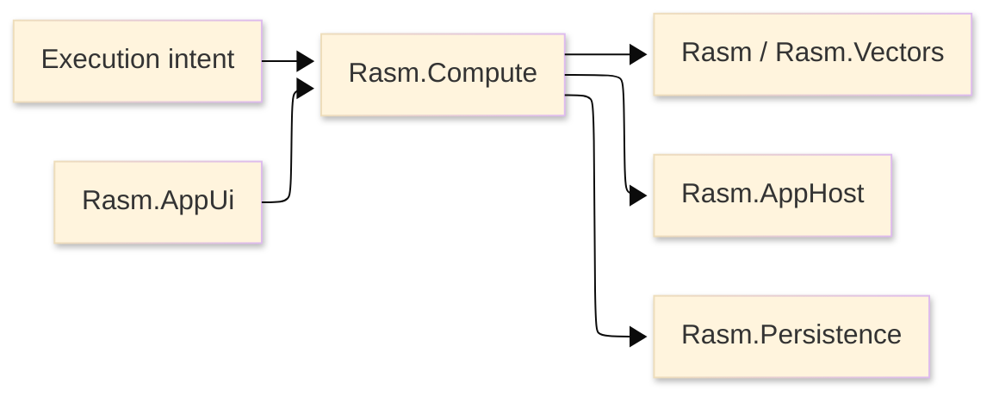

# [RASM_COMPUTE_ARCHITECTURE]

`Rasm.Compute` owns measured execution doctrine.

The package is a manifest-backed project node with no production source; this page defines the architecture that source must enter.

## [1]-[SYSTEM_SCOPE]

Text equivalent: Compute accepts typed execution intent, selects substrate lanes, and emits receipts.

It consumes AppHost runtime policy, uses Persistence cache/index contracts, and exposes progress for AppUi observation.

## [2]-[PROJECT_IDENTITY]

| [INDEX] | [FACT]            | [VALUE]                               |
| :-----: | :---------------- | :------------------------------------ |
|   [1]   | Project file      | `Rasm.Compute.csproj`                 |
|   [2]   | Source state      | no production `.cs` files             |
|   [3]   | Direct packages   | tensor, model, remote, units, staging |
|   [4]   | Project contracts | Rasm, AppHost, Persistence            |
|   [5]   | Benchmark route   | shared benchmark project              |

## [3]-[REFERENCE_DIRECTION]

| [INDEX] | [PROJECT]          | [RELATION]                             |
| :-----: | :----------------- | :------------------------------------- |
|   [1]   | `Rasm`             | kernel and vector algorithm source     |
|   [2]   | `Rasm.AppHost`     | runtime policy and drain contract      |
|   [3]   | `Rasm.Persistence` | cache and benchmark index contract     |
|   [4]   | `Rasm.AppUi`       | observer only; no scheduling ownership |
|   [5]   | host packages      | no direct dependency                   |

Compute references AppHost and Persistence. AppHost does not reference Compute.

## [4]-[EXECUTION_RAIL]

| [INDEX] | [RAIL]    | [OWNS]                              |
| :-----: | :-------- | :---------------------------------- |
|   [1]   | Intent    | operation, payload, model, endpoint |
|   [2]   | Selection | ordered substrate predicates        |
|   [3]   | Tensor    | tensor primitives and equivalence   |
|   [4]   | Model     | ONNX/CoreML identity and inference  |
|   [5]   | Remote    | gRPC endpoint and payload contracts |
|   [6]   | Units     | external physical-unit boundaries   |
|   [7]   | Staging   | memory, span, and pooling support   |
|   [8]   | Progress  | subscription-gated observation      |
|   [9]   | Receipts  | execution, benchmark, model, remote |

The receipt rail is one polymorphic family. Parallel per-lane result systems, compute-local retry owners, and provider-branded public services are rejected.

## [5]-[CATALOGUE_TRUTH]

Package API facts live in [.reports/api](.reports/api/README.md).

Architecture names execution rails and dependency direction without repeating package member lists, package history, or generated lookup tables.

## [6]-[SOURCE_SHAPE_LAW]

- Compute source enters as one measured execution rail with intent, selection, tensor, model, remote, units, staging, streams, progress, receipts, and benchmark owners.
- Folder architecture is planned before production source.
- Owner folders, rail entrypoints, generated protocol shapes, model receipts, progress contracts, cache keys, and boundaries are named together.
- Execution capability deepens the owning rail through substrate rows, typed intent fields, receipts, equivalence proof, benchmark evidence, and persistence contracts.
- New public surfaces are added only after the owning execution rail is complete.
- Tensor, ONNX, gRPC, Protobuf, UnitsNet, stream, and memory package types stay substrate material rather than public provider vocabulary.
- Flat feature files, provider-branded execution services, synchronous host solve execution, and per-substrate result systems are rejected.

## [7]-[BOUNDARIES]

- Compute owns measured execution; Rasm and Rasm.Vectors own algorithms.
- Compute owns progress data; AppUi owns UI scheduling and presentation.
- Compute owns model and remote receipts; AppHost owns outbound retry policy.
- Compute owns cache keys; Persistence owns durable cache/index storage.
