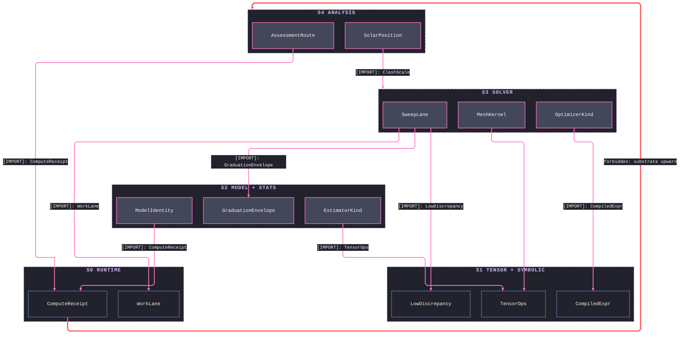
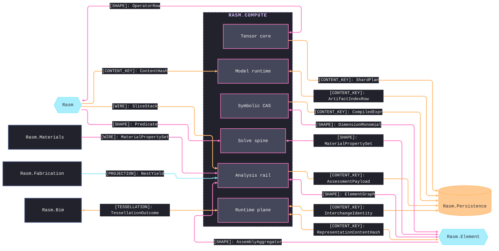
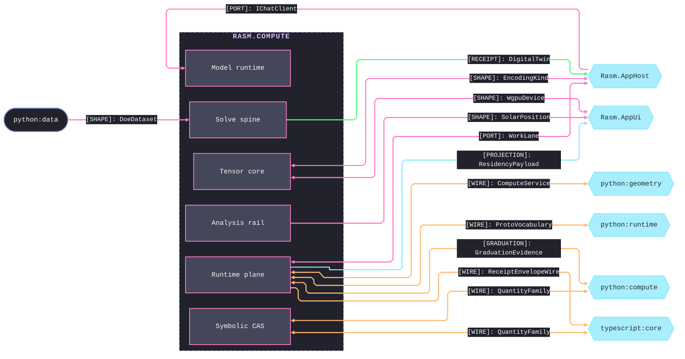

# [RASM_COMPUTE_ARCHITECTURE]

`Rasm.Compute` maps APP-PLATFORM measured execution over `{Rasm, Rasm.Element}`: one intent rail admits work once at the boundary, one substrate axis routes it over row data, bounded lanes carry it, and one `ComputeReceipt` union records every outcome across the Tensor, Symbolic, Model, Solver, Stats, Runtime, and Analysis folders. Each folder maps to exactly one namespace, and one polymorphic owner closes its axis over the `ComputeReceipt`/`ComputeFault` pair.

## [01]-[DOMAIN_MAP]

```text codemap
Rasm.Compute/
├── Tensor/                # CPU tensor vocabulary and BLAS-class numeric core
│   ├── Vocabulary.cs      # Tensor shape, factory, dtype, and op-family vocabulary
│   ├── Layout.cs          # Layout forms and the shape-edit request union
│   ├── Dispatch.cs        # Arity kernel-delegate tables and the differentiable-adjoint law
│   ├── Residency.cs       # OrtValue C-data residency lattice and geometry-to-tensor encoding
│   ├── Memory.cs          # Bounded staging memory and the zero-copy stream pool
│   ├── Blas.cs            # Dense BLAS, factorization, and spectral core
│   ├── Factor.cs          # Sparse ingestion and criterion-stack iterative solve
│   ├── Quadrature.cs      # Accuracy-routed adaptive quadrature and the spectral operator
│   └── Sampling.cs        # Sobol/Halton sampling and radial-basis scatter reconstruction
├── Symbolic/              # Closed symbolic-expression CAS and unit boundary
│   ├── Expression.cs      # Symbolic-expression algebra over the CAS Entity
│   ├── Dimensional.cs     # ℚ⁷ SI base-dimension proof
│   ├── Lowering.cs        # Content-keyed compiled-expression cache and the analytic-Jacobian arm
│   └── Units.cs           # Units boundary admitting unit-bearing input
├── Model/                 # ONNX model identity, sessions, inference, and generative runs
│   ├── Identity.cs        # Checksum identity, acquisition union, schema snapshot, and drift sentinel
│   ├── Sessions.cs        # One shared session per checksum with warm-start
│   ├── Providers.cs       # Execution-provider axis with discovery and quantization posture
│   ├── Inference.cs       # Run-mode inference fold, batching gate, and result cache
│   ├── Embedding.cs       # Embedding-and-retrieval owner
│   ├── Generative.cs      # Token-streaming generation with the tool-call arm
│   └── Extension.cs       # Custom-op registration at the string-tensor boundary
├── Solver/                # Discretize-solve-optimize-sweep solve spine
│   ├── Discretization.cs  # Volumetric meshing with adaptive refinement and exact-predicate gates
│   ├── Contract.cs        # Physics-by-BC solve fold with adaptive recovery
│   ├── Constitutive.cs    # Per-Gauss-point stress-update axis and contact enforcement
│   ├── Optimizer.cs       # Design-space search axis with surrogate duality
│   ├── Sweep.cs           # N-dim DOE sweep grid and sensitivity analysis
│   ├── Clash.cs           # Collision compute, occlusion rays, and the digital-twin loop
│   ├── Satisfy.cs         # SMT rule satisfaction with witness and unsat-core explanation
│   └── Uncertainty.cs     # Forward-UQ and reliability over the shared evaluate oracle
├── Stats/                 # Classical statistics, statistical learning, and DSP
│   ├── Estimator.cs       # One Fit/Predict estimator axis across the statistical families
│   └── Signal.cs          # Spectral-transform axis and filter design
├── Runtime/               # Admit-to-receipt boundary plane
│   ├── Admission.cs       # Typed intent admission with substrate axis and total dispatch
│   ├── Scheduling.cs      # Bounded work-lanes and the dependency job-graph scheduler
│   ├── Progress.cs        # Monotonic phase family and the progress capsule
│   ├── Receipts.cs        # One ComputeReceipt fact union and benchmark-claim table
│   ├── Wire.cs            # Wire contract: proto vocabulary, evolution, and fault projection
│   ├── Transport.cs       # Channel mechanics: transport rows, tuning, and the artifact frame law
│   ├── Codecs.cs          # Field, result, and geometry-delta codecs and the tessellation bridge
│   └── Payload.cs         # Residency payload codec and the cluster-LOD chain
└── Analysis/              # C#-first discipline-assessment rail over the ElementGraph
    ├── Assessment.cs      # Lifecycle-aware assessment spine and reconciler
    ├── Aggregator.cs      # Multi-ply assembly aggregator over U/STC/GWP/cost
    ├── Structural.cs      # Frame solve and the design-code capacity table
    ├── Physics.cs         # Closed-form thermal, acoustic, and fire folds
    ├── Energy.cs          # Energy-route axis over the simulation toolchain
    ├── Lifecycle.cs       # Embodied-carbon and cost rollup over the EPD boundary
    ├── Circulation.cs     # Egress and life-safety runner
    └── Daylight.cs        # Solar-position kernel and sky-model daylight rows
```

Implementation collapses to one owner per axis and one entrypoint family per rail: a new feature is a row or case on a budgeted owner, and a public type outside an owner region is the named defect. Rail is named in the return type — `Fin<T>` aborts at admission, `Validation<Error,T>` accumulates (the monoidal `Error` carrier; typed `ComputeFault` arms lift onto it through their `Expected` base, since `ComputeFault` is not itself a monoid), `IO<T>` carries effects, `Option<T>` carries absence. `ComputeFault` projects through `FaultDetail` at the wire edge; receipts stamp NodaTime `Instant`/`Duration`, and AppHost `ClockPolicy` owns both clocks.

## [02]-[STRATA]

Five strata order the seven sub-domains; `Runtime` seats lowest as the vocabulary mint while its dispatch table routes to the lane owners and its `ComputeReceipt` union gains cases as partials declared by the owning stratum — co-ownership, never an upward import — so every consumption edge points down.

- S0 `Runtime` — mints the admit-to-receipt substrate exactly once: `ComputeIntent`, `ComputeReceipt`, `ComputeFault`, `WorkLane`, and the `Substrate` axis; every lane lands here.
- S1 `Tensor` + `Symbolic` — peers over the substrate: `TensorOps`, `OrtResidency`, and the `LowDiscrepancy` sampler beside `QuantityFamily`, `DimensionMonomial`, and the `CompiledExpr` cache.
- S2 `Model` + `Stats` — `ModelIdentity`, `ModelSessions`, and the `GraduationEnvelope` admission gate beside the `EstimatorKind` fit axis and the spectral rail.
- S3 `Solver` — the discretize-solve-optimize-sweep spine: `MeshKernel`, `OptimizerKind`, `SweepLane`, and the `DoeDataset` wire shape over tensors, symbols, surrogates, and estimators.
- S4 `Analysis` — the discipline-assessment rail nothing composes: `AssessmentRoute`, `AssemblyAggregator`, and the `SolarPosition` kernel reading the `ElementGraph` upward and writing content-keyed deltas.



## [03]-[SEAMS]





## [04]-[INTERNAL]

```mermaid
---
config:
  theme: base
  look: classic
  layout: elk
  flowchart:
    curve: linear
    padding: 25
  themeVariables:
    darkMode: true
    fontFamily: "SF Mono, Menlo, Cascadia Mono, Segoe UI Mono, Consolas, monospace"
    useGradient: false
    dropShadow: "none"
    background: "#282A36"
    primaryColor: "#44475A"
    primaryTextColor: "#F8F8F2"
    primaryBorderColor: "#BD93F9"
    lineColor: "#FF79C6"
    textColor: "#F8F8F2"
    edgeLabelBackground: "#21222C"
    labelBackgroundColor: "#21222C"
  themeCSS: ".nodeLabel{font-size:13px;font-weight:500}.edgeLabel{font-size:12px;font-weight:500}.cluster-label .nodeLabel{font-size:13.5px;font-weight:700;letter-spacing:.08em}.edge-thickness-normal{stroke-width:2px}.edge-thickness-thick{stroke-width:3px}.edge-pattern-dashed,.edge-pattern-dotted{stroke-width:1.5px;stroke-dasharray:4 6}.node rect,.node circle,.node polygon,.node path,.node .outer-path{stroke-width:1.5px;filter:none!important}.cluster rect{stroke-width:1px!important;stroke-dasharray:5 4!important;filter:none!important}.marker path{transform:scale(.8);transform-origin:5px 5px}.marker circle{transform:scale(.48);transform-origin:5px 5px}.edgeLabel rect{transform-box:fill-box;transform-origin:center;transform:scale(1.1,1.2)}"
---
flowchart LR
    accTitle: Rasm.Compute measured execution spine
    accDescr: Typed intent admits once at the boundary, substrate selection folds over row data and lands a receipt, bounded lanes enqueue work, total dispatch routes to the tensor, model, or remote lane, every outcome materializes as a compute receipt at the sink port, and progress cells deliver cadence-gated marks to observers.
    ComputeIntent(["ComputeIntent"]) e1@-->|Admit| AdmittedIntent["AdmittedIntent.Admit"]
    AdmittedIntent e3@-.->|Fin fail| ComputeFault["ComputeFault"]
    AdmittedIntent e4@-->|Plan| SubstrateSelection["SubstrateSelection"]
    SubstrateSelection e5@--> SelectionReceipt["SelectionReceipt"]
    SubstrateSelection e6@-.->|Fin fail| ComputeFault
    AdmittedIntent e7@-->|Enqueue| LaneRuntime["LaneRuntime"]
    LaneRuntime e8@-->|Pump| DispatchTable["DispatchTable"]
    SelectionReceipt e9@-->|Run| DispatchTable
    DispatchTable e10@--> TensorOps["TensorOps"]
    DispatchTable e11@--> ModelSessions["ModelSessions"]
    DispatchTable e12@--> WireChannels["WireChannels"]
    TensorOps e13@--> ComputeReceipt["ComputeReceipt"]
    ModelSessions e14@--> ComputeReceipt
    WireChannels e15@--> ComputeReceipt
    ComputeReceipt e16@-->|Emit| ReceiptSinkPort["ReceiptSinkPort"]
    LaneRuntime e17@-->|Advance| ProgressCell["ProgressCell"]
    ProgressCell e18@-->|Observe / Stream| Observers(["UiSchedulerPort / wire stream"])
    classDef boundary fill:#282A36,stroke:#BD93F9,color:#F8F8F2
    classDef error fill:#FF555580,stroke:#FF5555,color:#F8F8F2
    classDef primary fill:#44475A,stroke:#FF79C6,color:#F8F8F2
    classDef edgeSuccess stroke:#50FA7B,color:#F8F8F2
    classDef edgeError stroke:#FF5555,stroke-width:3px,color:#F8F8F2
    classDef edgeControl stroke:#FF79C6,color:#F8F8F2
    class ComputeIntent,Observers boundary
    class ComputeFault error
    class AdmittedIntent,SubstrateSelection,SelectionReceipt,LaneRuntime,DispatchTable,TensorOps,ModelSessions,WireChannels,ComputeReceipt,ReceiptSinkPort primary
    class e3,e6 edgeError
    class e5,e13,e14,e15,e16 edgeSuccess
    class e1,e4,e7,e8,e9,e10,e11,e12,e17,e18 edgeControl
```



Spine admits once, selects substrate over row data, enqueues on bounded lanes, dispatches to the tensor, model, or remote lane, and lands every outcome on a `ComputeReceipt` case at the sink while admission and selection failures fall to `ComputeFault` and `ProgressCell` streams cadence-gated marks. Per-stage guards, conditioning, and rails each lane composes live on the owning implementation pages.

## [05]-[CROSS_PACKAGE]

Seam graph carries which owner exchanges which shape; the load-bearing cross-boundary invariants each Compute owner holds are:
- `Substrate.DeviceWgpu` binds the AppUi-owned wgpu device and holds compute-only resources; no second device or residency lattice.
- `Tensor/residency` consumes only the host-neutral `EncodedGeometry` payload wrapped as `EncodedTensor`.
- Host geometry folds at the kernel and AppHost capsules; no host type reaches an interior `Tensor`/`Solve`/`Estimator` signature.
- Compute owns the channel and companion-rpc orchestration; `Rasm.Bim` owns every semantic read, and neither crosses the seam.
- Strata run one direction: the AEC peers admit `UnitsNet` in-folder rather than reference the app-platform unit and solve owners downward.
- `Analysis` reads the concrete `ElementGraph` upward and writes a content-keyed assessment `GraphDelta` the caller applies; it mutates nothing.
- C# owns inference plus classical fit; every offline-learned model is the Python companion's, decoded by content key over the graduation evidence.
- `EnergyToolchain` resolves EnergyPlus by env var, configured path, or bundle; no hardcoded path or token column enters the policy.
- `EnergyRoute` converges local and cloud runs on the one `SqlFile` fold.
- Closed-form ISO/EN folds and the multi-ply `AssemblyAggregator` live in `Analysis`; single-material folds stay seam-owned, composed here.
- Design codes ride the `DesignCode`×`LimitState` capacity table.
- `Analysis/daylight` consumes the kernel `Spatial.Apply(SpatialOp.Wire)` decoded scene as the app-staged `ObstructionScene` request payload — its content key folds the assessment content key so a re-shaded site re-keys — and site evidence is the EPW header or the request's explicit `SolarSite`, never a fabricated site.

## [06]-[OWNER_LAW]

Every device, sparse, autodiff, estimator, optimizer, UQ, or constitutive capability is a row or case on its existing owner — a `Substrate` row, a `SparseTensorOpFamily` row, a `DifferentiableOp`+`Forward` pair, an `EstimatorKind`/`OptimizerKind`/`UncertaintyMethod` row, or a `ConstitutiveModel` case — never a sibling owner or a second admission spine. `System.Numerics.Tensors` `Tensor<T>` is the tensor, device-ness the `OrtResidency.DeviceResident` discriminant, and `TensorBridge` the sole `OrtValue` C-data factory feeding the single `BoundFlow` capsule; `LinearProvider`/`DenseOps`/`LevenbergMarquardt` and `SparseOps`/`SparseTensorOps` own the dense and sparse math. Solver, optimizer, UQ, and constitutive oracle couples only through the `Func<DesignPoint, Fin<Seq<double>>>` contract, an OR-Tools `CpModel` builds through the typed model-builder API, one `HybridCache` binds per lane, and one session binds per model identity. Assessment outcome is the one `ComputeReceipt.Assessment` case declared as a `Runtime/receipts` partial by `Analysis/assessment`, every discipline runner returns the uniform `AssessmentResult` fact stream, and design codes ride the `DesignCode`×`LimitState` capacity table.

`ComputeFault` is one 2200-band union `Runtime/admission` custodies across partial lanes owned by `Symbolic/expression`, `Symbolic/dimensional`, `Analysis/assessment`, and `Runtime/scheduling`; each lane appends its arm at the band's free frontier, the EC3 boundary reuses the transport `EndpointUnreachable` arm rather than minting a carbon code, and every fault crosses the wire through the one `FaultDetail` family whose `Bands` registry mirrors the custody map. Compute's second custody is the Remote `WireFault` sub-band pinned reciprocally in the AppHost/AppUi/Persistence registries.
