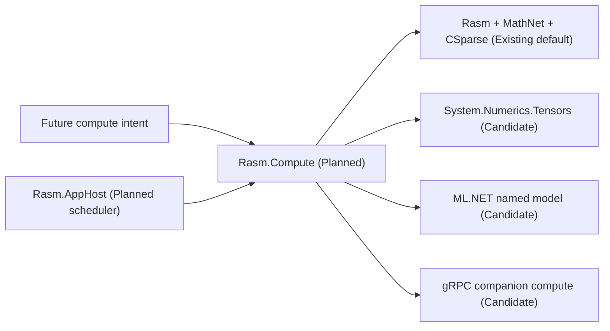

# [H1][RASM_COMPUTE_ARCHITECTURE]
>**Dictum:** *Measured compute selects substrates; domain owners define results.*

 

`Rasm.Compute` is the planned owner for measured execution beyond direct in-process `Rasm` operations. It keeps tensor, model, remote, cancellation, benchmark, and receipt concerns explicit without turning package APIs into public platform APIs.

---
## [1][CURRENT_STATUS]
>**Dictum:** *Compute nodes are candidates until measured consumers exist.*

 

| [INDEX] | [ITEM] | [STATE] |
| :-----: | ------ | ------- |
|   [1]   | Folder | Documentation stub |
|   [2]   | `.csproj` | Absent |
|   [3]   | Production C# | Absent |
|   [4]   | Candidate packages | Not in graph |
|   [5]   | Benchmark proof | Pending future source slice |

---
## [2][PUBLIC_RAIL_CONTRACT]
>**Dictum:** *Compute intent is data; substrate choice is internal.*

 

| [INDEX] | [CONCEPT] | [OWNS] | [DOES_NOT_OWN] |
| :-----: | --------- | ------ | -------------- |
|   [1]   | Compute Intent | operation kind, input contract, tolerance, deadline | package-specific API shape |
|   [2]   | Substrate Selection | Rasm, MathNet, CSparse, tensor primitive, model, remote | domain result semantics |
|   [3]   | Execution Receipt | substrate, timing, allocation, cancellation, failure | generic job ledger |
|   [4]   | Model Receipt | model identity, version, load/dispose, inference policy | unnamed ML experimentation |
|   [5]   | Remote Receipt | endpoint, deadline, payload limit, retry owner, failure | server hosting |
|   [6]   | Benchmark Receipt | baseline, candidate, memory, equivalence | speed claim without data |

AppHost may schedule or drain compute work. Compute owns execution semantics and proof receipts.

---
## [3][SUBSTRATE_ORDER]
>**Dictum:** *Use the existing numerical owner before adding a new substrate.*

 

| [INDEX] | [SUBSTRATE] | [POSTURE] | [GATE] |
| :-----: | ----------- | --------- | ------ |
|   [1]   | `Rasm` + MathNet + CSparse | Default | Existing algorithm owner and receipt |
|   [2]   | System.Numerics.Tensors | Candidate | Measured span/TensorPrimitives kernel |
|   [3]   | ML.NET | Candidate | Named local model and lifecycle proof |
|   [4]   | gRPC client | Candidate | Out-of-process companion contract |

---
## [4][FAILURE_MODEL]
>**Dictum:** *Compute failures identify substrate and evidence gap.*

 

Receipts must distinguish input rejection, unsupported substrate, cancellation, timeout, allocation cap, output inequivalence, benchmark regression, model missing, model version mismatch, model load failure, unsafe inference concurrency, remote deadline, payload rejection, retry-owner conflict, and remote fault.

---
## [5][PROOF_STATES]
>**Dictum:** *Performance status promotes through measurement.*

 

| [INDEX] | [STATE] | [MEANING] |
| :-----: | ------- | --------- |
|   [1]   | Candidate | Named in docs, not in graph |
|   [2]   | Referenced | Project references candidate package |
|   [3]   | Equivalent | Output matches baseline within tolerance policy |
|   [4]   | Measured | Benchmark receipt records time and allocation |
|   [5]   | Runtime-Proven | Host/runtime evidence records load/dispose behavior |
|   [6]   | Rejected | Fails equivalence, performance, host, or ownership gate |

Benchmark claims need baseline, target, input class, tolerance, memory profile, and artifact path when implementation lands.

---
## [6][SOURCE_ANCHORS]
>**Dictum:** *Sources justify candidates; they do not pin versions.*

 

| [INDEX] | [SOURCE] | [USE] |
| :-----: | -------- | ----- |
|   [1]   | `.claude/skills/coding-csharp/references/advanced-surface.md` | MathNet/CSparse substrate order |
|   [2]   | `.claude/skills/coding-csharp/references/performance.md` | span, tensor primitive, benchmark policy |
|   [3]   | [System.Numerics.Tensors NuGet](https://www.nuget.org/packages/System.Numerics.Tensors/) | tensor primitive candidate |
|   [4]   | [ML.NET overview](https://learn.microsoft.com/en-us/dotnet/machine-learning/overview) | named-model candidate |
|   [5]   | [gRPC for .NET](https://learn.microsoft.com/en-us/aspnet/core/tutorials/grpc/grpc-start) | companion compute candidate |
