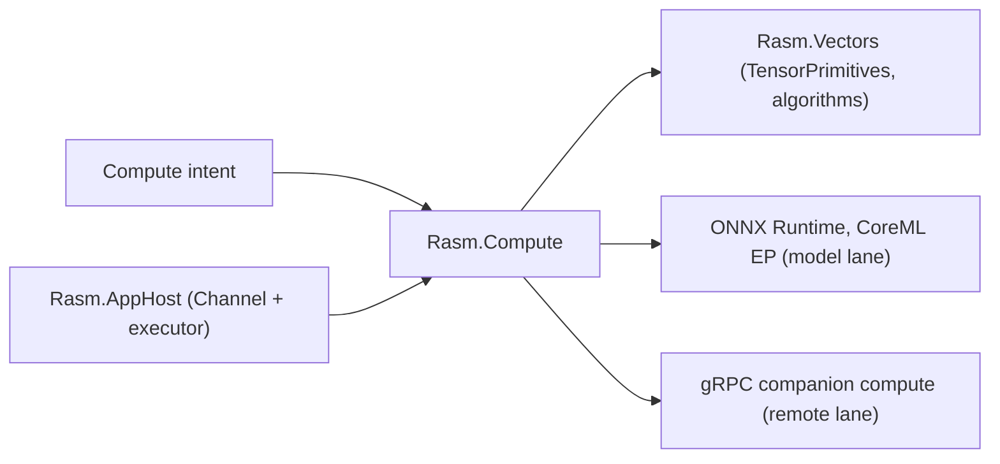

# [H1][RASM_COMPUTE_ARCHITECTURE]
>**Dictum:** *Measured compute selects substrates; domain owners define results.*

<br>

`Rasm.Compute` is the owner for measured execution beyond direct in-process `Rasm.Vectors` operations. It keeps tensor, model, remote, cancellation, benchmark, and receipt concerns explicit without turning package APIs into public platform APIs.

---
## [1][BUILD_STATUS]
>**Dictum:** *Build the measured-compute platform fully on the default substrate.*

<br>



| [INDEX] | [ITEM]             | [STATE]                  |
| :-----: | ------------------ | ------------------------ |
|   [1]   | Folder             | Active build             |
|   [2]   | `.csproj`          | `[NOT_STARTED]`          |
|   [3]   | Production C#      | In progress              |
|   [4]   | Packages           | `[NOT_STARTED]`          |
|   [5]   | Benchmark evidence | Per measured input class |

---
## [2][PUBLIC_RAIL_CONTRACT]
>**Dictum:** *Compute intent is data; substrate choice is internal.*

<br>

| [INDEX] | [CONCEPT]           | [OWNS]                                                                      | [DOES_NOT_OWN]              |
| :-----: | ------------------- | --------------------------------------------------------------------------- | --------------------------- |
|   [1]   | Compute Intent      | operation kind, input contract, tolerance, deadline                         | package-specific API shape  |
|   [2]   | Substrate Selection | Rasm.Vectors, tensor primitive, model, remote — chosen by predicate rule    | domain result semantics     |
|   [3]   | ExecutionReceipt    | substrate, timing, allocation, cancellation, failure; optional lane subnets | generic job ledger          |
|   [4]   | ModelReceipt        | model identity, version, load/dispose, EP, inference policy                 | unnamed ML experimentation  |
|   [5]   | RemoteReceipt       | endpoint, deadline, payload limit, retry owner, failure                     | server hosting              |
|   [6]   | BenchmarkReceipt    | baseline, candidate, memory, equivalence                                    | speed claim without data    |
|   [7]   | Progress Stream     | `IObservable<ComputeProgress>` — cold, monotone, single-shot                | UI-thread scheduling        |

Operations are `Eff<RT, ExecutionReceipt>` on the runtime record `RT` (defined by `Rasm.AppHost`). `RT` carries the `CancellationToken` and `TimeProvider`; Compute owns no executor. AppHost owns the bounded `Channel<ComputeRequest>`, drains it on its background scheduler, and calls Compute to execute each request; `ComputeRequest` is defined in the shared-contracts project, not in `Rasm.Compute`.

---
## [3][TYPE_SHAPES]
>**Dictum:** *Name every canonical type before writing a single implementation file.*

<br>

### [3.1][RUNTIME_CONSTRAINT]

`IComputeRuntime` is the minimal interface Compute needs to run standalone (without AppHost). It exposes `CancellationToken Token { get; }` and `TimeProvider Time { get; }`. `RasmRuntime` (defined in `Rasm.AppHost`) implements it and adds per-capability accessors. Operations parameterized on `RT where RT : IComputeRuntime` compile and run without AppHost; with AppHost they receive the full `RasmRuntime`. Capabilities resolve through `Eff.runtime<RT>()` — no `Has<RT,_>` traits and no `Readable.asks` (v4 vocabulary, forbidden).

### [3.2][SUBSTRATE_SELECTION_PREDICATE]

The substrate escalation predicate is a pure function `SubstrateKind SelectSubstrate(ComputeIntent intent)` with this ordered rule:

| [RANK] | [CONDITION]                                                         | [SUBSTRATE]               |
| :----: | ------------------------------------------------------------------- | ------------------------- |
|   1    | Operation owned by `Rasm.Vectors` and within `Rasm.Vectors` limits | `SubstrateKind.Vectors`   |
|   2    | Dimension or tensor rank exceeds in-process threshold               | `SubstrateKind.Tensor`    |
|   3    | Pre-trained `.onnx` asset exists and `ModelKey` is provided         | `SubstrateKind.Model`     |
|   4    | `ComputeRequest` carries a remote endpoint and deadline             | `SubstrateKind.Remote`    |

`SubstrateKind` is a Thinktecture-generated enum discriminant on `ExecutionReceipt`. Escalation is applied at operation entry; no subsequent switch on substrate kind appears in domain logic.

### [3.3][VECTORS_BOUNDARY]

Compute calls `Rasm.Vectors` for all tensor/numeric work. It does NOT re-implement `TensorPrimitives` kernels, mesh operators, spectral substrates, or sampling algorithms that `Rasm.Vectors` owns. Compute's sole additions over a `Rasm.Vectors` call are: `Eff<RT,ExecutionReceipt>` lifting, timing via `RT.Time`, allocation measurement via `MemoryOwner<T>` / `ArrayPoolBufferWriter<T>`, cancellation forwarding via `RT.Token`, substrate selection via the predicate above, and `ComputeProgress` emission. Zero algorithm duplication.

### [3.4][RECEIPT_SHAPES]

```
ExecutionReceipt
  SubstrateKind           Substrate
  TimeSpan                Elapsed
  long                    AllocatedBytes
  bool                    Cancelled
  Option<BenchmarkReceipt> Benchmark   // embed inline, not a separate union
  Option<ModelReceipt>    Model
  Option<RemoteReceipt>   Remote
  ExecutionFailure?       Failure      // null = success

BenchmarkReceipt
  SubstrateKind           Baseline
  SubstrateKind           Candidate
  TimeSpan                BaselineElapsed
  TimeSpan                CandidateElapsed
  long                    BaselineAllocated
  long                    CandidateAllocated
  bool                    Equivalent
  string                  ArtifactPath     // .artifacts/compute/benchmarks/<substrate>/<run-id>/

ModelReceipt
  ModelKey                Key              // model identity + content hash + EP
  string                  ModelPath
  string                  ExecutionProvider
  bool                    Fp16Downcast     // true when CoreML ANE silently downcasts
  TimeSpan                LoadElapsed
  TimeSpan                InferenceElapsed
  bool                    CacheHit         // ORT ModelCacheDirectory hit

RemoteReceipt
  string                  Endpoint
  TimeSpan                Deadline
  int                     PayloadBytes
  int                     AttemptCount
  bool                    RetryOwnerConflict
  RemoteFailure?          Failure
```

No separate `ComputeReceipt` union type. Lane receipts are `Option<>` fields on `ExecutionReceipt`. No `IReceipt` base.

### [3.5][COMPUTE_PROGRESS_SHAPE]

```
ComputeProgress
  SubstrateKind   Substrate
  TimeSpan        Elapsed          // from RT.Time; monotone increasing within one operation
  long            AllocatedBytes   // cumulative bytes allocated since operation start (GC.GetAllocatedBytesForCurrentThread diff)
  float           Fraction         // [0..1] or float.NaN when unknown; 1.0 = complete; monotone non-decreasing
  string          Phase            // short imperative label, e.g. "Loading model"
```

Emission contract: Compute owns a cold `Subject<ComputeProgress>` per operation; exposes `.AsObservable()` on `ExecutionReceipt` or operation context; never calls `ObserveOn` — that is AppUi's boundary (`ObserveOn(RasmUiScheduler.RxScheduler)`). `OnCompleted` fires on both success and cancellation. `OnError` never fires — faults surface via `ExecutionReceipt.Failure`. Emissions are monotone in `Fraction`; a single-step operation emits exactly one item at `Fraction=1` then completes. GH2 components with no subscriber receive no-op emissions — the cold `Subject` has zero cost without an observer.

### [3.6][COMPUTE_REQUEST_AND_OWNER]

`ComputeRequest` is a sealed record defined in the shared-contracts project (which also houses the `.proto` file and `Grpc.Tools` reference). It carries: `ComputeIntent Intent`, `ModelKey? Model`, `string? RemoteEndpoint`, `TimeSpan Deadline`, `CancellationToken Token` (per-request linked token — AppHost creates it linked to `RasmRuntime.Token` at drain time). AppHost owns the `Channel<ComputeRequest>` writer and drains it on its background scheduler; Compute executes when called. `ComputeRequest` never appears in `Rasm.Compute` type definitions — Compute consumes it from the shared-contracts reference.

### [3.7][INFERENCE_SESSION_LEASE]

One `InferenceSession` per `ModelKey`, managed through `Atom<HashMap<ModelKey, SemaphoreSlim>>` (LanguageExt atomic reference). Session creation is serialized per key by the `SemaphoreSlim`; after creation the session is reused concurrently. Session disposal happens only at shutdown drain in AppHost. `IntraOpNumThreads` is capped at 2–4 (not `Environment.ProcessorCount`) to avoid contending with Rhino's mesh and display pipelines. A shared ORT thread pool is configured once per process via `OrtEnvironment.GetInstance().SetGlobalIntraOpNumThreads(cap)` before any session is created.

### [3.8][MODEL_CACHE_AND_DETERMINISM]

`ModelKey` is a value record: `{ ModelName, ContentHash, InputShape, ExecutionProvider }`. The content hash is derived from the `.onnx` file bytes at load time; ORT does not track model changes so a stale `ModelCacheDirectory` returns the old compiled MLProgram without error. Cache key includes `ContentHash` to detect stale entries. Compute performs a content-hash lookup into Persistence (`Eff<RT, Option<ModelResult>>`) before any inference; a miss runs inference and stores. A hit returns the cached result and emits `ModelReceipt.CacheHit = true`. The CoreML ANE silently downcasts fp32 inputs to fp16; validate equivalence against `CPUOnly` EP with `AllowLowPrecisionAccumulationOnGPU=0` and record the result in `ModelReceipt.Fp16Downcast`. Equivalence tolerance and baseline definition live in `BenchmarkReceipt`; the policy (`RelativeTolerance`, `AbsoluteTolerance`) is fixed per model identity in the model configuration, not per invocation.

### [3.9][ALLOCATION_BUDGET]

Each operation declares an allocation category: `Minimal` (< 1 MB), `Moderate` (1–64 MB), `Heavy` (> 64 MB). The budget is measured via `GC.GetAllocatedBytesForCurrentThread()` before and after the operation body. An overrun does not throw; it sets `ExecutionReceipt.Failure = ExecutionFailure.AllocationBudgetExceeded` and returns the partial receipt. `MemoryOwner<T>` (`CommunityToolkit.HighPerformance`) and `ArrayPoolBufferWriter<T>` are the staging buffers for mesh/tensor work; `ArrayPool<T>` (in-box) for smaller transient allocations. `Microsoft.IO.RecyclableMemoryStream` is used only where a `Stream`-shaped code path is proven necessary.

---
## [4][SUBSTRATE_ORDER]
>**Dictum:** *Use the existing numerical owner before adding a new substrate.*

<br>

| [INDEX] | [SUBSTRATE]               | [SCOPE]      | [BASIS]                                                          |
| :-----: | ------------------------- | ------------ | ---------------------------------------------------------------- |
|   [1]   | `Rasm.Vectors` algorithms | Default, now | Existing algorithm owner; Compute wraps, never duplicates        |
|   [2]   | System.Numerics.Tensors   | Now          | In-box on net10.0; call `TensorPrimitives` directly; no pin      |
|   [3]   | ONNX Runtime, CoreML EP   | Model lane   | Versioned `.onnx` asset; `InferenceSession` lease; macOS arm64   |
|   [4]   | gRPC client               | Remote lane  | Out-of-process companion contract; `.proto` in shared contracts  |

`System.Numerics.Tensors` is in-box on net10.0 — call `TensorPrimitives` directly; rent input buffers from `ArrayPool<T>` (in-box) or `MemoryOwner<T>` (`CommunityToolkit.HighPerformance`). `UnitsNet` provides typed physical scalars (lengths, angles, forces) for CAD inputs and results — satisfying the no-weak-types rule for dimension-bearing values.

---
## [5][PACKAGES]
>**Dictum:** *Name by NuGet ID; assume newest; no version numbers in documentation.*

<br>

### [5.1][APPROVED_ADJACENT]

| [INDEX] | [PACKAGE]                              | [ROLE]                                                        | [CONDITION]                                   |
| :-----: | -------------------------------------- | ------------------------------------------------------------- | --------------------------------------------- |
|   [1]   | `CommunityToolkit.HighPerformance`     | `Span2D`, `MemoryOwner<T>`, `ArrayPoolBufferWriter<T>` for mesh/tensor staging | Core, now      |
|   [2]   | `UnitsNet`                             | Typed CAD physical scalars (length, angle, force, etc.)       | Core, now                                     |
|   [3]   | `System.Reactive`                      | `Subject<ComputeProgress>`, `IObservable<ComputeProgress>`    | Core, now — Compute is the observable owner   |
|   [4]   | `Microsoft.ML.OnnxRuntime`             | Model lane: CoreML EP bundled for `osx-arm64`                 | Model lane, scoped                            |
|   [5]   | `Microsoft.ML.OnnxRuntime.Extensions` | Custom geometry pre/post ops                                  | Conditional: only if a custom op is proven    |
|   [6]   | `Grpc.Net.Client`                      | Typed gRPC client                                             | Remote lane, scoped                           |
|   [7]   | `Grpc.Net.ClientFactory`               | Typed gRPC clients via `IHttpClientFactory`                   | Conditional: only if DI bootstrap is used     |
|   [8]   | `Microsoft.IO.RecyclableMemoryStream`  | Pooled `Stream`-shaped staging                                | Conditional: only if a `Stream` path is proven|
|   [9]   | `Google.Protobuf`                      | Protobuf serialization for gRPC messages                      | Remote lane, scoped                           |
|  [10]   | `Grpc.Tools`                           | `.proto` → C# codegen (in shared-contracts project only)      | Remote lane; `PrivateAssets=all`              |

`ArrayPool<T>` and `System.Numerics.Tensors` are in-box on net10.0 — no NuGet entry.

### [5.2][REJECTIONS]

| [INDEX] | [REJECTED]                          | [REASON]                                                                                                      |
| :-----: | ----------------------------------- | ------------------------------------------------------------------------------------------------------------- |
|   [1]   | TorchSharp                          | ~800 MB libtorch conflicts inside the Rhino host process                                                      |
|   [2]   | ML.NET / `MLContext`                | Training pipeline; Compute consumes pre-trained `.onnx` only                                                  |
|   [3]   | PLINQ                               | Spawns threads bypassing AppHost executor; violates the no-thread-creation rule                               |
|   [4]   | `System.Threading.Tasks.Dataflow`   | AppHost owns topology; Compute executes, it does not own dispatch or drain                                    |
|   [5]   | MathNet FFT/LinAlg supplements      | Already integrated in `Rasm.Vectors`; no duplication                                                          |
|   [6]   | Interval/robust-predicate/high-precision libs | No stated need                                                                                        |
|   [7]   | ComputeSharp / Metal interop        | macOS/Metal direct compute lane explicitly ruled out beyond CoreML EP                                         |
|   [8]   | `Microsoft.ML.OnnxRuntime.Gpu` / `.DirectML` | Windows-only; no target                                                                              |
|   [9]   | `Grpc.AspNetCore` / `Grpc.HealthCheck` / `Grpc.Reflection` | Server-side packages; Compute is a client                                           |
|  [10]   | MessagePack / MemoryPack            | No serialization boundary in Compute; Persistence owns snapshot codecs                                       |

---
## [6][MODEL_LANE_INTEGRATION]
>**Dictum:** *ORT integration has sharp edges; every one is documented here.*

<br>

[CRITICAL] Use the current CoreML EP API: `SessionOptions.AppendExecutionProvider("CoreML", new Dictionary<string,string>{ ["ModelFormat"] = "MLProgram", ["MLComputeUnits"] = "CPUAndNeuralEngine", ["ModelCacheDirectory"] = path })`. The old `OrtSessionOptionsAppendExecutionProvider_CoreML` native P/Invoke was deprecated in ORT 1.20 and must not appear in new code.

[CRITICAL] `RunAsync` is crash-prone inside Rhino's process. Use synchronous `Run` + `RunOptions` with `token.Register(() => ro.Terminate = true)`. Lift the call via `liftIO`/`Eff.liftIO` into the `Eff<RT,T>` pipeline. Never use `Task.Run`.

[CRITICAL] Resolve the native dylib before the first session. Call `NativeLibrary.SetDllImportResolver(typeof(OrtEnv).Assembly, resolver)` at process startup, ensuring `runtimes/osx-arm64/native/libonnxruntime.dylib` is copied to the output. Probe before any `InferenceSession` construction; a missing native asset fails at runtime, not build.

[CRITICAL] CoreML ANE silently downcasts fp32→fp16 on ANE units — an equivalence hazard. Validate all new models against `CPUOnly` EP with `AllowLowPrecisionAccumulationOnGPU=0`. Record the downcast flag on `ModelReceipt.Fp16Downcast`. Declare the equivalence tolerance on the model configuration.

`ModelCacheDirectory` is mandatory; without it ORT recompiles the MLProgram subgraph on every load. The cache directory path comes from `RasmRuntime` (the full runtime record — `IComputeRuntime` exposes only `CancellationToken` and `TimeProvider`; a model cache path is a `RasmRuntime`-level capability, not an `IComputeRuntime` concern).

[REMOTE_LANE] gRPC idle-connection handling: configure `SocketsHttpHandler` with `KeepAlivePingDelay`, `KeepAlivePingTimeout`, and `EnableMultipleHttp2Connections = true` to prevent idle-connection timeouts from surfacing as transient errors. AppHost owns retry on the remote hop; Compute emits `RemoteReceipt.RetryOwnerConflict` if a second retry owner appears.

---
## [7][GRASSHOPPER_SURFACING]
>**Dictum:** *GH2 components surface compute results without blocking the solve thread.*

<br>

- In-process operations (default substrate, `Rasm.Vectors` calls): use `GH_TaskCapableComponent` with cached result; `ExpireSolution(true)` after the task completes.
- Model or remote operations (> 100 ms): submit to AppHost's `Channel<ComputeRequest>` from the solve method; cache the last `ExecutionReceipt` and call `ExpireSolution(true)` when the channel drain delivers the result. The GH solve thread never blocks on ONNX `Run` or gRPC.
- Progress: subscribe to `IObservable<ComputeProgress>` via AppUi, which calls `ObserveOn(RasmUiScheduler.RxScheduler)`; components with no subscriber receive no-op cold-Subject emissions at zero cost.

---
## [8][FAILURE_MODEL]
>**Dictum:** *Compute failures identify substrate and evidence gap.*

<br>

`ExecutionReceipt.Failure` is a typed discriminant. Cases: `InputRejected`, `UnsupportedSubstrate`, `Cancelled`, `DeadlineExceeded`, `AllocationBudgetExceeded`, `OutputInequivalent`, `BenchmarkRegression`, `ModelNotFound`, `ModelVersionMismatch`, `ModelLoadFailed`, `UnsafeConcurrency`, `RemoteDeadlineExceeded`, `PayloadRejected`, `RetryOwnerConflict`, `RemoteFault`. `OnError` is never called on the progress observable; all failures surface through the receipt.

---
## [9][MEASUREMENT_EVIDENCE]
>**Dictum:** *Performance status promotes through measurement.*

<br>

| [INDEX] | [STATE]        | [MEANING]                                           |
| :-----: | -------------- | --------------------------------------------------- |
|   [1]   | Equivalent     | Output matches baseline within tolerance policy     |
|   [2]   | Measured       | Benchmark receipt records time and allocation       |
|   [3]   | Runtime-Proven | Host/runtime evidence records load/dispose behavior |

Benchmark claims carry baseline, target, input class, tolerance, memory profile, and artifact path under `.artifacts/compute/benchmarks/<substrate>/<run-id>/`, which Persistence indexes. The Compute benchmark project lives in `tests/csharp/libs/Rasm.Compute/Rasm.Compute.Benchmarks.csproj` and references `BenchmarkDotNet` (already in central management).

---
## [10][CROSS_FOLDER]
>**Dictum:** *One runtime spine; typed receipts out; observable progress to the UI.*

<br>

Compute plugs into the shared spine all four folders share:
- **Runtime record:** `Eff<RT, T>` on `RasmRuntime` (AppHost-defined); `RT` carries `CancellationToken` and `TimeProvider`. `IComputeRuntime` is the minimal constraint letting Compute compile and test without AppHost.
- **AppHost** owns the `Channel<ComputeRequest>` writer and drains via its background executor. Compute does not own retry; remote-lane retry is AppHost's outbound-hop policy. AppHost drain order: Compute channel → Persistence flush → UI `OnCompleted` → runtime disposal.
- **AppUi** calls `ObserveOn(RasmUiScheduler.RxScheduler)` on `IObservable<ComputeProgress>`; Compute never schedules on the UI thread.
- **Persistence** indexes benchmark artifacts and caches deterministic model results. Compute emits via `Eff<RT, Option<ModelResult>>` lookups; Persistence stores.
- **Receipts** are typed per-capability (`ExecutionReceipt`, `BenchmarkReceipt`, `ModelReceipt`, `RemoteReceipt`). AppHost correlates them. No `IReceipt` base or generic ledger.
- **Shared-contracts project** (must exist in `Workspace.slnx`): owns `ComputeRequest`, the `.proto` schema, and `Grpc.Tools` (`PrivateAssets=all`). Both `Rasm.Compute` and AppHost reference it.

Layout: five cohesive flat files — `Intent.cs`, `Substrate.cs`, `Model.cs`, `Remote.cs`, `Progress.cs` — each with canonical sections; benchmark receipts co-locate in `Substrate.cs`. No per-lane subfolders or mini-files.

---
## [11][SOURCE_ANCHORS]
>**Dictum:** *Sources ground integration.*

<br>

| [INDEX] | [SOURCE]                                                                                                                                                                                         | [USE]                                                 |
| :-----: | ------------------------------------------------------------------------------------------------------------------------------------------------------------------------------------------------ | ----------------------------------------------------- |
|   [1]   | `.claude/skills/coding-csharp/references/advanced-surface.md`                                                                                                                                    | MathNet/CSparse substrate order                       |
|   [2]   | `.claude/skills/coding-csharp/references/performance.md`                                                                                                                                         | span, tensor primitive, benchmark policy              |
|   [3]   | [System.Numerics.Tensors (in-box net10.0)](https://learn.microsoft.com/en-us/dotnet/api/system.numerics.tensors.tensorprimitives)                                                                | tensor primitive, no pin                              |
|   [4]   | [ONNX Runtime CoreML EP](https://onnxruntime.ai/docs/execution-providers/CoreML-ExecutionProvider.html)                                                                                          | model lane on macOS arm64; current `AppendExecutionProvider` API |
|   [5]   | [gRPC for .NET](https://learn.microsoft.com/en-us/aspnet/core/tutorials/grpc/grpc-start)                                                                                                        | companion compute lane                                |
|   [6]   | [CommunityToolkit.HighPerformance](https://learn.microsoft.com/en-us/dotnet/communitytoolkit/high-performance/introduction)                                                                      | `Span2D`, `MemoryOwner<T>`, `ArrayPoolBufferWriter<T>`|
|   [7]   | [UnitsNet](https://github.com/angularsen/UnitsNet)                                                                                                                                               | typed CAD physical scalars                            |
