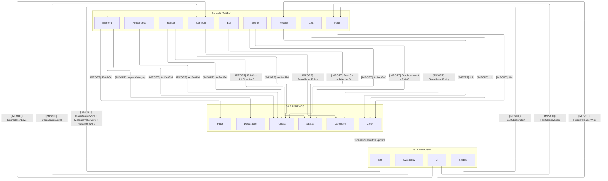
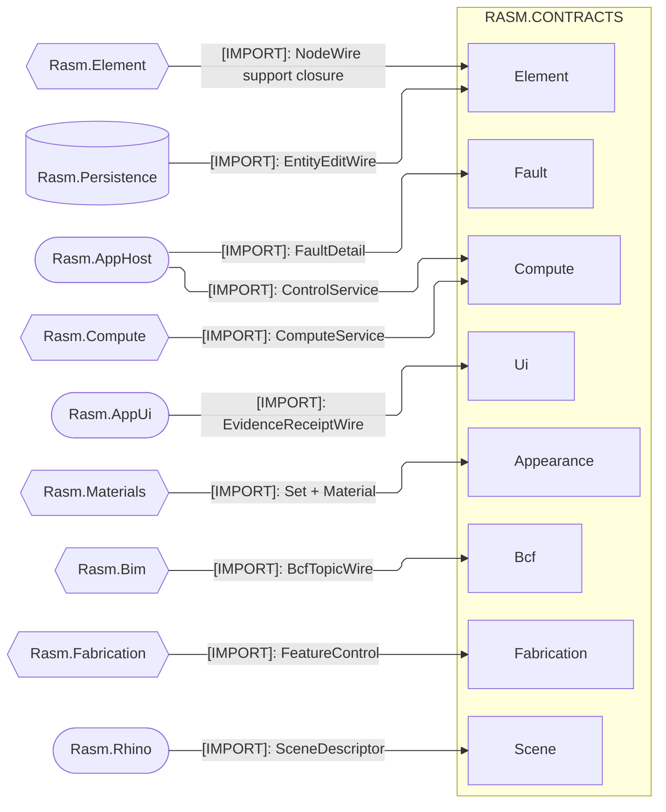
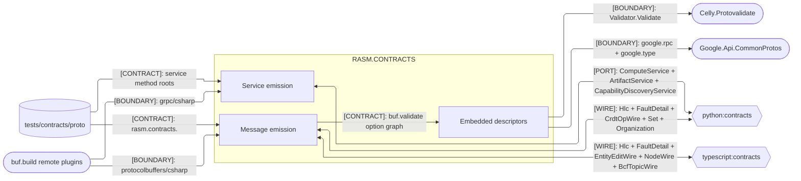
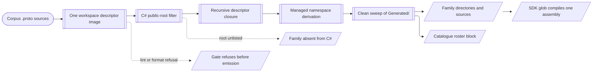

# [RASM_CONTRACTS_ARCHITECTURE]

`Rasm.Contracts` maps the branch wire boundary: the one project whose every source is generated, emitted by two remote BSR plugins into a single packable assembly. Proto package identity derives both the C# namespace and the directory beneath `Generated/`, while publisher-owned packages stay omitted so their package-shipped C# types keep sole ownership.

Generation is the only author. `assay contracts generate` sweeps `Generated/` whole and rewrites the `.api` roster from the same descriptor image, so a hand edit under that root dies on the next run and the emitted family set is a consequence of root selection rather than a hand-kept roster. Generated-bindings folders carry the index doc set beside one `.api/` generator-grammar catalogue and no `.planning/` tree, because generation authors every member the catalogue rosters.

## [01]-[DOMAIN_MAP]

```text codemap
Rasm.Contracts/                  # Wire vocabulary at the branch floor; buf authors every source, hand edits never survive
├── .api/rasm-contracts.md       # Symbol grammar and implementation law wrapped around one gate-emitted roster block
├── README.md                    # Package readme the NuGet artifact carries verbatim
├── Rasm.Contracts.csproj        # Packable identity, four runtime rows, declared nullable-oblivious posture
└── Generated/                   # `clean: true` sweeps this root each run; SDK globs it with no Compile item
    ├── Appearance/              # `Set` and `Material` roots over OpenPBR color, texture packs, HDRI environments
    ├── Artifact/                # `ArtifactRef` content handle plus the streaming fetch and put service pair
    ├── Availability/            # `CommandAvailability` verdicts keyed on the Compute degradation level
    ├── Bcf/                     # BCF topic, comment, and viewpoint wires carrying camera, clipping, visibility
    ├── Benchmark/               # `BenchmarkClaimWire` rungs and metrics beside the host fingerprint measured on
    ├── Bim/                     # `ModelDiffWire` element-change shapes over the Element aspect vocabulary
    ├── Binding/                 # External-binding state with its coerced-value and write-receipt writeback pair
    ├── Capability/              # `DescriptorPinWire` cost estimates and the discovery request-response pair
    ├── Clock/                   # `Hlc` hybrid logical stamp every stamped family imports
    ├── Compute/                 # Tessellate request-response beside the degradation and drain control RPCs
    ├── Crdt/                    # `CrdtOpWire` register, set, counter, sequence, and presence operation arms
    ├── Credential/              # `CredentialPublicWire` public half carrying its certificate chain
    ├── Declaration/             # `DeclarationRecord` EPD registry, module, and impact-cell vocabulary
    ├── Element/                 # Graph nodes, entity edits, property values, substance, evidence; heaviest family
    ├── Event/                   # CloudEvents `Extensions` attribute bag
    ├── Fabrication/             # `FeatureControl` datum, segment, and zone vocabulary for machining features
    ├── Fault/                   # `FaultDetail` whose `FaultRecovery` elects terminal, transient, or `RetryInfo`
    ├── Feature/                 # `FlagVerdictWire` flag decision with its reason vocabulary
    ├── Geometry/                # `TessellationPolicy` shared by every request and evidence surface naming tolerance
    ├── Organization/            # `Organization` entity tree carrying per-view overrides
    ├── Parity/                  # `Backend` provider capability and artifact-role rows the parity gate reads
    ├── Patch/                   # `PatchOp` RFC 6902 arms the element edit stream carries
    ├── Receipt/                 # `ReceiptHeaderWire` spine — correlation, tenant, package, stamp, skew; no payload
    ├── Render/                  # `GeometryResidency` meshlet streams beside viewpoint and section-box wires
    ├── Scan/                    # `GaussianSplatScan` splat capture with its format vocabulary
    ├── Scene/                   # `SceneDescriptor` sited-sun, photometry, and shading state for a lit scene
    ├── Spatial/                 # Point, direction, frame, and curve primitives every geometric family imports
    └── Ui/                      # Command gate, control posture, layout program, evidence timeline; second heaviest
```

Directory tail mirrors namespace tail. Managed mode derives `csharp_namespace` `Rasm.Contracts.<Family>` from the proto package, `base_namespace=Rasm.Contracts` strips that prefix off the emitted path, and what remains becomes the directory: `rasm.contracts.patch` lands `Generated/Patch/JsonPatch.cs` declaring `namespace Rasm.Contracts.Patch`.

No proto carries an explicit `csharp_namespace`, so that correspondence is generator-derived rather than authored. Directory grain is the package rather than the file, which is why `compute.proto` and `control.proto` share one `Compute/`; a proto stem lands PascalCased, and the service emitter appends `Grpc` to that same stem.

## [02]-[STRATA]

`Rasm.Contracts` holds no branch rank and is an admitted import root, so the ladder below ranks the CORPUS descriptor DAG inside one assembly. Imports point down, every emitted namespace compiles together, and no rung is a project reference.

- S0 primitives — `Artifact`, `Clock`, `Declaration`, `Geometry`, `Patch`, and `Spatial` import no estate family and ground every rank above.
- S0 law — `Clock` and `Spatial` carry the widest fan-in, so a field-number move on either re-emits most of the tree at once.
- S0 free-standing — `Benchmark`, `Capability`, `Credential`, `Event`, and `Fabrication` carry no estate edge in either direction.
- S0 free-standing — `Feature`, `Organization`, `Parity`, and `Scan` import nothing and are imported by nothing, so each moves alone.
- S1 composed — `Appearance`, `Bcf`, `Compute`, `Crdt`, `Element`, `Fault`, `Receipt`, `Render`, and `Scene` each reach exactly one rank down.
- S1 law — `Compute` and `Scene` both pull `TessellationPolicy`, so tolerance vocabulary keeps one owner and no per-caller copy forms.
- S2 composed — `Availability`, `Bim`, `Binding`, and `Ui` reach S0 only through an S1 owner, never directly.
- S2 law — `Ui` alone reaches three S1 owners at once, folding `Compute`, `Fault`, and `Receipt` into one command and evidence surface.
- S0 root law — most families carry a declared public root; `Geometry`, `Patch`, and `Spatial` enter by descriptor closure alone.
- S1 root law — `Receipt` is the one composed family with no declared root, so `Ui` reaching `ReceiptHeaderWire` is the whole reason it emits.
- S0 closure law — dropping a root that transitively names a closure-only family deletes its directory, so the tree is a consequence.
- S0 cycle law — buf refuses an import cycle at lint, so the gate proves this ladder rather than this page asserting it.



## [03]-[SEAMS]

Two fences partition by counterpart class. Same-branch consumption transcribes `libs/csharp/.planning/ARCHITECTURE.md` verbatim — that tier owns cross-package direction, so kind and payload spelling come from it and this fence adds only which emitted family each consumer lands on; `Rasm.AppHost` rides two rows because its one branch-tier edge names payloads in two families. Corpus, remote emitters, runtime packages, and peer-language emissions carry the second fence.





[ROOT_SELECTION_IDIOM]:
- Each lane declares its own root set, so a family exists in C# only where the `protocolbuffers/csharp` plugin lists a root reaching it.
- `cad` is the standing witness: Python carries `CadService` and its operation vocabulary, and no C# directory exists for it.
- `ControlService` runs the other way — degradation and drain are C#-only roots no peer lane declares.
- Publisher packages ride `managed.disable` path selectors, so upstream file options survive in every embedded descriptor unchanged.
- Generated trees bind the corpus file path as their import path, so a source move re-spells every consumer's import and lands with them in one pass.
- Descriptors travel with the symbols, which is what lets a consumer evaluate corpus-authored rules without holding the corpus.

## [04]-[INTERNAL]

One descriptor image feeds every lane. Buf resolves one workspace input, filters it against the C# root roster, expands the recursive descriptor closure of what survives, derives managed namespaces over that closure, and writes the swept tree; the catalogue roster block is rewritten from the same image, so the emission and its published grammar cannot disagree.



`Directory.Build.props` elects `IsWireContractsProject` off the package id and clears the whole workspace injection behind it — workspace library references, analyzer packages, the local source generator, the CSP contract reference and its scope plumbing, and the assembly-visibility rows. Nothing but the four runtime packages and the SDK reaches the compile, which is what keeps the wire floor free of the libraries stacked above it.

Remote pins make the emitter reproducible off the machine PATH: both C# plugins resolve at BSR under a semantic version and an exact build revision, where the TypeScript and Python lanes run local binaries pinned as a pair with the runtime their emission imports. `Rasm.Contracts` ships XML documentation and a portable-symbol package whose PDB embeds the exact generated source, so debugging resolves the packaged emission without a mutable checkout or a second archive.

## [05]-[ROUTING]

| [INDEX] | [CHANGE]                     | [OWNER_SURFACE]            | [SHAPE_OF_THE_EDIT]                                    |
| :-----: | :--------------------------- | :------------------------- | :----------------------------------------------------- |
|  [01]   | new wire family              | `tests/contracts/proto`    | one `rasm.contracts.<family>` package directory        |
|  [02]   | new C# consumer of a family  | `buf.gen.yaml`             | one root row on the `protocolbuffers/csharp` plugin    |
|  [03]   | new service the branch binds | `buf.gen.yaml`             | one method row on the `grpc/csharp` plugin             |
|  [04]   | new emitter version          | `buf.gen.yaml`             | one `remote:` pin and its `revision` on the C# pair    |
|  [05]   | new generated runtime row    | `Directory.Packages.props` | one central version paired with a project manifest row |
|  [06]   | new publisher package carve  | `buf.gen.yaml`             | one `managed.disable` selector leaving its owner alone |
|  [07]   | new package release          | `Rasm.Contracts.csproj`    | one `Version` bump beside its release-notes line       |

## [06]-[BOUNDARIES]

- `Rasm.Contracts` owns generated symbols and the descriptors embedded beside them; no hand partial, helper, or mirror enters.
- Corpus sources own wire shape, field numbers, and compatibility; reserved ordinals there are the only record of a collapsed field.
- `buf.gen.yaml` owns which families exist in C#: an unlisted root, and everything only it reached, vanish on the next run.
- Consumers own bounded parsing, rule evaluation, domain admission, and transport binding; this assembly decodes and validates nothing.
- `Celly.Protovalidate` evaluates the embedded option graph at the consumer, so this assembly ships rules and never a verdict.
- Owned case families ride a oneof at their composition site, so no corpus message declares `google.protobuf.Any` and no payload slot survives.
- Publisher packages keep sole C# ownership of CloudEvents and health types, since managed mode and root selection both omit them.
- `Rasm.Contracts.csproj` owns one versioned identity, and project and package consumption resolve that same assembly.
- Workspace injection stays off by election, so no analyzer, generator, or sibling library reaches a compile the corpus alone authors.
- BSR generated SDKs enter no branch — that pipeline carries no type filter and fixes `opt` at the plugin, so roots widen and emission flags vanish.
- Publication opens generated SDKs to foreign consumers alone, and vendored modules stay unnamed so no SDK carries a branch's whole emission.
