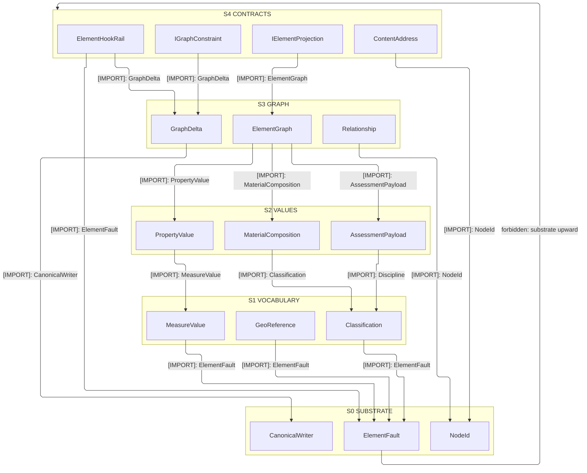
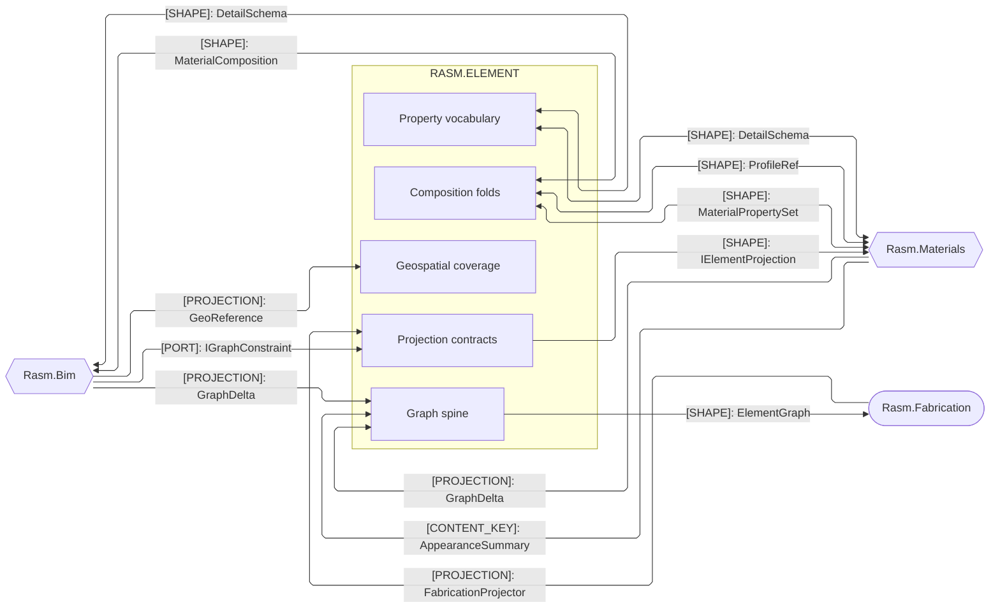
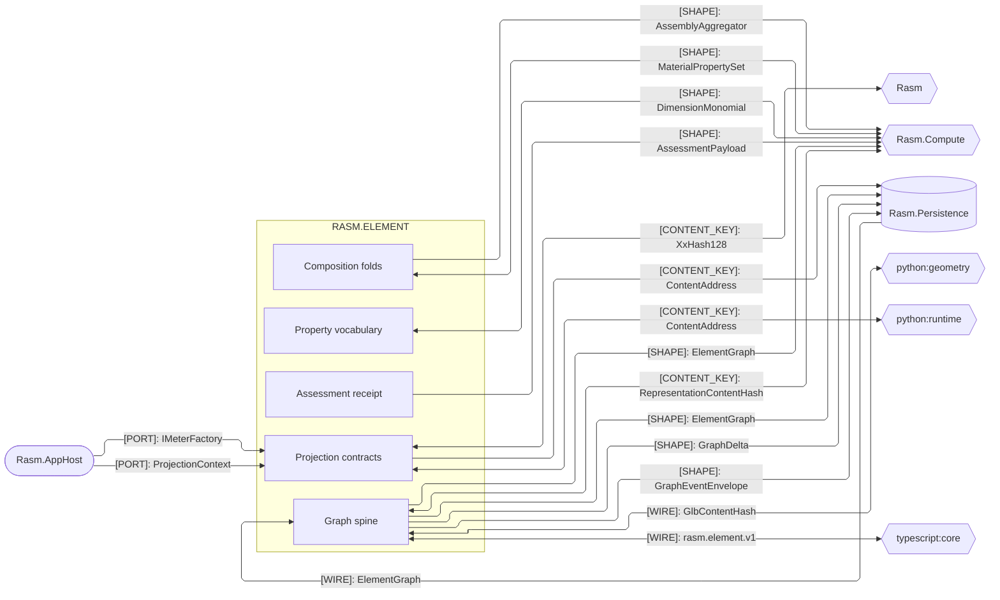

# [RASM_ELEMENT_ARCHITECTURE]

Domain map of `Rasm.Element` — the lowest AEC-DOMAIN seam between the `Rasm` kernel and the AEC peers `{Rasm.Materials, Rasm.Bim, Rasm.Fabrication}`. Each sub-domain folder maps to one folder-true namespace; every sub-domain composes the one `ElementGraph` and lowers onto the one `ElementFault` band, and the peers depend up on the `IElementProjection`/`IGraphConstraint` contracts, aligning by the content-keyed graph rather than by referencing each other.

## [01]-[DOMAIN_MAP]

```text codemap
Rasm.Element/             # refs ../Rasm ONLY; no GeometryGym; no host geometry (geometry by content hash)
├── Graph/                # Authoritative property graph and its mutation algebra
│   ├── Element.cs        # Frozen property-graph spine and the memoized Bake fold every consumer reads flat
│   ├── Delta.cs          # Live working-graph mutation algebra and the persistable GraphDelta body
│   ├── Wire.cs           # Content-key-preserving rasm.element.v1 crossing every peer runtime decodes
│   └── element.proto     # Language-neutral rasm.element.v1 oneof contract
├── Relations/            # Neutral objectified-edge algebra
│   └── Relation.cs       # Closed neutral edge kinds plus a Generic passthrough so no foreign relation drops
├── Classification/       # Neutral cross-cutting axes
│   └── Classification.cs # Generic system-and-code classification pair and the shared discipline axis
├── Properties/           # Typed property/quantity value vocabulary
│   ├── Property.cs       # One PropertyValue union closing the IFC-value family with typed data, never strings
│   └── Quantity.cs       # SI-exponent signature and the MeasureValue carrier with uncertainty bounds
├── Composition/          # Material composition and intrinsic acoustic folds
│   ├── Material.cs       # MaterialComposition family and the discipline-keyed engineering-property rows
│   └── Acoustic.cs       # Banded acoustic carrier and the shared RatingContour contour-fit kernel
├── Assessment/           # Generic analysis receipt
│   └── Assessment.cs     # AssessmentPayload receipt keyed by discipline, route, and input content key
├── Geospatial/           # Georeferenced coverage and CRS
│   ├── Coverage.cs       # By-ref raster coverage grid over a band schema and affine placement
│   └── Reference.cs      # GeoReference record over the three-state projected-CRS identity
└── Projection/           # Cross-stratum contracts, the content codec, the fault band, and the observability tap
    ├── Projection.cs     # IElementProjection and IGraphConstraint floors plus the assemble composition
    ├── Address.cs        # Order-independent ContentAddress codec over the kernel seed-zero hash
    ├── Fault.cs          # Cross-federation FaultBand registry and the ElementFault union
    └── Observe.cs        # ElementHookRail typed fact tap and the GraphInstrument meter-and-span projection
```

`Graph` is the spine every other sub-domain feeds: each owns a `Node` case payload or a cross-cutting value the one `ElementGraph` composes, and the `Graph/Element` `Bake` applies both the type→occurrence inheritance and the `Properties/Property` `InheritanceMode` bag merge. Seam identity re-mints nothing the kernel owns — the content-identity seed, the op-key, and the fault base are the kernel `XxHash128` seed-zero entry, `Op`, and `Expected`. Per-page declarations, the shared `Projection/Address` codec fan-in, and the inheritance merge rules live on the owning implementation pages.

## [02]-[STRATA]

Interior is one strongly-connected component at folder grain — `Graph/Element` declares both the primitive `NodeId` every sibling keys and the aggregate `ElementGraph` that composes every sibling — so the ladder resolves member-first: five strata rank the owners, and each consumption edge points down.

- S0 substrate — `ElementFault` and `FaultBand` (`Projection/Fault`), the `CanonicalWriter` canonical-bytes fold (`Projection/Address`), and the primitive `NodeId` (`Graph/Element`); every stratum rails and keys through these.
- S1 vocabulary — `Classification` and `Discipline`, the `MeasureValue`/`Dimension` quantity signature, and the `GeoReference` georeference record.
- S2 values — `PropertyValue` with `InheritanceMode`, `MaterialComposition` with `ProfileRef`, the `CoverageGrid` raster descriptor, and the `AssessmentPayload` receipt; each folds vocabulary into node payloads.
- S3 graph — `ElementGraph`, `GraphDelta`, and the `Relationship` edge algebra composing every value family; `Relations` co-seats because objectified edges and the graph key each other mutually.
- S4 contracts and codec — `IElementProjection` and `IGraphConstraint` name the graph aggregate in their signatures, and the `ContentAddress` codec folds graph headers, so the cross-stratum contract tier seats above the graph it projects; the `ElementHookRail` fact tap and its `GraphInstrument` projection seat here too, observing every lower stratum without entering one.



## [03]-[SEAMS]





`[PROJECTION]` rows are inversion of control: every provider — GeometryGym, VividOrange, and peers — stays in the AEC peer that implements `IElementProjection` and lowers its foreign source onto a `GraphDelta`, so no provider edge points down into the seam and no second IFC stack forms.

Each provider mints its own `Object` identity under the owner-mints-its-identity law, so a minter never stamps a foreign projector's egress; per-provider Type and Occurrence minting lives on the owning pages. Acyclic strata holds: every AEC peer references `{Rasm, Rasm.Element}` as a shared lower stratum and peers never reference each other, and the live element assembly is an APP/HOST-BOUNDARY composition-root concern — the seam owns `Assemble`, the apps the wiring.

[CONTENT_KEY_IDIOM]:
- Every lane derives its typed `UInt128` through the `Projection/address` seed-zero entry over the one `CanonicalWriter` projection.
- Content space is shared with the kernel `GeometryHash` and the Python and TypeScript peers; a second hasher or non-zero seed is the named drift.
- `Graph/wire` carries every content key verbatim; the codec re-derives no identity, and the parity corpus anchors byte-for-byte agreement.
- `GlbContentHash` is the wire spelling of the `RepresentationContentHash` `Body` entry crossing the python:geometry GLB seam.
- Non-rooted `NodeId` is the self-hash of the node's own canonical bytes.
- Rooted `Object` ids carry one regime with two `ObjectKind`-keyed seedings — Guid-v7 placement identity and the exclusion-seeded Type derivation.
- Exact `NodeId.Content` mint, the `Verify` dual, and per-lane key derivations live on the owning implementation pages.
