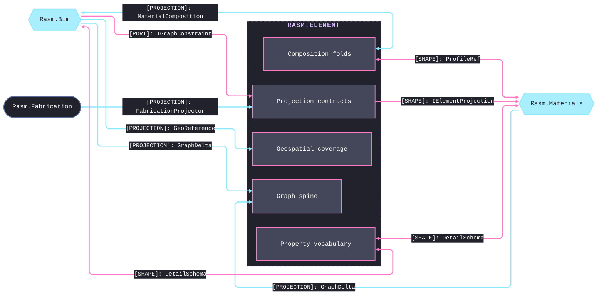
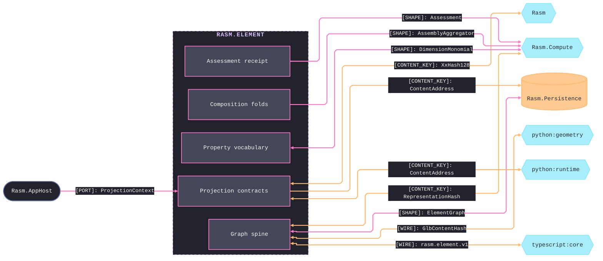

# [RASM_ELEMENT_ARCHITECTURE]

Domain map of `Rasm.Element` — the lowest AEC-DOMAIN seam between the `Rasm` kernel and the AEC peers `{Rasm.Materials, Rasm.Bim, Rasm.Fabrication}`. Each sub-domain folder maps to exactly one FOLDER-TRUE namespace — a file at `<SubFolder>/<File>.cs` declares `namespace Rasm.Element.<SubFolder>;` per `dotnet_style_namespace_match_folder`, cross-subfolder consumption riding explicit `using Rasm.Element.<SubFolder>;` rows — every sub-domain composes the one `ElementGraph` and lowers onto the one `ElementFault` band, and the peers depend up on the `IElementProjection`/`IGraphConstraint` contracts, aligning by the content-keyed graph rather than by referencing each other.

## [01]-[DOMAIN_MAP]

```text codemap
Rasm.Element/             # refs ../Rasm ONLY; no GeometryGym; no host geometry (geometry by content hash)
├── Graph/                # Authoritative property graph and its mutation algebra
│   ├── Element.cs        # Property-graph spine
│   ├── Delta.cs          # Mutation algebra
│   ├── Wire.cs           # Content-key-preserving crossing
│   └── element.proto     # Language-neutral rasm.element.v1 oneof contract
├── Relations/            # Neutral objectified-edge algebra
│   └── Relation.cs       # Neutral edge algebra
├── Classification/       # Neutral cross-cutting axes
│   └── Classification.cs # Cross-cutting axes
├── Properties/           # Typed property/quantity value vocabulary
│   ├── Property.cs       # Typed value vocabulary
│   └── Quantity.cs       # Physical-quantity carrier
├── Composition/          # Material composition and intrinsic acoustic folds
│   ├── Material.cs       # Material composition
│   └── Acoustic.cs       # Intrinsic acoustic folds
├── Assessment/           # Generic analysis receipt
│   └── Assessment.cs     # Generic analysis receipt
├── Geospatial/           # Georeferenced coverage and CRS
│   ├── Coverage.cs       # Georeferenced coverage
│   └── Reference.cs      # Map-conversion-and-CRS record
└── Projection/           # Cross-stratum contracts, the content codec, and the fault band
    ├── Projection.cs     # Cross-stratum contracts
    ├── Address.cs        # Content codec
    └── Fault.cs          # Fault band
```

`Graph` is the spine every other sub-domain feeds: each owns a `Node` case payload or a cross-cutting value the one `ElementGraph` composes, and the `Graph/Element` `Bake` applies both the type→occurrence inheritance and the `Properties/Property` `InheritanceMode` bag merge. Seam identity re-mints nothing the kernel owns — the content-identity seed, the op-key, and the fault base are the kernel `XxHash128` seed-zero entry, `Op`, and `Expected`. Per-page declarations, the shared `Projection/Address` codec fan-in, and the inheritance merge rules live on the owning implementation pages.

## [02]-[SEAMS]





`[PROJECTION]` rows are inversion of control: every provider — GeometryGym, VividOrange, and peers — stays in the AEC peer that implements `IElementProjection` and lowers its foreign source onto a `GraphDelta`, so no provider edge points down into the seam and no second IFC or section-property stack forms. Each provider owns its concept and mints its own `Object` identity under the owner-mints-its-identity law, so a minter never stamps a foreign projector's egress and the one type representation is authored and ingested unified; per-provider Type and Occurrence minting lives on the owning implementation pages. Acyclic strata holds: every AEC peer references `{Rasm, Rasm.Element}` as a shared lower stratum and peers never reference each other, and the live element assembly — registering the `Seq<IElementProjection>`, binding the tessellation adapter, running `Assemble` against a live source — is an APP/HOST-BOUNDARY composition-root concern, the seam owning the `Assemble` capability and the apps the wiring.

[CONTENT_KEY_IDIOM]:
- Every page joining the persistence, projection, assessment-cache, or diff lane derives its typed `UInt128` through the `Projection/address` `XxHash128.HashToUInt128` seed-zero entry over the one `CanonicalWriter` projection, one content space shared with the kernel `GeometryHash` and the Python/TypeScript peers; a second hasher or a non-zero seed is the named cross-folder drift defect.
- `Graph/wire` carries every content key verbatim, so the codec re-derives no identity on either side of the wire and the cross-runtime parity corpus anchors byte-for-byte agreement.
- Non-rooted `NodeId` is the self-hash of the node's own canonical bytes; a rooted `Object` id carries one regime with two `ObjectKind`-keyed seedings — an Occurrence's Guid-v7 placement identity and a Type's deterministic derivation over canonical bytes with the volatile `Representations` excluded — never a second identity owner. Exact `NodeId.Content` mint, the `Verify` dual, and per-lane key derivations live on the owning implementation pages.
