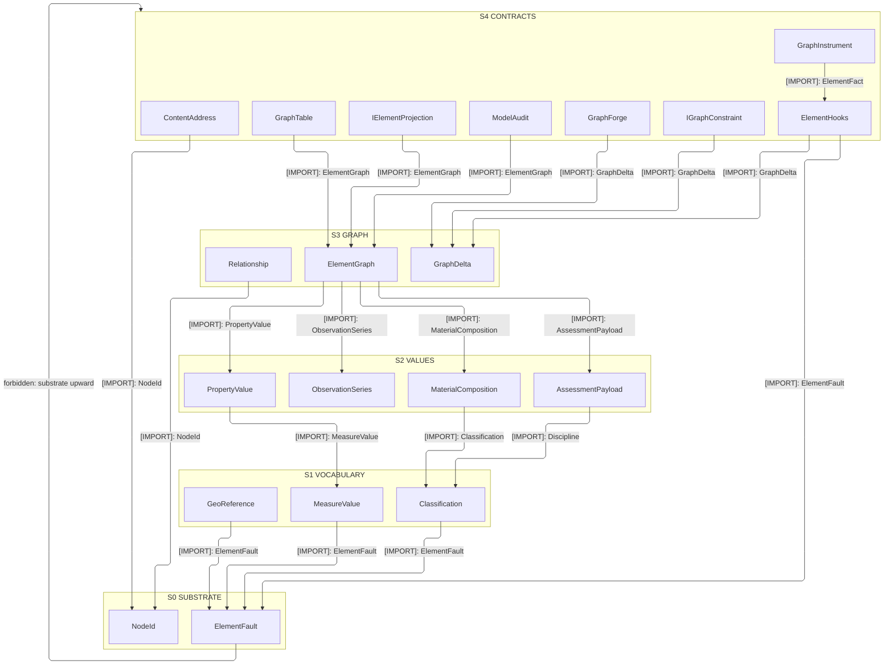
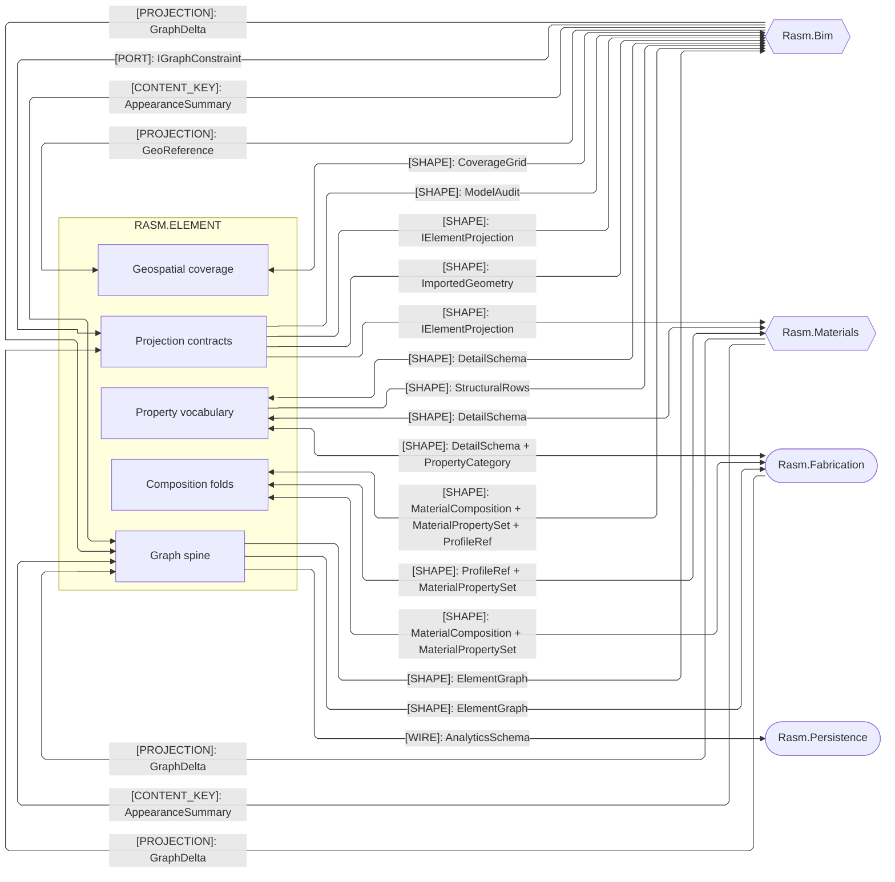
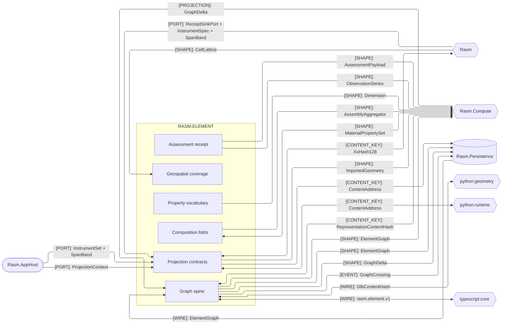
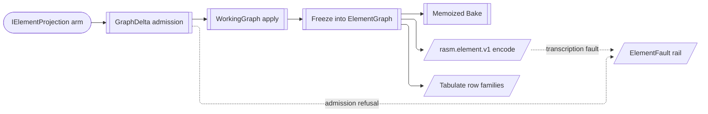

# [RASM_ELEMENT_ARCHITECTURE]

`Rasm.Element` is the lowest AEC-DOMAIN seam between the `Rasm` kernel and the AEC peers `{Rasm.Materials, Rasm.Bim, Rasm.Fabrication}`. Each sub-domain folder maps to one folder-true namespace; every sub-domain composes the one `ElementGraph` and lowers onto the one `ElementFault` band, and the peers depend up on the `IElementProjection`/`IGraphConstraint` contracts, aligning by the content-keyed graph rather than by referencing each other.

## [01]-[DOMAIN_MAP]

```text codemap
Rasm.Element/              # Neutral thing-model seam over the kernel; geometry crosses by content hash alone
├── Graph/                 # One authoritative graph, its mutation algebra, and the wire crossing
│   ├── Element.cs         # `Header` + frozen node store + `Relationship` array + built-once incidence; `Bake(objectNode)` derives the element
│   ├── Delta.cs           # `GraphMutation` `[Union]` through the generated total `Switch` onto a HAMT `WorkingGraph`; `Thaw` lowers, `Freeze` lifts
│   ├── Wire.cs            # `ElementGraphWire`/`GraphDeltaWire` mirrors; decode legs re-admit hostile input on `Fin<T>`
│   ├── WirePayload.cs     # `NodeWire` fold minting each node's content address, `RelationshipWire` arms, header family, object codecs
│   ├── WireValue.cs       # Recursive `PropertyValue` fold under the `WireLimits` depth budget; decode legs re-mint through the `OfSi` gate
│   ├── WireSubstance.cs   # Arms re-enter their accumulating `Of*` admissions; `ProfileRef` keys re-derive; `SectionColumns` one-table codec
│   ├── WireEvidence.cs    # `PayloadContent` derives from flat wire columns through the owner's `Open` gate; `EvidenceRun` re-enters railed `Of`
│   ├── WireRaster.cs      # Base-as-level-0 rebuild from flat columns; palettes cross the one `ToRgb` quantizer the content key shares
│   ├── Corpus.cs          # `CorpusProfile` closes density, depth, mix, cadence, and seed; `Mint` admits members through `GraphDelta.AdmitOnto`
│   └── Table.cs           # `Tabulate` fold; a `TableRow` case IS the dataset and `TableFamily` carries columns, key, spine, rollup measure
├── Query/                 # Boolean selection closure every peer algebra composes; evaluation stays with each consumer
│   └── Predicate.cs       # Vocabulary and byte projection alone seat here; evaluation stays with each consuming folder
├── Relations/             # Neutral objectified-edge algebra
│   └── Relation.cs        # Typed `NodeId` endpoints under a neutral sub-kind discriminant `Bake` dispatches on; IFC names never enter
├── Classification/        # Cross-cutting axes carrying identity alone; ancestry stays bSDD-resolved at the Bim peer
│   └── Classification.cs  # `(System, Code, Edition)` identity with projector-resolved annotations; `Discipline` closes the vocabulary
├── Properties/            # Typed property/quantity value vocabulary
│   ├── Property.cs        # `PropertyValue` `[Union]` carries its data type; one `ValueBag<V>` generic, `InheritanceMode` merge
│   └── Quantity.cs        # SI magnitude coerced at admission, optional canonical unit token, `Dimension` exponents; name beats dimension
├── Composition/           # Material composition and intrinsic acoustic folds
│   ├── Material.cs        # `MaterialId`-keyed nodes carrying one composition union and one `Discipline`-keyed property-set union
│   └── Acoustic.cs        # One-third-octave `AcousticBand` spectra beside the material-intrinsic constants EN 12354 folds read
├── Assessment/            # Generic analysis receipt and its measured-evidence sibling
│   ├── Assessment.cs      # One payload the `Node.Assessment` case wraps; `AnalysisRoute` token and `UInt128` `InputKey` ride the key
│   └── Observation.cs     # One series binds one deployed sensor to one observed aspect; `SensorId` identity beside the blob reference
├── Geospatial/            # Georeferenced coverage and CRS
│   ├── Coverage.cs        # Gridded data held by `BlobKey` into the seed-zero object store, never an inlined buffer; `CellLattice` places it
│   └── Reference.cs       # Map-conversion state, axis scales, `GeodeticDatum`, and the `ProjectedCrs`/`VerticalCrs` identity pair
└── Projection/            # Cross-stratum contracts, the content codec, the fault band, the observability tap, and the model grade
    ├── Projection.cs      # Two instance-interface floors peers implement without referencing each other; `Assemble` is the app-wired capability
    ├── Address.cs         # Kernel-hashed canonical seam bytes; this file declares no writer and re-exports nothing
    ├── Fault.cs           # Cases share one `(Op, Detail)` base deriving `Expected` on the kernel band; refusals gather on `AdmissionSlots`
    ├── Observe.cs         # `ElementPoint` closes the `rasm.element.<domain>.<point>` roster on a modality column; `ElementFact` carries marks
    └── Audit.cs           # Per-discipline coverage ratios and a graded integrity stream in one fold; Bim `ModelHealth` composes, never overlaps
```

## [02]-[STRATA]

Interior is one strongly-connected component at folder grain, since `Graph/Element` declares both the primitive `NodeId` every sibling keys and the aggregate `ElementGraph` that composes every sibling; the ladder therefore resolves member-first, and each consumption edge points down.

- S0 substrate — `ElementFault`, the `AdmissionSlots` accumulating fold, and `NodeId`; the content codec seats at S4 with its contract siblings.
- S0 law — no substrate file names an upper seam type, so every stratum rails and keys through it with no return edge.
- S1 vocabulary — `Classification` and `Discipline`, the `MeasureValue`/`Dimension` signature, `GeoReference`, and the `Query` predicate algebra.
- S1 law — the predicate algebra seats vocabulary and byte projection alone; evaluation stays with each consuming folder.
- S2 values — `PropertyValue` with `InheritanceMode`, `MaterialComposition` with `ProfileRef`, `CoverageGrid`.
- S2 evidence — `AssessmentPayload` and `ObservationSeries` seat as the computed and measured sibling modalities.
- S3 spine — the `Wire*` codemap nodes realize ONE generated codec owner seated with the graph, so six files add no wire stratum.
- S3 co-seat — `Relations` seats beside the graph: `ElementGraph` composes `Relationship` rows and edges reference nodes by `NodeId` alone, acyclic.
- S4 contracts — `IElementProjection`, `IGraphConstraint`, and the `ContentAddress` codec seat above the graph they name and fold.
- S4 observability — the `ElementHooks`-minted kernel rail and its `GraphInstrument` projection observe every lower stratum without entering one.
- S4 corpus — `GraphForge` realizes whole graphs through the S3 admission rail it consumes.
- S4 tabulation — `GraphTable` flattens the S3 snapshot into columnar row families and imports nothing above it.
- S4 grade — `ModelAudit` folds the S3 snapshot through the S4 codec into a receipt, mutating nothing and minting no fault of its own.


```mermaid
---
config:
  layout: elk
  flowchart:
    curve: linear
    padding: 25
---
flowchart TB
    accTitle: Rasm.Element interior strata
    accDescr: How the contract stratum reaches the graph, values, vocabulary, and substrate with no upward import.
    subgraph S4["S4 CONTRACTS"]
        IProjection[IElementProjection]
        IConstraint[IGraphConstraint]
        Address[ContentAddress]
        HookRail[ElementHooks]
        Instrument[GraphInstrument]
        Forge[GraphForge]
        Table[GraphTable]
        Audit[ModelAudit]
    end
    subgraph S3["S3 GRAPH"]
        ElementGraph[ElementGraph]
        Delta[GraphDelta]
        Relationship[Relationship]
    end
    subgraph S2["S2 VALUES"]
        Property[PropertyValue]
        Composition[MaterialComposition]
        Payload[AssessmentPayload]
        Series[ObservationSeries]
    end
    subgraph S1["S1 VOCABULARY"]
        Classification[Classification]
        Measure[MeasureValue]
        GeoReference[GeoReference]
    end
    subgraph S0["S0 SUBSTRATE"]
        Fault[ElementFault]
        NodeId[NodeId]
    end
    IProjection e1@-->|"[IMPORT]: ElementGraph"| ElementGraph
    IConstraint e2@-->|"[IMPORT]: GraphDelta"| Delta
    HookRail e3@-->|"[IMPORT]: GraphDelta"| Delta
    HookRail e4@-->|"[IMPORT]: ElementFault"| Fault
    Instrument e5@-->|"[IMPORT]: ElementFact"| HookRail
    Forge e6@-->|"[IMPORT]: GraphDelta"| Delta
    Table e7@-->|"[IMPORT]: ElementGraph"| ElementGraph
    Audit e8@-->|"[IMPORT]: ElementGraph"| ElementGraph
    Address e9@-->|"[IMPORT]: NodeId"| NodeId
    ElementGraph e10@-->|"[IMPORT]: PropertyValue"| Property
    ElementGraph e11@-->|"[IMPORT]: MaterialComposition"| Composition
    ElementGraph e12@-->|"[IMPORT]: AssessmentPayload"| Payload
    ElementGraph e13@-->|"[IMPORT]: ObservationSeries"| Series
    Relationship e14@-->|"[IMPORT]: NodeId"| NodeId
    Property e15@-->|"[IMPORT]: MeasureValue"| Measure
    Payload e16@-->|"[IMPORT]: Discipline"| Classification
    Composition e17@-->|"[IMPORT]: Classification"| Classification
    Classification e18@-->|"[IMPORT]: ElementFault"| Fault
    GeoReference e19@-->|"[IMPORT]: ElementFault"| Fault
    Measure e20@-->|"[IMPORT]: ElementFault"| Fault
    Fault f1@-->|"forbidden: substrate upward"| S4
```

## [03]-[SEAMS]


```mermaid
---
config:
  layout: elk
  flowchart:
    curve: linear
    padding: 25
---
flowchart LR
    accTitle: Element AEC-domain projection seams
    accDescr: Which projections and neutral shapes cross between Element's owners, the AEC peers, and the persistence custodian.
    subgraph element[RASM.ELEMENT]
        Graph[Graph spine]
        Projection[Projection contracts]
        Composition[Composition folds]
        Properties[Property vocabulary]
        Geospatial[Geospatial coverage]
    end
    Bim{{Rasm.Bim}}
    Materials{{Rasm.Materials}}
    Fabrication([Rasm.Fabrication])
    Persistence([Rasm.Persistence])
    Bim e1@-->|"[PROJECTION]: GraphDelta"| Graph
    Materials e2@-->|"[PROJECTION]: GraphDelta"| Graph
    Graph e3@-->|"[SHAPE]: ElementGraph"| Bim
    Graph e4@-->|"[SHAPE]: ElementGraph"| Fabrication
    Graph e5@-->|"[WIRE]: AnalyticsSchema"| Persistence
    Bim e6@-->|"[PORT]: IGraphConstraint"| Projection
    Fabrication e7@-->|"[PROJECTION]: GraphDelta"| Projection
    Projection e8@-->|"[SHAPE]: IElementProjection"| Materials
    Projection e9@-->|"[SHAPE]: IElementProjection"| Bim
    Composition e10@<-->|"[SHAPE]: MaterialComposition + MaterialPropertySet + ProfileRef"| Bim
    Composition e11@<-->|"[SHAPE]: ProfileRef + MaterialPropertySet"| Materials
    Composition e12@<-->|"[SHAPE]: MaterialComposition + MaterialPropertySet"| Fabrication
    Materials e13@-->|"[CONTENT_KEY]: AppearanceSummary"| Graph
    Bim e14@-->|"[CONTENT_KEY]: AppearanceSummary"| Graph
    Properties e15@<-->|"[SHAPE]: DetailSchema"| Bim
    Properties e16@<-->|"[SHAPE]: DetailSchema"| Materials
    Properties e17@<-->|"[SHAPE]: DetailSchema + PropertyCategory"| Fabrication
    Properties e18@-->|"[SHAPE]: StructuralRows"| Bim
    Bim e19@-->|"[PROJECTION]: GeoReference"| Geospatial
    Geospatial e20@<-->|"[SHAPE]: CoverageGrid"| Bim
    Projection e21@-->|"[SHAPE]: ImportedGeometry"| Bim
    Projection e22@-->|"[SHAPE]: ModelAudit"| Bim
```


```mermaid
---
config:
  layout: elk
  flowchart:
    curve: linear
    padding: 25
---
flowchart LR
    accTitle: Element platform and cross-runtime wire seams
    accDescr: Which content keys, shapes, and wires cross between Element's owners, the kernel, the app platform, and the runtime peers.
    subgraph element[RASM.ELEMENT]
        Graph[Graph spine]
        Projection[Projection contracts]
        Composition[Composition folds]
        Properties[Property vocabulary]
        Assessment[Assessment receipt]
        Geospatial[Geospatial coverage]
    end
    Rasm{{Rasm}}
    AppHost([Rasm.AppHost])
    Compute{{Rasm.Compute}}
    Persistence[(Rasm.Persistence)]
    Geometry{{python:geometry}}
    Runtime{{python:runtime}}
    Core{{typescript:core}}
    Projection e1@<-->|"[CONTENT_KEY]: XxHash128"| Rasm
    AppHost e2@-->|"[PORT]: ProjectionContext"| Projection
    AppHost e3@-->|"[PORT]: InstrumentSet + SpanBand"| Projection
    Rasm e4@-->|"[PORT]: ReceiptSinkPort + InstrumentSpec + SpanBand"| Projection
    Rasm e5@-->|"[SHAPE]: CellLattice"| Geospatial
    Projection e6@-->|"[CONTENT_KEY]: ContentAddress"| Persistence
    Graph e7@-->|"[SHAPE]: ElementGraph"| Persistence
    Graph e8@-->|"[SHAPE]: GraphDelta"| Persistence
    Graph e9@-->|"[EVENT]: GraphCrossing"| Persistence
    Persistence e10@-->|"[WIRE]: ElementGraph"| Graph
    Graph e11@<-->|"[CONTENT_KEY]: RepresentationContentHash"| Compute
    Composition e12@-->|"[SHAPE]: AssemblyAggregator"| Compute
    Composition e13@<-->|"[SHAPE]: MaterialPropertySet"| Compute
    Properties e14@-->|"[SHAPE]: Dimension"| Compute
    Assessment e15@-->|"[SHAPE]: AssessmentPayload"| Compute
    Assessment e16@-->|"[SHAPE]: ObservationSeries"| Compute
    Compute e17@-->|"[PROJECTION]: GraphDelta"| Graph
    Graph e18@-->|"[SHAPE]: ElementGraph"| Compute
    Projection e19@-->|"[SHAPE]: ImportedGeometry"| Compute
    Graph e20@<-->|"[WIRE]: GlbContentHash"| Geometry
    Projection e21@<-->|"[CONTENT_KEY]: ContentAddress"| Runtime
    Graph e22@<-->|"[WIRE]: rasm.element.v1"| Core
```

`[PROJECTION]` rows are inversion of control: every provider, GeometryGym and VividOrange and peers alike, stays in the AEC peer that implements `IElementProjection` and lowers its foreign source onto a `GraphDelta`, so no provider edge points down into the seam and no second IFC stack forms.

Each provider mints its own `Object` identity under the owner-mints-its-identity law, so a minter never stamps a foreign projector's egress; per-provider Type and Occurrence minting lives on the owning pages. Acyclic strata holds: every AEC peer references `{Rasm, Rasm.Element}` as a shared lower stratum, and peers never reference each other.

[CONTENT_KEY_IDIOM]:
- Every lane derives its typed `UInt128` through the `Projection/address` seed-zero entry over the one `CanonicalWriter` projection.
- Content space is shared with the kernel `GeometryHash` and the Python and TypeScript peers; a second hasher or non-zero seed is the named drift.
- `Graph/wire` carries every content key verbatim; `Graph/corpus` supplies deterministic snapshot fingerprints.
- `GraphMembers.Advance` re-enters the full-state `ContentAddress.OfGraph(members)` fold, so per-event and recomputed addresses are byte-identical.
- `Graph/corpus` terminal research row owns the exact parity-pin route until literal addresses exist.
- `GlbContentHash` is the wire spelling of the `RepresentationContentHash` `Body` entry crossing the python:geometry GLB seam.
- Non-rooted `NodeId` is the self-hash of the node's own canonical bytes.
- Rooted `Object` ids carry one regime with two `ObjectKind`-keyed seedings — Guid-v7 placement identity and the exclusion-seeded Type derivation.
- Exact `NodeId.Of(NodeSeed.Content)` mint, the `Verify` dual, and per-lane key derivations live on the owning implementation pages.

## [04]-[INTERNAL]

`Graph` is the spine every sub-domain feeds: each owns a `Node` case payload or a cross-cutting value the one `ElementGraph` composes, and `Graph/Element`'s `Bake` applies both the type→occurrence inheritance and the `Properties/Property` `InheritanceMode` bag merge. Seam identity re-mints nothing the kernel owns: the content-identity seed, the op-key, and the fault base are the kernel `XxHash128` seed-zero entry, `Op`, and `Expected`. Per-page declarations, the shared `Projection/Address` codec fan-in, and the inheritance merge rules live on the owning implementation pages.


```mermaid
---
config:
  layout: elk
  flowchart:
    curve: linear
    padding: 25
---
flowchart LR
    accTitle: Rasm.Element graph spine
    accDescr: How a projected delta becomes the frozen graph every consumer bakes, tables, and wires with no second stored record.
    Provider(["IElementProjection arm"]) e1@--> Admit[[GraphDelta admission]]
    Admit e2@--> Working[[WorkingGraph apply]]
    Working e3@--> Freeze[[Freeze into ElementGraph]]
    Freeze e4@--> Bake[[Memoized Bake]]
    Freeze e5@--> WireEg[/rasm.element.v1 encode/]
    Freeze e6@--> TableEg[/Tabulate row families/]
    Admit f1@-.->|"admission refusal"| Fault[/ElementFault rail/]
    WireEg f2@-.->|"transcription fault"| Fault
```

## [05]-[BOUNDARIES]

- `Rasm.Element` owns the neutral thing-model and its wire; `IElementProjection` inverts control, so provider types and host geometry never cross in.
- Composition roots own live element assembly — the seam owns `Assemble`, the apps the wiring.
- Each AEC peer owns its provider stack behind `IElementProjection`, and Persistence owns the system of record.
