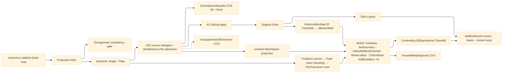

# [RASM_FABRICATION_PRODUCTION]

The additive production owner closes the build hand-off plane: ONE `Production.Plan(BuildPolicy, MeshSpace)` fold selects a machine profile row, gates the oriented part against the machine build volume, optimizes build orientation over kernel face/draft census output, composes support and slicing, writes the 3MF core/production/beam-lattice/slice package through lib3mf, and returns the owner-safe `AdditiveResult`. The `BuildJob` row widens the plane to PLATE economics — many parts packed onto one build plate through the Nesting placement seam, each landing as its own `AddBuildItem` transform in ONE 3MF — because the unit a print bureau schedules and prices is the plate, never the part. The STL hand-off dies here: every production egress is `ContentKey.Of(EgressKind.ThreeMf, bytes)` over `QueryWriter("3mf").WriteToBuffer`, every declared writer extension is WRITTEN, not merely probed — a required slice extension lands the built layer stack as a `CSliceStack` resource, a support tree lands as `CBeamLattice` beams — and every part carries its metadata identity rows.

Wire posture: HOST-LOCAL. lib3mf handles, native writer state, mesh buffers, beam-lattice buffers, and kernel orientation census rows never cross the owner result; `Move`, layer count, and content keys are the only payloads returned to `owner#run`.

## [01]-[INDEX]

- [01]-[PRODUCTION]: owns `AdditiveProcess`, `AdditiveKinematics`, `MachineProfile`, `EnergyHead`, `ThreeMfExtension`, `OrientationPolicy`, `BuildJob`/`PlateItem`, `BuildPolicy`, `OrientationChoice`, `ThreeMfMesh`, `BeamLatticeMap`, `ThreeMfDocument`, the single `Production.Plan(BuildPolicy, MeshSpace)` entry, and the lib3mf `Wrapper.CreateModel` -> `AddMeshObject`/`BeamLattice`/`AddSliceStack`/`AddBuildItem` -> `QueryWriter("3mf")` egress fold.

## [02]-[PRODUCTION]

- Owner: `MachineProfile` rows carry build volume, nozzle/vat/laser head, kinematics class, and required 3MF extensions — the volume is a GATE, the head a consistency check, never dead data; `OrientationPolicy` carries candidate transforms, objective weights, and the admissibility floor; `KernelBuildOperators` binds the K20 `Faces`/`Curves.Draft` orientation census, K3 `Slicing.Apply`, the oriented mesh projection, and the oriented footprint silhouette as injected delegate columns (the architecture's cross-seam pattern) without re-minting a normal classifier; `BuildJob` the demand row (`Single` the run-input part · `Plate` the packed multi-part build); `BuildPolicy` the full demand row including the Nesting placement seam column; `ThreeMfExtension` the probed-AND-written writer extension vocabulary; `ThreeMfMesh` and `BeamLatticeMap` the lib3mf marshalling rows; `Production` the static surface.
- Cases: `AdditiveProcess` rows 3 — `fff`, `vat-photopolymer`, `lpbf`; `AdditiveKinematics` rows 3 — `cartesian`, `vat-z`, `galvo`; `EnergyHead` cases 3 — `Nozzle`, `Vat`, `Laser`; `ThreeMfExtension` rows 4 — `core`, `production`, `beam-lattice`, `slice`; `MachineProfile` exemplar rows 3 — FFF cartesian, SLA vat, LPBF galvo; `BuildJob` cases 2 — `Single` · `Plate(Seq<PlateItem>, SpacingMm, RecoaterAngleDeg)`; orientation scoring terms 4 — overhang area, bottom area, contour length, support volume — over a volume-fit admission predicate.
- Entry: `public static Fin<AdditiveResult> Plan(BuildPolicy policy, MeshSpace model)` — the ONE additive production entry; the `BuildJob` row discriminates single-part and plate demand inside the fold. `Fin<T>` routes `FabricationFault.OrientationInfeasible(overhangs, bestScore)` 2716 when no candidate clears BOTH the build-volume fit and the objective floor (an oversized part is an inadmissible orientation set, so the fit gate rides the SAME fault — no parallel arm), `FabricationFault.Unsupported3mfExtension(extension, EgressKind.ThreeMf)` 2725 when lib3mf lacks a required writer capability, `FabricationFault.ThreeMfWriteRejected(EgressKind.ThreeMf, native)` 2747 when the native write boundary itself rejects — the `Lib3MFException` lift, never a CLR defect railed — and kernel `GeometryFault.DegenerateInput` for a nozzle/extrusion-width mismatch or a non-manifold marshalled mesh (`IsManifoldAndOriented()` false before write).
- Auto: `Plan` first checks the head/policy consistency row (an FFF nozzle wider than the demanded extrusion width is degenerate input at admission, never a downstream surprise). `Select` scores every candidate through the kernel-bound orientation operator, ADMITTING only candidates whose census extents fit `Machine.Volume`; the selected orientation feeds the kernel slice operator, `Support.Grow`, `Slice.Layers`, and the oriented mesh projection once. The support tree maps HERE into the beam lattice — `BeamLatticeMap.Of(SupportPlan, vertexBase)` lowers `TreeNode` upward links to `sBeam` rows over vertices appended after the part triangles, and merge nodes to `sBall` rows — production owns the `TreeNode`→`CBeamLattice` conversion because production owns the `CBeamLattice` consumer. `ThreeMf.Write` creates a `CModel`, sets the declared unit, stamps the metadata group and per-object name/part-number identity, adds one `CMeshObject` per part, bulk-sets vertices and triangles, validates `IsManifoldAndOriented()`, attaches beams through `CMeshObject.BeamLattice()` with `SetMinLength`, lands the built `SliceStack` as an `AddSliceStack`/`AddSlice`/`SetVertices`/`AddPolygon` resource assigned through `AssignSliceStack` whenever the slice extension is required, places each part through `AddBuildItem` with its transform, serializes with `QueryWriter("3mf")`, and mints the `EgressKind.ThreeMf` content key from the buffer. The `Plate` arm selects a per-item orientation, projects each footprint through the `Footprint` column grown by half the spacing, packs the loops onto the bed outline through the `Pack` placement seam, and writes ONE 3MF whose build items carry the packed transforms.
- Receipt: `AdditiveResult` is the typed evidence — additive moves and layer count from slicing plus the `.3mf` content key and any implicit `.cli`/mask keys already returned by the slice/implicit lane; a plate build returns the placed-part count as its layer surrogate only through the packaged key set. `ThreeMfDocument` stays plane-local and never appears on a `FabricationResult` case.
- Packages: `api-lib3mf.md` (`Wrapper.CreateModel`, `CModel`, `AddMeshObject`, `GetMetaDataGroup().AddMetaData`, `CMeshObject.SetGeometry`/`IsManifoldAndOriented`/`SetName`/`SetPartNumber`/`AssignSliceStack`/`SetSlicesMeshResolution`, `CBeamLattice.SetBeams`/`SetBalls`/`SetMinLength`, `AddSliceStack`, `CSliceStack.AddSlice`, `CSlice.SetVertices`/`AddPolygon`, `AddBuildItem`, `QueryWriter("3mf")`, `CWriter.WriteToBuffer`), kernel K20 (`Faces`/`Curves.Draft` axis-ranked face decomposition — the census delegate's kernel side), kernel K3 (`Slicing.Apply`/`SliceStack`), `Additive/support#SUPPORT` (`Support.Grow`, `SupportPlan`, `TreeNode` — the beam-lattice source), `Additive/slicing#SLICING` (`Slice.Layers`, `InfillPolicy`), `Nesting/nfp#NESTING` (the plate placement seam — the `Pack` injected column closes on the Nesting engine), `Process/owner#FABRICATION_OWNER` (`ContentKey.Of`, `EgressKind.ThreeMf`, `PartTransform`, `AdditiveResult`), `Process/faults#FAULT_BAND` (`OrientationInfeasible`, `Unsupported3mfExtension`, `ThreeMfWriteRejected`, `ThreeMfExtension`), `Rasm.Numerics` (`GeometryFault`), Thinktecture.Runtime.Extensions, LanguageExt.Core, BCL inbox.
- Growth: a new printer class is one `MachineProfile` row; a new print head is one `EnergyHead` case plus one consistency clause; a new writer extension is one `ThreeMfExtension` row plus one lib3mf write arm — probe AND payload together, never probe alone; a new objective term is one `OrientationWeights` field consumed by the same score fold; a new plate constraint (Z-height banding, per-zone exclusion) is a `BuildJob.Plate` field the pack seam reads; zero new entrypoint and zero result widening.
- Boundary: `Production` owns build orientation, volume admission, the `TreeNode`→`CBeamLattice` map, and 3MF egress; `Support` owns overhang region growth and tree search; `Slice` owns contour-to-move layers; `Implicit` owns PicoGK voxel realization and the `.cli` lane; `Nesting` owns the placement engine behind the `Pack` column; lib3mf owns the OPC writer. A production-local normal classifier, STL fallback, hand-rolled 3MF XML/OPC writer, raw `XxHash128`/`GenerateHash` call, a probed-but-unwritten extension row, a dead `MachineProfile` column, result payload carrying lib3mf handles, or second additive build entry is the deleted form.

```csharp signature
// --- [RUNTIME_PRELUDE] ----------------------------------------------------------------------------------------------------------------------------
using Lib3MF;
using LanguageExt;
using LanguageExt.Common;
using Rasm.Fabrication.Geometry2D;
using Rasm.Fabrication.Process;
using Rasm.Meshing;
using Rasm.Numerics;
using Rhino.Geometry;
using Thinktecture;
using static LanguageExt.Prelude;
using AdditiveResult = Rasm.Fabrication.Process.FabricationResult.AdditiveResult;

namespace Rasm.Fabrication.Additive;

// --- [TYPES] --------------------------------------------------------------------------------------------------------------------------------------
[SmartEnum<string>]
public sealed partial class AdditiveProcess {
    public static readonly AdditiveProcess Fff = new("fff");
    public static readonly AdditiveProcess VatPhotopolymer = new("vat-photopolymer");
    public static readonly AdditiveProcess Lpbf = new("lpbf");
}

[SmartEnum<string>]
public sealed partial class AdditiveKinematics {
    public static readonly AdditiveKinematics Cartesian = new("cartesian");
    public static readonly AdditiveKinematics VatZ = new("vat-z");
    public static readonly AdditiveKinematics Galvo = new("galvo");
}

// The Key is the LOCAL discriminant (fault payloads, policy rows); SpecUrl is the specification URI lib3mf
// actually probes — GetSpecificationVersion answers URLs, never local keys, so every probed row carries both.
[SmartEnum<string>]
public sealed partial class ThreeMfExtension {
    public static readonly ThreeMfExtension Core = new("core", probe: false, specUrl: "");
    public static readonly ThreeMfExtension Production = new("production", probe: true, specUrl: "http://schemas.microsoft.com/3dmanufacturing/production/2015/06");
    public static readonly ThreeMfExtension BeamLattice = new("beam-lattice", probe: true, specUrl: "http://schemas.microsoft.com/3dmanufacturing/beamlattice/2017/02");
    public static readonly ThreeMfExtension Slice = new("slice", probe: true, specUrl: "http://schemas.microsoft.com/3dmanufacturing/slice/2015/07");

    public bool Probe { get; }
    public string SpecUrl { get; }
}

// The head is a consistency contract: Nozzle gates extrusion width, Vat pixels floor the slice XY resolution,
// Laser spot floors the scan vector length — each row read at Plan admission, never dead data.
[Union(ConversionFromValue = ConversionOperatorsGeneration.None)]
public abstract partial record EnergyHead {
    private EnergyHead() { }

    public sealed record Nozzle(double DiameterMm, double FilamentMm) : EnergyHead;
    public sealed record Vat(double PixelMm, double CureNm) : EnergyHead;
    public sealed record Laser(double SpotMm, double PowerW) : EnergyHead;
}

// --- [MODELS] -------------------------------------------------------------------------------------------------------------------------------------
public readonly record struct BuildVolume(double XMm, double YMm, double ZMm) {
    public bool Fits(Vector3d extents) => extents.X <= XMm && extents.Y <= YMm && extents.Z <= ZMm;

    public Loop Bed() => new(
        Arr(new Point3d(0, 0, 0), new Point3d(XMm, 0, 0), new Point3d(XMm, YMm, 0), new Point3d(0, YMm, 0)), Closed: true);
}

[SmartEnum<string>]
public sealed partial class MachineProfile {
    public static readonly MachineProfile FffCartesian = new(
        "fff-cartesian",
        AdditiveProcess.Fff,
        AdditiveKinematics.Cartesian,
        new BuildVolume(350.0, 350.0, 400.0),
        new EnergyHead.Nozzle(0.4, 1.75),
        Arr(ThreeMfExtension.Core, ThreeMfExtension.Production));

    public static readonly MachineProfile SlaVat = new(
        "sla-vat",
        AdditiveProcess.VatPhotopolymer,
        AdditiveKinematics.VatZ,
        new BuildVolume(220.0, 130.0, 250.0),
        new EnergyHead.Vat(0.05, 405.0),
        Arr(ThreeMfExtension.Core, ThreeMfExtension.Production, ThreeMfExtension.Slice));

    public static readonly MachineProfile LpbfGalvo = new(
        "lpbf-galvo",
        AdditiveProcess.Lpbf,
        AdditiveKinematics.Galvo,
        new BuildVolume(250.0, 250.0, 300.0),
        new EnergyHead.Laser(0.08, 400.0),
        Arr(ThreeMfExtension.Core, ThreeMfExtension.Production, ThreeMfExtension.BeamLattice));

    public AdditiveProcess Process { get; }
    public AdditiveKinematics Kinematics { get; }
    public BuildVolume Volume { get; }
    public EnergyHead Head { get; }
    public Arr<ThreeMfExtension> Extensions { get; }
}

public readonly record struct BuildOrientation(string Key, Vector3d Up, double RotationRadians, sTransform BuildTransform);

public readonly record struct OrientationWeights(double Overhang, double BottomArea, double Contour, double SupportVolume);

public sealed record OrientationPolicy(
    Arr<BuildOrientation> Candidates,
    OrientationWeights Weights,
    double MaxOverhangAreaMm2,
    double MinScore);

// ExtentsMm is the oriented axis-aligned size the volume gate admits against — the census carries it so
// fit and score decide on ONE kernel pass.
public readonly record struct OrientationCensus(
    int Overhangs,
    double OverhangAreaMm2,
    double BottomAreaMm2,
    double ContourLengthMm,
    double SupportVolumeMm3,
    Vector3d ExtentsMm);

public readonly record struct OrientationChoice(BuildOrientation Orientation, OrientationCensus Census, double Score);

// Injected delegate columns per the architecture cross-seam pattern: the kernel side closes each column.
public sealed record KernelBuildOperators(
    Func<MeshSpace, BuildOrientation, Fin<OrientationCensus>> Orientation,
    Func<MeshSpace, BuildOrientation, Fin<SliceOp>> Slice,
    Func<MeshSpace, BuildOrientation, Fin<ThreeMfMesh>> Mesh,
    Func<MeshSpace, BuildOrientation, Fin<Loop>> Footprint);

public readonly record struct PartIdentity(string Name, string PartNumber);

public sealed record ThreeMfPolicy(Arr<ThreeMfExtension> Required, eModelUnit Unit, int DecimalPrecision, bool StrictMode, PartIdentity Identity);

public readonly record struct PlateItem(MeshSpace Model, int Quantity, PartIdentity Identity);

// Single = the run-input part; Plate = the packed multi-part build — the demand row, one Plan entry.
[Union(ConversionFromValue = ConversionOperatorsGeneration.None)]
public abstract partial record BuildJob {
    private BuildJob() { }

    public sealed record Single : BuildJob;
    public sealed record Plate(Seq<PlateItem> Items, double SpacingMm, double RecoaterAngleDeg) : BuildJob;
}

// Pack is the Nesting placement seam column: bed outline + part footprints in, PartTransform rows out;
// it closes on the Nesting engine entry, never a production-local packer.
public sealed record BuildPolicy(
    MachineProfile Machine,
    OrientationPolicy Orientation,
    KernelBuildOperators Kernel,
    InfillPolicy Infill,
    SupportPolicy Support,
    ThreeMfPolicy ThreeMf,
    BuildJob Job,
    Func<Seq<Loop>, Loop, Fin<Seq<PartTransform>>> Pack);

public sealed record BeamLatticeMap(Arr<sPosition> Nodes, Arr<sBeam> Beams, Arr<sBall> Balls) {
    // Production owns the TreeNode → CBeamLattice lowering: beams reference MESH VERTEX indices, so the node
    // positions append after the part vertices (vertexBase) and every upward link becomes one sBeam row.
    public static BeamLatticeMap Of(SupportPlan support, uint vertexBase) {
        HashMap<int, int> slot = toHashMap(support.Tree.Map((i, n) => (n.Id, i)).ToSeq());
        Arr<sPosition> nodes = toArr(support.Tree.Map(static n =>
            new sPosition { Coordinates = new float[] { (float)n.At.X, (float)n.At.Y, (float)n.At.Z } }));
        Arr<sBeam> beams = toArr(support.Tree.Filter(static n => n.Parent >= 0).Map(n => new sBeam {
            Indices = new uint[] { vertexBase + (uint)slot.Find(n.Parent).IfNone(0), vertexBase + (uint)slot.Find(n.Id).IfNone(0) },
            Radii = new double[] { support.Tree.Find(p => p.Id == n.Parent).Map(static p => p.Radius).IfNone(n.Radius), n.Radius },
            CapModes = new[] { eBeamLatticeCapMode.Sphere, eBeamLatticeCapMode.Sphere },
        }));
        Arr<sBall> balls = toArr(support.Tree.Filter(static n => n.Role == TreeRole.Merge).Map(n =>
            new sBall { Index = vertexBase + (uint)slot.Find(n.Id).IfNone(0), Radius = n.Radius }));
        return new BeamLatticeMap(nodes, beams, balls);
    }
}

public sealed record ThreeMfMesh(Arr<sPosition> Vertices, Arr<sTriangle> Triangles);

public sealed record ThreeMfDocument(
    BuildPolicy Policy,
    Seq<(ThreeMfMesh Mesh, PartIdentity Identity, sTransform Transform)> Parts,
    Option<BeamLatticeMap> Lattice,
    Option<SliceStack> Slices);

// --- [OPERATIONS] ---------------------------------------------------------------------------------------------------------------------------------
public static class Production {
    public static Fin<AdditiveResult> Plan(BuildPolicy policy, MeshSpace model) =>
        HeadGate(policy).Bind(_ => policy.Job.Switch(
            state:  (policy, model),
            single: static s => Single(s.policy, s.model),
            plate:  static (s, job) => Plate(s.policy, job)));

    static Fin<AdditiveResult> Single(BuildPolicy policy, MeshSpace model) =>
        from choice in Select(policy, model)
        from sliceOp in policy.Kernel.Slice(model, choice.Orientation)
        from stack in Slicing.Apply(sliceOp)
        from support in Support.Grow(stack, policy.Support)
        from layered in Slice.Layers(stack, policy.Infill with { Support = Some(support) })
        from mesh in policy.Kernel.Mesh(model, choice.Orientation)
        let lattice = support.Tree.IsEmpty ? Option<BeamLatticeMap>.None : Some(BeamLatticeMap.Of(support, (uint)mesh.Vertices.Count))
        let slices = Requires(policy, ThreeMfExtension.Slice) ? Some(stack) : Option<SliceStack>.None
        from key in ThreeMf.Write(new ThreeMfDocument(
            policy, Seq((mesh, policy.ThreeMf.Identity, choice.Orientation.BuildTransform)), lattice, slices))
        select new AdditiveResult(layered.Moves, layered.Layers, layered.Artifacts.Add(key));

    // Plate economics: per-item orientation, footprint grown by half the spacing, one Pack call against the
    // bed outline, one 3MF whose build items carry the packed transforms.
    static Fin<AdditiveResult> Plate(BuildPolicy policy, BuildJob.Plate job) =>
        from placed in job.Items
            .Bind(item => toSeq(Enumerable.Range(0, item.Quantity)).Map(_ => item))
            .Map(item =>
                from choice in Select(policy, item.Model)
                from footprint in policy.Kernel.Footprint(item.Model, choice.Orientation)
                from grown in PolygonAlgebra.Offset(Seq(footprint), 0.5 * job.SpacingMm, OffsetEnds.Polygon)
                from mesh in policy.Kernel.Mesh(item.Model, choice.Orientation)
                select (Item: item, Choice: choice, Outline: grown.HeadOrNone().IfNone(footprint), Mesh: mesh))
            .Sequence()
        from transforms in policy.Pack(placed.Map(static p => p.Outline), policy.Machine.Volume.Bed())
        from key in ThreeMf.Write(new ThreeMfDocument(
            policy,
            placed.Zip(transforms).Map(static pair =>
                (pair.First.Mesh, pair.First.Item.Identity, Placed(pair.First.Choice.Orientation.BuildTransform, pair.Second))),
            Option<BeamLatticeMap>.None,
            Option<SliceStack>.None))
        select new AdditiveResult(Seq<Move>(), placed.Count, Seq(key));

    // Volume fit is an ADMISSION predicate on the same fold that scores: an oversized part yields an empty
    // admitted set and the SAME OrientationInfeasible 2716 — never a parallel fault arm.
    static Fin<OrientationChoice> Select(BuildPolicy policy, MeshSpace model) =>
        policy.Orientation.Candidates
            .Map(candidate => policy.Kernel.Orientation(model, candidate).Map(census => Choice(policy, candidate, census)))
            .Sequence()
            .Bind(choices => Best(policy, choices.ToSeq()));

    static OrientationChoice Choice(BuildPolicy policy, BuildOrientation candidate, OrientationCensus census) {
        OrientationWeights w = policy.Orientation.Weights;
        double score =
            w.BottomArea * census.BottomAreaMm2
            + w.Contour * census.ContourLengthMm
            - w.Overhang * census.OverhangAreaMm2
            - w.SupportVolume * census.SupportVolumeMm3;
        return new OrientationChoice(candidate, census, score);
    }

    static Fin<OrientationChoice> Best(BuildPolicy policy, Seq<OrientationChoice> choices) {
        if (choices.IsEmpty)
            return Fin.Fail<OrientationChoice>(FabricationFault.OrientationInfeasible(0, 0.0).ToError());

        Seq<OrientationChoice> admitted = choices.Filter(c =>
            policy.Machine.Volume.Fits(c.Census.ExtentsMm)
            && c.Census.OverhangAreaMm2 <= policy.Orientation.MaxOverhangAreaMm2
            && c.Score >= policy.Orientation.MinScore);

        OrientationChoice best = (admitted.IsEmpty ? choices : admitted).OrderByDescending(static c => c.Score).First();

        return admitted.IsEmpty
            ? Fin.Fail<OrientationChoice>(FabricationFault.OrientationInfeasible(best.Census.Overhangs, best.Score).ToError())
            : Fin.Succ(best);
    }

    static Fin<Unit> HeadGate(BuildPolicy policy) =>
        policy.Machine.Head switch {
            EnergyHead.Nozzle nozzle when policy.Infill.ExtrusionWidth < nozzle.DiameterMm =>
                Fin.Fail<Unit>(GeometryFault.DegenerateInput("build:extrusion-below-nozzle").ToError()),
            _ => Fin.Succ(unit),
        };

    static bool Requires(BuildPolicy policy, ThreeMfExtension extension) =>
        policy.Machine.Extensions.Contains(extension) || policy.ThreeMf.Required.Contains(extension);

    static sTransform Placed(sTransform oriented, PartTransform placement) {
        float c = (float)Math.Cos(placement.RotationRadians), s = (float)Math.Sin(placement.RotationRadians);
        return new sTransform {
            Fields = new[] {
                new[] { c * oriented.Fields[0][0] - s * oriented.Fields[1][0], c * oriented.Fields[0][1] - s * oriented.Fields[1][1], c * oriented.Fields[0][2] - s * oriented.Fields[1][2] },
                new[] { s * oriented.Fields[0][0] + c * oriented.Fields[1][0], s * oriented.Fields[0][1] + c * oriented.Fields[1][1], s * oriented.Fields[0][2] + c * oriented.Fields[1][2] },
                oriented.Fields[2],
                new[] { oriented.Fields[3][0] + (float)placement.Tx, oriented.Fields[3][1] + (float)placement.Ty, oriented.Fields[3][2] },
            },
        };
    }
}

public static class ThreeMf {
    public static Fin<ContentKey> Write(ThreeMfDocument document) =>
        GuardExtensions(Required(document)).Bind(_ => WriteBounded(document));

    static Seq<ThreeMfExtension> Required(ThreeMfDocument document) =>
        document.Policy.Machine.Extensions
            .Concat(document.Policy.ThreeMf.Required)
            .Concat(document.Lattice.Map(_ => Seq(ThreeMfExtension.BeamLattice)).IfNone(Seq<ThreeMfExtension>()))
            .Concat(document.Slices.Map(_ => Seq(ThreeMfExtension.Slice)).IfNone(Seq<ThreeMfExtension>()))
            .Distinct();

    static Fin<Unit> GuardExtensions(Seq<ThreeMfExtension> required) =>
        required.Filter(static extension => extension.Probe)
            .Map(Probe)
            .Sequence()
            .Map(static _ => unit);

    // The boundary asks lib3mf the REQUIRED question: the row's specification URL, never its local key — a
    // false answer names the exact extension in the typed 2725 payload.
    static Fin<Unit> Probe(ThreeMfExtension extension) {
        Wrapper.GetSpecificationVersion(extension.SpecUrl, out bool supported, out int major, out int minor, out int micro);
        return supported
            ? Fin.Succ(unit)
            : Fin.Fail<Unit>(FabricationFault.Unsupported3mfExtension(extension, EgressKind.ThreeMf).ToError());
    }

    // The lib3mf binding lifts native error codes via CheckError into its own exception; ONLY that raise rails —
    // as the 2747 write-rejection arm carrying the lifted native evidence — while a CLR defect propagates.
    // GuardExtensions already settled the extension question, so 2725 never mints here. Every required extension
    // is WRITTEN: beams land on BeamLattice(), the layer stack lands as a CSliceStack resource.
    static Fin<ContentKey> WriteBounded(ThreeMfDocument document) {
        try {
            CModel model = Wrapper.CreateModel();
            model.SetUnit(document.Policy.ThreeMf.Unit);
            model.GetMetaDataGroup().AddMetaData("", "Application", "Rasm.Fabrication", "string", AMustPreserve: true);

            foreach ((ThreeMfMesh part, PartIdentity identity, sTransform transform) in document.Parts) {
                CMeshObject mesh = model.AddMeshObject();
                mesh.SetName(identity.Name);
                mesh.SetPartNumber(identity.PartNumber);
                mesh.SetGeometry(part.Vertices.ToArray(), part.Triangles.ToArray());
                if (!mesh.IsManifoldAndOriented())
                    return Fin.Fail<ContentKey>(GeometryFault.DegenerateInput("3mf:non-manifold-mesh").ToError());
                document.Lattice.IfSome(map => BeamLattice(mesh, map));
                document.Slices.IfSome(stack => SliceResource(model, mesh, stack));
                model.AddBuildItem(mesh, transform);
            }

            CWriter writer = model.QueryWriter("3mf");
            writer.SetStrictModeActive(document.Policy.ThreeMf.StrictMode);
            writer.SetDecimalPrecision(document.Policy.ThreeMf.DecimalPrecision);
            writer.WriteToBuffer(out byte[] bytes);
            return Fin.Succ(ContentKey.Of(EgressKind.ThreeMf, bytes));
        }
        catch (Lib3MFException native) {
            return Fin.Fail<ContentKey>(FabricationFault.ThreeMfWriteRejected(EgressKind.ThreeMf, native.Message).ToError());
        }
    }

    static Unit BeamLattice(CMeshObject mesh, BeamLatticeMap map) {
        map.Nodes.Iter(node => mesh.AddVertex(node));
        CBeamLattice lattice = mesh.BeamLattice();
        lattice.SetMinLength(0.001);
        lattice.SetBeams(map.Beams.ToArray());
        lattice.SetBalls(map.Balls.ToArray());
        return unit;
    }

    // The slice extension payload: the kernel layer stack lowered to CSliceStack — vertices + polygon index
    // rings per layer, assigned to the mesh object at the declared resolution.
    static Unit SliceResource(CModel model, CMeshObject mesh, SliceStack stack) {
        CSliceStack resource = model.AddSliceStack(stack.Elevations.Length > 0 ? stack.Elevations[0] : 0.0);
        for (int n = 0; n < stack.LayerCount; n++) {
            CSlice layer = resource.AddSlice(stack.Elevations[n]);
            SliceRegion region = SliceRegion.Of(stack, n);
            Seq<Loop> rings = region.Outers.Concat(region.Holes);
            layer.SetVertices(rings.Bind(static ring => toSeq(ring.Vertices)).Map(static p =>
                new sPosition2D { Coordinates = new float[] { (float)p.X, (float)p.Y } }).ToArray());
            uint offset = 0;
            rings.Iter(ring => {
                layer.AddPolygon(toArr(Enumerable.Range(0, ring.Count + 1).Select(i => offset + (uint)(i % ring.Count))).ToArray());
                offset += (uint)ring.Count;
            });
        }
        mesh.AssignSliceStack(resource);
        mesh.SetSlicesMeshResolution(eSlicesMeshResolution.Fullres);
        return unit;
    }
}
```


