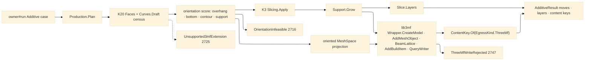

# [RASM_FABRICATION_PRODUCTION]

The additive production owner closes the build hand-off plane: ONE `Production.Plan(BuildPolicy, MeshSpace)` fold selects a machine profile row, optimizes build orientation over kernel face/draft census output, composes support and slicing, writes the 3MF core/production/beam-lattice package through lib3mf, and returns the owner-safe `AdditiveResult`. The STL hand-off dies here: every production egress is `ContentKey.Of(EgressKind.ThreeMf, bytes)` over `QueryWriter("3mf").WriteToBuffer`, and every lattice, support, slice, and build-placement fact rides the typed 3MF carrier rather than a mesh-only surrogate.

Wire posture: HOST-LOCAL. lib3mf handles, native writer state, mesh buffers, beam-lattice buffers, and kernel orientation census rows never cross the owner result; `Move`, layer count, and content keys are the only payloads returned to `owner#run`.

## [01]-[INDEX]

- [01]-[PRODUCTION]: owns `AdditiveProcess`, `AdditiveKinematics`, `MachineProfile`, `EnergyHead`, `ThreeMfExtension`, `OrientationPolicy`, `BuildPolicy`, `OrientationChoice`, `ThreeMfMesh`, `BeamLatticeMap`, `ThreeMfDocument`, the single `Production.Plan(BuildPolicy, MeshSpace)` entry, and the lib3mf `Wrapper.CreateModel` -> `AddMeshObject`/`BeamLattice`/`AddBuildItem` -> `QueryWriter("3mf")` egress fold.

## [02]-[PRODUCTION]

- Owner: `MachineProfile` rows carry build volume, nozzle/vat/laser head, kinematics class, and required 3MF extensions; `OrientationPolicy` carries candidate transforms, objective weights, and the admissibility floor; `KernelBuildOperators` binds the K20 `Faces`/`Curves.Draft` orientation census, K3 `Slicing.Apply`, and the oriented mesh projection without re-minting a normal classifier; `BuildPolicy` is the full demand row; `ThreeMfExtension` is the fault payload vocabulary for required writer extensions; `ThreeMfMesh` and `BeamLatticeMap` are the lib3mf marshalling rows; `Production` is the static surface.
- Cases: `AdditiveProcess` rows 3 — `fff`, `vat-photopolymer`, `lpbf`; `AdditiveKinematics` rows 3 — `cartesian`, `vat-z`, `galvo`; `EnergyHead` cases 3 — `Nozzle`, `Vat`, `Laser`; `ThreeMfExtension` rows 4 — `core`, `production`, `beam-lattice`, `slice`; `MachineProfile` exemplar rows 3 — FFF cartesian, SLA vat, LPBF galvo; orientation scoring terms 4 — overhang area, bottom area, contour length, support volume.
- Entry: `public static Fin<AdditiveResult> Plan(BuildPolicy policy, MeshSpace model)` — the ONE additive production entry. `Fin<T>` routes `FabricationFault.OrientationInfeasible(overhangs, bestScore)` 2716 when no candidate clears the objective floor, `FabricationFault.Unsupported3mfExtension(extension, EgressKind.ThreeMf)` 2725 when lib3mf lacks a required core/production/beam-lattice/slice writer capability, and `FabricationFault.ThreeMfWriteRejected(EgressKind.ThreeMf, native)` 2747 when the native write boundary itself rejects — the `Lib3MFException` lift, never a CLR defect railed.
- Auto: `Plan` scores every candidate through the kernel-bound orientation operator, not a facet-normal classifier. The selected orientation feeds the kernel slice operator, `Support.Grow`, `Slice.Layers`, and the oriented mesh projection once. `Slice.Layers` receives the support plan in the infill policy so planar support regions and tree-derived lattice maps stay aligned. `ThreeMf.Write` creates a `CModel`, sets the declared model unit, adds one `CMeshObject`, bulk-sets vertices and triangles, maps any PicoGK lattice/support beam map into `CMeshObject.BeamLattice()`, places the part through `AddBuildItem`, serializes with `QueryWriter("3mf")`, and mints the `EgressKind.ThreeMf` content key from the buffer.
- Receipt: `AdditiveResult` is the typed evidence — additive moves and layer count from slicing plus the `.3mf` content key and any implicit `.cli`/mask keys already returned by the slice/implicit lane. `ThreeMfDocument` stays plane-local and never appears on a `FabricationResult` case.
- Packages: `api-lib3mf.md` (`Wrapper.CreateModel`, `CModel`, `AddMeshObject`, `CMeshObject.BeamLattice`, `CBeamLattice.SetBeams`/`SetBalls`, `AddBuildItem`, `QueryWriter("3mf")`, `CWriter.WriteToBuffer`), kernel K20 (`Faces`/`Curves.Draft` axis-ranked face decomposition), kernel K3 (`Slicing.Apply`/`SliceStack`), `Additive/support#SUPPORT` (`Support.Grow`, `SupportPlan`, `TreeNode`), `Additive/slicing#SLICING` (`Slice.Layers`, `InfillPolicy`), `Additive/implicit#IMPLICIT` (`ImplicitOp`, PicoGK `Lattice` map seam), `Process/owner#FABRICATION_OWNER` (`ContentKey.Of`, `EgressKind.ThreeMf`, `AdditiveResult`), `Process/faults#FAULT_BAND` (`OrientationInfeasible`, `Unsupported3mfExtension`, `ThreeMfWriteRejected`, `ThreeMfExtension`), Thinktecture.Runtime.Extensions, LanguageExt.Core, BCL inbox.
- Growth: a new printer class is one `MachineProfile` row; a new print head is one `EnergyHead` case; a new writer extension is one `ThreeMfExtension` row plus one lib3mf probe arm; a new objective term is one `OrientationWeights` field consumed by the same score fold; a new lattice carrier maps into `BeamLatticeMap`; zero new entrypoint and zero result widening.
- Boundary: `Production` owns build orientation and 3MF egress; `Support` owns overhang region growth and tree search; `Slice` owns contour-to-move layers; `Implicit` owns PicoGK voxel/lattice realization; lib3mf owns the OPC writer. A production-local normal classifier, STL fallback, hand-rolled 3MF XML/OPC writer, raw `XxHash128`/`GenerateHash` call, result payload carrying lib3mf handles, or second additive build entry is the deleted form.

```csharp signature
// --- [RUNTIME_PRELUDE] ----------------------------------------------------------------------------------------------------------------------------
using Lib3MF;
using LanguageExt;
using LanguageExt.Common;
using Rasm.Fabrication.Process;
using Rasm.Meshing;
using Rhino.Geometry;
using Thinktecture;
using static LanguageExt.Prelude;
using AdditiveResult = Rasm.Fabrication.Process.FabricationResult.AdditiveResult;

namespace Rasm.Fabrication.Additive;

// --- [TYPES] --------------------------------------------------------------------------------------------------------------------------------------
[SmartEnum<string>]
public sealed partial class AdditiveProcess {
    public static readonly AdditiveProcess Fff = new("fff");
    public static readonly AdditiveProcess VatPhotopolymer = new("vat-photopolymer");
    public static readonly AdditiveProcess Lpbf = new("lpbf");
}

[SmartEnum<string>]
public sealed partial class AdditiveKinematics {
    public static readonly AdditiveKinematics Cartesian = new("cartesian");
    public static readonly AdditiveKinematics VatZ = new("vat-z");
    public static readonly AdditiveKinematics Galvo = new("galvo");
}

// The Key is the LOCAL discriminant (fault payloads, policy rows); SpecUrl is the specification URI lib3mf
// actually probes — GetSpecificationVersion answers URLs, never local keys, so every probed row carries both.
[SmartEnum<string>]
public sealed partial class ThreeMfExtension {
    public static readonly ThreeMfExtension Core = new("core", probe: false, specUrl: "");
    public static readonly ThreeMfExtension Production = new("production", probe: true, specUrl: "http://schemas.microsoft.com/3dmanufacturing/production/2015/06");
    public static readonly ThreeMfExtension BeamLattice = new("beam-lattice", probe: true, specUrl: "http://schemas.microsoft.com/3dmanufacturing/beamlattice/2017/02");
    public static readonly ThreeMfExtension Slice = new("slice", probe: true, specUrl: "http://schemas.microsoft.com/3dmanufacturing/slice/2015/07");

    public bool Probe { get; }
    public string SpecUrl { get; }
}

[Union(ConversionFromValue = ConversionOperatorsGeneration.None)]
public abstract partial record EnergyHead {
    private EnergyHead() { }

    public sealed record Nozzle(double DiameterMm, double FilamentMm) : EnergyHead;
    public sealed record Vat(double PixelMm, double CureNm) : EnergyHead;
    public sealed record Laser(double SpotMm, double PowerW) : EnergyHead;
}

// --- [MODELS] -------------------------------------------------------------------------------------------------------------------------------------
public readonly record struct BuildVolume(double XMm, double YMm, double ZMm);

[SmartEnum<string>]
public sealed partial class MachineProfile {
    public static readonly MachineProfile FffCartesian = new(
        "fff-cartesian",
        AdditiveProcess.Fff,
        AdditiveKinematics.Cartesian,
        new BuildVolume(350.0, 350.0, 400.0),
        new EnergyHead.Nozzle(0.4, 1.75),
        Arr(ThreeMfExtension.Core, ThreeMfExtension.Production));

    public static readonly MachineProfile SlaVat = new(
        "sla-vat",
        AdditiveProcess.VatPhotopolymer,
        AdditiveKinematics.VatZ,
        new BuildVolume(220.0, 130.0, 250.0),
        new EnergyHead.Vat(0.05, 405.0),
        Arr(ThreeMfExtension.Core, ThreeMfExtension.Production, ThreeMfExtension.Slice));

    public static readonly MachineProfile LpbfGalvo = new(
        "lpbf-galvo",
        AdditiveProcess.Lpbf,
        AdditiveKinematics.Galvo,
        new BuildVolume(250.0, 250.0, 300.0),
        new EnergyHead.Laser(0.08, 400.0),
        Arr(ThreeMfExtension.Core, ThreeMfExtension.Production, ThreeMfExtension.BeamLattice));

    public AdditiveProcess Process { get; }
    public AdditiveKinematics Kinematics { get; }
    public BuildVolume Volume { get; }
    public EnergyHead Head { get; }
    public Arr<ThreeMfExtension> Extensions { get; }
}

public readonly record struct BuildOrientation(string Key, Vector3d Up, double RotationRadians, sTransform BuildTransform);

public readonly record struct OrientationWeights(double Overhang, double BottomArea, double Contour, double SupportVolume);

public sealed record OrientationPolicy(
    Arr<BuildOrientation> Candidates,
    OrientationWeights Weights,
    double MaxOverhangAreaMm2,
    double MinScore);

public readonly record struct OrientationCensus(
    int Overhangs,
    double OverhangAreaMm2,
    double BottomAreaMm2,
    double ContourLengthMm,
    double SupportVolumeMm3);

public readonly record struct OrientationChoice(BuildOrientation Orientation, OrientationCensus Census, double Score);

public sealed record KernelBuildOperators(
    Func<MeshSpace, BuildOrientation, Fin<OrientationCensus>> Orientation,
    Func<MeshSpace, BuildOrientation, Fin<SliceOp>> Slice,
    Func<MeshSpace, BuildOrientation, Fin<ThreeMfMesh>> Mesh);

public sealed record ThreeMfPolicy(Arr<ThreeMfExtension> Required, eModelUnit Unit, int DecimalPrecision, bool StrictMode);

public sealed record BuildPolicy(
    MachineProfile Machine,
    OrientationPolicy Orientation,
    KernelBuildOperators Kernel,
    InfillPolicy Infill,
    SupportPolicy Support,
    ThreeMfPolicy ThreeMf);

public sealed record BeamLatticeMap(Arr<sBeam> Beams, Arr<sBall> Balls);

public sealed record ThreeMfMesh(Arr<sPosition> Vertices, Arr<sTriangle> Triangles, Option<BeamLatticeMap> Lattice = default);

public sealed record ThreeMfDocument(BuildPolicy Policy, OrientationChoice Choice, SupportPlan Support, ThreeMfMesh Mesh);

// --- [OPERATIONS] ---------------------------------------------------------------------------------------------------------------------------------
public static class Production {
    public static Fin<AdditiveResult> Plan(BuildPolicy policy, MeshSpace model) =>
        Select(policy, model)
            .Bind(choice =>
                policy.Kernel.Slice(model, choice.Orientation)
                    .Bind(sliceOp => Slicing.Apply(sliceOp))
                    .Bind(stack =>
                        Support.Grow(stack, policy.Support)
                            .Bind(support =>
                                Slice.Layers(stack, policy.Infill with { Support = Some(support) })
                                    .Bind(layered =>
                                        policy.Kernel.Mesh(model, choice.Orientation)
                                            .Bind(mesh =>
                                                ThreeMf.Write(new ThreeMfDocument(policy, choice, support, mesh))
                                                    .Map(key => new AdditiveResult(
                                                        layered.Moves,
                                                        layered.Layers,
                                                        layered.Artifacts.Concat(Seq(key)))))))));

    static Fin<OrientationChoice> Select(BuildPolicy policy, MeshSpace model) =>
        policy.Orientation.Candidates
            .Map(candidate => policy.Kernel.Orientation(model, candidate).Map(census => Choice(policy, candidate, census)))
            .Sequence()
            .Bind(choices => Best(policy, choices));

    static OrientationChoice Choice(BuildPolicy policy, BuildOrientation candidate, OrientationCensus census) {
        OrientationWeights w = policy.Orientation.Weights;
        double score =
            w.BottomArea * census.BottomAreaMm2
            + w.Contour * census.ContourLengthMm
            - w.Overhang * census.OverhangAreaMm2
            - w.SupportVolume * census.SupportVolumeMm3;
        return new OrientationChoice(candidate, census, score);
    }

    static Fin<OrientationChoice> Best(BuildPolicy policy, Seq<OrientationChoice> choices) {
        if (choices.IsEmpty)
            return Fin.Fail<OrientationChoice>(FabricationFault.OrientationInfeasible(0, 0.0).ToError());

        Seq<OrientationChoice> admitted = choices.Filter(c =>
            c.Census.OverhangAreaMm2 <= policy.Orientation.MaxOverhangAreaMm2 && c.Score >= policy.Orientation.MinScore);

        OrientationChoice best = admitted.IsEmpty
            ? choices.OrderByDescending(static c => c.Score).First()
            : admitted.OrderByDescending(static c => c.Score).First();

        return admitted.IsEmpty
            ? Fin.Fail<OrientationChoice>(FabricationFault.OrientationInfeasible(best.Census.Overhangs, best.Score).ToError())
            : Fin.Succ(best);
    }
}

public static class ThreeMf {
    public static Fin<ContentKey> Write(ThreeMfDocument document) =>
        GuardExtensions(Required(document)).Bind(_ => WriteBounded(document));

    static Seq<ThreeMfExtension> Required(ThreeMfDocument document) =>
        document.Policy.Machine.Extensions
            .Concat(document.Policy.ThreeMf.Required)
            .Concat(document.Mesh.Lattice.Map(_ => Seq(ThreeMfExtension.BeamLattice)).IfNone(Seq<ThreeMfExtension>()))
            .Distinct();

    static Fin<Unit> GuardExtensions(Seq<ThreeMfExtension> required) =>
        required.Filter(static extension => extension.Probe)
            .Map(Probe)
            .Sequence()
            .Map(_ => unit);

    // The boundary asks lib3mf the REQUIRED question: the row's specification URL, never its local key — a
    // false answer names the exact extension in the typed 2725 payload.
    static Fin<Unit> Probe(ThreeMfExtension extension) {
        Wrapper.GetSpecificationVersion(extension.SpecUrl, out bool supported, out int major, out int minor, out int micro);
        return supported
            ? Fin.Succ(unit)
            : Fin.Fail<Unit>(FabricationFault.Unsupported3mfExtension(extension, EgressKind.ThreeMf).ToError());
    }

    // The lib3mf binding lifts native error codes via CheckError into its own exception; ONLY that raise
    // rails — as the 2747 write-rejection arm carrying the lifted native evidence — while a CLR defect
    // propagates. GuardExtensions already settled the extension question, so 2725 never mints here.
    static Fin<ContentKey> WriteBounded(ThreeMfDocument document) {
        try {
            CModel model = Wrapper.CreateModel();
            model.SetUnit(document.Policy.ThreeMf.Unit);
            CMeshObject mesh = model.AddMeshObject();
            mesh.SetGeometry(document.Mesh.Vertices.ToArray(), document.Mesh.Triangles.ToArray());
            document.Mesh.Lattice.IfSome(lattice => BeamLattice(mesh.BeamLattice(), lattice));
            model.AddBuildItem(mesh, document.Choice.Orientation.BuildTransform);

            CWriter writer = model.QueryWriter("3mf");
            writer.SetStrictModeActive(document.Policy.ThreeMf.StrictMode);
            writer.SetDecimalPrecision(document.Policy.ThreeMf.DecimalPrecision);
            writer.WriteToBuffer(out byte[] bytes);
            return Fin.Succ(ContentKey.Of(EgressKind.ThreeMf, bytes));
        }
        catch (Lib3MFException native) {
            return Fin.Fail<ContentKey>(FabricationFault.ThreeMfWriteRejected(EgressKind.ThreeMf, native.Message).ToError());
        }
    }

    static Unit BeamLattice(CBeamLattice lattice, BeamLatticeMap map) {
        lattice.SetBeams(map.Beams.ToArray());
        lattice.SetBalls(map.Balls.ToArray());
        return unit;
    }
}
```


