# [RASM_FABRICATION_PRODUCTION]

The additive production owner closes the build hand-off plane through ONE `Production.Plan(BuildPolicy, MeshSpace)` fold. `MachineProfile` composes fleet-owned `MachineInstance` and `ProcessEnvelope.Build` data with the additive head and writer capabilities; it is no machine roster, and every `AdditiveProcess` row carries its canonical `ProcessKind`, so admission proves the fleet machine kind admits the profile's process through the family `Machine.Admits` relation — the fine-grained additive axis never drifts parallel to it. `BuildProgram` selects fused deposition, powder exposure, or a caller-injected process compiler without forcing every additive process through FFF policy. `BuildJob.Plate` prepares every part item completely — orientation, slice stack, support plan, program receipt, mesh, lattice, and optional slice resource — exactly once, fans instances into placement demand, makes ONE placement call over `PlateLayoutDemand`, and writes one 3MF build whose object resources carry N placed build items under the Production extension. Every declared writer extension carries payload, every strict warning accumulates on one typed failure, and every egress key mints from the complete lib3mf buffer.

Wire posture: HOST-LOCAL. lib3mf handles, native writer state, mesh buffers, beam-lattice buffers, and kernel orientation census rows never cross the owner result; `Move`, layer count, and content keys are the only payloads returned to `owner#run`.

## [01]-[INDEX]

- [01]-[PRODUCTION]: owns `AdditiveProcess`, `AdditiveKinematics`, `MachineProfile`, `EnergyHead`, `ThreeMfExtension`, `OrientationPolicy`, `BuildJob`/`PlateItem`, `BuildProgram`/`ProgramReceipt`, `BuildPolicy`, `OrientationChoice`, `ThreeMfMesh`, `BeamLatticeMap`, `ThreeMfDocument`, the single `Production.Plan(BuildPolicy, MeshSpace)` entry, and the lib3mf `Wrapper.CreateModel` -> `AddMeshObject`/`BeamLattice`/`AddSliceStack`/`AddBuildItem` -> `QueryWriter("3mf")` egress fold.

## [02]-[PRODUCTION]

- Owner: `MachineProfile` is open instance data composed from fleet truth, a process/kinematics axis, an energy-head case, and required extensions; `OrientationPolicy` carries candidate transforms, objective weights, and admission floors; `KernelBuildOperators` binds kernel orientation, slicing, mesh, and footprint columns; `BuildJob` is the identity-bearing single-versus-plate demand; `BuildProgram` is the process-compilation discriminant; `ProgramReceipt` is the common compiled result plus optional support graph; `PlateLayoutDemand` is the placement seam carrying footprints, heights, spacing, bed, and recoater bearing; `ThreeMfPart` carries per-object mesh, placed build items, lattice, slices, and production identities; `Production` and `ThreeMf` own the entry and native boundary.
- Cases: `AdditiveProcess` covers extrusion, vat, laser/electron powder bed, directed-energy deposition, binder/material jet, and cold-spray modalities, each row carrying its canonical `ProcessKind` owner; `AdditiveKinematics` covers cartesian, delta, robot, vat, galvo, electron-optics, and conveyor motion; `EnergyHead` cases encode nozzle, pellet, vat, laser, electron beam, arc, binder, jet, and spray heads; `BuildJob` cases 2 — identity-bearing `Single` and instance-bearing `Plate`; `BuildProgram` cases 3 — `Fused`, `Powder`, and parameterized `Custom`; `ThreeMfExtension` rows 4 — core, production, beam lattice, and slice.
- Entry: `public static Fin<AdditiveResult> Plan(BuildPolicy policy, MeshSpace model)` — the ONE additive production entry; the `BuildJob` row discriminates single-part and plate demand inside the fold. `Fin<T>` routes `FabricationFault.OrientationInfeasible(overhangs, bestScore)` 2716 when no candidate clears BOTH the build-volume fit and the objective floor (an oversized part is an inadmissible orientation set, so the fit gate rides the SAME fault — no parallel arm), `FabricationFault.Unsupported3mfExtension(extension, EgressKind.ThreeMf)` 2725 when lib3mf lacks a required writer capability, `FabricationFault.ThreeMfWriteRejected(EgressKind.ThreeMf, native)` 2747 when the native write boundary itself rejects — the `Lib3MFException` lift, never a CLR defect railed — and kernel `GeometryFault.DegenerateInput` for a nozzle/extrusion-width mismatch or a non-manifold marshalled mesh (`IsManifoldAndOriented()` false before write).
- Auto: `Plan` validates machine/station/head data, the canonical `Instance.Kind.Admits(Process.Kind)` join, process/kinematics/program compatibility, UUID uniqueness, plate instance rows, orientation policy, and writer precision before allocation. `Select` admits only oriented extents fitting the fleet-derived build station. `Single` and every `Plate` ITEM execute the orientation → slicing → `BuildProgram` compilation → mesh → lattice chain exactly once; plate instances fan only into placement demand and build items, so one mesh object carries N placed items. The `Fused` arm grows support and emits deposition moves, the `Powder` arm preserves optional support exposure classes in `Scan.Plan`, and `Custom` receives the same oriented model and kernel stack after the closed-contour gate. `BeamLatticeMap.Of` validates every adjacency reference and emits one beam per parent edge plus balls at explicit merge junctions. `ThreeMf.Write` assigns build, object, and build-item UUIDs, attaches each part's own lattice and slice stack, checks manifold orientation, writes the buffer, and accumulates every strict-mode warning through one `ThreeMfWriteRejected` failure.
- Receipt: `AdditiveResult` carries the single route's moves or the plate's packaged program artifacts, the maximum physical layer count across plate instances, and the `.3mf` key. `ThreeMfDocument` stays plane-local.
- Packages: `api-lib3mf.md` (`Wrapper.CreateModel`, `CModel.SetBuildUUID`, `AddMeshObject`, `GetMetaDataGroup().AddMetaData`, `CMeshObject.SetGeometry`/`IsManifoldAndOriented`/`SetName`/`SetPartNumber`/`SetUUID`/`AssignSliceStack`/`SetSlicesMeshResolution`, `CBeamLattice.SetBeams`/`SetBalls`/`SetMinLength`, `AddSliceStack`, `CSliceStack.AddSlice`, `CSlice.SetVertices`/`AddPolygon`, `AddBuildItem`, `CBuildItem.SetUUID`, `QueryWriter("3mf")`, `CWriter.WriteToBuffer`/`GetWarningCount`/`GetWarning`), kernel K20 (`Faces`/`Curves.Draft` axis-ranked face decomposition — the census delegate's kernel side), kernel K3 (`Slicing.Apply`/`SliceStack`), `Additive/support` (`Support.Grow`, `SupportPlan`, `TreeNode` — the beam-lattice source), `Additive/slicing` (`Slice.Gate`, `Slice.Layers`, `InfillPolicy`), `Additive/scanpath` (`Scan.Plan`, `ScanPolicy`), `Process/family` (`ProcessKind`, `Machine.Admits` — the canonical process relation each `AdditiveProcess` row joins), `Process/physics` (`ProcessBudget.Powder` — the `Powder` program payload), `Nesting/nfp` (the plate placement seam — the `Pack` injected column closes on the Nesting engine), `Process/owner` (`ContentKey.Of`, `EgressKind.ThreeMf`, `PartTransform`/`PartTransform.Apply`, `Move`, `AdditiveResult`), `Process/faults` (`OrientationInfeasible`, `Unsupported3mfExtension`, `ThreeMfWriteRejected`, `ThreeMfExtension`), `Rasm.Numerics` (`GeometryFault`), Thinktecture.Runtime.Extensions, LanguageExt.Core, BCL inbox.
- Growth: a new physical printer is fleet data composed into `MachineProfile`; a new additive process is one `AdditiveProcess` row carrying its canonical `ProcessKind`; a new head is one `EnergyHead` case plus one admission clause; a process sharing fused or powder execution is data on that case, while a process with distinct compilation semantics is a `BuildProgram.Custom` value returning the common receipt; a new writer extension is one `ThreeMfExtension` row plus its payload arm; a new plate constraint is one field on `PlateLayoutDemand`; zero new entrypoint.
- Boundary: `Production` owns build orientation, volume admission, the `TreeNode`→`CBeamLattice` map, and 3MF egress; `Support` owns overhang region growth and tree search; `Slice` owns contour-to-move layers; `Implicit` owns PicoGK voxel realization and the `.cli` lane; `Nesting` owns the placement engine behind the `Pack` column; lib3mf owns the OPC writer. A production-local normal classifier, STL fallback, hand-rolled 3MF XML/OPC writer, raw `XxHash128`/`GenerateHash` call, a probed-but-unwritten extension row, a dead `MachineProfile` column, an `AdditiveProcess` row detached from the canonical `ProcessKind` relation, result payload carrying lib3mf handles, or second additive build entry is the deleted form.

```csharp signature
// --- [RUNTIME_PRELUDE] ----------------------------------------------------------------------------------------------------------------------------
using Lib3MF;
using LanguageExt;
using LanguageExt.Common;
using Rasm.Fabrication.Geometry2D;
using Rasm.Fabrication.Kinematics;
using Rasm.Fabrication.Process;
using Rasm.Meshing;
using Rasm.Numerics;
using Rhino.Geometry;
using Thinktecture;
using static LanguageExt.Prelude;
using AdditiveResult = Rasm.Fabrication.Process.FabricationResult.AdditiveResult;

namespace Rasm.Fabrication.Additive;

// --- [TYPES] --------------------------------------------------------------------------------------------------------------------------------------
// Each fine-grained additive row carries its canonical ProcessKind owner: admission joins the fleet machine's
// admitted process set through THIS column, so a machine kind that never admits the canonical kind cannot
// compile the profile — the fine-grained axis stays subordinate to the family relation, never parallel to it.
[SmartEnum<string>]
public sealed partial class AdditiveProcess {
    public static readonly AdditiveProcess Fff = new("fff", ProcessKind.Additive);
    public static readonly AdditiveProcess PelletExtrusion = new("pellet-extrusion", ProcessKind.Additive);
    public static readonly AdditiveProcess VatPhotopolymer = new("vat-photopolymer", ProcessKind.VatPolymer);
    public static readonly AdditiveProcess Lpbf = new("lpbf", ProcessKind.PowderBed);
    public static readonly AdditiveProcess Sls = new("sls", ProcessKind.PowderBed);
    public static readonly AdditiveProcess ElectronBeam = new("electron-beam", ProcessKind.PowderBed);
    public static readonly AdditiveProcess DedPowder = new("ded-powder", ProcessKind.Deposition);
    public static readonly AdditiveProcess DedWire = new("ded-wire", ProcessKind.Deposition);
    public static readonly AdditiveProcess BinderJet = new("binder-jet", ProcessKind.PowderBed);
    public static readonly AdditiveProcess MaterialJet = new("material-jet", ProcessKind.VatPolymer);
    public static readonly AdditiveProcess ColdSpray = new("cold-spray", ProcessKind.Deposition);

    public ProcessKind Kind { get; }
}

[SmartEnum<string>]
public sealed partial class AdditiveKinematics {
    public static readonly AdditiveKinematics Cartesian = new("cartesian");
    public static readonly AdditiveKinematics Delta = new("delta");
    public static readonly AdditiveKinematics Robot = new("robot");
    public static readonly AdditiveKinematics VatZ = new("vat-z");
    public static readonly AdditiveKinematics Galvo = new("galvo");
    public static readonly AdditiveKinematics ElectronOptics = new("electron-optics");
    public static readonly AdditiveKinematics Conveyor = new("conveyor");
}

// The Key is the LOCAL discriminant; Spec is the optional absolute specification URI lib3mf probes. Core carries
// no phantom URI, while every extension case carries the exact GetSpecificationVersion operand.
[SmartEnum<string>]
public sealed partial class ThreeMfExtension {
    public static readonly ThreeMfExtension Core = new("core", None);
    public static readonly ThreeMfExtension Production = new(
        "production", Some(new Uri("http://schemas.microsoft.com/3dmanufacturing/production/2015/06", UriKind.Absolute)));
    public static readonly ThreeMfExtension BeamLattice = new(
        "beam-lattice", Some(new Uri("http://schemas.microsoft.com/3dmanufacturing/beamlattice/2017/02", UriKind.Absolute)));
    public static readonly ThreeMfExtension Slice = new(
        "slice", Some(new Uri("http://schemas.microsoft.com/3dmanufacturing/slice/2015/07", UriKind.Absolute)));

    public Option<Uri> Spec { get; }
}

// The head is a consistency contract: Nozzle/Pellet gate extrusion width, Laser/EB spot floors the powder scan
// minimum vector, and the Vat raster is the Custom compiler's concern — each checked row reads at Plan admission.
[Union(ConversionFromValue = ConversionOperatorsGeneration.None)]
public abstract partial record EnergyHead {
    private EnergyHead() { }

    public sealed record Nozzle(double DiameterMm, double FilamentMm) : EnergyHead;
    public sealed record Pellet(double OrificeMm, double MaxKgH) : EnergyHead;
    public sealed record Vat(double PixelMm, double CureNm) : EnergyHead;
    public sealed record Laser(double SpotMm, double PowerW) : EnergyHead;
    public sealed record ElectronBeam(double SpotMm, double PowerW) : EnergyHead;
    public sealed record Arc(double WireMm, double CurrentA) : EnergyHead;
    public sealed record Binder(double DropUm, double Saturation) : EnergyHead;
    public sealed record Jet(double DropUm, int Channels) : EnergyHead;
    public sealed record Spray(double ParticleUm, double PressureMpa) : EnergyHead;
}

// --- [MODELS] -------------------------------------------------------------------------------------------------------------------------------------
public readonly record struct BuildVolume(double XMm, double YMm, double ZMm) {
    public bool Fits(Vector3d extents) => extents.X <= XMm && extents.Y <= YMm && extents.Z <= ZMm;

    public Fin<Loop> Bed() =>
        from tolerance in Context.Millimeters().ToFin()
        from bed in Loop.Admit(
            Arr(new Point3d(0, 0, 0), new Point3d(XMm, 0, 0), new Point3d(XMm, YMm, 0), new Point3d(0, YMm, 0)),
            closed: true, Arr<double>(), tolerance)
        select bed;
}

public sealed record MachineProfile(
    MachineInstance Instance,
    ProcessEnvelope.Build Station,
    AdditiveProcess Process,
    AdditiveKinematics Kinematics,
    EnergyHead Head,
    Arr<ThreeMfExtension> Extensions) {
    public BuildVolume Volume => new(
        Station.Volume.Max.X - Station.Volume.Min.X,
        Station.Volume.Max.Y - Station.Volume.Min.Y,
        Station.Volume.Max.Z - Station.Volume.Min.Z);
}

public readonly record struct BuildOrientation(string Key, Vector3d Up, double RotationRadians, sTransform BuildTransform);

public readonly record struct OrientationWeights(double Overhang, double BottomArea, double Contour, double SupportVolume);

public sealed record OrientationPolicy(
    Arr<BuildOrientation> Candidates,
    OrientationWeights Weights,
    double MaxOverhangAreaMm2,
    double MinScore);

// ExtentsMm is the oriented axis-aligned size the volume gate admits against — the census carries it so
// fit and score decide on ONE kernel pass.
public readonly record struct OrientationCensus(
    int Overhangs,
    double OverhangAreaMm2,
    double BottomAreaMm2,
    double ContourLengthMm,
    double SupportVolumeMm3,
    Vector3d ExtentsMm);

public readonly record struct OrientationChoice(BuildOrientation Orientation, OrientationCensus Census, double Score);

// Injected delegate columns per the architecture cross-seam pattern: the kernel side closes each column.
// Frame law: Orientation/Slice/Mesh/Footprint ALL evaluate in the ORIENTED build frame, so the mesh matches its
// slice stack; the 3MF build-item transform carries PLATE PLACEMENT only — identity for a single build.
public sealed record KernelBuildOperators(
    Func<MeshSpace, BuildOrientation, Fin<OrientationCensus>> Orientation,
    Func<MeshSpace, BuildOrientation, Fin<SliceOp>> Slice,
    Func<MeshSpace, BuildOrientation, Fin<ThreeMfMesh>> Mesh,
    Func<MeshSpace, BuildOrientation, Fin<Loop>> Footprint);

// Object-resource identity ONLY: build-item identity has its own lifetime and multiplicity — one object resource
// carries N placed build items, so item UUIDs travel beside the job, never inside the object identity.
public readonly record struct PartIdentity(string Name, string PartNumber, string ObjectUuid);

public sealed record ThreeMfPolicy(
    Arr<ThreeMfExtension> Required,
    eModelUnit Unit,
    int DecimalPrecision,
    bool StrictMode,
    string BuildUuid);

public sealed record PlateItem(MeshSpace Model, PartIdentity Part, Seq<string> InstanceUuids);

public readonly record struct PlatePartDemand(Loop Footprint, double HeightMm);

public sealed record PlateLayoutDemand(Seq<PlatePartDemand> Parts, Loop Bed, double SpacingMm, double RecoaterAngleDeg);

// Single = the run-input part; Plate = the packed multi-part build — the demand row, one Plan entry.
[Union(ConversionFromValue = ConversionOperatorsGeneration.None)]
public abstract partial record BuildJob {
    private BuildJob() { }

    public sealed record Single(PartIdentity Identity, string BuildItemUuid) : BuildJob;
    public sealed record Plate(Seq<PlateItem> Items, double SpacingMm, double RecoaterAngleDeg) : BuildJob;
}

// Process compilation is one discriminant: fused deposition, powder exposure, or an injected process-specific
// compiler for vat, jet, spray, and hybrid modalities. Build orchestration consumes one receipt shape.
[Union(ConversionFromValue = ConversionOperatorsGeneration.None)]
public abstract partial record BuildProgram {
    private BuildProgram() { }

    public sealed record Fused(InfillPolicy.Planar Infill, SupportPolicy.Planar Support) : BuildProgram;
    public sealed record Powder(ScanPolicy Scan, ProcessBudget.Powder Budget, Option<SupportPolicy> Support) : BuildProgram;
    public sealed record Custom(Func<MeshSpace, SliceStack, Fin<ProgramReceipt>> Compile) : BuildProgram;
}

public sealed record ProgramReceipt(AdditiveResult Result, Option<SupportPlan> Support);

// Pack is the Nesting placement seam column: full plate demand in, PartTransform rows out.
public sealed record BuildPolicy(
    MachineProfile Machine,
    OrientationPolicy Orientation,
    KernelBuildOperators Kernel,
    BuildProgram Program,
    OffsetPolicy PlacementOffset,
    ThreeMfPolicy ThreeMf,
    BuildJob Job,
    Func<PlateLayoutDemand, Fin<Seq<PartTransform>>> Pack);

public sealed record BeamLatticeMap(Arr<sPosition> Nodes, Arr<sBeam> Beams, Arr<sBall> Balls) {
    // Production owns the TreeNode → CBeamLattice lowering: beams reference MESH VERTEX indices, so the node
    // positions append after the part vertices (vertexBase) and every upward link becomes one sBeam row.
    public static Fin<BeamLatticeMap> Of(SupportPlan support, uint vertexBase) {
        Seq<TreeNode> tree = support.TreeNodes;
        HashMap<int, int> slot = toHashMap(tree.Map((n, i) => (n.Id, i)).ToSeq());
        Arr<sPosition> nodes = toArr(tree.Map(static n =>
            new sPosition { Coordinates = new float[] { (float)n.At.X, (float)n.At.Y, (float)n.At.Z } }));
        return from beams in tree.Bind(n => n.Parents.Map(parent => (Node: n, Parent: parent)))
                   .Map(edge => from parentSlot in slot.Find(edge.Parent).ToFin(
                                        GeometryFault.DegenerateInput($"beam-lattice:missing-parent:{edge.Parent}").ToError())
                                from nodeSlot in slot.Find(edge.Node.Id).ToFin(
                                        GeometryFault.DegenerateInput($"beam-lattice:missing-node:{edge.Node.Id}").ToError())
                                let parent = tree[parentSlot]
                                select new sBeam {
                                    Indices = new uint[] { vertexBase + (uint)parentSlot, vertexBase + (uint)nodeSlot },
                                    Radii = new double[] { parent.Radius, edge.Node.Radius },
                                    CapModes = new[] { eBeamLatticeCapMode.Sphere, eBeamLatticeCapMode.Sphere },
                                })
                   .Sequence()
                   .Map(static rows => rows.ToArr())
               from balls in tree.Filter(static n => n.Role == TreeRole.Merge)
                   .Map(n => slot.Find(n.Id)
                       .ToFin(GeometryFault.DegenerateInput($"beam-lattice:missing-ball-node:{n.Id}").ToError())
                       .Map(nodeSlot => new sBall { Index = vertexBase + (uint)nodeSlot, Radius = n.Radius }))
                   .Sequence()
                   .Map(static rows => rows.ToArr())
               select new BeamLatticeMap(nodes, beams, balls);
    }
}

public sealed record ThreeMfMesh(Arr<sPosition> Vertices, Arr<sTriangle> Triangles);

// One mesh object, N build items: Items carries every placed instance of the object resource.
public sealed record ThreeMfPart(
    ThreeMfMesh Mesh,
    PartIdentity Identity,
    Seq<(string ItemUuid, sTransform Transform)> Items,
    Option<BeamLatticeMap> Lattice,
    Option<SliceStack> Slices);

public sealed record ThreeMfDocument(
    BuildPolicy Policy,
    Seq<ThreeMfPart> Parts);

// --- [OPERATIONS] ---------------------------------------------------------------------------------------------------------------------------------
public static class Production {
    public static Fin<AdditiveResult> Plan(BuildPolicy policy, MeshSpace model) =>
        HeadGate(policy).Bind(_ => policy.Job.Switch(
            state:  (policy, model),
            single: static (s, job) => Single(s.policy, s.model, job),
            plate:  static (s, job) => Plate(s.policy, job)));

    private static Fin<AdditiveResult> Single(BuildPolicy policy, MeshSpace model, BuildJob.Single job) =>
        from choice in Select(policy, model)
        from sliceOp in policy.Kernel.Slice(model, choice.Orientation)
        from stack in Slicing.Apply(sliceOp)
        from program in Compile(policy.Program, model, stack)
        from mesh in policy.Kernel.Mesh(model, choice.Orientation)
        from lattice in program.Support.Filter(static support => !support.TreeNodes.IsEmpty).Match(
            None: () => Fin.Succ(Option<BeamLatticeMap>.None),
            Some: support => BeamLatticeMap.Of(support, (uint)mesh.Vertices.Count).Map(static map => Some(map)))
        let slices = Requires(policy, ThreeMfExtension.Slice) ? Some(stack) : Option<SliceStack>.None
        from key in ThreeMf.Write(new ThreeMfDocument(
            policy, Seq(new ThreeMfPart(mesh, job.Identity, Seq((job.BuildItemUuid, Identity3mf)), lattice, slices))))
        select program.Result with { Artifacts = program.Result.Artifacts.Add(key) };

    // Plate economics: preparation (orientation, slicing, program, mesh, lattice) runs ONCE per item; instances
    // fan only into placement demand and build items — one mesh object per item, one build item per instance.
    private static Fin<AdditiveResult> Plate(BuildPolicy policy, BuildJob.Plate job) =>
        from prepared in job.Items
            .Map(item =>
                from choice in Select(policy, item.Model)
                from sliceOp in policy.Kernel.Slice(item.Model, choice.Orientation)
                from stack in Slicing.Apply(sliceOp)
                from program in Compile(policy.Program, item.Model, stack)
                from footprint in policy.Kernel.Footprint(item.Model, choice.Orientation)
                from grown in PolygonAlgebra.Offset(Seq(footprint), 0.5 * job.SpacingMm, policy.PlacementOffset)
                from placementFootprint in grown.HeadOrNone().ToFin(
                    GeometryFault.DegenerateInput($"plate:empty-placement-footprint:{item.Part.PartNumber}").ToError())
                from mesh in policy.Kernel.Mesh(item.Model, choice.Orientation)
                from lattice in program.Support.Filter(static support => !support.TreeNodes.IsEmpty).Match(
                    None: () => Fin.Succ(Option<BeamLatticeMap>.None),
                    Some: support => BeamLatticeMap.Of(support, (uint)mesh.Vertices.Count).Map(static map => Some(map)))
                let slices = Requires(policy, ThreeMfExtension.Slice) ? Some(stack) : Option<SliceStack>.None
                select (
                    Item: item,
                    Demand: new PlatePartDemand(placementFootprint, choice.Census.ExtentsMm.Z),
                    Mesh: mesh,
                    Lattice: lattice,
                    Slices: slices,
                    Program: program.Result))
            .Sequence()
        let instances = prepared.ToSeq()
            .Map((row, itemIndex) => (Row: row, Index: itemIndex))
            .Bind(pair => pair.Row.Item.InstanceUuids.Map(uuid => (pair.Index, pair.Row.Demand, Uuid: uuid)))
        from bed in policy.Machine.Volume.Bed()
        from transforms in policy.Pack(new PlateLayoutDemand(
            instances.Map(static i => i.Demand), bed, job.SpacingMm, job.RecoaterAngleDeg))
        from ordered in Placements(instances.Map(static i => i.Demand), transforms, bed)
        let placed = instances.Zip(ordered)
        from key in ThreeMf.Write(new ThreeMfDocument(
            policy,
            prepared.ToSeq().Map((row, itemIndex) => new ThreeMfPart(
                row.Mesh,
                row.Item.Part,
                placed.Filter(p => p.First.Index == itemIndex).Map(p => (p.First.Uuid, Placement(p.Second))),
                row.Lattice,
                row.Slices))))
        let layers = prepared.Map(static part => part.Program.Layers).Fold(0, Math.Max)
        let moves = placed.Bind(pair => prepared.ToSeq()[pair.First.Index].Program.Moves.Map(pair.Second.Apply))
        let artifacts = prepared.ToSeq().Bind(static part => part.Program.Artifacts).Add(key)
        select new AdditiveResult(moves, layers, artifacts);

    // Pack returns PartId-keyed placements over the flattened demand ordinals: a permuted return is legal, an
    // incomplete or off-bed one is refused. PartTransform finiteness is its own admission's, never re-proved here.
    private static Fin<Seq<PartTransform>> Placements(Seq<PlatePartDemand> demands, Seq<PartTransform> transforms, Loop bed) {
        Seq<PartTransform> ordered = transforms.OrderBy(static t => t.PartId).ToSeq();
        return transforms.Count == demands.Count
            && transforms.Map(static t => t.PartId).Distinct().Count == demands.Count
            && transforms.ForAll(t => t.PartId >= 0 && t.PartId < demands.Count)
                ? ordered.Zip(demands)
                    .Map(pair => pair.First.Apply(pair.Second.Footprint).Bind(placedLoop =>
                        toSeq(placedLoop.Vertices).ForAll(bed.Covers)
                            ? Fin.Succ(unit)
                            : Fin.Fail<Unit>(GeometryFault.DegenerateInput($"plate:off-bed:{pair.First.PartId}").ToError())))
                    .Sequence()
                    .Map(_ => ordered)
                : Fin.Fail<Seq<PartTransform>>(
                    GeometryFault.DegenerateInput($"plate:placements:{transforms.Count}:{demands.Count}").ToError());
    }

    private static Fin<ProgramReceipt> Compile(BuildProgram program, MeshSpace model, SliceStack stack) =>
        program.Switch(
            state: (model, stack),
            fused: static (state, fused) =>
                from support in Support.Grow(state.stack, fused.Support)
                from result in Slice.Layers(state.stack, fused.Infill with { Support = Some(support) })
                select new ProgramReceipt(result, Some(support)),
            powder: static (state, powder) =>
                from support in powder.Support.Match(
                    None: () => Fin.Succ(Option<SupportPlan>.None),
                    Some: policy => Support.Grow(state.stack, policy).Map(Some))
                from scan in Scan.Plan(state.stack, powder.Scan, powder.Budget, support)
                select new ProgramReceipt(
                    new AdditiveResult(Seq<Move>(), scan.Layers.Count, Seq(scan.Key)),
                    support),
            custom: static (state, custom) => Slice.Gate(state.stack, OpenSheetPolicy.Reject)
                .Bind(_ => custom.Compile(state.model, state.stack)));

    // Volume fit is an ADMISSION predicate on the same fold that scores: an oversized part yields an empty
    // admitted set and the SAME OrientationInfeasible 2716 — never a parallel fault arm. Candidate evidence is
    // independent: a failed census VETOES its candidate, never the search; the search fails only when no
    // candidate survives, carrying the first census error as the cause.
    private static Fin<OrientationChoice> Select(BuildPolicy policy, MeshSpace model) {
        Seq<Fin<OrientationChoice>> rows = policy.Orientation.Candidates.ToSeq()
            .Map(candidate => policy.Kernel.Orientation(model, candidate).Bind(census => Choice(policy, candidate, census)));
        Seq<OrientationChoice> viable = rows.Bind(static row => row.ToOption().ToSeq());
        return viable.IsEmpty
            ? rows.Bind(static row => row.Match(Succ: static _ => Seq<Error>(), Fail: static e => Seq(e)))
                .HeadOrNone()
                .Match(
                    None: () => Fin.Fail<OrientationChoice>(FabricationFault.OrientationInfeasible(0, 0.0).ToError()),
                    Some: Fin.Fail<OrientationChoice>)
            : Best(policy, viable);
    }

    private static Fin<OrientationChoice> Choice(BuildPolicy policy, BuildOrientation candidate, OrientationCensus census) {
        OrientationWeights w = policy.Orientation.Weights;
        double score =
            w.BottomArea * census.BottomAreaMm2
            + w.Contour * census.ContourLengthMm
            - w.Overhang * census.OverhangAreaMm2
            - w.SupportVolume * census.SupportVolumeMm3;
        return ValidCensus(census) && double.IsFinite(score)
            ? Fin.Succ(new OrientationChoice(candidate, census, score))
            : Fin.Fail<OrientationChoice>(GeometryFault.DegenerateInput($"build:orientation-census:{candidate.Key}").ToError());
    }

    private static Fin<OrientationChoice> Best(BuildPolicy policy, Seq<OrientationChoice> choices) {
        if (choices.IsEmpty)
            return Fin.Fail<OrientationChoice>(FabricationFault.OrientationInfeasible(0, 0.0).ToError());

        Seq<OrientationChoice> admitted = choices.Filter(c =>
            policy.Machine.Volume.Fits(c.Census.ExtentsMm)
            && c.Census.OverhangAreaMm2 <= policy.Orientation.MaxOverhangAreaMm2
            && c.Score >= policy.Orientation.MinScore);

        OrientationChoice best = (admitted.IsEmpty ? choices : admitted).OrderByDescending(static c => c.Score).First();

        return admitted.IsEmpty
            ? Fin.Fail<OrientationChoice>(FabricationFault.OrientationInfeasible(best.Census.Overhangs, best.Score).ToError())
            : Fin.Succ(best);
    }

    private static Fin<Unit> HeadGate(BuildPolicy policy) {
        Seq<string> uuids = policy.Job.Switch(
            single: static job => Seq(job.Identity.ObjectUuid, job.BuildItemUuid),
            plate: static job => job.Items.Bind(static item => item.InstanceUuids.Add(item.Part.ObjectUuid)))
            .Add(policy.ThreeMf.BuildUuid);
        bool job = policy.Job.Switch(
            single: static job => ValidIdentity(job.Identity) && Guid.TryParseExact(job.BuildItemUuid, "D", out _),
            plate: static plate => !plate.Items.IsEmpty
                && plate.Items.ForAll(static item => ValidIdentity(item.Part)
                    && !item.InstanceUuids.IsEmpty
                    && item.InstanceUuids.ForAll(static uuid => Guid.TryParseExact(uuid, "D", out _)))
                && plate.SpacingMm >= 0.0
                && double.IsFinite(plate.RecoaterAngleDeg));
        bool head = policy.Machine.Head switch {
            EnergyHead.Nozzle nozzle => nozzle.DiameterMm > 0.0
                && nozzle.FilamentMm > 0.0
                && policy.Program is BuildProgram.Fused fused
                && fused.Infill.ExtrusionWidth >= nozzle.DiameterMm,
            EnergyHead.Pellet pellet => pellet.OrificeMm > 0.0
                && pellet.MaxKgH > 0.0
                && policy.Program is BuildProgram.Fused fused
                && fused.Infill.ExtrusionWidth >= pellet.OrificeMm,
            EnergyHead.Vat vat => vat.PixelMm > 0.0 && vat.CureNm > 0.0,
            EnergyHead.Laser laser => laser.SpotMm > 0.0 && laser.PowerW > 0.0
                && (policy.Program is not BuildProgram.Powder laserPowder || laserPowder.Scan.MinVectorMm >= laser.SpotMm),
            EnergyHead.ElectronBeam beam => beam.SpotMm > 0.0 && beam.PowerW > 0.0
                && (policy.Program is not BuildProgram.Powder beamPowder || beamPowder.Scan.MinVectorMm >= beam.SpotMm),
            EnergyHead.Arc arc => arc.WireMm > 0.0 && arc.CurrentA > 0.0,
            EnergyHead.Binder binder => binder.DropUm > 0.0 && binder.Saturation is > 0.0 and <= 1.0,
            EnergyHead.Jet jet => jet.DropUm > 0.0 && jet.Channels > 0,
            EnergyHead.Spray spray => spray.ParticleUm > 0.0 && spray.PressureMpa > 0.0,
            _ => false,
        };
        OrientationWeights weights = policy.Orientation.Weights;
        bool columns = policy.Kernel.Orientation is not null
            && policy.Kernel.Slice is not null
            && policy.Kernel.Mesh is not null
            && policy.Kernel.Footprint is not null
            && policy.Pack is not null
            && policy.Program.Switch(
                fused: static _ => true,
                powder: static _ => true,
                custom: static custom => custom.Compile is not null);
        bool admitted = !string.IsNullOrWhiteSpace(policy.Machine.Instance.Id)
            && policy.Machine.Station.Heads > 0
            && policy.Machine.Instance.Stations.Contains(policy.Machine.Station)
            && policy.Machine.Instance.Kind.Admits(policy.Machine.Process.Kind)
            && policy.Machine.Instance.Envelope.Contains(policy.Machine.Station.Volume.Min)
            && policy.Machine.Instance.Envelope.Contains(policy.Machine.Station.Volume.Max)
            && Guid.TryParseExact(policy.ThreeMf.BuildUuid, "D", out _)
            && uuids.Distinct().Count == uuids.Count
            && job
            && columns
            && policy.Machine.Volume is { XMm: > 0.0, YMm: > 0.0, ZMm: > 0.0 }
            && !policy.Orientation.Candidates.IsEmpty
            && policy.Orientation.Candidates.ForAll(ValidOrientation)
            && double.IsFinite(weights.Overhang)
            && double.IsFinite(weights.BottomArea)
            && double.IsFinite(weights.Contour)
            && double.IsFinite(weights.SupportVolume)
            && double.IsFinite(policy.Orientation.MaxOverhangAreaMm2)
            && policy.Orientation.MaxOverhangAreaMm2 >= 0.0
            && double.IsFinite(policy.Orientation.MinScore)
            && policy.ThreeMf.DecimalPrecision is >= 1 and <= 9
            && ProcessHeadFits(policy.Machine)
            && ProcessMotionFits(policy.Machine)
            && ProcessProgramFits(policy.Machine.Process, policy.Program)
            && head;
        return admitted
            ? Fin.Succ(unit)
            : Fin.Fail<Unit>(GeometryFault.DegenerateInput("build:machine-or-identity-policy").ToError());
    }

    private static bool ValidIdentity(PartIdentity identity) =>
        !string.IsNullOrWhiteSpace(identity.Name)
        && !string.IsNullOrWhiteSpace(identity.PartNumber)
        && Guid.TryParseExact(identity.ObjectUuid, "D", out _);

    private static bool ValidOrientation(BuildOrientation orientation) =>
        !string.IsNullOrWhiteSpace(orientation.Key)
        && orientation.Up.IsValid
        && orientation.Up.SquareLength > 1e-12
        && double.IsFinite(orientation.RotationRadians)
        && orientation.BuildTransform.Fields is { Length: 4 } fields
        && fields.All(static row => row is { Length: 3 } && row.All(float.IsFinite));

    private static bool ValidCensus(OrientationCensus census) =>
        census.Overhangs >= 0
        && census.OverhangAreaMm2 >= 0.0
        && double.IsFinite(census.OverhangAreaMm2)
        && census.BottomAreaMm2 >= 0.0
        && double.IsFinite(census.BottomAreaMm2)
        && census.ContourLengthMm >= 0.0
        && double.IsFinite(census.ContourLengthMm)
        && census.SupportVolumeMm3 >= 0.0
        && double.IsFinite(census.SupportVolumeMm3)
        && census.ExtentsMm.IsValid
        && census.ExtentsMm is { X: > 0.0, Y: > 0.0, Z: > 0.0 };

    private static bool ProcessHeadFits(MachineProfile machine) =>
        machine.Process == AdditiveProcess.Fff ? machine.Head is EnergyHead.Nozzle
        : machine.Process == AdditiveProcess.PelletExtrusion ? machine.Head is EnergyHead.Pellet
        : machine.Process == AdditiveProcess.VatPhotopolymer ? machine.Head is EnergyHead.Vat
        : machine.Process == AdditiveProcess.Lpbf || machine.Process == AdditiveProcess.Sls || machine.Process == AdditiveProcess.DedPowder
            ? machine.Head is EnergyHead.Laser
        : machine.Process == AdditiveProcess.ElectronBeam ? machine.Head is EnergyHead.ElectronBeam
        : machine.Process == AdditiveProcess.DedWire ? machine.Head is EnergyHead.Arc
        : machine.Process == AdditiveProcess.BinderJet ? machine.Head is EnergyHead.Binder
        : machine.Process == AdditiveProcess.MaterialJet ? machine.Head is EnergyHead.Jet
        : machine.Process == AdditiveProcess.ColdSpray ? machine.Head is EnergyHead.Spray
        : false;

    private static bool ProcessMotionFits(MachineProfile machine) =>
        machine.Process == AdditiveProcess.VatPhotopolymer ? machine.Kinematics == AdditiveKinematics.VatZ
        : machine.Process == AdditiveProcess.Lpbf || machine.Process == AdditiveProcess.Sls ? machine.Kinematics == AdditiveKinematics.Galvo
        : machine.Process == AdditiveProcess.ElectronBeam ? machine.Kinematics == AdditiveKinematics.ElectronOptics
        : machine.Process == AdditiveProcess.DedPowder || machine.Process == AdditiveProcess.DedWire || machine.Process == AdditiveProcess.ColdSpray
            ? machine.Kinematics == AdditiveKinematics.Robot || machine.Kinematics == AdditiveKinematics.Cartesian
        : machine.Kinematics == AdditiveKinematics.Cartesian
            || machine.Kinematics == AdditiveKinematics.Delta
            || machine.Kinematics == AdditiveKinematics.Conveyor;

    private static bool ProcessProgramFits(AdditiveProcess process, BuildProgram program) =>
        process == AdditiveProcess.Fff || process == AdditiveProcess.PelletExtrusion
            ? program is BuildProgram.Fused
        : process == AdditiveProcess.Lpbf || process == AdditiveProcess.Sls
            ? program is BuildProgram.Powder
        : program is BuildProgram.Custom;

    private static bool Requires(BuildPolicy policy, ThreeMfExtension extension) =>
        policy.Machine.Extensions.Contains(extension) || policy.ThreeMf.Required.Contains(extension);

    private static readonly sTransform Identity3mf = new() {
        Fields = new[] {
            new[] { 1f, 0f, 0f }, new[] { 0f, 1f, 0f }, new[] { 0f, 0f, 1f }, new[] { 0f, 0f, 0f },
        },
    };

    // The build-item transform is PLACEMENT ONLY — the mesh already sits in the oriented build frame.
    private static sTransform Placement(PartTransform placement) {
        float c = (float)Math.Cos(placement.RotationRadians), s = (float)Math.Sin(placement.RotationRadians);
        return new sTransform {
            Fields = new[] {
                new[] { c, -s, 0f },
                new[] { s, c, 0f },
                new[] { 0f, 0f, 1f },
                new[] { (float)placement.Tx, (float)placement.Ty, 0f },
            },
        };
    }

}

public static class ThreeMf {
    public static Fin<ContentKey> Write(ThreeMfDocument document) =>
        GuardExtensions(Required(document)).Bind(_ => WriteBounded(document));

    private static Seq<ThreeMfExtension> Required(ThreeMfDocument document) =>
        Seq(ThreeMfExtension.Core, ThreeMfExtension.Production)
            .Concat(document.Policy.Machine.Extensions)
            .Concat(document.Policy.ThreeMf.Required)
            .Concat(document.Parts.Bind(static part => part.Lattice.Map(_ => Seq(ThreeMfExtension.BeamLattice)).IfNone(Seq<ThreeMfExtension>())))
            .Concat(document.Parts.Bind(static part => part.Slices.Map(_ => Seq(ThreeMfExtension.Slice)).IfNone(Seq<ThreeMfExtension>())))
            .Distinct();

    // Every unsupported extension reports at once: the probe set folds applicatively and Error.Combine unions
    // each missing extension before the write is refused.
    private static Fin<Unit> GuardExtensions(Seq<ThreeMfExtension> required) =>
        required.Map(static extension => Probe(extension).ToValidation())
            .Traverse(identity)
            .As()
            .Map(static _ => unit)
            .ToFin();

    // The boundary asks lib3mf the REQUIRED question: the row's specification URL, never its local key — a
    // false answer names the exact extension in the typed 2725 payload.
    private static Fin<Unit> Probe(ThreeMfExtension extension) =>
        extension.Spec.Match(
            None: () => Fin.Succ(unit),
            Some: spec => ProbeBounded(extension, spec));

    private static Fin<Unit> ProbeBounded(ThreeMfExtension extension, Uri spec) {
        try {
            Wrapper.GetSpecificationVersion(spec.AbsoluteUri, out bool supported, out _, out _, out _);
            return supported
                ? Fin.Succ(unit)
                : Fin.Fail<Unit>(FabricationFault.Unsupported3mfExtension(extension, EgressKind.ThreeMf).ToError());
        }
        catch (Lib3MFException native) {
            return Fin.Fail<Unit>(FabricationFault.ThreeMfWriteRejected(EgressKind.ThreeMf, native.Message).ToError());
        }
    }

    // The lib3mf binding lifts native error codes via CheckError into its own exception; ONLY that raise rails —
    // as the 2747 write-rejection arm carrying the lifted native evidence — while a CLR defect propagates.
    // GuardExtensions already settled the extension question, so 2725 never mints here. Every required extension
    // is WRITTEN: beams land on BeamLattice(), the layer stack lands as a CSliceStack resource.
    private static Fin<ContentKey> WriteBounded(ThreeMfDocument document) {
        try {
            CModel model = Wrapper.CreateModel();
            model.SetUnit(document.Policy.ThreeMf.Unit);
            model.SetBuildUUID(document.Policy.ThreeMf.BuildUuid);
            model.GetMetaDataGroup().AddMetaData("", "Application", "Rasm.Fabrication", "string", AMustPreserve: true);

            foreach (ThreeMfPart part in document.Parts) {
                CMeshObject mesh = model.AddMeshObject();
                mesh.SetName(part.Identity.Name);
                mesh.SetPartNumber(part.Identity.PartNumber);
                mesh.SetUUID(part.Identity.ObjectUuid);
                mesh.SetGeometry(part.Mesh.Vertices.ToArray(), part.Mesh.Triangles.ToArray());
                if (!mesh.IsManifoldAndOriented())
                    return Fin.Fail<ContentKey>(GeometryFault.DegenerateInput("3mf:non-manifold-mesh").ToError());
                part.Lattice.IfSome(map => BeamLattice(mesh, map));
                Fin<Unit> sliced = part.Slices.Match(
                    None: () => Fin.Succ(unit),
                    Some: stack => SliceResource(model, mesh, stack));
                if (sliced.Case is Error error) return Fin.Fail<ContentKey>(error);
                foreach ((string itemUuid, sTransform transform) in part.Items) {
                    CBuildItem buildItem = model.AddBuildItem(mesh, transform);
                    buildItem.SetUUID(itemUuid);
                }
            }

            CWriter writer = model.QueryWriter("3mf");
            writer.SetStrictModeActive(document.Policy.ThreeMf.StrictMode);
            writer.SetDecimalPrecision(document.Policy.ThreeMf.DecimalPrecision);
            writer.WriteToBuffer(out byte[] bytes);
            uint warningCount = writer.GetWarningCount();
            if (document.Policy.ThreeMf.StrictMode && warningCount > 0) {
                string warnings = string.Join("|", toSeq(Enumerable.Range(0, checked((int)warningCount))).Map(index => {
                    string warning = writer.GetWarning((uint)index, out uint code);
                    return $"{code}:{warning}";
                }));
                return Fin.Fail<ContentKey>(FabricationFault.ThreeMfWriteRejected(
                    EgressKind.ThreeMf, $"writer-warnings:{warnings}").ToError());
            }
            return Fin.Succ(ContentKey.Of(EgressKind.ThreeMf, bytes));
        }
        catch (Lib3MFException native) {
            return Fin.Fail<ContentKey>(FabricationFault.ThreeMfWriteRejected(EgressKind.ThreeMf, native.Message).ToError());
        }
    }

    private static Unit BeamLattice(CMeshObject mesh, BeamLatticeMap map) {
        map.Nodes.Iter(node => mesh.AddVertex(node));
        CBeamLattice lattice = mesh.BeamLattice();
        lattice.SetMinLength(0.001);
        lattice.SetBeams(map.Beams.ToArray());
        lattice.SetBalls(map.Balls.ToArray());
        return unit;
    }

    // The slice extension payload: the kernel layer stack lowered to CSliceStack — vertices + polygon index
    // rings per layer, assigned to the mesh object at the declared resolution. Regions rail BEFORE native writes.
    private static Fin<Unit> SliceResource(CModel model, CMeshObject mesh, SliceStack stack) =>
        toSeq(Enumerable.Range(0, stack.LayerCount))
            .Map(n => SliceRegion.Of(stack, n).Map(region => (Layer: n, Region: region)))
            .Sequence()
            .Map(rows => {
                CSliceStack resource = model.AddSliceStack(stack.Elevations.Length > 0 ? stack.Elevations[0] : 0.0);
                rows.Iter(row => {
                    CSlice layer = resource.AddSlice(stack.Elevations[row.Layer]);
                    Seq<Loop> rings = row.Region.Outers.Concat(row.Region.Holes);
                    layer.SetVertices(rings.Bind(static ring => toSeq(ring.Vertices)).Map(static p =>
                        new sPosition2D { Coordinates = new float[] { (float)p.X, (float)p.Y } }).ToArray());
                    uint offset = 0;
                    rings.Iter(ring => {
                        layer.AddPolygon(toArr(Enumerable.Range(0, ring.Count + 1).Select(i => offset + (uint)(i % ring.Count))).ToArray());
                        offset += (uint)ring.Count;
                    });
                });
                mesh.AssignSliceStack(resource);
                mesh.SetSlicesMeshResolution(eSlicesMeshResolution.Fullres);
                return unit;
            });
}
```

```mermaid
---
config:
  theme: base
  look: classic
  layout: elk
  flowchart:
    curve: linear
    padding: 25
  themeVariables:
    darkMode: true
    fontFamily: "SF Mono, Menlo, Cascadia Mono, Segoe UI Mono, Consolas, monospace"
    useGradient: false
    dropShadow: "none"
    background: "#282A36"
    primaryColor: "#44475A"
    primaryTextColor: "#F8F8F2"
    primaryBorderColor: "#BD93F9"
    lineColor: "#FF79C6"
    textColor: "#F8F8F2"
    titleColor: "#D6BCFA"
    clusterBkg: "#21222C"
    clusterBorder: "#D6BCFA"
    edgeLabelBackground: "#21222C"
    labelBackgroundColor: "#21222C"
  themeCSS: ".nodeLabel{font-size:13px;font-weight:500}.edgeLabel{font-size:12px;font-weight:500}.cluster-label .nodeLabel{font-size:13.5px;font-weight:700;letter-spacing:.08em}.edge-thickness-normal{stroke-width:2px}.edge-thickness-thick{stroke-width:3px}.edge-pattern-dashed,.edge-pattern-dotted{stroke-width:1.5px;stroke-dasharray:4 6}.node rect,.node circle,.node polygon,.node path,.node .outer-path{stroke-width:1.5px;filter:none!important}.cluster rect{stroke-width:1px!important;stroke-dasharray:5 4!important;filter:none!important}.marker path{transform:scale(.8);transform-origin:5px 5px}.marker circle{transform:scale(.48);transform-origin:5px 5px}.edgeLabel rect{transform-box:fill-box;transform-origin:center;transform:scale(1.1,1.2)}"
---
flowchart LR
    accTitle: Additive production build hand-off
    accDescr: Production validates machine demand, prepares single or plate resources, packs plate instances, and writes one typed 3MF artifact.
    Input["owner#run Additive Build case"] --> Plan["Production.Plan"]
    Plan --> Head["EnergyHead + Machine.Admits(Process.Kind) gate"]
    Plan --> Job["BuildJob: Single · Plate"]
    Job --> Orient["K20 census delegate + BuildVolume.Fits admission"]
    Orient reject@--> Reject["OrientationInfeasible 2716 (fit + floor)"]
    Orient --> SliceOp["K3 Slicing.Apply"]
    SliceOp --> Program["BuildProgram: Fused · Powder · Custom"]
    Program --> Support["optional SupportPlan"]
    Program --> Layers["ProgramReceipt: moves or scan artifact"]
    Support --> Lattice["BeamLatticeMap.Of: TreeNode → sBeam/sBall"]
    Job pack@--> Packed["Footprint column → Pack seam (Nesting) → PartTransform rows"]
    Orient --> Mesh["oriented MeshSpace projection"]
    Mesh --> Writer["lib3mf: metadata · SetGeometry · IsManifoldAndOriented · BeamLattice · CSliceStack · AddBuildItem ×N"]
    Lattice --> Writer
    Packed --> Writer
    Layers --> Result["AdditiveResult moves · layers · content keys"]
    Writer --> Key["ContentKey.Of(EgressKind.ThreeMf)"]
    Key --> Result
    Writer fault@--> Fault["ThreeMfWriteRejected 2747"]
    Orient probe@-.-> Probe["Unsupported3mfExtension 2725"]
    classDef primary fill:#44475A,stroke:#FF79C6,color:#F8F8F2
    classDef boundary fill:#282A36,stroke:#BD93F9,color:#F8F8F2
    classDef success fill:#50FA7BBF,stroke:#50FA7B,color:#282A36
    classDef error fill:#FF555580,stroke:#FF5555,color:#F8F8F2
    classDef external fill:#8BE9FDBF,stroke:#8BE9FD,color:#282A36
    classDef data fill:#FFB86CBF,stroke:#FFB86C,color:#282A36
    classDef recessed fill:#21222C,stroke:#6272A4,color:#F8F8F2
    classDef edgeError stroke:#FF5555,stroke-width:3px,color:#F8F8F2
    classDef edgeExternal stroke:#8BE9FD,color:#F8F8F2
    classDef edgeTrace stroke:#6272A4,color:#F8F8F2,stroke-width:1.5px,stroke-dasharray:4 6
    class Input boundary
    class Plan,Head,Job,Orient,SliceOp,Program,Support,Layers,Lattice,Mesh,Writer primary
    class Packed external
    class Reject,Fault error
    class Key data
    class Result success
    class Probe recessed
    class reject,fault edgeError
    class pack edgeExternal
    class probe edgeTrace
```


