# [RASM_FABRICATION_ADDITIVE_PRODUCTION]

`Production.Plan` owns additive build admission, orientation, plate placement, modality compilation, and `3MF` publication. One `BuildJob` carries every model and its genealogy, one `OrientedPart` fixes model and slices in the same frame, and one `BuildOutcome` retains machine, packing, orientation, audit, resource, warning, and read-back evidence.

Wire posture: HOST-LOCAL. `BuildJob` and `BuildPolicy` enter once; `PlateLayoutReceipt` and `RobotProgramReceipt` arrive from the Nesting and Kinematics owners; `ThreeMfArtifact` leaves through `ContentKey.Of(EgressKind.ThreeMf)`.

## [01]-[INDEX]

- [01]-[DOMAIN]: Generated process, head, atmosphere, program, objective-axis, identity, machine, feedstock, and policy owners.
- [02]-[ORIENTATION]: Parameterized candidate generation, one oriented frame, audit gating, and axis-derived score evidence.
- [03]-[COMPILATION]: Process-owned dispatch over layer, exposure, resin, binder, jet, lamination, and robot programs.
- [04]-[IDENTITY]: One framed canonical codec seeds every derived key, genealogy payload, and namespace-derived UUID.
- [05]-[THREE_MF]: Material, property, component, lattice, attachment, production identity, canonical write, and structural read-back.
- [06]-[DELIVERY]: `BuildOutcome` projects artifacts and complete receipts without discarding rejected candidates or warnings.

## [02]-[DOMAIN]

- Owner: `AdditiveProcess` binds each admitted `ProcessKind` to its head, kinematics, atmosphere, program, and machine predicate.
- Owner: `BuildJob` is the sole demand shape; `Single` and `Plate` both carry complete `BuildPart` values, so no model travels beside the discriminant.
- Owner: `FeedstockBlend` carries lot genealogy, certificates, sieve history, exposure count, reuse count, and refresh composition into every part and receipt.
- Owner: `MachineProfile` carries envelope, layer range, thermal chamber, atmosphere, recoater, source fields, calibration, material, and throughput facts.
- Owner: `OrientationAxis` is the one objective vocabulary; each row carries its `ObjectiveSense`, so weight coverage, cost direction, and per-axis admission all derive from the declaration list.
- Growth: a modality is one `AdditiveProcess` row and one `BuildProgram` case; an objective is one `OrientationAxis` row that `OrientationWeights.Validate` demands of every weight table.

## [03]-[ORIENTATION]

- Entry: `OrientationProgram.Generate` produces a bounded candidate family from fixed, seeded, spherical, build-direction, or generated policy.
- Law: `BuildOperators.Orient` runs before `BuildOperators.Slice`, `Footprint`, `Audit.Preflight`, scoring, and compilation; `OrientedPart` is the only compiler input.
- Law: `BuildOperators.Score` measures one `OrientationMeasurement` and never weighs it; `OrientationEvidence.Cost` folds `OrientationAxis.Items` against `OrientationWeights`, so the objective algebra is recoverable from the vocabulary alone.
- Law: `OrientationEvidence.Admits` accumulates every axis and machine-envelope violation and names the failing `OrientationAxis` in each fault.
- Law: rejected candidates remain `OrientationVerdict.Rejected` rows with typed errors; selection fails only when no admitted row survives, and the refusal appends every rejection error monoidally.
- Receipt: `OrientationEvidence` retains the per-axis normalized scores beside the physical support, height, footprint, anisotropy, thermal, residual-stress, recoater, trapped-volume, escape, and scan-time measurements.

## [04]-[COMPILATION]

- Entry: `BuildProgram.Compile` is one exhaustive dispatch over additive modalities.
- Boundary: rectangular placement remains `BuildOperators.Pack`; articulated continuity, diagnostics, duration, targets, joints, code, and warnings remain `BuildOperators.Robot`.
- Law: machine admission is `AdditiveProcess.Admits`; no external equality roster reconstructs process/head/kinematics/program compatibility.
- Receipt: `BuildArtifact` keeps layer, exposure, vat, binder, material-jet, lamination, and robot evidence under one union.

## [05]-[IDENTITY]

- Owner: `Canonical` is the sole octet projection behind every derived key: robot programs, feedstock genealogy, content-key attachments, and namespace-derived build UUIDs.
- Law: every variable-width field is length-framed and every collection count-framed, so no free-text program line, lot key, or material name can shift a neighbouring field split in the digest preimage.
- Law: `BuildPart.Identity` is the admitted part UUID; `Canonical.Derived` is the one `Guid.CreateVersion5` seat for support and assembly build items, so no operation reparses or mints an ambient identifier.

## [06]-[THREE_MF]

- Owner: `ThreeMfDocument` is the semantic resource graph; material, multi-property, component, lattice, slice-reference, level-set, volume-data, and attachment families are cases of `ThreeMfResource`.
- Boundary: `ThreeMf.Write` derives required `ThreeMfExtension` values from the resource graph, capability-probes each namespace, admits every mesh through `CMeshObject.IsManifoldAndOriented`, and catches only `Lib3MFException` into `FabricationFault.ThreeMfWriteRejected`.
- Law: every attachment relation is a `ThreeMfPolicy` value — `GenealogyRelation`, `ImplicitRelation`, `VolumetricRelation` — admitted before write; no namespace URI appears inside an operation body.
- Law: object and triangle property attribution originates from one material table; component transforms and build transforms share the selected oriented frame.
- Law: `CReader.ReadFromBuffer`, `AddRelationToRead`, `GetResources`, `GetMeshObjects`, and `GetBuildItems` structurally read back the emitted package before identity mints.
- Receipt: `ThreeMfReceipt` separates native read-back counts from declared resource-family counts and retains warnings, extension support, material genealogy, and canonical bytes.

## [07]-[DELIVERY]

- Owner: `BuildOutcome` pairs the `AdditiveResult` process projection, the `ThreeMfArtifact` package, and the `BuildReceipt` evidence; nothing leaves the plan through a second shape.
- Law: `BuildReceipt.Orientations` retains every `OrientationVerdict` — rejected rows with their typed errors included — so a build that admitted one candidate still reports why the others failed.
- Law: feedstock rows pair required against available mass per part identity, and the plate receipt stays `Option`-carried because a `Single` job has no layout to report.
- Law: warnings survive both directions of the native boundary; `ThreeMfReceipt` keeps write and read warnings apart rather than merging them into one stream.

```csharp signature
using System.Buffers.Binary;
using System.Globalization;
using System.Text;
using CommunityToolkit.HighPerformance.Buffers;
using LanguageExt;
using LanguageExt.Common;
using Lib3MF;
using Rasm.Domain;
using Rasm.Fabrication.Ingress;
using Rasm.Fabrication.Kinematics;
using Rasm.Fabrication.Nesting;
using Rasm.Geometry;
using Rhino.Geometry;
using Thinktecture;
using UnitsNet;
using static LanguageExt.Prelude;

namespace Rasm.Fabrication.Additive;

// --- [GENERATED_OWNERS] ---------------------------------------------------------------------------------------------------------------------------
[SmartEnum<string>]
public sealed partial class BuildHead {
    public static readonly BuildHead Extruder = new("extruder");
    public static readonly BuildHead Laser = new("laser");
    public static readonly BuildHead ElectronBeam = new("electron-beam");
    public static readonly BuildHead DirectedEnergy = new("directed-energy");
    public static readonly BuildHead VatProjector = new("vat-projector");
    public static readonly BuildHead Binder = new("binder");
    public static readonly BuildHead MaterialJet = new("material-jet");
    public static readonly BuildHead Laminator = new("laminator");
}

[SmartEnum<string>]
public sealed partial class BuildAtmosphere {
    public static readonly BuildAtmosphere Ambient = new("ambient");
    public static readonly BuildAtmosphere Inert = new("inert");
    public static readonly BuildAtmosphere Vacuum = new("vacuum");
    public static readonly BuildAtmosphere Resin = new("resin");
}

[SmartEnum<string>]
public sealed partial class BuildProgramKind {
    public static readonly BuildProgramKind Extrusion = new("extrusion");
    public static readonly BuildProgramKind Exposure = new("exposure");
    public static readonly BuildProgramKind Vat = new("vat");
    public static readonly BuildProgramKind Deposition = new("deposition");
    public static readonly BuildProgramKind Binder = new("binder");
    public static readonly BuildProgramKind MaterialJet = new("material-jet");
    public static readonly BuildProgramKind Lamination = new("lamination");
}

[SmartEnum<string>]
public sealed partial class ObjectiveSense {
    public static readonly ObjectiveSense Minimize = new("minimize", 1.0);
    public static readonly ObjectiveSense Maximize = new("maximize", -1.0);

    public double Signed { get; }
}

[SmartEnum<string>]
public sealed partial class OrientationAxis {
    public static readonly OrientationAxis Support = new("support", ObjectiveSense.Minimize);
    public static readonly OrientationAxis Height = new("height", ObjectiveSense.Minimize);
    public static readonly OrientationAxis Footprint = new("footprint", ObjectiveSense.Maximize);
    public static readonly OrientationAxis Anisotropy = new("anisotropy", ObjectiveSense.Minimize);
    public static readonly OrientationAxis Thermal = new("thermal", ObjectiveSense.Minimize);
    public static readonly OrientationAxis Stress = new("stress", ObjectiveSense.Minimize);
    public static readonly OrientationAxis Recoater = new("recoater", ObjectiveSense.Maximize);
    public static readonly OrientationAxis Trap = new("trap", ObjectiveSense.Minimize);
    public static readonly OrientationAxis Escape = new("escape", ObjectiveSense.Maximize);
    public static readonly OrientationAxis Time = new("time", ObjectiveSense.Minimize);

    public ObjectiveSense Sense { get; }
}

[SmartEnum<string>]
public sealed partial class AdditiveProcess {
    public static readonly AdditiveProcess FusedFilament = new("fff", ProcessKind.FusedFilament, BuildHead.Extruder, KinematicClass.CartesianGantry, BuildAtmosphere.Ambient, BuildProgramKind.Extrusion);
    public static readonly AdditiveProcess PowderBed = new("lpbf", ProcessKind.PowderBed, BuildHead.Laser, KinematicClass.CartesianGantry, BuildAtmosphere.Inert, BuildProgramKind.Exposure);
    public static readonly AdditiveProcess ElectronBeam = new("ebm", ProcessKind.ElectronBeam, BuildHead.ElectronBeam, KinematicClass.CartesianGantry, BuildAtmosphere.Vacuum, BuildProgramKind.Exposure);
    public static readonly AdditiveProcess Vat = new("vat", ProcessKind.VatPolymer, BuildHead.VatProjector, KinematicClass.CartesianGantry, BuildAtmosphere.Resin, BuildProgramKind.Vat);
    public static readonly AdditiveProcess DirectedEnergy = new("ded", ProcessKind.DirectedEnergy, BuildHead.DirectedEnergy, KinematicClass.ArticulatedArm, BuildAtmosphere.Inert, BuildProgramKind.Deposition);
    public static readonly AdditiveProcess BinderJet = new("binder", ProcessKind.BinderJet, BuildHead.Binder, KinematicClass.CartesianGantry, BuildAtmosphere.Inert, BuildProgramKind.Binder);
    public static readonly AdditiveProcess MaterialJet = new("material-jet", ProcessKind.MaterialJet, BuildHead.MaterialJet, KinematicClass.CartesianGantry, BuildAtmosphere.Ambient, BuildProgramKind.MaterialJet);
    public static readonly AdditiveProcess SheetLamination = new("sheet-lamination", ProcessKind.SheetLamination, BuildHead.Laminator, KinematicClass.CartesianGantry, BuildAtmosphere.Ambient, BuildProgramKind.Lamination);

    public ProcessKind Kind { get; }
    public BuildHead Head { get; }
    public KinematicClass Kinematics { get; }
    public BuildAtmosphere Atmosphere { get; }
    public BuildProgramKind Program { get; }

    public bool Admits(MachineProfile profile) =>
        profile.Process == this
        && profile.Machine.EnabledProcesses.Contains(Kind)
        && profile.Head == Head
        && profile.Atmosphere == Atmosphere;
}

[ValueObject<string>]
public readonly partial struct FeedstockLotKey;

[ComplexValueObject]
public sealed partial class FeedstockLot {
    public FeedstockLotKey Key { get; }
    public MaterialSpec Material { get; }
    public ContentKey Certificate { get; }
    public Mass Received { get; }
    public Mass Available { get; }
    public int ReuseCount { get; }
    public int ExposureCount { get; }
    public Option<ContentKey> SieveHistory { get; }
    public Option<FeedstockLotKey> Parent { get; }

    [BoundaryAdapter]
    static partial void ValidateFactoryArguments(
        ref ValidationError? validationError,
        ref FeedstockLotKey key,
        ref MaterialSpec material,
        ref ContentKey certificate,
        ref Mass received,
        ref Mass available,
        ref int reuseCount,
        ref int exposureCount,
        ref Option<ContentKey> sieveHistory,
        ref Option<FeedstockLotKey> parent) {
        if (!double.IsFinite(received.Kilograms) || !double.IsFinite(available.Kilograms)
            || received <= Mass.Zero || available < Mass.Zero || available > received || reuseCount < 0 || exposureCount < 0)
            validationError = new ValidationError("feedstock lot mass and history are inconsistent");
    }
}

public readonly record struct FeedstockConstituent(FeedstockLot Lot, Ratio Fraction);

[ComplexValueObject]
public sealed partial class FeedstockBlend {
    public Seq<FeedstockConstituent> Constituents { get; }
    public Ratio VirginFraction { get; }
    public Ratio RefreshFraction { get; }

    public Mass Available => UnitMath.Sum(Constituents.Map(static row => row.Lot.Available * row.Fraction.DecimalFractions), UnitsNet.Units.MassUnit.Kilogram);

    [BoundaryAdapter]
    static partial void ValidateFactoryArguments(
        ref ValidationError? validationError,
        ref Seq<FeedstockConstituent> constituents,
        ref Ratio virginFraction,
        ref Ratio refreshFraction) {
        double sum = constituents.Map(static row => row.Fraction.DecimalFractions).Sum();
        if (constituents.IsEmpty
            || constituents.Map(static row => row.Lot.Key).Distinct().Count != constituents.Count
            || constituents.Exists(static row => !double.IsFinite(row.Fraction.DecimalFractions) || row.Fraction <= Ratio.Zero)
            || !double.IsFinite(sum) || Math.Abs(sum - 1.0) > 1e-9
            || !double.IsFinite(virginFraction.DecimalFractions) || !double.IsFinite(refreshFraction.DecimalFractions)
            || virginFraction < Ratio.Zero || refreshFraction < Ratio.Zero || virginFraction + refreshFraction > Ratio.FromPercent(100))
            validationError = new ValidationError("feedstock blend must be nonempty and conserve composition");
    }
}

public sealed record BuildEnvelope(Length X, Length Y, Length Z) {
    public bool Contains(BoundingBox bounds) => double.IsFinite(X.Millimeters)
        && double.IsFinite(Y.Millimeters)
        && double.IsFinite(Z.Millimeters)
        && bounds.IsValid
        && bounds.Diagonal.X <= X.Millimeters
        && bounds.Diagonal.Y <= Y.Millimeters
        && bounds.Diagonal.Z <= Z.Millimeters;
}

public sealed record LayerEnvelope(Length Minimum, Length Maximum, Length Resolution);
public sealed record ThermalEnvelope(Temperature Minimum, Temperature Maximum, TemperatureDelta Uniformity, Power Available);
public sealed record RecoaterEnvelope(Length Clearance, Speed Traverse, Force MaximumLoad, Length ParticleCeiling);
public sealed record CalibrationState(ContentKey Key, NodaTime.Instant CalibratedAt, NodaTime.Duration MaximumAge, Ratio PowerDrift);

[ComplexValueObject]
public sealed partial class MachineProfile {
    public MachineInstance Machine { get; }
    public AdditiveProcess Process { get; }
    public BuildHead Head { get; }
    public BuildAtmosphere Atmosphere { get; }
    public BuildEnvelope Build { get; }
    public LayerEnvelope Layer { get; }
    public ThermalEnvelope Thermal { get; }
    public Option<RecoaterEnvelope> Recoater { get; }
    public Arr<LaserSource> Sources { get; }
    public CalibrationState Calibration { get; }
    public Set<Material> Materials { get; }
    public Pressure ChamberPressure { get; }
    public MassFlow FeedstockThroughput { get; }

    [BoundaryAdapter]
    static partial void ValidateFactoryArguments(
        ref ValidationError? validationError,
        ref MachineInstance machine,
        ref AdditiveProcess process,
        ref BuildHead head,
        ref BuildAtmosphere atmosphere,
        ref BuildEnvelope build,
        ref LayerEnvelope layer,
        ref ThermalEnvelope thermal,
        ref Option<RecoaterEnvelope> recoater,
        ref Arr<LaserSource> sources,
        ref CalibrationState calibration,
        ref Set<Material> materials,
        ref Pressure chamberPressure,
        ref MassFlow feedstockThroughput) {
        if (!Finite(build.X.Millimeters, build.Y.Millimeters, build.Z.Millimeters)
            || build.X <= Length.Zero || build.Y <= Length.Zero || build.Z <= Length.Zero
            || !Finite(layer.Minimum.Millimeters, layer.Maximum.Millimeters, layer.Resolution.Millimeters)
            || layer.Minimum <= Length.Zero || layer.Maximum < layer.Minimum || layer.Resolution <= Length.Zero
            || !Finite(thermal.Minimum.DegreesCelsius, thermal.Maximum.DegreesCelsius,
                thermal.Uniformity.DegreesCelsius, thermal.Available.Watts)
            || thermal.Minimum >= thermal.Maximum || thermal.Uniformity < TemperatureDelta.Zero || thermal.Available <= Power.Zero
            || recoater.Exists(static value => !Finite(value.Clearance.Millimeters, value.Traverse.MetersPerSecond,
                value.MaximumLoad.Newtons, value.ParticleCeiling.Millimeters)
                || value.Clearance < Length.Zero || value.Traverse <= Speed.Zero || value.MaximumLoad <= Force.Zero || value.ParticleCeiling <= Length.Zero)
            || process.Program == BuildProgramKind.Exposure && sources.IsEmpty
            || sources.Exists(static field => field.Id.ToValue() < 0 || !field.Field.IsValid
                || !Finite(field.MaximumPower.Watts, field.SpotDiameter.Millimeters, field.StitchWidth.Millimeters)
                || field.MaximumPower <= Power.Zero || field.SpotDiameter <= Length.Zero || field.StitchWidth < Length.Zero)
            || sources.Map(static field => field.Id).Distinct().Count != sources.Length
            || !Finite(calibration.MaximumAge.TotalSeconds, calibration.PowerDrift.DecimalFractions)
            || calibration.MaximumAge <= NodaTime.Duration.Zero
            || calibration.PowerDrift < Ratio.Zero || calibration.PowerDrift >= Ratio.FromPercent(100)
            || !Finite(chamberPressure.Pascals, (double)feedstockThroughput.Value)
            || materials.IsEmpty || chamberPressure < Pressure.Zero || feedstockThroughput <= MassFlow.Zero)
            validationError = new ValidationError("machine profile contains an invalid physical envelope");
    }

    private static bool Finite(params double[] values) => values.All(double.IsFinite);
}

// --- [DEMAND_AND_POLICY] ---------------------------------------------------------------------------------------------------------------------------
public sealed record BuildPart(
    Guid Identity,
    MeshSpace Model,
    Material Material,
    sColor Color,
    FeedstockBlend Feedstock,
    Seq<uint> TriangleMaterials,
    Seq<ThreeMfResource> Resources,
    HashMap<string, string> Metadata) {
    public string IdentityText => Identity.ToString("D", CultureInfo.InvariantCulture);
}

[Union(ConversionFromValue = ConversionOperatorsGeneration.None)]
public abstract partial record BuildJob {
    private BuildJob() { }
    public sealed record Single(BuildPart Part) : BuildJob;
    public sealed record Plate(Seq<BuildPart> Parts, PlatePolicy Policy) : BuildJob;

    public Seq<BuildPart> Parts => Switch(
        single: static job => Seq(job.Part),
        plate: static job => job.Parts);
}

public sealed record PlatePolicy(bool AllowRotation, Ratio MinimumUtilization, Length Clearance, int StockIndex);
public sealed record PlateDemand(Seq<(string Identity, Loop Footprint)> Parts, PlatePolicy Policy);
public sealed record PlateLayoutReceipt(Seq<PartTransform> Placements, string Algorithm, string Heuristic, Ratio Utilization, Seq<string> Unplaced, Seq<ContentKey> Remnants);
public sealed record RobotBuildDemand(string Part, MeshSpace Model, SliceStack Stack, AdditiveProcess Process);
public sealed record RobotProgramReceipt(Seq<Arr<double>> Joints, Seq<Plane> Targets, Seq<string> Code, Duration Duration, Seq<string> Warnings, Seq<string> Errors);

[ComplexValueObject]
public sealed partial class OrientationWeights {
    public HashMap<OrientationAxis, Ratio> Table { get; }

    public Ratio Of(OrientationAxis axis) => Table[axis];

    [BoundaryAdapter]
    static partial void ValidateFactoryArguments(ref ValidationError? validationError, ref HashMap<OrientationAxis, Ratio> table) {
        HashMap<OrientationAxis, Ratio> rows = table;
        double total = rows.Values.Map(static value => value.DecimalFractions).Sum();
        if (rows.Count != OrientationAxis.Items.Count
            || toSeq(OrientationAxis.Items).Exists(axis => !rows.ContainsKey(axis))
            || rows.Values.Exists(static value => !double.IsFinite(value.DecimalFractions) || value < Ratio.Zero)
            || !double.IsFinite(total) || Math.Abs(total - 1.0) > 1e-9)
            validationError = new ValidationError("orientation weights must cover every axis once and normalize to one");
    }
}

public readonly record struct BuildOrientation(Transform ModelToBuild);

[Union(ConversionFromValue = ConversionOperatorsGeneration.None)]
public abstract partial record OrientationProgram {
    private OrientationProgram() { }
    public sealed record Fixed(BuildOrientation Value) : OrientationProgram;
    public sealed record Seeded(Seq<BuildOrientation> Values) : OrientationProgram;
    public sealed record Sphere(int PolarBands, int AzimuthBands, Angle RollStep) : OrientationProgram;
    public sealed record Generated(Func<BuildPart, Fin<Seq<BuildOrientation>>> Candidates) : OrientationProgram;

    public Fin<Seq<BuildOrientation>> Generate(BuildPart part) => Switch(
        fixed: static value => Fin.Succ(Seq(value.Value)),
        seeded: static value => value.Values.IsEmpty
            ? Fin.Fail<Seq<BuildOrientation>>(new GeometryFault.DegenerateInput(Kind.Mesh, -1, "production:orientation-seed-empty").ToError())
            : Fin.Succ(value.Values.Distinct()),
        sphere: value => OrientationGrid(value.PolarBands, value.AzimuthBands, value.RollStep),
        generated: value => value.Candidates(part));

    private static Fin<Seq<BuildOrientation>> OrientationGrid(int polarBands, int azimuthBands, Angle rollStep) =>
        polarBands <= 0 || azimuthBands <= 0 || rollStep <= Angle.Zero
            ? Fin.Fail<Seq<BuildOrientation>>(new GeometryFault.DegenerateInput(Kind.Mesh, -1, "production:orientation-grid").ToError())
            : Fin.Succ(toSeq(
                from polar in Enumerable.Range(0, polarBands)
                from azimuth in Enumerable.Range(0, azimuthBands)
                from roll in Enumerable.Range(0, Math.Max(1, (int)Math.Ceiling(360.0 / rollStep.Degrees)))
                let origin = Point3d.Origin
                let azimuthRotation = Transform.Rotation(2.0 * Math.PI * azimuth / azimuthBands, Vector3d.ZAxis, origin)
                let polarRotation = Transform.Rotation(Math.PI * (polar + 0.5) / polarBands, Vector3d.YAxis, origin)
                let rollRotation = Transform.Rotation(roll * rollStep.Radians, Vector3d.XAxis, origin)
                select new BuildOrientation(rollRotation * polarRotation * azimuthRotation)));
}

public sealed record BuildOperators(
    Func<MeshSpace, BuildOrientation, Fin<MeshSpace>> Orient,
    Func<MeshSpace, LayerPlan, Fin<SliceStack>> Slice,
    Func<SliceStack, Fin<Option<SupportPlan>>> Support,
    Func<SliceStack, Option<SupportPlan>, Fin<Option<ScanPlan>>> Scan,
    Func<BuildPart, MeshSpace, SliceStack, Option<SupportPlan>, Mass> RequiredFeedstock,
    Func<MeshSpace, Fin<Loop>> Footprint,
    Func<PlateDemand, Fin<PlateLayoutReceipt>> Pack,
    Func<RobotBuildDemand, Fin<RobotProgramReceipt>> Robot,
    Func<MeshSpace, Fin<BoundingBox>> Bounds,
    Func<OrientationMeasurement, OrientationEvidence> Score);

public sealed record BuildPolicy(
    Guid Build,
    NodaTime.Instant EvaluatedAt,
    MachineProfile Machine,
    LayerPlan Layers,
    AuditPolicy Audit,
    int OrientationCap,
    OrientationProgram Orientations,
    OrientationWeights Weights,
    BuildProgram Program,
    BuildOperators Operators,
    ThreeMfPolicy ThreeMf);

// --- [ORIENTATION] ---------------------------------------------------------------------------------------------------------------------------------
public sealed record OrientationMeasurement(
    BuildPart Part,
    BuildOrientation Orientation,
    MeshSpace Model,
    SliceStack Stack,
    AuditReceipt Audit,
    Option<SupportPlan> Support,
    Option<ScanPlan> Scan,
    Loop Footprint);

public sealed record OrientationEvidence(
    HashMap<OrientationAxis, Ratio> Normalized,
    Volume Support,
    Length Height,
    Area Footprint,
    Ratio Anisotropy,
    Energy ThermalLoad,
    Power PeakPower,
    Temperature ChamberTemperature,
    TemperatureDelta ThermalUniformity,
    Pressure ChamberPressure,
    MassFlow RequiredThroughput,
    Pressure ResidualStress,
    Length RecoaterClearance,
    Volume TrappedVolume,
    Ratio EscapeAccess,
    Duration ScanTime) {

    public double Cost(OrientationWeights weights) => toSeq(OrientationAxis.Items).Fold(0.0, (total, axis) =>
        total + axis.Sense.Signed * weights.Of(axis).DecimalFractions * Normalized[axis].DecimalFractions);

    public Fin<Unit> Admits(MachineProfile machine) => (
        Axes(),
        Envelope(Finite(
            Support.CubicMillimeters, Height.Millimeters, Footprint.SquareMillimeters,
            Anisotropy.DecimalFractions, ThermalLoad.Joules, PeakPower.Watts,
            ChamberTemperature.DegreesCelsius, ThermalUniformity.DegreesCelsius,
            ChamberPressure.Pascals, (double)RequiredThroughput.Value,
            ResidualStress.Pascals, RecoaterClearance.Millimeters, TrappedVolume.CubicMillimeters,
            EscapeAccess.DecimalFractions, ScanTime.Seconds), OrientationAxis.Support, "physical-finite"),
        Envelope(PeakPower > Power.Zero && PeakPower <= machine.Thermal.Available, OrientationAxis.Thermal, "peak-power"),
        Envelope(ChamberTemperature >= machine.Thermal.Minimum && ChamberTemperature <= machine.Thermal.Maximum, OrientationAxis.Thermal, "chamber-temperature"),
        Envelope(ThermalUniformity >= TemperatureDelta.Zero && ThermalUniformity <= machine.Thermal.Uniformity, OrientationAxis.Thermal, "thermal-uniformity"),
        Envelope(ChamberPressure == machine.ChamberPressure, OrientationAxis.Thermal, "chamber-pressure"),
        Envelope(RequiredThroughput > MassFlow.Zero && RequiredThroughput <= machine.FeedstockThroughput, OrientationAxis.Time, "feedstock-throughput"),
        Envelope(machine.Recoater.ForAll(recoater => RecoaterClearance >= recoater.Clearance), OrientationAxis.Recoater, "recoater-clearance"),
        Envelope(Support >= Volume.Zero && Height >= Length.Zero && Footprint >= Area.Zero
            && ThermalLoad >= Energy.Zero && ResidualStress >= Pressure.Zero
            && TrappedVolume >= Volume.Zero && ScanTime >= Duration.Zero, OrientationAxis.Support, "physical-sign"))
        .Apply(static (_, _, _, _, _, _, _, _, _) => unit)
        .As()
        .ToFin();

    private K<Validation<Error>, Unit> Axes() => toSeq(OrientationAxis.Items)
        .Traverse(axis => Envelope(
            Normalized.Find(axis).Exists(static value => double.IsFinite(value.DecimalFractions)
                && value >= Ratio.Zero && value <= Ratio.FromPercent(100)),
            axis,
            "normalized-score"))
        .Map(static _ => unit);

    private static K<Validation<Error>, Unit> Envelope(bool valid, OrientationAxis axis, string constraint) =>
        (valid ? Fin.Succ(unit) : Fin.Fail<Unit>(new GeometryFault.DegenerateInput(Kind.Mesh, -1, $"production:orientation:{axis.Key}:{constraint}").ToError())).ToValidation();

    private static bool Finite(params double[] values) => values.All(double.IsFinite);
}

public sealed record OrientedPart(OrientationMeasurement Measured, Mass RequiredFeedstock, OrientationEvidence Evidence) {
    public BuildPart Part => Measured.Part;
    public BuildOrientation Orientation => Measured.Orientation;
    public MeshSpace Model => Measured.Model;
    public SliceStack Stack => Measured.Stack;
    public AuditReceipt Audit => Measured.Audit;
    public Option<SupportPlan> Support => Measured.Support;
    public Option<ScanPlan> Scan => Measured.Scan;
    public Loop Footprint => Measured.Footprint;
}

[Union(ConversionFromValue = ConversionOperatorsGeneration.None)]
public abstract partial record OrientationVerdict {
    private OrientationVerdict() { }
    public sealed record Admitted(OrientedPart Part) : OrientationVerdict;
    public sealed record Rejected(BuildOrientation Orientation, Error Error) : OrientationVerdict;
}

// --- [COMPILATION] ---------------------------------------------------------------------------------------------------------------------------------
[Union(ConversionFromValue = ConversionOperatorsGeneration.None)]
public abstract partial record BuildArtifact {
    private BuildArtifact() { }
    public sealed record LayerProgram(SliceStack Stack, Option<ScanPlan> Scan, ReadOnlyMemory<byte> Bytes, ContentKey Content) : BuildArtifact;
    public sealed record VatProgram(SliceStack Stack, Seq<Duration> Exposures, Seq<Length> Lifts, ReadOnlyMemory<byte> Bytes, ContentKey Content) : BuildArtifact;
    public sealed record BinderProgram(SliceStack Stack, Seq<Ratio> Saturation, Seq<Speed> Recoat, ReadOnlyMemory<byte> Bytes, ContentKey Content) : BuildArtifact;
    public sealed record MaterialJetProgram(SliceStack Stack, Seq<ContentKey> Channels, Seq<Duration> Cure, ReadOnlyMemory<byte> Bytes, ContentKey Content) : BuildArtifact;
    public sealed record LaminationProgram(SliceStack Stack, Seq<Loop> Sheets, Seq<ContentKey> BondMaps, ReadOnlyMemory<byte> Bytes, ContentKey Content) : BuildArtifact;
    public sealed record RobotProgram(RobotProgramReceipt Program, ReadOnlyMemory<byte> Bytes, ContentKey Content) : BuildArtifact;

    public ContentKey Key => Switch(
        layerProgram: static value => value.Content,
        vatProgram: static value => value.Content,
        binderProgram: static value => value.Content,
        materialJetProgram: static value => value.Content,
        laminationProgram: static value => value.Content,
        robotProgram: static value => value.Content);

    public ReadOnlyMemory<byte> Payload => Switch(
        layerProgram: static value => value.Bytes,
        vatProgram: static value => value.Bytes,
        binderProgram: static value => value.Bytes,
        materialJetProgram: static value => value.Bytes,
        laminationProgram: static value => value.Bytes,
        robotProgram: static value => value.Bytes);

    public Set<BuildProgramKind> Modalities => Switch(
        layerProgram: static value => value.Scan.IsSome
            ? Set(BuildProgramKind.Exposure)
            : Set(BuildProgramKind.Extrusion),
        vatProgram: static _ => Set(BuildProgramKind.Vat),
        binderProgram: static _ => Set(BuildProgramKind.Binder),
        materialJetProgram: static _ => Set(BuildProgramKind.MaterialJet),
        laminationProgram: static _ => Set(BuildProgramKind.Lamination),
        robotProgram: static _ => Set(BuildProgramKind.Deposition));

    public EgressKind IdentityKind => Switch(
        layerProgram: static value => value.Scan.IsSome ? EgressKind.ScanVectors : EgressKind.Plan,
        vatProgram: static _ => EgressKind.Plan,
        binderProgram: static _ => EgressKind.Plan,
        materialJetProgram: static _ => EgressKind.Plan,
        laminationProgram: static _ => EgressKind.Plan,
        robotProgram: static _ => EgressKind.Plan);
}

[Union(ConversionFromValue = ConversionOperatorsGeneration.None)]
public abstract partial record BuildProgram {
    private BuildProgram() { }
    public sealed record Extrusion(Func<OrientedPart, Fin<BuildArtifact.LayerProgram>> Compile) : BuildProgram;
    public sealed record Exposure : BuildProgram;
    public sealed record Vat(Func<OrientedPart, Fin<BuildArtifact.VatProgram>> Compile) : BuildProgram;
    public sealed record Deposition : BuildProgram;
    public sealed record Binder(Func<OrientedPart, Fin<BuildArtifact.BinderProgram>> Compile) : BuildProgram;
    public sealed record MaterialJet(Func<OrientedPart, Fin<BuildArtifact.MaterialJetProgram>> Compile) : BuildProgram;
    public sealed record Lamination(Func<OrientedPart, Fin<BuildArtifact.LaminationProgram>> Compile) : BuildProgram;
    public sealed record Generated(BuildProgramKind ProgramKind, Func<OrientedPart, Fin<BuildArtifact>> Compile) : BuildProgram;

    public BuildProgramKind Kind => Switch(
        extrusion: static _ => BuildProgramKind.Extrusion,
        exposure: static _ => BuildProgramKind.Exposure,
        vat: static _ => BuildProgramKind.Vat,
        deposition: static _ => BuildProgramKind.Deposition,
        binder: static _ => BuildProgramKind.Binder,
        materialJet: static _ => BuildProgramKind.MaterialJet,
        lamination: static _ => BuildProgramKind.Lamination,
        generated: static program => program.ProgramKind);

    public Fin<BuildArtifact> Compile(OrientedPart part, BuildPolicy policy) => Switch(
        state: (part, policy),
        extrusion: static (state, program) => program.Compile(state.part).Map(static value => (BuildArtifact)value),
        exposure: static (state, _) => state.part.Scan
            .ToFin(new GeometryFault.DegenerateInput(Kind.Mesh, -1, "production:scan-program-missing").ToError())
            .Map(scan => (BuildArtifact)new BuildArtifact.LayerProgram(
                state.part.Stack,
                Some(scan),
                scan.Bytes,
                scan.Key)),
        vat: static (state, program) => program.Compile(state.part).Map(static value => (BuildArtifact)value),
        deposition: static (state, _) => state.policy.Operators.Robot(new RobotBuildDemand(
            state.part.Part.IdentityText, state.part.Model, state.part.Stack, state.policy.Machine.Process))
            .Map(static value => {
                byte[] payload = Canonical.Robot(value);
                return (BuildArtifact)new BuildArtifact.RobotProgram(
                    value,
                    payload,
                    ContentKey.Of(EgressKind.Plan, payload));
            }),
        binder: static (state, program) => program.Compile(state.part).Map(static value => (BuildArtifact)value),
        materialJet: static (state, program) => program.Compile(state.part).Map(static value => (BuildArtifact)value),
        lamination: static (state, program) => program.Compile(state.part).Map(static value => (BuildArtifact)value),
        generated: static (state, program) => program.Compile(state.part));

}

// --- [THREE_MF_MODEL] ------------------------------------------------------------------------------------------------------------------------------
public sealed record ThreeMfMaterial(string Name, sColor Color, FeedstockBlend Genealogy);
public sealed record ThreeMfComponent(int Part, Transform Transform);
public sealed record ThreeMfBeamPolicy(Length MinimumLength, eBeamLatticeBallMode BallMode, Length BallRadius, Option<uint> Representation, Option<uint> ClipResource);
public sealed record ThreeMfBeamSet(Seq<uint> Beams, Seq<uint> Balls);
public sealed record ThreeMfAttachment(string Uri, string Relation, ReadOnlyMemory<byte> Payload);

[Union(ConversionFromValue = ConversionOperatorsGeneration.None)]
public abstract partial record ThreeMfResource {
    private ThreeMfResource() { }
    public sealed record Mesh(int Part) : ThreeMfResource;
    public sealed record Components(Seq<ThreeMfComponent> Children) : ThreeMfResource;
    public sealed record BeamLattice(int Part, ThreeMfBeamPolicy Policy, Seq<Point3d> Nodes, Seq<sBeam> Beams, Seq<sBall> Balls, Seq<ThreeMfBeamSet> Sets) : ThreeMfResource;
    public sealed record SliceReference(int Part, Func<CModel, CSliceStack> Create) : ThreeMfResource;
    public sealed record LevelSetReference(int Part, ContentKey Function, Length MinimumFeature, Func<CModel, CLevelSet> Create) : ThreeMfResource;
    public sealed record VolumeDataReference(int Part, Seq<(string Name, ContentKey Function)> Properties, Func<CModel, CVolumeData> Create) : ThreeMfResource;
    public sealed record Attachment(ThreeMfAttachment Value) : ThreeMfResource;
}

public sealed record ThreeMfDocument(
    Guid Build,
    Seq<OrientedPart> Parts,
    Seq<ThreeMfMaterial> Materials,
    Seq<ThreeMfResource> Resources);

public sealed record ThreeMfPolicy(int DecimalPrecision, bool Strict, string GenealogyRelation, string ImplicitRelation, string VolumetricRelation);
public sealed record ThreeMfCensus(
    int ReadResources,
    int ReadMeshes,
    int ReadBuildItems,
    int DeclaredComponents,
    int DeclaredMaterials,
    int DeclaredProperties,
    int DeclaredBeamSets,
    int DeclaredAttachments,
    int DeclaredSliceStacks,
    int DeclaredLevelSets,
    int DeclaredVolumeData);
public sealed record ThreeMfReceipt(ThreeMfCensus Census, Seq<string> WriteWarnings, Seq<string> ReadWarnings, Set<ThreeMfExtension> Extensions, Seq<FeedstockLotKey> Lots, int Bytes);
public sealed record ThreeMfArtifact(ContentKey Key, ReadOnlyMemory<byte> Bytes, ThreeMfReceipt Receipt);

public sealed record BuildReceipt(
    string Machine,
    AdditiveProcess Process,
    Seq<OrientationVerdict> Orientations,
    Seq<AuditReceipt> Audits,
    Seq<(Guid Part, Mass Required, Mass Available)> Feedstock,
    Option<PlateLayoutReceipt> Plate,
    Seq<BuildArtifact> Programs,
    ThreeMfReceipt ThreeMf);

public sealed record BuildOutcome(AdditiveResult Process, ThreeMfArtifact Package, BuildReceipt Receipt);

// --- [OPERATIONS] ----------------------------------------------------------------------------------------------------------------------------------
public static class Production {
    public static Fin<BuildOutcome> Plan(BuildPolicy policy, BuildJob job) =>
        from _admission in (
            Gate(!job.Parts.IsEmpty
                && job.Parts.ForAll(static part => part.Identity != Guid.Empty)
                && job.Parts.ForAll(static part => part.Metadata.ForAll(static row => !string.IsNullOrWhiteSpace(row.Key)))
                && job.Parts.ForAll(static part => part.TriangleMaterials.Count <= part.Model.Faces.Count)
                && job.Parts.ForAll(part => part.TriangleMaterials.ForAll(material => material < (uint)job.Parts.Count))
                && job.Parts.ForAll(static part => part.Resources.ForAll(static resource => resource is
                    ThreeMfResource.SliceReference or ThreeMfResource.LevelSetReference or ThreeMfResource.VolumeDataReference or ThreeMfResource.Attachment))
                && job.Parts.Map(static part => part.Identity).Distinct().Count == job.Parts.Count
                && policy.Build != Guid.Empty,
                "production:job"),
            Gate(policy.Machine.Process.Admits(policy.Machine), "production:machine-process"),
            Gate(policy.Program.Kind == policy.Machine.Process.Program, "production:process-program"),
            Gate(policy.EvaluatedAt >= policy.Machine.Calibration.CalibratedAt
                && policy.EvaluatedAt - policy.Machine.Calibration.CalibratedAt <= policy.Machine.Calibration.MaximumAge
                && policy.Machine.Calibration.PowerDrift >= Ratio.Zero
                && policy.Machine.Calibration.PowerDrift < Ratio.FromPercent(100),
                "production:calibration"))
            .Apply(static (_, _, _, _) => unit)
            .As()
            .ToFin()
        from admitted in job.Parts.Traverse(part => Oriented(part, policy)).As()
        from selected in admitted.Traverse(rows => Select(rows, policy.Weights)).As()
        from plate in Packed(job, selected, policy.Operators)
        from programs in selected.Traverse(part => policy.Program.Compile(part, policy)
            .Bind(artifact => AdmitArtifact(policy.Program.Kind, artifact))).As()
        let document = Document(selected, programs, plate, policy)
        from package in ThreeMf.Write(document, policy.ThreeMf)
        let process = new AdditiveResult(Seq<Move>(), selected.Map(static part => part.Stack.LayerCount).Max(), Seq(package.Key))
        select new BuildOutcome(process, package, new BuildReceipt(
            policy.Machine.Machine.Id,
            policy.Machine.Process,
            admitted.Bind(static rows => rows),
            selected.Map(static part => part.Audit),
            selected.Map(static part => (part.Part.Identity, part.RequiredFeedstock, part.Part.Feedstock.Available)),
            plate,
            programs,
            package.Receipt));

    private static Fin<Seq<OrientationVerdict>> Oriented(BuildPart part, BuildPolicy policy) =>
        from candidates in policy.Orientations.Generate(part)
        from _cap in policy.OrientationCap > 0 && candidates.Count <= policy.OrientationCap
            ? Fin.Succ(unit)
            : Fin.Fail<Unit>(new GeometryFault.DegenerateInput(Kind.Mesh, -1, $"production:orientation-cap:{candidates.Count}").ToError())
        select candidates.Map(candidate => Evaluate(part, candidate, policy).Match<OrientationVerdict>(
            Succ: static value => new OrientationVerdict.Admitted(value),
            Fail: error => new OrientationVerdict.Rejected(candidate, error)));

    private static Fin<OrientedPart> Evaluate(BuildPart part, BuildOrientation orientation, BuildPolicy policy) =>
        from model in policy.Operators.Orient(part.Model, orientation)
        from bounds in policy.Operators.Bounds(model)
        from _envelope in policy.Machine.Build.Contains(bounds)
            ? Fin.Succ(unit)
            : Fin.Fail<Unit>(new GeometryFault.DegenerateInput(Kind.Mesh, -1, "production:build-envelope").ToError())
        from _material in policy.Machine.Materials.Contains(part.Material)
            && part.Feedstock.Constituents.ForAll(row => row.Lot.Material.Key == part.Material.Key)
            ? Fin.Succ(unit)
            : Fin.Fail<Unit>(new GeometryFault.DegenerateInput(Kind.Mesh, -1, "production:material").ToError())
        from _feedstock in part.Feedstock.Available > Mass.Zero
            ? Fin.Succ(unit)
            : Fin.Fail<Unit>(new GeometryFault.DegenerateInput(Kind.Mesh, -1, "production:feedstock").ToError())
        from stack in policy.Operators.Slice(model, policy.Layers)
        from _layers in AdmitsLayers(stack, policy.Machine.Layer)
            ? Fin.Succ(unit)
            : Fin.Fail<Unit>(new GeometryFault.DegenerateInput(Kind.Mesh, -1, "production:layer-envelope").ToError())
        from audit in Audit.Preflight(stack, policy.Audit)
        from _clean in audit.Clean
            ? Fin.Succ(unit)
            : Fin.Fail<Unit>(new GeometryFault.DegenerateInput(Kind.Mesh, -1, $"production:audit:{audit.Defects.Count}").ToError())
        from support in policy.Operators.Support(stack)
        from scan in policy.Operators.Scan(stack, support)
        from _sources in scan.ForAll(plan => plan.Receipt.Sources.ForAll(load =>
                policy.Machine.Sources.Exists(source => source.Id == load.Source)))
            ? Fin.Succ(unit)
            : Fin.Fail<Unit>(new GeometryFault.DegenerateInput(Kind.Mesh, -1, "production:source-envelope").ToError())
        from _recoater in policy.Machine.Recoater.ForAll(_ => scan.Exists(plan => plan.Layers.ForAll(layer =>
                layer.Events.Exists(static value => value is ScanEvent.Recoat))))
            ? Fin.Succ(unit)
            : Fin.Fail<Unit>(new GeometryFault.DegenerateInput(Kind.Mesh, -1, "production:recoater-program").ToError())
        let requiredFeedstock = policy.Operators.RequiredFeedstock(part, model, stack, support)
        from _feedstockMass in double.IsFinite(requiredFeedstock.Kilograms)
            && requiredFeedstock > Mass.Zero && part.Feedstock.Available >= requiredFeedstock
            ? Fin.Succ(unit)
            : Fin.Fail<Unit>(new GeometryFault.DegenerateInput(Kind.Mesh, -1, $"production:feedstock-mass:{requiredFeedstock.Kilograms:R}").ToError())
        from footprint in policy.Operators.Footprint(model)
        let measured = new OrientationMeasurement(part, orientation, model, stack, audit, support, scan, footprint)
        let evidence = policy.Operators.Score(measured)
        from _evidence in evidence.Admits(policy.Machine)
        select new OrientedPart(measured, requiredFeedstock, evidence);

    private static bool AdmitsLayers(SliceStack stack, LayerEnvelope envelope) =>
        toSeq(Enumerable.Range(1, Math.Max(0, stack.LayerCount - 1))).ForAll(index => {
            Length height = Length.FromMillimeters(stack.Elevations[index] - stack.Elevations[index - 1]);
            double steps = height.Millimeters / envelope.Resolution.Millimeters;
            return height >= envelope.Minimum
                && height <= envelope.Maximum
                && Math.Abs(steps - Math.Round(steps)) <= 1e-9;
        });

    private static Fin<BuildArtifact> AdmitArtifact(BuildProgramKind kind, BuildArtifact artifact) =>
        !artifact.Modalities.Contains(kind)
            ? Fin.Fail<BuildArtifact>(new GeometryFault.DegenerateInput(Kind.Mesh, -1, "production:program-modality").ToError())
            : artifact.Payload.IsEmpty || ContentKey.Of(artifact.IdentityKind, artifact.Payload.Span) != artifact.Key
            ? Fin.Fail<BuildArtifact>(new GeometryFault.DegenerateInput(Kind.Mesh, -1, "production:program-identity").ToError())
            : artifact.Switch(
        layerProgram: static value => value.Stack.LayerCount > 0
            && value.Scan.ForAll(scan => scan.Layers.Count == value.Stack.LayerCount)
            ? Fin.Succ<BuildArtifact>(value)
            : Fin.Fail<BuildArtifact>(new GeometryFault.DegenerateInput(Kind.Mesh, -1, "production:layer-program").ToError()),
        vatProgram: static value => value.Stack.LayerCount > 0
            && value.Exposures.Count == value.Stack.LayerCount
            && value.Lifts.Count == value.Stack.LayerCount
            ? Fin.Succ<BuildArtifact>(value)
            : Fin.Fail<BuildArtifact>(new GeometryFault.DegenerateInput(Kind.Mesh, -1, "production:vat-program").ToError()),
        binderProgram: static value => value.Stack.LayerCount > 0
            && value.Saturation.Count == value.Stack.LayerCount
            && value.Recoat.Count == value.Stack.LayerCount
            ? Fin.Succ<BuildArtifact>(value)
            : Fin.Fail<BuildArtifact>(new GeometryFault.DegenerateInput(Kind.Mesh, -1, "production:binder-program").ToError()),
        materialJetProgram: static value => value.Stack.LayerCount > 0
            && value.Channels.Count > 0
            && value.Cure.Count == value.Stack.LayerCount
            ? Fin.Succ<BuildArtifact>(value)
            : Fin.Fail<BuildArtifact>(new GeometryFault.DegenerateInput(Kind.Mesh, -1, "production:material-jet-program").ToError()),
        laminationProgram: static value => value.Stack.LayerCount > 0
            && value.Sheets.Count == value.Stack.LayerCount
            && value.BondMaps.Count == value.Stack.LayerCount
            ? Fin.Succ<BuildArtifact>(value)
            : Fin.Fail<BuildArtifact>(new GeometryFault.DegenerateInput(Kind.Mesh, -1, "production:lamination-program").ToError()),
        robotProgram: static value => value.Program.Errors.IsEmpty
            && !value.Program.Code.IsEmpty
            && value.Program.Joints.Count == value.Program.Targets.Count
            ? Fin.Succ<BuildArtifact>(value)
            : Fin.Fail<BuildArtifact>(new GeometryFault.DegenerateInput(Kind.Mesh, -1, $"production:robot-program:{value.Program.Errors.Count}").ToError()));

    private static K<Validation<Error>, Unit> Gate(bool valid, string locus) =>
        (valid ? Fin.Succ(unit) : Fin.Fail<Unit>(new GeometryFault.DegenerateInput(Kind.Mesh, -1, locus).ToError())).ToValidation();

    private static Fin<OrientedPart> Select(Seq<OrientationVerdict> verdicts, OrientationWeights weights) =>
        verdicts.Choose(static verdict => verdict is OrientationVerdict.Admitted admitted ? Some(admitted.Part) : None)
            .Map(part => (Part: part, Cost: part.Evidence.Cost(weights)))
            .Fold(Option<(OrientedPart Part, double Cost)>.None, static (best, row) =>
                best.Exists(current => current.Cost <= row.Cost) ? best : Some(row))
            .Map(static row => row.Part)
            .ToFin(Rejections(verdicts));

    private static Error Rejections(Seq<OrientationVerdict> verdicts) =>
        verdicts.Choose(static verdict => verdict is OrientationVerdict.Rejected rejected ? Some(rejected.Error) : None)
            .Fold(new GeometryFault.DegenerateInput(Kind.Mesh, -1, "production:no-orientation").ToError(), static (faults, error) => faults + error);

    private static Fin<Option<PlateLayoutReceipt>> Packed(BuildJob job, Seq<OrientedPart> parts, BuildOperators operators) =>
        job.Switch(
            state: (parts, operators),
            single: static _ => Fin.Succ(Option<PlateLayoutReceipt>.None),
            plate: static (state, plate) =>
                from _policy in double.IsFinite(plate.Policy.Clearance.Millimeters)
                    && double.IsFinite(plate.Policy.MinimumUtilization.DecimalFractions)
                    && plate.Policy.Clearance >= Length.Zero
                    && plate.Policy.MinimumUtilization >= Ratio.Zero
                    && plate.Policy.MinimumUtilization <= Ratio.FromPercent(100)
                    && plate.Policy.StockIndex >= 0
                    ? Fin.Succ(unit)
                    : Fin.Fail<Unit>(new GeometryFault.DegenerateInput(Kind.Mesh, -1, "production:plate-policy").ToError())
                from layout in state.operators.Pack(new PlateDemand(
                    state.parts.Map(static part => (part.Part.IdentityText, part.Footprint)), plate.Policy))
                from _complete in layout.Unplaced.IsEmpty && layout.Utilization >= plate.Policy.MinimumUtilization
                    && layout.Placements.Count == state.parts.Count
                    && layout.Placements.Map(static placement => placement.PartId).Distinct().Count == state.parts.Count
                    && layout.Placements.ForAll(placement => placement.PartId >= 0 && placement.PartId < state.parts.Count)
                    ? Fin.Succ(unit)
                    : Fin.Fail<Unit>(new GeometryFault.DegenerateInput(Kind.Mesh, -1, $"production:plate-placement:{layout.Unplaced.Count}").ToError())
                select Some(layout));

    private static ThreeMfDocument Document(
        Seq<OrientedPart> parts,
        Seq<BuildArtifact> programs,
        Option<PlateLayoutReceipt> plate,
        BuildPolicy policy) {
        Seq<ThreeMfMaterial> materials = parts.Map(static part => new ThreeMfMaterial(
            part.Part.Material.Key,
            part.Part.Color,
            part.Part.Feedstock));
        Seq<ThreeMfResource> resources = parts.Map((_, index) => (ThreeMfResource)new ThreeMfResource.Mesh(index))
            .Concat(parts.Bind((part, index) => part.Part.Resources.Map(resource => ResourceAt(resource, index))))
            .Concat(parts.Bind((part, index) => part.Support.Map(support => {
                Seq<TreeNode> nodes = support.TreeNodes.OrderBy(static node => node.Id).ToSeq();
                Seq<(sBeam Beam, TreeRole Role)> beams = SupportBeams(nodes);
                return (ThreeMfResource)new ThreeMfResource.BeamLattice(
                    index,
                    new ThreeMfBeamPolicy(Length.Zero, eBeamLatticeBallMode.Mixed, Length.Zero, None, None),
                    nodes.Map(static node => node.At),
                    beams.Map(static row => row.Beam),
                    nodes.Map(static node => new sBall { Index = (uint)node.Id, Radius = node.Radius }),
                    SupportSets(nodes, beams));
            }).ToSeq()))
            .Concat(plate.Map(layout => Seq<ThreeMfResource>((ThreeMfResource)new ThreeMfResource.Components(
                layout.Placements.Map(static placement => new ThreeMfComponent(placement.PartId, PartPlacement(placement))))))
                .IfNone(Seq<ThreeMfResource>()))
            .Concat(parts.Map((part, index) => (ThreeMfResource)new ThreeMfResource.Attachment(new ThreeMfAttachment(
                $"/Slices/{part.Part.IdentityText}.key",
                policy.ThreeMf.GenealogyRelation,
                Canonical.Keys(Seq(programs[index].Key))))))
            .Concat(parts.Map(part => (ThreeMfResource)new ThreeMfResource.Attachment(new ThreeMfAttachment(
                $"/Genealogy/{part.Part.IdentityText}.lots",
                policy.ThreeMf.GenealogyRelation,
                Canonical.Feedstock(part.Part.Feedstock)))))
            .Concat(parts.Bind(part => part.Part.Metadata.Map(row => (ThreeMfResource)new ThreeMfResource.Attachment(
                new ThreeMfAttachment($"/Metadata/{part.Part.IdentityText}/{row.Key}.txt", policy.ThreeMf.GenealogyRelation,
                    Encoding.UTF8.GetBytes(row.Value))))))
            .Concat(parts.Bind(part => part.Part.Resources.Choose(resource => resource switch {
                ThreeMfResource.LevelSetReference levelSet => Some((ThreeMfResource)new ThreeMfResource.Attachment(new ThreeMfAttachment(
                    $"/Functions/{part.Part.IdentityText}/levelset.key",
                    policy.ThreeMf.ImplicitRelation,
                    Canonical.Keys(Seq(levelSet.Function))))),
                ThreeMfResource.VolumeDataReference volume => Some((ThreeMfResource)new ThreeMfResource.Attachment(new ThreeMfAttachment(
                    $"/Functions/{part.Part.IdentityText}/volume.key",
                    policy.ThreeMf.VolumetricRelation,
                    Canonical.Keys(volume.Properties.Map(static row => row.Function))))),
                _ => Option<ThreeMfResource>.None,
            })))
            .Concat(programs.Map((program, index) => (ThreeMfResource)new ThreeMfResource.Attachment(new ThreeMfAttachment(
                $"/Programs/{index}.bin",
                policy.ThreeMf.GenealogyRelation,
                program.Payload))));
        return new ThreeMfDocument(policy.Build, parts, materials, resources);
    }

    private static ThreeMfResource ResourceAt(ThreeMfResource resource, int part) => resource.Switch(
        mesh: _ => new ThreeMfResource.Mesh(part),
        components: static value => value,
        beamLattice: value => value with { Part = part },
        sliceReference: value => value with { Part = part },
        levelSetReference: value => value with { Part = part },
        volumeDataReference: value => value with { Part = part },
        attachment: static value => value);

    private static Transform PartPlacement(PartTransform placement) =>
        Transform.Translation(placement.Tx, placement.Ty, 0.0)
        * Transform.Rotation(placement.RotationRadians, Vector3d.ZAxis, Point3d.Origin);

    private static Seq<(sBeam Beam, TreeRole Role)> SupportBeams(Seq<TreeNode> nodes) {
        HashMap<int, TreeNode> byId = toHashMap(nodes.Map(static node => (node.Id, node)));
        return nodes.Bind(node => node.Parents.Map(parent => (
            new sBeam {
                Indices = [(uint)parent, (uint)node.Id],
                Radii = [byId[parent].Radius, node.Radius],
                CapModes = [eBeamLatticeCapMode.Sphere, eBeamLatticeCapMode.Sphere],
            },
            node.Role)));
    }

    private static Seq<ThreeMfBeamSet> SupportSets(Seq<TreeNode> nodes, Seq<(sBeam Beam, TreeRole Role)> beams) =>
        nodes.Map(static node => node.Role).Distinct().Map(role => new ThreeMfBeamSet(
            beams.Map((row, index) => (row, index))
                .Choose(row => row.row.Role == role ? Some((uint)row.index) : None),
            nodes.Choose(node => node.Role == role ? Some((uint)node.Id) : None)));
}

// --- [CANONICAL_EGRESS] ----------------------------------------------------------------------------------------------------------------------------
public static class Canonical {
    public static byte[] Keys(Seq<ContentKey> keys) => Written(writer => {
        Int32(keys.Count, writer);
        keys.Iter(key => { Utf8(key.Kind.Key, writer); Digest(key.Digest, writer); });
    });

    public static byte[] Feedstock(FeedstockBlend blend) => Written(writer => {
        Float64(blend.VirginFraction.DecimalFractions, writer);
        Float64(blend.RefreshFraction.DecimalFractions, writer);
        Seq<FeedstockConstituent> rows = blend.Constituents.OrderBy(static row => row.Lot.Key.ToValue()).ToSeq();
        Int32(rows.Count, writer);
        rows.Iter(row => {
            Utf8(row.Lot.Key.ToValue(), writer);
            Utf8(row.Lot.Material.Key, writer);
            Digest(row.Lot.Certificate.Digest, writer);
            Float64(row.Fraction.DecimalFractions, writer);
            Float64(row.Lot.Received.Kilograms, writer);
            Float64(row.Lot.Available.Kilograms, writer);
            Int32(row.Lot.ReuseCount, writer);
            Int32(row.Lot.ExposureCount, writer);
            Optional(row.Lot.SieveHistory, static (key, sink) => Digest(key.Digest, sink), writer);
            Optional(row.Lot.Parent, static (key, sink) => Utf8(key.ToValue(), sink), writer);
        });
    });

    public static byte[] Robot(RobotProgramReceipt program) => Written(writer => {
        Float64(program.Duration.Seconds, writer);
        Lines(program.Code, writer);
        Lines(program.Warnings, writer);
        Lines(program.Errors, writer);
        Int32(program.Joints.Count, writer);
        program.Joints.Iter(joints => { Int32(joints.Count, writer); joints.Iter(value => Float64(value, writer)); });
        Int32(program.Targets.Count, writer);
        program.Targets.Iter(target => Seq(
                target.OriginX, target.OriginY, target.OriginZ,
                target.XAxis.X, target.XAxis.Y, target.XAxis.Z,
                target.YAxis.X, target.YAxis.Y, target.YAxis.Z)
            .Iter(value => Float64(value, writer)));
    });

    // Exemption: pooled span framing is a measured byte kernel; every variable-width field is length-framed and
    // every collection count-framed, so no member value can shift a neighbouring field split in the digest preimage.
    private static byte[] Written(Action<ArrayPoolBufferWriter<byte>> emit) {
        using ArrayPoolBufferWriter<byte> writer = new();
        emit(writer);
        return writer.WrittenSpan.ToArray();
    }

    private static void Lines(Seq<string> values, ArrayPoolBufferWriter<byte> writer) {
        Int32(values.Count, writer);
        values.Iter(value => Utf8(value, writer));
    }

    private static void Optional<T>(Option<T> value, Action<T, ArrayPoolBufferWriter<byte>> emit, ArrayPoolBufferWriter<byte> writer) =>
        value.Match(
            Some: present => { Byte(1, writer); emit(present, writer); },
            None: () => Byte(0, writer));

    private static void Byte(byte value, ArrayPoolBufferWriter<byte> writer) { Span<byte> span = writer.GetSpan(1); span[0] = value; writer.Advance(1); }
    private static void Int32(int value, ArrayPoolBufferWriter<byte> writer) { Span<byte> span = writer.GetSpan(sizeof(int)); BinaryPrimitives.WriteInt32LittleEndian(span, value); writer.Advance(sizeof(int)); }
    private static void Float64(double value, ArrayPoolBufferWriter<byte> writer) { Span<byte> span = writer.GetSpan(sizeof(double)); BinaryPrimitives.WriteInt64LittleEndian(span, BitConverter.DoubleToInt64Bits(value)); writer.Advance(sizeof(double)); }
    private static void Digest(UInt128 value, ArrayPoolBufferWriter<byte> writer) { Span<byte> span = writer.GetSpan(16); BinaryPrimitives.WriteUInt128LittleEndian(span, value); writer.Advance(16); }
    private static void Utf8(string value, ArrayPoolBufferWriter<byte> writer) {
        int length = Encoding.UTF8.GetByteCount(value);
        Int32(length, writer);
        Span<byte> target = writer.GetSpan(length);
        writer.Advance(Encoding.UTF8.GetBytes(value, target));
    }

    public static Guid Derived(Guid space, string name) => Guid.CreateVersion5(space, Encoding.UTF8.GetBytes(name));
}

// --- [NATIVE_BOUNDARY] -----------------------------------------------------------------------------------------------------------------------------
public static class ThreeMf {
    public static Fin<ThreeMfArtifact> Write(ThreeMfDocument document, ThreeMfPolicy policy) =>
        policy.DecimalPrecision is > 0 and <= 17
            && Seq(policy.GenealogyRelation, policy.ImplicitRelation, policy.VolumetricRelation)
                .ForAll(static relation => !string.IsNullOrWhiteSpace(relation))
            && document.Resources.Choose(static resource => resource is ThreeMfResource.Attachment attachment ? Some(attachment.Value.Uri) : None).Distinct().Count
                == document.Resources.Count(static resource => resource is ThreeMfResource.Attachment)
            ? WriteNative(document, policy)
            : Fin.Fail<ThreeMfArtifact>(new GeometryFault.DegenerateInput(Kind.Mesh, -1, "production:3mf-policy").ToError());

    private static Fin<ThreeMfArtifact> WriteNative(ThreeMfDocument document, ThreeMfPolicy policy) {
        try {
            Set<ThreeMfExtension> extensions = Extensions(document);
            Seq<Error> missing = extensions.Choose(extension => {
                Wrapper.GetSpecificationVersion(extension.Namespace, out bool supported, out uint _, out uint _);
                return supported
                    ? Option<Error>.None
                    : Some<Error>(new FabricationFault.Unsupported3mfExtension(
                        new FaultSubject.Extension(extension.Namespace, extension.Key),
                        EgressKind.ThreeMf));
            }).ToSeq();
            return missing.IsEmpty
                ? WriteBounded(document, policy, extensions)
                : Fin.Fail<ThreeMfArtifact>(missing.Tail.Fold(missing[0], static (faults, fault) => faults + fault));
        }
        catch (Lib3MFException exception) {
            return Fin.Fail<ThreeMfArtifact>(new FabricationFault.ThreeMfWriteRejected(EgressKind.ThreeMf, exception.Message));
        }
    }

    private static Set<ThreeMfExtension> Extensions(ThreeMfDocument document) =>
        Seq(ThreeMfExtension.Production)
            .Concat(document.Resources.Exists(static resource => resource is ThreeMfResource.BeamLattice)
                ? Seq(ThreeMfExtension.BeamLattice)
                : Seq<ThreeMfExtension>())
            .Concat(document.Resources.Exists(static resource => resource is ThreeMfResource.SliceReference)
                ? Seq(ThreeMfExtension.Slice)
                : Seq<ThreeMfExtension>())
            .ToSet();

    private static Fin<ThreeMfArtifact> WriteBounded(ThreeMfDocument document, ThreeMfPolicy policy, Set<ThreeMfExtension> extensions) {
        using CModel model = Wrapper.CreateModel();
        model.SetUnit(eModelUnit.MilliMeter);
        model.SetBuildUUID(document.Build.ToString("D", CultureInfo.InvariantCulture));

        Arr<(CBaseMaterialGroup Base, uint BaseProperty, CMultiPropertyGroup Multi, uint Property)> materials = document.Materials.Map(material => {
            CBaseMaterialGroup baseGroup = model.AddBaseMaterialGroup();
            uint baseProperty = baseGroup.AddMaterial(material.Name, material.Color);
            CMultiPropertyGroup multi = model.AddMultiPropertyGroup();
            multi.AddLayer(new sMultiPropertyLayer {
                ResourceID = baseGroup.GetUniqueResourceID(),
                TheBlendMethod = eBlendMethod.Mix,
            });
            uint property = multi.AddMultiProperty([baseProperty]);
            return (baseGroup, baseProperty, multi, property);
        }).ToArr();

        Arr<CMeshObject> meshes = document.Parts.Map((part, index) => {
            CMeshObject mesh = model.AddMeshObject();
            (sPosition[] vertices, sTriangle[] triangles) = MeshOf(part.Model);
            mesh.SetGeometry(vertices, triangles);
            mesh.SetUUID(part.Part.IdentityText);
            mesh.SetObjectLevelProperty(materials[index].Multi.GetUniqueResourceID(), materials[index].Property);
            part.Part.TriangleMaterials.Map((material, triangle) => (
                Triangle: (uint)triangle,
                Material: materials[(int)material]))
                .Iter(row => mesh.SetTriangleProperties(row.Triangle, new sTriangleProperties {
                    ResourceID = row.Material.Multi.GetUniqueResourceID(),
                    PropertyIDs = [row.Material.Property, row.Material.Property, row.Material.Property],
                }));
            return mesh;
        }).ToArr();
        if (meshes.Exists(static mesh => !mesh.IsManifoldAndOriented()))
            return Fin.Fail<ThreeMfArtifact>(new FabricationFault.ThreeMfWriteRejected(
                EgressKind.ThreeMf,
                "mesh:not-manifold-and-oriented"));

        Arr<(int Part, CMeshObject Mesh)> supports = document.Resources
            .Choose(static resource => resource is ThreeMfResource.BeamLattice lattice ? Some(lattice) : None)
            .Map(lattice => {
                CMeshObject support = model.AddMeshObject();
                support.SetGeometry(
                    lattice.Nodes.Map(static point => new sPosition { Coordinates = [(float)point.X, (float)point.Y, (float)point.Z] }).ToArray(),
                    []);
                support.SetUUID(Canonical.Derived(
                    document.Parts[lattice.Part].Part.Identity,
                    "support").ToString("D", CultureInfo.InvariantCulture));
                CBeamLattice beam = support.BeamLattice();
                beam.SetMinLength(lattice.Policy.MinimumLength.Millimeters);
                beam.SetBallOptions(lattice.Policy.BallMode, lattice.Policy.BallRadius.Millimeters);
                lattice.Policy.Representation.Iter(beam.SetRepresentation);
                lattice.Policy.ClipResource.Iter(id => beam.SetClipping(eBeamLatticeClipMode.Inside, id));
                beam.SetBeams(lattice.Beams.ToArray());
                beam.SetBalls(lattice.Balls.ToArray());
                lattice.Sets.Iter(indices => {
                    using CBeamSet set = beam.AddBeamSet();
                    set.SetReferences(indices.Beams.ToArray());
                    set.SetBallReferences(indices.Balls.ToArray());
                });
                return (lattice.Part, support);
            }).ToArr();

        document.Resources.Iter(resource => resource.Switch(
            state: (model, meshes),
            mesh: static (_, _) => unit,
            components: static (_, _) => unit,
            beamLattice: static (_, _) => unit,
            sliceReference: static (state, value) => (value.Create(state.model), unit).Item2,
            levelSetReference: static (state, value) => {
                CLevelSet levelSet = value.Create(state.model);
                levelSet.SetMinFeatureSize(value.MinimumFeature.Millimeters);
                return unit;
            },
            volumeDataReference: static (state, value) => (value.Create(state.model), unit).Item2,
            attachment: static (state, value) => {
                CAttachment attachment = state.model.AddAttachment(value.Value.Uri, value.Value.Relation);
                attachment.ReadFromBuffer(value.Value.Payload.ToArray());
                return unit;
            }));

        document.Resources.Choose(static resource => resource is ThreeMfResource.Components components ? Some(components) : None)
            .Head.Match(
                Some: components => {
                    CComponentsObject assembly = model.AddComponentsObject();
                    components.Children.Iter(child => {
                        sTransform transform = TransformOf(child.Transform);
                        assembly.AddComponent(meshes[child.Part], transform);
                        supports.Filter(support => support.Part == child.Part)
                            .Iter(support => assembly.AddComponent(support.Mesh, transform));
                    });
                    model.AddBuildItem(assembly, TransformOf(Transform.Identity)).SetUUID(
                        Canonical.Derived(document.Build, "assembly").ToString("D", CultureInfo.InvariantCulture));
                },
                None: () => {
                    meshes.Map((mesh, index) => (mesh, index)).Iter(row =>
                        model.AddBuildItem(row.mesh, TransformOf(Transform.Identity)).SetUUID(
                            Canonical.Derived(document.Build, $"part:{row.index}").ToString("D", CultureInfo.InvariantCulture)));
                    supports.Iter(support => model.AddBuildItem(support.Mesh, TransformOf(Transform.Identity))
                        .SetUUID(Canonical.Derived(document.Build, $"support:{support.Part}").ToString("D", CultureInfo.InvariantCulture)));
                });

        using CWriter writer = model.QueryWriter("3mf");
        writer.SetDecimalPrecision((uint)policy.DecimalPrecision);
        writer.SetStrictModeActive(policy.Strict);
        writer.WriteToBuffer(out byte[] bytes);
        Seq<string> writeWarnings = Warnings(writer);

        using CModel readBack = Wrapper.CreateModel();
        using CReader reader = readBack.QueryReader("3mf");
        reader.SetStrictModeActive(policy.Strict);
        extensions.Iter(extension => reader.AddRelationToRead(extension.Namespace));
        reader.ReadFromBuffer(bytes);
        ThreeMfCensus census = Census(readBack, document);
        int beamMeshes = document.Resources.Count(static resource => resource is ThreeMfResource.BeamLattice);
        bool assembly = document.Resources.Exists(static resource => resource is ThreeMfResource.Components);
        int buildItems = assembly ? 1 : document.Parts.Count + beamMeshes;
        int resources = document.Parts.Count + beamMeshes + (assembly ? 1 : 0) + document.Materials.Count * 2
            + document.Resources.Count(static resource => resource is ThreeMfResource.SliceReference
                or ThreeMfResource.LevelSetReference or ThreeMfResource.VolumeDataReference);
        if (census.ReadResources != resources
            || census.ReadMeshes != document.Parts.Count + beamMeshes
            || census.ReadBuildItems != buildItems)
            return Fin.Fail<ThreeMfArtifact>(new FabricationFault.ThreeMfWriteRejected(
                EgressKind.ThreeMf,
                $"readback:{census.ReadResources}/{resources}:{census.ReadMeshes}/{document.Parts.Count + beamMeshes}:" +
                $"{census.ReadBuildItems}/{buildItems}"));
        Seq<string> readWarnings = Warnings(reader);
        ContentKey key = ContentKey.Of(EgressKind.ThreeMf, bytes);
        Seq<FeedstockLotKey> lots = document.Materials.Bind(static material => material.Genealogy.Constituents.Map(static row => row.Lot.Key)).Distinct();
        return Fin.Succ(new ThreeMfArtifact(key, bytes, new ThreeMfReceipt(census, writeWarnings, readWarnings, extensions, lots, bytes.Length)));
    }

    private static ThreeMfCensus Census(CModel model, ThreeMfDocument source) => new(
        model.GetResources().Count(),
        model.GetMeshObjects().Count(),
        model.GetBuildItems().Count(),
        source.Resources.Count(static resource => resource is ThreeMfResource.Components),
        source.Materials.Count,
        source.Parts.Map(static part => part.Part.TriangleMaterials.Count).Sum(),
        source.Resources.Bind(static resource => resource is ThreeMfResource.BeamLattice lattice ? lattice.Sets : Seq<ThreeMfBeamSet>()).Count,
        source.Resources.Count(static resource => resource is ThreeMfResource.Attachment),
        source.Resources.Count(static resource => resource is ThreeMfResource.SliceReference),
        source.Resources.Count(static resource => resource is ThreeMfResource.LevelSetReference),
        source.Resources.Count(static resource => resource is ThreeMfResource.VolumeDataReference));

    private static Seq<string> Warnings(CWriter writer) =>
        toSeq(Enumerable.Range(0, checked((int)writer.GetWarningCount())))
            .Map(index => writer.GetWarning((uint)index, out uint code) is string message ? $"{code}:{message}" : $"{code}");

    private static Seq<string> Warnings(CReader reader) =>
        toSeq(Enumerable.Range(0, checked((int)reader.GetWarningCount())))
            .Map(index => reader.GetWarning((uint)index, out uint code) is string message ? $"{code}:{message}" : $"{code}");

    private static (sPosition[] Vertices, sTriangle[] Triangles) MeshOf(MeshSpace model) => (
        model.Vertices.Map(static point => new sPosition { Coordinates = [(float)point.X, (float)point.Y, (float)point.Z] }).ToArray(),
        model.Faces.Map(static face => new sTriangle { Indices = [(uint)face.A, (uint)face.B, (uint)face.C] }).ToArray());

    private static sTransform TransformOf(Transform transform) => new() {
        Fields = [
            [(float)transform.M00, (float)transform.M10, (float)transform.M20],
            [(float)transform.M01, (float)transform.M11, (float)transform.M21],
            [(float)transform.M02, (float)transform.M12, (float)transform.M22],
            [(float)transform.M03, (float)transform.M13, (float)transform.M23],
        ],
    };
}
```

```mermaid
---
config:
  layout: elk
  look: handDrawn
  theme: dark
---
flowchart LR
    accTitle: Additive production flow
    accDescr: Build jobs pass through orientation, audit, packing, program compilation, and 3MF publication.
    Job["BuildJob"] --> Orient["OrientationProgram.Generate"]
    Orient --> Frame["OrientedPart: model + SliceStack"]
    Frame --> Audit["Audit.Preflight"]
    Audit --> Select["OrientationVerdict selection"]
    Select --> Pack["Nesting PlateLayoutReceipt"]
    Select --> Program["BuildProgram.Compile"]
    Program --> Doc["ThreeMfDocument resource graph"]
    Pack --> Doc
    Doc --> Write["lib3mf write + structural read-back"]
    Write --> Key["ContentKey.Of ThreeMf"]
    Key --> Outcome["BuildOutcome + BuildReceipt"]
```



## [08]-[RESEARCH]

<!-- source-only: research row template:
[TOKEN]-[OPEN|BLOCKED]: <exact question>; <verification route>.
[SPLIT_MEMBER]-[OPEN]: does `shape-core` expose `split_all`; verify against the member rail.
-->

(none)
