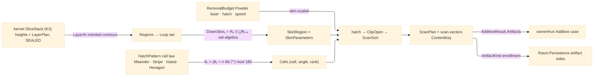

# [RASM_FABRICATION_SCANPATH]

The LPBF scan-path owner: ONE `Scan.Plan` fold over the kernel slice stack producing the per-layer vector program — hatch vectors, contour border passes, and point exposures — the `scan-vectors` content-keyed egress a powder-bed machine consumes. The hatch geometry is the `HatchPattern` `[Union]` (`Meander` whole-region parallel fill · `Stripe(width/overlap/stagger)` band-partitioned long-part fill · `Island(size/shift)` checkerboard thermal-stress partition · `Hexagon(cell)` tiled cellular fill) — four cell laws over ONE `Cells → Clip → Sort` pipeline, never four sibling generators. The inter-layer rotation is the recurrence `θₙ = (θ₀ + n·66.7°) mod 180°` (`ScanLaw.HatchAngleDeg` — the 66.7° increment maximizes the revisit period so no stripe/island seam stacks across layers). The sorter is TWO orthogonal axes composed as `ScanSort` — `ScanDirection` the direction-op (`keep`/`alternate`/`against-gas`) and `ScanOrdering` the ordering-op (`linear`/`nearest`/`thermal-spacing`) — never a flattened direction×order product enum. The skin partition is region set-algebra over the kernel contours: `DownSkinₙ = Rₙ \ ⋃Rₙ₋₁..ₙ₋ₖ`, `UpSkinₙ = Rₙ \ ⋃Rₙ₊₁..ₙ₊ₖ`, `InSkinₙ` the remainder — each `SkinRegion` row binding its `SkinParameters` (power/speed/hatch scales over the physics budget), so a down-skin melts cooler and slower off ONE policy map, never a per-skin generator. Island sequencing composes the ordering axis: checkerboard parity shift per layer plus the `thermal-spacing` greedy that maximizes the distance between consecutively melted cells.

The fold consumes the landed `Process/physics#CUT_PARAMETER` `RemovalBudget.Powder(LaserPower, HatchSpacing, ScanSpeed)` triple as the parameter floor — every emitted vector carries its skin-scaled power/speed, and the hatch pitch is `budget.HatchSpacing` under the policy and skin scales. The layer set arrives from the kernel `Slicing.Apply → Fin<SliceStack>` five-channel wire (contours ORIENTED, holes by parent depth) — adaptive layer HEIGHT stays the kernel `LayerPlan` height-law family (SEALED — this page never re-derives an elevation schedule, it walks `stack.Elevations` as given). Region Booleans route the ONE `Geometry2D/algebra#POLYGON_ALGEBRA` owner. The voxel/grayscale/`.cli` lane is `Additive/implicit`'s; this page is the METAL VECTOR lane, and its `scan-vectors` `EgressKind` key is the Persistence `ArtifactKind` enrollment row that rides this page. No new fault arm: an empty stack or a nonempty region yielding zero vectors is kernel `GeometryFault.DegenerateInput`, never a silent empty program.

Wire posture: HOST-LOCAL. The `ScanPlan` crosses only the in-process seam — its `ContentKey` rides `AdditiveResult.Artifacts` on the owner result and enrolls on the Persistence artifact index; the vector rows never sit between wire and rail.

## [01]-[INDEX]

- [01]-[SCAN_PATH]: owns the `SkinRegion`/`ScanDirection`/`ScanOrdering` axes, the `ScanLaw` rotation recurrence, the `HatchPattern` cell-law union, the `ScanSort`/`SkinParameters`/`ScanPolicy` policy rows, the `LayerGeometry` 3-case vector vocabulary, the `ScanLayer`/`ScanPlan` receipts, and the ONE `Scan.Plan` fold from kernel `SliceStack` to the content-keyed vector program.

## [02]-[SCAN_PATH]

- Owner: `SkinRegion` `[SmartEnum<string>]` (`down-skin`/`up-skin`/`in-skin`) the exposure-class axis; `ScanDirection` `[SmartEnum<string>]` (`keep`/`alternate`/`against-gas`) the direction-op axis; `ScanOrdering` `[SmartEnum<string>]` (`linear`/`nearest`/`thermal-spacing`) the ordering-op axis; `ScanLaw` the dependency-free recurrence anchor (`LayerRotationDeg = 66.7`, `HatchAngleDeg`, the sub-spot vector floor); `HatchPattern` `[Union]` the cell law (`Meander` · `Stripe` · `Island` · `Hexagon`); `ScanSort` the composed sorter pair; `SkinParameters` the per-skin power/speed/hatch scale row; `ScanPolicy` the ONE policy carrier (pattern, sort, `θ₀`, skin depth `k`, the `Map<SkinRegion, SkinParameters>`, contour passes, hatch inset, spacing scale); `LayerGeometry` `[Union]` (`Hatch` skin-tagged vector runs · `Contour` border ring passes · `Spot` point exposures) the machine-geometry vocabulary; `ScanLayer`/`ScanPlan` the typed receipts; `Scan` the static surface owning the ONE `Plan` fold.
- Cases: `HatchPattern` cases 4 — `Meander` one whole-plane cell at the layer angle; `Stripe(WidthMm, OverlapMm, StaggerMm)` bands perpendicular to the layer angle, band ends staggered per layer; `Island(SizeMm, ShiftMm)` the checkerboard grid shifted `ShiftMm` per layer with alternating ±90° cell angles and parity-first sequencing; `Hexagon(CellMm)` the hex tiling with per-cell axis rotation; `LayerGeometry` cases 3 (hatch | contour | point-exposure); `SkinRegion` rows 3 binding `SkinParameters` through the policy map (down-skin ~0.7 power/1.2 speed against dross, up-skin ~0.85/1.1 for surface finish, in-skin 1.0/1.0); the `(pattern × skin × ordering)` space is policy DATA over one pipeline — a new pattern is one union case + one `Cells` arm.
- Entry: `public static Fin<ScanPlan> Plan(SliceStack stack, ScanPolicy policy, RemovalBudget.Powder budget)` — the ONE entrypoint; the `SliceStack` IS the batch (all layers absorbed in one call, no per-layer sibling entry); `Fin<T>` routes kernel `GeometryFault.DegenerateInput` on an empty stack or a region set that hatches to zero vectors, lowered per `Process/faults#FAULT_BAND`; the result carries the elevation-ordered `ScanLayer` set and the `scan-vectors` `ContentKey`.
- Auto: `Plan` folds each layer: `Regions` lifts the kernel `LayerAt` closed oriented chains to `Loop`s (holes ride winding, parent depth preserved); `Partition` runs the skin set-algebra through `PolygonAlgebra.Clip(…, Difference)` at depth `k = policy.SkinDepth`; `Cells` expands the pattern union into `(cell, angle, rank)` rows at `ScanLaw.HatchAngleDeg(n, θ₀)`; each skin×cell intersection hatches at `budget.HatchSpacing · policy.HatchSpacingScale · skin.HatchScale`, clips through `PolygonAlgebra.ClipOpen`, and sorts under the `ScanSort` pair (direction op flips vectors, ordering op ranks them; `thermal-spacing` orders cells by max-min separation greedy); contour passes emit inward `PolygonAlgebra.Offset` rings before the hatch inset; every vector row carries its skin-scaled `PowerW`/`SpeedMmS` from the `Powder` budget; `Assemble` totals path length and build time and mints `ContentKey.Of(EgressKind.ScanVectors, …)` over the canonical little-endian layer/vector stream.
- Receipt: `ScanPlan` IS the typed evidence — per-layer `LayerGeometry` rows with vector counts and path lengths, the build-time estimate, and the content key; no generic scan ledger, no machine-dialect bytes (the vendor build-file writer is a boundary consumer of these rows, never an arm here).
- Packages: `Rasm.Meshing` (`Slicing.Apply → Fin<SliceStack>` K3 — `LayerAt`/`Elevations`/`Depth` walked as the layer truth; the height law stays kernel `LayerPlan`), `Geometry2D/algebra#POLYGON_ALGEBRA` (`Clip`/`ClipOpen`/`Offset` — the ONE Boolean owner), `Process/physics#CUT_PARAMETER` (`RemovalBudget.Powder` — the parameter floor), `Process/owner#FABRICATION_OWNER` (`Loop`/`Edge3`/`EgressKind.ScanVectors`/`ContentKey` atoms), Thinktecture.Runtime.Extensions (`[SmartEnum<string>]`/`[Union]`), LanguageExt.Core (`Fin`/`Seq`/`Map`), BCL inbox.
- Growth: a new hatch family (spiral, fractal, contour-parallel offset fill) is one `HatchPattern` case + one `Cells` arm over the same clip/sort pipeline; a new exposure class is one `SkinRegion` row + one `SkinParameters` map entry; a new ordering heuristic is one `ScanOrdering` row; per-region parameter overrides beyond skin class (e.g. lattice-thin-wall power) enter as `SkinParameters` map rows, never a second parameter carrier; the support-region hatch enters as a region set through the same fold (`Additive/support` feeds it); zero new surface.
- Boundary: `Scan` is the ONE LPBF vector owner and a per-pattern generator quartet is the deleted form — patterns are cell laws over one pipeline; the layer heights are the kernel `LayerPlan` family and an elevation schedule computed here is the SEALED-boundary violation; region Booleans route `PolygonAlgebra` and a scan-local Clipper call site is the named duplication defect; the sorter is the two-axis `ScanSort` pair and a flattened `MeanderAlternateLinear`-style product enum is the deleted form; the `.cli`/grayscale/voxel egress is `Additive/implicit`'s lane and a rasterizer here is the split-brain defect; power/speed/hatch scalars derive from the `Powder` budget row and an inline watt/speed literal in a fold body is the named defect; the content key mints through `ContentKey.Of` and a raw hasher is the second-hasher defect.

```csharp signature
// --- [RUNTIME_PRELUDE] ------------------------------------------------------------------------------------------------------------------------------
using LanguageExt;
using LanguageExt.Common;
using Rasm.Fabrication.Geometry2D;
using Rasm.Fabrication.Process;
using Rasm.Meshing;                       // SliceStack — the K3 kernel slice-stack wire; heights stay kernel LayerPlan
using Rasm.Numerics;
using Rhino.Geometry;
using Thinktecture;
using static LanguageExt.Prelude;

namespace Rasm.Fabrication.Additive;

// --- [TYPES] ----------------------------------------------------------------------------------------------------------------------------------------
[SmartEnum<string>]
public sealed partial class SkinRegion {
    public static readonly SkinRegion DownSkin = new("down-skin");
    public static readonly SkinRegion UpSkin = new("up-skin");
    public static readonly SkinRegion InSkin = new("in-skin");
}

// Direction-op × ordering-op: the sorter is TWO orthogonal axes, never a flattened product enum.
[SmartEnum<string>]
public sealed partial class ScanDirection {
    public static readonly ScanDirection Keep = new("keep");
    public static readonly ScanDirection Alternate = new("alternate");
    public static readonly ScanDirection AgainstGas = new("against-gas");
}

[SmartEnum<string>]
public sealed partial class ScanOrdering {
    public static readonly ScanOrdering Linear = new("linear");
    public static readonly ScanOrdering Nearest = new("nearest");
    public static readonly ScanOrdering ThermalSpacing = new("thermal-spacing");
}

// --- [CONSTANTS] ------------------------------------------------------------------------------------------------------------------------------------
public static class ScanLaw {
    public const double LayerRotationDeg = 66.7;    // θn = (θ0 + n·66.7°) mod 180 — the long-period rotation so no hatch seam stacks across layers
    public const double MinVectorMm = 0.05;         // sub-spot vectors drop (melt-pool spot ≈ 0.08-0.1 mm)

    public static double HatchAngleDeg(int layer, double theta0Deg) => (((theta0Deg + layer * LayerRotationDeg) % 180.0) + 180.0) % 180.0;
}

// --- [MODELS] ---------------------------------------------------------------------------------------------------------------------------------------
// Four cell laws over ONE Cells → Clip → Sort pipeline; parameters are case payloads, never policy knobs.
[Union(ConversionFromValue = ConversionOperatorsGeneration.None)]
public abstract partial record HatchPattern {
    private HatchPattern() { }

    public sealed record Meander : HatchPattern;
    public sealed record Stripe(double WidthMm, double OverlapMm, double StaggerMm) : HatchPattern;
    public sealed record Island(double SizeMm, double ShiftMm) : HatchPattern;
    public sealed record Hexagon(double CellMm) : HatchPattern;
}

public readonly record struct ScanSort(ScanDirection Direction, ScanOrdering Ordering);

public readonly record struct SkinParameters(double PowerScale, double SpeedScale, double HatchScale);

public sealed record ScanPolicy(
    HatchPattern Pattern,
    ScanSort Sort,
    double Theta0Deg,
    int SkinDepth,                                  // k in DownSkinₙ = Rₙ \ ⋃Rₙ₋₁..ₙ₋ₖ (and the UpSkin mirror)
    Map<SkinRegion, SkinParameters> Skins,
    int ContourPasses,
    double ContourOffsetMm,
    double HatchSpacingScale) {
    public static ScanPolicy Lpbf(HatchPattern pattern) => new(
        pattern, new ScanSort(ScanDirection.Alternate, ScanOrdering.Linear), Theta0Deg: 57.0, SkinDepth: 3,
        Map((SkinRegion.DownSkin, new SkinParameters(0.70, 1.20, 0.90)),
            (SkinRegion.UpSkin, new SkinParameters(0.85, 1.10, 0.95)),
            (SkinRegion.InSkin, new SkinParameters(1.00, 1.00, 1.00))),
        ContourPasses: 2, ContourOffsetMm: 0.12, HatchSpacingScale: 1.0);
}

[Union(ConversionFromValue = ConversionOperatorsGeneration.None)]
public abstract partial record LayerGeometry {
    private LayerGeometry() { }

    public sealed record Hatch(SkinRegion Skin, Seq<Edge3> Vectors, double PowerW, double SpeedMmS) : LayerGeometry;
    public sealed record Contour(Loop Ring, int Pass, double PowerW, double SpeedMmS) : LayerGeometry;
    public sealed record Spot(Point3d At, double DwellUs) : LayerGeometry;
}

public sealed record ScanLayer(int Layer, double Elevation, Seq<LayerGeometry> Geometry, int VectorCount, double PathMm);

public sealed record ScanPlan(Seq<ScanLayer> Layers, double TotalPathM, double EstimatedBuildS, ContentKey Key);

// --- [OPERATIONS] -----------------------------------------------------------------------------------------------------------------------------------
public static class Scan {
    public static Fin<ScanPlan> Plan(SliceStack stack, ScanPolicy policy, RemovalBudget.Powder budget) =>
        stack.LayerCount == 0
            ? Fin.Fail<ScanPlan>(GeometryFault.DegenerateInput("scan:empty-slice-stack").ToError())
            : toSeq(Enumerable.Range(0, stack.LayerCount))
                .Map(n => Layer(stack, n, policy, budget))
                .Sequence()
                .Bind(Assemble);

    static Fin<ScanLayer> Layer(SliceStack stack, int n, ScanPolicy policy, RemovalBudget.Powder budget) {
        Seq<Loop> region = Regions(stack, n);
        if (region.IsEmpty) return Fin.Succ(new ScanLayer(n, stack.Elevations[n], Seq<LayerGeometry>(), 0, 0.0));
        double angle = ScanLaw.HatchAngleDeg(n, policy.Theta0Deg);
        Seq<Loop> hatchBound = PolygonAlgebra
            .Offset(region, -(policy.ContourPasses * policy.ContourOffsetMm), OffsetEnds.Polygon).IfFail(region);
        Seq<LayerGeometry> borders = Borders(region, policy, budget);
        Map<SkinRegion, Seq<Loop>> skins = Partition(stack, n, policy.SkinDepth);
        Seq<LayerGeometry> hatches = skins.ToSeq().Bind(skin =>
            HatchSkin(skin.Key, PolygonAlgebra.Clip(skin.Value, hatchBound, ClipOp.Intersect).IfFail(Seq<Loop>()), n, angle, policy, budget));
        Seq<LayerGeometry> geometry = borders.Concat(hatches);
        double path = geometry.Map(Length).Sum();
        int vectors = geometry.Map(static g => g switch { LayerGeometry.Hatch h => h.Vectors.Count, _ => 1 }).Sum();
        return vectors == 0 && !region.IsEmpty && policy.ContourPasses == 0
            ? Fin.Fail<ScanLayer>(GeometryFault.DegenerateInput($"scan:zero-vectors:layer-{n}").ToError())
            : Fin.Succ(new ScanLayer(n, stack.Elevations[n], geometry, vectors, path));
    }

    // --- [SKIN_PARTITION]
    // DownSkinₙ = Rₙ \ ⋃Rₙ₋₁..ₙ₋ₖ · UpSkinₙ = Rₙ \ ⋃Rₙ₊₁..ₙ₊ₖ · InSkinₙ = Rₙ \ (Down ∪ Up);
    // layer 0 is all down-skin (plate-facing).
    static Map<SkinRegion, Seq<Loop>> Partition(SliceStack stack, int n, int k) {
        Seq<Loop> rn = Regions(stack, n);
        Seq<Loop> below = toSeq(Enumerable.Range(Math.Max(0, n - k), Math.Min(k, n))).Bind(i => Regions(stack, i));
        Seq<Loop> above = toSeq(Enumerable.Range(n + 1, Math.Max(0, Math.Min(k, stack.LayerCount - n - 1)))).Bind(i => Regions(stack, i));
        Seq<Loop> down = n == 0 ? rn : PolygonAlgebra.Clip(rn, below, ClipOp.Difference).IfFail(Seq<Loop>());
        Seq<Loop> up = PolygonAlgebra.Clip(rn, above, ClipOp.Difference).IfFail(Seq<Loop>());
        Seq<Loop> core = PolygonAlgebra.Clip(PolygonAlgebra.Clip(rn, down, ClipOp.Difference).IfFail(rn), up, ClipOp.Difference).IfFail(Seq<Loop>());
        return Map((SkinRegion.DownSkin, down), (SkinRegion.UpSkin, up), (SkinRegion.InSkin, core));
    }

    // --- [CELL_LAWS]
    // Every pattern is (cell loops, cell angle, sequence rank) rows over the layer bound; the hatch/clip/sort pipeline is shared.
    static Seq<(Seq<Loop> Cell, double AngleDeg, int Rank)> Cells(HatchPattern pattern, BoundingBox bound, int layer, double angleDeg) =>
        pattern.Switch(
            state:   (bound, layer, angleDeg),
            meander: static s => Seq((Plane(s.bound), s.angleDeg, 0)),
            stripe:  static (s, p) => Bands(s.bound, s.angleDeg, p.WidthMm, p.OverlapMm, p.StaggerMm * s.layer)
                                          .Map((i, band) => (band, s.angleDeg, i)).ToSeq(),
            island:  static (s, p) => Grid(s.bound, p.SizeMm, p.ShiftMm * s.layer)
                                          .Map((i, cell) => (cell.Cell, s.angleDeg + (cell.Parity ? 90.0 : 0.0), ParityRank(i, cell.Parity))).ToSeq(),
            hexagon: static (s, p) => Hexes(s.bound, p.CellMm).Map((i, hex) => (hex, s.angleDeg + (i % 3) * 60.0, i)).ToSeq());

    static Seq<LayerGeometry> HatchSkin(SkinRegion skin, Seq<Loop> region, int layer, double angleDeg, ScanPolicy policy, RemovalBudget.Powder budget) {
        if (region.IsEmpty) return Seq<LayerGeometry>();
        SkinParameters p = policy.Skins.Find(skin).IfNone(new SkinParameters(1.0, 1.0, 1.0));
        double spacing = Math.Max(budget.HatchSpacing * policy.HatchSpacingScale * p.HatchScale, 1e-3);
        BoundingBox bound = new(region.Bind(static l => toSeq(l.Vertices)));
        Seq<Edge3> vectors = OrderCells(Cells(policy.Pattern, bound, layer, angleDeg), policy.Sort.Ordering)
            .Bind(cell => {
                Seq<Loop> cut = PolygonAlgebra.Clip(cell.Cell, region, ClipOp.Intersect).IfFail(Seq<Loop>());
                return cut.IsEmpty
                    ? Seq<Edge3>()
                    : Sortie(Rays(bound, cell.AngleDeg, spacing).Bind(ray => PolygonAlgebra.ClipOpen(ray, cut).Inside), policy.Sort);
            })
            .Filter(static v => v.A.DistanceTo(v.B) >= ScanLaw.MinVectorMm);
        return vectors.IsEmpty
            ? Seq<LayerGeometry>()
            : Seq((LayerGeometry)new LayerGeometry.Hatch(skin, vectors, budget.LaserPower * p.PowerScale, budget.ScanSpeed * p.SpeedScale));
    }

    static Seq<LayerGeometry> Borders(Seq<Loop> region, ScanPolicy policy, RemovalBudget.Powder budget) =>
        toSeq(Enumerable.Range(0, policy.ContourPasses)).Bind(pass =>
            PolygonAlgebra.Offset(region, -pass * policy.ContourOffsetMm, OffsetEnds.Polygon).IfFail(Seq<Loop>())
                .Map(ring => (LayerGeometry)new LayerGeometry.Contour(ring, pass, budget.LaserPower, budget.ScanSpeed)));

    // --- [SORTER]
    // Direction op flips individual vectors; ordering op ranks cells/vectors; thermal-spacing is the max-min-distance greedy.
    static Seq<Edge3> Sortie(Seq<Edge3> vectors, ScanSort sort) {
        Seq<Edge3> ordered = sort.Ordering.Switch(
            state:          vectors,
            linear:         static v => v,
            nearest:        static v => GreedyNearest(v),
            thermalSpacing: static v => MaxMinSpread(v));
        return sort.Direction.Switch(
            state:      ordered,
            keep:       static v => v,
            alternate:  static v => v.Map((i, e) => i % 2 == 1 ? new Edge3(e.B, e.A) : e).ToSeq(),
            againstGas: static v => v.Map(static e => e.B.X < e.A.X ? e : new Edge3(e.B, e.A)));   // gas flow +X: melt travels against it
    }

    static Fin<ScanPlan> Assemble(Seq<ScanLayer> layers) {
        double pathMm = layers.Map(static l => l.PathMm).Sum();
        double seconds = layers.Bind(static l => l.Geometry).Map(static g => g switch {
            LayerGeometry.Hatch h => Length(h) / Math.Max(h.SpeedMmS, 1e-3),
            LayerGeometry.Contour c => Length(c) / Math.Max(c.SpeedMmS, 1e-3),
            LayerGeometry.Spot s => s.DwellUs * 1e-6,
            _ => 0.0 }).Sum();
        return Fin.Succ(new ScanPlan(layers, pathMm / 1000.0, seconds, ContentKey.Of(EgressKind.ScanVectors, Canonical(layers))));
    }

    // --- [CELL_PRIMITIVES]
    static Seq<Loop> Plane(BoundingBox b) =>
        Seq(new Loop(
            Arr(new Point3d(b.Min.X, b.Min.Y, 0), new Point3d(b.Max.X, b.Min.Y, 0), new Point3d(b.Max.X, b.Max.Y, 0), new Point3d(b.Min.X, b.Max.Y, 0)),
            Closed: true));

    static Seq<Seq<Loop>> Bands(BoundingBox b, double angleDeg, double width, double overlap, double stagger) {
        double rad = angleDeg * Math.PI / 180.0, diag = b.Min.DistanceTo(b.Max);
        Vector3d step = new(-Math.Sin(rad), Math.Cos(rad), 0.0);
        Point3d centre = (b.Min + b.Max) * 0.5 + (stagger % Math.Max(width, 1e-3)) * step;
        int count = Math.Max(1, (int)Math.Ceiling(diag / Math.Max(width, 1e-3)));
        return toSeq(Enumerable.Range(-count, 2 * count + 1)).Map(i =>
            Band(centre + i * width * step, rad, diag, width + overlap));
    }

    static Seq<Loop> Band(Point3d mid, double rad, double diag, double width) {
        Vector3d dir = new(Math.Cos(rad), Math.Sin(rad), 0.0);
        Vector3d across = new(-Math.Sin(rad), Math.Cos(rad), 0.0);
        return Seq(new Loop(Arr(
            mid - 0.5 * diag * dir - 0.5 * width * across, mid + 0.5 * diag * dir - 0.5 * width * across,
            mid + 0.5 * diag * dir + 0.5 * width * across, mid - 0.5 * diag * dir + 0.5 * width * across), Closed: true));
    }

    static Seq<(Seq<Loop> Cell, bool Parity)> Grid(BoundingBox b, double size, double shift) {
        double s = Math.Max(size, 1e-3), ox = b.Min.X + shift % s, oy = b.Min.Y + shift % s;
        int nx = (int)Math.Ceiling((b.Max.X - ox) / s) + 1, ny = (int)Math.Ceiling((b.Max.Y - oy) / s) + 1;
        return toSeq(Enumerable.Range(0, nx * ny)).Map(k => {
            int i = k % nx, j = k / nx;
            Point3d lo = new(ox + (i - 1) * s, oy + (j - 1) * s, 0.0);
            Loop cell = new(Arr(lo, new Point3d(lo.X + s, lo.Y, 0), new Point3d(lo.X + s, lo.Y + s, 0), new Point3d(lo.X, lo.Y + s, 0)), Closed: true);
            return (Seq(cell), (i + j) % 2 == 0);
        });
    }

    static Seq<Seq<Loop>> Hexes(BoundingBox b, double cell) {
        double s = Math.Max(cell, 1e-3), h = s * Math.Sqrt(3.0) / 2.0;
        int nx = (int)Math.Ceiling((b.Max.X - b.Min.X) / (1.5 * s)) + 1, ny = (int)Math.Ceiling((b.Max.Y - b.Min.Y) / (2.0 * h)) + 1;
        return toSeq(Enumerable.Range(0, nx * ny)).Map(k => {
            int i = k % nx, j = k / nx;
            Point3d c = new(b.Min.X + i * 1.5 * s, b.Min.Y + j * 2.0 * h + (i % 2 == 1 ? h : 0.0), 0.0);
            return Seq(new Loop(toArr(Enumerable.Range(0, 6).Select(v =>
                new Point3d(c.X + s * Math.Cos(v * Math.PI / 3.0), c.Y + s * Math.Sin(v * Math.PI / 3.0), 0.0))), Closed: true));
        });
    }

    static int ParityRank(int i, bool parity) => parity ? i : i + (1 << 20);   // checkerboard: even-parity cells melt first, odd cells the pass after

    static Seq<Edge3> Rays(BoundingBox b, double angleDeg, double spacing) {
        double rad = angleDeg * Math.PI / 180.0, diag = b.Min.DistanceTo(b.Max);
        Point3d centre = (b.Min + b.Max) * 0.5;
        Vector3d dir = new(Math.Cos(rad), Math.Sin(rad), 0.0);
        Vector3d step = new(-Math.Sin(rad), Math.Cos(rad), 0.0);
        int lines = Math.Max(1, (int)Math.Ceiling(diag / spacing));
        return toSeq(Enumerable.Range(-lines, 2 * lines + 1)).Map(i => {
            Point3d mid = centre + i * spacing * step;
            return new Edge3(mid - 0.5 * diag * dir, mid + 0.5 * diag * dir);
        });
    }

    // --- [ORDERING_PRIMITIVES]
    static Seq<(Seq<Loop> Cell, double AngleDeg, int Rank)> OrderCells(Seq<(Seq<Loop> Cell, double AngleDeg, int Rank)> cells, ScanOrdering ordering) =>
        ordering == ScanOrdering.ThermalSpacing ? MaxMinCells(cells) : cells.OrderBy(static c => c.Rank).ToSeq();

    static Seq<(Seq<Loop> Cell, double AngleDeg, int Rank)> MaxMinCells(Seq<(Seq<Loop> Cell, double AngleDeg, int Rank)> cells) {
        var pool = cells.ToList();
        var ordered = new System.Collections.Generic.List<(Seq<Loop>, double, int)>();
        while (pool.Count > 0) {
            int pick = ordered.Count == 0 ? 0 : IndexOfFarthest(pool, ordered);
            ordered.Add(pool[pick]);
            pool.RemoveAt(pick);
        }
        return toSeq(ordered).Map(static c => ((Seq<Loop>)c.Item1, c.Item2, c.Item3));
    }

    static Seq<Edge3> GreedyNearest(Seq<Edge3> v) {
        var pool = v.ToList();
        var ordered = new System.Collections.Generic.List<Edge3>();
        Point3d head = pool.Count > 0 ? pool[0].A : Point3d.Origin;
        while (pool.Count > 0) {
            int best = 0; double d = double.MaxValue;
            for (int i = 0; i < pool.Count; i++) { double di = head.DistanceTo(pool[i].A); if (di < d) { d = di; best = i; } }
            ordered.Add(pool[best]); head = pool[best].B; pool.RemoveAt(best);
        }
        return toSeq(ordered);
    }

    // Interleave halves: consecutive melts stay thermally apart.
    static Seq<Edge3> MaxMinSpread(Seq<Edge3> v) =>
        v.Map((i, e) => (e, rank: (i % 2) * v.Count + i / 2)).OrderBy(static t => t.rank).Map(static t => t.e).ToSeq();

    // --- [BOUNDARIES]
    static Seq<Loop> Regions(SliceStack stack, int n) =>
        stack.LayerAt(n).Filter(static c => c.Closed)
            .Map(static c => new Loop(toArr(c.Polyline.SkipLast(1).Select(static p => new Point3d(p.X, p.Y, p.Z))), Closed: true));

    static double Length(LayerGeometry g) => g switch {
        LayerGeometry.Hatch h => h.Vectors.Map(static e => e.A.DistanceTo(e.B)).Sum(),
        LayerGeometry.Contour c => toSeq(Enumerable.Range(0, c.Ring.Count)).Map(i => c.Ring.At(i).DistanceTo(c.Ring.At(i + 1))).Sum(),
        _ => 0.0 };

    // Canonical little-endian (layer, x0, y0, x1, y1) stream — the scan-vectors content-key bytes.
    static byte[] Canonical(Seq<ScanLayer> layers) {
        using var buffer = new System.IO.MemoryStream();
        using var writer = new System.IO.BinaryWriter(buffer);
        foreach (ScanLayer layer in layers) {
            writer.Write(layer.Layer);
            foreach (LayerGeometry g in layer.Geometry)
                if (g is LayerGeometry.Hatch h)
                    foreach (Edge3 e in h.Vectors) { writer.Write(e.A.X); writer.Write(e.A.Y); writer.Write(e.B.X); writer.Write(e.B.Y); }
        }
        return buffer.ToArray();
    }

    static int IndexOfFarthest(System.Collections.Generic.List<(Seq<Loop> Cell, double AngleDeg, int Rank)> pool,
                               System.Collections.Generic.List<(Seq<Loop>, double, int)> ordered) {
        int best = 0; double bestD = -1.0;
        for (int i = 0; i < pool.Count; i++) {
            Point3d c = Centroid(pool[i].Cell);
            double d = ordered.Min(o => Centroid(o.Item1).DistanceTo(c));
            if (d > bestD) { bestD = d; best = i; }
        }
        return best;
    }

    static Point3d Centroid(Seq<Loop> cell) {
        Seq<Point3d> pts = cell.Bind(static l => toSeq(l.Vertices));
        return pts.IsEmpty ? Point3d.Origin : new Point3d(pts.Map(static p => p.X).Sum() / pts.Count, pts.Map(static p => p.Y).Sum() / pts.Count, 0.0);
    }
}
```


