# [RASM_FABRICATION_SCANPATH]

The LPBF scan-path owner is ONE `Scan.Plan` fold over the kernel slice stack producing the per-layer vector program — hatch vectors, contour border passes, and point exposures — the `scan-vectors` content-keyed egress a powder-bed machine consumes. The hatch geometry is the `HatchPattern` union (`Meander` whole-region parallel fill · `Stripe(width/overlap/stagger)` band-partitioned long-part fill · `Island(size/shift)` checkerboard thermal-stress partition · `Hexagon(cell)` tiled cellular fill · `Generated(cells)` parameterized extension) — five cell laws over ONE `Cells → Clip → Sort` pipeline, never sibling generators. `ScanLaw.HatchAngleDeg` projects the policy-carried rotation recurrence, while `ScanSort` composes direction (`Keep` · `Alternate` · `AgainstGas(bearing)`) and ordering (`Linear` · `Nearest` · `ThermalSpacing` · `Generated(order)`) as orthogonal payload-bearing axes. The generated ordering receives measured centroids and must return one permutation, so custom thermal, recoater, gas, and field-aware policies reuse the same cell/vector rail without bypassing clipping. The exposure partition is region set-algebra over the hole-carrying `SliceRegion` atom: `DownSkinₙ`, `UpSkinₙ` (down-skin wins the thin-web overlap), `InSkinₙ`, `Contour`, `SupportSparse`, and `SupportInterface` each bind a complete `SkinParameters` row. A hatch vector shorter than `ScanPolicy.MinVectorMm` demotes to a `Spot` carrying its class, power, and energy-equivalent dwell; it never silently disappears.

The fold consumes the `Process/physics` `ProcessBudget.Powder(LaserPower, HatchSpacing, ScanSpeed)` triple as the parameter floor — every emitted vector carries its skin-scaled power/speed, and the hatch pitch is `budget.HatchSpacing` under the policy and skin scales. The layer set arrives from the kernel `Slicing.Apply → Fin<SliceStack>` five-channel wire — adaptive layer HEIGHT stays the kernel `LayerPlan` height-law family (SEALED — this page never re-derives an elevation schedule, it walks `stack.Elevations` as given), and holes arrive through `SliceRegion.Of` `Depth` parity so a bore never hatches. Region Booleans route the ONE `Geometry2D/algebra` owner through the region atom. The voxel/grayscale/`.cli` lane is `Additive/implicit`'s; this page is the METAL VECTOR lane, reached from `owner#run` through the `AdditivePolicy.Scan` case that CARRIES the narrowed `Powder` budget. The `scan-vectors` `ContentKey` mints over the COMPLETE program — layer ordinal, elevation, every geometry case with its skin class, power, speed, and dwell — so two programs differing in any process-relevant byte never share a key. No new fault arm: an empty stack or a nonempty region yielding zero geometry is kernel `GeometryFault.DegenerateInput`, never a silent empty program.

Wire posture: HOST-LOCAL. The `ScanPlan` crosses only the in-process seam — its `ContentKey` rides `AdditiveResult.Artifacts` on the owner result and enrolls on the Persistence artifact index; the vector rows never sit between wire and rail.

## [01]-[INDEX]

- [01]-[SCAN_PATH]: owns the `SkinRegion`/`ScanDirection`/`ScanOrdering` axes, the `ScanLaw` rotation recurrence, the `HatchPattern` cell-law union, the `ScanSort`/`SkinParameters`/`ScanPolicy` policy rows, the `LayerGeometry` 3-case vector vocabulary with the sub-spot `Spot` demotion, the `ScanLayer`/`ScanPlan` receipts, and the ONE `Scan.Plan` fold from kernel `SliceStack` plus optional `SupportPlan` to the content-keyed vector program.

## [02]-[SCAN_PATH]

- Owner: `SkinRegion` `[SmartEnum<string>]` (`down-skin`/`up-skin`/`in-skin`/`contour`/`support-sparse`/`support-interface`) the exposure-class axis; payload-bearing `ScanDirection` and `ScanOrdering` the orthogonal sorter axes; `ScanLaw` the recurrence projection; `HatchPattern` `[Union]` the cell law; `ScanSort` the composed sorter pair; `SkinParameters` the per-class power/speed/hatch row; `ScanPolicy` the ONE policy carrier, including rotation, minimum-vector, jump, layer-delay, and recoat timing values; `LayerGeometry` `[Union]` (`Hatch` · `Contour` · `Spot`) the machine-geometry vocabulary; `ScanLayer`/`ScanPlan` the typed receipts; `Scan` the static surface owning the ONE `Plan` fold.
- Cases: `HatchPattern` cases 5 — `Meander`, `Stripe`, `Island`, `Hexagon`, and the parameterized `Generated` cell law; `ScanOrdering` cases 4 — linear rank, nearest traversal, max-min thermal spacing, and parameterized generated permutation; `LayerGeometry` cases 3 — `Hatch`, `Contour`, and generated `Spot`; `SkinRegion` rows 6 bind complete `SkinParameters` — the contour border class scales its own power/speed, and sparse support and dense interface exposure stay distinct rows.
- Entry: `public static Fin<ScanPlan> Plan(SliceStack stack, ScanPolicy policy, ProcessBudget.Powder budget, Option<SupportPlan> support = default)` — the ONE batch entry; the support plan contributes sparse and interface exposure classes, and every geometry/offset failure remains on `Fin`.
- Auto: `Plan` rejects open contours through `Slice.Gate`, then folds each layer. `SliceRegion.Of` lifts the kernel forest (holes by `Depth` parity — a bore's interior never hatches); `Partition` seeds direct adjacent-layer exposure and projects those seeds through depth `k = policy.SkinDepth`, so a reappearing island remains exposed instead of becoming false core, then merges the layer's sparse and interface support rows as distinct classes. `Cells` expands every built-in or generated pattern into `(cell, angle, rank)` rows at `ScanLaw.HatchAngleDeg(n, θ₀)`; each class×cell intersection hatches at `budget.HatchSpacing · policy.HatchSpacingScale · class.HatchScale`, clips through `SliceRegion.Rays`, and sorts under the `ScanSort` pair. `AgainstGas.BearingDeg` carries the gas direction only for that operation, and `ThermalSpacing` uses the ONE `MaxMinOrder` greedy at cell and vector altitude. Sub-spot survivors demote to `Spot` exposures; contour passes emit inward offset rings before the hatch inset; every vector row carries its class-scaled `PowerW`/`SpeedMmS` from the `Powder` budget; `Assemble` totals path length and build time and mints `ContentKey.Of(EgressKind.ScanVectors, …)` over the payload-complete little-endian program stream.
- Receipt: `ScanPlan` IS the typed evidence — per-layer `LayerGeometry` rows with vector counts and path lengths, the build-time estimate, and the content key; no generic scan ledger, no machine-dialect bytes (the vendor build-file writer is a boundary consumer of these rows, never an arm here).
- Packages: `Rasm.Meshing` (`SliceStack`), `Additive/slicing` (`SliceRegion`, `Slice.Gate`), `Additive/support` (`SupportPlan`/`SupportLayer`), `Geometry2D/algebra` (`Clip`/`ClipOpen`/`Offset`), `Process/physics` (`ProcessBudget.Powder`), `Process/owner` (`Loop`/`Edge3`/`EgressKind.ScanVectors`/`ContentKey`), CommunityToolkit.HighPerformance (`ArrayPoolBufferWriter<byte>`), System.Numerics.Tensors (`TensorPrimitives.Distance` in the measured thermal-ordering kernel), `Rasm.Numerics` (`GeometryFault`, `Context.Millimeters`), Thinktecture.Runtime.Extensions, LanguageExt.Core, BCL inbox.
- Growth: a new cell-generated hatch is one `HatchPattern.Generated` value over the existing clip/sort rail; a hatch with distinct payload or execution semantics is one `HatchPattern` case plus one `Cells` arm; a new exposure class is one `SkinRegion` row plus one complete `SkinParameters` map entry; an experimental ordering heuristic is one `ScanOrdering.Generated` value returning a complete permutation, while a settled shared heuristic may become one named case; per-region parameter overrides beyond the class axis enter as `SkinParameters` map rows, never a second parameter carrier; zero new surface.
- Boundary: `Scan` is the ONE LPBF vector owner and a per-pattern generator quartet is the deleted form — patterns are cell laws over one pipeline; the layer heights are the kernel `LayerPlan` family and an elevation schedule computed here is the SEALED-boundary violation; region Booleans route `PolygonAlgebra` through `SliceRegion` and a scan-local Clipper call site or a hole-blind region set is the named duplication defect; the sorter is the two-axis `ScanSort` pair and a flattened `MeanderAlternateLinear`-style product enum is the deleted form; the gas bearing is `ScanDirection.AgainstGas` payload and a global bearing knob or inline `+X` literal is the named defect; the `.cli`/grayscale/voxel egress is `Additive/implicit`'s lane and a rasterizer here is the split-brain defect; power/speed/hatch scalars derive from the `Powder` budget row and an inline watt/speed literal in a fold body is the named defect; the content key covers the COMPLETE program and a hatch-only digest is the byte-identity defect; the content key mints through `ContentKey.Of` and a raw hasher is the second-hasher defect.

```csharp signature
// --- [RUNTIME_PRELUDE] ------------------------------------------------------------------------------------------------------------------------------
using CommunityToolkit.HighPerformance.Buffers;
using LanguageExt;
using LanguageExt.Common;
using System.Numerics.Tensors;
using Rasm.Fabrication.Geometry2D;
using Rasm.Fabrication.Process;
using Rasm.Meshing;                       // SliceStack — the K3 kernel slice-stack wire; heights stay kernel LayerPlan
using Rasm.Numerics;
using Rhino.Geometry;
using Thinktecture;
using static LanguageExt.Prelude;

namespace Rasm.Fabrication.Additive;

// --- [TYPES] ----------------------------------------------------------------------------------------------------------------------------------------
// The exposure-class axis: support regions are a CLASS here, hatched by the same fold under their own row.
[SmartEnum<string>]
public sealed partial class SkinRegion {
    public static readonly SkinRegion DownSkin = new("down-skin");
    public static readonly SkinRegion UpSkin = new("up-skin");
    public static readonly SkinRegion InSkin = new("in-skin");
    public static readonly SkinRegion Contour = new("contour");
    public static readonly SkinRegion SupportSparse = new("support-sparse");
    public static readonly SkinRegion SupportInterface = new("support-interface");
}

// Direction-op × ordering-op: the sorter is TWO orthogonal axes, never a flattened product enum.
[Union(ConversionFromValue = ConversionOperatorsGeneration.None)]
public abstract partial record ScanDirection {
    private ScanDirection() { }

    public sealed record Keep : ScanDirection;
    public sealed record Alternate : ScanDirection;
    public sealed record AgainstGas(double BearingDeg) : ScanDirection;
}

[Union(ConversionFromValue = ConversionOperatorsGeneration.None)]
public abstract partial record ScanOrdering {
    private ScanOrdering() { }

    public sealed record Linear : ScanOrdering;
    public sealed record Nearest : ScanOrdering;
    public sealed record ThermalSpacing : ScanOrdering;
    public sealed record Generated(Func<Seq<Point3d>, Fin<Seq<int>>> Order) : ScanOrdering;
}

// --- [CONSTANTS] ------------------------------------------------------------------------------------------------------------------------------------
public static class ScanLaw {
    public static double HatchAngleDeg(int layer, double theta0Deg, double rotationDeg) =>
        (((theta0Deg + layer * rotationDeg) % 180.0) + 180.0) % 180.0;
}

// --- [MODELS] ---------------------------------------------------------------------------------------------------------------------------------------
// Five cell laws over ONE Cells → Clip → Sort pipeline; parameters are case payloads, never policy knobs.
[Union(ConversionFromValue = ConversionOperatorsGeneration.None)]
public abstract partial record HatchPattern {
    private HatchPattern() { }

    public sealed record Meander : HatchPattern;
    public sealed record Stripe(double WidthMm, double OverlapMm, double StaggerMm) : HatchPattern;
    public sealed record Island(double SizeMm, double ShiftMm) : HatchPattern;
    public sealed record Hexagon(double CellMm) : HatchPattern;
    public sealed record Generated(
        Func<BoundingBox, int, double, Fin<Seq<(Seq<Loop> Cell, double AngleDeg, int Rank)>>> Cells) : HatchPattern;
}

public readonly record struct ScanSort(ScanDirection Direction, ScanOrdering Ordering);

public readonly record struct SkinParameters(double PowerScale, double SpeedScale, double HatchScale);

public sealed record ScanPolicy(
    HatchPattern Pattern,
    ScanSort Sort,
    double Theta0Deg,
    int SkinDepth,                                  // propagation depth for direct adjacent-layer exposure seeds
    Map<SkinRegion, SkinParameters> Skins,
    int ContourPasses,
    double ContourOffsetMm,
    double HatchSpacingScale,
    double LayerRotationDeg,
    double MinVectorMm,
    double JumpSpeedMmS,
    double LayerDelayS,
    double RecoatDelayS,
    OffsetPolicy Offset) {
    public static Fin<ScanPolicy> Lpbf(HatchPattern pattern) =>
        OffsetPolicy.Admit(OffsetJoin.Miter, OffsetEnd.Polygon, miterLimit: 2.0, arcTolerance: 0.01)
            .Map(offset => new ScanPolicy(
                pattern, new ScanSort(new ScanDirection.Alternate(), new ScanOrdering.Linear()), Theta0Deg: 57.0, SkinDepth: 3,
                Map((SkinRegion.DownSkin, new SkinParameters(0.70, 1.20, 0.90)),
                    (SkinRegion.UpSkin, new SkinParameters(0.85, 1.10, 0.95)),
                    (SkinRegion.InSkin, new SkinParameters(1.00, 1.00, 1.00)),
                    (SkinRegion.Contour, new SkinParameters(0.90, 0.85, 1.00)),
                    (SkinRegion.SupportSparse, new SkinParameters(0.60, 1.30, 1.20)),
                    (SkinRegion.SupportInterface, new SkinParameters(0.75, 1.10, 0.85))),
                ContourPasses: 2, ContourOffsetMm: 0.12, HatchSpacingScale: 1.0,
                LayerRotationDeg: 66.7, MinVectorMm: 0.05, JumpSpeedMmS: 5000.0, LayerDelayS: 0.05, RecoatDelayS: 1.8,
                offset));
}

[Union(ConversionFromValue = ConversionOperatorsGeneration.None)]
public abstract partial record LayerGeometry {
    private LayerGeometry() { }

    public sealed record Hatch(SkinRegion Skin, Seq<Edge3> Vectors, double PowerW, double SpeedMmS) : LayerGeometry;
    public sealed record Contour(Loop Ring, int Pass, double PowerW, double SpeedMmS) : LayerGeometry;
    public sealed record Spot(SkinRegion Skin, Point3d At, double PowerW, double DwellUs) : LayerGeometry;
}

public sealed record ScanLayer(
    int Layer, double Elevation, Seq<LayerGeometry> Geometry, int VectorCount, int ContourCount, int SpotCount, double PathMm);

public sealed record ScanPlan(Seq<ScanLayer> Layers, double TotalPathM, double EstimatedBuildS, ContentKey Key);

// --- [OPERATIONS] -----------------------------------------------------------------------------------------------------------------------------------
public static class Scan {
    // Layers are independent after the shared gate: the applicative traverse reports EVERY failing layer at once.
    public static Fin<ScanPlan> Plan(SliceStack stack, ScanPolicy policy, ProcessBudget.Powder budget, Option<SupportPlan> support = default) =>
        stack.LayerCount == 0
            ? Fin.Fail<ScanPlan>(GeometryFault.DegenerateInput("scan:empty-slice-stack").ToError())
            : from closed in Slice.Gate(stack, OpenSheetPolicy.Reject)
              from admitted in Admit(policy, budget)
              from tolerance in Context.Millimeters().ToFin()
              from layers in toSeq(Enumerable.Range(0, stack.LayerCount))
                .Map(n => Layer(stack, n, policy, budget, support, tolerance).ToValidation())
                .Traverse(identity)
                .As()
                .ToFin()
              from plan in Assemble(layers, policy)
              select plan;

    private static Fin<Unit> Admit(ScanPolicy policy, ProcessBudget.Powder budget) {
        Seq<SkinRegion> classes = Seq(
            SkinRegion.DownSkin,
            SkinRegion.UpSkin,
            SkinRegion.InSkin,
            SkinRegion.Contour,
            SkinRegion.SupportSparse,
            SkinRegion.SupportInterface);
        bool complete = classes.ForAll(skin => policy.Skins.Find(skin).Exists(static row =>
            double.IsFinite(row.PowerScale) && row.PowerScale > 0.0
            && double.IsFinite(row.SpeedScale) && row.SpeedScale > 0.0
            && double.IsFinite(row.HatchScale) && row.HatchScale > 0.0));
        bool pattern = policy.Pattern.Switch(
            meander: static () => true,
            stripe: static row => row.WidthMm > 0.0 && row.OverlapMm is >= 0.0 && row.OverlapMm < row.WidthMm && double.IsFinite(row.StaggerMm),
            island: static row => row.SizeMm > 0.0 && double.IsFinite(row.ShiftMm),
            hexagon: static row => row.CellMm > 0.0,
            generated: static row => row.Cells is not null);
        return complete
            && pattern
            && double.IsFinite(policy.Theta0Deg)
            && policy.SkinDepth > 0
            && policy.ContourPasses >= 0
            && double.IsFinite(policy.ContourOffsetMm) && policy.ContourOffsetMm >= 0.0
            && double.IsFinite(policy.HatchSpacingScale) && policy.HatchSpacingScale > 0.0
            && policy.Sort.Direction.Switch(
                keep: static () => true,
                alternate: static () => true,
                againstGas: static direction => double.IsFinite(direction.BearingDeg))
            && policy.Sort.Ordering.Switch(
                linear: static () => true,
                nearest: static () => true,
                thermalSpacing: static () => true,
                generated: static ordering => ordering.Order is not null)
            && double.IsFinite(policy.LayerRotationDeg)
            && double.IsFinite(policy.MinVectorMm) && policy.MinVectorMm > 0.0
            && double.IsFinite(policy.JumpSpeedMmS) && policy.JumpSpeedMmS > 0.0
            && double.IsFinite(policy.LayerDelayS) && policy.LayerDelayS >= 0.0
            && double.IsFinite(policy.RecoatDelayS) && policy.RecoatDelayS >= 0.0
            && double.IsFinite(budget.LaserPower) && budget.LaserPower > 0.0
            && double.IsFinite(budget.HatchSpacing) && budget.HatchSpacing > 0.0
            && double.IsFinite(budget.ScanSpeed) && budget.ScanSpeed > 0.0
                ? Fin.Succ(unit)
                : Fin.Fail<Unit>(GeometryFault.DegenerateInput("scan:invalid-policy-or-budget").ToError());
    }

    private static Fin<ScanLayer> Layer(SliceStack stack, int n, ScanPolicy policy, ProcessBudget.Powder budget, Option<SupportPlan> support, Context tolerance) =>
        from region in SliceRegion.Of(stack, n)
        let supportRows = SupportRows(support, n)
        from layer in region.IsEmpty && supportRows.IsEmpty
            ? Fin.Succ(new ScanLayer(n, stack.Elevations[n], Seq<LayerGeometry>(), 0, 0, 0, 0.0))
            : Exposed(stack, n, region, supportRows, policy, budget, tolerance)
        select layer;

    private static Fin<ScanLayer> Exposed(
        SliceStack stack,
        int n,
        SliceRegion region,
        Seq<(SkinRegion Class, SliceRegion Area)> supportRows,
        ScanPolicy policy,
        ProcessBudget.Powder budget,
        Context tolerance) {
        double angle = ScanLaw.HatchAngleDeg(n, policy.Theta0Deg, policy.LayerRotationDeg);
        return from inset in region.IsEmpty ? Fin.Succ(region) : region.Grow(-(policy.ContourPasses * policy.ContourOffsetMm), policy.Offset)
               from skins in Partition(stack, n, policy.SkinDepth)
               from clipped in skins.Map(skin => skin.Area.Intersect(inset).Map(cut => (skin.Class, Area: cut))).Sequence()
               from borders in Borders(region, policy, budget)
               from hatchRows in clipped.ToSeq().Concat(supportRows)
                   .Map(skin => HatchClass(skin.Class, skin.Area, n, angle, policy, budget, tolerance))
                   .Sequence()
               let geometry = borders.Concat(hatchRows.Bind(static rows => rows))
               let path = geometry.Map(Length).Sum()
               let census = geometry.Fold((V: 0, C: 0, S: 0), static (acc, g) => g.Switch(
                   state:   acc,
                   hatch:   static (a, h) => (a.V + h.Vectors.Count, a.C, a.S),
                   contour: static (a, _) => (a.V, a.C + 1, a.S),
                   spot:    static (a, _) => (a.V, a.C, a.S + 1)))
               from layer in census.V + census.C + census.S == 0 && !region.IsEmpty && policy.ContourPasses == 0
                   ? Fin.Fail<ScanLayer>(GeometryFault.DegenerateInput($"scan:zero-vectors:layer-{n}").ToError())
                   : Fin.Succ(new ScanLayer(n, stack.Elevations[n], geometry, census.V, census.C, census.S, path))
               select layer;
    }

    // --- [SKIN_PARTITION]
    // Direct exposure compares the adjacent layer only; depth k projects those seed regions through the current
    // layer. A reappearing island never becomes core because an older, non-adjacent layer happened to cover it.
    // Down-skin wins the overlap: a thin web exposed on both faces melts ONCE, under the harsher down-skin row.
    private static Fin<Seq<(SkinRegion Class, SliceRegion Area)>> Partition(SliceStack stack, int n, int k) =>
        from down in SkinDepth(stack, n, Math.Max(1, k), downward: true)
        from up in SkinDepth(stack, n, Math.Max(1, k), downward: false)
        from upOnly in up.Difference(down)
        from downUp in down.Union(upOnly)
        from current in SliceRegion.Of(stack, n)
        from core in current.Difference(downUp)
        select Seq((SkinRegion.DownSkin, down), (SkinRegion.UpSkin, upOnly), (SkinRegion.InSkin, core));

    private static Fin<SliceRegion> SkinDepth(SliceStack stack, int layer, int depth, bool downward) {
        int first = downward ? Math.Max(0, layer - depth + 1) : layer;
        int last = downward ? layer : Math.Min(stack.LayerCount - 1, layer + depth - 1);
        return toSeq(Enumerable.Range(first, last - first + 1))
            .Map(index => DirectSkin(stack, index, downward))
            .Sequence()
            .Bind(seeds => seeds.Fold(
                Fin.Succ(SliceRegion.Empty),
                static (rail, seed) => rail.Bind(region => region.Union(seed))))
            .Bind(seeds => SliceRegion.Of(stack, layer).Bind(current => current.Intersect(seeds)));
    }

    private static Fin<SliceRegion> DirectSkin(SliceStack stack, int layer, bool downward) {
        int neighbour = downward ? layer - 1 : layer + 1;
        return neighbour < 0 || neighbour >= stack.LayerCount
            ? SliceRegion.Of(stack, layer)
            : from current in SliceRegion.Of(stack, layer)
              from beside in SliceRegion.Of(stack, neighbour)
              from skin in current.Difference(beside)
              select skin;
    }

    private static Seq<(SkinRegion Class, SliceRegion Area)> SupportRows(Option<SupportPlan> support, int layer) =>
        support.Map(plan => plan.PlanarRows
                .Filter(row => row.Layer == layer)
                .Bind(row => Seq(
                    (Class: SkinRegion.SupportSparse, Area: row.Sparse),
                    (Class: SkinRegion.SupportInterface, Area: row.Interface)))
                .Filter(static row => !row.Area.IsEmpty))
            .IfNone(Seq<(SkinRegion, SliceRegion)>());

    // --- [CELL_LAWS]
    // Every pattern is (cell loops, cell angle, sequence rank) rows over the layer bound; the hatch/clip/sort pipeline is shared.
    private static Fin<Seq<(Seq<Loop> Cell, double AngleDeg, int Rank)>> Cells(
        HatchPattern pattern,
        BoundingBox bound,
        int layer,
        double angleDeg,
        Context tolerance) =>
        pattern.Switch(
            state:   (bound, layer, angleDeg, tolerance),
            meander: static s => Plane(s.bound, s.tolerance).Map(cell => Seq((cell, s.angleDeg, 0))),
            stripe:  static (s, p) => Bands(s.bound, s.angleDeg, p.WidthMm, p.OverlapMm, p.StaggerMm * s.layer, s.tolerance)
                                          .Map(bands => bands.Map((band, i) => (band, s.angleDeg, i)).ToSeq()),
            island:  static (s, p) => Grid(s.bound, p.SizeMm, p.ShiftMm * s.layer, s.tolerance)
                                          .Map(cells => cells.Map((cell, i) => (cell.Cell, s.angleDeg + (cell.Parity ? 90.0 : 0.0), ParityRank(i, cell.Parity))).ToSeq()),
            hexagon: static (s, p) => Hexes(s.bound, p.CellMm, s.tolerance)
                                          .Map(hexes => hexes.Map((hex, i) => (hex.Cell, s.angleDeg + hex.Color * 60.0, i)).ToSeq()),
            generated: static (s, p) => p.Cells(s.bound, s.layer, s.angleDeg).Bind(Admissible));

    // A generated cell law admits AFTER the delegate returns: finite angles and nonempty closed cells only.
    private static Fin<Seq<(Seq<Loop> Cell, double AngleDeg, int Rank)>> Admissible(Seq<(Seq<Loop> Cell, double AngleDeg, int Rank)> rows) =>
        rows.ForAll(static row => double.IsFinite(row.AngleDeg) && !row.Cell.IsEmpty && row.Cell.ForAll(static loop => loop.Closed))
            ? Fin.Succ(rows)
            : Fin.Fail<Seq<(Seq<Loop> Cell, double AngleDeg, int Rank)>>(GeometryFault.DegenerateInput("scan:invalid-generated-cells").ToError());

    // Sub-spot survivors DEMOTE to Spot exposures — dwell reproduces the vector's energy at the class speed.
    // One Hatch row PER CELL: island/stripe boundaries survive as receipt rows, so machine-side thermal pauses
    // and cell interleave stay recoverable from the plan instead of vanishing into one flattened class row.
    private static Fin<Seq<LayerGeometry>> HatchClass(
        SkinRegion skin,
        SliceRegion region,
        int layer,
        double angleDeg,
        ScanPolicy policy,
        ProcessBudget.Powder budget,
        Context tolerance) =>
        region.IsEmpty
            ? Fin.Succ(Seq<LayerGeometry>())
            : from parameters in policy.Skins.Find(skin).ToFin(
                    GeometryFault.DegenerateInput($"scan:missing-skin-parameters:{skin.Key}").ToError())
              let spacing = Math.Max(budget.HatchSpacing * policy.HatchSpacingScale * parameters.HatchScale, 1e-3)
              let speed = budget.ScanSpeed * parameters.SpeedScale
              let power = budget.LaserPower * parameters.PowerScale
              let bound = region.Bound()
              from cells in Cells(policy.Pattern, bound, layer, angleDeg, tolerance)
              from orderedCells in OrderCells(cells, policy.Sort.Ordering)
              from cellRows in orderedCells
                  .Map(cell =>
                      from cut in PolygonAlgebra.Clip(cell.Cell, region.Loops, PolygonBoolean.Intersection, PolygonFill.NonZero)
                      from clipped in SliceRegion.Of(cut)
                      from rays in clipped.Rays(Rays(bound, cell.AngleDeg, spacing))
                      from sorted in Sortie(rays, policy)
                      select sorted)
                  .Sequence()
              select cellRows.Bind(rows => {
                  Seq<Edge3> vectors = rows.Filter(v => v.A.DistanceTo(v.B) >= policy.MinVectorMm);
                  Seq<LayerGeometry> spots = rows.Filter(v => v.A.DistanceTo(v.B) < policy.MinVectorMm)
                      .Map(v => (LayerGeometry)new LayerGeometry.Spot(
                          skin, (v.A + v.B) * 0.5, power, DwellUs: 1e6 * v.A.DistanceTo(v.B) / Math.Max(speed, 1e-3)));
                  return vectors.IsEmpty
                      ? spots
                      : Seq((LayerGeometry)new LayerGeometry.Hatch(skin, vectors, power, speed)).Concat(spots);
              });

    // The boundary exposure is its own class row: contour power/speed scale off SkinRegion.Contour, never raw budget.
    private static Fin<Seq<LayerGeometry>> Borders(SliceRegion region, ScanPolicy policy, ProcessBudget.Powder budget) =>
        from parameters in policy.Skins.Find(SkinRegion.Contour).ToFin(
                GeometryFault.DegenerateInput($"scan:missing-skin-parameters:{SkinRegion.Contour.Key}").ToError())
        from rows in toSeq(Enumerable.Range(0, policy.ContourPasses))
            .Map(pass => region.Grow(-pass * policy.ContourOffsetMm, policy.Offset)
                .Map(r => r.Loops.Map(ring => (LayerGeometry)new LayerGeometry.Contour(
                    ring, pass, budget.LaserPower * parameters.PowerScale, budget.ScanSpeed * parameters.SpeedScale))))
            .Sequence()
        select rows.Bind(static row => row);

    // --- [SORTER]
    // Direction op flips individual vectors; ordering op ranks cells/vectors; thermal-spacing is the ONE
    // MaxMinOrder greedy over centroids, shared by the cell and vector levels.
    private static Fin<Seq<Edge3>> Sortie(Seq<Edge3> vectors, ScanPolicy policy) =>
        from ordered in policy.Sort.Ordering.Switch(
            state:          vectors,
            linear:         static v => Fin.Succ(v),
            nearest:        static v => Fin.Succ(GreedyNearest(v, static edge => edge.A, static edge => edge.B)),
            thermalSpacing: static v => Fin.Succ(MaxMinOrder(v, static edge => (edge.A + edge.B) * 0.5)),
            generated:      static (v, ordering) => GeneratedOrder(v, static edge => (edge.A + edge.B) * 0.5, ordering.Order))
        select policy.Sort.Direction.Switch(
            state:      ordered,
            keep:       static rows => rows,
            alternate:  static rows => rows.Map((edge, i) => i % 2 == 1 ? new Edge3(edge.B, edge.A) : edge).ToSeq(),
            againstGas: static (rows, direction) => {
                Vector3d gas = new(
                    Math.Cos(direction.BearingDeg * Math.PI / 180.0),
                    Math.Sin(direction.BearingDeg * Math.PI / 180.0),
                    0.0);
                return rows.Map(edge => (edge.B - edge.A) * gas > 0.0 ? new Edge3(edge.B, edge.A) : edge);   // melt travels against the flow
            });

    private static Fin<ScanPlan> Assemble(Seq<ScanLayer> layers, ScanPolicy policy) {
        double pathMm = layers.Map(static l => l.PathMm).Sum();
        double seconds = layers.Bind(static l => l.Geometry).Map(static g => g.Switch(
            hatch:   static h => Length(h) / Math.Max(h.SpeedMmS, 1e-3),
            contour: static c => Length(c) / Math.Max(c.SpeedMmS, 1e-3),
            spot:    static s => s.DwellUs * 1e-6)).Sum();
        double delays = layers.Count * (policy.LayerDelayS + policy.RecoatDelayS);
        double jumps = (layers.Map(layer => JumpDistance(layer.Geometry)).Sum() + CrossLayer(layers)) / Math.Max(policy.JumpSpeedMmS, 1e-3);
        return Fin.Succ(new ScanPlan(layers, pathMm / 1000.0, seconds + delays + jumps, ContentKey.Of(EgressKind.ScanVectors, Canonical(layers))));
    }

    private static double CrossLayer(Seq<ScanLayer> layers) =>
        toSeq(Enumerable.Range(1, Math.Max(0, layers.Count - 1)))
            .Map(i => (layers[i - 1].Geometry.LastOrNone().Map(End), layers[i].Geometry.HeadOrNone().Map(Start)))
            .Map(static pair => pair.Item1.Bind(a => pair.Item2.Map(b => a.DistanceTo(b))).IfNone(0.0))
            .Sum();

    // --- [CELL_PRIMITIVES]
    // Parity and color derive from WORLD cell coordinates, never enumeration ordinals: an identical world-space
    // cell keeps its thermal orientation when the layer bound drifts.
    private static Fin<Seq<Loop>> Plane(BoundingBox b, Context tolerance) =>
        Loop.Admit(
            Arr(new Point3d(b.Min.X, b.Min.Y, 0), new Point3d(b.Max.X, b.Min.Y, 0), new Point3d(b.Max.X, b.Max.Y, 0), new Point3d(b.Min.X, b.Max.Y, 0)),
            closed: true, Arr<double>(), tolerance).Map(static loop => Seq(loop));

    private static Fin<Seq<Seq<Loop>>> Bands(BoundingBox b, double angleDeg, double width, double overlap, double stagger, Context tolerance) {
        double rad = angleDeg * Math.PI / 180.0, diag = b.Min.DistanceTo(b.Max);
        Vector3d step = new(-Math.Sin(rad), Math.Cos(rad), 0.0);
        Point3d centre = (b.Min + b.Max) * 0.5 + (stagger % Math.Max(width, 1e-3)) * step;
        int count = Math.Max(1, (int)Math.Ceiling(diag / Math.Max(width, 1e-3)));
        return toSeq(Enumerable.Range(-count, 2 * count + 1))
            .Map(i => Band(centre + i * width * step, rad, diag, width + overlap, tolerance))
            .Sequence();
    }

    private static Fin<Seq<Loop>> Band(Point3d mid, double rad, double diag, double width, Context tolerance) {
        Vector3d dir = new(Math.Cos(rad), Math.Sin(rad), 0.0);
        Vector3d across = new(-Math.Sin(rad), Math.Cos(rad), 0.0);
        return Loop.Admit(Arr(
                mid - 0.5 * diag * dir - 0.5 * width * across, mid + 0.5 * diag * dir - 0.5 * width * across,
                mid + 0.5 * diag * dir + 0.5 * width * across, mid - 0.5 * diag * dir + 0.5 * width * across),
            closed: true, Arr<double>(), tolerance).Map(static loop => Seq(loop));
    }

    private static Fin<Seq<(Seq<Loop> Cell, bool Parity)>> Grid(BoundingBox b, double size, double shift, Context tolerance) {
        double s = Math.Max(size, 1e-3), ox = b.Min.X + shift % s, oy = b.Min.Y + shift % s;
        int nx = (int)Math.Ceiling((b.Max.X - ox) / s) + 1, ny = (int)Math.Ceiling((b.Max.Y - oy) / s) + 1;
        return toSeq(Enumerable.Range(0, nx * ny)).Map(k => {
            int i = k % nx, j = k / nx;
            Point3d lo = new(ox + (i - 1) * s, oy + (j - 1) * s, 0.0);
            bool parity = ((((int)Math.Floor(lo.X / s) + (int)Math.Floor(lo.Y / s)) % 2) + 2) % 2 == 0;
            return Loop.Admit(
                    Arr(lo, new Point3d(lo.X + s, lo.Y, 0), new Point3d(lo.X + s, lo.Y + s, 0), new Point3d(lo.X, lo.Y + s, 0)),
                    closed: true, Arr<double>(), tolerance)
                .Map(cell => (Seq(cell), parity));
        }).Sequence();
    }

    private static Fin<Seq<(Seq<Loop> Cell, int Color)>> Hexes(BoundingBox b, double cell, Context tolerance) {
        double s = Math.Max(cell, 1e-3), h = s * Math.Sqrt(3.0) / 2.0;
        int nx = (int)Math.Ceiling((b.Max.X - b.Min.X) / (1.5 * s)) + 1, ny = (int)Math.Ceiling((b.Max.Y - b.Min.Y) / (2.0 * h)) + 1;
        return toSeq(Enumerable.Range(0, nx * ny)).Map(k => {
            int i = k % nx, j = k / nx;
            Point3d c = new(b.Min.X + i * 1.5 * s, b.Min.Y + j * 2.0 * h + (i % 2 == 1 ? h : 0.0), 0.0);
            int color = ((((int)Math.Floor(c.X / (1.5 * s))) % 3) + 3) % 3;
            return Loop.Admit(toArr(Enumerable.Range(0, 6).Select(v =>
                    new Point3d(c.X + s * Math.Cos(v * Math.PI / 3.0), c.Y + s * Math.Sin(v * Math.PI / 3.0), 0.0))),
                    closed: true, Arr<double>(), tolerance)
                .Map(hex => (Seq(hex), color));
        }).Sequence();
    }

    private static int ParityRank(int i, bool parity) => parity ? i : i + (1 << 20);   // checkerboard: even-parity cells melt first, odd cells the pass after

    private static Seq<Edge3> Rays(BoundingBox b, double angleDeg, double spacing) {
        double rad = angleDeg * Math.PI / 180.0, diag = b.Min.DistanceTo(b.Max);
        Point3d centre = (b.Min + b.Max) * 0.5;
        Vector3d dir = new(Math.Cos(rad), Math.Sin(rad), 0.0);
        Vector3d step = new(-Math.Sin(rad), Math.Cos(rad), 0.0);
        int lines = Math.Max(1, (int)Math.Ceiling(diag / spacing));
        return toSeq(Enumerable.Range(-lines, 2 * lines + 1)).Map(i => {
            Point3d mid = centre + i * spacing * step;
            return new Edge3(mid - 0.5 * diag * dir, mid + 0.5 * diag * dir);
        });
    }

    // --- [ORDERING_PRIMITIVES]
    private static Fin<Seq<(Seq<Loop> Cell, double AngleDeg, int Rank)>> OrderCells(
        Seq<(Seq<Loop> Cell, double AngleDeg, int Rank)> cells,
        ScanOrdering ordering) =>
        ordering.Switch(
            state:          cells,
            linear:         static rows => Fin.Succ(rows.OrderBy(static cell => cell.Rank).ToSeq()),
            nearest:        static rows => Fin.Succ(GreedyNearest(rows, static cell => Centroid(cell.Cell), static cell => Centroid(cell.Cell))),
            thermalSpacing: static rows => Fin.Succ(MaxMinOrder(rows, static cell => Centroid(cell.Cell))),
            generated:      static (rows, policy) => GeneratedOrder(rows, static cell => Centroid(cell.Cell), policy.Order));

    // The ONE max-min-distance greedy: each pick maximizes its minimum distance to everything already melted.
    // Bounded O(n²) kernel shared by the cell and vector thermal-spacing arms.
    private static Seq<T> MaxMinOrder<T>(Seq<T> items, Func<T, Point3d> at) {
        Arr<T> rows = items.ToArr();
        (Seq<int> Ordered, Set<int> Remaining) state = toSeq(Enumerable.Range(0, rows.Count))
            .Fold(
                (Ordered: Seq<int>(), Remaining: toSet(Enumerable.Range(0, rows.Count))),
                (held, _) => {
                    int pick = held.Ordered.IsEmpty
                        ? held.Remaining.Min()
                        : held.Remaining
                            .OrderByDescending(candidate => held.Ordered
                                .Map(selected => Distance(at(rows[selected]), at(rows[candidate])))
                                .Min())
                            .ThenBy(static candidate => candidate)
                            .First();
                    return (held.Ordered.Add(pick), held.Remaining.Remove(pick));
                });
        return state.Ordered.Map(index => rows[index]);
    }

    private static Seq<T> GreedyNearest<T>(Seq<T> items, Func<T, Point3d> start, Func<T, Point3d> end) {
        Arr<T> rows = items.ToArr();
        (Seq<int> Ordered, Set<int> Remaining, Point3d Head) state = toSeq(Enumerable.Range(0, rows.Count))
            .Fold(
                (Ordered: Seq<int>(), Remaining: toSet(Enumerable.Range(0, rows.Count)), Head: rows.IsEmpty ? Point3d.Origin : start(rows[0])),
                (held, _) => {
                    int pick = held.Remaining
                        .OrderBy(candidate => Distance(held.Head, start(rows[candidate])))
                        .ThenBy(static candidate => candidate)
                        .First();
                    return (held.Ordered.Add(pick), held.Remaining.Remove(pick), end(rows[pick]));
                });
        return state.Ordered.Map(index => rows[index]);
    }

    private static Fin<Seq<T>> GeneratedOrder<T>(Seq<T> items, Func<T, Point3d> at, Func<Seq<Point3d>, Fin<Seq<int>>> order) {
        Arr<T> rows = items.ToArr();
        return from indices in order(items.Map(at))
               from _ in indices.Count == rows.Count
                   && indices.Distinct().Count == rows.Count
                   && indices.ForAll(index => index >= 0 && index < rows.Count)
                       ? Fin.Succ(unit)
                       : Fin.Fail<Unit>(GeometryFault.DegenerateInput("scan:invalid-generated-order").ToError())
               select indices.Map(index => rows[index]);
    }

    // --- [BOUNDARIES]
    private static double Length(LayerGeometry g) => g.Switch(
        hatch:   static h => h.Vectors.Map(static e => e.A.DistanceTo(e.B)).Sum(),
        contour: static c => toSeq(Enumerable.Range(0, c.Ring.Count)).Map(i => c.Ring.At(i).DistanceTo(c.Ring.At(i + 1))).Sum(),
        spot:    static _ => 0.0);

    // Between-row jumps AND within-hatch vector-to-vector jumps: the dominant discontinuous-scan travel counts.
    private static double JumpDistance(Seq<LayerGeometry> geometry) {
        Arr<LayerGeometry> rows = geometry.ToArr();
        double between = toSeq(Enumerable.Range(1, Math.Max(0, rows.Count - 1)))
            .Map(i => End(rows[i - 1]).DistanceTo(Start(rows[i])))
            .Sum();
        double within = rows.ToSeq().Map(static g => g.Switch(
            hatch:   static h => toSeq(Enumerable.Range(1, Math.Max(0, h.Vectors.Count - 1)))
                .Map(i => h.Vectors[i - 1].B.DistanceTo(h.Vectors[i].A)).Sum(),
            contour: static _ => 0.0,
            spot:    static _ => 0.0)).Sum();
        return between + within;
    }

    private static Point3d Start(LayerGeometry geometry) => geometry.Switch(
        hatch:   static h => h.Vectors.HeadOrNone().Map(static edge => edge.A).IfNone(Point3d.Origin),
        contour: static c => c.Ring.At(0),
        spot:    static s => s.At);

    private static Point3d End(LayerGeometry geometry) => geometry.Switch(
        hatch:   static h => h.Vectors.LastOrNone().Map(static edge => edge.B).IfNone(Point3d.Origin),
        contour: static c => c.Ring.At(c.Ring.Count),
        spot:    static s => s.At);

    private static double Distance(Point3d a, Point3d b) {
        Span<double> left = stackalloc[] { a.X, a.Y, a.Z };
        Span<double> right = stackalloc[] { b.X, b.Y, b.Z };
        return TensorPrimitives.Distance(left, right);
    }

    // Payload-complete little-endian program stream: layer ordinal, elevation, every geometry case with its
    // discriminant, class key, power/speed/dwell, and full coordinates — the scan-vectors content-key bytes.
    private static byte[] Canonical(Seq<ScanLayer> layers) {
        using ArrayPoolBufferWriter<byte> writer = new();
        Int32(writer, layers.Count);
        layers.Iter(layer => {
            Int32(writer, layer.Layer);
            Float64(writer, layer.Elevation);
            Int32(writer, layer.Geometry.Count);
            layer.Geometry.Iter(g => {
                switch (g) {
                    case LayerGeometry.Hatch h:
                        Int32(writer, 0);
                        Utf8(writer, h.Skin.Key);
                        Float64(writer, h.PowerW);
                        Float64(writer, h.SpeedMmS);
                        Int32(writer, h.Vectors.Count);
                        h.Vectors.Iter(e => { Point(writer, e.A); Point(writer, e.B); });
                        break;
                    case LayerGeometry.Contour c:
                        Int32(writer, 1);
                        Int32(writer, c.Pass);
                        Float64(writer, c.PowerW);
                        Float64(writer, c.SpeedMmS);
                        Int32(writer, c.Ring.Count);
                        toSeq(Enumerable.Range(0, c.Ring.Count)).Iter(i => Point(writer, c.Ring.At(i)));
                        break;
                    case LayerGeometry.Spot s:
                        Int32(writer, 2);
                        Utf8(writer, s.Skin.Key);
                        Float64(writer, s.PowerW);
                        Float64(writer, s.DwellUs);
                        Point(writer, s.At);
                        break;
                }
            });
        });
        return writer.WrittenSpan.ToArray();
    }

    private static void Point(ArrayPoolBufferWriter<byte> writer, Point3d p) {
        Float64(writer, p.X);
        Float64(writer, p.Y);
    }

    private static void Utf8(ArrayPoolBufferWriter<byte> writer, string value) {
        byte[] bytes = System.Text.Encoding.UTF8.GetBytes(value);
        Int32(writer, bytes.Length);
        writer.Write(bytes);
    }

    private static void Int32(ArrayPoolBufferWriter<byte> writer, int value) {
        System.Buffers.Binary.BinaryPrimitives.WriteInt32LittleEndian(writer.GetSpan(sizeof(int)), value);
        writer.Advance(sizeof(int));
    }

    private static void Float64(ArrayPoolBufferWriter<byte> writer, double value) {
        System.Buffers.Binary.BinaryPrimitives.WriteDoubleLittleEndian(writer.GetSpan(sizeof(double)), value);
        writer.Advance(sizeof(double));
    }

    private static Point3d Centroid(Seq<Loop> cell) {
        Seq<Point3d> pts = cell.Bind(static l => toSeq(l.Vertices));
        return pts.IsEmpty ? Point3d.Origin : new Point3d(pts.Map(static p => p.X).Sum() / pts.Count, pts.Map(static p => p.Y).Sum() / pts.Count, 0.0);
    }
}
```

```mermaid
---
config:
  theme: base
  look: classic
  layout: elk
  flowchart:
    curve: linear
    padding: 25
  themeVariables:
    darkMode: true
    fontFamily: "SF Mono, Menlo, Cascadia Mono, Segoe UI Mono, Consolas, monospace"
    useGradient: false
    dropShadow: "none"
    background: "#282A36"
    primaryColor: "#44475A"
    primaryTextColor: "#F8F8F2"
    primaryBorderColor: "#BD93F9"
    lineColor: "#FF79C6"
    textColor: "#F8F8F2"
    titleColor: "#D6BCFA"
    clusterBkg: "#21222C"
    clusterBorder: "#D6BCFA"
    edgeLabelBackground: "#21222C"
    labelBackgroundColor: "#21222C"
  themeCSS: ".nodeLabel{font-size:13px;font-weight:500}.edgeLabel{font-size:12px;font-weight:500}.cluster-label .nodeLabel{font-size:13.5px;font-weight:700;letter-spacing:.08em}.edge-thickness-normal{stroke-width:2px}.edge-thickness-thick{stroke-width:3px}.edge-pattern-dashed,.edge-pattern-dotted{stroke-width:1.5px;stroke-dasharray:4 6}.node rect,.node circle,.node polygon,.node path,.node .outer-path{stroke-width:1.5px;filter:none!important}.cluster rect{stroke-width:1px!important;stroke-dasharray:5 4!important;filter:none!important}.marker path{transform:scale(.8);transform-origin:5px 5px}.marker circle{transform:scale(.48);transform-origin:5px 5px}.edgeLabel rect{transform-box:fill-box;transform-origin:center;transform:scale(1.1,1.2)}"
---
flowchart LR
    accTitle: Powder-bed scan planning
    accDescr: Scan planning partitions exposure regions, generates cells, clips and sorts vectors, and emits a payload-complete content key.
    Owner["owner#run Additive Scan case (Powder budget carried typed)"] --> PlanNode["Scan.Plan"]
    Stack["kernel SliceStack (K3) heights = LayerPlan, SEALED"] -->|Depth-parity holes| Region["SliceRegion.Of"]
    Region -->|"direct adjacent exposure → depth-k projection"| Skins["SkinRegion × SkinParameters"]
    SupportP["SupportPlan.PlanarRows projection"] support@-->|sparse + interface classes| Skins
    Pattern["HatchPattern cell law Meander · Stripe · Island · Hexagon · Generated"] -->|"θₙ = (θ₀ + n·66.7°) mod 180"| Cells["Cells (cell, angle, rank)"]
    Skins --> Hatch["hatch → SliceRegion.Rays → ScanSort (bearing on AgainstGas)"]
    Cells --> Hatch
    Hatch -->|"sub-spot demotes"| Spot["Spot point exposures"]
    Budget["ProcessBudget.Powder laser · hatch · speed"] budget@-->|class-scaled| Hatch
    Hatch hatchReceipt@--> Receipt["ScanPlan + payload-complete scan-vectors ContentKey"]
    Spot spotReceipt@--> Receipt
    Receipt persist@-->|AdditiveResult.Artifacts| Persist["Rasm.Persistence artifact index"]
    classDef primary fill:#44475A,stroke:#FF79C6,color:#F8F8F2
    classDef boundary fill:#282A36,stroke:#BD93F9,color:#F8F8F2
    classDef success fill:#50FA7BBF,stroke:#50FA7B,color:#282A36
    classDef external fill:#8BE9FDBF,stroke:#8BE9FD,color:#282A36
    classDef data fill:#FFB86CBF,stroke:#FFB86C,color:#282A36
    classDef payload fill:#FFD86654,stroke:#FFD866,color:#F8F8F2
    class Owner boundary
    class PlanNode,Skins,Cells,Hatch primary
    class Stack,Region,Receipt data
    class SupportP,Budget,Persist external
    class Pattern payload
    class Spot success
    classDef edgeExternal stroke:#8BE9FD,color:#F8F8F2
    classDef edgeData stroke:#FFB86C,color:#F8F8F2
    class support,budget edgeExternal
    class hatchReceipt,spotReceipt,persist edgeData
```


