# [RASM_FABRICATION_SLICING]

The additive slicing page is a kernel slice-stack consumer: K3 emits the layer truth through `SliceStack`, and this owner turns oriented closed contours into FFF/DED shells, solid skins, planar infill, support hatches, and additive moves. Gyroid, TPMS, cellular, lattice, grayscale, and `.cli` interiors route through `Additive/implicit`; they never become `InfillPattern` rows. The page mints TWO shared surfaces every planar Additive consumer reads: `SliceRegion` — the hole-carrying layer-region atom that lifts the kernel nesting forest (`Depth` parity: even = boundary, odd = hole) and preserves the signed winding carried by `PolygonAlgebra` — and the `AdditivePolicy` dispatch whose THREE cases (`Layers` planar fill · `Scan` LPBF vectors · `Build` production package) are the complete `owner#run` additive routing. The only public fill entry is `Slice.Layers(SliceStack, InfillPolicy)` returning the owner-safe `AdditiveResult`; open chains gate ONCE at that entry for BOTH routes — a rejecting policy routes `NonManifoldSlice` 2708 before a planar hatch or a voxel lease exists — variable layer heights stay kernel `LayerPlan` rows, and printability is the upstream K36 census precondition the kernel slice gate enforces, never a slicer-side mesh-defect classifier.

## [01]-[INDEX]

- [01]-[SLICING]: owns `SliceRegion`, the payload-bearing `InfillPolicy` union, planar `InfillPattern`, `ShellBeadLaw`/`ShellOverlap`/`OpenSheetPolicy`/`SeamPlacement` policy rows, `FeedPolicy` per-feature feeds, `DensityPolicy` adaptive density, solid-skin partition depth, Arachne medial-clearance beading, support-region hatching, implicit-lane delegation, the `AdditivePolicy` three-case dispatch with `Slice.Solve`, and the ONE `Slice.Layers(SliceStack, InfillPolicy)` fold from kernel contours to `AdditiveResult`.

## [02]-[SLICING]

- Owner: `SliceRegion` the outer/hole layer-region atom with the component set-algebra (`Difference`/`Intersect`/`Union`/`Grow`/`Rays`/`Area`/`Covers`) every planar Additive page computes regions through; `InfillPolicy` `[Union]` the discriminant separating the full `Planar` FFF/DED payload from the `Implicit(ImplicitOp)` voxel payload; `InfillPattern` the closed built-in hatch vocabulary plus the parameterized `Generated` ray law; `ShellBeadLaw` the payload-bearing shell-width law (`Constant` · `MedialClearance(radius)`); `ShellOverlap` the overlapping-shell resolution row; `OpenSheetPolicy` the typed open-chain disposition; `SeamPlacement` the payload-bearing shell seam-start law (`Nearest` · `Rear` · `Aligned(angle)`); `FeedPolicy` the per-feature deposition feed row (outer shell/inner shell/skin/infill/support — rapids carry no feed); `DensityPolicy` the adaptive density carrier; `InfillLayer` the per-layer receipt; `AdditivePolicy` the owner#run additive dispatch union; `Slice` the static surface owning `Solve`, `Gate`, and `Layers`.
- Cases: `AdditivePolicy` cases 3 — `Layers(LayerPlan, SlicePolicy, InfillPolicy)` kernel-slice-then-fill, `Scan(LayerPlan, SlicePolicy, ScanPolicy, ProcessBudget.Powder, Option<SupportPolicy>)` the LPBF vector lane, `Build(BuildPolicy)` the production hand-off; `InfillPolicy` cases 2 — `Planar` carries every shell, density, seam, feed, support, and open-sheet value, while `Implicit` carries only `ImplicitOp`; `InfillPattern` cases 8 — alternating and aligned rectilinear hatch, concentric offset rings, deduplicated hex-cell honeycomb, grid cross-hatch, three-family triangles, a layer-phased cubic projection, and a parameterized ray generator that still passes through `SliceRegion.Rays`; `ShellBeadLaw` cases 2 with the K1 radius delegate carried only by `MedialClearance`; `ShellOverlap` rows 3; `OpenSheetPolicy` rows 2 — reject or travel-only trace; `SeamPlacement` cases 3 with the bearing carried only by `Aligned`.
- Entry: `public static Fin<AdditiveResult> Layers(SliceStack stack, InfillPolicy policy)` — the ONE additive layer entry; it consumes the KERNEL-emitted stack and returns owner-safe moves/layer count/artifact keys. The open-chain census gates HERE, before the route switch: `OpenSheetPolicy.Reject` routes `FabricationFault.NonManifoldSlice(layer, openChains)` 2708 for either route, and kernel `GeometryFault.DegenerateInput` rejects an empty stack, each lowered with `.ToError()`. `Slice.Solve(FabricationPolicy.Additive, FabricationInput)` is the owner#run arm dispatching the `AdditivePolicy` union.
- Auto: `Slice.Layers` admits the selected `InfillPolicy` case, gates open chains once, and lifts each planar layer through `SliceRegion.Of`; the implicit case carries no planar ghost values and always rejects open chains before acquiring a voxel lease. The boundary contour plus `ShellCount - 1` offsets yields exactly `ShellCount` beads; every offset, overlap, concentric-ring, and skin Boolean failure remains on `Fin`. The pattern fold generates genuinely distinct geometry: honeycomb tiles hex-cell edges, triangles crosses three line families in one layer, and cubic selects one of three phase-shifted projections by layer. `Moves` threads the preceding seam between layers, consumes the `Aligned.AngleRadians` case payload, assigns feature feeds, and emits trace-only open sheets as rapid moves so an inspection trace cannot deposit material. Support sparse/interface rows retain their independent densities. `MedialClearance.Radius` carries the K1 column only when that law is selected, and K36 printability remains the upstream precondition.
- Receipt: `AdditiveResult` is the typed evidence — planar routes carry additive `Move` rows and the kernel layer count; implicit routes carry the `.cli` key and mask keys. `InfillLayer` is plane-local evidence for the region, shells, skin, model infill, support infill, and open traces; no `SliceLayer` mesh-section type, PicoGK `Voxels`, or kernel contour row escapes on the owner result.
- Packages: `Rasm.Meshing` (`Slicing.Apply → Fin<SliceStack>` K3, `SliceStack.LayerAt`/`LayerPtr`/`Depth`/`IsOpen`/`ContourAt`/`Elevations`; `LayerPlan` rows stay kernel policy), `Geometry2D/algebra` (`Offset`/`OffsetVariable`/`Clip`/`ClipOpen`/`Area`), `Additive/implicit` (`ImplicitOp`, `Implicit.Cli`, `CliStack`), `Additive/support` (`SupportPlan`, `SupportLayer`, `Support.Grow`), `Additive/scanpath` (`Scan.Plan`, `ScanPolicy` — the `Scan` case body), `Additive/production` (`Production.Plan`, `BuildPolicy` — the `Build` case body), `Process/physics` (`ProcessBudget.Powder` — the `Scan` case payload), `Process/owner` (`Loop`/`Edge3`/`Move`/`ContentKey`/`AdditiveResult`), `Rasm.Numerics` (`GeometryFault`), Thinktecture.Runtime.Extensions, LanguageExt.Core, BCL inbox.
- Growth: a new line-generated planar hatch is one `InfillPattern.Generated` value over the existing ray/clip rail; a topology with distinct payload or execution semantics is one built-in `InfillPattern` case and one `Fill` arm; a new implicit interior is one `ImplicitOp` case, not an infill case; a new layer-height law is one kernel `LayerPlan` row, not a Fabrication scheduler; a new shell compensation is one `ShellBeadLaw` row consuming K1 clearance output; a new seam law is one `SeamPlacement` row; a new additive route is one `AdditivePolicy` case plus one `Solve` arm; zero new entrypoint.
- Boundary: `Slice` is the one additive slice-stack consumer and an in-page `Section`/triangle sweep/endpoint chain is the deleted form; variable layer height belongs to K3 and a Fabrication height loop is the sealed-boundary violation; gyroid/TPMS belongs to `Implicit` and a planar gyroid pattern row is the named false collapse; printability belongs to K36 and a slicer-side mesh-defect classifier is the duplicate gate; region Booleans route `PolygonAlgebra` through `SliceRegion` and a slice-local Clipper call site or a bare hole-blind `Seq<Loop>` region is the named duplication defect; a shell failure flattened to empty geometry is the erased-rail defect; result payloads carry owner atoms and content keys only.

```csharp signature
// --- [RUNTIME_PRELUDE] ------------------------------------------------------------------------------------------------------------------------------
using LanguageExt;
using LanguageExt.Common;
using Rasm.Fabrication.Geometry2D;
using Rasm.Fabrication.Process;
using Rasm.Meshing;
using Rasm.Numerics;
using Rhino.Geometry;
using Thinktecture;
using static LanguageExt.Prelude;
using AdditiveResult = Rasm.Fabrication.Process.FabricationResult.AdditiveResult;

namespace Rasm.Fabrication.Additive;

// --- [TYPES] ----------------------------------------------------------------------------------------------------------------------------------------
[Union(ConversionFromValue = ConversionOperatorsGeneration.None)]
public abstract partial record InfillPattern {
    private InfillPattern() { }

    public sealed record Rectilinear : InfillPattern;
    public sealed record AlignedRectilinear : InfillPattern;
    public sealed record Concentric : InfillPattern;
    public sealed record Honeycomb : InfillPattern;
    public sealed record Grid : InfillPattern;
    public sealed record Triangles : InfillPattern;
    public sealed record Cubic : InfillPattern;
    public sealed record Generated(
        Func<double, BoundingBox, InfillPolicy.Planar, int, Func<Point3d, double>, Fin<Seq<Edge3>>> Rays) : InfillPattern;
}

[Union(ConversionFromValue = ConversionOperatorsGeneration.None)]
public abstract partial record ShellBeadLaw {
    private ShellBeadLaw() { }

    public sealed record Constant : ShellBeadLaw;
    public sealed record MedialClearance(Func<Point3d, double> Radius) : ShellBeadLaw;
}

[SmartEnum<string>]
public sealed partial class ShellOverlap {
    public static readonly ShellOverlap Keep = new("keep");
    public static readonly ShellOverlap Union = new("union");
    public static readonly ShellOverlap Trim = new("trim");
}

[SmartEnum<string>]
public sealed partial class OpenSheetPolicy {
    public static readonly OpenSheetPolicy Reject = new("reject");
    public static readonly OpenSheetPolicy TraceOnly = new("trace-only");
}

// Shell seam-start law: Nearest chains starts to the previous layer's seam, Rear pins to max-Y, and Aligned owns its bearing.
[Union(ConversionFromValue = ConversionOperatorsGeneration.None)]
public abstract partial record SeamPlacement {
    private SeamPlacement() { }

    public sealed record Nearest : SeamPlacement;
    public sealed record Rear : SeamPlacement;
    public sealed record Aligned(double AngleRadians) : SeamPlacement;
}

// --- [MODELS] ---------------------------------------------------------------------------------------------------------------------------------------
// The hole-carrying layer-region atom every planar Additive page computes through. The kernel Depth forest seeds
// the pair, and PolygonAlgebra preserves outer-CCW/hole-CW winding through every Boolean and offset.
public sealed record SliceRegion(Seq<Loop> Outers, Seq<Loop> Holes) {
    public static readonly SliceRegion Empty = new(Seq<Loop>(), Seq<Loop>());

    public bool IsEmpty => Outers.IsEmpty;
    public Seq<Loop> Loops => Outers.Concat(Holes);

    public static Fin<SliceRegion> Of(SliceStack stack, int n) =>
        from tolerance in Context.Millimeters().ToFin()
        from rings in toSeq(Enumerable.Range(stack.LayerPtr[n], stack.LayerPtr[n + 1] - stack.LayerPtr[n]))
            .Filter(c => !stack.IsOpen(c))
            .Map(c => Ring(stack, c, tolerance).Map(loop => (Contour: c, Loop: loop)))
            .Sequence()
        select new SliceRegion(
            rings.Filter(row => stack.Depth(row.Contour) % 2 == 0).Map(static row => row.Loop),
            rings.Filter(row => stack.Depth(row.Contour) % 2 == 1).Map(static row => row.Loop));

    public static Fin<SliceRegion> Of(Seq<Loop> loops) =>
        loops.IsEmpty
            ? Fin.Succ(Empty)
            : loops.Map(loop => PolygonAlgebra.Area(Seq1(loop)).Map(area => (Loop: loop, Area: area)))
                .Sequence()
                .Map(static rows => new SliceRegion(
                    rows.Filter(static row => row.Area > 0.0).Map(static row => row.Loop),
                    rows.Filter(static row => row.Area < 0.0).Map(static row => row.Loop)));

    // Every set operation delegates the complete signed loop set to PolygonAlgebra under NonZero fill; this façade
    // only restores the outer/hole projections consumers need and never reconstructs topology by concatenation.
    public Fin<SliceRegion> Difference(SliceRegion b) =>
        IsEmpty || b.IsEmpty
            ? Fin.Succ(this)
            : PolygonAlgebra.Clip(Loops, b.Loops, PolygonBoolean.Difference, PolygonFill.NonZero).Bind(Of);

    public Fin<SliceRegion> Intersect(SliceRegion b) =>
        IsEmpty || b.IsEmpty
            ? Fin.Succ(Empty)
            : PolygonAlgebra.Clip(Loops, b.Loops, PolygonBoolean.Intersection, PolygonFill.NonZero).Bind(Of);

    public Fin<SliceRegion> Union(SliceRegion b) =>
        b.IsEmpty ? Fin.Succ(this)
        : IsEmpty ? Fin.Succ(b)
        : PolygonAlgebra.Clip(Loops, b.Loops, PolygonBoolean.Union, PolygonFill.NonZero).Bind(Of);

    public Fin<SliceRegion> Grow(double delta, OffsetPolicy offset) =>
        IsEmpty
            ? Fin.Succ(Empty)
            : PolygonAlgebra.Offset(Loops, delta, offset).Bind(Of);

    public Fin<Seq<Edge3>> Rays(Seq<Edge3> rays) =>
        IsEmpty ? Fin.Succ(Seq<Edge3>()) : PolygonAlgebra.ClipOpen(rays, Loops, PolygonFill.NonZero).Map(static split => split.Inside);

    public Fin<double> Area() => IsEmpty ? Fin.Succ(0.0) : PolygonAlgebra.Area(Loops);

    public bool Covers(Point3d p) => Outers.Exists(l => l.Covers(p)) && !Holes.Exists(l => l.Covers(p));

    public BoundingBox Bound() => IsEmpty ? BoundingBox.Unset : new(Outers.Bind(static l => toSeq(l.Vertices)));

    private static Fin<Loop> Ring(SliceStack stack, int c, Context tolerance) =>
        Loop.Admit(
            toArr(stack.ContourAt(c).Polyline.SkipLast(1).Select(static p => new Point3d(p.X, p.Y, p.Z))),
            closed: true, Arr<double>(), tolerance);
}

// Deposition feeds only: rapid traversal carries no feed — `Move.Rapid` is the machine's own rapid rate.
public sealed record FeedPolicy(double OuterShell, double InnerShell, double Skin, double Infill, double Support) {
    public static FeedPolicy Fff() => new(OuterShell: 1500.0, InnerShell: 2400.0, Skin: 1800.0, Infill: 3000.0, Support: 3600.0);
}

public sealed record DensityPolicy(double Model, double SupportSparse, double SupportInterface, Option<Func<Point3d, double>> Field = default) {
    public static DensityPolicy Fff() => new(Model: 0.20, SupportSparse: 0.12, SupportInterface: 0.80);

    public double ModelSpacing(Point3d p, double width) {
        double sampled = Field.Map(f => f(p)).IfNone(Model);
        return Spacing(double.IsFinite(sampled) ? Math.Clamp(sampled, 1e-3, 1.0) : Model, width);
    }

    public double SupportSpacing(double width) => Spacing(SupportSparse, width);

    public double InterfaceSpacing(double width) => Spacing(SupportInterface, width);

    private static double Spacing(double density, double width) => Math.Max(width, width / Math.Max(density, 1e-3));
}

[Union(ConversionFromValue = ConversionOperatorsGeneration.None)]
public abstract partial record InfillPolicy {
    private InfillPolicy() { }

    public sealed record Planar(
        InfillPattern Pattern,
        double ExtrusionWidth,
        int ShellCount,
        int TopSolidLayers,
        int BottomSolidLayers,
        double InfillAngleRadians,
        FeedPolicy Feeds,
        DensityPolicy Density,
        ShellBeadLaw BeadLaw,
        ShellOverlap Overlap,
        OpenSheetPolicy OpenSheets,
        SeamPlacement Seam,
        double ThinWallBeadFloor,
        OffsetPolicy Offset,
        Option<SupportPlan> Support = default) : InfillPolicy;

    public sealed record Implicit(ImplicitOp Op) : InfillPolicy;

    public static Fin<Planar> Fff(double extrusionWidth) =>
        OffsetPolicy.Admit(OffsetJoin.Miter, OffsetEnd.Polygon, miterLimit: 2.0, arcTolerance: 0.01)
            .Map(offset => new Planar(
                new InfillPattern.Rectilinear(),
                extrusionWidth,
                ShellCount: 2,
                TopSolidLayers: 4,
                BottomSolidLayers: 3,
                InfillAngleRadians: Math.PI / 4.0,
                FeedPolicy.Fff(),
                DensityPolicy.Fff(),
                new ShellBeadLaw.Constant(),
                ShellOverlap.Trim,
                OpenSheetPolicy.Reject,
                new SeamPlacement.Nearest(),
                ThinWallBeadFloor: 0.35,
                offset));
}

public sealed record InfillLayer(
    int Layer,
    double Elevation,
    SliceRegion Region,
    Seq<Loop> Shells,
    Seq<Edge3> Skin,
    Seq<Edge3> ModelInfill,
    Seq<Edge3> SupportInfill,
    Seq<Edge3> OpenTraces);

// The owner#run Additive-arm dispatch: Layers fills, Scan vectors, Build packages — three cases, the whole
// additive plane one dispatch. Scan CARRIES the narrowed Powder budget so no caller re-narrows the physics union.
[Union(ConversionFromValue = ConversionOperatorsGeneration.None)]
public abstract partial record AdditivePolicy {
    private AdditivePolicy() { }

    public sealed record Layers(LayerPlan Plan, SlicePolicy Slice, InfillPolicy Infill) : AdditivePolicy;
    public sealed record Scan(LayerPlan Plan, SlicePolicy Slice, ScanPolicy Policy, ProcessBudget.Powder Budget, Option<SupportPolicy> Support) : AdditivePolicy;
    public sealed record Build(BuildPolicy Policy) : AdditivePolicy;
}

// --- [OPERATIONS] -----------------------------------------------------------------------------------------------------------------------------------
public static class Slice {
    public static Fin<FabricationResult> Solve(FabricationPolicy.Additive policy, FabricationInput input) =>
        policy.Policy.Switch(
            state:  input,
            layers: static (i, p) => Sliced(i, p.Plan, p.Slice)
                .Bind(stack => Layers(stack, p.Infill))
                .Map(static r => (FabricationResult)r),
            scan:   static (i, p) => Sliced(i, p.Plan, p.Slice)
                .Bind(stack => Grown(stack, p.Support).Bind(support => Additive.Scan.Plan(stack, p.Policy, p.Budget, support)))
                .Map(static plan => (FabricationResult)new AdditiveResult(Seq<Move>(), plan.Layers.Count, Seq(plan.Key))),
            build:  static (i, p) => i.Model.Match(
                None: () => Fin.Fail<FabricationResult>(GeometryFault.DegenerateInput("build:model-missing").ToError()),
                Some: model => Production.Plan(p.Policy, model).Map(static r => (FabricationResult)r)));

    // Open chains gate ONCE, for BOTH routes: a rejecting policy fails typed before a hatch or a voxel lease exists.
    public static Fin<AdditiveResult> Layers(SliceStack stack, InfillPolicy policy) =>
        stack.LayerCount == 0
            ? Fin.Fail<AdditiveResult>(GeometryFault.DegenerateInput("slice:empty-kernel-stack").ToError())
            : from _ in Admit(policy)
              from result in policy.Switch(
                  state:     stack,
                  planar:    static (s, p) =>
                      from _ in Gate(s, p.OpenSheets)
                      from plan in Planar(s, p.Pattern, p)
                      select plan,
                  @implicit: static (s, p) =>
                      from _ in Gate(s, OpenSheetPolicy.Reject)
                      from plan in Voxel(p.Op)
                      select plan)
              select result;

    private static Fin<Unit> Admit(InfillPolicy policy) =>
        policy.Switch(
            planar: AdmitPlanar,
            @implicit: static _ => Fin.Succ(unit));

    private static Fin<Unit> AdmitPlanar(InfillPolicy.Planar policy) =>
        double.IsFinite(policy.ExtrusionWidth)
        && policy.ExtrusionWidth > 0.0
        && policy.ShellCount > 0
        && policy.TopSolidLayers >= 0
        && policy.BottomSolidLayers >= 0
        && double.IsFinite(policy.InfillAngleRadians)
        && policy.Feeds.OuterShell > 0.0
        && policy.Feeds.InnerShell > 0.0
        && policy.Feeds.Skin > 0.0
        && policy.Feeds.Infill > 0.0
        && policy.Feeds.Support > 0.0
        && policy.Density.Model is > 0.0 and <= 1.0
        && policy.Density.SupportSparse is > 0.0 and <= 1.0
        && policy.Density.SupportInterface is > 0.0 and <= 1.0
        && policy.ThinWallBeadFloor is >= 0.0 and <= 1.0
        && policy.BeadLaw.Switch(
            constant: static () => true,
            medialClearance: static law => law.Radius is not null)
        && policy.Seam.Switch(
            nearest: static () => true,
            rear: static () => true,
            aligned: static law => double.IsFinite(law.AngleRadians))
        && policy.Pattern.Switch(
            rectilinear: static () => true,
            alignedRectilinear: static () => true,
            concentric: static () => true,
            honeycomb: static () => true,
            grid: static () => true,
            triangles: static () => true,
            cubic: static () => true,
            generated: static generated => generated.Rays is not null)
            ? Fin.Succ(unit)
            : Fin.Fail<Unit>(GeometryFault.DegenerateInput("slice:invalid-infill-policy").ToError());

    internal static Fin<Unit> Gate(SliceStack stack, OpenSheetPolicy open) =>
        toSeq(Enumerable.Range(0, stack.LayerCount))
            .Map(n => (Layer: n, Open: stack.LayerAt(n).Filter(static c => !c.Closed).Count))
            .Filter(static row => row.Open > 0)
            .HeadOrNone()
            .Match(
                None: () => Fin.Succ(unit),
                Some: row => open == OpenSheetPolicy.Reject
                    ? Fin.Fail<Unit>(FabricationFault.NonManifoldSlice(row.Layer, row.Open).ToError())
                    : Fin.Succ(unit));

    // Layers are independent after the shared gate: the applicative traverse reports EVERY failing layer in
    // one verdict instead of erasing the remainder behind the first failure.
    private static Fin<AdditiveResult> Planar(SliceStack stack, InfillPattern pattern, InfillPolicy.Planar policy) =>
        toSeq(Enumerable.Range(0, stack.LayerCount))
            .Map(n => Layer(stack, n, pattern, policy).ToValidation())
            .Traverse(identity)
            .As()
            .ToFin()
            .Map(layers => new AdditiveResult(Moves(layers, policy), layers.Count, Seq<ContentKey>()));

    // The implicit route rides the SAME policy its voxels rasterize under: Implicit.Cli routes the selected
    // CliMode row and owns materialization, budget, and lease disposal — the VDB bridge never allocates a voxel.
    private static Fin<AdditiveResult> Voxel(ImplicitOp op) =>
        Implicit.Cli(op).Map(cli => new AdditiveResult(Seq<Move>(), cli.Layers, Seq(cli.Key).Concat(cli.Masks)));

    private static Fin<InfillLayer> Layer(SliceStack stack, int n, InfillPattern pattern, InfillPolicy.Planar policy) =>
        from region in SliceRegion.Of(stack, n)
        let traces = policy.OpenSheets == OpenSheetPolicy.TraceOnly ? OpenRuns(stack, n) : Seq<Edge3>()
        from layer in region.IsEmpty
            ? Fin.Succ(new InfillLayer(n, stack.Elevations[n], region, Seq<Loop>(), Seq<Edge3>(), Seq<Edge3>(), Seq<Edge3>(), traces))
            : Filled(stack, n, region, traces, pattern, policy)
        select layer;

    private static Fin<InfillLayer> Filled(
        SliceStack stack,
        int n,
        SliceRegion region,
        Seq<Edge3> traces,
        InfillPattern pattern,
        InfillPolicy.Planar policy) {
        return from shells in Shells(region, policy)
               from resolved in ResolveShells(shells, policy)
               from inner in region.Grow(-policy.ShellCount * policy.ExtrusionWidth, policy.Offset)
               from skin in SkinSplit(stack, n, inner, policy)
               let bound = region.Bound()
               let z = stack.Elevations[n]
               from skinFill in Fill(skin.Skin, z, bound, new InfillPattern.Rectilinear(), policy, n, _ => policy.ExtrusionWidth)
               from model in Fill(skin.Interior, z, bound, pattern, policy, n, p => policy.Density.ModelSpacing(p, policy.ExtrusionWidth))
               from support in SupportFill(policy.Support, n, bound, policy)
               select new InfillLayer(n, z, region, resolved, skinFill, model, support, traces);
    }

    // --- [SHELLS]
    // Dual outer/hole offsets per pass; a failed offset or overlap Boolean STAYS a typed failure on the layer rail.
    private static Fin<Seq<Loop>> Shells(SliceRegion region, InfillPolicy.Planar policy) =>
        toSeq(Enumerable.Range(1, Math.Max(0, policy.ShellCount - 1)))
            .Map(pass => ShellPass(region, policy, pass))
            .Sequence()
            .Map(static passes => passes.Bind(static loops => loops));

    private static Fin<Seq<Loop>> ShellPass(SliceRegion region, InfillPolicy.Planar policy, int pass) =>
        policy.BeadLaw.Switch(
            state: (region, policy, pass),
            constant: static state => ConstantPass(state.region, state.policy, state.pass),
            medialClearance: static (state, law) => PolygonAlgebra.OffsetVariable(
                state.region.Loops,
                state.region.Loops.Map(loop => loop.Vertices.Map(p => -state.pass * BeadWidth(law.Radius(p), state.policy))),
                state.policy.Offset));

    private static Fin<Seq<Loop>> ConstantPass(SliceRegion region, InfillPolicy.Planar policy, int pass) =>
        PolygonAlgebra.Offset(region.Loops, -pass * policy.ExtrusionWidth, policy.Offset);

    private static double BeadWidth(double clearanceRadius, InfillPolicy.Planar policy) {
        double wall = Math.Max(2.0 * clearanceRadius, policy.ExtrusionWidth);
        int beads = Math.Max(1, (int)Math.Ceiling(wall / Math.Max(policy.ExtrusionWidth, 1e-6)));
        double floor = Math.Max(policy.ThinWallBeadFloor, 0.0) * policy.ExtrusionWidth;
        return Math.Clamp(wall / beads, Math.Max(floor, 1e-6), policy.ExtrusionWidth);
    }

    // Overlap resolves at BEAD COVERAGE (centerline ± width/2), never by ring-region Booleans — a region union of
    // nested centerlines erases every inner shell. Trim drops a later bead the prior passes already deposit; Union
    // defers to the bead law: MedialClearance absorbs overlap through variable width, Constant resolves as Trim.
    private static Fin<Seq<Loop>> ResolveShells(Seq<Loop> shells, InfillPolicy.Planar policy) =>
        shells.IsEmpty || policy.Overlap == ShellOverlap.Keep
        || (policy.Overlap == ShellOverlap.Union && policy.BeadLaw is ShellBeadLaw.MedialClearance)
            ? Fin.Succ(shells)
            : shells.Fold(
                    Fin.Succ((Kept: Seq<Loop>(), Covered: SliceRegion.Empty)),
                    (rail, shell) => rail.Bind(state => {
                        Seq<Point3d> vertices = toSeq(shell.Vertices);
                        return vertices.Filter(state.Covered.Covers).Count * 2 > vertices.Count
                            ? Fin.Succ(state)
                            : Annulus(shell, policy).Bind(cover => state.Covered.Union(cover))
                                .Map(covered => (state.Kept.Add(shell), covered));
                    }))
                .Map(static state => state.Kept);

    private static Fin<SliceRegion> Annulus(Loop shell, InfillPolicy.Planar policy) =>
        from outer in PolygonAlgebra.Offset(Seq(shell), 0.5 * policy.ExtrusionWidth, policy.Offset).Bind(SliceRegion.Of)
        from inner in PolygonAlgebra.Offset(Seq(shell), -0.5 * policy.ExtrusionWidth, policy.Offset).Bind(SliceRegion.Of)
        from cover in outer.Difference(inner)
        select cover;

    // --- [SKIN]
    // topₙ = Rₙ \ ⋂Rₙ₊₁..ₙ₊ₖ · bottomₙ = Rₙ \ ⋂Rₙ₋₁..ₙ₋ₖ — the exposure recurrence over SliceRegion algebra;
    // a boundary layer (fewer than k neighbors) is fully solid on that face.
    private static Fin<(SliceRegion Skin, SliceRegion Interior)> SkinSplit(
        SliceStack stack,
        int n,
        SliceRegion inner,
        InfillPolicy.Planar policy) =>
        from covered in Covered(stack, n + 1, Math.Min(policy.TopSolidLayers, stack.LayerCount - n - 1), policy.TopSolidLayers)
        from below in Covered(stack, n - policy.BottomSolidLayers, Math.Min(policy.BottomSolidLayers, n), policy.BottomSolidLayers)
        from top in policy.TopSolidLayers == 0 ? Fin.Succ(SliceRegion.Empty) : inner.Difference(covered)
        from bottom in policy.BottomSolidLayers == 0 ? Fin.Succ(SliceRegion.Empty) : inner.Difference(below)
        from skin in top.Union(bottom)
        from interior in inner.Difference(skin)
        select (skin, interior);

    private static Fin<SliceRegion> Covered(SliceStack stack, int start, int count, int demanded) =>
        count < demanded
            ? Fin.Succ(SliceRegion.Empty)
            : toSeq(Enumerable.Range(start, count))
                .Map(i => SliceRegion.Of(stack, i))
                .Sequence()
                .Bind(static regions => regions.Fold(Fin.Succ(Option<SliceRegion>.None), static (acc, r) =>
                    acc.Bind(prior => prior.Match(
                        None: () => Fin.Succ(Some(r)),
                        Some: held => held.Intersect(r).Map(Some)))))
                .Map(static r => r.IfNone(SliceRegion.Empty));

    // --- [INFILL]
    private static Fin<Seq<Edge3>> Fill(
        SliceRegion region,
        double z,
        BoundingBox bound,
        InfillPattern pattern,
        InfillPolicy.Planar policy,
        int layer,
        Func<Point3d, double> spacing) =>
        region.IsEmpty
            ? Fin.Succ(Seq<Edge3>())
            : pattern.Switch(
                state:              (region, z, bound, policy, layer, spacing),
                rectilinear:        static s => s.region.Rays(Hatch(s.bound, s.policy.InfillAngleRadians + AlternateBy(s.layer), s.spacing)),
                alignedRectilinear: static s => s.region.Rays(Hatch(s.bound, s.policy.InfillAngleRadians, s.spacing)),
                grid:               static s => s.region.Rays(Hatch(s.bound, s.policy.InfillAngleRadians, s.spacing)
                                                    .Concat(Hatch(s.bound, s.policy.InfillAngleRadians + Math.PI / 2.0, s.spacing))),
                triangles:          static s => s.region.Rays(toSeq(Enumerable.Range(0, 3))
                                                    .Bind(k => Hatch(s.bound, s.policy.InfillAngleRadians + k * Math.PI / 3.0, s.spacing))),
                cubic:              static s => s.region.Rays(Hatch(
                                                    s.bound,
                                                    s.policy.InfillAngleRadians + (s.layer % 3) * Math.PI / 3.0,
                                                    s.spacing,
                                                    phase: (s.layer % 3) * s.spacing(Centre(s.bound)) / 3.0)),
                honeycomb:          static s => s.region.Rays(Honeycomb(s.bound, s.spacing(Centre(s.bound)))),
                concentric:         static s => Rings(s.region, s.spacing(Centre(s.bound)), s.policy.Offset),
                generated:          static (s, generated) =>
                    from candidates in generated.Rays(s.z, s.bound, s.policy, s.layer, s.spacing)
                    from clipped in s.region.Rays(candidates)
                    select clipped);

    private static Fin<Seq<Edge3>> SupportFill(
        Option<SupportPlan> support,
        int layer,
        BoundingBox bound,
        InfillPolicy.Planar policy) =>
        support.Map(plan => plan.PlanarRows
                .Filter(row => row.Layer == layer)
                .Map(row =>
                    from sparse in row.Sparse.Rays(Hatch(bound, 0.0, _ => policy.Density.SupportSpacing(policy.ExtrusionWidth)))
                    from dense in row.Interface.Rays(Hatch(bound, 0.0, _ => policy.Density.InterfaceSpacing(policy.ExtrusionWidth)))
                    select sparse.Concat(dense))
                .Sequence()
                .Map(static rows => rows.Bind(static row => row)))
            .IfNone(Fin.Succ(Seq<Edge3>()));

    // Graded fields shrink the pitch away from centre, so the fold budget carries a 4x headroom over the
    // centre-sampled count; the accumulate arm holds once the sweep passes the far diagonal edge.
    private static Seq<Edge3> Hatch(BoundingBox bound, double angle, Func<Point3d, double> spacing, double phase = 0.0) {
        double diag = Math.Max(bound.Min.DistanceTo(bound.Max), 1e-3);
        Point3d centre = Centre(bound);
        Vector3d dir = new(Math.Cos(angle), Math.Sin(angle), 0.0);
        Vector3d step = new(-Math.Sin(angle), Math.Cos(angle), 0.0);
        int budget = 4 * Math.Max(1, (int)Math.Ceiling(diag / Math.Max(spacing(centre), 1e-3))) + 1;
        return toSeq(Enumerable.Range(0, budget))
            .Fold(
                (Offsets: Seq<double>(), At: -0.5 * diag + phase % Math.Max(spacing(centre), 1e-3)),
                (state, _) => state.At > 0.5 * diag
                    ? state
                    : (state.Offsets.Add(state.At), state.At + Math.Max(spacing(centre + state.At * step), 1e-3)))
            .Offsets
            .Map(offset => {
                Point3d mid = centre + offset * step;
                return new Edge3(mid - 0.5 * diag * dir, mid + 0.5 * diag * dir);
            });
    }

    private static Seq<Edge3> Honeycomb(BoundingBox bound, double spacing) {
        double radius = Math.Max(spacing, 1e-3) / Math.Sqrt(3.0);
        double dx = 1.5 * radius;
        double dy = Math.Sqrt(3.0) * radius;
        int nx = Math.Max(1, (int)Math.Ceiling((bound.Max.X - bound.Min.X) / dx) + 2);
        int ny = Math.Max(1, (int)Math.Ceiling((bound.Max.Y - bound.Min.Y) / dy) + 2);
        return toSeq(Enumerable.Range(0, nx * ny)).Bind(k => {
            int i = k % nx;
            int j = k / nx;
            Point3d centre = new(bound.Min.X + (i - 1) * dx, bound.Min.Y + (j - 1 + 0.5 * (i % 2)) * dy, bound.Min.Z);
            Arr<Point3d> ring = toArr(Enumerable.Range(0, 6).Select(v =>
                centre + new Vector3d(radius * Math.Cos(v * Math.PI / 3.0), radius * Math.Sin(v * Math.PI / 3.0), 0.0)));
            return toSeq(Enumerable.Range(0, 3)).Map(v => new Edge3(ring[v], ring[(v + 1) % 6]));
        });
    }

    // Ring count derives from the region extent, never a fixed ceiling; every offset failure remains on the rail.
    private static Fin<Seq<Edge3>> Rings(SliceRegion region, double spacing, OffsetPolicy offset) {
        int cap = Math.Max(1, (int)Math.Ceiling(region.Bound().Min.DistanceTo(region.Bound().Max) / Math.Max(spacing, 1e-3)));
        return toSeq(Enumerable.Range(1, cap))
            .Map(k => region.Grow(-k * spacing, offset).Map(static r => r.Loops))
            .Sequence()
            .Map(static rows => rows.TakeWhile(static r => !r.IsEmpty)
                .Bind(static r => r)
                .Bind(static loop => toSeq(Enumerable.Range(0, loop.Count)).Map(i => new Edge3(loop.At(i), loop.At(i + 1)))));
    }

    private static double AlternateBy(int layer) => layer % 2 == 0 ? 0.0 : Math.PI / 2.0;

    // --- [MOVES]
    // Contours outermost-first, seam rotation per SeamPlacement, per-feature feed classes off the ONE FeedPolicy row.
    // The next layer's seam anchor is the LAST deposited point — the position the nozzle actually occupies.
    private static Seq<Move> Moves(Seq<InfillLayer> layers, InfillPolicy.Planar policy) =>
        layers.Fold(
            (Rows: Seq<Move>(), Previous: Option<Point3d>.None),
            (state, layer) => {
                Point3d anchor = state.Previous.IfNone(layer.Region.Bound().Min);
                Seq<(Arr<Point3d> Path, double Feed, bool Deposits)> paths =
                    layer.Region.Outers.Concat(layer.Region.Holes)
                        .Map(l => (Path: Seam(l, layer, anchor, policy), Feed: policy.Feeds.OuterShell, Deposits: true))
                        .Concat(layer.Shells.Map(l => (Path: Seam(l, layer, anchor, policy), Feed: policy.Feeds.InnerShell, Deposits: true)))
                        .Concat(layer.Skin.Map(e => (Path: Arr(e.A, e.B), Feed: policy.Feeds.Skin, Deposits: true)))
                        .Concat(layer.ModelInfill.Map(e => (Path: Arr(e.A, e.B), Feed: policy.Feeds.Infill, Deposits: true)))
                        .Concat(layer.SupportInfill.Map(e => (Path: Arr(e.A, e.B), Feed: policy.Feeds.Support, Deposits: true)))
                        .Concat(layer.OpenTraces.Map(e => (Path: Arr(e.A, e.B), Feed: 0.0, Deposits: false)));
                return (
                    Rows: state.Rows.Concat(paths.Bind(row => MovePath(row.Path, row.Feed, row.Deposits))),
                    Previous: paths.LastOrNone().Bind(static row => row.Path.LastOrNone()));
            }).Rows;

    private static Arr<Point3d> Seam(Loop loop, InfillLayer layer, Point3d previous, InfillPolicy.Planar policy) {
        int start = policy.Seam.Switch(
            state:   (loop, layer, previous),
            nearest: static s => SeamIndex(s.loop, s.previous),
            rear:    static s => toSeq(Enumerable.Range(0, s.loop.Count)).OrderByDescending(i => s.loop.At(i).Y).First(),
            aligned: static (s, law) => {
                Point3d centre = Centre(s.layer.Region.Bound());
                Vector3d bearing = new(Math.Cos(law.AngleRadians), Math.Sin(law.AngleRadians), 0.0);
                return toSeq(Enumerable.Range(0, s.loop.Count))
                    .OrderByDescending(i => (s.loop.At(i) - centre) * bearing)
                    .First();
            });
        return toArr(Enumerable.Range(0, loop.Count + 1).Select(i => loop.At(start + i)));
    }

    private static int SeamIndex(Loop loop, Point3d anchor) =>
        toSeq(Enumerable.Range(0, loop.Count)).OrderBy(i => loop.At(i).DistanceTo(anchor)).First();

    private static Seq<Move> MovePath(Arr<Point3d> path, double feed, bool deposits) =>
        path.IsEmpty
            ? Seq<Move>()
            : Seq((Move)new Move.Rapid(path[0]))
                .Concat(toSeq(Enumerable.Range(1, path.Count - 1)).Map(i =>
                    deposits ? (Move)new Move.Linear(path[i], feed) : new Move.Rapid(path[i])));

    // --- [BOUNDARIES]
    private static Fin<Option<SupportPlan>> Grown(SliceStack stack, Option<SupportPolicy> policy) =>
        policy.Match(
            None: () => Fin.Succ(Option<SupportPlan>.None),
            Some: p => Support.Grow(stack, p).Map(Some));

    private static Fin<SliceStack> Sliced(FabricationInput input, LayerPlan plan, SlicePolicy slice) =>
        input.Model.Match(
            None: () => Fin.Fail<SliceStack>(GeometryFault.DegenerateInput("slice:model-missing").ToError()),
            Some: model => Slicing.Apply(new SliceOp(model, Plane.WorldXY, plan, slice)));

    private static Seq<Edge3> OpenRuns(SliceStack stack, int n) =>
        stack.LayerAt(n)
            .Filter(static c => !c.Closed)
            .Bind(static c => Runs(toArr(c.Polyline.Select(static p => new Point3d(p.X, p.Y, p.Z)))));

    private static Seq<Edge3> Runs(Arr<Point3d> points) =>
        points.Count < 2
            ? Seq<Edge3>()
            : toSeq(Enumerable.Range(0, points.Count - 1)).Map(i => new Edge3(points[i], points[i + 1]));

    private static Point3d Centre(BoundingBox bound) =>
        (bound.Min + bound.Max) * 0.5;
}
```

```mermaid
---
config:
  theme: base
  look: classic
  layout: elk
  flowchart:
    curve: linear
    padding: 25
  themeVariables:
    darkMode: true
    fontFamily: "SF Mono, Menlo, Cascadia Mono, Segoe UI Mono, Consolas, monospace"
    useGradient: false
    dropShadow: "none"
    background: "#282A36"
    primaryColor: "#44475A"
    primaryTextColor: "#F8F8F2"
    primaryBorderColor: "#BD93F9"
    lineColor: "#FF79C6"
    textColor: "#F8F8F2"
    titleColor: "#D6BCFA"
    clusterBkg: "#21222C"
    clusterBorder: "#D6BCFA"
    edgeLabelBackground: "#21222C"
    labelBackgroundColor: "#21222C"
  themeCSS: ".nodeLabel{font-size:13px;font-weight:500}.edgeLabel{font-size:12px;font-weight:500}.cluster-label .nodeLabel{font-size:13.5px;font-weight:700;letter-spacing:.08em}.edge-thickness-normal{stroke-width:2px}.edge-thickness-thick{stroke-width:3px}.edge-pattern-dashed,.edge-pattern-dotted{stroke-width:1.5px;stroke-dasharray:4 6}.node rect,.node circle,.node polygon,.node path,.node .outer-path{stroke-width:1.5px;filter:none!important}.cluster rect{stroke-width:1px!important;stroke-dasharray:5 4!important;filter:none!important}.marker path{transform:scale(.8);transform-origin:5px 5px}.marker circle{transform:scale(.48);transform-origin:5px 5px}.edgeLabel rect{transform-box:fill-box;transform-origin:center;transform:scale(1.1,1.2)}"
---
flowchart LR
    accTitle: Additive slicing dispatch and fill
    accDescr: The additive policy dispatches slicing, scan, or production while planar slicing preserves region, shell, skin, support, and infill rails.
    Demand["owner#run Additive case"] --> Solve["Slice.Solve: Layers · Scan · Build"]
    Solve --> Kernel["K3 Slicing.Apply"]
    Kernel --> Stack["SliceStack: LayerPlan heights · nesting forest · typed open rows"]
    Stack --> Gate["open-row gate → NonManifoldSlice 2708 (both routes)"]
    Gate --> Region["SliceRegion.Of — Depth parity: outers / holes"]
    Region --> Shells["shells: dual Offset / OffsetVariable, typed rail"]
    K1["K1 medial clearance radius (injected column)"] k1@--> Shells
    Region --> SkinN["skin split: topₙ = Rₙ \\ ⋂Rₙ₊ₖ"]
    SkinN --> Infill["planar fill: 7 seeds + Generated over one ray/clip pipeline"]
    Support["SupportPlan.PlanarRows projection"] support@--> Infill
    Algebra["PolygonAlgebra Clip / ClipOpen / Offset"] algebra@--> Region
    ImplicitRoute["Implicit route"] --> Implicit["Implicit.Cli — mode-routed egress"]
    Solve --> ScanLane["Scan.Plan (Powder budget carried typed)"]
    Infill --> Result["AdditiveResult moves · layers · content keys"]
    Implicit --> Result
    ScanLane --> Result
    Solve --> Build["Production.Plan"]
    Build --> Result
    classDef primary fill:#44475A,stroke:#FF79C6,color:#F8F8F2
    classDef boundary fill:#282A36,stroke:#BD93F9,color:#F8F8F2
    classDef success fill:#50FA7BBF,stroke:#50FA7B,color:#282A36
    classDef external fill:#8BE9FDBF,stroke:#8BE9FD,color:#282A36
    classDef data fill:#FFB86CBF,stroke:#FFB86C,color:#282A36
    classDef recessed fill:#21222C,stroke:#6272A4,color:#F8F8F2
    classDef edgeExternal stroke:#8BE9FD,color:#F8F8F2
    class Demand boundary
    class Solve,Region,Shells,SkinN,Infill,ImplicitRoute,Implicit,ScanLane,Build primary
    class Kernel,K1,Support,Algebra external
    class Stack data
    class Gate recessed
    class Result success
    class k1,support,algebra edgeExternal
```


