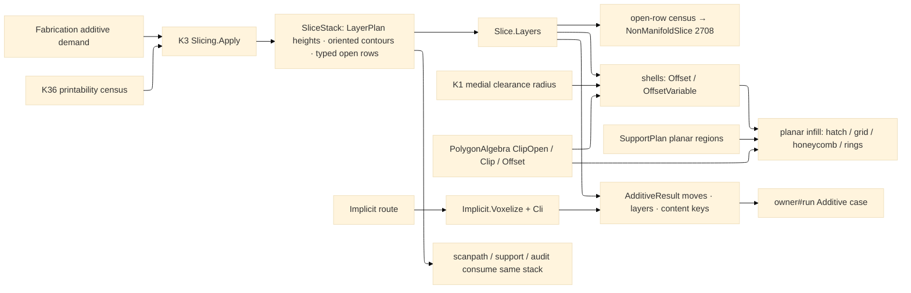

# [RASM_FABRICATION_SLICING]

The additive slicing page is a kernel slice-stack consumer: K3 emits the layer truth through `SliceStack`, and this owner turns oriented closed contours into FFF/DED shells, planar infill, support hatches, and additive moves. Gyroid, TPMS, cellular, lattice, grayscale, and `.cli` interiors route through `Additive/implicit`; they never become `InfillPattern` rows. The only public entry is `Slice.Layers(SliceStack, InfillPolicy)` returning the owner-safe `AdditiveResult`; open chains fail through `NonManifoldSlice` unless policy routes them to trace evidence, variable layer heights stay kernel `LayerPlan` rows, and printability arrives from K36 before the stack reaches this plane.

## [01]-[INDEX]

- [01]-[SLICING]: owns `InfillRoute`, planar `InfillPattern`, shell/open-sheet/overlap policy rows, adaptive density, Arachne medial-clearance beading, support-region hatching, implicit-lane delegation, and the ONE `Slice.Layers(SliceStack, InfillPolicy)` fold from kernel contours to `AdditiveResult`.

## [02]-[SLICING]

- Owner: `InfillRoute` the discriminant (`Planar` · `Implicit`) separating FFF/DED contour hatching from PicoGK voxel interiors; `InfillPattern` `[SmartEnum<string>]` the planar hatch family (`rectilinear`/`concentric`/`honeycomb`/`grid`); `ShellBeadLaw` the shell-width law (`constant` · `medial-clearance`); `ShellOverlap` the overlapping-shell resolution row; `OpenSheetPolicy` the typed open-chain disposition; `DensityPolicy` the adaptive density carrier; `InfillPolicy` the one policy row; `InfillLayer` the per-layer receipt; `Slice` the static surface owning `Layers`.
- Cases: `InfillRoute` cases 2 — `Planar(InfillPattern)` hatches kernel-oriented closed contours and support regions, `Implicit(ImplicitOp)` delegates the interior to `Implicit.Voxelize` + `Implicit.Cli(voxels, op.Policy)` — the selected `CliMode`, layer height, and VDB request ride the op's own policy, the layer count derives from the built stack, and the voxel lease disposes after egress; `InfillPattern` rows 4 — rectilinear alternating hatch, concentric offset rings, honeycomb three-axis lattice, grid cross-hatch; `ShellBeadLaw` rows 2 — constant extrusion width or K1 medial clearance radius; `ShellOverlap` rows 3 — keep, union, trim; `OpenSheetPolicy` rows 2 — reject or trace-only.
- Entry: `public static Fin<AdditiveResult> Layers(SliceStack stack, InfillPolicy policy)` — the ONE additive layer entry; it consumes the KERNEL-emitted stack and returns owner-safe moves/layer count/artifact keys. `Fin<T>` routes `FabricationFault.NonManifoldSlice(layer, openChains)` 2708 for rejected open chains and kernel `GeometryFault.DegenerateInput` for an empty stack, each lowered with `.ToError()`.
- Auto: Upstream additive policy names the demand and calls `Slicing.Apply(SliceOp, Op? key = null)`; K3 owns `LayerPlan.Uniform`, `Adaptive`, `BySlope`, `SupportInterface`, and `AtElevations`, oriented contours, typed open-chain rows, and the 5-channel SoA forest. `Slice.Layers` walks `SliceStack.LayerAt(n)` exactly once, converts closed rows to owner `Loop`s, counts open rows, then folds shells and infill over the oriented contour set. Shells compose `PolygonAlgebra.Offset` for constant width and `PolygonAlgebra.OffsetVariable` for Arachne beading; the variable field is the K1 medial clearance RADIUS supplied through policy, so no Voronoi or skeletal wall engine mints here. Overlapping shells resolve by the policy row before the innermost region feeds infill. Adaptive density is one field-policy row read by every planar pattern. Support regions enter through `SupportPlan.Planar` as sparse/interface layer regions and hatch through the same rectilinear clip primitive at support/interface densities. `Implicit` routes gyroid/TPMS/cellular/lattice interiors to `Additive/implicit` and returns only `.cli` content keys. Printability composes K36 before stack creation: `Meshes.Validity`/`Defects`/`Quality`/`NakedEdges` gates non-manifold input outside this consumer, and any remaining typed open row reaches 2708 here.
- Receipt: `AdditiveResult` is the typed evidence — planar routes carry additive `Move` rows and the kernel layer count; implicit routes carry the `.cli` key and mask keys. `InfillLayer` is plane-local evidence for contours, shells, model infill, support infill, and open traces; no `SliceLayer` mesh-section type, PicoGK `Voxels`, or kernel contour row escapes on the owner result.
- Packages: `Rasm.Meshing` (`Slicing.Apply → Fin<SliceStack>` K3, `SliceStack.LayerAt`/`LayerCount`/`Elevations`; `LayerPlan` rows stay kernel policy), `Geometry2D/algebra#POLYGON_ALGEBRA` (`Offset`/`OffsetVariable`/`Clip`/`ClipOpen`), `Additive/implicit#IMPLICIT` (`ImplicitOp`, `Implicit.Voxelize`, `Implicit.Cli`, `CliStack`), `Additive/support#SUPPORT` (`SupportPlan`, `SupportLayer`), kernel K1 (`Offsetting.Apply(OffsetOp.Clearance)`/medial clearance RADIUS as shell-width input), kernel K36 (`Meshes.Validity`/`Defects`/`Quality`/`NakedEdges` printability census), `Process/owner#FABRICATION_OWNER` (`Loop`/`Edge3`/`Move`/`ContentKey`/`AdditiveResult`), Thinktecture.Runtime.Extensions, LanguageExt.Core, BCL inbox.
- Growth: a new planar hatch is one `InfillPattern` row plus one `FillRegions` arm over the same hatch/clip pipeline; a new implicit interior is one `ImplicitOp` case, not an infill row; a new layer-height law is one kernel `LayerPlan` row, not a Fabrication scheduler; a new shell compensation is one `ShellBeadLaw` row consuming K1 clearance output; a new support density class is one `DensityPolicy` row; zero new entrypoint.
- Boundary: `Slice` is the one additive slice-stack consumer and an in-page `Section`/triangle sweep/endpoint chain is the deleted form; variable layer height belongs to K3 and a Fabrication height loop is the sealed-boundary violation; gyroid/TPMS belongs to `Implicit` and a planar gyroid pattern row is the named false collapse; printability belongs to K36 and a slicer-side mesh-defect classifier is the duplicate gate; region Booleans route `PolygonAlgebra` and a slice-local Clipper call site is the named duplication defect; result payloads carry owner atoms and content keys only.

```csharp signature
// --- [RUNTIME_PRELUDE] ------------------------------------------------------------------------------------------------------------------------------
using LanguageExt;
using LanguageExt.Common;
using Rasm.Fabrication.Geometry2D;
using Rasm.Fabrication.Process;
using Rasm.Meshing;
using Rhino.Geometry;
using Thinktecture;
using static LanguageExt.Prelude;
using AdditiveResult = Rasm.Fabrication.Process.FabricationResult.AdditiveResult;

namespace Rasm.Fabrication.Additive;

// --- [TYPES] ----------------------------------------------------------------------------------------------------------------------------------------
[SmartEnum<string>]
public sealed partial class InfillPattern {
    public static readonly InfillPattern Rectilinear = new("rectilinear");
    public static readonly InfillPattern Concentric = new("concentric");
    public static readonly InfillPattern Honeycomb = new("honeycomb");
    public static readonly InfillPattern Grid = new("grid");
}

[SmartEnum<string>]
public sealed partial class ShellBeadLaw {
    public static readonly ShellBeadLaw Constant = new("constant");
    public static readonly ShellBeadLaw MedialClearance = new("medial-clearance");
}

[SmartEnum<string>]
public sealed partial class ShellOverlap {
    public static readonly ShellOverlap Keep = new("keep");
    public static readonly ShellOverlap Union = new("union");
    public static readonly ShellOverlap Trim = new("trim");
}

[SmartEnum<string>]
public sealed partial class OpenSheetPolicy {
    public static readonly OpenSheetPolicy Reject = new("reject");
    public static readonly OpenSheetPolicy TraceOnly = new("trace-only");
}

// --- [MODELS] ---------------------------------------------------------------------------------------------------------------------------------------
[Union(ConversionFromValue = ConversionOperatorsGeneration.None)]
public abstract partial record InfillRoute {
    private InfillRoute() { }

    public sealed record Planar(InfillPattern Pattern) : InfillRoute;
    public sealed record Implicit(ImplicitOp Op) : InfillRoute;
}

public sealed record DensityPolicy(
    double Model,
    double SupportSparse,
    double SupportInterface,
    Option<Func<Point3d, double>> Field = default) {
    public static DensityPolicy Fff() => new(Model: 0.20, SupportSparse: 0.12, SupportInterface: 0.80);

    public double ModelSpacing(Point3d p, double width) => Spacing(Field.Map(f => f(p)).IfNone(Model), width);

    public double SupportSpacing(Point3d p, double width) => Spacing(SupportSparse, width);

    public double InterfaceSpacing(Point3d p, double width) => Spacing(SupportInterface, width);

    static double Spacing(double density, double width) => Math.Max(width, width / Math.Max(density, 1e-3));
}

public sealed record InfillPolicy(
    InfillRoute Route,
    double ExtrusionWidth,
    int ShellCount,
    double InfillAngleRadians,
    double TravelFeed,
    double PrintFeed,
    DensityPolicy Density,
    ShellBeadLaw BeadLaw,
    ShellOverlap Overlap,
    OpenSheetPolicy OpenSheets,
    double ThinWallBeadFloor,
    Option<Func<Point3d, double>> MedialClearanceRadius = default,
    Option<SupportPlan> Support = default) {
    public static InfillPolicy Fff(double extrusionWidth) => new(
        new InfillRoute.Planar(InfillPattern.Rectilinear),
        extrusionWidth,
        ShellCount: 2,
        InfillAngleRadians: Math.PI / 4.0,
        TravelFeed: 9000.0,
        PrintFeed: 2400.0,
        DensityPolicy.Fff(),
        ShellBeadLaw.Constant,
        ShellOverlap.Trim,
        OpenSheetPolicy.Reject,
        ThinWallBeadFloor: 0.35);
}

public sealed record InfillLayer(
    int Layer,
    double Elevation,
    Seq<Loop> Contours,
    Seq<Loop> Shells,
    Seq<Edge3> ModelInfill,
    Seq<Edge3> SupportInfill,
    Seq<Edge3> OpenTraces);

// The owner#run Additive-arm policy: Layers slices the model through kernel K3 then fills (planar or voxel
// via InfillRoute); Build hands off to Production.Plan — two cases, the whole additive plane one dispatch.
[Union(ConversionFromValue = ConversionOperatorsGeneration.None)]
public abstract partial record AdditivePolicy {
    private AdditivePolicy() { }

    public sealed record Layers(LayerPlan Plan, SlicePolicy Slice, InfillPolicy Infill) : AdditivePolicy;
    public sealed record Build(BuildPolicy Policy) : AdditivePolicy;
}

// --- [OPERATIONS] -----------------------------------------------------------------------------------------------------------------------------------
public static class Slice {
    // The owner#run Additive arm body: kernel slice (K3) under the case-carried LayerPlan, then the layer fill;
    // Build routes Production.Plan. A missing model is degenerate input, never a default mesh.
    public static Fin<FabricationResult> Solve(FabricationPolicy.Additive policy, FabricationInput input) =>
        policy.Policy.Switch(
            state:  input,
            layers: static (i, p) => i.Model.Match(
                None: () => Fin.Fail<FabricationResult>(GeometryFault.DegenerateInput("slice:model-missing").ToError()),
                Some: model => Slicing.Apply(new SliceOp(model, Plane.WorldXY, p.Plan, p.Slice))
                    .Bind(stack => Layers(stack, p.Infill).Map(static r => (FabricationResult)r))),
            build:  static (i, p) => i.Model.Match(
                None: () => Fin.Fail<FabricationResult>(GeometryFault.DegenerateInput("build:model-missing").ToError()),
                Some: model => Production.Plan(p.Policy, model).Map(static r => (FabricationResult)r)));

    public static Fin<AdditiveResult> Layers(SliceStack stack, InfillPolicy policy) =>
        stack.LayerCount == 0
            ? Fin.Fail<AdditiveResult>(GeometryFault.DegenerateInput("slice:empty-kernel-stack").ToError())
            : policy.Route.Switch(
                state:    (stack, policy),
                planar:   static (s, route) => Planar(s.stack, route.Pattern, s.policy),
                implicit: static (s, route) => Voxel(route.Op));

    static Fin<AdditiveResult> Planar(SliceStack stack, InfillPattern pattern, InfillPolicy policy) =>
        toSeq(Enumerable.Range(0, stack.LayerCount))
            .Map(n => Layer(stack, n, pattern, policy))
            .Sequence()
            .Map(layers => new AdditiveResult(layers.Bind(l => Moves(l, policy)), layers.Count, Seq<ContentKey>()));

    // The implicit route rides the SAME policy the voxels rasterized under: Cli routes the selected CliMode row
    // (grayscale masks, layer height, VDB-CLI), the layer count derives from the BUILT stack — the kernel planar
    // count never masquerades as voxel-lane layer truth — and the voxel lease disposes here after egress.
    static Fin<AdditiveResult> Voxel(ImplicitOp op) =>
        Implicit.Voxelize(op).Map(voxels => {
            try {
                CliStack cli = Implicit.Cli(voxels, op.Policy);
                return new AdditiveResult(Seq<Move>(), cli.Layers, Seq(cli.Key).Concat(cli.Masks));
            }
            finally {
                voxels.Dispose();
            }
        });

    static Fin<InfillLayer> Layer(SliceStack stack, int n, InfillPattern pattern, InfillPolicy policy) {
        int open = OpenRows(stack, n);
        if (open > 0 && policy.OpenSheets == OpenSheetPolicy.Reject)
            return Fin.Fail<InfillLayer>(FabricationFault.NonManifoldSlice(n, open).ToError());

        Seq<Loop> contours = Regions(stack, n);
        Seq<Edge3> traces = policy.OpenSheets == OpenSheetPolicy.TraceOnly ? OpenRuns(stack, n) : Seq<Edge3>();
        if (contours.IsEmpty)
            return Fin.Succ(new InfillLayer(n, stack.Elevations[n], contours, Seq<Loop>(), Seq<Edge3>(), Seq<Edge3>(), traces));

        Seq<Loop> shells = ResolveShells(Shells(contours, policy), policy.Overlap);
        Seq<Loop> inner = shells.IsEmpty ? contours : Seq(shells.Last);
        BoundingBox bound = Bound(contours.Concat(shells));
        Seq<Edge3> model = FillRegions(inner, stack.Elevations[n], bound, pattern, policy,
            p => policy.Density.ModelSpacing(p, policy.ExtrusionWidth));
        Seq<Edge3> support = SupportFill(policy.Support, n, stack.Elevations[n], bound, policy);
        return Fin.Succ(new InfillLayer(n, stack.Elevations[n], contours, shells, model, support, traces));
    }

    // --- [SHELLS]
    static Seq<Loop> Shells(Seq<Loop> contours, InfillPolicy policy) =>
        toSeq(Enumerable.Range(1, Math.Max(0, policy.ShellCount)))
            .Bind(pass => ShellPass(contours, policy, pass).IfFail(Seq<Loop>()));

    static Fin<Seq<Loop>> ShellPass(Seq<Loop> contours, InfillPolicy policy, int pass) =>
        policy.BeadLaw == ShellBeadLaw.MedialClearance
            ? policy.MedialClearanceRadius
                .Map(radius => PolygonAlgebra.OffsetVariable(contours, p => -pass * BeadWidth(radius(p), policy), OffsetEnds.Polygon))
                .IfNone(PolygonAlgebra.Offset(contours, -pass * policy.ExtrusionWidth, OffsetEnds.Polygon))
            : PolygonAlgebra.Offset(contours, -pass * policy.ExtrusionWidth, OffsetEnds.Polygon);

    static double BeadWidth(double clearanceRadius, InfillPolicy policy) {
        double wall = Math.Max(2.0 * clearanceRadius, policy.ExtrusionWidth);
        int beads = Math.Max(1, (int)Math.Ceiling(wall / Math.Max(policy.ExtrusionWidth, 1e-6)));
        double floor = Math.Max(policy.ThinWallBeadFloor, 0.0) * policy.ExtrusionWidth;
        return Math.Clamp(wall / beads, Math.Max(floor, 1e-6), policy.ExtrusionWidth);
    }

    static Seq<Loop> ResolveShells(Seq<Loop> shells, ShellOverlap overlap) =>
        overlap == ShellOverlap.Union
            ? PolygonAlgebra.Clip(shells, Seq<Loop>(), ClipOp.Union).IfFail(shells)
            : overlap == ShellOverlap.Trim
                ? shells.Fold(Seq<Loop>(), static (kept, shell) =>
                    kept.Concat(PolygonAlgebra.Clip(Seq(shell), kept, ClipOp.Difference).IfFail(Seq(shell))))
                : shells;

    // --- [INFILL]
    static Seq<Edge3> FillRegions(
        Seq<Loop> region,
        double z,
        BoundingBox bound,
        InfillPattern pattern,
        InfillPolicy policy,
        Func<Point3d, double> spacing) =>
        region.IsEmpty
            ? Seq<Edge3>()
            : pattern.Switch(
                state:       (region, z, bound, policy, spacing),
                rectilinear: static s => Clip(Hatch(s.bound, s.z, s.policy.InfillAngleRadians + AlternateBy(s.z, s.policy), s.spacing), s.region),
                grid:        static s => Clip(Hatch(s.bound, s.z, s.policy.InfillAngleRadians, s.spacing)
                                                  .Concat(Hatch(s.bound, s.z, s.policy.InfillAngleRadians + Math.PI / 2.0, s.spacing)), s.region),
                honeycomb:   static s => Clip(Honeycomb(s.bound, s.z, s.spacing), s.region),
                concentric:  static s => Rings(s.region, s.spacing(Centre(s.bound))));

    static Seq<Edge3> SupportFill(Option<SupportPlan> support, int layer, double z, BoundingBox bound, InfillPolicy policy) =>
        support.Map(plan => plan.Planar
                .Filter(row => row.Layer == layer)
                .Bind(row =>
                    FillRegions(row.Sparse, z, bound, InfillPattern.Rectilinear, policy, p => policy.Density.SupportSpacing(p, policy.ExtrusionWidth))
                        .Concat(FillRegions(row.Interface, z, bound, InfillPattern.Rectilinear, policy,
                            p => policy.Density.InterfaceSpacing(p, policy.ExtrusionWidth)))))
            .IfNone(Seq<Edge3>());

    static Seq<Edge3> Clip(Seq<Edge3> hatch, Seq<Loop> region) =>
        hatch.Bind(line => PolygonAlgebra.ClipOpen(Seq(line), region).Inside);

    static Seq<Edge3> Hatch(BoundingBox bound, double z, double angle, Func<Point3d, double> spacing) {
        double diag = Math.Max(bound.Min.DistanceTo(bound.Max), 1e-3);
        Point3d centre = Centre(bound);
        Vector3d dir = new(Math.Cos(angle), Math.Sin(angle), 0.0);
        Vector3d step = new(-Math.Sin(angle), Math.Cos(angle), 0.0);
        System.Collections.Generic.List<Edge3> lines = new();
        for (double offset = -0.5 * diag; offset <= 0.5 * diag;) {
            Point3d mid = centre + offset * step;
            lines.Add(new Edge3(mid - 0.5 * diag * dir, mid + 0.5 * diag * dir));
            offset += Math.Max(spacing(mid), 1e-3);
        }
        return toSeq(lines);
    }

    static Seq<Edge3> Honeycomb(BoundingBox bound, double z, Func<Point3d, double> spacing) =>
        Hatch(bound, z, 0.0, spacing)
            .Concat(Hatch(bound, z, Math.PI / 3.0, spacing))
            .Concat(Hatch(bound, z, 2.0 * Math.PI / 3.0, spacing));

    static Seq<Edge3> Rings(Seq<Loop> inner, double spacing) =>
        toSeq(Enumerable.Range(1, 64))
            .Map(k => PolygonAlgebra.Offset(inner, -k * spacing, OffsetEnds.Polygon).IfFail(Seq<Loop>()))
            .TakeWhile(static r => !r.IsEmpty)
            .Bind(static r => r)
            .Bind(static loop => toSeq(Enumerable.Range(0, loop.Count)).Map(i => new Edge3(loop.At(i), loop.At(i + 1))));

    static double AlternateBy(double z, InfillPolicy policy) =>
        (int)Math.Round(z / Math.Max(policy.ExtrusionWidth, 1e-6)) % 2 == 0 ? 0.0 : Math.PI / 2.0;

    // --- [MOVES]
    static Seq<Move> Moves(InfillLayer layer, InfillPolicy policy) =>
        layer.Contours.Map(LoopPath)
            .Concat(layer.Shells.Map(LoopPath))
            .Concat(layer.ModelInfill.Map(static e => Arr(e.A, e.B)))
            .Concat(layer.SupportInfill.Map(static e => Arr(e.A, e.B)))
            .Concat(layer.OpenTraces.Map(static e => Arr(e.A, e.B)))
            .Bind(path => MovePath(path, policy));

    static Arr<Point3d> LoopPath(Loop loop) =>
        toArr(Enumerable.Range(0, loop.Count + 1).Select(loop.At));

    static Seq<Move> MovePath(Arr<Point3d> path, InfillPolicy policy) =>
        path.IsEmpty
            ? Seq<Move>()
            : Seq(new Move(path[0], Rapid: true, Feed: policy.TravelFeed))
                .Concat(toSeq(Enumerable.Range(1, path.Count - 1)).Map(i => new Move(path[i], Rapid: false, Feed: policy.PrintFeed)));

    // --- [BOUNDARIES]
    static Seq<Loop> Regions(SliceStack stack, int n) =>
        stack.LayerAt(n).Filter(static c => c.Closed)
            .Map(static c => new Loop(toArr(c.Polyline.SkipLast(1).Select(static p => new Point3d(p.X, p.Y, p.Z))), Closed: true).AsCcw());

    static int OpenRows(SliceStack stack, int n) =>
        stack.LayerAt(n).Filter(static c => !c.Closed).Count;

    static Seq<Edge3> OpenRuns(SliceStack stack, int n) =>
        stack.LayerAt(n)
            .Filter(static c => !c.Closed)
            .Bind(static c => Runs(toArr(c.Polyline.Select(static p => new Point3d(p.X, p.Y, p.Z)))));

    static Seq<Edge3> Runs(Arr<Point3d> points) =>
        points.Count < 2
            ? Seq<Edge3>()
            : toSeq(Enumerable.Range(0, points.Count - 1)).Map(i => new Edge3(points[i], points[i + 1]));

    static BoundingBox Bound(Seq<Loop> loops) =>
        new(loops.Bind(static loop => toSeq(loop.Vertices)));

    static Point3d Centre(BoundingBox bound) =>
        (bound.Min + bound.Max) * 0.5;
}
```


