# [RASM_FABRICATION_SLICING]

Additive slicing consumes kernel `SliceStack` truth once, materializes the layer-region table before any neighbour-reading pass, preserves `PolygonAlgebra` topology receipts, derives planar deposition from parameterized line and cell seeds, and projects arc-bearing bead paths through caller-owned egress. `SliceRegion` remains the shared region atom, `AdditivePolicy` remains the `owner#run` dispatch, and `Slice.Layers` remains the sole planar-or-implicit fold.

## [01]-[INDEX]

- [01]-[SLICING]: owns `SliceRegion`, `InfillPolicy`, seed-driven `InfillPattern`, `BeadGeometry`/`ShellPolicy`/`FeedPolicy` deposition policy, shell/bridge/skin/gap-fill/support partitioning, `DepositionSeed`, `AdditivePolicy`, `Slice.Solve`, and `Slice.Layers`.

## [02]-[SLICING]

- Owner: `SliceRegion` owns topology-preserving planar set algebra; `InfillPattern` owns line-family, concentric, Voronoi-cell, and injected candidate generation; `BeadGeometry` owns the bead cross-section flow law; `ShellPolicy` owns perimeter count, solid depth, bead law, overlap resolution, and seam placement; `FeedPolicy` owns the per-feature feed table and the minimum-layer-time cooling law; `DepositionSeed` owns per-modality defaults; `InfillPolicy.Planar.Egress` owns physical bead egress; `AdditivePolicy.Build.Egress` owns complete `BuildOutcome` projection; `Slice` owns admission, planning, and dispatch.
- Entry: `Slice.Layers(SliceStack, InfillPolicy)` consumes kernel contours and returns `AdditiveResult`; `InfillPolicy.Of(DepositionSeed, …)` admits raw scalars once and constructs every generated owner below the gate; `Slice.Solve(FabricationPolicy.Additive, FabricationInput)` dispatches `AdditivePolicy` without a second route table.
- Auto: `Slice.Layers` admits every `Planar` component through one outer storage seam, including the `BeadGeometry` and `ShellPolicy` default-ghost keys. Layer planning gates open chains, materializes every `SliceRegion` once, preserves every `PolygonTrace.Regions` receipt, classifies unsupported perimeters as `BridgeShell`, and resolves shell overlap by annulus intersection area before routing dropped residue into `GapFill`. Support hatching consumes each row's extent, density, and contact duty; cooling scales every feature feed; egress projects `DepositionPath` rows. `LineFamily` generates line spaces from seed bearings, layer advance, and phase; `CellPattern` admits uniform, Gaussian, explicit, or injected Voronoi sites with relaxation, duplicate, closure, and merge evidence preserved on the rail.
- Receipt: `AdditiveResult` is planar and implicit evidence — planar routes carry additive `Move` rows and the kernel layer count, while implicit routes carry the `.cli` key and mask keys. Build routes pass complete `BuildOutcome` evidence through `AdditivePolicy.Build.Egress`. `DepositionPath` carries the `Loop` itself with its layer, elevation, bead width and height, feed, measured extent, and deposited volume. `InfillLayer` is plane-local evidence for the region, grounded and bridging shells, skin, gap fill, model infill, and the sparse, interface, and contact support lanes; no `SliceLayer` mesh-section type, PicoGK `Voxels`, or kernel contour row escapes on the owner result.
- Packages: `Rasm.Meshing` supplies `SliceStack`; `PolygonAlgebra.Apply` supplies topology, Boolean, offset, and open-clip receipts; `Loop.Apply` supplies the arc-exact measure, closest-point, and path-length sampling every extent, seam, and material figure reads; `SharpVoronoiLib` supplies seeded cell topology; `UnitsNet` supplies physical quantities; `LanguageExt` and `Thinktecture` own rails and generated domain shapes.
- Growth: a line topology is parameterized `LineFamily` data, common families are `LineSeed` rows, a deposition modality is a `DepositionSeed` row, a bead cross-section is a `BeadSection` row, a deposition lane is a `DepositionFeature` row the `Sources` table picks up untouched, a site source is a `CellSites` case, an exceptional candidate generator is `InfillPattern.Generated`, and an implicit interior is `ImplicitOp`.
- Boundary: `Slice` is the one additive slice-stack consumer and an in-page `Section`/triangle sweep/endpoint chain is the deleted form; variable layer height belongs to K3 and a Fabrication height loop is the sealed-boundary violation; gyroid/TPMS belongs to `Implicit` and a planar gyroid pattern row is the named false collapse; printability belongs to K36 and a slicer-side mesh-defect classifier is the duplicate gate; region Booleans route `PolygonAlgebra` through `SliceRegion` and a slice-local Clipper call site or a bare hole-blind `Seq<Loop>` region is the named duplication defect; path length, closest point, and arc-length station route `Loop.Apply` and a chord-sum or vertex-scan re-derivation is the named duplication defect; `SliceRegion.Bound` folds `Loop.Bound` because an arc span bulges outside its chord hull; `Cells` is the provider-forced statement capsule around mutable `VoronoiPlane`; a shell or cell failure flattened to empty geometry is the erased-rail defect; travel sequencing between deposition rows belongs to the egress consumer; result payloads carry owner atoms and content keys only.

```csharp signature
// --- [RUNTIME_PRELUDE] ------------------------------------------------------------------------------------------------------------------------------
extern alias Voronoi;

using System.Runtime.InteropServices;
using LanguageExt;
using LanguageExt.Common;
using Rasm.Domain;
using Rasm.Fabrication.Geometry2D;
using Rasm.Fabrication.Process;
using Rasm.Meshing;
using Rasm.Numerics;
using Rhino.Geometry;
using Thinktecture;
using UnitsNet;
using UnitsNet.Units;
using static LanguageExt.Prelude;
using AdditiveResult = Rasm.Fabrication.Process.FabricationResult.AdditiveResult;
using BorderEdgeGeneration = Voronoi::SharpVoronoiLib.BorderEdgeGeneration;
using IPointGenerationAlgorithm = Voronoi::SharpVoronoiLib.IPointGenerationAlgorithm;
using PointGenerationMethod = Voronoi::SharpVoronoiLib.PointGenerationMethod;
using SeededRandomNumberGenerator = Voronoi::SharpVoronoiLib.SeededRandomNumberGenerator;
using VoronoiPlane = Voronoi::SharpVoronoiLib.VoronoiPlane;
using VoronoiSite = Voronoi::SharpVoronoiLib.VoronoiSite;
using VoronoiSiteMergeQuery = Voronoi::SharpVoronoiLib.VoronoiSiteMergeQuery;

namespace Rasm.Fabrication.Additive;

// --- [TYPES] ----------------------------------------------------------------------------------------------------------------------------------------
[Union(ConversionFromValue = ConversionOperatorsGeneration.None)]
public abstract partial record InfillPattern {
    private InfillPattern() { }

    public sealed record Lines(LineFamily Family) : InfillPattern;
    public sealed record Concentric : InfillPattern;
    public sealed record Cells(CellPattern Policy) : InfillPattern;
    public sealed record Generated(
        Func<SliceRegion, Length, int, Func<Point3d, Length>, Angle, Fin<Seq<Edge3>>> Candidates) : InfillPattern;
}

[ComplexValueObject]
[StructLayout(LayoutKind.Auto)]
public readonly partial struct LineFamily {
    public Arr<Angle> Bearings { get; }
    public Angle LayerAdvance { get; }
    public int PhasePeriod { get; }
    public Ratio PhaseAdvance { get; }
    public int SpanMultiplier { get; }

    [BoundaryAdapter]
    static partial void ValidateFactoryArguments(
        ref ValidationError? validationError,
        ref Arr<Angle> bearings,
        ref Angle layerAdvance,
        ref int phasePeriod,
        ref Ratio phaseAdvance,
        ref int spanMultiplier) =>
        validationError = bearings.IsEmpty
            || bearings.Exists(static bearing => !double.IsFinite(bearing.Radians))
            || !double.IsFinite(layerAdvance.Radians)
            || !double.IsFinite(phaseAdvance.DecimalFractions)
            || phasePeriod < 1
            || spanMultiplier < 1
            || phaseAdvance.DecimalFractions is < 0.0 or >= 1.0
                ? new ValidationError("<line-family-invalid>")
                : null;
}

[SmartEnum]
public sealed partial class LineSeed {
    public static readonly LineSeed Alternating = new(LineFamily.Create(
        Arr(Angle.Zero), Angle.FromDegrees(90.0), 2, Ratio.Zero, 4));
    public static readonly LineSeed Aligned = new(LineFamily.Create(Arr(Angle.Zero), Angle.Zero, 1, Ratio.Zero, 4));
    public static readonly LineSeed Grid = new(LineFamily.Create(
        Arr(Angle.Zero, Angle.FromDegrees(90.0)), Angle.Zero, 1, Ratio.Zero, 4));
    public static readonly LineSeed Triangular = new(LineFamily.Create(
        Arr(Angle.Zero, Angle.FromDegrees(60.0), Angle.FromDegrees(120.0)), Angle.Zero, 1, Ratio.Zero, 4));
    public static readonly LineSeed Cubic = new(LineFamily.Create(
        Arr(Angle.Zero), Angle.FromDegrees(60.0), 3, Ratio.FromPercent(33.3333333333333), 4));

    public LineFamily Family { get; }
}

[SmartEnum]
public sealed partial class CellDistribution {
    public static readonly CellDistribution Uniform = new(PointGenerationMethod.Uniform);
    public static readonly CellDistribution Gaussian = new(PointGenerationMethod.Gaussian);

    public PointGenerationMethod Value { get; }
}

[Union(ConversionFromValue = ConversionOperatorsGeneration.None)]
public abstract partial record CellSites {
    private CellSites() { }

    public sealed record Random(int Count, int Seed, CellDistribution Distribution) : CellSites;
    public sealed record Explicit(Arr<Point3d> Points) : CellSites;
    public sealed record Generated(int Count, int Seed, IPointGenerationAlgorithm Generator) : CellSites;
}

[ComplexValueObject]
[StructLayout(LayoutKind.Auto)]
public readonly partial struct CellPattern {
    public CellSites Sites { get; }
    public int Relaxations { get; }
    public Ratio RelaxationStrength { get; }
    public Option<VoronoiSiteMergeQuery> Merge { get; }

    [BoundaryAdapter]
    static partial void ValidateFactoryArguments(
        ref ValidationError? validationError,
        ref CellSites sites,
        ref int relaxations,
        ref Ratio relaxationStrength,
        ref Option<VoronoiSiteMergeQuery> merge) =>
        validationError = sites is null
            || relaxations < 0
            || !double.IsFinite(relaxationStrength.DecimalFractions)
            || relaxationStrength.DecimalFractions is <= 0.0 or > 1.0
            || merge.Exists(static query => query is null)
            || !sites.Switch(
                random: static source => source.Count > 0 && source.Distribution is not null,
                @explicit: static source => !source.Points.IsEmpty && source.Points.ForAll(static point => point.IsValid),
                generated: static source => source.Count > 0 && source.Generator is not null)
            ? new ValidationError("<cell-pattern-invalid>")
            : null;
}

[Union(ConversionFromValue = ConversionOperatorsGeneration.None)]
public abstract partial record ShellBeadLaw {
    private ShellBeadLaw() { }

    public sealed record Constant : ShellBeadLaw;
    public sealed record MedialClearance(Func<Point3d, Length> Radius) : ShellBeadLaw;
}

[Union(ConversionFromValue = ConversionOperatorsGeneration.None)]
public abstract partial record ShellOverlap {
    private ShellOverlap() { }

    public sealed record Keep : ShellOverlap;
    public sealed record Drop : ShellOverlap;
    public sealed record GapFill(Length MinimumGap) : ShellOverlap;

    public bool Votes => Switch(keep: static () => false, drop: static () => true, gapFill: static _ => true);
}

[SmartEnum]
public sealed partial class OpenSheetPolicy {
    public static readonly OpenSheetPolicy Reject = new();
    public static readonly OpenSheetPolicy TraceOnly = new();
}

[Union(ConversionFromValue = ConversionOperatorsGeneration.None)]
public abstract partial record SeamPlacement {
    private SeamPlacement() { }

    public sealed record Nearest : SeamPlacement;
    public sealed record Rear : SeamPlacement;
    public sealed record Aligned(Angle Bearing) : SeamPlacement;
    public sealed record Anchored(Point3d At) : SeamPlacement;
    public sealed record Sharpest(Angle MinimumTurn) : SeamPlacement;
    public sealed record Scattered(Length Stride) : SeamPlacement;
}

// Bead cross-section closes the flow law: a deposited bead is not its bounding rectangle.
[SmartEnum]
public sealed partial class BeadSection {
    public static readonly BeadSection Rectangular = new(
        static (width, height) => width.Millimeters * height.Millimeters);
    public static readonly BeadSection Stadium = new(
        static (width, height) => (width.Millimeters * height.Millimeters)
            - ((4.0 - Math.PI) / 4.0 * height.Millimeters * height.Millimeters));
    public static readonly BeadSection Elliptical = new(
        static (width, height) => Math.PI / 4.0 * width.Millimeters * height.Millimeters);

    [UseDelegateFromConstructor]
    public partial double SquareMillimeters(Length width, Length height);
}

// --- [MODELS] ---------------------------------------------------------------------------------------------------------------------------------------
[ComplexValueObject]
public sealed partial class SliceRegion {
    public static readonly SliceRegion Empty = Create(Seq<Loop>(), Seq<Loop>());

    public Seq<Loop> Outers { get; }
    public Seq<Loop> Holes { get; }

    [BoundaryAdapter]
    static partial void ValidateFactoryArguments(
        ref ValidationError? validationError,
        ref Seq<Loop> outers,
        ref Seq<Loop> holes) =>
        validationError = (outers.IsEmpty && !holes.IsEmpty)
            || outers.Exists(static loop => loop is null || !loop.Closed)
            || holes.Exists(static loop => loop is null || !loop.Closed)
            || holes.Exists(hole => !outers.Exists(outer => Contains(outer, hole)))
                ? new ValidationError("<slice-region-invalid>")
                : null;

    private static bool Contains(Loop outer, Loop hole) =>
        hole.Vertices.ForAll(outer.Covers)
        && outer.Apply(new ProfileOp.Intersections(hole)).Match(
            Succ: static result => result is ProfileResult.Intersections { Points: 0, Overlaps: 0 },
            Fail: static _ => false);

    public bool IsEmpty => Outers.IsEmpty;
    public Seq<Loop> Loops => Outers.Concat(Holes);

    public static Fin<SliceRegion> Of(SliceStack stack, int n) =>
        from tolerance in Context.Millimeters().ToFin()
        from rings in toSeq(Enumerable.Range(stack.LayerPtr[n], stack.LayerPtr[n + 1] - stack.LayerPtr[n]))
            .Filter(c => !stack.IsOpen(c))
            .Map(c => Ring(stack, c, tolerance).Map(loop => (Contour: c, Loop: loop)))
            .Sequence()
        from region in Of(rings.Map(static row => row.Loop))
        select region;

    public static Fin<SliceRegion> Of(Seq<Loop> loops) => loops.IsEmpty
        ? Fin.Succ(Empty)
        : PolygonAlgebra.Apply(new PolygonOp.Inspect(loops, new PolygonQuery.Topology(PolygonFill.NonZero)))
            .Bind(static trace => trace is PolygonTrace.Regions regions
                ? Fin.Succ(Create(
                    regions.Result.Nodes.Filter(static node => !node.IsHole).Map(static node => node.Boundary),
                    regions.Result.Nodes.Filter(static node => node.IsHole).Map(static node => node.Boundary)))
                : Fin.Fail<SliceRegion>(new GeometryFault.DegenerateInput(Kind.Mesh, -1, "slice:topology-receipt").ToError()));

    public Fin<SliceRegion> Difference(SliceRegion b) =>
        IsEmpty || b.IsEmpty
            ? Fin.Succ(this)
            : Regions(new PolygonOp.Boolean(Loops, b.Loops, PolygonBoolean.Difference, PolygonFill.NonZero));

    public Fin<SliceRegion> Intersect(SliceRegion b) =>
        IsEmpty || b.IsEmpty
            ? Fin.Succ(Empty)
            : Regions(new PolygonOp.Boolean(Loops, b.Loops, PolygonBoolean.Intersection, PolygonFill.NonZero));

    public Fin<SliceRegion> Union(SliceRegion b) =>
        b.IsEmpty ? Fin.Succ(this)
        : IsEmpty ? Fin.Succ(b)
        : Regions(new PolygonOp.Boolean(Loops, b.Loops, PolygonBoolean.Union, PolygonFill.NonZero));

    public Fin<SliceRegion> Grow(Length delta, OffsetPolicy offset) =>
        IsEmpty
            ? Fin.Succ(Empty)
            : Regions(new PolygonOp.Offset(Loops, new OffsetField.Uniform(delta.Millimeters), offset));

    public Fin<Seq<Edge3>> Rays(Seq<Edge3> rays) =>
        IsEmpty
            ? Fin.Succ(Seq<Edge3>())
            : PolygonAlgebra.Apply(new PolygonOp.ClipOpen(Seq(rays), Loops, PolygonFill.NonZero))
                .Bind(static trace => trace is PolygonTrace.SplitRuns split
                    ? Fin.Succ(split.Inside.Bind(static run => run))
                    : Fin.Fail<Seq<Edge3>>(new GeometryFault.DegenerateInput(Kind.Mesh, -1, "slice:open-clip-receipt").ToError()));

    public Fin<Area> PhysicalArea() => IsEmpty
        ? Fin.Succ(UnitsNet.Area.Zero)
        : PolygonAlgebra.Apply(new PolygonOp.Inspect(Loops, new PolygonQuery.Measure()))
            .Bind(static trace => trace is PolygonTrace.Measured measured
                ? Fin.Succ(UnitsNet.Area.FromSquareMillimeters(measured.Result.FilledArea))
                : Fin.Fail<Area>(new GeometryFault.DegenerateInput(Kind.Mesh, -1, "slice:measure-receipt").ToError()));

    public bool Covers(Point3d point) =>
        Outers.Count(loop => loop.Covers(point)) - Holes.Count(loop => loop.Covers(point)) > 0;

    // Arc spans bulge outside their chord endpoints, so the extent folds loop bounds, never vertex hulls.
    public BoundingBox Bound() => Outers.Fold(
        BoundingBox.Unset,
        static (box, loop) => box.IsValid ? BoundingBox.Union(box, loop.Bound()) : loop.Bound());

    private static Fin<SliceRegion> Regions(PolygonOp operation) =>
        PolygonAlgebra.Apply(operation).Bind(static trace => trace is PolygonTrace.Regions regions
            ? Fin.Succ(Create(
                regions.Result.Nodes.Filter(static node => !node.IsHole).Map(static node => node.Boundary),
                regions.Result.Nodes.Filter(static node => node.IsHole).Map(static node => node.Boundary)))
            : Fin.Fail<SliceRegion>(new GeometryFault.DegenerateInput(Kind.Mesh, -1, "slice:region-receipt").ToError()));

    private static Fin<Loop> Ring(SliceStack stack, int c, Context tolerance) =>
        Loop.Admit(
            toArr(stack.ContourAt(c).Polyline.SkipLast(1).Select(static p => new Point3d(p.X, p.Y, p.Z))),
            closed: true, Arr<double>(), tolerance);
}

[ComplexValueObject]
public sealed partial class FeedPolicy {
    public Speed Default { get; }
    public HashMap<DepositionFeature, Speed> ByFeature { get; }
    public Duration MinimumLayerTime { get; }
    public Ratio MinimumCoolingFactor { get; }

    [BoundaryAdapter]
    static partial void ValidateFactoryArguments(
        ref ValidationError? validationError,
        ref Speed @default,
        ref HashMap<DepositionFeature, Speed> byFeature,
        ref Duration minimumLayerTime,
        ref Ratio minimumCoolingFactor) =>
        validationError = @default.MetersPerSecond > 0.0
            && byFeature.ForAll(static pair => pair.Value.MetersPerSecond > 0.0)
            && minimumLayerTime.Seconds >= 0.0
            && minimumCoolingFactor.DecimalFractions is > 0.0 and <= 1.0
                ? null
                : new ValidationError("<feed-policy-invalid>");

    public Speed For(DepositionFeature feature) => ByFeature.Find(feature).IfNone(Default);

    // Minimum layer time is the cooling law: a layer whose deposition clock falls short slows to meet it.
    public Ratio Cooling(Duration deposition) =>
        deposition.Seconds <= 0.0 || MinimumLayerTime.Seconds <= deposition.Seconds
            ? Ratio.FromDecimalFractions(1.0)
            : Ratio.FromDecimalFractions(Math.Max(
                MinimumCoolingFactor.DecimalFractions,
                deposition.Seconds / MinimumLayerTime.Seconds));
}

[ComplexValueObject]
public sealed partial class DensityPolicy {
    public Ratio Model { get; }
    public Ratio SupportSparse { get; }
    public Ratio SupportInterface { get; }
    public Ratio Minimum { get; }
    public Option<Func<Point3d, Ratio>> Field { get; }

    [BoundaryAdapter]
    static partial void ValidateFactoryArguments(
        ref ValidationError? validationError,
        ref Ratio model,
        ref Ratio supportSparse,
        ref Ratio supportInterface,
        ref Ratio minimum,
        ref Option<Func<Point3d, Ratio>> field) =>
        validationError = Arr(model, supportSparse, supportInterface)
            .ForAll(static ratio => ratio.DecimalFractions is > 0.0 and <= 1.0)
            && minimum.DecimalFractions is > 0.0 and < 1.0
            && model > minimum
            && supportSparse > minimum
            && supportInterface > minimum
            && field.ForAll(static sampler => sampler is not null)
                ? null
                : new ValidationError("<density-policy-invalid>");

    public Length ModelSpacing(Point3d point, Length width) =>
        Spacing(Field.Map(field => field(point)).IfNone(Model), width);

    public Length Spacing(Ratio density, Length width) =>
        Length.FromMillimeters(width.Millimeters / Math.Clamp(density.DecimalFractions, Minimum.DecimalFractions, 1.0));
}

[SmartEnum<string>]
public sealed partial class DepositionFeature {
    public static readonly DepositionFeature OuterShell = new("outer-shell", deposits: true, perimeter: true);
    public static readonly DepositionFeature InnerShell = new("inner-shell", deposits: true, perimeter: true);
    public static readonly DepositionFeature BridgeShell = new("bridge-shell", deposits: true, perimeter: true);
    public static readonly DepositionFeature SingleWall = new("single-wall", deposits: true, perimeter: true);
    public static readonly DepositionFeature Skin = new("skin", deposits: true, perimeter: false);
    public static readonly DepositionFeature Ironing = new("ironing", deposits: false, perimeter: false);
    public static readonly DepositionFeature Infill = new("infill", deposits: true, perimeter: false);
    public static readonly DepositionFeature GapFill = new("gap-fill", deposits: true, perimeter: false);
    public static readonly DepositionFeature Support = new("support", deposits: true, perimeter: false);
    public static readonly DepositionFeature SupportInterface = new("support-interface", deposits: true, perimeter: false);
    public static readonly DepositionFeature SupportContact = new("support-contact", deposits: true, perimeter: false);
    public static readonly DepositionFeature Travel = new("travel", deposits: false, perimeter: false);

    public bool Deposits { get; }
    public bool Perimeter { get; }
}

// `Path` stays a `Loop` so bulge survives to egress; flattening to vertices destroys the arc the offset produced.
public sealed record DepositionPath(
    Loop Path,
    DepositionFeature Feature,
    int Layer,
    Length Elevation,
    Length Width,
    Length Height,
    Speed Feed,
    Length Extent,
    Volume Material);

[ComplexValueObject]
[StructLayout(LayoutKind.Auto)]
public readonly partial struct BeadGeometry {
    public Length ExtrusionWidth { get; }
    public Length LayerHeight { get; }
    public Ratio ThinWallBeadFloor { get; }
    public BeadSection Section { get; }

    [BoundaryAdapter]
    static partial void ValidateFactoryArguments(
        ref ValidationError? validationError,
        ref Length extrusionWidth,
        ref Length layerHeight,
        ref Ratio thinWallBeadFloor,
        ref BeadSection section) =>
        validationError = extrusionWidth.Millimeters > 0.0
            && layerHeight.Millimeters > 0.0
            && layerHeight.Millimeters <= extrusionWidth.Millimeters
            && thinWallBeadFloor.DecimalFractions is > 0.0 and <= 1.0
            && section is not null
                ? null
                : new ValidationError("<bead-geometry-invalid>");

    public Volume Deposited(Length extent) => Volume.FromCubicMillimeters(
        extent.Millimeters * Section.SquareMillimeters(ExtrusionWidth, LayerHeight));
}

[ComplexValueObject]
[StructLayout(LayoutKind.Auto)]
public readonly partial struct ShellPolicy {
    public int Count { get; }
    public int TopSolidLayers { get; }
    public int BottomSolidLayers { get; }
    public ShellBeadLaw BeadLaw { get; }
    public ShellOverlap Overlap { get; }
    public SeamPlacement Seam { get; }

    [BoundaryAdapter]
    static partial void ValidateFactoryArguments(
        ref ValidationError? validationError,
        ref int count,
        ref int topSolidLayers,
        ref int bottomSolidLayers,
        ref ShellBeadLaw beadLaw,
        ref ShellOverlap overlap,
        ref SeamPlacement seam) =>
        validationError = count > 0
            && topSolidLayers >= 0
            && bottomSolidLayers >= 0
            && overlap is not ShellOverlap.GapFill { MinimumGap.Millimeters: <= 0.0 }
            && beadLaw.Switch(
                constant: static () => true,
                medialClearance: static law => law.Radius is not null)
            && seam.Switch(
                nearest: static () => true,
                rear: static () => true,
                aligned: static law => double.IsFinite(law.Bearing.Radians),
                anchored: static law => law.At.IsValid,
                sharpest: static law => law.MinimumTurn.Radians is > 0.0 and < Math.PI,
                scattered: static law => law.Stride.Millimeters > 0.0)
                ? null
                : new ValidationError("<shell-policy-invalid>");
}

// Modality seeds are data over the parameterized policy; a new deposition process is one row, never a factory.
[SmartEnum<string>]
public sealed partial class DepositionSeed {
    private static readonly HashMap<DepositionFeature, Ratio> ExtrusionFeeds = HashMap(
        (DepositionFeature.OuterShell, Ratio.FromPercent(50.0)),
        (DepositionFeature.BridgeShell, Ratio.FromPercent(40.0)),
        (DepositionFeature.SingleWall, Ratio.FromPercent(50.0)),
        (DepositionFeature.Skin, Ratio.FromPercent(80.0)),
        (DepositionFeature.GapFill, Ratio.FromPercent(35.0)),
        (DepositionFeature.SupportInterface, Ratio.FromPercent(60.0)),
        (DepositionFeature.SupportContact, Ratio.FromPercent(45.0)),
        (DepositionFeature.Travel, Ratio.FromPercent(400.0)));

    public static readonly DepositionSeed FusedFilament = new(
        "fused-filament", BeadSection.Stadium, shells: 2, top: 4, bottom: 3,
        Angle.FromDegrees(45.0), Ratio.FromPercent(35.0), Duration.FromSeconds(8.0),
        LineSeed.Alternating, new ShellOverlap.GapFill(Length.FromMillimeters(0.05)), ExtrusionFeeds);
    public static readonly DepositionSeed PelletExtrusion = new(
        "pellet-extrusion", BeadSection.Stadium, shells: 1, top: 2, bottom: 2,
        Angle.FromDegrees(45.0), Ratio.FromPercent(60.0), Duration.Zero,
        LineSeed.Aligned, new ShellOverlap.Drop(), ExtrusionFeeds);
    public static readonly DepositionSeed DirectedEnergy = new(
        "directed-energy", BeadSection.Elliptical, shells: 1, top: 0, bottom: 0,
        Angle.FromDegrees(90.0), Ratio.FromPercent(80.0), Duration.Zero,
        LineSeed.Alternating, new ShellOverlap.Keep(), ExtrusionFeeds);
    public static readonly DepositionSeed CementitiousExtrusion = new(
        "cementitious-extrusion", BeadSection.Rectangular, shells: 2, top: 0, bottom: 0,
        Angle.Zero, Ratio.FromPercent(90.0), Duration.FromSeconds(30.0),
        LineSeed.Aligned, new ShellOverlap.Keep(), ExtrusionFeeds);

    public BeadSection Section { get; }
    public int Shells { get; }
    public int Top { get; }
    public int Bottom { get; }
    public Angle InfillAngle { get; }
    public Ratio BeadFloor { get; }
    public Duration MinimumLayerTime { get; }
    public LineSeed Hatch { get; }
    public ShellOverlap Overlap { get; }
    public HashMap<DepositionFeature, Ratio> FeedFactors { get; }
}

[Union(ConversionFromValue = ConversionOperatorsGeneration.None)]
public abstract partial record InfillPolicy {
    private InfillPolicy() { }

    public sealed record Planar(
        InfillPattern Pattern,
        BeadGeometry Bead,
        ShellPolicy Shells,
        Angle InfillAngle,
        FeedPolicy Feeds,
        DensityPolicy Density,
        OpenSheetPolicy OpenSheets,
        OffsetPolicy Offset,
        Func<Seq<DepositionPath>, int, Fin<AdditiveResult>> Egress,
        Option<SupportPlan> Support = default) : InfillPolicy;

    public sealed record Implicit(ImplicitOp Op) : InfillPolicy;

    // Scalars are admitted before construction so every generated factory below the gate is total.
    public static Fin<Planar> Of(
        DepositionSeed seed,
        Length extrusionWidth,
        Length layerHeight,
        Speed feed,
        DensityPolicy density,
        Func<Seq<DepositionPath>, int, Fin<AdditiveResult>> egress) =>
        seed is null
        || density is null
        || egress is null
        || extrusionWidth.Millimeters <= 0.0
        || layerHeight.Millimeters <= 0.0
        || layerHeight.Millimeters > extrusionWidth.Millimeters
        || feed.MetersPerSecond <= 0.0
            ? Fin.Fail<Planar>(new GeometryFault.DegenerateInput(Kind.Mesh, -1, "slice:deposition-seed-input").ToError())
            : from offset in OffsetPolicy.Admit(OffsetJoin.Miter, OffsetEnd.Polygon, miterLimit: 2.0, arcTolerance: 0.01)
              let policy = new Planar(
                  new InfillPattern.Lines(seed.Hatch.Family),
                  BeadGeometry.Create(extrusionWidth, layerHeight, seed.BeadFloor, seed.Section),
                  ShellPolicy.Create(
                      seed.Shells, seed.Top, seed.Bottom,
                      new ShellBeadLaw.Constant(), seed.Overlap, new SeamPlacement.Nearest()),
                  seed.InfillAngle,
                  FeedPolicy.Create(
                      feed,
                      seed.FeedFactors.Map(factor => Speed.FromMetersPerSecond(
                          feed.MetersPerSecond * factor.DecimalFractions)),
                      seed.MinimumLayerTime,
                      Ratio.FromPercent(20.0)),
                  density,
                  OpenSheetPolicy.Reject,
                  offset,
                  egress)
              from _ in Slice.Admit(policy)
              select policy;
}

public sealed record InfillLayer(
    int Layer,
    Length Elevation,
    SliceRegion Region,
    Seq<Loop> Shells,
    Seq<Loop> BridgeShells,
    Seq<Edge3> Skin,
    Seq<Edge3> GapFill,
    Seq<Edge3> ModelInfill,
    Seq<Edge3> SupportInfill,
    Seq<Edge3> InterfaceInfill,
    Seq<Edge3> ContactInfill,
    Seq<Edge3> OpenTraces);

[Union(ConversionFromValue = ConversionOperatorsGeneration.None)]
public abstract partial record AdditivePolicy {
    private AdditivePolicy() { }

    public sealed record Layers(LayerPlan Plan, SlicePolicy Slice, InfillPolicy Infill) : AdditivePolicy;
    public sealed record Scan(LayerPlan Plan, SlicePolicy Slice, ScanPolicy Policy, ProcessBudget.Powder Budget, Option<SupportPolicy> Support) : AdditivePolicy;
    public sealed record Build(
        BuildPolicy Policy,
        BuildJob Job,
        Func<BuildOutcome, Fin<FabricationResult>> Egress) : AdditivePolicy;
}

// --- [OPERATIONS] -----------------------------------------------------------------------------------------------------------------------------------
public static class Slice {
    public static Fin<FabricationResult> Solve(FabricationPolicy.Additive policy, FabricationInput input) =>
        policy.Policy.Switch(
            state:  input,
            layers: static (i, p) => Sliced(i, p.Plan, p.Slice)
                .Bind(stack => Layers(stack, p.Infill))
                .Map(static r => (FabricationResult)r),
            scan:   static (i, p) =>
                from stack in Sliced(i, p.Plan, p.Slice)
                from support in Grown(stack, p.Support)
                from plan in Additive.Scan.Plan(stack, p.Policy, p.Budget, support)
                select (FabricationResult)new AdditiveResult(Seq<Move>(), plan.Layers.Count, Seq(plan.Key)),
            build:  static (_, p) => p.Egress is null
                ? Fin.Fail<FabricationResult>(new GeometryFault.DegenerateInput(Kind.Mesh, -1, "build:egress-missing").ToError())
                : Production.Plan(p.Policy, p.Job)
                    .Bind(outcome => Capture(() => p.Egress(outcome), "build:egress")));

    public static Fin<AdditiveResult> Layers(SliceStack stack, InfillPolicy policy) =>
        stack.LayerCount == 0
            ? Fin.Fail<AdditiveResult>(new GeometryFault.DegenerateInput(Kind.Mesh, -1, "slice:empty-kernel-stack").ToError())
            : from _ in Admit(policy)
              from result in policy.Switch(
                  state:     stack,
                  planar:    static (s, p) =>
                      from _ in Gate(s, p.OpenSheets)
                      from plan in Planar(s, p.Pattern, p)
                      select plan,
                  @implicit: static (s, p) =>
                      from _ in Gate(s, OpenSheetPolicy.Reject)
                      from plan in Voxel(p.Op)
                      select plan)
              select result;

    internal static Fin<Unit> Admit(InfillPolicy policy) =>
        policy.Switch(
            planar: AdmitPlanar,
            @implicit: static _ => Fin.Succ(unit));

    private static Fin<Unit> AdmitPlanar(InfillPolicy.Planar policy) =>
        policy.Pattern is not null
        && policy.Bead != default
        && policy.Shells != default
        && policy.Feeds is not null
        && policy.Density is not null
        && policy.OpenSheets is not null
        && policy.Offset is not null
        && policy.Egress is not null
        && policy.Support.ForAll(static plan => plan is not null)
        && double.IsFinite(policy.InfillAngle.Radians)
        && policy.Pattern.Switch(
            lines: static pattern => !pattern.Family.Bearings.IsEmpty,
            concentric: static () => true,
            cells: static pattern => pattern.Policy.Sites is not null,
            generated: static generated => generated.Candidates is not null)
            ? Fin.Succ(unit)
            : Fin.Fail<Unit>(new GeometryFault.DegenerateInput(Kind.Mesh, -1, "slice:invalid-infill-policy").ToError());

    internal static Fin<Unit> Gate(SliceStack stack, OpenSheetPolicy open) =>
        toSeq(Enumerable.Range(0, stack.LayerCount))
            .Map(n => (Layer: n, Open: stack.LayerAt(n).Filter(static c => !c.Closed).Count))
            .Filter(static row => row.Open > 0)
            .HeadOrNone()
            .Match(
                None: () => Fin.Succ(unit),
                Some: row => open == OpenSheetPolicy.Reject
                    ? Fin.Fail<Unit>(FabricationFault.NonManifoldSlice(row.Layer, row.Open).ToError())
                    : Fin.Succ(unit));

    // Layer regions materialize once: skin resolution reads its neighbours, so per-layer re-derivation is quadratic.
    private static Fin<AdditiveResult> Planar(SliceStack stack, InfillPattern pattern, InfillPolicy.Planar policy) =>
        from tolerance in Context.Millimeters().ToFin()
        from regions in toSeq(Enumerable.Range(0, stack.LayerCount)).Traverse(n => SliceRegion.Of(stack, n)).As()
        from layers in toSeq(Enumerable.Range(0, stack.LayerCount))
            .Map(n => Layer(stack, regions, n, pattern, policy).ToValidation())
            .Traverse(identity)
            .As()
            .ToFin()
        from paths in Paths(layers, policy, tolerance)
        from result in Capture(() => policy.Egress(paths, layers.Count), "slice:egress")
        select result;

    private static Fin<AdditiveResult> Voxel(ImplicitOp op) =>
        Implicit.Cli(op).Map(cli => new AdditiveResult(Seq<Move>(), cli.Layers, Seq(cli.Key).Concat(cli.Masks)));

    private static Fin<InfillLayer> Layer(
        SliceStack stack,
        Seq<SliceRegion> regions,
        int n,
        InfillPattern pattern,
        InfillPolicy.Planar policy) =>
        (Region: regions[n],
         Traces: policy.OpenSheets == OpenSheetPolicy.TraceOnly ? OpenRuns(stack, n) : Seq<Edge3>(),
         Elevation: Length.FromMillimeters(stack.Elevations[n])) switch {
            var context => context.Region.IsEmpty
                ? Fin.Succ(new InfillLayer(
                    n, context.Elevation, context.Region, Seq<Loop>(), Seq<Loop>(), Seq<Edge3>(), Seq<Edge3>(),
                    Seq<Edge3>(), Seq<Edge3>(), Seq<Edge3>(), Seq<Edge3>(), context.Traces))
                : Filled(regions, n, context.Elevation, context.Traces, pattern, policy),
        };

    private static Fin<InfillLayer> Filled(
        Seq<SliceRegion> regions,
        int n,
        Length elevation,
        Seq<Edge3> traces,
        InfillPattern pattern,
        InfillPolicy.Planar policy) =>
        from shells in Shells(regions[n], policy)
        from resolved in ResolveShells(shells, policy)
        from inner in regions[n].Grow(-policy.Shells.Count * policy.Bead.ExtrusionWidth, policy.Offset)
        from bridged in Unsupported(regions, n, resolved, policy)
        from skin in SkinSplit(regions, n, inner, policy)
        let bound = regions[n].Bound()
        from gaps in Fill(
            resolved.Residue, elevation, resolved.Residue.Bound(),
            new InfillPattern.Lines(LineSeed.Aligned.Family), policy, n, _ => policy.Bead.ExtrusionWidth)
        from skinFill in Fill(
            skin.Skin, elevation, bound, new InfillPattern.Lines(LineSeed.Alternating.Family),
            policy, n, _ => policy.Bead.ExtrusionWidth)
        from model in Fill(
            skin.Interior, elevation, bound, pattern,
            policy, n, point => policy.Density.ModelSpacing(point, policy.Bead.ExtrusionWidth))
        from support in SupportFill(policy.Support, n, policy)
        select new InfillLayer(
            n, elevation, regions[n], bridged.Grounded, bridged.Bridging, skinFill, gaps, model,
            support.Sparse, support.Interface, support.Contact, traces);

    // A perimeter over air prints as a bridge: unsupported shell loops carry their own feature and feed.
    private static Fin<(Seq<Loop> Grounded, Seq<Loop> Bridging)> Unsupported(
        Seq<SliceRegion> regions,
        int n,
        (Seq<Loop> Kept, SliceRegion Residue) resolved,
        InfillPolicy.Planar policy) =>
        n == 0
            ? Fin.Succ((resolved.Kept, Seq<Loop>()))
            : from below in regions[n - 1].Grow(0.5 * policy.Bead.ExtrusionWidth, policy.Offset)
              from classified in resolved.Kept.Traverse(loop =>
                  Annulus(loop, policy)
                      .Bind(path => path.Difference(below))
                      .Map(unsupported => (Loop: loop, Grounded: unsupported.IsEmpty))).As()
              select classified.Partition(static row => row.Grounded) switch {
                    var split => (toSeq(split.True).Map(static row => row.Loop), toSeq(split.False).Map(static row => row.Loop)),
                };

    // --- [SHELLS]
    private static Fin<Seq<Loop>> Shells(SliceRegion region, InfillPolicy.Planar policy) =>
        toSeq(Enumerable.Range(1, Math.Max(0, policy.Shells.Count - 1)))
            .Map(pass => ShellPass(region, policy, pass))
            .Sequence()
            .Map(static passes => passes.Bind(static loops => loops));

    private static Fin<Seq<Loop>> ShellPass(SliceRegion region, InfillPolicy.Planar policy, int pass) =>
        policy.Shells.BeadLaw.Switch(
            state: (region, policy, pass),
            constant: static state => ConstantPass(state.region, state.policy, state.pass),
            medialClearance: static (state, law) => PolygonAlgebra.Apply(new PolygonOp.Offset(
                    state.region.Loops,
                    new OffsetField.Variable(state.region.Loops
                        .Map(loop => loop.Vertices
                            .Map(point => -state.pass * BeadWidth(law.Radius(point), state.policy.Bead).Millimeters)
                            .ToArr())
                        .ToArr()),
                    state.policy.Offset))
                .Bind(static trace => trace is PolygonTrace.Regions regions
                    ? Fin.Succ(regions.Result.Nodes.Map(static node => node.Boundary))
                    : Fin.Fail<Seq<Loop>>(new GeometryFault.DegenerateInput(Kind.Mesh, -1, "slice:variable-offset-receipt").ToError())));

    private static Fin<Seq<Loop>> ConstantPass(SliceRegion region, InfillPolicy.Planar policy, int pass) =>
        region.Grow(-pass * policy.Bead.ExtrusionWidth, policy.Offset).Map(static result => result.Loops);

    private static Length BeadWidth(Length clearanceRadius, BeadGeometry bead) =>
        Length.FromMillimeters(Math.Clamp(
            Math.Max(2.0 * clearanceRadius.Millimeters, bead.ExtrusionWidth.Millimeters)
                / Math.Max(1, (int)Math.Ceiling(Math.Max(
                    2.0 * clearanceRadius.Millimeters,
                    bead.ExtrusionWidth.Millimeters) / bead.ExtrusionWidth.Millimeters)),
            bead.ThinWallBeadFloor.DecimalFractions * bead.ExtrusionWidth.Millimeters,
            bead.ExtrusionWidth.Millimeters));

    // Coverage resolves centerline overlap; region union would erase nested shells. `GapFill` keeps the
    // uncovered residue the drop vote discards, so a wall thinner than two beads still receives material.
    private static Fin<(Seq<Loop> Kept, SliceRegion Residue)> ResolveShells(
        Seq<Loop> shells,
        InfillPolicy.Planar policy) =>
        shells.IsEmpty || !policy.Shells.Overlap.Votes
            ? Fin.Succ((shells, SliceRegion.Empty))
            : shells.Fold(
                    Fin.Succ((Kept: Seq<Loop>(), Covered: SliceRegion.Empty, Dropped: SliceRegion.Empty)),
                    (rail, shell) =>
                        from state in rail
                        from cover in Annulus(shell, policy)
                        from overlap in cover.Intersect(state.Covered)
                        from coveredArea in overlap.PhysicalArea()
                        from shellArea in cover.PhysicalArea()
                        from next in coveredArea.SquareMillimeters * 2.0 > shellArea.SquareMillimeters
                            ? from dropped in state.Dropped.Union(cover)
                              select (state.Kept, state.Covered, dropped)
                            : from covered in state.Covered.Union(cover)
                              select (state.Kept.Add(shell), covered, state.Dropped)
                        select next)
                .Bind(state => policy.Shells.Overlap.Switch(
                    state: (State: state, Policy: policy),
                    keep: static carrier => Fin.Succ((carrier.State.Kept, SliceRegion.Empty)),
                    drop: static carrier => Fin.Succ((carrier.State.Kept, SliceRegion.Empty)),
                    gapFill: static (carrier, law) => carrier.State.Dropped
                        .Difference(carrier.State.Covered)
                        .Bind(residue => residue.Grow(-0.5 * law.MinimumGap, carrier.Policy.Offset))
                        .Map(residue => (carrier.State.Kept, residue))));

    private static Fin<SliceRegion> Annulus(Loop shell, InfillPolicy.Planar policy) =>
        from source in SliceRegion.Of(Seq(shell))
        from outer in source.Grow(0.5 * policy.Bead.ExtrusionWidth, policy.Offset)
        from inner in source.Grow(-0.5 * policy.Bead.ExtrusionWidth, policy.Offset)
        from cover in outer.Difference(inner)
        select cover;

    // --- [SKIN]
    // Boundary layers without the demanded neighbor depth remain fully exposed.
    private static Fin<(SliceRegion Skin, SliceRegion Interior)> SkinSplit(
        Seq<SliceRegion> regions,
        int n,
        SliceRegion inner,
        InfillPolicy.Planar policy) =>
        from covered in Covered(regions, n + 1, Math.Min(policy.Shells.TopSolidLayers, regions.Count - n - 1), policy.Shells.TopSolidLayers)
        from below in Covered(regions, n - policy.Shells.BottomSolidLayers, Math.Min(policy.Shells.BottomSolidLayers, n), policy.Shells.BottomSolidLayers)
        from top in policy.Shells.TopSolidLayers == 0 ? Fin.Succ(SliceRegion.Empty) : inner.Difference(covered)
        from bottom in policy.Shells.BottomSolidLayers == 0 ? Fin.Succ(SliceRegion.Empty) : inner.Difference(below)
        from skin in top.Union(bottom)
        from interior in inner.Difference(skin)
        select (skin, interior);

    private static Fin<SliceRegion> Covered(Seq<SliceRegion> regions, int start, int count, int demanded) =>
        count < demanded
            ? Fin.Succ(SliceRegion.Empty)
            : toSeq(Enumerable.Range(start, count))
                .Map(i => regions[i])
                .Fold(Fin.Succ(Option<SliceRegion>.None), static (acc, r) =>
                    acc.Bind(prior => prior.Match(
                        None: () => Fin.Succ(Some(r)),
                        Some: held => held.Intersect(r).Map(Some))))
                .Map(static r => r.IfNone(SliceRegion.Empty));

    // --- [INFILL]
    private static Fin<Seq<Edge3>> Fill(
        SliceRegion region,
        Length z,
        BoundingBox bound,
        InfillPattern pattern,
        InfillPolicy.Planar policy,
        int layer,
        Func<Point3d, Length> spacing) =>
        region.IsEmpty
            ? Fin.Succ(Seq<Edge3>())
            : pattern.Switch(
                state: (region, z, bound, policy, layer, spacing),
                lines: static (state, pattern) => state.region.Rays(LineCandidates(
                    state.bound,
                    state.layer,
                    state.spacing,
                    state.policy.InfillAngle,
                    pattern.Family)),
                concentric: static state => Rings(state.region, state.spacing(Centre(state.bound)), state.policy.Offset),
                cells: static (state, pattern) =>
                    from candidates in Cells(state.bound, state.z, pattern.Policy)
                    from clipped in state.region.Rays(candidates)
                    select clipped,
                generated: static (state, generated) =>
                    from candidates in Capture(
                        () => generated.Candidates(
                            state.region, state.z, state.layer, state.spacing, state.policy.InfillAngle),
                        "slice:candidates")
                    from clipped in state.region.Rays(candidates)
                    select clipped);

    // Each support region hatches over its own extent at its own row density; the model bound truncates
    // outboard support, and the policy default discards the per-row grading `SupportLayer` already carries.
    private static Fin<(Seq<Edge3> Sparse, Seq<Edge3> Interface, Seq<Edge3> Contact)> SupportFill(
        Option<SupportPlan> support,
        int layer,
        InfillPolicy.Planar policy) =>
        support.Map(plan => plan.PlanarRows
                .Filter(row => row.Layer == layer)
                .Map(row =>
                    from sparse in Hatched(row.Sparse, policy, row.Density)
                    from dense in Hatched(row.Interface, policy, row.ContactDuty)
                    from contact in Hatched(row.Contact, policy, row.ContactDuty)
                    select (sparse, dense, contact))
                .Sequence()
                .Map(static rows => (
                    rows.Bind(static row => row.sparse),
                    rows.Bind(static row => row.dense),
                    rows.Bind(static row => row.contact))))
            .IfNone(Fin.Succ((Seq<Edge3>(), Seq<Edge3>(), Seq<Edge3>())));

    private static Fin<Seq<Edge3>> Hatched(SliceRegion region, InfillPolicy.Planar policy, Ratio density) =>
        region.IsEmpty
            ? Fin.Succ(Seq<Edge3>())
            : region.Rays(Hatch(
                region.Bound(),
                Angle.Zero,
                _ => policy.Density.Spacing(density, policy.Bead.ExtrusionWidth),
                Length.Zero,
                LineSeed.Aligned.Family.SpanMultiplier));

    private static Seq<Edge3> LineCandidates(
        BoundingBox bounds,
        int layer,
        Func<Point3d, Length> spacing,
        Angle origin,
        LineFamily family) =>
        family.Bearings.Bind(bearing => Hatch(
            bounds,
            origin + bearing + family.LayerAdvance * (layer % family.PhasePeriod),
            spacing,
            spacing(Centre(bounds)) * family.PhaseAdvance.DecimalFractions * (layer % family.PhasePeriod),
            family.SpanMultiplier));

    private static Seq<Edge3> Hatch(
        BoundingBox bound,
        Angle angle,
        Func<Point3d, Length> spacing,
        Length phase,
        int spanMultiplier) =>
        (Diagonal: bound.Min.DistanceTo(bound.Max), Centre: Centre(bound)) switch {
            var frame => (
                Frame: frame,
                Direction: new Vector3d(Math.Cos(angle.Radians), Math.Sin(angle.Radians), 0.0),
                Step: new Vector3d(-Math.Sin(angle.Radians), Math.Cos(angle.Radians), 0.0),
                Pitch: spacing(frame.Centre).Millimeters) switch {
                var kernel => toSeq(Enumerable.Range(
                        0,
                        spanMultiplier * Math.Max(1, (int)Math.Ceiling(kernel.Frame.Diagonal / kernel.Pitch)) + 1))
                    .Fold(
                        (Offsets: Seq<double>(), At: -0.5 * kernel.Frame.Diagonal + phase.Millimeters % kernel.Pitch),
                        (state, _) => state.At > 0.5 * kernel.Frame.Diagonal
                            ? state
                            : (state.Offsets.Add(state.At), state.At + spacing(
                                kernel.Frame.Centre + state.At * kernel.Step).Millimeters))
                    .Offsets
                    .Map(offset => new Edge3(
                        kernel.Frame.Centre + offset * kernel.Step - 0.5 * kernel.Frame.Diagonal * kernel.Direction,
                        kernel.Frame.Centre + offset * kernel.Step + 0.5 * kernel.Frame.Diagonal * kernel.Direction)),
            },
        };

    private static Fin<Seq<Edge3>> Cells(BoundingBox bound, Length elevation, CellPattern policy) =>
        Try.lift<Fin<Seq<Edge3>>>(() => {
                VoronoiPlane plane = new(bound.Min.X, bound.Min.Y, bound.Max.X, bound.Max.Y);
                _ = policy.Sites.Switch(
                    state: plane,
                    random: static (diagram, source) => {
                        _ = diagram.GenerateRandomSites(
                            source.Count,
                            source.Distribution.Value,
                            new SeededRandomNumberGenerator(source.Seed));
                        return unit;
                    },
                    @explicit: static (diagram, source) => {
                        diagram.SetSites(source.Points.Select(static point => new VoronoiSite(point.X, point.Y)).ToList());
                        return unit;
                    },
                    generated: static (diagram, source) => {
                        _ = diagram.GenerateRandomSites(
                            source.Count,
                            source.Generator,
                            new SeededRandomNumberGenerator(source.Seed));
                        return unit;
                    });
                plane.Tessellate(BorderEdgeGeneration.MakeBorderEdges);
                if (policy.Relaxations > 0) {
                    plane.Relax(policy.Relaxations, (float)policy.RelaxationStrength.DecimalFractions);
                }
                _ = policy.Merge.Iter(query => plane.MergeSites(query));
                return plane.DuplicateCount > 0
                    ? Fin.Fail<Seq<Edge3>>(new GeometryFault.DegenerateInput(Kind.Mesh, -1, $"slice:cell-duplicates:{plane.DuplicateCount}").ToError())
                    : toSeq(plane.Sites).Exists(static site => !site.Closed)
                    ? Fin.Fail<Seq<Edge3>>(new GeometryFault.DegenerateInput(Kind.Mesh, -1, "slice:cell-open").ToError())
                    : Fin.Succ(toSeq(plane.Edges).Map(edge => new Edge3(
                        new Point3d(edge.Start.X, edge.Start.Y, elevation.Millimeters),
                        new Point3d(edge.End.X, edge.End.Y, elevation.Millimeters))));
            })
            .Run()
            .MapFail(static error => new GeometryFault.DegenerateInput(Kind.Mesh, -1, $"slice:cell-pattern:{error.Message}").ToError())
            .Bind(static result => result);

    private static Fin<Seq<Edge3>> Rings(SliceRegion region, Length spacing, OffsetPolicy offset) =>
        toSeq(Enumerable.Range(
                1,
                Math.Max(1, (int)Math.Ceiling(region.Bound().Min.DistanceTo(region.Bound().Max) / spacing.Millimeters))))
            .Map(k => region.Grow(-k * spacing, offset).Map(static r => r.Loops))
            .Sequence()
            .Map(static rows => rows.TakeWhile(static r => !r.IsEmpty)
                .Bind(static r => r)
                .Bind(static loop => toSeq(Enumerable.Range(0, loop.Count)).Map(i => new Edge3(loop.At(i), loop.At(i + 1)))));

    // --- [PROJECTION]
    // One row-source table drives the projection: a new deposition feature is one row, every arm untouched.
    private static Seq<(Seq<Loop> Loops, Seq<Edge3> Edges, DepositionFeature Feature)> Sources(InfillLayer layer) =>
        Seq(
            (layer.Region.Outers.Concat(layer.Region.Holes), Seq<Edge3>(), DepositionFeature.OuterShell),
            (layer.Shells, Seq<Edge3>(), DepositionFeature.InnerShell),
            (layer.BridgeShells, Seq<Edge3>(), DepositionFeature.BridgeShell),
            (Seq<Loop>(), layer.Skin, DepositionFeature.Skin),
            (Seq<Loop>(), layer.GapFill, DepositionFeature.GapFill),
            (Seq<Loop>(), layer.ModelInfill, DepositionFeature.Infill),
            (Seq<Loop>(), layer.SupportInfill, DepositionFeature.Support),
            (Seq<Loop>(), layer.InterfaceInfill, DepositionFeature.SupportInterface),
            (Seq<Loop>(), layer.ContactInfill, DepositionFeature.SupportContact),
            (Seq<Loop>(), layer.OpenTraces, DepositionFeature.SingleWall));

    private static Fin<Seq<DepositionPath>> Paths(
        Seq<InfillLayer> layers,
        InfillPolicy.Planar policy,
        Context tolerance) =>
        layers.Fold(
            Fin.Succ((Rows: Seq<DepositionPath>(), Previous: Option<Point3d>.None)),
            (rail, layer) =>
                from state in rail
                let anchor = state.Previous.IfNone(layer.Region.Bound().Min)
                from raw in Sources(layer).Traverse(row =>
                        row.Loops
                            .Traverse(loop => Seam(loop, layer, anchor, policy)
                                .Bind(seamed => Row(seamed, layer, row.Feature, policy)))
                            .As()
                            .Bind(loops => row.Edges
                                .Traverse(edge => Segment(edge, tolerance)
                                    .Bind(path => Row(path, layer, row.Feature, policy)))
                                .As()
                                .Map(loops.Concat)))
                    .As()
                    .Map(static rows => rows.Bind(identity))
                let cooling = policy.Feeds.Cooling(Clock(raw))
                select (
                    state.Rows.Concat(raw.Map(row => row with {
                        Feed = Speed.FromMetersPerSecond(row.Feed.MetersPerSecond * cooling.DecimalFractions),
                    })),
                    raw.LastOrNone().Map(static row => row.Path.At(row.Path.Count - 1))))
            .Map(static state => state.Rows);

    private static Duration Clock(Seq<DepositionPath> rows) => Duration.FromSeconds(
        rows.Filter(static row => row.Feature.Deposits)
            .Sum(static row => row.Extent.Meters / row.Feed.MetersPerSecond));

    private static Fin<DepositionPath> Row(
        Loop path,
        InfillLayer layer,
        DepositionFeature feature,
        InfillPolicy.Planar policy) =>
        path.Apply(new ProfileOp.Measure())
            .Bind(static result => result is ProfileResult.Measure measure
                ? Fin.Succ(measure.Path)
                : Fin.Fail<Length>(new GeometryFault.DegenerateInput(Kind.Mesh, -1, "slice:path-measure-receipt").ToError()))
            .Map(extent => new DepositionPath(
                path,
                feature,
                layer.Layer,
                layer.Elevation,
                policy.Bead.ExtrusionWidth,
                policy.Bead.LayerHeight,
                policy.Feeds.For(feature),
                extent,
                feature.Deposits ? policy.Bead.Deposited(extent) : Volume.Zero));

    private static Fin<Loop> Segment(Edge3 edge, Context tolerance) =>
        Loop.Admit(Arr(edge.A, edge.B), closed: false, Arr<double>(), tolerance);

    // Seam resolution runs in arc space: `ProfileOp.Closest` and `ProfileOp.Sample` integrate the true span,
    // where a vertex scan reads only the chord endpoints the offset happened to emit.
    private static Fin<Loop> Seam(
        Loop loop,
        InfillLayer layer,
        Point3d previous,
        InfillPolicy.Planar policy) =>
        policy.Shells.Seam.Switch(
            state: (Loop: loop, Layer: layer, Previous: previous),
            nearest: static context => Nearest(context.Loop, context.Previous)
                .Bind(start => context.Loop.RotateStart(start.Segment, start.Point)),
            anchored: static (context, law) => Nearest(context.Loop, law.At)
                .Bind(start => context.Loop.RotateStart(start.Segment, start.Point)),
            rear: static context => Rotate(context.Loop, Extremal(context.Loop, static point => point.Y)),
            aligned: static (context, law) => Rotate(context.Loop, Extremal(
                context.Loop,
                point => (point - Centre(context.Layer.Region.Bound()))
                    * new Vector3d(Math.Cos(law.Bearing.Radians), Math.Sin(law.Bearing.Radians), 0.0))),
            sharpest: static (context, law) => Rotate(context.Loop, Extremal(
                context.Loop,
                (_, index) => Turn(context.Loop, index) >= law.MinimumTurn.Radians
                    ? Turn(context.Loop, index)
                    : double.NegativeInfinity)),
            scattered: static (context, law) => Scattered(context.Loop, context.Layer.Layer, law.Stride)
                .Bind(start => context.Loop.RotateStart(start.Segment, start.Point)));

    private static Fin<(int Segment, Point3d Point)> Nearest(Loop loop, Point3d anchor) =>
        loop.Apply(new ProfileOp.Closest(anchor))
            .Bind(result => result is ProfileResult.Closest closest
                ? Fin.Succ((closest.Value.SegStartIndex, new Point3d(
                    closest.Value.SegPoint.X,
                    closest.Value.SegPoint.Y,
                    loop.Plane)))
                : Fin.Fail<(int Segment, Point3d Point)>(
                    new GeometryFault.DegenerateInput(Kind.Mesh, -1, "slice:seam-closest-receipt").ToError()));

    private static Fin<(int Segment, Point3d Point)> Scattered(Loop loop, int layer, Length stride) =>
        from result in loop.Apply(new ProfileOp.Measure())
        from extent in result is ProfileResult.Measure measure
            ? Fin.Succ(measure.Path)
            : Fin.Fail<Length>(new GeometryFault.DegenerateInput(Kind.Mesh, -1, "slice:seam-measure-receipt").ToError())
        from sampled in loop.Apply(new ProfileOp.Sample(Length.FromMillimeters(
            extent.Millimeters <= 0.0 ? 0.0 : (stride.Millimeters * layer) % extent.Millimeters)))
        from start in sampled is ProfileResult.Sampled row
            ? Fin.Succ((row.Segment, row.Point))
            : Fin.Fail<(int Segment, Point3d Point)>(
                new GeometryFault.DegenerateInput(Kind.Mesh, -1, "slice:seam-sample-receipt").ToError())
        select start;

    private static int Extremal(Loop loop, Func<Point3d, double> rank) =>
        Extremal(loop, (point, _) => rank(point));

    private static int Extremal(Loop loop, Func<Point3d, int, double> rank) =>
        toSeq(Enumerable.Range(0, loop.Count)).OrderByDescending(index => rank(loop.At(index), index)).First();

    private static double Turn(Loop loop, int index) =>
        Vector3d.VectorAngle(loop.At(index) - loop.At(index - 1), loop.At(index + 1) - loop.At(index));

    private static Fin<Loop> Rotate(Loop loop, int start) =>
        loop.RotateStart(start, loop.At(start));

    // --- [BOUNDARIES]
    private static Fin<Option<SupportPlan>> Grown(SliceStack stack, Option<SupportPolicy> policy) =>
        policy.Match(
            None: () => Fin.Succ(Option<SupportPlan>.None),
            Some: p => Support.Grow(stack, p).Map(Some));

    private static Fin<SliceStack> Sliced(FabricationInput input, LayerPlan plan, SlicePolicy slice) =>
        input.Model.Match(
            None: () => Fin.Fail<SliceStack>(new GeometryFault.DegenerateInput(Kind.Mesh, -1, "slice:model-missing").ToError()),
            Some: model => Slicing.Apply(new SliceOp(model, Plane.WorldXY, plan, slice)));

    private static Seq<Edge3> OpenRuns(SliceStack stack, int n) =>
        stack.LayerAt(n)
            .Filter(static c => !c.Closed)
            .Bind(static c => Runs(toArr(c.Polyline.Select(static p => new Point3d(p.X, p.Y, p.Z)))));

    private static Seq<Edge3> Runs(Arr<Point3d> points) =>
        points.Count < 2
            ? Seq<Edge3>()
            : toSeq(Enumerable.Range(0, points.Count - 1)).Map(i => new Edge3(points[i], points[i + 1]));

    private static Fin<T> Capture<T>(Func<Fin<T>> callback, string locus) =>
        Try.lift<Fin<T>>(callback)
            .Run()
            .MapFail(error => new GeometryFault.DegenerateInput(
                Kind.Mesh,
                -1,
                $"{locus}:{error.Message}").ToError())
            .Bind(static result => result);

    private static Point3d Centre(BoundingBox bound) =>
        (bound.Min + bound.Max) * 0.5;
}
```

```mermaid
---
config:
  theme: base
  look: classic
  layout: elk
  flowchart:
    curve: linear
    padding: 25
  themeVariables:
    darkMode: true
    fontFamily: "SF Mono, Menlo, Cascadia Mono, Segoe UI Mono, Consolas, monospace"
    useGradient: false
    dropShadow: "none"
    background: "#282A36"
    primaryColor: "#44475A"
    primaryTextColor: "#F8F8F2"
    primaryBorderColor: "#BD93F9"
    lineColor: "#FF79C6"
    textColor: "#F8F8F2"
    titleColor: "#D6BCFA"
    clusterBkg: "#21222C"
    clusterBorder: "#D6BCFA"
    edgeLabelBackground: "#21222C"
    labelBackgroundColor: "#21222C"
  themeCSS: ".nodeLabel{font-size:13px;font-weight:500}.edgeLabel{font-size:12px;font-weight:500}.cluster-label .nodeLabel{font-size:13.5px;font-weight:700;letter-spacing:.08em}.edge-thickness-normal{stroke-width:2px}.edge-thickness-thick{stroke-width:3px}.edge-pattern-dashed,.edge-pattern-dotted{stroke-width:1.5px;stroke-dasharray:4 6}.node rect,.node circle,.node polygon,.node path,.node .outer-path{stroke-width:1.5px;filter:none!important}.cluster rect{stroke-width:1px!important;stroke-dasharray:5 4!important;filter:none!important}.marker path{transform:scale(.8);transform-origin:5px 5px}.marker circle{transform:scale(.48);transform-origin:5px 5px}.edgeLabel rect{transform-box:fill-box;transform-origin:center;transform:scale(1.1,1.2)}"
---
flowchart LR
    accTitle: Additive slicing dispatch and fill
    accDescr: Additive policy dispatches slicing, scan, or production while planar slicing preserves region, shell, skin, support, and infill rails.
    Demand["owner#run Additive case"] --> Solve["Slice.Solve: Layers · Scan · Build"]
    Solve --> Kernel["K3 Slicing.Apply"]
    Kernel --> Stack["SliceStack: LayerPlan heights · nesting forest · typed open rows"]
    Stack --> Gate["open-row gate → NonManifoldSlice 2708 (both routes)"]
    Gate --> Region["SliceRegion.Of — Depth parity: outers / holes"]
    Region --> Table["region table materialized once — neighbour reads, no re-derivation"]
    Table --> Shells["shells: PolygonOp.Offset → PolygonTrace.Regions → grounded / bridging"]
    K1["K1 medial clearance radius (injected column)"] k1@--> Shells
    Shells --> Gap["overlap residue → GapFill lane"]
    Table --> SkinN["skin split: topₙ = Rₙ \\ ⋂Rₙ₊ₖ"]
    SkinN --> Infill["planar fill: LineFamily · CellPattern · Generated"]
    Support["SupportPlan.PlanarRows — per-row Density · ContactDuty · Contact"] support@--> Infill
    Algebra["PolygonAlgebra.Apply → typed receipts"] algebra@--> Region
    Loops["Loop.Apply — measure · closest · sample"] loops@--> Projection
    ImplicitRoute["Implicit route"] --> Implicit["Implicit.Cli — mode-routed egress"]
    Solve --> ScanLane["Scan.Plan (Powder budget carried typed)"]
    Gap --> Projection
    Infill --> Projection["Sources table → seam · cooling → DepositionPath egress"]
    Projection --> Result["AdditiveResult moves · layers · content keys"]
    Implicit --> Result
    ScanLane --> Result
    Solve --> Build["Production.Plan"]
    Build --> BuildEgress["BuildOutcome → parameterized egress"]
    BuildEgress --> Result
    classDef primary fill:#44475A,stroke:#FF79C6,color:#F8F8F2
    classDef boundary fill:#282A36,stroke:#BD93F9,color:#F8F8F2
    classDef success fill:#50FA7BBF,stroke:#50FA7B,color:#282A36
    classDef external fill:#8BE9FDBF,stroke:#8BE9FD,color:#282A36
    classDef data fill:#FFB86CBF,stroke:#FFB86C,color:#282A36
    classDef recessed fill:#21222C,stroke:#6272A4,color:#F8F8F2
    classDef edgeExternal stroke:#8BE9FD,color:#F8F8F2
    class Demand boundary
    class Solve,Region,Shells,Gap,SkinN,Infill,Projection,ImplicitRoute,Implicit,ScanLane,Build,BuildEgress primary
    class Kernel,K1,Support,Algebra,Loops external
    class Stack,Table data
    class Gate recessed
    class Result success
    class k1,support,algebra,loops edgeExternal
```



## [03]-[RESEARCH]

<!-- source-only: research row template:
[TOKEN]-[OPEN|BLOCKED]: <exact question>; <verification route>.
[SPLIT_MEMBER]-[OPEN]: does `shape-core` expose `split_all`; verify against the member rail.
-->

(none)
