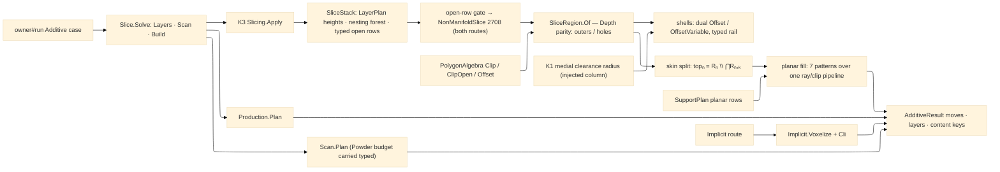

# [RASM_FABRICATION_SLICING]

The additive slicing page is a kernel slice-stack consumer: K3 emits the layer truth through `SliceStack`, and this owner turns oriented closed contours into FFF/DED shells, solid skins, planar infill, support hatches, and additive moves. Gyroid, TPMS, cellular, lattice, grayscale, and `.cli` interiors route through `Additive/implicit`; they never become `InfillPattern` rows. The page mints TWO shared surfaces every planar Additive consumer reads: `SliceRegion` — the hole-carrying layer-region atom that lifts the kernel nesting forest (`Depth` parity: even = boundary, odd = hole) into an explicit outer/hole component pair, because `PolygonAlgebra` normalizes every loop winding and a winding-encoded hole dies on entry — and the `AdditivePolicy` dispatch whose THREE cases (`Layers` planar fill · `Scan` LPBF vectors · `Build` production package) are the complete `owner#run` additive routing. The only public fill entry is `Slice.Layers(SliceStack, InfillPolicy)` returning the owner-safe `AdditiveResult`; open chains gate ONCE at that entry for BOTH routes — a rejecting policy routes `NonManifoldSlice` 2708 before a planar hatch or a voxel lease exists — variable layer heights stay kernel `LayerPlan` rows, and printability is the upstream K36 census precondition the kernel slice gate enforces, never a slicer-side mesh-defect classifier.

## [01]-[INDEX]

- [01]-[SLICING]: owns `SliceRegion`, `InfillRoute`, planar `InfillPattern`, `ShellBeadLaw`/`ShellOverlap`/`OpenSheetPolicy`/`SeamPlacement` policy rows, `FeedPolicy` per-feature feeds, `DensityPolicy` adaptive density, solid-skin partition depth, Arachne medial-clearance beading, support-region hatching, implicit-lane delegation, the `AdditivePolicy` three-case dispatch with `Slice.Solve`, and the ONE `Slice.Layers(SliceStack, InfillPolicy)` fold from kernel contours to `AdditiveResult`.

## [02]-[SLICING]

- Owner: `SliceRegion` the outer/hole layer-region atom with the component set-algebra (`Difference`/`Intersect`/`Union`/`Grow`/`Rays`/`Area`/`Covers`) every planar Additive page computes regions through; `InfillRoute` the discriminant (`Planar` · `Implicit`) separating FFF/DED contour hatching from PicoGK voxel interiors; `InfillPattern` `[SmartEnum<string>]` the planar hatch family (`rectilinear`/`aligned-rectilinear`/`concentric`/`honeycomb`/`grid`/`triangles`/`cubic`); `ShellBeadLaw` the shell-width law (`constant` · `medial-clearance`); `ShellOverlap` the overlapping-shell resolution row; `OpenSheetPolicy` the typed open-chain disposition; `SeamPlacement` the shell seam-start law (`nearest`/`rear`/`aligned`); `FeedPolicy` the per-feature feed row (travel/outer shell/inner shell/skin/infill/support); `DensityPolicy` the adaptive density carrier; `InfillPolicy` the one policy row; `InfillLayer` the per-layer receipt; `AdditivePolicy` the owner#run additive dispatch union; `Slice` the static surface owning `Solve` and `Layers`.
- Cases: `AdditivePolicy` cases 3 — `Layers(LayerPlan, SlicePolicy, InfillPolicy)` kernel-slice-then-fill, `Scan(LayerPlan, SlicePolicy, ScanPolicy, RemovalBudget.Powder, Option<SupportPolicy>)` the LPBF vector lane (the case CARRIES the narrowed `Powder` budget, so no caller re-narrows the physics union), `Build(BuildPolicy)` the production hand-off; `InfillRoute` cases 2 — `Planar(InfillPattern)` hatches `SliceRegion` sets, `Implicit(ImplicitOp)` delegates the interior to `Implicit.Voxelize` + `Implicit.Cli(voxels, op.Policy)` with the voxel lease disposed after egress; `InfillPattern` rows 7 — rectilinear alternating hatch, aligned-rectilinear fixed-angle hatch, concentric offset rings, honeycomb three-axis lattice, grid cross-hatch, triangles 0°/60°/120° full crossing, cubic three-direction hatch phase-shifted by elevation; `ShellBeadLaw` rows 2 — constant extrusion width or K1 medial clearance radius; `ShellOverlap` rows 3 — keep, union, trim; `OpenSheetPolicy` rows 2 — reject or trace-only; `SeamPlacement` rows 3 — nearest to previous position, rear-aligned, angle-aligned.
- Entry: `public static Fin<AdditiveResult> Layers(SliceStack stack, InfillPolicy policy)` — the ONE additive layer entry; it consumes the KERNEL-emitted stack and returns owner-safe moves/layer count/artifact keys. The open-chain census gates HERE, before the route switch: `OpenSheetPolicy.Reject` routes `FabricationFault.NonManifoldSlice(layer, openChains)` 2708 for either route, and kernel `GeometryFault.DegenerateInput` rejects an empty stack, each lowered with `.ToError()`. `Slice.Solve(FabricationPolicy.Additive, FabricationInput)` is the owner#run arm dispatching the `AdditivePolicy` union.
- Auto: `Slice.Layers` admits each layer ONCE through `SliceRegion.Of(stack, n)` — contour ordinals walk `LayerPtr`, `Depth` parity splits boundary from hole, open ordinals count toward the entry gate. Shells compose `PolygonAlgebra.Offset` for constant width and `PolygonAlgebra.OffsetVariable` for Arachne beading over the dual outer/hole offsets (`SliceRegion.Grow` — a hole's shell offsets outward as the region shrinks); a failed offset or overlap Boolean stays a typed failure on the layer rail, never an empty-sequence fallback. The skin partition runs the same recurrence family scanpath's exposure classes use: `topₙ = Rₙ \ ⋂Rₙ₊₁..ₙ₊ₖ`, `bottomₙ = Rₙ \ ⋂Rₙ₋₁..ₙ₋ₖ`, skin fills dense at the extrusion width, the interior remainder at `DensityPolicy` spacing. Support regions enter through `SupportPlan.Planar` rows and hatch through the same ray/clip primitive at support/interface densities. Every hatch clips through `SliceRegion.Rays` — inside the outers, outside the holes — so a tube's bore never fills. `Moves` orders contours outermost-first, rotates each shell start under `SeamPlacement`, and assigns the `FeedPolicy` feed of its feature class. `Implicit` routes voxel interiors to `Additive/implicit` and returns only `.cli`/mask content keys. The K1 medial clearance RADIUS arrives as the injected `MedialClearanceRadius` delegate column (the architecture's cross-seam pattern — the kernel owner closes it), and K36 printability is the upstream precondition the kernel slice admission enforces; any typed open row that survives to this plane reaches 2708 here.
- Receipt: `AdditiveResult` is the typed evidence — planar routes carry additive `Move` rows and the kernel layer count; implicit routes carry the `.cli` key and mask keys. `InfillLayer` is plane-local evidence for the region, shells, skin, model infill, support infill, and open traces; no `SliceLayer` mesh-section type, PicoGK `Voxels`, or kernel contour row escapes on the owner result.
- Packages: `Rasm.Meshing` (`Slicing.Apply → Fin<SliceStack>` K3, `SliceStack.LayerAt`/`LayerPtr`/`Depth`/`IsOpen`/`ContourAt`/`Elevations`; `LayerPlan` rows stay kernel policy), `Geometry2D/algebra#POLYGON_ALGEBRA` (`Offset`/`OffsetVariable`/`Clip`/`ClipOpen`/`Area`), `Additive/implicit#IMPLICIT` (`ImplicitOp`, `Implicit.Voxelize`, `Implicit.Cli`, `CliStack`), `Additive/support#SUPPORT` (`SupportPlan`, `SupportLayer`, `Support.Grow`), `Additive/scanpath#SCAN_PATH` (`Scan.Plan`, `ScanPolicy` — the `Scan` case body), `Additive/production#PRODUCTION` (`Production.Plan`, `BuildPolicy` — the `Build` case body), `Process/physics#CUT_PARAMETER` (`RemovalBudget.Powder` — the `Scan` case payload), `Process/owner#FABRICATION_OWNER` (`Loop`/`Edge3`/`Move`/`ContentKey`/`AdditiveResult`), `Rasm.Numerics` (`GeometryFault`), Thinktecture.Runtime.Extensions, LanguageExt.Core, BCL inbox.
- Growth: a new planar hatch is one `InfillPattern` row plus one `FillRegions` arm over the same ray/clip pipeline (a lightning-style interior tree admits as exactly this pair); a new implicit interior is one `ImplicitOp` case, not an infill row; a new layer-height law is one kernel `LayerPlan` row, not a Fabrication scheduler; a new shell compensation is one `ShellBeadLaw` row consuming K1 clearance output; a new seam law is one `SeamPlacement` row; a new additive route is one `AdditivePolicy` case plus one `Solve` arm; zero new entrypoint.
- Boundary: `Slice` is the one additive slice-stack consumer and an in-page `Section`/triangle sweep/endpoint chain is the deleted form; variable layer height belongs to K3 and a Fabrication height loop is the sealed-boundary violation; gyroid/TPMS belongs to `Implicit` and a planar gyroid pattern row is the named false collapse; printability belongs to K36 and a slicer-side mesh-defect classifier is the duplicate gate; region Booleans route `PolygonAlgebra` through `SliceRegion` and a slice-local Clipper call site or a bare hole-blind `Seq<Loop>` region is the named duplication defect; a shell failure flattened to empty geometry is the erased-rail defect; result payloads carry owner atoms and content keys only.

```csharp signature
// --- [RUNTIME_PRELUDE] ------------------------------------------------------------------------------------------------------------------------------
using LanguageExt;
using LanguageExt.Common;
using Rasm.Fabrication.Geometry2D;
using Rasm.Fabrication.Process;
using Rasm.Meshing;
using Rasm.Numerics;
using Rhino.Geometry;
using Thinktecture;
using static LanguageExt.Prelude;
using AdditiveResult = Rasm.Fabrication.Process.FabricationResult.AdditiveResult;

namespace Rasm.Fabrication.Additive;

// --- [TYPES] ----------------------------------------------------------------------------------------------------------------------------------------
[SmartEnum<string>]
public sealed partial class InfillPattern {
    public static readonly InfillPattern Rectilinear = new("rectilinear");
    public static readonly InfillPattern AlignedRectilinear = new("aligned-rectilinear");
    public static readonly InfillPattern Concentric = new("concentric");
    public static readonly InfillPattern Honeycomb = new("honeycomb");
    public static readonly InfillPattern Grid = new("grid");
    public static readonly InfillPattern Triangles = new("triangles");
    public static readonly InfillPattern Cubic = new("cubic");
}

[SmartEnum<string>]
public sealed partial class ShellBeadLaw {
    public static readonly ShellBeadLaw Constant = new("constant");
    public static readonly ShellBeadLaw MedialClearance = new("medial-clearance");
}

[SmartEnum<string>]
public sealed partial class ShellOverlap {
    public static readonly ShellOverlap Keep = new("keep");
    public static readonly ShellOverlap Union = new("union");
    public static readonly ShellOverlap Trim = new("trim");
}

[SmartEnum<string>]
public sealed partial class OpenSheetPolicy {
    public static readonly OpenSheetPolicy Reject = new("reject");
    public static readonly OpenSheetPolicy TraceOnly = new("trace-only");
}

// Shell seam-start law: Nearest chains starts to the previous layer's seam, Rear pins to max-Y, Aligned pins to the policy angle ray.
[SmartEnum<string>]
public sealed partial class SeamPlacement {
    public static readonly SeamPlacement Nearest = new("nearest");
    public static readonly SeamPlacement Rear = new("rear");
    public static readonly SeamPlacement Aligned = new("aligned");
}

// --- [MODELS] ---------------------------------------------------------------------------------------------------------------------------------------
// The hole-carrying layer-region atom every planar Additive page computes through. PolygonAlgebra force-normalizes
// loop windings, so the kernel holes-CW contract dies on entry; Depth parity over the nesting forest is the surviving
// hole truth, and it lives HERE as an explicit component pair — Rays clips inside the outers THEN outside the holes.
public sealed record SliceRegion(Seq<Loop> Outers, Seq<Loop> Holes) {
    public static readonly SliceRegion Empty = new(Seq<Loop>(), Seq<Loop>());

    public bool IsEmpty => Outers.IsEmpty;

    public static SliceRegion Of(SliceStack stack, int n) {
        Seq<int> closed = toSeq(Enumerable.Range(stack.LayerPtr[n], stack.LayerPtr[n + 1] - stack.LayerPtr[n]))
            .Filter(c => !stack.IsOpen(c));
        return new SliceRegion(
            closed.Filter(c => stack.Depth(c) % 2 == 0).Map(c => Ring(stack, c)),
            closed.Filter(c => stack.Depth(c) % 2 == 1).Map(c => Ring(stack, c)));
    }

    // Component set-algebra over the ONE PolygonAlgebra owner: A\B = (Ao\Bo) ∪ (Ao∩Bh) with A's holes retained,
    // A∩B = (Ao∩Bo) with pooled holes, A∪B pools outers and carves each side's holes by the other's solid.
    public Fin<SliceRegion> Difference(SliceRegion b) =>
        IsEmpty || b.IsEmpty
            ? Fin.Succ(this)
            : from cut in PolygonAlgebra.Clip(Outers, b.Outers, ClipOp.Difference)
              from back in b.Holes.IsEmpty ? Fin.Succ(Seq<Loop>()) : PolygonAlgebra.Clip(Outers, b.Holes, ClipOp.Intersect)
              from joined in cut.IsEmpty || back.IsEmpty ? Fin.Succ(cut.Concat(back)) : PolygonAlgebra.Clip(cut, back, ClipOp.Union)
              select new SliceRegion(joined, Holes);

    public Fin<SliceRegion> Intersect(SliceRegion b) =>
        IsEmpty || b.IsEmpty
            ? Fin.Succ(Empty)
            : PolygonAlgebra.Clip(Outers, b.Outers, ClipOp.Intersect).Map(outers => new SliceRegion(outers, Holes.Concat(b.Holes)));

    public Fin<SliceRegion> Union(SliceRegion b) =>
        b.IsEmpty ? Fin.Succ(this)
        : IsEmpty ? Fin.Succ(b)
        : PolygonAlgebra.Clip(Outers, b.Outers, ClipOp.Union).Map(outers => new SliceRegion(outers, Holes.Concat(b.Holes)));

    public Fin<SliceRegion> Grow(double delta) =>
        IsEmpty
            ? Fin.Succ(Empty)
            : from outers in PolygonAlgebra.Offset(Outers, delta, OffsetEnds.Polygon)
              from holes in Holes.IsEmpty ? Fin.Succ(Seq<Loop>()) : PolygonAlgebra.Offset(Holes, -delta, OffsetEnds.Polygon)
              select new SliceRegion(outers, holes);

    public Seq<Edge3> Rays(Seq<Edge3> rays) {
        Seq<Edge3> inside = PolygonAlgebra.ClipOpen(rays, Outers).Inside;
        return Holes.IsEmpty ? inside : PolygonAlgebra.ClipOpen(inside, Holes).Outside;
    }

    public double Area() => Outers.Map(PolygonAlgebra.Area).Sum() - Holes.Map(PolygonAlgebra.Area).Sum();

    public bool Covers(Point3d p) => Outers.Exists(l => l.Covers(p)) && !Holes.Exists(l => l.Covers(p));

    public BoundingBox Bound() => new(Outers.Bind(static l => toSeq(l.Vertices)));

    static Loop Ring(SliceStack stack, int c) =>
        new(toArr(stack.ContourAt(c).Polyline.SkipLast(1).Select(static p => new Point3d(p.X, p.Y, p.Z))), Closed: true);
}

public sealed record FeedPolicy(double Travel, double OuterShell, double InnerShell, double Skin, double Infill, double Support) {
    public static FeedPolicy Fff() => new(Travel: 9000.0, OuterShell: 1500.0, InnerShell: 2400.0, Skin: 1800.0, Infill: 3000.0, Support: 3600.0);
}

public sealed record DensityPolicy(double Model, double SupportSparse, double SupportInterface, Option<Func<Point3d, double>> Field = default) {
    public static DensityPolicy Fff() => new(Model: 0.20, SupportSparse: 0.12, SupportInterface: 0.80);

    public double ModelSpacing(Point3d p, double width) => Spacing(Field.Map(f => f(p)).IfNone(Model), width);

    public double SupportSpacing(double width) => Spacing(SupportSparse, width);

    public double InterfaceSpacing(double width) => Spacing(SupportInterface, width);

    static double Spacing(double density, double width) => Math.Max(width, width / Math.Max(density, 1e-3));
}

public sealed record InfillPolicy(
    InfillRoute Route,
    double ExtrusionWidth,
    int ShellCount,
    int TopSolidLayers,
    int BottomSolidLayers,
    double InfillAngleRadians,
    FeedPolicy Feeds,
    DensityPolicy Density,
    ShellBeadLaw BeadLaw,
    ShellOverlap Overlap,
    OpenSheetPolicy OpenSheets,
    SeamPlacement Seam,
    double ThinWallBeadFloor,
    Option<Func<Point3d, double>> MedialClearanceRadius = default,
    Option<SupportPlan> Support = default) {
    public static InfillPolicy Fff(double extrusionWidth) => new(
        new InfillRoute.Planar(InfillPattern.Rectilinear),
        extrusionWidth,
        ShellCount: 2,
        TopSolidLayers: 4,
        BottomSolidLayers: 3,
        InfillAngleRadians: Math.PI / 4.0,
        FeedPolicy.Fff(),
        DensityPolicy.Fff(),
        ShellBeadLaw.Constant,
        ShellOverlap.Trim,
        OpenSheetPolicy.Reject,
        SeamPlacement.Nearest,
        ThinWallBeadFloor: 0.35);
}

[Union(ConversionFromValue = ConversionOperatorsGeneration.None)]
public abstract partial record InfillRoute {
    private InfillRoute() { }

    public sealed record Planar(InfillPattern Pattern) : InfillRoute;
    public sealed record Implicit(ImplicitOp Op) : InfillRoute;
}

public sealed record InfillLayer(
    int Layer,
    double Elevation,
    SliceRegion Region,
    Seq<Loop> Shells,
    Seq<Edge3> Skin,
    Seq<Edge3> ModelInfill,
    Seq<Edge3> SupportInfill,
    Seq<Edge3> OpenTraces);

// The owner#run Additive-arm dispatch: Layers fills, Scan vectors, Build packages — three cases, the whole
// additive plane one dispatch. Scan CARRIES the narrowed Powder budget so no caller re-narrows the physics union.
[Union(ConversionFromValue = ConversionOperatorsGeneration.None)]
public abstract partial record AdditivePolicy {
    private AdditivePolicy() { }

    public sealed record Layers(LayerPlan Plan, SlicePolicy Slice, InfillPolicy Infill) : AdditivePolicy;
    public sealed record Scan(LayerPlan Plan, SlicePolicy Slice, ScanPolicy Policy, RemovalBudget.Powder Budget, Option<SupportPolicy> Support) : AdditivePolicy;
    public sealed record Build(BuildPolicy Policy) : AdditivePolicy;
}

// --- [OPERATIONS] -----------------------------------------------------------------------------------------------------------------------------------
public static class Slice {
    public static Fin<FabricationResult> Solve(FabricationPolicy.Additive policy, FabricationInput input) =>
        policy.Policy.Switch(
            state:  input,
            layers: static (i, p) => Sliced(i, p.Plan, p.Slice)
                .Bind(stack => Layers(stack, p.Infill))
                .Map(static r => (FabricationResult)r),
            scan:   static (i, p) => Sliced(i, p.Plan, p.Slice)
                .Bind(stack => Grown(stack, p.Support).Bind(support => Additive.Scan.Plan(stack, p.Policy, p.Budget, support)))
                .Map(static plan => (FabricationResult)new AdditiveResult(Seq<Move>(), plan.Layers.Count, Seq(plan.Key))),
            build:  static (i, p) => i.Model.Match(
                None: () => Fin.Fail<FabricationResult>(GeometryFault.DegenerateInput("build:model-missing").ToError()),
                Some: model => Production.Plan(p.Policy, model).Map(static r => (FabricationResult)r)));

    // Open chains gate ONCE, for BOTH routes: a rejecting policy fails typed before a hatch or a voxel lease exists.
    public static Fin<AdditiveResult> Layers(SliceStack stack, InfillPolicy policy) =>
        stack.LayerCount == 0
            ? Fin.Fail<AdditiveResult>(GeometryFault.DegenerateInput("slice:empty-kernel-stack").ToError())
            : OpenGate(stack, policy.OpenSheets).Bind(_ => policy.Route.Switch(
                state:    (stack, policy),
                planar:   static (s, route) => Planar(s.stack, route.Pattern, s.policy),
                implicit: static (s, route) => Voxel(route.Op)));

    static Fin<Unit> OpenGate(SliceStack stack, OpenSheetPolicy open) =>
        toSeq(Enumerable.Range(0, stack.LayerCount))
            .Map(n => (Layer: n, Open: stack.LayerAt(n).Filter(static c => !c.Closed).Count))
            .Filter(static row => row.Open > 0)
            .HeadOrNone()
            .Match(
                None: () => Fin.Succ(unit),
                Some: row => open == OpenSheetPolicy.Reject
                    ? Fin.Fail<Unit>(FabricationFault.NonManifoldSlice(row.Layer, row.Open).ToError())
                    : Fin.Succ(unit));

    static Fin<AdditiveResult> Planar(SliceStack stack, InfillPattern pattern, InfillPolicy policy) =>
        toSeq(Enumerable.Range(0, stack.LayerCount))
            .Map(n => Layer(stack, n, pattern, policy))
            .Sequence()
            .Map(layers => new AdditiveResult(Moves(layers, policy), layers.Count, Seq<ContentKey>()));

    // The implicit route rides the SAME policy the voxels rasterized under: Cli routes the selected CliMode row,
    // the layer count derives from the BUILT stack, and the voxel lease disposes here after egress.
    static Fin<AdditiveResult> Voxel(ImplicitOp op) =>
        Implicit.Voxelize(op).Map(voxels => {
            try {
                CliStack cli = Implicit.Cli(voxels, op.Policy);
                return new AdditiveResult(Seq<Move>(), cli.Layers, Seq(cli.Key).Concat(cli.Masks));
            }
            finally {
                voxels.Dispose();
            }
        });

    static Fin<InfillLayer> Layer(SliceStack stack, int n, InfillPattern pattern, InfillPolicy policy) {
        SliceRegion region = SliceRegion.Of(stack, n);
        Seq<Edge3> traces = policy.OpenSheets == OpenSheetPolicy.TraceOnly ? OpenRuns(stack, n) : Seq<Edge3>();
        if (region.IsEmpty)
            return Fin.Succ(new InfillLayer(n, stack.Elevations[n], region, Seq<Loop>(), Seq<Edge3>(), Seq<Edge3>(), Seq<Edge3>(), traces));

        return from shells in Shells(region, policy)
               from resolved in ResolveShells(shells, policy.Overlap)
               from inner in region.Grow(-policy.ShellCount * policy.ExtrusionWidth)
               from skin in SkinSplit(stack, n, inner, policy)
               let bound = region.Bound()
               let z = stack.Elevations[n]
               let skinFill = Fill(skin.Skin, z, bound, InfillPattern.Rectilinear, policy, n, _ => policy.ExtrusionWidth)
               let model = Fill(skin.Interior, z, bound, pattern, policy, n, p => policy.Density.ModelSpacing(p, policy.ExtrusionWidth))
               let support = SupportFill(policy.Support, n, z, bound, policy)
               select new InfillLayer(n, z, region, resolved, skinFill, model, support, traces);
    }

    // --- [SHELLS]
    // Dual outer/hole offsets per pass; a failed offset or overlap Boolean STAYS a typed failure on the layer rail.
    static Fin<Seq<Loop>> Shells(SliceRegion region, InfillPolicy policy) =>
        toSeq(Enumerable.Range(1, Math.Max(0, policy.ShellCount)))
            .Map(pass => ShellPass(region, policy, pass))
            .Sequence()
            .Map(static passes => passes.Bind(static loops => loops));

    static Fin<Seq<Loop>> ShellPass(SliceRegion region, InfillPolicy policy, int pass) =>
        policy.BeadLaw == ShellBeadLaw.MedialClearance
            ? policy.MedialClearanceRadius
                .Map(radius =>
                    from outers in PolygonAlgebra.OffsetVariable(region.Outers, p => -pass * BeadWidth(radius(p), policy), OffsetEnds.Polygon)
                    from holes in region.Holes.IsEmpty
                        ? Fin.Succ(Seq<Loop>())
                        : PolygonAlgebra.OffsetVariable(region.Holes, p => pass * BeadWidth(radius(p), policy), OffsetEnds.Polygon)
                    select outers.Concat(holes))
                .IfNone(() => ConstantPass(region, policy, pass))
            : ConstantPass(region, policy, pass);

    static Fin<Seq<Loop>> ConstantPass(SliceRegion region, InfillPolicy policy, int pass) =>
        from outers in PolygonAlgebra.Offset(region.Outers, -pass * policy.ExtrusionWidth, OffsetEnds.Polygon)
        from holes in region.Holes.IsEmpty
            ? Fin.Succ(Seq<Loop>())
            : PolygonAlgebra.Offset(region.Holes, pass * policy.ExtrusionWidth, OffsetEnds.Polygon)
        select outers.Concat(holes);

    static double BeadWidth(double clearanceRadius, InfillPolicy policy) {
        double wall = Math.Max(2.0 * clearanceRadius, policy.ExtrusionWidth);
        int beads = Math.Max(1, (int)Math.Ceiling(wall / Math.Max(policy.ExtrusionWidth, 1e-6)));
        double floor = Math.Max(policy.ThinWallBeadFloor, 0.0) * policy.ExtrusionWidth;
        return Math.Clamp(wall / beads, Math.Max(floor, 1e-6), policy.ExtrusionWidth);
    }

    static Fin<Seq<Loop>> ResolveShells(Seq<Loop> shells, ShellOverlap overlap) =>
        overlap == ShellOverlap.Union
            ? PolygonAlgebra.Clip(shells, Seq<Loop>(), ClipOp.Union)
            : overlap == ShellOverlap.Trim
                ? shells.Fold(Fin.Succ(Seq<Loop>()), static (kept, shell) =>
                    kept.Bind(k => k.IsEmpty
                        ? Fin.Succ(Seq(shell))
                        : PolygonAlgebra.Clip(Seq(shell), k, ClipOp.Difference).Map(cut => k.Concat(cut))))
                : Fin.Succ(shells);

    // --- [SKIN]
    // topₙ = Rₙ \ ⋂Rₙ₊₁..ₙ₊ₖ · bottomₙ = Rₙ \ ⋂Rₙ₋₁..ₙ₋ₖ — the exposure recurrence over SliceRegion algebra;
    // a boundary layer (fewer than k neighbors) is fully solid on that face.
    static Fin<(SliceRegion Skin, SliceRegion Interior)> SkinSplit(SliceStack stack, int n, SliceRegion inner, InfillPolicy policy) =>
        from covered in Covered(stack, n + 1, Math.Min(policy.TopSolidLayers, stack.LayerCount - n - 1), policy.TopSolidLayers)
        from below in Covered(stack, n - policy.BottomSolidLayers, Math.Min(policy.BottomSolidLayers, n), policy.BottomSolidLayers)
        from top in inner.Difference(covered)
        from bottom in inner.Difference(below)
        from skin in top.Union(bottom)
        from interior in inner.Difference(skin)
        select (skin, interior);

    static Fin<SliceRegion> Covered(SliceStack stack, int start, int count, int demanded) =>
        count < demanded
            ? Fin.Succ(SliceRegion.Empty)
            : toSeq(Enumerable.Range(start, count))
                .Map(i => SliceRegion.Of(stack, i))
                .Fold(Fin.Succ(Option<SliceRegion>.None), static (acc, r) =>
                    acc.Bind(prior => prior.Match(
                        None: () => Fin.Succ(Some(r)),
                        Some: held => held.Intersect(r).Map(Some))))
                .Map(static r => r.IfNone(SliceRegion.Empty));

    // --- [INFILL]
    static Seq<Edge3> Fill(
        SliceRegion region, double z, BoundingBox bound, InfillPattern pattern, InfillPolicy policy, int layer, Func<Point3d, double> spacing) =>
        region.IsEmpty
            ? Seq<Edge3>()
            : pattern.Switch(
                state:              (region, z, bound, policy, layer, spacing),
                rectilinear:        static s => s.region.Rays(Hatch(s.bound, s.policy.InfillAngleRadians + AlternateBy(s.layer), s.spacing)),
                alignedRectilinear: static s => s.region.Rays(Hatch(s.bound, s.policy.InfillAngleRadians, s.spacing)),
                grid:               static s => s.region.Rays(Hatch(s.bound, s.policy.InfillAngleRadians, s.spacing)
                                                    .Concat(Hatch(s.bound, s.policy.InfillAngleRadians + Math.PI / 2.0, s.spacing))),
                triangles:          static s => s.region.Rays(toSeq(Enumerable.Range(0, 3))
                                                    .Bind(k => Hatch(s.bound, s.policy.InfillAngleRadians + k * Math.PI / 3.0, s.spacing))),
                cubic:              static s => s.region.Rays(toSeq(Enumerable.Range(0, 3))
                                                    .Bind(k => Hatch(s.bound, s.policy.InfillAngleRadians + k * Math.PI / 3.0,
                                                        p => s.spacing(p), phase: s.z))),
                honeycomb:          static s => s.region.Rays(Hatch(s.bound, 0.0, s.spacing)
                                                    .Concat(Hatch(s.bound, Math.PI / 3.0, s.spacing))
                                                    .Concat(Hatch(s.bound, 2.0 * Math.PI / 3.0, s.spacing))),
                concentric:         static s => Rings(s.region, s.spacing(Centre(s.bound))));

    static Seq<Edge3> SupportFill(Option<SupportPlan> support, int layer, double z, BoundingBox bound, InfillPolicy policy) =>
        support.Map(plan => plan.Planar
                .Filter(row => row.Layer == layer)
                .Bind(row =>
                    row.Sparse.Rays(Hatch(bound, 0.0, _ => policy.Density.SupportSpacing(policy.ExtrusionWidth)))
                        .Concat(row.Interface.Rays(Hatch(bound, 0.0, _ => policy.Density.InterfaceSpacing(policy.ExtrusionWidth))))))
            .IfNone(Seq<Edge3>());

    static Seq<Edge3> Hatch(BoundingBox bound, double angle, Func<Point3d, double> spacing, double phase = 0.0) {
        double diag = Math.Max(bound.Min.DistanceTo(bound.Max), 1e-3);
        Point3d centre = Centre(bound);
        Vector3d dir = new(Math.Cos(angle), Math.Sin(angle), 0.0);
        Vector3d step = new(-Math.Sin(angle), Math.Cos(angle), 0.0);
        return toSeq(Unfold(-0.5 * diag + phase % Math.Max(spacing(centre), 1e-3), offset => offset <= 0.5 * diag,
                offset => offset + Math.Max(spacing(centre + offset * step), 1e-3)))
            .Map(offset => {
                Point3d mid = centre + offset * step;
                return new Edge3(mid - 0.5 * diag * dir, mid + 0.5 * diag * dir);
            });
    }

    static System.Collections.Generic.IEnumerable<double> Unfold(double seed, Func<double, bool> admit, Func<double, double> next) {
        for (double at = seed; admit(at); at = next(at)) yield return at;
    }

    // Ring count derives from the region extent, never a fixed ceiling; exhaustion terminates the fold.
    static Seq<Edge3> Rings(SliceRegion region, double spacing) {
        int cap = Math.Max(1, (int)Math.Ceiling(region.Bound().Min.DistanceTo(region.Bound().Max) / Math.Max(spacing, 1e-3)));
        return toSeq(Enumerable.Range(1, cap))
            .Map(k => region.Grow(-k * spacing).Map(static r => r.Outers.Concat(r.Holes)).IfFail(Seq<Loop>()))
            .TakeWhile(static r => !r.IsEmpty)
            .Bind(static r => r)
            .Bind(static loop => toSeq(Enumerable.Range(0, loop.Count)).Map(i => new Edge3(loop.At(i), loop.At(i + 1))));
    }

    static double AlternateBy(int layer) => layer % 2 == 0 ? 0.0 : Math.PI / 2.0;

    // --- [MOVES]
    // Contours outermost-first, seam rotation per SeamPlacement, per-feature feed classes off the ONE FeedPolicy row.
    static Seq<Move> Moves(Seq<InfillLayer> layers, InfillPolicy policy) =>
        layers.Bind(layer =>
            layer.Region.Outers.Concat(layer.Region.Holes).Map(l => (Path: Seam(l, layer, policy), Feed: policy.Feeds.OuterShell))
                .Concat(layer.Shells.Map(l => (Path: Seam(l, layer, policy), Feed: policy.Feeds.InnerShell)))
                .Concat(layer.Skin.Map(e => (Path: Arr(e.A, e.B), Feed: policy.Feeds.Skin)))
                .Concat(layer.ModelInfill.Map(e => (Path: Arr(e.A, e.B), Feed: policy.Feeds.Infill)))
                .Concat(layer.SupportInfill.Map(e => (Path: Arr(e.A, e.B), Feed: policy.Feeds.Support)))
                .Concat(layer.OpenTraces.Map(e => (Path: Arr(e.A, e.B), Feed: policy.Feeds.Infill)))
                .Bind(row => MovePath(row.Path, row.Feed, policy.Feeds.Travel)));

    static Arr<Point3d> Seam(Loop loop, InfillLayer layer, InfillPolicy policy) {
        int start = policy.Seam.Switch(
            state:   (loop, layer),
            nearest: static s => SeamIndex(s.loop, s.layer.Region.Bound().Min),
            rear:    static s => toSeq(Enumerable.Range(0, s.loop.Count)).OrderByDescending(i => s.loop.At(i).Y).First(),
            aligned: static s => SeamIndex(s.loop, s.layer.Region.Bound().Max));
        return toArr(Enumerable.Range(0, loop.Count + 1).Select(i => loop.At(start + i)));
    }

    static int SeamIndex(Loop loop, Point3d anchor) =>
        toSeq(Enumerable.Range(0, loop.Count)).OrderBy(i => loop.At(i).DistanceTo(anchor)).First();

    static Seq<Move> MovePath(Arr<Point3d> path, double feed, double travel) =>
        path.IsEmpty
            ? Seq<Move>()
            : Seq(new Move(path[0], Rapid: true, Feed: travel))
                .Concat(toSeq(Enumerable.Range(1, path.Count - 1)).Map(i => new Move(path[i], Rapid: false, Feed: feed)));

    // --- [BOUNDARIES]
    static Fin<Option<SupportPlan>> Grown(SliceStack stack, Option<SupportPolicy> policy) =>
        policy.Match(
            None: () => Fin.Succ(Option<SupportPlan>.None),
            Some: p => Support.Grow(stack, p).Map(Some));

    static Fin<SliceStack> Sliced(FabricationInput input, LayerPlan plan, SlicePolicy slice) =>
        input.Model.Match(
            None: () => Fin.Fail<SliceStack>(GeometryFault.DegenerateInput("slice:model-missing").ToError()),
            Some: model => Slicing.Apply(new SliceOp(model, Plane.WorldXY, plan, slice)));

    static Seq<Edge3> OpenRuns(SliceStack stack, int n) =>
        stack.LayerAt(n)
            .Filter(static c => !c.Closed)
            .Bind(static c => Runs(toArr(c.Polyline.Select(static p => new Point3d(p.X, p.Y, p.Z)))));

    static Seq<Edge3> Runs(Arr<Point3d> points) =>
        points.Count < 2
            ? Seq<Edge3>()
            : toSeq(Enumerable.Range(0, points.Count - 1)).Map(i => new Edge3(points[i], points[i + 1]));

    static Point3d Centre(BoundingBox bound) =>
        (bound.Min + bound.Max) * 0.5;
}
```


