# [RASM_FABRICATION_SUPPORT]

The support-generation owner is ONE `Support.Grow` fold over the kernel slice stack. `SupportPolicy.Planar` carries only vertical-gap and interface-depth payload, `SupportPolicy.Tree` carries only branch geometry, and `SupportPolicy.Generated` admits contour-rib, conical, organic, process-specific, or hybrid laws as one parameterized value over the shared census and bridge facts. `SupportPlan.Composite` combines planar and tree receipts without storing empty opposite-lane fields; its total projections let every existing consumer absorb generated hybrids. The planar lane computes overhang and top-down support recurrences over `SliceRegion`; its angle is explicitly measured from horizontal, its speck filter preserves only holes still owned by retained outers, and both sparse and interface regions survive as distinct consumers. The tree lane emits a real directed acyclic graph: tips carry no parents, ordinary descendants one, and a merge creates a new multi-parent junction instead of deleting a branch. `BranchBias` drives far-field lateral descent, sibling attraction drives merge-seeking descent, swept segments test the keep-out, QuikGraph validates roots and acyclicity, and frustum volume uses actual parent-edge length and endpoint radii.

Bridge detection walks outer and hole boundaries through `AnchorState.Next`; transition-tagged `Supported` spans mint tips, while `Anchored` spans do not. `Additive/slicing` preserves sparse/interface density, `Additive/scanpath` preserves the two exposure classes, and `Additive/production` plus `Additive/implicit` lower every parent edge to their native lattice representation.

Wire posture: HOST-LOCAL. `SupportPlan` crosses only the in-process seam to the slicing/scanpath/production/implicit consumers — never a browser or peer wire; the lanes and state machines never sit between wire and rail.

## [01]-[INDEX]

- [01]-[SUPPORT]: owns the payload-bearing `SupportPolicy` and `SupportPlan` lane unions, the `AvoidanceState`/`AnchorState`/`TreeRole` axes, the overhang/accumulation recurrences, the influence-area tree walk with model-rests, the bridge state machine, the `SupportLayer`/`TreeNode`/`BridgeSpan` atoms, and the ONE `Support.Grow` fold — planar and tree lanes on one entry, the voxel lane declared to `implicit`.

## [02]-[SUPPORT]

- Owner: `SupportPolicy` `[Union]` carries the lane discriminant and its applicable payload — `Planar` owns `ZGapLayers`/`InterfaceLayers`, `Tree` owns branch angle, radii, tip pitch, radius gain, and bias, and `Generated` owns one census-to-plan column; `AvoidanceState` `[SmartEnum<string>]` (`fast`/`fast-safe`/`slow`/`collision`) the per-cell descent classification the tree walk caches per layer — each row selecting a distinct target/step behavior; `AnchorState` `[SmartEnum<string>]` (`outside`/`hanging`/`anchored`/`supported`) the bridge coverage machine carrying the ONE `Next` transition row; `TreeRole` `[SmartEnum<string>]` (`tip`/`branch`/`merge`/`root`/`model-rest`) the node disposition — the receipt names its plate roots and on-model rests, never a sentinel overload; `SupportLayer` the per-layer planar receipt (sparse + interface `SliceRegion`s); `TreeNode` the branch-graph row whose adjacency has zero parents for tips, one for ordinary branches, and multiple for explicit merge junctions; `BridgeSpan` the typed bridge verdict; `SupportPlan` `[Union]` carries planar rows, tree nodes, or a recursively composed hybrid and exposes total `PlanarRows`/`TreeNodes` projections; `Support` the static surface owning the ONE `Grow` fold.
- Cases: `SupportPolicy` cases 3 — built-in planar, built-in tree, and parameterized generated law; `SupportPlan` cases 3 — planar, tree, and nonempty composite; `AvoidanceState` rows 4 — collision, slow vertical descent, sibling-seeking fast-safe descent, and policy-bias fast descent; `AnchorState` rows 4 with one total transition; `TreeRole` rows 5; the planar recurrences are cone advance, top-down accumulation, and interface carve.
- Entry: `public static Fin<SupportPlan> Grow(SliceStack stack, SupportPolicy policy)` — the ONE entrypoint; the policy case discriminates planar/tree inside the fold; `Fin<T>` routes `FabricationFault.SupportUnbuildable` 2735 `(layer, region)` when the tree search terminates in `Collision` with neither a vertical channel nor a model-rest, and kernel `GeometryFault.DegenerateInput` on an empty stack, lowered by `Process/faults`.
- Auto: `Grow` computes one overhang census, folds planar demand top-down, or descends a tree under swept keep-out tests. Far-field nodes follow `BranchBias`; near siblings converge and mint a new multi-parent merge node. The completed graph validates as a rooted DAG before emission, and bridge detection walks both outer and hole rings.
- Receipt: `SupportPlan` IS the typed evidence — `Planar` carries its `SupportLayer` stack, `Tree` carries its role-tagged `TreeNode` graph, and `Composite` carries a nonempty algebra of those receipts; every case carries `BridgeSpan` verdicts and support volume, and no case stores an empty opposite-lane ghost. `PlanarRows` and `TreeNodes` are computed projections, so generated hybrid plans reach both consumer families without a second receipt. No generic support ledger or mesh realization exists here: beam/lattice solids are `implicit`'s voxel lane and `production`'s `CBeamLattice` lowering, while FFF support toolpaths are `slicing`'s hatch.
- Packages: `Rasm.Meshing` (`SliceStack`), `Additive/slicing` (`SliceRegion`), `Geometry2D/algebra`, `Process/owner`, `Process/faults`, QuikGraph (`BidirectionalGraph`, `SEquatableEdge`, `IsDirectedAcyclicGraph`, `Roots`), `Rasm.Numerics`, Thinktecture.Runtime.Extensions, LanguageExt.Core, BCL inbox.
- Growth: contour-following ribs, conical volumes, organic fields, process-specific breakaway structures, and planar-plus-tree hybrids are `SupportPolicy.Generated` values returning existing `SupportPlan` cases or one `Composite`; a genuinely new receipt altitude is one `SupportPlan` case and one projection arm. A new avoidance class is one `AvoidanceState` row the cache classifier emits; a new bridge verdict is one `AnchorState` row + its `Next` clause; a new node disposition is one `TreeRole` row; per-material support parameters are policy-case seed values (`Fff`/`Lpbf` are the exemplars); the beam REALIZATION of `TreeNode` graphs is `implicit`'s lattice lane and `production`'s `CBeamLattice` map (declared seams), never a mesh builder here; zero new surface.
- Boundary: `Support` is the ONE support-geometry owner and a per-lane sibling class family is the deleted form — lanes are payload-bearing cases on one fold; a tag plus empty opposite-lane collections or a flat policy with inapplicable lane knobs is the null/default ghost defect. The voxel/lattice scaffold is `Additive/implicit`'s declared lane and a PicoGK call here is the split-brain defect; the interface-layer HEIGHT law is the kernel `LayerPlan.SupportInterface` row and an elevation schedule here is the SEALED-boundary violation; region Booleans route `PolygonAlgebra` through `SliceRegion` and a support-local Clipper call site or a hole-blind region set is the named duplication defect; the overhang verdict is the cone-advance formula over exact region algebra and a per-triangle normal-angle classifier here is the deleted form (the mesh-facet census is `production`'s orientation objective over kernel `Analysis/select`); a dropped unbuildable tip is the named silent-scrap defect — the fold FAILS typed with `SupportUnbuildable`.

```csharp signature
// --- [RUNTIME_PRELUDE] ------------------------------------------------------------------------------------------------------------------------------
using LanguageExt;
using LanguageExt.Common;
using QuikGraph;
using QuikGraph.Algorithms;
using Rasm.Fabrication.Geometry2D;
using Rasm.Fabrication.Process;
using Rasm.Meshing;                       // SliceStack — the K3 layer truth; LayerPlan.SupportInterface owns interface HEIGHTS
using Rasm.Numerics;
using Rhino.Geometry;
using Thinktecture;
using static LanguageExt.Prelude;

namespace Rasm.Fabrication.Additive;

// Per-cell descent classification the tree walk caches per layer; each row selects a distinct target/step law.
[SmartEnum<string>]
public sealed partial class AvoidanceState {
    public static readonly AvoidanceState Fast = new("fast");             // far field: lateral drift min(|BranchBias|, angle step) along the bias
    public static readonly AvoidanceState FastSafe = new("fast-safe");    // full-angle step toward the nearest sibling, merge-eligible
    public static readonly AvoidanceState Slow = new("slow");             // near model: vertical-only descent
    public static readonly AvoidanceState Collision = new("collision");   // inside keep-out: vertical, then model-rest, then 2735
}

// Bridge anchor-coverage machine; Next is the ONE total transition row the ring walk threads.
[SmartEnum<string>]
public sealed partial class AnchorState {
    public static readonly AnchorState Outside = new("outside");
    public static readonly AnchorState Hanging = new("hanging");
    public static readonly AnchorState Anchored = new("anchored");
    public static readonly AnchorState Supported = new("supported");

    public AnchorState Next(bool anchoredBelow, double runMm, double maxBridgeMm) =>
        anchoredBelow ? Anchored
        : this == Outside ? Hanging
        : runMm > maxBridgeMm ? Supported
        : Hanging;
}

// Node disposition: the receipt NAMES its plate roots and on-model rests — never a sentinel overload on Parent.
[SmartEnum<string>]
public sealed partial class TreeRole {
    public static readonly TreeRole Tip = new("tip");
    public static readonly TreeRole Branch = new("branch");
    public static readonly TreeRole Merge = new("merge");
    public static readonly TreeRole Root = new("root");
    public static readonly TreeRole ModelRest = new("model-rest");
}

// --- [MODELS] ---------------------------------------------------------------------------------------------------------------------------------------
[Union(ConversionFromValue = ConversionOperatorsGeneration.None)]
public abstract partial record SupportPolicy {
    private SupportPolicy(
        double criticalAngleFromHorizontalDeg,
        double xyGapMm,
        double minAreaMm2,
        double maxBridgeMm,
        OffsetPolicy offset) =>
        (CriticalAngleFromHorizontalDeg, XyGapMm, MinAreaMm2, MaxBridgeMm, Offset) =
        (criticalAngleFromHorizontalDeg, xyGapMm, minAreaMm2, maxBridgeMm, offset);

    public double CriticalAngleFromHorizontalDeg { get; }
    public double XyGapMm { get; }
    public double MinAreaMm2 { get; }
    public double MaxBridgeMm { get; }
    public OffsetPolicy Offset { get; }

    public sealed record Planar(
        double CriticalAngleFromHorizontalDeg,
        double XyGapMm,
        double MinAreaMm2,
        double MaxBridgeMm,
        OffsetPolicy Offset,
        int ZGapLayers,
        int InterfaceLayers) : SupportPolicy(CriticalAngleFromHorizontalDeg, XyGapMm, MinAreaMm2, MaxBridgeMm, Offset);

    public sealed record Tree(
        double CriticalAngleFromHorizontalDeg,
        double XyGapMm,
        double MinAreaMm2,
        double MaxBridgeMm,
        OffsetPolicy Offset,
        double BranchAngleDeg,
        double TipRadiusMm,
        double TrunkRadiusMm,
        double MergeRadiusMm,
        double TipPitchMm,
        double RadiusGainPerMm,
        Vector3d BranchBias) : SupportPolicy(CriticalAngleFromHorizontalDeg, XyGapMm, MinAreaMm2, MaxBridgeMm, Offset);

    public sealed record Generated(
        double CriticalAngleFromHorizontalDeg,
        double XyGapMm,
        double MinAreaMm2,
        double MaxBridgeMm,
        OffsetPolicy Offset,
        Func<SliceStack, Arr<SliceRegion>, Seq<BridgeSpan>, Fin<SupportPlan>> Grow) :
        SupportPolicy(CriticalAngleFromHorizontalDeg, XyGapMm, MinAreaMm2, MaxBridgeMm, Offset);

    public static Fin<Planar> Fff() =>
        OffsetPolicy.Admit(OffsetJoin.Miter, OffsetEnd.Polygon, miterLimit: 2.0, arcTolerance: 0.01)
            .Map(offset => new Planar(45.0, 0.8, 4.0, 8.0, offset, ZGapLayers: 1, InterfaceLayers: 3));

    public static Fin<Tree> Lpbf() =>
        OffsetPolicy.Admit(OffsetJoin.Miter, OffsetEnd.Polygon, miterLimit: 2.0, arcTolerance: 0.01)
            .Map(offset => new Tree(
                45.0, 0.15, 1.0, 2.0, offset, BranchAngleDeg: 30.0, TipRadiusMm: 0.3,
                TrunkRadiusMm: 1.2, MergeRadiusMm: 0.8, TipPitchMm: 2.5, RadiusGainPerMm: 0.04, BranchBias: Vector3d.XAxis));
}

public sealed record SupportLayer(int Layer, SliceRegion Sparse, SliceRegion Interface);

// Parents are the UPSTREAM links: tips carry none, ordinary branches carry one, and merge junctions carry two or more.
public readonly record struct TreeNode(int Id, int Layer, Point3d At, double Radius, Arr<int> Parents, TreeRole Role);

public readonly record struct BridgeSpan(int Layer, Edge3 Span, AnchorState Verdict);

[Union(ConversionFromValue = ConversionOperatorsGeneration.None)]
public abstract partial record SupportPlan {
    private SupportPlan(Seq<BridgeSpan> bridges, double volumeMm3) => (Bridges, VolumeMm3) = (bridges, volumeMm3);

    public Seq<BridgeSpan> Bridges { get; }
    public double VolumeMm3 { get; }

    public sealed record Planar(Seq<SupportLayer> Layers, Seq<BridgeSpan> Bridges, double VolumeMm3) : SupportPlan(Bridges, VolumeMm3);
    public sealed record Tree(Seq<TreeNode> Nodes, Seq<BridgeSpan> Bridges, double VolumeMm3) : SupportPlan(Bridges, VolumeMm3);
    public sealed record Composite(Seq<SupportPlan> Plans) : SupportPlan(
        Plans.Bind(static plan => plan.Bridges).Distinct(),
        Plans.Map(static plan => plan.VolumeMm3).Sum());

    public Seq<SupportLayer> PlanarRows => Switch(
        planar: static plan => plan.Layers,
        tree: static _ => Seq<SupportLayer>(),
        composite: static plan => plan.Plans.Bind(static child => child.PlanarRows));

    public Seq<TreeNode> TreeNodes => Switch(
        planar: static _ => Seq<TreeNode>(),
        tree: static plan => plan.Nodes,
        composite: static plan => plan.Plans.Bind(static child => child.TreeNodes));
}

// --- [OPERATIONS] -----------------------------------------------------------------------------------------------------------------------------------
public static class Support {
    public static Fin<SupportPlan> Grow(SliceStack stack, SupportPolicy policy) =>
        stack.LayerCount == 0
            ? Fin.Fail<SupportPlan>(GeometryFault.DegenerateInput("support:empty-slice-stack").ToError())
            : from _ in Admit(policy)
              from census in Census(stack, policy)
              from bridges in Bridges(stack, policy)
              from plan in policy.Switch(
                  state:  (stack, census, bridges),
                  planar: static (s, p) => PlanarLane(s.stack, s.census, s.bridges, p),
                  tree:   static (s, p) => TreeLane(s.stack, s.census, s.bridges, p)
                      .Map(tree => (SupportPlan)new SupportPlan.Tree(tree, s.bridges, TreeVolume(tree))),
                  generated: static (s, p) => p.Grow(s.stack, s.census, s.bridges))
              from admitted in AdmitPlan(plan, stack.LayerCount)
              select admitted;

    private static Fin<Unit> Admit(SupportPolicy policy) {
        bool common = policy.CriticalAngleFromHorizontalDeg is > 0.0 and < 90.0
        && policy.XyGapMm >= 0.0
        && policy.MinAreaMm2 >= 0.0
        && policy.MaxBridgeMm >= 0.0;
        bool lane = policy.Switch(
            planar: static p => p.ZGapLayers >= 0 && p.InterfaceLayers >= 0,
            tree: static p => p.BranchAngleDeg is > 0.0 and < 90.0
                && p.TipRadiusMm > 0.0
                && p.TrunkRadiusMm >= p.TipRadiusMm
                && p.MergeRadiusMm >= p.TipRadiusMm
                && p.TipPitchMm > 0.0
                && p.RadiusGainPerMm >= 0.0
                && double.IsFinite(p.RadiusGainPerMm)
                && p.BranchBias.IsValid
                && p.BranchBias.SquareLength > 1e-12,
            generated: static p => p.Grow is not null);
        return common && lane
            ? Fin.Succ(unit)
            : Fin.Fail<Unit>(GeometryFault.DegenerateInput("support:invalid-policy").ToError());
    }

    // Role cardinality is graph law: tip 0 parents, branch/rest 1, merge >= 2, root >= 1 (a plate junction is a
    // multi-parent root); every childless node must land on plate or model — a floating sink is scrap, not support.
    private static Fin<SupportPlan> AdmitPlan(SupportPlan plan, int layerCount) {
        Seq<TreeNode> nodes = plan.TreeNodes;
        Set<int> ids = toSet(nodes.Map(static node => node.Id));
        Set<int> referenced = toSet(nodes.Bind(static node => node.Parents));
        bool payload = plan.VolumeMm3 >= 0.0
            && double.IsFinite(plan.VolumeMm3)
            && plan.Bridges.ForAll(span => span.Layer >= 0 && span.Layer < layerCount && span.Span.A.IsValid && span.Span.B.IsValid)
            && ValidPlanShape(plan, layerCount);
        bool graph = ids.Count == nodes.Count
            && nodes.ForAll(node => node.Id >= 0
                && node.Layer >= 0
                && node.Layer < layerCount
                && node.At.IsValid
                && node.Radius > 0.0
                && double.IsFinite(node.Radius)
                && node.Role is not null
                && node.Parents.Distinct().Count == node.Parents.Count
                && node.Parents.ForAll(parent => parent != node.Id && ids.Contains(parent))
                && node.Role.Switch(
                    state:     node.Parents.Count,
                    tip:       static parents => parents == 0,
                    branch:    static parents => parents == 1,
                    merge:     static parents => parents >= 2,
                    root:      static parents => parents >= 1,
                    modelRest: static parents => parents == 1))
            && nodes.Filter(node => !referenced.Contains(node.Id))
                .ForAll(node => node.Role == TreeRole.Root || node.Role == TreeRole.ModelRest);
        return !payload || !graph
            ? Fin.Fail<SupportPlan>(GeometryFault.DegenerateInput("support:invalid-generated-plan").ToError())
            : nodes.IsEmpty
                ? Fin.Succ(plan)
                : ValidateTree(nodes).Map(_ => plan);
    }

    private static bool ValidPlanShape(SupportPlan plan, int layerCount) =>
        plan.Switch(
            state: layerCount,
            planar: static (count, p) => p.Layers.ForAll(layer => layer.Layer >= 0 && layer.Layer < count),
            tree: static (_, _) => true,
            composite: static (count, p) => !p.Plans.IsEmpty && p.Plans.ForAll(child => ValidPlanShape(child, count)));

    // --- [OVERHANG_CENSUS]
    // overhangᵢ = layerᵢ \ grow(layerᵢ₋₁, h/tan(α)): α is measured from horizontal; layer 0 sits on the plate.
    private static Fin<Arr<SliceRegion>> Census(SliceStack stack, SupportPolicy policy) =>
        toSeq(Enumerable.Range(0, stack.LayerCount))
            .Map(i => {
                if (i == 0) return Fin.Succ(SliceRegion.Empty);
                double h = stack.Elevations[i] - stack.Elevations[i - 1];
                double run = h / Math.Tan(policy.CriticalAngleFromHorizontalDeg * Math.PI / 180.0);
                return from previous in SliceRegion.Of(stack, i - 1)
                       from grown in previous.Grow(run, policy.Offset)
                       from current in SliceRegion.Of(stack, i)
                       from over in current.Difference(grown)
                       from measured in over.Outers
                           .Map(loop => PolygonAlgebra.Area(Seq1(loop)).Map(area => (Loop: loop, Area: area)))
                           .Sequence()
                       let outers = measured.Filter(row => Math.Abs(row.Area) >= policy.MinAreaMm2).Map(static row => row.Loop)
                       let holes = over.Holes.Filter(h => outers.Exists(o => o.Covers(h.At(0))))
                       select new SliceRegion(outers, holes);
            })
            .Sequence()
            .Map(static rows => rows.ToArr());

    // --- [PLANAR_LANE]
    // supportᵢ = (supportᵢ₊₁ ∪ overhangᵢ₊₁₊g) \ grow(layerᵢ, xyGap); interfaceᵢ = supportᵢ ∩ ⋃overhangᵢ₊₁₊g..ᵢ₊ₖ₊g —
    // the dense carve tracks the DELAYED demand, so interface never occupies the deliberate Z gap.
    // Top-down state fold: the falling column threads the rail, so a failed region Boolean stays typed.
    private static Fin<SupportPlan> PlanarLane(
        SliceStack stack,
        Arr<SliceRegion> census,
        Seq<BridgeSpan> bridges,
        SupportPolicy.Planar policy) =>
        toSeq(Enumerable.Range(0, Math.Max(0, stack.LayerCount - 1)).Reverse())
            .Fold(
                Fin.Succ((Falling: SliceRegion.Empty, Layers: Seq<SupportLayer>(), Volume: 0.0)),
                (acc, i) => acc.Bind(state => {
                    int incoming = i + 1 + policy.ZGapLayers;
                    SliceRegion demand = incoming < stack.LayerCount ? census[incoming] : SliceRegion.Empty;
                    return from fed in state.Falling.Union(demand)
                           from current in SliceRegion.Of(stack, i)
                           from carve in current.Grow(policy.XyGapMm, policy.Offset)
                           from falling in fed.Difference(carve)
                           from row in falling.IsEmpty
                               ? Fin.Succ(Option<(SupportLayer, double)>.None)
                               : from interfaceUnion in toSeq(Enumerable.Range(
                                         i + 1 + policy.ZGapLayers,
                                         Math.Clamp(Math.Min(policy.InterfaceLayers, stack.LayerCount - i - 1 - policy.ZGapLayers), 0, int.MaxValue)))
                                     .Fold(Fin.Succ(SliceRegion.Empty), (u, j) => u.Bind(held => held.Union(census[j])))
                                 from dense in falling.Intersect(interfaceUnion)
                                 from sparse in falling.Difference(dense)
                                 from area in falling.Area()
                                 let h = i + 1 < stack.LayerCount ? stack.Elevations[i + 1] - stack.Elevations[i] : 0.0
                                 select Some((new SupportLayer(i, sparse, dense), area * h))
                           select (Falling: falling,
                                   Layers: row.Map(static r => r.Item1).Match(Some: l => state.Layers.Add(l), None: () => state.Layers),
                                   Volume: state.Volume + row.Map(static r => r.Item2).IfNone(0.0));
                }))
            .Map(state => (SupportPlan)new SupportPlan.Planar(state.Layers.Rev(), bridges, state.Volume));

    // --- [TREE_LANE]
    // Influence-area walk: tips descend under the avoidance cache toward their state's target, merge on disk
    // overlap, thicken toward the trunk, and land a typed TreeRole — root on the plate, rest on the model.
    private static Fin<Seq<TreeNode>> TreeLane(SliceStack stack, Arr<SliceRegion> census, Seq<BridgeSpan> bridges, SupportPolicy.Tree policy) =>
        toSeq(Enumerable.Range(0, stack.LayerCount))
            .Map(i => SliceRegion.Of(stack, i).Bind(region => region.Grow(policy.XyGapMm, policy.Offset)))
            .Sequence()
            .Bind(keepOuts => TreeLaneBounded(stack, census, bridges, policy, keepOuts.ToArr()));

    private static Fin<Seq<TreeNode>> TreeLaneBounded(
        SliceStack stack,
        Arr<SliceRegion> census,
        Seq<BridgeSpan> bridges,
        SupportPolicy.Tree policy,
        Arr<SliceRegion> keepOuts) =>
        toSeq(Enumerable.Range(1, Math.Max(0, stack.LayerCount - 1)).Reverse())
            .Fold(
                Fin.Succ((Nodes: Seq<TreeNode>(), Active: Seq<int>())),
                (rail, layer) => rail.Bind(state => AdvanceLayer(stack, census, bridges, policy, keepOuts, layer, state)))
            .Bind(static state => ValidateTree(state.Nodes));

    private static Fin<(Seq<TreeNode> Nodes, Seq<int> Active)> AdvanceLayer(
        SliceStack stack,
        Arr<SliceRegion> census,
        Seq<BridgeSpan> bridges,
        SupportPolicy.Tree policy,
        Arr<SliceRegion> keepOuts,
        int layer,
        (Seq<TreeNode> Nodes, Seq<int> Active) state) {
        // Node Id == Seq ordinal is the mint invariant: every constructor takes Nodes.Count, so id-indexed reads hold.
        Seq<TreeNode> seeded = Tips(
                census[layer],
                bridges.Filter(span => span.Layer == layer && span.Verdict == AnchorState.Supported),
                policy)
            .Map((tip, offset) => new TreeNode(
                state.Nodes.Count + offset, layer, tip, policy.TipRadiusMm, Arr<int>(), TreeRole.Tip))
            .ToSeq();
        Seq<TreeNode> nodes = state.Nodes.Concat(seeded);
        Seq<int> active = state.Active.Concat(seeded.Map(static node => node.Id));
        if (active.IsEmpty) return Fin.Succ((nodes, active));

        double height = stack.Elevations[layer] - stack.Elevations[layer - 1];
        double step = Math.Tan(policy.BranchAngleDeg * Math.PI / 180.0) * height;
        return from model in SliceRegion.Of(stack, layer - 1)
               let keepOut = keepOuts[layer - 1]
               from walked in active.Fold(
                   Fin.Succ((Nodes: nodes, Next: Seq<int>())),
                   (rail, id) => rail.Bind(next => AdvanceBranch(
                       layer, stack.Elevations[layer - 1], height, step, model, keepOut, policy, active, id, next)))
               select Merge(walked.Next, walked.Nodes, policy);
    }

    private static Fin<(Seq<TreeNode> Nodes, Seq<int> Next)> AdvanceBranch(
        int layer,
        double elevation,
        double height,
        double step,
        SliceRegion model,
        SliceRegion keepOut,
        SupportPolicy.Tree policy,
        Seq<int> active,
        int id,
        (Seq<TreeNode> Nodes, Seq<int> Next) state) {
        TreeNode node = state.Nodes[id];
        AvoidanceState avoidance = Classify(node.At, keepOut, node, active, state.Nodes, policy);
        Point3d target = avoidance == AvoidanceState.FastSafe
            ? MergeTarget(node, active, state.Nodes).IfNone(new Point3d(node.At.X, node.At.Y, 0.0))
            : node.At + policy.BranchBias;
        Point3d moved = avoidance == AvoidanceState.Slow || avoidance == AvoidanceState.Collision
            ? node.At
            : StepToward(node.At, target, step);
        return from clear in SegmentClear(node.At, moved, keepOut)
               let rests = !clear && model.Covers(moved)
               from _ in !clear && !rests
                   ? Fin.Fail<Unit>(FabricationFault.SupportUnbuildable(layer - 1, id).ToError())
                   : Fin.Succ(unit)
               let radius = Math.Min(policy.TrunkRadiusMm, node.Radius + policy.RadiusGainPerMm * height)
               let role = rests ? TreeRole.ModelRest : layer - 1 == 0 ? TreeRole.Root : TreeRole.Branch
               let child = new TreeNode(
                   state.Nodes.Count,
                   layer - 1,
                   new Point3d(moved.X, moved.Y, elevation),
                   radius,
                   Arr(id),
                   role)
               select (
                   Nodes: state.Nodes.Add(child),
                   Next: rests ? state.Next : state.Next.Add(child.Id));
    }

    // --- [BRIDGE_MACHINE]
    // Ring walk threading AnchorState.Next over the LAYER's own rings — the census rings already subtract the
    // anchored area, so only the layer boundary observes the full anchored-to-hanging transition. Each span
    // carries the TRANSITION verdict — a Hanging → Supported edge lands as a Supported span, so its mid-span tip
    // mints; Anchored spans suppress tips. The terminal run flushes when the ring closes without a transition.
    private static Fin<Seq<BridgeSpan>> Bridges(SliceStack stack, SupportPolicy policy) =>
        toSeq(Enumerable.Range(1, Math.Max(0, stack.LayerCount - 1)))
            .Map(layer =>
                from below in SliceRegion.Of(stack, layer - 1)
                from current in SliceRegion.Of(stack, layer)
                select current.Loops.Bind(ring => RingSpans(layer, ring, below, policy)))
            .Sequence()
            .Map(static rows => rows.Bind(static row => row));

    private static Seq<BridgeSpan> RingSpans(int layer, Loop ring, SliceRegion below, SupportPolicy policy) {
        (Seq<BridgeSpan> Rows, AnchorState State, double Run, Point3d Start) walk = toSeq(Enumerable.Range(0, ring.Count + 1))
            .Fold(
                (Rows: Seq<BridgeSpan>(), State: AnchorState.Outside, Run: 0.0, Start: ring.At(0)),
                (state, vertex) => {
                    Point3d at = ring.At(vertex);
                    bool anchored = below.Covers(at);
                    double run = anchored ? 0.0 : state.Run + (vertex == 0 ? 0.0 : ring.At(vertex - 1).DistanceTo(at));
                    AnchorState next = state.State.Next(anchored, run, policy.MaxBridgeMm);
                    bool changed = next != state.State && vertex > 0;
                    return (
                        Rows: changed ? state.Rows.Add(new BridgeSpan(layer, new Edge3(state.Start, at), next)) : state.Rows,
                        State: next,
                        Run: run,
                        Start: changed ? at : state.Start);
                });
        return walk.State == AnchorState.Anchored || walk.Start == ring.At(ring.Count)
            ? walk.Rows
            : walk.Rows.Add(new BridgeSpan(layer, new Edge3(walk.Start, ring.At(ring.Count)), walk.State));
    }

    // --- [BOUNDARIES]
    private static AvoidanceState Classify(Point3d at, SliceRegion keepOut, TreeNode self, Seq<int> active,
                                           Seq<TreeNode> nodes, SupportPolicy.Tree policy) =>
        keepOut.Covers(at) ? AvoidanceState.Collision
        : NearBoundary(keepOut.Loops, at, 2.0 * policy.XyGapMm) ? AvoidanceState.Slow
        : active.Exists(id => id != self.Id && nodes[id].At.DistanceTo(at) <= 4.0 * policy.MergeRadiusMm) ? AvoidanceState.FastSafe
        : AvoidanceState.Fast;

    private static Point3d StepToward(Point3d from, Point3d target, double step) {
        Vector3d lateral = new(target.X - from.X, target.Y - from.Y, 0.0);
        return lateral.Length <= step ? new Point3d(target.X, target.Y, from.Z) : from + step * (lateral / lateral.Length);
    }

    private static Fin<bool> SegmentClear(Point3d from, Point3d to, SliceRegion keepOut) =>
        keepOut.Covers(to)
            ? Fin.Succ(false)
            : keepOut.Rays(Seq(new Edge3(from, to))).Map(static cuts => cuts.IsEmpty);

    private static Option<Point3d> MergeTarget(TreeNode node, Seq<int> active, Seq<TreeNode> nodes) =>
        active.Filter(id => id != node.Id)
            .OrderBy(id => nodes[id].At.DistanceTo(node.At))
            .HeadOrNone()
            .Map(id => nodes[id].At);

    // Disk-overlap fusion: every absorbed pair mints a multi-parent junction; no branch disappears from the graph.
    // A junction landing on the plate IS a root — the multi-parent root case the AdmitPlan cardinality admits.
    private static (Seq<TreeNode> Nodes, Seq<int> Active) Merge(Seq<int> ids, Seq<TreeNode> nodes, SupportPolicy.Tree policy) =>
        ids.Fold(
            (Nodes: nodes, Active: Seq<int>()),
            (state, id) => state.Active
                .Find(hostId => state.Nodes[hostId].At.DistanceTo(state.Nodes[id].At) <= policy.MergeRadiusMm)
                .Match(
                    None: () => (state.Nodes, state.Active.Add(id)),
                    Some: hostId => {
                        TreeNode host = state.Nodes[hostId];
                        TreeNode guest = state.Nodes[id];
                        TreeNode merged = new(
                            state.Nodes.Count,
                            host.Layer,
                            new Point3d(0.5 * (host.At.X + guest.At.X), 0.5 * (host.At.Y + guest.At.Y), host.At.Z),
                            Math.Min(policy.TrunkRadiusMm, host.Radius + guest.Radius * 0.5),
                            Arr(host.Id, guest.Id),
                            host.Layer == 0 ? TreeRole.Root : TreeRole.Merge);
                        return (state.Nodes.Add(merged), state.Active.Filter(activeId => activeId != hostId).Add(merged.Id));
                    }));

    // A component too thin to catch a grid point still seeds ONE tip: the vertex-mean fallback (or the first
    // boundary vertex when the mean falls outside a concave region) forecloses silent unsupported islands.
    private static Seq<Point3d> Tips(SliceRegion overhang, Seq<BridgeSpan> supported, SupportPolicy.Tree policy) {
        double pitch = Math.Max(policy.TipPitchMm, 2.0 * policy.TipRadiusMm);
        Seq<Point3d> field = overhang.Outers.Bind(region => {
            BoundingBox bound = region.Bound();
            int xCount = Math.Max(1, (int)Math.Floor((bound.Max.X - bound.Min.X) / pitch) + 1);
            int yCount = Math.Max(1, (int)Math.Floor((bound.Max.Y - bound.Min.Y) / pitch) + 1);
            Seq<Point3d> hits = toSeq(Enumerable.Range(0, xCount * yCount))
                .Map(index => new Point3d(
                    bound.Min.X + (index % xCount) * pitch,
                    bound.Min.Y + (index / xCount) * pitch,
                    bound.Min.Z))
                .Filter(overhang.Covers);
            if (!hits.IsEmpty) return hits;
            Seq<Point3d> vertices = toSeq(region.Vertices);
            Point3d mean = new(
                vertices.Map(static p => p.X).Sum() / vertices.Count,
                vertices.Map(static p => p.Y).Sum() / vertices.Count,
                bound.Min.Z);
            return Seq(overhang.Covers(mean) ? mean : region.At(0));
        });
        return field.Concat(supported.Map(static span => new Point3d(
            0.5 * (span.Span.A.X + span.Span.B.X),
            0.5 * (span.Span.A.Y + span.Span.B.Y),
            span.Span.A.Z)));
    }

    private static bool NearBoundary(Seq<Loop> regions, Point3d p, double band) =>
        regions.Exists(l => toSeq(Enumerable.Range(0, l.Count)).Exists(i => DistanceToSegment(p, l.At(i), l.At(i + 1)) <= band));

    private static double DistanceToSegment(Point3d p, Point3d a, Point3d b) {
        Vector3d ab = b - a;
        double t = ab.SquareLength < 1e-12 ? 0.0 : Math.Clamp(((p - a) * ab) / ab.SquareLength, 0.0, 1.0);
        return p.DistanceTo(a + t * ab);
    }

    private static Fin<Seq<TreeNode>> ValidateTree(Seq<TreeNode> nodes) {
        if (nodes.IsEmpty) return Fin.Succ(nodes);
        BidirectionalGraph<int, SEquatableEdge<int>> graph = new();
        graph.AddVertexRange(nodes.Map(static n => n.Id));
        graph.AddEdgeRange(nodes.Bind(static n => n.Parents.Map(parent => new SEquatableEdge<int>(parent, n.Id))));
        return graph.IsDirectedAcyclicGraph() && graph.Roots().Any()
            ? Fin.Succ(nodes)
            : Fin.Fail<Seq<TreeNode>>(GeometryFault.DegenerateInput("support:cyclic-or-rootless-tree").ToError());
    }

    private static double TreeVolume(Seq<TreeNode> nodes) {
        HashMap<int, TreeNode> byId = toHashMap(nodes.Map(static n => (n.Id, n)));
        return nodes.Bind(n => n.Parents.Map(parent => (Node: n, Parent: byId.Find(parent))))
            .Bind(static edge => edge.Parent.Map(parent => (edge.Node, Parent: parent)).ToSeq())
            .Map(static edge => {
                double h = edge.Node.At.DistanceTo(edge.Parent.At);
                double a = edge.Node.Radius;
                double b = edge.Parent.Radius;
                return Math.PI * h * (a * a + a * b + b * b) / 3.0;
            })
            .Sum();
    }
}
```

```mermaid
---
config:
  theme: base
  look: classic
  layout: elk
  flowchart:
    curve: linear
    padding: 25
  themeVariables:
    darkMode: true
    fontFamily: "SF Mono, Menlo, Cascadia Mono, Segoe UI Mono, Consolas, monospace"
    useGradient: false
    dropShadow: "none"
    background: "#282A36"
    primaryColor: "#44475A"
    primaryTextColor: "#F8F8F2"
    primaryBorderColor: "#BD93F9"
    lineColor: "#FF79C6"
    textColor: "#F8F8F2"
    titleColor: "#D6BCFA"
    clusterBkg: "#21222C"
    clusterBorder: "#D6BCFA"
    edgeLabelBackground: "#21222C"
    labelBackgroundColor: "#21222C"
  themeCSS: ".nodeLabel{font-size:13px;font-weight:500}.edgeLabel{font-size:12px;font-weight:500}.cluster-label .nodeLabel{font-size:13.5px;font-weight:700;letter-spacing:.08em}.edge-thickness-normal{stroke-width:2px}.edge-thickness-thick{stroke-width:3px}.edge-pattern-dashed,.edge-pattern-dotted{stroke-width:1.5px;stroke-dasharray:4 6}.node rect,.node circle,.node polygon,.node path,.node .outer-path{stroke-width:1.5px;filter:none!important}.cluster rect{stroke-width:1px!important;stroke-dasharray:5 4!important;filter:none!important}.marker path{transform:scale(.8);transform-origin:5px 5px}.marker circle{transform:scale(.48);transform-origin:5px 5px}.edgeLabel rect{transform-box:fill-box;transform-origin:center;transform:scale(1.1,1.2)}"
---
flowchart LR
    accTitle: Additive support generation
    accDescr: Support generation derives planar regions or a validated tree graph, classifies bridges, and feeds additive realizers.
    Stack["kernel SliceStack (K3) — interface HEIGHTS stay LayerPlan.SupportInterface, SEALED"]
    Stack --> Region["SliceRegion.Of — Depth-parity holes"]
    Region --> Census["overhangᵢ = layerᵢ \\ grow(layerᵢ₋₁, h / tanα)"]
    Census --> Planar["planar: supportᵢ = (supportᵢ₊₁ ∪ overhangᵢ₊₁₊g) \\ grow(layerᵢ, xyGap) + interface carve"]
    Census --> Bridge["AnchorState machine — transition-tagged spans"]
    Bridge -->|Supported spans mint tips| Tree["tree: AvoidanceState walk — fast→bias, fast-safe→sibling"]
    Census --> Tree
    Tree fault@-->|"trapped: no channel, no rest"| Fault["SupportUnbuildable 2735"]
    Tree --> Roles["TreeRole: tip · branch · merge · root · model-rest"]
    Planar --> PlanN["SupportPlan.Planar"]
    Roles --> TreeN["SupportPlan.Tree"]
    Census --> Generated["SupportPolicy.Generated: census-to-plan column"]
    Bridge --> Generated
    Generated --> Composite["SupportPlan.Composite"]
    PlanN --> Composite
    TreeN --> Composite
    PlanN slice@-->|Sparse/Interface hatch| Slice["slicing + scanpath Support class"]
    TreeN implicit@-->|TreeNode graph| Implicit["implicit Lattice beams + production CBeamLattice"]
    Composite sliceComposite@-->|PlanarRows| Slice
    Composite implicitComposite@-->|TreeNodes| Implicit
    PlanN production@-->|overhang census| Production["production orientation objective"]
    TreeN production@-->|overhang census| Production
    Composite productionComposite@-->|combined support evidence| Production
    classDef primary fill:#44475A,stroke:#FF79C6,color:#F8F8F2
    classDef success fill:#50FA7BBF,stroke:#50FA7B,color:#282A36
    classDef error fill:#FF555580,stroke:#FF5555,color:#F8F8F2
    classDef external fill:#8BE9FDBF,stroke:#8BE9FD,color:#282A36
    classDef data fill:#FFB86CBF,stroke:#FFB86C,color:#282A36
    classDef edgeError stroke:#FF5555,stroke-width:3px,color:#F8F8F2
    classDef edgeExternal stroke:#8BE9FD,color:#F8F8F2
    class Stack,Region data
    class Census,Planar,Bridge,Tree,Roles,Generated primary
    class Fault error
    class PlanN,TreeN,Composite success
    class Slice,Implicit,Production external
    class fault edgeError
    class slice,implicit,production,sliceComposite,implicitComposite,productionComposite edgeExternal
```


