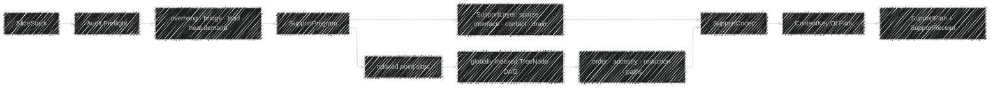

# [RASM_FABRICATION_ADDITIVE_SUPPORT]

`Support.Grow` owns additive support demand, planar projection, branching topology, contact, thermal conduction, removal access, trapped-material evidence, and canonical plan identity. One `SupportPolicy` admits the slice stack and selects a closed `SupportProgram`; `SupportPlan` projects the stable planar and tree wires consumed by slicing, scan planning, implicit realization, and `3MF` production.

Wire posture: HOST-LOCAL. `SliceStack` enters once; `Audit.Preflight` gates growth; `SupportPlan.PlanarRows`, `SupportLayer.Sparse`, `SupportLayer.Interface`, `SupportPlan.TreeNodes`, and `TreeNode.Id/Parents/At/Radius` remain frozen; `ContentKey.Of(EgressKind.Plan)` seals the complete support program.

## [01]-[INDEX]

- [01]-[DOMAIN]: Generated support, state, role, contact, structural, thermal, removal, and drainage owners.
- [02]-[DEMAND]: Layer relationships classify overhang, bridge, interface, load, heat, and powder-escape demand.
- [03]-[PROJECTION]: `SupportProgram` closes planar, tree, hybrid, and generated modalities behind one entry.
- [04]-[TOPOLOGY]: Relaxed point sites seed branches; QuikGraph owns ordering, ancestry, reduction, components, and weighted paths.
- [05]-[IDENTITY]: One canonical codec covers every planar region, node, edge, physical value, policy identity, and receipt-bearing outcome.

## [02]-[DOMAIN]

- Owner: `SupportFamily` carries branch, density, interface, load, and removal behavior as generated rows.
- Owner: `AvoidanceState` carries descent, lateral, and radius behavior; no caller reconstructs movement from row identity.
- Owner: `TreeRole` carries radius and load factors for roots, trunks, junctions, branches, and contacts.
- Owner: `SupportProgram` is the sole modality family; generated support returns the same `SupportProjection` as built-in programs.
- Law: occupancy resolves through `SliceRegion.Covers`, never a bounding box, so a concave layer does not read as solid across its own voids.
- Boundary: `TreeSeed` exists only before global identity and parent admission; every published topology value is one `TreeNode`.
- Growth: a support family is a row, a modality is a union case, a physical constraint is a policy value, and a result is one existing projection.

## [03]-[DEMAND]

- Law: overhang demand is the current region minus the admissible grown footprint below; angle, bridge span, contact gap, and interface depth parameterize that relation.
- Law: each support island retains its own bound and never borrows model extent for sparse or interface candidate generation.
- Law: contact sites mint tributary area, load, and heat once; reverse topological accumulation distributes each value across admitted parents before radius sizing.
- Law: contact teeth, breakup gaps, drain channels, and removal clearance remain physical policy projected into layer geometry and receipts.
- Law: `SupportDemand.Bridge` is the complete `BridgeSpan`; its endpoints are island rim points extremal along the island bearing, so no published span names a bounding-box corner off the material.
- Law: lateral descent bears away from the obstructing region and the branch phase only decorrelates neighbouring trunks; a detour that cannot leave the material is a typed collision, never a fabricated offset.
- Receipt: bridge spans, contact area, trapped area, drain reach, load, heat, and removability remain evidence, never prose-only claims.

## [04]-[PROJECTION]

- Entry: `SupportProgram` closes planar, tree, hybrid, and generated modalities; every case returns the same `SupportProjection`, so no consumer learns which modality produced it.
- Law: `Hybrid` scales planar density by its `PlanarShare` and grows the full tree beside it; a branching modality is refused outright when the selected `SupportFamily` does not branch.
- Law: `Complete` derives one `SupportCoverage` row per demand, and `AdmitProjection` requires exact planar-region or tree-area/load/heat completion, unique coverage, no extra contacts, exact bridges, layer bounds, physical signs, and node caps for every program case.
- Law: generated callback faults enter the shared `Try.lift` rail before projection admission; an admitted generated projection is indistinguishable from a built-in one downstream.

## [05]-[TOPOLOGY]

- Boundary: `VoronoiPlane.SetSites`, `Tessellate`, `Relax`, `MergeSites`, and `GetNearestSiteTo(..., KDTree)` distribute tips and attract parents deterministically.
- Boundary: `BidirectionalGraph<int, SEquatableEdge<int>>` validates global identifiers before topological order, roots, sinks, components, closure intersection, reduction, breadth-first reachability, and DAG paths project evidence.
- Law: node identifiers are minted once after spatial merge; no child plan carries a private ordinal into composition.
- Law: every structural rejection — duplicate, non-contiguous, unresolved, or repeated identity, cycle, terminals, order, redundant parent — is an accumulated typed gate; only genuine QuikGraph faults ride `Try.lift`.
- Law: common ancestry reads `ComputeTransitiveClosure` through `InEdges` per sink and intersects the resulting sets; no edge sequence is rescanned per query pair.
- Law: `GraphEvidence.MaximumLoadPath` is the longest root-to-sink route, taken by negating the DAG relaxation weights, because a multi-parent junction's governing load path is its most slender chain.
- Law: demand accumulation folds one keyed `HashMap` in descending identity — reverse topological order for a strictly layered parent edge — so no node is rescanned per parent link.

## [06]-[IDENTITY]

- Owner: `SupportCodec.Write` is the sole canonical octet projection over the admitted projection; the receipt never re-enters the payload it seals.
- Law: every width writes little-endian explicitly through `BinaryPrimitives` into one pooled `ArrayPoolBufferWriter<byte>`, so the key reproduces bit-identically wherever the wire lands.
- Law: every `SliceRegion` writes sorted outer and hole loops from their least cyclic station with closure, tolerance, points, and aligned bulges; winding remains material identity. Every node writes sorted parents beside global identity, role, radius, load, heat, area, and avoidance state.
- Law: offset, program, family, contact, growth, structural, thermal, removal, drainage, and every realized geometry value enter the canonical payload under canonical row, node, bridge, and loop order.
- Egress: `ContentKey.Of(EgressKind.Plan, bytes)` mints once over stored bytes and `SupportReceipt.CanonicalBytes` records the same payload.

```csharp signature
extern alias Voronoi;

using System.Buffers.Binary;
using System.Text;
using CommunityToolkit.HighPerformance.Buffers;
using LanguageExt;
using LanguageExt.Common;
using QuikGraph;
using QuikGraph.Algorithms;
using Rasm.Domain;
using Rasm.Geometry;
using Rhino.Geometry;
using Thinktecture;
using UnitsNet;
using Voronoi::SharpVoronoiLib;
using static LanguageExt.Prelude;

namespace Rasm.Fabrication.Additive;

// --- [GENERATED_OWNERS] ---------------------------------------------------------------------------------------------------------------------------
[SmartEnum<string>]
public sealed partial class SupportFamily {
    public static readonly SupportFamily Line = new("line", Ratio.FromPercent(12), 1, false, Ratio.FromPercent(95), Ratio.FromPercent(72));
    public static readonly SupportFamily Wall = new("wall", Ratio.FromPercent(28), 2, false, Ratio.FromPercent(110), Ratio.FromPercent(58));
    public static readonly SupportFamily Grid = new("grid", Ratio.FromPercent(42), 3, false, Ratio.FromPercent(125), Ratio.FromPercent(46));
    public static readonly SupportFamily Contour = new("contour", Ratio.FromPercent(55), 3, false, Ratio.FromPercent(135), Ratio.FromPercent(40));
    public static readonly SupportFamily Tree = new("tree", Ratio.FromPercent(18), 2, true, Ratio.FromPercent(88), Ratio.FromPercent(82));
    public static readonly SupportFamily Cone = new("cone", Ratio.FromPercent(24), 2, true, Ratio.FromPercent(105), Ratio.FromPercent(70));
    public static readonly SupportFamily Lattice = new("lattice", Ratio.FromPercent(16), 2, true, Ratio.FromPercent(92), Ratio.FromPercent(76));
    public static readonly SupportFamily Block = new("block", Ratio.FromPercent(70), 4, false, Ratio.FromPercent(160), Ratio.FromPercent(25));

    public Ratio SparseDensity { get; }
    public int InterfaceLayers { get; }
    public bool Branching { get; }
    public Ratio LoadFactor { get; }
    public Ratio RemovalFactor { get; }
}

[SmartEnum<string>]
public sealed partial class AvoidanceState {
    public static readonly AvoidanceState Clear = new("clear", Ratio.FromPercent(100), Ratio.Zero, Ratio.FromPercent(100), true);
    public static readonly AvoidanceState Detour = new("detour", Ratio.FromPercent(72), Ratio.FromPercent(100), Ratio.FromPercent(112), true);
    public static readonly AvoidanceState Bridge = new("bridge", Ratio.FromPercent(45), Ratio.FromPercent(150), Ratio.FromPercent(125), true);
    public static readonly AvoidanceState Blocked = new("blocked", Ratio.Zero, Ratio.Zero, Ratio.FromPercent(140), false);

    public Ratio DescentScale { get; }
    public Ratio LateralScale { get; }
    public Ratio RadiusScale { get; }
    public bool CanDescend { get; }
}

[SmartEnum<string>]
public sealed partial class TreeRole {
    public static readonly TreeRole Root = new("root", Ratio.FromPercent(145), Ratio.FromPercent(100));
    public static readonly TreeRole Trunk = new("trunk", Ratio.FromPercent(125), Ratio.FromPercent(90));
    public static readonly TreeRole Junction = new("junction", Ratio.FromPercent(115), Ratio.FromPercent(75));
    public static readonly TreeRole Branch = new("branch", Ratio.FromPercent(92), Ratio.FromPercent(55));
    public static readonly TreeRole Contact = new("contact", Ratio.FromPercent(62), Ratio.FromPercent(30));

    public Ratio RadiusScale { get; }
    public Ratio LoadShare { get; }
}

[SmartEnum<string>]
public sealed partial class RemovalClass {
    public static readonly RemovalClass Hand = new("hand", Ratio.FromPercent(100), Ratio.FromPercent(100));
    public static readonly RemovalClass Breakaway = new("breakaway", Ratio.FromPercent(70), Ratio.FromPercent(130));
    public static readonly RemovalClass Dissolvable = new("dissolvable", Ratio.FromPercent(35), Ratio.FromPercent(180));
    public static readonly RemovalClass Machined = new("machined", Ratio.FromPercent(140), Ratio.FromPercent(65));

    public Ratio ContactScale { get; }
    public Ratio AccessScale { get; }
}

// --- [POLICY] -------------------------------------------------------------------------------------------------------------------------------------
public sealed record ContactPolicy(
    Length Gap,
    Length ToothWidth,
    Length ToothPitch,
    Length Penetration,
    int RoofLayers,
    Ratio BreakupFraction);

public sealed record GrowthPolicy(
    Length TipPitch,
    Length TipRadius,
    Length RootRadius,
    Length RadiusGain,
    Length MergeDistance,
    Length LateralStep,
    Angle BranchPhase,
    Angle MaximumBranchAngle,
    int Relaxations,
    Ratio RelaxationStrength,
    int MaximumTips,
    int MaximumNodes,
    int Seed);

public sealed record StructuralPolicy(
    Pressure AllowableStress,
    Ratio SafetyFactor,
    Density MaterialDensity,
    Acceleration Gravity,
    Ratio LoadShare,
    Length MaximumBridge);

public sealed record ThermalPolicy(
    Power SurfaceHeat,
    Ratio Conductance,
    Length ConductionDistance,
    int InterfaceLayers);

public sealed record RemovalPolicy(
    RemovalClass Class,
    Length AccessClearance,
    Length ToolReach,
    Volume MaximumFragment,
    Angle MaximumUndercut);

public sealed record DrainPolicy(
    Area MinimumEscapeArea,
    Length MaximumEscapeDistance,
    Area MaximumTrappedArea,
    Ratio ChannelFraction);

[Union(ConversionFromValue = ConversionOperatorsGeneration.None)]
public abstract partial record SupportProgram {
    private SupportProgram() { }
    public sealed record Planar : SupportProgram;
    public sealed record Tree : SupportProgram;
    public sealed record Hybrid(Ratio PlanarShare) : SupportProgram;
    public sealed record Generated(ContentKey Identity, Func<SupportContext, Fin<SupportProjection>> Project) : SupportProgram;
}

public sealed record SupportPolicy(
    AuditPolicy Audit,
    SupportFamily Family,
    SupportProgram Program,
    Angle Overhang,
    ContactPolicy Contact,
    GrowthPolicy Growth,
    StructuralPolicy Structural,
    ThermalPolicy Thermal,
    RemovalPolicy Removal,
    DrainPolicy Drain,
    OffsetPolicy Offset);

// --- [DOMAIN_MODEL] --------------------------------------------------------------------------------------------------------------------------------
public sealed record BridgeSpan(int Layer, Point3d From, Point3d To, Length Length, Force Load);

public sealed record SupportDemand(
    int Layer,
    Length Elevation,
    SliceRegion Region,
    Area TributaryArea,
    Force Load,
    Power Heat,
    Option<BridgeSpan> Bridge);

public sealed record SupportLayer(
    int Layer,
    Length Elevation,
    Length Height,
    SliceRegion Sparse,
    SliceRegion Interface,
    SliceRegion Contact,
    Ratio Density,
    Ratio ContactDuty,
    Area TrappedArea,
    Seq<SliceRegion> EscapeChannels);

public sealed record TreeNode(
    int Id,
    Seq<int> Parents,
    Point3d At,
    Length PhysicalRadius,
    TreeRole Role,
    AvoidanceState Avoidance,
    Area TributaryArea,
    Force Load,
    Power Heat) {
    public double Radius => PhysicalRadius.Millimeters;
}

public sealed record SupportCoverage(
    int Demand,
    bool Planar,
    Seq<int> TreeContacts,
    Area TreeArea,
    Force TreeLoad,
    Power TreeHeat);

public sealed record SupportProjection(
    Seq<SupportLayer> PlanarRows,
    Seq<TreeNode> TreeNodes,
    Seq<BridgeSpan> Bridges,
    Seq<SupportCoverage> Coverage);

public sealed record SupportContext(
    SliceStack Stack,
    Seq<SupportDemand> Demand,
    SupportPolicy Policy);

public sealed record GraphEvidence(
    int Roots,
    int Sinks,
    int Components,
    int ClosureEdges,
    int ReducedEdges,
    int CommonAncestors,
    int ReachableNodes,
    Length MaximumLoadPath);

public sealed record SupportReceipt(
    AuditReceipt Audit,
    GraphEvidence Graph,
    Seq<BridgeSpan> Bridges,
    Area ContactArea,
    Area TrappedArea,
    Length DrainReach,
    Volume Material,
    Force PeakLoad,
    Power ConductedHeat,
    Ratio Removability,
    int CanonicalBytes);

public sealed record SupportPlan(
    Seq<SupportLayer> PlanarRows,
    Seq<TreeNode> TreeNodes,
    ContentKey Key,
    SupportReceipt Receipt);

internal sealed record TreeSeed(
    int Layer,
    Point3d At,
    Length Radius,
    TreeRole Role,
    AvoidanceState Avoidance,
    Area TributaryArea,
    Force Load,
    Power Heat);

// --- [OPERATIONS] ----------------------------------------------------------------------------------------------------------------------------------
public static class Support {
    public static Fin<SupportPlan> Grow(SliceStack stack, SupportPolicy policy) =>
        from _policy in AdmitPolicy(policy)
        from audit in Audit.Preflight(stack, policy.Audit)
        from _clean in audit.Clean
            ? Fin.Succ(unit)
            : Fin.Fail<Unit>(new GeometryFault.DegenerateInput(Kind.Mesh, -1, $"support:audit:{audit.Defects.Count}").ToError())
        from demand in Demand(stack, policy)
        let context = new SupportContext(stack, demand, policy)
        from projected in Project(context)
        from projection in Complete(context, projected)
        from admitted in AdmitProjection(context, projection)
        from graph in SupportGraph.Admit(admitted.TreeNodes)
        from receipt in Receipt(audit, admitted, graph, policy)
        let bytes = SupportCodec.Write(policy, admitted)
        let key = ContentKey.Of(EgressKind.Plan, bytes)
        select new SupportPlan(
            admitted.PlanarRows,
            admitted.TreeNodes,
            key,
            receipt with { CanonicalBytes = bytes.Length });

    private static Fin<Unit> AdmitPolicy(SupportPolicy policy) => (
        Gate(policy.Overhang > Angle.Zero && policy.Overhang < Angle.FromDegrees(90)
            && policy.Contact.Gap >= Length.Zero && policy.Contact.ToothWidth > Length.Zero
            && policy.Contact.ToothPitch >= policy.Contact.ToothWidth && policy.Contact.Penetration >= Length.Zero
            && policy.Contact.RoofLayers > 0 && policy.Contact.BreakupFraction >= Ratio.Zero
            && policy.Contact.BreakupFraction <= Ratio.FromPercent(100), "support:contact-policy"),
        Gate(policy.Growth.TipPitch > Length.Zero && policy.Growth.TipRadius > Length.Zero
            && policy.Growth.RootRadius >= policy.Growth.TipRadius && policy.Growth.RadiusGain >= Length.Zero
            && policy.Growth.MergeDistance > Length.Zero && policy.Growth.LateralStep >= Length.Zero
            && policy.Growth.BranchPhase > Angle.Zero && policy.Growth.MaximumBranchAngle > Angle.Zero
            && policy.Growth.Relaxations >= 0 && policy.Growth.RelaxationStrength >= Ratio.Zero
            && policy.Growth.RelaxationStrength <= Ratio.FromPercent(100) && policy.Growth.MaximumTips > 0
            && policy.Growth.MaximumNodes >= policy.Growth.MaximumTips, "support:growth-policy"),
        Gate(policy.Structural.AllowableStress > Pressure.Zero && policy.Structural.SafetyFactor > Ratio.Zero
            && policy.Structural.LoadShare > Ratio.Zero && policy.Structural.MaterialDensity > Density.Zero
            && policy.Structural.Gravity > Acceleration.Zero && policy.Structural.MaximumBridge > Length.Zero,
            "support:structural-policy"),
        Gate(policy.Thermal.SurfaceHeat >= Power.Zero && policy.Thermal.Conductance >= Ratio.Zero
            && policy.Thermal.Conductance <= Ratio.FromPercent(100) && policy.Thermal.ConductionDistance > Length.Zero
            && policy.Thermal.InterfaceLayers > 0, "support:thermal-policy"),
        Gate(policy.Removal.AccessClearance >= Length.Zero && policy.Removal.ToolReach > Length.Zero
            && policy.Removal.MaximumFragment > Volume.Zero && policy.Removal.MaximumUndercut >= Angle.Zero
            && policy.Removal.MaximumUndercut < Angle.FromDegrees(90), "support:removal-policy"),
        Gate(policy.Drain.MinimumEscapeArea > Area.Zero && policy.Drain.MaximumEscapeDistance > Length.Zero
            && policy.Drain.MaximumTrappedArea >= Area.Zero && policy.Drain.ChannelFraction > Ratio.Zero
            && policy.Drain.ChannelFraction <= Ratio.FromPercent(100), "support:drain-policy"),
        Gate(policy.Program.Switch(
            planar: static _ => true,
            tree: _ => policy.Family.Branching,
            hybrid: hybrid => policy.Family.Branching
                && hybrid.PlanarShare > Ratio.Zero
                && hybrid.PlanarShare <= Ratio.FromDecimalFractions(1.0),
            generated: static value => value.Project is not null), "support:program-policy"))
        .Apply(static (_, _, _, _, _, _, _) => unit)
        .As()
        .ToFin();

    internal static K<Validation<Error>, Unit> Gate(bool valid, string locus) =>
        (valid ? Fin.Succ(unit) : Fin.Fail<Unit>(new GeometryFault.DegenerateInput(Kind.Mesh, -1, locus).ToError())).ToValidation();

    private static Fin<Seq<SupportDemand>> Demand(SliceStack stack, SupportPolicy policy) =>
        toSeq(Enumerable.Range(1, Math.Max(0, stack.LayerCount - 1))).Traverse(layer =>
            from current in SliceRegion.Of(stack, layer)
            from below in SliceRegion.Of(stack, layer - 1)
            from footprint in below.Grow(
                Length.FromMillimeters(Math.Tan(policy.Overhang.Radians) * (stack.Elevations[layer] - stack.Elevations[layer - 1])),
                policy.Offset)
            from overhang in current.Difference(footprint)
            from currentArea in current.PhysicalArea()
            from islands in overhang.Outers.Traverse(outer => SliceRegion.Of(
                Seq(outer).Concat(overhang.Holes.Filter(hole => outer.Covers(hole.At(0)))))).As()
            from rows in islands.Traverse(island =>
                from area in island.PhysicalArea()
                let chord = Chord(island)
                let volume = Volume.FromCubicMillimeters(area.SquareMillimeters * (stack.Elevations[layer] - stack.Elevations[layer - 1]))
                let load = Force.FromNewtons(
                    policy.Structural.MaterialDensity.KilogramsPerCubicMeter
                        * volume.CubicMeters
                        * policy.Structural.Gravity.MetersPerSecondSquared
                        * policy.Structural.LoadShare.DecimalFractions)
                select new SupportDemand(
                    layer,
                    Length.FromMillimeters(stack.Elevations[layer]),
                    island,
                    area,
                    load,
                    policy.Thermal.SurfaceHeat * (area.SquareMillimeters / Math.Max(currentArea.SquareMillimeters, double.Epsilon)),
                    chord.Span > policy.Structural.MaximumBridge
                        ? Some(new BridgeSpan(layer, chord.From, chord.To, chord.Span, load))
                        : Option<BridgeSpan>.None)).As()
            select rows).As()
            .Map(static rows => rows.Bind(static row => row).Filter(static row => !row.Region.IsEmpty));

    private static Fin<SupportProjection> Project(SupportContext context) => context.Policy.Program.Switch(
        state: context,
        planar: static (state, _) => Planar(state).Map(rows => new SupportProjection(
            rows, Seq<TreeNode>(), Bridges(state.Demand), Seq<SupportCoverage>())),
        tree: static (state, _) => Tree(state).Map(nodes => new SupportProjection(
            Seq<SupportLayer>(), nodes, Bridges(state.Demand), Seq<SupportCoverage>())),
        hybrid: static (state, hybrid) =>
            from rows in Planar(state, hybrid.PlanarShare)
            from nodes in Tree(state)
            select new SupportProjection(rows, nodes, Bridges(state.Demand), Seq<SupportCoverage>()),
        generated: static (state, generated) => Try.lift<Fin<SupportProjection>>(() => generated.Project(state))
            .Run()
            .MapFail(error => new GeometryFault.DegenerateInput(
                Kind.Mesh,
                -1,
                $"support:generated:{error.Message}").ToError())
            .Bind(static projection => projection));

    private static Fin<SupportProjection> Complete(SupportContext context, SupportProjection projection) =>
        context.Demand.Map((demand, index) => {
            Fin<bool> planar = projection.PlanarRows
                .Find(row => row.Layer == demand.Layer - 1)
                .Map(row => demand.Region.Difference(row.Contact).Map(static missing => missing.IsEmpty))
                .IfNone(Fin.Succ(false));
            Seq<TreeNode> contacts = projection.TreeNodes.Filter(node => node.At.Z.Equals(demand.Elevation.Millimeters)
                && demand.Region.Covers(node.At));
            return planar.Map(covered => new SupportCoverage(
                index,
                covered,
                contacts.Map(static node => node.Id),
                contacts.Map(static node => node.TributaryArea).Fold(Area.Zero, static (sum, area) => sum + area),
                contacts.Map(static node => node.Load).Fold(Force.Zero, static (sum, load) => sum + load),
                contacts.Map(static node => node.Heat).Fold(Power.Zero, static (sum, heat) => sum + heat)));
        }).Sequence().Map(coverage => projection with { Coverage = coverage });

    private static Fin<SupportProjection> AdmitProjection(SupportContext context, SupportProjection projection) {
        Set<int> coveredContacts = projection.Coverage.Bind(static row => row.TreeContacts).ToSet();
        Seq<int> missing = projection.Coverage
            .Filter(row => !row.Planar && !TreeComplete(context.Demand[row.Demand], row))
            .Map(static row => row.Demand);
        bool complete = projection.Coverage.Count == context.Demand.Count
            && projection.Coverage.Map(static row => row.Demand).Distinct().Count == context.Demand.Count
            && projection.Coverage.ForAll(row => row.Demand >= 0 && row.Demand < context.Demand.Count)
            && missing.IsEmpty;
        bool noExtras = projection.TreeNodes
                .Filter(node => context.Demand.Exists(demand => node.At.Z.Equals(demand.Elevation.Millimeters)
                    && demand.Region.Covers(node.At)))
                .ForAll(node => coveredContacts.Contains(node.Id))
            && projection.PlanarRows
                .Filter(static row => !row.Contact.IsEmpty)
                .ForAll(row => projection.Coverage.Exists(coverage => coverage.Planar
                    && context.Demand[coverage.Demand].Layer == row.Layer + 1));
        bool bridgesComplete = projection.Bridges
            .OrderBy(static bridge => bridge.Layer)
            .ThenBy(static bridge => bridge.From.X)
            .ThenBy(static bridge => bridge.From.Y)
            .SequenceEqual(Bridges(context.Demand)
                .OrderBy(static bridge => bridge.Layer)
                .ThenBy(static bridge => bridge.From.X)
                .ThenBy(static bridge => bridge.From.Y));
        bool valid = complete && noExtras && bridgesComplete
        && projection.PlanarRows.Map(static row => row.Layer).Distinct().Count == projection.PlanarRows.Count
        && projection.PlanarRows.ForAll(row => row.Layer >= 0
            && row.Layer < context.Stack.LayerCount
            && row.Elevation == Length.FromMillimeters(context.Stack.Elevations[row.Layer])
            && row.Height > Length.Zero
            && row.Density > Ratio.Zero
            && row.Density <= Ratio.FromPercent(100)
            && row.ContactDuty > Ratio.Zero
            && row.ContactDuty <= Ratio.FromPercent(100)
            && row.TrappedArea >= Area.Zero)
        && projection.TreeNodes.Count <= context.Policy.Growth.MaximumNodes
        && projection.TreeNodes.ForAll(static node => node.Id >= 0
            && node.At.IsValid
            && node.PhysicalRadius > Length.Zero
            && node.TributaryArea >= Area.Zero
            && node.Load >= Force.Zero
            && node.Heat >= Power.Zero)
        && projection.Bridges.ForAll(bridge => bridge.Layer > 0
            && bridge.Layer < context.Stack.LayerCount
            && bridge.From.IsValid
            && bridge.To.IsValid
            && bridge.Length > Length.Zero
            && bridge.Load >= Force.Zero);
        return valid
            ? Fin.Succ(projection)
            : Fin.Fail<SupportProjection>(new GeometryFault.DegenerateInput(
                Kind.Mesh,
                -1,
                missing.IsEmpty ? "support:projection" : $"support:projection-coverage:{string.Join(',', missing)}").ToError());
    }

    private static bool TreeComplete(SupportDemand demand, SupportCoverage coverage) {
        double tolerance = Math.Max(1.0, demand.TributaryArea.SquareMillimeters)
            * Math.Sqrt(double.BitIncrement(1.0) - 1.0);
        return !coverage.TreeContacts.IsEmpty
            && Math.Abs(coverage.TreeArea.SquareMillimeters - demand.TributaryArea.SquareMillimeters) <= tolerance
            && Math.Abs(coverage.TreeLoad.Newtons - demand.Load.Newtons) <= tolerance
            && Math.Abs(coverage.TreeHeat.Watts - demand.Heat.Watts) <= tolerance;
    }

    private static Fin<Seq<SupportLayer>> Planar(SupportContext context, Option<Ratio> share = default) =>
        toSeq(Enumerable.Range(0, context.Stack.LayerCount).Reverse()).Fold(
            Fin.Succ((Falling: SliceRegion.Empty, Rows: Seq<SupportLayer>())),
            (rail, layer) =>
                from state in rail
                let active = context.Demand.Filter(demand => demand.Layer > layer)
                from injected in context.Demand.Filter(demand => demand.Layer == layer + 1)
                    .Map(static demand => demand.Region)
                    .Fold(Fin.Succ(state.Falling), static (current, region) => from prior in current from merged in prior.Union(region) select merged)
                from model in SliceRegion.Of(context.Stack, layer)
                from carve in model.Grow(context.Policy.Contact.Gap, context.Policy.Offset)
                from sparse in injected.Difference(carve)
                let interfaceLayers = Math.Max(
                    context.Policy.Contact.RoofLayers,
                    Math.Max(context.Policy.Thermal.InterfaceLayers, context.Policy.Family.InterfaceLayers))
                from contact in active.Filter(demand => demand.Layer - layer <= interfaceLayers)
                    .Map(static demand => demand.Region)
                    .Fold(Fin.Succ(SliceRegion.Empty), static (current, region) => from prior in current from merged in prior.Union(region) select merged)
                from interfaceRegion in contact.Grow(
                    context.Policy.Contact.Penetration - context.Policy.Contact.Gap,
                    context.Policy.Offset)
                from channels in Drainage(sparse, context.Policy.Drain, context.Policy.Offset)
                from trapped in Trapped(sparse, channels)
                let density = context.Policy.Family.SparseDensity * share.IfNone(Ratio.FromDecimalFractions(1.0))
                let duty = Ratio.FromDecimalFractions(
                    context.Policy.Contact.ToothWidth.Millimeters / context.Policy.Contact.ToothPitch.Millimeters)
                select (
                    Falling: sparse,
                    Rows: state.Rows.Add(new SupportLayer(
                        layer,
                        Length.FromMillimeters(context.Stack.Elevations[layer]),
                        Length.FromMillimeters(layer == 0
                            ? context.Stack.Elevations[Math.Min(1, context.Stack.LayerCount - 1)] - context.Stack.Elevations[0]
                            : context.Stack.Elevations[layer] - context.Stack.Elevations[layer - 1]),
                        sparse,
                        interfaceRegion,
                        contact,
                        density,
                        duty,
                        trapped,
                        channels)))
        ).Map(static state => state.Rows
            .Filter(static row => !row.Sparse.IsEmpty || !row.Interface.IsEmpty || !row.Contact.IsEmpty)
            .OrderBy(static row => row.Layer)
            .ToSeq());

    private static Fin<Seq<TreeNode>> Tree(SupportContext context) =>
        from tips in SupportSites.Tips(context.Demand, context.Policy.Growth)
        from _tips in tips.Count <= context.Policy.Growth.MaximumTips
            ? Fin.Succ(unit)
            : Fin.Fail<Unit>(new GeometryFault.DegenerateInput(Kind.Mesh, -1, $"support:tip-cap:{tips.Count}").ToError())
        from slices in toSeq(Enumerable.Range(0, context.Stack.LayerCount)).Traverse(layer => SliceRegion.Of(context.Stack, layer)).As()
        from seeds in tips.Traverse(tip => Descend(tip, slices, context)).As()
            .Bind(rows => Merge(rows.Bind(static row => row), context.Policy.Growth.MergeDistance))
        from _nodes in seeds.Count <= context.Policy.Growth.MaximumNodes
            ? Fin.Succ(unit)
            : Fin.Fail<Unit>(new GeometryFault.DegenerateInput(Kind.Mesh, -1, $"support:node-cap:{seeds.Count}").ToError())
        from nodes in SupportSites.Connect(seeds, context.Policy)
        select nodes;

    private static Fin<Seq<TreeSeed>> Descend(TreeSeed tip, Seq<SliceRegion> slices, SupportContext context) =>
        toSeq(Enumerable.Range(0, tip.Layer + 1)).Traverse(depth => {
            int layer = tip.Layer - depth;
            SliceRegion model = slices[layer];
            AvoidanceState state = depth == 0 ? AvoidanceState.Clear : Avoidance(model, tip.At, context.Policy);
            return from _path in state.CanDescend
                       ? Fin.Succ(unit)
                       : Fin.Fail<Unit>(new GeometryFault.DegenerateInput(Kind.Mesh, -1, $"support:blocked:{tip.Layer}:{tip.At}").ToError())
                   let z = context.Stack.Elevations[layer]
                   let layerDrop = tip.At.Z - context.Stack.Elevations[layer]
                   let lateral = Math.Min(
                       depth * context.Policy.Growth.LateralStep.Millimeters * state.LateralScale.DecimalFractions,
                       layerDrop * state.DescentScale.DecimalFractions * Math.Tan(context.Policy.Growth.MaximumBranchAngle.Radians))
                   let escape = Escape(model, tip.At, context.Policy.Growth.BranchPhase, context.Policy.Growth.Seed)
                   let at = new Point3d(tip.At.X + (lateral * escape.X), tip.At.Y + (lateral * escape.Y), z)
                   from _clear in depth == 0 || !model.Covers(new Point3d(at.X, at.Y, z))
                       ? Fin.Succ(unit)
                       : Fin.Fail<Unit>(new GeometryFault.DegenerateInput(Kind.Mesh, -1, $"support:detour-collision:{layer}:{at}").ToError())
                   let role = (layer == 0, depth == 0, state == AvoidanceState.Bridge, depth > tip.Layer / 2) switch {
                       (true, _, _, _) => TreeRole.Root,
                       (_, true, _, _) => TreeRole.Contact,
                       (_, _, true, _) => TreeRole.Junction,
                       (_, _, _, true) => TreeRole.Trunk,
                       _ => TreeRole.Branch,
                   }
                   let radius = Length.FromMillimeters(Math.Min(
                       context.Policy.Growth.RootRadius.Millimeters,
                       context.Policy.Growth.TipRadius.Millimeters
                           + depth * context.Policy.Growth.RadiusGain.Millimeters))
                       * role.RadiusScale.DecimalFractions
                       * state.RadiusScale.DecimalFractions
                   select new TreeSeed(
                       layer,
                       at,
                       radius,
                       role,
                       state,
                       depth == 0 ? tip.TributaryArea : Area.Zero,
                       depth == 0 ? tip.Load : Force.Zero,
                       depth == 0 ? tip.Heat : Power.Zero);
        }).As();

    private static AvoidanceState Avoidance(SliceRegion model, Point3d point, SupportPolicy policy) =>
        (model.IsEmpty || !model.Covers(new Point3d(point.X, point.Y, model.Bound().Center.Z)),
         model.IsEmpty || model.Bound().Center.DistanceTo(new Point3d(point.X, point.Y, model.Bound().Center.Z)) <= policy.Removal.AccessClearance.Millimeters,
         policy.Growth.LateralStep <= policy.Removal.ToolReach) switch {
            (true, _, _) => AvoidanceState.Clear,
            (_, true, _) => AvoidanceState.Detour,
            (_, _, true) => AvoidanceState.Bridge,
            _ => AvoidanceState.Blocked,
        };

    // Lateral escape points away from the obstructing region rather than a coordinate-derived constant, so a
    // detour actually leaves the material it detours around; the branch phase only decorrelates adjacent trunks.
    private static Vector3d Escape(SliceRegion model, Point3d tip, Angle phase, int seed) {
        Point3d center = model.IsEmpty ? tip : model.Bound().Center;
        Vector3d away = new(tip.X - center.X, tip.Y - center.Y, 0.0);
        Vector3d bearing = away.Length > 0.0 ? away / away.Length : Vector3d.XAxis;
        double turn = phase.Radians * unchecked(seed + model.Outers.Count);
        return new Vector3d(
            (bearing.X * Math.Cos(turn)) - (bearing.Y * Math.Sin(turn)),
            (bearing.X * Math.Sin(turn)) + (bearing.Y * Math.Cos(turn)),
            0.0);
    }

    private static Fin<Seq<TreeSeed>> Merge(Seq<TreeSeed> rows, Length distance) => Try.lift(() => {
        Seq<(TreeSeed Seed, int Index)> indexed = rows.Map((seed, index) => (seed, index));
        HashMap<(int Layer, long X, long Y), Seq<(TreeSeed Seed, int Index)>> buckets = indexed.Fold(
            HashMap<(int Layer, long X, long Y), Seq<(TreeSeed Seed, int Index)>>(),
            (state, slot) => {
                (long X, long Y) cell = Bucket(slot.Seed.At, distance.Millimeters);
                (int Layer, long X, long Y) key = (slot.Seed.Layer, cell.X, cell.Y);
                return state.AddOrUpdate(key, state.Find(key).IfNone(Seq<(TreeSeed Seed, int Index)>()).Add(slot));
            });
        Seq<SEquatableEdge<int>> edges = indexed.Bind(left => Neighbourhood(Bucket(left.Seed.At, distance.Millimeters))
            .Bind(cell => buckets.Find((left.Seed.Layer, cell.X, cell.Y)).IfNone(Seq<(TreeSeed Seed, int Index)>()))
            .Filter(right => right.Index > left.Index && left.Seed.At.DistanceTo(right.Seed.At) <= distance.Millimeters)
            .Map(right => new SEquatableEdge<int>(left.Index, right.Index)));
        BidirectionalGraph<int, SEquatableEdge<int>> graph = new();
        graph.AddVertexRange(indexed.Map(static slot => slot.Index));
        graph.AddEdgeRange(edges);
        Dictionary<int, int> components = [];
        _ = graph.WeaklyConnectedComponents(components);
        return indexed.GroupBy(slot => components[slot.Index])
            .Map(group => {
                Seq<TreeSeed> nodes = toSeq(group).Map(static slot => slot.Seed);
                int count = nodes.Count;
                return new TreeSeed(
                    nodes[0].Layer,
                    new Point3d(nodes.Sum(static node => node.At.X) / count, nodes.Sum(static node => node.At.Y) / count, nodes.Sum(static node => node.At.Z) / count),
                    nodes.Map(static node => node.Radius).Max(),
                    count > 1 ? TreeRole.Junction : nodes.Head.Map(static node => node.Role).IfNone(TreeRole.Branch),
                    nodes.Map(static node => node.Avoidance).OrderBy(static state => state.DescentScale.DecimalFractions).Head.IfNone(AvoidanceState.Clear),
                    nodes.Map(static node => node.TributaryArea).Fold(Area.Zero, static (sum, area) => sum + area),
                    nodes.Map(static node => node.Load).Fold(Force.Zero, static (sum, load) => sum + load),
                    nodes.Map(static node => node.Heat).Fold(Power.Zero, static (sum, heat) => sum + heat));
            })
            .OrderBy(static node => node.Layer)
            .ThenBy(static node => node.At.X)
            .ThenBy(static node => node.At.Y)
            .ToSeq();
    }).Run().MapFail(static error => new GeometryFault.DegenerateInput(Kind.Mesh, -1, $"support:merge:{error.Message}").ToError());

    private static Fin<Seq<SliceRegion>> Drainage(SliceRegion region, DrainPolicy policy, OffsetPolicy offset) =>
        region.IsEmpty ? Fin.Succ(Seq<SliceRegion>())
            : region.Holes.Filter(loop => loop.Count > 2).Traverse(loop =>
                from channel in SliceRegion.Of(Seq(loop))
                from area in channel.PhysicalArea()
                from admitted in area >= policy.MinimumEscapeArea
                    ? channel.Grow(policy.MaximumEscapeDistance * policy.ChannelFraction.DecimalFractions, offset).Map(Some)
                    : Fin.Succ(Option<SliceRegion>.None)
                select admitted).As().Map(static rows => rows.Somes());

    private static Fin<Area> Trapped(SliceRegion region, Seq<SliceRegion> channels) =>
        region.Holes.Filter(hole => !channels.Exists(channel => channel.Covers(hole.At(0))))
            .Traverse(loop => SliceRegion.Of(Seq(loop)).Bind(static hole => hole.PhysicalArea())).As()
            .Map(static areas => areas.Fold(Area.Zero, static (sum, area) => sum + area));

    private static Seq<BridgeSpan> Bridges(Seq<SupportDemand> demand) => demand.Choose(static row => row.Bridge);

    // Bridge endpoints are island rim points extremal along the island's own diagonal bearing, never bounding-box
    // corners, so a published span is a chord of the unsupported material rather than of the box enclosing it.
    private static (Point3d From, Point3d To, Length Span) Chord(SliceRegion island) {
        Seq<Point3d> rim = island.Outers.Bind(static loop => toSeq(Enumerable.Range(0, loop.Count)).Map(loop.At));
        BoundingBox bound = island.Bound();
        Vector3d axis = new(bound.Diagonal.X, bound.Diagonal.Y, 0.0);
        Vector3d bearing = axis.Length > 0.0 ? axis / axis.Length : Vector3d.XAxis;
        if (rim.Count < 2)
            return (bound.Min, bound.Min, Length.Zero);
        Seq<(Point3d At, double Along)> projected = rim.Map(point => (At: point, Along: (point.X * bearing.X) + (point.Y * bearing.Y)));
        (Point3d At, double Along) low = projected.Fold(projected[0], static (best, row) => row.Along < best.Along ? row : best);
        (Point3d At, double Along) high = projected.Fold(projected[0], static (best, row) => row.Along > best.Along ? row : best);
        return (low.At, high.At, Length.FromMillimeters(low.At.DistanceTo(high.At)));
    }

    private static Fin<SupportReceipt> Receipt(
        AuditReceipt audit,
        SupportProjection projection,
        GraphEvidence graph,
        SupportPolicy policy) =>
        from planarAreas in projection.PlanarRows.Traverse(row => (
                row.Sparse.PhysicalArea().ToValidation(),
                row.Interface.PhysicalArea().ToValidation(),
                row.Contact.PhysicalArea().ToValidation())
            .Apply(static (sparse, interfaceArea, contact) => (Sparse: sparse, Interface: interfaceArea, Contact: contact))
            .As()).As().ToFin()
        let trappedAreas = projection.PlanarRows.Map(static row => row.TrappedArea)
        let contact = planarAreas.Map(static areas => areas.Contact).Fold(Area.Zero, static (sum, area) => sum + area)
        let trapped = trappedAreas.Fold(Area.Zero, static (sum, area) => sum + area)
        from _trapped in trapped <= policy.Drain.MaximumTrappedArea
            ? Fin.Succ(unit)
            : Fin.Fail<Unit>(new GeometryFault.DegenerateInput(Kind.Mesh, -1, $"support:trapped-area:{trapped.SquareMillimeters}").ToError())
        let planarMaterial = projection.PlanarRows.Zip(planarAreas).Map(pair => Volume.FromCubicMillimeters(
                pair.First.Height.Millimeters * (
                    (pair.First.Density.DecimalFractions * pair.Second.Sparse.SquareMillimeters)
                    + pair.Second.Interface.SquareMillimeters
                    + (pair.First.ContactDuty.DecimalFractions * pair.Second.Contact.SquareMillimeters))))
            .Fold(Volume.Zero, static (sum, volume) => sum + volume)
        let byId = toHashMap(projection.TreeNodes.Map(static node => (node.Id, node)))
        let treeMaterial = projection.TreeNodes.Bind(node => node.Parents.Map(parent => (Node: node, Parent: byId[parent])))
            .Map(edge => {
                double length = edge.Parent.At.DistanceTo(edge.Node.At);
                double r0 = edge.Parent.Radius;
                double r1 = edge.Node.Radius;
                return Volume.FromCubicMillimeters(Math.PI * length * (r0 * r0 + r0 * r1 + r1 * r1) / 3.0);
            })
            .Fold(Volume.Zero, static (sum, volume) => sum + volume)
        let material = planarMaterial + treeMaterial
        let peak = projection.TreeNodes.IsEmpty ? Force.Zero : projection.TreeNodes.Map(static node => node.Load).Max()
        let heat = projection.TreeNodes.Map(static node => node.Heat).Fold(Power.Zero, static (sum, value) => sum + value)
        let reaches = projection.PlanarRows.Bind(static row => row.EscapeChannels)
            .Map(static channel => Length.FromMillimeters(channel.Bound().Diagonal.Length))
        let drainReach = reaches.IsEmpty ? Length.Zero : reaches.Max()
        let fragmentPenalty = Math.Clamp(material.CubicMillimeters / policy.Removal.MaximumFragment.CubicMillimeters, 0.0, 1.0)
        let undercutPenalty = Math.Clamp(policy.Removal.MaximumUndercut.Degrees / Angle.FromDegrees(90).Degrees, 0.0, 1.0)
        let removable = Ratio.FromDecimalFractions(Math.Clamp(
            policy.Removal.Class.AccessScale.DecimalFractions
                * policy.Removal.Class.ContactScale.DecimalFractions
                * policy.Family.RemovalFactor.DecimalFractions
                * (1.0 - policy.Contact.BreakupFraction.DecimalFractions)
                * (1.0 - fragmentPenalty)
                * (1.0 - undercutPenalty),
            0.0,
            1.0))
        select new SupportReceipt(
            audit,
            graph,
            projection.Bridges,
            contact,
            trapped,
            drainReach,
            material,
            peak,
            heat,
            removable,
            0);
}

// --- [SPATIAL_TOPOLOGY] ----------------------------------------------------------------------------------------------------------------------------
internal static class SupportSites {
    public static Fin<Seq<TreeSeed>> Tips(Seq<SupportDemand> demand, GrowthPolicy policy) =>
        demand.Traverse(row => row.Region.IsEmpty
            ? Fin.Succ(Seq<TreeSeed>())
            : Sites(row, policy).Bind(admitted => admitted.IsEmpty
                ? Fin.Fail<Seq<TreeSeed>>(new GeometryFault.DegenerateInput(Kind.Mesh, -1, $"support:no-admitted-sites:{row.Layer}").ToError())
                : Fin.Succ(admitted.Map(site => new TreeSeed(
                    row.Layer,
                    new Point3d(site.Centroid.X, site.Centroid.Y, row.Elevation.Millimeters),
                    policy.TipRadius,
                    TreeRole.Contact,
                    AvoidanceState.Clear,
                    Area.FromSquareMillimeters(row.TributaryArea.SquareMillimeters / admitted.Count),
                    row.Load / admitted.Count,
                    row.Heat / admitted.Count))))).As()
            .Map(static rows => rows.Bind(static row => row));

    private static Fin<Seq<VoronoiSite>> Sites(SupportDemand row, GrowthPolicy policy) => Try.lift(() => {
        BoundingBox bound = row.Region.Bound();
        VoronoiPlane plane = new(bound.Min.X, bound.Min.Y, bound.Max.X, bound.Max.Y);
        int count = Math.Min(policy.MaximumTips, Math.Max(1, (int)Math.Ceiling(
            row.TributaryArea.SquareMillimeters / Math.Pow(policy.TipPitch.Millimeters, 2.0))));
        plane.GenerateRandomSites(count, PointGenerationMethod.Uniform, new SeededRandomNumberGenerator(unchecked(policy.Seed + row.Layer)));
        plane.Tessellate(BorderEdgeGeneration.MakeBorderEdges);
        plane.Relax(policy.Relaxations, (float)policy.RelaxationStrength.DecimalFractions, reTessellate: true);
        plane.MergeSites((left, right) => left.Centroid.DistanceTo(right.Centroid) < policy.MergeDistance.Millimeters
            ? VoronoiSiteMergeDecision.MergeIntoSite1
            : VoronoiSiteMergeDecision.DontMerge);
        return toSeq(plane.Sites).Filter(site => site.Closed
            && row.Region.Covers(new Point3d(site.Centroid.X, site.Centroid.Y, row.Elevation.Millimeters)));
    }).Run().MapFail(error => new GeometryFault.DegenerateInput(Kind.Mesh, -1, $"support:sites:{row.Layer}:{error.Message}").ToError());

    public static Fin<Seq<TreeNode>> Connect(Seq<TreeSeed> seeds, SupportPolicy policy) {
        Seq<(TreeSeed Seed, int Id)> indexed = seeds.Map((seed, id) => (seed, id));
        return from parentRows in indexed.Filter(static slot => slot.Seed.Layer > 0)
                   .GroupBy(static slot => slot.Seed.Layer)
                   .Map(group => ParentsAt(toSeq(group), indexed, policy))
                   .Sequence()
               let links = parentRows.Bind(static rows => rows)
               let parents = toHashMap(links.Map(static row => (row.Child, row.Parents)))
               let children = toHashMap(links.Bind(static link => link.Parents.Map(parent => (Parent: parent, Child: link.Child)))
                   .GroupBy(static link => link.Parent)
                   .Map(group => (group.Key, group.Count())))
               let nodes = indexed.Map(slot => new TreeNode(
                slot.Id,
                slot.Seed.Layer == 0 ? Seq<int>() : parents[slot.Id],
                slot.Seed.At,
                slot.Seed.Radius,
                slot.Seed.Layer > 0 && (parents[slot.Id].Count > 1 || children.Find(slot.Id).IfNone(0) > 1)
                    ? TreeRole.Junction
                    : slot.Seed.Role,
                slot.Seed.Avoidance,
                slot.Seed.TributaryArea,
                slot.Seed.Load,
                slot.Seed.Heat))
               select Accumulate(nodes, policy);
    }

    private static Fin<Seq<(int Child, Seq<int> Parents)>> ParentsAt(
        Seq<(TreeSeed Seed, int Id)> children,
        Seq<(TreeSeed Seed, int Id)> indexed,
        SupportPolicy policy) {
        int layer = children.Head.Map(static child => child.Seed.Layer).IfNone(0);
        Seq<(TreeSeed Seed, int Id)> lower = indexed.Filter(slot => slot.Seed.Layer == layer - 1);
        double margin = policy.Growth.MergeDistance.Millimeters;
        return lower.IsEmpty
            ? Fin.Fail<Seq<(int Child, Seq<int> Parents)>>(new GeometryFault.DegenerateInput(Kind.Mesh, -1, $"support:orphan-layer:{layer}").ToError())
            : lower.Map(static slot => (slot.Seed.At.X, slot.Seed.At.Y)).Distinct().Count != lower.Count
            ? Fin.Fail<Seq<(int Child, Seq<int> Parents)>>(new GeometryFault.DegenerateInput(Kind.Mesh, -1, $"support:duplicate-parent-sites:{layer}").ToError())
            : Try.lift(() => {
                BoundingBox bound = new(lower.Map(static slot => slot.Seed.At));
                VoronoiPlane plane = new(bound.Min.X - margin, bound.Min.Y - margin, bound.Max.X + margin, bound.Max.Y + margin);
                plane.SetSites(lower.Map(static slot => new VoronoiSite(slot.Seed.At.X, slot.Seed.At.Y)).ToList());
                plane.Tessellate(BorderEdgeGeneration.MakeBorderEdges);
                // Site-to-ordinal correspondence retires the per-child IndexOf scan, and merge-distance buckets retire
                // Per-child whole-layer sweeps also disappear; both scans were linear in the layer for every child.
                Dictionary<VoronoiSite, int> ordinal = plane.Sites
                    .Select(static (site, index) => (site, index))
                    .ToDictionary(static row => row.site, static row => row.index);
                HashMap<(long X, long Y), Seq<(TreeSeed Seed, int Id)>> buckets = lower.Fold(
                    HashMap<(long X, long Y), Seq<(TreeSeed Seed, int Id)>>(),
                    (index, slot) => {
                        (long X, long Y) cell = Bucket(slot.Seed.At, margin);
                        return index.AddOrUpdate(cell, index.Find(cell).IfNone(Seq<(TreeSeed Seed, int Id)>()).Add(slot));
                    });
                return children.Map(child => {
                    Point3d at = child.Seed.At;
                    Seq<int> adjacent = Neighbourhood(Bucket(at, margin))
                        .Bind(cell => buckets.Find(cell).IfNone(Seq<(TreeSeed Seed, int Id)>()))
                        .Filter(candidate => candidate.Seed.At.DistanceTo(new Point3d(at.X, at.Y, candidate.Seed.At.Z)) <= margin)
                        .Map(static candidate => candidate.Id);
                    VoronoiSite nearest = plane.GetNearestSiteTo(at.X, at.Y, NearestSiteLookupMethod.KDTree);
                    return (Child: child.Id, Parents: adjacent.IsEmpty ? Seq(lower[ordinal[nearest]].Id) : adjacent);
                });
            }).Run().MapFail(error => new GeometryFault.DegenerateInput(Kind.Mesh, -1, $"support:parent-layer:{layer}:{error.Message}").ToError());
    }

    private static (long X, long Y) Bucket(Point3d at, double pitch) =>
        ((long)Math.Floor(at.X / Math.Max(pitch, double.Epsilon)), (long)Math.Floor(at.Y / Math.Max(pitch, double.Epsilon)));

    private static Seq<(long X, long Y)> Neighbourhood((long X, long Y) cell) => toSeq(
        from x in Enumerable.Range(-1, 3)
        from y in Enumerable.Range(-1, 3)
        select (cell.X + x, cell.Y + y));

    // Descending identity is reverse topological order because every parent sits one layer below its child, so a
    // keyed fold distributes each node's already-complete demand before its own parents are ever read.
    private static Seq<TreeNode> Accumulate(Seq<TreeNode> nodes, SupportPolicy policy) =>
        nodes.Map(static node => node.Id)
            .OrderByDescending(static id => id)
            .ToSeq()
            .Fold(toHashMap(nodes.Map(static node => (node.Id, node))), (state, id) => {
                TreeNode node = state[id];
                int count = node.Parents.Count;
                return node.Parents.Fold(state, (current, parentId) => current.SetItem(parentId, current[parentId] with {
                    TributaryArea = current[parentId].TributaryArea + (node.TributaryArea / count),
                    Load = current[parentId].Load + (node.Load / count),
                    Heat = current[parentId].Heat + (node.Heat * policy.Thermal.Conductance.DecimalFractions / count),
                }));
            })
            .Values
            .OrderBy(static node => node.Id)
            .ToSeq()
            .Map(node => node with { PhysicalRadius = SizedRadius(node, policy) });

    private static Length SizedRadius(TreeNode node, SupportPolicy policy) {
        double requiredMeters = Math.Sqrt(
            node.Load.Newtons
                * policy.Structural.SafetyFactor.DecimalFractions
                * policy.Family.LoadFactor.DecimalFractions
                * node.Role.LoadShare.DecimalFractions
                / (Math.PI * policy.Structural.AllowableStress.Pascals));
        double minimumMeters = Math.Min(node.Radius.Meters, policy.Growth.RootRadius.Meters);
        return Length.FromMeters(Math.Clamp(
            requiredMeters,
            minimumMeters,
            policy.Growth.RootRadius.Meters));
    }
}

public static class SupportGraph {
    public static Fin<GraphEvidence> Admit(Seq<TreeNode> nodes) => nodes.IsEmpty
        ? Fin.Succ(new GraphEvidence(0, 0, 0, 0, 0, 0, 0, Length.Zero))
        : from _identity in Identity(nodes)
          from graph in Built(nodes)
          from _acyclic in Support.Gate(graph.IsDirectedAcyclicGraph(), "support:graph-cycle").As().ToFin()
          from evidence in Measured(nodes, graph)
          select evidence;

    private static Fin<Unit> Identity(Seq<TreeNode> nodes) {
        HashMap<int, TreeNode> byId = toHashMap(nodes.Map(static node => (node.Id, node)));
        return (
            Support.Gate(byId.Count == nodes.Count, "support:graph-duplicate-identity"),
            Support.Gate(nodes.Map(static node => node.Id).OrderBy(static id => id).SequenceEqual(Enumerable.Range(0, nodes.Count)),
                "support:graph-noncontiguous-identity"),
            Support.Gate(nodes.ForAll(node => node.Parents.ForAll(byId.ContainsKey)), "support:graph-unresolved-parent"),
            Support.Gate(nodes.ForAll(static node => node.Parents.Distinct().Count == node.Parents.Count), "support:graph-repeated-parent"))
            .Apply(static (_, _, _, _) => unit)
            .As()
            .ToFin();
    }

    private static Fin<BidirectionalGraph<int, SEquatableEdge<int>>> Built(Seq<TreeNode> nodes) => Try.lift(() => {
        BidirectionalGraph<int, SEquatableEdge<int>> graph = new();
        graph.AddVertexRange(nodes.Map(static node => node.Id));
        graph.AddEdgeRange(nodes.Bind(node => node.Parents.Map(parent => new SEquatableEdge<int>(parent, node.Id))));
        return graph;
    }).Run().MapFail(static error => new GeometryFault.DegenerateInput(Kind.Mesh, -1, $"support:graph-build:{error.Message}").ToError());

    private static Fin<GraphEvidence> Measured(Seq<TreeNode> nodes, BidirectionalGraph<int, SEquatableEdge<int>> graph) =>
        from facts in Algorithms(nodes, graph)
        from _shape in (
            Support.Gate(!facts.Roots.IsEmpty && !facts.Sinks.IsEmpty, "support:graph-terminals"),
            Support.Gate(facts.Order.Count == nodes.Count, "support:graph-order"),
            Support.Gate(facts.Reduction.EdgeCount == graph.EdgeCount, "support:graph-redundant-parent"))
            .Apply(static (_, _, _) => unit)
            .As()
            .ToFin()
        select Projected(nodes, graph, facts);

    private static Fin<GraphFacts> Algorithms(Seq<TreeNode> nodes, BidirectionalGraph<int, SEquatableEdge<int>> graph) => Try.lift(() => {
        Dictionary<int, int> components = [];
        return new GraphFacts(
            toSeq(graph.Roots()),
            toSeq(graph.Sinks()),
            toSeq(graph.SourceFirstTopologicalSort()),
            graph.WeaklyConnectedComponents(components),
            graph.ComputeTransitiveClosure(static (source, target) => new SEquatableEdge<int>(source, target)),
            graph.ComputeTransitiveReduction(static (source, target) => new SEquatableEdge<int>(source, target)));
    }).Run().MapFail(static error => new GeometryFault.DegenerateInput(Kind.Mesh, -1, $"support:graph-algorithm:{error.Message}").ToError());

    private static GraphEvidence Projected(
        Seq<TreeNode> nodes,
        BidirectionalGraph<int, SEquatableEdge<int>> graph,
        GraphFacts facts) {
        HashMap<int, TreeNode> byId = toHashMap(nodes.Map(static node => (node.Id, node)));
        HashMap<int, Set<int>> ancestors = toHashMap(facts.Sinks.Map(sink =>
            (sink, toSeq(facts.Closure.InEdges(sink)).Map(static edge => edge.Source).ToSet().Add(sink))));
        int commonAncestors = toSeq(
                from left in Enumerable.Range(0, facts.Sinks.Count)
                from right in Enumerable.Range(left + 1, facts.Sinks.Count - left - 1)
                select (Left: facts.Sinks[left], Right: facts.Sinks[right]))
            .Map(query => toSeq(ancestors[query.Left]).Count(ancestors[query.Right].Contains))
            .Sum();
        Set<int> reachable = facts.Roots.Bind(root => {
            TryFunc<int, IEnumerable<SEquatableEdge<int>>> paths = graph.TreeBreadthFirstSearch(root);
            return nodes.Choose(node => node.Id == root || paths(node.Id, out _) ? Some(node.Id) : None);
        }).ToSet();
        // Negated edge weights turn the DAG relaxation into the longest path: the governing load route is the
        // most slender chain a multi-parent junction admits, never the shortest one.
        Length maximumPath = facts.Roots.Bind(root => {
            TryFunc<int, IEnumerable<SEquatableEdge<int>>> longest = graph.ShortestPathsDag(
                edge => -byId[edge.Source].At.DistanceTo(byId[edge.Target].At),
                root);
            return facts.Sinks.Map(sink => longest(sink, out IEnumerable<SEquatableEdge<int>>? path)
                ? path.Sum(edge => byId[edge.Source].At.DistanceTo(byId[edge.Target].At))
                : 0.0);
        }).Map(Length.FromMillimeters).Max();
        return new GraphEvidence(
            facts.Roots.Count,
            facts.Sinks.Count,
            facts.Components,
            facts.Closure.EdgeCount,
            facts.Reduction.EdgeCount,
            commonAncestors,
            reachable.Count,
            maximumPath);
    }

    private sealed record GraphFacts(
        Seq<int> Roots,
        Seq<int> Sinks,
        Seq<int> Order,
        int Components,
        BidirectionalGraph<int, SEquatableEdge<int>> Closure,
        BidirectionalGraph<int, SEquatableEdge<int>> Reduction);
}

// --- [CANONICAL_EGRESS] ----------------------------------------------------------------------------------------------------------------------------
public static class SupportCodec {
    // Exemption: pooled span framing is a measured byte kernel. Every width is written little-endian explicitly so
    // Digest bytes reproduce bit-identically across runtimes, and no host writer's platform default enters the key.
    public static byte[] Write(SupportPolicy policy, SupportProjection projection) {
        using ArrayPoolBufferWriter<byte> writer = new();
        Family(policy.Family, writer);
        Program(policy.Program, writer);
        Text(policy.Offset.Join.Key, writer);
        Text(policy.Offset.End.Key, writer);
        Float64(policy.Offset.MiterLimit, writer);
        Float64(policy.Offset.ArcTolerance, writer);
        Byte(policy.Offset.PreserveCollinear ? (byte)1 : (byte)0, writer);
        Byte(policy.Offset.ReverseSolution ? (byte)1 : (byte)0, writer);
        Byte(policy.Offset.MergeGroups ? (byte)1 : (byte)0, writer);
        Float64(policy.Overhang.Radians, writer);
        Float64(policy.Contact.Gap.Millimeters, writer);
        Float64(policy.Contact.ToothWidth.Millimeters, writer);
        Float64(policy.Contact.ToothPitch.Millimeters, writer);
        Float64(policy.Contact.Penetration.Millimeters, writer);
        Int32(policy.Contact.RoofLayers, writer);
        Float64(policy.Contact.BreakupFraction.DecimalFractions, writer);
        Float64(policy.Growth.TipPitch.Millimeters, writer);
        Float64(policy.Growth.TipRadius.Millimeters, writer);
        Float64(policy.Growth.RootRadius.Millimeters, writer);
        Float64(policy.Growth.RadiusGain.Millimeters, writer);
        Float64(policy.Growth.MergeDistance.Millimeters, writer);
        Float64(policy.Growth.LateralStep.Millimeters, writer);
        Float64(policy.Growth.BranchPhase.Radians, writer);
        Float64(policy.Growth.MaximumBranchAngle.Radians, writer);
        Int32(policy.Growth.Relaxations, writer);
        Float64(policy.Growth.RelaxationStrength.DecimalFractions, writer);
        Int32(policy.Growth.MaximumTips, writer);
        Int32(policy.Growth.MaximumNodes, writer);
        Int32(policy.Growth.Seed, writer);
        Float64(policy.Structural.AllowableStress.NewtonsPerSquareMillimeter, writer);
        Float64(policy.Structural.SafetyFactor.DecimalFractions, writer);
        Float64(policy.Structural.MaterialDensity.KilogramsPerCubicMeter, writer);
        Float64(policy.Structural.Gravity.MetersPerSecondSquared, writer);
        Float64(policy.Structural.LoadShare.DecimalFractions, writer);
        Float64(policy.Structural.MaximumBridge.Millimeters, writer);
        Float64(policy.Thermal.SurfaceHeat.Watts, writer);
        Float64(policy.Thermal.Conductance.DecimalFractions, writer);
        Float64(policy.Thermal.ConductionDistance.Millimeters, writer);
        Int32(policy.Thermal.InterfaceLayers, writer);
        Text(policy.Removal.Class.Key, writer);
        Float64(policy.Removal.AccessClearance.Millimeters, writer);
        Float64(policy.Removal.ToolReach.Millimeters, writer);
        Float64(policy.Removal.MaximumFragment.CubicMillimeters, writer);
        Float64(policy.Removal.MaximumUndercut.Radians, writer);
        Float64(policy.Drain.MinimumEscapeArea.SquareMillimeters, writer);
        Float64(policy.Drain.MaximumEscapeDistance.Millimeters, writer);
        Float64(policy.Drain.MaximumTrappedArea.SquareMillimeters, writer);
        Float64(policy.Drain.ChannelFraction.DecimalFractions, writer);
        Int32(projection.PlanarRows.Count, writer);
        projection.PlanarRows.OrderBy(static row => row.Layer).Iter(row => Layer(row, writer));
        Int32(projection.TreeNodes.Count, writer);
        projection.TreeNodes.OrderBy(static node => node.Id).Iter(node => Node(node, writer));
        Int32(projection.Bridges.Count, writer);
        projection.Bridges
            .OrderBy(static bridge => bridge.Layer)
            .ThenBy(static bridge => bridge.From.X)
            .ThenBy(static bridge => bridge.From.Y)
            .ThenBy(static bridge => bridge.From.Z)
            .ThenBy(static bridge => bridge.To.X)
            .ThenBy(static bridge => bridge.To.Y)
            .ThenBy(static bridge => bridge.To.Z)
            .ThenBy(static bridge => bridge.Length.Millimeters)
            .ThenBy(static bridge => bridge.Load.Newtons)
            .Iter(bridge => {
            Int32(bridge.Layer, writer); Point(bridge.From, writer); Point(bridge.To, writer);
            Float64(bridge.Length.Millimeters, writer); Float64(bridge.Load.Newtons, writer);
        });
        return writer.WrittenSpan.ToArray();
    }

    private static void Layer(SupportLayer row, ArrayPoolBufferWriter<byte> writer) {
        Int32(row.Layer, writer); Float64(row.Elevation.Millimeters, writer); Float64(row.Height.Millimeters, writer);
        Region(row.Sparse, writer); Region(row.Interface, writer); Region(row.Contact, writer);
        Float64(row.Density.DecimalFractions, writer); Float64(row.ContactDuty.DecimalFractions, writer); Float64(row.TrappedArea.SquareMillimeters, writer);
        Int32(row.EscapeChannels.Count, writer);
        row.EscapeChannels.OrderBy(static region => region, RegionComparer.Instance).Iter(region => Region(region, writer));
    }

    private static Unit Program(SupportProgram program, ArrayPoolBufferWriter<byte> writer) => program.Switch(
        state: writer,
        planar: static (sink, _) => { Byte(1, sink); return unit; },
        tree: static (sink, _) => { Byte(2, sink); return unit; },
        hybrid: static (sink, value) => { Byte(3, sink); Float64(value.PlanarShare.DecimalFractions, sink); return unit; },
        generated: static (sink, value) => { Byte(4, sink); Digest(value.Identity.Digest, sink); return unit; });

    private static void Family(SupportFamily family, ArrayPoolBufferWriter<byte> writer) {
        Text(family.Key, writer);
        Float64(family.SparseDensity.DecimalFractions, writer);
        Int32(family.InterfaceLayers, writer);
        Byte(family.Branching ? (byte)1 : (byte)0, writer);
        Float64(family.LoadFactor.DecimalFractions, writer);
        Float64(family.RemovalFactor.DecimalFractions, writer);
    }

    private static void Region(SliceRegion region, ArrayPoolBufferWriter<byte> writer) {
        Int32(region.Outers.Count, writer);
        region.Outers.OrderBy(static loop => loop, LoopComparer.Instance).Iter(loop => Loop(loop, writer));
        Int32(region.Holes.Count, writer);
        region.Holes.OrderBy(static loop => loop, LoopComparer.Instance).Iter(loop => Loop(loop, writer));
    }

    private static void Loop(Loop loop, ArrayPoolBufferWriter<byte> writer) {
        int start = CanonicalStart(loop);
        Int32(loop.Count, writer);
        Byte(loop.Closed ? (byte)1 : (byte)0, writer);
        Float64(loop.Tolerance.Absolute.Value, writer);
        toSeq(Enumerable.Range(0, loop.Count)).Iter(offset => Point(loop.At(Index(loop, start, offset)), writer));
        Int32(loop.Bulges.Count, writer);
        toSeq(Enumerable.Range(0, loop.Bulges.Count))
            .Iter(offset => Float64(loop.BulgeAt(Index(loop, start, offset)), writer));
    }

    private static void Node(TreeNode node, ArrayPoolBufferWriter<byte> writer) {
        Int32(node.Id, writer); Int32(node.Parents.Count, writer); node.Parents.Order().Iter(parent => Int32(parent, writer));
        Point(node.At, writer); Float64(node.PhysicalRadius.Millimeters, writer); Text(node.Role.Key, writer); Text(node.Avoidance.Key, writer);
        Float64(node.TributaryArea.SquareMillimeters, writer); Float64(node.Load.Newtons, writer); Float64(node.Heat.Watts, writer);
    }

    private static void Point(Point3d point, ArrayPoolBufferWriter<byte> writer) { Float64(point.X, writer); Float64(point.Y, writer); Float64(point.Z, writer); }
    private static void Byte(byte value, ArrayPoolBufferWriter<byte> writer) { Span<byte> span = writer.GetSpan(1); span[0] = value; writer.Advance(1); }
    private static void Int32(int value, ArrayPoolBufferWriter<byte> writer) { Span<byte> span = writer.GetSpan(sizeof(int)); BinaryPrimitives.WriteInt32LittleEndian(span, value); writer.Advance(sizeof(int)); }
    private static void Float64(double value, ArrayPoolBufferWriter<byte> writer) { Span<byte> span = writer.GetSpan(sizeof(double)); BinaryPrimitives.WriteInt64LittleEndian(span, BitConverter.DoubleToInt64Bits(value)); writer.Advance(sizeof(double)); }
    private static void Digest(UInt128 value, ArrayPoolBufferWriter<byte> writer) { Span<byte> span = writer.GetSpan(16); BinaryPrimitives.WriteUInt128LittleEndian(span, value); writer.Advance(16); }
    private static void Text(string value, ArrayPoolBufferWriter<byte> writer) {
        int length = Encoding.UTF8.GetByteCount(value);
        Int32(length, writer);
        Span<byte> target = writer.GetSpan(length);
        writer.Advance(Encoding.UTF8.GetBytes(value, target));
    }

    private sealed class LoopComparer : IComparer<Loop> {
        public static readonly LoopComparer Instance = new();

        public int Compare(Loop? left, Loop? right) {
            if (ReferenceEquals(left, right)) return 0;
            if (left is null) return -1;
            if (right is null) return 1;
            int order = left.Closed.CompareTo(right.Closed);
            if (order != 0) return order;
            order = left.Tolerance.Absolute.Value.CompareTo(right.Tolerance.Absolute.Value);
            if (order != 0) return order;
            order = left.Count.CompareTo(right.Count);
            if (order != 0) return order;
            int leftStart = CanonicalStart(left);
            int rightStart = CanonicalStart(right);
            for (int offset = 0; offset < left.Count; offset++) {
                order = Compare(left.At(Index(left, leftStart, offset)), right.At(Index(right, rightStart, offset)));
                if (order != 0) return order;
            }
            order = left.Bulges.Count.CompareTo(right.Bulges.Count);
            if (order != 0) return order;
            for (int offset = 0; offset < left.Bulges.Count; offset++) {
                order = Scalar(
                    left.BulgeAt(Index(left, leftStart, offset)),
                    right.BulgeAt(Index(right, rightStart, offset)));
                if (order != 0) return order;
            }
            return 0;
        }

        private static int Compare(Point3d left, Point3d right) {
            int order = Scalar(left.X, right.X);
            if (order != 0) return order;
            order = Scalar(left.Y, right.Y);
            return order != 0 ? order : Scalar(left.Z, right.Z);
        }
    }

    private static int CanonicalStart(Loop loop) {
        if (!loop.Closed || loop.Count < 2) return 0;
        return toSeq(Enumerable.Range(1, loop.Count - 1))
            .Fold(0, (best, candidate) => Rotation(loop, candidate, best) < 0 ? candidate : best);
    }

    private static int Rotation(Loop loop, int left, int right) =>
        toSeq(Enumerable.Range(0, loop.Count))
            .Map(offset => Station(loop, Index(loop, left, offset), Index(loop, right, offset)))
            .Find(static order => order != 0)
            .IfNone(0);

    private static int Station(Loop loop, int left, int right) {
        int order = Scalar(loop.At(left).X, loop.At(right).X);
        if (order != 0) return order;
        order = Scalar(loop.At(left).Y, loop.At(right).Y);
        if (order != 0) return order;
        order = Scalar(loop.At(left).Z, loop.At(right).Z);
        return order != 0 ? order : Scalar(loop.BulgeAt(left), loop.BulgeAt(right));
    }

    private static int Index(Loop loop, int start, int offset) => loop.Closed ? (start + offset) % loop.Count : offset;

    private static int Scalar(double left, double right) {
        int order = left.CompareTo(right);
        return order != 0
            ? order
            : BitConverter.DoubleToInt64Bits(left).CompareTo(BitConverter.DoubleToInt64Bits(right));
    }

    private sealed class RegionComparer : IComparer<SliceRegion> {
        public static readonly RegionComparer Instance = new();

        public int Compare(SliceRegion? left, SliceRegion? right) {
            if (ReferenceEquals(left, right)) return 0;
            if (left is null) return -1;
            if (right is null) return 1;
            int order = Compare(left.Outers, right.Outers);
            return order != 0 ? order : Compare(left.Holes, right.Holes);
        }

        private static int Compare(Seq<Loop> left, Seq<Loop> right) {
            Seq<Loop> orderedLeft = left.OrderBy(static loop => loop, LoopComparer.Instance).ToSeq();
            Seq<Loop> orderedRight = right.OrderBy(static loop => loop, LoopComparer.Instance).ToSeq();
            int order = orderedLeft.Count.CompareTo(orderedRight.Count);
            if (order != 0) return order;
            for (int index = 0; index < orderedLeft.Count; index++) {
                order = LoopComparer.Instance.Compare(orderedLeft[index], orderedRight[index]);
                if (order != 0) return order;
            }
            return 0;
        }
    }
}
```



## [07]-[RESEARCH]

<!-- source-only: research row template:
[TOKEN]-[OPEN|BLOCKED]: <exact question>; <verification route>.
[SPLIT_MEMBER]-[OPEN]: does `shape-core` expose `split_all`; verify against the member rail.
-->

(none)
