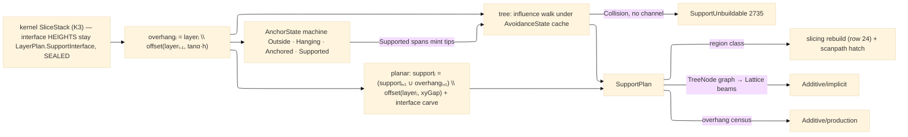

# [RASM_FABRICATION_SUPPORT]

The support-generation owner: ONE `Support.Grow` fold over the kernel slice stack producing the planar support-region stack, the tree branch graph, and the bridge verdicts — the two GEOMETRIC support lanes (`planar` region columns, `tree` branch scaffolds) discriminated by the `SupportLane` policy row on one entry. The voxel/lattice lane stays `Additive/implicit`'s. The planar lane is region set-algebra with two REAL recurrences: overhang detection `overhangᵢ = layerᵢ \ offset(layerᵢ₋₁, tan(α)·h)` (the self-supporting cone advance — a region survives unsupported when the layer below, grown by the critical-angle run, still covers it) and top-down accumulation `supportᵢ = (supportᵢ₊₁ ∪ overhangᵢ₊₁) \ offset(layerᵢ, xyGap)` (support falls until the model catches it, carved off the part by the XY clearance); the interface carve splits each column's top `InterfaceLayers` into the dense contact skin — the interface-layer HEIGHT law is the kernel `LayerPlan.SupportInterface` row (SEALED — this page owns the region GEOMETRY, never a second elevation schedule). The tree lane is an influence-area graph walk: overhang tips sample at the tip pitch, descend layer by layer under the `AvoidanceState` cache ({`Fast` far-field full-angle step · `FastSafe` full-angle within merge reach · `Slow` near-model vertical-only · `Collision` inside the keep-out}), merge when influence disks touch, thicken toward the trunk radius, and root on the plate — a branch trapped in `Collision` with no vertical channel routes `SupportUnbuildable` 2735, never a silently dropped tip.

Bridge detection is the anchor-coverage state machine over each overhang boundary ring: {`Outside` → over supported material · `Hanging` → over void, run accumulating · `Anchored` → the span re-reached support within the bridgeable run (no support mints — FFF bridges it) · `Supported` → the run exceeded `MaxBridgeMm`, a support tip mints mid-span}. The transition law is ONE `AnchorState.Next(anchoredBelow, runMm, maxBridgeMm)` row — walking a ring emits typed `BridgeSpan` verdicts, and only `Supported` spans feed tips into the active lane. Region Booleans route the ONE `Geometry2D/algebra#POLYGON_ALGEBra` owner; the layer truth is the kernel `SliceStack` (K3). Consumers: `Additive/slicing` hatches the planar support regions as its own region class (support-density infill — the carried interior's rebuild composes them; TYPE-contract seam until row 24 lands), `Additive/scanpath` hatches them for LPBF, `Additive/production` reads the overhang census in its orientation objective, and `Additive/implicit` realizes `TreeNode` graphs as PicoGK lattice beams.

Wire posture: HOST-LOCAL. `SupportPlan` crosses only the in-process seam to the slicing/scanpath/production/implicit consumers — never a browser or peer wire; the lanes and state machines never sit between wire and rail.

## [01]-[INDEX]

- [01]-[SUPPORT]: owns the `SupportLane`/`AvoidanceState`/`AnchorState` axes, the `SupportPolicy` row (critical angle, gaps, interface depth, bridge run, branch geometry), the overhang/accumulation recurrences, the influence-area tree walk, the bridge state machine, the `SupportLayer`/`TreeNode`/`BridgeSpan`/`SupportPlan` receipts, and the ONE `Support.Grow` fold — planar and tree lanes on one entry, the voxel lane declared to `implicit`.

## [02]-[SUPPORT]

- Owner: `SupportLane` `[SmartEnum<string>]` (`planar`/`tree`) the lane discriminant — a policy row, never two entrypoints; `AvoidanceState` `[SmartEnum<string>]` (`fast`/`fast-safe`/`slow`/`collision`) the per-cell descent classification the tree walk caches per layer; `AnchorState` `[SmartEnum<string>]` (`outside`/`hanging`/`anchored`/`supported`) the bridge coverage machine carrying the ONE `Next` transition row; `SupportPolicy` the parameter carrier (critical angle α, XY/Z gaps, interface depth, min-area speck floor, max bridge run, branch angle, tip/trunk/merge radii) with `Fff`/`Lpbf` seed rows; `SupportLayer` the per-layer planar receipt (sparse + interface region sets); `TreeNode` the branch-graph row (id, layer, position, radius, parent — plate root `-1`); `BridgeSpan` the typed bridge verdict; `SupportPlan` the lane-tagged plan receipt with the support-volume scalar; `Support` the static surface owning the ONE `Grow` fold.
- Cases: `AvoidanceState` rows 4 — `collision` inside `offset(model, xyGap)` (no descent), `slow` within the near-field band `2·xyGap` (vertical-only descent), `fast-safe` within merge reach of a sibling branch (full-angle step, merge-eligible), `fast` far field (full-angle step toward the plate/merge target); `AnchorState` rows 4 with the total transition law `Next(anchoredBelow, runMm, maxBridge)` — `anchoredBelow → anchored`, `outside ∧ ¬anchored → hanging`, `hanging ∧ run > maxBridge → supported`, else `hanging`; `SupportLane` rows 2; the planar recurrences are the two ruled formulas (overhang cone advance, top-down carve accumulation) and the interface carve `interfaceᵢ = supportᵢ ∩ ⋃overhangᵢ₊₁..ᵢ₊ₖ`.
- Entry: `public static Fin<SupportPlan> Grow(SliceStack stack, SupportPolicy policy)` — the ONE entrypoint; the lane row discriminates planar/tree inside the fold; `Fin<T>` routes `FabricationFault.SupportUnbuildable` 2735 `(layer, region)` when the tree search terminates in `Collision` with anchors unreachable, and kernel `GeometryFault.DegenerateInput` on an empty stack, lowered per `Process/faults#FAULT_BAND`.
- Auto: `Grow` computes the per-layer overhang census once (`Overhang(i)` — the cone-advance difference; layer 0 sits on the plate and mints none; specks under `MinAreaMm2` drop); the PLANAR lane folds top-down with the accumulation recurrence, carving each falling region by the XY-gap-grown model layer and splitting the interface carve against the k-layer overhang union; the TREE lane samples `Supported`-verdict tips and overhang interiors at the tip pitch, then descends: each node classifies its next position through the `AvoidanceState` cache (built per layer from the XY-gap model offset and the sibling influence disks), steps laterally at most `tan(branchAngle)·h` toward the nearest merge target or plate drop, merges when disks overlap (radius grows toward `TrunkRadiusMm`), and roots at layer 0; the BRIDGE machine walks each overhang boundary ring vertex-wise (`anchoredBelow` = the layer-below region covers the vertex), threading `AnchorState.Next` and emitting `BridgeSpan` rows — `Anchored` spans suppress tips, `Supported` spans mint one mid-span tip. The `Additive/slicing` rebuild (row 24) hatches `SupportLayer.Sparse` at support density and `Interface` dense; `scanpath` hatches them as an LPBF region class.
- Receipt: `SupportPlan` IS the typed evidence — the lane tag, the planar `SupportLayer` stack, the `TreeNode` graph, the `BridgeSpan` verdicts, and the support-volume scalar; no generic support ledger, no mesh realization (beam/lattice solids are `implicit`'s voxel lane; FFF support toolpaths are the slicing rebuild's).
- Packages: `Rasm.Meshing` (`SliceStack` K3 — the layer truth; `LayerPlan.SupportInterface` the kernel HEIGHT law this page never re-derives), `Geometry2D/algebra#POLYGON_ALGEBRA` (`Offset`/`Clip` — the ONE Boolean owner), `Process/owner#FABRICATION_OWNER` (`Loop`/`Edge3` atoms), `Process/faults#FAULT_BAND` (`SupportUnbuildable` 2735), Thinktecture.Runtime.Extensions (`[SmartEnum<string>]`), LanguageExt.Core (`Fin`/`Seq`/`Map`), BCL inbox.
- Growth: a new lane (contour-following ribs, conical volumes) is one `SupportLane` row + one `Grow` arm over the same overhang census; a new avoidance class is one `AvoidanceState` row the cache classifier emits; a new bridge verdict is one `AnchorState` row + its `Next` clause; per-material support parameters are `SupportPolicy` seed rows (`Fff`/`Lpbf` are the exemplars); the beam REALIZATION of `TreeNode` graphs is `implicit`'s lattice lane (declared seam), never a mesh builder here; zero new surface.
- Boundary: `Support` is the ONE support-geometry owner and a per-lane sibling class family is the deleted form — lanes are policy rows on one fold; the voxel/lattice scaffold is `Additive/implicit`'s declared lane and a PicoGK call here is the split-brain defect; the interface-layer HEIGHT law is the kernel `LayerPlan.SupportInterface` row and an elevation schedule here is the SEALED-boundary violation; region Booleans route `PolygonAlgebra` and a support-local Clipper call site is the named duplication defect; the overhang verdict is the cone-advance formula over exact region algebra and a per-triangle normal-angle classifier here is the deleted form (the mesh-facet census is `production`'s orientation objective over kernel `Analysis/select`); a dropped unbuildable tip is the named silent-scrap defect — the fold FAILS typed with `SupportUnbuildable`.

```csharp signature
// --- [RUNTIME_PRELUDE] ------------------------------------------------------------------------------------------------------------------------------
using LanguageExt;
using LanguageExt.Common;
using Rasm.Fabrication.Geometry2D;
using Rasm.Fabrication.Process;
using Rasm.Meshing;                       // SliceStack — the K3 layer truth; LayerPlan.SupportInterface owns interface HEIGHTS
using Rasm.Numerics;
using Rhino.Geometry;
using Thinktecture;
using static LanguageExt.Prelude;

namespace Rasm.Fabrication.Additive;

// --- [TYPES] ----------------------------------------------------------------------------------------------------------------------------------------
[SmartEnum<string>]
public sealed partial class SupportLane {
    public static readonly SupportLane Planar = new("planar");
    public static readonly SupportLane Tree = new("tree");
}

// Per-cell descent classification the tree walk caches per layer.
[SmartEnum<string>]
public sealed partial class AvoidanceState {
    public static readonly AvoidanceState Fast = new("fast");             // far field: full-angle step
    public static readonly AvoidanceState FastSafe = new("fast-safe");    // full-angle step, merge-eligible
    public static readonly AvoidanceState Slow = new("slow");             // near model: vertical-only descent
    public static readonly AvoidanceState Collision = new("collision");   // inside keep-out: no descent
}

// Bridge anchor-coverage machine; Next is the ONE total transition row the ring walk threads.
[SmartEnum<string>]
public sealed partial class AnchorState {
    public static readonly AnchorState Outside = new("outside");
    public static readonly AnchorState Hanging = new("hanging");
    public static readonly AnchorState Anchored = new("anchored");
    public static readonly AnchorState Supported = new("supported");

    public AnchorState Next(bool anchoredBelow, double runMm, double maxBridgeMm) =>
        anchoredBelow ? Anchored
        : this == Outside ? Hanging
        : runMm > maxBridgeMm ? Supported
        : Hanging;
}

// --- [MODELS] ---------------------------------------------------------------------------------------------------------------------------------------
public sealed record SupportPolicy(
    SupportLane Lane,
    double CriticalAngleDeg,        // α in overhangᵢ = layerᵢ \ offset(layerᵢ₋₁, tan(α)·h)
    double XyGapMm,                 // model carve clearance (the accumulation recurrence's offset)
    int InterfaceLayers,            // interface carve depth k — the HEIGHTS stay kernel LayerPlan.SupportInterface
    double MinAreaMm2,              // speck floor on the overhang census
    double MaxBridgeMm,             // bridgeable unsupported run before a tip mints
    double BranchAngleDeg,          // tree lateral step per layer = tan(branch)·h
    double TipRadiusMm,
    double TrunkRadiusMm,
    double MergeRadiusMm) {
    public static SupportPolicy Fff() => new(SupportLane.Planar, 45.0, 0.8, 3, 4.0, 8.0, 40.0, 0.4, 2.0, 1.5);
    public static SupportPolicy Lpbf() => new(SupportLane.Tree, 45.0, 0.15, 4, 1.0, 2.0, 30.0, 0.3, 1.2, 0.8);
}

public sealed record SupportLayer(int Layer, Seq<Loop> Sparse, Seq<Loop> Interface);

public readonly record struct TreeNode(int Id, int Layer, Point3d At, double Radius, int Parent);   // Parent -1 = plate root

public readonly record struct BridgeSpan(int Layer, Edge3 Span, AnchorState Verdict);

public sealed record SupportPlan(SupportLane Lane, Seq<SupportLayer> Planar, Seq<TreeNode> Tree, Seq<BridgeSpan> Bridges, double VolumeMm3);

// --- [OPERATIONS] -----------------------------------------------------------------------------------------------------------------------------------
public static class Support {
    public static Fin<SupportPlan> Grow(SliceStack stack, SupportPolicy policy) {
        if (stack.LayerCount == 0) return Fin.Fail<SupportPlan>(GeometryFault.DegenerateInput("support:empty-slice-stack").ToError());
        Arr<Seq<Loop>> census = Census(stack, policy);
        Seq<BridgeSpan> bridges = Bridges(stack, census, policy);
        return policy.Lane == SupportLane.Planar
            ? Fin.Succ(PlanarLane(stack, census, bridges, policy))
            : TreeLane(stack, census, bridges, policy).Map(tree =>
                new SupportPlan(SupportLane.Tree, Seq<SupportLayer>(), tree, bridges, TreeVolume(tree, stack)));
    }

    // --- [OVERHANG_CENSUS]
    // overhangᵢ = layerᵢ \ offset(layerᵢ₋₁, tan(α)·h): the self-supporting cone advance; layer 0 sits on the plate.
    static Arr<Seq<Loop>> Census(SliceStack stack, SupportPolicy policy) =>
        toArr(Enumerable.Range(0, stack.LayerCount).Select(i => {
            if (i == 0) return Seq<Loop>();
            double h = stack.Elevations[i] - stack.Elevations[i - 1];
            double run = Math.Tan(policy.CriticalAngleDeg * Math.PI / 180.0) * h;
            Seq<Loop> grown = PolygonAlgebra.Offset(Regions(stack, i - 1), run, OffsetEnds.Polygon).IfFail(Seq<Loop>());
            return PolygonAlgebra.Clip(Regions(stack, i), grown, ClipOp.Difference).IfFail(Seq<Loop>())
                .Filter(l => Math.Abs(Area(l)) >= policy.MinAreaMm2);
        }));

    // --- [PLANAR_LANE]
    // supportᵢ = (supportᵢ₊₁ ∪ overhangᵢ₊₁) \ offset(layerᵢ, xyGap); interfaceᵢ = supportᵢ ∩ ⋃overhangᵢ₊₁..ᵢ₊ₖ.
    static SupportPlan PlanarLane(SliceStack stack, Arr<Seq<Loop>> census, Seq<BridgeSpan> bridges, SupportPolicy policy) {
        var layers = new System.Collections.Generic.List<SupportLayer>();
        Seq<Loop> falling = Seq<Loop>();
        double volume = 0.0;
        for (int i = stack.LayerCount - 2; i >= 0; i--) {
            Seq<Loop> fed = PolygonAlgebra.Clip(falling, census[i + 1], ClipOp.Union).IfFail(falling.Concat(census[i + 1]));
            Seq<Loop> carve = PolygonAlgebra.Offset(Regions(stack, i), policy.XyGapMm, OffsetEnds.Polygon).IfFail(Seq<Loop>());
            falling = PolygonAlgebra.Clip(fed, carve, ClipOp.Difference).IfFail(Seq<Loop>());
            if (falling.IsEmpty) { continue; }
            Seq<Loop> interfaceUnion = toSeq(Enumerable.Range(i + 1, Math.Min(policy.InterfaceLayers, stack.LayerCount - i - 1))).Bind(j => census[j]);
            Seq<Loop> dense = PolygonAlgebra.Clip(falling, interfaceUnion, ClipOp.Intersect).IfFail(Seq<Loop>());
            Seq<Loop> sparse = PolygonAlgebra.Clip(falling, dense, ClipOp.Difference).IfFail(falling);
            double h = i + 1 < stack.LayerCount ? stack.Elevations[i + 1] - stack.Elevations[i] : 0.0;
            volume += falling.Map(Area).Sum() * h;
            layers.Add(new SupportLayer(i, sparse, dense));
        }
        return new SupportPlan(SupportLane.Planar, toSeq(layers).Rev(), Seq<TreeNode>(), bridges, volume);
    }

    // --- [TREE_LANE]
    // Influence-area walk: tips descend under the avoidance cache, merge on disk overlap, thicken toward the trunk, root on the plate.
    static Fin<Seq<TreeNode>> TreeLane(SliceStack stack, Arr<Seq<Loop>> census, Seq<BridgeSpan> bridges, SupportPolicy policy) {
        var nodes = new System.Collections.Generic.List<TreeNode>();
        var active = new System.Collections.Generic.List<int>();
        for (int i = stack.LayerCount - 1; i >= 1; i--) {
            foreach (Point3d tip in Tips(census[i], bridges.Filter(b => b.Layer == i && b.Verdict == AnchorState.Supported), policy)) {
                nodes.Add(new TreeNode(nodes.Count, i, tip, policy.TipRadiusMm, -1));
                active.Add(nodes.Count - 1);
            }
            if (active.Count == 0) { continue; }
            double h = stack.Elevations[i] - stack.Elevations[i - 1];
            double step = Math.Tan(policy.BranchAngleDeg * Math.PI / 180.0) * h;
            Seq<Loop> keepOut = PolygonAlgebra.Offset(Regions(stack, i - 1), policy.XyGapMm, OffsetEnds.Polygon).IfFail(Seq<Loop>());
            var next = new System.Collections.Generic.List<int>();
            foreach (int id in active) {
                TreeNode node = nodes[id];
                Point3d target = MergeTarget(node, active, nodes, policy).IfNone(new Point3d(node.At.X, node.At.Y, 0.0));
                Point3d moved = StepToward(node.At, target, step);
                AvoidanceState state = Classify(moved, keepOut, node, active, nodes, policy);
                Point3d landed =
                    state == AvoidanceState.Collision ? node.At :                     // lateral blocked: try vertical
                    state == AvoidanceState.Slow ? node.At : moved;                   // near model: vertical-only
                if (Covers(keepOut, landed))
                    return Fin.Fail<Seq<TreeNode>>(FabricationFault.SupportUnbuildable(i - 1, id).ToError());   // region witness = the trapped branch id
                double radius = Math.Min(policy.TrunkRadiusMm, node.Radius + 0.04 * h);
                nodes.Add(new TreeNode(nodes.Count, i - 1, new Point3d(landed.X, landed.Y, stack.Elevations[i - 1]), radius, id));
                next.Add(nodes.Count - 1);
            }
            active.Clear();
            active.AddRange(Merge(next, nodes, policy));
        }
        return Fin.Succ(toSeq(nodes));
    }

    // --- [BRIDGE_MACHINE]
    // Ring walk threading AnchorState.Next; Anchored spans suppress tips, Supported spans mint one mid-span tip.
    static Seq<BridgeSpan> Bridges(SliceStack stack, Arr<Seq<Loop>> census, SupportPolicy policy) =>
        toSeq(Enumerable.Range(1, Math.Max(0, stack.LayerCount - 1))).Bind(i => {
            Seq<Loop> below = Regions(stack, i - 1);
            return census[i].Bind(ring => {
                var spans = new System.Collections.Generic.List<BridgeSpan>();
                AnchorState state = AnchorState.Outside;
                double run = 0.0;
                Point3d start = ring.At(0);
                for (int v = 0; v <= ring.Count; v++) {
                    Point3d at = ring.At(v);
                    bool anchored = Covers(below, at);
                    run = anchored ? 0.0 : run + (v == 0 ? 0.0 : ring.At(v - 1).DistanceTo(at));
                    AnchorState nextState = state.Next(anchored, run, policy.MaxBridgeMm);
                    if (nextState != state && v > 0) { spans.Add(new BridgeSpan(i, new Edge3(start, at), state)); start = at; }
                    state = nextState;
                }
                return toSeq(spans);
            });
        });

    // --- [BOUNDARIES]
    static Seq<Loop> Regions(SliceStack stack, int n) =>
        stack.LayerAt(n).Filter(static c => c.Closed)
            .Map(static c => new Loop(toArr(c.Polyline.SkipLast(1).Select(static p => new Point3d(p.X, p.Y, p.Z))), Closed: true));

    static AvoidanceState Classify(Point3d at, Seq<Loop> keepOut, TreeNode self, System.Collections.Generic.List<int> active,
                                   System.Collections.Generic.List<TreeNode> nodes, SupportPolicy policy) =>
        Covers(keepOut, at) ? AvoidanceState.Collision
        : NearBoundary(keepOut, at, 2.0 * policy.XyGapMm) ? AvoidanceState.Slow
        : active.Exists(id => id != self.Id && nodes[id].At.DistanceTo(at) <= 4.0 * policy.MergeRadiusMm) ? AvoidanceState.FastSafe
        : AvoidanceState.Fast;

    static Option<Point3d> MergeTarget(TreeNode node, System.Collections.Generic.List<int> active,
                                       System.Collections.Generic.List<TreeNode> nodes, SupportPolicy policy) {
        Option<TreeNode> best = None;
        double bestD = double.MaxValue;
        foreach (int id in active) {
            if (id == node.Id) continue;
            double d = nodes[id].At.DistanceTo(node.At);
            if (d < bestD) { bestD = d; best = Some(nodes[id]); }
        }
        return best.Map(static n => n.At);
    }

    static System.Collections.Generic.IEnumerable<int> Merge(System.Collections.Generic.List<int> ids,
                                                             System.Collections.Generic.List<TreeNode> nodes, SupportPolicy policy) {
        var kept = new System.Collections.Generic.List<int>();
        foreach (int id in ids) {
            int absorbed = kept.FindIndex(k => nodes[k].At.DistanceTo(nodes[id].At) <= policy.MergeRadiusMm);
            if (absorbed < 0) { kept.Add(id); }
            else {
                TreeNode host = nodes[kept[absorbed]];
                nodes[kept[absorbed]] = host with { Radius = Math.Min(policy.TrunkRadiusMm, host.Radius + nodes[id].Radius * 0.5) };
            }
        }
        return kept;
    }

    static System.Collections.Generic.IEnumerable<Point3d> Tips(Seq<Loop> overhang, Seq<BridgeSpan> supported, SupportPolicy policy) {
        double pitch = Math.Max(2.0 * policy.TipRadiusMm, 1e-3) * 4.0;
        foreach (Loop region in overhang) {
            BoundingBox b = region.Bound();
            for (double x = b.Min.X; x <= b.Max.X; x += pitch)
                for (double y = b.Min.Y; y <= b.Max.Y; y += pitch) {
                    Point3d p = new(x, y, b.Min.Z);
                    if (region.Covers(p)) yield return p;
                }
        }
        foreach (BridgeSpan span in supported)
            yield return new Point3d(0.5 * (span.Span.A.X + span.Span.B.X), 0.5 * (span.Span.A.Y + span.Span.B.Y), span.Span.A.Z);
    }

    static bool Covers(Seq<Loop> regions, Point3d p) => regions.Exists(l => l.Covers(p));

    static bool NearBoundary(Seq<Loop> regions, Point3d p, double band) =>
        regions.Exists(l => toSeq(Enumerable.Range(0, l.Count)).Exists(i => DistanceToSegment(p, l.At(i), l.At(i + 1)) <= band));

    static double DistanceToSegment(Point3d p, Point3d a, Point3d b) {
        Vector3d ab = b - a;
        double t = ab.SquareLength < 1e-12 ? 0.0 : Math.Clamp(((p - a) * ab) / ab.SquareLength, 0.0, 1.0);
        return p.DistanceTo(a + t * ab);
    }

    static double Area(Loop l) {
        double sum = 0.0;
        for (int i = 0; i < l.Count; i++) { Point3d a = l.At(i), b = l.At(i + 1); sum += a.X * b.Y - b.X * a.Y; }
        return 0.5 * sum;
    }

    static double TreeVolume(Seq<TreeNode> nodes, SliceStack stack) =>
        nodes.Filter(static n => n.Parent >= 0).Map(n => {
            double h = n.Layer + 1 < stack.LayerCount ? stack.Elevations[n.Layer + 1] - stack.Elevations[n.Layer] : 0.0;
            return Math.PI * n.Radius * n.Radius * h;
        }).Sum();
}
```


