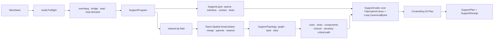

# [RASM_FABRICATION_SUPPORT]

`Support.Grow` owns additive support demand, planar projection, branching topology, contact, thermal conduction, removal access, trapped-material evidence, and canonical plan identity. One `SupportPolicy` admits the slice stack and selects a closed `SupportProgram`; `SupportPlan` projects the stable planar rows, the tree wire, and the ONE support topology consumed by slicing, scan planning, implicit realization, and `3MF` production.

Wire posture: HOST-LOCAL. `SliceStack` enters once and `Audit.Preflight` gates growth. `SupportPlan.PlanarRows`, `SupportLayer.Sparse`, `SupportLayer.Interface`, `SupportPlan.SupportNodes`, and `SupportNode.Id/Parents/At/Radius` remain frozen. `SupportPlan.Topology` is the one support-edge owner in the folder — every consumer reads `Topology.Graph.Edges`, `Topology.ById`, and `Topology.Sites` rather than rebuilding a parent-to-child edge set of its own. Neighbour search is the kernel `Rasm.Spatial` broad phase throughout, so no page in this folder mints a bucket grid, a Morton hash, or a second point index. `Loop.CanonicalBytes` is the one loop preimage and `FabricationCanon` the one writer family, so this page declares no rotation rule and no scalar framing of its own; the sibling ORDER it does declare ranks already-canonical loops and recomputes no rotation. `ContentKey.Of(EgressKind.Plan)` seals the complete support program.

## [01]-[INDEX]

- [02]-[VOCABULARY]: `SupportFamily`, `AvoidanceState`, `TreeRole`, `RemovalClass`, `SupportProgram`, and the `SupportFactors` table whose `Baseline` preset carries every tuning scalar.
- [03]-[POLICY]: the physical policy rows, `SupportPolicy`, the accumulated policy admission, and the `Support.Grow` spine.
- [04]-[DEMAND]: overhang, bridge, load, and heat demand derived from contour relations between consecutive layers.
- [05]-[PROJECTION]: `SupportProgram` closes planar, tree, hybrid, and generated modalities behind one projection, coverage, and admission.
- [06]-[GROWTH]: tip distribution, guarded descent, kernel-broad-phase merge and parenting, reverse-topological accumulation, and stress-sized radii.
- [07]-[TOPOLOGY]: `SupportTopology`, the published graph-index-sites owner, and the named evidence columns its algorithms produce.
- [08]-[IDENTITY]: one canonical codec over `FabricationCanon`, the settled receipt, and the content-keyed plan.

## [02]-[VOCABULARY]

- Owner: each `[SmartEnum<string>]` row owns what its member IS — whether a family branches, whether it adheres to the plate, whether an avoidance state can descend at all — and `SupportFactors` owns every scalar a shop TUNES.
- Law: a structural column stays on the row because no caller can move it without renaming the member; a magnitude leaves for the factor table because a shop calibrates it against its own machine, material, and removal station. A row carrying its own tuning scalars is a table no caller can replace, which is exactly what a 74-literal roster becomes.
- Cases: `SupportFamily` spans the sparse families that carry load through a lattice — line, wall, grid, contour, block — the three branching families — tree, cone, lattice — the two directed stiffeners — sheet and gusset — and the two plate-adhesion families — raft and brim. `BaseAdhesion` is what separates the last pair: they seat at the build plate under the whole footprint rather than under an overhang, so the planar fold reads the column instead of testing the key.
- Entry: `SupportFactors.Baseline` is the ONE named preset. Every scalar on this page resolves through it, so a caller supplying its own table replaces the whole calibration in one value and no literal survives at a use site.
- Auto: `Family`, `Avoidance`, `Role`, and `Removal` are total maps over their own `Items` rosters, proved once at policy admission, so a new row that no preset covers refuses at the boundary rather than throwing at the first read.
- Growth: a support family is a row plus its factor entry; a modality is a `SupportProgram` case; a physical constraint is a policy value; a result is one existing projection.
- Boundary: `TreeSeed` exists only before global identity and parent admission; every published topology value is one `SupportNode`.

```csharp signature
// --- [RUNTIME_PRELUDE] ----------------------------------------------------------------------------------------------------------------------------
using System.Collections.Frozen;
using LanguageExt;
using LanguageExt.Common;
using LanguageExt.Traits;
using QuikGraph;
using QuikGraph.Algorithms;
using QuikGraph.Algorithms.ShortestPath;
using Rasm.Domain;
using Rasm.Element.Projection;
using Rasm.Fabrication.Geometry2D;
using Rasm.Fabrication.Process;
using Rasm.Meshing;
using Rasm.Spatial;
using Rhino.Geometry;
using Thinktecture;
using UnitsNet;
using static LanguageExt.Prelude;

namespace Rasm.Fabrication.Additive;

// --- [TYPES] --------------------------------------------------------------------------------------------------------------------------------------
// Rows carry STRUCTURE alone. Branching decides whether a modality is even representable and BaseAdhesion decides
// where the family seats, so neither can move to a caller table without renaming the member.
[SmartEnum<string>]
public sealed partial class SupportFamily {
    public static readonly SupportFamily Line = new("line", branching: false, baseAdhesion: false);
    public static readonly SupportFamily Wall = new("wall", branching: false, baseAdhesion: false);
    public static readonly SupportFamily Grid = new("grid", branching: false, baseAdhesion: false);
    public static readonly SupportFamily Contour = new("contour", branching: false, baseAdhesion: false);
    public static readonly SupportFamily Block = new("block", branching: false, baseAdhesion: false);
    public static readonly SupportFamily Sheet = new("sheet", branching: false, baseAdhesion: false);
    public static readonly SupportFamily Gusset = new("gusset", branching: false, baseAdhesion: false);
    public static readonly SupportFamily Tree = new("tree", branching: true, baseAdhesion: false);
    public static readonly SupportFamily Cone = new("cone", branching: true, baseAdhesion: false);
    public static readonly SupportFamily Lattice = new("lattice", branching: true, baseAdhesion: false);
    public static readonly SupportFamily Raft = new("raft", branching: false, baseAdhesion: true);
    public static readonly SupportFamily Brim = new("brim", branching: false, baseAdhesion: true);

    public bool Branching { get; }
    public bool BaseAdhesion { get; }
}

[SmartEnum<string>]
public sealed partial class AvoidanceState {
    public static readonly AvoidanceState Clear = new("clear", canDescend: true);
    public static readonly AvoidanceState Detour = new("detour", canDescend: true);
    public static readonly AvoidanceState Bridge = new("bridge", canDescend: true);
    public static readonly AvoidanceState Blocked = new("blocked", canDescend: false);

    public bool CanDescend { get; }
}

[SmartEnum<string>]
public sealed partial class TreeRole {
    public static readonly TreeRole Root = new("root");
    public static readonly TreeRole Trunk = new("trunk");
    public static readonly TreeRole Junction = new("junction");
    public static readonly TreeRole Branch = new("branch");
    public static readonly TreeRole Contact = new("contact");
}

[SmartEnum<string>]
public sealed partial class RemovalClass {
    public static readonly RemovalClass Hand = new("hand");
    public static readonly RemovalClass Breakaway = new("breakaway");
    public static readonly RemovalClass Dissolvable = new("dissolvable");
    public static readonly RemovalClass Machined = new("machined");
}

[Union(ConversionFromValue = ConversionOperatorsGeneration.None)]
public abstract partial record SupportProgram {
    private SupportProgram() { }

    public sealed record Planar : SupportProgram;
    public sealed record Tree : SupportProgram;
    public sealed record Hybrid(Ratio PlanarShare) : SupportProgram;
    // The generated arm is a chartered EXTENSION point, not an injected hole in a chartered algorithm: the caller
    // owns a whole support program this page has no algorithm for, and its identity enters the preimage so a
    // generated plan is content-addressable exactly as a built-in one is.
    public sealed record Generated(ContentKey Identity, Func<SupportContext, Fin<SupportProjection>> Project) : SupportProgram;
}

// --- [MODELS] -------------------------------------------------------------------------------------------------------------------------------------
public readonly record struct FamilyFactors(Ratio SparseDensity, int InterfaceLayers, Ratio LoadFactor, Ratio RemovalFactor);

public readonly record struct AvoidanceFactors(Ratio DescentScale, Ratio LateralScale, Ratio RadiusScale);

public readonly record struct RoleFactors(Ratio RadiusScale, Ratio LoadShare);

public readonly record struct RemovalFactors(Ratio ContactScale, Ratio AccessScale);

// The ONE calibration table. Every tuning magnitude on this page resolves through a row here, so a shop replaces
// its whole calibration with one value and no use site spells a scalar. `Baseline` is the estate preset.
public sealed record SupportFactors(
    Map<SupportFamily, FamilyFactors> Family,
    Map<AvoidanceState, AvoidanceFactors> Avoidance,
    Map<TreeRole, RoleFactors> Role,
    Map<RemovalClass, RemovalFactors> Removal) {
    public static readonly SupportFactors Baseline = new(
        Family: Map(
            (SupportFamily.Line, new FamilyFactors(Ratio.FromPercent(12), 1, Ratio.FromPercent(95), Ratio.FromPercent(72))),
            (SupportFamily.Wall, new FamilyFactors(Ratio.FromPercent(28), 2, Ratio.FromPercent(110), Ratio.FromPercent(58))),
            (SupportFamily.Grid, new FamilyFactors(Ratio.FromPercent(42), 3, Ratio.FromPercent(125), Ratio.FromPercent(46))),
            (SupportFamily.Contour, new FamilyFactors(Ratio.FromPercent(55), 3, Ratio.FromPercent(135), Ratio.FromPercent(40))),
            (SupportFamily.Block, new FamilyFactors(Ratio.FromPercent(70), 4, Ratio.FromPercent(160), Ratio.FromPercent(25))),
            (SupportFamily.Sheet, new FamilyFactors(Ratio.FromPercent(22), 2, Ratio.FromPercent(105), Ratio.FromPercent(64))),
            (SupportFamily.Gusset, new FamilyFactors(Ratio.FromPercent(38), 2, Ratio.FromPercent(140), Ratio.FromPercent(50))),
            (SupportFamily.Tree, new FamilyFactors(Ratio.FromPercent(18), 2, Ratio.FromPercent(88), Ratio.FromPercent(82))),
            (SupportFamily.Cone, new FamilyFactors(Ratio.FromPercent(24), 2, Ratio.FromPercent(105), Ratio.FromPercent(70))),
            (SupportFamily.Lattice, new FamilyFactors(Ratio.FromPercent(16), 2, Ratio.FromPercent(92), Ratio.FromPercent(76))),
            (SupportFamily.Raft, new FamilyFactors(Ratio.FromPercent(60), 3, Ratio.FromPercent(100), Ratio.FromPercent(55))),
            (SupportFamily.Brim, new FamilyFactors(Ratio.FromPercent(100), 1, Ratio.FromPercent(30), Ratio.FromPercent(90)))),
        Avoidance: Map(
            (AvoidanceState.Clear, new AvoidanceFactors(Ratio.FromPercent(100), Ratio.Zero, Ratio.FromPercent(100))),
            (AvoidanceState.Detour, new AvoidanceFactors(Ratio.FromPercent(72), Ratio.FromPercent(100), Ratio.FromPercent(112))),
            (AvoidanceState.Bridge, new AvoidanceFactors(Ratio.FromPercent(45), Ratio.FromPercent(150), Ratio.FromPercent(125))),
            (AvoidanceState.Blocked, new AvoidanceFactors(Ratio.Zero, Ratio.Zero, Ratio.FromPercent(140)))),
        Role: Map(
            (TreeRole.Root, new RoleFactors(Ratio.FromPercent(145), Ratio.FromPercent(100))),
            (TreeRole.Trunk, new RoleFactors(Ratio.FromPercent(125), Ratio.FromPercent(90))),
            (TreeRole.Junction, new RoleFactors(Ratio.FromPercent(115), Ratio.FromPercent(75))),
            (TreeRole.Branch, new RoleFactors(Ratio.FromPercent(92), Ratio.FromPercent(55))),
            (TreeRole.Contact, new RoleFactors(Ratio.FromPercent(62), Ratio.FromPercent(30)))),
        Removal: Map(
            (RemovalClass.Hand, new RemovalFactors(Ratio.FromPercent(100), Ratio.FromPercent(100))),
            (RemovalClass.Breakaway, new RemovalFactors(Ratio.FromPercent(70), Ratio.FromPercent(130))),
            (RemovalClass.Dissolvable, new RemovalFactors(Ratio.FromPercent(35), Ratio.FromPercent(180))),
            (RemovalClass.Machined, new RemovalFactors(Ratio.FromPercent(140), Ratio.FromPercent(65)))));

    // Totality is admitted ONCE, so every read below is a settled lookup rather than a per-site absence arm.
    public bool Total =>
        toSeq(SupportFamily.Items).ForAll(Family.ContainsKey)
        && toSeq(AvoidanceState.Items).ForAll(Avoidance.ContainsKey)
        && toSeq(TreeRole.Items).ForAll(Role.ContainsKey)
        && toSeq(RemovalClass.Items).ForAll(Removal.ContainsKey);
}
```

## [03]-[POLICY]

- Owner: `SupportPolicy` owns the physical constraint set; `Support.Grow` owns the spine from admitted stack to content-keyed plan; `Support.Gate` is the one refusal lift both this cluster and `[07]` compose.
- Law: `CompletionPolicy` carries THREE tolerances because tree completion compares three incommensurable quantities — a tributary area in mm², a reaction in newtons, and a conducted power in watts. One scalar bound over all three admits a plan whose load is short by the width of its own area tolerance.
- Entry: `Support.Grow(SliceStack stack, SupportPolicy policy)` is the sole surface; `Additive/slicing` composes it behind the additive result.
- Auto: policy admission is one accumulated slot run, so a caller sees every violated constraint rather than the first, and the factor-table totality proof rides the same fold.
- Boundary: no gate here reads geometry — an admitted policy is a self-consistent constraint set, and geometric contradiction surfaces at the fold that meets it.

```csharp signature
// --- [POLICY] -------------------------------------------------------------------------------------------------------------------------------------
public sealed record ContactPolicy(
    Length Gap,
    Length ToothWidth,
    Length ToothPitch,
    Length Penetration,
    int RoofLayers,
    Ratio BreakupFraction);

public sealed record GrowthPolicy(
    Length TipPitch,
    Length TipRadius,
    Length RootRadius,
    Length RadiusGain,
    Length MergeDistance,
    Length LateralStep,
    Angle BranchPhase,
    Angle MaximumBranchAngle,
    int Relaxations,
    Ratio RelaxationStrength,
    int MaximumTips,
    int MaximumNodes,
    long Seed);

public sealed record StructuralPolicy(
    Pressure AllowableStress,
    Ratio SafetyFactor,
    Density MaterialDensity,
    Acceleration Gravity,
    Ratio LoadShare,
    Length MaximumBridge);

// Named for the heat law it carries, not for the domain: `Additive/scanpath` owns a `ThermalPolicy` of its own over
// vector contention, and two records under one name in one namespace are one type the compiler refuses to pick.
public sealed record ConductionPolicy(
    Power SurfaceHeat,
    Ratio Conductance,
    Length ConductionDistance,
    int InterfaceLayers);

public sealed record RemovalPolicy(
    RemovalClass Class,
    Length AccessClearance,
    Length ToolReach,
    Volume MaximumFragment,
    Angle MaximumUndercut);

public sealed record DrainPolicy(
    Area MinimumEscapeArea,
    Length MaximumEscapeDistance,
    Area MaximumTrappedArea,
    Ratio ChannelFraction);

// One tolerance per DIMENSION: a tree contact set completes a demand when its area, its reaction, and its
// conducted power each land inside their own bound.
public sealed record CompletionPolicy(Area AreaTolerance, Force LoadTolerance, Power HeatTolerance);

public sealed record SupportPolicy(
    AuditPolicy Audit,
    SupportFamily Family,
    SupportProgram Program,
    SupportFactors Factors,
    Angle Overhang,
    ContactPolicy Contact,
    GrowthPolicy Growth,
    StructuralPolicy Structural,
    ConductionPolicy Thermal,
    RemovalPolicy Removal,
    DrainPolicy Drain,
    CompletionPolicy Completion,
    OffsetPolicy Offset) {
    public FamilyFactors FamilyRow => Factors.Family[Family];
    public RemovalFactors RemovalRow => Factors.Removal[Removal.Class];
}

// --- [OPERATIONS] ---------------------------------------------------------------------------------------------------------------------------------
public static partial class Support {
    public static Fin<SupportPlan> Grow(SliceStack stack, SupportPolicy policy) =>
        from _policy in AdmitPolicy(policy)
        from audit in Audit.Preflight(stack, policy.Audit)
        from _clean in Gate(audit.Clean, $"support:audit:{audit.Defects.Count}").As().ToFin()
        from demand in Demand(stack, policy)
        let context = new SupportContext(stack, demand, policy)
        from projected in Project(context)
        from projection in Complete(context, projected)
        from admitted in AdmitProjection(context, projection)
        from topology in SupportTopology.Admit(admitted.SupportNodes)
        from evidence in SupportGraph.Measure(topology)
        let bytes = SupportCodec.Write(policy, admitted)
        from receipt in Receipt(audit, admitted, evidence, policy, bytes.Length)
        select new SupportPlan(admitted.PlanarRows, admitted.SupportNodes, topology, ContentKey.Of(EgressKind.Plan, bytes), receipt);

    private static Fin<Unit> AdmitPolicy(SupportPolicy policy) => AdmissionSlots.Accumulate(Seq(
        Gate(policy.Factors.Total, "support:factor-coverage"),
        Gate(policy.Overhang > Angle.Zero && policy.Overhang < Angle.FromDegrees(90), "support:overhang-policy"),
        Gate(policy.Contact.Gap >= Length.Zero && policy.Contact.ToothWidth > Length.Zero
            && policy.Contact.ToothPitch >= policy.Contact.ToothWidth && policy.Contact.Penetration >= Length.Zero
            && policy.Contact.RoofLayers > 0 && policy.Contact.BreakupFraction >= Ratio.Zero
            && policy.Contact.BreakupFraction <= Ratio.FromPercent(100), "support:contact-policy"),
        Gate(policy.Growth.TipPitch > Length.Zero && policy.Growth.TipRadius > Length.Zero
            && policy.Growth.RootRadius >= policy.Growth.TipRadius && policy.Growth.RadiusGain >= Length.Zero
            && policy.Growth.MergeDistance > Length.Zero && policy.Growth.LateralStep >= Length.Zero
            && policy.Growth.BranchPhase > Angle.Zero && policy.Growth.MaximumBranchAngle > Angle.Zero
            && policy.Growth.Relaxations >= 0 && policy.Growth.RelaxationStrength >= Ratio.Zero
            && policy.Growth.RelaxationStrength <= Ratio.FromPercent(100) && policy.Growth.MaximumTips > 0
            && policy.Growth.MaximumNodes >= policy.Growth.MaximumTips, "support:growth-policy"),
        Gate(policy.Structural.AllowableStress > Pressure.Zero && policy.Structural.SafetyFactor > Ratio.Zero
            && policy.Structural.LoadShare > Ratio.Zero && policy.Structural.MaterialDensity > Density.Zero
            && policy.Structural.Gravity > Acceleration.Zero && policy.Structural.MaximumBridge > Length.Zero,
            "support:structural-policy"),
        Gate(policy.Thermal.SurfaceHeat >= Power.Zero && policy.Thermal.Conductance >= Ratio.Zero
            && policy.Thermal.Conductance <= Ratio.FromPercent(100) && policy.Thermal.ConductionDistance > Length.Zero
            && policy.Thermal.InterfaceLayers > 0, "support:thermal-policy"),
        Gate(policy.Removal.AccessClearance >= Length.Zero && policy.Removal.ToolReach > Length.Zero
            && policy.Removal.MaximumFragment > Volume.Zero && policy.Removal.MaximumUndercut >= Angle.Zero
            && policy.Removal.MaximumUndercut < Angle.FromDegrees(90), "support:removal-policy"),
        Gate(policy.Drain.MinimumEscapeArea > Area.Zero && policy.Drain.MaximumEscapeDistance > Length.Zero
            && policy.Drain.MaximumTrappedArea >= Area.Zero && policy.Drain.ChannelFraction > Ratio.Zero
            && policy.Drain.ChannelFraction <= Ratio.FromPercent(100), "support:drain-policy"),
        Gate(policy.Completion.AreaTolerance > Area.Zero && policy.Completion.LoadTolerance > Force.Zero
            && policy.Completion.HeatTolerance > Power.Zero, "support:completion-policy"),
        Gate(policy.Program.Switch(
            planar: static _ => true,
            tree: _ => policy.Family.Branching,
            hybrid: hybrid => policy.Family.Branching
                && hybrid.PlanarShare > Ratio.Zero
                && hybrid.PlanarShare <= Ratio.FromPercent(100),
            generated: static _ => true), "support:program-policy")))
        .As()
        .ToFin();

    internal static K<Validation<Error>, Unit> Gate(bool valid, string locus) =>
        AdmissionSlots.Gate(valid, new FabricationFault.PolicyInadmissible(FabConcern.Additive, locus));
}
```

## [04]-[DEMAND]

- Owner: `SupportDemand` owns one unsupported island with its tributary area, reaction, conducted heat, and optional bridge; `BridgeSpan` owns a published chord of unsupported material.
- Law: overhang demand is the current region minus the admissible grown footprint below, where the growth radius is the layer rise times the tangent of the admitted overhang angle. `SliceStack` publishes contours and per-layer metrics but no `SliceFrame`, so the mesh-normal slope statistic that governs adaptive layering is unavailable downstream by construction and overhang demand derives from the CONTOUR relation instead.
- Law: the heat share reads `SliceStack.AreaAt`, the kernel's own signed-shoelace layer metric, so no fold on this page re-derives a filled area the wire already projects. A layer carrying an island but no measured area is a contradiction and refuses.
- Law: each island retains its own bound and never borrows model extent for sparse or interface candidate generation.
- Law: `BridgeSpan` endpoints are rim points extremal along the island's own PRINCIPAL bearing, taken from its rim second moment. A bounding-box diagonal names a direction the material need not occupy and its corners lie off the island entirely, so neither enters a published span; an admitted island rim carries at least three vertices, so the span has no absence arm.
- Receipt: bridge spans, contact area, trapped area, drain reach, load, heat, and removability remain evidence, never prose-only claims.

```csharp signature
// --- [MODELS] -------------------------------------------------------------------------------------------------------------------------------------
public sealed record BridgeSpan(int Layer, Point3d From, Point3d To, Length Length, Force Load);

public sealed record SupportDemand(
    int Layer,
    Length Elevation,
    SliceRegion Region,
    Area TributaryArea,
    Force Load,
    Power Heat,
    Option<BridgeSpan> Bridge);

// --- [OPERATIONS] ---------------------------------------------------------------------------------------------------------------------------------
public static partial class Support {
    private static Fin<Seq<SupportDemand>> Demand(SliceStack stack, SupportPolicy policy) =>
        toSeq(Range(1, Math.Max(0, stack.LayerCount - 1))).Traverse(layer =>
            from current in SliceRegion.Of(stack, layer)
            from below in SliceRegion.Of(stack, layer - 1)
            let rise = stack.Elevations[layer] - stack.Elevations[layer - 1]
            from footprint in below.Grow(Length.FromMillimeters(Math.Tan(policy.Overhang.Radians) * rise), policy.Offset)
            from overhang in current.Difference(footprint)
            from islands in overhang.Outers.Traverse(outer => SliceRegion.Of(
                Seq(outer).Concat(overhang.Holes.Filter(hole => outer.Covers(hole.At(0)))))).As()
            let filled = stack.AreaAt(layer)
            from _filled in Gate(islands.IsEmpty || filled > 0.0, $"support:layer-area:{layer}").As().ToFin()
            from rows in islands.Traverse(island =>
                from area in island.PhysicalArea()
                let chord = Chord(island)
                let volume = Volume.FromCubicMillimeters(area.SquareMillimeters * rise)
                let load = Force.FromNewtons(
                    policy.Structural.MaterialDensity.KilogramsPerCubicMeter
                        * volume.CubicMeters
                        * policy.Structural.Gravity.MetersPerSecondSquared
                        * policy.Structural.LoadShare.DecimalFractions)
                select new SupportDemand(
                    layer,
                    Length.FromMillimeters(stack.Elevations[layer]),
                    island,
                    area,
                    load,
                    policy.Thermal.SurfaceHeat * (area.SquareMillimeters / filled),
                    chord.Span > policy.Structural.MaximumBridge
                        ? Some(new BridgeSpan(layer, chord.From, chord.To, chord.Span, load))
                        : Option<BridgeSpan>.None)).As()
            select rows).As()
            .Map(static rows => rows.Bind(static row => row).Filter(static row => !row.Region.IsEmpty));

    // The bearing is the island's own principal direction, so the extremal pair spans the material's long axis
    // rather than whichever diagonal its enclosing box happens to carry.
    private static (Point3d From, Point3d To, Length Span) Chord(SliceRegion island) {
        Seq<Point3d> rim = island.Outers.Bind(static loop => toSeq(Range(0, loop.Count)).Map(loop.At));
        (double cx, double cy) = (rim.Sum(static point => point.X) / rim.Count, rim.Sum(static point => point.Y) / rim.Count);
        (double xx, double xy, double yy) = rim.Fold((0.0, 0.0, 0.0), (moment, point) => (
            moment.Item1 + ((point.X - cx) * (point.X - cx)),
            moment.Item2 + ((point.X - cx) * (point.Y - cy)),
            moment.Item3 + ((point.Y - cy) * (point.Y - cy))));
        double theta = 0.5 * Math.Atan2(2.0 * xy, xx - yy);
        (double bx, double by) = (Math.Cos(theta), Math.Sin(theta));
        Seq<(Point3d At, double Along)> along = rim.Map(point => (At: point, Along: (point.X * bx) + (point.Y * by)));
        (Point3d At, double Along) low = along.Fold(along[0], static (best, row) => row.Along < best.Along ? row : best);
        (Point3d At, double Along) high = along.Fold(along[0], static (best, row) => row.Along > best.Along ? row : best);
        return (low.At, high.At, Length.FromMillimeters(low.At.DistanceTo(high.At)));
    }

    private static Seq<BridgeSpan> Bridges(Seq<SupportDemand> demand) => demand.Choose(static row => row.Bridge);
}
```

## [05]-[PROJECTION]

- Owner: `SupportProjection` owns the modality-independent result; `SupportCoverage` owns one demand's settled discharge; `SupportLayer` owns one planar row.
- Law: `Hybrid` scales planar density by its `PlanarShare` and grows the full tree beside it; a branching modality refuses outright when the selected family does not branch.
- Law: a `BaseAdhesion` family seats its rows at the plate layer under the whole model footprint rather than under an overhang, so the planar fold reads the family column instead of testing the key against a roster.
- Law: `Complete` derives one `SupportCoverage` row per demand and `AdmitProjection` accumulates every structural invariant — coverage cardinality, coverage uniqueness, tree completion within the three dimensioned tolerances, absent extra contacts, exact bridge correspondence, layer bounds, physical signs, and the node cap — so a refused projection names every violated invariant rather than the first.
- Entry: every `SupportProgram` case returns the same `SupportProjection`, so no consumer learns which modality produced it.
- Auto: generated callback faults enter the shared `Try.lift` rail before projection admission; an admitted generated projection is indistinguishable from a built-in one downstream.
- Boundary: coverage indexes demand by ordinal, so an out-of-range or duplicate ordinal refuses at admission and no read below carries an absence arm.

```csharp signature
// --- [MODELS] -------------------------------------------------------------------------------------------------------------------------------------
public sealed record SupportLayer(
    int Layer,
    Length Elevation,
    Length Height,
    SliceRegion Sparse,
    SliceRegion Interface,
    SliceRegion Contact,
    Ratio Density,
    Ratio ContactDuty,
    Area TrappedArea,
    Seq<SliceRegion> EscapeChannels);

public sealed record SupportNode(
    int Id,
    Seq<int> Parents,
    Point3d At,
    Length PhysicalRadius,
    TreeRole Role,
    AvoidanceState Avoidance,
    Area TributaryArea,
    Force Load,
    Power Heat) {
    public double Radius => PhysicalRadius.Millimeters;
}

public sealed record SupportCoverage(
    int Demand,
    bool Planar,
    Seq<int> TreeContacts,
    Area TreeArea,
    Force TreeLoad,
    Power TreeHeat);

public sealed record SupportProjection(
    Seq<SupportLayer> PlanarRows,
    Seq<SupportNode> SupportNodes,
    Seq<BridgeSpan> Bridges,
    Seq<SupportCoverage> Coverage);

public sealed record SupportContext(SliceStack Stack, Seq<SupportDemand> Demand, SupportPolicy Policy);

// --- [OPERATIONS] ---------------------------------------------------------------------------------------------------------------------------------
public static partial class Support {
    private static Fin<SupportProjection> Project(SupportContext context) => context.Policy.Program.Switch(
        state: context,
        planar: static (state, _) => Planar(state).Map(rows => new SupportProjection(
            rows, Seq<SupportNode>(), Bridges(state.Demand), Seq<SupportCoverage>())),
        tree: static (state, _) => Tree(state).Map(nodes => new SupportProjection(
            Seq<SupportLayer>(), nodes, Bridges(state.Demand), Seq<SupportCoverage>())),
        hybrid: static (state, hybrid) =>
            from rows in Planar(state, Some(hybrid.PlanarShare))
            from nodes in Tree(state)
            select new SupportProjection(rows, nodes, Bridges(state.Demand), Seq<SupportCoverage>()),
        generated: static (state, generated) => Try.lift(() => generated.Project(state))
            .Run()
            .MapFail(static error => new FabricationFault.PolicyInadmissible(FabConcern.Additive, "support:generated").ToError() + error)
            .Bind(static projection => projection));

    // A base-adhesion family seats under the whole model footprint at the plate layer; every other family seats
    // under falling demand. The column decides, so a new adhesion family needs no arm here.
    private static Fin<Seq<SupportLayer>> Planar(SupportContext context, Option<Ratio> share = default) =>
        toSeq(Range(0, context.Stack.LayerCount).Reverse()).Fold(
            Fin.Succ((Falling: SliceRegion.Empty, Rows: Seq<SupportLayer>())),
            (rail, layer) =>
                from state in rail
                let active = context.Demand.Filter(demand => demand.Layer > layer)
                from injected in context.Demand.Filter(demand => demand.Layer == layer + 1)
                    .Map(static demand => demand.Region)
                    .Fold(Fin.Succ(state.Falling), static (current, region) =>
                        from prior in current from merged in prior.Union(region) select merged)
                from model in SliceRegion.Of(context.Stack, layer)
                from carve in model.Grow(context.Policy.Contact.Gap, context.Policy.Offset)
                from falling in injected.Difference(carve)
                from plate in context.Policy.Family.BaseAdhesion && layer == 0
                    ? model.Grow(context.Policy.Removal.AccessClearance, context.Policy.Offset).Bind(skirt => skirt.Difference(carve))
                    : Fin.Succ(SliceRegion.Empty)
                from sparse in falling.Union(plate)
                let interfaceLayers = Math.Max(
                    context.Policy.Contact.RoofLayers,
                    Math.Max(context.Policy.Thermal.InterfaceLayers, context.Policy.FamilyRow.InterfaceLayers))
                from contact in active.Filter(demand => demand.Layer - layer <= interfaceLayers)
                    .Map(static demand => demand.Region)
                    .Fold(Fin.Succ(SliceRegion.Empty), static (current, region) =>
                        from prior in current from merged in prior.Union(region) select merged)
                from interfaceRegion in contact.Grow(
                    context.Policy.Contact.Penetration - context.Policy.Contact.Gap, context.Policy.Offset)
                from channels in Drainage(sparse, context.Policy.Drain, context.Policy.Offset)
                from trapped in Trapped(sparse, channels)
                let density = context.Policy.FamilyRow.SparseDensity * share.IfNone(Ratio.FromPercent(100)).DecimalFractions
                let duty = Ratio.FromDecimalFractions(
                    context.Policy.Contact.ToothWidth.Millimeters / context.Policy.Contact.ToothPitch.Millimeters)
                select (
                    Falling: falling,
                    Rows: state.Rows.Add(new SupportLayer(
                        layer,
                        Length.FromMillimeters(context.Stack.Elevations[layer]),
                        Length.FromMillimeters(layer == 0
                            ? context.Stack.Elevations[Math.Min(1, context.Stack.LayerCount - 1)] - context.Stack.Elevations[0]
                            : context.Stack.Elevations[layer] - context.Stack.Elevations[layer - 1]),
                        sparse,
                        interfaceRegion,
                        contact,
                        density,
                        duty,
                        trapped,
                        channels)))
        ).Map(static state => toSeq(state.Rows
            .Filter(static row => !row.Sparse.IsEmpty || !row.Interface.IsEmpty || !row.Contact.IsEmpty)
            .OrderBy(static row => row.Layer)));

    private static Fin<Seq<SliceRegion>> Drainage(SliceRegion region, DrainPolicy policy, OffsetPolicy offset) =>
        region.IsEmpty
            ? Fin.Succ(Seq<SliceRegion>())
            : region.Holes.Filter(static loop => loop.Count > 2).Traverse(loop =>
                from channel in SliceRegion.Of(Seq(loop))
                from area in channel.PhysicalArea()
                from admitted in area >= policy.MinimumEscapeArea
                    ? channel.Grow(policy.MaximumEscapeDistance * policy.ChannelFraction.DecimalFractions, offset).Map(Some)
                    : Fin.Succ(Option<SliceRegion>.None)
                select admitted).As().Map(static rows => rows.Somes());

    private static Fin<Area> Trapped(SliceRegion region, Seq<SliceRegion> channels) =>
        region.Holes.Filter(hole => !channels.Exists(channel => channel.Covers(hole.At(0))))
            .Traverse(loop => SliceRegion.Of(Seq(loop)).Bind(static hole => hole.PhysicalArea())).As()
            .Map(static areas => areas.Fold(Area.Zero, static (sum, area) => sum + area));

    private static Fin<SupportProjection> Complete(SupportContext context, SupportProjection projection) =>
        context.Demand.Map((demand, index) =>
            projection.PlanarRows
                .Find(row => row.Layer == demand.Layer - 1)
                .Map(row => demand.Region.Difference(row.Contact).Map(static missing => missing.IsEmpty))
                .IfNone(Fin.Succ(false))
                .Map(covered => {
                    Seq<SupportNode> contacts = projection.SupportNodes.Filter(node =>
                        node.At.Z.Equals(demand.Elevation.Millimeters) && demand.Region.Covers(node.At));
                    return new SupportCoverage(
                        index,
                        covered,
                        contacts.Map(static node => node.Id),
                        contacts.Map(static node => node.TributaryArea).Fold(Area.Zero, static (sum, area) => sum + area),
                        contacts.Map(static node => node.Load).Fold(Force.Zero, static (sum, load) => sum + load),
                        contacts.Map(static node => node.Heat).Fold(Power.Zero, static (sum, heat) => sum + heat));
                }))
            .Traverse(static row => row).As().Map(coverage => projection with { Coverage = coverage });

    private static Fin<SupportProjection> AdmitProjection(SupportContext context, SupportProjection projection) {
        Set<int> covered = toSet(projection.Coverage.Bind(static row => row.TreeContacts));
        Seq<int> ordinals = projection.Coverage.Map(static row => row.Demand);
        bool indexed = ordinals.Count == context.Demand.Count
            && ordinals.Distinct().Count == ordinals.Count
            && ordinals.ForAll(ordinal => ordinal >= 0 && ordinal < context.Demand.Count);
        Seq<int> undischarged = indexed
            ? projection.Coverage
                .Filter(row => !row.Planar && !TreeComplete(context.Demand[row.Demand], row, context.Policy.Completion))
                .Map(static row => row.Demand)
            : Seq<int>();
        return AdmissionSlots.Accumulate(Seq(
            Gate(indexed, "support:coverage-index"),
            Gate(undischarged.IsEmpty, $"support:coverage-undischarged:{string.Join(',', undischarged)}"),
            Gate(projection.SupportNodes
                .Filter(node => context.Demand.Exists(demand =>
                    node.At.Z.Equals(demand.Elevation.Millimeters) && demand.Region.Covers(node.At)))
                .ForAll(node => covered.Contains(node.Id)), "support:contact-unclaimed"),
            Gate(!indexed || projection.PlanarRows
                .Filter(static row => !row.Contact.IsEmpty)
                .ForAll(row => projection.Coverage.Exists(coverage =>
                    coverage.Planar && context.Demand[coverage.Demand].Layer == row.Layer + 1)), "support:planar-unclaimed"),
            Gate(Ordered(projection.Bridges).SequenceEqual(Ordered(Bridges(context.Demand))), "support:bridge-correspondence"),
            Gate(projection.PlanarRows.Map(static row => row.Layer).Distinct().Count == projection.PlanarRows.Count,
                "support:planar-duplicate-layer"),
            Gate(projection.PlanarRows.ForAll(row => row.Layer >= 0
                && row.Layer < context.Stack.LayerCount
                && row.Elevation == Length.FromMillimeters(context.Stack.Elevations[row.Layer])
                && row.Height > Length.Zero
                && row.Density > Ratio.Zero && row.Density <= Ratio.FromPercent(100)
                && row.ContactDuty > Ratio.Zero && row.ContactDuty <= Ratio.FromPercent(100)
                && row.TrappedArea >= Area.Zero), "support:planar-bounds"),
            Gate(projection.SupportNodes.Count <= context.Policy.Growth.MaximumNodes, "support:node-cap"),
            Gate(projection.SupportNodes.ForAll(static node => node.Id >= 0
                && node.At.IsValid
                && node.PhysicalRadius > Length.Zero
                && node.TributaryArea >= Area.Zero
                && node.Load >= Force.Zero
                && node.Heat >= Power.Zero), "support:node-bounds"),
            Gate(projection.Bridges.ForAll(bridge => bridge.Layer > 0
                && bridge.Layer < context.Stack.LayerCount
                && bridge.From.IsValid && bridge.To.IsValid
                && bridge.Length > Length.Zero
                && bridge.Load >= Force.Zero), "support:bridge-bounds")))
            .As()
            .ToFin()
            .Map(_ => projection);
    }

    // Each comparison projects its own unit and reads its own bound: an area residual measured against a force
    // tolerance admits a plan whose reaction is short by whatever the area bound happens to allow.
    private static bool TreeComplete(SupportDemand demand, SupportCoverage coverage, CompletionPolicy tolerance) =>
        !coverage.TreeContacts.IsEmpty
        && Math.Abs(coverage.TreeArea.SquareMillimeters - demand.TributaryArea.SquareMillimeters)
            <= tolerance.AreaTolerance.SquareMillimeters
        && Math.Abs(coverage.TreeLoad.Newtons - demand.Load.Newtons) <= tolerance.LoadTolerance.Newtons
        && Math.Abs(coverage.TreeHeat.Watts - demand.Heat.Watts) <= tolerance.HeatTolerance.Watts;

    private static Seq<BridgeSpan> Ordered(Seq<BridgeSpan> bridges) => toSeq(bridges
        .OrderBy(static bridge => bridge.Layer)
        .ThenBy(static bridge => bridge.From.X)
        .ThenBy(static bridge => bridge.From.Y)
        .ThenBy(static bridge => bridge.To.X)
        .ThenBy(static bridge => bridge.To.Y));
}
```

## [06]-[GROWTH]

- Owner: `SupportSites` owns tip distribution, guarded descent, spatial merge, parent resolution, demand accumulation, and stress sizing; `TreeSeed` is its pre-identity carrier.
- Law: neighbour search is the KERNEL broad phase. Point sites enter `Spatial.Apply` as degenerate boxes and the page applies the exact metric to the candidate set the kernel narrowed, so the merge relation, the parent candidate set, and the nearest-parent fallback all read ONE structure. A bucket grid, a Morton hash, or a page-local cell index is the deleted form here and on every sibling.
- Law: `SpatialQuery.SelfOverlap` emits each unordered pair once, so the merge relation needs no upper-triangular filter of its own; a symmetric relation resolves through `ConnectedComponents` over an `UndirectedGraph`.
- Law: avoidance reads the POINT against the material — inside or outside the region, inside or outside the access-clearance band, and within or beyond half the maximum bridge from the boundary. A predicate reading policy alone decides nothing and every state it returns is fiction; a bounding-box centre stands in for material the box does not describe.
- Law: lateral descent bears away from the layer's own AREA-WEIGHTED centroid, which `SliceStack.CentroidAt` measures, and the branch phase decorrelates adjacent trunks by keying its turn on the tip's own ordinal. A detour that cannot leave the material is a typed collision, never a fabricated offset.
- Law: nearest-parent resolution is `SpatialQuery.Nearest`, so no tessellation runs to answer a proximity question; `PolygonOp.Cells` stays where it does real work — the relaxed, merged tip field.
- Law: node identifiers mint once after spatial merge; no child plan carries a private ordinal into composition.
- Law: demand accumulation folds one keyed map in descending identity — reverse topological order for a strictly layered parent edge — so no node is rescanned per parent link.
- Boundary: one `PolygonOp.Cells` request distributes tips over the site cloud `Additive/slicing` `CellPattern` draws — stateless, lane-keyed on the candidate ordinal and axis under `GrowthPolicy.Seed` plus the demand layer — so no relaxation loop, merge callback, draw stream, page-local RNG, or second copy of the placement body is minted here. That owner composes the kernel `Deterministic.Unit` and never forks a draw-law family; a draw-law vocabulary landing at the `Process` atoms floor collapses it to one row read.

```csharp signature
// --- [MODELS] -------------------------------------------------------------------------------------------------------------------------------------
internal sealed record TreeSeed(
    int Layer,
    Point3d At,
    Length Radius,
    TreeRole Role,
    AvoidanceState Avoidance,
    Area TributaryArea,
    Force Load,
    Power Heat);

// --- [OPERATIONS] ---------------------------------------------------------------------------------------------------------------------------------
public static partial class Support {
    private static Fin<Seq<SupportNode>> Tree(SupportContext context) =>
        from tips in SupportSites.Tips(context.Demand, context.Policy.Growth)
        from _tips in Gate(tips.Count <= context.Policy.Growth.MaximumTips, $"support:tip-cap:{tips.Count}").As().ToFin()
        from slices in toSeq(Range(0, context.Stack.LayerCount))
            .Traverse(layer => SliceRegion.Of(context.Stack, layer)).As()
        from descended in tips.Map((tip, ordinal) => SupportSites.Descend(tip, ordinal, slices, context))
            .Traverse(static row => row).As()
        from seeds in SupportSites.Merge(descended.Bind(static row => row), context.Policy.Growth.MergeDistance)
        from _nodes in Gate(seeds.Count <= context.Policy.Growth.MaximumNodes, $"support:node-cap:{seeds.Count}").As().ToFin()
        from nodes in SupportSites.Connect(seeds, context.Policy)
        select nodes;
}

internal static class SupportSites {
    // The ONE spatial composition in this folder. Every neighbour question — merge candidates, parent candidates,
    // nearest parent — enters here as points and leaves as ordinals into the same sequence.
    // `BuildPolicy` is qualified because `Additive/production` mints one of its own in THIS namespace, which wins
    // simple-name lookup over the kernel type every using-directive here imports.
    internal static Fin<SpatialIndex> Index(Seq<Point3d> sites) =>
        Spatial.Apply(
            new SpatialOp.Build(
                SpatialKind.Bvh,
                [.. sites.Map(static at => new BoundingBox(at, at))],
                Rasm.Spatial.BuildPolicy.Canonical),
            Op.Of(name: nameof(Index)))
            .Bind(static answer => Answer<SpatialAnswer.Index>(answer, "support:site-index").Map(static built => built.Value));

    private static Fin<TQuery> Answer<TQuery>(SpatialAnswer answer, string locus)
        where TQuery : SpatialAnswer =>
        answer is TQuery typed
            ? Fin.Succ(typed)
            : Fin.Fail<TQuery>(new FabricationFault.PolicyInadmissible(FabConcern.Additive, locus));

    private static Fin<TResult> Probe<TResult>(SpatialIndex index, SpatialQuery query, string locus)
        where TResult : QueryResult =>
        Spatial.Apply(new SpatialOp.Query(index, query), Op.Of(name: nameof(Probe)))
            .Bind(answer => Answer<SpatialAnswer.Result>(answer, locus))
            .Bind(found => found.Value is TResult typed
                ? Fin.Succ(typed)
                : Fin.Fail<TResult>(new FabricationFault.PolicyInadmissible(FabConcern.Additive, locus)));

    public static Fin<Seq<TreeSeed>> Tips(Seq<SupportDemand> demand, GrowthPolicy policy) =>
        demand.Traverse(row => row.Region.IsEmpty
            ? Fin.Succ(Seq<TreeSeed>())
            : Sites(row, policy).Bind(admitted => admitted.IsEmpty
                ? Fin.Fail<Seq<TreeSeed>>(new FabricationFault.SupportUnbuildable(row.Layer, row.Region.Outers.Count))
                : Fin.Succ(admitted.Map(centroid => new TreeSeed(
                    row.Layer,
                    new Point3d(centroid.X, centroid.Y, row.Elevation.Millimeters),
                    policy.TipRadius,
                    TreeRole.Contact,
                    AvoidanceState.Clear,
                    Area.FromSquareMillimeters(row.TributaryArea.SquareMillimeters / admitted.Count),
                    row.Load / admitted.Count,
                    row.Heat / admitted.Count))))).As()
            .Map(static rows => rows.Bind(static row => row));

    // Tip candidates are lane-addressed off the ONE draw owner `Additive/slicing` seats: candidate i is a pure
    // function of (seed, layer, i) and the demand box, so a re-plan reproduces the same field and a rejected
    // candidate never shifts the ones after it. Merge distance is DATA on the request, so a tip crowding one already
    // kept falls into it inside the same tessellation rather than through a caller-supplied decision callback.
    private static Fin<Seq<Point3d>> Sites(SupportDemand row, GrowthPolicy policy) =>
        from boundary in Rectangle(row.Region.Bound())
        let count = Math.Min(policy.MaximumTips, Math.Max(1, (int)Math.Ceiling(
            row.TributaryArea.SquareMillimeters / Math.Pow(policy.TipPitch.Millimeters, 2.0))))
        // The folder's ONE site-cloud owner draws the field: the lane-keyed kernel draw and its preimage seat on
        // `CellPattern`, so a second copy of the placement body here is the fork.
        from pattern in CellPattern.Admit(
            new CellSites.Random(count, unchecked(policy.Seed + row.Layer)),
            SitePolicy.Create(
                policy.Relaxations,
                policy.RelaxationStrength.DecimalFractions,
                Some(SiteMerge.Create(minimumArea: 0.0, policy.MergeDistance.Millimeters))))
        from trace in PolygonAlgebra.Apply(
            new PolygonOp.Cells(pattern.Seeds(row.Region.Bound()), boundary, pattern.Policy),
            Op.Of(name: nameof(Sites)))
        from diagram in trace is PolygonTrace.Celled celled
            ? Fin.Succ(celled.Result)
            : Fin.Fail<CellReceipt>(new FabricationFault.PolicyInadmissible(FabConcern.Additive, $"support:cell-trace:{row.Layer}"))
        select diagram.Cells.ToSeq()
            .Map(static cell => cell.Centroid)
            .Filter(centroid => row.Region.Covers(new Point3d(centroid.X, centroid.Y, row.Elevation.Millimeters)));

    private static Fin<Loop> Rectangle(BoundingBox box) =>
        from tolerance in Context.Millimeters().ToFin()
        from boundary in Loop.Admit(
            Arr(new Point3d(box.Min.X, box.Min.Y, box.Min.Z),
                new Point3d(box.Max.X, box.Min.Y, box.Min.Z),
                new Point3d(box.Max.X, box.Max.Y, box.Min.Z),
                new Point3d(box.Min.X, box.Max.Y, box.Min.Z)),
            closed: true,
            Arr<double>(),
            tolerance)
        select boundary;

    public static Fin<Seq<TreeSeed>> Descend(TreeSeed tip, int ordinal, Seq<SliceRegion> slices, SupportContext context) =>
        toSeq(Range(0, tip.Layer + 1)).Traverse(depth => {
            int layer = tip.Layer - depth;
            SliceRegion model = slices[layer];
            double z = context.Stack.Elevations[layer];
            return from state in depth == 0
                       ? Fin.Succ(AvoidanceState.Clear)
                       : Avoidance(model, new Point3d(tip.At.X, tip.At.Y, z), context.Policy)
                   from _path in Support.Gate(state.CanDescend, $"support:blocked:{layer}").As().ToFin()
                   let factors = context.Policy.Factors.Avoidance[state]
                   let drop = tip.At.Z - z
                   let lateral = Math.Min(
                       depth * context.Policy.Growth.LateralStep.Millimeters * factors.LateralScale.DecimalFractions,
                       drop * factors.DescentScale.DecimalFractions * Math.Tan(context.Policy.Growth.MaximumBranchAngle.Radians))
                   let escape = Escape(context.Stack, layer, tip.At, ordinal, context.Policy.Growth)
                   let at = new Point3d(tip.At.X + (lateral * escape.X), tip.At.Y + (lateral * escape.Y), z)
                   from _clear in Support.Gate(depth == 0 || !model.Covers(at), $"support:detour-collision:{layer}").As().ToFin()
                   let role = (layer == 0, depth == 0, state == AvoidanceState.Bridge, depth > tip.Layer / 2) switch {
                       (true, _, _, _) => TreeRole.Root,
                       (_, true, _, _) => TreeRole.Contact,
                       (_, _, true, _) => TreeRole.Junction,
                       (_, _, _, true) => TreeRole.Trunk,
                       _ => TreeRole.Branch,
                   }
                   let radius = Length.FromMillimeters(Math.Min(
                       context.Policy.Growth.RootRadius.Millimeters,
                       context.Policy.Growth.TipRadius.Millimeters + (depth * context.Policy.Growth.RadiusGain.Millimeters)))
                       * context.Policy.Factors.Role[role].RadiusScale.DecimalFractions
                       * factors.RadiusScale.DecimalFractions
                   select new TreeSeed(
                       layer,
                       at,
                       radius,
                       role,
                       state,
                       depth == 0 ? tip.TributaryArea : Area.Zero,
                       depth == 0 ? tip.Load : Force.Zero,
                       depth == 0 ? tip.Heat : Power.Zero);
        }).As();

    // Every arm reads the POINT: whether it sits in material, whether it sits inside the access-clearance band, and
    // whether it sits deeper than half a maximum bridge from the boundary. The offsets are the measurement.
    private static Fin<AvoidanceState> Avoidance(SliceRegion model, Point3d at, SupportPolicy policy) =>
        model.IsEmpty
            ? Fin.Succ(AvoidanceState.Clear)
            : from band in model.Grow(policy.Removal.AccessClearance, policy.Offset)
              from core in model.Grow(policy.Structural.MaximumBridge * -0.5, policy.Offset)
              select (Inside: model.Covers(at), Near: band.Covers(at), Deep: core.Covers(at)) switch {
                  (false, false, _) => AvoidanceState.Clear,
                  (false, true, _) => AvoidanceState.Detour,
                  (true, _, false) => AvoidanceState.Bridge,
                  _ => AvoidanceState.Blocked,
              };

    // The bearing points away from the layer's MEASURED area-weighted centroid, so a detour leaves the material it
    // detours around; the phase turn keys on the tip ordinal, which is what decorrelates adjacent trunks.
    private static Vector3d Escape(SliceStack stack, int layer, Point3d tip, int ordinal, GrowthPolicy policy) {
        Point3d centroid = stack.CentroidAt(layer);
        Vector3d away = new(tip.X - centroid.X, tip.Y - centroid.Y, 0.0);
        Vector3d bearing = away.Length > 0.0 ? away / away.Length : Vector3d.XAxis;
        double turn = policy.BranchPhase.Radians * unchecked(policy.Seed + ordinal);
        return new Vector3d(
            (bearing.X * Math.Cos(turn)) - (bearing.Y * Math.Sin(turn)),
            (bearing.X * Math.Sin(turn)) + (bearing.Y * Math.Cos(turn)),
            0.0);
    }

    // Broad phase is the kernel's; the exact metric and the layer partition are this page's. SelfOverlap emits each
    // unordered pair once, so the fused set needs no ordering filter and the relation resolves as components.
    public static Fin<Seq<TreeSeed>> Merge(Seq<TreeSeed> rows, Length distance) => rows.IsEmpty
        ? Fin.Succ(rows)
        : from index in Index(rows.Map(static row => row.At))
          from overlaps in Probe<QueryResult.Pairs>(index, new SpatialQuery.SelfOverlap(distance.Millimeters), "support:merge-pairs")
          let close = overlaps.Overlaps.Filter(pair =>
              rows[pair.Left].Layer == rows[pair.Right].Layer
              && rows[pair.Left].At.DistanceTo(rows[pair.Right].At) <= distance.Millimeters)
          from labels in Components(rows.Count, close)
          select Fused(rows, labels);

    private static Fin<Map<int, int>> Components(int count, Seq<(int Left, int Right)> pairs) => Try.lift(() => {
        UndirectedGraph<int, SEquatableEdge<int>> graph = new();
        graph.AddVertexRange(Range(0, count));
        graph.AddEdgeRange(pairs.Map(static pair => new SEquatableEdge<int>(pair.Left, pair.Right)));
        Dictionary<int, int> labels = [];
        _ = graph.ConnectedComponents(labels);
        return toMap(toSeq(labels).Map(static row => (row.Key, row.Value)));
    }).Run().MapFail(static error =>
        new FabricationFault.PolicyInadmissible(FabConcern.Additive, "support:merge-components").ToError() + error);

    private static Seq<TreeSeed> Fused(Seq<TreeSeed> rows, Map<int, int> labels) => toSeq(
        toSeq(rows.Map((seed, ordinal) => (Seed: seed, Ordinal: ordinal)).GroupBy(slot => labels[slot.Ordinal]))
            .Map(group => {
                Seq<TreeSeed> members = toSeq(group).Map(static slot => slot.Seed);
                int count = members.Count;
                return new TreeSeed(
                    members[0].Layer,
                    new Point3d(
                        members.Sum(static node => node.At.X) / count,
                        members.Sum(static node => node.At.Y) / count,
                        members.Sum(static node => node.At.Z) / count),
                    members.Fold(Length.Zero, static (widest, node) => node.Radius > widest ? node.Radius : widest),
                    count > 1 ? TreeRole.Junction : members[0].Role,
                    members.Fold(AvoidanceState.Clear, static (held, node) =>
                        node.Avoidance == AvoidanceState.Blocked || held == AvoidanceState.Blocked
                            ? AvoidanceState.Blocked
                            : node.Avoidance),
                    members.Map(static node => node.TributaryArea).Fold(Area.Zero, static (sum, area) => sum + area),
                    members.Map(static node => node.Load).Fold(Force.Zero, static (sum, load) => sum + load),
                    members.Map(static node => node.Heat).Fold(Power.Zero, static (sum, heat) => sum + heat));
            })
            .OrderBy(static node => node.Layer)
            .ThenBy(static node => node.At.X)
            .ThenBy(static node => node.At.Y));

    public static Fin<Seq<SupportNode>> Connect(Seq<TreeSeed> seeds, SupportPolicy policy) {
        Seq<(TreeSeed Seed, int Id)> indexed = seeds.Map((seed, id) => (seed, id));
        return from parentRows in toSeq(indexed.Filter(static slot => slot.Seed.Layer > 0)
                   .GroupBy(static slot => slot.Seed.Layer))
                   .Traverse(group => ParentsAt(toSeq(group), indexed, policy)).As()
               let links = parentRows.Bind(static rows => rows)
               let parents = toMap(links.Map(static row => (row.Child, row.Parents)))
               let fanIn = toMap(toSeq(links
                   .Bind(static link => link.Parents.Map(parent => (Parent: parent, Child: link.Child)))
                   .GroupBy(static link => link.Parent))
                   .Map(static group => (group.Key, group.Count())))
               select Accumulate(indexed.Map(slot => new SupportNode(
                   slot.Id,
                   slot.Seed.Layer == 0 ? Seq<int>() : parents.Find(slot.Id).IfNone(Seq<int>()),
                   slot.Seed.At,
                   slot.Seed.Radius,
                   slot.Seed.Layer > 0
                       && (parents.Find(slot.Id).IfNone(Seq<int>()).Count > 1 || fanIn.Find(slot.Id).IfNone(0) > 1)
                       ? TreeRole.Junction
                       : slot.Seed.Role,
                   slot.Seed.Avoidance,
                   slot.Seed.TributaryArea,
                   slot.Seed.Load,
                   slot.Seed.Heat)), policy);
    }

    // One index per parent layer answers both questions: the radius query narrows the candidate set the merge
    // distance admits, and the nearest query answers the single parent a child beyond that radius descends onto.
    // Both compare HORIZONTALLY, so the index carries the lower layer's points at the lower layer's own elevation.
    private static Fin<Seq<(int Child, Seq<int> Parents)>> ParentsAt(
        Seq<(TreeSeed Seed, int Id)> children,
        Seq<(TreeSeed Seed, int Id)> indexed,
        SupportPolicy policy) {
        int layer = children[0].Seed.Layer;
        Seq<(TreeSeed Seed, int Id)> lower = indexed.Filter(slot => slot.Seed.Layer == layer - 1);
        double margin = policy.Growth.MergeDistance.Millimeters;
        return AdmissionSlots.Accumulate(Seq(
            Support.Gate(!lower.IsEmpty, $"support:orphan-layer:{layer}"),
            Support.Gate(lower.Map(static slot => (slot.Seed.At.X, slot.Seed.At.Y)).Distinct().Count == lower.Count,
                $"support:duplicate-parent-sites:{layer}")))
            .As()
            .ToFin()
            .Bind(_ => Index(lower.Map(static slot => slot.Seed.At))
                .Bind(index => children.Traverse(child => Parents(index, lower, child, margin)).As()));
    }

    private static Fin<(int Child, Seq<int> Parents)> Parents(
        SpatialIndex index,
        Seq<(TreeSeed Seed, int Id)> lower,
        (TreeSeed Seed, int Id) child,
        double margin) {
        Point3d at = new(child.Seed.At.X, child.Seed.At.Y, lower[0].Seed.At.Z);
        BoundingBox box = new(
            new Point3d(at.X - margin, at.Y - margin, at.Z - margin),
            new Point3d(at.X + margin, at.Y + margin, at.Z + margin));
        return Probe<QueryResult.Hits>(index, new SpatialQuery.Range(box, Some(new Sphere(at, margin))), "support:parent-range")
            .Bind(hits => hits.Ids.IsEmpty
                ? Probe<QueryResult.Nearest>(index, new SpatialQuery.Nearest(at, 1), "support:parent-nearest")
                    .Bind(nearest => nearest.Ordered.Head.Match(
                        Some: slot => Fin.Succ((child.Id, Seq(lower[slot].Id))),
                        None: () => Fin.Fail<(int, Seq<int>)>(
                            new FabricationFault.PolicyInadmissible(FabConcern.Additive, "support:parent-absent"))))
                : Fin.Succ((child.Id, hits.Ids.Map(slot => lower[slot].Id))));
    }

    // Descending identity is reverse topological order because every parent sits one layer below its child, so a
    // keyed fold distributes each node's already-complete demand before its own parents are ever read.
    private static Seq<SupportNode> Accumulate(Seq<SupportNode> nodes, SupportPolicy policy) =>
        toSeq(toSeq(nodes.Map(static node => node.Id).OrderByDescending(static id => id))
            .Fold(toMap(nodes.Map(static node => (node.Id, node))), (state, id) => {
                SupportNode node = state[id];
                int count = node.Parents.Count;
                return node.Parents.Fold(state, (current, parent) => current.SetItem(parent, current[parent] with {
                    TributaryArea = current[parent].TributaryArea + (node.TributaryArea / count),
                    Load = current[parent].Load + (node.Load / count),
                    Heat = current[parent].Heat + (node.Heat * policy.Thermal.Conductance.DecimalFractions / count),
                }));
            })
            .Values
            .OrderBy(static node => node.Id))
            .Map(node => node with { PhysicalRadius = SizedRadius(node, policy) });

    private static Length SizedRadius(SupportNode node, SupportPolicy policy) {
        double required = Math.Sqrt(
            node.Load.Newtons
                * policy.Structural.SafetyFactor.DecimalFractions
                * policy.FamilyRow.LoadFactor.DecimalFractions
                * policy.Factors.Role[node.Role].LoadShare.DecimalFractions
                / (Math.PI * policy.Structural.AllowableStress.Pascals));
        return Length.FromMeters(Math.Clamp(
            required,
            Math.Min(node.PhysicalRadius.Meters, policy.Growth.RootRadius.Meters),
            policy.Growth.RootRadius.Meters));
    }
}
```

## [07]-[TOPOLOGY]

- Owner: `SupportTopology` is the ONE support-edge owner in this folder — the parent-to-child graph, the identity index, and the site broad phase over the settled node positions. `Additive/implicit` tree edges and `Additive/production` support beams read `Topology.Graph.Edges` and `Topology.ById`; neither rebuilds an edge set, and a third reconstruction anywhere is the deleted form.
- Exemption: `SupportTopology` is a sealed CLASS holding a mutable QuikGraph container, so it carries reference identity and never structural equality. A record here would compare graph references under a value contract and would make `SupportPlan` equality depend on a container the plan's own `ContentKey` already identifies. The container is admitted once from an immutable node set and never mutated after, which is what makes the held view sound.
- Law: identity admits BEFORE construction — contiguous ordinals, resolved parents, no repeated parent — and acyclicity rails a typed refusal before any sort runs, so no algorithm here throws its own precondition.
- Law: the critical load path is `DagShortestPathAlgorithm` under `DistanceRelaxers.CriticalDistance`, whose relaxer inverts the comparison and seeds `double.MinValue`, so the fold IS the longest path and no weight is negated to fake one. A sink still holding the relaxer's initial distance was never reached from that root — the reading is ABSENT rather than zero, and the unreached census is its own receipt column.
- Law: a support forest is a DAG, not a rooted tree — `SupportNode.Parents` is a sequence and `TreeRole.Junction` names exactly the multi-parent case — so `OfflineLeastCommonAncestor`, which admits rooted trees only, has no standing here. Merge ambiguity is the closure ANTICHAIN measure: one pass over the transitive closure counts, per ancestor, how many sinks it reaches, and a shared ancestor is one reaching more than one. An all-pairs sink intersection restates that in quadratic time and sums it into a number naming no node.
- Receipt: every algorithm output publishes as a NAMED column — roots, sinks, components, closure and reduced edge counts, shared ancestors, the widest merge fan, reachable nodes, unreached routes, and the critical path with the node count that carried it. No graph container leaves this cluster except the one `SupportTopology` publishes by charter.
- Packages: QuikGraph (`BidirectionalGraph`, `SEquatableEdge`, `IsDirectedAcyclicGraph`, `Roots`, `Sinks`, `SourceFirstTopologicalSort`, `WeaklyConnectedComponents`, `ComputeTransitiveClosure`, `ComputeTransitiveReduction`, `TreeBreadthFirstSearch`, `DagShortestPathAlgorithm`, `DistanceRelaxers`, `VertexPredecessorRecorderObserver`); `Rasm.Spatial` for the site index.

```csharp signature
// --- [MODELS] -------------------------------------------------------------------------------------------------------------------------------------
// The folder's ONE support-edge owner. Edges point PARENT to CHILD, so roots are plate contacts and sinks are the
// model contacts a demand discharges onto.
public sealed class SupportTopology {
    private SupportTopology(
        BidirectionalGraph<int, SEquatableEdge<int>> graph,
        FrozenDictionary<int, SupportNode> byId,
        Option<SpatialIndex> sites) => (Graph, ById, Sites) = (graph, byId, sites);

    public BidirectionalGraph<int, SEquatableEdge<int>> Graph { get; }
    public FrozenDictionary<int, SupportNode> ById { get; }

    // A planar-only program grows no tree, so the site index is genuinely ABSENT rather than an empty structure a
    // consumer would query for neighbours that cannot exist.
    public Option<SpatialIndex> Sites { get; }

    public Seq<SupportNode> Nodes => toSeq(ById.Values.OrderBy(static node => node.Id));

    // Membership makes the read total: an unresolved ordinal answers None instead of throwing out of an indexer
    // a consumer cannot guard, and identity admission already refuses the case upstream.
    public Option<SupportNode> Node(int id) => ById.TryGetValue(id, out SupportNode? node) ? Some(node) : None;

    public static Fin<SupportTopology> Admit(Seq<SupportNode> nodes) =>
        from _identity in Identity(nodes)
        from graph in Built(nodes)
        from _acyclic in Support.Gate(graph.IsDirectedAcyclicGraph(), "support:graph-cycle").As().ToFin()
        from sites in nodes.IsEmpty
            ? Fin.Succ(Option<SpatialIndex>.None)
            : SupportSites.Index(nodes.Map(static node => node.At)).Map(Some)
        select new SupportTopology(graph, nodes.ToFrozenDictionary(static node => node.Id), sites);

    private static Fin<Unit> Identity(Seq<SupportNode> nodes) {
        Set<int> ids = toSet(nodes.Map(static node => node.Id));
        return AdmissionSlots.Accumulate(Seq(
            Support.Gate(ids.Count == nodes.Count, "support:graph-duplicate-identity"),
            Support.Gate(nodes.Map(static node => node.Id).OrderBy(static id => id).SequenceEqual(Range(0, nodes.Count)),
                "support:graph-noncontiguous-identity"),
            Support.Gate(nodes.ForAll(node => node.Parents.ForAll(ids.Contains)), "support:graph-unresolved-parent"),
            Support.Gate(nodes.ForAll(static node => node.Parents.Distinct().Count == node.Parents.Count),
                "support:graph-repeated-parent")))
            .As()
            .ToFin();
    }

    private static Fin<BidirectionalGraph<int, SEquatableEdge<int>>> Built(Seq<SupportNode> nodes) => Try.lift(() => {
        BidirectionalGraph<int, SEquatableEdge<int>> graph = new();
        graph.AddVertexRange(nodes.Map(static node => node.Id));
        graph.AddEdgeRange(nodes.Bind(node => node.Parents.Map(parent => new SEquatableEdge<int>(parent, node.Id))));
        return graph;
    }).Run().MapFail(static error =>
        new FabricationFault.PolicyInadmissible(FabConcern.Additive, "support:graph-build").ToError() + error);
}

public sealed record GraphEvidence(
    int Roots,
    int Sinks,
    int Components,
    int ClosureEdges,
    int ReducedEdges,
    int SharedAncestors,
    int WidestMergeFan,
    int ReachableNodes,
    int UnreachedRoutes,
    int CriticalPathNodes,
    Length CriticalPath);

// --- [OPERATIONS] ---------------------------------------------------------------------------------------------------------------------------------
public static class SupportGraph {
    public static Fin<GraphEvidence> Measure(SupportTopology topology) => topology.ById.Count == 0
        ? Fin.Succ(new GraphEvidence(0, 0, 0, 0, 0, 0, 0, 0, 0, 0, Length.Zero))
        : from facts in Algorithms(topology)
          from _shape in AdmissionSlots.Accumulate(Seq(
              Support.Gate(!facts.Roots.IsEmpty && !facts.Sinks.IsEmpty, "support:graph-terminals"),
              Support.Gate(facts.Order.Count == topology.ById.Count, "support:graph-order"),
              Support.Gate(facts.Reduction.EdgeCount == topology.Graph.EdgeCount, "support:graph-redundant-parent")))
              .As()
              .ToFin()
          select Projected(topology, facts);

    // `ComputeTransitiveReduction` takes no edge factory; only the closure mints edges it did not already hold.
    private static Fin<GraphFacts> Algorithms(SupportTopology topology) => Try.lift(() => {
        Dictionary<int, int> components = [];
        return new GraphFacts(
            toSeq(topology.Graph.Roots()),
            toSeq(topology.Graph.Sinks()),
            toSeq(topology.Graph.SourceFirstTopologicalSort()),
            topology.Graph.WeaklyConnectedComponents(components),
            topology.Graph.ComputeTransitiveClosure(static (source, target) => new SEquatableEdge<int>(source, target)),
            topology.Graph.ComputeTransitiveReduction());
    }).Run().MapFail(static error =>
        new FabricationFault.PolicyInadmissible(FabConcern.Additive, "support:graph-algorithm").ToError() + error);

    private static GraphEvidence Projected(SupportTopology topology, GraphFacts facts) {
        Set<int> sinks = toSet(facts.Sinks);
        // One pass over the closure: an ancestor's sink fan IS its merge ambiguity, so a shared ancestor and the
        // widest fan both fall out without ever enumerating a sink pair.
        Map<int, int> fan = toSeq(facts.Closure.Edges)
            .Filter(edge => sinks.Contains(edge.Target))
            .Fold(Map<int, int>(), static (counts, edge) =>
                counts.AddOrUpdate(edge.Source, counts.Find(edge.Source).IfNone(0) + 1));
        Set<int> reachable = toSet(facts.Roots.Bind(root => {
            TryFunc<int, IEnumerable<SEquatableEdge<int>>> paths = topology.Graph.TreeBreadthFirstSearch(root);
            return toSeq(topology.ById.Keys).Choose(id => id == root || paths(id, out _) ? Some(id) : None);
        }));
        Seq<(int Nodes, double Millimeters)> routes = facts.Roots.Bind(root => Critical(topology, facts.Sinks, root));
        return new GraphEvidence(
            facts.Roots.Count,
            facts.Sinks.Count,
            facts.Components,
            facts.Closure.EdgeCount,
            facts.Reduction.EdgeCount,
            toSeq(fan.Values).Count(static reached => reached > 1),
            toSeq(fan.Values).Fold(0, static (widest, reached) => Math.Max(widest, reached)),
            reachable.Count,
            (facts.Roots.Count * facts.Sinks.Count) - routes.Count,
            routes.Fold(0, static (deepest, route) => Math.Max(deepest, route.Nodes)),
            Length.FromMillimeters(routes.Fold(0.0, static (longest, route) => Math.Max(longest, route.Millimeters))));
    }

    // The relaxer's own initial distance marks a sink the walk never reached, so the provider sentinel is read
    // ONCE here and lowered to absence; no unreached sink contributes a zero-length route to the census.
    private static Seq<(int Nodes, double Millimeters)> Critical(SupportTopology topology, Seq<int> sinks, int root) {
        DagShortestPathAlgorithm<int, SEquatableEdge<int>> longest = new(
            topology.Graph,
            edge => Span(topology, edge),
            DistanceRelaxers.CriticalDistance);
        VertexPredecessorRecorderObserver<int, SEquatableEdge<int>> predecessors = new();
        using (predecessors.Attach(longest)) {
            longest.Compute(root);
        }
        return sinks.Choose(sink =>
            longest.TryGetDistance(sink, out double distance)
            && distance > DistanceRelaxers.CriticalDistance.InitialDistance
            && predecessors.TryGetPath(sink, out IEnumerable<SEquatableEdge<int>> path)
                ? Some((Nodes: path.Count() + 1, Millimeters: distance))
                : None);
    }

    private static double Span(SupportTopology topology, SEquatableEdge<int> edge) =>
        topology.Node(edge.Source).Map(source =>
            topology.Node(edge.Target).Map(target => source.At.DistanceTo(target.At)).IfNone(0.0)).IfNone(0.0);

    private sealed record GraphFacts(
        Seq<int> Roots,
        Seq<int> Sinks,
        Seq<int> Order,
        int Components,
        BidirectionalGraph<int, SEquatableEdge<int>> Closure,
        BidirectionalGraph<int, SEquatableEdge<int>> Reduction);
}
```

## [08]-[IDENTITY]

- Owner: `SupportCodec.Write` is the sole canonical octet projection over the admitted projection; `SupportReceipt` carries the settled evidence; `SupportPlan` carries the wire.
- Law: `Loop.CanonicalBytes` is the ONE loop preimage in the package — rotation-canonical and tolerance-quantized at its S0 owner — so this page declares no rotation rule and no cyclic station comparison. Sibling loops still need a deterministic ORDER, and `Loop.CanonicalOrder` — the S0 owner's own rank over that same normal form — supplies it; neither the rotation nor the comparison is restated here.
- Law: every scalar rides `FabricationCanon` over the `Rasm.Element` `CanonicalWriter` — `Coords`, `Maybe`, `Rows`, and `Discriminant` — so a generated owner enters as its own length-framed key rather than an ordinal a row reorder silently re-keys, and `Rows` frames its count so the layout stays self-delimiting.
- Law: offset, program, family, contact, growth, structural, thermal, removal, drainage, completion, and every realized geometry value enter the payload under canonical row, node, bridge, and loop order.
- Output: `ContentKey.Of(EgressKind.Plan, bytes)` mints once over the written bytes and `SupportReceipt.PreimageLength` records that payload's measured extent at construction.
- Boundary: the receipt never re-enters the payload it seals, and the plan's identity is its key — `SupportTopology` carries reference identity, so plan equality is the key's, never a graph comparison.

```csharp signature
// --- [MODELS] -------------------------------------------------------------------------------------------------------------------------------------
public sealed record SupportReceipt(
    AuditReceipt Audit,
    GraphEvidence Graph,
    Seq<BridgeSpan> Bridges,
    Area ContactArea,
    Area TrappedArea,
    Length DrainReach,
    Volume Material,
    Force PeakLoad,
    Power ConductedHeat,
    Ratio Removability,
    int PreimageLength);

public sealed record SupportPlan(
    Seq<SupportLayer> PlanarRows,
    Seq<SupportNode> SupportNodes,
    SupportTopology Topology,
    ContentKey Key,
    SupportReceipt Receipt);

// --- [OPERATIONS] ---------------------------------------------------------------------------------------------------------------------------------
public static partial class Support {
    private static Fin<SupportReceipt> Receipt(
        AuditReceipt audit,
        SupportProjection projection,
        GraphEvidence graph,
        SupportPolicy policy,
        int preimageLength) =>
        from areas in projection.PlanarRows.Traverse(row => (
                row.Sparse.PhysicalArea().ToValidation(),
                row.Interface.PhysicalArea().ToValidation(),
                row.Contact.PhysicalArea().ToValidation())
            .Apply(static (sparse, interfaceArea, contact) => (Sparse: sparse, Interface: interfaceArea, Contact: contact))
            .As()).As().ToFin()
        let contact = areas.Map(static row => row.Contact).Fold(Area.Zero, static (sum, area) => sum + area)
        let trapped = projection.PlanarRows.Map(static row => row.TrappedArea).Fold(Area.Zero, static (sum, area) => sum + area)
        from _trapped in Gate(trapped <= policy.Drain.MaximumTrappedArea,
            $"support:trapped-area:{trapped.SquareMillimeters}").As().ToFin()
        let planarMaterial = projection.PlanarRows.Zip(areas).Map(static pair => Volume.FromCubicMillimeters(
                pair.First.Height.Millimeters * (
                    (pair.First.Density.DecimalFractions * pair.Second.Sparse.SquareMillimeters)
                    + pair.Second.Interface.SquareMillimeters
                    + (pair.First.ContactDuty.DecimalFractions * pair.Second.Contact.SquareMillimeters))))
            .Fold(Volume.Zero, static (sum, volume) => sum + volume)
        let byId = toMap(projection.SupportNodes.Map(static node => (node.Id, node)))
        // A truncated cone per parent edge: the frustum volume is the span the two admitted radii bound.
        let treeMaterial = projection.SupportNodes
            .Bind(node => node.Parents.Map(parent => (Node: node, Parent: byId[parent])))
            .Map(static edge => Volume.FromCubicMillimeters(
                Math.PI * edge.Parent.At.DistanceTo(edge.Node.At)
                    * ((edge.Parent.Radius * edge.Parent.Radius)
                        + (edge.Parent.Radius * edge.Node.Radius)
                        + (edge.Node.Radius * edge.Node.Radius)) / 3.0))
            .Fold(Volume.Zero, static (sum, volume) => sum + volume)
        let material = planarMaterial + treeMaterial
        let fragmentPenalty = Math.Clamp(material.CubicMillimeters / policy.Removal.MaximumFragment.CubicMillimeters, 0.0, 1.0)
        let undercutPenalty = Math.Clamp(policy.Removal.MaximumUndercut.Degrees / 90.0, 0.0, 1.0)
        select new SupportReceipt(
            audit,
            graph,
            projection.Bridges,
            contact,
            trapped,
            projection.PlanarRows.Bind(static row => row.EscapeChannels)
                .Map(static channel => Length.FromMillimeters(channel.Bound().Diagonal.Length))
                .Fold(Length.Zero, static (widest, reach) => reach > widest ? reach : widest),
            material,
            projection.SupportNodes.Fold(Force.Zero, static (peak, node) => node.Load > peak ? node.Load : peak),
            projection.SupportNodes.Map(static node => node.Heat).Fold(Power.Zero, static (sum, heat) => sum + heat),
            Ratio.FromDecimalFractions(Math.Clamp(
                policy.RemovalRow.AccessScale.DecimalFractions
                    * policy.RemovalRow.ContactScale.DecimalFractions
                    * policy.FamilyRow.RemovalFactor.DecimalFractions
                    * (1.0 - policy.Contact.BreakupFraction.DecimalFractions)
                    * (1.0 - fragmentPenalty)
                    * (1.0 - undercutPenalty),
                0.0,
                1.0)),
            preimageLength);
}

public static class SupportCodec {
    // The writer opens on a zero grid because every column below projects its own unit explicitly; loop vertices
    // quantize on the loop's OWN tolerance inside `Loop.CanonicalBytes`, which is where that grid belongs.
    public static byte[] Write(SupportPolicy policy, SupportProjection projection) =>
        Bridges(Nodes(Layers(Factors(Policy(new CanonicalWriter(0.0), policy), policy.Factors), projection), projection), projection)
            .ToBytes()
            .ToArray();

    private static CanonicalWriter Program(CanonicalWriter writer, SupportProgram program) => program.Switch(
        state: writer,
        planar: static (sink, _) => sink.Ordinal(1),
        tree: static (sink, _) => sink.Ordinal(2),
        hybrid: static (sink, row) => sink.Ordinal(3).Double(row.PlanarShare.DecimalFractions),
        generated: static (sink, row) => row.Identity.CanonicalBytes(sink.Ordinal(4)));

    private static CanonicalWriter Policy(CanonicalWriter writer, SupportPolicy policy) => Program(
        writer.Discriminant(policy.Family).Bool(policy.Family.Branching).Bool(policy.Family.BaseAdhesion),
        policy.Program)
        // The offset policy's SHAPE columns alone. Join and end type are fixed at `SliceRegion.Grow`, not policy
        // columns; `TimeBudget` and `MaxEvents` abort the wavefront rather than moving it, so two runs that both
        // succeed under different budgets describe one geometry and a budget in the preimage forks their keys.
        .Double(policy.Offset.CollapseTolerance)
        .Double(policy.Offset.MiterLimit).Double(policy.Offset.ArcTolerance)
        .Rows(toSeq(policy.Offset.EdgeSpeed), static (row, speed) => row.Double(speed))
        .Double(policy.Overhang.Radians)
        .Double(policy.Contact.Gap.Millimeters).Double(policy.Contact.ToothWidth.Millimeters)
        .Double(policy.Contact.ToothPitch.Millimeters).Double(policy.Contact.Penetration.Millimeters)
        .Ordinal(policy.Contact.RoofLayers).Double(policy.Contact.BreakupFraction.DecimalFractions)
        .Double(policy.Growth.TipPitch.Millimeters).Double(policy.Growth.TipRadius.Millimeters)
        .Double(policy.Growth.RootRadius.Millimeters).Double(policy.Growth.RadiusGain.Millimeters)
        .Double(policy.Growth.MergeDistance.Millimeters).Double(policy.Growth.LateralStep.Millimeters)
        .Double(policy.Growth.BranchPhase.Radians).Double(policy.Growth.MaximumBranchAngle.Radians)
        .Ordinal(policy.Growth.Relaxations).Double(policy.Growth.RelaxationStrength.DecimalFractions)
        .Ordinal(policy.Growth.MaximumTips).Ordinal(policy.Growth.MaximumNodes).I64(policy.Growth.Seed)
        .Double(policy.Structural.AllowableStress.NewtonsPerSquareMillimeter)
        .Double(policy.Structural.SafetyFactor.DecimalFractions)
        .Double(policy.Structural.MaterialDensity.KilogramsPerCubicMeter)
        .Double(policy.Structural.Gravity.MetersPerSecondSquared)
        .Double(policy.Structural.LoadShare.DecimalFractions).Double(policy.Structural.MaximumBridge.Millimeters)
        .Double(policy.Thermal.SurfaceHeat.Watts).Double(policy.Thermal.Conductance.DecimalFractions)
        .Double(policy.Thermal.ConductionDistance.Millimeters).Ordinal(policy.Thermal.InterfaceLayers)
        .Discriminant(policy.Removal.Class).Double(policy.Removal.AccessClearance.Millimeters)
        .Double(policy.Removal.ToolReach.Millimeters).Double(policy.Removal.MaximumFragment.CubicMillimeters)
        .Double(policy.Removal.MaximumUndercut.Radians)
        .Double(policy.Drain.MinimumEscapeArea.SquareMillimeters).Double(policy.Drain.MaximumEscapeDistance.Millimeters)
        .Double(policy.Drain.MaximumTrappedArea.SquareMillimeters).Double(policy.Drain.ChannelFraction.DecimalFractions)
        .Double(policy.Completion.AreaTolerance.SquareMillimeters).Double(policy.Completion.LoadTolerance.Newtons)
        .Double(policy.Completion.HeatTolerance.Watts);

    // The calibration is identity-bearing: two plans with equal geometry and different factor tables are different
    // artifacts, so the whole table enters under its own vocabulary order rather than the selected rows alone.
    private static CanonicalWriter Factors(CanonicalWriter writer, SupportFactors factors) => writer
        .Rows(toSeq(SupportFamily.Items), (row, family) => row.Discriminant(family)
            .Double(factors.Family[family].SparseDensity.DecimalFractions)
            .Ordinal(factors.Family[family].InterfaceLayers)
            .Double(factors.Family[family].LoadFactor.DecimalFractions)
            .Double(factors.Family[family].RemovalFactor.DecimalFractions))
        .Rows(toSeq(AvoidanceState.Items), (row, state) => row.Discriminant(state)
            .Double(factors.Avoidance[state].DescentScale.DecimalFractions)
            .Double(factors.Avoidance[state].LateralScale.DecimalFractions)
            .Double(factors.Avoidance[state].RadiusScale.DecimalFractions))
        .Rows(toSeq(TreeRole.Items), (row, role) => row.Discriminant(role)
            .Double(factors.Role[role].RadiusScale.DecimalFractions)
            .Double(factors.Role[role].LoadShare.DecimalFractions))
        .Rows(toSeq(RemovalClass.Items), (row, removal) => row.Discriminant(removal)
            .Double(factors.Removal[removal].ContactScale.DecimalFractions)
            .Double(factors.Removal[removal].AccessScale.DecimalFractions));

    private static CanonicalWriter Layers(CanonicalWriter writer, SupportProjection projection) => writer
        .Rows(toSeq(projection.PlanarRows.OrderBy(static row => row.Layer)), static (sink, row) => Region(
            Region(Region(sink.Ordinal(row.Layer).Double(row.Elevation.Millimeters).Double(row.Height.Millimeters),
                row.Sparse), row.Interface), row.Contact)
            .Double(row.Density.DecimalFractions)
            .Double(row.ContactDuty.DecimalFractions)
            .Double(row.TrappedArea.SquareMillimeters)
            .Rows(Sorted(row.EscapeChannels.Bind(static channel => channel.Loops)), static (target, loop) => loop.CanonicalBytes(target)));

    private static CanonicalWriter Nodes(CanonicalWriter writer, SupportProjection projection) => writer
        .Rows(toSeq(projection.SupportNodes.OrderBy(static node => node.Id)), static (sink, node) => sink
            .Ordinal(node.Id)
            .Rows(toSeq(node.Parents.Order()), static (target, parent) => target.Ordinal(parent))
            .Coords(node.At)
            .Double(node.PhysicalRadius.Millimeters)
            .Discriminant(node.Role)
            .Discriminant(node.Avoidance)
            .Double(node.TributaryArea.SquareMillimeters)
            .Double(node.Load.Newtons)
            .Double(node.Heat.Watts));

    private static CanonicalWriter Bridges(CanonicalWriter writer, SupportProjection projection) => writer
        .Rows(toSeq(projection.Bridges
            .OrderBy(static bridge => bridge.Layer)
            .ThenBy(static bridge => bridge.From.X).ThenBy(static bridge => bridge.From.Y)
            .ThenBy(static bridge => bridge.To.X).ThenBy(static bridge => bridge.To.Y)),
            static (sink, bridge) => sink.Ordinal(bridge.Layer)
                .Coords(bridge.From).Coords(bridge.To)
                .Double(bridge.Length.Millimeters).Double(bridge.Load.Newtons));

    private static CanonicalWriter Region(CanonicalWriter writer, SliceRegion region) => writer
        .Rows(Sorted(region.Outers), static (sink, loop) => loop.CanonicalBytes(sink))
        .Rows(Sorted(region.Holes), static (sink, loop) => loop.CanonicalBytes(sink));

    // Both the rotation inside each loop and the rank across siblings are the S0 owner's, so this page declares
    // neither: `Loop.CanonicalOrder` ranks the same normal form `Loop.CanonicalBytes` frames, which is what keeps a
    // sort key and a preimage from disagreeing about two loops the codec mints one key for.
    private static Seq<Loop> Sorted(Seq<Loop> loops) => toSeq(loops
        .Map(static loop => loop.Canonical())
        .OrderBy(static loop => loop, Loop.CanonicalOrder));
}
```


```mermaid
---
config:
  layout: elk
  flowchart:
    curve: linear
    padding: 25
---
flowchart LR
    accTitle: Additive support program derivation
    accDescr: A slice stack preflighting into demand, one support program branching into planar layers and tip sites, descent and merge resolving through the kernel spatial broad phase into one published topology, and both legs encoding through one codec into the content-keyed plan.
    Stack["SliceStack"] --> Audit["Audit.Preflight"]
    Audit --> Demand["overhang · bridge · load · heat demand"]
    Demand --> Program["SupportProgram"]
    Program --> Planar["SupportLayer: sparse · interface · contact · drain"]
    Program --> Sites["relaxed tip field"]
    Sites --> Spatial["Rasm.Spatial broad phase: merge · parents · nearest"]
    Spatial --> Topology["SupportTopology: graph · byId · sites"]
    Topology --> Evidence["roots · sinks · components · closure · ancestry · critical path"]
    Planar --> Codec["SupportCodec over FabricationCanon + Loop.CanonicalBytes"]
    Evidence --> Codec
    Codec --> Key["ContentKey.Of Plan"]
    Key --> Plan["SupportPlan + SupportReceipt"]
```

## [09]-[RESEARCH]

<!-- source-only: research row template:
[TOKEN]-[OPEN|BLOCKED]: <exact question>; <verification route>.
[SPLIT_MEMBER]-[OPEN]: does `shape-core` expose `split_all`; verify against the member rail.
-->

(none)
